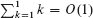
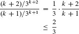

**A 求和**

当算法包含迭代控制结构（如`while`或`for`循环）时，你可以将其运行时间表示为循环体每次执行所花费的时间之和。例如，2.2 节论证了插入排序的第*i*次迭代在最坏情况下花费的时间与*i*成正比。将每次迭代花费的时间相加产生了求和（或级数）。评估这个求和得出了算法最坏情况运行时间为Θ(*n*²)的界限。这个例子说明了为什么你应该知道如何处理和界定求和。

A.1 节列出了涉及求和的几个基本公式。A.2 节提供了有关求和边界的有用技巧。A.1 节中的公式未经证明，但其中一些的证明出现在 A.2 节中，以说明该节的方法。你可以在任何微积分教材中找到其他大部分证明。

**A.1 求和公式和性质**

  给定一个数字序列`a[1]`，`a[2]`，…，`a[n]`，其中`n`是非负整数，有限和`a[1] + a[2] + … + a[n]`可以表示为。如果`n = 0`，求和的值被定义为 0。有限级数的值总是明确定义的，其项的加法顺序并不重要。不重要。

给定一个无限序列`a[1]`，`a[2]`，…，我们可以将它们的无限和`a[1] + a[2] + …`写为，这意味着。如果极限不存在，级数***发散***，否则***收敛***。一个收敛级数的项并不总是可以以任意顺序相加。然而，你可以重新排列***绝对收敛级数***的项，即一个级数对于这个级数也收敛。  

**线性性**

对于任意实数`c`和任意有限序列`a[1]`，`a[2]`，…，`a[n]`和`b[1]`，`b[2]`，…，`b[n]`，

线性性质也适用于无限收敛级数。

线性性质适用于包含渐近符号的求和。例如，

在这个方程中，左侧的`Θ`-符号适用于变量`k`，但右侧的`Θ`-符号适用于`n`。这种操作也适用于无限收敛级数。

**等差数列**

求和  输出：`求和`

是一个`等差数列`，其值为

一个包含加法常数`a ≥ 0`和每项中的常数系数`b > 0`的***一般等差数列***，但总体上是相同的：

``

**平方和和立方和**

以下公式适用于平方和和立方和的求和：

  

**等比数列**

对于实数`x` ≠ 1，求和

是一个`等比数列`，其值为

当求和是无限的且|x| < 1 时，无限递减几何级数发生：

``

如果我们假设 `0⁰ = 1`，这些公式即使在`x = 0` 时也适用。

**调和级数**

对于正整数`n`，第`n`个***调和数***是

不等式`(A.20)`和`(A.21)`在第 1150 页提供了更强的界限

**级数的积分和微分**

对上述公式进行积分或微分会得到额外的公式。例如，对无限等比数`(A.7)`的两边进行微分并乘以`x`得到

**望远镜级数**

对于任意序列`a[0]`，`a[1]`，…，`a[n]`，

因为每个项 `a[1]`, `a[2]`, … , `a[n−1]` 恰好被加入一次并被减去一次。我们称这个求和为***telescopes***。同样地，

  

作为一个展开求和的例子，考虑级数

将每个项重写为

  

得到  

**重新索引求和**

有时可以通过改变其索引来简化一个级数，通常是颠倒求和的顺序。考虑级数 `∑_{j=0}^{n} a[j]`。因为这个求和中的项是 `a[n]`, `a[n-1]`, … , `a[0]`，我们可以通过令 `j = n - k` 来颠倒索引的顺序，并将这个求和重写为 

一般来说，如果求和的索引在求和体中带有负号，值得考虑重新索引。

举个例子，考虑求和  输出：  举个例子，考虑求和

索引 `k` 在 `1/(n - k + 1)` 中带有负号。事实上，我们可以简化这个求和，这次设置 `j` = `n - k + 1`，得到

这正是调和级数(`A.8`)。

**乘积**

有限乘积 `a[1]*a[2] … a[n]` 可以表示为

如果 `n` = 0，乘积的值被定义为 1。你可以通过使用恒等式将带有乘积的公式转换为带有求和的公式

**练习**

***`A.1-1`***  

通过使用求和的线性性质证明 `∑_(i=1)^(n) a_i + ∑_(i=1)^(n) b_i = ∑_(i=1)^(n) (a_i + b_i)`。

***A.1-2***

找到一个简单的公式来表示 `...`。

***`A.1-3`***

根据方程(`A.6`)，解释十进制数 111,111,111。

***A.1-4***  

求解无穷级数 ``。

***A.1-5***

让 `c ≥ 0` 为常数。证明 。

`***A.1-6***`

展示当 `|x| < 1` 时 。

`A.1-7`

证明 ``。（*提示：分别展示渐近上界和下界。）

★ ***A.1-8***

通过操作调和级数，展示 。

★ ***A.1-9***

展示 ``。

★ ***A.1-10***

求解求和 ``。  

★ ***`A.1-11`***

求解乘积 `art`。

**A.2 界定求和**

你可以选择几种技术来界定描述算法运行时间的求和。以下是一些最常用的方法。

**数学归纳法**

评估一个级数的最基本方法是使用数学归纳法。举个例子，让我们证明等差级数 `` 的值为 `n(n + 1)/2`。对于 `n` = 1，我们有 `n(n + 1)/2 = 1 · 2/2 = 1`，等于 ``。根据归纳假设，它对于 `n` 成立，我们证明它对于 `n` + 1 也成立。我们有

你并不总是需要猜测求和的确切值才能使用数学归纳法。相反，你可以使用归纳法证明求和的上界或下界。举个例子，让我们证明渐近上界 `Σi (i²)`。更具体地，我们将证明对于某个常数 *c*，有 `Σi (i²) ≤ c * n³`。对于初始条件 *n* = 0，只要 *c* ≥ 1，我们有 `Σi (i²) ≤ c * 0³`。假设该界对于 *n* 成立，我们证明它对于 *n* + 1 也成立。我们有  

只要 `(1/3 + 1/c)` ≤ 1 或者等价地，*c* ≥ 3/2。因此，我们有 ，正如我们所希望的那样。

在使用渐`*`符号证明界时，需要小心。考虑以下关于  的错误证明。显然，。假设该界对于 `n` 成立，我们现在证明它对于 `n` + 1：

论证中的错误在于“大 O 符号”隐藏的“常数”随着`n`的增长而增长，因此并非恒定。我们没有证明同一个常数适用于*所有 n*。

**`限制项`**

有时你可以通过限制级数的每一项来获得一个很好的上界，通常使用最大项来限制其他项就足够了。例如，对算术级数(`A.1`)的一个快速上界是

一般来说，对于一个级数``，如果我们让`a[max] = max {a[k] : 1 ≤ k ≤ n}`，那么

当级数实际上可以受到几何级数的限制时，通过将级数中的每一项限制为最大项的方法是一种弱方法。给定级数``，假设对于所有*k* ≥ 0，`a[k+1]/a[k] ≤ r`，其中 0 < *r* < 1 是一个常数。你可以通过一个无限递减的几何级数来限制求和，因为`a[k] ≤ a[0]*r^k`，因此 

你可以应用这种方法来限制求和`∑`。为了从`k = 0`开始求和，将其重写为`∑_(k=0)^n`。第一项(`a[0]`)是 1/3，连续项的比值(`r`)是  

对于所有`k` ≥ 0。因此，我们有

``  

在应用这种方法时的一个常见错误是显示连续项的比值小于 1，然后假设求和受到几何级数的限制。一个例子是无限调和级数，它发散，因为

这个级数的(`k`+1)项和`k`项的比值是`k/(k+1)` < 1，但这个级数不受递减几何级数的限制。要通过几何级数限制一个级数，你需要证明存在一个小于 1 的`r`，即一个*常数*，使得所有连续项的比值永远不超过`r`。在调和级数中，不存在这样的`r`，因为比值会无限接近 1。

**`分割求和`**

获得一个困难求和的界限的一种方法是将级数表示为两个或更多级数的和，通过划分索引范围然后限制每个结果级数。例如，让我们找到算术级数``的一个下界，我们已经知道它有一个上界为*n*²。你可能尝试将求和中的每一项限制为最小项，但由于该项为 1，你将得到一个远低于*n*²的求和下界。

通过首先分割求和，你可以获得更好的下界。为了方便起见，假设`n`是偶数，这样

这是一个渐近紧密的界限，因为。

对于由算法分析产生的求和，有时你可以将求和`...`分割并忽略初始项的常数数量。通常，当求和中的每一项`a[k]`与`n`无关时，这种技术适用。然后对于任意常数`k`[0] > 0，你可以写成

由于求和的初始项都是常数且数量是恒定的。然后你可以使用其他方法来限制``。这种技术也适用于无限求和。例如，让我们找到``的渐近上界。连续项的比值是 

``

如果`k ≥ 3`。因此，你可以将求和分成

分割求和的技术可以帮助确定更困难情况下的渐近界限。例如，以下是一种在调和级数(`A.9`)上获得*`O`(lg *n`*)*界限的方法：  

思路是将范围 1 到`n`分成⌊lg *n*⌋ + 1 个部分，并通过 1 来上界每个部分的贡献。对于*i* = 0, 1, … , ⌊lg *n*⌋，第*i*个部分包括从 1/2^(*i*)开始直到但不包括 1/2^(*i*+1)的项。最后一个部分可能包含原始调和级数中不存在的项，得到

  

**通过积分进行近似**

当一个求和的形式为``，其中`f(k)`是一个单调递增函数时，你可以通过积分来近似它：

``

图 A.1 证明了这种近似的有效性。图中的矩形区域表示了求和的值，而积分则是曲线下的蓝色区域。当`f(k)`是一个单调递减函数时，你可以使用类似的方法来提供上下界。

积分近似(`A.19`)可以用来证明不等式(`A.10`)对第*n*个调和数的紧密界限。下界为  

对于上界，积分近似给出

**练习**

`A.2-1`

证明``被一个常数上界所限制。

***`A.2-2`***

找到求和的渐近上界

  

**图 A.1** 通过积分来近似``。每个矩形的面积显示在矩形内部，总矩形面积代表了求和的值。积分由曲线下的蓝色区域表示。在**(a)**中比较面积给出了下界``。将矩形向右移动一个单位得到了**(b)**中的上界``。  

***A.2-3***

通过分解求和来证明第`n`个调和数为Ω(lg *n*)。

**A.2-4**

用积分近似`艺术`。

`A.2-5`

为什么不能直接在``上使用积分近似(A.19)来得到第*n*个调和数的上界？

**问题**

`A-1` 求和的界限

对以下求和给出渐近紧密的界限。假设`r ≥ 0` 和`s ≥ 0` 是常数。

***a.*** ``

***b.*** 

***c.*** ``

**附录注释**

Knuth [259] 在这里提供了一个很好的参考资料。你可以在任何一本好的微积分书中找到关于级数的基本性质，比如 Apostol [19] 或 Thomas 等人 [433]。
