**`B` 集合等**  

本书的许多章节涉及离散数学的要素。本附录回顾了集合、关系、函数、图和树的符号、定义和基本性质。如果您已经熟悉这些材料，您可能只需浏览本章。

**B.1 集合**

一个***集合***是一组可区分的对象，称为其***成员***或***元素***。如果对象 `x` 是集合 `S` 的成员，我们写作 `x ∈ S`（读作“`x` 是 `S` 的成员”或更简洁地说“`x` 属于 `S`”）。如果 `x` 不是 `S` 的成员，我们写作 `x ∉ S`。要明确描述一个集合，将其成员写成大括号内的列表。例如，要定义一个包含数字 1、2 和 3 的集合 `S`，写作 `S = {1, 2, 3}`。由于 2 属于集合 `S`，我们可以写作 `2 ∈ S`，而由于 4 不是成员，我们可以写作 `4 ∉ S`。一个集合不能包含相同的对象超过一次，¹ 并且其元素没有顺序。两个集合 `A` 和 `B` 是***相等***的，写作 `A = B`，如果它们包含相同的元素。例如，`{1, 2, 3, 1}` = `{1, 2, 3}` = `{3, 2, 1}`。  

我们采用特殊符号表示经常遇到的集合：

+   Ø 表示***空集***，即不包含任何成员的集合。

+   ℤ 表示`整数集`，即集合{… −2, −1, 0, 1, 2,…}。

+   ℝ 表示***实数集***。

+   ℕ 表示`自然数集`，即集合{0, 1, 2,…}。²

如果集合 `A` 的所有元素都包含在集合 `B` 中，即 `x ∈ A` 意味着 `x ∈ B`，那么我们写作 `A ⊆ B` 并说 `A` 是 `B` 的***子集***。如果集合 `A` 是集合 `B` 的***真子集***，写作 `A ⊂ B`，如果 `A ⊆ B` 但 `A ≠ B`。（一些作者使用符号“⊂”来表示普通的子集关系，而不是真子集关系。）每个集合都是其自身的子集：对于任何集合 `A`，都有 `A ⊆ A`。对于两个集合 `A` 和 `B`，当且仅当 `A ⊆ B` 且 `B ⊆ A` 时，我们有 `A = B`。子集关系是传递的（见第 1159 页）：对于任意三个集合 `A`、`B` 和 `C`，如果 `A ⊆ B` 且 `B ⊆ C`，那么 `A ⊆ C`。真子集关系也是传递的。空集是所有集合的子集：对于任何集合 `A`，我们有 `Ø ⊆ A`。

集合可以根据其他集合来指定。给定一个集合 `A`，可以通过陈述区分 `B` 的元素的属性来定义一个 `B ⊆ A` 的集合。例如，定义偶数集合的一种方式是`{x：x ∈ ℤ 且 x/2 是整数}`。这种表示法中的冒号读作“这样”。（一些作者在冒号的位置使用竖线。）

给定两个集合 `A` 和 `B`，***集合运算***定义了新的集合：

+   集合 `A` 和 `B` 的***交集***是集合

    `A` ∩ `B` = {x：x ∈ `A` 且 x ∈ `B`}。

+   集合 `A` 和 `B` 的***并集***是集合

    `A ∪ B = {x : x ∈ A 或 x ∈ B}`。

+   两个集合 `A` 和 `B` 的***差集***是集合

    `A` − `B` = {`x`：`x` ∈ `A` 且 `x` ∉ `B`}。

集合运算遵循以下规律：

**`空集律`：**

| `A ∩ Ø` | = | Ø, |
| --- | --- | --- |
| ` | --- | --- | --- | ` |
| ` | A ∪ Ø | = | A. | ` |

**幂等律：**

| `A` ∩ `A` | = | `A`, |   |
| --- | --- | --- |
| `A ∪ A` | = | `A.` |   |

**交换律：**

| `A ∩ B` | = | `B ∩ A`, |   |
| --- | --- | --- |
| `A` ∪ `B` | = | `B` ∪ `A`. |

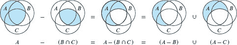  

**图 B.1** 用维恩图说明了德摩根定律的第一个定律（B.2）。每个集合 `A`、`B` 和 `C` 都表示为一个圆。

**结合律：**

| `A` ∩ (`B` ∩ `C`) | = | (`A` ∩ `B`) ∩ `C`, |
| --- | --- | --- |
| `A` ∪ (`B` ∪ `C`) | = | (`A` ∪ `B`) ∪ `C.` |

**分配律：**

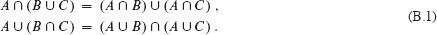

**吸收律：**

| `A` ∩ (`A` ∪ `B`) | = | `A`, |
| --- | --- | --- |
| `A ∪ (A ∩ B)` | = | `A.` |

**`德摩根定律：`**

``

图 B.1 用`***维恩图***`说明了德摩根定律的第一个定律：一个将集合表示为平面区域的图形图。

通常，所有考虑的集合都是某个称为`宇宙`的更大集合的子集。例如，当考虑仅由整数组成的各种集合时，整数集ℤ是一个合适的宇宙。给定一个宇宙*U*，我们将集合*A*的`补集`定义为*Ā* = *U* − *A* = {*x* : *x* ∈ *U*且*x* ∉ *A*}。对于任何*A* ⊆ *U*的集合，我们有以下定律：

| 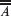 | = | `A`, |
| --- | --- | --- |
| `A ∩ Ā` | = | Ø, |
| ` | A ∪ Ā | = | U*. | ` |

表达德摩根定律（B.2）的一个等价方式使用集合的补集。对于任意两个集合`B, C` ⊆ `U`，我们有

| `B` ∩ `C` | = | `B` ∪ `C`, |   |
| --- | --- | --- |
| `B ∪ C` | = | `B ∩ C`. |

两个集合`A`和`B`是***不相交***的，即如果`A` ∩ `B` = Ø，则它们没有共同元素。一组集合`S`[1]，`S`[2]，…，无论是有限的还是无限的，都是一组集合的集合，其中每个成员都是一个集合`S[i]`。如果`S` = {`S[i]`}是一组非空集合，则当 

+   这些集合是`两两不相交`的，即`S[i]`，`S[j]` ∈ S 且`i` ≠ `j`意味着`S[i] ∩ S[j] = Ø`，

+   它们的并集是`S`，即

    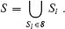

换句话说，如果每个`S`的元素都只出现在`S[i]` ∈ `S` 中的一个集合中，则`S`形成`S`的一个分区。

一个集合中的元素数量称为集合的***基数***（或***大小***），表示为|`S`|。如果两个集合的元素可以一一对应，则它们具有相同的基数。空集的基数是|Ø| = 0。如果集合的基数是自然数，则集合是***有限的***，否则是***无限的***。一个可以与自然数ℕ一一对应的无限集被称为***可数无限的***，否则是***不可数的***。例如，整数集ℤ是可数的，但实数集ℝ是不可数的。

对于任意两个有限集合`A`和`B`，我们有等式  

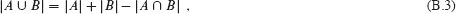  

由此我们可以得出结论

|`A` ∪ `B`| ≤ |`A`| + |`B`|.

如果`A`和`B`是不相交的，则|`A` ∩ `B`| = 0，因此|`A` ∪ `B`| = |`A`| + |`B`|。如果`A` ⊆ `B`，则|`A`| ≤ |`B`|。

一个有`n`个元素的有限集有时被称为***n-集***。一个 1-集被称为***单例集***。一个集合的`k`个元素的子集有时被称为***k-子集***。

我们用 `2^(S)` 表示一个集合 *S* 的所有子集，包括空集和 *S* 本身，称为 *S* 的***幂集***。例如，`2^({a,b}) = {Ø, {a}, {b}, {a, b}}`。有限集合 *S* 的幂集的基数为 `2^(|S|)`（见练习 B.1-5）。

有时我们关心元素有序的类似集合。两个元素`a`和`b`的***有序对***表示为(`a`, `b`)，并且正式定义为集合(`a`, `b`) = {`a`, {`a`, `b`}}。因此，有序对(`a`, `b`)与有序对(`b`, `a`)不同。

两个集合`A`和`B`的***笛卡尔积***，表示为`A` × `B`，是所有有序对的集合，使得对的第一个元素是`A`的元素，第二个元素是`B`的元素。更正式地说，

*A* × *B* = {(*a*, *b*) : `a ∈ A` and `b ∈ B`}.  

例如，{*a, b*}×{*a, b, c*} = {(*a*, *a*), (*a, b*), (*a, c*), (*b, a*), (*b, b*), (*b, c*)}。当*A*和*B*是有限集合时，它们的笛卡尔积的基数是

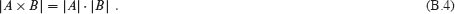

*n*个集合`A[1]`，`A[2]`，…，`A[n]`的笛卡尔积是***n-元组***的集合

`A[1] × A[2] × … × A[n]` = {(`a[1]`, `a[2]`, … , `a[n]`) : `a[i]` ∈ `A[i]` for `i` = 1, 2, … , `n`},  

其基数为 `n`

`|A[1] × A[2] × … × A[n]|` = `|A[1]| · |A[n]| · |A[n]|`

如果所有集合`A[i]`都是有限的。我们用集合来表示单个集合`A`上的`n`重笛卡尔积

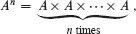  

如果`A`是有限的，则其基数为|`A^n`| = |`A`|*^n*。我们也可以将*n*-元组视为长度为*n*的有限序列（见第 1162 页）。

区间是实数的连续集合。我们用括号和/或方括号表示它们。给定实数`a`和`b`，***闭区间***`[a, b]`是集合{`x` ∈ ℝ：`a` ≤ `x` ≤ `b`}，包括`a`和`b`之间的所有实数（如果`a` > `b`，这个定义意味着`[a, b]` = Ø）。***开区间**`(`a`, `b`)` = {`x` ∈ ℝ：`a`< `x`< `b`}排除了集合中的两个端点。有两个***半开区间***`[a, b)` = {`x` ∈ ℝ：`a` ≤ `x`< `b`}和`(`a`, `b]` = {`x` ∈ ℝ：`a`< `x` ≤ `b`}，每个都排除一个端点。

区间也可以通过用`ℤ`替换这些定义中的`ℝ`来定义整数。区间是在实数或整数上定义的，通常可以从上下文中推断出来。

**练习**

输出：

绘制说明第一个分配律（`B.1`）的维恩图。

***B.1-2***

证明 DeMorgan 定律对任意有限集合的一般化：

| `A[1] ∩ A[2] ∩ … ∩ A[n]` | = | `A[1] ∪ A[2] ∪ … ∪ A[n]` |   |
| --- | --- | --- |
| `A[1] ∪ A[2] ∪ … ∪ A[n]` | = | `A[1] ∩ A[2] ∩ … ∩ A[n].` |

★ `B.1-3`

   证明方程（`B.3`）的一般化，这被称为***包含与排斥原理***：

| &#124;`A[1] ∪ A[2] ∪ … ∪ A[n]`&#124; = |
| --- |
| ` |  | `&#124;*A*[1]&#124; + &#124;*A*[2]&#124; + … + &#124;*A[n]*&#124;` |  | ` |
|  | `- | *A*[1] ∩ *A*[2] | ` `- | *A*[1] ∩ *A*[3] | ` - … | （所有对） |   |
|  | + ` | *A*[1] ∩ *A*[2] ∩ *A*[3] | ` + … | （所有三元组） |   |
|  | ⋮ |  |   |
|  | `(−1)^(n−1) | A[1] ∩ A[2] ∩ … ∩ A[n] | `. |  |  |

`B.1-4`

展示奇自然数集是可数的。

*B.1-5*

展示对于任意有限集合`S`，幂集 `2^(S)` 有 `2^(|S|)` 个元素（即，`S` 的子集有 `2^(|S|)` 个不同的子集）。

***B.1-6***

通过扩展有序对的集合论定义，为`n`-元组给出归纳定义。

**`B.2 关系`**

两个集合`A`和`B`上的***二元关系*** `R` 是集合`A`×`B`的子集。如果`(a, b)` ∈ `R`，我们有时写作`a R b`。当我们说`R`是集合`A`上的二元关系时，我们指的是`R`是`A` × `A`的子集。例如，自然数上的“小于”关系是集合{`(a, b)`：`a, b` ∈ ℕ且`a` < `b`}。对于��合`A[1]`，`A[2]`，…，`A[n]`的`n`元关系是集合`A[1]` × `A[2]` × … × `A[n]`的子集。

二元关系 `R` ⊆ `A × A` 如果是***自反的***，则

*a R a*

对于所有`a` ∈ `A`。例如，“=”和“≤”是自然数上的自反关系，但“<”不是。关系`R`是***对称的***，如果

`a R b` 意味着 `b R a`

对于所有`a, b` ∈ `A`。例如，“=”是对称的，但“<”和“≤”不是。关系`R`是***传递的***，如果

`a R b` 和 `b R c` 意味着 `a R c`

对于所有`a, b, c` ∈ *A*。例如，“<”，“≤”和“=”是传递的，但关系`R = {(a, b)：a, b ∈ ℕ且 a = b - 1}`不是，因为 3 *R* 4 和 4 *R* 5 并不意味着 3 *R* 5。  

一个自反、对称和传递的关系是一个***等价关系***。例如，“=”是自然数上的等价关系，但“<”不是。如果`R`是集合`A`上的等价关系，那么对于`a` ∈ `A`，`a`的***等价类***是集合[`a`] = {`b` ∈ `A`：`a R b`}，即所有等价于`a`的元素的集合。例如，如果我们定义`R` = {(`a`, `b`)：`a, b` ∈ ℕ且`a` + `b`是偶数}，那么`R`是一个等价关系，因为`a` + `a`是偶数（自反），`a` + `b`是偶数意味着`b` + `a`是偶数（对称），`a` + `b`是偶数且`b` + `c`是偶数意味着`a` + `c`是偶数（传递）。4 的等价类是[4] = {0, 2, 4, 6,…}，3 的等价类是[3] = {1, 3, 5, 7,…}。等价类的一个基本定理如下。

***定理 B.1（等价关系等同于划分）***

集合`A`上的任何等价关系`R`的等价类形成了`A`的一个划分，并且`A`的任何划分确定了一个等价关系`R`，其中划分中的集合是等价类。

***证明***   证明的第一部分，我们必须证明`R`的等价类是非空的、两两不相交的集合，它们的并集是`A`。因为`R`是自反的，`a` ∈ [`a`]，所以等价类是非空的。此外，因为每个元素`a` ∈ `A`属于等价类[`a`]，等价类的并集是`A`。剩下的是要证明等价类是两两不相交的，即如果两个等价类[`a`]和[`b`]有一个共同元素`c`，那么它们实际上是相同的集合。假设`a R c`和`b R c`。对称性给出`c R b`，通过传递性，`a R b`。因此，对于任意任意元素`x` ∈ [`a`]，我们有`x R a`，通过传递性，`x R b`，因此[`a`] ⊆ [`b`]。类似地，[`b`] ⊆ [`a`]，因此[`a`] = [`b`]。

证明的第二部分，令 A = {`A[i]`}为`A`的一个划分，并定义`R` = {(`a`, `b`)：存在`i`使得`a` ∈ `A[i]`且`b` ∈ `A[i]`}。我们声称`R`是`A`上的一个等价关系。自反性成立，因为`a` ∈ `A[i]`意味着`a R a`。对称性成立，因为如果`a R b`，那么`a`和`b`属于同一集合`A[i]`，因此`b R a`。如果`a R b`和`b R c`，那么所有三个元素都在同一集合`A[i]`中，因此`a R c`，传递性成立。要看到划分中的集合`A[i]`上`R`的等价类，观察如果`a` ∈ `A[i]`，那么`x` ∈ [`a`]意味着`x` ∈ `A[i]`，而`x` ∈ `A[i]`意味着`x` ∈ [`a`]。  

▪  

集合`A`上的二元关系`R`如果**反对称**，则为反对称关系。

`a R b`和`b R a`意味着`a` = `b`。

例如，自然数上的“`≤`”关系是反对称的，因为`a ≤ b`和`b ≤ a`意味着`a = b`。一个既是自反又是反对称和传递的关系是***偏序***，我们称定义了偏序的集合为***部分有序集***。例如，“是某人的后代”关系是所有人集合上的偏序（如果我们将个体视为自己的后代）。

在   在部分有序集合`*A*`中，可能没有单个“最大”元素`*a*`，使得对于所有`*b*` ∈ `*A*`，都有`*b R a*`。相反，集合可能包含几个***极大***元素`*a*`，使得对于没有`*b*` ∈ `*A*`，其中`*b* ≠ *a*`，都不满足`*a R b*`。例如，不同大小的盒子集合可能包含几个最大的盒子，这些盒子无法放入任何其他盒子中，但没有单个“最大”盒子可以容纳任何其他盒子。³

集合`A`上的关系`R`如果对于所有`a, b` ∈ `A`，我们有`a R b`或`b R a`（或两者都有），即`A`中的每对元素都由`R`相关联，则为***全关系***。既是偏序又是全关系的关系为***全序***或***线性序***。例如，“≤”关系是自然数上的全序，但“是某人的后代”关系不是所有人集合上的全序，因为有些个体彼此之间没有后代关系。一个传递的全关系，但不一定对称或反对称的关系为***全预序***。

**练习**

`B.2-1`

证明整数的所有子集上的子集关系“`⊆`”是一个偏序但不是全序。

***`B.2-2`***

证明对于任意正整数`n`，关系“模`n`等价”是整数上的等价关系。（我们说`a` = `b` (mod `n`)，如果存在整数`q`使得`a` − `b` = `qn`。）这个关系将整数划分为哪些等价类？

***B.2-3***

给出一些既是  输出：

***`a.`*** 自反和对称但不传递，

***b.*** 自反和传递但不对称，

***c.*** 对称和传递但不自反。

***B.2-4***

设`S`是一个有限集，`R`是`S × S`上的等价关系。证明如果此外`R`是反对称的，那么关于`R`的`S`的等价类是单元素集。

***B.2-5***

纳西索斯教授声称如果一个关系`R`是对称的和传递的，那么它也是自反的。他提供以下证明。根据对称性，`a R b`意味着`b R a`。因此，传递性意味着`a R a`。教授正确吗？

`B.3 函数`

给定两个集合`A`和`B`，一个***函数*** `f`是`A`和`B`上的二元关系，对于所有`a` ∈ `A`，存在唯一的`b` ∈ `B`使得(`a`, `b`) ∈ `f`。集合`A`称为`f`的***定义域***，集合`B`称为`f`的***陪域***。我们有时写`f` : `A` → `B`，如果(`a`, `b`) ∈ `f`，我们写`b` = `f` (`a`)，因为选择`a`唯一确定`b`。

直观地说，函数`f`为每个*A*的元素分配一个*B*的元素。没有*A*的元素被分配两个不同的*B*的元素，但是同一个*B*的元素可以被分配给两个不同的*A*的元素。例如，二元关系

`f = {(a, b) : a, b ∈ ℕ and b = a mod 2}`

是一个函数`f` : → {0, 1}，因为对于每个自然数*a*，存在一个值*b*在{0, 1}中，使得*b* = *a* mod 2。例如，0 = `f` (0), 1 = `f` (1), 0 = `f` (2), 1 = `f` (3)，等等。相比之下，二元关系

`g` = `{(a, b) : a, b ∈ ℕ and a + b is even}`

不是一个函数，因为(1, 3)和(1, 5)都在`g`中，因此对于选择`a` = 1，没有确切的一个`b`使得(a, b) ∈ g。

给定一个函数`f : A → B`，如果`b = f(a)`，我们说`a`是`f`的***自变量***，`b`是`f`在`a`处的***值***。我们可以通过为其定义域中的每个元素陈述其值来定义一个函数。例如，我们可以定义`f(n) = 2n`，其中`n ∈ ℕ`，这意味着`f = {(n, 2n) : n ∈ ℕ}`。如果两个函数`f`和`g`相等，那么它们具有相同的定义域和值域，并且对于定义域中的所有`a`，`f(a) = g(a)`。

长度为`n`的***有限序列***是一个函数`f`，其定义域是{n}中的`n`个整数{0, 1, … , *n* − 1}。我们通常通过在尖括号中列出其值来表示有限序列：〈`f` (0), `f` (1), … , `f` (*n*−1)〉。一个***无限序列***是一个函数，其定义域是自然数集ℕ。例如，由递推式(3.31)定义的斐波那契序列是无限序列〈0, 1, 1, 2, 3, 5, 8, 13, 21,…〉。  

当函数`f`的定义域是一个笛卡尔积时，我们经常省略围绕`f`的参数的额外括号。例如，如果我们有一个函数`f` : `A[1] × A[2] × … A[n] → B`，我们写`b = f (a[1], a[2], … a[n])`而不是写`b = f ((a[1], a[2], … a[n]))`。我们也称每个`a[i]`为函数`f`的***自变量***，尽管严格来说`f`只有一个自变量，即*n*-元组(`a[1], a[2], … a[n]`)。

如果`f : A → B`是一个函数，`b = f(a)`，那么我们有时说`b`是`a`在`f`下的***象***。在`f`下集合`A'`的象由以下定义

`f(A′) = {b ∈ B : b = f(a) for some a ∈ A′}`.

*f*的`值域`是其定义域的像，即*f* (*A*)。例如，函数*f* : ℕ → ℕ定义为*f* (*n*) = 2*n*的值域是*f*(ℕ) = {`m` : `m` = 2*n*，其中*n* ∈ ℕ}，换句话说，非负偶数的集合。  

如果一个函数是`满射`，那么它的值域就是它的余域。例如，函数`f(n) = ⌊n/2⌋`是从自然数到自然数的满射函数，因为自然数中的每个元素都会作为`f`的某个参数的值出现。相比之下，函数`f(n) = 2n`不是从自然数到自然数的满射函数，因为没有任何参数可以产生任何奇数自然数作为值。然而，函数`f(n) = 2n`是从自然数到偶数的满射函数。一个从`A`到`B`的满射`f`有时被描述为将`A` **映射到** `B`。当我们说`f`是映射到时，我们的意思是它是满射的。

如果`f`：`A` → `B`是一个***单射***，那么`f`的不同参数产生不同的值，也就是说，如果`a` ≠ `a′`，则`f(a)` ≠ `f(a′)`。例如，函数`f(n) = 2n`是从自然数到自然数的单射函数，因为每个偶数`b`最多是域中一个元素的图像，即`b/2`。函数`f(n) = ⌊n/2⌋`不是单射的，因为值 1 由两个参数产生：`f(2) = 1` 和`f(3) = 1`。单射有时被称为***一一***函数。

函数`f`：`A` → `B`是一个***双射***，如果它是单射和满射的。例如，函数`f(n) = (-1)^n⌈n/2⌉`是从自然数到整数的双射：

| ` | 0 | → | 0, | ` |
| --- | --- | --- | --- | --- |
| ` | --- | --- | --- | ` |
| `1` | → | `-1`, |
| `2` | → | `1`, |
| ` | 3 | → | −2, | ` |
| 4 | → | 2, |
|  | ⋮ |  |

该函数是单射的，因为`ℤ`中的任何元素都不是自然数的多个元素的图像。它是满射的，因为`ℤ`中的每个元素都会作为某个自然数的图像出现。因此，该函数是双射的。双射有时被称为***一一对应***，因为它将定义域和余域中的元素配对。从集合`A`到自身的双射有时被称为***置换***。

当一个函数`f`是双射时，我们将其***逆*** `f⁽⁻¹⁾`定义为

`f^(-1)(b) = a`当且仅当`f(a) = b`。  

例如，函数`f(n) = (-1)^n⌈n/2⌉`的逆函数是

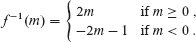

**练习**  

***B.3-1***

设`A`和`B`是有限集，`f`：`A` → `B`是一个函数。证明以下结论：

***a.*** 如果`f`是单射的，那么|`A`| ≤ |`B`|。

***b.*** 如果`f`是满射的，那么|`A`| ≥ |`B`|。

`B.3-2`  

当定义域和余域是集合`ℕ`时，函数`f(x) = x + 1` 是双射的吗？当定义域和余域是集合`ℤ`时，它是双射的吗？

***`B.3-3`***

给出一个关于二元关系的逆的自然定义，使得如果一个关系实际上是一个双射函数，那么它的关系逆就是它的函数逆。

★ `B.3-4`

给出一个从整数到整数×整数的双射。

**`B.4 图`**  

本节介绍了两种图：有向图和无向图。文献中的某些定义与此处给出的定义有所不同，但大部分差异很小。第 20.1 节展示了如何在计算机内存中表示图形。

一个`有向图`（或`有向图`）`G`是一个二元组（`V`，`E`），其中`V`是一个有限集，`E`是`V`上的二元关系。集合`V`被称为`G`的***顶点集***，其元素被称为***顶点***（单数：***顶点***）。集合`E`被称为`G`的***边集***，其元素被称为***边***。图 B.2(a)是在顶点集{1, 2, 3, 4, 5, 6}上的有向图的图示表示。图中的圆表示顶点，箭头表示边。***自环***—从一个顶点到自身的边是可能的。  

在一个`无向图` *G* = (`V`, *E*) 中，边集 *E* 由顶点的`无序`对组成，而不是有序对。也就是说，一条边是一个集合{*u, v*}，其中 *u, v* ∈ `V` 且 *u* ≠ *v*。按照惯例，我们使用符号(*u*, *v*)表示一条边，而不是集合符号{*u, v*}，并且我们认为(*u*, *v*) 和 (*v*, *u*) 是相同的边。在无向图中，自环是被禁止的，因此每条边由两个不同的顶点组成。图 B.2(b)展示了一个顶点集合为{1, 2, 3, 4, 5, 6}的无向图。

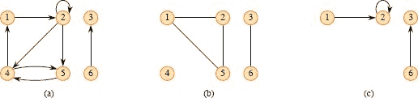  

**图 B.2** 有向图和无向图。**(a)** 一个有向图 `G = (V, E)`，其中 `V = {1, 2, 3, 4, 5, 6}`，`E = {(1, 2), (2, 2), (2, 4), (2, 5), (4, 1), (4, 5), (5, 4), (6, 3)}`。边 `(2, 2)` 是一个自环。**(b)** 一个无向图 `G = (V, E)`，其中 `V = {1, 2, 3, 4, 5, 6}`，`E = {(1, 2), (1, 5), (2, 5), (3, 6)}`。顶点 4 是孤立的。**(c)** 由顶点集合`{1, 2, 3, 6}`诱导的图的子图。

许多有向图和无向图的定义是相同的，尽管在两种情境下某些术语的含义略有不同。如果在有向图 `G = (V, E)` 中`(u, v)`是一条边，我们说`(u, v)` ***从*** 顶点 `u` ***出发*** 或 ***离开***，并且 ***进入*** 顶点 `v`。例如，在图 B.2(a)中，离开顶点 2 的边是 `(2, 2)`, `(2, 4)`, 和 `(2, 5)`。进入顶点 2 的边是 `(1, 2)` 和 `(2, 2)`。如果在无向图 `G = (V, E)` 中`(u, v)`是一条边，我们说`(u, v)` ***关联*** 于顶点 `u` 和 `v`。在图 B.2(b)中，关联于顶点 2 的边是 `(1, 2)` 和 `(2, 5)`。

如果在图 `G = (V, E)` 中`(u, v)`是一条边，我们说顶点`v` ***相邻*** 于顶点`u`。当图是无向的时，相邻关系是对称的。当图是有向的时，相邻关系不一定是对称的。如果在有向图中`v`是`u`的邻接点，我们可以写成`u → v`。在图 B.2 的(a)和(b)部分中，顶点 2 是顶点 1 的邻接点，因为边 (1, 2) 属于两个图。在图 B.2(a)中，顶点 1 *不* 是顶点 2 的邻接点，因为边 (2, 1) 不存在。  

在无向图中，顶点的`度`是与之关联的边的数量。例如，在图 B.2(b)中，顶点 2 的度为 2。一个度为 0 的顶点，比如图 B.2(b)中的顶点 4，是`孤立`的。在有向图中，顶点的`出度`是离开它的边的数量，顶点的`入度`是进入它的边的数量。顶点在有向图中的`度`是它的入度加上出度。在图 B.2(a)中，顶点 2 的入度为 2，出度为 3，度为 5。

从图`G = (V, E)`中的顶点`u`到顶点`u'`的***长度***为`k`的***路径***是一个顶点序列〈`v[0]`, `v[1]`, `v[2]`, … , `v[k]`〉，使得`u` = `v[0]`，`u'` = `v[k]`，且(`v[i-1]`, `v[i]`) ∈ `E`对于`i` = 1, 2, … , `k`。路径的长度是路径中边的数量，比路径中顶点的数量少 1。路径***包含***顶点`v[0]`, `v[1]`, … , `v[k]`和边(`v[0]`, `v[1]`)，(`v[1]`, `v[2]`)，… , (`v[k-1]`, `v[k]`)。从`u`到`u'`存在路径`p`时，我们说`u'`可以通过`p`从`u`到达，可以写为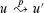。如果路径中的所有顶点都是不同的，则路径是***简单***的⁴。在图 B.2(a)中，路径〈1, 2, 5, 4〉是长度为 3 的简单路径。路径〈2, 5, 4, 5〉不是简单的。路径`p` = 〈`v[0]`, `v[1]`, … , `v[k]`〉的***子路径***是其顶点的连续子序列。也就是说，对于任意 0 ≤ `i` ≤ `j` ≤ `k`，顶点子序列〈`v[i]`, `v[i+1]`, … , `v[j]`〉是路径`p`的子路径。

在有向图中，路径〈`v[0]`, `v[1]`, … , `v[k]`〉形成一个***循环***，如果`v[0] = v[k]`且路径至少包含一条边。如果此外`v[1]`, `v[2]`, … , `v[k]`是不同的，则循环是***简单***的。由`k`个顶点组成的循环的***长度***为`k`。自环是长度为 1 的循环。两条路径〈`v[0]`, `v[1]`, `v[2]`, … , `v[k-1]`, `v[0]`〉和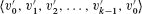形成相同的循环，如果存在整数`j`使得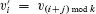对于`i` = 0, 1, … , `k`−1。在图 B.2(a)中，路径〈1,2,4,1〉与路径〈2, 4, 1, 2〉和〈4, 1, 2, 4〉形成相同的循环。这个循环是简单的，但循环〈1, 2, 4, 5, 4, 1〉不是。由边(2, 2)形成的循环〈2, 2〉是自环。没有自环的有向图是***简单***的。在无向图中，路径〈`v[0]`, `v[1]`, …, `v[k]`〉形成一个***循环***，如果`k` > 0，`v[0] = v[k]`，并且路径上的所有边都是不同的。如果`v[1]`, `v[2]`, … , `v[k]`是不同的，则循环是***简单***的。例如，在图 B.2(b)中，路径〈1, 2, 5, 1〉是一个简单循环。没有简单循环的图是***无环***的。

一个无向图是`连通`的，如果每个顶点都可以从其他所有顶点到达。无向图的`连通分量`是在“可从”关系下的顶点等价类。在图 B.2(b)中展示的图有三个连通分量：{1, 2, 5}，{3, 6}和{4}。在连通分量{1, 2, 5}中的每个顶点都可以从{1, 2, 5}中的任何其他顶点到达。一个无向图只有一个连通分量时才是连通的。连通分量的边是仅与该分量中的顶点相关的边。换句话说，边(`u`, `v`)只有当`u`和`v`都是该分量中的顶点时才是该分量的边。

一个有向图是`强连通`的，如果每两个顶点都可以互相到达。有向图的`强连通分量`是在“互相可达”关系下的顶点等价类。一个有向图只有一个强连通分量时才是强连通的。图 B.2(a)中的图有三个强连通分量：{1, 2, 4, 5}，{3}和{6}。在{1, 2, 4, 5}中的所有顶点都是互相可达的。顶点{3, 6}不构成一个强连通分量，因为顶点 6 无法从顶点 3 到达。

如果存在一个双射`f : V → V′`，使得当且仅当(u, v) ∈ E 时`(f(u), f(v)) ∈ E'`，则两个图`G = (V, E)`和`G' = (V', E')`是***同构***的。换句话说，如果`G`的顶点可以重新标记为`G'`的顶点，保持`G`和`G'`中对应的边，则`G`和`G'`是同构的。 图 B.3(a)展示了一对同构图`G`和`G'`，它们的顶点集分别为`V = {1, 2, 3, 4, 5, 6}`和`V' = {u, v, w, x, y, z}`。从`V`到`V'`的映射由`f(1) = u, f(2) = v, f(3) = w, f(4) = x, f(5) = y, f(6) = z`给出所需的双射函数。 图 B.3(b)中的两个图不是同构的。尽管两个图都有 5 个顶点和 7 条边，但顶部图有一个度为 4 的顶点，而底部图没有。

我们说图`G' = (V', E')`是图`G = (V, E)`的一个***子图***，如果`V' ⊆ V`且`E' ⊆ E`。给定一个集合`V' ⊆ V`，由`V'`诱导的`G`的子图是图`G' = (V', E')`，其中

`E' = {(u, v) ∈ E : u, v ∈ V'}`。

在图 `B.2(a)` 中由顶点集{1, 2, 3, 6}诱导的子图出现在图 `B.2(c)` 中，并且具有边集`{(1, 2), (2, 2), (6, 3)}`。

给定一个无向图`G = (V, E)`, *G*的***有向版本***是有向图`G′ = (V, E′)`, 其中当且仅当(*u*, *v*) ∈ *E*时(*u*, *v*) ∈ *E′*。也就是说，*G*中的每条无向边(*u*, *v*)在有向版本中变成两条有向边(*u*, *v*)和(*v*, *u*)。给定一个有向图`G = (V, E)`, *G*的***无向版本***是无向图`G′ = (V, E′)`, 其中当且仅当*u* ≠ *v*且*E*至少包含边(*u*, *v*)和(*v*, *u*)中的一条时(*u*, *v*) ∈ *E′*。也就是说，无向版本包含了*G*中的边“去除方向”并消除自环。 (由于在无向图中(*u*, *v*)和(*v*, *u*)是同一条边，有向图的无向版本只包含一次，即使有向图包含边(*u*, *v*)和(*v*, *u*)两条。) 在有向图`G = (V, E)`中，顶点*u*的一个***邻居***是在*G*的无向版本中与*u*相邻的任意顶点。也就是说，如果*u* ≠ *v*且(*u*, *v*) ∈ *E*或(*v*, *u*) ∈ *E*，则*v*是*u*的邻居。在无向图中，如果两个顶点*u*和*v*相邻，则它们是邻居。

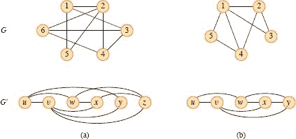

**图 B.3 (a)** 一对同构图。顶部图的顶点通过`f(1) = u, f(2) = v, f(3) = w, f(4) = x, f(5) = y, f(6) = z`映射到底部图的顶点。 **(b)** 两个不同构的图。顶部图有一个度为 4 的顶点，底部图没有。

几种图有特殊的名称。一个`***完全图***`是一个无向图，其中每对顶点都是相邻的。一个无向图`G = (V, E)`是`***二分图***`，如果`V`可以被划分为两个集合`V[1]`和`V[2]`，使得`(u, v)` ∈ `E`意味着`u ∈ V[1]`且`v ∈ V[2]`或`u ∈ V[2]`且`v ∈ V[1]`。也就是说，所有的边都在`V[1]`和`V[2]`之间。一个无环的无向图是一个`***森林***`，一个连通的无环的无向图是一个`***(自由)树***` (参见第 B.5 节)。我们经常取“有向无环图”的首字母，并称这样的图为`***dag***`。

你可能偶尔会遇到两种变体的图。一个***多重图***类似于无向图，但它可以在顶点之间有多条边（例如两条不同的边(`u`, `v`)和(`u`, `v`)）和自环。一个***超图***类似于无向图，但每个***超边***连接的是顶点的任意子集。许多为普通有向和无向图编写的算法可以适应在这些类似图结构上运行。

通过边 `e = (u, v)` 对无向图 `G = (V, E)` 进行***收缩***，得到一个图 `G' = (V', E')`，其中 `V' = V - {u, v} ∪ {x}`，`x`是一个新顶点。边集 `E'`由 `E` 删除边`(u, v)`并且对于与 `u` 或 `v` 相邻的每个顶点 `w`，删除`(u, w)`和`(v, w)`中属于 `E` 的边，添加新边`(x, w)`。实际上，`u` 和 `v` 被“收缩”成一个单个顶点。

**练习**

***B.4-1***

参加学院聚会的与会者互相握手致意，每对教授握手一次。每位教授记住自己握手的��数。聚会结束时，系主任要求教授们报告他们的总数并将它们相加。通过证明***握手引理***：如果 `G = (V, E)` 是一个无向图，则 

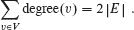

***B.4-2***  

证明如果一个有向或无向图包含顶点 `u` 和 `v` 之间的路径，则它包含顶点 `u` 和 `v` 之间的简单路径。证明如果一个有向图包含一个环，则它包含一个简单环。

`B.4-3`

证明任何连通的无向图 `G = (V, E)` 满足 `|E| ≥ |V| - 1`。

***B.4-4***

验证在无向图中，“可达自”关系是图的顶点上的等价关系。在一般情况下，哪三个等价关系属性适用于有向图的顶点上的“可达自”关系？

***B.4-5***

图 B.2(a)中的有向图的无向版本是什么？图 B.2(b)中的无向图的有向版本是什么？

***B.4-6***

通过让超图中的关联对应于双分图中的邻接，展示双分图如何表示超图。（*提示：*让双分图中的一个顶点集对应于超图的顶点，让双分图的另一个顶点集对应于超边。）

**B.5 树**

与图类似，树有许多相关但略有不同的概念。本节介绍了几种树的定义和数学性质。第 10.3 节和第 20.1 节描述了如何在计算机内存中表示树。

**B.5.1 自由树**

如第 B.4 节中定义的，`自由树`是一个连通的、无环的、无向图。当我们说一个图是树时，通常会省略形容词“自由”。如果一个无向图是无环的但可能是不连通的，则是一个`森林`。许多适用于树的算法也适用于森林。图 B.4(a)展示了一个自由树，图 B.4(b)展示了一个森林。图 B.4(b)中的森林不是树，因为它不是连通的。图 B.4(c)中的图是连通的，但既不是树也不是森林，因为它包含一个环。

以下定理概括了关于自由树的许多重要事实。

***定理 B.2（自由树的性质）***

``

**`图 B.4 (a)`** 一个自由树。**(b)** 一个森林。**(c)** 一个包含环的图，因此既不是树也不是森林。

设 `G = (V, E)` 是一个无向图。以下陈述是等价的。

1.  `G` 是一个自由树。

1.  `G`中任意两个顶点由唯一的简单路径连接。

1.  `G`是连通的，但如果从`E`中移除任意边，则得到的图将是不连通的。

1.  *G*是连通的，且`|E| = |V| − 1`。

1.  *G*是无环的，且|`E`| = |`V` | − 1。

1.  `G`是无环的，但如果向`E`中添加任意边，则得到的图将包含一个环。

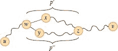

**图 B.5** 定理 B.2 证明的一步：如果(1) `G` 是一棵自由树，则(2) `G` 中的任意两个顶点由唯一的简单路径连接。假设为了推导矛盾，顶点`u`和`v`由两条不同的简单路径连接。这些路径在顶点`w`处首次分歧，并在顶点`z`处首次重新汇合。路径`p′`与路径`p″`的逆序连接形成一个环，导致矛盾。

***证明***   `(1) ⇒ (2)`: 由于树是连通的，`G`中的任意两个顶点至少由一条简单路径连接。假设为了推导矛盾，顶点`u`和`v`由图中两条不同的简单路径连接，如图 B.5 所示。让`w`是路径首次分歧的顶点。也就是说，如果我们将路径称为`p[1]`和`p[2]`，那么`w`是`p[1]`和`p[2]`上第一个后继分别为`x`和`y`（其中`x` ≠ `y`）的顶点。让`z`是路径首次重新汇合的顶点，也就是说，`z`是在`p[1]`上的`w`之后也在`p[2]`上的第一个顶点。让`p' = w → x ⇝ z`是`p[1]`中从`w`经`x`到`z`的子路径，使得 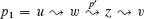，让`p'' = w → y ⇝ z`是`p[2]`中从`w`经`y`到`z`的子路径，使得 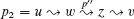。路径`p'`和`p''`除了它们的端点外没有共同的顶点。然后，如图 B.5 所示，将`p'`与`p''`的逆序连接起来形成一个环，这与我们假设的`G`是树相矛盾。因此，如果`G`是树，则两个顶点之间最多只能有一条简单路径。

(2) ⇒ (3): 如果`G`中任意两个顶点由唯一的简单路径连接，则`G`是连通的。设`(u, v)`是`E`中的任意边。这条边是从`u`到`v`的路径，因此它必须是从`u`到`v`的唯一路径。如果将`(u, v)`从`G`中移除，那么从`u`到`v`就没有路径，`G`将是不连通的。

`(3)` ⇒ `(4)`: 根据假设，图`G`是连通的，因此练习 B.4-3 表明 `|E| ≥ |V| − 1`。我们通过对`|V|`进行归纳证明 `|E| ≤ |V| − 1`。基本情况是当`|V| = 1` 或`|V| = 2` 时，在任一情况下，`|E| = |V| − 1`。对于归纳步骤，假设对于图`G`，`|V| ≥ 3`，以及满足`(3)`的任何图`G' = (V', E')`，其中`|V'| < |V|`，也满足`|E'| ≤ |V'| − 1`。从`G`中移除任意边将图分成`k ≥ 2` 个连通分量（实际上`k = 2`）。每个分量都满足`(3)`，否则`G`就不会满足`(3)`。将每个连通分量`V[i]`及其边集`E[i]`视为单独的自由树。然后，因为每个连通分量的顶点数少于`|V|`，归纳假设意味着 `|E[i]| ≤ |V[i]| − 1`。因此，所有`k`个连通分量中的边数最多为`|V| − k ≤ |V| − 2`。加入移除的边后，得到 `|E| ≤ |V| − 1`。

(4) ⇒ (5): 假设`G`是连通的，并且|`E`| = |`V`| − 1\. 我们必须证明`G`是无环的。假设`G`有一个包含`k`个顶点`v[1]`，`v[2]`，…，`v[k]`的环，且不失一般性地假设这个环是简单的。设`G[k]` = (`V[k], E[k]`)是由环组成的`G`的子图，使得|`V[k]`| = |`E[k]`| = `k`。如果`k` < |`V`|，那么因为`G`是连通的，必然存在一个顶点`v[k+1]`∈ `V` − `V[k]`，它与某个顶点`v[i]` ∈ `V[k]`相邻。定义`G[k+1]` = (`V[k+1], E[k+1]`)为`G`的子图，其中`V[k+1]` = `V[k]` ∪ {`v[k+1]`}，`E[k+1]` = `E[k]` ∪ {(`v[i]`, `v[k+1]`)}。注意到|`V[k+1]`| = |`E[k+1]`| = `k` + 1\. 如果`k` + 1 < |`V`|，则继续，以相同方式定义`G[k+2]`，依此类推，直到得到`G[n]` = (`V[n], E[n]`)，其中`n` = |`V`|，`V[n]` = `V`，且|`E[n]`| = |`V[n]`| = |`V`|。由于`G[n]`是`G`的子图，我们有`E[n]` ⊆ `E`，因此|`E`| ≥ |`E[n]`| = |`V[n]`| = |`V`|，这与假设|`E`| = |`V`| − 1 相矛盾。因此，`G`是无环的。

(5) ⇒ (6): 假设`G`是无环的，并且|`E`| = |`V`| − 1\. 设`k`是`G`的连通分量的数量。每个连通分量根据定义都是一棵自由树，由于(1)蕴含(5)，`G`的所有连通分量中所有边的总和为|`V`| − `k`。因此，`k`必须等于 1，`G`实际上是一棵树。由于(1)蕴含(2)，`G`中任意两个顶点都由唯一的简单路径连接。因此，向`G`添加任何边都会形成一个环。

`(6) ⇒ (1)`: 假设`G`是无环的，但添加任何边到`E`都会形成一个环。我们必须证明`G`是连通的。设`u`和`v`是`G`中任意的顶点。如果`u`和`v`不是相邻的，添加边`(u, v)`会形成一个包含所有边但不包含`(u, v)`的环，因此，环减去边`(u, v)`必然包含从`u`到`v`的路径，由于`u`和`v`是任意选择的，`G`是连通的。

▪  输出：

**`B.5.2` 根树和有序树**

一个`根树`是一棵自由树，其中一个顶点与其他顶点有所区别。我们称这个特殊的顶点为树的`根`。我们经常将根树的顶点称为树的`节点`⁵。图 B.6(a)展示了一个包含 12 个节点且根为 7 的根树。

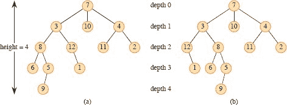

**图 B.6** 根树和有序树。**(a)** 高度为 4 的根树。树以标准方式绘制：根（节点 7）在顶部，其子节点（深度为 1 的节点）在其下方，它们的子节点（深度为 2 的节点）在它们下方，依此类推。如果树是有序的，节点的子节点的相对左右顺序很重要；否则，不重要。**(b)** 另一棵根树。作为根树，它与(a)中的树相同，但作为有序树，它不同，因为节点 3 的子节点以不同的顺序出现。

考虑根为`r`的树`T`中的节点`x`。我们称从`r`到`x`的唯一简单路径上的任何节点`y`为`x`的***祖先节点***。如果`y`是`x`的祖先节点，则`x`是`y`的***后代节点***。（每个节点既是祖先也是后代自己。）如果`y`是`x`的祖先节点且`x ≠ y`，则`y`是`x`的***真祖先节点***，`x`是`y`的***真后代节点***。以`x`为根的***子树***是由`x`的后代节点组成的树，以`x`为根。例如，图 B.6(a)中以节点 8 为根的子树包含节点 8、6、5 和 9。  

如果从树`T`的根`r`到节点`x`的简单路径上的最后一条边是(`y`, `x`)，那么`y`是`x`的***父节点***，`x`是`y`的***子节点***。根是`T`中唯一没有父节点的节点。如果两个节点有相同的父节点，它们是***兄弟节点***。没有子节点的节点是***叶子节点***或***外部节点***。非叶子节点是***内部节点***。

在根树`T`中，节点`x`的子节点数称为`x`的***度***。从根`r`到节点`x`的简单路径的长度称为`x`在`T`中的***深度***。树的一个***层***包括所有深度相同的节点。树中节点的高度是从节点到叶子的最长简单向下路径上的边数，树的高度是其根的高度。树的高度也等于树中任何节点的最大深度。

一个**`有序树`**是一个根树，其中每个节点的子节点是有序的。也就是说，如果一个节点有`k`个子节点，则有第一个子节点，第二个子节点，依此类推，直到第`k`个子节点。在考虑为有序树时，图 B.6 中的两棵树是不同的，但在考虑为根树时是相同的。  

**`B.5.3` 二叉树和位置树**

我们递归地定义二叉树。一个***二叉树*** `T` 是在一个有限节点集上定义的结构，它要么

+   不包含任何节点，或  输出：

+   由三个不相交的节点集合组成：一个`根`节点，一个称为`左子树`的二叉树，和一个称为`右子树`的二叉树。

不包含任何节点的二叉树称为`空树`或`空树`，有时表示为 NIL。如果左子树非空，则其根称为整个树的`左子节点`。同样，非空右子树的根是整个树的`右子节点`。如果子树是空树 NIL，则称该子节点`缺失`或`丢失`。图 B.7(a)展示了一个二叉树。

二叉树不仅仅是每个节点最多有两个子节点的有序树。例如，在二叉树中，如果一个节点只有一个子节点，则子节点的位置——是`左子节点`还是`右子节点`——很重要。在有序树中，无法区分唯一子节点是左子节点还是右子节点。图 B.7(b)展示了一个与图 B.7(a)中的树不同的二叉树，因为一个节点的位置不同。然而，从有序树的角度来看，这两棵树是相同的。  

表示二叉树中的定位信息的一种方法是通过有序树的内部节点，如图 B.7(c)所示。这个想法是用没有子节点的节点替换二叉树中的每个缺失子节点。这些叶节点在图中显示为方块。结果得到的树是一个`完全二叉树`：每个节点要么是叶子，要么恰好有 2 个子节点。没有节点的度为 1。因此，节点的子节点顺序保留了位置信息。

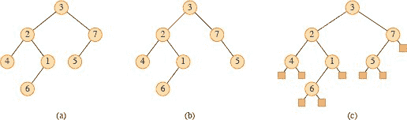

**图 B.7** 二叉树。**(a)** 以标准方式绘制的二叉树。节点的左子节点绘制在节点下方且向左。右子节点绘制在节点下方且向右。**(b)** 与(a)中不同的二叉树。在(a)中，节点 `7` 的左子节点是 `5`，右子节点不存在。在(b)中，节点 `7` 的左子节点不存在，右子节点是 `5`。作为有序树，这些树是相同的，但作为二叉树，它们是不同的。**(c)** (a)中的二叉树由完全二叉树的内部节点表示：一棵有序树，其中每个内部节点的度为 `2`。树中的叶子节点显示为方块。  

将二叉树与有序树区分开的定位信息扩展到每个节点有两个以上子节点的树。在一个`***位置树***`中，节点的子节点用不同的正整数*i*记。如果没有用整数*i*标记的子节点，则第*i*个子节点`***缺失***`。一个`***k 叉***`树是一个位置树，对于每个节点，所有标记大于*k*的子节点都缺失。因此，二叉树是一个*k* = 2 的*k*叉树。

***完全 k 元树***是一个`k`元树，其中所有叶子具有相同的深度，所有内部节点的度为`k`。图 B.8 展示了高度为 3 的完全二叉树。高度为`h`的完全`k`元树有多少叶子？根节点在深度 1 处有`k`个子节点，每个子节点在深度 2 处有`k`个子节点，依此类推。因此，在深度`d`处的节点数为`k^d`。在高度为`h`的完全`k`元树中，叶子在深度`h`处，因此有`k^h`个叶子。因此，具有`n`个叶子的完全`k`元树的高度为 log[*k*]*n*。高度为`h`的完全`k`元树有

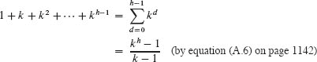  

内部节点。因此，完全二叉树有 `2^(h) − 1` 个内部节点。  

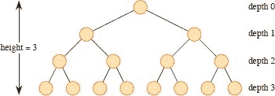

**图 B.8** 高度为 3 且有 8 个叶子和 7 个内部节点的完全二叉树。

**练习**

`B.5-1`

绘制由三个顶点`x`、`y`和`z`组成的所有自由树。绘制具有节点`x`、`y`和`z`且`x`为根的所有根树。绘制具有节点`x`、`y`和`z`且`x`为根的所有有序树。绘制具有节点`x`、`y`和`z`且`x`为根的所有二叉树。

***B.5-2***

设`G = (V, E)`是一个有向无环图，其中存在一个顶点`v[0] ∈ V`，使得从`v[0]`到每个顶点`v ∈ V`都存在一条唯一路径。证明`G`的无向版本形成一棵树。

***B.5-3***  

通过归纳法证明任何非空二叉树中度为 2 的节点数比叶子数少一个。得出结论，完全二叉树中内部节点数比叶子数少一个。

`B.5-4`  

证明对于任何整数`k` ≥ 1，都存在具有`k`个叶子的完全二叉树。

`B.5-5`

使用归纳法证明，具有`n`个节点的非空二叉树的高度至少为⌊lg *n*⌋。

★ ***`B.5-6`***  

完全二叉树的`内部路径长度`是树的所有内部节点的深度之和。同样，`外部路径长度`是树的所有叶子的深度之和。考虑具有*n*个内部节点、内部路径长度*i*和外部路径长度*e*的完全二叉树。证明*e* = *i* + 2*n*。

`★` ***B.5-7***

将二叉树`T`中深度为`d`的每个叶子`x`关联一个“权重”`w(x) = 2^(-d)`，并让`L`为`T`的叶子集。证明***Kraft 不等式***：Σ[x ∈ L] w(x) ≤ 1。

★ ***B.5-8***

证明如果`L ≥ 2`，则每个具有`L`个叶子的二叉树包含具有`L/3` 到 `2L/3` 个叶子的子树，包括边界值。

输出：

输入：  -   ***B-1 图着色***  输出：  -   `B-1` 图着色`

无向图`G = (V, E)`的***k 着色***是一个函数`c: V → {1, 2, … , k}`，使得对于每条边`(u, v)` ∈ `E`，`c(u)` ≠ `c(v)`。换句话说，数字 1, 2, … , `k`代表`k`种颜色，相邻的顶点必须具有不同的颜色。

***a.*** 证明任何树都是 2 可着色的。

证明以下内容是等价的：

1.  `G`是二分图。  

1.  `G   `G`是 2 可着色的。

1.  `G`没有奇数长度的循环。

***c.*** 设`G`中任意顶点的最大度数为`d`。证明`G`可以用`d + 1`种颜色着色。

***d.*** 证明如果`G`有`O(|V|)`条边，则`G`可以用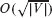种颜色着色。

***B-2 友好图***

将以下每个陈述重新表述为关于无向图的定理，然后证明它。假设友谊是对称的但不是自反的。

***a.*** 任何至少有两个人的群体中至少有两个人在群体中有相同数量的朋友。

***b.*** 每个六人组中要么至少有三个相互朋友，要么至少有三个相互陌生人。

***c.*** 任何一组人都可以被划分为两个子组，使得每个人的至少一半朋友属于该人`不`是成员的子组。

***d.*** 如果一个群体中的每个人至少是群体中一半人的朋友，则可以使群体围坐在桌子周围，以便每个人坐在两个朋友之间。

***B-3 二等分树***

许多在图上操作的分治算法要求将图二等分为两个大小几乎相等的子图，这些子图由顶点的一个划分诱导而成。这个问题研究了通过移除少量边形成的树的二等分。我们要求无论在移除边后两个顶点最终位于同一子树中，它们必须属于同一划分。

***a.*** 证明任何`n`个顶点的二叉树的顶点可以通过移除一条边划分为两个集合`A`和`B`，使得|`A`| ≤ 3`n`/4，|`B`| ≤ 3`n`/4。

***b.*** 通过给出一个简单二叉树的例子，证明部分(a)中的常数 `3/4` 在最坏情况下是最优的，即在移除一条边后，最平衡的划分具有|*A*| = `3n/4`。

***c.*** 证明通过移除最多`O(lg n)`条边，我们可以将任何`n`个顶点的二叉树划分为两个集合`A`和`B`，使得|`A`| = ⌊`n`/2⌋，|`B`| = ⌈`n`/2⌉。

输出：

G. 布尔开创了符号逻辑的发展，并在 1854 年出版的一本书中引入了许多基本集合符号。现代集合论是由 G. 康托在 1874 年至 1895 年期间创立的。康托主要关注无限基数的集合。术语“函数”归因于 G. W. 莱布尼茨，他用它来指代几种数学公式。他有限的定义已经被广义化多次。图论起源于 1736 年，当时 L. 欧拉证明了在康斯堡市穿过每座桥仅一次并返回起点是不可能的。

Harary 的书`[208]`提供了图论中许多定义和结果的有用汇编。

¹ 一个集合的变体，可以包含相同的对象多次，被称为***多重集***。

² 一些作者从 1 开始而不是从 0 开始自然数。现代趋势似乎是从 0 开始。

³ 要精确，为了使“适合内部”关系成为偏序，我们需要将一个盒子视为适合于自身。

⁴ 一些作者将我们称为路径的东西称为“步行”，将我们称为简单路径的东西称为“路径”。

⁵ “节点”一词在图论文献中经常被用作“顶点”的同义词。我们将术语“节点”保留为根树的顶点的意思。

⁶ 一个节点的度取决于我们将`T`视为根树还是自由树。在自由树中，一个顶点的度，就像在任何无向图中一样，是相邻顶点的数量。然而，在根树中，度是子节点的数量——节点的父节点不计入其度。
