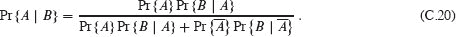
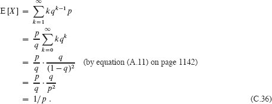

**C 计数与概率**

本附录回顾了基本的组合学和概率论。如果你在这些领域有很好的背景，你可能想要轻松地浏览本附录的开头并集中在后面的部分。本书的大部分章节不需要概率，但对于一些章节来说是必不可少的。

C.1 节回顾了计数理论中的基本结果，包括计算排列和组合的标准公式。概率公理和关于概率分布的基本事实构成了 C.2 节。随机变量在 C.3 节中被介绍，同时也介绍了期望和方差的性质。C.4 节研究了从研究伯努利试验中产生的几何和二项分布。二项分布的研究在 C.5 节中继续进行，这是对分布“尾部”的高级讨论。  

*None*

计数理论试图回答“有多少？”的问题，而不实际枚举所有选择。例如，你可能会问，“有多少不同的`n`位数？”或“有多少个`n`个不同元素的排列？”本节回顾了计数理论的要素。由于一些材料假定对集合有基本的理解，你可能希望从 C.1 节开始复习材料。

**求和和乘积规则**

我们有时可以将我们希望计数的一组项目表示为不相交集合的并集或集合的笛卡尔积。

**求和规则**表示从两个`不相交`集合中选择一个元素的方式数是这两个集合的基数之和。也就是说，如果`A`和`B`是两个没有共同成员的有限集合，则`|A ∪ B| = |A| + |B|`，这是从第 1156 页的方程（B.3）推导出来的。例如，如果汽车牌照的每个位置是字母或数字，则每个位置的可能性数是 `26 + 10 = 36`，因为如果是字母则有 26 种选择，如果是数字则有 10 种选择。

**乘积规则**表示选择有序对的方式数等于选择第一个元素的方式数乘以选择第二个元素的方式数。也就是说，如果`A`和`B`是两个有限集合，则|`A` × `B`| = |`A`|·|`B`|，这只是第 1157 页的方程（B.4）。例如，如果一个冰淇淋店提供 28 种口味的冰淇淋和四种配料，那么有一个冰淇淋球和一个配料的可能的圣代数是 28 · 4 = 112。  

**`字符串`**

一个`***字符串***`在有限集合`S`上是`S`的元素序列。例如，长度为 3 的二进制字符串有八个。  

`000`, `001`, `010`, `011`, `100`, `101`, `110`, `111`。  

（这里我们使用缩写来表示序列时省略了尖括号。）我们有时将长度为`k`的字符串称为***k-字符串***。字符串`s`的***子字符串*** `s′`是`s`的连续元素的有序序列。字符串的`k-子字符串`是长度为`k`的子字符串。例如，010 是 01101001 的 3-子字符串（从位置 4 开始的 3-子字符串），但 111 不是 01101001 的子字符串。

我们可以将`S`上的`k`-字符串视为`k`元组`S^k`的元素，这意味着长度为`k`的字符串有|`S`|`^k`个。例如，二进制`k`-字符串的数量是 2`^k`。直观地说，要构造一个`n`-集合上的`k`-字符串，有`n`种选择第一个元素的方式；对于每个选择，选择第二个元素有`n`种方式；以此类推`k`次。这种构造导致`k`-fold 乘积``作为`k`-字符串的数量。

**排列**

有限集合`S`的一个***排列***是`S`的所有元素的有序序列，每个元素恰好出现一次。例如，如果`S` = {`a`, `b`, `c`}，那么`S`有 6 个排列：

`abc`, `acb`, `bac`, `bca`, `cab`, `cba`。

（再次，我们使用缩写，省略了表示序列时的尖括号。）一个`n`元素集合有`n`!个排列，因为选择序列的第一个元素有`n`种方法，第二个元素有`n` − 1 种方法，第三个元素有`n` − 2 种方法，依此类推。

***k-排列***是`S`的`k`个元素的有序序列，序列中没有元素出现超过一次。（因此，普通排列是`n`集合的`n`-排列。）这里是集合{*a*, *b*, *c*, *d*}的 2-排列：

`ab`, `ac`, `ad`, `ba`, `bc`, `bd`, `ca`, `cb`, `cd`, `da`, `db`, `dc`。

*n*集合的`k`-排列数是

因为有`n`种方法选择第一个元素，`n` − 1 种方法选择第二个元素，依此类推，直到选择`k`个元素，最后一个元素从剩余的`n - k + 1`个元素中选择。对于上面的例子，当`n = 4`且`k = 2`时，公式`(C.1)`计算结果为 `4!/2! = 12`，与列出的 2-排列数量相匹配。

`组合`

*n*集合`S`的一个***k-组合***简单地是`S`的一个`k`子集。例如，4 集合`{a, b, c, d}`有六个 2-组合：  

`ab`, `ac`, `ad`, `bc`, `bd`, `cd`。

（这里我们使用缩写，省略了每个子集周围的大括号。）要构造`n`集合的`k`-组合，从`n`集合中选择`k`个不同的元素。选择元素的顺序不重要。

我们可以用`n`集合的`k`-排列数量来表示`n`集合的`k`-组合数量。每个`k`-组合有恰好`k`!个元素的排列，每个排列都是`n`集合的不同的`k`-排列。因此，`n`集合的`k`-组合数量是`k`-排列数量除以`k`!。根据公式`(C.1)`，这个数量是

对于`k = 0`，这个公式告诉我们从`n`集合中选择 0 个元素的方法数是 1（而不是 0），因为 `0! = 1`。

**`二项式系数`**

符号（读作“`n`选择`k`”）表示`n`集合的`k`-组合数量。方程(C.2)给出

这个公式在`k`和`n` - `k`中是对称的：

这些数字也被称为***二项式系数***，因为它们出现在***二项式定理***中：

``

其中`n` ∈ ℕ，`x`，`y` ∈ ℝ。方程`(C.4)`右侧称为左侧的***二项式展开***。当`x = y = 1`时，二项式定理的一个特例是：

这个公式对应于通过它们包含的 1 的数量计算`2^n`个二进制`n`-字符串：个二进制`n`-字符串恰好包含`k`个 1，因为有种方法选择`k`个位置放置 1。  

许多恒等式涉及二项式系数。本节末尾的练习给了你证明一些的机会。

**二项式界限**

有时候你需要限制二项式系数的大小。对于`1 ≤ k ≤ n`，我们有下界

  

利用从斯特林逼近（第 67 页的 3.25）推导出的不等式`k! ≥ (k/e)^k`，我们得到上界

对于所有整数`k`，使得 0 ≤ `k` ≤ `n`，你可以使用归纳法（见练习 C.1-12）证明界限

  

为了方便起见，我们假设 `0⁰ = 1`。对于`k = λn`，其中 `0 ≤ λ ≤ 1`，我们可以将这个界限重写为 

其中  

是***(二进制)熵函数***，其中为了方便起见，我们假设 `0 lg 0 = 0`，所以 `H(0) = H(1) = 0`。

**练习**  

***C.1-1***

一个 `n` 字符串有多少个 `k` 子字符串？（考虑不同位置上的相同 `k` 子字符串是不同的。）一个 `n` 字符串总共有多少个子字符串？

`C.1-2`

一个 `n` 输入，`m` 输出的***布尔函数*** 是一个从 {0, 1}*^n* 到 {0, 1}*^m* 的函数。有多少个 `n` 输入，1 输出的布尔函数？有多少个 `n` 输入，`m` 输出的布尔函数？  

`C.1-3`

有多少种方式可以让 `n` 位教授围坐在一个圆形会议桌周围？如果一个座位可以旋转成另一个座位，则认为两种座位是相同的。

`C.1-4`  

有`少`种方式可以从集合 {1, 2, … , 99} 中选择三个不同的数字，使它们的和为偶数？

`***C.1-5***`

证明这个恒等式  输入：  

对于`0 < k ≤ n`。

***`C.1-6`***  

证明这个恒等式

对于 `0 ≤ k < n`。

`***C.1-7***`

要从 `n` 中选择 `k` 个对象，你可以选择一个对象作为特殊对象，并考虑特殊对象是否被选择。使用这种方法证明

***`C.1-8`***  

利用练习 C.1-7 的结果，制作一个 `n = 0, 1, … , 6` 且 `0 ≤ k ≤ n` 的二项式系数 `` 的表，其中 `` 在顶部，接着是 `` 和 `` 在下一行，然后是 ``，``，和 ``，依此类推。这样的二项式系数表被称为***帕斯卡三角形***。  

***C.1-9***

证明

***`C.1-10`***  

表明对于任何整数 `n` ≥ 0 和 0 ≤ `k` ≤ `n`，当 `k` = ⌊`n`/2⌋ 或 `k` = ⌈`n`/2⌉ 时，表达式 `...(img/Art_P1662.jpg)` 达到最大值。

★ ***`C.1-11`***

论证对于任何整数 `n` ≥ 0，`j` ≥ 0，`k` ≥ 0，且 `j` + `k` ≤ `n`，

提供一个代数证明和一个基于从 `n` 中选择 `j + k` 个项目的方法的论证。给出一个不等式不成立的例子。

★ ***C.1-12***

对于所有整数 `k`，满足 `0 ≤ k ≤ n/2`，使用归纳法证明不等式 (C.7)，并使用方程 (C.3) 将其扩展到所有整数 `k`，满足 `0 ≤ k ≤ n`。

★ ***C.1-13***  

使用`斯特林逼近`证明

``

★ ***C.1-14***

通过对熵函数 `H(λ)` 进行微分，证明它在 `λ = 1/2` 处达到最大值。`H(1/2)` 是多少？

★ ***`C.1-15`***  

表明对于任何整数 `n` ≥ 0，

★ ***C.1-16***

不等式 (C.5) 给出了二项式系数 `` 的下界。对于较小的 *k* 值，存在更强的界限。证明

``

对于 ``。

**`C.2` 概率**

概率是设计和分析概率和随机算法的基本工具。本节回顾基本的概率理论。

我们根据一个称为`***样本空间*** S` 来定义概率，它是一个集合，其元素称为`***结果***或***基本事件***`。将每个结果视为实验的可能结果。对于抛掷两个可区分硬币的实验，每次独立抛掷的结果为正面（H）或反面（T），你可以将样本空间 `S` 视为由所有可能的 2-字符串组成的集合 {H, T}：

*S* = {`HH`, `HT`, `TH`, `TT`}。

一个`事件`是样本空间*S*的子集¹。例如，在抛两枚硬币的实验中，获得一枚正面和一枚反面的事件是{HT, TH}。事件*S*称为`确定事件`，事件∅称为`空事件`。如果*A* ∩ *B* = ∅，则称事件*A*和*B*是`互斥的`。结果*s*也定义了事件{*s*}，有时我们只写成*s*。根据定义，所有结果都是互斥的。

**`概率公理`**

在样本空间`S`上的***概率分布***`Pr {}`是从`S`的事件到实数的映射，满足以下***概率公理***：

1.  对于任意事件`A`，`Pr {A}` ≥ 0。

1.  Pr {`S`} = 1。

1.  对于任意两个互斥事件`*A*`和`*B*`，`Pr { *A* ∪ *B* } = Pr { *A* } + Pr { *B* }`。更一般地，对于任意一系列事件`*A*[1]`，`*A*[2]`，…（有限或可数无限）它们两两互斥，

    

我们称 Pr `{A}`为事件`A`的***概率***。公理 2 只是一个归一化要求：选择 1 作为确定事件的概率并没有什么根本性，只是自然和方便。

这些公理和基本集合论立即导出几个结果（见附录 B.1）。空事件`∅`的概率为 `Pr {∅} = 0`。如果`A` ⊆ `B`，则 `Pr {A} ≤ Pr {B}`。使用`Ā`表示事件`S` − `A`（`A`的***补***），我们有 `Pr {Ā} = 1 − Pr {A}`。对于任意两个事件`A`和`B`，

在我们抛硬币的例子中，假设每个四个结果的概率为 `1/4`。那么至少获得一个正面的概率是 

| `Pr {HH, HT, TH}` | = | `Pr {HH} + Pr {HT} + Pr {TH}` |
| --- | --- | --- |
| ` |  | = | 3/4. | ` |

另一种获得相同结果的方法是观察到，由于获得严格少于一个正面的概率为 `Pr {TT} = 1/4`，获得至少一个正面的概率为 `1 - 1/4 = 3/4`。

**`离散概率分布`**

如果概率分布定义在有限或可数无限的样本空间上，则该概率分布是***离散的***。设`S`为样本空间。那么对于任意事件`A`，

由于结果，特别是在`A`中的结果是互斥的。如果`S`是有限的，并且每个结果`s` ∈ `S`的概率为 Pr {`s`} = 1/|`S`|，那么我们在`S`上有***均匀概率分布***。在这种情况下，实验通常被描述为“随机从`S`中选择一个元素”。

举个例子，考虑抛掷一枚`公平硬币`的过程，即获得正面和获得反面的概率相同，即 `1/2`。抛掷硬币`n`次会得到定义在样本空间`S = {H, T}ⁿ`上的均匀概率分布，一个大小为 `2ⁿ`的集合。我们可以将`S`中的每个结果表示为在{H, T}上长度为`n`的字符串，每个字符串出现的概率为 `1/2ⁿ`。事件`A` = {恰好有`k`个正面和`n − k`个反面发生}是`S`的一个大小为的子集，因为在{H, T}上长度为`n`的字符串中恰好包含`k`个 H。因此，事件`A`的概率为。

一个连续均匀概率分布是指在一个区间[*a*, *b*]上的概率密度函数（PDF）为：

连续均匀概率分布是一个概率分布的例子，其中并非所有样本空间的子集都被视为事件。连续均匀概率分布定义在实数的闭区间 [*a*, *b*] 上，其中 `a < b`。直觉上，区间 [*a*, *b*] 中的每个点应该是“等可能的”。然而，由于有无穷多个点，如果所有点都具有相同的有限正概率，那么公理 2 和 3 将无法同时满足。因此，我们希望仅将概率与 *S* 的某些子集相关联，以便这些事件满足公理。

对于任何闭区间 `[*c*, *d*]`，其中 `a ≤ c ≤ d ≤ b`，***连续均匀概率分布***将事件 `[*c*, *d*]` 的概率定义为

  

令 `c = d` 得出单个点的概率为 0。去除区间 `[c, c]` 和 `[d, d]` 的端点 `[c, d]` 会得到开区间 `(c, d)`。由于 `[c, d] = [c, c] ∪ (c, d) ∪ [d, d]`，公理 3 给出 Pr {[c, d]} = Pr {(c, d)}。通常，连续均匀概率分布的事件集包含任何可以通过有限或可数个开区间和闭区间的并集以及某些更复杂的集合获得的样本空间 `[a, b]` 的子集。

**条件概率和独立性**

有时候你可能对实验结果有一些先前的部分知识。例如，假设一个朋友抛了两枚公平硬币，并告诉你至少有一枚硬币是正面。那么两枚硬币都是正面的概率是多少？给定的信息排除了两枚硬币都是反面的可能性。剩下的三种结果是等可能的，因此你推断每种结果发生的概率为 `1/3`。由于只有一种结果显示两个正面，所以答案是 `1/3`。

条件概率形式化了对实验结果有先前部分知识的概念。给定另一个事件 `B` 发生时事件 `A` 的***条件概率***被定义为 

  

每当`Pr {B}` ≠ 0 时。（读作“Pr {A | B}”为“给定 B 的情况下 A 的概率。”）方程式 (C.16) 背后的思想是，由于我们已知事件 B 发生，事件 A 也发生的概率是 A ∩ B。也就是说，A ∩ B 是 A 和 B 都发生的结果集。因为结果是 B 中的一个基本事件，我们通过将 B 中所有基本事件的概率除以 Pr {B} 进行归一化，使它们总和为 1。因此，给定 B 的情况下 A 的条件概率是事件 A ∩ B 的概率与事件 B 的概率的比值。在上面的例子中，A 是两枚硬币都是正面的事件，B 是至少有一枚硬币是正面的事件。因此，`Pr {A | B}` = (1/4)/(3/4) = 1/3。

如果两个事件`独立`，则

如果`Pr {B}` ≠ 0，则等价于条件

Pr `{A | B}` = Pr `{A}`。

例如，假设你抛两枚公平的硬币且结果是独立的。那么两枚硬币都是正面的概率是 `(1/2)(1/2) = 1/4`。现在假设第一枚硬币是正面的事件和两枚硬币不同的事件。这两个事件各自发生的概率是 `1/2`，而两个事件同时发生的概率是 `1/4`。因此，根据独立性的定义，这些事件是独立的——尽管你可能认为这两个事件都依赖于第一枚硬币。最后，假设硬币被焊在一起，它们要么都是正面要么都是反面，而这两种可能性是等可能的。那么每枚硬币都是正面的概率是 `1/2`，但它们同时都是正面的概率是 `1/2 ≠ (1/2)(1/2)`。因此，一枚硬币是正面的事件和另一枚硬币是正面的事件不是独立的。  

一个事件集合 `A[1]`，`A[2]`，…，`A[n]` 被称为***两两独立***，如果

Pr {*`A[i]` ∩ `A[j]`*} = Pr {*`A[i]`*} Pr {*`A[j]`*}

对于所有的 1 ≤ `i` < `j` ≤ `n`。如果集合中的事件是***(互相)独立***的，那么集合中的每个 `k`-子集 ，其中 2 ≤ `k` ≤ `n` 且 1 ≤ `i `[1] < `i `[2] < ⋯ < `i[k]` ≤ `n`，都满足以下条件：  

例如，假设你抛两枚公平的硬币。设 `A[1]` 为第一枚硬币是正面的事件，`A[2]` 为第二枚硬币是正面的事件，`A[3]` 为两枚硬币不同的事件。那么，

| Pr `A[1]` | = | 1/2, |
| --- | --- | --- |
| Pr `{A[2]}` | = | 1/2, |   |
| Pr {*A*`[3]`} | = | 1/2, |
| Pr `{A[1] ∩ A[2]}` | = | `1/4, |  |
| Pr {*A*[1] ∩ *A*[3]} | = | `1/4`, |
| Pr `{*A*[2] ∩ *A*[3]}` | = | `1/4, |  |
| Pr {*A*[1] ∩ *A*[2] ∩ *A*[3]} | = | `0`. |

因为对于 1 ≤ `i` < `j` ≤ 3，我们有 Pr {*A[i]* ∩ *A[j]* } = Pr {*A[i]*} Pr {*A[j]*} = 1/4，事件 *A*[1]、*A*[2] 和 *A*[3] 是两两独立的。然而，这些事件并不是互相独立的，因为 Pr {*A*[1] ∩ *A*[2] ∩ *A*[3]} = 0，而 Pr {*A*[1]} Pr {*A*[2]} Pr {*A*[3]} = 1/8 ≠ 0。  

**`贝叶斯定理`**

根据条件概率的定义（C.16）和交换律 `A ∩ B = B ∩ A`，对于两个事件 *A* 和 *B*，每个都有非零概率，

``

解出 `Pr {A | B}`，我们得到  

这被称为`贝叶斯定理`。分母 Pr {B} 是一个归一化常数，我们可以重新表述如下。由于 B = (B ∩ A) ∪ (B ∩ Ā)，而且 B ∩ A 和 B ∩ Ā 是互斥事件，

| ` | Pr {B} | = | Pr {B ∩ A} + Pr {B ∩ Ā} | `   |
| --- | --- | --- |
| ` |  | = | Pr {A} Pr {B | A} + Pr {Ā} Pr {B | Ā}. | ` |

将代入方程（`C.19`）得到贝叶斯定理的等价形式：

贝叶斯定理可以简 贝叶斯定理可以简化条件概率的计算。例如，假设你有一枚公平的硬币和一枚总是正面的有偏硬币。进行一个由三个独立事件组成的实验：随机选择其中一枚硬币，先抛一次，然后再抛一次。假设你选择的硬币两次都是正面。那么它是有偏硬币的概率是多少？  

贝叶斯定理解决了这个问题。设 `A` 为你选择有偏的硬币的事件，`B` 为选择的硬币两次都是正面的事件。我们希望确定 Pr {`A` | `B`}，已知 Pr {`A`} = 1/2，Pr {`B` | `A`} = 1，Pr {`Ā`} = 1/2，以及 Pr {`B` | `Ā`} = 1/4。因此我们有

`练习`

***C.2-1***

罗森克兰茨教授抛一枚公平的硬币两次。吉尔登斯特恩教授抛一枚公平的硬币一次。罗森克兰茨教授获得比吉尔登斯特恩教授更多正面的概率是多少？

***`C.2-2`***

证明**布尔不等式**：对于任何有限或可数无限的事件序列 `A[1]`，`A[2]`，…

输入：  -   ***C.2-3***  输出：  -   `C.2-3`

你洗一副有 10 张卡片的牌，每张卡片上都有从 1 到 10 的不同数字，以便彻底混合卡片。然后，你从牌堆中依次取出三张卡片。你选择的三张卡片按升序排列的概率是多少？

***`C.2-4`***

证明

Pr {`A` | `B`} + Pr {`Ā` | `B`} = 1.

`C.2-5`

证明对于事件集合`A[1]`, `A[2]`, … , `A[n]`， 

``

★ ***`C.2-6`***

展示如何构建一组两两独立但没有任何子集`k` > 2 是相互独立的`n`个事件。

★ ***C.2-7***  

两个事件`A`和`B`在给定`C`的情况下是***条件独立的***，如果

`Pr {A ∩ B | C} = Pr {A | C} · Pr {B | C}.`

给出两个事件的一个简单但非平凡的例子，这两个事件不是独立的，但在给定第三个事件的情况下是条件独立的。

★ `C.2-8`  

Gore 教授在一堂关于节奏的音乐课上教授，三名学生`Jeff`、`Tim`和`Carmine`有可能不及格。Gore 教授告诉这三个人中的一个会通过课程，其他两个会不及格。`Carmine`私下问 Gore 教授`Jeff`和`Tim`中哪个会不及格，认为既然他已经知道至少有一个人会不及格，教授不会透露任何关于`Carmine`结果的信息。在违反隐私法的情况下，Gore 教授告诉`Carmine``Jeff`会不及格。`Carmine`感到有些放心，认为他或`Tim`会通过，所以他通过的概率现在是`1/2`。`Carmine`正确吗，还是他通过的机会仍然是`1/3`？请解释。

**`C.3` 离散随机变量**

一个`*(离散)随机变量*` *X* 是从有限或可数无限样本空间*S*到实数的函数。它将每次实验可能结果与一个实数相关联，这使我们能够处理在结果数字集上诱导的概率分布。随机变量也可以定义在不可数无限的样本空间上，但这会引起我们不必解决的技术问题。因此，我们将假设随机变量是离散的。

对于随机变量`X`和实数`x`，我们定义事件`X = x` 为{`s ∈ S : X(s) = x`}，因此

函数  输出：

`f(x) = Pr {X = x}`

是随机变量`X`的***概率密度函数***。根据概率公理，Pr {`X` = `x`} ≥ 0 并且 ∑*[x]* Pr {`X` = `x`} = 1。

以掷一对普通的六面骰子的实验为例。样本空间中有 36 种可能的结果。假设概率分布是均匀的，因此每个结果`s ∈ S` 都是等可能的：`Pr {s} = 1/36`. 定义随机变量`X`为骰子上两个值的*最大值*。我们有 `Pr {X = 3} = 5/36`，因为`X`将 36 种可能结果中的 5 种赋值为 3，即`(1, 3), (2, 3), (3, 3), (3, 2), 和 (3, 1)`。

我们可以在同一样本空间上定义几个随机变量。如果`X`和`Y`是随机变量，那么函数

`f(x, y) = Pr {X = x 和 Y = y}`

是`X`和`Y`的***联合概率密度函数***。对于固定的值*y*，

同样地，对于固定的值`x`， 

使用第 1187 页上条件概率的定义(`C.16`)，我们有

我们定义两个随机变量`X`和`Y`为***独立的***，如果对于所有`x`和`y`，事件`X` = `x` 和 `Y` = `y` 是独立的，或者等价地，对于所有`x`和`y`，我们有 Pr {`X` = `x` 和 `Y` = `y`} = Pr {`X` = `x`} Pr {`Y` = `y`}。

给定在同一样本空间上定义的一组随机变量，我们可以将新的随机变量定义为原始变量的和、积或其他函数。

**随机变量的期望值**

描述随机变量分布最简单、通常也最有用的摘要是它取值的“平均值”。离散随机变量 `X` 的***期望值***（或者，同义词地，***期望*** 或 ***均值***）是

``

如果总和是有限的或绝对收敛的话，这是明确定义的。有时 `X` 的期望值被表示为 `μ[X]` 或者，当随机变量从上下文中明显时，简单地表示为 `μ`。

考虑一个游戏，你抛两枚公平的硬币。每个正面你赚 `$3`，每个反面你输 `$2`。代表你收益的随机变量 `X` 的期望值是 

| `E[X]` | = | 6 · Pr {2 个 H} + 1 · Pr {1 个 H，1 个 T} − 4 · Pr {2 个 T} |
| --- | --- | --- |
| ` | | = | 6 · (1/4) + 1 · (1/2) − 4 · (1/4) | ` |
| ` |  | = | 1. | ` |

***期望的线性性*** 表明两个随机变量的和的期望是它们期望的和，即，

``

每当 `E[X]` 和 `E[Y]` 被定义时，期望的线性性适用于广泛的情况，即使 *X* 和 *Y* 不是独立的情况下也成立。它还扩展到期望的有限和绝对收敛的总和。期望的线性性是使我们能够通过使用指示器随机变量进行概率分析的关键属性（见第 5.2 节）。

如果 `X` 是任意随机变量，任何函数 `g(x)` 定义了一个新的随机变量 `g(X)`。如果 `g(X)` 的期望被定义，那么

  

让 `g(x) = ax`，对于任意常数 *a*，

  

因此，期望是线性的：对于任意两个随机变量 `X` 和 `Y` 和任意常数 `a`，

``

当两个随机变量 `X` 和 `Y` 是独立的且每个都有定义的期望时，

一般来说，当 `n` 个随机变量 `X[1]`，`X[2]`，…，`X[n]` 互相独立时，

当随机变量 `X` 取自自然数集 ℕ = {0, 1, 2, …} 时，我们有一个关于其期望的好公式：

``

因为每个术语 `Pr {X ≥ i}` 被加入 *i* 次并被减去 *i* − 1 次（除了 `Pr {X ≥ 0}`，它被加入 0 次且根本不被减去）。

如果一个函数 `f(x)` 是***凸的***，那么

对于所有 `x` 和 `y` 以及所有 `0 ≤ λ ≤ 1`。***Jensen 不等式*** 表明，当将凸函数 `f(x)` 应用于随机变量 `X` 时，

``  

前提是期望存在且有限。

**方差和标准差**  

一个随机变量的期望值并不表达变量值的“分散程度”。例如，考虑随机变量 `X` 和 `Y`，其中 Pr {`X` = 1/4} = Pr {`X` = 3/4} = 1/2 且 Pr {`Y` = 0} = Pr {`Y` = 1} = 1/2。那么 E[`X`] 和 E[`Y`] 都是 1/2，然而 `Y` 实际取值离均值更远，而 `X` 的实际取值离均值更近。

方差的概念在数学上表达了随机变量的值离均值的可能��度。具有均值 `E[X]` 的随机变量 `X` 的***方差*** 是 

``

为了证明方程 `E[E²[X]] = E²[X]`，请注意，因为 `E[X]` 是一个实数而不是一个随机变量，所以 `E²[X]` 也是一个实数。方程 `E[XE[X]] = E²[X]` 来自方程（C.25），其中 `a` = `E[X]`。重写方程（C.31）得到随机变量的平方的期望的表达式：

随机变量 `X` 的方差和 `aX` 的方差相关（见练习 C.3-10）：  

Var[`aX`] = `a`²Var[`X`]。

当 `X` 和 `Y` 是独立的随机变量时，

`Var[X + Y] = Var[X] + Var[Y]`。

一般来说，如果 `n` 个随机变量 `X[1]`，`X[2]`，…，`X[n]` 两两独立，那么

  

随机变量`X`的***标准差***是`X`的方差的非负平方根。随机变量`X`的标准差有时用`σ[X]`或简单地用`σ`表示，当上下文中理解随机变量`X`时。用这种符号表示，`X`的方差表示为`σ`²。

**`练习`**

***`C.3-1`***

你掷两个普通的六面骰子。两个骰子的点数和的期望是多少？两个骰子的最大值的期望是多少？

**`C.3-2`**  

数组`A[1 : n]`包含`n`个随机排序的不同数字，每个数字的排列都是等可能的。数组中最大元素的索引的期望是多少？数组中最小元素的索引的期望是多少？

***C.3-3***  

一个嘉年华游戏由三个骰子组成。玩家可以在 1 到 6 之间的任何数字上押注一美元。摇晃骰子笼，支付如下。如果玩家的数字不出现在任何骰子上，则玩家失去一美元。否则，如果玩家的数字恰好出现在三个骰子中的`k`个上，对于`k` = 1, 2, 3，玩家保留一美元并赢得`k`美元。玩一次嘉年华游戏的预期收益是多少？

***C.3-4***  

论证如果`X`和`Y`是非负随机变量，则

`E[max {X, Y}] ≤ E[X] + E[Y]`。

★ ***C.3-5***

让`X`和`Y`是独立的随机变量。证明对于任意选择的函数`f`和`g`，`f(X)`和`g(Y)`是独立的。

★ ***C.3-6***

让`X`为非负随机变量，并假设 E[`X`]是良定义的。证明***马尔可夫不等式***：

对于所有`*t* > 0`。

★ ***C.3-7***

让`S`为样本空间，让`X`和`X′`为随机变量，使得对于所有`s` ∈ `S`，`X(s)` ≥ `X′(s)`。证明对于任意实常数`t`，

Pr {`X ≥ t`} ≥ Pr {`X′ ≥ t`}。

***`C.3-8`***

随机变量的平方的期望和期望的平方，哪个更大？

***`C.3-9`***

表明对于只取值 0 和 1 的随机变量`X`，我们有 `Var[X] = E[X] E [1 − X]`。

`C.3-10`  

从方差的定义(C.31)证明 `Var[aX] = a²Var[X]`。

**C.4 几何分布和二项分布**

***伯努利试验***是一种只有两种可能结果的实验：***成功***，以概率`p`发生，和***失败***，以概率`q = 1 − p`发生。硬币翻转是一个例子，根据你的观点，正面代表成功，反面代表失败。当我们集体谈论***伯努利试验***时，我们指的是试验是相互独立的，并且除非另有说明，每次成功的概率`p`相同。从伯努利试验中产生了两个重要的分布：几何分布和二项分布。

几何分布描述了在连续的独立试验中，第一个成功发生之前的失败次数。令*p*表示单次试验成功的概率。令*X*表示第一个成功发生之前的失败次数，则*X*的概率质量函数为：

考虑一系列伯努利试验，每次成功的概率为`p`，失败的概率为`q = 1 - p`。在成功之前会发生多少次试验？定义随机变量`X`为获得成功所需的试验次数。那么`X`的取值范围为{1, 2, …}，对于`k` ≥ 1，

  

**图 `C.1`** 具有成功概率`p` = 1/3 和失败概率`q` = 1 − `p`的几何分布。该分布的期望值为 1/`p` = 3。

因为第一个成功之前发生了`k` − 1 次失败。满足方程`(C.35)`的概率分布被称为***几何分布***。图 `C.1` 说明了这样一个分布。

假设`q` < 1，我们可以计算几何分布的期望：

因此，平均而言，在成功发生之前需要`1/p`次试验，这是一个直观的结果。正如练习 C.4-3 要求您展示的那样，方差是

举个例子，假设你反复掷两个骰子，直到得到七或十一。在 36 种可能的结果中，有 6 种得到七，2 种得到十一。因此，成功的概率为 `p = 8/36 = 2/9`，平均需要掷 `1/p = 9/2 = 4.5` 次才能得到七或十一。

`二项分布`

在 `n` 次伯努利试验中，成功概率为 `p`，失败概率为 `q` = 1 − `p`，有多少次成功？定义随机变量 `X` 为 `n` 次试验中成功的次数。那么 `X` 的取值范围为 {0, 1, … , `n`}，对于 `k` = 0, 1, … , `n`，

因为有  种方式选择 `n` 次试验中的 `k` 次成功，每次发生的概率为 `p^k*q^(n-k)`。满足方程式 (C.38) 的概率分布被称为***二项分布***。为方便起见，我们使用符号定义二项分布族

图 C.2 描绘了一个二项分布。名称“二项式”来自于方程式 `(C.38)` 右侧是 (`p + q`)^n 展开式的第 `k` 项。因此，由于 `p + q = 1`，第 1181 页的方程式 `(C.4)` 给出

``

如概率公理的第二条要求。

我们可以从方程式 `(C.9)` 和 `(C.40)` 计算具有二项分布的随机变量的期望值。设 *X* 是遵循二项分布 *b*(k; *n*, *p*) 的随机变量，令 *q* = 1 − *p*。期望值的定义为

**图 C.2** 二项分布 `b(k; 15, 1/3)` 是由 `n = 15` 次伯努利试验得出的，每次成功的概率为 `p = 1/3`。该分布的期望值为 `np = 5`。

期望的线性性产生了相同的结果，但需要更少的代数。设 `X[i]` 是描述第 `i` 次试验中成功次数的随机变量。那么 E[`X[i]`] = *p* · 1 + *q* · 0 = *p*，`n` 次试验的成功次数期望值为

我们可以使用相同的方法来计算分布的方差。根据方程式 `(C.31)`，。由于 `X[i]` 只取值为 0 和 1，我们有 ，这意味着 。因此，

  

要计算 `X` 的方差，我们利用了 `n` 次试验的独立性。根据方程式 `(C.33)`，我们有  

如图 C.2 所示，二项分布 `b(k; n, p)` 随着 `k` 的增加而增加，直到达到均值 `np`，然后减少。为了证明分布总是以这种方式行为，检查连续项的比率：

当 (`n` + 1)*p* − *k* 为正时，这个比率大于 1。因此，对于 *k* < (`n` + 1)*p*（分布增加），`b(k; n, p)` > `b(k − 1; n, p)`，对于 *k* > (`n` + 1)*p*（分布减少），`b(k; n, p)` < `b(k − 1; n, p)`。如果 (`n` + 1)*p* 是整数，那么对于 *k* = (`n` + 1)*p*，比率 `b(k; n, p)`/`b(k − 1; n, p)` 等于 1，因此 `b(k; n, p)` = `b(k − 1; n, p)`。在这种情况下，分布有两个最大值：在 *k* = (`n`+1)*p* 和 *k*−1 = (`n`+1)*p*−1 = *np*−*q*。否则，它在唯一的整数 *k* 处达到最大值，该整数位于 *np* − *q* < *k* < (`n` + 1)*p* 的范围内。

以下引理提供了二项分布的上界。

***引理 C.1***

让 `n` ≥ 0，让 0 < `p` < 1，让 `q` = 1 − `p`，让 0 ≤ `k` ≤ `n`。那么  

***证明*** 我们有-   `***证明***` 我们有

▪  输出：

**练习**

***`C.4-1`***

验证几何分布的概率公理的第二条。

***C.4-2***

在获得三个正面和三个反面之前，您平均需要抛掷六枚公平硬币多少次？

***C.4-3***

证明几何分布的方差为`q/p²`。(*提示:* 使用第 1144 页上的练习 A.1-6。)

***C.4-4***

证明`b(k; n, p) = b(n - k; n, q)`，其中`q = 1 - p`。

`C.4-5`

证明二项分布`b(k; n, p)`的最大值约为，其中`q = 1 − p`。

★ ***C.4-6***

证明在`n`次伯努利试验中没有成功的概率，每次成功的概率为`p = 1/n`，大约为 `1/e`。证明恰好一次成功的概率也大约为 `1/e`。

★ ***`C.4-7`***  

罗森克兰茨教授抛一枚公平硬币`n`次，吉尔登斯特恩教授也是如此。证明他们获得相同数量的正面的概率为。(*提示:* 对于罗森克兰茨教授，将正面称为成功，对于吉尔登斯特恩教授，将反面称为成功。) 使用您的论点验证恒等式

  

★ ***C.4-8***

证明对于 0 ≤ `k` ≤ `n`，

`b(k; n, 1/2) ≤ 2^(n H(k/n)−n*)`

其中`H(x)`是熵函数（C.8）在第 1182 页。  

★ ***C.4-9***

考虑`n`次伯努利试验，其中对于`i` = 1, 2, … , `n`，第`i`次试验成功的概率为`p[i]`，`X`是表示成功总数的随机变量。对于所有`i` = 1, 2, … , `n`，`p` ≥ `p[i]`。证明对于 1 ≤ `k` ≤ `n`，

★ `C.4-10` 

设`X`是一组`n`次伯努利试验中成功总数的随机变量，其中第`i`次试验成功的概率为`p[i]`，`X`′是第二组`n`次伯努利试验中成功总数的随机变量，其中第`i`次试验成功的概率为。证明对于 0 ≤ `k` ≤ `n`，  

Pr {*`X′ ≥ k`*} ≥ Pr {*`X ≥ k`*}。

(*提示:* 展示如何通过涉及`A`的试验来获得`A′`中的伯努利试验，并使用练习 C.3-7 的结果。)

★ **C.5 二项分布的尾部**

在`n`次伯努利试验中至少或至多获得`k`次成功的概率，每次成功的概率为`p`，通常比获得恰好`k`次成功的概率更有趣。在本节中，我们研究二项分布的***尾部***：分布`b(k; n, p)`中远离均值`np`的两个区域。我们将证明关于（尾部中所有项的和的）几个重要界限。

我们首先提供了分布`b(k; n, p)`右尾部的界限。要确定左尾部的界限，只需颠倒成功和失败的角色。

***`定理 C.2`***

考虑一系列成功概率为`p`的`n`次伯努利试验。让`X`表示成功总数的随机变量。那么对于 `0 ≤ k ≤ n`，至少`k`次成功的概率为

***证明***   对于`S` ⊆ {1, 2, … , *n*}，让`A[S]`表示每个`i` ∈ `S`的第`i`次试验成功的事件。由于 Pr {`A[S]`} = *p^k*，其中|`S`| = *k*，我们有

▪ 输出：

以下推论重新陈述了二项分布左尾部的定理。一般来说，我们将让您自行将证明从一个尾部适应到另一个尾部。

***推论 C.3***

考虑一系列成功概率为`p`的`n`次伯努利试验。如果`X`是表示成功总数的随机变量，则对于 `0 ≤ k ≤ n`，至多`k`次成功的概率为

▪ 输入：  

我们接下来的界限涉及二项分布的左尾部。其推论表明，远离均值时，左尾部呈指数衰减。

**`定理 C.4`**

考虑一个序列的 `n` 次伯努利试验，其中成功的概率为 `p`，失败的概率为 `q` = 1 − `p`。让 `X` 是表示成功总数的随机变量。那么对于 `0 < k < np`，少于 `k` 次成功的概率是

``

***证明*** 我们通过使用来自 附录 A.2 的技术将级数 `` 限制为几何级数。对�� *i* = 1, 2, … , *k*，方程（C.45）给出

如果我们让

由此得出

`b(i - 1; n, p)` < `xb(i; n, p)`  

对于`0 < i ≤ k`。迭代应用这个不等式`k - i`次得到

`b(i; n, p) < x^(k−i) b(k; n, p)`

对于 `0 ≤ i < k`，因此  

``

▪ 输入：  -   如果一个算法实现了*ρ*(*n*)的近似比率，我们称其为一个***ρ*(*n*)-近似算法***。近似比率和*ρ*(*n*)-近似算法的定义适用于最小化和最大化问题。对于最大化问题，0 < *C* ≤ *C**，比率*C**/*C*给出了最优解的成本比近似解的成本大的因子。类似地，对于最小化问题，0 < *C** ≤ *C*，比率*C*/*C**给出了近似解的成本比最优解的成本大的因子。 -   因为我们假设所有解都有正成本，所以这些比率总是明确定义的。近似算法的近似比例永远不会小于 1，因为*C*/*C** ≤ 1 意味着*C**/*C* ≥ 1。因此，一个 1-近似算法¹会产生一个最优解，而具有较大近似比率的近似算法可能返回比最优解差得多的解。   输出：  -   ▪ 如果一个算法实现了`ρ(n)`的近似比率，我们称其为一个**`ρ(n)`-近似算法**。近似比率和`ρ(n)`-近似算法的定义适用于最小化和最大化问题。对于最大化问题，`0 < C ≤ C*`，比率`C*/C`给出了最优解的成本比近似解的成本大的因子。类似地，对于最小化问题，`0 < C* ≤ C`，比率`C/C*`给出了近似解的成本比最优解的成本大的因子。 -   因为我们假设所有解都有正成本，所以这些比率总是明确定义的。近似算法的近似比例永远不会小于 1，因为`C/C* ≤ 1`意味着`C*/C ≥ 1`。因此，一个 1-近似算法¹会产生一个最优解，而具有较大近似比率的近似算法可能返回比最优解差得多的解。

***推论 `C.5`***

考虑一个序列的 `n` 次伯努利试验，其中成功的概率为 `p`，失败的概率为 `q` = 1 − `p`。那么对于 `0 < k ≤ np/2`，少于 `k` 次成功的概率小于少于 `k + 1` 次成功的概率的一半。

***证明*** 因为 `k` ≤ `np`/2，我们有

因为 `q ≤ 1`。让 `X` 是表示成功次数的随机变量，定理 C.4 和不等式（C.46）意味着少于 `k` 次成功的概率是

  

因此我们有-   因此我们有

  

因为 ``。

▪  输出：

右尾的界限类似。练习 `C.5-2` 要求您证明它们。

***推论 C.6***  

考虑一个序列的 `n` 次伯努利试验，其中成功的概率为 `p`。让 `X` 是表示成功总数的随机变量。那么对于 `np < k < n`，多于 `k` 次成功的概率是

▪ 输出：

***推论 C.7***

考虑一个序列的 `n` 次伯努利试验，其中成功的概率为 `p`，失败的概率为 `q` = 1 − `p`。那么对于 (`np` + `n`)/2 < `k` < `n`，多于 `k` 次成功的概率小于多于 `k` − 1 次成功的概率的一半。

▪  输出：

下一个定理考虑了 `n` 次伯努利试验，每次成功的概率为 `p[i]`，对于 `i = 1, 2, … , n`。正如随后的推论所示，我们可以通过为每次试验设置 `p[i] = p` 来使用该定理来提供二项分布右尾的界限。

***定理 `C.8`***

考虑一个序列的 `n` 次伯努利试验，其中在第 `i` 次试验中，对于 `i` = 1, 2, … , `n`，成功的概率为 `p[i]`，失败的概率为 `q[i]` = 1 − `p[i]`。让 `X` 是描述成功总数的随机变量，让 `μ` = E[`X`]。那么对于 `r` > `μ`，

  

***证明*** 由于对于任何 `α` > 0，函数 `e^(αx)` 在 `x` 中严格增加，

我们稍后确定 `α`。使用马尔可夫不等式（C.34），我们得到

证明的大部分内容包括限制 `E[e^(α(X-μ))]` 并在不等式（C.48）中替换适当的 α 值。首先，我们评估 `E[e^(α(X-μ))]`。使用指示随机变量的技术（参见 第 5.2 节），让 `X[i]` = I {第 *i* 次伯努利试验成功} 对于 *i* = 1, 2, … , *n*。也就是说，如果第 *i* 次伯努利试验成功，则 `X[i]` 是随机变量为 1，如果失败则为 0。因此，我们有

并且根据期望的线性性，

这意味着

要评估 `E[e^(α(X-μ))]`，我们替换 X - μ，得到

这是从方程（`C.27`）得出的，因为随机变量 *X[i]* 的相互独立意味着随机变量的相互独立 （参见练习 `C.3-5`）。根据期望的定义，  

其中 exp(`x`)表示指数函数：exp(`x`) = *e^x*。（不等式(C.49)来自不等式*α* > 0，`q[i]` ≤ 1，，以及。最后一行来自第 66 页不等式(3.14)。）因此，

因为。因此，根据方程`(C.47)`和不等式`(C.48)`以及`(C.50)`，我们得到

  

选择`α = ln(r/μ)`（参见练习 C.5-7），我们得到

▪  输出：

当应用于每次试验成功概率相同的伯努利试验时，定理`C.8`得出以下推论，限制二项分布的右尾。

***推论 C.9***  

考虑一个包含`n`个伯努利试验的序列，在每次试验中成功的概率为`p`，失败的概率为`q = 1 - p`。那么对于`r` > `np`，

``  

***证明*** 通过方程`(C.41)`，我们有`μ = E[X] = np`。

▪ 输出：

**练习**

`★` ***C.5-1***

在两次抛硬币中获得恰好`n`个正面的概率，与在一次抛硬币中获得`n`个正面的概率，哪个更有可能？

★ `C.5-2`

证明推论 `C.6` 和 `C.7`。

★ `C.5-3`

表明  

对于所有`a > 0` 和所有使得 `0 < k < na/(a + 1)`的`k`。

★ ***C.5-4***  

证明如果`0 < k < np`，其中`0 < p < 1`且`q = 1 − p`，那么

``

★ ***C.5-5***

使用定理 `C.8` 证明

对于`r > n - μ`。类似地，使用推论 C.9 证明  

对于`r > n - np`。

★ ***C.5-6***  

考虑一个包含`n`个伯努利试验的序列，在第`i`次试验中，对于`i` = 1, 2, … , `n`，成功的概率为`p[i]`，失败的概率为`q[i] = 1 − p[i]`。设`X`是描述成功总数的随机变量，`μ = E[X]`。证明对于`r` ≥ 0，

``

（提示：证明。然后按照定理 `C.8` 的证明大纲，使用这个不等式代替不等式(`C.49`)。）

★ `C.5-7`

表明选择`α = ln(r/μ)`可以使不等式(C.51)的右侧最小化。

**`问题`**  

***`C-1` 蒙蒂霍尔问题***

想象一下你是 1960 年代游戏节目`让我们做个交易`的参赛者，由主持人蒙蒂·霍尔主持。三扇门中有一扇藏着有价值的奖品，另外两扇门后面是相对无价值的奖品。如果你选择了正确的门，你将赢得有价值的奖品，通常是一辆汽车或其他昂贵的产品。在你选择了一扇门之后，但在门被打开之前，蒙蒂，知道哪扇门藏着汽车，指示他的助手卡罗尔·梅里尔打开另外一扇门，揭示一只山羊（不是有价值的奖品）。他问你是否要坚持当前的选择还是换到另一扇关闭的门。为了最大化赢得汽车而不是其他山羊的机会，你应该怎么做？

这个问题的答案——坚持还是换门？——一直存在激烈的争论，部分原因是问题设置不明确。我们将探讨不同微妙的假设。

***a.*** 假设你的第一次选择是随机的，选择正确门的概率为 `1/3`。此外，你知道蒙蒂总是给每位参赛者（包括你）机会进行换门。证明换门比坚持更好。你赢得汽车的概率是多少？

这个答案通常是给出的，即使问题的原始陈述很少提到蒙蒂`总是`给参赛者换门的假设。但是，正如这个问题的其余部分将阐明的那样，如果这个未明示的假设不成立，你的最佳策略可能会有所不同。事实上，在真实的游戏节目中，当参赛者选择了一个门后，蒙蒂有时只是要求卡罗尔打开参赛者选择的门。  

让我们将你和蒙蒂之间的互动建模为一个概率实验，你们都采用随机化策略。具体来说，当你选择一个门后，如果你选择了正确的门，蒙蒂以概率`p[right]`提供给你切换的机会，如果你选择了错误的门，蒙蒂以概率`p[wrong]`提供给你切换的机会。有了切换的机会，你以概率`p[switch]`随机选择是否切换。例如，如果蒙蒂总是给你切换的机会，那么他的策略就是`p[right] = p[wrong] = 1`。如果你总是切换，那么你的策略就是`p[switch] = 1`。

现在这个游戏可以看作是一个由五个步骤组成的实验：

1\. 你随机选择一扇门，以概率 `1/3` 选择汽车（正确）或以概率 `2/3` 选择山羊（错误）。

2\. 卡罗尔打开两扇关闭的门中的一扇，露出一只山羊。

3\. 如果你的选择是正确的，蒙蒂以概率`p[right]`提供给你切换的机会，如果你的选择是错误的，蒙蒂以概率`p[wrong]`提供给你切换的机会。

4. 如果蒙蒂在第 3 步向你提出一个选择，你以概率`p[switch]`进行切换。

5. 卡罗尔打开你选择的门，露出一辆汽车（你赢了）或一只山羊（你输了）。

现在让我们分析这个游戏，并了解`p[right]`、`p[wrong]`和`p[switch]`的选择如何影响获胜的概率。

***b.*** 这个游戏的样本空间中有六种结果是什么？哪些结果对应于你赢得汽车？每种结果的概率如何用`p[right]`、`p[wrong]`和`p[switch]`表示？将你的答案整理成表格。

***c.*** 使用你的表格的结果（或其他方法）证明获得汽车的概率是多少。

假设蒙蒂知道你切换的概率`p[switch]`，他的目标是最小化你获胜的机会。

***d.*** 如果`p[switch] > 0`（你以正概率切换），那么蒙蒂的最佳策略是什么，也就是他对`p[right]`和`p[wrong]`的最佳选择是什么？

***e.*** 如果`p[switch] = 0`（你总是坚持），那么蒙蒂的所有可能策略对他来说都是最佳的，这一点可以证明。

假设现在蒙蒂的策略是固定的，具体的`p[right]`和`p[wrong]`的值。

***f.*** 如果你知道`p[right]`和`p[wrong]`，那么在选择你的切换概率`p[switch]`作为`p[right]`和`p[wrong]`的函数时，你的最佳策略是什么？

***g.*** 如果你不知道`p[right]`和`p[wrong]`，那么在所有`p[right]`和`p[wrong]`的选择中，哪种`p[switch]`的选择能够最大化获胜的最小概率？

让我们回到原始问题，蒙蒂给了你切换的选项，但你不知道蒙蒂可能的动机或策略。

`h.` 论证在蒙蒂给你切换的机会的条件下赢得汽车的条件概率是多少。

  

解释为什么`p[right] + 2*p[wrong] ≠ 0`。

***i.*** 当`p[switch] = 1/2` 时，表达式`(C.52)`的值是多少？证明选择`p[switch] < 1/2` 或 `p[switch] > 1/2` 允许蒙蒂选择 `p[right]` 和 `p[wrong]` 的值，使表达式`(C.52)`的值低于选择 `p[switch] = 1/2` 的情况。

***j.*** 假设你不知道蒙蒂的策略。解释为什么在原始问题中选择以概率 `1/2` 切换是一个好策略。总结你从这个问题中总体学到了什么。

...

这个问题研究了在将`n`个球放入`b`个不同箱子中的方式数量上的各种假设的影响。

***a.*** 假设`n`个球是不同的，它们在箱子中的顺序不重要。证明将球放入箱子的方式数量是`b^n`。

***b.*** 假设球是不同的，并且每个箱子中的球是有序的。证明将球放入箱子的方式数为(`b` + `n` − 1)!/(`b` − 1)!。(*提示:* 考虑在一行中排列`n`个不同的球和`b` − 1 个不可区分的棍子的方式数。)

***c.*** 假设球是相同的，因此它们在箱子内的顺序并不重要。证明将球放入箱子的方式数为`n^k`。(*提示:* 如果球是相同的，那么在(b)部分的排列中有多少是重复的？)  

***d.*** 假设球是相同的，并且没有箱子可以放置多于一个球，即*n* ≤ *b*。证明放置球的方式数为``。

***e.*** 假设球是相同的，并且没有箱子可以为空。假设*n* ≥ *b*，证明放置球的方式数为``。

**附录注释**

解决概率问题的第一种通用方法是在 1654 年开始的著名的 B. Pascal 和 P. de Fermat 之间的通信中讨论的，并且在 1657 年 C. Huygens 的一本书中。严格的概率理论始于 1713 年的 J. Bernoulli 和 1730 年的 A. De Moivre 的工作。P.-S. Laplace，S.-D. Poisson 和 C. F. Gauss 进一步发展了这一理论。

随机变量的和最初由 P. L. Chebyshev 和 A. A. Markov 研究。A. N. Kolmogorov 于 1933 年对概率论进行了公理化。Chernoff \[91\] 和 Hoeffding \[222\] 提供了分布尾部的界限。P. Erdős 在随机组合结构方面做出了开创性工作。

Knuth [259] 和 Liu [302] 是初等组合数学和计数的良好参考资料。标准教科书，如 Billingsley [56]，Chung [93]，Drake [125]，Feller [139] 和 Rozanov [390] 提供了概率的全面介绍。  

¹ 对于一般的概率分布，可能有一些样本空间`S`的子集不被视为事件。当样本空间是不可数无限时���通常会出现这种情况。关于哪些子集是事件的主要要求是，样本空间的事件集必须在取事件的补集、形成有限或可数个事件的并集以及取有限或可数个事件的交集的操作下封闭。我们在本书中看到的大多数概率分布都是在有限或可数样本空间上的，我们通常认为样本空间的所有子集都是事件。一个值得注意的例外是连续均匀概率分布，我们很快就会看到。
