**`D` 矩阵**

矩阵在许多应用中出现，包括但不限于科学计算。如果您之前见过矩阵，那么本附录中的大部分内容对您来说将是熟悉的，但其中一些内容可能是新的。第 `D.1` 节涵盖了基本矩阵定义和运算，而第 `D.2` 节介绍了一些基本矩阵性质。

**`D.1` 矩阵和矩阵运算**

本节回顾了矩阵理论的一些基本概念和矩阵的一些基本性质。

**`矩阵和向量`**

一个`矩阵`是一个数字的矩形数组。例如，

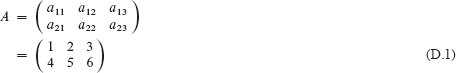

是一个 2 × 3 矩阵`A` = (`a[ij]`)，其中对于`i = 1`, 2 和`j = 1`, 2, 3，矩阵中第`i`行第`j`列的元素用`a[ij]`表示。按照惯例，大写字母表示矩阵，相应的带下标的小写字母表示它们的元素。我们用`ℝ^(m×n)`表示所有实值条目的`m × n`矩阵的集合，并且一般来说，用`S^(m×n)`表示条目来自集合`S`的`m × n`矩阵的集合。  

矩阵`A`的**转置**是通过交换矩阵`A`的行和列得到的矩阵`A`^T。对于方程(D.1)中的矩阵`A`，

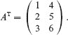

一个`向量` 是一个数字的一维数组。例如，

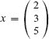

是一个大小为 3 的向量。我们有时将长度为`n`的向量称为**n-向量**。按照惯例，小写字母表示向量，大小为`n`的向量`x`的第`i`个元素用`x[i]`表示，其中`i = 1, 2, … , n`。我们将向量的标准形式视为等同于`n × 1`矩阵的**列向量**，而相应的**行向量**通过取转置得到：

`x^T = ( 2 3 5 )`.

**单位向量** `e[i]` 是其第`i`个元素为 1 且所有其他元素为 0 的向量。通常，上下文会明确单位向量的大小。

一个`零矩阵` 是所有条目都为 0 的矩阵。这样的矩阵通常用 0 表示，因为通常可以从上下文中解决数字 0 和全为 0 的矩阵之间的歧义。如果意图是一个全为 0 的矩阵，则还需要从上下文中推导出矩阵的大小。

**`方阵`**  

**方阵** `n × n` 矩阵经常出现。方阵的几个特殊情况特别重要：

1\. 一个`对角矩阵` 当`i ≠ j`时`a[ij] = 0`。因为所有非对角线元素为 0，因此指定矩阵的简洁方式仅列出沿对角线的元素：

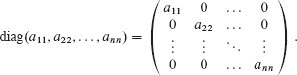

2\. `n × n` **单位矩阵** `I[n]` 是沿对角线为 1 的对角矩阵：

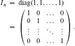

当`I`没有下标时，其大小由上下文决定。单位矩阵的第`i`列是单位向量`e[i]`。

3\. 一个`三对角矩阵` `T` 是当|`i` − `j` | > 1 时`t[ij] = 0` 的矩阵。非零条目仅出现在主对角线上，主对角线上方（`t[i,i+1]`对于`i = 1, 2, … , n` − 1），或主对角线下方（`t[i+1,i]`对于`i = 1, 2, … , n` − 1）：  

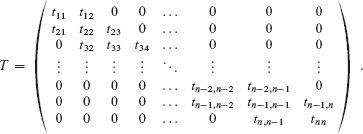

4\. 一个**上三角矩阵** `U` 是当`i > j`时`u[ij] = 0` 的矩阵。对角线以下的所有条目为 0：

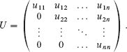

如果上三角矩阵沿对角线具有全部为 1 的元素，则称为**单位上三角矩阵**。

5\. 一个**下三角矩阵** *`L`* 是当`i < j`时`l[ij] = 0` 的矩阵。对角线以上的所有条目为 0：  

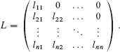

一个下三角矩阵如果沿对角线具有全部为 1 的元素，则称为**单位下三角矩阵**。

6\. 一个**置换矩阵** `P` 每行或每列恰好有一个 1，其他位置为 0。置换矩阵的一个示例是

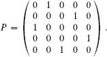

这样的矩阵称为置换矩阵，因为将向量`x`乘以置换矩阵的效果是对`x`的元素进行置换（重新排列）。练习 D.1-4 探讨了置换矩阵的其他性质。

7\. 一个**对称矩阵** `A` 满足条件 `A = A^T`。例如，

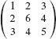

是一个对称矩阵。

**基本矩阵运算**

矩阵或向量的元素是来自数字系统的`标量数`，例如实数、复数或模素数。数字系统定义了如何对标量进行加法和乘法。这些定义扩展到包括矩阵的加法和乘法。

我们定义**矩阵加法**如下。如果`A = (a[ij])`和`B = (b[ij])`是`m × n`矩阵，那么它们的矩阵和`C = (c[ij]) = A + B`是由下式定义的`m × n`矩阵

`c[ij] = a[ij] + b[ij]`

对于`i = 1, 2, … , m`和`j = 1, 2, … , n`。也就是说，矩阵加法是逐分量执行的。零矩阵是矩阵加法的单位元：

`A + 0 = A = 0 + A`.

如果`λ`是一个标量数，`A` = (`a[ij]`)是一个矩阵，那么`λA` = (`λa[ij]`)是通过将其每个元素乘以`λ`获得的矩阵的**标量倍数**。作为一个特例，我们定义矩阵`A` = (`a[ij]`)的**负**为−1 · `A` = −`A`，因此−`A`的`ij`项为−`a[ij]`。因此，

`A + (-A) = 0 = (-A) + A`.

矩阵的负定义了**矩阵减法**：`A - B = A + (-B)`。

我们定义**矩阵乘法**如下。从两个矩阵`A`和`B`开始，这两个矩阵在列数等于`B`的行数的意义上是**兼容的**。（通常，包含矩阵乘积`AB`的表达式总是假定矩阵`A`和`B`是兼容的。）如果`A` = (`a[ik]`)是一个`p × q`矩阵，`B` = (`b[kj]`)是一个`q × r`矩阵，那么它们的矩阵乘积`C = AB`是一个`p × r`矩阵，其中  

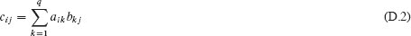

对于`i = 1, 2, … , m`和`j = 1, 2, … , p`。第 374 页的 RECTANGULAR-MATRIX-MULTIPLY 过程根据方程(D.2)以直接的方式实现矩阵乘法，假设`C`初始化为 0，使用`pqr`次乘法和`p(q - 1)r`次加法，运行时间为Θ(`pqr`)。如果矩阵是`n×n`方阵，使得`n = p = q = r`，则伪代码简化为第 81 页的 MATRIX-MULTIPLY，其运行时间为`Θ(n³)`。(第 4.2 节描述了一个由 V. Strassen 提出的渐进更快的Θ(`n^(lg7)`)时间算法。)  

矩阵具有许多（但不是全部）类似于数字的代数性质。单位矩阵是矩阵乘法的单位元：

`I[m]A = AI[n] = A`

对于任意`m * n`矩阵`A`。乘以零矩阵得到零矩阵：

`A * 0 = 0.`

矩阵乘法是结合的：

`A(BC) = (AB)C`

对于兼容的矩阵`A`、`B`和`C`。矩阵乘法分配于加法：

| `A(B + C)` | = | `AB + AC`, |
| --- | --- | --- |
| (`B + C`)`D` | = | `BD + CD`. |

对于`n > 1`，`n × n`矩阵的乘法不是交换的。例如，如果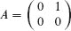和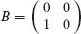，那么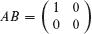和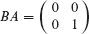。

我们将矩阵-向量乘积或向量-向量乘积定义为如果向量等同于`n × 1` 矩阵（或者在行向量的情况下为 `1 × n` 矩阵）。因此，如果`A` 是一个`m × n`矩阵，`x` 是一个`n`-向量，那么 `Ax` 就是一个`m`-向量。如果`x` 和 `y` 是`n`-向量，那么

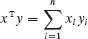

是一个标量数（实际上是一个 1 × 1 矩阵），称为`x`和`y`的**内积**。我们还使用记号<`x`, `y`>表示`x`^T`y`。内积运算符是可交换的：<`x`, `y`> = <`y`, `x`>。矩阵`xy`^T 是一个`n × n`矩阵`Z`，称为`x`和`y`的**外积**，其中`z[ij] = x[i]y[j]`。`n`维向量`x`的**(欧几里得)范数** ∥`x`∥的定义为

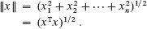

因此，`x`的范数是它在 n 维欧几里得空间中的长度。一个有用的事实，根据等式

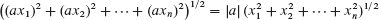

对于任意实数`a`和`n`维向量`x`，

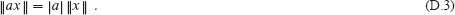

**`练习`**  

`D.1-1`

表明如果`A`和`B`是对称的`n × n`矩阵，则`A + B`和`A - B`也是对称的。

**D.1-2**

证明(`AB`)^T = `B`^T`A`^T 以及`A`^T`A`始终是对称矩阵。  

**D.1-3**

证明两个下三角矩阵的乘积仍为下三角矩阵。

**D.1-4**

证明如果`P`是一个`n × n`置换矩阵，`A`是一个`n × n`矩阵，则矩阵乘积`PA`是`A`的行置换，矩阵乘积`AP`是`A`的列置换。证明两个置换矩阵的乘积是一个置换矩阵。

**D.2 基本矩阵属性**

现在我们定义一些关于矩阵的基本属性：逆、线性相关和无关、秩和行列式。我们还定义了正定矩阵类。

**矩阵的逆、秩和行列式**

`n × n`矩阵`A`的**逆**是一个`n × n`矩阵，记为`A^(−1)`（如果存在），满足`AA^(−1) = I[n] = A^(−1)A`。例如，

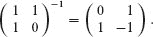

许多非零`n × n`矩阵没有逆。没有逆的矩阵称为**不可逆**或**奇异**。一个例子是

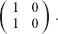

如果一个矩阵有逆，那么它被称为`可逆`或`非奇异`。矩阵的逆，如果存在，是唯一的。（参见练习 D.2-1。）如果`A`和`B`是非奇异的`n × n`矩阵，则  

`BA`^(-1) = `A`^(-1)`B`^(-1)。  

逆运算与转置运算可交换：

`(`A`^(-1))^T = (`A`^T)^(-1).`  

如果存在系数 `c₁`, `c₂`, … , `c[n]`，不全为 0，使得 `c₁*x₁ + c₂*x₂ + ⋯ + c[n]x[n] = 0`，那么向量 `x₁`, `x₂`, … , `x[n]` **线性相关**。例如，行向量 `x₁ = ( 1 2 3 )`，`x₂ = ( 2 6 4 )`，和 `x[3] = ( 4 11 9 )` 是线性相关的，因为 `2*x₁+3*x₂−2*x[3] = 0`。如果向量不是线性相关，则它们是**线性无关**的。例如，单位矩阵的列是线性无关的。  

非零`m × n`矩阵`A`的**列秩**是`A`的线性无关列的最大集合的大小。类似地，`A`的**行秩**是`A`的线性无关行的最大集合的大小。任何矩阵`A`的一个基本性质是，它的行秩总是等于列秩，因此我们可以简单地称为`A`的**秩**。一个`m × n`矩阵的秩是一个介于 0 和 min {`m`, `n`}之间的整数（零矩阵的秩为 0，`n × n`单位矩阵的秩为`n`）。另一个等价但通常更有用的定义是，非零`m`×`n`矩阵`A`的秩是存在矩阵`B`和`C`，分别为`m × r`和`r × n`的最小数`r`，使得`A = BC`。一个`n × n`方阵如果秩为`n`，则具有**满秩**。一个`m × n`矩阵如果秩为`n`，则具有**满列秩**。以下定理给出了秩的一个基本性质。

**`定理 D.1`**

一个方阵具有满秩当且仅当它是非奇异的。  

▪

对于矩阵`A`，零向量是一个非零向量`x`，使得`Ax = 0`。以下定理（其证明留作练习 D.2-7）及其推论将列秩和奇异性的概念与零向量联系起来。

**定理 `D.2`** 

一个矩阵具有完整的列秩当且仅当它没有零向量。

▪

`推论 D.3`

方阵是奇异的当且仅当它有一个零向量。

▪  输出：

对于`n > 1` 的`n`×`n`矩阵`A`，第`ij`个**子式**是通过删除`A`的第`i`行和第`j`列得到的(`n`−1)×(`n`−1)矩阵`A`[[`ij`]]。通过子式的递归定义，`n`×`n`矩阵`A`的**行列式**如下定义：

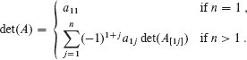

术语`(-1)^(i+j)` det(`A[[ij]]`)被称为元素`a[ij]`的**余子式**。

以下定理的证明被省略，表达了行列式的基本性质。

**定理 D.4（行列式性质）**

方阵`A`的行列式具有以下性质：

+   如果`A`的任意一行或任意一列为零，则 `det(A) = 0`。

+   如果`A`的任意一行（或任意一列）的元素都乘以`λ`，则`A`的行列式乘以`λ`。  

+   如果一行（或一列）的元素加到另一行（或另一列）的元素中，则`A`的行列式保持不变。

+   `A`的行列式等于`A^T`的行列式。

+   如果交换任意两行（或任意两列），则`A`的行列式乘以−1。

此外，对于任何方阵`A`和`B`，我们有 `det(AB) = det(A) det(B)`。

▪ 输出：

**`定理 D.5`**  

一个`n × n`矩阵`A`是奇异当且仅当 det(`A`) = 0。

▪

`正定矩阵`

正定矩阵在许多应用中起着重要作用。如果对于所有非零`n`维向量`x`，`x^TAx > 0`，则`n × n`矩阵`A`是**正定的**。例如，单位矩阵是正定的，因为如果`x = ( x₁ x₂ ⋯ x[n] )^T` 是一个非零向量，则  

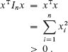  

在应用中出现的矩阵通常是正定的，这归因于以下定理。

**定理 D.6**

对于具有完整列秩的任何矩阵`A`，矩阵`A^T*A`是正定的。

**证明**   我们必须证明对于任何非零向量`x`，`x^T(A^T*A)x > 0`。对于任何向量`x`，

| x^T(A^T*A)x |  =  | (Ax)^T(Ax) | ` （根据习题 D.1-2） |
| --- | --- | --- | --- | --- |
| --- | --- | --- | --- |   |
|  | = | ∥Ax∥²。 |  |

∥`Ax`∥²的值就是向量`Ax`的元素平方和。因此，∥`Ax`∥² ≥ 0。我们通过反证法证明∥`Ax`∥² > 0。假设∥`Ax`∥² = 0。那么，`Ax`的每个元素都是 0，即`Ax = 0`。由于`A`具有完整的列秩，定理 D.2 表明`x = 0`，这与`x`非零的要求相矛盾。因此，`A`^T`A`是正定的。

▪

第 28.3 节探讨正定矩阵的其他性质。第 33.3 节使用类似的条件，称为半正定。如果对于所有非零`n`维向量`x`，`x^T Ax ≥ 0`，则`n × n`矩阵`A`是**半正定**的。

**习题**

`D.2-1`

证明矩阵的逆是唯一的，即，如果`B`和`C`是`A`的逆，则`B = C`。

`D.2-2`

证明下三角或上三角矩阵的行列式等于其对角线元素的乘积。证明下三角矩阵的逆（如果存在）也是下三角的。

`D.2-3`

证明如果`P`是一个置换矩阵，则`P`是可逆的，其逆矩阵是`P^T`，并且`P^T`是一个置换矩阵。

`D.2-4`

设`A`和`B`是`n × n`矩阵，使得`AB = I`。证明如果从`A`中的第`j`行加到第`i`行得到`A'`，其中`i ≠ j`，那么从`B`中的第`i`列减去第`j`列得到`A'`的逆`B'`。

`D.2-5`

设`A`是一个具有复数元素的非奇异`n × n`矩阵。证明当且仅当`A`的每个元素都是实数时，`A⁻¹`的每个元素都是实数。

`D.2-6`

证明如果`A`是一个非奇异、对称的`n × n`矩阵，那么`A`^(−1)也是对称的。证明如果`B`是一个任意的`m × n`矩阵，那么由乘积`BAB`^T 给出的`m × m`矩阵是对称的。

**D.2-7**

证明定理 D.2。即，证明矩阵`A`具有完整列秩当且仅当`Ax = 0` 意味着`x = 0`。(*提示:* 将一列对其他列的线性相关性表达为矩阵-向量方程。)

`D.2-8`  

证明对于任意两个兼容的矩阵`A`和`B`，

rank(`AB`) ≤ min {rank(`A`), rank(`B`)},  

当且仅当`A`或`B`是非奇异方阵时，等式成立。（*提示:* 使用矩阵秩的另一定义。）

输出：

**D-1 范德蒙矩阵**

给定数字`x₀`，`x₁`，…，`x[n−1]`，证明**范德蒙矩阵**的行列式

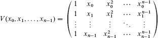

是

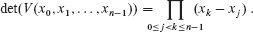

(*提示:* 将第`i`列乘以−`x₀`并加到第`i` + 1 列，对于`i = n` − 1，`n` − 2，…，1，然后使用归纳法。)

**D-2 由 GF*(2)上的矩阵-向量乘法定义的排列**

通过在`GF(2)`上进行矩阵乘法，将整数集`S[n]` = {0, 1, 2, … , 2*^n* − 1}的一类排列定义为二进制表示，对于每个整数`x ∈ S[n]`，我们将其二进制表示视为一个`n`位向量

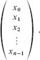  

其中 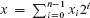。如果`A`是每个条目为 0 或 1 的`n × n`矩阵，则我们可以定义一个排列，将`S[n]`中的每个值`x`映射到其二进制表示为矩阵-向量乘积`Ax`的数字。所有这些算术都在**GF*(2)**上执行：所有值都是 0 或 1，除了一个例外，通常的加法和乘法规则适用。例外是 1 + 1 = 0。您可以将*GF*(2)上的算术视为与常规整数算术完全相同，只是您只使用最低有效位。

例如，对于`S₂ = {0, 1, 2, 3}`，矩阵

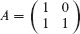

定义以下排列`π[A]`：`πA`中进行操作，

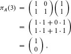

这是 `1` 的二进制表示。

在接下来的问题中，我们将在`GF(2)`上进行操作，所有矩阵和向量的条目将为 0 或 1。将 0-1 矩阵（每个条目为 0 或 1 的矩阵）在`GF(2)`上的**秩**定义为与常规矩阵相同，但所有确定线性独立性的算术都在`GF(2)`上执行。我们通过以下方式定义`n × n` 0-1 矩阵`A`的**范围**：

`R(A) = {y : y = Ax，对于某个 x ∈ S[n]}`,  

使得`R(A)`是通过将`S[n]`中的每个值`x`乘以`A`得到的数字集合。

**a.** 如果矩阵`A`的秩为`r`，证明|`R(A)`| = 2*^r*。得出结论，只有当`A`具有完整秩时，`A`才在`S[n]`上定义排列。

对于给定的`n × n`矩阵`A`和给定的值`y ∈ R(A)`，我们通过以下方式定义`y`的**原像**：

`P` (`A, y`) = {`x : Ax = y`}

使得`P(A, y)`是通过`A`乘以`S[n]`中的每个值`x`得到`y`的值集合。

**b.** 如果`r`是`n × n`矩阵`A`的秩，且`y ∈ R(A)`，证明|`P(A, y)`| = 2^(n−r)。  

令 0 ≤ `m ≤ n`，并假设我们将集合`S[n]`分成连续数字的块，第`i`块由 2^(`m`)个数字`i*2^m`, `i*2^m + 1`, `i*2^m +2`, … , (`i` +1)2``m`` −1 组成。对于任意子集`S` ⊆ `S[n]`，定义`B(S, m)`为包含`S`中某个元素的大小为 2``m``的块集合。例如，当`n = 3`，`m = 1`，且`S` = {1, 4, 5}时，`B(S, m)`包括块 0（因为 1 在第 0 块中）和块 2（因为 4 和 5 都属于第 2 块）。

**c.** 让`r`是`A`的左下角(`n` - `m`) × `m`子矩阵的秩，即由取底部`n` - `m`行和最左边`m`列形成的矩阵。让`S`是`S[n]`的任意大小为 2*^m*的块，并且让`S'` = {`y` : `y` = *Ax*，对于某个`x ∈ S`}。证明|`B(S', m)`| = 2*^r*，并且对于`B(S', m)`中的每个块，恰好有 2^(`m`-`r`)个数字在`S`中映射到该块。

因为将零向量乘以任何矩阵都会得到零向量，由满秩`n × n` 0-1 矩阵在`GF(2)`上定义的`S[n]`的排列集合不能包含`S[n]`的所有排列。让我们通过在矩阵-向量乘法中包含一个加法项来扩展由矩阵-向量乘法定义的排列类，以便`x ∈ S[n]`映射到`Ax + c`，其中`c`是一个`n`-比特向量，加法在`GF(2)`上执行。例如，当

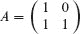  

和  输出：

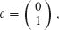

我们得到以下排列`π[A,c]`：`π[A,c](0 = 2`，`π[A,c](1 = 1`，`π[A,c](2 = 0`，`π[A,c](3 = 3`。我们称任何将`x ∈ S[n]`映射到`Ax + c`，对于某个具有满秩的`n × n` 0-1 矩阵`A` 和某个`n`-比特向量`c` 的排列为**线性排列**。

**d.** 使用计数论证明`S[n]`的线性排列数量远小于`S[n]`的排列数量。

**e.** 给出一个`n`的值和一个`S[n]`的排列的例子，该排列不能通过任何线性排列实现。（提示：对于给定的排列，考虑如何将矩阵乘以单位向量与矩阵的列相关联。）

**附录注释**

线性代数教科书提供了关于矩阵的大量背景信息。Strang 的书籍\[422, 423\]特别好。
