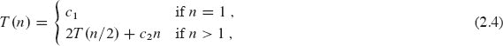

**2          入门**

本章将使您熟悉我们将在整本书中使用的框架，以思考算法的设计和分析。它是独立的，但包含了对将在第三章和第四章中介绍的材料的几个引用。（它还包含几个求和，附录 A 展示了如何解决。）

我们将从检查插入排序算法开始，以解决第一章中介绍的排序问题。我们将使用伪代码指定算法，如果您有计算机编程经验，应该能够理解。我们将看到为什么插入排序能够正确排序并分析其运行时间。分析引入了一种描述运行时间随要排序的项目数量增加而增加的符号。在讨论插入排序之后，我们将使用一种称为分而治之的方法来开发一个名为归并排序的排序算法。最后，我们将分析归并排序的运行时间。

**2.1      插入排序**

我��的第一个算法，插入排序，解决了第一章中介绍的***排序问题***：

**输入:** 一个包含*n*个数字〈*a*[1], *a*[2], … , *a[n]*〉的序列。

**输出:** 输入序列的一个排列（重新排序），使得。

要排序的数字也被称为***键***。虽然问题概念上是关于对序列进行排序，但输入以包含*n*个元素的数组形式呈现。当我们想要对数字进行排序时，通常是因为它们是与其他数据相关联的键，我们称之为***卫星数据***。一起，键和卫星数据形成一个***记录***。例如，考虑一个包含许多相关数据的学生记录的电子表格，如年龄、平均绩点和所修课程数。这些数量中的任何一个都可以是一个键，但当电子表格进行排序时，它会将与键相关联的记录（卫星数据）一起移动。在描述排序算法时，我们关注键，但重要的是要记住通常会有相关的卫星数据。

在本书中，我们通常将算法描述为以类似于 C、C++、Java、Python¹或 JavaScript 的***伪代码***编写的过程。如果您已经接触过这些语言中的任何一种，那么应该很容易理解以伪代码“编码”的算法。伪代码与真实代码的区别在于，在伪代码中，我们使用最清晰简洁的表达方法来指定给定算法。有时最清晰的方法是英语，因此如果您在看起来更像真实代码的部分中遇到嵌入的英语短语或句子，不要感到惊讶。伪代码与真实代码的另一个区别是，为了更简洁地传达算法的本质，伪代码通常忽略软件工程的方面，如数据抽象、模块化和错误处理。

我们从***插入排序***开始，这是一种对少量元素进行排序的高效算法。插入排序的工作方式类似于整理一手扑克牌。从一个空的左手开始，桌上有一摞牌。拿起桌上的第一张牌，用左手拿住。然后，用右手，从牌堆中逐张拿出一张牌，并将其插入左手的正确位置。正如图 2.1 所示，通过将右手中的卡片与左手中已有的每张卡片进行比较，从右向左开始，找到卡片的正确位置。一旦看到左手中有一张值小于或等于右手中的卡片，就将右手中的卡片插入到左手中这张卡片的右侧。如果左手中的所有卡片的值都大于右手中的卡片，则将这张卡片放在左手中最左边。始终保持左手中的卡片排序，这些卡片最初是桌上牌堆的顶部卡片。

插入排序的伪代码如下所示，称为 INSERTION-SORT 过程。它接受两个参数：包含要排序的值的数组 *A* 和要排序的值的数量 *n*。 这些值占据数组的位置 *A*[1] 到 *A*[*n*]，我们用 *A*[1 : *n*] 表示。当 INSERTION-SORT 过程完成时，数组 *A*[1 : *n*] 包含原始值，但按排序顺序排列。

**图 2.1** 使用插入排序整理一手牌。

INSERTION-SORT(*A, n*)

| 1 | **for** *i* = 2 **to** *n* |
| --- | --- |
| 2 | *key* = *A*[*i*] |
| 3 | **//** 将 *A*[*i*] 插入已排序的子数组 *A*[1 : *i* – 1]。 |
| 4 | *j* = *i* – 1 |
| 5 | **while** *j* > 0 and *A*[*j*] > *key* |
| 6 | *A*[*j* + 1] = *A*[*j*] |
| 7 | *j* = *j* – 1 |
| 8 | *A*[*j* + 1] = *key* |

**循环不变式和插入排序的正确性**

图 2.2 展示了这个算法如何处理一个以序列 〈5, 2, 4, 6, 1, 3〉 开始的数组 *A*。索引 *i* 表示正在插入手中的“当前卡片”。在由 *i* 索引的 **for** 循环的每次迭代开始时，由元素 *A*[1 : *i* – 1]（即 *A*[1] 到 *A*[*i* – 1]）组成的***子数组***（数组的连续部分）构成当前排序好的手，而剩余的子数组 *A*[*i* + 1 : *n*]（元素 *A*[*i* + 1] 到 *A*[*n*]）对应于桌上仍留着的牌堆。实际上，元素 *A*[1 : *i* – 1] 是最初在位置 1 到 *i* – 1 的元素，但现在按排序顺序排列。我们正式陈述 *A*[1 : *i* – 1] 的这些属性作为一个***循环不变式***：

**图 2.2** INSERTION-SORT(*A, n*) 的操作，其中 *A* 最初包含序列 〈5, 2, 4, 6, 1, 3〉，*n* = 6\. 数组索引出现在矩形上方，数组位置中存储的值出现在矩形内部。**(a)–(e)** 行 1–8 的 **for** 循环的迭代。在每次迭代中，蓝色矩形中存放着从 *A*[*i*] 中取出的关键字，该关键字与左侧的棕色矩形中的值进行比较，从右向左开始。一旦看到左手中有一张值小于或等于右手中的卡片，就将右手中的卡片插入到左手中这张卡片的右侧。如果左手中的所有卡片的值都大于右手中的卡片，则将这张卡片放在左手中最左边。始终保持左手中的卡片排序，这些卡片最初是桌上牌堆的顶部卡片。

在行 1–8 的 **for** 循环的每次迭代开始���，子数组 *A*[1 : *i* – 1] 包含最初在 *A*[1 : *i* – 1] 中的元素，但按排序顺序排列。

循环不变式帮助我们理解算法为什么是正确的。当使用循环不变式时，需要展示三点：

**初始化：** 在循环的第一次迭代之前为真。

**维护：** 如果在循环的一次迭代之前为真，则在下一次迭代之前仍为真。

**终止：** 循环终止时，循环不变式——通常连同循环终止的原因——给我们提供了一个有用的属性，有助于展示算法的正确性。

当前两个属性成立时，循环不变式在每次循环迭代之前都是真实的。（当然，您可以使用除了循环不变式本身之外的已知事实来证明在每次迭代之前循环不变式仍然成立。）循环不变式证明是数学归纳的一种形式，其中为了证明一个属性成立，您需要证明一个基本情况和一个归纳步骤。在这里，展示在第一次迭代之前不变式成立对应于基本情况，展示在迭代之间不变式保持对应于归纳步骤。

第三个属性可能是最重要的，因为您使用循环不变式来展示正确性。通常，您会将循环不变式与导致循环终止的条件一起使用。数学归纳通常会无限地应用归纳步骤，但在循环不变式中，“归纳”在循环终止时停止。

让我们看看这些属性如何适用于插入排序。

**初始化：** 我们首先展示循环不变式在第一次循环迭代之前，即*i* = 2 时成立。子数组*A*[1 : *i* – 1]只包含单个元素*A*[1]，实际上就是*A*[1]中的原始元素。此外，这个子数组是排序的（毕竟，只有一个值的子数组怎么可能不是排序的？），这表明循环不变式在循环的第一次迭代之前是成立的。

**维护：** 接下来，我们解决第二个属性：展示每次迭代如何保持循环不变式。非正式地说，**for**循环的主体通过将*A*[*i* – 1]、*A*[*i* – 2]、*A*[*i* – 3]等值向右移动一个位置，直到找到*A*[*i*]的正确位置（第 4 至 7 行），然后插入*A*[*i*]的值（第 8 行）来工作。然后，子数组*A*[1 : *i*]包含的是原始的*A*[1 : *i*]中的元素，但是按排序顺序排列。**递增** *i*（将其值增加 1）以供**for**循环的下一次迭代保持循环不变式。

对第二个属性的更正式处理需要我们为第 5 至 7 行的**while**循环陈述并展示一个循环不变式。让我们暂时不要陷入这种形式主义。相反，我们将依赖我们的非正式分析来展示第二个属性对外部循环是成立的。

**终止：** 最后，我们检查循环终止。循环变量*i*从 2 开始，并在每次迭代中增加 1。一旦*i*的值在第 1 行超过*n*，循环就终止。也就是说，一旦*i*等于*n* + 1 时，循环终止。将*n* + 1 代入循环不变式的措辞中，得出子数组*A*[1 : *n*]包含的是原始的*A*[1 : *n*]中的元素，但按排序顺序排列。因此，算法是正确的。

这种循环不变式的方法用于展示本书中各处的正确性。

**伪代码约定**

我们在伪代码中使用以下约定。

+   缩进表示块结构。例如，从第 1 行开始的**for**循环的主体包括第 2 至 8 行，而从第 5 行开始的**while**循环的主体包括第 6 至 7 行，但不包括第 8 行。我们的缩进风格也适用于**if-else**语句。使用缩进而不是文本指示块结构的方法，如**begin**和**end**语句或花括号，可以减少混乱，同时保持甚至增强清晰度。

+   循环结构**while**、**for**和**repeat-until**以及**if-else**条件结构的解释与 C、C++、Java、Python 和 JavaScript 中的类似。⁵ 在本书中，循环计数器在退出循环后保留其值，不像在 C++和 Java 中出现的某些情况。因此，在**for**循环后，循环计数器的值是首次超过**for**循环边界的值。⁶ 我们在插入排序的正确性论证中使用了这个属性。第 1 行中的**for**循环头是**for** *i* = 2 **to** *n*，因此当这个循环终止时，*i*等于*n* + 1。当**for**循环在每次迭代中递增其循环计数器时，我们使用关键字**to**，当**for**循环***递减***其循环计数器（每次迭代减少 1）时，我们使用关键字**downto**。当循环计数器的变化量大于 1 时，变化量遵循可选关键字**by**。

+   符号“**//**”表示该行剩余部分是注释。

+   变量（如*i*、*j*和*key*）是局部于给定过程的。我们不会在没有明确指示的情况下使用全局变量。

+   我们通过指定数组名称后跟方括号中的索引��访问数组元素。例如，*A*[*i*]表示数组*A*的第*i*个元素。

    尽管许多编程语言对数组实施从 0 开始的索引（0 是最小有效索引），但我们选择最清晰的索引方案供人类读者理解。因为人们通常从 1 开始计数，而不是从 0 开始，本书中的大多数数组使用 1 起始索引。为了明确某个算法是否假定从 0 开始或从 1 开始索引，我们将明确指定数组的边界。如果您正在实现我们用 1 起始索引指定的算法，但您使用的编程语言强制从 0 开始索引（如 C、C++、Java、Python 或 JavaScript），那么您可以自行调整。您可以从每个索引中减去 1，或者为每个数组分配一个额外位置，然后忽略位置 0。

    符号“:”表示子数组。因此，*A*[*i* : *j*]表示由元素*A*[*i*]、*A*[*i* + 1]、…、*A*[*j*]组成的*A*的子数组。⁷ 我们在讨论数组*A*[1 : *n*]时也使用了这种表示法来指示数组的边界。

+   我们通常将复合数据组织成***对象***，这些对象由***属性***组成。我们使用许多面向对象编程语言中的语法来访问特定属性：对象名称，后跟一个点，再后跟属性名称。例如，如果一个对象*x*有属性*f*，我们用*x.f*表示这个属性。

    我们将表示数组或对象的变量视为指针（在一些编程语言中称为引用），指向表示数组或对象的数据。对于对象*x*的所有属性*f*，设置*y* = *x*会导致*y.f*等于*x.f*。此外，如果我们现在设置*x.f* = 3，那么之后不仅*x.f*等于 3，而且*y.f*也等于 3。换句话说，在赋值*y* = *x*后，*x*和*y*指向同一个对象。这种处理数组和对象的方式与大多数当代编程语言一致。

    我们的属性表示法可以“级联”。例如，假设属性*f*本身是指向某种具有属性*g*的对象的指针。那么表示法*x.f.g*隐含地被括号化为（*x.f*）.*g*。换句话说，如果我们已经赋值*y* = *x.f*，那么*x.f.g*就等同于*y.g*。

    有时指针可能不指向任何对象。在这种情况下，我们给它赋予特殊值 NIL。

+   我们通过***按值***向过程传递参数：被调用的过程接收参数的自己副本，如果它给参数赋值，那么调用过程看不到这个改变。当对象被传递时，表示对象的数据指针被复制，但对象的属性不会被复制。例如，如果*x*是被调用过程的参数，那么在被调用过程内部的赋值*x* = *y*对调用过程是不可见的。然而，如果调用过程有指向与*x*相同对象的指针，那么赋值*x.f* = 3 是可见的。同样，数组是通过指针传递的，因此传递的是数组的指针，而不是整个数组，对单个数组元素的更改对调用过程是可见的。再次强调，大多数当代编程语言都是这样工作的。

+   **return**语句立即将控制权传回调用过程的调用点。大多数**return**语句还会带有一个值传回给调用者。我们的伪代码与许多编程语言不同之处在于，我们允许在单个**return**语句中返回多个值，而无需创建对象将它们打包在一起。⁸

+   布尔运算符“and”和“or”是***短路运算***的。也就是说，通过首先评估*x*来评估表达式“*x* and *y*”。如果*x*评估为 FALSE，那么整个表达式不能评估为 TRUE，因此*y*不会被评估。另一方面，如果*x*评估为 TRUE，则必须评估*y*以确定整个表达式的值。类似地，在表达式“*x* or *y*”中，只有当*x*评估为 FALSE 时才评估表达式*y*。短路运算符允许我们编写布尔表达式，如“*x* ≠ NIL and *x.f* = *y*”，而不用担心在*x*为 NIL 时评估*x.f*会发生什么。

+   关键字**error**表示发生错误，因为调用过程的条件不正确，所以过程立即终止。调用过程负责处理错误，因此我们不指定要采取的操作。

**练习**

***2.1-1***

使用图 2.2 作为模型，说明在初始包含序列〈31, 41, 59, 26, 41, 58〉的数组上执行 INSERTION-SORT 的操作。

***2.1-2***

考虑面向页面的 SUM-ARRAY 过程。它计算数组*A*[1 : *n*]中*n*个数字的和。为该过程陈述一个循环不变式，并使用其初始化、维护和终止属性来展示 SUM-ARRAY 过程返回*A*[1 : *n*]中数字的和。

SUM-ARRAY(*A, n*)

| 1 | *sum* = 0 |
| --- | --- |
| 2 | **for** *i* = 1 **to** *n* |
| 3 | *sum* = *sum* + *A*[*i*] |
| 4 | **return** *sum* |

***2.1-3***

重写 INSERTION-SORT 过程，以按单调递减顺序排序而不是单调递增顺序。

***2.1-4***

考虑***搜索问题***：

**输入:** 存储在数组*A*[1 : *n*]中的*n*个数字序列〈*a*[1], *a*[2], … , *a[n]*〉和一个值*x*。

**输出:** 一个索引*i*，使得*x*等于*A*[*i*]，或者特殊值 NIL，如果*x*不出现在*A*中。

编写***线性搜索***的伪代码，该算法从头到尾扫描数组，寻找*x*。使用循环不变式证明你的算法是正确的。确保你的循环不变式满足三个必要属性。

***2.1-5***

考虑将两个*n*位二进制整数*a*和*b*相加的问题，它们分别存储在两个*n*元素数组*A*[0 : *n* – 1]和*B*[0 : *n* – 1]中，其中每个元素都是 0 或 1，，以及。两个整数的和*c* = *a* + *b*应以二进制形式存储在一个(*n* + 1)元素数组*C*[0 : *n*]中，其中。编写一个名为 ADD-BINARY-INTEGERS 的过程，该过程接受数组*A*和*B*以及长度*n*作为输入，并返回存储和的数组*C*。

**2.2      分析算法**

***分析***算法已经意味着预测算法所需的资源。您可能考虑资源，如内存、通信带宽或能源消耗。然而，最常见的情况是您希望测量计算时间。如果为一个问题分析了几个候选算法，您可以确定最有效的算法。可能不止一个可行的候选算法，但在这个过程中通常可以排除几个较差的算法。

在分析算法之前，您需要一个运行该算法的技术模型，包括该技术的资源以及表达它们成本的方式。本书的大部分内容假定一种通用的单处理器、***随机访问机器（RAM）***计算模型作为实现技术，理解算法是作为计算机程序实现的。在 RAM 模型中，指令依次执行，没有并发操作。RAM 模型假设每条指令的执行时间与任何其他指令相同，并且每次数据访问——使用变量的值或存储到变量中——所需的时间与任何其他数据访问相同。换句话说，在 RAM 模型中，每条指令或数据访问都需要固定的时间——甚至是对数组进行索引。⁹

严格来说，我们应该精确定义 RAM 模型的指令及其成本。然而，这样做将是乏味的，并且对算法设计和分析没有太多见解。但我们必须小心不要滥用 RAM 模型。例如，如果 RAM 有一个排序指令会怎么样？那么你可以在一步中完成排序。这样的 RAM 是不现实的，因为真实计算机中不存在这样的指令。因此，我们的指导是真实计算机的设计方式。RAM 模型包含在真实计算机中常见的指令：算术（如加、减、乘、除、余数、向下取整、向上取整）、数据移动（加载、存储、复制）和控制（条件和无条件分支、子程序调用和返回）。

RAM 模型中的数据类型包括整数、浮点数（用于存储实数近似值）和字符。真实计算机通常没有单独的数据类型来表示布尔值 TRUE 和 FALSE。相反，它们通常测试一个整数值是否为 0（FALSE）或非零（TRUE），就像在 C 语言中一样。尽管在本书中我们通常不关心浮点值的精度（许多数字在浮点数中无法精确表示），但对于大多数应用程序来说，精度至关重要。我们还假设每个数据字的位数有一个限制。例如���在处理大小为*n*的输入时，我们通常假设整数由*c* log[2] *n*位表示，其中*c* ≥ 1 是一个常数。我们要求*c* ≥ 1，以便每个字可以保存*n*的值，从而使我们能够索引各个输入元素，并且我们限制*c*为常数，以便字长不会任意增长。（如果字长可以任意增长，我们可以在一个字中存储大量数据并在常数时间内操作所有数据——这是一个不现实的场景。）

真实计算机包含上述未列出的指令，这些指令在 RAM 模型中代表一个灰色区域。例如，幂运算是否是一个常数时间指令？一般情况下，不是：计算*x^n*当*x*和*n*是一般整数时，通常需要对*n*进行对数时间的计算（见第 934 页的方程（31.34）），并且您必须担心结果是否适合计算机字。然而，如果*n*是一个确切的 2 的幂，幂运算通常可以视为常数时间操作。许多计算机有一个“左移”指令，它在常数时间内将整数的位向左移动*n*个位置。在大多数计算机中，将整数的位向左移动 1 个位置等效于乘以 2，因此将整数的位向左移动*n*个位置等效于乘以 2*^n*。因此，这样的计算机可以通过将整数左移 1 个位置来在 1 个常数时间指令中计算 2*^n*，只要*n*不超过计算机字中的位数。我们将尽量避免 RAM 模型中的这种灰色区域，并在结果小到适合计算机字时将计算 2*^n*和乘以 2*^n*视为常数时间操作。

RAM 模型不考虑当代计算机中常见的存储器层次结构。它既不模拟缓存，也不模拟虚拟内存。几种其他计算模型试图考虑存储器层次结构的影响，这在实际机器上的真实程序中有时很重要。本书的第 11.5 节和一些问题探讨了存储器层次结构的影响，但在大部分情况下，本书的分析并未考虑它们。包含存储器层次结构的模型比 RAM 模型复杂得多，因此可能难以处理。此外，RAM 模型的分析通常是实际机器性能的出色预测器。

尽管在 RAM 模型中分析算法通常很直接，但有时可能会很具挑战性。您可能需要运用诸如组合数学、概率论、代数灵活性以及识别公式中最重要项的能力等数学工具。由于算法可能对每个可能的输入表现不同，我们需要一种方法来用简单易懂的公式总结其行为。

**插入排序的分析**

INSERTION-SORT 程序需要多长时间？一种方法是在您的计算机上运行它并计算运行时间。当然，您首先必须在真实编程语言中实现它，因为您无法直接运行我们的伪代码。这样的定时测试会告诉您什么？您将了解插入排序在您特定的计算机上运行所需的时间，对于特定的输入，在您创建的特定实现下，在您运行的特定编译器或解释器下，在您链接的特定库下，以及在您计算机上与您的定时测��同时运行的特定后台任务（例如检查网络上的传入信息）。如果您再次在您的计算机上使用相同的输入运行插入排序，您甚至可能得到不同的定时结果。仅通过在一个计算机上运行一个插入排序实现并在一个输入上运行，如果您给它不同的输入，如果您在不同的计算机上运行它，或者如果您在不同的编程语言中实现它，您将能够确定插入排序的运行时间吗？不多。我们需要一种方法来预测，给定一个新输入，插入排序将需要多长时间。

我们可以通过分析算法本身来确定插入排序需要多长时间，而不是计时一次运行，甚至多次运行。我们将检查伪代码的每一行执行多少次以及每一行伪代码运行多长时间。我们首先为运行时间制定一个精确但复杂的公式。然后，我们将使用方便的符号提炼出公式的重要部分，这可以帮助我们比较相同问题的不同算法的运行时间。

我们如何分析插入排序？首先，让我们承认运行时间取决于输入。排序一千个数字所需的时间比排序三个数字所需的时间长并不奇怪。此外，插入排序对于排序两个大小相同的输入数组可能需要不同的时间，这取决于它们已经排序得有多接近。即使运行时间可能取决于输入的许多特征，我们将专注于已被证明具有最大影响的特征，即输入大小，并将程序的运行时间描述为其输入大小的函数。为此，我们需要更仔细地定义“运行时间”和“输入大小”的术语。我们还需要明确我们是否讨论引发最坏情况行为、最佳情况行为或其他情况的输入的运行时间。

***输入大小*** 的最佳概念取决于所研究的问题。对于许多问题，例如排序或计算离散傅立叶变换，最自然的度量是输入中的项目数量，例如，正在排序的项目数量*n*。对于许多其他问题，例如两个整数相乘，输入大小的最佳度量是表示输入所需的总位数，以普通二进制表示法表示。有时，用不止一个数字描述输入大小更合适。例如，如果算法的输入是一个图，我们通常通过图中的顶点数和边数来表征输入大小。我们将在研究每个问题时指出使用的输入大小度量。

算法在特定输入上的***运行时间*** 是执行的指令和数据访问次数。我们如何计算这些成本应该独立于任何特定计算机，但在 RAM 模型的框架内。暂时，让我们采用以下观点。执行伪代码的每一行都需要恒定的时间。一行可能比另一行花费更多或更少的时间，但我们假设第*k*行的每次执行都需要*c[k]*时间，其中*c[k]*是一个常数。这个观点符合 RAM 模型，并反映了伪代码在大多数实际计算机上的实现方式。

让我们分析**插入排序**过程。正如承诺的那样，我们将首先设计一个精确的公式，该公式使用输入大小和所有语句成本*c[k]*。然而，这个公式变得混乱。然后，我们将转换为更简洁、更易于使用的简单符号。这种简单符号清楚地说明了如何比较算法的运行时间，特别是随着输入大小的增加。

要分析**插入排序**过程，让我们在下一页上查看每个语句的时间成本以及每个语句执行的次数。对于每个*i* = 2, 3, … , *n*，让*t[i]*表示第 5 行中**while**循环测试对于该*i*值执行的次数。当**for**或**while**循环以通常方式退出——因为循环头中的测试为 FALSE 时，测试执行的次数比循环体多一次。由于注释不是可执行语句，假设它们不需要时间。

算法的运行时间是执行每条语句的运行时间之和。执行一条需要*c[k]*步的语句*m*次会为总运行时间贡献*c[k]m*。我们通常用*T*(*n*)表示算法在大小为*n*的输入上的运行时间。为了计算*T*(*n*)，即在*n*个值的输入上的 INSERTION-SORT 的运行时间，我们求和*cost*和*times*列的乘积，得到

| INSERTION-SORT(*A, n*) | *cost* | *times* |
| --- | --- | --- |
| 1 | **for** *i* = 2 **to** *n* | *c*[1] | *n* |
| 2 | *key* = *A*[*i*] | *c*[2] | *n* – 1 |
| 3 | **//** 将*A*[*i*]插入已排序的子数组*A*[1 : *i* – 1]。 | 0 | *n* – 1 |
| 4 | *j* = *i* – 1 | *c*[4] | *n* – 1 |
| 5 | **while** *j* > 0 and *A*[*j*] > *key* | *c*[5] |  |
| 6 | *A*[*j* + 1] = *A*[*j*] | *c*[6] |  |
| 7 | *j* = *j* – 1 | *c*[7] |  |
| 8 | *A*[*j* + 1] = *key* | *c*[8] | *n* – 1 |

即使对于给定大小的输入，算法的运行时间也可能取决于给定大小的*哪个*输入。例如，在 INSERTION-SORT 中，最佳情况发生在数组已经排序的情况下。在这种情况下，每当第 5 行执行时，*key*的值（最初在*A*[*i*]中的值）已经大于或等于*A*[1 : *i* – 1]中的所有值，因此第 5-7 行的**while**循环总是在第 5 行的���一次测试时退出。因此，我们有*t[i]* = 1，对于*i* = 2, 3, … , *n*，最佳情况的运行时间由此给出

我们可以将这个运行时间表示为*an* + *b*，其中*常数 a*和*b*取决于语句成本*c[k]*（其中*a* = *c*[1] + *c*[2] + *c*[4] + *c*[5] + *c*[8]，*b* = *c*[2] + *c*[4] + *c*[5] + *c*[8]）。因此，运行时间是*n*的一个***线性函数***。

最坏情况出现在数组是逆序排序的情况下，即它起始于降序。该过程必须将每个元素*A*[*i*]与整个已排序子数组*A*[1 : *i* – 1]中的每个元素进行比较，因此*t[i]* = *i*，对于*i* = 2, 3, … , *n*。（该过程发现每次在第 5 行中*A*[*j*] > *key*，并且**while**循环仅在*j*达到 0 时退出。）注意到

和

我们发现，在最坏情况下，INSERTION-SORT 的运行时间是

我们可以将这个最坏情况运行时间表示为*an*² + *bn* + *c*，其中常数*a*、*b*和*c*再次取决于语句成本*c[k]*（现在，*a* = *c*[5]/2 + *c*[6]/2 + *c*[7]/2，*b* = *c*[1] + *c*[2] + *c*[4] + *c*[5]/2 – *c*[6]/2 – *c*[7]/2 + *c*[8]，*c* = –(*c*[2] + *c*[4] + *c*[5] + *c*[8]）。因此，运行时间是*n*的一个***二次函数***。

通常情况下，就像插入排序一样，算法的运行时间对于给定的输入是固定的，尽管我们也会看到一些有趣的“随机化”算法，它们的行为甚至对于固定输入也可能有所变化。

**最坏情况和平均情况分析**

我们对插入排序的分析考虑了最佳情况，即输入数组已经排序，以及最坏情况，即输入数组是逆序排序的。然而，在本书的其余部分，我们通常（但并非总是）集中于找到只有***最坏情况运行时间***，即对于大小为*n*的*任何*输入的最长运行时间。为什么？以下是三个原因：

+   算法的最坏情况运行时间给出了对*任何*输入的运行时间的上界。如果你知道它，那么你就有保证算法永远不会花费更长的时间。你不需要对运行时间做一些有根据的猜测，并希望它永远不会变得更糟。这个特性对于实时计算特别重要，其中操作必须在截止日期前完成。

+   对于一些算法，最坏情况经常发生。例如，在搜索数据库中特定信息时，搜索算法的最坏情况经常发生在信息不在数据库中的情况下。在一些应用中，搜索缺失信息的情况可能很频繁。

+   “平均情况”通常与最坏情况一样糟糕。假设你在一个包含*n*个随机选择数字的数组上运行插入排序算法。确定在子数组*A*[1 : *i* – 1]中插入元素*A*[*i*]需要多长时间？平均而言，子数组*A*[1 : *i* – 1]中一半的元素小于*A*[*i*]，另一半大于*A*[*i*]。因此，平均而言，*A*[*i*]只与子数组*A*[1 : *i* – 1]的一半进行比较，因此*t[i]*约为*i*/2。结果得到的平均情况运行时间是输入规模的二次函数，就像最坏情况运行时间一样。

在一些特定情况下，我们会对算法的***平均情况***运行时间感兴趣。我们将在本书中的各种算法中看到***概率分析***技术的应用。平均情况分析的范围有限，因为对于特定问题，什么构成“平均”输入可能并不明显。通常，我们会假设给定大小的所有输入是等概率的。在实践中，这种假设可能被违反，但我们有时可以使用***随机算法***，即进行随机选择，以允许概率分析并得出***期望***运行时间。我们将在第五章和随后的几章中更深入探讨随机算法。

**增长阶**

为了简化我们对 INSERTION-SORT 过程的分析，我们使用了一些简化的抽象。首先���我们忽略了每个语句的实际成本，使用常数*c[k]*来表示这些成本。然而，在方程(2.1)和(2.2)中，最佳情况和最坏情况的运行时间相当复杂。这些表达式中的常数给了我们比我们实际需要的更多细节。这就是为什么我们将最佳情况的运行时间表示为*an* + *b*，其中常数*a*和*b*取决于语句成本*c[k]*，以及为什么我们将最坏情况的运行时间表示为*an*² + *bn* + *c*，其中常数*a*、*b*和*c*取决于语句成本。因此，我们不仅忽略了实际语句成本，还忽略了抽象成本*c[k]*。

现在让我们再进行一个简化的抽象：真正让我们感兴趣的是运行时间的***增长率***或***增长阶***。因此，我们只考虑公式的主导项（例如，*an*²），因为对于较大的*n*值，低阶项相对不重要。我们还忽略主导项的常数系数，因为常数因子在决定大输入情况下的计算效率时不如增长率重要。对于插入排序的最坏情况运行时间，当我们忽略低阶项和主导项的常数系数时，只剩下主导项的*n*²因子。这个因子*n*²远比运行时间的其他部分重要。例如，假设在特定机器上实现的算法在大小为*n*的输入上需要*n*²/100 + 100*n* + 17 微秒。尽管*n*²项的系数 1/100 和*n*项的系数 100 相差四个数量级，但一旦*n*超过 10,000，*n*²/100 项就会主导 100*n*项。尽管 10,000 可能看起来很大，但它比一个普通城镇的人口要小。许多现实世界的问题具有更大的输入规模。

为了突出运行时间的增长阶，我们有一个使用希腊字母Θ（theta）的特殊符号。我们写道插入排序的最坏情况运行时间为Θ(*n*²)（读作“theta of *n*-squared”或只是“theta *n*-squared”）。我们还写道插入排序的最佳情况运行时间为Θ(*n*)（“theta of *n*”或“theta *n*”）。现在，将Θ-符号视为在*n*很大时“大致成比例”，因此Θ(*n*²)意味着“当*n*很大时大致成比例于*n*²”，Θ(*n*)意味着“当*n*很大时大致成比例于*n*”。我们将在本章中非正式地使用Θ-符号，并在第三章中精确定义它。

我们通常认为一个算法比另一个算法更有效，如果其最坏情况运行时间具有更低的增长阶。由于常数因子和低阶项，一个运行时间具有更高增长阶的算法可能在小输入时花费的时间比一个运行时间具有更低增长阶的算法少。但是在足够大的输入上，例如，一个最坏情况运行时间为Θ(*n*²)的算法在最坏情况下花费的时间比一个最坏情况运行时间为Θ(*n*³)的算法少。无论Θ-符号隐藏的常数如何，总会有一个数字，比如*n*[0]，对于所有输入大小*n* ≥ *n*[0]，Θ(*n*²)算法在最坏情况下击败Θ(*n*³)算法。

**练习**

***2.2-1***

将函数*n*³/1000 + 100*n*² - 100*n* + 3 表示为Θ-符号。

***2.2-2***

考虑对存储在数组*A*[1：*n*]中的*n*个数字进行排序，首先找到*A*[1：*n*]中最小的元素并将其与*A*[1]中的元素交换。然后找到*A*[2：*n*]中最小的元素，并将其与*A*[2]交换。然后找到*A*[3：*n*]中最小的元素，并将其与*A*[3]交换。以此类推，对*A*的前*n* - 1 个元素继续这样做。为这种算法编写伪代码，这种算法被称为***选择排序***。这个算法维护什么循环不变式？为什么它只需要运行前*n* - 1 个元素，而不是所有*n*个元素？给出选择排序的最坏情况运行时间的Θ-符号。最佳情况的运行时间是否更好？

***2.2-3***

再次考虑线性搜索（见练习 2.1-4）。假设被搜索的元素等可能地是数组中的任何一个元素，平均需要检查输入数组的多少个元素？最坏情况呢？使用Θ-符号，给出线性搜索的平均情况和最坏情况的运行时间。证明你的答案。

***2.2-4***

如何修改任何排序算法以获得良好的最佳情况运行时间？

**2.3      设计算法**

您可以选择从各种算法设计技术中选择。插入排序使用***增量***方法：对于每个元素*A*[*i*]，将其插入到已经对子数组*A*[1：*i* – 1]进行排序的子数组*A*[1：*i*]中的适当位置。

本节将探讨另一种设计方法，称为“分治法”，我们将在第四章中更详细地探讨。我们将使用分治法设计一种排序算法，其最坏情况运行时间远远小于插入排序。使用遵循分治法的算法的一个优势是，分析其运行时间通常很简单，使用我们将在第四章中探讨的技术。

**2.3.1    分治法**

许多有用的算法在结构上是***递归***的：为了解决给定问题，它们会***递归***（调用自身）一次或多次来处理紧密相关的子问题。这些算法通常遵循***分治法***：它们将问题分解为几个与原始问题相似但规模较小的子问题，递归地解决这些子问题，然后将这些解合并以创建原始问题的解。

在分治法中，如果问题足够小——***基本情况***——你可以直接解决它而不进行递归。否则——***递归情况***——你执行三个特征步骤：

**划分**问题为一个或多个更小的相同问题的子问题。

**征服**通过递归解决子问题。

**合并**子问题的解以形成原始问题的解。

***归并排序***算法紧随分治法。在每一步中，它对一个子数组*A*[*p*:*r*]进行排序，从整个数组*A*[1:*n*]开始，并递归到越来越小的子数组。以下是归并排序的操作方式：

**划分**要排序的子数组*A*[*p*:*r*]为两个相邻的子数组，每个大小为原来的一半。为此，计算*A*[*p*:*r*]的中点*q*（取*p*和*r*的平均值），并将*A*[*p*:*r*]划分为子数组*A*[*p*:*q*]和*A*[*q*+1:*r*]。

**征服**通过使用归并排序递归地对每个两个子数组*A*[*p*:*q*]和*A*[*q*+1:*r*]进行排序。

**合并**将两个排序好的子数组*A*[*p*:*q*]和*A*[*q*+1:*r*]合并回*A*[*p*:*r*]，得到排序好的答案。

递归“触底”——达到基本情况——当要排序的子数组*A*[*p*:*r*]只有 1 个元素时，也就是当*p*等于*r*时。正如我们在 INSERTION-SORT 的循环不变式初始化参数中指出的，由只有一个元素组成的子数组总是排序好的。

归并排序算法的关键操作发生在“合并”步骤中，它合并两个相邻的排序好的子数组。合并操作由辅助过程 MERGE(*A*, *p*, *q*, *r*)在下一页上执行，其中*A*是一个数组，*p*、*q*和*r*是数组中的索引，使得*p* ≤ *q* < *r*。该过程假定相邻的子数组*A*[*p*:*q*]和*A*[*q*+1:*r*]已经被递归排序好。它***合并***这两个排序好的子数组，形成一个替换当前子数组*A*[*p*:*r*]的单个排序好的子数组。

要理解 MERGE 过程的工作原理，让我们回到我们的打牌主题。假设你在桌子上有两堆卡片面朝上。每堆都是排序好的，最小值的卡片在顶部。你希望将这两堆合并成一个单独的排序好的输出堆，这个输出堆面朝下放在桌子上。基本步骤包括选择两堆面朝上的卡片中较小的那张，将其从堆中取出——这样会暴露一个新的顶部卡片——并将这张卡片面朝下放在输出堆上。重复这个步骤，直到一个输入堆为空，此时你可以直接取出剩余的输入堆并将整堆翻面，将其面朝下放在输出堆上。

让我们想一想合并两堆排序好的卡片需要多长时间。每个基本步骤都需要恒定的时间，因为你只是比较两张顶部的卡片。如果你开始的两堆排序好的卡片每堆有*n*/2 张卡片，那么基本步骤的数量至少为*n*/2（因为无论哪一堆被清空，每张卡片都被发现比另一堆的某张卡片小）且最多为*n*（实际上，最多为*n* - 1，因为经过*n* - 1 个基本步骤后，其中一堆必须为空）。每个基本步骤花费恒定时间，总基本步骤数量在*n*/2 和*n*之间，我们可以说合并大约需要与*n*成比例的时间。也就是说，合并需要Θ(*n*)时间。

MERGE 过程的详细步骤如下。它将两个子数组 *A*[*p* : *q*] 和 *A*[*q* + 1 : *r*] 复制到临时数组 *L* 和 *R*（“左”和“右”），然后将 *L* 和 *R* 中的值合并回 *A*[*p* : *r*]。第 1 和 2 行计算子数组 *A*[*p* : *q*] 和 *A*[*q* + 1 : *r*] 的长度 *n[L]* 和 *n[R]*。然后第 3 行创建具有相应长度 *n[L]* 和 *n[R]* 的数组 *L*[0 : *n[L]* – 1] 和 *R*[0 : *n[R]* – 1]。第 4–5 行的 **for** 循环将子数组 *A*[*p* : *q*] 复制到 *L* 中，第 6–7 行的 **for** 循环将子数组 *A*[*q* + 1 : *r*] 复制到 *R* 中。

MERGE(*A*, *p*, *q*, *r*)

|   1 | *n[L]* = *q* – *p* + 1 | **//** *A*[*p* : *q*] 的长度 |
| --- | --- | --- |
|   2 | *n[R]* = *r* – *q* | **//** *A*[*q* + 1 : *r*] 的长度 |
|   3 | 令 *L*[0 : *n[L]* – 1] 和 *R*[0 : *n[R]* – 1] 为新数组 |
|   4 | **for** *i* = 0 **to** *n[L]* – 1 | **//** 将 *A*[*p* : *q*] 复制到 *L*[0 : *n[L]* – 1] |
|   5 | *L*[*i*] = *A*[*p* + *i*] |
|   6 | **for** *j* = 0 **to** *n[R]* – 1 | **//** 将 *A*[*q* + 1 : *r*] 复制到 *R*[0 : *n[R]* – 1] |
|   7 | *R*[*j*] = *A*[*q* + *j* + 1] |
|   8 | *i* = 0 | **//** *i* 索引 *L* 中剩余最小元素 |
|   9 | *j* = 0 | **//** *j* 索引 *R* 中剩余最小元素 |
| 10 | *k* = *p* | **//** *k* 索引 *A* 中要填充的位置 |
| 11 | **//** 只要 *L* 和 *R* 中都还有未合并的元素，**//**          就将最小的未合并元素复制回 *A*[*p* : *r*]。 |
| 12 | **while** *i* < *n[L]* and *j* < *n[R]* |
| 13 | **if** *L*[*i*] ≤ *R*[*j*] |
| 14 | *A*[*k*] = *L*[*i*] |
| 15 | *i* = *i* + 1 |
| 16 | **else** *A*[*k*] = *R*[*j*] |
| 17 | *j* = *j* + 1 |
| 18 | *k* = *k* + 1 |
| 19 | **//** 完全经过 *L* 或 *R* 后，将另一个的剩余部分复制到 *A*[*p* : *r*] 的末尾。 |
| 20 | **while** *i* < *n[L]* |
| 21 | *A*[*k*] = *L*[*i*] |
| 22 | *i* = *i* + 1 |
| 23 | *k* = *k* + 1 |
| 24 | **while** *j* < *n[R]* |
| 25 | *A*[*k*] = *R*[*j*] |
| 26 | *j* = *j* + 1 |
| 27 | *k* = *k* + 1 |

第 8–18 行，在 图 2.3 中有详细说明，执行基本步骤。第 12–18 行的 **while** 循环重复地识别 *L* 和 *R* 中尚未复制回 *A*[*p* : *r*] 的最小值，并将其复制回去。正如注释所示，索引 *k* 给出了正在填充的 *A* 的位置，索引 *i* 和 *j* 分别给出了 *L* 和 *R* 中剩余最小值的位置。最终，要么 *L* 的所有值要么 *R* 的所有值被复制回 *A*[*p* : *r*]，这个循环就会终止。如果循环终止是因为 *R* 的所有值都已经复制回去，也就是因为 *j* 等于 *n[R]*，那么 *i* 仍然小于 *n[L]*，所以 *L* 的一些值尚未复制回去，这些值是 *L* 和 *R* 中最大的值。在这种情况下，第 20–23 行的 **while** 循环将这些剩余的 *L* 的值复制到 *A*[*p* : *r*] 的最后几个位置。因为 *j* 等于 *n[R]*，第 24–27 行的 **while** 循环迭代 0 次。如果相反，第 12–18 行的 **while** 循环终止是因为 *i* 等于 *n[L]*，那么 *L* 的所有值已经被复制回 *A*[*p* : *r*]，第 24–27 行的 **while** 循环将 *R* 的剩余值复制回 *A*[*p* : *r*] 的末尾。

**图 2.3** 在调用 MERGE(*A*, 9, 12, 16) 中第 8–18 行的 **while** 循环的操作，当子数组 *A*[9 : 16] 包含值 〈2, 4, 6, 7, 1, 2, 3, 5〉 时。在分配和复制到数组 *L* 和 *R* 后，数组 *L* 包含值 〈2, 4, 6, 7〉，数组 *R* 包含值 〈1, 2, 3, 5〉。棕色位置在 *A* 中包含它们的最终值，在 *L* 和 *R* 中的棕色位置包含尚未复制回 *A* 的值。总体而言，棕色位置始终包含最初在 *A*[9 : 16] 中的值。蓝色位置在 *A* 中包含将要复制的值，*L* 和 *R* 中的深色位置包含已经复制回 *A* 的值。**(a)–(g)** 在循环的每次迭代之前，数组 *A*、*L* 和 *R* 及其相应的索引 *k*、*i* 和 *j*。在 (g) 部分，*R* 中的所有值都已经复制回 *A*（通过 *j* 等于 *R* 的长度表示），因此第 12–18 行的 **while** 循环终止。**(h)** 终止时的数组和索引。第 20–23 行和 24–27 行的 **while** 循环将 *L* 和 *R* 中剩余的值复制回 *A*，这些值是最初在 *A*[9 : 16] 中的最大值。在这里，第 20–23 行将 *L*[2 : 3] 复制到 *A*[15 : 16]，因为 *R* 中的所有值都已经复制回 *A*，所以第 24–27 行的 **while** 循环迭代 0 次。此时，*A*[9 : 16] 中的子数组已经排序。

要看出 MERGE 过程运行时间为 Θ(*n*)，其中 *n* = *r* – *p* + 1，观察到每行 1–3 和 8–10 都需要常数时间，而第 4–7 行的 **for** 循环需要 Θ(*n[L]* + *n[R]*) = Θ(*n*) 的时间。要考虑第 12–18、20–23 和 24–27 行的三个 **while** 循环，观察到这些循环的每次迭代都将 *L* 或 *R* 中的一个值复制回 *A*，并且每个值都只复制回 *A* 一次。因此，这三个循环总共进行了 *n* 次迭代。由于这三个循环的每次迭代都需要常数时间，因此这三个循环的总时间为 Θ(*n*)。

现在我们可以将 MERGE 过程作为合并排序算法中的子程序使用。在下一页上的 MERGE-SORT(*A*, *p*, *r*) 过程对子数组 *A*[*p* : *r*] 中的元素进行排序。如果 *p* 等于 *r*，则子数组只有 1 个元素，因此已经排序。否则，我们必须有 *p* < *r*，并且 MERGE-SORT 运行分割、征服和合并步骤。分割步骤简单地计算一个索引 *q*，将 *A*[*p* : *r*] 分成两个相邻的子数组：*A*[*p* : *q*]，包含 ⌈*n*/2⌉ 个元素，和 *A*[*q* + 1 : *r*]，包含 ⌊*n*/2⌋ 个元素。初始调用 MERGE-SORT(*A,* 1, *n*) 对整个数组 *A*[1 : *n*] 进行排序。

图 2.4 展示了 *n* = 8 时该过程的操作，还显示了分割和合并步骤的顺序。该算法递归地将数组分解为 1 元素子数组。合并步骤将 1 元素子数组的对成对合并以形成长度为 2 的排序子数组，将这些子数组合并以形成长度为 4 的排序子数组，然后将这些子数组合并以形成最终长度为 8 的排序子数组。如果 *n* 不是 2 的幂，则一些分割步骤创建的子数组长度会相差 1（例如，当分割长度为 7 的子数组时，一个子数组长度为 4，另一个子数组长度为 3）。无论要合并的两个子数组的长度如何，合并 *n* 个项的时间为 Θ(*n*)。

MERGE-SORT(*A*, *p*, *r*)

| 1 | **如果** *p* ≥ *r* | **//** 零个或一个元素？ |
| --- | --- | --- |
| 2 | **返回** |  |
| 3 | *q* = ⌊(*p* + *r*)/2⌋ | **//** *A*[*p* : *r*] 的中点 |
| 4 | MERGE-SORT(*A*, *p*, *q*) | **//** 递归排序 *A*[*p* : *q*] |
| 5 | MERGE-SORT(*A*, *q* + 1, *r*) | **//** 递归排序 *A*[*q* + 1 : *r*] |
| 6 | **//** 合并 *A*[*p* : *q*] 和 *A*[*q* + 1 : *r*] 到 *A*[*p* : *r*]。 |
| 7 | MERGE(*A*, *p*, *q*, *r*) |

**2.3.2 分析分治算法**

当算法包含递归调用时，通常可以通过***递归方程***或***递归***描述其运行时间，该方程描述了在较小输入上的相同算法的运行时间对于规模为*n*的问题。然后，您可以使用数学工具解决递归并为算法的性能提供界限。

从基本方法的三个步骤中可以得出分治算法的运行时间的递归。就像我们为插入排序所做的那样，让*T*(*n*)表示规模为*n*的问题的最坏情况运行时间。如果问题规模足够小，比如对于某个常数*n*[0] > 0，有*n* < *n*[0]，那么直接解决方案需要恒定时间，我们将其写为Θ(1)。¹⁶ 假设问题的划分产生了*a*个规模为*n*/*b*的子问题，即原始问题规模的 1/*b*。对于归并排序，*a*和*b*都是 2，但我们将看到其他分治算法中的*a* ≠ *b*。解决一个规模为*n*/*b*的子问题需要*T*(*n*/*b*)时间，因此解决所有*a*个子问题需要*aT*(*n*/*b*)时间。如果将问题划分为子问题需要*D*(*n*)时间，将子问题的解组合成原始问题的解需要*C*(*n*)时间，我们得到递归关系

第四章展示了如何解决这种形式的常见递归。

**图 2.4** 归并排序在初始包含序列〈12, 3, 7, 9, 14, 6, 11, 2〉的长度为 8 的数组*A*上的操作。每个子数组的索引*p*、*q*和*r*出现在其值上方。斜体数字表示在初始调用 MERGE-SORT(*A,* 1, 8)后调用 MERGE-SORT 和 MERGE 过程的顺序。

有时，分治步骤的*n*/*b*大小不是整数。例如，MERGE-SORT 过程将大小为*n*的问题划分为大小为⌈*n*/2⌉和⌊*n*/2⌋的子问题。由于⌈*n*/2⌉和⌊*n*/2⌋之间的差异最多为 1，对于较大的*n*，这比将*n*除以 2 的效果要小得多，我们会稍微忽略一下，将它们都称为大小为*n*/2。正如第四章将讨论的那样，忽略地板和天花板的这种简化通常不会影响解决分治递归的解的增长顺序。

我们将采用的另一个约定是省略递归的基本情况陈述，我们将在第四章中更详细地讨论。原因是基本情况几乎总是*T*(*n*) = Θ(1)，如果对于某个常数*n*[0] > 0，有*n* < *n*[0]。这是因为算法在常数规模的输入上的运行时间是恒定的。通过采用这种约定，我们节省了大量额外的写作。

**归并排序的分析**

这是如何为*n*个数字上的归并排序设置递归*T*(*n*)，最坏情况运行时间的方法。

**划分：** 划分步骤只是计算子数组的中间值，需要恒定时间。因此，*D*(*n*) = Θ(1)。

**征服：** 递归解决两个规模为*n*/2 的子问题，对运行时间贡献了 2*T*(*n*/2)（忽略地板和天花板，正如我们讨论过的）。

**合并：** 由于 MERGE 过程在一个*n*元素子数组上需要Θ(*n*)时间，我们有*C*(*n*) = Θ(*n*)。

当我们为归并排序分析添加函数*D*(*n*)和*C*(*n*)时，我们添加了一个Θ(*n*)的函数和一个Θ(1)的函数。这个和是*n*的线性函数。也就是说，当*n*很大时，它大致与*n*成比例，因此归并排序的划分和合并时间一起为Θ(*n*)。将征服步骤中的 2*T*(*n*/2)项加上Θ(*n*)得到归并排���最坏情况运行时间*T*(*n*)的递归：

第四章介绍了“主定理”，它表明*T*(*n*) = Θ(*n* lg *n*)。与插入排序相比，插入排序的最坏情况运行时间为Θ(*n*²)，归并排序则将一个*n*因子换成了一个 lg *n*因子。由于对数函数增长速度比任何线性函数都慢，这是一个很好的交换。对于足够大的输入，具有Θ(*n* lg *n*)最坏情况运行时间的归并排序优于具有Θ(*n*²)最坏情况运行时间的插入排序。

然而，我们不需要主定理来直观理解为什么递归（2.3）的解是*T*(*n*) = Θ(*n* lg *n*)。为简单起见，假设*n*是 2 的幂，并且隐含的基本情况是*n* = 1。那么递归（2.3）本质上是

其中常数*c*[1] > 0 代表解决大小为 1 的问题所需的时间，*c*[2] > 0 是分割和合并步骤的每个数组元素的时间。

图 2.5 展示了解决递归（2.4）的一种方法。图的部分**(a)**显示了*T*(*n*)，部分**(b)**将其扩展为表示递归的等效树。*c*[2]*n*项表示在递归的顶层进行分割和合并的成本，而根节点的两个子树是两个更小的递归*T*(*n*/2)。部分**(c)**展示了将*T*(*n*/2)扩展一步的过程。在递归的第二层的每个节点进行分割和合并的成本为*c*[2]*n*/2。通过将树中的每个节点继续展开，按照递归确定的构成部分将其拆分，直到问题规模降至 1，每个问题的成本为*c*[1]。部分**(d)**展示了结果的***递归树***。

接下来，将每个层级的成本相加。顶层的总成本为*c*[2]*n*，下一层的总成本为*c*2 + *c*2 = *c*[2]*n*，再下一层的总成本为*c*2 + *c*2 + *c*2 + *c*2 = *c*[2]*n*，依此类推。每个层级的节点数是上一层级的两倍，但每个节点只贡献上一层级节点成本的一半。从一层到下一层，翻倍和减半相互抵消，因此每个层级的成本是相同的：*c*[2]*n*。一般来说，距离顶部*i*层的层级有 2*^i*个节点，每个节点贡献*c*2 的成本，因此距离顶部第*i*层的总成本为 2*^i* · *c*2 = *c*[2]*n*。底部层级有*n*个节点，每个节点贡献*c*[1]的成本，总成本为*c*[1]*n*。

递归树在图 2.5 中的总层数为 lg *n* + 1，其中*n*是叶子节点的数量，对应于输入大小。一个非正式的归纳论证证明了这一点。基本情况发生在*n* = 1 时，此时树只有 1 层。由于 lg 1 = 0，我们有 lg *n* + 1 给出了正确的层数。现在假设归纳假设是，具有 2*^i*个叶子节点的递归树的层数为 lg 2*^i* + 1 = *i* + 1（因为对于任何*i*的值，我们有 lg 2*^i* = *i*）。因为我们假设输入大小是 2 的幂，所以下一个要考虑的输入大小是 2^(*i* + 1)。具有*n* = 2^(*i* + 1)个叶子节点的树比具有 2*^i*个叶子节点的树多 1 层，因此总层数为(*i* + 1) + 1 = lg 2^(*i* + 1) + 1。

**图 2.5** 如何构建递归树以解决递归（2.4）。部分**(a)**显示了*T*(*n*)，在**(b)–(d)**中逐步扩展以形成递归树。在第**(d)**部分中完全展开的树有 lg *n* + 1 层。叶子节点以上的每一层都贡献了*c*[2]*n*的总成本，而叶子层贡献了*c*[1]*n*。因此，总成本为*c*[2]*n* lg *n* + *c*[1]*n* = Θ(*n* lg *n*)。

要计算由递归式(2.4)表示的总成本，只需将所有级别的成本相加。递归树有 lg *n* + 1 个级别。叶子节点上面的级别每个成本为*c*[2]*n*，叶子级别成本为*c*[1]*n*，总成本为*c*[2]*n* lg *n* + *c*[1]*n* = Θ(*n* lg *n*)。

**练习**

***2.3-1***

使用图 2.4 作为模型，说明在初始包含序列〈3, 41, 52, 26, 38, 57, 9, 49〉的数组上的归并排序操作。

***2.3-2***

MERGE-SORT 过程的第 1 行中的测试为“**if** *p* ≥ *r*”，而不是“**if** *p* ≠ *r*”。如果 MERGE-SORT 以*p* > *r*调用，则子数组*A*[*p* : *r*]为空。证明只要 MERGE-SORT(*A,* 1, *n*)的初始调用具有*n* ≥ 1，测试“**if** *p* ≠ *r*”就足以确保没有递归调用具有*p* > *r*。

***2.3-3***

给出 MERGE 过程第 12-18 行的**while**循环的一个循环不变式。展示如何使用它，以及第 20-23 行和第 24-27 行的**while**循环，证明 MERGE 过程的正确性。

***2.3-4***

使用数学归纳法证明当*n* ≥ 2 是 2 的幂时，递归的解决方案

是*T*(*n*) = *n* lg *n*。

***2.3-5***

你也可以将插入排序看作是一个递归算法。为了对*A*[1 : *n*]进行排序，递归地对子数组*A*[1 : *n* – 1]进行排序，然后将*A*[*n*]插入到排序好的子数组*A*[1 : *n* – 1]中。为这个递归版本的插入排序编写伪代码。给出其最坏情况运行时间的递归。

***2.3-6***

��顾搜索问题（参见练习 2.1-4），观察到如果正在搜索的子数组已经排序，则搜索算法可以将子数组的中点与*v*进行比较，并消除另一半子数组的进一步考虑。***二分搜索***算法重复这个过程，每次将剩余子数组的大小减半。为二分搜索编写伪代码，无论是迭代还是递归，证明二分搜索的最坏情况运行时间为Θ(lg *n*)。

***2.3-7***

INSERTION-SORT 过程第 2.1 节中第 5-7 行的**while**循环使用线性搜索来扫描（向后）排序的子数组*A*[1 : *j* – 1]。如果插入排序使用二分搜索（参见练习 2.3-6）而不是线性搜索，那么这是否会改善插入排序的整体最坏情况运行时间为Θ(*n* lg *n*)？

***2.3-8***

描述一个算法，给定一个包含*n*个整数的集合*S*和另一个整数*x*，确定*S*是否包含两个元素，它们的和恰好为*x*。你的算法在最坏情况下应该花费Θ(*n* lg *n*)的时间。

**问题**

***2-1     在归并排序中对小数组使用插入排序***

尽管归并排序的最坏情况运行时间为Θ(*n* lg *n*)，插入排序的最坏情况运行时间为Θ(*n*²)，但插入排序中的常数因子可能使其在许多机器上对小问题规模更快。因此，在子问题变得足够小的时候，通过在归并排序中使用插入排序来使递归的叶子节点变得更粗糙是有意义的。考虑一种修改后的归并排序，其中长度为*k*的*n*/*k*个子列表使用插入排序进行排序，然后使用标准的合并机制进行合并，其中*k*是一个待确定的值。

***a.*** 证明插入排序可以在Θ(*nk*)的最坏情况时间内对长度为*k*的*n*/*k*个子列表进行排序。

***b.*** 展示如何在Θ(*n* lg(*n*/*k*))的最坏情况时间内合并子列表。

***c.*** 鉴于修改后的算法的最坏情况运行时间为Θ(*nk* + *n* lg(*n*/*k*))，对于哪个最大的*k*值作为*n*的函数，使得修改后的算法与标准的归并排序具有相同的运行时间，用Θ-符号表示？

***d.*** 在实践中应该如何选择*k*？

***2-2     冒泡排序的正确性***

冒泡排序是一种流行但低效的排序算法。它通过重复交换相邻的逆序元素来工作。过程 BUBBLESORT 对数组*A*[1 : *n*]进行排序。

BUBBLESORT(*A*, *n*)

| 1 | **对于** *i* = 1 **到** *n* – 1 |
| --- | --- |
| 2 | **对于** *j* = *n* **向下到** *i* + 1 |
| 3 | **如果** *A*[*j*] < *A*[*j* – 1] |
| 4 | 交换*A*[*j*]和*A*[*j* – 1] |

***a.*** 让*A*^′表示执行 BUBBLESORT(*A*, *n*)后的数组*A*。为了证明

为了证明 BUBBLESORT 实际上是排序的，你还需要证明什么？

接下来的两部分证明不等式(2.5)。

***b.*** 准确陈述第 2-4 行的**for**循环的一个循环不变性，并证明这个循环不变性成立。你的证明应该使用本章中提出的循环不变性证明的结构。

***c.*** 使用在(b)部分证明的循环不变性的终止条件，给出第 1-4 行的**for**循环的一个循环不变性，使你能够证明不等式(2.5)。你的证明应该使用本章中提出的循环不变性证明的结构。

***d.*** BUBBLESORT 的最坏情况运���时间是多少？它与 INSERTION-SORT 的运行时间相比如何？

***2-3     霍纳法则的正确性***

给定多项式的系数*a*[0], *a*[1], *a*[2], … , *a[n]*

你想要为给定的*x*值评估这个多项式。***霍纳法则***建议根据这种括号化评估多项式：

过程 HORNER 实现了霍纳法则来评估*P*(*x*)，给定数组*A*[0 : *n*]中的系数*a*[0], *a*[1], *a*[2], … , *a[n]*和值*x*。

HORNER(*A, n, x*)

| 1 | *p* = 0 |
| --- | --- |
| 2 | **对于** *i* = *n* **向下到** 0 |
| 3 | *p* = *A*[*i*] + *x* · *p* |
| 4 | **返回** *p* |

***a.*** 用Θ-符号表示，这个过程的运行时间是多少？

***b.*** 编写伪代码来实现朴素的多项式求值算法，从头计算多项式的每一项。这个算法的运行时间是多少？它与 HORNER 相比如何？

***c.*** 考虑过程 HORNER 的以下循环不变性：

在第 2-3 行的**for**循环的每次迭代开始时，

将没有项的求和解释为等于 0。遵循本章中提出的循环不变性证明的结构，使用这个循环不变性来展示，在终止时，。

***2-4     逆序***

让*A*[1 : *n*]是一个包含*n*个不同数字的数组。如果*i* < *j*且*A*[*i*] > *A*[*j*]，那么这对(*i, j*)被称为*A*的一个***逆序***。

***a.*** 列出数组〈2, 3, 8, 6, 1〉的五个逆序。

***b.*** 从集合{1, 2, … , *n*}中具有最多逆序的元素的数组是什么？它有多少个逆序？

***c.*** 插入排序的运行时间与输入数组中逆序数之间的关系是什么？证明你的答案。

***d.*** 给出一个算法，确定Θ(*n* lg *n*)最坏情况时间内任意排列上的逆序数。(*提示:* 修改归并排序。)

**章节注释**

1968 年，Knuth 出版了三卷的通用标题为*计算机编程艺术*[259, 260, 261]。第一卷引领了现代计算机算法研究，重点是运行时间的分析。整个系列仍然是许多这里介绍的主题的引人入胜且有价值的参考资料。根据 Knuth，单词“算法”源自于第九世纪波斯数学家“al-Khowârizmî”的名字。

Aho、Hopcroft 和 Ullman [5] 提倡算法的渐近分析——使用第三章介绍的符号，包括Θ-符号——作为比较相对性能的手段。他们还推广了使用递归算法的运行时间的递归关系描述。

Knuth [261] 对许多排序算法进行了百科全书式的处理。他对排序算法的比较（第 381 页）包括精确的步数分析，就像我们在这里为插入排序执行的那样。Knuth 对插入排序的讨论涵盖了算法的几种变体。其中最重要的是由 D. L. Shell 引入的 Shell 排序，它使用插入排序在输入的周期子数组上产生更快的排序算法。

Knuth 也描述了归并排序。他提到，1938 年发明了一种能够在一次传递中合并两叠打孔卡片的机械整理机。计算机科学先驱之一 J. von Neumann 显然在 1945 年为 EDVAC 计算机编写了归并排序程序。

早期证明程序正确性的历史由 Gries [200] 描述，他将第一篇关于这一领域的文章归功于 P. Naur。Gries 将循环不变式归因于 R. W. Floyd。Mitchell 的教科书[329]是如何证明程序正确的良好参考资料。

¹ 如果您只熟悉 Python，您可以将数组视为类似于 Python 列表。

² 当循环是**for**循环时，在第一次迭代之前的循环不变式检查立即在将循环计数器变量初始化赋值后和在循环头部的第一个测试之前发生。在 INSERTION-SORT 的情况下，这个时间是在将变量*i*赋值为 2 之后，但在第一次测试*i* ≤ *n*之前。

³ 在**if-else**语句中，我们将**else**缩进到与其匹配的**if**相同的级别。**else**子句的第一行出现在与关键字**else**相同的行上。对于多路测试，我们在第一个测试后使用**elseif**。当**if**语句是**else**子句中的第一行时，**if**语句出现在**else**的下一行，以免您将其误解为**elseif**。

⁴ 本书中的每个伪代码过程都显示在一页上，因此您无需辨别跨页分割的伪代码中的缩进级别。

⁵ 大多数块结构化语言具有等效的结构，尽管确切的语法可能有所不同。Python 缺少**repeat-until**循环，其**for**循环与本书中的**for**循环操作方式不同。将伪代码行“**for** *i* = 1 **to** *n*”视为 Python 中“for i in range(1, n+1)”的等效形式。

⁶ 在 Python 中，循环计数器在退出循环后保留其值，但它保留的值是在**for**循环的最后一次迭代期间的值，而不是超过循环边界的值。这是因为 Python 的**for**循环遍历列表，该列表可能包含非数字值。

⁷ 如果您习惯于在 Python 中编程，请记住，在本书中，子数组*A*[*i* : *j*]包括元素*A*[*j*]。在 Python 中，*A*[*i* : *j*]的最后一个元素是*A*[*j* – 1]。Python 允许负索引，从列表的末尾计数。本书不使用负数组索引。

⁸ Python 的元���表示允许**return**语句返回多个值，而无需从程序员定义的类创建对象。

⁹ 我们假设给定数组的每个元素占用相同数量的字节，并且给定数组的元素存储在连续的内存位置中。例如，如果数组*A*[1 : *n*]从内存地址 1000 开始，每个元素占用四个字节，那么元素*A*[*i*]位于地址 1000 + 4(*i* – 1)。通常，计算特定数组元素在内存中的地址最多需要一次减法（对于从 0 开始的数组不需要减法），一次乘法（如果元素大小是 2 的幂，则通常实现为移位操作）和一次加法。此外，对数组元素按顺序进行迭代的代码，优化编译器可以仅通过一次加法生成每个元素的地址，通过将元素大小添加到前一个元素的地址。

¹⁰ 这里有一些微妙之处。我们用英语指定的计算步骤通常是需要超过一个恒定时间的过程的变体。例如，在第 213 页的 RADIX-SORT 过程中，有一行写着“使用稳定排序对数组*A*上的第*i*位进行排序”，正如我们将看到的那样，这需要超过一个恒定时间。此外，尽管调用子程序的语句只需要恒定时间，但一旦调用了子程序，子程序本身可能需要更多时间。也就是说，我们将***调用***子程序的过程——传递参数等——与***执行***子程序的过程分开。

¹¹ 这种特性不一定适用于内存等资源。引用*m*个内存字并执行*n*次的语句不一定引用*mn*个不同的内存字。

¹² 这个过程是少见的同时使用 1 起始索引（对于数组*A*）和 0 起始索引（对于数组*L*和*R*）的情况。对*L*和*R*使用 0 起始索引使得练习 2.3-3 中的循环不变式更简单。

¹³ 如果你想知道“+1”是从哪里来的，想象一下*r* = *p* + 1\. 那么子数组*A*[*p* : *r*]由两个元素组成，*r* – *p* + 1 = 2。

¹⁴ 第三章展示了如何正式解释包含Θ符号的方程。

¹⁵ 表达式⌈*x*⌉表示不小于*x*的最小整数，⌊*x*⌋表示不大于*x*的最大整数。这些符号在第 3.3 节中定义。验证将*q*设置为⌊(*p* + *r*)/2⌋会产生大小为⌈*n*/2⌉和⌊*n*/2⌋的子数组*A*[*p* : *q*]和*A*[*q* + 1 : *r*]的最简单方法是根据*p*和*r*是奇数还是偶数的四种情况进行检查。

¹⁶ 如果你想知道Θ(1)是从哪里来的，可以这样想。当我们说*n*²/100 是Θ(*n*²)时，我们忽略了因子*n*²的系数 1/100。同样，当我们说一个常数*c*是Θ(1)时，我们忽略了因子 1 的系数*c*（你也可以将其视为*n*⁰）。

¹⁷ 符号 lg *n*代表 log[2] *n*，尽��对数的底在这里并不重要，但作为计算机科学家，我们喜欢以 2 为底的对数。第 3.3 节讨论了其他标准符号。

¹⁸ *c*[1]恰好是解决规模为 1 的问题所需的时间，*c*[2]*n*也恰好是分割和合并步骤所需的时间是不太可能的。我们将在第四章更仔细地研究递归的界限，对这种细节我们会更加小心。
