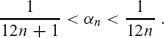
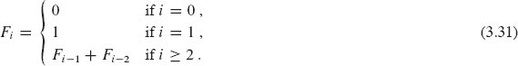
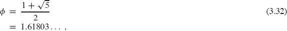
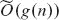

**3          征运行时间**

算法的运行时间增长阶数，在第二章中定义，提供了一种简单的方式来表征算法的效率，并且还允许我们将其与替代算法进行比较。一旦输入大小`n`足够大，具有`Θ(n lg n)`最坏情况运行时间的归并排序将击败插入排序，其最坏情况运行时间为`Θ(n²)`。虽然我们有时可以确定算法的确切运行时间，就像我们在第二章中为插入排序所做的那样，但额外的精度很少值得计算。对于足够大的输入，精确运行时间的乘法常数和低阶项都被输入大小本身的影响所主导。

当我们研究使得只有运行时间增长阶数相关的足够大的输入大小时，我们正在研究算法的`渐近`效率。也就是说，我们关心算法的运行时间如何随着输入大小的增长而“极限”增加，即输入大小无限增加时。通常，渐近效率更高的算法是除了非常小的输入外的最佳选择。

本章介绍了几种简化算法渐近分析的标准方法。下一节非正式地介绍了三种最常用的“渐近符号”类型，我们已经在`Θ`-符号中看到了一个例子。它还展示了如何使用这些渐近符号来推断插入排序的最坏情况运行时间。然后我们更正式地看待渐近符号，并介绍了本书中使用的几种符号约定。最后一节回顾了在分析算法时常见的函数行为。

**3.1      `O`-符号，`Ω`-符号和`Θ`-符号**

当我们分析插入排序在第二章的最坏情况运行时间时，我们从复杂的表达式开始。

然后我们放弃了低阶项`(c₁ + c₂ + c[4] + c[5]/2 – c[6]/2 – c[7]/2 + c[8]) n`和`c₂ + c[4] + c[5] + c[8]`，我们也忽略了`n²`的系数`c[5]/2 + c[6]/2 + c[7]/2`。这样就只剩下因子`n²`，我们将其放入Θ-符号中作为`Θ(n²)`。我们使用这种风格来表征算法的运行时间：舍弃低阶项和主导项的系数，并使用一个侧重于运行时间增长速度的符号。

`Θ`-符号并不是唯一的“渐近符号”。在本节中，我们将看到其他形式的渐近符号。我们从直观地看这些符号开始，重新审视插入排序以了解如何应用它们。在下一节中，我们将看到我们渐近符号的正式定义，以及使用它们的惯例。

在我们深入具体内容之前，请记住，我们将看到的渐近符号是设计用来表征一般函数的。碰巧我们最感兴趣的函数表示算法的运行时间。但是渐近符号可以应用于表征算法的其他方面的函数（例如它们使用的空间量），甚至可以应用于与算法毫不相关的函数。  

**`O`-符号**

`O`-notation 描述了函数渐近行为的`上界`。换句话说，它表示函数不会以某种速率`更快`增长，基于最高阶项。例如，考虑函数 `7n³ + 100n² – 20n + 6`。它的最高阶项是 `7n³`，因此我们说这个函数的增长速率是`n³`。因为这个函数不会比`n³`增长更快，我们可以写成它是`O(n³)`。你可能会惊讶地发现我们也可以写成函数 `7n³ + 100n² – 20n + 6` 是`O(n⁴)`。为什么？因为这个函数增长速度比`n⁴`慢，我们正确地说它不会增长更快。正如你可能猜到的，这个函数也是`O(n⁵)`、`O(n⁶)`，等等。更一般地说，对于任何常数`c ≥ 3`，它是`O(n^c)`。  

**`Ω`-notation**  

`Ω`-notation 描述了函数渐近行为的下界。换句话说，它表示函数至少以某种速率增长，基于最高次项，就像`O`-notation 一样。因为函数 `7n³ + 100n² – 20n + 6` 中的最高阶项至少以`n³`速率增长，所以这个函数是`Ω(n³)`。这个函数也是`Ω(n²)`和`Ω(n)`。更一般地说，对于任何常数`c ≤ 3`，它是`Ω(n^c)`。

**`Θ`-notation**

`Θ-notation` 描述了函数渐近行为的*紧密界限*。它表示函数以某种速率*精确地*增长，再次基于最高阶项。换句话说，`Θ-notation` 从上方和下方各一个常数因子的范围内描述了函数的增长速率。这两个常数因子不一定相等。

如果你能证明一个函数既是`O(f(n))`又是`Ω(f(n))`，对于某个函数`f (n)`，那么你已经证明了该函数是`Θ(f (n))`。（下一节将这个事实陈述为一个定理。）例如，由于函数 `7n³ + 100n² – 20n + 6` 既是`O(n³)`又是`Ω(n³)`，它也是`Θ(n³)`。  

**示例：插入排序**

让我们重新审视插入排序，并看看如何使用渐近符号来描述其`Θ(n²)`最坏情况运行时间，而不像我们在第二章中评估求和那样。这里是 `INSERTION-SORT` 过程：

`INSERTION-SORT(A, n)`  

| 1 | `for` `i = 2` **to** `n` |
| --- | --- |
| `---` | `---` |
| `2` | `key = A[i]` |   |
| `3` | **//** 将`A[i]`插入已排序子数组`A[1 : i – 1]`中。 |
| 4 | j = i - 1 |
| `5` | `while` `j > 0` and `A[j] > key` |   |
| \| `6` \| `A[j + 1] = A[j]` \|   |
| `7` | `j = j - 1` |
| 8 | A[j + 1] = key | `   |

我们能观察到伪代码是如何运作的吗？该过程有嵌套循环。外部循环是一个`for`循环，无论被排序的值如何，都会运行`n – 1`次。内部循环是一个`while`循环，但它的迭代次数取决于被排序的值。循环变量`j`从`i – 1`开始，并在每次迭代中减 1，直到它达到 0 或`A[j] ≤ key`。对于给定的`i`值，`while`循环可能迭代 0 次，`i – 1`次，或者在中间。`while`循环的主体（第 6-7 行）每次迭代都需要恒定时间。

**图 3.1** 插入排序的`Ω(n²)` 下界。如果前`n/3` 个位置包含`n/3` 个最大值，每个值都必须通过中间的`n/3` 个位置，逐个位置地移动，最终到达最后的`n/3` 个位置之一。因为每个`n/3` 个值都至少通过每个`n/3` 个位置，所以在这种情况下所花费的时间至少与(`n/3`)(`n/3`)成比例，即`Ω(n²)`。

这些观察足以推断出对于任何 `INSERTION-SORT` 情况的`O(n²)`运行时间，给我们一个涵盖所有输入的总体陈述。运行时间由内循环主导。因为外循环的`n - 1` 次迭代使内循环最多迭代`i - 1` 次，而`i` 最多为 `n`，内循环的总迭代次数最多为 `(n - 1)(n - 1)`，小于 `n²`。由于内循环的每次迭代都需要恒定时间，内循环中花费的总时间最多为一个常数乘以 `n²`，即 `O(n²)`。

通过一点创造力，我们还可以看到 `INSERTION-SORT` 的最坏情况运行时间是`Ω(n²)`。当我们说一个算法的最坏情况运行时间是`Ω(n²)`时，我们的意思是对于某个阈值以上的每个输入大小`n`，存在至少一个大小为`n`的输入，使得算法至少需要`cn²`时间，其中`c`是某个正常数。这并不一定意味着算法对所有输入都需要至少`cn²`时间。

现在让我们看看为什么 `INSERTION-SORT` 的最坏情况运行时间是Ω(n²)。为了使一个值最终出现在其起始位置的右侧，它必须在第 6 行中被移动。实际上，为了使一个值最终出现在其起始位置的右侧`k`个位置，第 6 行必须执行`k`次。正如图 3.1 所示，让我们假设`n`是 3 的倍数，这样我们可以将数组`A`分成`n/3` 个位置的组。假设在输入到 `INSERTION-SORT` 中，`n/3` 个最大值占据了数组的前`n/3` 个位置`A[1 : n/3]`。（它们在前`n/3` 个位置内的相对顺序并不重要。）一旦数组被排序，这`n/3` 个值中的每一个最终都会出现在最后`n/3` 个位置`A[2n/3 + 1 : n]`中的某个位置。为了实现这一点，这`n/3` 个值中的每一个都必须通过中间`n/3` 个位置`A[n/3 + 1 : 2n/3]`中的每一个位置。这`n/3` 个值中的每一个都通过这些中间`n/3` 个位置，每次通过一个位置，至少执行`n/3` 次第 6 行。因为至少有`n/3` 个值必须通过至少`n/3` 个位置，所以 `INSERTION-SORT` 在最坏情况下所花费的时间至少与(`n/3`)(`n/3`)成比例，即`n²/9`，这是`Ω(n²)`。

因为我们已经证明了 `INSERTION-SORT` 在所有情况下都以`O(n²)`时间运行，并且有一个使其花费`Ω(n²)`时间的输入，我们可以得出结论，`INSERTION-SORT` 的最坏情况运行时间是`Θ(n²)`。上界和下界的常数因子可能不同并不重要。重要的是我们已经在常数因子内表征了最坏情况运行时间（忽略低阶项）。这个论证并不表明 `INSERTION-SORT` 在*所有*情况下都以`Θ(n²)`时间运行。事实上，我们在第二章中看到最佳情况运行时间是 `Θ(n)`。

**练习**

`3.1-1`

修改插入排序的下界论证，以处理不一定是 3 的倍数的输入大小。

`3.1-2`

使用类似于插入排序的推理，分析练习 `2.2-2` 中选择排序算法的运行时间。

**`3.1-3`**

假设`α`是范围` 0 < α < 1 `内的一个分数。展示如何将插入排序的下界论证推广到考虑一个输入，其中`αn`个最大值从前`αn`个位置开始。你需要对`α`加上什么额外限制？什么值的`α`最大化了`αn`个最大值必须通过每个中间`(1 – 2α)n`数组位置的次数？  

**`3.2      渐近符号：正式定义`**

在非正式地了解渐近符号后，让我们更正式一些。我们用来描述算法渐近运行时间的符号是以通常为自然数集合 N 或实数集合 R 为定义域的函数为基础的。这些符号方便描述运行时间函数`T(n)`。本节定义了基本的渐近符号，并介绍了一些常见的“正确”符号滥用。  

**图 3.2** `O`、`Ω`和`Θ`符号的图形示例。在每个部分中，所示的`n₀`的值是最小可能值，但任何更大的值也适用。**(a)** `O`符号给出函数的上界，即在一个常数因子内。我们写作`f(n) = O(g(n))`，如果存在正常数`n₀`和`c`，使得在`n₀`及其右侧，`f(n)`的值始终在或低于`cg(n)`。**(b)** `Ω`符号给出函数的下界，即在一个常数因子内。我们写作`f(n) = Ω(g(n))`，如果存在正常数`n₀`和`c`，使得在`n₀`及其右侧，`f(n)`的值始终在或高于`cg(n)`。**(c)** `Θ`符号将函数限制在常数因子内。我们写作`f(n) = Θ(g(n))`，如果存在正常数`n₀`、`c₁`和`c₂`，使得在`n₀`及其右侧，`f(n)`的值始终在`c₁g(n)`和`c₂g(n)`之间（包括边界）。

**`O`符号**

正如我们在第 3.1 节中看到的，`O`符号描述了一个**渐近上界**。我们使用`O`符号给出函数的上界，即在一个常数因子内。

这里是`O`符号的正式定义。对于给定的函数`g(n)`，我们用`O(g(n))`（读作“`g`的`O`”或有时只是“`g`的`O`”）表示函数集合。

| `O(g(n)) = {f(n) |  :  | 存在正常数`c`和`n₀`，使得对所有`n ≥ n₀`，都有 0 ≤ f(n) ≤ cg(n)}`¹ |  |
| --- | --- | --- |

如果存在正常数`c`，使得对足够大的`n`，`f(n) ≤ cg(n)`，则函数`f(n)`属于集合`O(g(n))`。图 3.2(a)展示了`O`符号背后的直觉。对于所有在`n₀`及其右侧的值`n`，函数`f(n)`的值在或低于`cg(n)`。

`O(g(n))`的定义要求集合`O(g(n))`中的每个函数`f(n)`都是**渐近非负**的：当`n`足够大时，`f(n)`必须是非负的。（**渐近正**函数是指对所有足够大的`n`都是正的函数。）因此，函数`g(n)`本身必须是渐近非负的，否则集合`O(g(n))`为空。因此，我们假设在`O`符号中使用的每个函数都是渐近非负的。这个假设对本章中定义的其他渐近符号也成立。

你可能会惊讶我们用集合来定义`O`符号。实际上，你可能期望我们会写“`f(n) ∈ O(g(n))`”来表示`f(n)`属于集合`O(g(n))`。相反，我们通常写“`f(n) = O(g(n))`”，并说“`f(n)`是`O(g(n))`”来表达相同的概念。虽然一开始滥用等号可能看起来令人困惑，但我们将在本节后面看到这样做的优点。

让我们探讨如何使用 `O`-符号的形式定义来证明我们丢弃低阶项并忽略最高阶项的常数系数的做法。我们将证明 `4n² + 100n + 500 = O(n²)`，即使低阶项的系数比主导项大得多。我们需要找到正常数 `c` 和 `n[0]`，使得对于所有 `n ≥ n[0]`，有 `4n² + 100n + 500 ≤ cn²`。将两边都除以 `n²` 得到 `4 + 100/n + 500/n² ≤ c`。这个不等式对于许多 `c` 和 `n[0]` 的选择都成立。例如，如果我们选择 `n[0] = 1`，那么这个不等式对于 `c = 604` 成立。如果我们选择 `n[0] = 10`，那么 `c = 19`有效，选择 `n[0] = 100` 允许我们使用 `c = 5.05`。  

我们也可以使用 `O`-符号的形式定义来证明函数 `n³ – 100*n²` 不属于集合 `O(n²)`，即使 `n²` 的系数是一个较大的负数。如果 `n³ – 100*n² = O(n²)`，那么就会存在正常数 `c` 和 `n₀`，使得对于所有 `n ≥ n₀`，有 `n³ –100*n² ≤ cn²`。再次，我们将两边都除以 `n²`，得到 `n – 100 ≤ c`。无论我们选择常数 `c` 的值是多少，这个不等式对于任何 `n > c + 100` 的值都不成立。

**`Ω`-符号**  

就像 `O`-符号为函数提供了一个渐近*上限*，`Ω`-符号提供了一个**渐近下限**。对于给定函数 `g(n)`，我们用 `Ω(g(n))`（读作“`n`的`g`的大 omega”或有时只是“`n`的`g`的 omega”）表示函数集合

| `Ω(g(n)) = {f (n) | `  :  `存在正常数 c 和 n₀，使得对于所有 n ≥ n₀，有 0 ≤ cg(n) ≤ f (n)}`. |   |
| --- | --- | --- |

图 3.2(b) 展示了`Ω`-符号背后的直觉。对于所有大于等于 `n₀` 的 `n` 值，`f (n)` 的值位于或高于 `cg(n)`。

我们已经证明了 `4n² + 100n + 500 = O(n²)`。现在让我们证明 `4n² + 100n + 500 = Ω(n²)`。我们需要找到正常数 `c` 和 `n₀`，使得对于所有 `n ≥ n₀`，有 `4n² + 100n + 500 ≥ cn²`。与之前一样，我们将两边都除以 `n²`，得到 `4 + 100/n + 500/n² ≥ c`。当 `n₀` 是任意正整数且 `c = 4` 时，这个不等式成立。

如果我们从 `4n²` 项中减去低阶项而不是加上它们会怎样？如果 `n²` 项的系数很小会怎样？这个函数仍然是 `Ω(n²)`。例如，让我们证明 `n²/100 – 100n – 500 = Ω(n²)`。将其除以 `n²` 得到 `1/100 – 100/n – 500/n² ≥ c`。我们可以选择任何大于等于 10,005 的 `n₀` 值，并找到一个正值的 `c`。例如，当 `n₀ = 10,005` 时，我们可以选择 `c = 2.49 × 10^(–9)`。是的，这是一个很小的 `c` 值，但它是正的。如果我们选择更大的 `n₀` 值，我们也可以增加 `c`。例如，如果 `n₀ = 100,000`，那么我们可以选择 `c = 0.0089`。`n₀` 的值越高，我们就可以选择越接近 1/100 系数的 `c`。

**`Θ`-符号**

我们使用 `Θ`-符号表示**渐近紧密界**。对于给定函数 `g(n)`，我们用 `Θ(g(n))`（读作“`g` of `n` 的 theta”）表示函数集合

| `Θ(g(n)) = { f(n) |  :  | 存在正常数 c₁、c₂ 和 n₀，使得对于所有 n ≥ n₀，有 0 ≤ c₁g(n) ≤ f(n) ≤ c₂g(n) }. |
| --- | --- | --- |
| --- | --- | --- |

图 3.2(c) 展示了Θ-符号背后的直觉。对于所有大于等于 `n₀` 的 `n` 值，`f(n)` 的值位于或高于 `c₁g(n)`，且位于或低于 `c₂g(n)`。换句话说，对于所有 `n ≥ n₀`，函数 `f(n)` 与 `g(n)` 之间存在常数因子的关系。

`O-`、`Ω-` 和 `Θ-`符号的定义导致了以下定理，其证明我们留作练习 3.2-4。

**定理 3.1**

对于任意两个函数 `f(n)` 和 `g(n)`，当且仅当 `f(n) = O(g(n))` 且 `f(n) = Ω(g(n))` 时，我们有 `f(n) = Θ(g(n))`。

▪ 输出：

我们通常应用定理 `3.1` 来从渐近上界和下界中证明渐近紧密界限。

**渐近符号和运行时间**

当你使用渐近符号来描述算法的运行时间时，确保你使用的渐近符号尽可能精确，而不要夸大适用于哪种运行时间。以下是一些正确和不正确地使用渐近符号来描述运行时间的例子。

让我们以插入排序开始。我们可以正确地说插入排序的最坏情况运行时间是`O(n²)`，`Ω(n²)`，并且—由定理 3.1—`Θ(n²)`。尽管这三种方式来描述最坏情况的运行时间都是正确的，但`Θ(n²)`界限是最精确和最受欢迎的。我们也可以正确地说插入排序的最佳情况运行时间是`O(n)`，`Ω(n)`，并且 `Θ(n)`，同样 `Θ(n)`是最精确和因此最受欢迎的。  

这是我们`不能`正确说的：插入排序的运行时间是`Θ(n²)`。这是一个夸大，因为通过从陈述中省略“最坏情况”，我们得到了一个涵盖所有情况的笼统陈述。错误在于插入排序并不在所有情况下都以`Θ(n²)`时间运行，因为正如我们所见，它在最佳情况下以 `Θ(n)`时间运行。然而，我们可以正确地说插入排序的运行时间是`O(n²)`，因为在所有情况下，它的运行时间增长不会比`n²`更快。当我们说`O(n²)`而不是`Θ(n²)`时，没有问题出现在其运行时间增长得更慢的情况。同样，我们不能正确地说插入排序的运行时间是 `Θ(n)`，但我们可以说它的运行时间是`Ω(n)`。

那么归并排序呢？由于归并排序在所有情况下的运行时间都是`Θ(n lg n)`，我们可以简单地说它的运行时间是`Θ(n lg n)`，而不指定最坏情况、最佳情况或其他情况。

有时人们会错误地将`O`符号与Θ符号混淆，通过错误地使用`O`符号来表示渐近紧密界限。他们会说类似“一个`O(n lg n)`时间复杂度的算法比一个`O(n²)`时间复杂度的算法运行得更快。”也许是这样，也许不是。由于`O`符号仅表示一个渐近上界，所谓的`O(n²)`时间复杂度的算法实际上可能在`Θ(n)`时间内运行。你应该谨慎选择适当的渐近符号。如果你想表示一个渐近紧密界限，使用Θ符号。

我们通常使用渐近符号来提供最简单和最精确的界限。例如，如果一个算法在所有情况下的运行时间是 `3n² + 20n`，我们使用渐近符号写出它的运行时间是`Θ(n²)`。严格来说，我们也可以写出运行时间是`O(n³)`或`Θ(3n² + 20n)`。然而，在这种情况下，这些表达都不如写`Θ(n²)`有用：`O(n³)`比`Θ(n²)`不够精确，如果运行时间是 `3n² + 20n`，而`Θ(3n² + 20n)`引入了复杂性，使增长顺序变得模糊。通过写出最简单和最精确的界限，如`Θ(n²)`，我们可以对不同的算法进行分类和比较。在整本书中，你会看到几乎所有基于多项式和对数的渐近运行时间：例如`n`，`n lg² n`，`n² lg n`，或`n^(1/2)`。你还会看到一些其他函数，如指数函数，`lg lg n`，和`lg^n`（见第 3.3 节）。通常很容易比较这些函数的增长速度。问题 3-3 会给你很好的练习。

**方程和不等式中的渐近符号**

尽管我们在形式上是用集合来定义渐近符号，但在公式中我们使用等号(=)而不是集合成员符号(∈)。例如，我们写道 `4n² + 100n + 500 = O(n²)`。我们也可以写成 `2n² + 3n + 1 = 2n² + Θ(n)`。我们如何解释这样的公式？  

当渐近符号单独出现（即不在更大的公式中）在等式（或不等式）的右侧时，如 `4n² + 100n + 500 = O(n²)`，等号表示集合成员关系：`4n² + 100n + 500 ∈ O(n²)`。然而，一般情况下，当渐近符号出现在公式中时，我们将其解释为代表一些我们不愿意命名的匿名函数。例如，公式 `2n² + 3n + 1 = 2n² + Θ(n)` 意味着 `2n² + 3n + 1 = 2n² + f(n)`，其中 `f(n) ∈ Θ(n)`。在这种情况下，我们让 `f(n) = 3n + 1`，这确实属于 `Θ(n)`。

以这种方式使用渐近符号可以帮助消除等式中不必要的细节和混乱。例如，在第二章中，我们将归并排序的最坏情况运行时间表达为递归`T(n) = 2T(n/2) + Θ(n)`。

`T(n) = 2T(n/2) + Θ(n)`.

如果我们只对`T(n)`的渐近行为感兴趣，那么没有必要准确指定所有低阶项，因为它们都被理解为包含在由 `Θ(n)`表示的匿名函数中。

表达式中匿名函数的数量被理解为渐近符号出现的次数。例如，在表达式

只有一个匿名函数（一个关于`i`的函数）。因此，这个表达式与`O(1) + O(2) + ⋯ + O(n)`不同，后者没有一个清晰的解释。

在某些情况下，渐近符号出现在等式的左侧，如

`2n² + Θ(n) = Θ(n*²)`.

使用以下规则解释这样的方程：**无论左侧等号上如何选择匿名函数，都可以选择右侧等号上的匿名函数使方程成立**。因此，我们的例子意味着对于任何函数`f(n) ∈  Θ(n)`，存在一个函数`g(n) ∈ Θ(n²)`，使得对于所有`n`，`2*n² + f(n) = g(n)`。换句话说，等式的右侧提供了比左侧更粗略的细节。

我们可以将多个这样的关系链接在一起，如 

| 2`n²` + 3`n` + 1 |  =  | 2`n²` + Θ(n) |
| --- | --- | --- |
|  |  =  | Θ(n²). |

根据上述规则，分别解释每个方程。第一个方程表示存在一个函数`f(n) ∈ Θ(n)`，使得对于所有`n`，`2n² + 3n + 1 = 2n² + f(n)`。第二个方程表示对于任何函数`g(n) ∈ Θ(n)`（例如刚提到的`f(n)`），存在一个函数`h(n) ∈ Θ(n²)`，使得对于所有`n`，`2n² + g(n) = h(n)`。这种解释意味着 `2n² + 3n + 1 = Θ(n²)`，这就是方程链的直观含义。

**渐近符号的正确使用**

除了将等号滥用为集合成员之外，我们现在看到有一个精确的数学解释，另一个滥用渐近符号的情况是当趋向于`∞`的变量必须从上下文中推断出来。例如，当我们说`O(g(n))`时，我们可以假设我们对`g(n)`随着`n`增长的增长感兴趣，如果我们说`O(g(m))`，我们谈论的是`g(m)`随着`m`增长的增长。表达式中的自由变量指示了哪个变量将趋于`∞`。  

当渐近符号内部的函数是一个常数时，最常见需要上下文知识的情况是，如在表达式 `O(1)` 中。我们无法从表达式中推断哪个变量趋于`∞`，因为那里没有出现任何变量。上下文必须消除歧义。例如，如果使用渐近符号的方程是 `f(n) = O(1)`，那么很明显我们感兴趣的变量是 `n`。然而，从上下文中知道感兴趣的变量是 `n`，允许我们通过使用 `O`-符号的正式定义来完全理解表达式：表达式 `f(n) = O(1)` 意味着函数 `f(n)` 在 `n` 趋于 `∞` 时被一个常数上界限制。从技术上讲，如果在渐近符号本身明确指出趋于 `∞` 的变量可能会更少歧义，但那会使符号混乱。相反，我们只需确保上下文清楚指出哪个变量（或变量）趋于 `∞`。  

当渐近符号内部的函数被一个正常数限制时，如 `T(n) = O(1)`，我们经常以另一种方式滥用渐近符号，特别是在陈述递归时。我们可能会写类似 `T(n) = O(1) for n < 3`。根据 `O`-符号的正式定义，这个陈述是没有意义的，因为定义只说对于某个 `n₀ > 0`，`T(n)` 被一个正常数 `c` 限制，对于所有 `n ≥ n₀`。当 `T(n)` 对于 `n < n₀` 时的值不一定被这样限制。因此，在例子 `T(n) = O(1) for n < 3` 中，我们无法推断 `n < 3`时对 `T(n)` 的任何约束，因为可能 `n₀ > 3`。  

当我们说 `T(n) = O(1) for n < 3` 时，传统上意味着存在一个正常数 `c`，使得 `T(n) ≤ c` 对于 `n < 3`。这种约定使我们免去了命名边界常数的麻烦，允许它保持匿名，同时我们专注于分析中更重要的变量。其他渐近符号也存在类似的滥用。例如，`T(n) = Θ(1) for n < 3` 意味着当 `n < 3`时，`T(n)` 被正常数上下界限制。

有时，描述算法运行时间的函数可能对于某些输入大小未定义，例如，当算法假设输入大小是精确的 2 的幂时。我们仍然使用渐近符号来描述运行时间的增长，理解任何约束仅适用于函数被定义时。例如，假设 `f(n)` 仅在自然数或非负实数的子集上定义。那么 `f(n) = O(g(n))` 意味着在 `f(n)` 的定义域上，即 `f(n)` 被定义的地方，对于所有 `n ≥ n₀`，定义 `O`-符号中的上界 `0 ≤ T(n) ≤ cg(n)` 成立。这种滥用很少被指出，因为通常从上下文中可以清楚地理解意思。

在数学中，`*`用符号是可以接受的 — 而且通常是可取的 — 只要我们不误用它。如果我们准确理解滥用的含义，并且不得出错误的结论，它可以简化我们的数学语言，有助于我们更高层次的理解，并帮助我们专注于真正重要的事情。

**`o`-符号**

`O`-符号提供的渐近上界可能是渐近紧的，也可能不是。边界 `2n² = O(n²)` 是渐近紧的，但边界 `2n = O(n²)` 不是。我们使用 `o`-符号来表示不是渐近紧的上界。我们正式定义 `o(g(n))`（“g 的 n 的小 o”）为集合

| `o(g(n)) = {f(n) |  :  | 对于任意正常数 c > 0，存在一个常数 n₀ > 0，使得对于所有 n ≥ n₀，都有 0 ≤ f(n) < cg(n)}`。 |
| --- | --- | --- |
| --- | --- | --- |

例如，`2n = o(n²)`，但 `2n² ≠ o(n²)`。

`O`符号和`o`符号的定义类似。主要区别在于，在`f(n) = O(g(n))`中，对于*某个*常数`c > 0`，有 `0 ≤ f(n) ≤ cg(n)`，但在`f(n) = o(g(n))`中，对于*所有*常数`c > 0`，有 `0 ≤ f(n) < cg(n)`。直观上，在`o`符号中，随着`n`变大，函数`f(n)`相对于`g(n)`变得微不足道：

有些作者将这个极限作为`o`符号的定义，但本书中的定义也将匿名函数限制为渐进非负。

**`ω-符号`**

类比地，`ω`符号对应于Ω符号，就像`o`符号对应于`O`符号一样。我们使用`ω`符号来表示一个不是渐进紧密的下界。一种定义方法是通过

`f(n) ∈ ω(g(n))` 当且仅当 `g(n) ∈ o(f(n))`.  

但在形式上，我们将`ω(g(n))`（“g 的小 omega”）定义为集合

| `ω(g(n)) = {f(n) |  :  | 对于任意正常数`c` > 0，存在一个常数`n₀` > 0，使得对所有`n ≥ n₀`，有 0 ≤ cg(n) < f(n)}`. |
| --- | --- | --- |
| --- | --- | --- |   |

在`o`符号的定义中，`f(n) < cg(n)`，而在`ω`符号的定义中，相反：`cg(n) < f(n)`。例如，对于`ω`符号，我们有`n²/2 = ω(n)`，但`n²/2 ≠ ω(n²)`。关系`f(n) = ω(g(n))`意味着  

如果极限存在。也就是说，随着`n`变大，`f(n)`相对于`g(n)`变得任意大。

**比较函数**

许多实数的关系性质也适用于渐进比较。在以下内容中，假设`f(n)`和`g(n)`是渐进正的。

**传递性：**

| `f(n) = Θ(g(n))` | 和 | `g(n) = Θ(h(n))` | 意味着 | `f(n) = Θ(h(n)),` |   |
| --- | --- | --- | --- | --- |
| `f(n) = O(g(n))` | 和 | `g(n) = O(h(n))` | 意味着 | `f(n) = O(h(n)),` |
| `f(n) = Ω(g(n))` | 和 | `g(n) = Ω(h(n))` | 意味着 | `f(n) = Ω(h(n)),` |
| `f(n) = o(g(n))` | 和 | `g(n) = o(h(n))` | 意味着 | `f(n) = o(h(n)), |
| `f(n) = ω(g(n))` | 和 | `g(n) = ω(h(n))` | 意味着 | `f(n) = ω(h(n)).` |   |

**自反性：**

| `f(n) = Θ(f(n))`, |
| --- |
| `f(n) = O(f(n))`, |   |
| *f(n) = Ω(f(n)). |

**对称性：**

如果`f(n) = Θ(g(n))`，当且仅当`g(n) = Θ(f(n))`.

**转置对称性：**

| `f(n) = O(g(n))` | 当且仅当 | `g(n) = Ω(f(n)),` |
| --- | --- | --- |
| `f(n) = o(g(n))` | 当且仅当 | `g(n) = ω(f(n))`. |

由于这些性质适用于渐进符号，我们可以将两个函数`f`和`g`的渐进比较与两个实数`a`和`b`的比较进行类比：

| `f(n) = O(g(n))` | 就像 | `a` ≤ `b`, |
| --- | --- | --- |
| `f(n) = Ω(g(n))` | 就像 | `a ≥ b`, |   |
| `f(n) = Θ(g(n))` | 就像 | `a = b`, |   |
| `f(n) = o(g(n))` | 就像 | `a < b`， |
| `f(n) = ω(g(n))` | 就像 | `a > b`。 |   |

我们说`f(n)`比`g(n)`**渐进小**，如果`f(n) = o(g(n))`，而`f(n)`比`g(n)`**渐进大**，如果`f(n) = ω(g(n))`。

然而，实数的一个性质并不适用于渐进符号：

**三歧性：** 对于任意两个实数`a`和`b`，以下三者中恰好有一个成立：`a < b`，`a = b`，或`a > b`。

尽管任意两个实数可以比较，但并非所有函数都是渐进可比的。也就是说，对于两个函数`f(n)`和`g(n)`，可能存在既不是`f(n) = O(g(n))`也不是`f(n) = Ω(g(n))`的情况。例如，我们无法使用渐进符号比较函数`n`和`n^(1 + sin n)`，因为`n^(1 + sin n)`中的指数值在 0 和 2 之间振荡，取得这两个值之间的所有值。

**练习**

**`3.2-1`**  

让`f(n)`和`g(n)`是渐近非负函数。使用Θ-符号的基本定义，证明 `max{f(n), g(n)} = Θ(f(n) + g(n))`.  

`3.2-2`

解释为什么说“算法`A`的运行时间至少为`O(n²)`”是没有意义的。

**`3.2-3`**  

`2^(n + 1) = O(2^n)`吗？`2^(2*n) = O(2^n)`吗？

`3.2-4`

证明定理 `3.1`。

`3.2-5`

证明一个算法的运行时间是`Θ(g(n))`当且仅当其最坏情况运行时间是`O(g(n))`且最佳情况运行时间是`Ω(g(n))`。

**`3.2-6`**

证明`o(g(n)) ∩ ω(g(n))`是空集。

`3.2-7`

我们可以将我们的符号扩展到两个参数`n`和`m`可以以不同速率独立地趋向于∞的情况。对于给定函数`g(n, m)`，我们用`O(g(n, m))`表示函数的集合

| `O(g(n, m)) = {f(n, m) |  :  | 存在正常数`c`，n₀和`m`[0]使得对于所有`n ≥ n₀`或`m ≥ m`[0]，0 ≤ `f`(`n`, `m`) ≤ *cg*(`n`, `m`)}`。 |   |
| --- | --- | --- |

给出`Ω(g(n, m))`和`Θ(g(n, m))`的相应定义。

**`3.3      标准符号和常见函数`**  

本节回顾了一些标准数学函数和符号，并探讨了它们之间的关系。它还说明了渐近符号的使用。

**`单调性`**

一个函数`f(n)`是**单调递增**的，如果`m ≤ n`意味着`f(m) ≤ f(n)`。类似地，如果`m ≤ n`意味着`f(m) ≥ f(n)`，则它是**单调递减**的。一个函数`f(n)`是**严格递增**的，如果`m < n`意味着`f(m) < f(n)`，如果`m < n`意味着`f(m) > f(n)`，则它是**严格递减**的。

**地板和天花板**

对于任意实数`x`，我们用`⌊x⌋`（读作“`x`的地板”）表示小于或等于`x`的最大整数，用`⌈x⌉`（读作“`x`的天花板”）表示大于或等于`x`的最小整数。地板函数是单调递增的，天花板函数也是如此。  

地板和天花板遵守以下性质。对于任意整数`n`，我们有  

对于所有实数`x`，我们有  

我们还有  输出：

或者等价地，  

对于任意实数`x ≥ 0`和整数`a`，`b > 0`，我们有  

对于任意整数`n`和实数`x`，我们有  

**模算术**

对于任意整数`a`和任意正整数`n`，值`a mod n`是商`a/n`的**余数**（或**剩余**）：

  

由此可知

即使`a`是负数时。

给定一个明确定义的一个整数除以另一个整数的余数的概念，方便起见，我们提供特殊符号来表示余数的相等性。如果`(a mod n) = (b mod n)`，我们写成`a = b (mod n)`，并说`a`在模`n`下**等价**于`b`。换句话说，`a = b (mod n)`当且仅当`a`和`b`被`n`整除的余数相同。等价地，`a = b (mod n)`当且仅当`n`是`b - a`的除数。我们写成`a ≠ b (mod n)`如果`a`不等价于`b`，模`n`。

**多项式**

给定一个非负整数`d`，一个**度为 d 的 n 的多项式**是一个形式为`p(n)`的函数  

其中常数`a₀，a₁，…，a[d]`是多项式的**系数**，且`a[d] ≠ 0`。多项式是渐近正的当且仅当`a[d] > 0`。对于一个度为`d`的渐近正多项式`p(n)`，我们有`p(n) = Θ(n^d)`。对于任意实常数`a ≥ 0`，函数`n^a`是单调递增的，对于任意实常数`a ≤ 0`，函数`n^a`是单调递减的。我们说一个函数`f(n)`是**多项式有界**的，如果`f(n) = O(n^k)`，其中`k`是某个常数。

**指数**

对于所有实数 `a > 0`，`m` 和 `n`，我们有以下恒等式：

| `a⁰` | = | `1`, |   |
| --- | --- | --- |
| `a`¹ | = | `a`, |
| `a^(-1)` | = | `1/a`, |
| `(*a^m*)^(`n`)` | = | `*a^(mn)*`, |   |
| `(*a^m*)^(`n`)` | = | `(*a^n*)*^m*`, |   |
| `a^ma^n` | = | `a`^(`m`+`n`). |   |

对于所有 `n` 和 `a ≥ 1`，函数 `a^n` 在 `n` 中单调递增。在方便的情况下，我们假设 `0⁰ = 1`。

我们可以通过以下事实来关联多项式和指数的增长速率。对于所有实常数 `a > 1` 和 `b`，我们有

由此我们可以得出

因此，任何底数严格大于 1 的指数函数都比任何多项式函数增长更快。

使用 `e` 表示 2.71828 …，自然对数函数的底数，我们对于所有实数 `x` 有

  

其中“！”表示稍后在本节中定义的阶乘函数。对于所有实数 `x`，我们有不等式 

当且仅当 `x = 0` 时等号成立。当 `|x| ≤ 1` 时，我们有近似值

当 `x → 0`时，`e^x` 由`1 + x` 的近似是相当不错的：

`e^x = 1 + x + Θ(x²)`.

（在这个方程中，渐近符号用于描述当 `x → 0`而不是当 `x → ∞`时的极限行为。）对于所有 `x`，我们有 

**对数**

我们使用以下符号：

| `lg n` | = | `log₂ n` | (二进制对数), |
| --- | --- | --- | --- |
| `ln n` | = | `log[e] n` | (自然对数), |
| `lg^(`k`) `n`` | = | `(`lg n`)*^k*` | (指数运算), |
| `lg `lg n`` | = | `lg(`lg n`)` | (复合). |   |

我们采用以下符号约定：在没有括号的情况下，`对数函数仅适用于公式中的下一个项`，因此 `lg n + 1` 意味着 `(lg n) + 1` 而不是 `lg(n + 1)`。

对于任何常数 `b > 1`，如果 `n ≤ 0`，则函数 `log[b] n` 未定义，如果 `n > 0`，则严格递增，如果 `0 < n < 1`，则为负，如果 `n > 1`，则为正，如果 `n = 1`，则为 0。对于所有实数 `a > 0`，`b > 0`，`c > 0` 和 `n`，我们有

在上述每个方程中，对数的底数不是 `1`。

根据方程（`3.19`），将对数的底从一个常数更改为另一个常数仅将对数的值更改为一个常数因子。因此，当我们不关心常数因子时，我们经常使用“`lg n`”这种表示法，比如在 `O` -notation 中。计算机科学家发现 2 是对数最自然的底数，因为许多算法和数据结构涉及将问题分成两部分。

当 `|x| < 1` 时，`ln(1 + x)` 的一个简单级数展开为：

对于 `x > – 1`，我们还有以下不等式：

当且仅当 `x = 0` 时等号成立。  

如果存在某个常数 `k`，使得 `f(n) = O(lg^k n)`，我们称函数 `f(n)` 为**多对数边界**。通过在方程（3.13）中将 `lg n` 替换为 `n`，将 2`^a` 替换为 `a`，我们可以关联多项式和多对数的增长。对于所有实常数 `a > 0`和 `b`，我们有

因此，任何`正多项式函数`都比任何`多对数函数`增长更快。

`阶乘`

符号 `n!`（读作“`n` 阶乘”）对于整数 `n ≥ 0` 定义为

因此，`n! = 1 · 2 · 3 ⋯ n`。

阶乘函数的一个弱上界是 `n! ≤ n^n`，因为阶乘乘积中的每个 `n` 项最多为 `n`。**斯特林逼近**，

当 `e` 是自然对数的底时，给出了一个更紧的上界和一个下界。练习 3.3-4 要求你证明三个事实

斯特林逼近在证明方程(`3.28`)中很有帮助。对于所有 `n ≥ 1`，以下方程也成立：

  

其中 

**`函数迭代`**

我们使用符号 `f^(i)(n)` 来表示函数 `f(n)` 迭代应用 `i` 次到初始值 `n`。形式上，让 `f(n)` 是实数上的一个函数。对于非负整数 `i`，我们递归定义

  

例如，如果 `f(n) = 2*n`，那么 `f^(i)(n) = 2^in`。

**迭代对数函数**

我们使用符号 `lg^n`（读作“n 的对数星”）来表示迭代对数，定义如下。让 `lg^i n` 如上所定义，其中 `f(n) = lg n`。因为非正数的对数是未定义的，只有当 `lg^(i-1) n > 0`时，`lg^(i) n` 才被定义。一定要区分 `lg^(i) n`（连续应用 `i` 次的对数函数，从参数 n 开始）和 `lg^i n`（对 `n` 的对数提升到第 `i` 次幂）。然后我们定义迭代对数函数为

`lg^n = min {i ≥ 0 : lg^(i) n ≤ 1}`。

迭代对数是一个`非常`缓慢增长的函数：

| `lg^* 2` | = | `1,` |   |
| --- | --- | --- | --- |
| --- | --- | --- |
| `lg^* 4` | = | `2,` |
| lg^* 16 | = | 3, |
| `lg^* 65536` | = | `4,` |
| `lg^* (2⁶⁵⁵³⁶)` | = | `5.` |   |

由于可观测宇宙中的原子数量估计约为 `10⁸⁰`，远远小于 `2⁶⁵⁵³⁶ = 10^(65536/lg 10)` ≈ `10^(19,728)`，我们很少遇到 `lg^* n > 5` 的输入大小 `n`。

**斐波那契数**

我们将**斐波那契数** `F[i]`，对于 `i ≥ 0`，定义如下：

因此，在前两个之后，每个斐波那契数都是前两个数的和，得到序列

`0, 1, 1, 2, 3, 5, 8, 13, 21, 34, 55, ….`

斐波那契数与**黄金比例** `ϕ` 及其共轭  相关，它们是方程的两个根

`x² = x + 1`。

如练习 `3.3-7` 所要求的，黄金比例由以下方程给出

及其共轭，由 

具体来说，我们有

这可以通过归纳法证明（练习 `3.3-8`）。由于 ，我们有

这意味着

这就是说，第 `i` 个斐波那契数 `F[i]` 等于 `...` 四舍五入到最接近整数。因此，斐波那契数呈指数增长。

**练习**

**3.3-1**

展示如果 `f(n)` 和 `g(n)` 是单调增函数，那么 `f(n) + g(n)` 和 `f(g(n))` 也是单调增函数，如果 `f(n)` 和 `g(n)` 此外是非负的，那么 `f(n) · g(n)` 是单调增函数。

**`3.3-2`**

证明对于任何整数 `n` 和范围在 `0 ≤ α ≤ 1` 的实数 `α`，`⌊αn⌋ + ⌈(1 – α)n⌉ = n`。

`3.3-3`

使用方程 `(3.14)` 或其他方法来展示 `(n + o(n))^k = Θ(n^k)` 对于任何实常数 `k`。得出结论 `⌈n⌉^k = Θ(n^k) 和 ⌊n⌋^k = Θ(n^k)`。

**`3.3-4`**  

证明以下内容：

**a.** 方程 `(3.21)`。

**b.** 方程 `(3.26)`–`(3.28)`。

**c.** `lg(Θ(n)) = Θ(lg n)`。  

★ `3.3-5`

函数 `⌈lg n⌉!` 是多项式有界的吗？函数 `⌈lg lg n⌉!` 是多项式有界的吗？

★ `3.3-6`

哪个渐近更大：`lg(lg^* n)` 还是 `lg^*(lg n)`？

`3.3-7`

展示黄金比例 `ϕ` 及其共轭  都满足方程 `x² = x + 1`。

`3.3-8`

通过归纳法证明第 `i` 个斐波那契数满足方程

其中 `ϕ` 是黄金比例， 是其共轭。

`3.3-9`  

展示 `k lg k = Θ(n)` 意味着 `k = Θ(n/lg n)`。

**问题**

**`3-1`     多项式的渐近行为**  

让  输出：

其中 `a[d] > 0`，是 `n` 的 `d` 次多项式，`k` 是一个常数。使用渐近符号的定义来证明以下性质。  

**a.** 如果 `k ≥ d`，那么 `p(n) = O(n^k)`。

**b.** 如果 `k ≤ d`，那么` p(n) = Ω(n^k)`。

**c.** 如果 `k = d`，那么 `p(n) = Θ(n^k)`。

**d.** 如果 `k > d`，那么 `p(n) = o(n^k)`.

**e.** 如果 `k < d`，那么 `p(n) = ω(n^k)`.  

**`3-2`     相对渐近增长**

对于下表中每对表达式 `(A, B)`，指出 `A` 是 `O`、`o`、`Ω`、`ω` 还是 `Θ` 的关系。假设 `k ≥ 1`，`ϵ > 0`，`c > 1`是常数。在每个方框中写上“yes”或“no”。

**3-3     按渐近增长率排序**

**a.** 按增长顺序排列以下函数。也就是说，找到一个排列 `g₁，g₂，…，g[30]`，满足 `g₁ = Ω(g₂)`，`g₂ = Ω(g[3])`，…，`g[29] = Ω(g[30])`。将列表分成等价类，使得函数 `f(n)` 和 `g(n)` 属于同一类当且仅当 `f(n) = Θ(g(n))`.

| lg(lg^* n*) | 2^(lg* n*) |  | n² | n! | (lg n)! |
| --- | --- | --- | --- | --- | --- |
| `(3/2)*^n*` | `n³` | `lg² n` | `lg(n!)` |  | `n^(1/lg n)` |
| `ln ln n` | `lg`n`` | `n * 2^n` | `n^(lg lg n)` | `ln n` | `1` |   |
| `2^(lg n)` | `(lg n)^(lg n)` | `e^n` | `4^(lg n)` | `(`n` + 1)!` |  |   |
| `lg^*(lg n)` |  | `n` | `2^n` | `n lg n` |  |   |

**b.** 给出一个单一非负函数 `f(n)` 的例子，使得对于部分 (a) 中的所有函数 `gi`，`f(n)` 既不是 `O(gi)` 也不是 `Ω(gi)`。

**`3-4`     渐近符号性质**

设 `f(n)` 和 `g(n)` 是渐近正函数。证明或证伪以下猜想。

**a.** `f(n) = O(g(n))` 意味着 `g(n) = O(f(n))`.

**b.** `f(n) + g(n) = Θ(min {f(n), g(n)})`.

**c.** `f(n) = O(g(n))` 意味着 `lg f(n) = O(lg g(n))`，其中 `lg g(n) ≥ 1`，对于所有足够大的 `n`，`f(n) ≥ 1`。

**d.** `f(n) = O(g(n))` 意味着 `2^(f(n)) = O (2^(g(n)))`.

**e.** `f(n) = O ((f(n))²)`.

**f.** `f(n) = O(g(n))` 意味着 `g(n) = Ω(f(n))`.

**g.** `f(n) = Θ(f(n/2))`.

**h.** `f(n) + o(f(n)) = Θ(f(n))`.

**3-5     操作渐近符号**

设 `f(n)` 和 `g(n)` 是渐近正函数。证明以下恒等式：

**a.** `Θ(Θ(f(n))) = Θ(f(n))`.

**b.** `Θ(f(n)) + O(f(n)) = Θ(f(n))`.

**c.** `Θ(f(n)) + Θ(g(n)) = Θ(f(n) + g(n)).`

**d.** `Θ(f(n)) · Θ(g(n)) = Θ(f(n) · g(n))`.  

**e.** 论证对于任意实常数 `a₁`，`b₁ > 0`和整数常数 `k₁`，`k₂`，以下渐近界成立：

★ **f.** 证明对于 `S ⊆ Z`，我们有

假设两个和都收敛。

★ **g.** 证明对于 `S ⊆ Z`，即使假设两个乘积收敛，以下渐近界不一定成立，给出一个反例：

**`3-6     O 和 Ω 的变体`**

一些作者对`Ω`-符号的定义与本教科书略有不同。我们将使用命名约定 （读作“omega infinity”）来表示这种替代定义。我们说  如果存在一个正常数 `c`，使得对于无限多个整数 `n`，`f(n) ≥ cg(n) ≥ 0`。

**a.** 证明对于任意两个渐近非负函数 `f(n)` 和 `g(n)`，我们有 `f(n) = O(g(n))` 或 （或两者皆有）。

**b.** 证明存在两个渐近非负函数 `f(n)` 和 `g(n)`，既不满足 `f(n) = O(g(n))` 也不满足 `f(n) = Ω(g(n))`。

**c.** 描述使用  符号而不是`Ω`符号来表征程序运行时间的潜在优势和劣势。

一些作者还以稍微不同的方式定义`O`。我们将使用`O'`表示另一种定义：`f (n) = O'(g(n))`当且仅当`|f (n)| = O(g(n))`.

**d.** 如果我们用`O'`替换`O`但仍然使用Ω，定理 3.1 在第 56 页的“当且仅当”各个方向会发生什么变化？

一些作者将（读作“软-oh”）定义为忽略对数因子的`O`：

|  |  :  | 存在正常数`c`、`k`和`n₀`，使得对于所有`n ≥ n₀`，都有 0 ≤ `f(n)` ≤ `cg`(`n`) lg`k`(`n`)。 |
| --- | --- | --- |

**e.** 以类似的方式定义和。证明定理 3.1 的对应类比。  

`-   **`3-7    

我们可以将用于 `lg^*` 函数的迭代运算符 `^*` 应用于实数上的任何单调增函数 `f(n)`。对于给定的常数 `c` ∈ R，我们通过以下方式定义迭代函数 `f_c(n)`：

在某些情况下，这可能并不是明确定义的。换句话说，数量`艺术`是将函数`f`迭代应用到其参数减少到`c`或更少所需的最小次数。  

对于下表中的每个数`f(n)`和常数`c`，尽可能紧密地给出的上界。如果没有`i`使得`f^(i)(n) ≤ c`，请将“未定义”写为您的答案。

| \|  \| `f(n)` \| `c` \|  \| |
| --- | --- | --- | --- |
| **a.** | `n` – 1 | 0 |  |   |
| `b.` | `lg n` | 1 |  |   |
| `c.` | n/2 | 1 |  |
| `d.` | n/2 | 2 |  |
| `e.` |  | 2 |  |
| `f.` |  | 1 |  |   |
| **g.** | `n^(1/3)` | 2 |  |   |

**章节注释**

Knuth [259]追溯了`O`符号的起源，起源于 1892 年 P. Bachmann 的一个数论文本。`o`符号是由 E. Landau 在 1909 年发明的，用于讨论素数的分布。`Ω`和`Θ`符号是由 Knuth [265]提倡的，以纠正文献中使用`O`符号表示上下界的流行但技术上不严谨的做法。正如本章前面提到的，许多人继续使用`O`符号，而Θ符号在技术上更加精确。问题 3-6 中的软`-oh` 符号是由 Babai、Luks 和 Seress [31]引入的，尽管最初写成`O~`。一些作者现在将定义为忽略在`g(n)`中对数的因子，而不是在`n`中。根据这个定义，我们可以说，但根据问题 3-6 中的定义，这个说法是不正确的。Knuth [259, 265]和 Brassard 与 Bratley [70]的作品中进一步讨论了渐近符号的历史和发展。

并非所有作者都以相同的方式定义渐近符号，尽管各种定义在大多数常见情况下是一致的。一些替代定义包括函数，只要它们的绝对值受到适当限制，就不是渐近非负的。

方程`(3.29)`是由罗宾斯提出的[381]。其他基本数学函数的性质可以在任何优秀的数学参考书中找到，比如阿布拉莫维茨和斯特根[1]，或者在微积分书籍中找到，比如阿波斯托尔[19]或托马斯等人[433]。克努特[259]和格雷厄姆、克努特和帕塔什尼克[199]包含了大量关于计算机科学中使用的离散数学的材料。

¹ 在集合符号中，冒号表示“使得”。
