**`5` 概率分析和随机算法**

本章介绍了概率分析和随机算法。如果你对概率论的基础不熟悉，你应该阅读附录 `C` 的第 `C.1–C.4` 节，这些节回顾了这些内容。我们将在本书中多次回顾概率分析和随机算法。

**5.1      招聘问题**

假设你需要雇佣一个新的办公室助理。你之前的雇佣尝试都没有成功，于是你决定使用一家就业机构。就业机构每天发送给你一个候选人。你尝试这个人，然后决定是否雇佣这个人。你必须支付就业机构一笔小费来面试一个申请者。实际雇佣一个申请者成本更高，因为你必须解雇你当前的办公室助理，并且还必须向就业机构支付大量的雇佣费。你承诺始终拥有最适合这份工作的人。因此，你决定，在面试每个申请者后，如果该申请者比当前办公室助理更合格，你将解雇当前办公室助理并雇佣新申请者。你愿意支付这种策略的结果价格，但你希望估计这个价格会是多少。

朝向下一页的雇佣助理过程以伪代码形式表达了这种雇佣策略。办公室助理工作的候选人编号为 1 到`n`，并按照这个顺序进行面试。该过程假设在面试候选人`i`后，你可以确定候选人`i`是否是迄今为止你见过的最优秀的候选人。它首先创建一个虚拟候选人，编号为 0，比其他候选人都不合格。  

这个问题的成本模型与第二章中描述的模型不同。我们关注的不是雇佣助理的运行时间，而是面试和雇佣所支付的费用。表面上，分析这个算法的成本可能与分析合并排序等算法的运行时间非常不同。然而，无论我们分析成本还是运行时间，所使用的分析技术都是相同的。在任何情况下，我们都在计算执行某些基本操作的次数。

雇佣助理(`n`)

| `1` | `best` = `0` | **//** 候选人 0 是一个最不合格的虚拟候选人 |   |
| --- | --- | --- |
| 2 | **对于** i = 1 **到** n |
| 3 | 面试候选人 `i` |
| `4` | **如果** 候选人 `i` 比候选人 `best` 更好 |
| 5 | `best` = `i` |
| 6 | 雇佣候选人 `i` |  |

面试成本很低，比如`c[i]`，而雇佣成本很高，成本为`c[h]`。让`m`为被雇佣的人数，与这个算法相关的总成本是`O(c[i]n + c[h]m)`。无论你雇佣多少人，你总是面试`n`个候选人，因此总是承担与面试相关的成本`c[i]n`。因此，我们集中分析雇佣成本`c[h]m`。这个数量取决于你面试候选人的顺序。

这种情景作为一个常见的计算范式的模型。算法通常需要通过检查序列的每个元素并维护当前的“获胜者”来找到序列中的最大值或最小值。招聘问题模拟了一个过程更新其当前获胜元素的概念有多频繁。  

**最坏情况分析**

在最坏情况下，你实际上会雇佣每一个你面试的候选人。如果候选人严格按照质量递增的顺序出现，那么你会雇佣`n`次，总雇佣成本为`O(c[h]n)`。  

当然，候选人并不总是按质量递增的顺序出现。事实上，你对他们到达的顺序一无所知，也无法控制这个顺序。因此，自然而然地问，我们在典型或平均情况下会发生什么。

**概率分析**

`***概率分析***` 是在问题分析中使用概率的方法。最常见的情况是，我们使用概率分析来分析算法的运行时间。有时我们使用它来分析其他数量，比如在 HIRE-ASSISTANT 过程中的招聘成本。为了进行概率分析，我们必须使用对输入的分布的知识，或做出关于输入分布的假设。然后我们分析我们的算法，计算一个平均情况下的运行时间，其中我们取可能输入的分布的平均值或期望值。在报告这样的运行时间时，我们称之为`***平均情况下的运行时间***`。  

在   在决定输入的分布时，你必须小心。对于某些问题，你可以合理地假设关于所有可能输入的一些情况，然后你可以使用概率分析作为设计高效算法的技术，并作为获得问题洞察的手段。对于其他问题，你无法表征一个合理的输入分布，在这些情况下，你无法使用概率分析。

对于招聘问题，我们可以假设申请人是以随机顺序出现的。这对这个问题意味着什么？我们假设你可以比较任意两个候选人并决定哪个更合格，也就是说，候选人之间存在一个完全顺序。（参见附录 B.2 节 关于完全顺序的定义。）因此，你可以为每个候选人排名，使用`rank(i)`表示申请人`i`的排名，并采用一个约定，即更高的排名对应更合格的申请人。有序列表<`rank(1)`, `rank(2)`, … , `rank(n)`>是列表<1, 2, … , `n`>的一个排列。说候选人是以随机顺序出现等同于说这个排名列表等可能是 1 到`n`的所有`n`!个排列之一。或者，我们说排名形成一个***均匀���机排列***，也就是说，每个可能的`n`!个排列以相等的概率出现。

第 5.2 节 包含了对招聘问题的概率分析。

**随机算法**

为了使用概率分析，你需要了解输入的分布情况。在许多情况下，你对输入分布知之甚少。即使你对分布有所了解，也许无法将这种知识进行计算建模。然而，概率和随机性通常作为算法设计和分析的工具，通过使算法的一部分表现出随机性。

在招聘问题中，候选人似乎是以随机顺序呈现给你的，但你无法知道它们是否真的是。因此，为了为招聘问题开发一个随机算法，你需要更好地控制你将面试候选人的顺序。因此，我们将稍微改变模型。就业机构提前向你发送了一个包含`n`名候选人的名单。每天，你随机选择要面试的候选人。虽然你对候选人一无所知（除了他们的名字），但我们已经做出了重大改变。你不再接受就业机构给你的顺序并希望它是随机的，而是获得了对过程的控制并强制执行了一个随机顺序。

更一般地，我们称一个算法为**随机化**，如果它的行为不仅由其输入决定，还由一个**随机数生成器**产生的值决定。我们假设我们可以使用一个随机数生成器 RANDOM。调用 RANDOM(`a, b`)返回一个介于`a`和`b`之间（包括`a`和`b`）的整数，每个整数出现的概率相等。例如，RANDOM(`0, 1`)以 1/2 的概率产生 0，以 1/2 的概率产生 1。调用 RANDOM(`3, 7`)以 1/5 的概率返回 3、4、5、6 或 7 中的任意一个整数。RANDOM 返回的每个整数都与之前的调用无关。你可以将 RANDOM 想象成掷一个(`b` - `a` + 1)面的骰子来获得输出。（实际上，大多数编程环境提供一个**伪随机数生成器**：一个返回“看起来”统计上随机的数字的确定性算法。）

在分析随机化算法的运行时间时，我们计算随机数生成器返回值的分布的期望值。我们通过将随机化算法的运行时间称为`期望运行时间`来区分这些算法与输入是随机的算法。一般来说，当概率分布是对算法的输入时，我们讨论平均情况下的运行时间，当算法本身做出随机选择时，我们讨论期望运行时间。

**`练习`**

`5.1-1`

证明在 `HIRE-ASSISTANT` 过程的第 4 行中总是能确定哪个候选人是最好的这一假设意味着你知道候选人排名的总序。

★ ***5.1-2***

描述一个只调用 `RANDOM(0, 1)`的过程 `RANDOM(a, b)`的实现方法。你的过程的预期运行时间是多少，作为 `a` 和 `b` 的函数？

★ `5.1-3`

你希望实现一个程序，以 1/2 的概率输出 0，以 1/2 的概率输出 1。你可以使用一个输出 0 或 1 的过程`BIASED-RANDOM`，但它以概率`p`输出 1，以概率 1 - `p`输出 0，其中 0 < `p` < 1。你不知道`p`是多少。给出一个使用 `BIASED-RANDOM` 作为子程序的算法，并返回一个无偏答案，以 1/2 的概率返回 0 和 1。作为`p`的函数，你的算法的预期运行时间是多少？

**5.- **5.22      指示随机变量**

为了分析许多算法，包括雇佣问题，我们使用指示随机变量。指示随机变量提供了一个方便的方法来在概率和期望之间转换。给定一个样本空间`S`和一个事件`A`，与事件`A`相关联的***指示随机变量***`I {A}`被定义为  

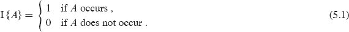

作为一个简单的例子，让我们确定抛一枚公平硬币时获得正面的期望次数。一次硬币抛掷的样本空间是`S` = {`H`, `T`}，其中 Pr {`H`} = Pr {`T`} = 1/2。然后我们可以定义一个与硬币正面朝上事件`H`相关联的指示随机变量`X[H]`。这个变量计算这次抛掷中获得的正面次数，如果硬币正面朝上则为 1，否则为 0。我们写

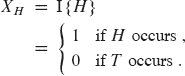

在一次抛硬币中获得正面的期望次数简单地是我们的指示变量`X[H]`的期望值：

| E [X[H]] | = | E [I {H}] | `   |
| --- | --- | --- |
|  | = | 1 · Pr {H} + 0 · Pr {T} |
|  | = | 1 · (1/2) + 0 · (1/2) |
|  | = | 1/2. |

因此，一次抛硬币获得正面的期望次数为 `1/2`。正如下面的引理所示，与事件`A`相关的指示随机变量的期望值等于事件`A`发生的概率。

`***引理 5.1***`

给定一个样本空`S`和样本空间`S`中的事件`A`，令`X[A]` = I `{A}`。那么 E [`X[A]`] = Pr `{A}`。

***证明*** 通过方程`(5.1)`中指示随机变量的定义和期望值的定义，我们有

| E [X[A]] | = | E [I {A}] | `   |
| --- | --- | --- | --- | --- |
| --- | --- | --- |
|  | = | 1 · Pr {`A`} + 0 · Pr {`A`} |
| | = Pr {A}, |

其中`A`表示`A`的补集`S - A`。

尽管对于像投掷单枚硬币预期头数这样的应用，指示随机变量可能看起来很繁琐，但它们对于分析执行重复随机试验的情况很有用。例如，在附录 C 中，指示随机变量提供了一种简单的方法来确定`n`次抛硬币中预期头数。一种选择是分别考虑获得 0 个头、1 个头、2 个头等的概率，以得到第 1199 页方程(C.41)的结果。另一种选择是使用方程(C.42)提出的更简单的方法，该方法隐式使用了指示随机变量。更明确地阐述这一论述，让`X[i]`是与第`i`次翻转出现头的事件相关联的指示随机变量：`X[i] = I {第`i`次翻转结果为事件`H`}`。让`X`是表示`n`次抛硬币中头数的随机变量，因此

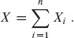

为了计算预期头数，对上述方程两边取期望值得到

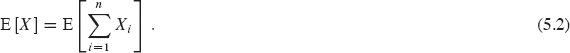

根据引理 5.1，每个随机变量的期望值为 `E[X[i]] = 1/2`，对于`i` = 1, 2, … , `n`。然后我们可以计算期望值的总和：``。但是方程(5.2)要求计算总和的期望值，而不是期望值的总和。我们如何解决这个难题呢？期望的线性性，即第 1192 页的方程（C.24）：*总和的期望值总是等于期望值的总和*。即使随机变量之间存在依赖关系，期望的线性性也适用。将指示随机变量与期望的线性性结合起来，给了我们一个强大的技术，用于在多个事件发生时计算期望值。现在我们可以计算预期头数：

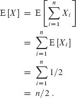

因此，与方程`(C.41)`中使用的方法相比，指示随机变量大大简化了计算。我们在本书中始终使用指示随机变量。

**使用指示随机变量分析招聘问题**

返回到招聘问题，我们现在希望计算你雇佣新办公助理的预期次数。为了使用概率分析，让我们假设候选人是以随机顺序到达的，如第 5.1 节所讨论的。（我们将在第 5.3 节中看到如何消除这一假设。）设`X`是随机变量，其值等于你雇佣新办公助理的次数。然后我们可以应用第 1192 页方程（C.23）中的期望值定义来获得

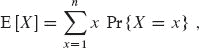

但是这种计算将会很繁琐。相反，让我们通过使用指示随机变量来简化计算。

使用指示随机变量，而不是通过定义一个变量来表示你雇佣新办公助理的次数来计算 E [`X`]，将雇佣过程视为重复的随机试验，并定义指示每个特定候选人是否被雇用的`n`个变量。特别地，让`X[i]`是与第`i`个候选人被雇用事件相关联的指示随机变量。因此，

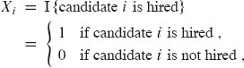

和

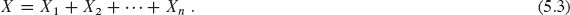  

引理 `5.1` 给出

E `[X[i]] = Pr {候选人`i`被雇用}`,

因此我们必须计算 `HIRE-ASSISTANT` 的第 5-6 行被执行的概率。

候选者`i`在第 6 行被聘用，当且仅当候选者`i`比候选者 1 到`i-1`中的每一个都更好时。因为我们假设候选者是以随机顺序到达的，前`i`个候选者以随机顺序出现。这些前`i`个候选者中的任何一个同样有可能是目前为止最合格的。候选者`i`有`1/i`的概率比候选者 1 到`i-1`更合格，因此有 `1/i`的概率被聘用。根据引理 5.1，我们得出结论

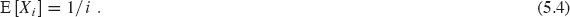

现在我们可以计算 E [`X`]：  

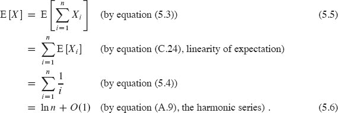

即使您面试了`n`个人，平均只雇佣了大约 ln `n` 个人。我们在以下引理中总结了这一结果。

`***引理 5.2***`

假设候选者是以随机顺序呈现的，算法 HIRE-ASSISTANT 的平均情况总雇佣成本为`O(c[h] ln n)`。

***证明***   该界限立-   ***证明***   该界限立即遵循我们对雇佣成本的定义和方程`(5.6)`的定义，该方程显示了雇佣人数的期望值大约为 ln `n`。

▪  输出：

平均情况下的雇佣成本相对于最坏情况下的`O(c[h]n)`的雇佣成本是一个显著的改进。

**练习**

***5.2-1***

在 `HIRE-ASSISTANT` 中，假设候选者是以随机顺序呈现的，您恰好一次聘用的概率是多少？您恰好`n`次聘用的概率是多少？

`5.2-2`

在 `HIRE-ASSISTANT` 中，假设候选者是以随机顺序呈现的，那么您恰好聘用两次的概率是多少？

***`5.2-3`***

使用指示随机变量计算`n`个骰子的和的期望值。

***5.2-4***

这个练习要求您（部分）验证期望的线性性即使随机变量不是独立的。考虑独立掷出的两个 6 面骰子。和的期望值是多少？现在考虑第一个骰子正常掷出，然后第二个骰子的值设置为第一个骰子示的值。和的期望值是多少？现在考虑第一个骰子正常掷出，第二个骰子设置为 7 减去第一个骰子的值。和的期望值是多少？

***5.2-5***

使用指示随机变量解决以下问题，这个问题被称为***帽子检查问题***。在餐馆里，每个`n`个顾客都把帽子交给一个帽检人员。帽检人员以随机顺序将帽子还给顾客。期望有多少顾客能拿回自己的帽子？

***5.2-6***

让`A[1 : n]`是一个包含`n`个不同数字的数组。如果`i` < `j`且`A[i]` > `A[j]`，那么这对(`i`, `j`)被称为`A`的***逆序***。（有关逆序的更多信息，请参见第 47 页的问题 2-4。）假设`A`的元素形成<1, 2, … , `n`>的均匀随机排列。使用指示随机变量计算逆序的期望数量。

**5.3      随机算法**

在前一节中，我们展示了了解输入分布如何帮助我们分析算法的平均情况行为。如果您不知道分布怎么办？那么您无法进行平均情况分析。然而，正如在第 5.1 节中提到的，您可能能够使用随机算法。

对于像招聘问题这样的问题，在假设输入的所有排列都是等可能的情况下，概率分析可以指导我们开发随机算法。我们不再`*假设*`输入的分布，而是`*强加*`一个分布。特别是，在运行算法之前，让我们随机排列候选人，以强制每个排列都是等可能的属性。虽然我们修改了算法，但我们仍然期望大约 ln `n`次雇佣新办公助理。但现在我们期望这种情况发生在`*任何*`输入上，而不是发生在从特定分布中抽取的输入上。

让我们进一步探讨概率分析和随机算法之间的区别。在第 5.2 节中，我们声称，假设候选人以随机顺序到达，您雇佣新办公助理的预期次数约为 ln `n`。这个算法是确定性的：对于任何特定的输入，雇佣新办公助理的次数总是相同的。此外，您雇佣新办公助理的次数因不同的输入而异，并且取决于各候选人的排名。由于这个数字仅取决于候选人的排名，为了表示特定的输入，我们只需按顺序列出候选人的排名<*rank*(1), *rank*(2), … , *rank*(`n`)>。给定排名列表`A`[1] = <1, 2, 3, 4, 5, 6, 7, 8, 9, 10>，新办公助理总是被雇佣 10 次，因为每个连续的候选人都比前一个更好，并且在每次迭代中执行 HIRE-ASSISTANT 的第 5-6 行。给定排名列表`A`[2] = <10, 9, 8, 7, 6, 5, 4, 3, 2, 1>，新办公助理只被雇佣一次，在第一次迭代中。给定排名列表`A`[3] = <5, 2, 1, 8, 4, 7, 10, 9, 3, 6>，新办公助理被雇佣三次，分别是面试排名为 5、8 和 10 的候选人时。回想一下，我们的算法的成本取决于您雇佣新办公助理的次数，我们看到有昂贵的输入，如`A`[1]，廉价的输入，如`A`[2]，以及中等昂贵的输入，如`A`[3]。  

另一方面，考虑首先随机排列候选人列表，然后确定最佳候选人的随机算法。在这种情况下，我们在算法中随机化，而不是在输入分布中随机化。给定特定的输入，比如上面的`A[3]`，我们无法确定最大值更新的次数，因为这个数量在每次运行算法时都不同。第一次在`A[3]`上运行算法时，它可能产生排列`A[1]`并执行 10 次更新。但第二次运行算法时，它可能产生排列`A[2]`并只执行一次更新。第三次运行算法时，它可能执行其他次数的更新。每次运行算法时，其执行取决于随机选择，并且很可能与算法的先前执行不同。对于这个算法和许多其他随机算法，*没有特定的输入会引发其最坏情况的行为*。即使是您最坏的敌人也无法产生一个糟糕的输入数组，因为随机排列使输入顺序无关紧要。只有当随机数生成器产生“不幸”的排列时，随机算法才表现糟糕。

对于招聘问题，代码中唯一需要的更改是随机排列数组，就像在随机雇佣助理程序中所做的那样。这个简单的改变创建了一个随机算法，其性能与假设候选人以随机顺序呈现时获得的性能相匹配。

随机雇佣助理(`n`)

| 1 | 随机排列候选人列表 |
| --- | --- |
| 2 | 雇佣助理(n) |

**`引理 5.3`**

随机雇佣助理程序的预期雇佣成本为`O(ch ln n)`。

***证明***   对输入数组进行排列实现了与第 5.2 节中 HIRE-ASSISTANT 的概率分析相同的情况。  

▪ 输出：

通过仔细比较引理 `5.2` 和 `5.3`，您可以看到概率分析和随机化算法之间的区别。引理 `5.2` 对输入做出了假设。引理 `5.3` 没有做出这样的假设，尽管随机化输入需要额外的时间。为了保持术语的一致性，我们将引理 `5.2` 表述为平均情况下的雇佣成本，引理 `5.3` 表述为期望雇佣成本。在本节的其余部分，我们将讨论随机排列输入涉及的一些问题。

**随机排列数组**

许多随机算法通过对给定的输入数组进行排列来随机化输入。本书的其他地方将介绍随机化算法的其他方法，但现在，让我们看看如何随机排列一个包含`n`个元素的数组。目标是生成一个***均匀随机排列***，即一个与其他任何排列一样可能的排列。由于存在`n!`种可能的排列，我们希望产生任何特定排列的概率为`1/n!`。

您可能认为要证明一个排列是均匀随机排列，只需证明对于每个元素`A[i]`，该元素最终位于位置`j`的概率为 1/n。练习 5.3-4 表明，事实上，这个更弱的条件是不够的。  

我们生成随机排列的方法在`原地`对数组进行排列：最多只有常数个元素存储在数组之外。过程 RANDOMLY-PERMUTE 在Θ(n)时间内原地对数组 A[1 : n]进行排列。在第 i 次迭代中，它从元素 A[i]到 A[n]中随机选择元素 A[i]。第 i 次迭代后，A[i]不会被改变。

`RANDOMLY-PERMUTE(A, n)`

| 1 | `for` i = 1 **to** n |
| --- | --- |
| 2 | 交换`A[i]`和`A[RANDOM(i, n)]` |   |

我们使用循环不变量来展示过程 `RANDOMLY-PERMUTE` 生成一个均匀随机排列。在包含`n`个元素的集合��的一个***k-排列***是一个包含`n`个元素中的`k`个元素的序列，没有重复。（见附录 C 中的第 1180 页。）有`n`!/(n – `k`)!种可能的`k`-排列。  

***引理 5.4***

过程 `RANDOMLY-PERMUTE` 计算一个均匀随机排列。

***证明***   我们使用以下循环不变量：

在第 1-2 行的`for`循环的第`i`次迭代之前，对于`n`个元素的每个可能的(`i` – 1)-排列，子数组`A`[1 : `i` – 1]以概率(`n` – `i` + 1)!/`n`!包含这个(`i` – 1)-排列。

我们需要在第一次循环迭代之前证明这个不变量是正确的，即循环的每次迭代都保持不变，循环终止，并且不变量在循环终止时提供了一个有用的属性来证明正确性。

**初始化：** 考虑在第一次循环迭代之前的情况，即`i` = 1。循环不变量表示对于每个可能的 0-排列，子数组`A[1 : 0]`以概率(`n` – `i` + 1)!/`n`! = `n`!/`n`! = 1 包含这个 0-排列。子数组`A[1 : 0]`是一个空子数组，0-排列没有元素。因此，`A[1 : 0]`以概率 1 包含任何 0-排列，循环不变量在第一次迭代之前成立。

**保持性：** 根据循环不变量，我们假设在第`i`次迭代之前，每个可能的(`i` – 1)-排列以概率`(`n` – `i` + 1)!/`n`!`出现在子数组`A[1 : i – 1]`中。我们将展示在第`i`次迭代之后，每个可能的`i`-排列以概率`(`n` – `i`)!/`n`!`出现在子数组`A[1 : i]`中。增加`i`以进行下一次迭代然后保持循环不变量。

让我们检查第`i`次迭代。考虑一个特定的`i`排列，并用<`x[1], x[2], … , x[i]`>表示其中的元素。这个排列由一个(`i` – 1)排列<`x[1], … , x[i–1]`>和算法放置在`A[i]`中的值`x[i]`组成。让`E[1]`表示前`i` – 1 次迭代在`A[1 : i – 1]`中创建了特定的(`i` – 1)排列<`x[1], … , x[i–1]`>的事件。根据循环不变量，Pr {`E[1]`} = (`n` – `i` + 1)!/`n`!。让`E[2]`表示第`i`次迭代将`x[i]`放在`A[i]`位置的事件。当且仅当`E[1]`和`E[2]`同时发生时，`i`排列<`x[1], … , x[i]`>出现在`A[1 : i]`中，因此我们希望计算 Pr {`E[2]` ∩ `E[1]`}。使用第 1187 页上的方程(C.16)，我们有

Pr `{E[2] ∩ E[1]}` = Pr `{E[2] | E[1]}` Pr `{E[1]}`。

概率 `Pr {E[2] | E[1]}` 等于 `1/(n - i + 1)`，因为在第 2 行中，算法从位置 `A[i : n]` 中的 `n - i + 1` 个值中随机选择 `x[i]`。因此，我们有 

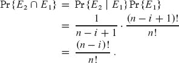

**终止条件：** 循环终止，因为它是一个**对于**循环，迭代`n`次。在终止时，`i` = `n` + 1，并且我们有子数组`A[1 : n]`是给定的`n`排列的概率为(`n` – (`n` + 1) + 1)!/`n`! = 0!`/n`! = 1/`n`!。

因此，`RANDOMLY-PERMUTE` 产生均匀随机排列。

▪  输出：

随机化算法通常是解决问题的最简单和最有效的方法。

**练习**

***`5.3-1`***

Marceau 教授反对在引理 5.4 证明中使用的循环不变量。他质疑在第一次迭代之前是否成立。他认为我们可以同样地声明一个空子数组不包含任何 0 排列。因此，一个空子数组包含 0 排列的概率应为 0，从而在第一次迭代之前使循环不变量无效。重写过程 `RANDOMLY-PERMUTE`，使其相关的循环不变量适用于第一次迭代之前的非空子数组，并修改引理 5.4 的证明以适应您的过程。  

`5.3-2`

Kelp 教授决定编写一个过程，随机生成除了`***恒等排列***`之外的任何排列，其中每个元素最终回到起始位置。他提出了过程`PERMUTE-WITHOUT-IDENTITY`。这个过程是否符合 Kelp 教授的意图？

`PERMUTE-WITHOUT-IDENTITY(A, n)`

| `1` | **对于** `i = 1` **到** `n - 1` |
| --- | --- |
| --- | --- |   |
| `2` | 交换`A[i]`和`A[RANDOM(i + 1, n)]` |   |

`5.3-3`

考虑下一页的 `PERMUTE-WITH-ALL` 过程，该过程不是将元素`A[i]`与子数组`A[i : n]`中的随机元素交换，而是与数组中任何位置的随机元素交换。`PERMUTE-WITH-ALL` 是否产生均匀随机排列？为什么？

PERMUTE-WITH-ALL(`A`, `n`)

| 1 | **对于** i = 1 **到** n |
| --- | --- |
| `2` | 交换`A[i]`和`A[RANDOM(1, n)]` |   |

**`5.3-4`**

Knievel 教授建议使用 `PERMUTE-BY-CYCLE` 生成均匀随机排列。证明每个元素 `A[i]` 以 1/`n` 的概率最终出现在 `B` 的任何特定位置。然后通过展示结果排列不是均匀随机的方式证明 Knievel 教授是错误的。

`PERMUTE-BY-CYCLE(A, n)`

| 1 | 让`B[1 : n]`成为一个新数组 |  |
| --- | --- | --- |
| `---` | `---` |
| 2 | `offset` = RANDOM(1, `n`) |
| 3 | ` **对于** `i = 1` **到** `n` |
| `4` | `dest = i + offset` |  |
| 5 | **如果** dest > n |
| `6` | `dest = dest - n` |
| 7 | B[dest] = A[i] | `   |
| `8` | **返回** `B` |

如果一个算法实现了`ρ(n)`的近似比率，我们称其为一个**`ρ(n)`-近似算法**。近似比率和`ρ(n)`-近似算法的定义适用于最小化和最大化问题。对于最大化问题，`0 < C ≤ C*`，比率`C*/C`给出了最优解的成本比近似解的成本大的因子。类似地，对于最小化问题，`0 < C* ≤ C`，比率`C/C*`给出了近似解的成本比最优解的成本大的因子。 -   因为我们假设所有解都有正成本，所以这些比率总是明确定义的。近似算法的近似比例永远不会小于 1，因为`C/C* ≤ 1`意味着`C*/C ≥ 1`。因此，一个 1-近似算法¹会产生一个最优解，而具有较大近似比率的近似算法可能返回比最优解差得多的解。

Gallup 教授想要创建一个***随机样本***，从集合{1, 2, 3, … , `n`}中，即一个`m`元素子集`S`，其中 `0 ≤ m ≤ n`，使得每个`m`子集被创建的概率相等。一种方法是设置`A[i] = i`，对于`i = 1, 2, 3, … , n`，调用 `RANDOMLY-PERMUTE(A)`，然后只取前`m`个数组元素。这种方法调用 RANDOM 过程`n`次。在 Gallup 教授的应用中，`n`远大于`m`，因此教授希望在减少对 RANDOM 的调用的情况下创建一个随机样本。  

RANDOM-SAMPLE(`m, n`)

| 1 | `S = ∅` |  |   |
| --- | --- | --- |
| 2 | **对于** `k = n - m + 1` **到** `n` | **//** 迭代`m`次 |  |
| 3 | i = RANDOM(1, k) |  | `   |
| `4` | **如果** `i` ∈ `S` |  |   |
| \| 5 \| `S = S ⋃ {k}` \|  \| |
| 6 | `**否则** `S = S ⋃ {i}` |  |   |
| \| 7 \| **返回** `S` \|  \|  输出： |

证明前一页上的 `RANDOM-SAMPLE` 过程返回一个{1, 2, 3, … , `n`}的随机`m`子集`S`，其中每个`m`子集是等概率的，同时只调用 `RANDOM` `m` 次。

★ **5.4      概率分析和指示器随机变量的进一步用途**

这个高级部分通过四个例子进一步说明了概率分析。第一个例子确定了在一个有`k`个人的房间里，有两个人分享相同生日的概率。第二个例子研究了将球随机投入箱子时会发生什么。第三个例子调查了在抛硬币时出现连续正面的“连击”情况。最后一个例子分析了一种雇佣问题的变体，在这种问题中，你必须在实际面试所有候选人之前做出决定。

**5.4.1    生日悖论**

我们的第一个例子是`生日悖论`。在一个房间里必须有多少人才有 50%的机会其中两人生日在一年中的同一天？答案令人惊讶地很少。悖论在于实际上比一年的天数少得多，甚至比一年的一半天数还少，我们将看到。

为了回答这个问题，我们用整数 1, 2, … , `k`对房间里的人进行索引，其中`k`是房间里的人数。我们忽略闰年的问题，并假设所有年份都有`n` = 365 天。对于`i` = 1, 2, … , `k`，让`b[i]`是人`i`生日的日期，其中 1 ≤ `b[i]` ≤ `n`。我们还假设生日均匀分布在一年的`n`天中，因此对于`i` = 1, 2, … , `k`和`r` = 1, 2, … , `n`，Pr {*b[i]* = `r`} = 1/`n`。

两个给定人，比如`i`和`j`，生日相同的概率取决于随机选择生日是否独立。我们从现在开始假设生日是独立的，因此`i`的生日和`j`的生日都在第`r`天的概率是

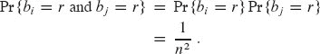

因此，它们都在同一天的概率是

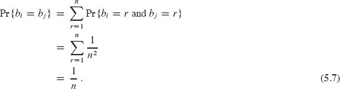

更直观地说，一旦选择了`b[i]`，`b[j]`被选为相同日期的概率是 1/`n`。只要生日是独立的，`i`和`j`生日相同的概率与其中一个生日在特定日期的概率相同。

我们可以通过观察互补事件来分析至少有`k`个人中有两人生日相同的概率。至少两个生日匹配的概率是 1 减去所有生日不同的概率。事件`B[k]`表示`k`个人有不同生日的概率是

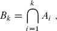

其中`A[i]`是人`i`的生日与所有`j` < `i`的人`j`的生日不同的事件。由于我们可以写成`B[k] = A[k] ∩ B[k–1]`，我们从第 1189 页的方程(C.18)得到递归

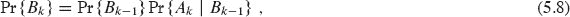

当我们将 `Pr {B[1]} = Pr {A[1]} = 1` 作为初始条件时。换句话说，`b[1]`、`b[2]`、…、`b[k]` 是不同生日的概率等于 `b[1]`、`b[2]`、…、`b[k–1]` 是不同生日的概率乘以 `b[k] ≠ b[i]`（`i` = 1, 2, …, `k` – 1）的概率，假设 `b[1]`、`b[2]`、…、`b[k–1]` 是不同的。

如果 `b[1]`、`b[2]`、…、`b[k–1]` 是不同的，那么对于 `i` = 1, 2, …, `k – 1`，`b[k] ≠ b[i]` 的条件概率是 Pr {`A[k]` | `B[k–1]`} = (`n` – `k` + 1)/`n`，因为在 `n` 天中，有 `n` – (`k` – 1) 天没有被占用。我们迭代地应用递推式（5.8）以获得

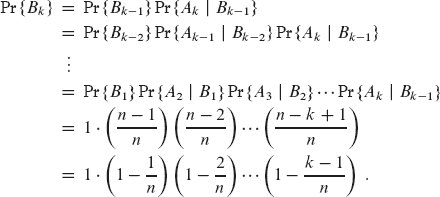

不等式（`3.14`）在第 `66` 页，`1 + x ≤ e^x`，给出  

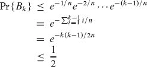  

当 –`k*(k - 1)/2*n` ≤ ln(1/2) 时。当 `k*(k - 1) ≥ 2`n` ln 2` 或者解方程时，所有 `k` 个生日都是不同的概率最多为 1/2，即 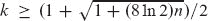。对于 `n = 365`，我们必须有 `k ≥ 23`。因此，如果一个房间里至少有 23 个人，那么至少有两个人有相同的生日的概率至少为 1/2。由于火星的一年有 669 天，需要 31 个火星人才能达到相同的效果。

**使用指示器随机变量的分析**

指示器随机变量为生日悖论提供了一个更简单但近似的分析。对于房间中的 `k` 个人中的每对（`i`，`j`），定义指示器随机变量 `X[ij]`，对于 1 ≤ `i` < `j` ≤ `k`，如下

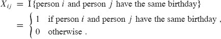

根据方程式 `(5.7)`，两个人有相同生日的概率为 `1/n`，因此根据第 130 页的引理 `5.1`，我们有

| E [X[ij]] | = | Pr {人 i 和人 j 生日相同} |
| --- | --- | --- |
| | = | 1/n`。 |

让 `X` 是计算具有相同生日的人数对的随机变量，我们有

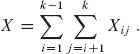

两边取期望并应用期望的线性性，我们得到 

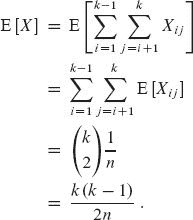

当 `k(k - 1) ≥ 2n` 时，具有相同生日的人数对的预期数量至少为 1。因此，如果一个房间里至少有 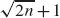 个人，我们可以期望至少有两个人有相同的生日。对于 `n` = 365，如果 `k` = 28，具有相同生日的人数对的预期数量为 `(28 · 27)/(2 · 365)` ≈ 1.0356。因此，至少有 28 个人时，我们期望找到至少一对相同生日的人。在火星上，一年有 669 天，我们需要至少 38 个火星人。

第一次分析仅使用概率确定了使得存在一对匹配生日的概率超过 1/2 所需的人数，第二次分析使用了指示器随机变量，确定了使得匹配生日的预期数量为 1 的人数。尽管两种情况下确切的人数不同，但它们在渐近意义上是相同的：``。

**5.4.2    球和箱子**

考虑一个过程，在这个过程中，你随机地将相同的球投入编号为 1、2、…、`b` 的箱子中。投掷是独立的，在每次投掷时，球等可能地落入任何箱子中。投掷的球落入任何给定箱子的概率为 `1/b`。如果我们将投掷球的过程视为伯努利试验的序列（参见 附录 C.4），其中成功意味着球落入给定箱子，则每次试验成功的概率为 `1/b`。这个模型特别适用于分析哈希（参见 第十一章），我们可以回答关于投掷球的过程的各种有趣问题。（问题 C-2 提出了关于球和箱子的额外问题。）  

+   *有多少个球掉入给定的箱子？* 掉入给定箱子的球的数量遵循二项分布 `b(k;n, 1/b)`。如果你投掷 `n` 个球，第 1199 页的方程式 `(C.41)` 告诉我们掉入给定箱子的球的预期数量是 `n/b`。

+   *平均需要投掷多少次球，直到一个给定的箱子包含一个球？* 直到给定箱子接收到一个球的投掷次数遵循概率为 1/`b`的几何分布，并且，根据第 1197 页的方程`(C.36)`，直到成功的预期投掷次数为 1/(1/`b`) = `b`。

+   *直到每个箱子至少包含一个球需要投掷多少球？* 让我们称一个球掉入空箱子的投掷为“命中”。我们想知道获得`b`个命中所需的预期次数`n`。

    使用命中，我们可以将`n`次投掷分成阶段。第`i`阶段包括第(`i` – 1)次命中后的投掷，直到第`i`次命中。第一个阶段包括第一次投掷，因为当所有箱子都为空时，你肯定会有一个命中。对于第`i`阶段的每次投掷，`i` – 1 个箱子包含球，`b` – `i` + 1 个箱子为空。因此，对于第`i`阶段的每次投掷，获得命中的概率为(`b` – `i` + 1)/`b`。

    让`n[i]`表示第`i`阶段所需的投掷次数。获得`b`个命中所需的投掷次数为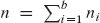。每个随机变量`n[i]`都具有成功概率(`b - i + 1`)/`b`的几何分布，因此，根据方程(C.36)，我们有

    ``

    根据期望的线性性，我们有-   根据期望的线性性，我们有

    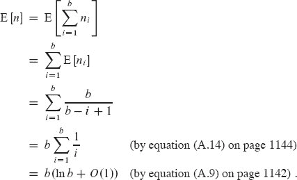

    因此，在我们期望每个箱子都有一个球之前，大约需要`t` ln `t`次投掷。这个问题也被称为***收集优惠券问题***，它说如果你试图收集`b`张不同的优惠券，那么你应该期望获得大约`b` ln `b`张随机获得的优惠券才能成功。

**5.4.3    连续出现**

假设你抛掷一个公平的硬币`n`次。你期望看到的最长连续出现头的长度是多少？我们将分别证明上界和下界，以显示答案是Θ(lg `n`)。

我们首先证明最长连续出现头的预期长度为`O(lg n)`。每次硬币翻转为头的概率为 1/2。让`A[ik]`表示长度至少为`k`的连续出现头的事件从第`i`次硬币翻转开始，或者更准确地说，长度为`k`的连续硬币翻转`i`, `i` + 1, … , `i` + `k` – 1 只产生头的事件，其中 `1 ≤ k ≤ n`，`1 ≤ i ≤ n – k + 1`。由于硬币翻转是相互独立的，对于任何给定的事件`A[ik]`，所有`k`次翻转都是头的概率为

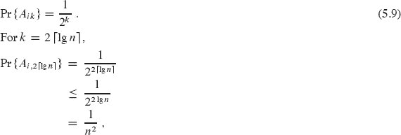

因此，在位置`i`开始长度至少为 2 ⌈lg `n`⌉ 的连续出现头的概率非常小。长度至少为 2 ⌈lg `n`⌉ 的连续出现头可以开始的位置最多为 `n` – 2 ⌈lg `n`⌉ + 1 个。因此，长度至少为 2 ⌈lg `n`⌉ 的连续出现头可以在任何位置开始的概率为

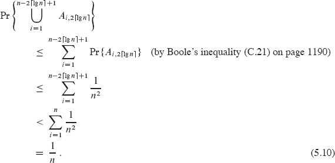

我们可以使用不等式`(5.10)`来限制最长连续出现的长度。对于`j` = 0, 1, 2, … , `n`，让`L[j]`表示最长连续出现头的长度恰好为`j`的事件，`L`表示最长连续出现的长度。根据期望值的定义，我们有

``  

我们可以尝试使用类似于不等式（5.10）中计算的每个 Pr {*L[j]*} 的上界来评估这个求和。不幸的是，这种方法得到的界限较弱。然而，通过上述分析获得的一些直觉可以得到一个很好的界限。然而，对于方程（5.11）中求和中的任何一个项，因子 `j` 和 Pr {*L[j]*} 都不大。为什么？当 `j` ≥ 2 ⌈lg `n`⌉ 时，Pr {*L[j]*} 非常小，当 `j` < 2 ⌈lg `n`⌉ 时，`j` 相当小。更确切地说，由于事件 *L[j]* 对于 `j` = 0, 1, … , `n` 是互不相交的，至少出现长度至少为 2 ⌈lg `n`⌉ 的连续正面朝上的概率是 ``。不等式（5.10）告诉我们，至少出现长度至少为 2 ⌈lg `n`⌉ 的连续正面朝上的概率小于 1/`n`，这意味着 ``。另外，注意到 ``，我们有 ``。因此，我们得到

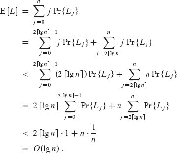

超过 `r ⌈lg n⌉` 次连续正面朝上的概率随着 `r` 的增加迅速减小。让我们对至少出现 `r ⌈lg n⌉` 个连续正面朝上的概率进行一个粗略的界限，对于 `r ≥ 1`。至少出现 `r ⌈lg n⌉` 个连续正面朝上的概率在位置 `i` 开始的情况下为

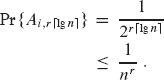

至少 `r ⌈lg n⌉` 个连续正面朝上的硬币不可能在最后 `n − r ⌈lg n⌉ + 1` 次翻转中开始，但让我们通过允许它在 `n` 次抛硬币中的任何位置开始来高估这种情况的概率。那么至少出现 `r ⌈lg n⌉` 个连续正面朝上的概率最多为

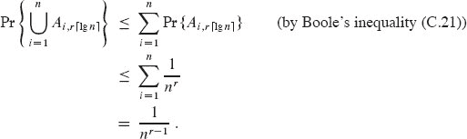

等价地，概率至少为 `1 – 1/n^(r–1)` 最长连续正面朝上的长度小于 `r ⌈lg n⌉`。

举例来说，在 `n` = 1000 次抛硬币中，至少出现 2 ⌈lg n⌉ = 20 个连续正面朝上的概率最多为 1/n = 1/1000。至少出现 3 ⌈lg n⌉ = 30 个连续正面朝上的概率最多为 1/n² = 1/1,000,000。  

现在让我们证明一个互补的下界：在 `n` 次抛硬币中，最长连续正面朝上的长度的期望是 Ω(lg `n`)。为了证明这个界限，我们通过将 `n` 次抛硬币分成大约 `n/s` 组，每组包含 `s` 次抛硬币来寻找长度为 `s` 的连续正面朝上的情况。如果我们选择 `s` = ⌊(lg `n`)/2⌋，我们会发现至少有一组全是正面朝上的情况，这意味着最长连续正面朝上的长度至少为 `s` = Ω(lg `n`) 的概率很高。然后我们将展示最长连续正面朝上的长度的期望为 Ω(lg `n`)。

让我们将 `n` 次抛硬币分成至少 ⌊`n`/ ⌊(lg `n`)/2⌋⌋ 组，每组包含 ⌊(lg `n`)/2⌋ 个连续抛硬币，并限制没有任何一组全是正面朝上的概率。根据方程（5.9），从位置 `i` 开始的组全是正面朝上的概率为 

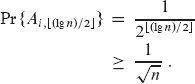

因此，长度至少为 ⌊(`lg `n``)/2⌋ 的连续正面朝上的概率不在位置 `i` 开始的概率最多为 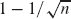。由于这些 ⌊`n`/ ⌊(`lg `n``)/2⌋⌋ 组是由互斥、独立的抛硬币组成的，每个组都不是长度为 ⌊(`lg `n``)/2⌋ 的连续正面朝上的概率最多为 

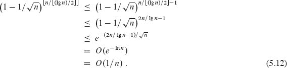

对于这个论点，我们使用了不等式（`3.14`），`1 + x ≤ e^x`，在第 `66` 页上，以及事实，您可以验证，对于足够大的 `n`，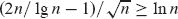。  

我们希望限制最长连续数目等于或超过⌊(lg `n`)/2⌋的概率。为此，让`L`为最长连续正面朝上的长度等于或超过`s` = ⌊(lg `n`)/2⌋的事件。让`L`为补事件，即最长连续正面朝上的长度严格小于`s`，以便 Pr {`L`} + Pr {`L`} = 1。让`F`为每组`s`次抛硬币都不构成`s`个正面朝上的连续的事件。根据不等式(5.12)，我们有 Pr {`F`} = `O`(1/`n`)。如果最长连续正面朝上的长度小于`s`，那么每组`s`次抛硬币肯定不构成`s`个正面朝上的连续，这意味着事件`L`蕴含事件`F`。当然，即使事件`L`不发生，事件`F`也可能发生（例如，如果长度为`s`或更多的连续越过两组之间的边界），因此我们有 Pr {`L`} ≤ Pr {`F`} = `O`(1/`n`)。由于 Pr {`L`} + Pr {`L`} = 1，我们有

| Pr {`L`} | = | 1 – Pr {`L`} |
| --- | --- | --- |
|  | ≥ | 1 – Pr {F} | `   |
|  | = | 1 – O(1/n)`. |

也就是说，最长连续数目等于或超过⌊(`lg n`)/2⌋的概率为

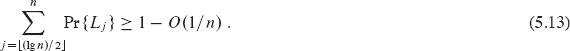

现在我们可以计算最长连续数目的期望长度的下界，从方程`5.11`开始，类似于我们对上界的分析：

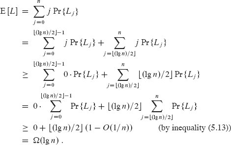

与生日悖论类似，我们可以使用指示器随机变量进行更简单但近似的分析。我们不是确定最长连续数目的期望长度，而是找到至少具有给定长度的连续数目的期望数量。设`X[ik]` = I {*A[ik]*}为与从第`i`次抛硬币开始的长度至少为`k`的连续正面朝上的指示器随机变量。为了计算这类连续数目的总数，定义

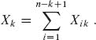

通过期望和期望的线性性，我们有

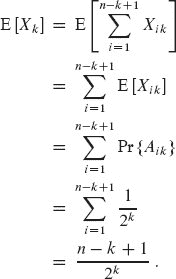

通过为`k`插入各种值，我们可以计算至少长度为`k`的连续数目的期望数量。如果这个期望数量很大（远大于 1），那么我们预计会看到许多长度为`k`的连续，一个发生的概率很高。如果这个期望数量很小（远小于 1），那么我们预计会看到很少长度为`k`的连续，一个发生的概率很低。如果`k = c lg n`，对于某个正常常数`c`，我们得到

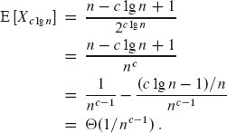

如果`c`很大，长度为`c` lg `n`的连续数目的期望值很小，我们得出它们不太可能发生。另一方面，如果`c` = 1/2，那么我们得到 E [`X`[(1/2) lg `n`]] = Θ(1/`n`^(1/2–1)) = Θ(`n`^(1/2))，我们预计会有许多长度为(1/2) lg `n`的连续数目。因此，一个这样长度的连续数目很可能发生。我们可以得出最长连续数目的期望长度为Θ(lg `n`)。

**5.4.4    在线招聘问题**

最后一个例子，让我们考虑招聘问题的一个变体。现在假设您不希望按顺序面试所有候选人以找到最佳候选人。您还希望避免在找到更好的申请人时进行雇佣和解雇。相反，您愿意为了只雇佣一次而接受接近最佳候选人的候选人。您必须遵守一家公司的要求：每次面试后，您必须立即向申请人提供职位或立即拒绝申请人。在最小化面试量和最大化雇佣的候选人质量之间存在什么权衡？

我们可以用以下方式建模这个问题。在遇到一个申请者后，你可以给每个人一个分数。让`score(i)`表示你给第`i`个申请者的分数，并假设没有两个申请者会得到相同的分数。在你见过`j`个申请者后，你知道哪一个是得分最高的，但你不知道剩下的`n` – `j`个申请者中是否有人会得到更高的分数。你决定采取这样的策略：选择一个小于`n`的正整数`k`，先面试并拒绝前`k`个申请者，然后雇佣第一个比之前所有申请者得分更高的申请者。如果最合格的申请者是前`k`个面试的人之一，那么你会雇佣第`n`个申请者——最后一个面试的人。我们在过程 ONLINE-MAXIMUM(`k`, `n`)中形式化这个策略，该过程返回你希望雇佣的候选人的索引。

`ONLINE-MAXIMUM(k, n)`

| 1 | `best-score` = –∞ |
| --- | --- |
| `2` | **对于** `i` = `1` **到** `k` |
| `3` | **如果** `score(i)` > `best-score` |   |
| 4 | `*best-score* = *score*(i)` |   |
| 5 | ` **对于** `i = k + 1` **到** `n` |
| 6 | **如果** score(i) > best-score | `   |
| \| `7` \| **返回** `i` \|   |
| `8` | **返回** `n` |   |

如果我们确定每个可能的`k`值时你雇佣最合格申请者的概率，那么你可以选择最佳的`k`并使用该值实施策略。暂时假设`k`是固定的。让`M(j) = max {score(i) : 1 ≤ i ≤ j}`表示申请者 1 到`j`中的最高分数。让`S`表示你成功选择最合格申请者的事件，`S[i]`表示当最合格的申请者是第`i`个被面试的时候你成功的事件。由于各个`S[i]`是不相交的，我们有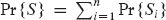。注意到当最合格的申请者是前`k`个中的一个时，你永远不会成功，所以对于`i` = 1, 2, … , `k`，我们有 Pr {`S[i]`} = 0。因此，我们得到

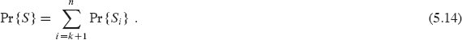

现在我们计算 `Pr {S[i]}`。为了在最合格的申请者是第`i`个时成功，必须发生两件事。首先，最合格的申请者必须在第`i`个位置，我们用`B[i]`表示这个事件。其次，算法不能选择第`k` + 1 到`i` – 1 个位置的任何申请者，只有当对于每个`j`，使得`k` + 1 ≤ `j` ≤ `i` – 1，第 6 行发现`score(j) < best-score`时才会发生。 （因为分数是唯一的，我们可以忽略`score(j) = best-score`的可能性。）换句话说，`score(k + 1)`到`score(i – 1)`的所有值都必须小于`M(k)`。如果有任何一个大于`M(k)`，算法将返回第一个大于`M(k)`的索引。我们用`O[i]`表示在第`k` + 1 到`i` – 1 个位置的申请者都没有被选择的事件。幸运的是，事件`B[i]`和`O[i]`是独立的。事件`O[i]`仅取决于位置 1 到`i` – 1 的值的相对顺序，而`B[i]`仅取决于位置`i`的值是否大于所有其他位置的值。位置 1 到`i` – 1 的值的顺序不会影响位置`i`的值是否大于它们所有，而位置`i`的值也不会影响位置 1 到`i` – 1 的值的顺序。因此，我们可以应用第 1188 页的方程`(C.17)`得到

`Pr {S[i]}` = `Pr {B[i] ∩ O[i]}` = `Pr {B[i]} Pr {O[i]}`。

我们有 Pr {`B[i]`} = 1/`n`，因为最大值在任何一个`n`个位置中都有相同的可能性。为了使事件`O[i]`发生，前 1 到`i` –1 个位置中的最大值（同样有可能在这`i` – 1 个位置中的任何一个）必须在前`k`个位置中的一个。因此，Pr {`O[i]`} = `k`/(`i` – 1)，Pr {`S[i]`} = `k`/(`n`(`i` – 1))。使用方程`5.14`，我们有

``  

我们通过积分来估计上下界以限制这个求和。根据第 `1150` 页上的不等式（`A.19`），我们有

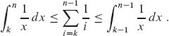

评估这些定积分给出了我们的界限

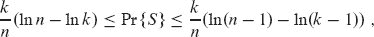  

这些为 Pr {`S`}提供了一个相当紧密的界限。因为你希望最大化成功的概率，让我们专注于选择最大化 Pr {`S`}下界的`k`的值。（此外，下界表达式比上界表达式更容易最大化。）对表达式(`k`/`n`)(ln `n` – ln `k`)关于`k`求导，我们得到

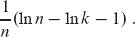

将这个导数设为 0，我们发现当 ln `k` = ln `n` – 1 = ln(`n`/`e`)时，可以最大化概率的下界，或者等价地，当`k` = `n`/`e`时。因此，如果你使用`k` = `n`/`e`实施我们的策略，你成功雇佣最合格的申请人的概率至少为 1/`e`。

**练习**

`5.4-1`

在一个房间里必须有多少人，才能使得有人与你有相同的生日的概率至少为 `1/2`？在有这么多人的情况下，至少有两个人生日是 7 月 4 日的概率大于 `1/2`，需要多少人？

**`5.4-2`**

在一个房间里必须有多少人，才能使得有两个人生日相同的概率至少为 `0.99`？对于这么多人，有多少对人有相同生日的期望数量？

`5.4-3`

你把球扔进`b`个箱子，直到某个箱子里有两个球。每次投掷都是独立的，每个球都有相等的机会落入任何一个箱子。预期投掷多少次球？

★ `5.4-4`

对于生日悖论的分析，生日之间是否相互独立很重要，还是成对独立就足够了？请证明你的答案。

★ ***5.4-5***

要   要使派对上有`三`个人生日相同的可能性较大，应该邀请多少人？

★ `5.4-6`

一个大小为`n`的集合上的`k`-字符串（在第 1179 页定义）形成一个`k`排列的概率是多少？这个问题与生日悖论有什么关系？

★ ***5.4-7***

你把`n`个球扔进`n`个箱子，每次投掷都是独立的，球有相等的机会落入任何一个箱子。预期有多少个空箱子？预期有多少个箱子里正好有一个球？

★ `5.4-8`

通过展示在`n`次抛硬币中，连续出现长度为 lg `n` – 2 lg lg `n`的头的概率至少为 `1 – 1/n`，来加强连续长度的下界。

**问题**

***5-1     概率计数***

使用一个`b`位计数器，通常只能计数到 2^(b) – 1。使用 R. Morris 的***概率计数***，我们可以以牺牲一些精度为代价计数到更大的值。

我们让计数器值为`i`表示`i = 0, 1, … , 2^(b) – 1`的`n[i]`计数，其中`n[i]`形成一个递增的非负值序列。我们假设计数器的初始值为 0，表示`n[0] = 0`。INCREMENT 操作以概率方式作用于包含值`i`的计数器。如果`i = 2^(b) – 1`，则该操作报告溢出错误。否则，INCREMENT 操作以 `1/(n[i + 1] – n[i])`的概率增加计数器 1，以 `1 – 1/(n[i + 1] – n[i])`的概率保持计数器不变。  

如果我们选择`n[i] = i`对所有`i` ≥ 0，则计数器是一个普通的计数器。如果我们选择，比如，`n[i] = 2^(i - 1)`对`i` > 0 或`n[i] = F[i]`（第`i`个斐波那契数—见第 69 页的方程（3.31））等更有趣的情况会出现。

对于这个问题，假设``足够大，使得溢出错误的概率可以忽略不计。

***`a.`*** 展示经过`n`次 INCREMENT 操作后计数器表示的期望值恰好为`n`。

***b.*** 计数器表示的计数方差的分析取决于`n[i]`的序列。让我们考虑一个简单的情况：对于所有`i` ≥ 0，`n[i]` = 100`i`。在执行`n`次增量操作后，估计寄存器表示的值的方差。

**`5-2   搜索未排序的数组`**

这个问题考察了三种在由`n`个元素组成的未排序数组`A`中搜索值`x`的算法。

考虑以下的随机策略：选择`A`中的一个随机索引`i`。如果`A[i] = x`，则终止；否则，通过选择`A`中的一个新的随机索引继续搜索。继续选择`A`中的随机索引，直到找到一个索引`j`使得`A[j] = x`，或者直到检查了`A`的每个元素。这种策略可能多次检查给定的元素，因为它每次都从整个索引集中选择。  

***a.*** 编写一个实现上述策略的随机搜索（RANDOM-SEARCH）过程的伪代码。确保你的算法在选择了`A`的所有索引时终止。

***b.*** 假设存在一个索引`i`使得`A[i] = x`。在随机搜索（RANDOM-SEARCH）终止之前，必须选择`A`中的索引的预期数量是多少？

***c.*** 将你对部分（b）的解决方案进行泛化，假设存在`k ≥ 1` 个索引`i`，使得`A[i] = x`。在随机搜索（RANDOM-SEARCH）终止之前，必须选择`A`中的索引的预期数量是多少？你的答案应该是`n`和`k`的函数。

***d.*** 假设不存在索引`i`使得`A[i] = x`。在所有`A`的元素都被检查并且随机搜索（RANDOM-SEARCH）终止之前，必须选择`A`中的索引的预期数量是多少？

现在考虑一个确定性线性搜索算法。该算法，我们称之为确定性搜索（`DETERMINISTIC-SEARCH`），按顺序在`A`中搜索`x`，考虑`A[1]`、`A[2]`、`A[3]`，…，`A[n]`，直到找到`A[i] = x`或者达到数组的末尾。假设输入数组的所有可能排列是等可能的。

***e.*** 假设存在一个索引`i`使得`A[i] = x`。确定性搜索（`DETERMINISTIC-SEARCH`）的平均情况运行时间是多少？确定性搜索的最坏情况运行时间是多少？

***f.*** 将你对部分（e）的解决方案进行泛化，假设存在`k` ≥ 1 个索引`i`，使得`A[i] = x`。确定性搜索（DETERMINISTIC-SEARCH）的平均情况运行时间是多少？确定性搜索的最坏情况运行时间是多少？你的答案应该是`n`和`k`的函数。

***g.*** 假设不存在索引`i`使得`A[i] = x`。确定性搜索（`DETERMINISTIC-SEARCH`）的平均情况运行时间是多少？确定性搜索的最坏情况运行时间是多少？

最后，考虑一个随机算法 `SCRAMBLE-SEARCH`，首先随机排列输入数组，然后在结果排列的数组上运行上述的确定性线性搜索。

***h.*** 让`k`表示存在`A[i] = x`的索引`i`的数量，给出 SCRAMBLE-SEARCH 在`k` = 0 和`k` = 1 的情况下的最坏情况和预期运行时间。泛化你的解决方案以处理`k` ≥ 1 的情况。

***i.*** 你会使用哪种搜索算法？解释你的答案。

**章节注释**

Bollobás [65], Hofri [223], 和 Spencer [420] 包含了丰富的高级概率技术。随机算法的优势由 Karp [249] 和 Rabin [372] 讨论和调查。Motwani 和 Raghavan 的教科书 [336] 对随机算法进行了广泛的讨论。

RANDOMLY-PERMUTE 程序由 Durstenfeld `128` 提出，基于 Fisher 和 Yates 早期的程序 `[143, p. 34]`。

招聘问题的几个变体已被广泛研究。这些问题更常被称为“秘书问题”。在这一领域的工作示例包括 Ajtai、Meggido 和 Waarts 的论文 `[11]`，以及 Kleinberg 的另一篇论文 `[258]`，将秘书问题与在线广告拍卖联系起来。
