*`6`*           堆排序

本章介绍了另一种排序算法：堆排序。与归并排序类似，但与插入排序不同，堆排序的运行时间为 `O(n lg n)`。与插入排序类似，但与归并排序不同，堆排序是原地排序：在任何时候只有常数个数组元素存储在输入数组之外。因此，堆排序结合了我们已经讨论过的两种排序算法的优点。  

堆排序还引入了另一种算法设计技术：使用一种数据结构，即我们称之为“`堆`”的数据结构，来管理信息。堆数据结构不仅对堆排序有用，而且还可以构建一个高效的优先队列。堆数据结构将在后面章节的算法中再次出现。

术语“堆”最初是在堆排序的背景下创造的，但后来它已经指代“垃圾收集存储”，例如编程语言 Java 和 Python 提供的。请不要混淆。堆数据结构`不是`垃圾收集存储。本书在使用术语“堆”时一贯指的是数据结构，而不是存储类。

**6.1      堆**

**(二叉) 堆** 数据结构是一个数组对象，我们可以将其视为一个几乎完全填满的二叉树（见第 B.5.3 节），如图 6.1 所示。树的每个节点对应数组的一个元素。树在所有级别上都是完全填充的，除了可能是最低级别，该级别从左侧填充到某一点。表示堆的数组 `A[1 : n]` 是一个带有属性 `A.heap-size` 的对象，该属性表示堆中存储在数组 `A` 中的元素数量。也就是说，尽管 `A[1 : n]` 可能包含数字，但只有 `A[1 : A.heap-size]` 中的元素是堆的有效元素，其中 `0 ≤ A.heap-size ≤ n`。如果 `A.heap-size = 0`，则堆为空。树的根是 `A₁`，给定节点的索引 `i`，有一种简单的方法来计算其父节点、左子节点和右子节点的索引，分别是 `PARENT`、`LEFT` 和 `RIGHT` 三个一行的过程。

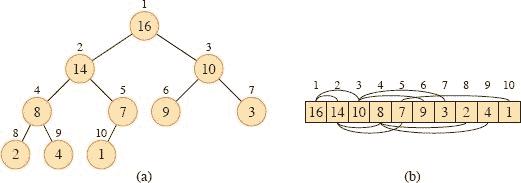

**图 6.1** 一个最大堆视为 **`(a)`** 二叉树和 **`(b)`** 数组。树中每个节点内部的数字是存储在该节点的值。节点上方的数字是数组中对应的索引。数组上方和下方有显示父子关系的线，父节点始终位于其子节点的左侧。树的高度为 3，索引为 4 的节点（值为 8）的高度为 1。

`PARENT(i)`  

| 1 | **return** ⌊`i/2`⌋ |
| --- | --- |
| `---` | `---` |

LEFT(i)

| 1 | **return** `2*i` |
| --- | --- |
| --- | --- |   |

`RIGHT(i)`  

| 1 | **return** 2`i` + 1 |
| --- | --- |

在大多数计算机上，LEFT 过程可以通过将 `i` 的二进制表示向左移动一个位位置来在一条指令中计算出 2`i`。类似地，RIGHT 过程可以通过将 `i` 的二进制表示向左移动一个位位置，然后加 1 来快速计算出 2`i` + 1。PARENT 过程可以通过将 `i` 右移一个位位置来计算 ⌊`i`/2⌋。堆排序的良好实现通常将这些过程实现为宏或内联过程。

有两种二叉堆：最大堆和最小堆。在这两种堆中，节点中的值满足一个`**堆属性**`，具体取决于堆的类型。在`**最大堆**`中，`**最大堆属性**` 是对于除根节点外的每个节点 i，

`A[PARENT(i)] ≥ A[i]`,

也就是说，节点的值最多等于其父节点的值。因此，在最大堆中，最大的元素存储在根节点，而以节点为根的子树包含的值不大于节点本身包含的值。**最小堆**则相反：**最小堆属性** 是对于除根节点外的每个节点 `i`，

`A[PARENT(i)] ≤ A[i]`.  

最小堆中最小的元素位于根节点。

堆排序算法使用最大堆。最小堆通常用于实现优先队列，我们在第 6.5 节中讨论。我们将明确指定特定应用程序需要最大堆还是最小堆，并且当属性适用于最大堆或最小堆时，我们只使用术语“堆”。

将堆视为树时，我们定义堆中节点的**高度**为从节点到叶子的最长简单向下路径上的边数，并将堆的高度定义为其根的高度。由于`n`个元素的堆基于完全二叉树，其高度为`Θ(lg n)`（参见练习 6.1-2）。正如我们将看到的，堆上的基本操作的运行时间最多与树的高度成比例，因此需要`O(lg n)`时间。本章的其余部分介绍了一些基本过程，并展示了它们如何在排序算法和优先队列数据结构中使用。

+   运行时间为`O(lg n)`的 MAX-HEAPIFY 过程是维护最大堆属性的关键。

+   运行时间为线性的`BUILD-MAX-HEAP`过程可以从无序输入数组生成最大堆。

+   运行时间为`O(n lg n)`的 HEAPSORT 过程可以原地对数组进行排序。

+   MAX-HEAP-INSERT、MAX-HEAP-EXTRACT-MAX、MAX-HEAP-INCREASE-KEY 和 MAX-HEAP-MAXIMUM 过程允许堆数据结构实现优先队列。它们的运行时间为`O(lg n)`加上将要插入优先队列的对象与堆中索引之间的映射时间。

**练习**

`6.1-1`

堆的高度`h`中元素的最小和最大数量是多少？

**`6.1-2`**  

证明一个包含`n`个元素的堆的高度为⌊`lg n`⌋。

**`6.1-3`**

证明在最大堆的任何子树中，子树的根包含该子树中任何位置出现的最大值。

**`6.1-4`**

在最大堆中，假设所有元素都不同，最小的元素可能位于哪个位置？

**6.1-5**

在最大堆中，假设所有元素都不同，第`k`大的元素可能位于哪些级别，其中 `2 ≤ k ≤ ⌊n/2⌋`？

**6.1-6**

排序顺序的数组是否为最小堆？

**`6.1-7`**  

数组<33, 19, 20, 15, 13, 10, 2, 13, 16, 12>是否为最大堆？

**`6.1-8`**  

证明使用数组表示存储`n`个元素堆时，叶子节点的索引为`⌊n/2⌋` + 1, `⌊n/2⌋` + 2, … , `n`。

**6.2 维护堆属性**

对面的 `MAX-HEAPIFY` 过程维护最大堆属性。其输入是具有`heap-size`属性和数组`A`中索引`i`的数组。当调用它时，`MAX-HEAPIFY` 假设以 `LEFT(i)` 和 `RIGHT(i)` 为根的二叉树是最大堆，但`A[i]` 可能小于其子节点，从而违反最大堆属性。`MAX-HEAPIFY` 使得`A[i]` 的值在最大堆中“下沉”，使得以索引`i` 为根的子树遵循最大堆属性。

图 6.2 说明了 `MAX-HEAPIFY` 的操作。每一步找到元素`A[i]`、`A[LEFT(i)]`和`A[RIGHT(i)]`中最大的元素，并将最大元素的索引存储在`largest`中。如果`A[i]`最大，则以节点`i`为根的子树已经是最大堆，不需要进行其他操作。否则，两个子节点中有一个包含最大元素。位置`i`和`largest`交换其内容，这导致节点`i`及其子节点满足最大堆属性。然而，索引为`largest`的节点刚刚减小了其值，因此以`largest`为根的子树可能违反最大堆属性。因此，`MAX-HEAPIFY` 在该子树上递归调用自身。

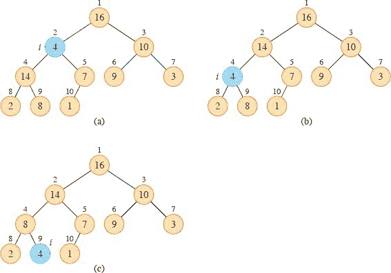

**图 6.2** MAX-HEAPIFY(`A`, 2)的操作，其中`A.heap-size = 1`0。潜在违反最大堆性质的节点显示为蓝色。**(a)** 初始配置，`A₂`在节点`i = 2` 处违反最大堆性质，因为它不比两个子节点大。通过用`A[4]`交换`A₂`来恢复节点 2 的最大堆性质，**(b)** 中破坏了节点 4 的最大堆性质。递归调用 MAX-HEAPIFY(`A`, 4)现在有`i = 4`。如**(c)**所示，交换`A[4]`和`A[9]`后，节点 4 被修复，递归调用 MAX-HEAPIFY(`A`, 9)对数据结构没有进一步更改。

`MAX-HEAPIFY(A, i)`

|   1 | `l = LEFT(i)` |
| --- | --- |
| `---` | `---` |
|   `2` | `r` = RIGHT(`i`) |   |
|   3 | `if` `l ≤ A.heap-size` and `A[l] > A[i]` |   |
| 4 | largest = l |
|   `5` | **else** *largest* = `i` |
|   6 | `if` `r ≤ A.heap-size` and `A[r] > A[largest]` |   |
|   7 | `largest = r` |
|   `8` | `if` `largest ≠ i` |
|   9 | 用`A[largest]`交换`A[i]` |   |
| `10` | `MAX-HEAPIFY(A, largest)` |  |

要分析 MAX-HEAPIFY，让`T(n)`表示该过程在大小不超过`n`的子树上花费的最坏情况运行时间。对于以给定节点`i`为根的树，运行时间是Θ(1)时间来修复元素`A`[i]、`A`[LEFT(`i`)]和`A`[RIGHT(`i`)]之间的关系，再加上运行 MAX-HEAPIFY 在以节点`i`的一个子节点为根的子树上的时间（假设递归调用发生）。子节点的子树大小最多为 2`n/3`（参见练习 6.2-2），因此我们可以通过递归描述 MAX-HEAPIFY 的运行时间

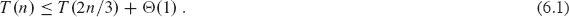

根据主定理的第 2 种情况（第 102 页的定理 4.1），这个递归的解是`T(n) = O(lg n)`。或者，我们可以将节点高度为`h`的 MAX-HEAPIFY 的运行时间描述为`O(h)`。

**练习**

**`6.2-1`**

使用图 6.2 作为模型，说明 MAX-HEAPIFY(`A`, 3)在数组`A` = <27, 17, 3, 16, 13, 10, 1, 5, 7, 12, 4, 8, 9, 0>上的操作。

`6.2-2`

证明`n`个节点堆的根的每个子节点都是包含最多 2`n/3` 个节点的子树的根。什么是最小常数`α`，使得每个子树最多有`α n`个节点？这如何影响递归（6.1）及其解决方案？  

**`6.2-3`**

从 MAX-HEAPIFY 过程开始，为`MIN-HEAPIFY(A, i)`编写伪代码，该过程在最小堆上执行相应的操作。MIN-HEAPIFY 的运行时间如何与 MAX-HEAPIFY 相比？

`6.2-4`  

当元素`A[i]`大于其子节点时，调用 `MAX-HEAPIFY(A, i)`的效果是什么？

**6.2-5**

调用 MAX-HEAPIFY(`A`, `i`)对于`i > A.heap-size/2` 的效果是什么？

**`6.2-6`**

MAX-HEAPIFY 的代码在常数因子方面相当高效，除了第 10 行中的递归调用可能会导致一些编译器生成低效的代码。编写一个使用迭代控制结构（循环）而不是递归的高效 MAX-HEAPIFY。

**`6.2-7`**  

证明在大小为`n`的堆上，MAX-HEAPIFY 的最坏情况运行时间是Ω(`lg n`)。(*提示:* 对于具有`n`个节点的堆，给出导致 MAX-HEAPIFY 在从根到叶子的简单路径上的每个节点上递归调用的节点值。)

**`6.3`      构建堆**

BUILD-MAX-HEAP 过程通过自底向上的方式调用 MAX-HEAPIFY 将数组`A[1 : n]`转换为最大堆。练习 6.1-8 说，子数组`A[⌊n/2⌋ + 1 : n]`中的元素都是树的叶子，因此每个元素一开始都是一个 1 元素堆。BUILD-MAX-HEAP 遍历树的其余节点，并在每个节点上运行 MAX-HEAPIFY。图 6.3 展示了 BUILD-MAX-HEAP 的操作示例。  

`BUILD-MAX-HEAP(A, n)`  

| 1 | A.heap-size = n | `   |
| --- | --- |
| 2 | `for` `i = ⌊n/2⌋` **downto** 1 |
| `3` | `MAX-HEAPIFY(A, i)` |  |

要展示 `BUILD-MAX-HEAP` 为什么能够正确工作，我们使用以下循环不变式：

在第 2-3 行的`for`循环的每次迭代开始时，每个节点`i` + 1，`i` + 2，…，`n`都是一个最大堆的根。

我们需要展示这个不变式在第一次循环迭代之前是正确的，每次循环迭代都保持不变式，循环终止，并且不变式在循环终止时提供了一个有用的属性来展示正确性。

**初始化：** 在循环的第一次迭代之前，`i = ⌊n/2⌋`。每个节点`⌊n/2⌋ + 1`，`⌊n/2⌋ + 2`，…，`n`都是一个叶子节点，因此是一个微不足道的最大堆的根。

**维护：** 要看到每次迭代都保持循环不变式，观察到节点`i`的子节点编号比`i`高。因此，根据循环不变式，它们都是最大堆的根。这正是调用 MAX-HEAPIFY(`A`, `i`)使节点`i`成为最大堆根所需的条件。此外，MAX-HEAPIFY 调用保持了节点`i + 1`，`i + 2`，…，`n`都是最大堆的根的属性。在`for`循环更新中递减`i`重新建立了下一次迭代的循环不变式。

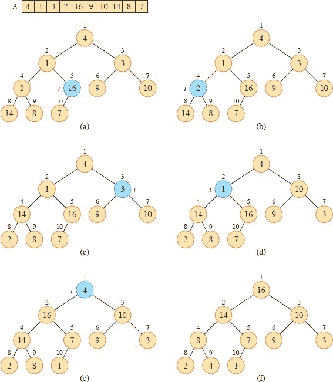  

**图 6.3** `BUILD-MAX-HEAP` 的操作，在 `BUILD-MAX-HEAP` 的第 3 行调用 `MAX-HEAPIFY` 之前显示数据结构。每次迭代中索引为`i`的节点显示为蓝色。**(a)** 一个包含 10 个元素的输入数组`A`及其表示的二叉树。在调用 `MAX-HEAPIFY(A, i)`之前，循环索引`i`指的是节点 5。**(b)** 结果的数据结构。下一次迭代的循环索引`i`指的是节点 4。**(c)-(e)** `BUILD-MAX-HEAP` 中`for`循环的后续迭代。请注意，每当在一个节点上调用 `MAX-HEAPIFY` 时，该节点的两个子树都是最大堆。**(f)** `BUILD-MAX-HEAP` 完成后的最大堆。

**终止：** 循环恰好进行了`⌊n/2⌋`次迭代，因此终止。在终止时，`i = 0`。根据循环不变式，每个节点 1, 2, …，`n`都是最大堆的根。特别地，节点 1 是。

我们可以通过以下方式计算 BUILD-MAX-HEAP 的运行时间的简单上界。每次调用 MAX-HEAPIFY 都需要`O(lg n)`的时间，并且 BUILD-MAX-HEAP 进行`O(n)`次这样的调用。因此，运行时间为`O(n lg n)`。这个上界虽然正确，但并不是最紧密的。

通过观察 MAX-HEAPIFY 在节点上运行的时间随着节点在树中的高度而变化，并且大多数节点的高度较高，我们可以得出更紧密的渐近界限。我们更严格的分析依赖于以下性质：一个`n`元素堆的高度为⌊`lg n`⌋（参见练习 6.1-2），任何高度`h`的节点最多有⌈`n/2`^(h + 1)⌉个节点（参见练习 6.3-4）。  

当在高度为`h`的节点上调用 MAX-HEAPIFY 时，所需的时间为`O(h)`。让`c`是渐近符号中的常数，我们可以将 BUILD-MAX-HEAP 的总成本表示为上界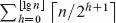。正如练习 6.3-2 所示，对于 0 ≤ `h` ≤ ⌊`lg n`⌋，我们有⌈`n/2`^(`h` + 1)⌉ ≥ 1/2。由于对于任何`x ≥ 1`/2，有⌈`x`⌉ ≤ 2`x`，因此我们有⌈`n/2`^(`h` + 1)⌉ ≤ `n/2`^`h`。因此，我们得到

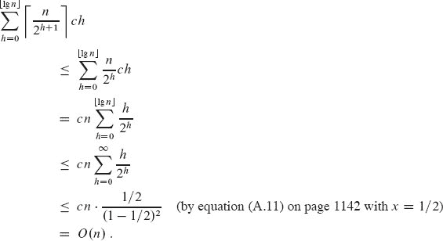

因此，我们可以在线性时间内从无序数组构建最大堆。

要构建一个最小堆，请使用`BUILD-MIN-HEAP`过程，它与`BUILD-MAX-HEAP`相同，但第 3 行调用`MAX-HEAPIFY`的地方替换为调用`MIN-HEAPIFY`（参见练习 6.2-3）。`BUILD-MIN-HEAP`可以在线性时间内从无序线性数组构建最小堆。

**练习**

**`6.3-1`**

使用图 6.3 作为模型，说明在数组`A` = <5, 3, 17, 10, 84, 19, 6, 22, 9>上 BUILD-MAX-HEAP 的操作。

`6.3-2`

证明对于 0 ≤ `h` ≤ ⌊`lg n`⌋，有⌈`n/2`^(h + 1)⌉ ≥ 1/2。

**`6.3-3`**

为什么 BUILD-MAX-HEAP 中第 2 行的循环索引`i`从`⌊n/2⌋`减少到 1，而不是从 1 增加到`⌊n/2⌋`？

**`6.3-4`**

   证明在任何 `n` 元素堆中，高度为 `h` 的节点最多有 ⌈`n/2`^(h + 1)⌉ 个。

**`6.4      堆排序算法`**

HEAPSORT 算法由 HEAPSORT 过程给出，开始时调用 BUILD-MAX-HEAP 过程在输入数组 `A[1 : n]` 上构建一个最大堆。由于数组的最大元素存储在根 `A₁` 处，HEAPSORT 可以通过将其与 `A[n]` 交换来将其放置在正确的最终位置。然后，如果过程从堆中丢弃节点 `n` —— 只需简单地减少 `A.heap-size` —— 根的子节点仍然是最大堆，但新的根元素可能违反最大堆属性。为了恢复最大堆属性，过程只需调用 MAX-HEAPIFY(`A`, 1)，这将在 `A[1 : n – 1]` 中留下一个最大堆。然后，HEAPSORT 过程将重复这个过程，从大小为 `n` 的最大堆到大小为 2 的堆。（参见练习 6.4-2 中的精确循环不变式。）

HEAPSORT(`A`, `n`)

| 1 | `BUILD-MAX-HEAP(A, n)` |
| --- | --- |
| 2 | **对于** i = n **向下** 2 |
| `3` | 交换 `A₁` 与 `A[i]` |
| `4` | `A.heap-size = A.heap-size - 1` |   |
| 5 | MAX-HEAPIFY(`A`, 1) |

图 6.4 展示了在第 1 行构建初始最大堆后 HEAPSORT 操作的示例。该图显示了在行 2–5 的 `for` 循环的第一次迭代之前和每次迭代之后的最大堆。

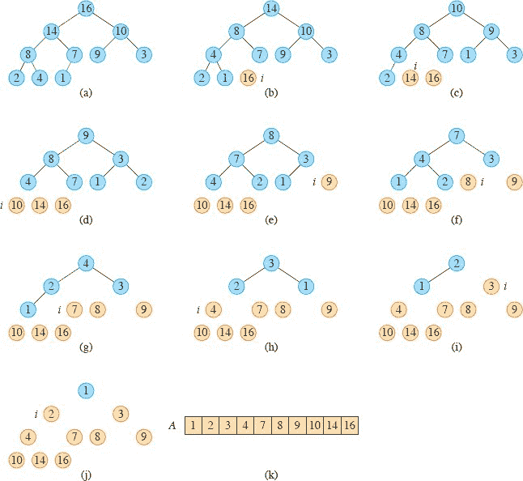

**图 6.4** HEAPSORT 的操作。 **(`a`)** 在第 1 行构建完初始最大堆后的最大堆数据结构。 **(`b`)–(`j`)** 在第 5 行的每次调用 MAX-HEAPIFY 后的最大堆，显示该时刻的 `i` 的值。堆中仅保留蓝色节点。棕色节点包含数组中最大的值，按顺序排列。 **(`k`)** 结果排序后的数组 `A`。

HEAPSORT 过程需要 `O(n lg n)` 的时间，因为调用 BUILD-MAX-HEAP 需要 `O(n)` 的时间，而对 MAX-HEAPIFY 的 `n – 1` 次调用需要 `O(lg n)` 的时间。

**练习**

**6.4-1**

使用图 6.4 作为模型，说明在数组 `A = <5, 13, 2, 25, 7, 17, 20, 8, 4>` 上的 HEAPSORT 操作。

**`6.4-2`**

论证使用以下循环不变式证明 HEAPSORT 的正确性：

在行 2–5 的 **`for`** 循环的每次迭代开始时，子数组 `A[1 : i]` 是包含 `A[1 : n]` 中 `i` 个最小元素的最大堆，而子数组 `A[i + 1 : n]` 包含 `A[1 : n]` 中 `n – i` 个最大元素，已排序。

`6.4-3`

在已按升序排列的长度为 `n` 的数组 `A` 上，HEAPSORT 的运行时间是多少？如果数组已按降序排列呢？

**`6.4-4`**  

证明 HEAPSORT 的最坏情况运行时间为 `Ω(n lg n)`。

★ **6.4-5**  

证明当 `A` 的所有元素都不同时，HEAPSORT 的最佳情况运行时间为 Ω(`n` `lg n`)。

**6.5      优先队列**

在第八章中，我们将看到任何基于比较的排序算法都需要 Ω(`n` `lg n`) 次比较，因此需要 Ω(`n` `lg n`) 的时间。因此，堆排序在基于比较的排序算法中是渐进最优的。然而，在实践中，一个良好的快速排序实现，如第七章中介绍的，通常会胜过它。尽管如此，堆数据结构本身有许多用途。在本节中，我们介绍堆的最流行应用之一：作为高效的优先队列。与堆一样，优先队列有两种形式：最大优先队列和最小优先队列。我们将重点放在如何实现最大优先队列上，而最大优先队列又基于最大堆。练习 6.5-3 要求您编写最小优先队列的过程。  

`**优先队列**` 是一种用于维护一组具有关联值（称为 **键**）的元素的数据结构。`**最大优先队列**` 支持以下操作：

`INSERT(S, x, k)`将具有关键字`k`的元素`x`插入到集合`S`中，这等效于操作`S = S ⋃ {x}`。

MAXIMUM(`S`)返回具有最大关键字的`S`中的元素。

`EXTRACT-MAX(S)`移除并返回`S`中具有最大关键字的元素。

`INCREASE-KEY(S, x, k)`将元素`x`的关键字值增加到新值`k`，假定`k`至少与`x`的当前关键字值一样大。

除了其他应用之外，您可以使用最大优先队列在多个用户共享的计算机上安排作业。最大优先队列跟踪要执行的作业及其相对优先级。当作业完成或中断时，调度程序通过调用 `EXTRACT-MAX` 从待处理作业中选择优先级最高的作业。调度程序可以随时通过调用 `INSERT` 向队列添加新作业。

或者，`最小优先队列`支持 `INSERT`、`MINIMUM`、`EXTRACT-MIN` 和 `DECREASE-KEY` 操作。最小优先队列可用于事件驱动模拟器。队列中的项目是要模拟的事件，每个事件都有一个作为其关键字的发生时间。事件必须按照发生时间的顺序进行模拟，因为事件的模拟可能导致将来模拟其他事件。模拟程序在每一步调用 `EXTRACT-MIN` 来选择下一个要模拟的事件。随着新事件的产生，模拟器通过调用 `INSERT` 将它们插入到最小优先队列中。我们将在第二十一章和第二十二章中看到最小优先队列的其他用途，重点介绍 `DECREASE-KEY` 操作。

当您使用堆来实现给定应用程序中的优先队列时，优先队列的元素对应于应用程序中的对象。每个对象包含一个关键字。如果优先队列由堆实现，您需要确定哪个应用对象对应于给定堆元素，反之亦然。由于堆元素存储在数组中，您需要一种方法来映射应用对象到数组索引以及反之。

在应用对象和堆元素之间进行映射的一种方法使用`句柄`，句柄是存储在对象和堆元素中的附加信息，提供足够的信息来执行映射。句柄通常被实现为对周围代码不透明，从而在应用程序和优先队列之间保持抽象屏障。例如，应用对象中的句柄可能包含对堆数组中相应索引的引用。但由于只有优先队列的代码访问此索引，因此该索引完全对应用程序代码隐藏。由于堆元素在堆操作期间在数组中更改位置，因此优先队列的实际实现在重新定位堆元素时还必须更新相应句柄中的数组索引。反之，堆中的每个元素可能包含指向相应应用对象的指针，但堆元素仅将此指针视为不透明句柄，应用程序将此句柄映射到应用对象。通常，维护句柄的最坏情况开销为`O(1)`每次访问。

作为在应用对象中包含句柄的替代方案，您可以在优先队列中存储从应用对象到堆中数组索引的映射。这样做的优点是映射完全包含在优先队列中，因此应用对象不需要进一步装饰。缺点在于建立和维护映射的额外成本。映射的一个选项是哈希表（参见第十一章）。¹ 哈希表为将对象映射到数组索引添加的预期时间仅为`O(1)`，尽管最坏情况下的时间可能糟糕到Θ(n)`。

让我们看看如何使用最大堆实现最大优先队列的操作。在之前的部分中，我们将数组元素视为要排序的键，隐含地假设任何与相应键一起移动的卫星数据。当堆实现优先队列时，我们将每个数组元素视为指向优先队列中对象的指针，使得对象类似于排序时的卫星数据。我们进一步假设每个这样的对象都有一个属性`key`，它确定了对象在堆中的位置。对于由数组`A`实现的堆，我们称`A[i].key`。

过程 `MAX-HEAP-MAXIMUM` 在对面的页面实现了 `MAXIMUM` 操作，时间复杂度为Θ(1)，而 `MAX-HEAP-EXTRACT-MAX` 实现了 `EXTRACT-MAX` 操作。`MAX-HEAP-EXTRACT-MAX` 类似于 HEAPSORT 过程中的 for 循环体（第 3-5 行）。我们隐含地假设 MAX-HEAPIFY 根据它们的 key 属性比较优先队列对象。我们还假设当 MAX-HEAPIFY 交换数组中的元素时，它是在交换指针，并且更新了对象和数组索引之间的映射。MAX-HEAP-EXTRACT-MAX 的运行时间是`O(lg n)`，因为它在`O(lg n)`的时间内只执行了恒定量的工作，再加上 MAX-HEAPIFY 中将优先队列对象映射到数组索引的任何开销。

过程 `MAX-HEAP-INCREASE-KEY` 在第 176 页实现了 `INCREASE-KEY` 操作。它首先验证新键`k`不会导致对象`x`的键值减小，如果没有问题，就给`x`赋予新的键值。然后找到数组中对应于对象`x`的索引`i`，使得`A[i]`为`x`。因为增加`A[i]`的键可能违反最大堆的性质，所以该过程类似于第 19 页的 `INSERTION-SORT` 中插入循环（第 5-7 行），沿着从该节点向根的简单路径遍历，找到新增键的合适位置。当 `MAX-HEAP-INCREASE-KEY` 沿着这条路径遍历时，它反复比较元素的键和其父节点的键，如果元素的键更大，则交换指针并继续，如果元素的键更小，则终止，因为现在最大堆的性质成立。（参见练习 6.5-7 中的精确循环不变式。）与优先队列中使用时的 `MAX-HEAPIFY` 类似，`MAX-HEAP-INCREASE-KEY` 在交换数组元素时更新了将对象映射到数组索引的信息。图 6.5 展示了 `MAX-HEAP-INCREASE-KEY` 操作的示例。除了将优先队列对象映射到数组索引的开销外，`MAX-HEAP-INCREASE-KEY` 在`n`个元素的堆上的运行时间是`O(lg n)`，因为从第 3 行更新的节点到根的路径长度为`O(lg n)`。

`MAX-HEAP-MAXIMUM(A)`

| 1 | `if A.heap-size` < 1 |   |
| --- | --- |
| `2` | **error** “heap underflow” |
| `3` | **return** `A`[1] |

`MAX-HEAP-EXTRACT-MAX(A)`

| 1 | `max` = MAX-HEAP-MAXIMUM(`A`) |   |
| --- | --- |
| 2 | A₁ = A[A.heap-size] |
| 3 | A.heap-size = A.heap-size - 1 |
| 4 | MAX-HEAPIFY(A, 1) |
| `5` | **return** *max* |

过程 `MAX-HEAP-INSERT` 在下一页实现了 `INSERT` 操作。它的输入是实现最大堆的数组`A`，要插入最大堆的新对象`x`，以及数组`A`的大小`n`。该过程首先验证数组是否有空间容纳新元素。然后通过向树中添加一个键为`-∞`的新叶子节点来扩展最大堆。然后调用 `MAX-HEAP-INCREASE-KEY` 来设置这个新元素的键值，并维护最大堆的性质。在`n`个元素的堆上，`MAX-HEAP-INSERT` 的运行时间是`O(lg n)`，再加上将优先队列对象映射到索引的开销。

总之，堆可以在`O(lg n)`的时间内支持对大小为`n`的集合上的任何优先队列操作，再加上将优先队列对象映射到数组索引的开销。

`MAX-HEAP-INCREASE-KEY(A, x, k)`

| 1 | **如果** `k < x.key` |   |
| --- | --- |
| `2` | **错误** “新键值小于当前键值” |
| `3` | `x.key = k` |
| 4 | 找到对象`x`在数组`A`中的索引`i` |
| `5` | **当** `i > 1` **且** `A`[PARENT(`i`)].`key < A`[`i`].`key` **时** |
| 6 | 交换`A[i]`与`A[PARENT(i)]`，更新将优先队列对象映射到数组索引的信息 |
| 7 | `i = PARENT(i)` |

`MAX-HEAP-INSERT(A, x, n)`

| `1` | **如果** `A.heap-size` == `n` |  |
| --- | --- |
| `2` | **错误** “堆溢出” |
| `3` | `A.heap-size = A.heap-size + 1` |
| `4` | `k = x.key` |
| 5 | *x.key* = –∞ |  |
| 6 | A[A.heap-size] = x | `   |
| `7` | 在数组中将`x`映射到索引`heap-size` |
| 8 | MAX-HEAP-INCREASE-KEY(`A`, `x`, `k`) |

-

**`6.5-1`**

假设最大优先队列中的对象只是键。说明在堆`A` = <15, 13, 9, 5, 12, 8, 7, 4, 0, 6, 2, 1>上 `MAX-HEAP-EXTRACT-MAX` 的操作。

**6.5-2**

假设最大优先队列中的对象只是键。说明在堆`A = <15, 13, 9, 5, 12, 8, 7, 4, 0, 6, 2, 1>`上 `MAX-HEAP-INSERT(A, 10)`的操作。  

**`6.5-3`**

编写伪代码，通过编写 `MIN-HEAP-MINIMUM`、`MIN-HEAP-EXTRACT-MIN`、`MIN-HEAP-DECREASE-KEY` 和 `MIN-HEAP-INSERT` 过程，实现使用最小堆的最小优先队列。

`6.5-4`  

编写 `MAX-HEAP-DECREASE-KEY(A, x, k)`在最大堆中的伪代码。你的过程的运行时间是多少？

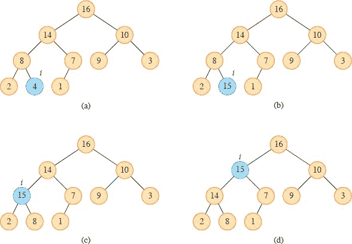

**图 6.5** MAX-HEAP-INCREASE-KEY 的操作。仅显示优先队列中每个元素的键。每次迭代中由`i`索引的节点以蓝色显示。**(a)** 图 6.4(a)中的最大堆，`i`索引的节点即将增加其键值。**(b)** 该节点的键值增加到 15。**(c)** 在第 5-7 行的`while`循环的一次迭代后，节点及其父节点交换了键值，索引`i`上移至父节点。**(d)** 经过另一次`while`循环迭代后的最大堆。此时，`A[PARENT(i)] ≥ A[i]`。现在满足最大堆属性，过程终止。  

`6.5-5`

为什么 `MAX-HEAP-INSERT` 在第 5 行设置插入对象的键为`-∞`，而第 8 行会将对象的键设置为所需值？

**6.5-6**

乌里亚教授建议用 `MAX-HEAPIFY` 调用替换 `MAX-HEAP-INCREASE-KEY` 的第 5-7 行的`while`循环。解释教授这个想法的缺陷。

`6.5-7`

通过以下循环不变式证明`MAX-HEAP-INCREASE-KEY`的正确性：

在第 5-7 行的`while`循环的每次迭代开始时：

a. 如果节点 `PARENT(i)`和`LEFT(i)`都存在，则`A[PARENT(i)].key ≥ A[LEFT(i)].key`。

b. 如果节点 `PARENT(i)` 和 `RIGHT(i)` 都存在，则`A[PARENT(i)].key ≥ A[RIGHT(i)].key`。  

c. 子数组`A[1 : A.heap-size]`满足最大堆属性，除了可能存在一个违反，即`A[i].key`可能大于`A[PARENT(i)].key`。

你可以假设在调用 `MAX-HEAP-INCREASE-KEY` 时，子数组`A[1 : A.heap-size]`满足最大堆属性。

**`6.5-8`**

MAX-HEAP-INCREASE-KEY 的第 6 行上的每次交换操作通常需要三次赋值，不包括更新对象到数组索引的映射。展示如何利用插入排序的内循环的思想将三次赋值减少到只有一次赋值。

`6.5-9`

展示如何使用优先队列实现`先进先出队列`。展示如何使用优先队列实现`栈`。（队列和栈在第 10.1.3 节中定义。）

**`6.5-10`**

操作 `MAX-HEAP-DELETE(A, x)` 从最大堆 `A` 中删除对象 `x`。给出一个在 `n` 元素最大堆中以 `O(lg n)` 时间运行的 `MAX-HEAP-DELETE` 实现，再加上将优先队列对象映射到数组索引的开销。

**`6.5-11`**

给出一个 `O(n lg k)` 时间复杂度的算法，将 `k` 个排序列表合并成一个排序列表，其中 `n` 是所有输入列表中的元素总数。（*提示:* 使用一个 min-heap 进行 `k` 路合并。）

`**问题**`

**6-1     使用插入构建堆**

   一种构建堆的方法是通过反复调用 `MAX-HEAP-INSERT` 将元素插入堆中。考虑页面上的 `BUILD-MAX-HEAP′` 过程。它假设被插入的对象只是堆元素

`BUILD-MAX-HEAP′ (A, n)`  

| `1` | *A.heap-size* = `1` |   |
| --- | --- |
| 2 | `for` i = 2 **to** n |
| `3` | `MAX-HEAP-INSERT(A, A[i], n)` |

**a.** 当在相同的输入数组上运行时，`BUILD-MAX-HEAP` 和 `BUILD-MAX-HEAP′` 过程是否总是创建相同的堆？证明它们是，或提供一个反例。

**b.** 证明在最坏情况下，BUILD-MAX-HEAP' 需要 Θ(`n` `lg n`) 时间来构建一个 `n` 元素堆。

**`6-2`     d-ary 堆的分析**

一个 `d-ary 堆` 类似于二叉堆，但（可能有一个例外）非叶节点有 `d` 个子节点而不是两个子节点。在这个问题的所有部分中，设维护对象和堆元素之间映射的时间为每次操作 `O(1)`。

**a.** 描述如何在数组中表示一个 `d`-ary 堆。

**b.** 使用 `Θ`-符号，用 `n` 和 `d` 表示 `d`-ary 堆的 `n` 元素高度。

**c.** 给出一个在 `d`-ary max-heap 中实现 EXTRACT-MAX 的高效算法。分析其运行时间与 `d` 和 `n` 的关系。

**d.** 给出一个在 `d`-ary max-heap 中实现 INCREASE-KEY 的高效算法。分析其运行时间与 `d` 和 `n` 的关系。

**e.** 给出一个在 `d`-ary max-heap 中实现 INSERT 的高效算法。分析其运行时间与 `d` 和 `n` 的关系。

**6-3 Young 表**

一个 `m × n` **Young 表** 是一个 `m × n` 矩阵，使得每行的条目从左到右按顺序排列，每列的条目从上到下按顺序排列。Young 表的一些条目可能是 ∞，我们将其视为不存在的元素。因此，Young 表可以用来保存 `r ≤ mn` 个有限数字。

**a.** 绘制一个包含元素 `{9, 16, 3, 2, 4, 8, 5, 14, 12}` 的 `4 × 4 Young` 表。

**b.** 论证如果 `Y [1, 1] = ∞`，则 `m × n` Young 表 `Y` 为空。论证如果 `Y [m, n] < ∞`，则 `Y` 是满的（包含 `mn` 个元素）。

**c.** 给出一个在非空 `m × n` Young 表中实现 EXTRACT-MIN 的算法，其运行时间为 `O(m + n)`。你的算法应该使用一个递归子程序，通过递归地解决一个 (`m` – 1) × `n` 或一个 `m` × (`n` – 1) 子问题来解决一个 `m × n` 问题。(*提示:* 考虑 MAX-HEAPIFY。) 解释为什么你的 EXTRACT-MIN 实现在 `O(m + n)` 时间内运行。

**d.** 展示如何在一个非满的 `m × n` Young 表中以 `O(m + n)` 时间插入一个新元素。

**e.** 不使用其他排序方法作为子程序，展示如何使用一个 `n × n` Young 表对 `n²` 个数字进行排序，时间复杂度为 `O(n³)`。

**f.** 给出一个 `O(m + n)` 时间复杂度的算法，确定一个给定数字是否存储在一个给定的 `m × n` Young 表中。

**章节注释**  

堆排序算法是由 Williams `456` 发明的，他还描述了如何使用堆实现优先队列。BUILD-MAX-HEAP 过程是由 Floyd `145` 建议的。Schaffer 和 Sedgewick `395` 表明，在最佳情况下，堆排序中元素移动的次数约为 (`n/2`) `lg n`，平均移动次数约为 `n` `lg n`。

我们在第十五章、第二十一章和第二十二章中使用小根堆来实现最小优先队列。其他更复杂的数据结构为某些最小优先队列操作提供了更好的时间界限。Fredman 和 Tarjan [156] 开发了 Fibonacci 堆，支持 INSERT 和 DECREASE-KEY 的`O(1)`摊销时间（参见第十六章）。也就是说，这些操作的平均最坏运行时间为`O(1)`。Brodal、Lagogiannis 和 Tarjan [73] 随后设计了严格的 Fibonacci 堆，使这些时间界限成为实际运行时间。如果键是唯一的，并且来自非负整数集合{0, 1, … , `n - 1`}，van Emde Boas 树 [440, 441] 支持 INSERT、DELETE、SEARCH、MINIMUM、MAXIMUM、PREDECESSOR 和 SUCCESSOR 操作的`O(lg lg n)`时间。

如果数据是`b`位整数，并且计算机内存由可寻址的`b`位字组成，Fredman 和 Willard [157] 展示了如何在`O(1)`时间内实现 MINIMUM 和在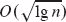时间内实现 INSERT 和 EXTRACT-MIN。Thorup [436] 利用随机哈希改进了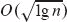的时间界限为`O(lg lg n)`时间，仅需要线性空间。

优先队列的一个重要特殊情况是当 EXTRACT-MIN 操作序列是`单调`时，即，连续的 EXTRACT-MIN 操作返回的值随时间单调递增。这种情况在几个重要应用中出现，例如 Dijkstra 的单源最短路径算法，我们在第二十二章中讨论，以及在离散事件模拟中。对于 Dijkstra 算法，实现 DECREASE-KEY 操作的效率特别重要。对于单调情况，如果数据是范围在 1, 2, … , `C`的整数，Ahuja、Mehlhorn、Orlin 和 Tarjan [8] 描述了如何使用称为基数堆的数据结构在`O(lg C)`摊销时间内实现 EXTRACT-MIN 和 INSERT（第十六章介绍了摊销分析），以及在`O(1)`时间内实现 DECREASE-KEY。`O(lg C)`界限可以通过将 Fibonacci 堆与基数堆结合使用改进为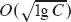。Cherkassky、Goldberg 和 Silverstein [90] 进一步将界限改进为`O(lg^(1/3+ϵ) *C)`预期时间，通过将 Denardo 和 Fox [112] 的多级桶结构与前面提到的 Thorup 的堆结合。Raman [375] 进一步改进了这些结果，获得了一个`O(min {lg^(1/4+ϵ) *C, lg^(1/3+ϵ) *n})`的界限，对于任意固定的`ϵ > 0`。

提出了许多其他变体的堆。Brodal [72] 对其中一些发展进行了调查。

¹ 在 Python 中，字典是用哈希表实现的。
