**7          快速排序**  

快速排序算法在`n`个数字的输入数组上具有Θ(n²)的最坏情况运行时间。尽管最坏情况下运行时间较慢，但快速排序通常是排序的最佳实际选择，因为其平均效率非常高：当所有数字都不同时，其期望运行时间为Θ(n lg n)，Θ(n lg n)符号中隐藏的常数因子很小。与归并排序不同，它还具有原地排序的优势（参见第 158 页），即使在虚拟内存环境中也能很好地工作。

我们对快速排序的研究分为四个部分。第 7.1 节描述了算法以及快速排序用于分区的重要子例程。由于快速排序的行为复杂，我们将从直观讨论其性能开始，第 7.2 节在章节末尾精确分析。第 7.3 节介绍了快速排序的随机版本。当所有元素都不相同时，`¹` 这种随机算法具有良好的期望运行时间，并且没有特定输入会引发其最坏情况。 （查看问题 7-2，了解元素可能相等的情况。）第 7.4 节分析了随机算法，表明在最坏情况下运行时间为`Θ(n²)`，假设元素不同，则期望运行时间为`O(n lg n)`。

**7.1      快速排序描述**

快速排序，类似于归并排序，应用了第 2.3.1 节介绍的分治方法。以下是对子数组`A[p : r]`进行排序的三步分治过程：

**划分** 通过将数组`A[p : r]`分割（重新排列）为两个（可能为空）子数组`A[p : q – 1]`（***低侧***）和`A[q + 1 : r]`（***高侧***），使得分区的低侧中的每个元素都小于或等于中轴元素`A[q]`，中轴元素又小于或等于高侧中的每个元素。作为此划分过程的一部分计算中轴元素的索引`q`。

**征服** 通过递归调用 quicksort 对子数组`A[p : q - 1]`和`A[q + 1 : r]`进行排序。  

**合并** 什么也不做：因为两个子数组已经排序，不需要任何工作来合并它们。 `A[p : q – 1]`中的所有元素都已排序且小于或等于`A[q]`，`A[q + 1 : r]`中的所有元素都已排序且大于或等于中轴元素`A[q]`。整个子数组`A[p : r]`不可能不排序！  

QUICKSORT 过程实现了快速排序。要对整个`n`元素数组`A[1 : n]`进行排序，初始调用是 QUICKSORT (`A`, 1, `n`)。

QUICKSORT(`A`, `p`, `r`)

| 1 | `if p < r` |
| --- | --- |
| `2` | **//** 围绕中轴元素对子数组进行分区，中轴元素最终位于`A[q]`处。 |
| 3 | q = PARTITION(A, p, r) |
| 4 | QUICKSORT(`A`, `p`, `q` - 1) | **//** 递归排序低侧 |
| 5 | `QUICKSORT(A, q + 1, r)` | **//** 递归排序高侧 |

**数组的划分**

算法的关键在于下一页的 PARTITION 过程，它在原地重新排列子数组`A[p : r]`，返回分区两侧之间的分界点的索引。

图 7.1 展示了 PARTITION 在一个 8 元素数组上的工作方式。PARTITION 总是选择元素`x = A[r]`作为中轴元素。随着过程的运行，每个元素都会落入四个区域中的一个，其中一些可能为空。在行 3-6 的`for`循环的每次迭代开始时，区域满足某些属性，如图 7.2 所示。我们将这些属性陈述为循环不变式：

`PARTITION(A, p, r)`

| `1` | `x = A[r]` | **//** 中轴元素 |   |
| --- | --- | --- |
| `2` | `i = p` – 1 | **//** 低侧的最高索引 |
| `3` | **对于** `j = p` **到** `r` - 1 | **//** 处理除枢轴之外的每个元素 |   |
| `4` | **如果** `A[j] ≤ x` | **//** 此元素应属于低侧吗？ |   |
| `5` | `i = i + 1` | **//** 低侧的新槽位索引 |
| `6` | 交换`A[i]`和`A[j]` | **//** 将此元素放在那里 |
| 7 | 交换`A[i + 1]`和`A[r]` | **//** 枢轴刚好在低侧右侧 |
| `8` | **返回** `i` + 1 | **//** 枢轴的新索引 |

在循环的第 `3-6` 行的每次迭代开始时，对于任意数组索引`k`，以下条件成立：

1.  如果`p` ≤ `k` ≤ `i`，则`A[k]` ≤ `x`（图 7.2 的棕色区域）；

1.  如果`i + 1 ≤ k ≤ j - 1`，则`A[k] > x`（蓝色区域）；

1.  如果`k = r`，则`A[k] = x`（黄色区域）。

我们需要展示这个循环不变式在第一次迭代之前是正确的，每次循环迭代都保持不变式，循环终止，并且在循环终止时，正确性遵循不变式。

**初始化：** 在循环的第一次迭代之前，我们有`i = p - 1` 和`j = p`。因为`p`和`i`之间没有值，`i + 1`和`j - 1`之间也没有值，循环不变式的前两个条件显然成立。第 1 行的赋值满足第三个条件。

**维护：** 如图 7.3 所示，我们考虑两种情况，取决于第 4 行测试的结果。图 7.3(a)展示了当`A[j] > x`时会发生什么：循环中的唯一操作是增加`j`。增加`j`后，第二个条件对`A[j - 1]`成立，所有其他条目保持不变。图 7.3(b)展示了当`A[j] ≤ x`时会发生什么：循环增加`i`，交换`A[i]`和`A[j]`，然后增加`j`。由于交换，现在有`A[i] ≤ x`，满足条件 1。同样，我们也有`A[j - 1] > x`，因为根据循环不变式，交换到`A[j - 1]`的项大于`x`。

**终止条件：** 由于循环恰好进行`r - p`次迭代，循环终止时，`j = r`。此时，未经检查的子数组`A[j : r - 1]`为空，数组中的每个条目都属于不变式描述的其他三个集合中的一个。因此，数组中的值被分成三组：小于或等于`x`的值（低侧）、大于`x`的值（高侧）和包含`x`的单元素集（枢轴）。

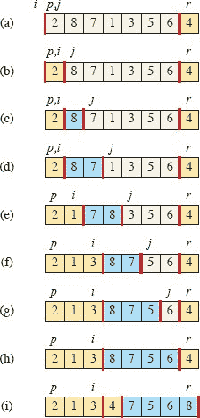

**图 7.1** PARTITION 在示例数组上的操作。数组条目`A[r]`变为枢轴元素`x`。棕色数组元素都属于分区的低侧，值最多为`x`。蓝色元素属于高侧，值大于`x`。白色元素尚未放入分区的任一侧，黄色元素是枢轴`x`。**(a)** 初始数组和变量设置。没有元素被放入分区的任一侧。**(b)** 值为 2 被“与自身交换”并放入低侧。**(c)-(d)** 值 8 和 7 被放入高侧。**(e)** 值 1 和 8 被交换，低侧增长。**(f)** 值 3 和 7 被交换，低侧增长。**(g)-(h)** 分区的高侧增长以包括 5 和 6，并且循环终止。**(i)** 第 7 行交换枢轴元素，使其位于分区的两侧之间，第 8 行返回枢轴的新索引。

PARTITION 的最后两行通过将枢纽与大于 `x` 的最左元素交换完成，从而将枢纽移动到分区数组的正确位置，然后返回枢纽的新索引。PARTITION 的输出现在满足了分割步骤的规定。事实上，它满足了一个稍微更强的条件：在 QUICKSORT 的第 3 行之后，`A[q]` 严格小于 `A[q + 1 : r]` 的每个元素。

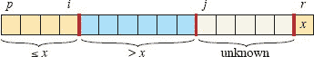

**图 7.2** 过程 PARTITION 在子数组 `A[p : r]` 上维护的四个区域。`A[p : i]` 中的棕色值都小于或等于 `x`，`A[i + 1 : j – 1]` 中的蓝色值都大于 `x`，`A[j : r – 1]` 中的白色值与 `x` 的关系未知，而 `A[r] = x`。

**图 7.3** 过程 PARTITION 的一次迭代的两种情况。**(a)** 如果 `A[j] > x`，则唯一的操作是增加 `j`，这保持了循环不变性。**(b)** 如果 `A[j] ≤ x`，则增加索引 `i`，交换 `A[i]` 和 `A[j]`，然后增加 `j`。同样，循环不变性得以保持。

练习 7.1-3 要求您展示在由 `n = r - p + 1` 个元素组成的子数组 `A[p : r]` 上的 PARTITION 的运行时间是  `Θ(n)`。

**练习**

***`7.1-1`*** 

使用 图 `7.1` 作为模型，说明在数组 `A` = <13, 19, 9, 5, 12, 8, 7, 4, 21, 2, 6, 11> 上的 PARTITION 操作。

***7.1-2***

当子数组 `A[p : r]` 中的所有元素具有相同值时，PARTITION 返回什么值？修改 PARTITION，使得当子数组 `A[p : r]` 中的所有元素具有相同值时，`q` = ⌊(p + r)/2⌋。

***7.1-3***

简要说明 PARTITION 在大小为 `n` 的子数组上的运行时间是  `Θ(n)`。

`7.1-4`

修改 `QUICKSORT` 以按单调递减顺序排序。

**`7.2`      快速排序的性能**

快速排序的运行时间取决于每个分区的平衡程度，而这又取决于哪些元素被用作枢轴。如果一个分区的两侧大小大致相同——分区是平衡的——那么算法的运行速度会随着合并排序一样快。然而，如果分区不平衡，它的运行速度可能会与插入排序一样慢。为了让您在深入进行正式分析之前获得一些直觉，本节非正式地探讨了在平衡与不平衡分区假设下快速排序的性能。

但首先，让我们简要地看一下快速排序需要的最大内存量。尽管快速排序根据第 158 页的定义就地排序，但它使用的内存量——除了被排序的数组之外——并不是恒定的。由于每个递归调用在运行时栈上需要恒定的空间，除了被排序的数组之外，快速排序需要的空间与递归的最大深度成正比。正如我们现在将看到的那样，在最坏情况下，这可能与  `Θ(n)` 一样糟糕。

输入：

快速排序的最坏情况发生在分区产生一个具有 `n` – 1 个元素和一个具有 0 个元素的子问题时。（参见第 7.4.1 节。）让我们假设在每次递归调用中都会出现这种不平衡的分区。分区的成本为 `Θ(n)` 时间。由于对大小为 0 的数组的递归调用只是返回而不执行任何操作，`T(0)` = Θ(1)，因此运行时间的递归为

| `T(n)` | = | `T(n - 1) + T(0) + Θ(n)` |   |
| --- | --- | --- |
|  | = | `T (n - 1) + Θ(n)`. |

通过对递归的每个级别产生的成本进行求和，我们得到一个等差数列（第 1141 页的方程（`A.3`）），其计算结果为 `Θ(n²)`。事实上，可以使用替换法证明递归 `T` (`n`) = `T` (`n` – 1) + Θ(`n`) 的解为 `T` (`n`) = `Θ(n²)`。（参见练习 7.2-1。）

因此，如果在算法的每个递归级别上分区是最大程度不平衡的，运行时间为`Θ(n²)`。因此，快速排序的最坏情况运行时间不比插入排序好。此外，当输入数组已完全排序时，`Θ(n²)`的运行时间发生，这种情况下插入排序的运行时间为`O(n)`。

输出：

在最均匀的分割中，PARTITION 产生两个大小不超过`n/2` 的子问题，因为一个大小为⌊(n – 1)/2⌋ ≤ n/2，另一个大小为⌈(n – 1)/2⌉ – 1 ≤ n/2。在这种情况下，快速排序运行速度更快。然后，运行时间的上界可以由递归描述为  

`T(n) = 2*T(n/2) + Θ(n)`.  

根据主定理的情况 2（第 102 页的定理 4.1），此递归的解为`T(n) = Θ(n lg n)`。因此，如果在递归的每个级别上分区是平衡的，将得到一个渐近更快的算法。

具有与子集相关的权重的一组对象的划分称为一个*平衡分区*，其中对象的权重可能是实数，但通常是整数。我们希望在将对象划分为一些组的同时最小化组的总权重，或者在保持组的大小约等时最大化组的总权重。例如，在数据存储中，我们可能希望将数据对象划分为存储器的一组划分，使得每个存储器都大致相等，并且数据对象之间的关联性最小。

如第 7.4 节中的分析将显示，快速排序的平均情况运行时间更接近最佳情况而不是最坏情况。通过理解分区平衡如何影响描述运行时间的递归，我们可以理解为什么。

例如，假设分区算法总是产生 9 比 1 的比例分割，乍一看似乎非常不平衡。然后我们得到递归

`T(n) = T(9*n/10) + T(n/10) + Θ(n),`

对快速排序的运行时间。图 7.4 显示了此递归的递归树，为简单起见， `Θ(n)`驱动函数已被`n`替换，这不会影响递归的渐近解（正如第 118 页上的练习 4.7-1 所证明的）。树的每个级别的成本为`n`，直到递归在深度 log[10] `n` = Θ(lg `n`)处触底，然后每个级别的成本最多为`n`。递归在深度 log[10/9] `n` = Θ(lg `n`)处终止。因此，每个递归级别都有 9 比 1 的比例分割，直观上看似乎非常不平衡，快速排序的运行时间为`O(n lg n)`—渐近地与分割正好在中间的情况相同。事实上，即使是 99 比 1 的分割也会产生`O(n lg n)`的运行时间。实际上，任何*常数*比例的分割都会产生深度Θ(lg `n`)的递归，其中每个级别的成本为`O(n)`。因此，只要分割具有常数比例，运行时间就是`O(n lg n)`。分割的比例只影响`O`符号中的常数。

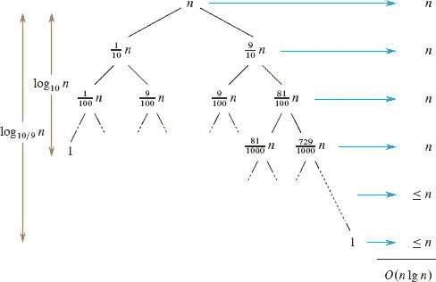

**图 7.4** QUICKSORT 的递归树，其中 PARTITION 始终产生 9 比 1 的分割，导致运行时间为`O(n lg n)`。节点显示子问题大小，右侧显示每级成本。

**平均情况的直觉**

要对快速排序的预期行为有清晰的概念，我们必须假设其输入是如何分布的。因为快速排序仅使用输入元素之间的比较来确定排序顺序，其行为取决于作为输入给出的数组元素中值的相对顺序，而不取决于数组中的特定值。就像在第 5.2 节中对雇佣问题的概率分析一样，假设输入数字的所有排列是等可能的，并且元素是不同的。

当快速排序在随机输入数组上运行时，分区高度不太可能在每个级别以相同方式发生，正如我们的非正式分析所假设的那样。我们预期一些分割将相当平衡，而一些将相当不平衡。例如，练习 7.2-6 要求您展示 `PARTITION` 大约 80%的时间产生至少与 9 比 1 一样平衡的分割，大约 20%的时间产生比 9 比 1 更不平衡的分割。

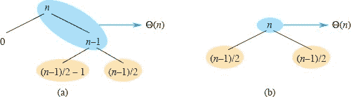

**图 7.5（a）** 快速排序递归树的两个层级。根节点的分区成本为 `n`，产生了一个“坏”分割：两个大小为 0 和 `n` – 1 的子数组。大小为 `n` – 1 的子数组的分区成本为 `n` – 1，并产生了一个“好”分割：大小为 `(n – 1)/2 – 1` 和 `(n – 1)/2` 的子数组。**(b)** 递归树的一个层级是平衡的。在两个部分中，用蓝色阴影显示的子问题的分区成本为  `Θ(n)`。然而，在（a）中待解决的子问题，用棕色阴影显示，不会比（b）中待解决的相应子问题更大。

在平均情况下，PARTITION 产生“好”和“坏”分割的混合。在 PARTITION 的平均情况执行的递归树中，好和坏分割随机分布在整个树中。为了直观起见，假设好和坏分割在树的层级中交替出现，并且好分割是最佳情况分割，坏分割是最坏情况分割。图 7.5（a）展示了递归树中两个连续层级的分割。在树的根部，分区成本为 `n`，产生的子数组大小为 `n – 1` 和 `0`：最坏情况。在下一个层级，大小为 `n – 1` 的子数组经历最佳情况分割，分成大小为 ` (n – 1)/2 – 1` 和 ` (n – 1)/2` 的子数组。让我们假设大小为 `0` 的子数组的基本情况成本为 `1`。

坏分割后跟好分割的组合产生了三个大小为 0、(`n` – 1)/2 – 1 和 (`n` – 1)/2 的子数组，组合分区成本为 `Θ(n)` + `Θ(n` – 1) = `Θ(n)`。这种情况最多比图 7.5（b）中的情况差一个常数因子，即一个单层分区产生两个大小为 (`n` – 1)/2 的子数组，成本为 `Θ(n)`。然而，后一种情况是平衡的！直观上，图 7.5（a）中坏分割的 `Θ(n` – 1) 成本可以吸收到好分割的 `Θ(n)` 成本中，产生的分割是好的。因此，当层级在好坏分割之间交替时，快速排序的运行时间就像仅有好分割时的运行时间：仍然是 `O(n lg n)`，但被 `O` 表示法隐藏的常数略大。我们将在第 7.4.2 节中严格分析随机版本快速排序的预期运行时间。

**`练习`**  

`7.2-1`

使用替换法证明递归 `T(n) = T(n - 1) + Θ(n)` 的解为 `T(n) = Θ(n²)`，正如在第 7.2 节开头所述。

**`7.2-2`**

当数组 `A` 的所有元素具有相同值时，QUICKSORT 的运行时间是多少？

`7.2-3`

证明当数组 `A` 包含不同元素且按降序排序时，QUICKSORT 的运行时间为 `Θ(n²)`。

`7.2-4`  

银行通常按交易时间记录账户上的交易，但许多人喜欢按支票号码顺序收到银行对账单。人们通常按支票号码顺序书写支票，商家通常会合理迅速地兑现它们。因此，将交易时间排序转换为支票号码排序的问题就是对几乎排序好的输入进行排序的问题。有说服力地解释为什么插入排序程序可能在这个问题上胜过快速排序程序。

`7.2-5`

假设快速排序每个层级的分割比例恒定为 `α` 到 `β`，其中 `α` + `β` = 1 且 0 < `α` ≤ `β` < 1。证明递归树中叶子的最小深度约为 log[1/`α`] `n`，最大深度约为 log[1/`β`] `n`。（不用担心整数四舍五入。）  

***`7.2-6`***

考虑一个具有不同元素且所有元素的排列都是等概率的数组。证明对于任意常数 `0 < α ≤ 1/2`，PARTITION 产生的分割至少与 `1 – α` 到 `α` 一样平衡的概率近似为 `1 – 2α`。

**7.3      快速排序的随机版本**

在探讨快速排序的平均情况行为时，我们假设输入数字的所有排列都是等概率的。然而，这个假设并不总是成立，例如，在练习 7.2-4 的前提中所述的情况。第 5.3 节表明，明智的随机化有时可以添加到算法中，以获得对所有输入的良好期望性能。对于快速排序，随机化产生了一个快速且实用的算法。许多软件库提供了快速排序的随机版本作为排序大型数据集的首选算法。

在第 5.3 节中，`RANDOMIZED-HIRE-ASSISTANT` 过程明确地对其输入进行排列，然后运行确定性的 `HIRE-ASSISTANT` 过程。我们也可以对快速排序做同样的事情，但是不同的随机化技术会产生更简单的分析。随机版本不总是使用`A[r]`作为枢轴，而是从子数组`A[p : r]`中随机选择枢轴，其中`A[p : r]`中的每个元素被选择的概率相等。然后在分区之前将该元素与`A[r]`交换。由于枢轴是随机选择的，我们期望输入数组的分割在平均情况下是相当平衡的。

PARTITION 和 QUICKSORT 的更改很小。新的分区过程`RANDOMIZED-PARTITION`在执行分区之前简单地交换。新的快速排序过程`RANDOMIZED-QUICKSORT`调用`RANDOMIZED-PARTITION`而不是`PARTITION`。我们将在下一节分析这个算法。

`RANDOMIZED-PARTITION(A, p, r)`

| 1 | `i = RANDOM(p, r)` |   |
| --- | --- |
| `2` | 交换`A[r]`和`A[i]` |   |
| 3 | `return` PARTITION(`A`, `p`, `r`) |

RANDOMIZED-QUICKSORT(`A, p, r`)

| 1 | `if` `p < r` |   |
| --- | --- |
| 2 | `q = RANDOMIZED-PARTITION(A, p, r)` |
| `3` | RANDOMIZED-QUICKSORT(`A`, `p`, `q` – 1) |   |
| 4 | RANDOMIZED-QUICKSORT(`A`, `q` + 1, `r`) |

**练习**

***`7.3-1`***

为什么我们分析随机算法的期望运行时间而不是最坏情况的运行时间？

`7.3-2`  

在 RANDOMIZED-QUICKSORT 运行时，最坏情况下随机数生成器 RANDOM 会被调用多少次？最好情况呢？用`Θ`-符号表示你的答案。

**`7.4      快速排序的分析`**  

第 7.2 节为快速排序的最坏情况行为和我们为什么期望算法运行快速提供了一些直觉。本节更加严格地分析快速排序的行为。我们从最坏情况分析开始，这适用于 QUICKSORT 或 RANDOMIZED-QUICKSORT，最后分析 RANDOMIZED-QUICKSORT 的期望运行时间。

**7.4.1    最坏情况分析**

我们在第 7.2 节中看到，在快速排序的每个递归层次上都产生最坏情况的分割会产生`Θ(n²)`的运行时间，直观上，这是算法的最坏情况运行时间。我们现在证明这个断言。  

我们将使用替换法（参见第 4.3 节）来证明快速排序的运行时间是`O(n²)`。设`T(n)`为过程 QUICKSORT 在大小为`n`的输入上的最坏情况时间。因为 PARTITION 过程产生两个总大小为`n` – 1 的子问题，我们得到递归关系  

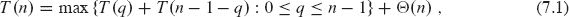

我们猜测`T(n)` ≤ *cn*²，其中常数`c` > 0。将这个猜测代入递归式(7.1)得到

| `T(n)` | ≤ | max {`cq`² + `c`(n – 1 – `q`)² : 0 ≤ `q` ≤ `n` – 1} +  `Θ(n)` |   |
| --- | --- | --- |
|  | = | `c` · max {`q`² + (`n` – 1 – `q`)² : 0 ≤ `q` ≤ `n` – 1} +  `Θ(n)`。 |

让我们把注意力集中在最大化上。对于 `q = 0, 1, … , n – 1`，我们有  

| `q² + (n - 1 - q)²` | = | `q² + (n - 1)² - 2`q`(n - 1) + q²` |   |
| --- | --- | --- | --- |
| --- | --- | --- |
|  | = | (n - 1)² + 2*q(q - (n - 1)) |
| | ≤ | (n - 1)² |

因为`q ≤ n – 1` 意味着 `2`q`(q – (n – 1)) ≤ 0`。因此，最大化中的每一项都受到`(n – 1)²`的限制。

继续我们对`T(n)`的分析，我们得到

| `T(n)` | ≤ | `c(n - 1)² + Θ(n)` |
| --- | --- | --- |
| | ≤ `cn`² - `c`(2`n` - 1) + Θ(`n`) |
|  | ` ≤ ` | cn² |

通过选择足够大的常数`c`，使得`c(2n - 1)`项支配Θ(`n`)项。因此`T` (`n`) = `O`(`n²`)。Section 7.2 展示了 quicksort 需要Ω(`n²`)时间的特定情况：当分区极度不平衡时。因此，quicksort 的最坏情况运行时间为`Θ(n²)`。

**7.4.2    预期运行时间**

我们已经看到 RANDOMIZED-QUICKSORT 的预期运行时间为`O(n lg n)`的直觉：如果在每个递归级别中，RANDOMIZED-PARTITION 引起的分割将任意常数部分的元素放在分区的一侧，那么递归树的深度为Θ(lg n)，并且每个级别执行`O(n)`的工作。即使我们在这些级别之间添加了一些最不平衡的分割，总时间仍然保持为`O(n lg n)`。我们可以通过首先了解分区过程的操作方式，然后利用这种理解来推导对预期运行时间的`O(n lg n)`上界来精确分析 RANDOMIZED-QUICKSORT 的预期运行时间��这对预期运行时间的上界，再结合我们在 Section 7.2 中看到的Θ(n lg n)最佳情况下的上界，得到Θ(n lg n)的预期运行时间。我们始终假设被排序元素的值是不同的。

**运行时间和比较**  

QUICKSORT 和 RANDOMIZED-QUICKSORT 过程只在选择枢轴元素的方式上有所不同。在其他方面它们是相同的。因此，我们可以通过考虑 QUICKSORT 和 PARTITION 过程来分析 RANDOMIZED-QUICKSORT，但假设枢轴元素是从传递给 RANDOMIZED-PARTITION 的子数组中随机选择的。让我们从将 QUICKSORT 的渐近运行时间与元素比较次数的关系开始分析（都在 PARTITION 的第 4 行中），理解这种分析也适用于 RANDOMIZED-QUICKSORT。请注意，我们计算的是`数组元素`比较的次数，而不是索引的比较。

***引理 7.1***

在`n`元素数组上 QUICKSORT 的运行时间为`O(n + X)`，其中`X`是执行的元素比较次数。

***证明***   QUICKSORT 的运行时间主要取决于 PARTITION 过程中花费的时间。每次调用 PARTITION 时，它选择一个枢轴元素，该元素永远不会包含在未来对 QUICKSORT 和 PARTITION 的递归调用中。因此，在整个 quicksort 算法的执行过程中最多可以有`n`次对 PARTITION 的调用。每次 QUICKSORT 调用 PARTITION 时，它还会递归调用自身两次，因此 QUICKSORT 过程本身最多有 `2*n`次调用。

对 PARTITION 的每次调用需要`O(1)`的时间，再加上与第 3-6 行的`for`循环迭代次数成比例的时间。这个`for`循环的每次迭代在第 4 行进行一次比较，将枢轴元素与数组`A`的另一个元素进行比较。因此，所有执行中`for`循环中花费的总时间与`X`成比例。由于最多有`n`次对 PARTITION 的调用，而`for`循环外的时间对于每次调用都是`O(1)`，因此在`for`循环外对 PARTITION 花费的总时间是`O(n)`。因此，quicksort 的总时间为`O(n + X)`。

▪  输出：

因此，我们分析 RANDOMIZED-QUICKSORT 的目标是计算随机变量`X`表示在所有调用 PARTITION 中执行的比较总数的期望值 E[`X`]。为此，我们必须了解快速排序算法何时比较数组中的两个元素，何时不比较。为了便于分析，让我们按照它们在排序输出中的位置而不是它们在输入中的位置对数组`A`中的元素进行索引。也就是说，尽管`A`中的元素可能以任何顺序开始，我们将按`z₁`，`z₂`，…，`z[n]`来引用它们，其中`z₁ < z₂ < ⋯ < z[n]`，严格的不等式是因为我们假设所有元素都是不同的。我们用`Z[ij]`表示集合{`z[i]`，`z[i + 1]`，…，`z[j]`}。

下一个引理描述了两个元素何时被比较。

***引理 7.2***

在对由`n`个不同元素`z₁ < z₂ < ⋯ < z[n]`组成的数组执行 RANDOMIZED-QUICKSORT 期间，元素`z[i]`与元素`z[j]`进行比较，其中`i < j`，当且仅当它们中的一个在集合`Z[ij]`中的任何其他元素之前被选择为枢轴时。此外，没有两个元素会被比较两次。

***证明*** 让我们看看算法执行过程中第一次选择元素`x ∈ Z[ij]`作为枢轴的情况。有三种情况需要考虑。如果`x`既不是`z[i]`也不是`z[j]`—也就是说，`z[i]` < `x` < `z[j]`—那么`z[i]`和`z[j]`在分区周围时不会在任何后续时间进行比较。如果`x = z[i]`，那么 PARTITION 将`z[i]`与`Z[ij]`中的每个其他项进行比较。类似地，如果`x = z[j]`，那么 PARTITION 将`z[j]`与`Z[ij]`中的每个其他项进行比较。因此，`z[i]`和`z[j]`仅在从`Z[ij]`中选择为枢轴的第一个元素是`z[i]`或`z[j]`时进行比较。在后两种情况中，其中`z[i]`和`z[j]`中的一个被选择为枢轴，由于枢轴被移除以避免未来的比较，它们永远不会再与另一个元素进行比较。

▪  输出：

作为这个引理的一个例子，考虑以某种任意顺序的数字 1 到 10 作为快速排序的输入。假设第一个枢轴元素是 7。然后，第一次调用 PARTITION 将数字分为两组：{1, 2, 3, 4, 5, 6}和{8, 9, 10}。在这个过程中，枢轴元素 7 与所有其他元素进行比较，但第一组中的任何数字（例如 2）都不会与第二组中的任何数字（例如 9）进行比较。值 `7` 和 `9` 被比较是因为 `7` 是从`Z[7,9]`中选择为枢轴的第一个项目。相反，`2` 和 `9` 永远不会被比较，因为从`Z[2,9]`中选择为枢轴的第一个元素是 `7`。

下一个引理给出了两个元素被比较的概率。

***引理 7.3***

考虑在由`n`个不同元素`z₁ < z₂ < ⋯ < z[n]`组成的数组上执行 RANDOMIZED-QUICKSORT 过程。给定两个任意元素`z[i]`和`z[j]`，其中`i < j`，它们被比较的概率为 `2/(j - i + 1)`。

***证明*** 让我们看看 RANDOMIZED-QUICKSORT 所做的递归调用树，并考虑提供给每个调用的元素集。最初，根集包含`Z[ij]`的所有元素，因为根集包含`A`中的每个元素。属于`Z[ij]`的元素在 RANDOMIZED-QUICKSORT 的每个递归调用中保持在一起，直到 PARTITION 选择一些属于`Z[ij]`的元素`x`作为枢轴。从那时起，枢轴`x`不会出现在后续的输入集中。RANDOMIZED-SELECT 第一次从包含`Z[ij]`所有元素的集合中选择枢轴`x ∈ Z[ij]`时，`Z[ij]`中的每个元素都有相同的可能性成为`x`，因为枢轴是均匀随机选择的。由于|`Z[ij]`| = `j` – `i` + 1，任何给定的`Z[ij]`中的元素是第一个从`Z[ij]`中选择的枢轴的概率为 1/(`j` – `i` + 1)。因此，根据引理 7.2，我们有

| Pr `{z[i] 与 z[j] 进行比较}` | = | Pr `{z[i] 或 z[j] 是从 Z[ij] 中选择的第一个枢轴}` |  |
| --- | --- | --- |
|  | = | Pr {z[i] 是从 Z[ij] 中选择的第一个枢轴} |
|  |  | + Pr {*z[j]* 是从 `Z[ij]` 中选择的第一个枢轴} |
|  | = | 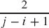, |

第二行是因为这两个事件是互斥的。

▪  输出：

现在我们可以完成随机快速排序的分析。

***定理 7.4***

RANDOMIZED-QUICKSORT 在 `n` 个不同元素的输入上的期望运行时间为 `O(n lg n)`。

***证明***   该分析使用指示器随机变量（参见 第 5.2 节）。让 `n` 个不同元素为 `z₁` < `z₂` < ⋯ < `z[n]`，对于 `1 ≤ i < j ≤ n`，定义指示器随机变量 `X[ij]` = I {`z[i]` 与 `z[j]` 进行比较}。根据引理 7.2，每对最多只比较一次，因此我们可以表示 `X` 如下：  

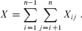

通过对两边取期望值，并使用期望的线性性（第 1192 页的方程式（`C.24`）和第 130 页的引理 `5.1`）以及引理 `7.2`，我们得到

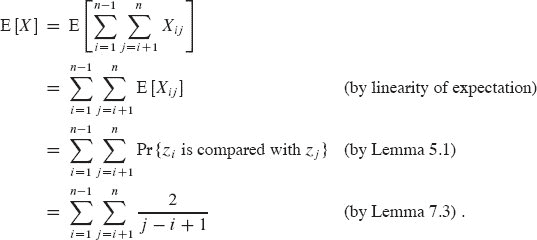

我们可以通过变量的变化（`k = j - i`）和对调和级数的界限（第 1142 页的方程式（A.9））来评估这个和：

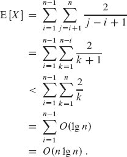

这个界限和引理 7.1 使我们得出 RANDOMIZED-QUICKSORT 的期望运行时间为 `O(n lg n)`（假设元素值是不同的）。

▪

**练习**

***`7.4-1`*** 

显示递归  

`T(n) = max {T(q) + T(n - q - 1) : 0 ≤ q ≤ n - 1} + Θ(n)`

具有下界 `T(n) = Ω (n²)`。

`7.4-2`

显示快速排序的最佳情况运行时间为 `Ω(n lg n)`。

***7.4-3***  

当 `q` = 0 或 `q = n` – 1 时，证明表达式 `q² + (n – q – 1)²` 取得最大值。

`7.4-4`

显示 RANDOMIZED-QUICKSORT 的期望运行时间为 `Ω(n lg n)`。

`7.4-5`

粗化递归，就像我们在合并排序的问题 2-1 中所做的那样，是在实践中改善快速排序运行时间的常见方法。我们修改递归的基本情况，以便如果数组少于 `k` 个元素，则子数组通过插入排序而不是通过继续递归调用快速排序进行排序。论证这种排序算法的随机版本的期望运行时间为 `O(nk + n lg(n/k))`。在理论和实践中应该如何选择 `k`？

★ `7.4-6`

考虑通过从子数组 `A[p : r]` 中随机选择三个元素并围绕它们的中位数（三个元素的中间值）进行分区来修改 PARTITION 程序。估计在范围 `0 < α < 1/2` 的 α 的情况下，获得比 α-to-(1–α) 分割更糟糕的概率。

**问题**

***`7-1     Hoare 分区正确性`***

本章中给出的 PARTITION 版本不是原始的分区算法。这是原始的分区算法，归功于 C. A. R. Hoare。

`HOARE-PARTITION(A, p, r)`  

|   1 | `x = A[p]` |   |
| --- | --- |
|   2 | i = p – 1 | `   |
|   3 | `j = r + 1` |   |
| `4` | **当** TRUE **时** |   |
|   `5` | **重复** |
|   6 | j = j - 1 |
|   7 | **直到** `A[j] ≤ x` |
|   8 | **重复** |
| `9` | `i = i` + 1 |   |
| `10` | **直到** `A[i] ≥ x` |
| 11 | **如果** `i` < `j` |   |
| 12 | 交换 `A[i]` 和 `A[j]` |
| \| 13 \| **否则返回** `j` \| |

***a.*** 在数组 `A` = <13, 19, 9, 5, 12, 8, 7, 4, 11, 2, 6, 21> 上演示 HOARE-PARTITION 的操作，显示每次迭代 lines 4–13 中 `while` 循环后数组和索引 `i` 和 `j` 的值。

***b.*** 描述当 `A[p : r]` 中的所有元素相等时，第 7.1 节 中的 PARTITION 程序与 HOARE-PARTITION 有何不同。描述 HOARE-PARTITION 相对于 PARTITION 在快速排序中的实际优势。

接下来的三个问题要求您仔细论证 `HOARE-PARTITION` 过程的正确性。假设子数组`A[p : r]`至少包含两个元素，证明以下内容：

***c.*** 索引`i`和`j`是这样的，使得该过程永远不会访问`A`子数组`A [p : r]`之外的元素。

***d.*** 当 `HOARE-PARTITION` 终止时，它返回一个值`j`，使得`p ≤ j < r`。

***e.*** 当 `HOARE-PARTITION` 终止时，`A[p : j]`的每个元素都小于或等于`A[j + 1 : r]`的每个元素。

第 7.1 节中的 PARTITION 过程将枢轴值（最初在`A[r]`中）与其形成的两个分区分开。另一方面，HOARE-PARTITION 过程总是将枢轴值（最初在`A[p]`中）放入两个分区`A[p : j]`和`A[j + 1 : r]`之一。由于`p ≤ j < r`，因此两个分区都不为空。

***f.*** 重写`QUICKSORT`过程以使用`HOARE-PARTITION`。

***`7-2` 具有相等元素值的快速排序***

在第 7.4.2 节中对随机快速排序的预期运行时间的分析假设所有元素值都不同。这个问题研究它们不同时会发生什么。

***a.*** 假设所有元素值都相等。在这种情况下，随机快速排序的运行时间是多少？

***b.*** PARTITION 过程返回一个索引`q`，使得`A[p : q - 1]`的每个元素都小于或等于`A[q]`，并且`A[q + 1 : r]`的每个元素都大于`A[q]`。修改 PARTITION 过程以生成一个过程 PARTITION′(`A`，`p`，`r`)，它重新排列`A[p : r]`的元素并返回两个索引`q`和`t`，其中`p ≤ q ≤ t ≤ r`，使得

+   `A[q : t]`的所有元素都相等，

+   `A[p : q - 1]`的每个元素都小于`A[q]`，且

+   `A` [`t + 1 : r`]的每个元素都大于`A` [`q`]。

像 `PARTITION` 一样，您的 `PARTITION'`过程应该花费Θ(r - p)的时间。

***c.*** 修改`RANDOMIZED-PARTITION`过程以调用`PARTITION′`，并命名新过程为`RANDOMIZED-PARTITION′`。然后修改`QUICKSORT`过程以生成一个调用`RANDOMIZED-PARTITION′`并仅在元素不相等的分区上递归的过程`QUICKSORT′(A, p, r)`。

***d.*** 使用 `QUICKSORT'`，调整第 7.4.2 节中的分析，以避免所有元素都不同的假设。

***`7-3`     替代快速排序分析***

随机快速排序运行时间的另一种分析侧重于对每个递归调用`RANDOMIZED-QUICKSORT`的预期运行时间，而不是执行的比较次数。与第 7.4.2 节的分析一样，假设元素的值是不同的。

***a.*** 论证，给定大小为`n`的数组，选择任意特定元素作为枢轴的概率为 `1/n`。利用这个概率定义指示随机变量`X[i]` = I {*第 i 个最小元素被选为枢轴}。`E [X[i]]`是多少？

***b.*** 让`T(n)`是一个随机变量，表示大小为`n`的数组上快速排序的运行时间。论证

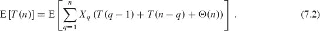

***c.*** 展示如何将方程(`7.2`)重写为

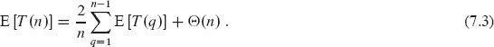  

***d.*** 展示

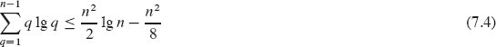  

对于`n` ≥ 2。 (*提示:* 将求和分为两部分，一个求和为`q` = 1, 2, … , `⌈n/2⌉` – 1，另一个求和为`q = ⌈n/2⌉`，… , `n` – 1。)  

***e.*** 使用方程(`7.4`)中的界限，展示方程(`7.3`)中的递归具有解 E [`T` (`n`)] = `O(n lg n)`。 (*提示:* 通过替换，展示对于足够大的`n`和某个正常数`a`，E [`T` (`n`)] ≤ `an lg n`。)

***`7-4     Stooge 排序`***

Howard、Fine 和 Howard 教授提出了一个看似简单的排序算法，以他们的名字命名为 stooge sort，出现在接下来的页面上。

***a.*** 论证调用 STOOGE-SORT(`A`, 1, `n`)是否正确对数组`A[1 : n]`进行排序。

***b.*** 给出 STOOGE-SORT 最坏情况运行时间的递归和最坏情况运行时间的紧密渐近（`Θ`-notation）界限。

***c.*** 比较`STOOGE-SORT`的最坏情况运行时间与插入排序、归并排序、堆排序和快速排序的情况。这些教授应该获得终身教职吗？

`STOOGE-SORT(A, p, r)`

| 1 | **如果** `A[p] > A[r]` |  |
| --- | --- | --- |
| --- | --- | --- |
| `2` | 交换`A[p]`和`A[r]` |  |
| 3 | ` **如果** `p + 1 < r` |  |
| 4 | `k = ⌊(r - p + 1)/3⌋` | **//** 向下取整 |   |
| 5 | STOOGE-SORT(`A, p, r - k`) | **//** 前两个三分之一 |
| `6` | `STOOGE-SORT(A, p + k, r)` | **//** 后两个三分之一 |
| `7` | `STOOGE-SORT(A, p, r - k)` | **//** 再次前两个三分之一 |

***7-5 快速排序的堆栈深度***

第 7.1 节的 `QUICKSORT` 过程对自身进行两次递归调用。`QUICKSORT` 在调用 `PARTITION` 后，递归对分区的低端进行排序，然后递归对分区的高端进行排序。`QUICKSORT` 中的第二次递归调用实际上并不是必要的，因为该过程可以使用迭代控制结构。这种转换技术称为***尾递归消除***，好的编译器会自动提供。应用尾递归消除将 `QUICKSORT` 转换为 `TRE-QUICKSORT` 过程。

`TRE-QUICKSORT(A, p, r)`

| 1 | **当** `p` < `r` |  |
| --- | --- |
| \| 2 \| **//** 分区然后对低端进行排序。 |
|   | `3` | `q = PARTITION(A, p, r)` |   |
| 4 | TRE-QUICKSORT(`A`, `p`, `q` – 1) |   |
| 5 | p = q + 1 |

***a.*** 论证 TRE-QUICKSORT(`A`, 1, `n`)是否正确对数组`A`[1 : `n`]进行排序。

编译器通常通过包含相关信息的`堆栈`来执行递归过程，其中包括每个递归调用的参数值。最近一次调用的信息位于堆栈顶部，初始调用的信息位于底部。当调用一个过程时，它的信息被`推入`堆栈，当它终止时，它的信息被`弹出`。由于我们假设数组参数由指针表示，堆栈上每个过程调用的信息需要`O`(1)的堆栈空间。`堆栈深度`是在计算过程中任何时候使用的最大堆栈空间量。

***b.*** 描述一个情景，在这个情景下，TRE-QUICKSORT 在`n`元素输入数组上的堆栈深度为 `Θ(n)`。

***c.*** 修改 TRE-QUICKSORT，使得最坏情况堆栈深度为`Θ(lg n)`。保持算法的`O(n lg n)`预期运行时间。

`7-6     中值法分区`  

改进随机化快速排序过程的一种方法是围绕一个比从子数组中随机选择一个元素更谨慎地选择的枢轴进行分区。一种常见的方法是`中值法`：从子数组中随机选择的 3 个元素中选择中值（中间元素）作为枢轴。（参见练习 7.4-6。）对于这个问题，假设输入子数组`A[p : r]`中的`n`个元素是不同的，且`n ≥ 3`。用`z₁`，`z₂`，…，`z[n]`表示`A[p : r]`的排序版本。使用中值法选择枢轴元素`x`，定义`p[i]` = Pr {`x = z[i]`}。

***a.*** 给出`p[i]`的精确公式，作为`n`和`i`的函数，对于`i` = 2, 3, … , `n` – 1。 （观察到`p₁ = p[n] = 0`。）

***b.*** 与普通实现相比，中值法增加了选择枢轴为`x = z[⌊(n + 1)/2⌋]`的可能性的数量。假设`n` → ∞，给出这些概率的极限比率。  

***c.*** 假设我们定义“好”分割是选择枢轴为 `x = z[i]`，其中 `n/3 ≤ i ≤ 2n/3`。与普通实现相比，中值-3 方法增加了多少可能获得好分割的可能性？（*提示：*通过积分近似求和。）  

***d.*** 论证在快速排序的Ω(`n lg n`)运行时间中，中值-3 方法仅影响常数因子。

***7-7     区间的模糊排序***

考虑一个排序问题，其中你不知道确切的数字。相反，对于每个数字，你知道它属于实数线上的一个区间。也就是说，给定形式为 [*a[i]*, *b[i]*] 的 `n` 个闭区间，其中 *a[i]* ≤ *b[i]*。目标是对这些区间进行***模糊排序***：产生一个区间的排列 <`i`[1], `i`[2], … , *i[n]*>，使得对于 `j` = 1, 2, … , `n`，存在 `c[j]` 满足 `c`[1] ≤ `c`[2] ≤ ⋯ ≤ *c[n]*。

***a.*** 设计一个随机化算法来对 `n` 个区间进行模糊排序。你的算法应该具有快速排序左端点（`a[i]` 值）的一般结构，但应利用重叠区间来提高运行时间。（随着区间的重叠越来越多，模糊排序区间的问题变得逐渐容易。你的算法应该充分利用这种重叠，只要存在的话。）

***b.*** 论证你的算法在一般情况下以`Θ(n lg n)`的期望时间运行，但当所有区间重叠时以`Θ(n)`的期望时间运行（即存在一个值 `x`，使得对所有 `i` 都有 `x` ∈ [a[i], b[i]]）。你的算法不应明确检查这种情况，而是随着重叠量的增加，其性能应自然提高。

**章节注释**  

快速排序是由霍尔发明的`[219]`，他的 PARTITION 版本出现在问题 7-1 中。本特利`[51，p. 117]`将在第 7.1 节中给出的 PARTITION 过程归因于 N. Lomuto。第 7.4 节中的分析基于 Motwani 和 Raghavan 的分析`[336]`。Sedgewick`[401]`和 Bentley`[51]`提供了有关实现细节及其重要性的良好参考资料。

McIlroy[323]展示了如何设计一个“杀手对手”，使得几乎任何快速排序实现在一个数组上花费`Θ(n²)`的时间。

¹ 你可以通过将数组 `A` 中的值假定为不同来增加 `Θ(n)`的额外空间成本，并且在运行时间中只有恒定的开销，方法是将每个输入值 `A[i]` 转换为一个有序对 (`A[i]`, `i`)，其中 (`A[i]`, `i`) < (`A[j]`, `j`)，如果 `A[i]` < `A[j]` 或者如果 `A[i] = A[j]` 且 `i` < `j`。当元素不是不同的时候，也有更实用的快速排序变体。  
