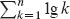

**`8          线性时间排序`**

我们现在已经看到了一些可以在`O(n lg n)`时间内对`n`个数字进行排序的算法。虽然归并排序和堆排序在最坏情况下达到了这个上界，快速排序在平均情况下达到了这个上界。此外，对于这些算法中的每一个，我们可以产生一个`n`个输入数字的序列，使得算法在Ω(`n` lg `n`)时间内运行。  

这些算法共享一个有趣的特性：`它们确定的排序顺序仅基于输入元素之间的比较`。我们称这样的排序算法为***比较排序***。到目前为止，所有介绍的排序算法都是比较排序。

在第 8.1 节中，我们将证明任何比较排序在最坏情况下必须进行Ω(`n` lg `n`)次比较才能对`n`个元素进行排序。因此，归并排序和堆排序在渐近意义上是最优的，没有比较排序存在比一个常数因子更快的情况。  

第 8.2 节，第 8.3 节和第 8.4 节讨论了三种排序算法——计数排序、基数排序和桶排序——它们在某些类型的输入上以线性时间运行。当然，这些算法使用除比较之外的操作来确定排序顺序。因此，`Ω(n lg n)`的下界不适用于它们。

**8.1      排序的下界**

比较排序仅使用元素之间的比较来获取关于输入序列<`a₁`, `a₂`, … , `a[n]`>的顺序信息。也就是说，给定两个元素`a[i]`和`a[j]`，它执行`a[i]` < `a[j]`，`a[i]` ≤ `a[j]`，`a[i]` = `a[j]`，`a[i]` ≥ `a[j]`或`a[i]` > `a[j]`中的一个测试来确定它们的相对顺序。它可能不检查元素的值或以其他方式获取关于它们的顺序信息。

由于我们正在证明一个下界，我们在本节中假设所有输入元素都是不同的，不失一般性。毕竟，对于不同元素的下界适用于元素可能是不同的情况。因此，形如`a[i]` = `a[j]`的比较是无用的，这意味着我们可以假设不存在精确相等的比较。此外，比较`a[i]` ≤ `a[j]`，`a[i]` ≥ `a[j]`，`a[i]` > `a[j]`和`a[i]` < `a[j]`在于它们提供了关于`a[i]`和`a[j]`相对顺序的相同信息。因此，我们假设所有比较都采用`a[i]` ≤ `a[j]`的形式。

**图 8.1** 插入排序在三个元素上运行的决策树。一个内部节点（蓝色显示）上标有`i:j`表示`a[i]`与`a[j]`之间的比较。一个由排列<`π(1)`, `π(2)`, … , `π(n)`>标注的叶子表示顺序`a[π(1)] ≤ a[π(2)] ≤ ⋯ ≤ a[π(n)]`。突出显示的路径表示在对输入序列<`a₁ = 6`, `a₂ = 8`, `a[3] = 5`>进行排序时所做的决策。从根节点，标记为 `1:2`，向左移动表示`a₁ ≤ a₂`。从标记为 `2:3` 的节点向右移动表示`a₂ > a[3]`。从标记为 `1:3` 的节点向右移动表示`a₁ > a[3]`。因此，我们有顺序`a[3] ≤ a₁ ≤ a₂`，如叶子标记的<3, 1, 2>所示。因为三个输入元素有`3! = 6`种可能的排列，决策树必须至少有`6`个叶子。  

`决策树模型`

我们可以抽象地将比较排序视为决策树。一个`决策树`是一个完全二叉树（每个节点要么是叶子节点，要么有两个子节点），它表示特定排序算法在给定大小的输入上执行的元素之间的比较。控制、数据移动和算法的所有其他方面都被忽略。图 8.1 展示了对三个元素的输入序列进行插入排序算法的决策树。

决策树的每个内部节点都用 `i : j` 注释，其中 `i` 和 `j` 在范围 1 ≤ `i`, `j` ≤ `n` 内，`n` 是输入序列中元素的数量。我们还用排列 <π(1), π(2), … , π(n)> 注释每个叶子。（有关排列的背景，请参阅附录 C.1。）内部节点和叶子中的索引始终指的是排序算法开始时数组元素的原始位置。比较排序算法的执行对应于从决策树的根向下追踪到叶子的简单路径。每个内部节点表示一个比较 `a[i]` ≤ `a[j]`。左子树然后在我们知道 `a[i]` ≤ `a[j]` 时指示后续比较，右子树在 `a[i]` > `a[j]` 时指示后续比较。到达叶子时，排序算法已经建立了顺序 `a[π(1)]` ≤ `a[π(2)]` ≤ ⋯ ≤ `a[π(n)]`。因为任何正确的排序算法必须能够产生其输入的每个排列，所以对于比较排序正确性，`n` 个元素的 `n`! 排列中的每一个必须至少出现在决策树的一个叶子中。此外，每个这些叶子必须可以通过从根向下对应于比较排序的实际执行的路径到达。（我们称这样的叶子为“可达”）因此，我们只考虑每个排列都作为可达叶子出现在决策树中的情况。  

**`最坏情况的下界`**

从决策树的根到其可达叶子中最长简单路径的长度代表了相应排序算法执行的最坏情况比较次数。因此，给定比较排序算法的最坏情况比较次数等于其决策树的高度。在每个排列出现为可达叶子的所有决策树的高度的下界因此是任何比较排序算法运行时间的下界。以下定理建立了这样一个下界。

***定理 `8.1`***

任何比较排序算法在最坏情况下需要 Ω(`n lg n`) 次比较。

***证明***   根据前面的讨论，确定每个排列作为可达叶子出现的决策树的高度就足够了。考虑高度为 `h`，具有 `l` 个可达叶子的决策树，对应于 `n` 元素的比较排序。因为输入的 `n`! 排列中的每一个都出现为一个或多个叶子，我们有 `n`! ≤ `l`。由于高度为 `h` 的二叉树最多有 `2^h` 个叶子，我们有

`n! ≤ l ≤ 2^h`

通过取对数，这意味着

| `h` | ≥ | lg(`n`!) | （因为 lg 函数是单调递增的） |
| --- | --- | --- | --- |
|  | = | `Ω (n lg n)` | （根据第 67 页的方程式 (3.28)）。 |

▪ 输出：

**`推论 8.2`**

堆排序和归并排序是渐进最优的比较排序算法。

***证明***   堆排序和归并排序的`O(n lg n)`运行时间上界与定理 8.1 中的Ω(`n lg n`)最坏情况下界相匹配。

▪ 输出：

**练习**

**`8.1-1`**

对于比较排序的决策树中叶子的最小可能深度是多少？

***8.1-2***

在不使用斯特林逼近的情况下，获得关于 `lg(n!)` 的渐近紧密界。而是使用来自附录 A.2 的技术评估求和式 。

***`8.1-3`***  

证明对于长度为 `n` 的至少一半的 `n`! 输入，不存在线性运行时间的比较排序。对于长度为 `n` 的输入的 `1/n` 部分呢？对于 `1/2^n` 的部分呢？

***8.1-4***

给定一个 `n` 元素输入序列，并且你事先知道它在某种意义上是部分排序。初始位置为 `i` 的每个元素，满足 `i mod 4 = 0` 的元素要么已经在正确的位置，要么离正确位置只有一步之遥。例如，你知道排序后，初始位置为 12 的元素应该在位置 11、12 或 13。对于其他位置 `i` 满足 `i mod 4 ≠ 0` 的元素，你没有任何事先信息。证明在这种情况下，基于比较的排序的Ω(n lg n)下界仍然成立。

**8.2      计数排序**  

***计数排序*** 假设每个 `n` 个输入元素都是范围在 0 到 `k` 之间的整数，其中 `k` 是某个整数。它的运行时间为 Θ(`n` + `k`)，因此当 `k` = `O`(`n`) 时，计数排序的运行时间为  `Θ(n)`。

计数排序首先确定每个输入元素 `x` 小于或等于 `x` 的元素数量。然后使用这些信息将元素 `x` 直接放入输出数组中的正确位置。例如，如果有 17 个元素小于或等于 `x`，那么 `x` 应该在输出位置 17。我们必须稍微修改这个方案来处理具有相同值的多个元素的情况，因为我们不希望它们全部都在同一个位置结束。  

面对页面上的 `COUNTING-SORT` 程序接受数组 `A[1 : n]`、该数组的大小 `n`，以及 `A` 中非负整数值的限制 `k` 作为输入，并将排序后的输出存储在数组 `B[1 : n]` 中，并使用数组 `C[0 : k]` 作为临时工作存储。  

计数排序(`A`, `n`, `k`)

|   1 | 令 `B[1 : n]` 和 `C[0 : k]` 为新数组 |  |  输出： |
| --- | --- | --- | --- |
| --- | --- | --- |
| `2` | `for` `i = 0` **to** `k` |  |
|   3 | `C[i] = 0` |  |   |
|   4 | `for` `j` = 1 `to` `n` |  |
| `5` | `C` [`A[j]`] = `C` [`A[j]`] + `1` |  |   |
|   6 | **//** `C[i]` 现在包含等于 `i` 的元素数量。 |
|   7 | `for` `i` = 1 **to** `k` |  |
|   8 | `C[i] = C[i] + C[i – 1]` |  |   |
|   `9` | **//** `C[i]` 现在包含小于或等于 `i` 的元素数量。 |
| `10` | **//** 从 `A` 的末尾开始将 `A` 复制到 `B`。 |   |
| \| 11 \| `for` `j = n` **downto** 1 \|  \| |
| 12 | `B`[C [A[j]]] = A[j] |  |
| 13 | `C[A[j]] = C[A[j]] - 1` | **//** 用于处理重复值 |
| \| 14 \| **return** `B` \|  \|   |

图 8.2 展示了计数排序。在第 2-3 行的 `for` 循环初始化数组 `C` 为全零后，第 4-5 行的 `for` 循环遍历数组 `A` 来检查每个输入元素。每当找到一个值为 `i` 的输入元素时，就会增加 `C[i]`。因此，第 5 行后，`C[i]` 存储了每个整数 `i` = 0, 1, … , `k` 的输入元素数量。第 7-8 行根据数组 `C` 的累加和确定了每个 `i` = 0, 1, … , `k` 有多少个小于或等于 `i` 的输入元素。

最后，第 11-13 行的 **`for`** 循环再次遍历 `A`，但是是逆序的，将每个元素 `A`[`j`] 放入输出数组 `B` 中的正确排序位置。如果所有 `n` 个元素都是不同的，那么当第一次进入第 11 行时，对于每个 `A`[`j`]，`C` [`A`[`j`]] 的值就是 `A`[`j`] 在输出数组中的正确最终位置，因为有 `C` [`A`[`j`]] 个元素小于或等于 `A`[`j`]。由于元素可能不是唯一的，循环每次将值 `A`[`j`] 放入 `B` 时都会减少 `C` [`A`[`j`]]。减少 `C` [`A`[`j`]] 会导致前一个值等于 `A`[`j`] 的元素（如果存在）移动到输出数组 `B` 中 `A`[`j`] 的前一个位置。

计数排序需要多少时间？第 2-3 行的`for`循环需要`Θ(k)`时间，第 4-5 行的`for`循环需要`Θ(n)`时间，第 7-8 行的`for`循环需要`Θ(k)`时间，第 11-13 行的`for`循环需要`Θ(n)`时间。因此，总体时间为`Θ(k + n)`。实际上，我们通常在`k = O(n)`时使用计数排序，此时运行时间为`Θ(n)`。  

计数排序可以击败第 8.1 节中证明的Ω(`n lg n`)的下界，因为它不是一种比较排序。实际上，在代码中任何地方都不会发生输入元素之间的比较。相反，计数排序使用元素的实际值作为索引到数组中。当我们偏离比较排序模型时，Ω(`n lg n`)的排序下界不适用。

``  

**图 8.2** COUNTING-SORT 在输入数组`A[1 : 8]`上的操作，其中`A`的每个元素都是不大于`k = 5`的非负整数。**(a)** 第 5 行后的数组`A`和辅助数组`C`。**(b)** 第 8 行后的数组`C`。**(c)–(e)** 在第 11-13 行循环的一次、两次和三次迭代后的输出数组`B`和辅助数组`C`。只有数组`B`的棕色元素已经填充。**(f)** 最终排序的输出数组`B`。

计数排序的一个重要特性是它是`稳定的`：具有相同值的元素在输出数组中的顺序与它们在输入数组中的顺序相同。也就是说，它通过规则打破两个元素之间的关系，即在输入数组中先出现的元素在输出数组中也先出现。通常，稳定性的特性仅在元素排序时携带卫星数据时才重要。计数排序的稳定性之所以重要还有另一个原因：计数排序经常用作基数排序的子程序。正如我们将在下一节中看到的，为了使基数排序正确工作，计数排序必须是稳定的。

**`练习`**

***8.2-1***

使用图 8.2 作为模型，说明在数组`A` = <6, 0, 2, 0, 1, 3, 4, 6, 1, 3, 2>上 `COUNTING-SORT` 的操作。

***`8.2-2`***

证明 `COUNTING-SORT` 是稳定的。

`8.2-3`

假设我们要重写 COUNTING-SORT 中第 11 行的`for`循环头部为  输出：

| `11` | `for` `j` = `1` **to** `n` |   |
| --- | --- |

证明算法仍然能够正常工作，但不稳定。然后重新编写计数排序的伪代码，使具有相同值的元素按照递增索引的顺序写入输出数组，从而使算法稳定。

`8.2-4`

证明 `COUNTING-SORT` 的以下循环不变性：

在第 11-13 行的`for`循环的每次迭代开始时，具有尚未复制到`B`中的值为`i`的最后一个元素应该放在`B[C[i]]`中。

`8.2-5`  

假设要排序的数组仅包含范围在 0 到`k`之间的整数，并且没有卫星数据与这些键一起移动。修改计数排序，只使用数组`A`和`C`，将排序结果放回数组`A`而不是新数组`B`中。

`8.2-6`

描述一种算法，给定范围在 0 到`k`之间的`n`个整数，预处理其输入，然后在`O(1)`时间内回答关于`n`个整数中有多少个落入范围`[a : b]`的任何查询。您的算法应该使用`Θ(n + k)`的预处理时间。

***`8.2-7`***

如果输入值具有小数部分，但小数部分很位数很小，计数排序也可以高效工作。假设给定范围在 0 到`k`之间的`n`个数字，每个数字的小数点右侧最多有`d`个十进制位。修改计数排序以在Θ(`n` + 10*^d k*)时间内运行。

**`8.3`**      基数排序

***基数排序*** 是现在只能在计算机博物馆中找到的卡片分选机使用的算法。这些卡片有 80 列，在每一列中，机器可以在 12 个位置中的一个位置打孔。分选机可以被机械“编程”来检查牌堆中每张卡片的给定列，并根据打孔的位置将卡片分发到 12 个桶中的一个。然后操作员可以逐个桶地收集卡片，使得具有第一个打孔位置的卡片位于具有第二个打孔位置的卡片之上，依此类推。  

**图 8.3** 基数排序在七个 `3` 位数上的操作。最左边的列是输入。其余列显示了在越来越重要的数字位置上连续排序后的数字。棕色阴影表示为了生成每个列表，对应的数字位置进行的排序。

对于十进制数字，每一列只使用 10 个位置。（其他两个位置保留用于编码非数字字符。）一个 `d` 位数占据 `d` 列的字段。由于卡片分选机一次只能查看一列，因此在 `d` 位数上对 `n` 张卡片进行排序的问题需要一个排序算法。  

直觉上，你可能会根据数字的`最高有效位`（最左边的位）对数字进行排序，然后递归地对每个结果桶进行排序，最后按顺序合并这些桶。不幸的是，由于必须将 10 个桶中的 9 个放在一边以对每个桶进行排序，这个过程会生成许多中间的卡片堆，你需要跟踪这些堆。（参见练习 8.3-6。）

基数排序通过首先按`最不显著`的数字进行排序来解决卡片排序问题。然后算法将卡片组合成一个单一的牌堆，其中 0 桶中的卡片在 1 桶中的卡片之前，在 2 桶中的卡片之前，依此类推。然后再次在第二不显著的数字上对整个牌堆进行排序，并以类似的方式重新组合牌堆。这个过程一直持续，直到卡片在所有 `d` 位上都被排序。令人惊讶的是，在这一点上，卡片已经完全按照 `d` 位数排序。因此，只需要对牌堆进行 `d` 次遍历即可完成排序。图 8.3 展示了基数排序在七个 3 位数的“牌堆”上的操作。

为了使基数排序能够正确工作，数字排序必须是稳定的。卡片分选机执行的排序是稳定的，但操作员必须小心，不要改变卡片从一个桶中出来的顺序，即使一个桶中的所有卡片在所选列中具有相同的数字。

在典型的计算机中，即顺序随机访问机器，有时我们会使用基数排序来对由多个字段键入的信息记录进行排序。例如，我们可能希望按照三个键（年、月和日）对日期进行排序。我们可以运行一个带有比较函数的排序算法，该函数在给定两个日期时比较年份，如果有平局，则比较月份，如果再次平局，则比较日期。另外，我们也可以使用稳定排序三次对信息进行排序：首先按日（“最不显著”部分）排序，然后按月排序，最后按年排序。

基数排序的代码很简单。`RADIX-SORT` 程序假设数组 `A[1 : n]` 中的每个元素都有 `d` 位数字，其中数字 1 是最低位数字，数字 `d` 是最高位数字。

`RADIX-SORT(A, n, d)`

| 1 | **对于** `i` = 1 **到** `d` |
| --- | --- |
| `2` | 使用稳定排序算法对数组 `A[1 : n]` 在第 `i` 位进行排序。 |

尽管 `RADIX-SORT` 的伪代码没有指定使用哪种稳定排序算法，但通常会使用 `COUNTING-SORT`。如果使用 `COUNTING-SORT` 作为稳定排序算法，可以通过修改 `COUNTING-SORT` 以接受输出数组的指针作为参数，让 `RADIX-SORT` 预先分配这个数组，并在 `RADIX-SORT` 的 `for` 循环的连续迭代中在两个数组之间交替输入和输出，从而使 `RADIX-SORT` 更加高效。  

***`引理 8.3`***

给定`n`个`d`位数字，其中每个数字位可以取最多`k`个可能的值，如果所使用的稳定排序算法在Θ(`n` + `k`)时间内完成排序，则基数排序可以在Θ(`d`(`n` + `k`))时间内正确排序这些数字。

***证明***   基数排序的正确性通过对正在排序的列进行归纳得到（参见练习 8.3-3）。运行时间的分析取决于用作中间排序算法的稳定排序。当每个数字位于 0 到`k - 1` 的范围内（因此可以取`k`个可能的值），而`k`不太大时，计数排序是显而易见的选择。对于`nd`位数字的每次遍历都需要Θ(`n + k`)的时间。有`d`次遍历，因此基数排序的总时间为Θ(`d(n + k)`)。

▪  输出：

当`d`是常数且`k = O(n)`时，我们可以使基数排序在线性时间内运行。更一般地，我们可以灵活地将每个关键字分解为数字。

**`引理 8.4`**

给定`n`个`b`位数字和任意正整数`r ≤ b`，如果所使用的稳定排序算法对范围在 0 到`k`的输入需要Θ(`n + k`)时间，则基数排序可以在Θ((`b/r`)(`n + 2^r`))时间内正确排序这些数字。

***证明***   对于值`r` ≤ `b`，将每个关键字视为具有`d` = ⌈`b`/`r`⌉位的`r`位。每个数字位于 0 到 2^(`r`) – 1 的范围内，因此我们可以使用取`k` = 2^(`r`) – 1 的计数排序。（例如，我们可以将 32 位字视为具有四个 8 位数字，因此`b` = 32，`r` = 8，`k` = 2^(`r`) – 1 = 255，`d` = `b`/`r` = 4。）每次计数排序需要Θ(`n` + `k`) = Θ(`n` + 2^`r`)的时间，有`d`次遍历，因此总运行时间为Θ(`d`(`n` + 2^`r`)) = Θ((`b`/`r`)(`n` + 2^`r`))。

▪  输出：

给定`n`和`b`，令`r` ≤ `b`，使表达式`(b/r)(n + 2^r)`最小化的值是多少？随着`r`的减小，因子`b/r`增加，但随着`r`的增加，2^r 也增加。答案取决于`b` < ⌊lg `n`⌋。如果`b` < ⌊lg `n`⌋，那么`r` ≤ `b`意味着`(n + 2^r)` =  `Θ(n)`。因此，选择`r` = `b`得到的运行时间为`(b/b)(n + 2^b)` =  `Θ(n)`，这在渐近意义上是最优的。如果`b` ≥ ⌊lg `n`⌋，那么选择`r` = ⌊lg `n`⌋可以在一个常数因子内得到最佳运行时间，我们可以如下看到。¹选择`r` = ⌊lg `n`⌋得到的运行时间为Θ(`bn`/lg *n`)。随着`r`超过⌊lg `n`⌋，分子中的 2^(r)项增长速度比分母中的`r`项快，因此将`r`增加到超过⌊lg `n`⌋会得到Ω(`bn` / lg *n`)的运行时间。如果`r`减少到低于⌊lg `n`⌋，那么`b`/`r`项增加，而`n` + 2^(r)项保持在 `Θ(n)`。

基数排序是否优于基于比较的排序算法，如快速排序？如果`b = O(lg n)`，通常情况下是这样，且`r ≈ lg n`，那么基数排序的运行时间为Θ(n)，看起来比快速排序的期望运行时间Θ(n lg n)要好。���而，隐藏在Θ-符号中的常数因子是不同的。尽管基数排序可能比快速排序对`n`个关键字进行更少的遍历，但基数排序的每次遍历可能要花费更长的时间。要优先选择哪种排序算法取决于实现的特性，底层机器的特性（例如，快速排序通常比基数排序更有效地使用硬件缓存），以及输入数据的特性。此外，使用计数排序作为中间稳定排序的基数排序版本不是原地排序，而许多Θ(n lg n)时间的比较排序是原地排序。因此，当主存储空间有限时，像快速排序这样的原地算法可能是更好的选择。

输入：

***`8.3-1`***

使用图 8.3 作为模型，说明基数排序在以下英文单词列表上的操作：`COW`, `DOG`, `SEA`, `RUG`, `ROW`, `MOB`, `BOX`, `TAB`, `BAR`, `EAR`, `TAR`, `DIG`, `BIG`, `TEA`, `NOW`, `FOX`。  

***8.3-2***

下列哪些排序算法是稳定的：插入排序、归并排序、堆排序和快速排序？给出一个简单的方案，使任何比较排序都是稳定的。你的方案需要多少额外的时间和空间？

***8.3-3***

使用归纳法证明基数排序的有效性。你的证明在哪里需要假设中间排序是稳定的？

***8.3-4***

假设在基数排序中使用 `COUNTING-SORT` 作为稳定排序。如果基数排序调用 `COUNTING-SORT d` 次，那么由于每次调用 `COUNTING-SORT` 都会对数据进行两次遍历（第 4–5 行和第 11–13 行），总共会有 `2d` 次对数据的遍历。描述如何将总遍历次数减少到 `d + 1`。

***`8.3-5`***  

展示如何在 `O(n)` 时间内对范围在 0 到 `n³ – 1` 之间的 `n` 个整数进行排序。

★ ***8.3-6***

在本节中第一个卡片排序算法中，首先按最高有效位排序，最坏情况下需要多少次排序通行证来排序 `d` 位十进制数？在最坏情况下，操作员需要跟踪多少叠卡片？

**8.4      桶排序**  

***桶排序*** 假设输入来自均匀分布，并且平均情况下运行时间为 `O(n)`。与计数排序类似，桶排序之所以快速是因为它对输入做了一些假设。计数排序假设输入由一个小范围内的整数组成，而桶排序假设输入是由一个随机过程生成的，该过程在区间 0, 1) 上均匀且独立地分布元素。 (参见 [第 C.2 节 有关均匀分布的定义。)

桶排序将区间 `[0, 1)` 划分为 `n` 个大小相等的子区间，或者 ***桶***，然后将 `n` 个输入数字分配到这些桶中。由于输入在 `[0, 1)` 上均匀且独立分布，我们不希望许多数字落入每个桶中。为了生成输出，我们只需对每个桶中的数字进行排序，然后按顺序遍历桶，列出每个元素。  

下一页的桶排序过程假设输入是一个数组 `A[1 : n]`，并且数组中的每个元素 `A[i]` 满足 `0 ≤ A[i] < 1`。该代码需要一个链表（桶）的辅助数组 `B[0 : n - 1]`，并假设有一种机制来维护这样的列表。 (第 10.2 节 描述了如何在链表上实现基本操作。) 图 8.4 展示了对 10 个数字的输入数组进行桶排序的操作。

**图 8.4** 桶排序操作，`n = 10`. **(a)** 输入数组 `A[1:10]`. **(b)** 算法第 7 行后排序列表（桶）的数组 `B[0:9]`，斜杠表示每个桶的结束。桶 `i` 包含半开区间 `[i/10, (i + 1)/10)` 中的值。排序后的输出是按顺序连接列表 `B₀`, `B₁`, … , `B[9]`。

桶排序(`A`, `n`)

| 让 `B[0 : n - 1]` 成为一个新数组 |
| --- | --- |
| `2` | **对于** `i = 0` **到** `n - 1` |
| `3` | 使 `B[i]` 成为空列表 |   |
| \| 4 \| **对于** `i = 1` **到** `n` \|   |
| 5 | 将 `A[i]` 插入到列表 `B[⌊n · A[i]⌋]` 中 |
| `6` | **对于** `i` = 0 **到** `n` – 1 |
| 7 | 使用插入排序对列表 `B[i]` 进行排序 |   |
| \| 8 \| 按顺序连接列表 `B₀, B₁, … , B[n - 1]` \| |
| \| 9 \| `**返回**` 连接的列表 \| |

要看到这个算法是如何工作的，考虑两个元素`A[i]`和`A[j]`。不失一般性地假设`A[i]` ≤ `A[j]`。由于⌊`n` · `A[i]`⌋ ≤ ⌊`n` · `A[j]`⌋，要么元素`A[i]`进入与`A[j]`相同的桶中，要么进入索引较低的桶中。如果`A[i]`和`A[j]`进入相同的桶，那么第 6-7 行的`for`循环会将它们放入正确的顺序。如果`A[i]`和`A[j]`进入不同的桶，那么第 8 行会将它们放入正确的顺序。因此，桶排序能够正确工作。

要分析运行时间，观察到，除了第 7 行之外的所有行在最坏情况下都需要`O(n)`的时间。我们需要分析第 7 行对插入排序的`n`次调用所花费的总时间。

要分析插入排序调用的成本，让`n[i]`成为表示放入桶`B[i]`中的元素数量的随机变量。由于插入排序运行时间为二次时间（见第 2.2 节），桶排序的运行时间为

我们现在通过计算运行时间的期望值来分析桶排序的平均情况运行时间，其中我们对输入分布进行期望。对两边取期望并使用期望的线性性（第 1192 页上的方程(`C.24`)），我们有

我们声称 

对于`i` = 0, 1, … , `n` – 1\. 每个桶`i`具有相同的值，并不奇怪，因为输入数组`A`中的每个值都有相同的可能性落入任何桶中。

要证明方程`(8.3)`，将每个随机变量`n[i]`视为`n`个伯努利试验中成功次数（见第 C.4 节）。试验中的成功发生在元素进入桶`B[i]`时，成功概率为`p = 1/n`，失败概率为`q = 1 - 1/n`。二项分布计算了`n[i]`，在`n`次试验中的成功次数。通过第 1199-1200 页上的方程`(C.41)`和`(C.44)`，我们有 E [n[i]] = `np = n*(1/n) = 1` 和 Var [n[i]] = `npq = 1 - 1/n`。第 1194 页上的方程`(C.31)`给出

|  | = | Var `n[i]` + E² `n[i]` |   |
| --- | --- | --- |
| | = | (1 – 1/n) + 1² | `   |
|  | = | 2 - 1/`n`, |

这证明了方程`(8.3)`。使用这个期望值在方程`(8.2)`中，我们得到桶排序的平均情况运行时间为 `Θ(n)` + `n` · `O`(2 – 1/`n`) =  `Θ(n)`。

即使输入不是来自均匀分布，桶排序仍然可能在线性时间内运行。只要输入具有这样的属性，即桶大小的平方和与元素总数成线性关系，方程`(8.1)`告诉我们桶排序在线性时间内运行。

**练习**  

`8.4-1`

使用图 `8.4` 作为模型，说明在数组`A = <.79, .13, .16, .64, .39, .20, .89, .53, .71, .42>`上的 `BUCKET-SORT` 操作。

***8.4-2***  

解释为什么桶排序的最坏情况运行时间是Θ(`n`²)。对算法进行什么简单的改变可以保持其线性平均情况运行时间，并使其最坏情况运行时间为`O(n lg n)`？

***`8.4-3`***  

让`X`是一个随机变量，表示抛两次公平硬币时出现正面的次数。E [`X`²]是多少？E² [`X`]是多少？

`8.4-4`

大于 10 的大小为`n`的数组`A`以以下方式填充。对于每个元素`A[i]`，从[0, 1)中独立均匀地选择两个随机变量`x[i]`和`y[i]`。然后设置

修改桶排序，使其在`O(n)`的期望时间内对数组`A`进行排序。

★ ***8.4-5***

给定 `n` 个单位圆盘中的点，`p[i]` = (`x[i]`, `y[i]`)，使得  对于 `i` = 1, 2, … , `n` 成立。假设这些点均匀分布，即在圆盘的任何区域找到一个点的概率与该区域的面积成比例。设计一个算法，其平均情况运行时间为  `Θ(n)`，按照它们到原点的距离  对 `n` 个点进行排序。(*提示:* 设计 BUCKET-SORT 中的桶大小以反映单位圆盘中点的均匀分布。)

★ `8.4-6`

随机变量 `X` 的***概率分布函数*** `P(x)` 定义为 `P(x) = Pr {X ≤ x}`。假设你从一个连续概率分布函数 `P` 中抽取 `n` 个随机变量 `X₁`, `X₂`, … , `X[n]`，该概率分布函数在 `O(1)` 时间内可计算（给定 `y`，你可以在 `O(1)` 时间内找到 `x`，使得 `P(x) = y`）。给出一个在线性平均情况时间内对这些数字进行排序的算法。

输出：

***8-1     比较排序的概率下界***

在这个问题中，你将证明对于 `n` 个不同输入元素的任何确定性或随机比较排序的运行时间存在一个概率性 Ω(n lg n) 下界。你将首先研究一个具有决策树 `T[A]` 的确定性比较排序 `A`。假设 `A` 的每个排列的输入都是等概率的。

***a.*** 假设 `T[A]` 的每个叶子节点都标有在随机输入下到达该节点的概率。证明恰好有 `n`! 个叶子节点标有 `1/n!`，其余标有 `0`。

***b.*** 让 `D(T)` 表示决策树 `T` 的外部路径长度——`T` 的所有叶子节点深度之和。设 `T` 是一个具有 `k` > 1 个叶子节点的决策树，`LT` 和 `RT` 分别是 `T` 的左子树和右子树。证明 `D(T) = D(LT) + D(RT) + k`。

***c.*** 让 `d(k)` 是所有具有 `k` > 1 个叶子节点的决策树 `T` 的最小 `D(T)` 值。证明 `d(k) = min {d(i) + d(k - i) + k : 1 ≤ i ≤ k - 1}`。(*提示:* 考虑一个具有 `k` 个叶子节点且达到最小值的决策树 `T`。设 `i` 是 `LT` 中的叶子节点数，`k - i` 是 `RT` 中的叶子节点数。)  

***d.*** 证明对于给定的 `k` > 1 和范围在 1 ≤ `i` ≤ `k` – 1 的 `i` 值，函数 `i` lg `i` + (`k` – `i`) lg(`k` – `i`) 在 `i` = `k`/2 处取得最小值。得出 `d`(`k`) = Ω (`k` lg `k`)。

***e.*** 证明 `D(T[A]) = Ω (n! lg(n!))`，并得出对 `n` 个元素进行排序的平均情况时间为 `Ω(n lg n)`。

现在考虑一个`随机`比较排序 `B`。我们可以通过加入两种节点来扩展决策树模型以处理随机性：普通比较节点和“随机化”节点。随机化节点模拟了算法 `B` 所做的形式为 `RANDOM(1, r)` 的随机选择。该节点有 `r` 个子节点，每个子节点在算法执行过程中被等概率选择。

*** ***f.*** 证明对于任意随机比较排序 `B`，都存在一个确定性比较排序 `A`，其期望比较次数不超过 `B` 所做的比较次数次数。

`8-2`     原地线性时间排序

你有一个包含 `n` 条数据记录的数组，每条记录的键为 0 或 1。对这样一组记录进行排序的算法可能具有以下三种理想特性的某个子集：

1.  该算法运行时间为 `O(n)`。

1.  该算法是稳定的。

1.  该算法原地排序，除原始数组外不使用超过常量数量的存储空间。

***`a.`*** 给出一个满足上述标准 1 和 2 的算法。

***b.*** 给出一个满足上述标准 `1` 和 `3` 的算法。

***c.*** 给出一个满足上述标准 `2` 和 `3` 的算法。

***d.*** 你能否使用部分`（a）-（c）`中的任何排序算法作为 RADIX-SORT 第 2 行中使用的排序方法，以便 RADIX-SORT 在`O(bn)`时间内对`b`位键的`n`条记录进行排序？解释如何或为什么不能。

***e.*** 假设`n`条记录的键在 1 到`k`的范围内。展示如何修改计数排序，使其能在`O(n + k)`时间内就地对记录进行排序。你可以在输入数组之外使用`O(k)`的存储空间。你的算法是稳定的吗？

***`8-3`     排序可变长度的项目***  

***a.*** 给定一个整数数组，其中不同的整数可能有不同位数，但数组中所有整数的总位数为`n`。展示如何在`O(n)`时间内对数组进行排序。

***b.*** 给定一个字符串数组，其中不同的字符串可能有不同数量的字符，但所有字符串的总字符数为`n`。展示如何在`O(n)`时间内对字符串进行排序。（所需的顺序是标准字母顺序：例如，a < ab < b。）

***`8-4`     水壶***  

你有`n`个红色和`n`个蓝色的水壶，所有水壶的形状和大小都不同。所有红色水壶装有不同数量的水，蓝色水壶也是如此，你无法从水壶的大小判断它们装有多少水。此外，对于一种颜色的水壶，总有一种另一种颜色的水壶装有相同数量的水。

你的任务是将水壶分成红色和蓝色水壶的配对，它们装有相同数量的水。为此，你可以执行以下操作：选择一对水壶，其中一个是红色的，一个是蓝色的，将红色水壶装满水，然后将水倒入蓝色水壶。这个操作告诉你红色水壶或蓝色水壶能装更多水，或它们容量相同。假设这样的比较需要一个时间单位。你的目标是找到一个算法，使得最少的比较次数就能确定分组。记住你不能直接比较两个红色水壶或两个蓝色水壶。

***`a.`*** 描述一个确定性算法，使用`Θ(n²)`比较将水壶分组成一对。

***b.*** 证明解决这个问题的算法必须进行`Ω(n lg n)`次比较的下界。

***c.*** 给出一个随机算法，其期望比较次数为`O(n lg n)`，并证明这个界限是正确的。你的算法的最坏情况比较次数是多少？

***`8-5`     平均排序***

假设，与其对数组进行排序，我们只要求元素平均增加。更确切地说，如果对于所有`i = 1, 2, … , n – k`，一个`n`元素数组`A`称为***k-排序***，则以下条件成立：

***`a.`*** 数组被 `1-`排序是什么意思？

***b.*** 给出数字 `1`, `2`, … , `10` 的一个排列，它是 `2`-排序的，但不是排序的。

***c.*** 证明一个`n`元素数组是`k`-排序的当且仅当对于所有`i = 1, 2, … , n - k`，`A[i] ≤ A[i + k]`成立。  

***d.*** 给出一个在`O(n lg(n/k))`时间内对`n`个元素数组进行`k`排序的算法。

我们还可以展示当`k`是一个常数时，生成`k`-排序数组的时间下界。

***e.*** 展示如何在`O(n lg k)`时间内对长度为`n`的`k`-排序数组进行排序。(*提示:* 使用练习 6.5-11 的解决方案。)

***f.*** 展示当`k`是一个常数时，对`n`元素数组进行`k`-排序需要Ω(`n` lg `n`)时间。（*提示:* 使用部分(e)的解决方案以及比较排序的下界。）

***`8-6`合并排序列表的下界***

合并两个排序列表的问题经常出现。我们已经在 Section `2.3.1` 中看到了一个用作子程序 `MERGE` 的过程。在这个问题中，你将证明合并两个包含`n`个项目的排序列表所需的最坏情况比较次数的下界为 `2n – 1`。首先，你将通过使用决策树展示 `2n – o(n)`比较的下界。  

***a.*** 给定 2`n` 个数字，计算将它们分成两个包含 `n` 个数字的排序列表的可能方式的数量。

***b.*** 使用决策树和您在(a)部分的答案，证明任何正确合并两个排序列表的算法必须执行至少 `2`n` - *o(n*)` 次比较。

现在您将展示稍微更紧的 `2`n` – 1` 下界。

***c.*** 证明如果两个元素在排序顺序中是连续的且来自不同的列表，则它们必须进行比较。

***d.*** 使用您在(c)部分的答案来展示合并两个排序列表所需的至少 `2`n` – 1` 次比较的下界。

***8-7     0-1 排序引理和列排序***

对数组元素 `A[i]` 和 `A[j]` 进行***比较交换***操作，其中 `i` < `j`，形式如下

`COMPARE-EXCHANGE(A, i, j)`

| 1 | `if` `A[i] > A[j]` |
| --- | --- |
| 2 | 交换 `A[i]` 和 `A[j]` |

经过比较交换操作后，我们知道 `A[i] ≤ A[j]`。

一个`***无意识的比较交换算法***`仅通过一系列预先指定的比较交换操作来运行。在序列中比较的位置的索引必须提前确定，尽管它们可以取决于被排序的元素数量，但不能取决于被排序的值，也不能取决于任何先前比较交换操作的结果。例如，下一页显示的面向页面的 COMPARE-EXCHANGE-INSERTION-SORT 过程展示了插入排序的变体作为无意识的比较交换算法。（与第 19 页上的 INSERTION-SORT 过程不同，无意识版本在所有情况下都以Θ(n²)时间运行。）

***`0-1 排序引理`***提供了一种强有力的方法来证明无意识的比较交换算法产生排序结果。它指出，如果一个无意识的比较交换算法正确对所有仅由 0 和 1 组成的输入序列进行排序，则它将正确对包含任意值的所有输入进行排序。

`COMPARE-EXCHANGE-INSERTION-SORT(A, n)`  

| 1 |  for` `i = 2` **to** `n` |   |
| --- | --- |
| `2` | `for` `j` = `i` – 1 **downto** `1` |
| `3` | `COMPARE-EXCHANGE(A, j, j + 1)` |

通过证明其逆否命题，您将证明 0-1 排序引理：如果一个无意识的比较交换算法无法对包含任意值的输入进行排序，则它无法对某些 0-1 输入进行排序。假设无意识的比较交换算法 `X` 无法正确对数组 `A[1 : n]` 进行排序。让 `A[p]` 是算法 `X` 放入错误位置的最小值，并让 `A[q]` 是算法 `X` 移动到 `A[p]` 应该去的位置的值。按照以下方式定义一个由 0 和 1 组成的数组 `B[1 : n]`：  

***a.*** 论证 `A[q] > A[p]`，因此 `B[p] = 0` 且 `B[q] = 1`。

***b.*** 为了完成 0-1 排序引理的证明，证明算法`X`无法正确对数组`B`进行排序。

现在您将使用 0-1 排序引理来证明特定排序算法的正确性。该算法***列排序***适用于包含 `n` 个元素的矩形数组。该数组有 `r` 行 `s` 列（因此 `n` = `rs`），受到三个限制：

+   `r` 必须是偶数，

+   `s` 必须是 `r` 的除数，并且

+   `r ≥ 2`s`²`

当列排序完成时，数组按`列主序`排序：依次从左到右读取每列中的元素，元素单调递增。

列排序分为八个步骤，无论 `n` 的值如何。奇数步骤都是相同的：单独对每列进行排序。每个偶数步骤都是一个固定的排列。以下是这些步骤：

1.  每列排序。

1.  转置数组，但将其重新整形为 `r` 行 `s` 列。换句话说，将最左边的列转换为前 `r/s` 行，按顺序；将下一列转换为接下来的 `r/s` 行，按顺序进行；依此类推。

1.  每列排序。

1.  执行步骤 `2` 中执行的排列的逆操作。

1.  每列排序。

1.  将每列的上半部分移动到同一列的下半部分，并将每列的下半部分移动到右侧下一列的上半部分。将最左侧列的上半部分留空。将最后一列的下半部分移动到新的最右侧列的上半部分，并将这个新列的下半部分留空。

1.  对每列进行排序。

1.  执行步骤 `6` 中执行的排列的逆操作。

**图 8.5** columnsort 的步骤。**(a)** 具有 6 行和 3 列的输入数组。（此示例不符合`r ≥ 2*s²`的要求，但它有效。）**(b)** 在步骤 1 中对每列进行排序后。**(c)** 在步骤 2 中进行转置和重塑后。**(d)** 在步骤 3 中对每列进行排序后。**(e)** 在执行步骤 2 中的排列反转后。**(f)** 在步骤 5 中对每列进行排序后。**(g)** 在步骤 6 中移动半列后。**(h)** 在步骤 7 中对每列进行排序后。**(i)** 在执行步骤 6 中的排列反转后。步骤 6-8 对每列的下半部分和下一列的上半部分进行排序。在步骤 8 之后，数组按列主序排序。

您可以将步骤 `6-8` 视为一个单独的步骤，该步骤对每列的下半部分和下一列的上半部分进行排序。图 `8.5` 展示了具有`r = 6` 和`s = 3` 的 columnsort 步骤的示例。（尽管此示例违反了`r ≥ 2*s²` 的要求，但它确实有效。）

***c.*** 论证我们可以将 columnsort 视为一个无意识的比较-交换算法，即使我们不知道奇数步骤使用的排序方法。

尽管可能难以相信 columnsort 实际上可以排序，但您将使用 0-1 排序引理来证明它可以。`0-1`排序引理适用，因为我们可以将 columnsort 视为一个无意识的比较-交换算法。一些定义将帮助您应用`0-1`排序引理。我们说数组的一个区域是***干净***的，如果我们知道它包含全部 0 或全部 1，或者为空。否则，该区域可能包含混合的 0 和 1，并且是***脏***的。从现在开始，假设输入数组仅包含 0 和 1，并且我们可以将其视为具有`r`行和`s`列的数组。

***d.*** 证明在步`1-3`之后，数组由顶部的 `0` 干净行、底部的 `1` 干净行以及最多`s`个脏行组成。（其中一个干净行可能为空。）

***e.*** 证明在第 4 步之后，按列主序读取的数组以 0 的干净区域开头，以 1 的干净区域结尾，并在中间最多有`s²`个元素的脏区域。（再次强调，其中一个干净区域可能为空。）

***f.*** 证明步骤 `5-8` 产生完全排序的 `0-1` 输出。得出结论，columnsort 可以正确排序包含任意值的所有输入。  

***g.*** 现在假设`s`不整除`r`。证明在步骤 1-3 之后，数组由顶部的 0 干净行、底部的 1 干净行以及最多 2`s` - 1 个位于它们之间的脏行组成。（再次强调，其中一个干净区域可能为空。）与`s`相比，`r`必须有多大才能在`s`不整除`r`时使 columnsort 正确排序？

**`h.`** 建议对步骤 1 进行简单更改，以便在`s`不整除`r`时仍能保持`r ≥ 2*s²`的要求，并证明通过您的更改，columnsort 可以正确排序。

**章节注释**

研究比较排序的决策树模型是由 Ford 和 Johnson 引入的[150]。Knuth 关于排序的综合论文[261]涵盖了许多排序问题的变体，包括此处给出的排序复杂性的信息论下界。Ben-Or[46]研究了使用决策树模型的排序下界的推广。

Knuth 将 1954 年 H.H. Seward 归功于发明计数排序，并提出将计数排序与基数排序结合的想法。从最低有效位开始的基数排序似乎是机械卡片排序机操作员广泛使用的一种民间算法。据 Knuth 称，该方法的第一篇发表参考文献是 1929 年 L.J. Comrie 描述打孔卡片设备的文件。桶排序自 1956 年以来一直在使用，当时 Isaac 和 Singleton 提出了基本思想`[235]`。  

Munro 和 Raman[338]提供了一种稳定的排序算法，在最坏情况下执行`O(n^(1+ϵ))`次比较，其中 0 < ϵ ≤ 1 是任意固定常数。尽管任何`O(n lg n)`时间的算法都会比较少，但 Munro 和 Raman 的算法只移动数据`O(n)`次，并且原地操作。  

许多研究人员考虑了在`o(n lg n)`时间内对`n b`位整数进行排序的情况。在计算模型和对算法的限制方面，已经获得了几个正面结果，每个结果都在略微不同的假设下。所有结果都假设计算机内存被划分为可寻址的`b`位字。Fredman 和 Willard[157]引入了融合树数据结构，并用它来在`O(n lg n/lg lg n)`时间内对`n`个整数进行排序。这个界限后来被 Andersson[17]改进到时间。这些算法需要使用乘法和几个预先计算的常数。Andersson、Hagerup、Nilsson 和 Raman[18]展示了如何在不使用乘法的情况下，在`O(n lg lg n)`时间内对`n`个整数进行排序，但他们的方法需要存储空间可以根据`n`无限增长。使用乘法哈希，我们可以将所需的存储空间减少到`O(n)`，但这样一来，`O(n lg lg n)`的最坏情况运行时间界限就变成了期望时间界限。将 Andersson[17]的指数搜索树进行泛化，Thorup[434]提出了一种`O(n(lg lg n)²)`时间的排序算法，不使用乘法或随机化，并且使用线性空间。结合这些技术和一些新思路，Han[207]将排序的界限提高到`O(n lg lg n lg lg lg n)`时间。尽管这些算法是重要的理论突破，但它们都相当复杂，目前看来不太可能在实践中与现有的排序算法竞争。

问题 8-7 中的 columnsort 算法由 Leighton`[286]`提出。

¹ 选择`r` = ⌊lg `n`⌋假设`n` > 1。如果`n` ≤ 1，则没有需要排序的内容。
