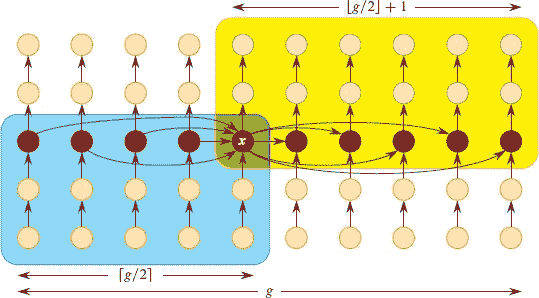

**9          中位数和顺序统计量**

一组`n`个元素的第`i`个**顺序统计量**是第`i`小的元素。例如，一组元素的**最小值**是第一个顺序统计量(`i` = 1)，**最大值**是第`n`个顺序统计量(`i = n`)。一个**中位数**，非正式地说，是集合的“中间点”。当`n`为奇数时，中位数是唯一的，出现在`i` = (`n` + 1)/2 处。当`n`为偶数时，存在两个中位数，**下中位数**出现在`i = n`/2 处，**上中位数**出现在`i = n`/2 + 1 处。因此，无论`n`的奇偶性如何，中位数出现在`i` = ⌊(`n` + 1)/2⌋和`i` = ⌈(`n` + 1)/2⌉处。然而，在本文中为简单见，我们始终使用短语“中位数”来指代下中位数。

本章讨论了从一组`n`个不同数字中选择第`i`个顺序统计量的问题。为方便起见，我们假设集合包含不同的数字，尽管我们所做的几乎都可以扩展到集合包含重复值的情况。我们正式规定**选择问题**如下：

**输入:** 一组`n`个不同数字¹和一个整数`i`，其中 `1 ≤ i ≤ n`。  输出：

**输出:** 元素`x ∈ A`，比`A`中恰好`i` – 1 个元素大。

我   我们可以通过*使用*堆排序或*精心*归并排序*来高效*对数字进行排序，*继而*输出排序数组中的第`i`个元素，*极大地*加速了。本章介绍了渐近更快的算法。

第 9.1 节讨论了选择一组元素的最小值和最大值的问题。更有趣的是一般的选择问题，我们将在随后的两节中进行研究。第 9.2 节分析了一个实用的随机算法，假设元素不同，可以实现`O(n)`的期望运行时间。第 9.3 节包含一个更具理论意义的算法，在最坏情况下实现`O(n)`的运行时间。

**9.1 最小值和最大值**

确定一组`n`个元素的最小值需要多少次比较？为了得到`n - 1`次比较的上界，只需依次检查集合中的每个元素，并跟踪到目前为止看到的最小元素。MINIMUM 过程假定集合驻留在数组`A[1 : n]`中。

`MINIMUM(A, n)`

| 1 | `min = A₁` |   |
| --- | --- |
| 2 | `for` i = 2 **to** n |
| `3` | `if` *min* > `A[i]` |   |
| \| `4` \| `min = A[i]` \| |
| 5 | ` **return** *min* |

用`n - 1` 次比较找到最大值并不更困难。

这个最小值算法是我们能做到的最好吗？是的，因为事实证明，确定最小值的问题存在`n - 1`次比较的下界。将确定最小值的任何算法视为元素之间的锦标赛。每次比较都是锦标赛中的一场比赛，较小的元素获胜。由于除了获胜者之外的每个元素都必须至少输掉一场比赛，我们可以得出结论，确定最小值需要`n - 1`次比较。因此，MINIMUM 算法在执行的比较次数方面是最优的。

**同时找到最小值和最大值**

有些应用需要找到一组`n`个元素的最小值和最大值。例如，图形程序可能需要将一组(`x`, `y`)数据缩放以适应矩形显示屏或其他图形输出设备。为此，程序必须首先确定每个坐标的最小值和最大值。

当然，我们可以使用`Θ(n)`次比较确定`n`个元素的最小值和最大值。我们只需独立找到最小值和最大值，每个使用`n` – 1 次比较，总共 2`n` – 2 = `Θ(n)`次比较。

尽管 `2`n` – 2` 次比较在渐进意义上是最优的，但可以改进主导常数。我们可以使用最多 `3 ⌊n/2⌋` 次比较找到最小值和最大值。关键是保持迄今为止看到的最小值和最大值元素。而不是通过将每个输入元素与当前最小值和最大值进行比较来处理输入的每个元素，每个元素的成本为 `2` 次比较，可以成对处理元素。首先将输入的元素成对比较*彼此*，然后将较小的元素与当前最小值比较，将较大的元素与当前最大值比较，每 `2` 个元素的成本为 `3` 次比较。

如何设置当前最小值和最大值的初始值取决于`n`是奇数还是偶数。如果`n`是奇数，则将最小值和最大值都设置为第一个元素的值，然后以成对的方式处理其余元素。如果`n`是偶数，则对前两个元素进行 1 次比较，以确定最小值和最大值的初始值，然后像奇数`n`的情况一样以成对方式处理其余元素。

让我们来计算总共的比较次数。如果`n`是奇数，则会发生 3 ⌊`n`/2⌋次比较。如果`n`是偶数，则会有 1 次初始比较，然后是另外 3(`n` – 2)/2 次比较，总共为 3`n`/2 – 2。因此，在任何情况下，总比较次数最多为 3 ⌊`n`/2⌋。

**练习**

**9.1-1**

证明在最坏情况下，`n`个元素中第二小的元素可以在`n` + ⌈lg `n`⌉ – 2 次比较中找到。（*提示：同时找到最小元素。）

`9.1-2`

给定`n` > 2 个不同的数字，你想找到一个既不是最小值也不是最大值的数字。你需要执行的最少比较次数是多少？

`9.1-3`

一个赛马场可以同时比赛五匹马，以确定它们的相对速度。对于 25 匹马，假设具有传递性（见第 1159 页），需要进行六场比赛才能确定最快的马。确定 25 匹马中最快的三匹马最少需要多少场比赛？

★ `9.1-4`

证明在最坏情况下找到`n`个数字的最大值和最小值需要⌈3`n`/2⌉ – 2 次比较的下界。（*提示：考虑有多少个数字可能是最大值或最小值，并研究比较如何影响这些计数。）

**9.2      期望线性时间选择**

一般的选择问题——找到任何`i`值的顺序统计量比找到最小值的简单问题更困难。然而，令人惊讶的是，这两个问题的渐进运行时间是相同的： `Θ(n)`。本节介绍了选择问题的分治算法。算法 RANDOMIZED-SELECT 是根据第七章快速排序算法建模的。像快速排序一样，它递归地对输入数组进行分区。但与快速排序不同，快速排序递归处理分区的两侧，而 RANDOMIZED-SELECT 只处理分区的一侧。这种差异体现在分析中：快速排序的期望运行时间为Θ(`n` lg `n`)，而 RANDOMIZED-SELECT 的期望运行时间为 `Θ(n)`，假设元素是不同的。

`RANDOMIZED-SELECT` 使用了第 7.3 节介绍的 `RANDOMIZED-PARTITION` 过程。像 `RANDOMIZED-QUICKSORT` 一样，它是一个随机算法，因为它的行为部分取决于随机数生成器的输出。`RANDOMIZED-SELECT` 过程返回数组`A[p : r]`中第`i`小的元素，其中 `1 ≤ i ≤ r – p + 1`。

RANDOMIZED-SELECT(`A`, `p`, `r`, `i`)

| 1 | `if p` == `r` |
| --- | --- |
| --- | --- |   |
| `2` | **return** `A[p]` | **//** 当`p` == `r`时，`1 ≤ i ≤ r – p + 1` 意味着`i = 1` |   |
| \| 3 \| `q = RANDOMIZED-PARTITION(A, p, r)` \|   |
| 4 | `k = q – p + 1` |
| 5 | if i == k |
| 6 | **return** `A[q]` | **//** 枢轴值就是答案 |   |
| 7 | **elseif** `i < k` |
| 8 | **返回** RANDOMIZED-SELECT(A, p, q-1, i) | `   |
| `9` | **否则返回** `RANDOMIZED-SELECT(A, q + 1, r, i - k)` |   |

图 9.1 展示了 RANDOMIZED-SELECT 过程的工作原理。第 1 行检查递归的基本情况，即子数组`A[p:r]`只包含一个元素。在这种情况下，`i`必须等于 1，第 2 行简单地将`A[p]`作为第`i`小的元素返回。否则，第 3 行中对 RANDOMIZED-PARTITION 的调用将数组`A[p:r]`划分为两个（可能为空）子数组`A[p:q-1]`和`A[q+1:r]`，使得`A[p:q-1]`的每个元素小于或等于`A[q]`，而`A[q]`又小于`A[q+1:r]`的每个元素。（尽管我们的分析假设元素是不同的，但即使存在相等的元素，该过程仍会产生正确的结果。）与快速排序一样，我们将`A[q]`称为**枢轴**元素。第 4 行计算子数组`A[p:q]`中的元素数`k`，即划分低侧的元素数，再加上 1 个枢轴元素。然后第 5 行检查`A[q]`是否是第`i`小的元素。如果是，则第 6 行返回`A[q]`。否则，算法确定第`i`小的元素位于`A[p:q-1]`和`A[q+1:r]`中的哪一个子数组中。如果`i < k`，则所需元素位于划分的低侧，第 8 行从子数组中递归选择它。然而，如果`i > k`，则所需元素位于划分的高侧。由于我们已经知道比`A[p:r]`中第`i`小的元素更小的`k`个值，即`A[p:q]`的元素，所需元素是`A[q+1:r]`中第(`i`-`k`)小的元素，第 9 行通过递归找到它。代码似乎允许对具有 0 个元素的子数组进行递归调用，但习题 9.2-1 要求您证明这种情况不会发生。

**图 9.1** 随着连续划分缩小子数组`A[p:r]`的过程，展示了 RANDOMIZED-SELECT 的作用，显示了每个递归调用时参数`p`、`r`和`i`的值。每个递归步骤中的子数组`A[p:r]`显示为棕色，选择的深棕色元素作为下一次划分的枢轴。蓝色元素在`A[p:r]`之外。答案是底部数组中的棕色元素，其中`p``r`=5 且`i`=1。数组标记`A⁰`、`A¹`、…、`A⁵`、划分数字以及划分是否有帮助的说明在下一页解释。

RANDOMIZED-SELECT 的最坏情况运行时间为`Θ(n²)`，即使是找到最小值，因为在只剩下一个元素时，它可能非常不幸，总是围绕剩余的最大元素进行划分，然后才能确定第`i`小的元素。在这种最坏情况下，每个递归步骤只移除考虑中的枢轴。因为对`n`个元素进行划分需要`Θ(n)`的时间，最坏情况运行时间的递归与 QUICKSORT 相同：`T(n)=T(n-1)+Θ(n)`，解为`T(n)=Θ(n²)`。然而，我们将看到该算法具有线性的期望运行时间，并且由于它是随机的，没有特定的输入会引发最坏情况的行为。

要了解线性预期运行时间背后的直觉，假设每次算法随机选择一个枢轴元素时，枢轴位于排序后剩余元素的第二和第三四分位数之间——“中间一半”。如果第`i`小的元素小于枢轴，则所有大于枢轴的元素在所有未来递归调用中都被忽略。这些被忽略的元素包括至少最上面的四分之一，可能更多。同样，如果第`i`小的元素大于枢轴，则所有小于枢轴的元素——至少是第一个四分之一——在所有未来递归调用中都被忽略。因此，无论如何，在所有未来递归调用中至少有剩余元素的 1/4 被忽略，最多剩余元素的 3/4`在游戏中`：驻留在子数组`A[p:r]`中。由于在`n`元素的子数组上 RANDOMIZED-PARTITION 需要 `Θ(n)`时间，因此最坏情况下运行时间的递归为`T(n) = T(3n/4) + Θ(n)`。根据主方法的第 3 种情况（第 102 页的定理 4.1），此递归的解为`T(n) = Θ(n)`。  

当然，枢轴并不一定每次都落入中间一半。由于枢轴是随机选择的，它每次落入中间一半的概率约为 1/2。我们可以将选择枢轴的过程视为伯努利试验（参见第 C.4 节），其中成功表示枢轴位于中间一半。因此，成功所需的平均试验次数由几何分布给出：平均只需两次试验（第 1197 页的方程(C.36)）。换句话说，我们期望一半的分区将游戏中的元素数量减少至少 3/4，而另一半的分区则不会帮助太多。因此，预期的分区数量最多是枢轴总是落入中间一半的情况的两倍。每次额外分区的成本低于前一次，因此预期运行时间仍然是 `Θ(n)`。

要使上述论点严谨化，我们首先定义随机变量`A^(j)`为在`j`次分区后仍在游戏中的`A`元素的集合（即，在 RANDOMIZED-SELECT 调用`j`次后的子数组`A[p:r]`中），因此`A⁰`由`A`中的所有元素组成。由于每次分区至少移除一个元素——枢轴——不在游戏中，序列`|A⁰|`，`|A¹|`，`|A²|`，…严格递减。在第`j`次分区之前，集合`A^(j-1)`在游戏中，而集合`A^(j)`在分区后仍在游戏中。为方便起见，假设初始集合`A⁰`是第 0 次“虚拟”分区的结果。

如果|`A^(j)`| ≤ (3/4)|`A^(j-1)`|，则称第`j`次分区为**有益**。图 9.1 展示了示例数组的集合`A^(j)`以及分区是否有帮助。有益的分区对应于成功的伯努利试验。以下引理表明，分区有益的概率至少与不有益的概率相同。

**`引理 9.1`**  

分区有益的概率至少为 `1/2`。

**证明** 分区是否有帮助取决于随机选择的枢轴。我们在上面的非正式论证中讨论了“中间一半”。让我们更精确地定义`n`元素子数组的中间一半，即除了最小的⌈`n`/4⌉ – 1 和最大的⌈`n`/4⌉ – 1 个元素之外的所有元素（即，如果子数组排序，则除了第一个⌈`n`/4⌉ – 1 和最后一个⌈`n`/4⌉ – 1 个元素）。我们将证明，如果枢轴落入中间一半，则枢轴会导致有益的分区，并且我们还将证明，枢轴落入中间一半的概率至少为 1/2。

无论枢纽落在哪里，大于它的所有元素或小于它的所有元素以及枢纽本身在分区后都不再参与游戏。因此，如枢纽落在中间一半，至少有⌈`n/4`⌉ – 1 个小于枢纽或大于枢纽的元素，加上枢纽本身，在分区后将不再参与游戏。也就是说，至少有⌈`n/4`⌉个元素将不再参与游戏。剩下的元素数量最多为`n - ⌈n/4⌉`，即通过第 70 页上的练习 3.3-2，等于⌊`3*n/4`⌋。由于⌊`3*n/4`⌋ ≤ `3*n/4`，分区是有用的。

为了确定随机选择的枢纽落入中间一半的概率的下限，我们确定它不落入的概率的上限。该概率为

因此，枢纽有至少 `1/2` 的概率落入中间一半，因此分区有至少 `1/2` 的概率是有用的。

▪  

现在我们可以限定 `RANDOMIZED-SELECT` 的期望运行时间。

**定理 9.2**

输入数组为`n`个不同元素的 RANDOMIZED-SELECT 过程的期望运行时间为 `Θ(n)`。

**证明** 由于并非每次分区都是有用的，让我们从 0 开始为每次分区编号，并用<`h₀`, `h₁`, `h₂`, … , `h[m]`>表示有用的分区序列，使得第`k`个分区对`k` = 0, 1, 2, … , `m` 有效。尽管有用分区的数量`m`是一个随机变量，但我们可以对其进行限制，因为在至多⌈log[4/3] `n`⌉个有用分区之后，只剩下一个元素。考虑虚拟的第 0 个分区是有用的，因此`h₀ = 0`。将`n[k]`表示为 ，其中`n₀ = |A⁰|` 是原始问题的大小。由于第`h[k]`个分区是有用的且集合`A^((j))`的大小严格减小，我们有`k` = 1, 2, … , `m`。通过迭代`n[k] ≤ (3/4) *n[k–1]`，我们有`k` = 0, 1, 2, … , `m`。

**图 9.2** 定理 9.2 证明中每一代中的集合。垂直线代表集合，每条线的高度表示集合的大小，即玩家数量。每一代以一个集合 `` 开始，这是一个有用的分区的结果。这些集合用黑色绘制，最多只有左侧集合大小的 3/4。橙色绘制的集合不是每一代中的第一个。一代可能只包含一个集合。第`k`代的集合为 ``，``。集合 `` 被定义为 ``。如果分区一直到第`h[m]`代，集合 `` 最多只有一个玩家。  

如图 9.2 所示，我们将集合序列 `A^((`j`))` 分解为包含连续分区集合的`m` **代**，从有用分区的结果  开始，到下一个有用分区之前的最后一个集合 ，。然后对于第`k`代中的元素集合 `A^((`j`))`，我们有 。  

接下来，我们定义随机变量

`X[k] = h[k + 1]` – `h[k]`  

对于`k = 0, 1, 2, … , m – 1`。也就是说，`X[k]` 是第`k`代中集合的数量，因此第`k`代中的集合为 ，。  

根据引理 9.1，分区有帮助的概率至少为 `1/2`。实际上，概率甚至更高，因为即使枢轴不落在中间一半，但第`i`小的元素恰好位于分区的较小一侧，分区仍然有帮助。然而，我们只使用 `1/2` 的下限，然后方程`(C.36)`给出了对于`k` = 0, 1, 2, … , `m` – 1，E [`X[k]`] ≤ 2。

让我们推导一下在分区过程中总共进行了多少比较的上界，因为运行时间主要由比较决定。由于我们在计算上界，假设递归一直进行，直到只剩下一个元素。第`j`次分区取出参与的元素集合`A^((j–1))`，并将随机选择的枢轴与其他|`A^((j–1))`| – 1 个元素进行比较，因此第`j`次分区进行的比较次数少于|`A^((j–1))`|。第`k`代的集合大小为。因此，在分区过程中进行的比较总数少于

由于 E [`X[k]`] ≤ 2，我们得出分区过程中期望的总比较次数少于

由于`n₀`是原始数组`A`的大小，我们得出结论，RANDOMIZED-SELECT 的期望比较次数，因此期望运行时间为`O(n)`。在第一次调用 RANDOMIZED-PARTITION 时检查了所有`n`个元素，给出了`Ω(n)`的下界。因此，期望运行时间为 `Θ(n)`。

▪

**练习**

`- **9.2

证明 `RANDOMIZED-SELECT` 永远不会对长度为 0 的数组进行递归调用。

`9.2-2`

编写 `RANDOMIZED-SELECT` 的迭代版本。

**`9.2-3`**

假设使用 `RANDOMIZED-SELECT` 选择数组`A` = <2, 3, 0, 5, 7, 9, 1, 8, 6, 4>的最小元素。描述导致 `RANDOMIZED-SELECT` 最坏情况性能的一系列分区。

**`9.2-4`**

论证 `RANDOMIZED-SELECT` 的期望运行时间不取决于输入数组`A[p : r]`中元素的顺序。也就是说，对于输入数组`A[p : r]`的任何排列，期望运行时间都是相同的。（*提示：*通过对输入数组长度`n`进行归纳来论证。）

**9.3      最坏情况下的线性时间选择**

现在我们将研究一个在最坏情况下运行时间为 `Θ(n)`的显著且理论上有趣的选择算法。尽管来自第 9.2 节的 RANDOMIZED-SELECT 算法实现了线性期望时间，但我们看到其在最坏情况下的运行时间是二次的。本节介绍的选择算法在最坏情况下实现了线性时间，但实际上并不像 RANDOMIZED-SELECT 那样实用。它主要是出于理论兴趣。

与期望的线性时间 RANDOMIZED-SELECT 不同，最坏情况下线性时间算法 `SELECT` 通过递归地对输入数组进行分区来找到所需的元素。与 RANDOMIZED-SELECT 不同，`SELECT` 在分区数组时选择一个经过证明的好枢轴，从而保证了一个良好的分割。算法的巧妙之处在于它通过递归地找到枢轴。因此，`SELECT` 有两次调用：一次用于找到一个好的枢轴，另一次用于递归地找到所需的顺序统计量。

SELECT 使用的分区算法类似于快速排序中的确定性分区算法`PARTITION`（参见第 7.1 节），但修改为将要围绕的元素作为额外的输入参数。与`PARTITION`一样，`PARTITION-AROUND`算法返回枢轴的索引。由于它与`PARTITION`如此相似，因此省略了`PARTITION-AROUND`的伪代码。

SELECT 程序的输入是一个包含 `n = r - p + 1` 个元素的子数组 `A[p : r]` 和一个范围在 `1 ≤ i ≤ n` 的整数 `i`。它返回 `A` 的第 `i` 小元素。伪代码实际上比起一开始看起来的要容易理解。

`SELECT(A, p, r, i)`  

|   1 | **当** (`r - p + 1`) mod 5 ≠ 0 **时** |  |   |
| --- | --- | --- | --- |
| 34.5.2 节定义了顶点覆盖问题并证明了其 NP 完全性。回想一下，对于无向图`G = (V, E)`，**顶点覆盖**是指一个子集`V′ ⊆ V`，使得如果`(u, v)`是`G`的一条边，则`u ∈ V′`或`v ∈ V′`（或两者都在）。顶点覆盖的大小是其中顶点的数量。 |
|   2 | **对于** `j = p` + 1 **到** `r` | **//** 将最小值放入 `A[p]` |
|   3 | **如果** `A[p] > A[j]` |  |   |
|   4 | 交换 `A[p]` 和 `A[j]` |  |  输出： |
|   5 | **//** 如果我们想要 `A[p : r]` 的最小值，那么我们已经完成了。 |
|   `6` | **如果** `i` == 1 |  |
|   `7` | **返回** `A[p]` |  |
|   8 | **//** 否则，我们想要 `A[p + 1 : r]` 的第 (`i` – 1) 个元素。 |  |
|   9 | `p = p + 1` |  |   |
| `10` | `i = i` – 1 |  |
| 11 | `g = (r - p + 1)/5` | **//** 5 元素组的数量 |   |
| 12 | **对于** `j = p + g – 1` | **//** 对每个组进行排序 |   |
| `13` | 就地对 <`A[j]`, `A[j + g]`, `A[j + 2*g]`, `A[j + 3*g]`, `A[j + 4*g]`> 进行排序 |
| `14` | **//** 所有组中位数现在位于 `A[p : r]` 的中间五分之一。 |
| \| `15` \| **//** 递归地找到枢轴 `x` 作为组中位数的中位数。 \| |
| 16 | x = SELECT(A, p + 2*g, p + 3*g - 1, ⌈g/2⌉) | `   |
| 17 | `q = PARTITION-AROUND(A, p, r, x)` | **//** 围绕枢轴进行分区 |
| `18` | **//** 其余部分与 RANDOMIZED-SELECT 的第 3–9 行类似。 |
| 19 | `k = q - p + 1` |  |
| 20 | 如果 i == k |  |
| 21 | **返回** A[q] | // 枢轴值就是答案 | `   |
| 22 | `否则如果` `i < k` |  |
| `23` | **返回** `SELECT(A, p, q - 1, i)` |  |   |
| `24` | **否则返回** `SELECT(A, q + 1, r, i - k)` |  |   |

伪代码从执行第 1–10 行的 `**当**` 循环开始，以减少子数组中的元素数量 `r - p + 1`，直到可以被 5 整除。`**当**` 循环执行 0 到 4 次，每次重新排列 `A[p : r]` 的元素，使得 `A[p]` 包含最小元素。如果 `i` = 1，意味着我们实际上想要最小元素，那么程序在第 7 行简单地返回它。否则，SELECT 从子数组 `A[p : r]` 中消除最小值，并迭代以找到 `A[p + 1 : r]` 中的第 (`i` – 1) 个元素。第 9–10 行通过增加 `p` 和减少 `i` 来实现这一点。如果 `**当**` 循环在没有返回结果的情况下完成了所有迭代，那么程序在确保 `A[p : r]` 中的元素数量 `r - p + 1` 能够被 5 整除的情况下，执行算法的核心部分，即第 11–24 行。

**图 9.3** 选择算法 SELECT 在第 17 行之后元素之间的关系（显示为圆圈）。有 `g = (r - p + 1)/5` 个包含 5 个元素的组，每个组占据一列。例如，最左侧的列包含元素 `A[p], A[p + g], A[p + 2*g], A[p + 3*g], A[p + 4*g]`，下一列包含 `A[p + 1], A[p + g + 1], A[p + 2*g + 1], A[p + 3*g + 1], A[p + 4*g + 1]`。组的中位数为红色，枢轴 `x` 被标记。箭头从较小的元素指向较大的元素。蓝色背景上的元素都已知小于或等于 `x`，不能落入围绕 `x` 的分区的高侧。黄色背景上的元素已知大于或等于 `x`，不能落入围绕 `x` 的低侧。枢轴 `x` 同时属于蓝色和黄色区域，并显示在绿色背景上。白色背景上的元素可能位于分区的任一侧。

算法的下一部分实现了以下想法，如 图 9.3 所示。将 `A[p : r]` 中的元素分成 `g = (r - p + 1)/5` 个包含 5 个元素的组。第一个 5 元素组是 

`<A[p], A[p + g], A[p + 2*g], A[p + 3*g], A[p + 4*g]>`,

第二个是  输出：

<`A[p + 1]`，`A[p + g + 1]`，`A[p + 2*g + 1]`，`A[p + 3*g + 1]`，`A[p + 4*g + 1]>，

依此类推，直到最后一句，即`1-`-   依此类推，直到最后一句，即`1-`

<`A[p + g – 1]`，`A[p + 2*g – 1]`，`A[p + 3*g – 1]`，`A[p + 4*g – 1]`，`A[r]`>。

（注意`r = p + 5*g - 1`。）第 13 行使用插入排序（例如，第 2.1 节）对每个组进行排序，因此对于`j = p, p + 1, ..., p + g - 1`，我们有

`A[j] ≤ A[j + g] ≤ A[j + 2*g] ≤ A[j + 3*g] ≤ A[j + 4*g]`

图 9.3 中的每个垂直列都描绘了一个由 5 个元素组成的排序组。每个 5 元素组的中位数是`A[j + 2*g]`，因此所有 5 元素中位数（用红色显示）位于`A[p + 2*g : p + 3*g - 1]`范围内。

接下来，第 16 行通过递归调用 SELECT 确定枢轴`x`，以找到`g`组中位数（具体来说，第⌈`g`/2⌉小的元素）。第 17 行使用修改后的 PARTITION-AROUND 算法将`A[p : r]`的元素围绕`x`进行分区，返回`x`的索引`q`，使得`A[q] = x`，`A[p : q]`中的元素都小于`x`，而`A[q : r]`中的元素大于或等于`x`。

代码的其余部分与 `RANDOMIZED-SELECT` 相似。如果枢轴`x`是第`i`大的元素，则该过程返回它。否则，该过程根据`i`的值递归调用自身，要么在`A[p : q - 1]`上，要么在`A[q + 1 : r]`上。

让我们分析 `SELECT` 的运行时间，并看看枢轴`x`的明智选择如何保证其最坏情况运行时间。

**定理 `9.3`**  

在`n`个元素的输入上，SELECT 的运行时间为 `Θ(n)`。

**证明** 定义`T(n)`为在大小不超过`n`的任何输入子数组`A[p : r]`上运行 SELECT 的最坏情况时间，即，对于`r - p + 1 ≤ n`的情况。根据这个定义，`T(n)`是单调递增的。

我们首先确定在第 16、23 和 24 行的递归调用之外花费的时间上限。第 1-10 行的`while`循环执行 0 到 4 次，即`O`(1)次。由于循环内的主要时间是第 2-4 行中的最小值计算，需要Θ(`n`)时间，因此第 1-10 行在`O`(1) · Θ(`n`) = `O`(`n`)时间内执行。第 12-13 行对 5 元素组进行排序需要Θ(`n`)时间，因为每个 5 元素组排序需要Θ(1)时间（即使使用渐进低效的排序算法，如插入排序），而有`g`个元素需要排序，其中`n`/5 – 1 < `g` ≤ `n`/5。最后，第 17 行的分区时间为Θ(`n`)，正如第 187 页的练习 7.1-3 要求您展示的那样。由于剩余的簿记只需Θ(1)时间，因此在递归调用之外花费的总时间为`O`(`n`) + Θ(`n`) + Θ(`n`) + Θ(1) = Θ(`n`)。

现在让我们确定递归调用的运行时间。第 16 行中找到枢轴的递归调用花费`T(g)` ≤ `T(n/5)`的时间，因为`g` ≤ `n/5` 且`T(n)`单调递增。在第 23 和 24 行的两个递归调用中，最多只有一个会执行。但我们将看到，无论这两个 SELECT 中的哪一个实际执行，递归调用中的元素数量最多为 7`n`/10，因此第 23 和 24 行的最坏情况成本最多为`T(7*n/10)`。现在让我们展示，通过组中位数的操作和选择枢轴`x`作为组中位数的中位数来保证这一属性。

图 9.3 有助于直观理解。有`g ≤ n/5` 个包含 5 个元素的组，每个组都按从底部到顶部排序的列显示。箭头显示了列内元素的顺序。列从左到右排序，左侧的组的组中位数小于`x`，右侧的组的组中位数大于`x`。虽然每个组内的相对顺序很重要，但左侧组之间的相对顺序并不重要，右侧组之间的相对顺序也不重要。重要的是左侧组的组中位数小于`x`（由水平箭头进入`x`表示），右侧组的组中位数大于`x`（由水平箭头离开`x`表示）。因此，黄色区域包含我们知道大于或等于`x`的元素，蓝色区域包含我们知道小于或等于`x`的元素。

这两个区域每个至少包含 `3*g/2` 个元素。黄色区域中的组中位数数量为⌊`g/2`⌋ + 1，对于每个组中位数，比它大的两个额外元素，总共有 `3(⌊g/2⌋ + 1)` ≥ `3*g/2` 个元素。类似地，蓝色区域中的组中位数数量为⌈`g/2`⌉，对于每个组中位数，比它小的两个额外元素，总共有 `3 ⌈g/2 ⌉` ≥ `3*g/2`。

黄色区域中的元素不能落入围绕`x`的分区的低侧，蓝色区域中的元素也不能落入高侧。两个区域中的元素——位于白色背景上的元素——可能落入分区的任一侧。但由于低侧分区排除了黄色区域中的元素，总共有 5`g` 个元素，我们知道低侧分区最多可以包含 5`g` – 3`g`/2 = 7`g`/2 ≤ 7`n`/10 个元素。同样，高侧分区排除了蓝色区域中的元素，类似的计算表明高侧分区也最多包含 7`n`/10 个元素。  

所有这些导致了 `SELECT` 最坏情况运行时间的以下递推式：

我们可以通过代入证明`T(n) = O(n)`。² 更具体地，我们将证明对于某个合适大的常数`c > 0` 和所有`n > 0`，`T(n) ≤ cn`。将这个归纳假设代入递推式`(9.1)`的右侧，并假设`n ≥ 5`，得到

| T (n) | ≤ | c(n/5) + c(7n/10) + Θ(n) |
| --- | --- | --- |
|  | ≤ | `9*cn*/10 + Θ(n)` |  |
|  | = | cn - cn/10 + Θ(n) |
|  | ≤ | cn |

如果选择足够大的`c`，使得`c/10`支配了被Θ(`n`)隐藏的上界常数。除了这个约束条件，我们可以选择足够大的`c`，使得对于所有`n` ≤ 4，`T` (`n`) ≤ `cn`，这是 SELECT 中递归的基本情况。因此，SELECT 的运行时间在最坏情况下是`O`(`n`)，因为仅第 13 行就需要Θ(`n`)时间，总时间为Θ(`n`)。  

▪  输出：

就像比较排序中（参见第 8.1 节），`SELECT` 和 `RANDOMIZED-SELECT` 仅通过比较元素来确定元素的相对顺序信息。回顾一下第八章中的内容，排序在比较模型中需要Ω(`n` lg `n`)的时间，即使是平均情况下也是如此（参见问题 8-1）。第八章中的线性时间排序算法对输入的类型做出了假设。相比之下，本章中的线性时间选择算法不需要对输入的类型做任何假设，只需要元素是不同的，并且可以根据线性顺序进行成对比较。本章中的算法不受Ω(`n` lg `n`)下界的限制，因为它们成功解决了选择问题，而无需对所有元素进行排序。因此，在比较模型中，通过排序和索引解决选择问题的方法在渐近意义上是低效的。

-

**9.3-1**

在算法 `SELECT` 中，输入元素被分成 5 个一组。展示如果将输入元素分成 7 个而不是 5 个，则算法可以在线性时间内工作。

`9.3-2`

假设 SELECT 中第 1-10 行的预处理被替换为`n ≥ n₀`的基本情况，其中`n₀`是一个合适的常数；选择`g`为⌊`r - p + 1)/5`⌋；并且`A[5*g : n]`中的元素不属于任何组。展示尽管运行时间的递归变得更加混乱，但仍然解决为 `Θ(n)`。

`9.3-3`

展示如何使用 `SELECT` 作为一个子程序，使得快速排序在最坏情况下以`O(n lg n)`的时间运行，假设所有元素都是不同的。

**图 9.4** Olay 教授需要确定东西向石油管道的位置，以最小化南北向支管的总长度。

★ **`9.3-4`**

假设一个算法只使用比较来找到一组`n`个元素中的第`i`小元素。展示它也可以在不进行任何额外比较的情况下找到第`i - 1`小的元素和第`n - i`大的元素。

**`9.3-5`**

展示如何仅使用 6 次比较确定一个 5 元素集合的中位数。

**9.3-6**

你有一个“黑匣子”最坏情况下线性时间复杂度的中位数子程序。给出一个简单的线性时间算法，解决任意顺序统计的选择问题。

**`9.3-7`**  

Olay 教授正在为一家石油公司提供建议，该公司计划在一个拥有`n`口井的油田中从东到西铺设一条大型管道。公司希望将每口井的支管管道直接连接到主管道上，沿着最短路径（向北或向南），如图 9.4 所示。给定井的`x`和`y`坐标，教授应该如何选择主管道的最佳位置以最小化支管的总长度？展示如何在线性时间内确定最佳位置。

**9.3-8**

一个`n`元素集合的第`k`个**分位数**是将排序后的集合分成`k`个大小相等的集合（误差不超过 1）的`k - 1`次序统计。给出一个`O(n lg k)`时间复杂度的算法，列出集合的第`k`个分位数。

**9.3-9**

描述一个`O(n)`时间复杂度的算法，给定一个包含`n`个不同数字和一个小于等于`n`的正整数`k`，确定`S`中距离`S`的中位数最近的`k`个数字。

**`9.3-10`**

让`X[1 : n]`和`Y[1 : n]`是两个数组，每个数组包含已经按顺序排列的`n`个数字。给出一个`O(lg n)`时间复杂度的算法，找到数组`X`和`Y`中所有 2`n`个元素的中位数。假设所有 2`n`个数字都是不同的。

**问题**  

**`9-1`排序后的最大 i 个数字**

给定一组`n`个数字，您希望使用基于比较的算法按排序顺序找到第`i`大的数字。描述实现以下每种方法的算法，其具有最佳渐近最坏情况运行时间，并分析算法的运行时间与`n`和`i`的关系。

**a.** 对数字进行排序，并列出最大的`i`个数字。

**b.** 从数字构建最大优先队列，并调用 `EXTRACT-MAX` `i` 次。

**c.** 使用顺序统计算法找到第`i`大的数字，围绕该数字进行分区，并对最大的`i`个数字进行排序。

**`9-2`     随机选择的变体**

孟德尔教授建议通过消除`i`和`k`是否相等的检查来简化 RANDOMIZED-SELECT。简化的过程是 SIMPLER-RANDOMIZED-SELECT。

`SIMPLER-RANDOMIZED-SELECT(A, p, r, i)`

| 1 | **如果** `p` == `r` |
| --- | --- |
| 2 | **返回** A[p] | **//** 1 ≤ i ≤ r - p + 1 意味着 i = 1 |
| 3 | `q = RANDOMIZED-PARTITION(A, p, r)` |   |
| 4 | `k = q` - `p` + 1 |
| 5 | **如果** `i ≤ k` |
| 6 | **返回** SIMPLER-RANDOMIZED-SELECT(`A`, `p`, `q`, `i`) |
| 7 | **否则返回** `SIMPLER-RANDOMIZED-SELECT(A, q + 1, r, i - k)` |

**a.** 论证在最坏情况下，`SIMPLER-RANDOMIZED-SELECT` 永远不会终止。

**b.** 证明 `SIMPLER-RANDOMIZED-SELECT` 的期望运行时间仍然是`O(n)`。

**9-3** 加权中位数

考虑具有正权重`w₁`, `w₂`, … , `w[n]`的`n`个元素`x₁`, `x₂`, … , `x[n]`，使得。**加权（下）中位数**是满足条件的元素`x[k]`

``  

和 

例如，考虑以下元素`x[i]`和权重`w[i]`：

| `i` | 1 | 2 | 3 | 4 | 5 | 6 | 7 |
| --- | --- | --- | --- | --- | --- | --- | --- |
| `x[i]` | 3 | 8 | 2 | 5 | 4 | 1 | 6 |   |
| `w[i]` | 0.12 | 0.35 | 0.025 | 0.08 | 0.15 | 0.075 | 0.2 |   |

对于这些元素，中位数是`x[5]` = 4，但加权中位数是`x[7]` = 6。要了解为什么加权中位数是`x[7]`，观察小于`x[7]`的元素是`x₁, x[3], x[4], x[5]`和`x[6]`，而和`w₁ + w[3] + w[4] + w[5] + w[6] = 0.45`，小于 1/2。此外，只有元素`x₂`大于`x[7]`，`w₂ = 0.35`，不大于 1/2。  

**a.** 论证`x₁, x₂, … , x[n]`的中位数是带有权重`w[i]` = 1/`n`的`x[i]`的加权中位数，其中`i` = 1, 2, … , `n`。

**b.** 展示如何使用排序在`O(n lg n)`最坏情况时间内计算`n`个元素的加权中位数。

**c.** 展示如何使用线性时间中位数算法（如第 9.3 节中的 SELECT）在 `Θ(n)`最坏情况时间内计算加权中位数。

**邮局选址问题**的定义如下。输入是带有相关权重`w₁`, `w₂`, … , `w[n]`的`n`个点`p₁`, `p₂`, … , `p[n]`。解决方案是一个点`p`（不一定是输入点之一），使得总和最小`∑ d(a, b)`，其中`d(a, b)`是点`a`和`b`之间的距离。

**d.** 论证加权中位数是一维邮局选址问题的最佳解，其中点仅为实数，点`a`和`b`之间的距离是`d(a, b) = |a - b|`。

**e.** 找到二维邮局选址问题的最佳解，其中点是`(`x`, `y`)`坐标对，点`a = (`x`[1], `y`[1])`和`b = (`x`[2], `y`[2])`之间的距离是由`d(a, b) = |`x`[1] – `x`[2]| + |`y`[1] – `y`[2]|`给出的**曼哈顿距离**。

**9-4     小顺序统计量**

让我们用`S(n)`表示 SELECT 用于从`n`个数字中选择第`i`顺序统计量时使用的最坏情况比较次数。虽然`S(n)` =  `Θ(n)`，但Θ-符号隐藏的常数相当大。当`i`相对于`n`较小时，有一种算法可以使用 SELECT 作为子例程，但在最坏情况下进行更少的比较。

**a.** 描述一个算法，使用`Ui`次比较来找到`n`个元素中的第`i`小元素，其中  

  

（提示：从`⌊n/2⌋`个不相交的成对比较开始，并在包含每对中较小元素的集合上递归。）  

**b.** 证明，如果`i < n/2`，则`Ui = n + O(S(2*i) lg(n/i))`.

**c.** 证明如果`i`是小于`n/2`的常数，则`Ui = n + O(lg n)`。

**d.** 证明如果`i = n/k`，其中`k ≥ 2`，则`Ui = n + O(S(2n/k lg k))`。

**`9-5`     随机选择的替代分析**  

在这个问题中，您将使用指示器随机变量来分析类似于我们对 RANDOMIZED-QUICKSORT 在 Section 7.4.2 中的分析的 RANDOMIZED-SELECT 过程。

与快速排序分析一样，我们假设所有元素都是不同的，并将输入数组`A`的元素重命名为`z₁`、`z₂`、…，`z[n]`，其中`z[i]`是第`i`小的元素。因此，调用 `RANDOMIZED-SELECT(A, 1, n, i)` 返回 `z[i]`。

对于 `1 ≤ j < k ≤ n`，让 

| `X[ijk]` | = | I {`z[j]`在查找`z[i]`的执行过程中某个时候与`z[k]`进行比较}。 |
| --- | --- | --- |
| `-` | `-` | `-` | `-` |

**a.** 给出一个 E [`X[ijk]`]的确切表达式。(*提示：您的表达式可能具有不同的值，具体取决于`i`、`j`和`k`的值。*)

**b.** 让`X[i]`表示在查找`z[i]`时数组`A`的元素之间的比较总数。证明

**c.** 证明 E [`X[i]`] ≤ 4`n`。

**d.** 假设数组`A`的所有元素都不同，证明 RANDOMIZED-SELECT 期望时间为`O(n)`。

**`9-6`     三个一组选择**

练习 9.3-1 要求您证明如果将元素分成 7 个一组，则 `SELECT` 算法仍然在线性时间内运行。这个问题问的是分成 3 组。

**`a.`** 如果将元素分成任意大于 3 的奇数常数大小的组，证明 SELECT 在线性时间内运行。

**b.** 证明如果将元素分成大小为 3 的组，SELECT 在`O(n lg n)`时间内运行。

因为部分（b）中的界限只是一个上界，我们不知道三个一组的策略是否实际上以 `O(n)` 时间运行。但通过在中间中位数组上重复三个一组的想法，我们可以选择一个保证 `O(n)` 时间的枢轴。下一页的 SELECT3 算法确定了一个由`n` > 1 个不同元素组成的输入数组中的第`i`小元素。

**c.** 用英语描述 `SELECT3` 算法的工作原理。在描述中包含一个或多个适当的图表。

**d.** 证明 `SELECT3` 在最坏情况下以 `O(n)` 时间运行。

**章节注释**

最坏情况下的线性时间中位数查找算法是由 Blum、Floyd、Pratt、Rivest 和 Tarjan [62] 设计的。快速随机版本归功于 Hoare [218]。Floyd 和 Rivest [147] 开发了一个改进的随机版本，该版本递归地围绕从元素的一个小样本中选择的元素进行分区。  

`SELECT3(A, p, r, i)`  

|   1 | **当** (r - p + 1) mod 9 ≠ 0 |
| --- | --- |
| --- | --- |  |
|   2 | **对于** `j = p + 1` **到** `r` | **//** 将最小值放入 `A[p]` |
| `3` | **如果** `A[p] > A[j]` |   |
|   4 | 交换 `A[p]` 和 `A[j]` |
| `5` **//** 如果我们想要`A[p : r]`的最小值，我们已经完成了。 |
|   6 | **如果** `i` == 1 |
| `7` | **返回** `A[p]` |
|   8 | **//** 否则，我们想要`A[p + 1 : r]`的第(`i` – 1)个元素。 |
|   9 | `p = p + 1` |
| `10` | `i = i` – 1 |  |
| 11 | `g = (r - p + 1)/3` | **//** 3 个元素组的数量 |   |
| `12` | **对于** `j = p` **到** `p + g - 1` | **//** 遍历组 |
| `13` | 将<`A[j]`, `A[j + g]`, `A[j + 2*g]`>就地排序 |
| 14 | **//** 所有组中位数现在位于`A[p : r]`的中间三分之一处。 |
| 15 | g′ = g/3 | // 3 个元素子组的数量 | `   |
| 16 | **对于** `j = p + g` **到** `p + g + g′ - 1` | **//** 对子组进行排序 |
| 17 | 将<`A[j]`, `A[j + g′]`, `A[j + 2*g′]`>就地排序 |   |
| `18` | **//** 所有子组中位数现在位于`A[p : r]`的中间九分之一处。 |
| `19` | **//** 递归地将枢轴`x`作为子组中位数的中位数。 |  |
| 20 | `x` = SELECT3(`A`, `p` + 4*g′*, `p` + 5*g′* – 1, ⌈g′/2⌉) |   |
| 21 | `q = PARTITION-AROUND(A, p, r, x)` | **//** 围绕枢轴进行分区 |  |
| `22` | **//** 其余部分与 SELECT 的第 19-24 行类似。 |   |
| 23 | k = q - p + 1 |
| 24 | ` **如果** `i` == `k` |
| `25` | **返回** `A[q]` | **//** 枢轴值是答案 |   |
| 26 | **否则** `i < k` |   |
| 27 | **返回** `SELECT3(A, p, q - 1, i)` |
| 28 | **否则返回** SELECT3(`A`, `q` + 1, `r`, `i` – `k`) |

目前尚不清楚确定中位数需要多少比较。Bent 和 John `[48]` 给出了中位数查找需要 `2*n` 次比较的下界，而 Schönhage、Paterson 和 Pippenger `[397]` 给出了 `3*n` 次比较的上界。Dor 和 Zwick 改进了这两个界限。他们的上界 `[123]` 稍低于 `2.95*n`，而下界 `[124]` 是`(2 + ϵ)*n`，其中`ϵ`是一个小正常数，从而略微改进了 Dor 等人的相关工作 `[122]`。Paterson `[354]` 描述了其中一些结果以及其他相关工作。

问题 9-6 受到了 Chen 和 Dumitrescu 的一篇论文的启发 [84]。

¹ 如第 182 页的脚注中所述，您可以通过将每个输入值`A[i]`转换为有序对(`A[i], i`)，并且如果`A[i] < A[j]`或`A[i] = A[j]`且`i < j`，则使(`A[i], i`) < (`A[j], j`)来强制执行假设数字是不同的。

² 我们也可以使用来自第 4.7 节的 Akra-Bazzi 方法，其中涉及微积分，来解决这个递归。事实上，117 页上使用了类似的递归`(4.24)`来说明该方法。
