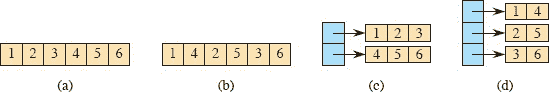
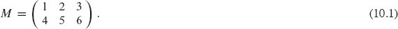
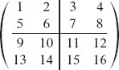
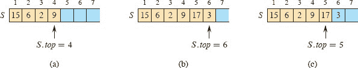
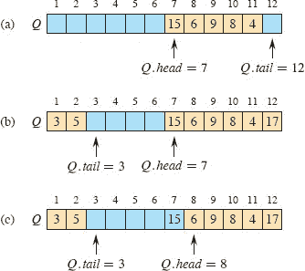
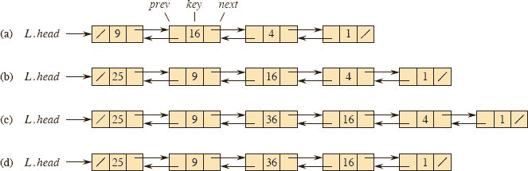
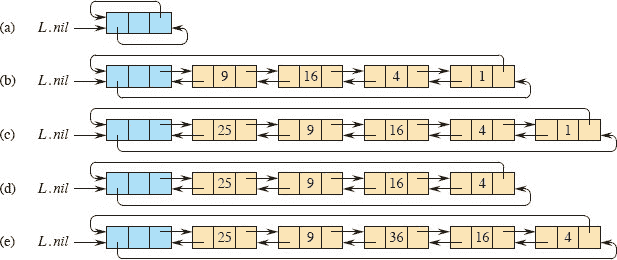
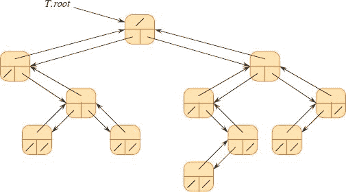
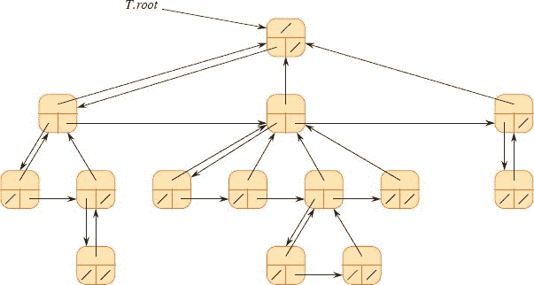
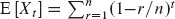

**`10`        基本数据结构**  

在本章中，我们通过使用指针的简单数据结构来检查动态集合的表示。虽然你可以使用指针构建许多复杂的数据结构，但我们只介绍基本的数据结构：数组、矩阵、栈、队列、链表和根树。

**10.1    基于简单数组的数据结构：数组、矩阵、栈、队列**  

**`10.1.1    数组`**

我们假设，与大多数编程语言一样，数组在内存中作为连续的字节序列存储。如果数组的第一个元素具有索引 `s`（例如，在具有 1 起始索引的数组中， `s` = 1），数组从内存地址 `a` 开始，每个数组元素占据 `b` 字节，则第 `i` 个元素占据字节 `a + b(i - s)` 到 `a + b(i - s + 1) - 1。由于本书中的大多数数组从 1 开始索引，少数从 0 开始索引，我们可以稍微简化这些公式。当 `s` = 1 时，第 `i` 个元素占据字节 `a + b(i - 1)` 到 `a + bi - 1`，当 `s` = 0 时，第 `i` 个元素占据字节 `a + bi` 到 `a + b(i + 1) - 1。假设计算机可以在相同的时间内访问所有内存位置（如 第 2.2 节 中描述的 RAM 模型），无论索引如何，访问任何数组元素都需要恒定时间。

大多数编程语言要求特定数组的每个元素大小相同。如果给定数组的元素可能占用不同数量的字节，则上述公式不适用，因为元素大小 `b` 不是常数。在这种情况下，数组元素通常是大小不同的对象，每个数组元素实际上是指向对象的指针。指针占用的字节数通常是相同的，无论指针引用什么，因此要访问数组中的对象，上述公式给出对象指针的地址，然后必须跟随指针以访问对象本身。  

**图 10.1** 存储方程（10.1）中的 2 × 3 矩阵 `M` 的四种方法。 **(a)** 按行主序在单个数组中。 **(b)** 按列主序在单个数组中。 **(c)** 按行主序，每行一个数组（棕色），一个指向行数组的指针数组（蓝色）。 **(d)** 按列主序，每列一个数组（棕色），一个指向列数组的指针数组（蓝色）。  

**10.1.2    矩阵**

我们通常通过一个或多个一维数组来表示矩阵或二维数组。存储矩阵的两种最常见方式是按行主序和按列主序。让我们考虑一个 `m` × `n` 矩阵，即具有 `m` 行和 `n` 列的矩阵。在***按行主序***中，矩阵按行存储，而在***按列主序***中，矩阵按列存储。例如，考虑 2 × 3 矩阵

按行主序存储两行 `1 2 3` 和 `4 5 6`，而按列主序存储三列 `1 4`；`2 5`；和 `3 6`。

图 10.1 的(a)和(b)部分展示了如何使用单一一维数组存储此矩阵。在(a)部分中以行主序存储，在(b)部分中以列主序存储。如果行、列和单一数组都从`s`开始索引，那么`M [i, j]`—第`i`行和第`j`列的元素—在行主序中的数组索引为`s + (n(i – s)) + (j – s)`，在列主序中为`s + (m(j – s)) + (i – s)`。当`s = 1`时，单一数组索引为`n(i – 1) + j`，行主序为`i + m(j – 1)`。当`s = 0`时，单一数组索引更简单：`ni + j`，行主序为`i + mj`。对于具有 1 起始索引的示例矩阵`M`，元素`M [2, 1]`在单一数组中以行主序存储在索引 `3(2 – 1) + 1 = 4` 处，在列主序中以索引 `2 + 2(1 – 1) = 2` 处。

图 10.1 的(c)和(d)部分展示了存储示例矩阵的多数组策略。在(c)部分，每行都存储在其自己的长度为`n`的数组中，显示为棕色。另一个具有`m`个元素的数组，显示为蓝色，指向`m`行数组。如果我们称蓝色数组为`A`，那么`A[i]`指向存储`M`第`i`行条目的数组，并且数组元素`A[i][j]`存储矩阵元素`M[i, j]`。部分(d)显示了多数组表示的列主版本，其中有`n`个长度为`m`的数组，表示`n`列。矩阵元素`M[i, j]`存储在数组元素`A[j][i]`中。

单数组表示通常在现代计算机上比多数组表示更有效。但是多数组表示有时更灵活，例如允许“不规则数组”，其中行在行主版本中可能具有不同长度，或者对称地在列主版本中，其中列可能具有不同长度。

有时，还会使用其他方案来存储矩阵。在***块表示***中，矩阵被分成块，并且每个块都是连续存储的。例如，将 `4×4` 矩阵分成 `2×2` 块，如下所示

可以按顺序将其存储在单个数组中`<1, 2, 5, 6, 3, 4, 7, 8, 9, 10, 13, 14, 11, 12, 15, 16>`。

**10.1.3    栈和队列**  

栈和队列是动态集合，其中通过 DELETE 操作从集合中删除的元素是预先指定的。在***栈***中，从集合中删除的元素是最近插入的元素：栈实现***后进先出***或***LIFO***策略。同样，在***队列***中，删除的元素始终是在集合中存在时间最长的元素：队列实现***先进先出***或***FIFO***策略。在计算机上有几种有效的方法来实现栈和队列。在这里，您将看到如何使用带有属性的数组来存储它们。

**栈**

栈上的 INSERT 操作通常称为 `PUSH`，而不带元素参数的 DELETE 操作通常称为 `POP`。这些名称是对物理栈的暗示，例如在自助餐厅中使用的弹簧加载的盘子堆栈。从栈中弹出盘子的顺序与将其推入栈的顺序相反，因为只有顶部盘子是可访问的。

图 10.2 展示了如何使用数组`S[1 : n]`实现最多包含`n`个元素的栈。栈具有属性`S.top`，用于索引最近插入的元素，以及`S.size`，等于数组的大小`n`。栈由元素`S[1 : S.top]`组成，其中`S₁`是栈底的元素，`S[S.top]`是栈顶的元素。

**图 10.2** 一个栈 `S` 的数组实现。栈元素仅出现在棕色位置。**(a)** 栈 `S` 有 4 个元素。顶部元素是 9。**(b)** 在调用 `PUSH(S, 17)` 和 `PUSH(S, 3)` 后的栈 `S`。**(c)** 在调用 `POP(S)` 返回元素 3 后，这是最近推入的元素。尽管元素 3 仍然出现在数组中，但它不再在栈中。顶部是元素 17。

当 `S.top` = 0 时，栈中不包含任何元素，是***空的***。我们可以使用查询操作 STACK-EMPTY 来测试栈是否为空。尝试从空栈中弹出时，栈会***下溢***，通常是一个错误。如果 `S.top` 超过 `S.size`，栈会***上溢***。

`STACK-EMPTY`、`PUSH` 和 `POP` 这三个栈操作的实现仅需几行代码。图 10.2 展示了修改操作 `PUSH` 和 `POP` 的效果。这三个栈操作每个都需要 `O(1)` 时间。

`STACK-EMPTY(S)`  

| `1` | **如果** `S.top` == `0` |
| --- | --- |
| 2 | **返回** TRUE |
| \| 3 \| **否则返回** FALSE \| |

`PUSH(S, x)`

| 1 | **如果** `S.top` == `S.size` |  |
| --- | --- |
| 2 | ` **错误** “上溢” |
| 3 | ` **否则** `S.top = S.top + 1 |
| `4` | `S[S.top] = x` |

POP(`S`)

| 1 | **如果** `STACK-EMPTY(S)` |
| --- | --- |
| --- | --- |   |
| 2 | **错** “下溢” |
| `3` | **否则** `S.top = S.top` – `1` |
| `4` | **返回** `S[S.top + 1]` |   |

**图 10.3** 使用数组 `Q[1 : 12]` 实现的队列。队列元素仅出现在棕色位置。**(a)** 队列有 5 个元素，位于位置 `Q[7 : 11]`。**(b)** 在调用 `ENQUEUE(Q, 17)`、`ENQUEUE(Q, 3)` 和 `ENQUEUE(Q, 5)` 后的队列配置。**(c)** 在调用 `DEQUEUE(Q)` 返回原先在队列头部的键值 15 后的队列配置。新的头部键值为 6。

**队列**

我们将队列上的 INSERT 操作称为 `ENQUEUE`，将 DELETE 操作称为 `DEQUEUE`。与栈操作 `POP` 类似，`DEQUEUE` 不需要元素参数。队列的 FIFO 特性使其像等待服务的顾客队列一样运作。队列有一个***头部***和一个***尾部***。当一个元素入队时，它会占据队列尾部的位置，就像新到达的顾客会排在队伍的最后。出队的元素总是队列头部的元素，就像队伍中等待时间最长的顾客一样。

图 10.3 展示了使用数组 `Q[1 : n]` 实现最多 `n` – 1 个元素的队列的一种方法，其中属性 `Q.size` 等于数组的大小 `n`。队列有一个属性 `Q.head` 用于索引或指向其头部。属性 `Q.tail` 索引下一个位置，新到达的元素将插入队列中。队列中的元素位于位置 `Q.head`、`Q.head` + 1，…，`Q.tail` – 1，我们在循环顺序中“环绕”，即位置 1 紧随位置 `n`。当 `Q.head = Q.tail` 时，队列为空。最初，我们有 `Q.head = Q.tail` = 1。尝试从空队列中出队元素会导致队列下溢。当 `Q.head = Q.tail` + 1 或者 `Q.head` = 1 且 `Q.tail = Q.size` 时，队列已满，尝试入队元素会导致队列上溢。

在 `ENQUEUE` 和 `DEQUEUE` 过程中，我们省略了下溢和上溢的错误检查。（练习 10.1-5 要求您提供这些检查。）图 10.3 展示了 `ENQUEUE` 和 `DEQUEUE` 操作的效果。每个操作都需要 `O(1)` 时间。

`ENQUEUE(Q, x)`  

| 1 | `Q[Q.tail] = x` |
| --- | --- |
| 2 | **如果** `Q.tail` == `Q.size` |
| `3` | *`Q.tail`* = `1` |  |
| `4` | **否则** `Q.tail = Q.tail + 1` |  |

DEQUEUE(`Q`)

| -   | 1 | `x = Q[Q.head]` |
| --- | --- |
| 2 | **如果** `Q.head` == `Q.size` |
| 3 | Q.head = 1 | `   |
| \| `4` \| **否则** `Q.head = Q.head + 1` \|   |
| `5` | **返回** `x` |

**练习**

`10.1-1`

考虑一个`m` × `n`矩阵按行主序排列，其中`m`和`n`都是 2 的幂，行和列从 0 开始索引。我们可以用二进制表示一个行索引`i`，通过 lg `m`位 <`i`[lg `m` – 1], `i`[lg `m` – 2], … , `i`[0]>，以及用二进制表示一个列索引`j`，通过 lg `n`位 <`j`[lg `n` – 1], `j`[lg `n` – 2], … , `j`[0]>。假设这个矩阵是一个 2 × 2 的块矩阵，每个块有`m`/2 行和`n`/2 列，并且要用一个单一数组表示，索引从 0 开始。展示如何从`i`和`j`的二进制表示构造出(lg `m` + lg `n`)位索引到单一数组的二进制表示。

`10.1-2`

使用图 `10.2` 作为模型，说明在初始为空的数组`S[1 : 6]`中存储的栈`S`上的每个操作序列 `PUSH(S, 4)`，`PUSH(S, 1)`，`PUSH(S, 3)`，`POP(S)`，`PUSH(S, 8)`和 `POP(S)`的结果。

`10.1-3`

解释如何在一个数组`A[1 : n]`中实现两个栈，使得两个栈的元素总数不超过`n`。PUSH 和 POP 操作应该在`O(1)`时间内完成。

`10.1-4`

使用图 10.3 作为模型，说明在初始为空的数组`Q[1 : 6]`中存储的队列`Q`上的每个操作序列 `ENQUEUE(Q, 4)`，`ENQUEUE(Q, 1)`，`ENQUEUE(Q, 3)`，`DEQUEUE(Q)`，`ENQUEUE(Q, 8)`和 `DEQUEUE(Q)`的结果。  

***10.1-5***

重写 `ENQUEUE` 和 `DEQUEUE` 以检测队列的下溢和上溢。

`10.1-6`

而栈只允许在一个端口插入和删除元素，队列允许在一个端口插入和在另一个端口删除元素，一个`双端队列`（double-ended queue，发音类似于“deck”）允许在两端插入和删除元素。编写四个`O(1)`时间的过程，用于在数组中实现一个双端队列中插入和删除元素。

`10.1-7`

展示如何使用两个栈实现一个队列。分析队列操作的运行时间。

***`10.1-8`***  

展示如何使用两个队列实现一个栈。分析栈操作的运行时间。

**10.2    链表**  

一个`链表`是一种数据结构，其中对象按线性顺序排列。然而，与数组不同，数组索引确定了线性顺序，链表中的顺序由每个对象中的指针确定。由于链表的元素通常包含可搜索的键，因此有时称为`搜索列表`。链表为动态集合提供了简单、灵活的表示，支持（尽管不一定高效地）250 页上列出的所有操作。

如图 10.4 所示，`双向链表` `L`的每个元素都是一个带有属性`key`和两个指针属性`next`和`prev`的对象。对象还可以包含其他卫星数据。给定列表中的元素`x`，*x.next*指向链表中的后继，*x.prev*指向前驱。如果*x.prev* = NIL，则元素`x`没有前驱，因此是列表的第一个元素，或`头部`。如果*x.next* = NIL，则元素`x`没有后继，因此是列表的最后一个元素，或`尾部`。属性`L.head`指向列表的第一个元素。如果`L.head` = NIL，则列表为空。

**图 10.4 (a)** 代表动态集合`{1, 4, 9, 16}`的双向链接列表`L`。列表中的每个元素都是一个具有键和指向下一个和上一个对象的指针（由箭头表示）的对象。尾部的`next`属性和头部的`prev`属性都是 NIL，用斜线表示。属性`L.head`指向头部。**(b)** 在执行 `LIST-PREPEND(L, x)` 后，其中`x.key` = 25，链表中有一个键为 25 的新头部对象。这个新对象指向键为 9 的旧头部。**(c)** 调用 `LIST-INSERT(x, y)` 的结果，其中`x.key` = 36，`y` 指向键为 9 的对象。**(d)** 调用 `LIST-DELETE(L, x)` 后的结果，其中`x` 指向键为 4 的对象。

一个列表可能有几种形式。它可以是单向链接的，也可以是双向链接的，可以是排序的，也可以是非排序的，还可以是循环的或非循环的。如果列表是`***单向链接***`的，每个元素都有一个`*next*`指针，但没有`*prev*`指针。如果列表是`***排序的***`，列表的线性顺序对应于列表中元素存储的键的线性顺序。最小元素是列表的头部，最大元素是尾部。如果列表是`***非排序的***`，元素可以以任何顺序出现。在`***循环列表***`中，列表头部的`*prev*`指针指向尾部，列表尾部的`*next*`指针指向头部。你可以将循环列表看作是一圈元素。在本节的其余部分，我们假设我们正在处理的列表是非排序的、双向链接的。

**搜索链表**

LIST-SEARCH(`L`, `k`)过程通过简单的线性搜索在列表`L`中找到具有键`k`的第一个元素，并返回指向该元素的指针。如果列表中没有键`k`的对象，则该过程返回 NIL。对于图 10.4(a)中的链表，调用 LIST-SEARCH(`L`, 4)返回指向第三个元素的指针，调用 LIST-SEARCH(`L`, 7)返回 NIL。要搜索包含`n`个对象的列表，LIST-SEARCH 过程在最坏情况下需要 `Θ(n)`时间，因为��可能需要搜索整个列表。

`LIST-SEARCH(L, k)`

| 1 | `x = L.head` |   |
| --- | --- |
| `2` | `while` `x ≠ NIL` and `x.key ≠ k` |   |
| 3 | `x = x.next` |   |
| `4` | **return** `x` |  |

**`向链表中插入`**

给定一个已经设置了`key`属性的元素`x`，LIST-PREPEND 过程将`x`添加到链表的前面，如图 10.4(b)所示。 （回想一下，我们的属性表示法可以级联，因此`L.head.prev`表示`L.head`指向的对象的`prev`属性。）在包含`n`个元素的列表上，LIST-PREPEND 的运行时间为`O(1)`。

LIST-PREPEND(`L`, `x`)

| `1` | `x.next = L.head` |   |
| --- | --- | --- |
| --- | --- |
| `2` | `x.prev = NIL` |   |
| \| 3 \| `if` `L.head` ≠ NIL |
| `4` | `L.head.prev = x` |
| `5` | `L.head = x` |

在链表中可以随意插入元素。如图 10.4(c)所示，如果你有一个指向列表中对象的指针`y`，则在面对页面上的 LIST-INSERT 过程会在`O(1)`时间内将一个新元素`x`“拼接”到列表中，紧随`y`之后。由于 LIST-INSERT 从不引用列表对象`L`，因此不需要将其作为参数提供。

`LIST-INSERT(x, y)`

| 1 | `x.next = y.next` |   |
| --- | --- | --- |
| `---` | `---` |
| 2 | `x.prev = y` |
| 3 | if y.next ≠ NIL |
| `4` | `y.next.prev = x` |   |
| 5 | y.next = x | `   |

`从链表中删除`

过程 `LIST-DELETE` 从链表`L`中移除元素`x`。它必须给出指向`x`的指针，然后通过更新指针“剪接”`x`出列表。要删除具有给定键的元素，首先调用 `LIST-SEARCH` 检索指向元素的指针。图 10.4(d)展示了如何从链表中删除一个元素。`LIST-DELETE` 在`O(1)`时间内运行，但要删除具有给定键的元素，调用 `LIST-SEARCH` 使得最坏情况运行时间为 `Θ(n)`。

`LIST-DELETE(L, x)`

| `1` | `if` `x.prev` ≠ NIL |   |
| --- | --- |
| 2 | `x.prev.next = x.next` |
| `3` | **else** `L.head = x.next` |   |
| 4 | `if x.next` ≠ NIL |   |
| 5 | x.next.prev = x.prev |

在双向链表上，插入和删除操作比在数组上快。如果要在数组中插入一个新的第一个元素或删除数组中的第一个元素，并保持所有现有元素的相对顺序，那么每个现有元素都需要移动一个位置。因此，在数组中，插入和删除在最坏情况下需要`Θ(n)`时间，而在双向链表中只需要`O(1)`时间。 （练习 10.2-1 要求您证明从单链表中删除元素在最坏情况下需要`Θ(n)`时间。）然而，如果要在线性顺序中找到第`k`个元素，在数组中只需要`O(1)`时间，而在链表中，您需要遍历`k`个元素，需要`Θ(k)`时间。

**哨兵**

LIST-DELETE 的代码如果忽略列表头部和尾部的边界条件会更简单：

**图 10.5** 带有哨兵的循环双向链表。蓝色的哨兵`L.nil`出现在头部和尾部之间。由于列头部是`L.nil.next`，因此不再需要属性`L.head`。**(a)** 空列表。**(b)** 来自图 10.4(a)的链表，头部为键 9，尾部为键 1。**(c)** 执行 `LIST-INSERT' (x, L.nil)` 后的列表，其中 `x.key = 25`。新对象成为列表的头部。**(d)** 删除键为 1 的对象后的列表。新尾部是键为 4 的对象。**(e)** 执行 `LIST-INSERT' (x, y)` 后的列表，其中 `x.key = 36`，`y` 指向键为 9 的对象。

`LIST-DELETE' (x)`

| 1 | `x.prev.next = x.next` |   |
| --- | --- |
| `2` | *x.next.prev* = *x.prev* |   |

***哨兵***是一个虚拟对象，允许我们简化边界条件。在链表`L`中，哨兵是一个代表 NIL 的对象`L.nil`，但具有列表中其他对象的所有属性。对 NIL 的引用被替换为对哨兵`L.nil`的引用。如图 10.5 所示，这个改变将一个常规的双向链表转变为一个带有哨兵的***循环双向链表***，其中哨兵`L.nil`位于头部和尾部之间。属性`L.nil.next`指向列表的头部，`L.nil.prev`指向尾部。同样，尾部的`next`属性和头部的`prev`属性都指向`L.nil`。由于`L.nil.next`指向头部，属性`L.head`被完全消除，引用被替换为`L.nil.next`的引用。图 10.5(a)显示了一个空列表只包含哨兵，`L.nil.next`和`L.nil.prev`都指向`L.nil`。  

要从列表中删除一个元素，只需使用之前的两行过程`LIST-DELETE′`。就像`LIST-INSERT`从不引用列表对象`L`一样，`LIST-DELETE′`也不会。除非你要删除整个列表，否则永远不要删除哨兵`L.nil`！

LIST-INSERT′过程将元素`x`插入到对象`y`之后的列表中。不需要单独的前置过程：要在列表头部插入，让`y`为`L.nil`；要在尾部插入，让`y`为`L.nil.prev`。图 10.5 展示了 LIST-INSERT′和 LIST-DELETE′对示例列表的影响。

`LIST-INSERT' (x, y)`

| 1 | `x.next = y.next` |
| --- | --- |
| `2` | `x.prev = y` |
| 3 | y.next.prev = x |
| \| `4` \| `y.next = x` \| |

使用哨兵的循环双向链表搜索具有与不使用哨兵相同的渐近运行时间，但可以减少常数因子。`LIST-SEARCH` 中第 2 行的测试进行两次比较：一次检查搜索是否已经超出列表的末尾，如果没有，则检查关键字是否位于当前元素`x`中。假设你`知道`关键字在列表中的某处。那么你就不需要检查搜索是否超出列表的末尾，从而在`while`循环的每次迭代中消除一次比较。  

哨兵提供了一个放置关键字的位置，用于开始搜索。搜索从列表`L`的头部`L.nil.next`开始，并且如果在列表中找到关键字，则停止。现在搜索保证会在哨兵或在到达哨兵之前找到关键字。如果在到达哨兵之前找到了关键字，那么它确实在搜索停止的元素中。然而，如果搜索遍历列表中的所有元素，并且只在哨兵中找到关键字，则关键字实际上不在列表中，搜索返回 NIL。`LIST-SEARCH′`过程体现了这个想法。（如果你的哨兵需要其`key`属性为 NIL，则可能需要在第 5 行之前分配`L.nil.key = NIL`。）

LIST-SEARCH′ (`L, k`)

| 1 | `L.nil.key = k` | **//** 将关键字存储在哨兵中以确保其在列表中 |
| --- | --- | --- |
| \| --- \| --- \| --- \| |
| `2` | `x = L.nil.next` | **//** 从列表头部开始 |
| `3` | `while` `x.key` ≠ `k` |  |   |
| `4` | `x` = *x.next* |  |   |
| `5` | `if` `x` == `L.nil` | **//** 在哨兵中找到`k` |   |
| `6` | **return** NIL | **//** `k`实际上不在列表中 |
| 7 | **else return** `x` | **//** 在元素`x`中找到`k` | `   |

哨兵通常简化代码，并且在搜索链表时，它们可能通过一个小的常数因子加速代码，但通常不会改善渐近运行时间。要明智地使用它们。当存在许多小列表时，它们的哨兵使用的额外存储可能代表显著的浪费内存。在本书中，我们仅在它们显著简化代码时使用哨兵。

**`练习`**  

***`10.2-1`***  

解释为什么在单链表上实现的动态集操作 `INSERT` 可以在`O(1)`时间内完成，但 `DELETE` 的最坏情况时间为`Θ(n)`。

***`10.2-2`***

使用单链表实现一个栈。操作`PUSH`和`POP`仍然应该在`O(1)`时间内完成。你需要向列表添加任何属性吗？

***`10.2-3`***

使用单链表实现一个队列。操作`ENQUEUE`和`DEQUEUE`仍然应该在`O(1)`时间内完成。你需要向列表添加任何属性吗？

***`10.2-4`***  

动态集操作 `UNION` 接受两个不相交的集合`S₁`和`S₂`作为输入，并返回一个由`S₁`和`S₂`的所有元素组成的集合`S = S₁ ⋃ S₂`。通常情况下，集合`S₁`和`S₂`会被该操作销毁。展示如何使用适当的列表数据结构在`O(1)`时间内支持 `UNION`。

***`10.2-5`***  

给出一个`Θ(n)`时间的非递归过程，用于反转一个包含`n`个元素的单链表。该过程除了列表本身所需的存储空间外，不应使用更多的常数存储空间。

★ ***10.2-6***

解释如何使用每个项目仅一个指针值 `x.np` 来实现双向链表，而不是通常的两个（`next` 和 `prev`）。假设所有指针值都可以解释为 `k` 位整数，并定义 `x.np = x.next` XOR `x.prev`，`x.next` 和 `x.prev` 的 `k` 位“异或”。值 NIL 由 0 表示。确保描述访问列表头部所需的信息。展示如何在 `O(1)` 时间内反转这样的列表。展示如何在 `O(1)` 时间内反转这样的列表。

**`10.3`    表示根树**

链表适用于表示线性关系，但并非所有关系都是线性的。在本节中，我们专门研究通过链接数据结构表示根树的问题。我们首先看二叉树，然后介绍一种根树的方法，其中节点可以有任意数量的子节点。

我们通过对象表示树的每个节点。与链表一样，我们假设每个节点包含一个 `key` 属性。感兴趣的其余属性是指向其他节点的指针，根据树的类型而变化。

**二叉树**

图 10.6 展示了如何使用属性 `p`、`left` 和 `right` 存储二叉树 `T` 中每个节点的父节点、左子节点和右子节点的指针。如果 `x.p` = NIL，则 `x` 是根。如果节点 `x` 没有左子节点，则 `x.left` = NIL，右子节点同理。整个树 `T` 的根由属性 `T.root` 指向。如果 `T.root` = NIL，则树为空。

**具有无界分支的根树**

将用于表示二叉树的方案扩展到每个节点的子节点数最多为某个常数 `k` 的树类：将 `left` 和 `right` 属性替换为 `child₁`、`child₂`、…、`child[k]`。然而，当节点的子节点数是无界的时，这种方案不再适用，因为我们无法提前知道要分配多少属性。此外，如果子节点数 `k` 受到较大常数的限制，但大多数节点的子节点数较少，我们可能会浪费大量内存。  

幸运的是，有一种巧妙的方案可以表示具有任意数量子节点的树。对于任何 `n` 节点的根树，它的优点是只使用 `O(n)` 空间。***左子右兄表示*** 出现在图 10.7���。与以前一样，每个节点包含一个父指针 `p`，`T.root` 指向树 `T` 的根。然而，每个节点 `x` 不是有指向每个子节点的指针，而是只有两个指针：

1.  `x.left-child` 指向节点 `x` 的最左子节点，而

1.  `x.right-sibling` 指向其右侧紧邻的 `x` 的兄弟。

如果节点 `x` 没有子节点，则 `x.left-child` = NIL，如果节点 `x` 是其父节点的最右子节点，则 `x.right-sibling` = NIL。

**图 10.6** 二叉树 `T` 的表示。每个节点 `x` 都有属性 `x.p`（顶部）、`x.left`（左下）和 `x.right`（右下）。未显示 `key` 属性。

**图 10.7** 树 `T` 的左子右兄表示。每个节点 `x` 都有属性 `x.p`（顶部）、`x.left-child`（左下）和 `x.right-sibling`（右下）。未显示 `key` 属性。  

**其他树表示方式**

我们有时以其他方式表示根树。例如，在第六章中，我们表示了一个堆，它基于完全二叉树，通过一个单独的数组以及一个给出堆中最后一个节点索引的属性来表示。出现在第十九章中的树只朝根部遍历，因此只有父指针存在：没有指向子节点的指针。许多其他方案也是可能的。哪种方案最好取决于应用。

**练习**

***`10.3-1`***

绘制以索引 `6` 为根的二叉树，其属性如下所示：

| 索引 | `key` | `left` | `right` |
| --- | --- | --- | --- |
| `1` | `17` | `8` | `9` |
| `2` | `14` | `NIL` | `NIL` |   |
| \| 3 \| 12 \| NIL \| NIL \|   |
| `4` | `20` | `10` | `NIL` |
| `5` | `33` | `2` | `NIL` |
| 6 | 15 | 1 | 4 | `   |
| 7 | 28 | NIL | NIL |
| 8 | 22 | NIL | NIL |
| `9` | `13` | `3` | `7` |
| \| 10 \| 25 \| NIL \| 5 \| |

***`10.3-2`***  

编写一个`O(n)`时间的递归过程，给定一个`n`节点的二叉树，在树中打印出每个节点的键。

***`10.3-3`***

编写一个`O(n)`时间的非递归过程，给定一个`n`节点的二叉树，在树中打印出每个节点的键。使用堆栈作为辅助数据结构。

***`10.3-4`***

编写一个`O(n)`时间的过程，打印出具有`n`个节点的任意根树的所有键，其中树使用左子节点，右兄弟表示法存储。  

★ `10.3-5`

编写一个`O(n)`时间的非递归过程，给定一个`n`节点的二叉树，在过程中除了树本身外不使用更多的常量额外空间，并且在过程中不要修改树，即使是临时的。

★ `10.3-6`

任意根树的左子节点，右兄弟表示法在每个节点中使用三个指针：`left-child`、`right-sibling`和`parent`。从任何节点，其父节点可以在常数时间内访问，所有子节点可以在与子节点数量成正比的时间内访问。展示如何在每个节点`x`中只使用两个指针和一个布尔值，以便在与`x`的子节点数量成正比的时间内访问`x`的父节点或所有子节点。

输出：

***10-1     列表之间的比较***

对于下表中四种类型的列表，列出每个动态集操作的渐进最坏情况运行时间是多少？

|   | `无序，单链表` | `排序，单链表` | `无序，双链表` | `排序，双链表` |   |
| --- | --- | --- | --- | --- |
| 搜索 |  |  |  |  |  输出： |
| 插入 |  |  |  |  |   |
| 删除 |  |  |  |  |
| `后继` |  |  |  |  |
| 前驱 |  |  |  |  |  |
| 最小值 |  |  |  |  |
| `最大值` |  |  |  |  |

这一节介绍了使用链表实现可合并堆的方法。

一个`可合并堆`支持以下操作：MAKE-HEAP（创建一个空的可合并堆）、INSERT、MINIMUM、EXTRACT-MIN 和 UNION。¹ 展示如何在以下每种情况下使用链表实现可合并堆。尽量使每个操作尽可能高效。根据被操作的动态集大小分析每个操作的运行时间。

***a.*** 列表是排序的。

***b.*** 列表是无序的。

***c.*** 列表是无序的，要合并的动态集是不相交的。

***`10-3`     搜索排序的紧凑列表***  

我们可以用两个数组`key`和`next`表示一个单链表。给定元素的索引`i`，其值存储在`key[i]`中，其后继的索引由`next[i]`给出，其中对于最后一个元素，`next[i] = NIL`。我们还需要列表中第一个元素的索引`head`。以这种方式存储的`n`个元素列表如果仅存储在`key`和`next`数组的 1 到`n`位置中，则为***紧凑***。

假设所有键都是不同的，并且紧凑列表也是排序的，即对于所有`i` = 1, 2, … , `n`，使得`next[i] ≠ NIL`，都有`key[i] < key[next[i]]`。在这些假设下，您将展示随机算法 COMPACT-LIST-SEARCH 在期望时间`O(log n)`内搜索列表中的键`k`。

COMPACT-LIST-SEARCH(`key`, `next`, `head`, `n`, `k`)

|   1 | `i = head` |
| --- | --- |
| --- | --- |  |
|   2 | **当** `i` ≠ NIL 并且 `key[i] < k` |   |
| `3 | j = RANDOM(1, n)` |
|   4 | **如果** `key[i] < key[j]` 并且 `key[j] ≤ k` |
|   5 | `i = j` |
|   6 | 如果 key[i] == k | `   |
|   7 | **返回** `i` |
|   8 | `i = next[i]` |   |
|   9 | **如果** `i == NIL` 或 `key[i] > k` |   |
| `10` | **返回** NIL |   |
| 11 | **否则返回** `i` |

如果忽略过程的第 3-7 行，你会发现这是一个搜索排序链表的普通算法，其索引 `i` 依次指向列表的每个位置。搜索在索引 `i` “掉出”列表末尾或 `key[i] ≥ k` 时终止。在后一种情况下，如果 `key[i] = k`，则该过程已找到值为 `k` 的键。然而，如果 `key[i] > k`，则搜索永远不会找到值为 `k` 的键，因此终止搜索是正确的操作。

第 3-7 行尝试跳转到随机选择的位置 `j`。如果 `key[j]` 大于 `key[i]` 且不大于 `k`，这样的跳转有助于搜索。在这种情况下，`j` 标记了列表中 `i` 在普通列表搜索中会到达的位置。由于列表是紧凑的，我们知道在 1 到 `n` 之间选择的任何 `j` 都会索引列表中的某个元素。

不直接分析 COMPACT-LIST-SEARCH 的性能，而是分析一个相关算法 `COMPACT-LIST-SEARCH`，该算法执行两个单独的循环。该算法接受一个额外的参数 `t`，指定第一个循环的迭代次数的上限。  

`COMPACT-LIST-SEARCH′ (key, next, head, n, k, t)`

|   1 | `i = head` |
| --- | --- |
| `2` | **对于** `q` = 1 **到** `t` |
|   3 | j = RANDOM(1, n) |
|   4 | **如果** `key[i] < key[j]` 且 `key[j] ≤ k` |
|   5 | `i = j` |   |
|   6 | **如果** key[i] == k |
| `7` | **返回** `i` |
| `8` | **当** `i` ≠ NIL 且 *key*[`i`] < `k` |   |
|   9 | i = next[i] |
| 10 | **如果** i == NIL 或 key[i] > k |
| `11` | **返回** `NIL` |   |
| `12` | **否则返回** `i` |

为了比较两个算法的执行，假设 RANDOM(1, `n`) 的调用序列对两个算法都产生相同的整数序列。

***a.*** 论证对于任何 `t` 的值，COMPACT-LIST-SEARCH(`key`, `next`, `head`, `n`, `k`) 和 COMPACT-LIST-SEARCH′ (`key`, `next`, `head`, `n`, `k`, `t`) 返回相同的结果，并且 COMPACT-LIST-SEARCH 中第 2-8 行的 `while` 循环的迭代次数最多等于 COMPACT-LIST-SEARCH′ 中 `for` 和 `while` 循环的总迭代次数。

在调用 `COMPACT-LIST-SEARCH′ (key, next, head, n, k, t)` 时，让 `X[t]` 是描述链表中（即通过 `next` 指针链）从位置 `i` 到所需键 `k` 的距离的随机变量，经过第 2-7 行的 `for` 循环的 `t` 次迭代后。

***b.*** 论证 `COMPACT-LIST-SEARCH′ (key, next, head, n, k, t)` 的期望运行时间为 `O(t + E [X[t]])`。

***c.*** 证明 。（提示： 使用第 1193 页上的方程式（C.28））

***d.*** 证明 ``。（*提示：* 使用第 1150 页上的不等式（A.18））

***`e.`*** 证明 E [`X[t]`] ≤ `n/(t + 1)`。  

***f.*** 证明 `COMPACT-LIST-SEARCH′ (key, next, head, n, k, t)` 的期望运行时间为 `O(t + n/t)`。

***g.*** 得出结论，COMPACT-LIST-SEARCH 的期望运行时间为 。

***`h.`*** 为什么我们假设`COMPACT-LIST-SEARCH`中所有键都是不同的？论证当列表包含重复键值时，随机跳跃在渐近情况下并不一定有帮助。

**章节注释**

Aho、Hopcroft 和 Ullman [6] 以及 Knuth [259] 是初级数据结构的优秀参考书。许多其他文本涵盖了基本数据结构及其在特定编程语言中的实现。这些类型的教材的例子包括 Goodrich 和 Tamassia [196]、Main [311]、Shaffer [406] 和 Weiss [452, 453, 454]。Gonnet 和 Baeza-Yates 的书籍 [193] 提供了许多数据结构操作性能的实验数据。

计算机科学中栈和队列作为数据结构的起源并不清楚，因为在数字计算机引入之前，对应的概念已经存在于数学和基于纸张的商业实践中。Knuth [259] 引用了 A. M. 图灵在 1947 年为子程序链接开发栈的工作。

基于指针的数据结构似乎也是一种民间发明。据 Knuth 称，指针显然在早期带有鼓式存储器的计算机中使用。G. M. 霍普在 1951 年开发的 A-1 语言将代数公式表示为二叉树。Knuth 归功于 A. Newell、J. C. Shaw 和 H. A. Simon 在 1956 年开发的 IPL-II 语言，他们认识到指针的重要性并推动了指针的使用。他们在 1957 年开发的 IPL-III 语言包括显式的栈操作。  

¹ 因为我们已经定义了一个可合并堆来支持 `MINIMUM` 和 `EXTRACT-MIN`，我们也可以称之为***可合并最小堆***。或者，如果它支持 `MAXIMUM` 和 `EXTRACT-MAX`，那么它就是一个***可合并最大堆***。
