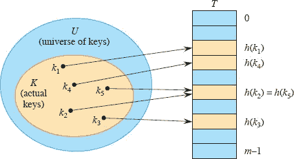

**`11`        哈希表**  

许多应用程序需要支持仅支持字典操作 `INSERT`、`SEARCH` 和 `DELETE` 的动态集合。例如，翻译编程语言的编译器维护一个符号表，其中元素的键是与语言中标识符对应的任意字符字符串。哈希表是实现字典的有效数据结构。尽管在哈希表中搜索元素可能与在链表中搜索元素一样耗时—在最坏情况下为Θ(n)时间—但在实践中，哈希表的性能非常好。在合理的假设下，搜索哈希表中元素的平均时间为 `O(1)`。事实上，Python 的内置字典是用哈希表实现的。  

哈希表概括了普通数组的简单概念。直接访问普通数组利用了任何数组元素的`O(1)`访问时间。第 11.1 节更详细地讨论了直接寻址。要使用直接寻址，您必须能够为每个可能的键分配一个位置的数组。

当实际存储的键的数量相对于可能的键的总数很小时，哈希表成为直接寻址数组的有效替代方案，因为哈希表通常使用与实际存储的键数量成比例的数组。我们不直接使用键作为数组索引，而是`计算`数组索引从键中。第 11.2 节介绍了主要思想，重点是“链接”作为处理“冲突”的一种方式，其中一个以上的键映射到相同的数组索引。第 11.3 节描述了如何使用哈希函数从键计算数组索引。我们提出并分析了基本主题的几种变体。第 11.4 节看看“开放寻址”，这是另一种处理冲突的方法。最重要的是，哈希是一种极其有效和实用的技术：基本字典操作平均只需要`O(1)`时间。第 11.5 节讨论了现代计算机系统的分层存储系统，并说明了如何设计在这种系统中运行良好的哈希表。

**11.1    直接寻址表**  

直接寻址是一种简单的技术，当键的宇宙`U`相对较小时效果很好。假设一个应用程序需要一个动态集合，其中每个元素都有一个来自宇宙`U = {0, 1, …, m - 1}`的不同键，其中`m`不是太大。

要表示动态集合，您可以使用一个数组，或称为`直接寻址表`，表示为`T[0 : m − 1]`，其中每个位置，或`槽`，对应于宇宙`U`中的一个键。图 11.1 说明了这种方法。槽`k`指向具有键`k`的集合中的元素。如果集合中不包含键`k`的元素，则`T[k] = NIL`。

字典操作 `DIRECT-ADDRESS-SEARCH`、`DIRECT-ADDRESS-INSERT` 和 `DIRECT-ADDRESS-DELETE` 在下一页上是很容易实现的。每个操作只需要`O(1)`时间。

对于一些应用程序，直接寻址表本身可以保存动态集合中的元素。也就是说，与其将元素的键和附加数据存储在直接寻址表外部的对象中，然后通过指向表中槽的指针保存对象，不如直接将对象存储在槽中。使用特殊键表示空槽。那么，为什么要存储对象的键呢？对象的索引`就是`它的键！当然，然后您需要一些方法来判断槽是否为空。

**图 11.1** 如何通过直接寻址表 `T` 实现动态集合。宇宙 `U` = {0, 1, …, 9} 中的每个键对应于表中的一个索引。实际键集合 `K` = {2, 3, 5, 8} 确定了包含指向元素的槽。其他槽，标记为蓝色，包含 NIL。

直接寻址搜索(`T`, `k`)

| \| 1 \| **返回** `T[k]` \| |
| --- |
| --- | --- |   |

直接寻址插入(`T`, `x`)

| 1 | `T[x.key] = x` |
| --- | --- |

直接寻址删除(`T`, `x`)

| 1 | `T[x.key] = NIL` |
| --- | --- |

**练习**

***`11.1-1`***

动态集合 `S` 由长度为 `m` 的直接寻址表 `T` 表示。描述一个找到 `S` 最大元素的过程。您的过程的最坏情况性能是什么？

`11.1-2`

一个`***位向量***`简单地是一个位数组（每个位为 0 或 1）。长度为 `m` 的位向量比 `m` 个指针的数组占用更少的空间。描述如何使用位向量来表示从集合 {0, 1, …, `m` − 1} 中抽取的不同元素的动态集合，且没有附加数据。字典操作应该在`O(1)`时间内运行。

***11.1-3***

建议如何实现一个直接寻址表，其中存储元素的键不需要是唯一的，元素可以有附加数据。所有三个字典操作（插入、删除和搜索）应该在`O(1)`时间内运行。（不要忘记，删除操作的参数是指向要删除的对象的指针，而不是键。）

★ `11.1-4`

假设您想要通过在一个`巨大`数组上使用直接寻址来实现字典。也就是说，如果数组大小为 `m`，并且字典在任一时刻最多包含 `n` 个元素，则 `m` ≫ `n`。在开始时，数组条目可能包含垃圾，并且由于其大小，初始化整个数组是不切实际的。描述一种在巨大数组上实现直接寻址字典的方案。每个存储的对象应该使用`O(1)`空间；搜索、插入和删除操作应该每个都需要`O(1)`时间；初始化数据结构应该需要`O(1)`时间。（*提示：*使用一个额外的数组，类似于栈，其大小是实际存储在字典中的键的数量，以帮助确定给定的巨大数组条目是否有效。）

**`11.2`    哈希表**

直接寻址的缺点显而易见：如果宇宙 `U` 很大或无限大，那么存储大小为 |`U`| 的表 `T` 可能是不切实际的，甚至在典型计算机上可用的内存下是不可能的。此外，实际存储的键集合 `K` 相对于 `U` 可能非常小，导致为 `T` 分配的大部分空间都被浪费了。

当字典中存储的键集合 `K` 远小于所有可能键的宇宙 `U` 时，哈希表所需的存储空间远小于直接寻址表。具体而言，存储需求降低到 Θ(|`K`|)，同时仍保持在哈希表中搜索元素仅需要 `O(1)` 时间的好处。问题在于这个界限是针对*平均情况时间*的，而对于直接寻址，它适用于*最坏情况时间*。

使用直接寻址，具有键 `k` 的元素存储在槽 `k` 中，但是使用哈希时，我们使用一个***哈希函数*** `h` 来从键 `k` 计算槽号，以便元素进入槽 `h(k)`。哈希函数 `h` 将键的宇宙 `U` 映射到哈希表 `T[0 : m − 1]` 的槽：  

*h* : *U* → {0, 1, …, *m* − 1},  输出：

其中哈希表的大小 `m` 通常远小于 |*U*|。我们说具有键 `k` 的元素***哈希到***槽 `h(k)`，我们也说 `h(k)` 是键 `k` 的***哈希值***。图 11.2 说明了基本思想。哈希函数减少了数组索引的范围，从而减小了数组的大小。数组的大小可以是 `m`，而不是 |*U*|。一个简单但不是特别好的哈希函数的例子是 `h(k) = k mod m`。

有一个问题，即两个键可能哈希到同一个槽。我们称这种情况为***碰撞***。幸运的是，有有效的技术来解决碰撞造成的冲突。

当然，理想的解决方案是完全避免碰撞。我们可以尝试通过选择合适的哈希函数`h`来实现这一目标。一个想法是使`h`看起来“随机”，从而避免碰撞或至少最小化其数量。术语“哈希”，唤起随机混合和切割的形象，捕捉了这种方法的精神。（当然，哈希函数`h`必须是确定性的，即给定输入`k`必须始终产生相同的输出`h(k)`。）然而，由于|*U*| > *m*，至少会有两个具有相同哈希值的键，因此完全避免碰撞是不可能的。因此，尽管设计良好的“随机”外观的哈希函数可以减少碰撞的数量，但我们仍然需要一种方法来解决发生的碰撞。  

**图 `11.2`** 使用哈希函数`h`将键映射到哈希表槽。因为键`k[2]`和`k[5]`映射到同一个槽，它们发生了碰撞。

本节的其余部分首先介绍了“独立均匀散列”的定义，这捕捉了哈希函数“随机”意味着什么的最简单概念。然后介绍并分析了最简单的冲突解决技术，称为链式。第 11.4 节介绍了一种解决冲突的替代方法，称为开放寻址。

**独立均匀散列**

“理想”的哈希函数`h`对于域`U`中的每个可能输入`k`，都有一个输出`h(k)`，该输出是从范围{0, 1, …, *m* − 1}中随机且独立均匀选择的元素。一旦随机选择了值`h(k)`，每次使用相同输入`k`调用`h`都会产生相同的输出`h(k)`。

我们称这样的理想哈希函数为`独立均匀哈希函数`。这样的函数通常也被称为`随机预言`[43]。当哈希表使用独立均匀哈希函数实现时，我们说我们正在使用`独立均匀散列`。

独立均匀散列是一个理想的理论抽象，但在实践中无法合理实现。尽管如此，我们将在假设独立均匀散列的情况下分析散列的效率，然后提出实现这一理想的有用实际近似方法。

  

**图 11.3** 链式冲突解决。每个非空哈希表槽`T[j]`指向一个链表，其中包含所有哈希值为`j`的键。例如，`h(k[1]) = h(k[4])`和`h(k[5]) = h(k[2]) = h(k[7])`。链表可以是单向的，也可以是双向的。我们展示为双向的，因为当删除过程知道要删除哪个列表元素（而不仅仅是哪个键）时，删除可能更快。

**链式冲突解决**

从高层次上看，你可以将链式哈希视为一种非递归的分治：`n`个元素的输入集随机分成大约大小为`n/m`的`m`个子集。哈希函数确定元素属于哪个子集。每个子集都作为一个列表独立管理。

图 11.3 展示了***链式***的思想：每个非空槽指向一个链表，所有哈希到同一槽的元素都放入该槽的链表中。槽`j`包含指向具有哈希值`j`的所有存储元素链表的头指针。如果没有这样的元素，则槽`j`包含 NIL。

当碰撞通过链接解决时，字典操作很容易实现。它们出现在下一页上，并使用来自第 10.2 节的链表程序。插入的最坏情况运行时间为`O(1)`。插入过程之所以快速，部分原因是它假设要插入的元素`x`尚未存在于表中。为了强制执行这一假设，您可以搜索（额外成本）一个键为`x.key`的元素再插入。对于搜索，最坏情况运行时间与列表长度成正比。（我们将在下面更仔细地分析这个操作。）如果列表是双向链接的，则删除需要`O(1)`时间，就像图 11.3 中那样。 （由于 CHAINED-HASH-DELETE 以元素`x`而不是其键`k`作为输入，因此不需要搜索。如果哈希表支持删除，则其链接列表应该是双向链接的，以便快速删除项目。如果列表只是单向链接的，那么根据练习 10.2-1，删除可能需要与列表长度成正比的时间。对于单向链接列表，删除和搜索将具有相同的渐近运行时间。）  

CHAINED-HASH-INSERT(`T`, `x`)

| 1 | `LIST-PREPEND(T[h(x.key)], x)` |   |
| --- | --- | --- |
| --- | --- |

CHAINED-HASH-SEARCH(`T`, `k`)

| 1 | **返回** LIST-SEARCH(`T[h(k)]`, `k`) |
| --- | --- |
| --- | --- |  输出： |

CHAINED-HASH-DELETE(`T, x`)

| 1 | LIST-DELETE(T[h(x.key)], x) | `   |
| --- | --- | --- | --- |
| \| --- \| --- \| |

**链式哈希分析**

哈希与链接的性能如何？特别是，搜索具有给定键的元素需要多长时间？

给定一个存储`n`个元素的`m`个槽的哈希表`T`，我们将`T`的***负载因子*** *α*定义为`T`的`n`/`m`，即链中存储的平均元素数量。我们的分析将根据 *α* 进行， *α* 可以小于、等于或大于 1。

哈希与链接的最坏情况行为很糟糕：所有`n`个键都哈希到同一个槽中，创建一个长度为`n`的列表。因此，搜索的最坏情况时间为 `Θ(n)`加上计算哈希函数的时间——不比使用一个链表存储所有元素好。显然，我们不会因为哈希表的最坏情况性能而使用它们。

哈希的平均情况性能取决于哈希函数`h`如何在`m`个槽中平均分布要存储的键集（这里的平均是指相对于要哈希的键的分布以及哈希函数的选择，如果这个选择是随机的）。第 11.3 节讨论了这些问题，但现在我们假设任何给定元素被哈希到任何一个`m`个槽中的概率是相等的。也就是说，哈希函数是***均匀的***。我们进一步假设给定元素哈希到哪里与其他元素哈希到哪里是`独立的`。换句话说，我们假设我们正在使用***独立均匀哈希***。

因为不同键的哈希被假定为独立的，独立均匀哈希是`通用的`：任意两个不同键*k*[1]和*k*[2]发生碰撞的概率最多为 1/*m*。通用性在我们的分析中很重要，也在哈希函数的通用族规范中很重要，我们将在第 11.3.2 节中看到。

对   对于*j* = 0, 1, …, *m* − 1，将列表`T[j]`的长度表示为`n[j]`得  

``  

`n[j]`的期望值为 `E[n[j]] = α = n/m`。

我们假设计算哈希值`h(k)`的时间为`O(1)`，因此搜索具有键`k`的元素所需的时间与列表`T[h(k)]`的长度`n[h(k)]`线性相关。暂时不考虑计算哈希函数和访问槽`h(k)`所需的`O(1)`时间，我们将考虑搜索算法检查的元素的预期数量，即算法检查列表`T[h(k)]`中的元素，看看是否有任何一个键等于`k`。我们考虑两种情况。首先，搜索失败：表中没有具有键`k`的元素。其次，搜索成功找到具有键`k`的元素。

***定理 11.1***

在解决冲突的哈希表中，假设独立均匀哈希的情况下，无法找到的搜索平均需要`Θ(1 + α)`时间。

***证明*** 在独立均匀哈希的假设下，任何尚未存储在表中的键`k`等可能哈希到`m`个槽中的任何一个。搜索键`k`失败的预期时间是搜索到列表`T[h(k)]`尾的预期时间，其预期长度为 E[n[h(k)]] = `α`。因此，无法找到的搜索中检查的元素的预期数量为`α`，总所需时间（包括计算`h(k)`的时间）为Θ(1 + `α`)。  

▪ 输出：

成功搜索的情况略有不同。无法找到的搜索等可能去哈希表的任何槽。然而，成功搜索不能去空槽，因为它是对一个链表中存在的元素进行的搜索。我们假设搜索的元素等可能是表中的任何一个元素，因此列表越长，搜索是其中一个元素的可能性就越大。即便如此，预期搜索时间仍然是Θ(`1 + α`)。  

***`定理 11.2`***

在解决冲突的哈希表中，成功搜索平均需要Θ(1 + *α*)时间，假设独立均匀哈希。

***证明*** 我们假设被搜索的元素等可能是表中存储的`n`个元素中的任何一个。在成功搜索元素`x`时检查的元素数量比`x`之前出现在列表中的元素数量多 1。因为新元素放在列表的前面，列表中`x`之前的元素都是在`x`插入之后插入的。设`x[i]`表示插入表中的第`i`个元素，对于`i = 1, 2, …, n`，令`k[i] = x[i].key`。  

我们的分析广泛使用指示器随机变量。对于表中的每个槽`q`和每对不同的键`k[i]`和`k[j]`，我们定义指示器随机变量

*X[ijq]* = I {搜索的是`x[i]`，`h(k[i])` = `q`，且`h(k[j])` = `q`}。  

也就是说，当键`k[i]`和`k[j]`在槽`q`处冲突且搜索的元素为`x[i]`时，`X[ijq]` = 1。因为 Pr{搜索的是`x[i]`} = 1/*n*，Pr{`h(k[i]) = q`} = 1/*m*，Pr{`h(k[j]) = q`} = 1/*m*，而且这些事件都是独立的，我们有 Pr{`X[ijq]` = 1} = 1/*nm*²。第 130 页的引理 5.1 给出 E[`X[ijq]`] = 1/*nm*²。

接下来，我们为每个元素`x[j]`定义指示器随机变量

| `Y[j]` | = | I {`x[j]` 出现在搜索元素之前的列表中} |
| --- | --- | --- |
| --- | --- | --- |   |
| \| \| = \| , \| |

因为`X[ijq]`中最多只有一个等于 1，即当被搜索的元素`x[i]`属于与`x[j]`相同的列表（由槽`q`指向），且`i` < `j`（使得`x[i]`在列表中出现在`x[j]`之后）时。

我们的最终随机变量是`Z`，它计算出在搜索元素之前列表中出现的元素数量：

因为我们必须计算正在搜索的元素以及其列表中所有先前的元素，所以我们希望计算 `E[Z + 1]`。使用期望的线性性（第 1192 页上的方程(C.24)），我们有

因此，成功搜索所需的总时间（包括计算哈希函数的时间）为`Θ(2 + α/2 - α/2*n)` = `Θ(1 + α)`。

▪  输出：

这个分析意味着什么？如果表中的元素数量最多与哈希表插槽数量成比例，我们有`n = O(m)`，因此`α = n/m = O(m)/m = O(1)`。因此，平均搜索时间为常数。由于插入在最坏情况下需要`O(1)`的时间，而删除在列表双向链接时也需要`O(1)`的最坏情况时间（假设已知要删除的列表元素，而不仅仅是其键），因此我们可以在平均`O(1)`时间内支持所有字典操作。

在前两个定理的分析中，只依赖于独立均匀哈希的两个基本属性：均匀性（每个键等可能地哈希到`m`个插槽中的任何一个）和独立性（因此，任何两个不同的键与概率`1/m`发生碰撞）。

**练习**

***`11.2-1`***  

你使用哈希函数`h`将`n`个不同的键哈希到长度为`m`的数组`T`中。假设独立均匀哈希，预期碰撞次数是多少？更准确地说，期望的{{*k*[1]，*k*[2]}的基数：*k*[1] ≠ *k*[2]且`h(*k*[1]) = h(*k*[2])`}是多少？

`11.2-2`

考虑一个具有 9 个插槽和哈希函数`h(k) = k mod 9`的哈希表。演示在插入键 `5`、`28`、`19`、`15`、`20`、`33`、`12`、`17`、`10` 时发生了什么，冲突通过链接解决。

`11.2-3`

马利教授假设通过修改链接方案以保持每个列表按排序顺序排列，可以获得显著的性能提升。教授的修改如何影响成功搜索、失败搜索、插入和删除的运行时间？  

`***11.2-4***`

建议如何通过创建“空闲列表”在哈希表内部分配和释放元素的存储：一个包含所有未使用插槽的链表。假设一个插槽可以存储一个标志和一个元素加一个指针或两个指针。所有字典和空闲列表操作应在`O(1)`的期望时间内运行。空闲列表是否需要双向链接，还是单向链接的空闲列表就足够了？

`11.2-5`

你需要在大小为`m`的哈希表中存储一组`n`个键。证明如果键来自具有|*U*| > (`n` − 1)`m`的宇宙`U`，那么`U`具有一个大小为`n`的子集，其中所有键都哈希到相同的插槽，因此哈希带链接的最坏情况搜索时间为 `Θ(n)`。

***11.2-6***

你已经在大小为`m`的哈希表中存储了`n`个键，通过链接解决冲突，并且知道每个链的长度，包括最长链的长度`L`。描述一种从哈希表中的键中均匀选择一个键并在期望时间`O(L · (1 + 1/α)`内返回它的过程。

**11.3    哈希函数**

要使哈希工作良好，需要一个好的哈希函数。除了高效计算外，好的哈希函数还具有哪些属性？如何设计好的哈希函数？  

本节首先尝试根据两种自适应方法来回答这些问题：除法哈希和乘法哈希。尽管这些方法对某些输入键集合效果很好，但它们受限于它们试图提供一个在任何数据上都表现良好的单一固定哈希函数的方法，这种方法称为***静态哈希***。

然后我们看到，通过设计适当的哈希函数`族`并在运行时从这个族中随机选择一个哈希函数，可以获得对`任何`数据的可证明良好的平均情况性能，而与要被哈希的数据无关。我们研究的方法称为随机哈希。一种特殊的随机哈希，称为通用哈希，效果很好。正如我们在第七章中看到的快速排序一样，随机化是一种强大的算法设计工具。

**什么是好的哈希函数？**  

一个好的哈希函数（大致上）满足独立均匀哈希的假设：每个键被哈希到任意一个`m`个槽中的概率相等，与其他键哈希到的位置无关。这里的“相等概率”是什么意思？如果哈希函数固定，任何概率都必须基于输入键的概率分布。

不幸的是，通常情况下你无法检查这个条件，除非你碰巧知道键是从哪个概率分布中抽取的。此外，键可能不是独立抽取的。

有时你可能知道分布。例如，如果你知道键是独立且均匀分布在范围 0 ≤ k < 1 的随机实数`k`，那么哈希函数

`h(k) = ⌊km⌋`  

满足独立均匀哈希条件。

一个好的静态哈希方法以一种你期望的方式派生哈希值，这种方式应该独立于数据中可能存在的任何模式。例如，“除法法”（在第 11.3.1 节中讨论）计算哈希值为键除以指定质数时的余数。如果你（某种方式）选择了一个与键的分布中的任何模式无关的质数，这种方法可能会产生良好的结果。

随机哈希，描述在第 11.3.2 节，从适当的哈希函数族中随机选择要使用的哈希函数。这种方法消除了对输入键概率分布的了解的需求，因为用于获得良好平均情况行为的随机化来自于用于从哈希函数族中随机选择哈希函数的（已知）随机过程，而不是来自于用于创建输入键的（未知）过程。我们建议您使用随机哈希。

**键是整数、向量或字符串**

在实践中，哈希函数设计用于处理以下两种类型的键之一：

+   适合于`w`位机器字的短的非负整数。`w`的典型值为 32 或 64。

+   一组短的非负整数向量，每个元素的大小有限。例如，每个元素可能是一个 8 位字节，此时向量通常称为（字节）字符串。向量的长度可能是可变的。

首先，我们假设键是短的非负整数。处理向量键更为复杂，详见第 11.3.5 节和 11.5.2 节。

**11.3.1    静态哈希**

静态哈希使用单一固定的哈希函数。唯一的随机化是通过（通常未知的）输入键的分布。本节讨论了静态哈希的两种标准方法：除法法和乘法法。虽然不再推荐使用静态哈希，但乘法法也为“非静态”哈希提供了良好的基础，更为人熟知的是随机哈希，其中哈希函数从适当的哈希函数族中随机选择。

**除法法**

用于创建哈希函数的`除法法`将键`k`映射到`m`个槽中的一个，方法是取`k`除以`m`的余数。也就是说，哈希函数是

`h(k) = k mod m`.  

例如，如果哈希表的大小`m` = 12，键为`k` = 100，那么`h(k)` = 4。由于只需要一次除法操作，通过除法哈希非常快。

当`m`是一个不太接近 2 的幂的素数时，除法方法可能效果良好。然而，并没有保证这种方法提供良好的平均性能，而且可能会使应用程序复杂化，因为它限制了哈希表的大小必须是素数。

**乘法方法**

用于创建哈希函数的一般***乘法方法***分为两步。首先，将键`k`乘以范围在 0 < `A` < 1 的常数`A`并提取`kA`的小数部分。然后，将这个值乘以`m`并取结果的底部。也就是说，哈希函数是 

`h(k) = ⌊m (kA mod 1)⌋，

其中“`kA` mod 1”表示`kA`的小数部分，即`kA` − ⌊`kA`⌋。一般乘法方法的优点是`m`的值并不关键，你可以独立选择它，不受如何选择乘法常数`A`的影响。

**图 11.4** 乘移位方法计算哈希函数。键`k`的`w`位表示乘以`w`位值`a = A · 2^w`。下半部分乘积的`ℓ`个最高位形成所需的哈希值`ha`。

**乘移位方法**

在实践中，乘法方法在哈希表槽数`m`是 2 的幂的特殊情况下表现最佳，即`m = 2^ℓ`，其中`ℓ ≤ w`，`w`是机器字中的位数。如果选择一个固定的`w`位正整数`a = A 2^w`，其中 0 < `A` < 1，如乘法方法中所述，使得`a`在范围 0 < `a` < 2^w，你可以在大多数计算机上实现函数如下。我们假设一个键`k`适合于单个`w`位字。  

参考图 11.4，首先将`k`乘以`w`位整数`a`。结果是一个 2`w`位值`r[1]2^w + r[0]`，其中`r[1]`是乘积的高阶`w`位字，`r[0]`是乘积的低阶`w`位字。所需的`ℓ`位哈希值由`r[0]`的`ℓ`个最高有效位组成。（由于`r[1]`被忽略，哈希函数可以在只产生两个`w`位输入的计算机上实现，即乘法运算对 2^w 取模。）  

换句话说，你定义哈希函数`h = h[a]`，其中

  

对于一个固定的非零`w`位值`a`。由于两个`w`位字的乘积`ka`占据 2`w`位，对这个乘积取模 2`^w`会将高阶`w`位清零（`r[1]`），只留下低阶`w`位（`r[0]`）。⋙运算符执行逻辑右移`w - ℓ`位，将 0 移入左侧的空位，使得`r[0]`的`ℓ`个最高有效位移入最右侧位置。（这等同于除以 2^(`w - ℓ`)并取结果的底部。）结果值等于`r[0]`的`ℓ`个最高有效位。哈希函数`h[a]`可以用三条机器指令实现：乘法、减法和逻辑右移。

举例，假设`k` = 123456，`ℓ` = 14，`m` = 2¹⁴ = 16384，`w` = 32。进一步假设我们选择`a` = 2654435769（根据 Knuth 的建议[261]）。那么`ka` = 327706022297664 = (76300 · 2³²) + 17612864，因此`r`[1] = 76300，`r`[0] = 17612864。`r`[0]的 14 个最高有效位产生值`h[a]`(`k`) = 67。

即使乘移位方法很快，也不能保证良好的平均性能。下一节介绍的通用哈希方法提供了这样的保证。当程序以随机选择的奇整数`a`开始时，乘移位方法的简单随机变体在平均情况下表现良好。

**11.3.2    随机哈希**

假设一个恶意对手选择由某个固定哈希函数进行哈希的键。然后对手可以选择`n`个键，使其全部哈希到同一个槽，导致平均检索时间为Θ(*n*)。任何静态哈希函数都容易受到这种可怕的最坏情况行为的影响。改善情况的唯一有效方法是以一种与实际要存储的键无关的方式*随机*选择哈希函数。这种方法称为***random hashing***。这种方法的一个特例称为***universal hashing***，可以在处理冲突时通过链式解决，无论对手选择哪些键，都可以在平均情况下提供可证明的良好性能。

要使用随机哈希，在程序执行开始时，您从适当的函数族中随机选择哈希函数。与快速排序的情况类似，随机化保证没有单个输入总是引发最坏情况行为。由于您随机选择哈希函数，即使对要进行哈希的相同键集合，算法在每次执行时的行为也可能不同，从而保证了良好的平均情况性能。

设`H`为一个有限的哈希函数族，将给定的键的宇宙`U`映射到范围{0, 1, …, `m` − 1}。如果对于`U`中的每对不同的键`k[1]`，`k[2]`，使得对于`H`中的哈希函数`h`，满足`h(k[1]) = h(k[2])`的数量最多为|`H`|/`m`，则称这样的族为***universal***。换句话说，从`H`中随机选择一个哈希函数，不同键`k[1]`和`k[2]`发生碰撞的概率不超过 1/`m`，如果`h(k[1])`和`h(k[2])`是从集合{0, 1, …, `m` − 1}中随机且独立选择的。

独立均匀哈希与从包含`m^n`个哈希函数的族中随机选择一个哈希函数是相同的，该族中的每个成员以不同的方式将`n`个键映射到`m`个哈希值。

每个独立均匀随机的哈希函数族都是 universal 的，但反之不一定成立：考虑`U = {0, 1, …, m - 1}`的情况，族中唯一的哈希函数是恒等函数。即使每个键都映射到一个固定值，两个不同键发生碰撞的概率为零。

对于第 279 页上定理 11.2 的以下推论表明，universal hashing 提供了期望的回报：对于对手来说，无法选择一系列操作来强制最坏情况下的运行时间。

***推论 11.3***

使用 universal 哈希和在初始空表中通过链式解决冲突，处理包含`n = O(m)`个插入操作的任意序列的`s`个插入、搜索和删除操作的期望时间为Θ(`s`)。

***证明***   插入和删除操作需要常数时间。由于插入次数`n`为`O(m)`，我们有`α = O(1)`。此外，每个搜索操作的期望时间为`O(1)`，可以通过检查定理 11.2 的证明来看出。该分析仅取决于碰撞概率，根据该定理中独立均匀哈希函数的选择，任意键`k[1]`，`k[2]`的碰撞概率为 1/`m`。在这里使用 universal 哈希函数族而不是使用独立均匀哈希会将碰撞概率从 1/`m`改变为最多 1/`m`。因此，根据期望的线性性，整个`s`个操作序列的期望时间为`O(s)`。由于每个操作需要Ω(1)时间，因此Θ(`s`)的界限成立。

▪ 输出：

**11.3.3    随机哈希的可实现属性**

有关哈希函数族`H`可能具有的属性以及它们与哈希效率的关系有丰富的文献。我们在这里总结了一些最有趣的内容。

设`H`是一个哈希函数族，每个哈希函数的定义域为`U`，值域为{0, 1, …, `m` − 1}，`h`是从`H`中随机选择的任意哈希函数。所提到的概率是对`h`的选择的概率。  

+   如果对于`U`中的任意键`k`和范围{0, 1, …, `m` − 1}中的任意槽`q`，`h(k) = q`的概率为 1/`m`，则哈希函数族`H`是***均匀***的。

+   如果对于`U`中的任意不同键`k[1]`和`k[2]`，`h(k[1]) = h(k[2])`的概率最多为 `1/m`，则哈希函数族`H`是***通用***的。

+   如果对于`U`中的任意不同键`k[1]`和`k[2]`，`h(k[1]) = h(k[2])`的概率最多为`ϵ`，那么哈希函数族`H`是***ϵ-通用***的。因此，通用哈希函数族也是 `1/m`-通用的。²

+   如果对于`U`中的任意不同键`k[1]`、`k[2]`、…、`k[d]`和任意槽`q[1]`、`q[2]`、…、`q[d]`（不一定不同）在{0, 1, …, `m` − 1}中，`h(k[i]) = q[i]`对`i = 1, 2, …, d`的概率为 `1/m^d`，则哈希函数族`H`是***d-独立***的。

通用哈希函数族特别引人关注，因为它们是支持对任何输入数据集进行高效哈希表操作的最简单类型。许多其他有趣和理想的特性，如上述所述，也是可能的，并且允许进行高效的专门哈希表操作。

**11.3.4    设计一个通用的哈希函数族**

本节介绍了两种设计通用（或`ϵ`-通用）哈希函数族的方法：一种基于数论，另一种基于第 11.3.1 节中介绍的随机化乘法位移方法的变体。第一种方法更容易证明是通用的，但第二种方法在实践中更快。

**基于数论的通用哈希函数族**

我们可以利用一些数论知识设计一个通用的哈希函数族。如果对数论中的基本概念不熟悉，可以参考第三十一章。

首先选择一个足够大的质数`p`，使得每个可能的键`k`都在 0 到`p` − 1 的范围内，包括`p`。我们假设这里的`p`有一个“合理”的长度。（有关处理长输入键的方法，如可变长度字符串的讨论，请参见第 11.3.5 节。）让ℤ*[p]*表示集合{0, 1, …, `p` − 1}，让表示集合{1, 2, …, `p` − 1}。由于`p`是质数，我们可以使用第三十一章中给出的方法在模`p`下解方程。由于键的宇宙大小大于哈希表中槽的数量（否则，只需使用直接寻址），我们有`p` > `m`。

给定任何``和任何*b* ∈ ℤ[*p*]，将哈希函数`h[ab]`定义为线性变换，然后通过模*p*和模*m*的减少：

例如，当`p` = 17 且`m` = 6 时，我们有

| `h3,4` | = | ((3 · 8 + 4) mod 17) mod 6 |
| --- | --- | --- |
|   | --- | --- | --- |
|  | = | (28 mod 17) mod 6 |
|  | ` = ` | 11 mod 6 | `   |
|  | = | 5. |

给定`p`和`m`，所有这样的哈希函数族是  

每个哈希函数`h[ab]`将ℤ`[p]`映射到ℤ`[m]`。这个哈希函数族具有一个很好的特性，即输出范围的大小`m`（也就是哈希表的大小）是任意的，不一定是质数。由于你可以从`p` − 1 个值中选择`a`和`p`个值中选择`b`，哈希函数族`H[pm]`包含`p(p - 1)`个哈希函数。

***`定理 11.4`***

由方程`(11.3)`和`(11.4)`定义的哈希函数族`H[pm]`是通用的。

***证明***   考虑`ℤ[p]`中的两个不同键`k[1]`和`k[2]`，使得`k[1] ≠ k[2]`。对于给定的哈希函数`h[ab]`，令

`r[1] = (ak[1] + b) mod p`

`r[2] = (ak[2] + b) mod p`。

首先注意到`r[1]` ≠ `r[2]`。为什么？因为我们有`r[1] - r[2] = a(k[1] - k[2]) (mod p)`，由此可知`r[1] ≠ r[2]`，因为`p`是质数，而`a`和(`k[1] - k[2]`)在模`p`下都不为零。根据第 908 页的定理 31.6，它们的乘积在模`p`下也必须不为零。因此，在计算任何`h[ab]` ∈ `H[pm]`时，不同的输入`k[1]`和`k[2]`映射到不同的值`r[1]`和`r[2]`在模`p`下，而在“模`p`级别”上还没有碰撞。此外，对于每对(`a`, `b`)，其中`a` ≠ 0 的`p(p - 1)`种选择都会产生不同的结果对(`r[1]`, `r[2]`)，其中`r[1] ≠ r[2]`，因为我们可以根据`r[1]`和`r[2]`解出`a`和`b`：

`a` = ((r - r[2])((k[1] - k[2])^(-1) mod p)) mod p,

`b = (r[1] - ak[1]) mod p`

其中((*k*[1] - *k*[2])^(-1) mod *p*)表示`k[1] - k[2]`在模`p`下的唯一乘法逆元。对于每个`r[1]`的`p`个可能值，只有`p` - 1 个`r[2]`的可能值不等于`r[1]`，从而只有`p`(p - 1)个可能的对(`r[1]`, `r[2]`)，其中`r[1] ≠ r[2]`。因此，对于每对不同的输入`k[1]`和`k[2]`，如果我们从中随机选择(`a`, `b`)，则得到的对(`r[1]`, `r[2]`)在模`p`下是任意一对不同值的可能性相等。

因此，不同键`k[1]`和`k[2]`碰撞的概率等于`r[1] = r[2]` (mod `m`)时的概率，其中`r[1]`和`r[2]`被随机选择为模`p`下的不同值。对于给定的`r[1]`的值，对于`r[2]`的`p - 1`个可能剩余值，`r[2]`的值不等于`r[1]`且`r[2] = r[1]` (mod `m`)的值的数量最多为

当`r[2]`在模`m`下减少时，`r[2]`与`r[1]`碰撞的概率最多为((`p` − 1)/`m`)/(`p` − 1) = 1/`m`，因为`r[2]`等可能地是与`r[1]`不同的`Z[p]`中的`p` − 1 个值之一，但最多有(`p` − 1)/`m`个值等价于`r[1]`模`m`。

因此，对于任意一对不同值`k[1]`，`k[2]` ∈ ℤ[`p`]，

`Pr{hab = hab} ≤ 1/m`

因此`H[pm]`确实是通用的。

▪  输出：

**基于乘移位方法的 2/*m*-通用哈希函数族**

我们建议在实践中使用基于乘移位方法的以下哈希函数族。它异常高效，并且（尽管我们省略了证明）可以证明是 `2/m`-通用的。定义 H 为具有奇数常数 `a` 的乘移位哈希函数族：  

***定理 11.5***

方程`(11.5)`给出的哈希函数族`H`是`2/m`-通用的。

▪

换句话说，任意两个不同键碰撞的概率最多为`2/m`。在许多实际情况下，计算哈希函数的速度超过了两个不同键碰撞的概率的上限，与通用哈希函数相比。

**11.3.5    处理长输入（如向量或字符串）的哈希**

有时哈希函数的输入非常长，以至于无法轻松地编码为合理大小的质数`p`或在 64 位的单词内编码。例如，考虑向量类，例如 8 位字节的向量（许多编程语言中字符串的存储方式）。向量的长度可能是任意非负长度，因此哈希函数的输入长度可能因输入而异。

**数论方法**

设计用于可变长度输入的良好哈希函数的一种方法是扩展第 11.3.4 节中使用的思想，以设计通用哈希函数。练习 11.3-6 探讨了一种这样的方法。

**加密哈希**

为变长输入设计一个良好的哈希函数的另一种方法是使用为加密应用设计的哈希函数。***密码哈希函数*** 是复杂的伪随机函数，设计用于需要超出此处所需属性的应用，但它们是强大的、广泛实现的，并可用作哈希表的哈希函数。

一个密码哈希函数将任意字节字符串作为输入，并返回固定长度的输出。例如，NIST 标准确定性密码哈希函数 SHA-256 [346] 为任何输入产生一个 256 位（32 字节）的输出。

一些芯片制造商在其 CPU 架构中包含指令，以提供一些加密函数的快速实现。特别感兴趣的是有效实现高级加密标准（AES）轮的指令，“AES-NI” 指令。这些指令执行速度在几十纳秒内，通常足够快以用于哈希表。基于 AES 和 AES-NI 指令的消息认证码，如基于 AES 的 CBC-MAC 和使用 AES-NI 指令，可能是一种有用且高效的哈希函数。我们在这里不进一步探讨专用指令集的潜在用途。

密码哈希函数很有用，因为它们提供了实现随机神谕的近似版本的方法。正如前面所指出的，随机神谕等同于独立均匀哈希函数族。从理论角度看，随机神谕是一个无法实现的理想：一个确定性函数，为每个输入提供随机选择的输出。因为它是确定性的，如果再次查询相同的输入，它将提供相同的输出。从实际角度看，基于密码哈希函数构建哈希函数族是随机神谕的合理替代品。

有许多方法可以使用密码哈希函数作为哈希函数。例如，我们可以定义

`h(k) = SHA-256(k) mod m`。

要定义这样的哈希函数族，可以在哈希输入之前添加“盐”字符串 `a`，如 

`ha = SHA-256(a ‖ k) mod m`

其中 `a` ‖ `k` 表示通过连接字符串 `a` 和 `k` 形成的字符串。消息认证码（MACs）的文献提供了额外的方法。

随着计算机将其内存组织为不同容量和速度的层次结构，基于密码的哈希函数设计方法变得更加实用。第 11.5 节 讨论了一种基于 RC6 加密方法的哈希函数设计。

**练习**

`11.3-1`

您希望搜索一个长度为 `n` 的链表，其中每个元素包含一个键 `k` 和一个哈希值 `h(k)`。每个键都是一个长字符字符串。在搜索具有给定键的元素时，您如何利用哈希值？

***11.3-2***

通过将字符串视为基数-128 数并使用除法方法，您可以将 `r` 个字符的字符串哈希到 `m` 个槽中。您可以将数字 `m` 表示为一个 32 位计算机字，但是将字符串 `r` 个字符视为基数-128 数需要多个字。如何应用除法方法计算字符字符串的哈希值，而不使用超出字符串本身的常数字数的存储空间？

`11.3-3`

考虑一种除法方法的版本，其中 `h(k) = k mod m`，其中 `m = 2^p - 1`，`k` 是以基数 `2^p` 解释的字符字符串。证明如果字符串 `x` 可以通过对其字符进行排列转换为字符串 `y`，则 `x` 和 `y` 哈希到相同的值。给出一个在哈希函数中不希望具有此属性的应用示例。

***`11.3-4`***  

考虑一个大小为 `m = 1000` 的哈希表和相应的哈希函数 `h(k) = ⌊m (kA mod 1)⌋` for 。计算键 `61`、`62`、`63`、`64` 和 `65` 被映射到的位置。

★ `11.3-5`

证明任何从有限集`U`到有限集`Q`的哈希函数的`ϵ`-通用家族 `H` 都具有`ϵ ≥ 1/|Q| − 1/|U|`。

★ `11.3-6`

令`U`为从ℤ*[p]*中抽取的值的`d`元组的集合，令`Q` = ℤ*[p]*，其中`p`是素数。对于来自`U`的输入`d`元组<`a[0]`, `a[1]`, …, `a[d−1]`>，定义哈希函数`h[b]` : `U` → `Q`，其中`b` ∈ ℤ*[p]*，如下所示

让 `H = {h[b] : b ∈ ℤ[p]}`。证明 H 对于`ϵ = (d - 1)/p`是`ϵ`-通用的。(*提示:* 参见练习 31.4-4。)

**11.4    开放寻址法**

本节描述了开放寻址法，这是一种冲突解决方法，与链接不同，它不使用哈希表之外的存储空间。在***开放寻址法***中，所有元素都占据哈希表本身。也就是说，每个表项要么包含动态集合的一个元素，要么是 NIL。与链接不同，没有列表或元素存储在表外。因此，在开放寻址法中，哈希表可能“填满”，以至于无法进行进一步的插入。一个结果是负载因子`α`永远不会超过 1。

处理冲突的方法如下：当要将新元素插入表中时，如果可能，将其放在“首选”位置。如果该位置已被占用，则将新元素放在“次选”位置。该过程持续进行，直到找到一个空槽来放置新元素。不同的元素对于位置有不同的优先顺序。

要搜索一个元素，有序地检查该元素的首选表槽，按照优先级递减的顺序，直到找到所需的元素或找到一个空槽，从而验证元素不在表中。

当然，你可以使用链接并将链表存储在哈希表内部，存储在未使用的哈希表槽中（参见练习 11.2-4），但开放寻址的优势在于完全避免了指针。不需要跟随指针，而是计算要检查的槽位序列。通过不存储指针释���的内存提供了更多的槽位，从而在相同的内存量中提供了更少的冲突和更快的检索。

使用开放寻址法进行插入，连续地检查或`探测`哈希表，直到找到一个空槽来放置密钥。与顺序 0, 1, …, *m* − 1（这意味着Θ(*n*)的搜索时间）不同，被探测的位置序列取决于要插入的密钥。为了确定要探测的槽位，哈希函数包括探测编号（从 0 开始）作为第二个输入。因此，哈希函数变为

`h : U × {0, 1, …, m - 1} → {0, 1, …, m - 1}.`

开放寻址法要求对于每个密钥`k`，***探测序列*** <`h(k, 0)`, `h(k, 1)`, …, `h(k, m - 1)`>是<0, 1, …, `m - 1`>的一个排列，以便在表填满时，每个哈希表位置最终被考虑为新密钥的槽位。以下一页的 HASH-INSERT 过程假定哈希表`T`中的元素是没有卫星信息的密钥：密钥`k`与包含密钥`k`的元素相同。每个槽位要么包含一个密钥，要么是 NIL（如果槽位为空）。HASH-INSERT 过程接受哈希表`T`和假定不在哈希表中的密钥`k`作为输入。它要么返回存储密钥`k`的槽位号，要么因为哈希表已满而标志错误。

`HASH-INSERT(T, k)`

| `1` | `i = 0` |   |
| --- | --- |
| `2` | **重复** |
| 3 | `q = h(k, i)` |
| `4` | **如果** `T[q] == NIL` |
| 5 | `T[q] = k` |
| `6` | **返回** `q` |   |
| `7` | **否则** *i* = *i* + 1 |   |
| 8 | **直到** `i` == `m` |
| 9 | **错误** “哈希表溢出” |

HASH-SEARCH(`T, k`)

| 1 | `i = 0` |   |
| --- | --- | --- |
| --- | --- |   |
| `2` | **重复** |
| 3 | `q = h(k, i)` |   |
| \| 4 \| **如果** `T[q] == k` \|   |
| 5 | **返回** `q` |
| `6` | `i = i + 1` |   |
| `7` | **直到** `T[q] == NIL` 或 `i == m` |   |
| 8 | **返回** NIL |

搜索键 `k` 的算法会探测与插入算法检查的相同序列的槽位。因此，当搜索发现一个空槽位时，搜索可以终止（失败），因为 `k` 应该已经被插入到那里，而不是在其探测序列的后面。HASH-SEARCH 过程接受哈希表 `T` 和一个键 `k` 作为输入，如果发现槽位 `q` 包含键 `k`，则返回 `q`，如果键 `k` 不在表 `T` 中，则返回 NIL。

从开放寻址哈希表中删除元素是棘手的。当你从槽位 `q` 中删除一个键时，简单地在其中存储 NIL 来标记该槽位为空是错误的。如果这样做，你可能无法检索到任何一个在插入键 `k` 时，槽位 `q` 被探测并发现被占用的键 `k`。解决这个问题的一种方法是标记该槽位，将特殊值 DELETED 存储在其中而不是 NIL。然后，HASH-INSERT 过程必须将这样的槽位视为空，以便可以在其中插入一个新的键。在搜索时，HASH-SEARCH 过程会跳过包含 DELETED 值的槽位，因为在插入搜索的键时，这些槽位已经被填充。然而，使用特殊值 DELETED 意味着搜索时间不再取决于负载因子 `α`，因此当需要删除键时，链式解决冲突技术经常被选择。有一种简单的开放寻址的特殊情况，线性探测，它避免了需要用 DELETED 标记槽位的必要性。第 11.5.1 节展示了在使用线性探测时如何从哈希表中删除元素。

在我们的分析中，我们假设`独立均匀排列哈希`（在文献中也混淆地称为`均匀哈希`）：每个键的探测序列等可能地是<0, 1, …, *m* − 1>的 *m*! 排列之一。独立均匀排列哈希将早期定义的独立均匀哈希的概念推广到一个哈希函数，它不仅产生单个槽位号，而且产生整个探测序列。然而，真正的独立均匀排列哈希很难实现，在实践中使用合适的近似方法（如下面定义的双重散列）。

我们将同时研究双重散列和其特殊情况，线性探测。这些技术保证对于每个键 `k`，<`h(k, 0)`, `h(k, 1)`, …, `h(k, m - 1)`>是<0, 1, …, `m` - 1>的一个排列。（回想一下，哈希函数 `h` 的第二个参数是探测次数。）然而，双重散列和线性探测都不符合独立均匀排列哈希的假设。双重散列不能生成超过 `m²` 不同的探测序列（而不是独立均匀排列哈希所需的 `m`!）。尽管如此，双重散列有大量可能的探测序列，并且正如你所期望的那样，似乎给出了良好的结果。线性探测更加受限，只能生成 `m` 种不同的探测序列。

`双重散列`

双重散列是开放寻址中最好的方法之一，因为生成的排列具有许多类似随机选择排列的特征。`双重散列` 使用形式为

`h(k, i) = (h1 + ih2) mod m`,  

其中 `h[1]` 和 `h[2]` 都是***辅助哈希函数***。初始探测到位置 `Th[1]`，连续的探测位置从前一个位置偏移 `h2 mod m`。因此，这里的探测序列依赖于键 `k` 的两种方式，因为初始探测位置 `h1`，步长 `h2`，或两者都可能变化。图 11.5 给出了双重散列插入的示例。

为了搜索整个哈希表，值`h*2`必须与哈希表大小`m`互质。（参见练习 11.4-5。）确保这个条件的一个方便方法是让`m`成为 2 的幂，并设计`h[2]`以便它总是产生奇数。另一种方法是让`m`为质数，并设计`h[2]`以便它总是返回小于`m`的正整数。例如，您可以选择质数`m`并让

**图 11.5** 双重散列插入。哈希表大小为 13，`h1 = k mod 13`，`h2 = 1 + (k mod 11)`。由于 14 = 1 (mod 13)且 14 = 3 (mod 11)，关键字 14 进入空槽 9，之前检查槽 1 和槽 5 已被占用。

`h1 = k mod m`

`h2 = 1 + (k mod m′)`

其中`m`′选择略小于`m`（比如，`m` − 1）。例如，如果`k` = 123456，`m` = 701，`m`′ = 700，则`h`1 = 80，`h`2 = 257，因此第一个探测到位置 80，连续的探测检查每 257 个槽（模`m`），直到找到关键字或检查了每个槽。

尽管除了质数或 2 的幂之外的`m`值原则上可以与双重散列一起使用，但实际上要有效地生成`h*2`（除了选择`h*2 = 1`（这会导致线性探测）之外）变得更加困难，因为相对密度`ϕ(m)/m`对于一般的`m`可能很小（参见第 921 页的方程式（31.25））。  

当`m`是质数或 2 的幂时，双重散列产生Θ(`m²`)探测序列，因为每个可能的(*h*1, *h*2)对都产生一个不同的探测序列。因此，对于这些`m`值，双重散列似乎表现接近于独立均匀排列散列的“理想”方案。

**线性探测**

***线性探测***，双重散列的特例，是解决冲突的最简单的开地址方法。与双重散列一样，辅助哈希函数`h[1]`确定插入元素的第一个探测位置`h1`。如果槽`T[h[1]]`已被占用，则探测下一个位置`T[h[1 + 1]]`。必要时继续，直到槽`T[m - 1]`，然后绕回到槽`T[0]`、`T[1]`等，但永远不要超过槽`T[h[1 - 1]]`。将线性探测视为双重散列的特例，只需将双重散列步骤函数`h[2]`固定为 1：`h2 = 1` 对于所有`k`。也就是说，哈希函数为 

对于`i = 0, 1, …, m − 1`。*h*1 的值确定整个探测序列，因此假设*h*1 可以在{0, 1, …, m − 1}中的任何值，线性探测只允许*m*个不同的探测序列。

我们将在第 `11.5.1` 节中重新讨论线性探测。

**开地址散列的分析**

就像我们在第 11.2 节中对链接的分析一样，我们将开地址散列的分析转化为哈希表的负载因子`α = n/m`。使用开地址法，每个槽最多只有一个元素，��此`n ≤ m`，这意味着`α ≤ 1`。以下分析要求`α`严格小于 1，因此我们假设至少有一个槽为空。由于从开地址哈希表中删除并不真正释放槽，我们也假设没有删除发生。

对于哈希函数，我们假设独立均匀排列哈希。在这种理想化的方案中，用于插入或搜索每个键`k`的探测序列 <`h(k, 0)`, `h(k, 1)`, …, `h(k, m - 1)`> 被认为是 <0, 1, …, `m` - 1> 的任何排列同等可能。当然，任何给定的键都有一个与之关联的唯一固定的探测序列。这里我们的意思是，考虑到键空间上的概率分布和哈希函数对键的操作，每个可能的探测序列同等可能。  

现在我们分析在独立均匀排列哈希的假设下，使用开地址探测哈希时的期望探测次数，从不成功搜索的情况开始（假设，如上所述，`α` < 1）。

所证明的界限，`1/(1 − α)` = 1 + α + α² + α³ + ⋯，有一个直观的解释。第一次探测总是发生。以大约α的概率，第一次探测找到一个占用的插槽，所以第二次探测发生。以大约α²的概率，前两个插槽都被占用，所以第三次探测发生，依此类推。

***定理 11.6***  

在负载因子`α = n/m < 1`的开地址哈希表中，假设独立均匀排列哈希和没有删除，不成功搜索中的期望探测次数最多为 `1/(1 - α)`。

***证明***   在不成功搜索中，除了最后一个探测访问一个不包含所需键的占用插槽外，每个探测都是如此。让随机变量`X`表示在不成功搜索中进行的探测次数，并定义事件`A[i]`，对于`i = 1, 2, …`，表示第`i`次探测发生且是到一个占用插槽。那么事件{`X` ≥ `i`}是事件`A[1] ⋂ A[2] ⋂ ⋯ ⋂ A[i−1]`的交集。我们通过限制 Pr{`A[1] ⋂ A[2] ⋂ ⋯ ⋂ A[i−1]`}来限制 Pr{`X` ≥ `i`}。根据第 1190 页上的练习 C.2-5，

| `Pr{A[1] ⋂ A[2] ⋂ ⋯ ⋂ A[i−1]}` | = | `Pr{A[1]}` · `Pr{A[2] | A[1]}` · `Pr {A[3] | A[1] ⋂ A[2]}` ⋯ |
| --- | --- | --- | --- | --- |
| --- | --- | --- |
| \|  \|  \| `Pr{A[i-1] | A[1] ⋂ A[2] ⋂ ⋯ ⋂ A[i-2]}`. |   |

由于有`n`个元素和`m`个插槽，Pr{*A*[1]} = `n`/`m`。对于`j` > 1，假设前`j` − 1 次探测都是到占用的插槽，那么第`j`次探测到一个占用插槽的概率是(`n` − `j` + 1)/(`m` − `j` + 1)。这个概率的推导是因为第`j`次探测会在剩余的(`n` − (`j` − 1))个元素中的一个和(`m` − (`j` − 1))个未检查的插槽中找到，根据独立均匀排列哈希的假设，概率就是这些数量的比值。由于`n` < `m`意味着对于范围在 0 ≤ `j` < `m`的所有`j`，(`n` − `j`)/(`m` − `j`) ≤ `n`/`m`，因此对于范围在 1 ≤ `i` ≤ `m`的所有`i`，我们有

第一行的乘积有`i - 1`个因子。当`i = 1`时，乘积为 1，乘法的单位元，我们得到 Pr{*X* ≥ 1} = 1，这是有道理的，因为至少必须有 1 次探测。如果前`n`次探测都是到占用的插槽，那么所有占用的插槽都已经被探测过。然后，第(`n` + 1)次探测必须是到一个空插槽，这导致 Pr{*X* ≥ *i*} = 0 对于*i* > *n* + 1。现在，我们使用第 1193 页上的方程(C.28)来限制期望的探测次数：

▪  输出：

如果`α`是一个常数，定理 11.6 预测不成功搜索的运行时间为`O(1)`。例如，如果哈希表是一半满的，不成功搜索中的平均探测次数最多为 `1/(1 − .5) = 2`。如果它是 90%满的，平均探测次数最多为 `1/(1 − .9) = 10`。

定理 11.6 几乎立即揭示了 `HASH-INSERT` 过程的性能。

***推论 11.7***

在负载因子`α` < 1 的情况下，向负载因子为`α`的开地址哈希表中插入元素平均需要最多 `1/(1 − α)` 次探测，假设独立均匀排列哈希和没有删除。

***证明*** 仅当表中有空间时才插入元素，因此`α` < 1。插入一个键需要进行不成功搜索，然后将键放入找到的第一个空插槽中。因此，期望探测次数最多为 `1/(1 − α)`。

▪ 输出：

计算成功搜索的期望探测次数需要更多工作。

`定理 11.8`

给定负载因子`α` < 1 的开放寻址哈希表，成功搜索的期望探测次数最多为

假设独立均匀排列哈希且没有删除，并假设表中的每个键被搜索的可能性相等。

***证明*** 搜索键`k`会重现插入键`k`时的相同探测序列。如果`k`是插入哈希表的第(`i` + 1)个键，则插入时的负载因子为`i/m`，因此根据推论 11.7，搜索`k`的期望探测次数最多为 1/(1 − `i/m`) = `m/(m - i)`。对哈希表中的所有`n`个键进行平均得到成功搜索的期望探测次数：

▪  输出：

如果哈希表填充率为一半，成功搜索的期望探测次数小于 `1.387`。如果哈希表填充率为 `90%`，期望探测次数小于 `2.559`。如果`α = 1`，则在不成功搜索时，必须探测所有`m`个插槽。练习 `11.4-4` 要求你分析当`α = 1` 时的成功搜索。  

**`练习`**

`11.4-1`

考虑将键 `10, 22, 31, 4, 15, 28, 17, 88, 59` 插入长度为 *m* = 11 的哈希表中，使用线性探测和双重哈希插入这些键，其中 *h*(*k*, *i*) = (*k* + *i*) mod *m*，*h*1 = *k*，*h*2 = 1 + (*k* mod (*m* − 1))。

`11.4-2`  

编写 `HASH-DELETE` 的伪代码，将删除的键的插槽填充为特殊值 `DELETED`，并根据需要修改 `HASH-SEARCH` 和 `HASH-INSERT` 以处理 `DELETED`。

***`11.4-3`***  

考虑一个具有独立均匀排列哈希和无删除的开放寻址哈希表。给出当负载因子为 `3/4` 和 `7/8` 时，不成功搜索的期望探测次数的上界，以及成功搜索的期望探测次数的上界。

***`11.4-4`***

证明当`α = 1`（即`n = m`）时，成功搜索所需的期望探测次数为`H[m]`，第`m`个调和数。

★ `11.4-5`

证明，使用双重哈希，如果`m`和`h2` 对于某个键`k`具有最大公约数`d` ≥ 1，则键`k`的不成功搜索在返回到插槽`h1` 之前检查了哈希表的(1/`d`)部分。因此，当`d` = 1 时，即`m`和`h2` 互质时，搜索可能检查整个哈希表。（*提示:* 参见第三十一章。）

★ `11.4-6`  

考虑一个具有负载因子`α`的开放寻址哈希表。近似非零值`α`，使得不成功搜索的期望探测次数等于成功搜索的期望探测次数的两倍。使用定理 11.6 和 11.8 给出的期望探测次数的上界。  

**11.5 实际考虑**

高效的哈希表算法不仅具有理论意义，而且具有巨大的实际重要性。常数因子很重要。因此，本节讨论了现代 CPU 的两个方面，这些方面不包括在第 2.2 节中介绍的标准 RAM 模型中：  

**内存层次结构：** 现代 CPU 的内存具有多个级别，从快速寄存器，通过一个或多个级别的`缓存内存`，到主存储器级别。每个后续级别存储的数据量比前一个级别更多，但访问速度更慢。因此，一个完全在快速寄存器中进行的复杂计算（如复杂的哈希函数）所需的时间可能比从主存储器中读取的单个操作所需的时间少。此外，缓存内存以每个（比如）64 字节的`缓存块`组织，总是一起从主存储器中获取。确保内存使用是局部的有很大好处：重用相同的缓存块比从主存储器中获取不同的缓存块更有效率。

标准 RAM 模型通过计算探测的哈希表槽数量来衡量哈希表操作的效率。实际上，这个度量标准只是对真相的粗略近似，因为一旦缓存块在缓存中，对该缓存块的连续探测比必须访问主存储器的探测要快得多。

**高级指令集：** 现代 CPU 可能具有实现加密或其他形式密码学有用的高级原语的复杂指令集。这些指令在设计非常高效的哈希函数时可能会很有用。

第 11.5.1 节讨论了线性探测，在存在内存层次结构时成为首选的冲突解决方法。第 11.5.2 节建议如何基于密码原语构建“高级”哈希函数，适用于具有分层内存模型的计算机。

**11.5.1 线性探测**  

线性探测经常因在标准 RAM 模型中性能较差而受到贬低。但在内存层次结构中，线性探测表现出色，因为连续的探测通常是对同一缓存块的内存。

**线性探测删除**

线性探测通常不被实际使用的另一个原因是，删除似乎很复杂或不可能，而不使用特殊的 DELETED 值。然而，我们现在将看到，即使没有 DELETED 标记，基于线性探测的哈希表的删除并不那么困难。删除过程适用于线性探测，但不适用于一般的开地址探测，因为使用线性探测，所有键都遵循相同的简单循环探测序列（尽管起始点不同）。

删除过程依赖于线性探测哈希函数`h(k, i)` = `(h1 + i)` mod `m`的“逆”函数，它将键`k`和探测号`i`映射到哈希表中的槽号。逆函数`g`将键`k`和槽号`q`（其中 0 ≤ `q` < `m`）映射到到达槽`q`的探测号：

`g(k, q) = (q - h1) mod m`

如果`h(k, i)` = `q`，那么`g(k, q)` = `i`，因此`h(k, g(k, q))` = `q`。

本页上的 `LINEAR-PROBING-HASH-DELETE` 过程从哈希表`T`中删除存储在位置`q`中的键。图 11.6 展示了它的工作原理。该过程首先通过在第 2 行将`T[q]`设置为 NIL 来删除位置`q`中的键。然后搜索包含应移动到刚刚由键`k`空出的位置`q`的键的槽`q′`（如果有的话）。第 9 行提出了一个关键问题：键`q′`中的`k′`是否需要移动到空出的位置`q`以保持`k′`的可访问性？如果`g(k′, q) < g(k′, q′)`，那么在将`k′`插入表中时，槽`q`已经被检查，但发现已经被占用。但现在，搜索将在空的槽`q`中寻找`k′`。在这种情况下，键`k′`在第 10 行移动到槽`q`，搜索继续，看看是否还有其他键需要移动到刚刚`k′`移动的槽`q′`。

**图 11.6** 使用线性探测的哈希表中的删除。哈希表大小为 10，`h1 = k mod 10`。**(a)** 在顺序插入键 `74、43、93、18、82、38、92` 后的哈希表。**(b)** 从槽 3 中删除键 `43` 后的哈希表。键 `93` 上移到槽 3 以保持可访问性，然后键 `92` 上移到刚刚被键 `93` 占据的槽 5。不需要移动其他键。

线性探测哈希删除(`T, q`)

|   1 | **当** `TRUE` **时** |  |   |
| --- | --- | --- |
|   2 | `T[q] = NIL` | **//** 使槽`q`为空 |   |
|   3 | `q' = q` | **//** 搜索的起始点 |
| `4` | **重复** |  |   |
|   5 | `q′ = (q′ + 1) mod m` | **//** 使用线性探测的下一个槽号 |
| `6` | *k*′ = *T*[*q*′] | **//** 下一个要尝试移动的键 |   |
|   7 | **如果** `k' == NIL` |  |
|   8 | **返回** | **//** 当找到一个空槽时返回 |
|   9 | **直到** `g(k′, q) < g(k′, q′)` | **//** 空槽*q*之前是否探测过*q*′？ |
| 10 | `T[q] = k'` | **//** 将`k'`移入槽`q` |
| `11` | `q = q′` | **//** 释放槽*q*′ |

**线性探测的分析**

线性探测是一种流行的实现方式，但它表现出一种被称为`主要聚类`的现象。长时间占用的槽会增加，平均搜索时间会增加。聚类是因为空槽之前有*i*个满槽而导致下一个槽被填充的概率为(*i* + 1)/*m*。长时间占用的槽往往会变得更长，平均搜索时间会增加。  

在标准 RAM 模型中，主要聚类是一个问题，通常一般双重散列的性能优于线性探测。相比之下，在分层内存模型中，主要聚类是一个有益的特性，因为元素通常存储在同一缓存块中。搜索在前进到下一个缓存块之前通过一个缓存块进行。使用线性探测，对于键`k`的 HASH-INSERT、HASH-SEARCH 或 LINEAR-PROBING-HASH-DELETE 的运行时间最多与从`h1`到下一个空槽的距离成比例。

下面的定理归功于 Pagh 等人`[351]`。Thorup`[438]`给出了一个更近期的证明。我们在这里省略了证明。需要 5-独立性并不是显而易见的；请参阅引用的证明。

***`定理 11.9`***

如果`h[1]`是 5-独立的且`α` ≤ 2/3，则使用线性探测在哈希表中搜索、插入或删除键的预期时间是常数时间。  

▪

(实际上，对于`α = 1 − ϵ`，预期操作时间为`O`(1/`ϵ` ²)。)

★ **11.5.2 用于分层内存模型的哈希函数**

本节展示了在具有内存层次结构的现代计算机系统中设计高效哈希表的方法。

由于内存层次结构，线性探测是解决冲突的一个很好的选择，因为探测序列是连续的并且倾向于保持在缓存块内。但是当哈希函数复杂时（例如，如定理 11.9 中的 5-独立性），线性探测是最有效的。幸运的是，有了内存层次结构意味着复杂的哈希函数可以被高效实现。

如第 11.3.5 节所述，一种方法是使用诸如 SHA-256 之类的加密哈希函数。这些函数对于哈希表应用来说既复杂又足够随机。在具有专用指令的机器上，加密函数可以非常高效。

相反，我们在这里提出了一种仅基于加法、乘法和交换字的一半的简单哈希函数。这个函数可以完全在快速寄存器中实现，在具有内存层次结构的机器上，与访问哈希表的随机槽所需的时间相比，其延迟很小。它与 RC6 加密算法有关，并且在实际目的上可以被视为“随机预言”。

**微哈希函数**  

让 `w` 表示机器的字大小（例如，`w` = 64），假定为偶数，并且让 `a` 和 `b` 为 `w` 比特无符号（非负）整数，其中 `a` 为奇数。让 swap(`x`) 表示交换 `w` 比特输入 `x` 的两个 `w`/2 比特部分的 `w` 比特结果。也就是说，

`swap(x) = (x ⋙ (w/2)) + (x ⋘ (w/2))`

其中“`⋙`”表示“逻辑右移”（如方程`（11.2）`中所示），“`⋘`”表示“左移”。定义

`fa = swap((2*k*² + ak) mod 2^w)`.

因此，要计算 `fa`，评估二次函数 2*k*² + *ak* 对 2*^w* 取模，然后交换结果的左右半部分。  

让 `r` 表示计算哈希函数“轮数”的期望值。我们将使用 `r` = 4，但哈希函数对于任何非负 `r` 都是明确定义的。用  表示迭代 `f[a]` 共 `r` 次（即 `r` 轮）的结果（即从输入值 `k` 开始）。对于任何奇数 `a` 和任何 `r` ≥ 0，函数 ，尽管复杂，是一对一的（参见练习 11.5-1）。密码学家会将  视为在 `w` 比特输入块上运行的简单分组密码，具有 `r` 轮和密钥 `a`。  

我们首先为短输入定义微型哈希函数 `h`，其中“短”意味着“其长度 `t` 最多为 `w` 比特”，以便输入适合一个计算机字。我们希望不同长度的输入被不同方式哈希。参数为 `a`、`b` 和 `r` 的 ***微型哈希函数*** `h_a,b,t,r`，对于 `t` 比特输入 `k` 定义为  输出：

``  

也就是说，对于 `t` 比特输入 `k` 的哈希值是通过将  应用于 `k` + `b`，然后取最终结果对 `m` 取模得到的。添加值 `b` 提供了输入的哈希相关随机化，以确保对于可变长度输入，长度为 0 的输入没有固定的哈希值。将值 2*t* 添加到 `a` 确保哈希函数对不同长度的输入有不同的作用。 （我们使用 2*t* 而不是 `t` 是为了确保如果 `a` 是奇数，则密钥 `a` + 2*t* 是奇数。）我们将这个哈希函数称为“微型”，因为它使用了极少量的内存——更准确地说，它可以仅使用计算机的快速寄存器高效实现。（这个哈希函数在文献中没有名称；这是我们为本教材开发的一个变体。）

**微型哈希函数的速度**  

令人惊讶的是，通过局部性可以获得多少效率。实验（作者未发表）表明，评估微型哈希函数所需的时间比在哈希表中探测一个`单个`随机选择的插槽要少。这些实验是在一台笔记本电脑（2019 款 MacBook Pro）上运行的，其中 `w` = 64，`a` = 123。对于大型哈希表，评估微型哈希函数比执行哈希表的单次探测快 2 到 10 倍。

**`可变长度输入的微型哈希函数`**

有时输入很长——超过一个 `w` 比特字的长度——或者长度可变，如 第 11.3.5 节 中所讨论的。我们可以将上面定义的微型哈希函数扩展到处理长或可变长度的输入。以下是一种方法。  

假设输入 `k` 的长度为 `t`（以比特为单位）。将 `k` 分解为一个由 `w` 比特字组成的序列 <`k[1]`，`k[2]`，…，`k[u]`>，其中 `u` = ⌈`t/w`⌉，`k[1]` 包含 `k` 的最低有效 `w` 比特，`k[u]` 包含最高有效比特。如果 `t` 不是 `w` 的倍数，则 `k[u]` 包含少于 `w` 比特，此时，用 0 比特填充 `k[u]` 中未使用的高阶比特。定义函数 chop 返回 `k` 中的 `w` 比特字序列：

chop(`k`) = <`k[1]`，`k[2]`，…，`k[u]`>。

chop 操作最重要的特性是它是一对一的，给定`t`：对于任意两个`t`位密钥`k`和`k'`，如果`k ≠ k'`，则 chop(`k`) ≠ chop(`k'`)，并且`k`可以从 chop(`k`)和`t`中推导出来。chop 操作还具有一个有用的特性，即单字输入密钥产生单字输出序列：chop(`k`) = <`k`>。

有了 chop 函数，我们可以如下指定输入为`*t*`位的微型哈希函数`h*a*,*b*,*t*,*r*`：

`h*a*,*b*,*t*,*r* = WEE(k, a, b, t, r, m)`

在这里，WEE 程序在前���页定义的过程中遍历由 `chop(k)` 返回的 `w` 位字的元素，将  应用于当前字 `k[i]` 和到目前为止计算的哈希值的总和，最终返回取模 `m` 的结果。这个定义适用于可变长度和长（多字）输入，是方程式`(11.7)`中短（单字）输入定义的一致扩展。对于实际使用，我们建议 `a` 是随机选择的奇数 `w` 位字， `b` 是随机选择的 `w` 位字，且 `r = 4`。  

注意，微型哈希函数实际上是一个哈希函数族，由参数`a`、`b`、`t`、`r`和`m`确定各个哈希函数。微型哈希函数族对于可变长度输入的（近似）5-独立性可以根据微型哈希函数是一个随机预言和密码块链接消息认证码（CBC-MAC）的安全性进行论证，这是由 Bellare 等人研究的[42]。这里的情况实际上比文献中研究的情况更简单，因为如果两个消息的长度不同`*t*`和`t*`′，那么它们的“密钥”也是不同的：`a + 2*t ≠ a + 2*t*`′。我们省略了细节。

`WEE(k, a, b, t, r, m)`

| 1 | `u = ⌈t/w⌉` |   |
| --- | --- |
| `2` | <`k[1]`, `k[2]`, …, `k[u]`> = chop(`k`) |   |
| 3 | q = b |
| `4` | **对于** `i` = `1` **到** `u` |  |
| `5` |  |
| 6 | **返回** `q` mod `m` |

这个受密码学启发的哈希函数族的定义旨在是现实的，但仅具有说明性质，许多变体和改进是可能的。请参阅章节注释以获取建议。

总之，当存储系统是分层的时，使用线性探测（双重哈希的特例）变得有利，因为连续的探测往往会停留在同一个缓存块中。此外，只能使用计算机快速寄存器实现的哈希函数非常高效，因此它们可以非常复杂，甚至受到密码学启发，提供线性探测最高效率所需的高度独立性。

**练习**

★ `11.5-1`

完成任意奇正整数`a`和任意整数`r ≥ 0`时，函数是一对一的论证。使用反证法，并利用函数`f[a]`在模`2^w`下的工作事实。

★ `11.5-2`  

论证随机预言是 5-独立的。

★ ***`11.5-3`***

考虑当我们翻转输入值`k`的单个位`k[i]`时，值``会发生什么变化，对于不同的`r`值。让``和``定义输入中的位值`k[i]`（其中`k[0]`是最低有效位）和`ga`中的位值`b[j] = (2k² + ak) mod 2^w`（其中`ga`是当其两半交换时变为`fa`的值）。假设翻转输入`k`的单个位`k[i]`可能导致`ga`的任何位`b[j]`翻转，对于`j ≥ i`。翻转任何单个位`k[i]`的值可能导致输出``的任何位翻转的最小值`r`是多少？请解释。  

`问题`

***11-1     哈希的最长探测界限***

假设您正在使用大小为`m`的开放寻址哈希表来存储`n` ≤ `m/2` 个项目。

***   ***a.*** 假设独立均匀排列散列，证明对于`i = 1, 2, …, n`，第`i`次插入需要严格多于`p`探测的概率最多为`2^(-p)``。

***b.*** 证明对于`i` = 1, 2, …, `n`，第`i`次插入需要超过 2 lg `n`探测的概率是`O`(1/`n`²)。

让随机变量`X[i]`表示第`i`次插入所需的探测次数。你已经在(b)部分中证明 Pr{`X[i]` > 2 lg *n*} = *O*(1/*n*²)。让随机变量`X` = max {`X[i]` : 1 ≤ `i` ≤ *n*}表示任何插入中所需的最大探测次数。  

***c.*** 证明 `Pr{X > 2 lg n}` = `O`(1/`n`)。

***d.*** 证明最长探测序列的期望长度 `E[X]`是`O(lg n)`。

***11-2     搜索静态集合***  

你被要求实现一个可搜索的包含`n`个元素的集合，其中键是数字。该集合是静态的（没有 INSERT 或 DELETE 操作），唯一需要的操作是 SEARCH。你被给予任意数量的时间来预处理`n`个元素，以便 SEARCH 操作运行快速。

***`a.`*** 展示如何在`O(lg n)`的最坏情况时间内实现 SEARCH，而不需要额外的存储空间，除了存储集合元素本身所需的空间。

***b.*** 考虑在`m`个槽上通过开地址散列实现集合，并假设独立均匀排列散列。为了使不成功的搜索操作的平均性能至少与(a)部分中的界限一样好，需要额外的存储量`m - n`的最小值是多少？你的答案应该是关于`n`的渐近界限的。

***11-3     链式法的槽大小界限***  

给定一个具有`n`个槽的哈希表，通过链接解决冲突，假设将`n`个键插入表中。每个键被等概率地散列到每个槽。让`M`是在所有键插入后任何槽中的最大键数。你的任务是证明 E[`M`]的上界为`O`(lg *n* / lg lg *n*)。

***a.*** 论证恰好`k`个键散列到特定槽的概率`Q[k]`由以下公式给出

***b.*** 让`P[k]`表示`M = k`的概率，即包含最多键的槽包含`k`个键的概率。证明`P[k]` ≤ `nQ[k]`。

***c.*** 证明`Q[k]` < `e^k`/`k^k`。*提示：*使用 Stirling 逼近，第 67 页的方程(3.25)。  

***d.*** 证明存在一个常数`c` > 1，使得对于`k[0] = c lg n / lg lg n`成立。得出结论，对于`k` ≥ `k[0] = c lg n / lg lg n`，`P[k]` < 1/`n`²。

***e.*** 论证

``  

得出 `E[M] = O(lg n / lg lg n)`。

`11-4 散列和认证`

让 `H` 是一个哈希函数族，其中每个哈希函数 `h` ∈ `H` 将键的宇宙 `U` 映射到{0, 1, …, `m` − 1}。

***`a.`*** 证明如果哈希函数族 `H` 是 2-独立的，则它是通用的。

***b.*** 假设宇宙`U`是从素数`p` = {0, 1, …, `p` − 1}中抽取的值的`n`-元组集合。考虑一个元素`x` = <`x`[0], `x`[1], …, `x`[`n`−1]> ∈ `U`。对于任意`a` = <`a`[0], `a`[1], …, `a`[`n`−1]> ∈ `U`，定义哈希函数`h[a]`为 

让 `H = {h[a] : a ∈ U}`。证明 H 是通用的，但不是 2-独立的。（*提示：*找到一个键，使得 H 中的所有哈希函数产生相同的值。）  

***c.*** 假设我们从`H`部分略微修改 H：对于任意`a` ∈ `U`和任意`b` ∈ ℤ`[p]`，定义

和。论证 `H′` 是 `2`-独立的。（*提示：* 考虑固定的 `n`-元组 `x` ∈ `U` 和 `y` ∈ `U`，对于某个 `i`，`x[i]` ≠ `y[i]`。当 `a[i]` 和 `b` 在 `ℤ[p]` 范围内变化时， 和  会发生什么？）  

***d.*** Alice 和 Bob 秘密约定了一个来自哈希函数族 `H` 的 2-独立哈希函数 `h`。每个 `h ∈ H` 将从键的宇宙 `U` 映射到 `ℤ[p]`，其中 `p` 是质数。后来，Alice 通过互联网向 Bob 发送了一条消息 `m`，其中 `m ∈ U`。她通过发送一个认证标签 `t = h(m)` 来向 Bob 验证这条消息，并且 Bob 检查他收到的 `(m, t)` 对确实满足 `t = h(m)`。假设一个对手在途中拦截了 `(m, t)`，并试图通过替换 `(m', t')` 这对不同的对来愚弄 Bob。论证对手成功愚弄 Bob 接受 `(m', t')` 的概率最多为 `1/p`，无论对手拥有多少计算能力，即使对手知道使用的哈希函数族 `H`。

**章节注释**

Knuth 的书籍`[261]` 和 Gonnet 与 Baeza-Yates 的书籍`[193]` 是哈希算法分析的优秀参考资料。Knuth 归功于 H. P. Luhn（1953）发明了哈希表，以及用于解决碰撞的链接方法。大约在同一时间，G. M. Amdahl 提出了开放寻址的概念。随机预言的概念是由 Bellare 等人`[43]` 引入的。Carter 和 Wegman`[80]` 在 1979 年提出了哈希函数的通用族概念。  

Dietzfelbinger 等人\[113\] 发明了乘-移位哈希函数，并给出了定理 11.5 的证明。Thorup\[437\] 提供了扩展和额外的分析。Thorup\[438\] 给出了一个简单的证明，即使用 5-独立哈希的线性探测每次操作都需要恒定的期望时间。Thorup 还描述了使用线性探测在哈希表中进行删除的方法。

Fredman, Komlós, 和 Szemerédi [154] 开发了一个用于静态集合的完美哈希方案——“完美”是因为所有碰撞都被避免了。Dietzfelbinger 等人给出了他们的方法的扩展，用于处理动态集合，处理插入和删除的摊销期望时间为`O(1)`。

小哈希函数基于 RC6 加密算法`[379]`。Leiserson 等人`[292]` 提出了一个名为“RC6MIX”的函数，与小哈希函数本质上相同。他们提供了良好随机性的实验证据，并提供了用于处理可变长度输入的“DOTMIX”函数。Bellare 等人`[42]` 对密码块链消息认证码的安全性进行了分析。这个分析表明小哈希函数具有所需的伪随机性质。

¹ “平均情况” 的定义需要小心处理——我们是假设键上有一个输入分布，还是随机选择哈希函数本身？我们将考虑这两种方法，但重点放在使用随机选择的哈希函数上。  

² 在文献中，(`c/m`)-universal 哈希函数有时被称为`c`-universal 或`c`-近似通用。我们将坚持使用(`c/m`)-universal 的符号表示。
