**`12` 二叉搜索树**

搜索树数据结构支持 250 页上列出的每个动态集操作：`SEARCH`、`MINIMUM`、`MAXIMUM`、`PREDECESSOR`、`SUCCESSOR`、`INSERT` 和 `DELETE`。因此，您可以将搜索树用作字典和优先队列。

二叉搜索树上的基本操作的时间与树的高度成正比。对于具有`n`个节点的完全二叉树，这些操作在最坏情况下以`Θ(lg n)`的时间运行。然而，如果树是一个包含`n`个节点的线性链，相同的操作将以Θ(`n`)的最坏情况时间运行。在第 13��中，我们将看到二叉搜索树的一种变体，红黑树，其操作保证高度为`O(`lg n`)`。我们不会在这里证明，但是如果您在一组随机的`n`个键上构建二叉搜索树，即使不尝试限制其高度，其预期高度也是`O(`lg n`)`。

在介绍了二叉搜索树的基本属性之后，接下来的章节将展示如何遍历二叉搜索树以按排序顺序打印其值，如何在二叉搜索树中搜索值，如何找到最小或最大元素，如何找到元素的前驱或后继，以及如何向二叉搜索树中插入或删除元素。树的基本数学属性出现在附录 B 中。

**`12.1`  什么是二叉搜索树？**

二叉搜索树按照其名称所示的方式组织在二叉树中，如图 `12.1` 所示。您可以使用链接数据结构表示这样的树，就像第 `10.3` 节中所示。除了`key`和附加数据之外，每个节点对象还包含指向其左子节点、右子节点和父节点对应节点的属性`left`、`right`和`p`。如果子节点或父节点缺失，则相应的属性包含值 `NIL`。树本身具有一个指向根节点的属性`root`，如果树为空，则指向 `NIL`。根节点`T.root`是树`T`中唯一一个其父节点为 `NIL` 的节点。

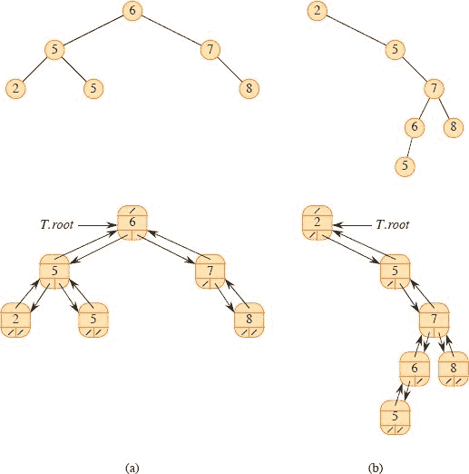

**图 12.1** 二叉搜索树。对于任意节点`x`，左子树中的键值最多为`x.key`，右子树中的键值至少为`x.key`。不同的二叉搜索树可以表示相同的值集。大多数搜索树操作的最坏运行时间与树的高度成正比。**(a)** 一个包含 6 个节点且高度为 2 的二叉搜索树。顶部图显示了如何概念化地查看树，底部图显示了每个节点中的`left`、`right`和`p`属性，类似于第 266 页的图 10.6。**(b)** 一个高度为 4 的效率较低的二叉搜索树，包含相同的键。

二叉搜索树中的键值总是以满足`**二叉搜索树属性**`的方式存储：

设`x`为二叉搜索树中的一个节点。如果`y`是`x`的左子树中的一个节点，则`y.key ≤ x.key`。如果`y`是`x`的右子树中的一个节点，则`y.key ≥ x.key`。

因此，在图 12.1(a)中，根的键值为 `6`，其左子树中的键 `2`、`5` 和 `5` 均不大于 `6`，右子树中的键 `7` 和 `8` 均不小于 `6`。树中的每个节点都具有相同的性质。例如，将根的左子节点视为一个子树的根，该子树的根具有键值 `5`，其左子树中的键 `2` 不大于 `5`，右子树中的键 `5` 不小于 `5`。

由于二叉搜索树的性质，可以通过一个简单的递归算法按顺序打印二叉搜索树中的所有键，称为`中序遍历`，由过程 INORDER-TREE-WALK 给出。该算法之所以被命名为中序遍历，是因为它在打印左子树中的值和打印右子树中的值之间打印子树根的键。（类似地，`前序遍历`在打印任一子树的值之前打印根，`后序遍历`在打印子树的值之后打印根。）要打印二叉搜索树`T`中的所有元素，调用 INORDER-TREE-WALK(*T.root*)。例如，中序遍历按顺序打印图 12.1 中的两个二叉搜索树中的键 2, 5, 5, 6, 7, 8。该算法的正确性通过归纳直接从二叉搜索树的性质得出。

`INORDER-TREE-WALK(x)`

| `1` | **如果** `x ≠ NIL` |   |
| --- | --- |
| `2` | `INORDER-TREE-WALK(x.left)` |
| `3` | 打印`x.key` |   |
| 4 | `INORDER-TREE-WALK(x.right)` |

遍历一个`n`个节点的二叉搜索树需要 `Θ(n)`时间，因为在初始调用之后，该过程对树中的每个节点恰好递归调用两次——一次是其左子节点，一次是其右子节点。以下定理给出了一个正式证明，证明执行中序遍历需要线性时间。  

**`定理 12.1`**

如果`x`是`n`个节点子树的根，则调用 INORDER-TREE-WALK(`x`)需要 `Θ(n)`时间。

**证明**   设`T(n)`表示在`n`个节点的子树上调用 INORDER-TREE-WALK 所花费的时间。由于 INORDER-TREE-WALK 访问子树的所有`n`个节点，我们有`T(n) = Ω(n)`。接下来要证明`T(n) = O(n)`。

由于在空子树上（对于测试`x ≠ NIL`）执行 INORDER-TREE-WALK 需要很少的固定时间，我们有`T(0) = c`，其中`c > 0` 是某个常数。

对于`n > 0`，假设在具有`k`个节点的左子树和具有`n` − `k` − 1 个节点的右子树上调用 INORDER-TREE-WALK 的节点`x`。执行 INORDER-TREE-WALK(`x`)的时间受到`T(n) ≤ T(k) + T(n` − `k` − 1) + `d`的限制，其中`d > 0` 是反映执行 INORDER-TREE-WALK(`x`)主体的时间的上界常数，不包括递归调用所花费的时间。

我们使用替换法证明`T(n) = O(n)`，证明`T(n) ≤ (c + d)n + c`。对于`n = 0`，我们有`(c + d) · 0 + c = c = T(0)`。对于`n > 0`，我们有  

| `T(n)` | ≤ | `T(k) + T(n - k - 1) + d` |   |
| --- | --- | --- | --- |
| --- | --- | --- |
| | ≤ | ((c + d)*k + c) + ((c + d)(n - k - 1) + c) + d | `   |
|  | = | (c + d)*n + c - (c + d) + c + d |
|  | = | (`c + d`)`n + c`, |

完成证明。

▪  输出：

**练习**

**12.1-1**

对于键集`{1, 4, 5, 10, 16, 17, 21}`，绘制高度为 2、3、4、5 和 6 的二叉搜索树。

**`12.1-2`**  

二叉搜索树属性和第 163 页上的最小堆属性之间有什么区别？最小堆属性能否在`O(n)`时间内按顺序打印出`n`个节点树的键？展示如何，或解释为什么不能。

**`12.1-3`**  

给出一个执行中序遍历的非递归算法。（`提示：`一种简单的解决方案使用栈作为辅助数据结构。一种更复杂但优雅的解决方案不使用栈，但假设您可以测试两个指针是否相等。）  

**12.1-4**

给出在`n`个节点的树上以 `Θ(n)`时间执行前序遍历和后序遍历的递归算法。

**`12.1-5`**  

论证：由于在比较模型中，对`n`个元素进行排序在最坏情况下需要Ω(`n` `lg n`)的时间，因此基于比较的任何构建二叉搜索树的算法在最坏情况下需要Ω(`n` `lg n`)的时间。

**12.2 查询二叉搜索树**

二叉搜索树可以支持 MINIMUM、MAXIMUM、SUCCESSOR 和 PREDECESSOR 等查询，以及 SEARCH。本节将研究这些操作，并展示如何在高度为`h`的任何二叉搜索树上以`O(h)`时间支持每个操作。

**搜索**

要在二叉搜索树中搜索具有给定键的节点，请调用 `TREE-SEARCH` 过程。给定指向子树根节点`x`和键`k`的指针，`TREE-SEARCH(x, k)`如果子树中存在具有键`k`的节点，则返回指向该节点的指针；否则返回 NIL。要在整个二叉搜索树`T`中搜索键`k`，请调用 `TREE-SEARCH(T.root, k)`。

`TREE-SEARCH(x, k)`

| `1` | **如果** `x == NIL` 或 `k == x.key` |
| --- | --- |
| --- | --- |   |
| `2` | **返回** `x` |   |
| `3` | **如果** `k < x.key` |
| `4` | **返回** TREE-SEARCH(`x.left`, `k`) |
| 5 | `否则返回` TREE-SEARCH(*x.right*, `k`) |

迭代树搜索(`x`, `k`)

| `1` | **当** `x ≠ NIL` 且 `k ≠ x.key` |  |
| --- | --- |
| \| `2` \| **如果** `k < x.key` \|   |
| \| 3 \| `x = x.left` \| |
| `4` | **否则** `x = x.right` |
| 5 | **返回** `x` |

TREE-SEARCH 过程从根节点开始搜索，并在树中向下跟踪简单路径，如图 12.2(a)所示。对于遇到的每个节点`x`，它的键`k`与`x.key`进行比较。如果两个键相等，则搜索终止。如果`k`小于`x.key`，则搜索继续在`x`的左子树中进行，因为二叉搜索树属性意味着`k`不能位于右子树中。类似地，如果`k`大于`x.key`，则搜索继续在右子树中进行。递归期间遇到的节点形成了从树根向下的简单路径，因此 TREE-SEARCH 的运行时间为`O(h)`，其中`h`为树的高度。

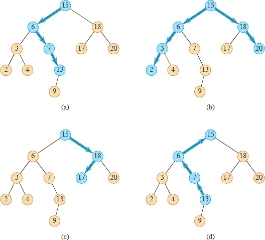

**图 12.2** 二叉搜索树上的查询。每个查询中遵循的节点和路径均以蓝色标记。**(a)** 在树中搜索键为 `13` 的路径从根节点开始依次为 `15` → `6` → `7` → `13`。**(b)** 树中的最小键为 `2`，通过从根节点开始遵循*左*指针找到。最大键 `20` 通过从根节点开始遵循*右*指针找到。**(c)** 具有键为 `15` 的节点的后继是具有键为 `17` 的节点，因为它是 `15` 右子树中的最小键。**(d)** 具有键为 `13` 的节点没有右子树，因此其后继是其最低祖先，其左子节点也是祖先。在这种情况下，具有键为 `15` 的节点是其后继。  

由于 TREE-SEARCH 过程递归地在左子树或右子树上进行，但不会同时进行，因此我们可以将算法重写为“展开”递归为`while`循环。在大多数计算机上，此页上的 ITERATIVE-TREE-SEARCH 过程更有效。

**最小和最大**

要在二叉搜索树中找到具有最小键的元素，只需从根节点开始沿着`左`子指针向下，直到遇到 NIL，如图 12.2(b)所示。TREE-MINIMUM 过程返回指向给定节点`x`所在子树中最小元素的指针，我们假设该节点为非 NIL。

TREE-MINIMUM(`x`)

| `1` | **当** `x.left` ≠ NIL |  |
| --- | --- |
| 2 | `x = x.left` |  |
| \| 3 \| **返回** `x` \| |

`TREE-MAXIMUM(x)`

| 1 | **当** `x.right` ≠ NIL |
| --- | --- |
| 2 | x = x.right |
| `3` | **返回** `x` |

二叉搜索树属性保证了 `TREE-MINIMUM` 的正确性。如果节点`x`没有左子树，则由于`x`右子树中的每个键至少与`x.key`一样大，因此根节点`x`所在子树中的最小键为`x.key`。如果节点`x`有左子树，则由于右子树中没有比`x.key`小的键，左子树中的每个键都不大于`x.key`，因此根节点`x`所在子树中的最小键位于根节点`x.left`所在子树中。

TREE-MAXIMUM 的伪代码是对称的。TREE-MINIMUM 和 TREE-MAXIMUM 在高度为`h`的树上都以`O(h)`时间运行，因为，就像 TREE-SEARCH 一样，遇到节点序列形成了从根节点向下的简单路径。

**后继和前驱**

给定二叉搜索树中的一个节点，如何找到其在中序树遍历确定的排序顺序中的后继？如果所有关键字都不同，节点`x`的后继是大于`x.key`的最小关键字的节点。无论关键字是否不同，我们将一个节点的**后继**定义为在中序树遍历中访问的下一个节点。二叉搜索树的结构允许您确定一个节点的后继而无需比较关键字。本页上的 `TREE-SUCCESSOR` 过程返回二叉搜索树中节点`x`的后继（如果存在），或者如果`x`是在中序遍历中访问的最后一个节点，则返回 `NIL`。

TREE-SUCCESSOR 的代码有两种情况。如果节点`x`的右子树非空，则`x`的后继就是`x`右子树中最左边的节点，第 2 行通过调用 TREE-MINIMUM(`x.right`)找到。例如，在图 12.2(c)中，关键字为 15 的节点的后继是关键字为 17 的节点。  

另一方面，正如练习 12.2-6 要求您展示的那样，如果节点`x`的右子树为空且`x`有后继`y`，那么`y`是`x`的左子树也是`x`祖先的最低祖先。在图 12.2(d)中，关键字为 13 的节点的后继是关键字为 15 的节点。要找到`y`，从`x`向上遍历树，直到遇到根节点或者是其父节点的左子节点。TREE-SUCCESSOR 的第 4-8 行处理这种情况。

`TREE-SUCCESSOR(x)`

| 1 | **如果** `x.right` ≠ NIL |
| --- | --- |
| --- | --- |   |
| 2 | **返回** `TREE-MINIMUM(x.right)`  **//** 右子树中最左边的节点 |  |
| `3` | **否则** **//** 找到`x`的左子树是`x`祖先的最低祖先 |
| `4` | `y` = *x.p* |
| \| 5 \| **当** `y` ≠ NIL 且 `x` == `y.right` |
| 6 | `x = y` |
| 7 | `y = y.p` |
| \| `8` \| **返回** `y` \| |

在高度为`h`的树上，TREE-SUCCESSOR 的运行时间为`O(h)`，因为它要么沿着树向上遵循简单路径，要么沿着树向下遵循简单路径。对称于 TREE-SUCCESSOR 的 TREE-PREDECESSOR 过程也在`O(h)`时间内运行。

总之，我们已经证明了以下定理。

**定理 12.2**

动态集合操作 `SEARCH`、`MINIMUM`、`MAXIMUM`、`SUCCESSOR` 和 `PREDECESSOR` 可以实现为在高度为`h`的二叉搜索树上每个操作都在`O(h)`时间内运行。

▪

**练习**

**12.2-1**

在包含 1 到 1000 之间数字的二叉搜索树中搜索数字 `363`。以下哪个序列*不能*是检查的节点序列？

**a.** `2, 252, 401, 398, 330, 344, 397, 363`.

**b.** `924, 220, 911, 244, 898, 258, 362, 363.`

**c.** `925, 202, 911, 240, 912, 245, 363.`

**d.** `2, 399, 387, 219, 266, 382, 381, 278, 363.`

**e.** `935, 278, 347, 621, 299, 392, 358, 363`.

**`12.2-2`**  

编写 `TREE-MINIMUM` 和 `TREE-MAXIMUM` 的递归版本。

**`12.2-3`**

编写`TREE-PREDECESSOR`过程。

**12.2-4**

基尔默教授声称发现了二叉搜索树的一个显著特性。假设在二叉搜索树中查找关键字`k`的过程最终到达一个叶子节点。考虑三个集合：`A`，搜索路径左侧的关键字；`B`，搜索路径上的关键字；`C`，搜索路径右侧的关键字。基尔默教授声称，任意三个关键字`a ∈ A`，`b ∈ B`，和`c ∈ C` 必须满足`a ≤ b ≤ c`。给出基尔默教授声明的最小可能反例。

`12.2-5`

证明如果二叉搜索树中的一个节点有两个子节点，则其后继没有左子节点，其前驱没有右子节点。

`12.2-6`  

考虑一棵具有不同键的二叉搜索树`T`。证明如果节点`x`的右子树为空且`x`有后继`y`，那么`y`是`x`的最低祖先，其左子节点也是`x`的祖先。（注意每个节点都是其自身的祖先。）

**`12.2-7`**

通过调用`TREE-MINIMUM`找到树中的最小元素，然后进行`n` - 1 次`TREE-SUCCESSOR`调用，可以执行`n`个节点的二叉搜索树的中序遍历的另一种方法。证明此算法的运行时间为 `Θ(n)`。

`12.2-8`

证明无论从高度为`h`的二叉搜索树中的哪个节点开始，对 TREE-SUCCESSOR 进行`k`次连续调用都需要`O(k + h)`的时间。

**`12.2-9`**  

设`T`为一棵具有不同键的二叉搜索树，设`x`为叶节点，`y`为其父节点。证明`y.key`要么是`T`中大于`x.key`的最小键，要么是`T`中小于`x.key`的最大键。

**`12.3`    插入和删除`**  

插入和删除操作会导致由二叉搜索树表示的动态集合发生变化。数据结构必须进行修改以反映这种变化，但必须以保持二叉搜索树属性的方式进行。我们将看到，修改树以插入新元素相对简单，但从二叉搜索树中删除节点则更加复杂。  

**插入**

TREE-INSERT 过程将新节点插入二叉搜索树。该过程接受二叉搜索树`T`和一个节点`z`，其中`z.key`已经填充，`z.left` = NIL，`z.right` = NIL。它修改`T`和`z`的一些属性，以便将`z`插入树中适当的位置。

`TREE-INSERT(T, z)`

|   1 | `x = T.root` | **//** 与`z`进行比较的节点 |
| --- | --- | --- |
| --- | --- | --- |
|   2 | `y = NIL` | **//** `y`将成为`z`的父节点 |
|   `3` | **当** `x` ≠ NIL | **//** 下降直到到达叶节点 |   |
| `4` | `y = x` |   |
|   5 | **如果** `z.key < x.key` |  |   |
|   6 | `x = x.left` |  |
| `7` | **否则** `x = x.right` |
|   8 | `z.p = y` | **//** 找到位置——将`z`插入并设置父节点`y` |
|   9 | **如果** `y` == NIL |  |   |
| \| `10` \| `T.root = z` \| **//** 树`T`为空 \| |
| 11 | **否则如果** *z.key* < *y.key* |  |
| 12 | y.left = z |  |
| `13` | **否则** `y.right = z` |  |   |

图 12.3 展示了 TREE-INSERT 的工作原理。就像 TREE-SEARCH 和 ITERATIVE-TREE-SEARCH 过程一样，TREE-INSERT 从树的根节点开始，指针`x`沿着向下查找 NIL 的简单路径，以便用输入节点`z`替换。该过程将**尾指针** `y`作为`x`的父节点。初始化后，第 3-7 行的`while`循环使这两个指针向下移动，根据`z.key`与`x.key`的比较，向左或向右移动，直到`x`变为 NIL。这个 NIL 占据了节点`z`将要插入的位置。更准确地说，这个 NIL 是将成为`z`父节点的节点的`left`或`right`属性，或者如果树`T`当前为空，则是`T.root`。该过程需要尾指针`y`，因为当它找到`z`应该放置的 NIL 时，搜索已经进行了一步超出需要更改的节点。第 8-13 行设置了导致`z`被插入的指针。

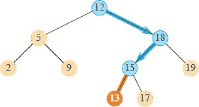  

**图 `12.3`** 将具有键为 `13` 的节点插入二叉搜索树的过程。从根节点到插入节点位置的简单路径显示为蓝色。新节点及其与父节点的链接用橙色突出显示。

与搜索树上的其他原始操作一样，`TREE-INSERT` 过程在高度为`h`的树上运行时间为`O(h)`。

**删除**

从二叉搜索树`T`中删除节点`z`的整体策略有三种基本情况，正如我们将看到的，其中一种情况有点棘手。

+   如果`z`没有子节点，则通过修改其父节点以将`z`替换为 NIL 作为其子节点来简单地删除它。

+   如果`z`只有一个子节点，那么通过修改`z`的父节点，将该子节点提升到树中`z`的位置。

+   如果`z`有两个子节点，则找到`z`的后继`y`—必须属于`z`的右子树—并将`y`移动到树中`z`的位置。`z`的原右子树的其余部分成为`y`的新右子树，`z`的左子树成为`y`的新左子树。因为`y`是`z`的后继，所以它不能有左子节点，`y`的原右子节点移动到`y`的原位置，其余`y`的原右子树自动跟随。这种情况比较棘手，因为，正如我们将看到的，`y`是否为`z`的右子节点很重要。

从二叉搜索树`T`中删除给定节点`z`的过程需要将指针传递给`T`和`z`。它通过考虑图 12.4 中所示的四种情况，有点不同于之前概述的三种情况来组织它的情况。  

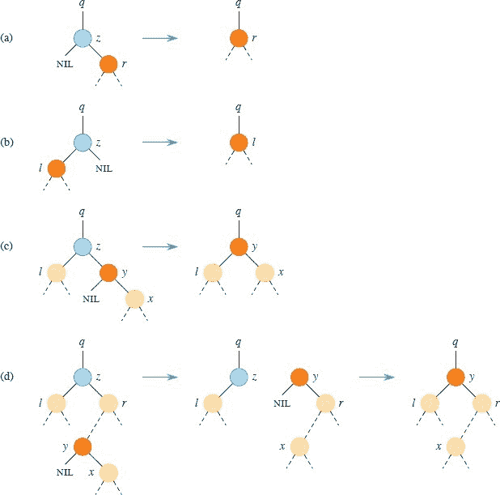

**图 12.4** 从二叉搜索树中删除节点`z`（蓝色）。节点`z`可能是根节点，节点`q`的左子节点，或`q`的右子节点。将替换节点`z`在树中的位置的节点标记为橙色。**(a)** 节点`z`没有左子节点。用其右子节点`r`替换`z`，该右子节点可能是 NIL 也可能不是 NIL。**(b)** 节点`z`有左子节点`l`但没有右子节点。用`l`替换`z`。**(c)** 节点`z`有两个子节点。其左子节点是节点`l`，右子节点是其后继`y`（没有左子节点），`y`的右子节点是节点`x`。用`y`替换`z`，更新`y`的左子节点为`l`，但将`x`保留为`y`的右子节点。**(d)** 节点`z`有两个子节点（左子节点`l`和右子节点`r`），其后继`y ≠ r`位于以`r`为根的子树中。首先用其自己的右子节点`x`替换`y`，并将`y`设置为`r`的父节点。然后将`y`设置为`q`的子节点和`l`的父节点。

+   如果`z`没有左子节点，那么如图中的(a)部分所示，用其右子节点替换`z`，该右子节点可能是 NIL 也可能不是 NIL。当`z`的右子节点为 NIL 时，这种情况处理`z`没有子节点的情况。当`z`的右子节点为非 NIL 时，这种情况处理`z`只有一个子节点的情况，即右子节点。

+   否则，如果`z`只有一个子节点，则该子节点是左子节点。如图中的(b)部分所示，用其左子节点替换`z`。

+   否则，`z`既有左子节点又有右子节点。找到`z`的后继`y`，它位于`z`的右子树中且没有左子节点（参见练习 12.2-5）。将节点`y`从当前位置剪切出来，并将`z`替换为`y`在树中的位置。如何做取决于`y`是否为`z`的右子节点：

    +   如果`y`是`z`的右子节点，则如图中的(c)部分所示，用`y`替换`z`，保持`y`的右子节点不变。

    +   否则，`y`位于`z`的右子树中，但不是`z`的右子节点。在这种情况下，如图中的(d)部分所示，首先用其自己的右子节点替换`y`，然后用`y`替换`z`。

在删除节点的过程中，子树需要在二叉搜索树中移动。子例程 `TRANSPLANT` 将一个子树替换为其父节点的子树。当 `TRANSPLANT` 用以节点`u`为根的子树替换以节点`v`为根的子树时，节点`u`的父节点变为节点`v`的父节点，`u`的父节点最终将`v`作为其适当的子节点。`TRANSPLANT` 允许`v`为 NIL 而不是指向节点的指针。  

`TRANSPLANT(T, u, v)`

| 1 | `if u.p` == NIL |   |
| --- | --- |
| 2 | *T.root* = `v` | `   |
| 3 | `elseif` `u` == *u.p.left* |  |
| 4 | u.p.left = v | `   |
| `5` | **else** `u.p.right = v` |   |
| `6` | `if` `v` ≠ NIL |   |
| 7 | `v.p = u.p` |   |

TRANSPLANT 的工作原理如下。第 1-2 行处理`u`是`T`的根的情况。否则，`u`要么是其父节点的左孩子，要么是右孩子。第 3-4 行负责更新如果`u`是左孩子则更新`u.p.left`，第 5 行如果`u`是右孩子则更新`u.p.right`。因为`v`可能为 NIL，所以第 6-7 行只有在`v`非 NIL 时才更新`v.p`。TRANSPLANT 过程��尝试更新`v.left`和`v.right`。更新或不更新这些值是 TRANSPLANT 调用者的责任。  

以下页上的 TREE-DELETE 过程使用 TRANSPLANT 从二叉搜索树`T`中删除节点`z`。它执行以下四种情况。第 1-2 行处理节点`z`没有左孩子的情况（图 12.4(a)），第 3-4 行处理`z`有左孩子但没有右孩子的情况（图 12.4(b)）。第 5-12 行处理剩下的两种情况，即`z`有两个孩子的情况。第 5 行找到节点`y`，它是`z`的后继。因为`z`有非空右子树，所以它的后继必须是该子树中具有最小键的节点；因此调用 TREE-MINIMUM(`z.right`)。正如我们之前指出的，`y`没有左孩子。该过程需要将`y`从当前位置剪切出来，并在树中用`y`替换`z`。如果`y`是`z`的右孩子（图 12.4(c)），那么第 10-12 行将`z`替换为其父节点的子节点`y`，并将`y`的左孩子替换为`z`的左孩子。节点`y`保留其右孩子（图 12.4(c)中的`x`），因此`y.right`不需要发生变化。如果`y`不是`z`的右孩子（图 12.4(d)），则需要移动两个节点。第 7-9 行将`y`替换为其父节点的子节点`y`的右孩子（图 12.4(c)中的`x`），并使`z`的右孩子（图中的`r`）成为`y`的右孩子。最后，第 10-12 行将`z`替换为其父节点的子节点`y`，并将`y`的左孩子替换为`z`的左孩子。

`TREE-DELETE(T, z)`

|   1 | **如果** `z.left` == NIL |  |
| --- | --- | --- |
|   `2` | `TRANSPLANT(T, z, z.right)` | **//** 用其右孩子替换`z` |
|   3 | `否则如果` *z.right* == NIL |  |  |
| `4` | TRANSPLANT(`T`, `z`, `z.left`) | **//** 用其左孩子替换`z` |
|   5 | **否则** `y = TREE-MINIMUM(z.right)` | **//** `y` 是`z`的后继 |
|   6 | **如果** `y ≠ z.right` | **//** `y` 在树中更靠下吗？ |   |
|   7 | `TRANSPLANT(T, y, y.right)` | **//** 用其右孩子替换`y` |
|   8 | `y.right = z.right` | **//** `z`的右孩子变为 |   |
|   9 | `y.right.p = y` | **//**      `y`的右孩子 |
| `10` | `TRANSPLANT(T, z, y)` | **//** 用其后继`y`替换`z` |
| `11` | `y.left = z.left` | **//** 并将`z`的左孩子给予`y` |   |
| `12` | `y.left.p = y` | **//**      没有左孩子的情况 |

TREE-DELETE 的每一行，包括对 TRANSPLANT 的调用，在除了第 5 行调用 TREE-MINIMUM 的情况下都需要常数时间。因此，在高度为`h`的树上，TREE-DELETE 的运行时间为`O(h)`。

总之，我们已经证明了以下定理。

**定理 `12.3`**

动态集合操作 `INSERT` 和 `DELETE` 可以实现为在高度为`h`的二叉搜索树上每个操作运行时间为`O(h)`。

▪  输出：

**`练习`** 

`12.3-1`

给出 `TREE-INSERT` 过程的递归版本。

`12.3-2`

假设你通过不断将不同的值插入树中来构建二叉搜索树。论证在搜索树中查找值时检查的节点数是在值首次插入树中时检查的节点数加 1。

`12.3-3`

通过首先构建包含这些数字的二叉搜索树（使用 `TREE-INSERT` 重复插入数字）然后通过中序遍历打印数字，可以对给定的`n`个数字进行排序。这种排序算法的最坏情况和最佳情况运行时间是多少？

**12.3-4**

当 `TREE-DELETE` 调用 `TRANSPLANT` 时，`TRANSPLANT` 的参数 `v` 何时可以为 `NIL`？

**`12.3-5`**  

删除操作在从二叉搜索树中删除`x`然后删除`y`后是否“可交换”，与从二叉搜索树中删除`y`然后删除`x`后是否留下相同的树？论证为什么是这样的或者举出反例。

`12.3-6`

假设每个节点`x`不再保留指向`x`父节点的属性`x.p`，而是保留指向`x`后继节点的属性`x.succ`。给出使用这种表示法在二叉搜索树`T`上进行 TREE-SEARCH、TREE-INSERT 和 TREE-DELETE 的伪代码。这些过程应在`O(h)`时间内运行，其中`h`是树`T`的高度。您可以假设二叉搜索树中的所有键都是不同的。（提示：您可能希望实现一个子程序，返回节点的父节点。）

**12.3-7**

当 `TREE-DELETE` 中的节点`z`有两个子节点时，您可以选择节点`y`作为其前驱而不是后继。如果这样做，`TREE-DELETE` 需要做出哪些其他更改？有人认为公平策略，对前驱和后继给予相同的优先级，会产生更好的实际性能。如何最小程度地更改 `TREE-DELETE` 以实现这样一种公平策略？  

**问题**

**12-1     具有相等键的二叉搜索树**

相等键对于二叉搜索树的实现构成了问题。

**a.** 当用于将`n`个具有相同键的项插入到最初为空的二叉搜索树中时，TREE-INSERT 的渐近性能是多少？

考虑将 TREE-INSERT 更改为在第 5 行之前测试`z.key = x.key`，并在第 11 行之前测试`z.key = y.key`。如果相等成立，实施以下策略之一。对于每种策略，找出将`n`个具有相同键的项插入到最初为空的二叉���索树中的渐近性能。（这些策略是针对比较`z`和`x`键的第 5 行描述的。将`y`替换为`x`以得到第 11 行的策略。）

**b.** 在节点`x`处保持一个布尔标志`x.b`，根据`x.b`的值将`x`设置为`x.left`或`x.right`，当 TREE-INSERT 访问`x`时，`x.b`在插入具有与`x`相同键的节点时在 FALSE 和 TRUE 之间交替。

**c.** 在`x`处保持具有相同键的节点列表，并将`z`插入列表中。

**d.** 随机将`x`设置为`x.left`或`x.right`。（给出最坏情况性能并非正式推导预期运行时间。）

**12-2     基数树**

给定两个字符串`a = a₀a₁ … a[p]`和`b = b₀b₁ … b[q]`，其中每个`a[i]`和每个`b[j]`属于某个有序字符集，如果字符串`a`按字典顺序小于字符串`b`，则表示  

1.  存在一个整数`j`，其中 0 ≤ `j` ≤ min {`p`, `q`}，使得对于所有`i = 0`, 1, …, `j` − 1 和 *a[i]* = *b[i]*，以及*a[j]* < *b[j]*。  

1.  `p < q` 并且对于所有`i = 0`, 1, …, `p`，`a[i] = b[i]`。

例如，如果`a`和`b`是位串，则根据规则 1（令`j = 3`），`10100 < 10110`，根据规则 2，`10100 < 101000`。这种排序类似于英语字典中使用的排序。

图 12.5 中显示的`**基数树**`数据结构（也称为`**trie**`）存储位串 `1011`、`10`、`011`、`100` 和 `0`。在搜索键``a = a`[0]`a`[1] … *a[p]*`时，如果`*a[i]* = 0`，则在深度``i``的节点处向左移动，如果`*a[i]* = 1`，则向右移动。设``S``是一组长度总和为``n``的不同位串。展示如何使用基数树在`Θ(`n`)`时间内对``S``进行字典排序。对于图 12.5 中的示例，排序的输出应为序列 `0`、`011`、`10`、`100`、`1011`。

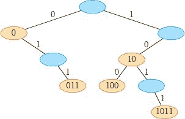

**图 12.5** 存储位串 `1011`, `10`, `011`, `100` 和 `0` 的基数树。为了确定每个节点的键，遍历从根到该节点的简单路径。因此，无需在节点中存储键。这里只是为了说明目的而显示键。对应于蓝色节点的键不在树中。这样的节点仅用于建立到其他节点的路径。

**12-3** 随机构建的二叉搜索树中节点的平均深度

一个**`随机构建的二叉搜索树`**有`n`个键，是通过从空树开始并以随机顺序插入键来创建的二叉搜索树，其中每个`n!`个键的排列都是等概率的。在这个问题中，你将证明具有`n`个节点的随机构建的二叉搜索树中节点的平均深度为`O(lg n)`。这种技术揭示了二叉搜索树的构建与第 7.3 节中的 RANDOMIZED-QUICKSORT 执行之间的惊人相似性。

用`d(x, T)`表示树`T`中任意节点`x`的深度。那么树`T`的**总路径长度** `P(T)`是`T`中所有节点`x`的`d(x, T)`之和。

**a.** 论证`T`中节点的平均深度为

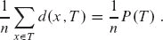  

因此，你需要展示`P(T)`的期望值为`O(n lg n)`。

**b.** 让`T[L]`和`T[R]`表示树`T`的左子树和右子树。论证如果`T`有`n`个节点，则

`P(T) = P(T[L]) + P(T[R]) + n - 1.`

**c.** 让`P(n)`表示具有`n`个节点的随机构建的二叉搜索树的平均总路径长度。展示

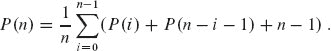

**d.** 展示如何将`P(n)`重写为

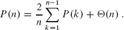

**e.** 回顾问题 7-3 中给出的随机快速排序的另一种分析，得出`P(n) = O(n lg n)`。

每次随机快速排序的递归调用都选择一个随机的枢轴元素来对正在排序的元素集进行分区。二叉搜索树的每个节点将元素集分区为根节点处的子树中的元素。

**f.** 描述一个快速排序的实现，其中用于对一组元素进行排序的比较与将元素插入二叉搜索树的比较完全相同。（进行比较的顺序可能不同，但必须发生相同的比较。）

**`12-4`** 不同二叉树的数量

让`b[n]`表示具有`n`个节点的不同二叉树的数量。在这个问题中，你将找到`b[n]`的一个公式，以及一个渐近估计。

**`a.`** 展示`b₀ = 1`，并且对于`n ≥ 1`，

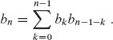

**`b.`** 参考第 121 页的问题 4-5 中生成函数的定义，令`B(x)`为生成函数

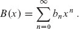

展示`B(x) = xB(x)² + 1`，因此表达`B(x)`的一种方式是

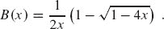

`f(x)`在点`x = a`周围的**泰勒展开式**为

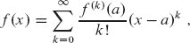

其中`f^(k)(x)`是在`x`处求导的第`k`个导数。  

**c.** 展示

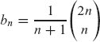

（第`n`个**卡特兰数**)通过在`x = 0` 周围使用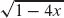的泰勒展开式来计算。（如果愿意，你可以使用二项式定理的推广，即第 1181 页上的方程(C.4)，对非整数指数`n`进行解释，其中对于任何实数`n`和任何整数`k`，如果`k ≥ 0`，则可以解释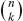为`n(n - 1) ... (n - k + 1)/k!`，否则为 0。）

**d.** 展示

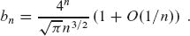

**章节注释**

Knuth [261] 包含了对简单二叉搜索树以及许多变体的讨论。二叉搜索树似乎在 20 世纪 50 年代后期被许多人独立发现。基数树通常被称为“tries”，这个名字来自单词`retrieval`中的中间字母。Knuth [261] 也对它们进行了讨论。

许多文本，包括本书的前两版，描述了一种稍微简化的方法，用于从二叉搜索树中删除一个同时具有两个子节点的节点。不是用其后继者`y`替换节点`z`，而是删除节点`y`，但将其键和卫星数据复制到节点`z`中。这种方法的缺点是实际删除的节点可能不是传递给删除过程的节点。如果程序的其他组件维护对树中节点的指针，它们可能错误地得到对已删除节点的“陈旧”指针。尽管本书的这一版中呈现的删除方法有点复杂，但它保证调用删除节点`z`会删除节点`z`，而且只有节点`z`。  

第 14.5 节将展示如何在构建树之前知道搜索频率时构建最佳二叉搜索树。也就是说，给定每个键搜索频率和搜索树中键之间值的搜索频率，构建的二叉搜索树中的一组搜索检查最少数量的节点。
