**`13` 红黑树**

第十二章表明，高度为`h`的二叉搜索树可以支持任何基本的动态集合操作——如搜索、前驱、后继、最小值、最大值、插入和删除——在`O(h)`时间内完成。因此，如果搜索树的高度较小，集合操作将很快。然而，如果高度较大，则集合操作可能与链表一样慢。红黑树是许多“平衡”的搜索树方案之一，以确保基本的动态集合操作在最坏情况下花费`O(lg n)`时间。

**13.1    红黑树的性质**  

**红黑树**是一种二叉搜索树，每个节点额外存储一位信息：它的**颜色**，可以是红色或黑色。通过约束从根到叶子的任意简单路径上的节点颜色，红黑树确保没有任何一条路径比其他路径长两倍以上，从而使树近似**平衡**。事实上，正如我们即将看到的，具有`n`个键的红黑树的高度最多为 `2 lg(n + 1)`，即`O`(`lg n`)。

现在，树的每个节点包含`颜色`、`键`、`左子节点`、`右子节点`和`p`这些属性。如果一个节点的子节点或父节点不存在，则节点的相应指针属性包含值 NIL。将这些 NIL 视为二叉搜索树的叶子节点（外部节点）的指针，将正常的、带有键的节点视为树的内部节点。

红黑树是一种满足以下`**红黑性质**`的二叉搜索树：

1.  每个节点要么是红色的，要么是黑色的。

1.  根节点是黑色的。

1.  每个叶子节点（NIL）都是黑色的。  

1.  如果一个节点是红色的，则它的两个子节点都是黑色的。

1.  对于每个节点，从节点到后代叶子的所有简单路径包含相同数量的黑色节点。

图 13.1(a)展示了一个红黑树的示例。

为了方便处理红黑树代码中的边界条件，我们使用一个单一的哨兵来表示 NIL（参见第 `262` 页）。对于红黑树`T`，哨兵`T.nil`是树中普通节点具有相同属性的对象。它的`颜色`属性是黑色，其它属性——`p`、`左子节点`、`右子节点`和`键`——可以取任意值。正如图 `13.1(b)`所示，所有指向 NIL 的指针都被替换为指向哨兵`T.nil`的指针。

为什么使用哨兵？哨兵使得可以将节点`x`的 NIL 子节点视为其父节点为`x`的普通节点。另一种设计会为树中的每个 NIL 使用一个独立的哨兵节点，以便每个 NIL 的父节点都有明确定义。然而，这种方法会浪费空间。相反，只需一个哨兵`T.nil`代表所有 NIL——所有叶子和根节点的父节点。哨兵的`p`、`左子节点`、`右子节点`和`键`属性的值并不重要。红黑树的程序可以在哨兵中放置任何值，以简化代码。

我们通常只关注红黑树的内部节点，因为它们保存着关键值。本章的其余部分在红黑树的图示中省略了叶子节点，如图 13.1(c)所示。  

我们将从节点`x`到叶子节点的简单路径上的黑色节点数目（不包括节点`x`）称为节点的**黑高度**，记为 `bh(x)`。根据性质 5，黑高度的概念是明确定义的，因为从节点出发的所有下降简单路径具有相同数量的黑色节点。红黑树的黑高度是其根节点的黑高度。

以下引理说明了为什么红黑树是良好的搜索树。

**引理 13.1**

一个具有`n`个内部节点的红黑树的高度最多为 `2 lg(n + 1)`。

**证明** 我们首先展示以任意节点`x`为根的子树包含至少 `2^(bh(x)) - 1` 个内部节点。我们通过对节点`x`的高度进行归纳来证明这一点。如果`x`的高度为 0，则`x`必须是一个叶子节点（`T.nil`），并且以`x`为根的子树确实包含至少 `2^(bh(x)) - 1 = 2⁰ - 1 = 0` 个内部节点。对于归纳步骤，考虑一个高度为正且为内部节点的节点`x`。那么节点`x`有两个子节点，其中一个或两个可能是叶子节点。如果一个子节点是黑色，则它对`x`的黑高度有贡献，但对自身没有贡献。如果一个子节点是红色，则它对`x`的黑高度和自身的黑高度都没有贡献。因此，每个子节点的黑高度要么是 `bh(x) - 1`（如果是黑色），要么是 `bh(x)`（如果是红色）。由于子节点的高度小于`x`本身的高度，我们可以应用归纳假设得出每个子节点至少包含 `2^(bh(x)-1) - 1` 个内部节点。因此，以`x`为根的子树包含至少 `(2^(bh(x)-1) - 1) + (2^(bh(x)-1) - 1) + 1 = 2^(bh(x)) - 1` 个内部节点，这证明了这一点。

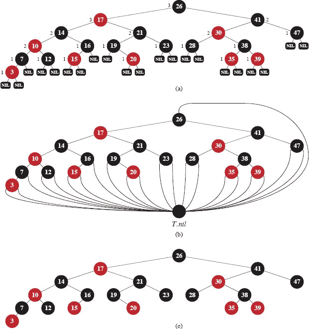

**`图 13.1`** 一棵红黑树。红黑树中的每个节点要么是红色，要么是黑色，红色节点的子节点都是黑色的，并且从一个节点到一个叶子节点的简单路径上包含相同数量的黑色节点。 **`(a)`** 每个叶子节点，用 `NIL` 表示，都是黑色的。每个非 `NIL` 节点都标有其黑高度，其中 `NIL` 的黑高度为 0。 **`(b)`** 相同的红黑树，但每个 `NIL` 都被单个哨兵 `T.nil` 替换，哨兵始终为黑色，黑高度被省略。根节点的父节点也是哨兵。 **`(c)`** 相同的红黑树，但叶子节点和根节点的父节点完全省略。本章的其余部分将使用这种绘图风格。

要完成引理的证明，让`h`为树的高度。根据性质 4，从根到叶子节点的任意简单路径上至少有一半的节点是黑色的。因此，根节点的黑高度至少为`h/2`，因此，

`n ≥ 2^(h/2) − 1`。

将 1 移到左侧并在两侧取对数得到 `lg(n + 1) ≥ h/2`，或者 `h ≤ 2 lg(n + 1)`。

▪  输出：

作为这个引理的直接结果，红黑树上的每个动态集操作 `SEARCH`、`MINIMUM`、`MAXIMUM`、`SUCCESSOR` 和 `PREDECESSOR` 都可以在`O`(`lg n`)时间内运行，因为在高度为`h`的二叉搜索树上，每个操作都可以在`O`(`h`)时间内运行（如第十二章所示），而任何具有`n`个节点的红黑树都是高度为`O`(`lg n`)的二叉搜索树。（当然，第十二章中的算法中对 NIL 的引用必须替换为`T.nil`。）尽管从第十二章中的 `TREE-INSERT` 和 `TREE-DELETE` 过程在给定红黑树作为输入时可以在`O`(`lg n`)时间内运行，但你不能仅仅使用它们来实现动态集操作 `INSERT` 和 `DELETE`。它们不一定保持红黑属性，因此最终可能不会得到合法的红黑树。本章的其余部分将展示如何在`O`(`lg n`)时间内向红黑树插入和删除。  

**练习**

`13.1-1`

以图 13.1(a)的风格，绘制高度为 3 的完全二叉搜索树，关键字为`{1, 2, …, 15}`。添加 NIL 叶子节点，并以三种不同的方式着色节点，使得生成的红黑树的黑高度分别为 2、3 和 4。  

**`13.1-2`**  

在图 13.1 中的树上调用 `TREE-INSERT` 后绘制的红黑树，关键字为 36。如果插入的节点着色为红色，结果树是否为红黑树？如果着色为黑色呢？  

**`13.1-3`**

将**松弛红黑树**定义为满足红黑属性 `1`、`3`、`4` 和 `5` 的二叉搜索树，但其根节点可以是红色或黑色。考虑一个根节点为红色的松弛红黑树 `T`。如果将 `T` 的根节点更改为黑色，但不进行其他更改，结果的树是否仍然是红黑树？

`13.1-4`  

假设红黑树中的每个黑色节点“吸收”其所有红色子节点，使得任何红色节点的子节点成为黑色父节点的子节点。（忽略键的变化。）在所有红色子节点被吸收后，黑色节点的可能度是多少？关于结果树的叶子深度，你能说些什么？

**13.1-5**

证明红黑树中从节点 `x` 到后代叶子节点的最长简单路径长度最多是从节点 `x` 到后代叶子节点的最短简单路径长度的两倍。

`13.1-6`

在具有黑高度 `k` 的红黑树中，内部节点的最大可能数量是多少？最小可能数量是多少？

`13.1-7`

描述一个具有 `n` 个键的红黑树，实现红色内部节点与黑色内部节点之间最大可能比例。这个比例是多少？具有最小可能比例的树是什么，比例是多少？

`13.1-8`

论证在红黑树中，红色节点不能恰好有一个非 NIL 孩子。

**13.2  旋转**

当在具有 `n` 个键的红黑树上运行 TREE-INSERT 和 TREE-DELETE 操作时，需要 `O`(`lg n`) 的时间。因为它们修改了树，结果可能违反 第 13.1 节 中列举的红黑属性。为了恢复这些属性，节点内的颜色和指针需要更改。  

指针结构通过`旋转`发生变化，旋转是搜索树中保持二叉搜索树属性的局部操作。图 13.2 展示了两种旋转：左旋转和右旋转。让我们看看对节点 `x` 进行的左旋转，它将图中右侧的结构转换为左侧的结构。节点 `x` 有一个右孩子 `y`，`y` 不能是 *T.nil*。左旋转通过“扭转” `x` 和 `y` 之间的链接向左改变了最初以 `x` 为根的子树。子树的新根是节点 `y`，`x` 是 `y` 的左孩子，`y` 的原左孩子（图中由 *β* 表示的子树）是 `x` 的右孩子。

出现在下一页的 LEFT-ROTATE 的伪代码假设 `x.right ≠ T.nil`，并且根的父节点是 `T.nil`。图 13.3 展示了 LEFT-ROTATE 如何修改二叉搜索树的示例。RIGHT-ROTATE 的代码是对称的。LEFT-ROTATE 和 RIGHT-ROTATE 都在 `O(1)` 的时间内运行。旋转只改变指针，节点中的所有其他属性保持不变。

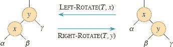

**图 13.2** 二叉搜索树上的旋转操作。操作 `LEFT-ROTATE(T, x)` 通过改变常数个指针，将右侧两个节点的配置转换为左侧的配置。逆操作 `RIGHT-ROTATE(T, y)` 将左侧的配置转换为右侧的配置。字母 `α`, `β`, 和 `γ` 代表任意子树。旋转操作保持二叉搜索树属性：`α` 中的键在 `x.key` 之前，`x.key` 在 `β` 中的键之前，`β` 中的键在 `y.key` 之前，`y.key` 在 `γ` 中的键之前。

`LEFT-ROTATE(T, x)`

|   1 | `y = x.right` |  |   |
| --- | --- | --- | --- |
| `   | --- | --- | ---- |
| `2` | `x.right = y.left` | **//** 将 `y` 的左子树变为 `x` 的右子树 |   |
|   3 | `if` `y.left ≠ T.nil` | **//** 如果 `y` 的左子树不为空 ... |
|   4 | `y.left.p = x` | **//** … 然后 `x` 成为子树根的父节点 |   |
| `5` | `y.p = x.p` | **//** `x` 的父节点变为 `y` 的父节点 |
|   6 | `if x.p` == `T.nil` | **//** 如果 `x` 是根节点 … |
|   7 | `T.root = y` | **//** …然后`y`成为根节点 |   |
|   8 | **否则如果** `x == x.p.left` | **//** 否则，如果`x`是左子节点… |
|   9 | `x.p.left = y` | **//** …然后`y`成为左子节点 |   |
| `10` | **否则** `x.p.right = y` | **//** 否则，`x`是右子节点，现在`y`是 |   |
| `11` | `y.left = x` | **//** 使`x`成为`y`的左子节点 |   |
| 12 | x.p = y | |

**练习**

**13.2-1**

写出 `RIGHT-ROTATE` 的伪代码。

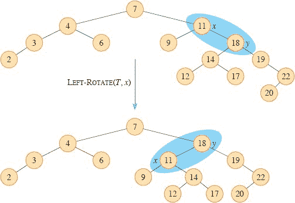

**图 13.3** `LEFT-ROTATE(T, x)`过程如何修改二叉搜索树的示例。输入树和修改后树的中序遍历产生相同的关键值列表。

`13.2-2`

论证在每个`n`个节点的二叉搜索树中，恰好有`n` − 1 种可能的旋转。

`13.2-3`

设`α`、`β`和`γ`的子树中分别有任意节点`a`、`b`和`c`，在图 13.2 的右树中对节点`x`执行左旋转时，`a`、`b`和`c`的深度会如何变化？

`13.2-4`

证明任意的`n`个节点的二叉搜索树可以通过`O(n)`次旋转转换为另一棵任意的`n`个节点的二叉搜索树。（*提示：*首先证明最多`n` − 1 次右旋转就足以将树转换为右链。）

★ `13.2-5`

我们说一个二叉搜索树`T₁`可以通过一系列调用 RIGHT-ROTATE 转换为二叉搜索树`T₂`。给出两棵树`T₁`和`T₂`的例子，使得`T₁`无法转换为`T₂`。然后，证明如果一棵树`T₁`可以通过 RIGHT-ROTATE 的`O(n²)`次调用转换为`T₂`，那么它可以通过`O(n)`次调用 RIGHT-ROTATE 进行右转换。

**`13.3    插入`**

为了在`O(lg n)`时间内向具有`n`个内部节点的红黑树中插入一个节点并保持红黑属性，我们需要在第 321 页上略微修改 TREE-INSERT 过程。RB-INSERT 过程首先将节点`z`插入树`T`中，就像它是一棵普通的二叉搜索树一样，然后将`z`着色为红色。（练习 13.3-1 要求您解释为什么将节点`z`着色为红色而不是黑色。）为了保证红黑属性得以保留，辅助过程 RB-INSERT-FIXUP 在对面的页面上重新着色节点并执行旋转。调用 RB-INSERT(`T`, `z`)将节点`z`插入红黑树`T`，其中`z`的`key`假定已经填充。

`RB-INSERT(T, z)`

|   1 | `x = T.root` | **//** 与`z`进行比较的节点 |
| --- | --- | --- |
| --- | --- | --- |
| `2` | `y = T.nil` | **//** `y`将成为`z`的父节点 |
|   3 | `当` `x` ≠ *T.nil* `时` | **//** 下降直到达到哨兵 |   |
|   4 | `y = x` |  |   |
| `5` | **如果** `z.key < x.key` |  |   |
|   6 | x = x.left |  |
|   `7` | **否则** `x = x.right` |  |   |
|   8 | `z.p = y` | **//** 找到位置—以父节点`y`插入`z` |
| `9` | **如果** `y` == *T.nil* |  |   |
| 10 | *T.root* = `z` | **//** 树`T`为空 |
| \| 11 \| **否则如果** \`z.key\` < \`y.key\` \|  \|   \| |
| `12` | `y.left = z` |  |
| `13` | **否则** *y.right* = `z` |  |
| `14` | `z.left = T.nil` | **//** `z`的两个子节点都是哨兵 |
| `15` | `z.right = T.nil` |  |
| 16 | `z.color` = 红色 | **//** 新节点初始为红色 |
| `17` | `RB-INSERT-FIXUP(T, z)` | **//** 修正任何违反红黑属性的情况 |

TREE-INSERT 和 RB-INSERT 的过程有四个不同之处。首先，TREE-INSERT 中所有的 NIL 实例都被`T.nil`替换。其次，RB-INSERT 的第 14-15 行将`z.left`和`z.right`设置为`T.nil`，以保持正确的树结构。（TREE-INSERT 假设`z`的子节点已经是 NIL。）第三，第 16 行将`z`着色为红色。第四，因为将`z`着色为红色可能导致违反红黑属性之一，RB-INSERT 的第 17 行调用 RB-INSERT-FIXUP(`T`, `z`)以恢复红黑属性。

RB-INSERT-FIXUP(`T`, `z`)

|   1 | **当** `z.p.color` == 红色 |  |
| --- | --- | --- |
|   2 | **如果** `z.p == z.p.p.left` | **//** `z`的父节点是左子节点吗？ |
|   3 | `y = z.p.p.right` | **//** `y`是`z`的叔父节点 |
|   4 | **如果** `y.color` == 红色 | **//** `z`的父节点和叔父节点都是红色吗？ |
|   5 | `z.p.color` = 黑色 | 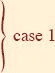 |
| `6` | `y.color` = 黑色 |
|   `7` | `z.p.p.color` = 红色 |
|   8 | `z = z.p.p` |   |
|   `9` | **否则** |  |   |
| 10 | **如果** z == z.p.right |  |
| \| 11 \| `z = z.p` \|  \|   |
| 12 | 左旋转(`T`, `z`) |   |
| 13 | `z.p.color =` 黑色 | 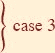 |
| 14 | `z.p.p.color` = 红色 |
| `15` | 右旋转(`T`, `z.p.p`) |  |
| 16 | **否则** **//** 与行 3-15 相同，但“右”和“左”交换 |   |
| 17 | `y = z.p.p.left` |  |   |
| 18 | **如果** `y.color` == 红色 |  |   |
| 19 | `z.p.color` = 黑色 |  |
| 20 | *y.color* = 黑色 |  |
| `21` | *z.p.p.color* = 红色 |  |   |
| `22` | `z = z.p.p` |  |   |
| `23` | **否则** |  |
| 24 | **如果** z == z.p.left |  |
| 25 | z = z.p |  |
| `26` | 右旋转(`T`, `z`) |  |   |
| 27 | `z.p.color` = 黑色 |  |
| 28 | `z.p.p.color` = 红色 |  |
| `29` | 左旋转(`T`, `z.p.p`) |  |   |
| 30 | `T.root.color` = 黑色 |

要理解 RB-INSERT-FIXUP 的工作原理，让我们分三个主要步骤来检查代码。首先，我们将确定在插入节点`z`并将其着色为红色时可能违反的红黑属性。其次，我们将考虑行 1-29 中`while`循环的整体目标。最后，我们将探讨`while`循环体内的三种情况（情况 2 会继续到情况 3，因此这两种情况并不是互斥的），并看看它们是如何实现目标的。  

在描述红黑树的结构时，我们经常需要提到节点父节点的兄弟节点。我们使用术语`叔父节点`来表示这样的节点。图 13.4 展示了 RB-INSERT-FIXUP 在一个示例红黑树上的操作，具体情况取决于节点、其父节点和叔父节点的颜色。

在调用 RB-INSERT-FIXUP 时可能会违反红黑属性的情况是什么？属性 1 肯定会继续保持（每个节点要么是红色要么是黑色），属性 3 也会保持（每个叶子节点都是黑色），因为新插入的红色节点的两个子节点都是哨兵`T.nil`。属性 5 也会得到满足，因为节点`z`替换了（黑色的）哨兵，而节点`z`是红色的，其子节点是哨兵。因此，可能违反的属性只有属性 2，要求根节点为黑色，和属性 4，规定红色节点不能有红色子节点。如果`z`为红色，则可能违反属性 2；如果`z`的父节点为红色，则可能违反属性 4。图 13.4(a)展示了在插入节点`z`后违反属性 4 的情况。

行 1-29 的`while`循环有两种对称的可能性：行 3-15 处理节点`z`的父节点`z.p`是`z`的祖父节点`z.p.p`的左子节点的情况，而行 17-29 则适用于`z`的父节点是右子节点的情况。我们的证明将仅关注行 3-15，依赖于行 17-29 的对称性。

我们将展示`while`循环在每次迭代开始时维持以下三部分不变性：

a. 节点`z`为红色。

b. 如果`z.p`是根节点，则`z.p`为黑色。

c. 如果树违反了任何红黑属性，则最多违反其中一个，违反的是属性 2 或属性 4，但不会同时违反两者。如果树违反属性 2，那是因为`z`是根节点且为红色。如果树违反属性 4，那是因为`z`和`z.p`都是红色。

第（c）部分涉及违反红黑属性，比第（a）和（b）部分更加核心，用于展示 RB-INSERT-FIXUP 如何恢复红黑属性，我们将在理解代码中的情况时使用第（a）和（b）部分。因为我们将专注于节点`z`及其附近的节点，所以知道从第（a）部分得知`z`是红色是有帮助的。第（b）部分将帮助展示`z`的祖父`z.p.p`在代码中被引用时存在，这发生在第 2、3、7、8、14 和 15 行（请记住我们只关注第 3-15 行）。  

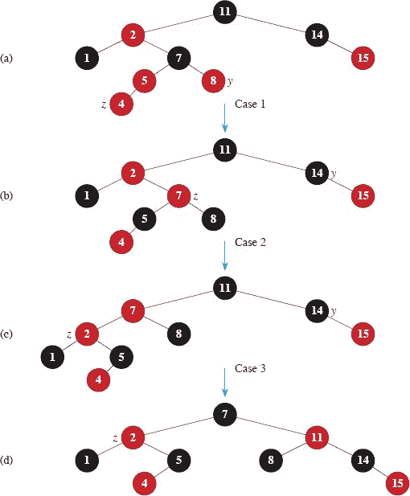  

**图 13.4** RB-INSERT-FIXUP 的操作。**`(a)`** 插入后的节点`z`。因为`z`及其父节点`z.p`都是红色，违反了属性 4。由于`z`的叔叔`y`是红色，代码中的情况 1 适用。节点`z`的祖父`z.p.p`必须是黑色，其黑色向下传递到`z`的父节点和叔叔。当指针`z`在树中上移两级时，结果如**`(b)`**所示。再次，`z`及其父节点都是红色，但这次`z`的叔叔`y`是黑色。因为`z`是`z.p`的右子节点，情况 2 适用。执行左旋转得到**`(c)`**中的树。现在`z`是其父节点的左子节点，情况 3 适用。重新着色和右旋转得到**`(d)`**中的树，这是一个合法的红黑树。  

回想一下，要使用循环不变式，我们需要展示在进入循环的第一次迭代时不变式为真，每次迭代都保持它，循环终止，并且循环不变式在循环终止时给我们一个有用的属性。我们将看到循环的每次迭代有两种可能的结果：要么指针`z`向上移动，要么发生一些旋转然后循环终止。

**初始化：** 在调用 `RB-INSERT` 之前，红黑树没有违规。`RB-INSERT` 添加了一个红色节点`z`并调用 `RB-INSERT-FIXUP`。我们将展示在调用 `RB-INSERT-FIXUP` 时不变式的每个部分都成立：

a. 当调用 RB-INSERT-FIXUP 时，`z`是添加的红色节点。

b. 如果`z.p`是根，则`z.p`最初是黑色，并且在调用 RB-INSERT-FIXUP 之前未更改。

c. 我们已经看到在调用`RB-INSERTFIXUP`时属性 1、3 和 5 成立。

如果树违反属性 2（根必须是黑色），那么红色根必须是新添加的节点`z`，它是树中唯一的内部节点。因为`z`的父节点和两个子节点都是黑色哨兵，树也不违反属性 4（红色节点的两个子节点都是黑色）。因此，属性 2 的违反是整个树中唯一的红黑属性违反。

如果树违反属性 4，则因为节点`z`的子节点是黑哨兵，并且在`z`被添加之前树没有其他违规，违规必定是因为`z`和`z.p`都是红色。此外，树不违反其他红黑属性。

**维护：** 在`while`循环中有六种情况，但我们只会检查第 3-15 行的三种情况，当节点`z`的父节点`z.p`是`z`的祖父`z.p.p`的左子节点时。第 17-29 行的证明是对称的。节点`z.p.p`存在，因为根据循环不变式的第（b）部分，如果`z.p`是根，则`z.p`是黑色。由于 RB-INSERT-FIXUP 仅在`z.p`是红色时进入循环迭代，我们知道`z.p`不能是根。因此，`z.p.p`存在。  

情况 1 与情况 2 和 3 不同之处在于`z`的叔叔`y`的颜色。第 3 行使`y`指向`z`的叔叔`z.p.p.right`，第 4 行测试`y`的颜色。如果`y`是红色，则执行情况 1。否则，控制权转移到情况 2 和 3。在这三种情况下，`z`的祖父`z.p.p`是黑色，因为其父节点`z.p`是红色，属性 4 仅在`z`和`z.p`之间违反。

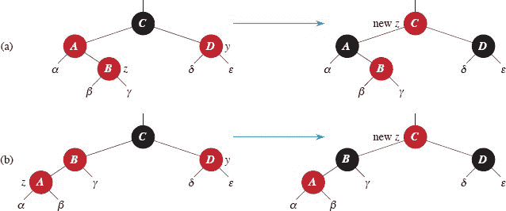

**图 13.5** 过程 RB-INSERT-FIXUP 的情况 1。`z` 和其父节点 `z.p` 都是红色的，违反了属性 4。在情况 1 中，`z` 的叔叔 `y` 是红色的。无论 **(a)** `z` 是右子节点还是 **(b)** `z` 是左子节点，都会发生相同的操作。每个子树 `α`、`β`、`γ`、`δ` 和 `ϵ` 都有一个黑色的根—可能是哨兵—并且每个子树的黑高度相同。情况 1 的代码将 `z` 的祖父的黑色向下传递到 `z` 的父节点和叔叔，保持属性 5：从一个节点到叶子的所有向下简单路径具有相同数量的黑色节点。`while` 循环继续，节点 `z` 的祖父 `z.p.p` 作为新的 `z`。如果情况 1 的操作导致新的属性 4 违反发生，那么它必须只发生在新的 `z`（红色）和其父节点之间，如果其父节点也是红色的话。

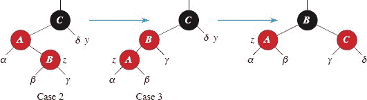

**图 13.6** 过程 RB-INSERT-FIXUP 的第 2 和第 3 情况。与情况 1 一样，因为 `z` 和其父节点 `z.p` 都是红色的，所以在情况 2 或情况 3 中违反了属性 4。子树 `α`、`β`、`γ` 和 `δ` 中的每一个都有一个黑色的根（`α`、`β` 和 `γ` 来自属性 4，`δ` 是因为否则情况 1 将适用），并且每个子树的黑高度相同。情况 2 通过左旋转转换为情况 3，这保持了属性 5：从一个节点到叶子的所有向下简单路径具有相同数量的黑色节点。情况 3 导致一些颜色变化和右旋转，这也保持了属性 5。`while` 循环终止，因为属性 4 被满足：不再有两个相邻的红色节点。

**情况 1\. z 的叔叔 y 是红色的**

图 13.5 展示了情况 1（第 5–8 行），当 `z.p` 和 `y` 都是红色时发生。因为 `z` 的祖父 `z.p.p` 是黑色的，它的黑色可以向下传递一级到 `z.p` 和 `y`，从而修复 `z` 和 `z.p` 都是红色的问题。在黑色向下传递一级后，`z` 的祖父变为红色，从而保持属性 5。`while` 循环重复，`z.p.p` 作为新节点 `z`，因此指针 `z` 在树中向上移动两级。  

现在，我们展示情况 1 在下一次迭代开始时保持循环不变量。我们使用 `z` 表示当前迭代中的节点 `z`，`z′ = z.p.p` 表示下一次迭代时在第 1 行的测试中将被称为节点 `z` 的节点。

a. 因为此迭代将 `z.p.p` 着色为红色，所以在下一���迭代开始时，节点 `z'` 是红色的。

b. 在此迭代中，节点 `z'p` 是 `z.p.p.p`，此节点的颜色不会改变。如果此节点是根节点，则在此迭代之前它是黑色的，并且在下一次迭代开始时仍然是黑色的。

c. 我们已经证明情况 1 保持属性 5，并且不会引入属性 1 或 3 的违反。

如果节点 `z'` 在下一次迭代开始时是根节点，则情况 1 修正了此迭代中属性 4 的唯一违反。由于 `z'` 是红色的且是根节点，属性 2 成为唯一违反的属性，而此违反是由 `z'` 引起的。

如果节点 `z'` 在下一次迭代开始时不是根节点，则情况 1 没有引入属性 2 的违反。情况 1 修正了此迭代开始时存在的属性 4 的唯一违反。然后将 `z'` 着色为红色，并保持 `z'.p` 不变。如果 `z'.p` 是黑色的，则不会违反属性 4。如果 `z'.p` 是红色的，则将 `z'` 着色为红色会导致属性 4 有一个违反，即 `z'` 和 `z'.p` 之间的违反。

**情况 2\. z 的叔叔 y 是黑色且 z 是右子节点**

**情况 3\. z 的叔叔 y 是黑色且 z 是左子节点**

在情况 2 和 3 中，`z`的叔叔`y`是黑色的。我们根据`z`的父节点`z.p`是红色且是左子节点的情况，区分这两种情况，分别对应`z`是`z.p`的右子节点或左子节点。第 11-12 行构成情况 2，与图 13.6 一起展示了情况 3。在情况 2 中，节点`z`是其父节点的右子节点。左旋立即将情况转换为情况 3（第 13-15 行），其中节点`z`是左子节点。由于`z`和`z.p`都是红色的，旋转不会影响节点的黑高度或性质 5。无论情况 3 是直接执行还是通过情况 2 执行，`z`的叔叔`y`都是黑色的，否则情况 1 就会执行。此外，节点`z.p.p`存在，因为我们已经证明这个节点在执行第 2 和第 3 行时存在，并且在第 11 行将`z`上移一级然后在第 12 行将其下移一级后，`z.p.p`的身份保持不变。情况 3 执行一些颜色变化和右旋转，以保持性质 5。此时，不再有两个相邻的红色节点。`while`循环在下一次测试中终止，因为`z.p`现在是黑色的。

我们现在展示情况 2 和 3 如何保持循环不变性。（正如我们刚才所讨论的，`z.p`在下一次测试时将是黑色的，并且循环体不会再次执行。）

a. 情况 2 使`z`指向`z.p`，`z.p`是红色的。在情况 2 和 3 中，`z`或其颜色不再发生改变。

b. 情况 3 使`z.p`变为黑色，因此如果`z.p`在下一次迭代开始时是根，则它是黑色的。

c. 与情况 1 一样，在情况 2 和 3 中保持性质 `1`、`3` 和 `5`。

由于节点`z`在情况 2 和 3 中不是根，我们知道不会违反性质 2。情况 2 和 3 不会引入性质 2 的违反，因为在情况 3 的旋转中，唯一变为红色的节点成为黑色节点的子节点。  

情况 2 和 3 纠正了性质 4 的唯一违反，并且不会引入其他违反。

**终止：** 观察到如果只发生情况 1，则节点指针`z`在每次迭代中向根移动，因此最终`z.p`将是黑色的。（如果`z`是根，则`z.p`是哨兵`T.nil`，它是黑色的。）如果发生情况 2 或情况 3，则我们已经看到循环终止。由于循环终止是因为`z.p`是黑色的，所以在循环终止时树不会违反性质 4。根据循环不变性，可能不满足的唯一性质是性质 2。第 30 行通过将根节点着色为黑色来恢复此性质，因此当 RB-INSERT-FIXUP 终止时，所有红黑树性质都成立。

因此，我们已经证明了 `RB-INSERT-FIXUP` 正确恢复了红黑树的性质。

**`分析`**  

RB-INSERT 的运行时间是多少？由于红黑树在`n`个节点上的高度是`O`(`lg n`)，RB-INSERT 的第 1-16 行需要`O`(`lg n`)的时间。在 RB-INSERTFIXUP 中，`while`循环仅在发生情况 1 时重复，然后指针`z`向树上移动两级。`while`循环可以执行的总次数因此是`O`(`lg n`)。因此，RB-INSERT 总共需要`O`(`lg n`)的时间。此外，它永远不会执行超过两次旋转，因为`while`循环在执行情况 2 或情况 3 时终止。

**练习**

**13.3-1**

RB-INSERT 的第 16 行将新插入节点`z`的颜色设置为红色。如果将`z`的颜色设置为黑色，那么红黑树的性质 4 就不会被违反。为什么不将`z`的颜色设置为黑色呢？

**13.3-2**

展示在将键 `41`、`38`、`31`、`12`、`19`、`8` 依次插入到初始为空的红黑树中后得到的红黑树。

`13.3-3`

假设图 `13.5` 和 `13.6` 中每个子树*α*、*β*、*γ*、*δ*、*ϵ*的黑高度为`k`。用每个图中的节点的黑高度标记每个节点，以验证所示的变换保持属性 `5`。

`13.3-4`

教授 Teach 担心 RB-INSERT-FIXUP 可能会将`T.nil.color`设置为 RED，这样当`z`是根时，第 1 行的测试不会导致循环终止。通过论证 RB-INSERT-FIXUP 永远不会将`T.nil.color`设置为 RED，证明教授的担忧是没有根据的。  

`13.3-5`

考虑通过`RB-INSERT`插入`n`个节点形成的红黑树。证明如果`n > 1`，则该树至少有一个红色节点。

**`13.3-6`**  

建议如何高效实现 `RB-INSERT`，如果红黑树的表示不包括父指针的存储。  

**13.4 删除**

与在`n`个节点的红黑树上的其他基本操作一样，从红黑树中删除节点需要`O`(`lg n`)时间。从红黑树中删除节点比插入节点更复杂。  

从红黑树中删除节点的过程基于第 325 页的 `TREE-DELETE` 过程。首先，我们需要定制 `TREE-DELETE` 调用的第 324 页的 `TRANSPLANT` 子程序，以便它适用于红黑树。与 `TRANSPLANT` 类似，新的 `RB-TRANSPLANT` 过程将以节点`u`为根的子树替换为以节点`v`为根的子树。`RB-TRANSPLANT` 过程与 `TRANSPLANT` 有两种不同之处。首先，第 1 行引用哨兵`T.nil`而不是`NIL`。其次，在第 6 行中对`v.p`的赋值是无条件的：即使`v`指向哨兵，该过程也可以对`v.p`进行赋值。我们将利用对`v.p`进行赋值的能力，当`v = T.nil`时。

`RB-TRANSPLANT(T, u, v)`  

| 1 | **如果** `u.p` == `T.nil` |
| --- | --- |
| --- | --- |
| \| 2 \| `T.root = v` \|  |
| \| `3` \| **否则如果** `u == u.p.left` \| |
| `4` | `u.p.left = v` |
| `5` | **否则** `u.p.right = v` |  |
| 6 | `v.p = u.p` |

下一页的 RB-DELETE 过程类似于 TREE-DELETE 过程，但有额外的伪代码行。额外的行处理可能涉及违反红黑属性的节点`x`和`y`。当要删除的节点`z`最多有一个子节点时，`y`将是`z`。当`z`有两个子节点时，就像 TREE-DELETE 一样，`y`将是`z`的后继，后继没有左子节点，并移动到树中`z`的位置。此外，`y`继承`z`的颜色。在任一情况下，节点`y`最多有一个子节点：节点`x`，它取代`y`在树中的位置。（如果`y`没有子节点，则节点`x`将是哨兵`T.nil`。）由于节点`y`将被从树中删除或在树中移动，因此该过程需要跟踪`y`的原始颜色。如果删除节点`z`后可能违反红黑属性，则 RB-DELETE 调用辅助过程 RB-DELETE-FIXUP，该过程更改颜色并执行旋转以恢复红黑属性。

尽管 RB-DELETE 的伪代码行数几乎是 TREE-DELETE 的两倍，但两个过程具有相同的基本结构。您可以在 RB-DELETE 中找到 TREE-DELETE 的每一行（将 NIL 替换为`*T.nil*`，将对 TRANSPLANT 的调用替换为对 RB-TRANSPLANT 的调用），在相同条件下执行。

具体来说，以下是两个过程之间的其他差异：

+   第 1 行和第 9 行将节点`y`设置为上述描述：当节点`z`最多有一个子节点时为第 1 行，当`z`有两个子节点时为第 9 行。

+   由于节点`y`的颜色可能会改变，变量`y-original-color`在任何更改发生之前存储`y`的颜色。第 2 行和第 10 行在对`y`赋值后立即设置这个变量。当节点`z`有两个子节点时，节点`y`和`z`是不同的。在这种情况下，第 17 行将`y`移动到树中`z`的原始位置（即在调用 RB-DELETE 时`z`在树中的位置），第 20 行将`y`赋予与`z`相同的颜色。当节点`y`最初是黑色时，移除或移动它可能导致违反红黑属性，这些违反通过第 22 行调用的 RB-DELETE-FIXUP 来纠正。

`RB-DELETE(T, z)`  

|   1 | `y = z` |  |   |
| --- | --- | --- |
|   2 | `y-original-color = y.color` |  |   |
| `3` | `if` *z.left* == *T.nil* |  |
|   4 | `x = z.right` |  |   |
|   5 | RB-TRANSPLANT(`T`, `z`, `z.right`) | **//** 用其右子节点替换`z` |
|   `6` | **`elseif`** `z.right == T.nil` |  |
|   7 | `x = z.left` |  |   |
|   8 | RB-TRANSPLANT(`T`, `z`, `z.left`) | **//** 用其左子节点替换`z` |   |
|   9 | **else** `y = TREE-MINIMUM(z.right)` | **//** `y`是`z`的后继 |
| `10` | `y-original-color = y.color` |  |
| 11 | `x = y.right` |  |
| `12` | `if` `y ≠ z.right` |  | **//** `y`是否在树中更深处？ |   |
| `13` | `RB-TRANSPLANT(T, y, y.right)` | **//** 用其右子节点替换`y` |   |
| `14` | `y.right = z.right` |  | **//** `z`的右子节点变为 |
| `15` | `y.right.p = y` |  | **//** `y`的右子节点 |
| `16` | **else** `x.p = y` |  | **//** 如果`x`是`T.nil`的情况 |
| 17 | RB-TRANSPLANT(`T`, `z`, `y`) |  | **//** 用其后继`y`替换`z` |   |
| `18` | `y.left = z.left` |  | **//** 将`z`的左子节点给`y`， |   |
| 19 | `y.left.p = y` |  | **//** 没有左子节点 |
| 20 | y.color = z.color |  |
| `21` | `if` `y-original-color` == BLACK | **//** 如果出现任何红黑违规情况， |
| `22` | `RB-DELETE-FIXUP(T, x)` | **//** 修正它们 |   |

+   如前所述，该过程在调用时跟踪移动到节点`y`的原始位置的节点`x`。第 4、7 和 11 行的赋值将`x`设置为指向`y`的唯一子节点，或者如果`y`没有子节点，则指向哨兵`T.nil`。

+   由于节点`x`移动到节点`y`的原始位置，属性`x.p`必须正确设置。如果节点`z`有两个子节点且`y`是`z`的右子节点，则`y`只是移动到`z`的位置，`x`仍然是`y`的子节点。第 12 行检查这种情况。尽管你可能认为在第 16 行将`x.p`设置为`y`是不必要的，因为`x`是`y`的子节点，但是 RB-DELETE-FIXUP 的调用依赖于`x.p`是`y`，即使`x`是`T.nil`。因此，当`z`有两个子节点且`y`是`z`的右子节点时，如果`y`的右子节点是`T.nil`，执行第 16 行是必要的，否则不会改变任何内容。

    否则，节点`z`要么与节点`y`相同，要么是`y`的原始父节点的正确祖先。在这些情况下，第 5、8 和 13 行的 RB-TRANSPLANT 调用在 RB-TRANSPLANT 的第 6 行中正确设置`x.p`。（在这些 RB-TRANSPLANT 的调用中，传递的第三个参数与`x`相同。）

+   最后，如果节点`y`是黑色的，可能会出现一个或多个违反红黑属性的情况。第 22 行调用 RB-DELETE-FIXUP 来恢复红黑属性。如果`y`是红色的，当`y`被移除或移动时，红黑属性仍然保持，原因如下：

    1.  树中没有黑高度发生变化。（参见练习 13.4-1。）

    1.  没有使红色节点相邻。如果`z`最多有一个子节点，则`y`和`z`是同一节点。该节点被移除，一个子节点取代它。如果被移除的节点是红色的，则其父节点和子节点也不能是红色，因此移动一个子节点来取代它不会导致两个红色节点相邻。另一方面，如果`z`有两个子节点，则`y`在树中取代`z`的位置，连同`z`的颜色，因此在树中`y`的新位置不可能有两个相邻的红色节点。此外，如果`y`不是`z`的右子节点，则`y`的原始右子节点`x`在树中取代`y`。由于`y`是红色的，`x`必须是黑色的，因此用`x`替换`y`不会导致两个红色节点相邻。

    1.  因为如果`y`是红色的话，`y`不可能是根，所以根节点保持黑色。

如果节点`y`是黑色的，可能会出现三个问题，RB-DELETE-FIXUP 的调用将解决这些问题。首先，如果`y`是根，且`y`的一个红色子节点成为新根，那么属性 2 就被违反了。其次，如果`x`及其新父节点都是红色，则属性 4 被违反。第三，将`y`在树中移动会导致以前包含`y`的任何简单路径的黑色节点减少一个。因此，树中`y`的任何祖先现在都违反了属性 5。我们可以通过说当黑色节点`y`被移除或移动时，其黑色传递给移动到`y`原始位置的节点`x`来纠正属性 5 的违反，给`x`增加一个“额外”的黑色。也就是说，如果我们在包含`x`的任何简单路径上的黑色节点计数中添加 1，那么根据这种解释，属性 5 成立。但现在另一个问题出现了：节点`x`既不是红色也不是黑色，从而违反了属性 1。相反，节点`x`是“双重黑色”或“红黑色”，分别对包含`x`的简单路径上的黑色节点计数贡献 2 或 1。`x`的`color`属性仍然是 RED（如果`x`是红黑色）或 BLACK（如果`x`是双重黑色）。换句话说，节点上的额外黑色反映在`x`指向节点而不是`color`属性上。

下一页的 RB-DELETE-FIXUP 过程恢复属性 `1`、`2` 和 `4`。练习 `13.4-2` 和 `13.4-3` 要求您展示该过程恢复了属性 `2` 和 `4`，因此在本节的其余部分，我们将专注于属性 `1`。第 `1-43` 行中的`while`循环的目标是将额外的黑色沿树向上移动，直到

1.  `x`指向��黑色节点，此时第 44 行将`x`着色为（单一）黑色；

1.  `x`指向根，此时额外的黑色简单消失；

1.  经过适当的旋转和重新着色后，循环退出。

与 RB-INSERT-FIXUP 类似，RB-DELETE-FIXUP 过程处理两种对称情况：当节点`x`是左子节点时的第 3-22 行，以及当`x`是右子节点时的第 24-43 行。我们的证明集中在第 3-22 行中显示的四种情况上。

在`while`循环中，`x`始终指向非根的双重黑色节点。第 2 行确定`x`是其父节点`x.p`的左子节点还是右子节点，以便在给定迭代中执行第 3-22 行或 24-43 行。`x`的兄弟始终由指针`w`表示。由于节点`x`是双重黑色，节点`w`不能是`T.nil`，否则，从`x.p`到（单黑色）叶子`w`的简单路径上的黑色数量将小于从`x.p`到`x`的简单路径上的数量。  

回想一下，RB-DELETE 过程总是在调用 RB-DELETE-FIXUP 之前（无论是在第 13 行的 RB-TRANSPLANT 调用中还是第 16 行的赋值中）分配\*x.p\*，即使节点\*x\*是哨兵\*T.nil\*。这是因为 RB-DELETE-FIXUP 在几个地方引用\*x\*的父节点\*x.p\*，而这个属性必须指向在 RB-DELETE 中成为\*x\*父节点的节点，即使\*x\*是\*T.nil\*。

图 13.7 展示了当节点`x`是左子节点时代码中的四种情况。（与 RB-INSERT-FIXUP 一样，RB-DELETE-FIXUP 中的情况并不是互斥的。）在详细研究每种情况之前，让我们更一般地看看如何验证每种情况中的转换如何保持属性 5\. 关键思想是，在每种情况下，应用的转换保持了从（包括`x`的额外黑色）子树的根节点到每个子树`α`、`β`、…、`ζ`的根节点的黑色节点数。因此，如果在转换之前属性 5 成立，则转换后仍然成立。例如，在图 13.7(a)中，这说明了情况 1，从根节点到`α`或`β`子树的根节点的黑色节点数为 3，无论是在转换前还是转换后。（再次提醒，节点`x`添加了额外的黑色。）同样，从根节点到任何`γ`、`δ`、`ϵ`和`ζ`中的任何一个的根节点的黑色节点数为 2，无论是在转换前还是在转换后。² 在图 13.7(b)中，计数必涉及所示子树的根节点的`color`属性的值`c`，它可以是红色或黑色。

修正红黑树删除(`T`, `x`)

|   1 | **当** `x ≠ T.root` **且** `x.color` == 黑色 **时** |  |
| --- | --- | --- |
| --- | --- |   |
| `  2 ` | **如果** `x == x.p.left` | **//** `x` 是左子节点吗？ |
| `3` | `w = x.p.right` | **//** `w` 是 `x` 的兄弟节点 |
|   4 | **如果** `w.color` == 红色 |
|   5 | `w.color` = 黑色 | 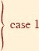 |
|   6 | `x.p.color` = 红色 |
|   7 | 左旋转(`T`, `x.p`) |
|   8 | `w = x.p.right` |   |
|   9 | **如果** `w.left.color` == 黑色 **且** `w.right.color` == 黑色 |   |
| \| 10 \| `w.color` = 红色 \|  \|   |
| 11 | x = x.p |
| 12 | **否则** |
| 13 | **如果** `w.right.color` == 黑色 |
| \| 14 \| `w.left.color` = 黑色 \| 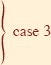 \| |
| 15 | `*w.color* = 红色` |
| \| 16 \| 右旋转(`T, w`) \|  输出： |
| 17 | `w = x.p.right` |  |
| `18` | `w.color = x.p.color` | 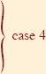 |   |
| 19 | x.p.color = 黑色 |
| 20 | w.right.color = 黑色 | `   |
| 21 | 左旋转(`T, x.p`) |
| 22 | `x = T.root` |
| 23 | **否则** **//** 与行 3-22 相同，但“right”和“left”交换 |
| `24` | `w = x.p.left` |   |
| 25 | **如果** `w.color` == 红色 |
| `26` | `w.color` = 黑色 |   |
| 27 | `x.p.color` = 红色 |   |
| 28 | 右旋转(`T`, `x.p`) |   |
| 29 | `w = x.p.left` |  |
| `30` | **如果** *w.right.color* == 黑色 **且** *w.left.color* == 黑色 |
| 31 | `w.color` = 红色 |
| 32 | x = x.p | `   |
| `33` | **否则** |  输出： |
| `34` | **如果** `w.left.color` == 黑色 |
| `35` | *w.right.color* = 黑色 |
| 36 | `w.color` = 红色 |
| 37 | 左旋转(`T`, `w`) |
| 38 | `w = x.p.left` |   |
| 39 | `w.color = x.p.color` |
| 40 | `x.p.color` = 黑色 |   |
| 41 | `w.left.color` = 黑色 |   |
| `42` | 右旋转(`T`, `x.p`) |  |
| 43 | `x = T.root` |   |
| 44 | x.color = 黑色 |

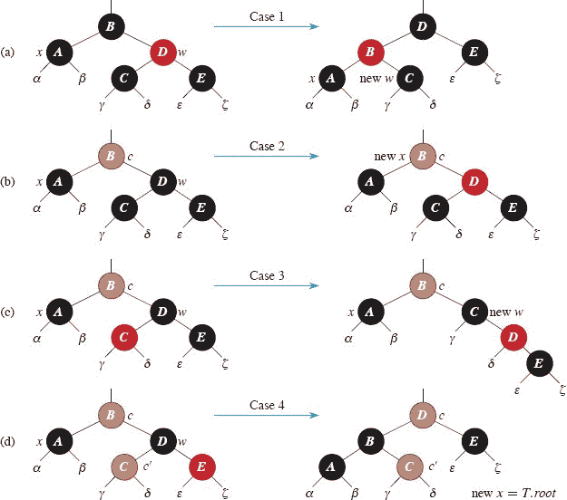

**图 13.7** 过程 RB-DELETE-FIXUP 中第 3–22 行中的情况。棕色节点具有由 `c` 和 `c`′ 表示的 `color` 属性，可以是 RED 或 BLACK。字母 `α`、`β`、…、`ζ` 代表任意子树。每种情况通过改变一些颜色和/或执行旋转，将左侧的配置转换为右侧的配置。任何被 `x` 指向的节点都有额外的黑色，要么是双重黑色，要么是红黑相��的。只有情况 2 会导致循环重复。**(a)** 情况 1 通过交换节点 `B` 和 `D` 的颜色并执行左旋转转换为情况 2、3 或 4。**(b)** 在情况 2 中，由指针 `x` 表示的额外黑色通过将节点 `D` 着色为红色并将 `x` 指向节点 `B` 来沿树上移。如果情况 2 是通过情况 1 进入的，`while` 循环会终止，因为新节点 `x` 是红黑相间的，因此其 `color` 属性的值是 RED。**(c)** 情况 3 通过交换节点 `C` 和 `D` 的颜色并执行右旋转转换为情况 4。**(d)** 情况 4 通过改变一些颜色并执行左旋转（不违反红黑属性）来移除由 `x` 表示的额外黑色，然后循环终止。

如果我们定义 count(RED) = 0 和 count(BLACK) = 1，那么从根节点到 `α` 的黑色节点数为 2 + count(c)，在变换前后都是如此。在这种情况下，变换后，新节点 x 具有 color 属性 c，但这个节点实际上是红黑相间的（如果 c = RED）或者双重黑色的（如果 c = BLACK）。你可以类似地验证其他情况（参见练习 13.4-6）。

**情况 1\. x 的兄弟节点`w`是红色**

情况 1（第 5–8 行和 图 13.7(a)）发生在节点 `w`，即节点 `x` 的兄弟节点，是红色的情况下。由于 `w` 是红色的，它必须有黑色的子节点。这种情况会交换 `w` 和 `x.p` 的颜色，然后在不违反任何红黑属性的情况下对 `x.p` 执行左旋转。`x` 的新兄弟节点，在旋转之前是 `w` 的子节点之一，现在是黑色的，因此情况 1 转换为情况 2、3 或 4 中的一种。

当节点 `w` 是黑色时，情况 2、3 和 4 是由 `w` 的子节点的颜色区分的。

**情况 2\. x 的兄弟节点 w 是黑色，且 w 的两个子节点都是黑色**  

在情况 2（第 10–11 行和 图 13.7(b)）中，`w` 的两个子节点都是黑色。由于 `w` 也是黑色，这种情况会从 `x` 和 `w` 中各移除一个黑色，使得 `x` 只剩下一个黑色，而 `w` 变成红色。为了弥补 `x` 和 `w` 每个失去一个黑色，`x` 的父节点 `x.p` 可以多接收一个黑色。第 11 行通过将 `x` 上移一级来实现这一点，这样 `while` 循环会以 `x.p` 作为新节点 `x` 重复。如果情况 2 是通过情况 1 进入的，新节点 `x` 就是红黑相间的，因为原始的 `x.p` 是红色的。因此，新节点 `x` 的 `color` 属性的值 `c` 是 RED，当测试循环条件时，循环终止。然后第 44 行将新节点 `x`（单独）着色为黑色。

** **情况 3\. x 的兄弟节点`w`是黑色，`w`的左子节点是红色，`w`的右子节点是黑色**  

情况 3（第 14–17 行和 图 13.7(c)）发生在 `w` 是黑色的情况下，它的左子节点是红色的，右子节点是黑色的情况。这种情况会交换 `w` 和它的左子节点 `w.left` 的颜色，然后在不违反任何红黑属性的情况下对 `w` 执行右旋转。`x` 的新兄弟节点 `w` 现在是一个黑色节点，有一个红色的右子节点，因此情况 3 转换为情况 4。

**情况 4\. x 的兄弟节点 `w` 是黑色，且 `w` 的右子节点是红色**  

第 4 案例（第 18-22 行和图 13.7(d)）发生在节点`x`的兄弟`w`是黑色且`w`的右子节点是红色时。对`x.p`进行一些颜色更改和左旋转可以使`x`上的额外黑色消失，使其变为单黑色，而不违反任何红黑属性。第 22 行将`x`设置为根，`while`循环在下一次测试循环条件时终止。

**分析**

RB-DELETE 的运行时间是多少？由于`n`个节点的红黑树的高度是`O(lg n)`，因此在没有调用 RB-DELETE-FIXUP 的情况下，该过程的总成本为`O(lg n)`时间。在 RB-DELETE-FIXUP 中，案例 1、3 和 4 中的每一种情况在执行一定数量的颜色更改和最多三次旋转后终止。案例 2 是唯一一种可能重复`while`循环的情况，然后指针`x`最多向上移动树`O(lg n)`次，不执行旋转。因此，RB-DELETE-FIXUP 过程需要`O(lg n)`时间，并且执行最多三次旋转，因此 RB-DELETE 的总体时间也是`O(lg n)`。

**练习**

`13.4-1`

证明如果 RB-DELETE 中的节点`y`是红色，则黑高度不会改变。

**`13.4-2`**  

论证 `RB-DELETE-FIXUP` 执行后，树的根必须是黑色。

`13.4-3`

论证如果在 RB-DELETE 中`x`和`x.p`都是红色，则通过调用 RB-DELETE-FIXUP(`T`, `x`)可以恢复属性 4。

`13.4-4`

在第 346 页的练习 13.3-2 中，您找到了通过依次插入键 `41`、`38`、`31`、`12`、`19`、`8` 到初始空树中得到的红黑树。现在展示依次删除键 `8`、`12`、`19`、`31`、`38`、`41` 后得到的红黑树。

`13.4-5`

RB-DELETE-FIXUP 代码的哪些行可能检查或修改哨兵`T.nil`？

`13.4-6`

在图 13.7 的每种情况中，从所示子树的根到每个子树`α`、`β`、…、`ζ`的根，给出黑色节点的计数，并验证每次转换后计数保持不变。当节点具有*颜色*属性`c`或`c`′时，在计数中使用符号计数(`c`)或计数(`c`′)。  

`13.4-7`

Skelton 教授和 Baron 教授担心在 RB-DELETE-FIXUP 的第 1 个案例开始时，节点`x.p`可能不是黑色。如果`x.p`不是黑色，则第 5-6 行是错误的。证明`x.p`在第 1 个案例开始时必须是黑色，这样教授们就不必担心了。

`13.4-8`

将节点`x`插入红黑树中，并立即使用 RB-DELETE 删除。结果得到的红黑树总是与初始红黑树相同吗？证明你的答案。

★ `13.4-9`

考虑操作 RB-ENUMERATE(`T`, `r`, `a`, `b`)，它输出所有在红黑树`T`中以节点`r`为根的子树中满足`a ≤ k ≤ b`的键`k`。描述如何在Θ(`m + lg n`)时间内实现 RB-ENUMERATE，其中`m`是输出的键的数量。假设`T`中的键是唯一的，并且值`a`和`b`出现为`T`中的键。如果`a`和`b`可能不出现在`T`中，您的解决方案会如何改变？

输出：

**13-1     持久动态集**

在算法过程中，有时您会发现需要在更新时保持动态集的过去版本。我们称这样的集合为**持久**。实现持久集合的一种方法是每次修改时复制整个集合，但这种方法可能会减慢程序速度，同时也会消耗大量空间。有时，您可以做得更好。

考虑一个具有 `INSERT`、`DELETE` 和 `SEARCH` 操作的持久集合`S`，你使用二叉搜索树来实现，如图 13.8(a)所示。为每个版本的集合维护一个单独的根。为了将键 5 插入集合中，创建一个具有键 5 的新节点。这个节点成为具有键 7 的新节点的左子节点，因为你不能修改具有键 7 的现有节点。类似地，具有键 7 的新节点成为具有键 10 的现有节点的左子节点。具有键 8 的新节点依次成为具有键 3 的现有节点的右子节点。因此，你只复制树的一部分，并与原始树共享一些节点，如图 13.8(b)所示。

假设每个树节点都有属性`key`、`left`和`right`，但没有父节点。（另见第 346 页上的练习 13.3-6。）

**`a.`** 对于一个持久性二叉搜索树（不是红黑树，只是一个二叉搜索树），确定插入或删除节点时需要更改的节点。

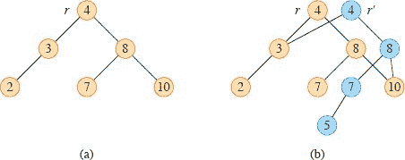

**图 `13.8 (a)`** 具有键 `2`、`3`、`4`、`7`、`8`、`10` 的二叉搜索树。**`(b)`** 插入键 `5` 后得到的持久性二叉搜索树。最新版本的集合由从根`r′`可达的节点组成，而上一个版本由从`r`可达的节点组成。插入键 `5` 时添加了蓝色节点。

**b.** 编写一个过程 `PERSISTENT-TREE-INSERT(T, z)`，给定一个持久性二叉搜索树`T`和要插入的节点`z`，返回一个新的持久树`T′`，即将`z`插入`T`的结果。假设你有一个过程 `COPY-NODE(x)`，它复制节点`x`，包括其所有属性。

**c.** 如果持久性二叉搜索树`T`的高度为`h`，那么你对 PERSISTENT-TREE-INSERT 的实现需要的时间和空间是多少？（空间需求与被复制的节点数量成正比。）

**d.** 假设你在每个节点中包含了父属性。在这种情况下，`PERSISTENT-TREE-INSERT` 过程需要执行额外的复制。证明 `PERSISTENT-TREE-INSERT` 需要`Ω(n)`的时间和空间，其中`n`是树中节点的数量。

**e.** 展示如何使用红黑树来保证最坏情况下的运行时间和空间为每次插入或删除都是`O`(`lg n`)。你可以假设所有键都是不同的。

**13-2     红黑树上的连接操作**

**连接** 操作接受两个动态集合`S₁`和`S₂`以及一个元素`x`，对于任意`S₁`中的`x₁`和`S₂`中的`x₂`，我们有`x₁.key ≤ x.key ≤ x₂.key`。它返回一个集合`S = S₁ ⋃ {x} ⋃ S₂`。在这个问题中，我们研究如何在红黑树上实现连接操作。

**a.** 假设你将红黑树`T`的黑高度存储为新属性`T.bh`。论证 RB-INSERT 和 RB-DELETE 可以在不需要额外存储的情况下维护`bh`属性，并且不增加渐近运行时间。展示如何确定通过`T`下降时访问的每个节点的黑高度，每个访问的节点使用`O(1)`的时间。

设`T₁`和`T₂`为红黑树，`x`为一个键值，对于`T₁`中的任意节点`x₁`和`T₂`中的节点`x₂`，我们有`x₁.key ≤ x.key ≤ x₂.key`。你将展示如何实现操作 RB-JOIN(`T₁`, `x`, `T₂`)，该操作销毁`T₁`和`T₂`，并返回一个红黑树`T = T₁ ⋃ {x} ⋃ T₂`。设`n`为`T₁`和`T₂`中节点的总数。

**b.** 假设`T₁.bh ≥ T₂.bh`。描述一个在`T₁`中找到具有最大键的黑节点`y`的`O`(`lg n`)时间算法，其中`y`的黑高度为`T₂.bh`。

**c.** 让`T[y]`表示以`y`为根的子树。描述如何在`O(1)`时间内用`T[y]` ⋃ `{x}` ⋃ `T₂`替换`T[y]`，而不破坏二叉搜索树的性质。

**d.** 为了保持红黑属性 1、3 和 5，你应该让`x`是什么颜色？描述如何在`O`(`lg n`)时间内强制执行属性 2 和 4。

**e.** 论证通过在部分`b`中做出的假设不会失去一般性。描述当`T₁.bh ≤ T₂.bh`时出现的对称情况。

**`f.`** 论证 RB-JOIN 的运行时间为`O(lg n)`。

**13-3     AVL 树**

**AVL 树**是一种`高度平衡`的二叉搜索树：对于每个节点`x`，`x`的左右子树的高度最多相差 1。为了实现 AVL 树，在每个节点中保持额外的属性`h`，使得`x.h`是节点`x`的高度。对于任何其他二叉搜索树`T`，假设`T.root`指向根节点。  

**a.** 证明具有`n`个节点的 AVL 树的高度为`O`(`lg n`)。(*提示:* 证明高度为`h`的 AVL 树至少有`F[h]`个节点，其中`F[h]`是第`h`个斐波那契数。)  

**b.** 要插入 AVL 树，首先按照二叉搜索树顺序将一个节点放入适当的位置。之后，树可能不再是高度平衡的。具体来说，某些节点的左右子节点的高度可能相差 2。描述一个过程 `BALANCE(x)`，它接受以`x`为根的子树，其左右子节点是高度平衡的，并且高度最多相差 2，即 |`x.right.h` − `x.left.h`| ≤ 2，并改变以`x`为根的子树以保持高度平衡。该过程应返回进行修改后的子树的根节点的指针。(*提示:* 使用旋转。)

**c.** 使用部分`b`，描述一个递归过程 AVL-INSERT(`T`, `z`)，它接受一个 AVL 树`T`和一个新创建的节点`z`（其键已经填充），并将`z`添加到`T`中，保持`T`是 AVL 树的性质。与第 12.3 节中的 TREE-INSERT 一样，假设`z.key`已经填充，并且`z.left` = NIL 和`z.right` = NIL。还假设`z.h = 0`。  

**d.** 证明在一个`n`节点的 AVL 树上运行 AVL-INSERT，花费`O`(`lg n`)时间并执行`O`(`lg n`)次旋转。

**章节注释**

平衡搜索树的概念归功于 Adel’son-Vel’skiĭ和 Landis [2]，他们在 1962 年引入了一类称为“AVL 树”的平衡搜索树，描述在问题 13-3 中。另一类搜索树，称为“2-3 树”，是由 J. E. Hopcroft（未发表）在 1970 年引入的。2-3 树通过操纵树中节点的度来保持平衡，其中每个节点具有两个或三个子节点。第十八章介绍了 Bayer 和 McCreight 在[39]中引入的 2-3 树的泛化，称为“B 树”。  

红黑树是由 Bayer `38`在“对称二叉 B 树”名称下发明的。Guibas 和 Sedgewick `202`详细研究了它们的性质，并引入了红/黑颜色约定。Andersson `16`提供了红黑树的一种更简单的编码变体。Weiss `451`将这种变体称为 AA 树。AA 树类似于红黑树，只是左子节点永远不能是红色。

Sedgewick 和 Wayne[402]将红黑树呈现为 2-3 树的修改版本，其中具有三个子节点的节点被分割为具有两个子节点的两个节点。其中一个节点成为另一个节点的左子节点，只有左子节点可以是红色。他们将这种结构称为“左倾红黑二叉搜索树”。尽管左倾红黑二叉搜索树的代码比本章中的红黑树伪代码更简洁，但左倾红黑二叉搜索树上的操作不限制每次操作的旋转次数为一个常数。这种区别将在第十七章中变得重要。

Treaps，是二叉搜索树和堆的混合体，由 Seidel 和 Aragon 提出[404]。它们是 LEDA 中字典的默认实现[324]，LEDA 是一个实现良好的数据结构和算法集合。

还有许多其他平衡二叉树的变种，包括权重平衡树[344]、`k`-邻居树[318]和替罪羊树[174]。也许最引人注目的是 Sleator 和 Tarjan 引入的“伸展树”[418]，它们是“自调整的”。（参见 Tarjan[429]对伸展树的良好描述。）伸展树在没有任何显式平衡条件（如颜色）的情况下保持平衡。相反，每次访问时都在树内执行“伸展操作”（涉及旋转）。在`n`个节点的树上，每个操作的摊销成本（参见第十六章）为`O`(`lg n`)。据推测，伸展树的性能接近最佳离线基于旋转的树的一个常数因子。基于旋转的树的已知最佳竞争比率（参见第二十七章）是 Demaine 等人的 Tango Tree[109]。

Skip lists [369] 提供了一种替代平衡二叉树的方法。Skip list 是一个带有许多额外指针的链表。在一个包含`n`个元素的 skip list 上，每个字典操作的期望时间复杂度为`O`(`lg n`)。

¹ 尽管我们在这本书中尽量避免使用有性别倾向的语言，但英语缺乏一个中性的词来表示父母的兄弟姐妹。

² 如果属性 5 成立，我们可以假设从`γ`、`δ`、`ϵ`和`ζ`的根到叶子的路径比从`α`和`β`的根到叶子的路径多一个黑色节点。
