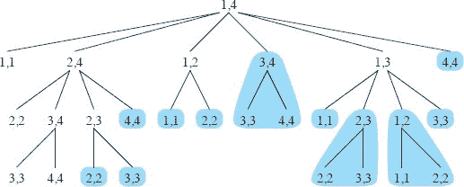

**14        动态规划**

动态规划，类似于分治方法，通过组合子问题的解来解决问题。（这里的“规划”指的是一种表格方法，而不是编写计算机代码。）正如我们在第二章和第四章中看到的，分治算法将问题划分为不相交的子问题，递归地解决子问题，然后组合它们的解来解决原始问题。相比之下，动态规划适用于子问题重叠的情况——也就是说，子问题共享子子问题。在这种情况下，分治算法做了比必要更多的工作，反复解决共同的子子问题。动态规划算法仅解决每个子子问题一次，然后将其答案保存在表中，从而避免每次解决子子问题时重新计算答案。

动态规划通常适用于`***优化问题***`。这些问题可能有许多可能的解决方案。每个解决方案都有一个值，您希望找到一个具有最优（最小或最大）值的解决方案。我们称这样的解决方案为问题的`*一个*最优解`，而不是`*最佳*解`，因为可能有几个解决方案可以达到最优值。

要开发动态规划算法，请按照以下四个步骤的顺序进行：

1.  描述最优解的结构。

1.  递归定义最优解的值。

1.  以自底向上的方式计算最优解的值。

1.  从计算信息中构建最优解。

步骤 `1-3` 构成了解决问题的动态规划解决方案的基础。如果您只需要最优解的值，而不需要解决方案本身，则可以省略第 4 步。当您执行第 4 步时，通常值得在第 3 步期间保留额外的信息，以便轻松构建最优解。

接下来的部分使用动态规划方法解决一些优化问题。第 14.1 节讨论了如何将一根棒子切割成长度更短的棒子，以最大化它们的总价值。第 14.2 节展示了如何在执行最少的标量乘法的同时乘以一串矩阵。鉴于这些动态规划的例子，第 14.3 节讨论了一个问题必须具备的两个关键特征，以便动态规划成为一种可行的解决技术。最后，第 14.5 节使用动态规划构建了根据已知密钥分布查找的二叉搜索树。  

**14.1    切割棒子**  

我们的第一个例子使用动态规划来解决一个简单的问题，即在哪里切割钢棒。Serling Enterprises 购买长钢棒并将其切割成较短的棒子，然后出售。每次切割都是免费的。Serling Enterprises 的管理层想知道最佳切割棒子的方法。

Serling Enterprises 有一张表，给出了当 `i` = 1, 2, … 时，他们为长度为 `i` 英寸的棒子收费 `p[i]` 美元。每根棒子的长度都是整数英寸。图 14.1 给出了一个示例价格表。

***切割棒子问题***如下。给定长度为 `n` 英寸的一根棒子和 `i` = 1, 2, …, `n` 的价格表 `p[i]`，确定通过切割棒子并出售碎片获得的最大收入 `r[n]`。如果长度为 `n` 的棒子价格 `p[n]` 足够高，则最优解可能根本不需要切割。

考虑`n = 4`的情况。图 14.2 展示了将长度为 4 英寸的棒材切割的所有方法，包括完全不切割的方式。将一根 4 英寸的棒材切成两个 2 英寸的小段可以产生收入`p₂ + p₂ = 5 + 5 = 10`，这是最佳的。  

Serling Enterprises 可以将长度为`n`的棒材切割成 `2^(n−1)` 种不同的方式，因为他们可以在距左端`i`英寸处独立选择切割或不切割，对于`i` = 1, 2, …, `n` − 1。我们使用普通加法符号表示将棒材分解成段，因此 7 = 2 + 2 + 3 表示长度为 7 的棒材被切成三段——两段长度为 2，一段长度为 3。如果最佳解将棒材切成`k`段，对于某个 1 ≤ `k` ≤ `n`，则最佳分解

`n = i₁ + i₂ + ⋯ + i[k]`  

**图 14.1** 一张棒材价格表。每根长度为`i`英寸的棒材为公司赚取`p[i]`美元的收入。

``  

**图 14.2** 将长度为 4 的棒材切割成 8 种可能的方式。每个段上方是根据图 14.1 的样本价格表的价值。最佳策略是部分(c)——将棒材切成两段长度为 2，总价值为 10。

将棒材切割成长度为`i₁`、`i₂`、…、`i[k]`的段提供最大对应收入

对于图 14.1 中的示例问题，您可以通过检查确定最佳收入数字`r[i]`，对于`i` = 1, 2, …, 10，以及相应的最佳分解。

| `r₁ = 1` | 来自解 1 = 1 | (未切割), |
| --- | --- | --- |
| `r₂ = 5` | 来自解 2 = 2 | (未切割), |
| `r[3] = 8` | 来自解 3 = 3 | (未切割), |
| \| `r[4] = 10` \| 来自解 4 = 2 + 2, \| |
| `r[5] = 13` | 来自解 5 = 2 + 3, |
| `r[6] = 17` | 来自解 6 = 6 | (未切割), |
| \| `r[7] = 18` \| 来自解 7 = 1 + 6 或 7 = 2 + 2 + 3, \| |
| `r[8] = 22` | 来自解 8 = 2 + 6, |
| `r[9] = 25` | 来自解 9 = 3 + 6, |
| `r[10] = 30` | 来自解 10 = 10 | (未切割). |

更一般地，我们可以用较短棒材的最佳收入来表示`n ≥ 1` 的值 `r[n]`：

第一个参数`p[n]`对应于完全不切割并将长度为`n`的棒材原样出售。max 的其他`n` − 1 个参数对应于通过将棒材初始切割成大小为`i`和`n` − `i`的两段，对每个`i` = 1, 2, …, `n` − 1，然后最优地进一步切割这些段，从这两段获得收入`r[i]`和`r[n-i]`。由于事先不知道哪个`i`的值能够最大化收入，您必须考虑所有可能的`i`值，并选择最大化收入的值。如果最大收入来自未切割棒材，则还可以选择不切割`i`。

要解决大小为`n`的原始问题，您需要解决相同类型的较小问题。一旦进行第一次切割，两个结果段形成独立的棒材切割问题实例。整体最佳解包含了两个结果子问题的最佳解，最大化了这两段的收入。我们说棒材切割问题展现出***最优子结构***：问题的最佳解包含了相关子问题的最佳解，您可以独立解决这些子问题。

在一个相关但稍微简单的方式中为切割钢条问题安排递归结构，让我们将分解视为首先切下左端的长度为 `i` 的第一段，然后是长度为 `n` − `i` 的右侧剩余部分。只有剩余部分，而不是第一部分，可以进一步切割。以这种方式思考长度为 `n` 的钢条的每个分解：作为第一部分，后面跟着剩余部分的某种分解。然后我们可以通过说第一部分的大小为 `i = n`，收入为 `p[n]`，剩余部分大小为 0，对应收入为 `r₀` = 0，来表达没有任何切割的解决方案。因此，我们得到了以下方程（14.1）的简化版本：

在这个公式中，最优解体现在只解决了`一个`相关的子问题——剩余部分，而不是两个。  

**`递归自顶向下的实现`**

下一页的 CUT-ROD 程序以一种直接、自顶向下、递归的方式实现了方程(`14.2`)中隐含的计算。它以价格数组 `p`[1 : `n`] 和整数 `n` 作为输入，并返回长度为 `n` 的钢条的最大收入。对于长度 `n` = 0，没有收入是可能的，因此 CUT-ROD 在第 2 行返回 0。第 3 行将最大收入 `q` 初始化为 −∞，以便第 4–5 行的 `for` 循环正确计算 `q` = max {*p[i]* + CUT-ROD(`p`, `n` − `i`) : 1 ≤ `i` ≤ `n`}。然后第 6 行返回这个值。对 `n` 进行简单归纳证明，证明这个答案等于所需答案 *r[n]*，使用方程(`14.2`)。

`CUT-ROD(p, n)`

| `1` | **如果** `n` == 0 |
| --- | --- |
| 2 | **返回** 0 |
| 3 | q = −∞ | `   |
| `4` | **对于** `i = 1` **到** `n` |
| 5 | `q = max {q, p[i] + CUT-ROD(p, n - i)}` |
| 6 | **返回** q |

如果你在你喜欢的编程语言中编写 CUT-ROD 并在计算机上运行它，你会发现一旦输入大小变得相当大，你的程序运行时间会很长。对于 `n` = 40，你的程序可能需要几分钟，甚至可能超过一个小时。对于较大的 `n` 值，你还会发现每次增加 `n` 1，你的程序的运行时间大约会加倍。  

为什么 `CUT-ROD` 如此低效？问题在于 `CUT-ROD` 反复使用相同的参数值递归调用自身，这意味着它重复解决相同的子问题。图 14.3 展示了当 `n` = 4 时会发生什么：`CUT-ROD(p, n)` 为 `i` = 1, 2, …, `n` 调用 `CUT-ROD(p, n - i)`。等价地，`CUT-ROD(p, n)` 为每个 `j` = 0, 1, …, `n` - 1 调用 `CUT-ROD(p, j)`。当这个过程递归展开时，随着 `n` 的增长，所做的工作量呈指数级增长。

要分析 CUT-ROD 的运行时间，让 `T(n)` 表示对于特定值 `n` 调用 CUT-ROD(`p`, `n`) 的总次数。这个表达式等于递归树中以标记为 `n` 的根的子树中的节点数。计数包括其根处的初始调用。因此，`T(0)` = 1，且

最初的 `1` 是为了在根处的调用，术语 `T(j)` 计算由于调用 CUT-ROD(p, n - i)` 而产生的调用次数（包括递归调用），其中 `j = n - i`。正如练习 14.1-1 要求的那样，

因此，`CUT-ROD` 的运行时间是指数级的。

回顾起来，这种指数运行时间并不奇怪。`CUT-ROD` 明确考虑了切割长度为 `n` 的钢条的所有可能方式。有多少种方式？长度为 `n` 的钢条有 `n` − 1 个潜在的切割位置。切割钢条的每种可能方式在这 `n` − 1 个位置的某个子集上进行切割，包括空集，即不切割。将每个切割位置视为 `n` − 1 个元素集合的不同成员，您可以看到有 `2^(n−1)` 个子集。递归树中的每个叶子对应于切割钢条的一种可能方式。因此，递归树有 `2^(n−1)` 个叶子。从根到叶子的简单路径上的标签给出了在进行每次切割之前每个剩余右侧部分的大小。也就是说，标签给出了从钢条右端测量的相应切割点。

**图 14.3** 递归树显示了调用 CUT-ROD(`p, n`) 产生的递归调用，其中 `n = 4`. 每个节点标签给出了相应子问题的大小 `n`，因此从具有标签 `s` 的父节点到具有标签 `t` 的子节点的边对应于切割大小为 `s - t` 的初始部分并留下大小为 `t` 的剩余子问题。从根到叶子的路径对应于长度为 `n` 的钢条切割的 `2^(n-1)` 种方式之一。一般来说，这个递归树有 `2^n` 个节点和 `2^(n-1)` 个叶子。

**使用动态规划进行最优切割**

现在，让我们看看如何使用动态规划将`CUT-ROD`转换为高效算法。

动态规划方法的工作方式如下。与天真的递归解决方案中重复解决相同的子问题不同，安排每个子问题仅解决一次。实际上有一种明显的方法：第一次解决子问题时，`保存其解决方案`。如果以后需要再次引用此子问题的解决方案，只需查找它，而不是重新计算它。

保存子问题的解决方案会带来一个成本：额外的内存用于存储解决方案。因此，动态规划是一个`时间-内存权衡`的例子。节省可能是惊人的。例如，我们将使用动态规划从指数时间复杂度的切割钢条算法降低到 Θ(n²) 的时间复杂度算法。当涉及的*不同*子问题数量与输入规模的多项式成正比，并且您可以在多项式时间内解决每个子问题时，动态规划方法运行在多项式时间内。  

通常有两种等效的实现动态规划方法的方式。切割钢条问题的解决方案展示了它们两者。

第一种方法是`自顶向下`的`记忆化`方法。² 在这种方法中，您以自然的方式递归地编写过程，但修改为保存每个子问题的结果（通常在数组或哈希表中）。现在，该过程首先检查是否先前已解决了此子问题。如果是，则返回保存的值，在此级别节省进一步的计算。如果没有，则该过程以通常的方式计算值，同时也保存它。我们说这个递归过程已经被`记忆化`：它“记住”了它先前计算过的结果。

第二种方法是`自底向上方法`。这种方法通常依赖于某种自然的子问题“大小”的概念，这样解决任何特定子问题仅取决于解决“更小”的子问题。按照大小顺序解决子问题，先解决最小的子问题，并在首次解决每个子问题时存储其解决方案。通过这种方式，当解决特定子问题时，已经保存了其解决方案所依赖的所有更小子问题的解决方案。您只需要解决每个子问题一次，当您首次看到它时，您已经解决了所有先决子问题。

这两种方法产生的算法具有相同的渐近运行时间，除非在不实际递归检查所有可能的子问题的异常情况下，自顶向下的方法。自底向上的方法通常具有更好的常数因子，因为它对过程调用的开销较低。

面对页面上的 `MEMOIZED-CUT-ROD` 和 `MEMOIZED-CUT-ROD-AUX` 程序展示了如何对自顶向下的 `CUT-ROD` 过程进行记忆化。主程序 `MEMOIZED-CUT-ROD` 使用值为−∞的新辅助数组 `r[0 : n]` 进行初始化，因为已知的收入值始终为非负数，这是表示“未知”的方便选择。然后，`MEMOIZED-CUT-ROD` 调用其辅助程序 `MEMOIZED-CUT-ROD-AUX`，这只是指数时间过程 `CUT-ROD` 的记忆化版本。它首先在第 1 行检查所需值是否已知，如果是，则第 2 行返回它。否则，第 3-7 行以通常的方式计算所需值 `q`，第 8 行将其保存在 `r[n]` 中，第 9 行返回它。

底部向上版本，下一页的 `BOTTOM-UP-CUT-ROD`，更加简单。利用自底向上的动态规划方法，`BOTTOM-UP-CUT-ROD` 利用了子问题的自然排序：如果 `i` < `j`，那么大小为 `i` 的子问题比大小为 `j` 的子问题“更小”。因此，该过程按顺序解决大小为 `j` = 0, 1, …, `n` 的子问题。

`MEMOIZED-CUT-ROD(p, n)`

| 1 | 让`r[0 : n]`成为一个新数组 | **//** 将在`r`中记住解决方案值 |
| --- | --- | --- |
| 2 | `for` `i` = 0 **to** `n` |  |
| `3` | `r[i] = −∞` |  |   |
| 4 | **return** MEMOIZED-CUT-ROD-AUX(p, n, r) |

`MEMOIZED-CUT-ROD-AUX(p, n, r)`  

| 1 | `if` `r[n] ≥ 0` | **//** 长度为 `n` 的解决方案已知？ |   |
| --- | --- | --- |
| `2` | **return** `r[n]` |  |
| 3 | `if` `n == 0` |  |
| 4 | `q = 0` |  |   |
| \| 5 \| **else** `q` = -∞ \|  \| |
| `6` | `for` `i = 1` **to** `n` | **//** `i` 是第一次切割的位置 |
| `7` | `q` = max {`q`, `p`[`i`] + MEMOIZED-CUT-ROD-AUX(`p`, `n` − `i`, `r`)} |   |
| `8` | `r[n] = q` | **//** 记住长度为 `n` 的解决方案值 |   |
| `9` | **return** `q` |  |   |

BOTTOM-UP-CUT-ROD(`p`, `n`)

| 1 | 让`r[0 : n]`成为一个新数组 | **//** 将在`r`中记住解决方案值 |   |
| --- | --- | --- | --- |
| --- | --- | --- |
| `2` | `r`[0] = 0 |  |   |
| 3 | `for` `j` = 1 **to** `n` | **//** 递增的杆长度 `j` |  |
| 4 | q = −∞ |  | `   |
| `5` | `for` `i = 1` **to** `j` | **//** `i` 是第一次切割的位置 |   |
| `6` | `q = max {q, p[i] + r[j - i]}` |
| `7` | `r[j] = q` | **//** 记住长度为 `j` 的解决方案值 |
| `8` | **return** `r``[n]` |  |   |

BOTTOM-UP-CUT-ROD 的第 1 行创建一个新数组`r[0 : n]`，用于保存子问题的结果，第 2 行将`r₀`初始化为 0，因为长度为 0 的杆不会产生收入。第 3-6 行按照递增大小的顺序解决每个大小为`j`的子问题，`j` = 1, 2, …, `n`。解决特定大小`j`的问题所使用的方法与 CUT-ROD 所使用的方法相同，只是现在第 6 行直接引用数组条目`r[j - i]`，而不是进行递归调用来解决大小为*j - i*的子问题。第 7 行将大小为`j`的子问题的解决方案保存在`r[j]`中。最后，第 8 行返回`r[n]`，这等于最优值`r[n]`。

自底向上和自顶向下版本具有相同的渐近运行时间。`BOTTOM-UP-CUT-ROD` 的运行时间为`Θ(n²)`，因为它具有双重嵌套循环结构。在第 5-6 行的内部`for`循环的迭代次数形成一个等差数列。其自顶向下对应物 `MEMOIZED-CUT-ROD` 的运行时间也是`Θ(n²)`，尽管这个运行时间可能稍微难以理解。因为递归调用解决先前解决的子问题会立即返回，`MEMOIZED-CUT-ROD` 只解决每个子问题一次。它解决大小为 0、1、…、`n`的子问题。要解决大小为`n`的子问题，第 6-7 行的`for`循环迭代`n`次。因此，通过 `MEMOIZED-CUT-ROD` 的所有递归调用的`for`循环的总迭代次数形成一个等差数列，总共有`Θ(n²)`次迭代，就像 `BOTTOM-UP-CUT-ROD` 的内部`for`循环一样。（实际上，我们这里使用了一种聚合分析形式。我们将在第 16.1 节中详细讨论聚合分析。）

**图 14.4** 当`n`=4 时，切割钢条问题的子问题图。顶点标签给出了相应子问题的大小。有向边(`x`, `y`)表示解决子问题`x`需要解决子问题`y`。这个图是图 14.3 递归树的简化版本，其中所有具有相同标签的节点合并为单个顶点，所有边都从父节点指向子节点。  

**`子问题图`**  

当你考虑一个动态规划问题时，你需要理解涉及的子问题集合以及子问题之间的依赖关系。

问题的`子问题图`恰好体现了这些信息。图 14.4 展示了当`n`=4 时，切割钢条问题的子问题图。它是一个有向图，包含每个不同子问题的一个顶点。如果确定子问题`x`的最优解直接涉及考虑子问题`y`的最优解，则子问题图从子问题`x`的顶点到子问题`y`的顶点有一条有向边。例如，如果用于解决`x`的自顶向下递归过程直接调用自身以解决`y`，则子问题图包含从`x`到`y`的边。你可以将子问题图视为自顶向下递归方法的递归树的“简化”或“折叠”版本，其中所有相同子问题的节点合并为单个顶点，所有边都从父节点指向子节点。

动态规划的自底向上方法考虑子问题图的顶点顺序，这样你就可以在解决给定子问题`x`之前解决与其相邻的子问题`y`。（正如第 B.4 节所述，有向图中的邻接关系不一定对称。）使用我们将在第 20.4 节中看到的术语，在自底向上的动态规划算法中，你按照“逆拓扑排序”或“子问题图的转置的拓扑排序”顺序考虑子问题图的顶点。换句话说，直到解决了所有依赖的子问题，才会考虑任何子问题。同样，使用我们将在第 20.3 节中讨论的概念，你可以将自顶向下的（带备忘录的）动态规划方法视为对子问题图的“深度优先搜索”。

子问题图`G = (V, E)`的大小可以帮助您确定动态规划算法的运行时间。由于您只解决每个子问题一次，因此运行时间是解决每个子问题所需时间的总和。通常，计算子问题解的时间与子问题图中相应顶点的度数（出边数）成正比，而子问题的数量等于子问题图中的顶点数。在这种常见情况下，动态规划的运行时间与顶点和边的数量成线性关系。

**`重建解决方案`**

MEMOIZED-CUT-ROD 和 BOTTOM-UP-CUT-ROD 过程返回杆切割问题的最佳解的`值`，但它们不返回解决方案`本身`：一系列段的大小。

让我们看看如何扩展动态规划方法，记录不仅为每个子问题计算的最佳`值`，还有导致最佳值的`选择`。有了这些信息，您可以轻松打印出最佳解决方案。下一页的 EXTENDED-BOTTOM-UP-CUT-ROD 过程计算每个杆长度`j`的最大收入`r[j]`，还有`s[j]`，第`i`段切割的最佳大小。它类似于 BOTTOM-UP-CUT-ROD，只是在第 1 行创建数组`s`，并在第 8 行更新`s[j]`以保存解决大小为`j`的子问题时切割的最佳大小`i`。

下一页的 `PRINT-CUT-ROD-SOLUTION` 过程接受价格数组 `p[1 : n]` 和杆的长度 `n` 作为输入。它调用 `EXTENDED-BOTTOM-UP-CUT-ROD` 来计算最佳第一段大小的数组 `s[1 : n]`。然后打印出长度为 `n` 的杆的最佳分解中所有段的完整列表。对于出现在图 14.1 中的示例价格表，调用 `EXTENDED-BOTTOM-UP-CUT-ROD(p, 10)` 返回以下数组：

| `i` | 0 | 1 | 2 | 3 | 4 | 5 | 6 | 7 | 8 | 9 | 10 |
| --- | --- | --- | --- | --- | --- | --- | --- | --- | --- | --- | --- |
| `r[i]` | 0 | 1 | 5 | 8 | 10 | 13 | 17 | 18 | 22 | 25 | 30 |   |
| `s[i]` |  | 1 | 2 | 3 | 2 | 2 | 6 | 1 | 2 | 3 | 10 |   |

调用 `PRINT-CUT-ROD-SOLUTION(p, 10)`仅打印 10，但当`n = 7`时，打印切割 1 和 6，这对应于之前给出的`r[7]`的第一个最佳分解。

`EXTENDED-BOTTOM-UP-CUT-ROD(p, n)`

|   1 | 令`r[0 : n]`和`s[1 : n]`为新数组 |  |
| --- | --- | --- |
| --- | --- |
|   `2` | `r₀ = 0` |  |
|   3 | **对于** `j` = 1 **到** `n` | **//** 对于递增的杆长度`j` |
|   4 | `q = −∞` |  |
| `5` | **对于** `i` = 1 **到** `j` | **//** `i`是第一次切割的位置 |
|   6 | **如果** `q < p[i] + r[j - i]` |  |
|   7 | `q = p[i] + r[j - i]` |   |
|   8 | `s[j] = i` | **//** 到目前为止长度`j`的最佳切割位置 |   |
|   9 | `r[j] = q` | **//** 记住长度`j`的解值 |   |
| 10 | **返回** r 和 s |  | `   |

PRINT-CUT-ROD-SOLUTION(`p`, `n`)

| 1 | `(`r`, `s`) = EXTENDED-BOTTOM-UP-CUT-ROD(`p`, `n`)` |
| --- | --- |
| `2` | **当** `n` > 0 |  |   |
| 3 | 打印`s[n]` | **//** 长度为`n`的切割位置 |
| 4 | `n = n - s[n]` | **//** 剩余杆的长度 |

**练习**

`14.1-1`

证明方程`（14.4）`是由方程`（14.3）`和初始条件`T(0) = 1`得出的。

***`14.1-2`***

通过反例说明以下“贪婪”策略并不总是确定切割杆的最佳方式。将长度为`i`的杆的***密度***定义为`p[i]/i`，即每英寸的价值。长度为`n`的杆的贪婪策略切割出具有最大密度的第一段长度为`i`，其中 `1 ≤ i ≤ n`，然后继续对长度为`n - i`的剩余部分应用贪婪策略。

***`14.1-3`***

考虑一个修改后的切割钢条问题，除了每根钢条的价格`p[i]`外，每次切割还会产生固定成本`c`。现在与解决方案相关联的收入是各段价格之和减去切割成本。给出一个动态规划算法来解决这个修改后的问题。

-   `n` 个节点的完全二叉树高度为 `l``o``g`₂`n`。

修改 CUT-ROD 和 MEMOIZED-CUT-ROD-AUX，使它们的`for`循环仅到⌊`n`/2⌋，而不是到`n`。你需要对这些程序做哪些其他更改？它们的运行时间会受到什么影响？

***`14.1-5`***

修改 `MEMOIZED-CUT-ROD`，不仅返回值，还返回实际解决方案。

***`14.1-6`***

斐波那契数由第 69 页上的递归（`3.31`）定义。给出一个`O(n)`时间的动态规划算法来计算第`n`个斐波那契数。绘制子问题图。图中包含多少个顶点和边？

**`14.2    矩阵链乘法`**  

我们下一个动态规划的例子是解决矩阵链乘法问题的算法。给定一个要相乘的`n`个矩阵序列（链）<`A₁`, `A₂`, …, `A[n]`>，其中矩阵不一定是方阵，目标是计算乘积

使用标准算法³来乘法矩形矩阵，我们将很快看到，同时最小化标量乘法的次数。

一旦你对表达式`(14.5)`进行了完全括号化以解决所有矩阵相乘的歧义，你就可以使用矩形矩阵对乘法对的算法作为子程序来评估它。矩阵乘法是可结合的，因此所有括号化都会产生相同的乘积。如果矩阵链是<`A₁, A₂, A[3], A[4]`>，那么你可以以五种不同的方式完全括号化乘积`A₁*A₂*A[3]*A[4]`：

| (`A*1)),(A`1`A*[4])),((A*[1]`A`[2])(A*[3]`A`[4])),((A*1)`A`[4]),(((A*[1]`A`[2])`A`[3])`A`[4]). |   |
| --- |

如何给一系列矩阵加括号会对计算乘积的成本产生巨大影响。首先考虑两个矩形矩阵相乘的成本。标准算法由程序 `RECTANGULAR-MATRIX-MULTIPLY` 给出，该程序在第 81 页上的矩阵乘法程序 `MATRIX-MULTIPLY` 的基础上进行了推广。`RECTANGULAR-MATRIX-MULTIPLY` 程序计算`C = C + A ·B`，其中 `A = (a[ij])`， `B = (b[ij])`， `C = (c[ij])`，其中 `A` 为 `p × q`， `B` 为 `q × r`， `C` 为 `p × r`。

`RECTANGULAR-MATRIX-MULTIPLY(A, B, C, p, q, r)`

| 1 | `for` i = 1 **to** p |
| --- | --- |
| `2` | `for` `j = 1` **to** `r` |   |
| 3 | for k = 1 to q |
| 4 | `c[ij] = c[ij]` + `a[ik]` · `b[kj]` |

`RECTANGULAR-MATRIX-MULTIPLY` 的运行时间由第 4 行中的标量乘法次数所主导，即`pqr`。因此，我们将矩阵乘法的成本视为标量乘法的次数。（即使我们考虑初始化`C = 0`执行`C = A ·B`，标量乘法的次数仍然占主导地位。）

为了说明不同括号化矩阵乘积所产生的不同成本，考虑一个包含三个矩阵的链<`A₁, A₂, A[3]`>的问题。假设矩阵的维度分别为 `10 × 100`，`100 × 5` 和 `5 × 50`。根据括号化(`(A₁A₂)A[3]`)进行乘法，执行 `10 · 100 · 5 = 5000` 个标量乘法来计算 `10 × 5` 矩阵乘积 `A₁A₂`，再执行 `10 · 5 · 50 = 2500` 个标量乘法将此矩阵乘以 `A[3]`，总共执行 `7500` 个标量乘法。根据另一种括号化(`A1`)进行乘法，执行 `100 · 5 · 50 = 25,000` 个标量乘法来计算 `100 × 50` 矩阵乘积 `A₂A[3]`，再执行 `10 · 100 · 50 = 50,000` 个标量乘法将 `A₁` 乘以此矩阵，总共执行 `75,000` 个标量乘法。因此，根据第一种括号化计算乘积要快 `10` 倍。

我们将`***矩阵链乘法问题***`陈述如下：给定一个包含``n``个矩阵的链<``A`[1], `A`[2], …, *A[n]*`>，其中对于``i`` = 1, 2, …, ``n``，矩阵`*A[i]*`的维度为``p`[`i`−1] × *p[i]*`，完全括号化乘积``A`[1]`A`[2] ⋯ *A[n]*`，以最小化标量乘法的数量。输入是维度序列<``p`[0], `p`[1], `p`[2], …, *p[n]*`>。

矩阵链乘法问题并不涉及实际矩阵乘法。目标只是确定一个矩阵乘法顺序，使成本最低。通常，投入时间来确定这个最优顺序的时间比以后实际执行矩阵乘法时节省的时间更多（例如，只执行 `7500` 个标量乘法而不是 `75,000` 个）。  

**计算括号化数量**

在通过动态规划解决矩阵链乘法问题之前，让我们确信穷尽检查所有可能的括号化不是一个高效的算法。将`n`个矩阵序列的替代括号化数量表示为`P(n)`。当`n` = 1 时，序列只包含一个矩阵，因此完全括号化矩阵乘积只有一种方式。当`n` ≥ 2 时，完全括号化的矩阵乘积是两个完全括号化的矩阵子乘积的乘积，而两个子乘积之间的分割可能发生在第`k`和(`k` + 1)个矩阵之间，其中`k` = 1, 2, …, `n` − 1。因此，我们得到递归关系

第 329 页的问题 12-4 要求您展示类似递归的解决方案是`卡特兰数`序列，增长为Ω(4^(n)/n^(3/2))。一个更简单的练习（见练习 14.2-3）是展示递归（14.6）的解决方案是Ω(2^n)。因此，解的数量在 n 中呈指数增长，而穷举搜索的蛮力方法在确定如何最优地括号化矩阵链时并不是一个好策略。

**应用动态规划**

让我们使用动态规划方法来确定如何最优地括号化矩阵链，按照我们在本章开头所述的四步序列进行：

1.  描述最优解的结构。

1.  递归地定义最优解的值。

1.  计算最优解的值。

1.  从计算的信息构建一个最优解。

我们将按顺序执行这些步骤，演示如何将每个步骤应用于问题。

**步骤 1：最优括号化的结构**

在动态规划方法的第一步中，您需要找到最优子结构，然后利用它从子问题的最优解构造出问题的最优解。为了对矩阵链乘法问题执行这一步骤，首先引入一些符号是很方便的。让 `A[i:j]`，其中 `i` ≤ `j`，表示从计算乘积 `A[i]A[i+1] ⋯ A[j]` 得到的矩阵。如果问题是非平凡的，即 `i` < `j`，那么为了给乘积 `A[i]A[i+1] ⋯ A[j]` 加括号，乘积必须在 `i` ≤ `k` < `j` 的某个整数 `k` 处分裂。也就是说，对于某个值 `k`，首先计算矩阵 `A[i:k]` 和 `A[k+1:j]`，然后将它们相乘得到最终乘积 `A[i:j]`。这种加括号的成本是计算矩阵 `A[i:k]` 的成本，加上计算 `A[k+1:j]` 的成本，再加上将它们相乘的成本。  

这个问题的最优子结构如下。假设为了最优地给 `A[i]A[i+1] ⋯ A[j]` 加括号，你在 `A[k]` 和 `A[k+1]` 之间分裂乘积。那么在 `A[i]A[i+1] ⋯ A[j]` 的这种最优加括号中，你对“前缀”子链 `A[i]A[i+1] ⋯ A[k]` 的加括号方式必须是 `A[i]A[i+1] ⋯ A[k]` 的最优加括号方式。为什么呢？如果有一种更省成本的方式给 `A[i]A[i+1] ⋯ A[k]` 加括号，那么你可以将这种加括号方式替换到 `A[i]A[i+1] ⋯ A[j]` 的最优加括号中，从而产生另一种比最优解更低成本的 `A[i]A[i+1] ⋯ A[j]` 加括号方式：这是矛盾的。对于如何给 `A[k+1]A[k+2] ⋯ A[j]` 的子链在 `A[i]A[i+1] ⋯ A[j]` 的最优加括号中加括号也有类似的观察：它必须是 `A[k+1]A[k+2] ⋯ A[j]` 的最优加括号方式。

现在让我们利用最优子结构来展示如何从子问题的最优解构造出问题的最优解。对于矩阵链乘法问题的任何非平凡实例的解决方案都需要分裂乘积，并且任何最优解中都包含子问题实例的最优解。因此，为了构建矩阵链乘法问题实例的最优解，将问题分为两个子问题（最优地给 `A[i]A*[`i`+1] ⋯ *A[k]*` 和 `A*[`k`+1]`A`[`k`+2] ⋯ *A[j]*` 加括号），找到两个子问题实例的最优解，然后组合这些最优子问题解。为了确保您已经考虑了最优分裂，您必须考虑所有可能的分裂。

`第二步：递归解法`

下一步是递归地根据子问题的最优解来定义最优解的成本。对于矩阵链乘法问题，一个子问题是确定对于 1 ≤ `i` ≤ `j` ≤ `n`，加括号给 `A[i]A[i+1] ⋯ A[j]` 的最小成本。给定输入维度 <`p₀`, `p₁`, `p₂`, …, `p[n]`>，索引对 `i`, `j` 指定一个子问题。让 `m[i, j]` 是计算矩阵 `A[i:j]` 所需的最小数量的标量乘法。对于完整问题，计算 `A[1:n]` 的最低成本方式因此是 `m[1, n]`。

我们可以如下递归地定义`m[i, j]`。如果`i = j`，问题很简单：链只包含一个矩阵`A[i:i] = A[i]`，因此不需要任何标量乘法来计算乘积。因此，对于`i = 1, 2, …, n`，`m[i, i] = 0`。当`i < j`时，为了计算`m[i, j]`，我们利用第 1 步中最优解的结构。假设最优括号化将乘积`A[i]A[i+1] ⋯ A[j]`分割为`A[k]`和`A[k+1]`，其中`i ≤ k < j`。那么，`m[i, j]`等于计算子乘积`A[i:k]`的最小成本`m[i, k]`，加上计算子乘积`A[k+1, j]`的最小成本`m[k+1, j]`，再加上将这两个矩阵相乘的成本。因为每个矩阵`A[i]`是`p[i-1] × p[i]`，计算矩阵乘积`A[i:k]A[k+1:j]`需要`p[i-1] p[k] p[j]`个标量乘法。因此，我们得到

`m[i, j] = m[i, k] + m[k + 1, j] + p[i-1] * p[k] * p[j]`.

这个递归方程假设你知道`k`的值。但你不知道，至少现在还不知道。你必须尝试所有可能的`k`值。有多少个？就是`j − i`，即`k = i`, `i + 1`, …, `j − 1`。由于最优括号化必须使用这些值之一作为`k`，你只需要检查它们所有来找到最佳值。因此，括号化乘积`A[i]A[i+1] ⋯ A[j]`的最小成本的递归定义变为

`m[i, j]`值给出了问题的最优解成本，但它们并不提供构建最优解所需的所有信息。为了帮助你这样做，让我们定义`s[i, j]`为你在最优括号化中分割乘积`A[i]A[i+1] ⋯ A[j]`的值`k`。也就是说，`s[i, j]`等于一个值`k`，使得`m[i, j] = m[i, k] + m[k + 1, j] + p[i-1] p[k] p[j]`。

**第 3 步：计算最优成本**

在这一点上，你可以基于递归（14.7）编写一个递归算法来计算乘积`A₁*A₂ ⋯ A[n]`的最小成本`m[1, n]`。但正如我们在切割钢条问题中看到的，以及我们将在第 14.3 节中看到的，这个递归算法需要指数时间。这并不比检查每种括号化乘积的暴力方法好。

幸运的是，并不是所有子问题都有很多不同的：只有一个子问题适用于每个满足 1 ≤ `i` ≤ `j` ≤ `n`的`i`和`j`的选择，或者总共有个。⁴ 一个递归算法可能在其递归树的不同分支中多次遇到每个子问题。这种重叠子问题的特性是动态规划适用的第二个标志（第一个标志是最优子结构）。  

不要递归计算解决方案（14.7），而是使用自底向上的表格方法计算最优成本，就像在过程 MATRIX-CHAIN-ORDER 中一样。（相应的自顶向下方法使用记忆化出现在第 14.3 节中。）输入是一个矩阵维度序列`p = <p₀, p₁, …, p[n]>`，以及`n`，这样对于`i = 1, 2, …, n`，矩阵`A[i]`的维度为`p[i-1] × p[i]`。该过程使用辅助表`m[1 : n, 1 : n]`来存储`m[i, j]`成本，另一个辅助表`s[1 : n - 1, 2 : n]`记录了在计算`m[i, j]`时实现最优成本的索引`k`。表`s`将有助于构建最优解。

`MATRIX-CHAIN-ORDER(p, n)`

|   1 | 令`m[1 : n, 1 : n]`和`s[1 : n - 1, 2 : n]`为新表 |   |
| --- | --- |
| `2` | `for` `i` = 1 **to** `n` | **//** 链长度为 1 |
|   3 | `m[i, i] = 0` |
|   4 | `for` `l` = 2 **to** `n` | **//** `l` 代表链的长度 |
|   5 | `for` `i` = 1 **to** `n` − `l` + 1 | **//** 链从`A[i]`开始 |   |
|   6 | `j = i + l − 1` | **//** 链结束于 `A[j]` |   |
|   7 | `m[i, j] = ∞` |
| `8` | `for` `k = i` **to** `j` − 1 | **//** 尝试 `A[i:k]``A[k+1:j]` |
|   9 | `q = m[i, k] + m[k + 1, j] + p[i-1]*p[k]*p[j]` |   |
| 10 |  if` `q` < `m[i, j]` |
| 11 | `m[i, j] = q` | **//** 记住这个代价 |
| `12` | `s[i, j] = k` | **//** 记住这个索引 |   |
| \| 13 \| **return** `m` 和 `s` |

算法应该以什么顺序填充表格条目？为了回答这个问题，让我们看看在计算代价 `m[i, j]` 时需要访问表格的哪些条目。方程（14.7）告诉我们，要计算矩阵乘积 `A[i:j]` 的代价，首先需要计算所有 `k = i, i + 1, …, j - 1` 的乘积 `A[i:k]` 和 `A[k+1:j]` 的代价。链 `A[i]A[i+1] ⋯ A[j]` 由 `j - i + 1` 个矩阵组成，而链 `A[i]A[i+1] … A[k]` 和 `A[k+1] A[k+2] … A[j]` 分别由 `k - i + 1` 和 `j - k` 个矩阵组成。由于 `k < j`，一个由 `k - i + 1` 个矩阵组成的链比 `j - i + 1` 个矩阵少。同样，由于 `k ≥ i`，一个由 `j - k` 个矩阵组成的链比 `j - i + 1` 个矩阵少。因此，算法应该从较短的矩阵链填充表 `m` 到较长的矩阵链。也就是说，对于最优地加括号的链 `A[i]A[i+1] ⋯ A[j]` 的子问题，将子问题大小考虑为链的长度 `j - i + 1` 是有意义的。

现在，让我们看看 `MATRIX-CHAIN-ORDER` 程序如何按照递增的链长度顺序填充 `m[i, j]` 条目。第 2–3 行初始化 `m[i, i]` = 0，对于 `i` = 1, 2, …, `n`，因为只有一个矩阵的矩阵链不需要标量乘法。在第 4–12 行的 `for` 循环中，循环变量 `l` 表示正在计算最小代价的矩阵链的长度。这个循环的每次迭代使用递归（14.7）计算 `m[i, i + l - 1]`，对于 `i` = 1, 2, …, `n` − `l` + 1。在第一次迭代中，`l` = 2，因此循环计算 `i` = 1, 2, …, `n` − 1 的 `m[i, i + 1]`：长度为 `l` = 2 的链的最小代价。第二次循环，它计算 `i` = 1, 2, …, `n` − 2 的 `m[i, i + 2]`：长度为 `l` = 3 的链的最小代价。依此类推，以单个矩阵链的长度 `l = n` 结尾，并计算 `m[1, n]`。当第 7–12 行计算 `m[i, j]` 代价时，这个代价仅依赖于已经计算的表条目 `m[i, k]` 和 `m[k + 1, j]`。

图 14.5 展示了 MATRIX-CHAIN-ORDER 程序在 `n` = 6 个矩阵链上填充 `m` 和 `s` 表格的情况。由于 `m[i, j]` 仅在 `i` ≤ `j` 时定义，因此只使用 `m` 主对角线上方或主对角线上的部分。图中显示了旋转表格以使主对角线水平运行。矩阵链列在底部。使用这种布局，乘法子链 `A[i]A[i+1] ⋯ A[j]` 的最小代价 `m[i, j]` 出现在从 `A[i]` 向东北和从 `A[j]` 向西北运行的线的交点处。横向阅读，表中的每条对角线包含相同长度的矩阵链的条目。MATRIX-CHAIN-ORDER 从底部向顶部计算行，并在每行内从左到右计算。它使用乘积 `p[i-1] * p[k] * p[j]` 计算每个条目 `m[i, j]`，其中 `k = i`, `i` + 1, …, `j` − 1，以及 `m[i, j]` 的所有条目的西南和东南方向。

对 MATRIX-CHAIN-ORDER 的嵌套循环结构进行简单检查，得出算法的运行时间为`O(n³)`。循环嵌套三层，每个循环索引（`l`、`i`和`k`）最多取`n` − 1 个值。练习 14.2-5 要求您证明该算法的运行时间实际上也是Ω(`n³`)。该算法需要`Θ(n²)`的空间来存储`m`和`s`表。因此，MATRIX-CHAIN-ORDER 比枚举所有可能的括号化并检查每个括号化的指数方法要高效得多。

**图 14.5** 由 `MATRIX-CHAIN-ORDER` 计算的`m`和`s`表，对于`n` = 6 和以下矩阵维度：

| 矩阵 | `A₁` | `A₂` | `A[3]` | `A[4]` | `A[5]` | `A[6]` |
| --- | --- | --- | --- | --- | --- | --- |
| 维度 | `30 × 35` | `35 × 15` | `15 × 5` | `5 × 10` | `10 × 20` | `20 × 25` |   |

表格被旋转，使主对角线水平运行。`m`表仅使用主对角线和上三角形，`s`表仅使用上三角形。将 6 个矩阵相乘的最小标量乘法次数为`m[1, 6] = 15,125`。在不是 tan 的条目中，颜色相同的配对在计算第 9 行时一起进行

**步骤 4：构建最优解**

尽管 MATRIX-CHAIN-ORDER 确定了计算矩阵链乘积所需的最优标量乘法次数，但它并不直接显示如何相乘矩阵。表格`s`[1 : `n` − 1, 2 : `n`]提供了所需的信息。每个条目`s`[`i`, `j`]记录一个值`k`，使得`A[i]A`[`i`+1] ⋯ `A[j]`的最优括号化将乘积分割在`A[k]`和`A`[`k`+1]之间。在计算`A`[1:`n`]时，最后的矩阵乘法是`A`[1:`s`[1,`n`]]`A`[`s`[1,`n`]+1:`n`]。表`s`包含确定更早矩阵乘法所需的信息，使用递归：`s`[1, `s`[1, `n`]]确定计算`A`[1:`s`[1,`n`]]时的最后矩阵乘法，`s`[`s`[1,`n`] + 1, `n`]确定计算`A`[*s`[1,`n`]+1:`n`]时的最后矩阵乘法。面向页面的递归过程 PRINT-OPTIMAL-PARENS 打印由 MATRIX-CHAIN-ORDER 计算的`s`表和索引`i`和`j`给出的矩阵链乘积`A[i]A`[`i`+1] ⋯ `A[j]`的最优括号化。初始调用 PRINT-OPTIMAL-PARENS(`s`, 1, `n`)打印完整矩阵链乘积`A`[1]`A`[2] ⋯ `A[n]`的最优括号化。在图 14.5 的示例中，调用 PRINT-OPTIMAL-PARENS(`s`, 1, 6)打印最优括号化((`A`1)((`A`[4]`A`[5])`A`[6])。  

`PRINT-OPTIMAL-PARENS(s, i, j)`

| 1 | **如果** `i == j` |
| --- | --- |
| `2` | print “A”*[i]* |
| \| 3 \| **否则** print “(” \| |
| 4 | `PRINT-OPTIMAL-PARENS(s, i, s[i, j])` |  输出： |
| `5` | `PRINT-OPTIMAL-PARENS(s, s[i, j] + 1, j)` |
| `6` | print “)” |  |

**`练习`**  

***14.2-1***

找到一个最优的矩阵链乘积的括号化，其维度序列为 <`5, 10, 3, 12, 5, 50, 6`>。

`***14.2-2***`

给出一个递归算法 `MATRIX-CHAIN-MULTIPLY(A, s, i, j)`，实际执行最优矩阵链乘法，给定矩阵序列 <`A₁, A₂, …, A[n]`>，由 `MATRIX-CHAIN-ORDER` 计算的 `s` 表，以及索引 `i` 和 `j`。（初始调用为 `MATRIX-CHAIN-MULTIPLY(A, s, 1, n)`。）假设调用 `RECTANGULAR-MATRIX-MULTIPLY(A, B)` 返回矩阵 `A` 和 `B` 的乘积。

***14.2-3***

使用替换法证明递归（14.6）的解为Ω(2^n)。

***`14.2-4`***  

描述具有长度为`n`的输入链的矩阵链乘法的子问题图。它有多少个顶点？它有多少条边，它们是哪些边？  

`14.2-5`

让`R(i, j)`表示在调用 MATRIX-CHAIN-ORDER 计算其他表项时表项`m[i, j]`被引用的次数。证明整个表的引用总数为

（*提示：*你可能会发现第 1141 页上方程`（A.4）`有用。）  

`14.2-6`

证明一个`n`元素表达式的完整括号化恰好有`n - 1`对括号。

**14.3    动态规划的要素**

尽管你刚刚看到了动态规划方法的两个完整示例，你可能仍然想知道这种方法何时适用。从工程的角度来看，何时应该寻找一个问题的动态规划解决方案？在本节中，我们将检查一个优化问题必须具备的两个关键要素，以便动态规划适用：最优子结构和重叠子问题。我们还将重新审视并更充分地讨论如何利用记忆化来利用重叠子问题属性在自顶向下的递归方法中。

**`最优子结构`**

通过动态规划解决优化问题的第一步是描述最优解的结构。回想一下，如果一个问题表现出`最优子结构`，那么问题的最优解中包含了子问题的最优解。当一个问题表现出最优子结构时，这给了你一个很好的线索，表明动态规划可能适用。（正如第十五章所讨论的，这也可能意味着贪婪策略适用。）动态规划通过子问题的最优解构建问题的最优解。因此，你必须确保你考虑的子问题范围包括在最优解中使用的子问题。

最优子结构是解决本章中前两个问题的关键。在第 14.1 节中，我们观察到，切割长度为`n`的棒子的最佳方式（如果 Serling Enterprises 进行任何切割）涉及到对第一次切割后得到的两个部分进行最佳切割。在第 14.2 节中，我们注意到，矩阵链乘积`A[i]A[i+1] ⋯ A[j]`的最佳括号化，在`A[k]`和`A[k+1]`之间分割乘积，其中包含了括号化`A[i]A[i+1] ⋯ A[k]`和`A[k+1]A[k+2] ⋯ A[j]`的最优解。

你会发现自己在发现最优子结构时遵循一个常见模式：

1.  你展示了解决问题的一个方案是做出选择，比如在一根棒子上选择一个初始切割点或者在矩阵链中选择一个分割点。做出这个选择会留下一个或多个子问题需要解决。  

1.  假设对于一个给定的问题，你被给予了通往最优解的选择。你暂时不需要关心如何确定这个选择。你只是假设这个选择已经给出。

1.  有了这个选择，你确定随之而来的子问题以及如何最好地描述所得到的子问题空间。

1.  你展示了在问题的最优解中使用的子问题的解决方案本身必须是最优的，通过使用“剪切和粘贴”的技术。你假设每个子问题的解决方案都不是最优的，然后推导出一个矛盾。特别是，通过“剪切掉”每个子问题的非最优解并“粘贴进”最优解，你展示了你可以得到一个更好的原问题解决方案，从而与你已经有最优解的假设相矛盾。如果一个最优解引起了多个子问题，它们通常是如此相似，以至于你可以轻松地将一个子问题的剪切和粘贴论证应用到其他子问题上。

为了描述子问题空间，一个很好的经验法则是尽量保持空间尽可能简单，然后根据需要扩展。例如，切割棒材问题的子问题空间包含了对每个长度为`i`的棒材进行最优切割的问题。这个子问题空间运作良好，不需要尝试更一般的子问题空间。  

相反，假设你试图将矩阵链乘法的子问题空间限制为形式为`A₁A₂ ⋯ A[j]`的矩阵乘积。与以前一样，最优的加括号方案必须在某个 1 ≤ k < j 的位置将这个乘积分裂为`A[k]`和`A[k+1]`。除非你能保证 k 始终等于 j − 1，否则你会发现你有形式为`A₁A₂ ⋯ A[k]`和`A[k+1]A[k+2] ⋯ A[j]`的子问题。此外，后一个子问题不具有形式`A₁A₂ ⋯ A[j]`。为了通过动态规划解决这个问题，你需要允许子问题在“两端”变化。也就是说，加括号乘积`A[i]A[i+1] ⋯ A[j]`的子问题需要 i 和 j 都变化。

最优子结构在两个方面跨越问题领域：

1.  最初问题的最优解使用了多少个子问题，和  输出：

1.  在确定在最优解中使用哪些子问题时，你有多少选择。

在切割棒材问题中，切割长度为`n`的棒材的最优解只使用一个子问题（大小为`n - i`），但我们必须考虑`n`个选择来确定哪一个产生最优解。矩阵链乘法中的子链`A[i]A[i+1] ⋯ A[j]` 是一个具有两个子问题和`j - i`个选择的示例。对于给定的矩阵`A[k]`，其中乘积分裂，会出现两个子问题—给子链`A[i]A[i+1] ⋯ A[k]`加括号和给子链`A[k+1]A[k+2] ⋯ A[j]`加括号—我们必须都以最优方式解决。一旦确定了子问题的最优解，我们就从`j - i`个候选中选择索引`k`。  

非正式地说，动态规划算法的运行时间取决于两个因素的乘积：总体子问题数量和每个子问题查看的选择数量。在切割棒材问题中，我们总共有 `Θ(n)`个子问题，每个子问题最多检查`n`个选择，导致`O(n²)`的运行时间。矩阵链乘法总共有`Θ(n²)`个子问题，每个子问题最多有`n - 1`个选择，给出`O(n³)`的运行时间（实际上，通过练习 14.2-5，是一个Θ(`n³`)的运行时间）。  

通常，子问题图提供了执行相同分析的另一种方法。每个顶点对应一个子问题，而子问题的选择是从该子问题出发的边。回想一下，在切割棒材问题中，子问题图有`n`个顶点，每个顶点最多有`n`条边，导致`O(n²)`的运行时间。对于矩阵链乘法，如果你尝试绘制子问题图，它将有`Θ(n²)`个顶点，每个顶点最多有`n - 1` 条边，给出`O(n³)`的顶点和边。

动态规划通常以自底向上的方式使用最优子结构。也就是说，你首先找到子问题的最优解，解决了子问题后，再找到问题的最优解。找到问题的最优解涉及在解决问题时在子问题中做出选择。问题解的成本通常是子问题成本加上直接归因于选择本身的成本。例如，在切割钢条中，首先我们解决了确定长度为`i`的钢条的最佳切割方式的子问题，对于`i` = 0, 1, …, `n` − 1，然后我们确定这些子问题中哪些产生了长度为`n`的钢条的最佳解，使用方程（14.2）。选择本身的成本是方程（14.2）中的`p[i]`项。在矩阵链乘法中，我们确定了`A[i]A[i+1] ⋯ A[j]`的子链的最佳括号化，然后我们选择在哪里分割乘积的矩阵`A[k]`。选择本身的成本是`p[i-1] p[k] p[j]`项。

第十五章探讨了“贪婪算法”，它们与动态规划有许多相似之处。特别是，适用贪婪算法的问题具有最优子结构。贪婪算法和动态规划之间的一个主要区别是，贪婪算法首先做出“贪婪”选择——在当时看起来最好的选择，然后解决由此产生的子问题，而不必解决所有可能相关的较小子问题。令人惊讶的是，在某些情况下，这种策略是有效的！  

***微妙之处***

你应该小心，不要假设最优子结构适用于不适用的情况。考虑以下两个问题，其输入包括有向图`G = (V, E)`和顶点`u`，`v ∈ V`。

**无权最短路径：**⁵ 找到从`u`到`v`的边最少的路径。这样的路径必须是简单的，因为从路径中移除一个循环会产生边更少的路径。

**无权最长简单路径：** 找到从`u`到`v`的最多边组成的简单路径。（如果不要求路径必须简单，则问题是未定义的，因为重复遍历循环会创建具有任意大数量边的路径。）

无权最短路径问题展示了最优子结构。下面是原因。假设`u ≠ v`，因此问题是非平凡的。那么，从`u`到`v`的任何路径`p`必须包含一个中间顶点，称为`w`。（注意`w`可能是`u`或`v`。）然后，我们可以将路径``分解为子路径``。路径`p`中的边数等于`p₁`中的边数加上`p₂`中的边数。我们声称，如果`p`是从`u`到`v`的最优（即最短）路径，则`p₁`必须是从`u`到`w`的最短路径。为什么？如前所述，使用“剪切和粘贴”论证：如果存在另一条路径，比`p₁`边数更少，比如``，从`u`到`w`，那么我们可以剪切掉`p₁`并粘贴``以产生边数更少的路径``，从而与`p`的最优性相矛盾。同样，`p₂`必须是从`w`到`v`的最短路径。因此，要找到从`u`到`v`的最短路径，考虑所有中间顶点`w`，找到从`u`到`w`的最短路径和从`w`到`v`的最短路径，并选择一个中间顶点`w`，使得整体路径最短。第 23.2 节使用这种最优子结构观察的变体来找到加权有向图上每对顶点之间的最短路径。

你可能会认为寻找无权最长简单路径的问题也具有最优子结构。毕竟，如果我们将最长简单路径``分解为子路径``，那么`p₁`不就是从`u`到`w`的最长简单路径，`p₂`不就是从`w`到`v`的最长简单路径吗？答案是否定的！图 14.6 提供了一个例子。考虑路径`q → r → t`，这是从`q`到`t`的最长简单路径。`q → r`是从`q`到`r`的最长简单路径吗？不是，因为路径`q → s → t → r`是更长的简单路径。`r → t`是从`r`到`t`的最长简单路径吗？同样不是，因为路径`r → q → s → t`是更长的简单路径。

**图 14.6** 显示了在无权有向图中寻找最长简单路径的问题没有最优子结构。路径`q → r → t`是从`q`到`t`的最长简单路径，但子路径`q → r`不是从`q`到`r`的最长简单路径，子路径`r → t`也不是从`r`到`t`的最长简单路径。

这个例子表明，对于最长简单路径，问题不仅缺乏最优子结构，而且不能从子问题的解中组装出“合法”的问题解。如果将最长简单路径`q → s → t → r`和`r → q → s → t`组合起来，得到的路径`q → s → t → r → q → s → t`并不简单。事实上，寻找无权最长简单路径的问题似乎没有任何最优子结构。迄今为止，尚未找到这个问题的有效动态规划算法。实际上，这个问题是 NP 完全的，这意味着我们很可能无法在多项式时间内解决它，正如我们将在第三十四章中看到的。

为什么最长简单路径的子结构与最短路径的子结构如此不同？虽然最长和最短路径的问题解都使用两个子问题，但寻找最长简单路径的子问题并不`独立`，而对于最短路径则是独立的。什么是子问题独立？我们指的是一个子问题的解不会影响同一问题的另一个子问题的解。对于图 14.6 的例子，我们有一个从`q`到`t`寻找最长简单路径的问题，有两个子问题：从`q`到`r`和从`r`到`t`寻找最长简单路径。对于第一个子问题，我们选择了路径`q` → `s` → `t` → `r`，使用了顶点`s`和`t`。这些顶点不能出现在第二个子问题的解中，因为两个子问题的解组合起来会得到一个不简单的路径。如果顶点`t`不能出现在第二个问题的解中，那么就无法解决它，因为`t`必须出现在形成解的路径上，而它不是子问题解被“拼接”在一起的顶点（该顶点是`r`）。因为顶点`s`和`t`出现在一个子问题的解中，它们不能出现在另一个子问题的解中。它们中的一个必须出现在另一个子问题的解中，而最优解需要两者都出现。因此，我们说这些子问题不是独立的。换个角度看，解决一个子问题时使用的资源（即顶点）使其在解决另一个子问题时不可用。

那么，为什么寻找最短路径的子问题是独立的呢？答案是，从本质上讲，子问题不共享资源。我们声称，如果顶点`w`在从`u`到`v`的最短路径`p`上，那么我们可以将*任何*最短路径和*任何*最短路径拼接在一起，从而产生从`u`到`v`的最短路径。我们可以确保，除了`w`之外，没有顶点会同时出现在路径`p`[1]和`p`[2]中。为什么？假设某个顶点`x` ≠ `w`同时出现在`p`[1]和`p`[2]中，这样我们可以将`p`[1]分解为，将`p`[2]分解为。根据这个问题的最优子结构，路径`p`的边数与`p`[1]和`p`[2]的边数之和相同。假设`p`有`e`条边。现在让我们构建一条从`u`到`v`的路径。因为我们已经删除了从`x`到`w`和从`w`到`x`的路径，每条路径至少包含一条边，路径`p`′包含的边数最多为`e` − 2，这与`p`是最短路径的假设相矛盾。因此，我们可以确保最短路径问题的子问题是独立的。

在第 14.1 节和 14.2 节中考虑的两个问题具有独立的子问题。在矩阵链乘法中，子问题是乘法子链`A[i]A[i+1] ⋯ A[k]`和`A[k+1] A[k+2] ⋯ A[j]`。这些子链是不相交的，因此没有矩阵可能同时包含在它们中。在边界切割中，为了确定如何最佳地切割长度为`n`的棒子，我们查看了长度为`i`的棒子的最佳切割方式，其中`i` = 0, 1, …, `n` − 1。因为长度为`n`的问题的最优解仅包括这些子问题解之一（在切掉第一段后），子问题的独立性不是问题。

**重叠子问题**

使动态规划适用的优化问题的第二个要素是子问题空间必须“小”，即问题的递归算法一遍又一遍地解决相同的子问题，而不是总是生成新的子问题。通常，不同子问题的总数是输入大小的多项式。当递归算法反复访问相同问题时，我们说优化问题具有***重叠子问题***。[⁶] 相反，适合采用分治方法的问题通常在递归的每一步生成全新的问题。动态规划算法通常通过解决每个子问题一次，然后将解决方案存储在表中，以便在需要时查找，每次查找的时间为常数。

**图 14.7** 计算 RECURSIVE-MATRIX-CHAIN(`p`, 1, 4)的递归树。每个节点包含参数`i`和`j`。在蓝色阴影子树中执行的计算将被 MEMOIZED-MATRIX-CHAIN 中的单个表查找所替代。  

在第 14.1 节中，我们简要讨论了递归解决方案如何对边界切割进行指数级调用以找到较小子问题的解决方案。动态规划解决方案将运行时间从递归算法的指数时间降低到二次时间。

为了更详细地说明重叠子问题的特性，让我们重新审视矩阵链乘法问题。回顾 图 14.5，观察到 MATRIX-CHAIN-ORDER 在解决较高行的子问题时，重复查找较低行的解决方案。例如，它四次引用条目 `m[3, 4]`：在计算 `m[2, 4]`、`m[1, 4]`、`m[3, 5]` 和 `m[3, 6]` 时。如果算法每次重新计算 `m[3, 4]`，而不是只查找它，运行时间将显著增加。为了了解这一点，考虑到在下一页上的低效递归过程 RECURSIVE-MATRIX-CHAIN，它确定 `m[i, j]`，计算矩阵链乘积 `A[i:j] = A[i]A[i+1] ⋯ A[j]` 所需的最小标量乘法次数。该过程直接基于递归式 (14.7)。图 14.7 显示了调用 RECURSIVE-MATRIX-CHAIN(`p`, 1, 4) 生成的递归树。每个节点由参数 `i` 和 `j` 的值标记。注意到一些值对多次出现。

实际上，通过这种递归过程计算 `m[1, n]` 的时间至少是指数级的。为了看清楚原因，让 `T(n)` 表示 RECURSIVE-MATRIX-CHAIN 计算 `n` 个矩阵链的最优括号化所需的时间。因为第 1–2 行和第 6–7 行的执行至少需要单位时间，以及第 5 行的乘法也需要单位时间，检查该过程得到递归式

`RECURSIVE-MATRIX-CHAIN(p, i, j)`  

| 1 | **如果** `i` == `j` |
| --- | --- |
| `2` | **返回** `0` |   |
| \| 3 \| `m[i, j] = ∞` \| |
| 4 | **对于** `k = i` **到** `j - 1` |  |
| 5 | `q = 递归矩阵链(p, i, k)` |  |
| + `RECURSIVE-MATRIX-CHAIN(p, k + 1, j)` |
| + `p[i-1] p[k] p[j]` |
| 6 | **如果** q < m[i, j] | `   |
| 7 | m[i, j] = q | `   |
| \| `8` \| **返回** `m`[`i`, `j`] \| |

注意到对于 `i` = 1, 2, …, `n` − 1，每个项 `T(i)` 作为 `T(k)` 和 `T(n - k)` 各出现一次，并将 `n` − 1 个 1 放在求和中，我们可以将递归重写为

让我们使用替换法证明 `T(n) = Ω(2^n)`。具体来说，我们将展示对于所有 `n ≥ 1`，`T(n) ≥ 2^(n−1)`。对于基本情况 `n = 1`，求和为空，我们得到 `T(1) ≥ 1 = 2⁰`。归纳地，对于 `n ≥ 2`，我们有  

这完成了证明。因此，调用 `RECURSIVE-MATRIX-CHAIN(p, 1, n)` 所执行的工作总量至少是指数级的。

将这个自顶向下的递归算法（没有记忆化）与自底向上的动态规划算法进行比较。后者更有效，因为它利用了重叠子问题的特性。矩阵链乘法只有 `Θ(n²)` 个不同的子问题，动态规划算法每个子问题只解决一次。另一方面，递归算法必须每次在递归树中重新出现时解决每个子问题。每当自然递归解决方案的递归树包含相同的子问题，并且总的不同子问题数量很小时，动态规划可以提高效率，有时效果显著。  

**重构最优解**

作为一个实际问题，你通常会想要在一个单独的表中存储你在每个子问题中所做的选择，这样你就不必从成本表中重新构建这些信息。

对于矩阵链乘法，表 `s[i, j]` 在需要重建最优解时节省了大量工作。假设第 378 页的 MATRIX-CHAIN-ORDER 程序没有维护 `s[i, j]` 表，因此只填充包含最优子问题成本的表 `m[i, j]`。当确定在括号化 `A[i]A[i+1] ⋯ A[j]` 的最优解中使用哪些子问题时，该过程从 `j - i` 个可能性中选择，并且 `j - i` 不是一个常数。因此，重建选择的子问题以解决给定问题将需要 Θ(`j - i`) = ω(1) 的时间。因为 MATRIX-CHAIN-ORDER 在 `s[i, j]` 中存储了将乘积 `A[i]A[i+1] ⋯ A[j]` 分割的矩阵的索引，所以第 381 页的 PRINT-OPTIMAL-PARENS 程序可以在 O(1) 的时间内查找每个选择。

**记忆化**

正如我们在钢条切割问题中看到的，动态规划有一种替代方法，通常在保持自底向上动态规划方法的效率的同时保持自顶向下策略。这个想法是对自然但低效的递归算法进行`记忆化`。与自底向上方法一样，您维护一个包含子问题解的表，但用于填充表的控制结构更像递归算法。

记忆化递归算法为每个子问题的解维护一个表项。每个表项最初包含一个特殊值，表示该项尚未填充。当首次遇到子问题时，递归算法计算其解并将其存储在表中。每次后续遇到该子问题时，只需查找表中存储的值并返回它。⁷

MEMOIZED-MATRIX-CHAIN 是第 `389` 页 RECURSIVE-MATRIX-CHAIN 程序的记忆化版本。注意它与第 `369` 页钢条切割问题的记忆化自顶向下方法的相似之处。

`MEMOIZED-MATRIX-CHAIN(p, n)`

| 1 | 令 `m[1 : n, 1 : n]` 为一个新表 |
| --- | --- |
| \| --- \| --- \| |
| 2 | ` **对于** `i` = 1 **到** `n` |
| 3 | **对于** `j = i` **到** `n` |
| \| 4 \| `m[i, j] = ∞` \| |
| 5 | **返回** `LOOKUP-CHAIN(m, p, 1, n)` |

LOOKUP-CHAIN(`m, p, i, j`)

| 1 | **如果** `m[i, j] < ∞` |
| --- | --- |
| `-   | --- | --- |
| `2` | **返回** `m`[`i`, `j`] |
| `3` | **如果** `i` == `j` |   |
| `4` | `m[i, j] = 0` |   |
| `5` | **否则对于** `k = i` **到** `j` − 1 |
| 6 | `q` = LOOKUP-CHAIN(`m`, `p`, `i`, `k`) |   |
| + `LOOKUP-CHAIN(m, p, k + 1, j)` + `p`[`i`−1] *p[k] p[j]* |
| 7 | **如果** `q` < `m[i, j]` |
| `8` | `m[i, j] = q` |   |
| 9 | **返回** `m[i, j]` |

MEMOIZED-MATRIX-CHAIN 程序，类似于第 378 页底部的自底向上 MATRIX-CHAIN-ORDER 程序，维护一个计算过的值表 `m[1 : n, 1 : n]`，其中包含了计算矩阵 `A[i:j]` 所需的最小标量乘法次数 `m[i, j]`。每个表项最初包含值 ∞，表示该项尚未填充。调用 LOOKUP-CHAIN(`m`, `p`, `i`, `j`) 时，如果第 1 行发现 `m[i, j]` < ∞，则该过程在第 2 行简单地返回先前计算的成本 `m[i, j]`。否则，成本将如 RECURSIVE-MATRIX-CHAIN 中计算，存储在 `m[i, j]` 中，并返回。因此，LOOKUP-CHAIN(`m`, `p`, `i`, `j`) 总是返回 `m[i, j]` 的值，但仅在具有这些特定 `i` 和 `j` 值的第一次调用 LOOKUP-CHAIN 时计算。图 14.7 说明了 MEMOIZED-MATRIX-CHAIN 与 RECURSIVE-MATRIX-CHAIN 相比节省的时间。蓝色阴影的子树表示查找而不是重新计算的值。

类似于自底向上的过程 `MATRIX-CHAIN-ORDER`，备忘录过程 `MEMOIZED-MATRIX-CHAIN` 的运行时间为`O(n³)`。首先，`MEMOIZED-MATRIX-CHAIN` 的第 4 行执行`Θ(n²)`次，这在 `LOOKUP-CHAIN` 的调用之外的运行时间中占主导地位。我们可以将 `LOOKUP-CHAIN` 的调用分类为两种类型：

1.  调用中 `m[i, j] = ∞`，因此执行行 3–9，并

1.  调用中 `m[i, j] < ∞`，因此 LOOKUP-CHAIN 在第 2 行简单返回。

第一种类型有`Θ(n²)`个调用，每个表项一个。第二种类型的所有调用都是由第一种类型的调用作为递归调用而进行的。每当 LOOKUP-CHAIN 的给定调用进行递归调用时，它会进行`O(n)`次调用。因此，总共有`O(n³)`个第二种类型的调用。每个第二种类型的调用需要`O(1)`时间，每个第一种类型的调用需要`O(n)`时间加上其递归调用所花费的时间。因此，总时间为`O(n³)`。因此，备忘录将一个`Ω(2^n)`时间算法转化为一个`O(n³)`时间算法。

我们已经看到如何通过自顶向下的备忘录动态规划算法或自底向上的动态规划算法在`O(n³)`时间内解决矩阵链乘法问题。自底向上和备忘录方法都利用了重叠子问题的特性。总共只有`Θ(n²)`个不同的子问题，这两种方法中的任何一种只计算每个子问题的解决方案一次。没有备忘录，自然递归算法的运行时间是指数级的，因为已解决的子问题会被重复解决。

一般情况下，如果所有子问题至少需要解决一次，自底向上的动态规划算法通常比相应的自顶向下的备忘录算法效率更高，因为自底向上的算法没有递归开销，维护表的开销也较少。此外，对于某些问题，您可以利用动态规划算法中表访问的规律模式来进一步减少时间或空间需求。另一方面，在某些情况下，子问题空间中的一些子问题可能根本不需要解决。在这种情况下，备忘录解决方案有优势，只解决那些绝对需要的子问题。

**练习**

***`14.3-1`***

在矩阵链乘法问题中确定最优乘法次数的更有效方法是：枚举所有乘法的括号方式并计算每种方式的乘法次数，还是运行`RECURSIVE-MATRIX-CHAIN`？请解释您的答案。

***`14.3-2`***  

在 16 个元素的数组上为 `MERGE-SORT` 过程绘制递归树，解释为什么备忘录无法加速良好的分治算法，如 `MERGE-SORT`。

`14.3-3`

考虑矩阵链乘法问题的对立变体，目标是括号化矩阵序列，以最大化而不是最小化标量乘法的数量。这个问题是否表现出最优子结构？

`14.3-4`

如所述，在动态规划中，您首先解决子问题，然后选择其中哪些子问题用于问题的最优解。Capulet 教授声称，她并不总是需要解决所有子问题才能找到最优解。她建议她可以通过始终选择在哪个矩阵`A[k]`上分割子乘积`A[i]A[i+1] ⋯ A[j]`（通过选择`k`以最小化数量`p[i-1]  p[k] p[j]`）来找到矩阵链乘法问题的最优解，然后再解决子问题。找到一个矩阵链乘法问题的实例，对于这种贪婪方法会产生次优解。

***14.3-5***

假设 第 14.1 节 的切割棒问题也对长度为 `i` 的零件的数量 `l[i]` 设置了限制，其中 `i = 1, 2, …, n`。证明 第 14.1 节 中描述的最优子结构性质不再成立。  

**14.4 最长公共子序列**

生物学应用通常需要比较两个（或更多）不同生物体的 DNA。DNA 链由称为 `碱基` 的分子串组成，其中可能的碱基是腺嘌呤、胞嘧啶、鸟嘌呤和胸腺嘧啶。通过用其首字母表示每个碱基，我们可以将 DNA 链表示为 4 元素集合 {A, C, G, T} 上的字符串。例如，一个生物体的 DNA 可能是 `S₁` = ACCGGTCGAGTGCGCGGAAGCCGGCCGAA，另一个生物体的 DNA 可能是 `S₂` = GTCGTTCGGAATGCCGTTGCTCTGTAAA。比较两条 DNA 链的一个原因是确定这两条链有多“相似”，作为衡量这两个生物体关系密切程度的一种方式。我们可以以许多不同方式定义相似性。例如，我们可以说如果一条 DNA 链是另一条的子串，则两条 DNA 链似。(第三十二章 探讨了解决这个问题的算法。) 在我们的例子中，`S₁` 和 `S₂` 都不是对方的子串。另一种衡量 `S₁` 和 `S₂` 相似性的方式是确定将一条链转变为另一条链所需的变化次数较少。 (问题 14-5 研究了这个概念。) 衡量 `S₁` 和 `S₂` 相似性的另一种方式是找到第三条链 `S[3]`，其中 `S[3]` 中的碱基出现在 `S₁` 和 `S₂` 中。这些碱基必须按相同顺序出现，但不一定连续。我们能找到的 `S[3]` 越长，`S₁` 和 `S₂` 就越相似。在我们的例子中，最长的链 `S[3]` 是 GTCGTCGGAAGCCGGCCGAA。

我们将上述相似性概念形式化为最长公共子序列问题。给定序列 `X` = <`x₁`, `x₂`, …, `x[m]`>，另一个序列 `Z` = <`z₁`, `z₂`, …, `z[k]`> 是 `X` 的 ***子序列***，如果存在一个严格递增的索引序列 <`i₁`, `i₂`, …, `i[k]`>，使得对于所有 `j` = 1, 2, …, `k`，我们有 。例如，`Z` = <`B`, `C`, `D`, `B`> 是 `X` = <`A`, `B`, `C`, `B`, `D`, `A`, `B`> 的子序列，对应的索引序列为 <2, 3, 5, 7>。

给定两个序列 `X` 和 `Y`，如果序列 `Z` 同时是 `X` 和 `Y` 的子序列，则称序列 `Z` 是 ***公共子序列***。例如，如果 `X` = <`A`, `B`, `C`, `B`, `D`, `A`, `B`>，`Y` = <`B`, `D`, `C`, `A`, `B`, `A`>，那么序列 <`B`, `C`, `A`> 是 `X` 和 `Y` 的公共子序列。然而，序列 <`B`, `C`, `A`> 不是 `X` 和 `Y` 的 *最长* 公共子序列（***LCS***），因为它的长度为 3，而序列 <`B`, `C`, `B`, `A`> 的长度为 4，这个序列也同时是 `X` 和 `Y` 的公共子序列。序列 <`B`, `C`, `B`, `A`> 是 `X` 和 `Y` 的 LCS，同样，序列 <`B`, `D`, `A`, `B`> 也是，因为 `X` 和 `Y` 没有长度为 5 或更长的公共子序列。

在 ***最长公共子序列问题*** 中，输入是两个序列 `X = <x₁, x₂, …, x[m]>` 和 `Y = <y₁, y₂, …, y[n]>`，目标是找到 `X` 和 `Y` 的最大长度公共子序列。本节展示了如何使用动态规划高效解决 LCS 问题。

**`步骤 1：描述最长公共子序列`**

您可以使用蛮力方法解决 LCS 问题：枚举`X`的所有子序列，并检查每个子序列是否也是`Y`的子序列，同时跟踪您找到的最长子序列。`X`的每个子序列对应于`X`的索引{1, 2, …, `m`}的子集。由于`X`有 2`^m`个子序列，这种方法需要指数时间，对于长序列来说是不切实际的。

LCS 问题具有最优子结构属性，然而，如下定理所示。正如我们将看到的，自然的子问题类对应于两个输入序列的“前缀”对。确切地说，给定序列`X = <x₁, x₂, …, x[m]>`，我们将`X`的第`i`个***前缀***定义为`X[i] = <x₁, x₂, …, x[i]>`。例如，如果`X = <A, B, C, B, D, A, B>`，那么`X[4] = <A, B, C, B>`，而`X₀`是空序列。

***定理 14.1（LCS 的最优子结构）***

设`X = <x₁, x₂, …, x[m]>`和`Y = <y₁, y₂, …, y[n]>`为序列，`Z = <z₁, z₂, …, z[k]>`为`X`和`Y`的任何 LCS。

1.  如果`x[m] = y[n]`，那么`z[k] = x[m] = y[n]`，`Z[k−1]`是`X[m−1]`和`Y[n−1]`的 LCS。  

1.  如果`x[m]` ≠ `y[n]`且`z[k]` ≠ `x[m]`，那么`Z`是`X[m-1]`和`Y`的 LCS。

1.  如果`x[m]` ≠ `y[n]`且`z[k]` ≠ `y[n]`，那么`Z`是`X`和`Y[n−1]`的 LCS。

***证明***   （1）如果`z[k]` ≠ `x[m]`，那么我们可以将`x[m] = y[n]`附加到`Z`以获得`X`和`Y`的长度为`k` + 1 的公共子序列，这与`Z`是`X`和`Y`的*最长*公共子序列的假设相矛盾。因此，我们必须有`z[k] = x[m] = y[n]`。现在，前缀`Z[k-1]`是`X[m-1]`和`Y[n-1]`的长度为(`k` - 1)的公共子序列。我们希望证明它是 LCS。为了证明目的，假设存在`X[m-1]`和`Y[n-1]`的长度大于`k` - 1 的公共子序列`W`。然后，将`x[m] = y[n]`附加到`W`会产生`X`和`Y`的长度大于`k`的公共子序列，这是一个矛盾。

（2）如果`z[k]` ≠ `x[m]`，那么`Z`是`X[m-1]`和`Y`的公共子序列。如果`X[m-1]`和`Y`存在长度大于`k`的公共子序列`W`，那么`W`也将是`X[m]`和`Y`的公共子序列，与`Z`是`X`和`Y`的 LCS 的假设相矛盾。

（`3`）证明对称于（`2`）。  

▪

定理 14.1 描述最长公共子序列的方式表明，两个序列的 LCS 中包含两个序列前缀的 LCS。因此，LCS 问题具有最优子结构属性。递归解决方案也具有重叠子问题的属性，我们马上就会看到。

**步骤 2：递归解**

定理 14.1 意味着在找到`X = <x₁, x₂, …, x[m]>`和`Y = <y₁, y₂, …, y[n]>`的 LCS 时，您应该检查一个或两个子问题。如果`x[m] = y[n]`，则需要找到`X[m−1]`和`Y[n−1]`的 LCS。将`x[m] = y[n]`附加到此 LCS 会产生`X`和`Y`的 LCS。如果`x[m] ≠ y[n]`，那么您必须解决两个子问题：找到`X[m−1]`和`Y`的 LCS 以及找到`X`和`Y[n−1]`的 LCS。这两个 LCS 中较长的一个是`X`和`Y`的 LCS。因为这些情况涵盖了所有可能性，最优子问题解决方案之一必定出现在`X`和`Y`的 LCS 中。  

LCS 问题具有重叠子问题的特性。这是为什么。要找到`X`和`Y`的 LCS，您可能需要找到`X`和`Y[n-1]`的 LCS 以及`X[m-1]`和`Y`的 LCS。但是这些子问题中的每一个都有找到`X[m-1]`和`Y[n-1]`的 LCS 的子子问题。许多其他子问题共享子子问题。

与矩阵链相乘问题类似，递归解决 LCS 问题涉及建立最优解值的递归。我们定义`c[i, j]`为序列`X[i]`和`Y[j]`的 LCS 长度。如果`i = 0`或`j = 0`，其中一个序列的长度为 0，因此 LCS 的长度为 0。LCS 问题的最优子结构给出了递归公式

在这个递归公式中，问题中的一个条件限制了要考虑哪些子问题。当`x[i] = y[j]`时，你可以并且应该考虑寻找`X[i-1]`和`Y[j-1]`的 LCS 子问题。否则，你应该考虑寻找`X[i]`和`Y[j-1]`的 LCS 子问题以及`X[i-1]`和`Y[j]`的两个子问题。在我们之前研究过的动态规划算法——比如切割钢条和矩阵链相乘——我们并没有因为问题中的条件而排除任何子问题。寻找 LCS 并不是唯一一个根据问题条件排除子问题的动态规划算法。例如，编辑距离问题（见问题 14-5）也具有这个特点。

`第三步：计算 LCS 的长度`

根据方程`(14.9)`，你可以编写一个指数时间的递归算法来计算两个序列的 LCS 长度。由于 LCS 问题只有Θ(mn)个不同的子问题（计算 0 ≤ i ≤ m 和 0 ≤ j ≤ n 的 c[i, j]），动态规划可以自底向上计算解决方案。

下一页的 LCS-LENGTH 过程将两个序列`X = <x₁, x₂, …, x[m]>`和`Y = <y₁, y₂, …, y[n]>`作为输入，以及它们的长度。它将`c[i, j]`值存储在表`c[0 : m, 0 : n]`中，并按***行主序***计算表项。也就是说，该过程从左到右填充`c`的第一行，然后是第二行，依此类推。该过程还维护表`b[1 : m, 1 : n]`，以帮助构建最优解。直观地说，`b[i, j]`指向在计算`c[i, j]`时选择的最优子问题解对应的表项。该过程返回`b`和`c`表，其中`c[m, n]`包含`X`和`Y`的 LCS 的长度。图 14.8 展示了 LCS-LENGTH 在序列`X = <A, B, C, B, D, A, B>`和`Y = <B, D, C, A, B, A>`上产生的表。该过程的运行时间为Θ(`mn`)，因为每个表项计算时间为Θ(1)。  

`LCS-LENGTH(X, Y, m, n)`

|   1 | 令`b[1 : m, 1 : n]`和`c[0 : m, 0 : n]`为新表 |
| --- | --- |
|   2 | `for` i = 1 **to** m |  |
|   3 | `c[i, 0] = 0` |  |   |
|   4 | `for` `j` = 0 **to** `n` |  |
| |   5 | `c[0, j] = 0` |  |
| `6` | `for` `i = 1` **to** `m` | **//** 按行主序计算表项 |   |
|   7 | `for` `j` = 1 **to** `n` |
|   `8` | `if` `x[i]` == `y[j]` |
|   9 | `c[i, j] = c[i - 1, j - 1] + 1` |  |
| `10` | `b[i, j] = “↖”` |   |
| `11` | **elseif** `c[i - 1, j] ≥ c[i, j - 1]` |  |
| `12` | `c`[`i`, `j`] = `c`[`i` − 1, `j`] |   |
| 13 | `b[i, j] = "↑"` |  |
| 14 | **`else`** `c[i, j] = c[i, j - 1]` |
| `15` | `b`[`i`, `j`] = “←” |  |
| 16 | **return** `c` and `b` |
| `PRINT-LCS(b, X, i, j)` |
|   1 | `if` `i` == 0 or `j` == 0 |
|   `2` | **return** | **//** LCS 的长度为 `0` |   |
|   3 | `if` `b[i, j] == “↖”` |   |
| `4` | `PRINT-LCS(b, X, i - 1, j - 1)` |
|   5 | 打印 `x[i]` | **//** 与 `y[j]` 相同 |
|   6 | **`elseif`** `b`[`i`, `j`] == “↑” |
|   7 | `PRINT-LCS(b, X, i - 1, j)` |   |
|   8 | **else** PRINT-LCS(`b`, `X`, `i`, `j` − 1) |   |

**`第四步：构造 LCS`**

使用 LCS-LENGTH 返回的`b`表，您可以快速构建`X` = <`x`[1], `x`[2], …, *x[m]*>和`Y` = <`y`[1], `y`[2], …, *y[n]*>的 LCS。从`b`[`m`, `n`]开始，并通过跟随箭头遍历表。在`b`[`i`, `j`]条目中遇到的每个“↖”都意味着 LCS-LENGTH 找到的*x[i]* = *y[j]*是 LCS 的一个元素。这种方法以相反顺序给出了这个 LCS 的元素。递归过程 PRINT-LCS 以正确的正向顺序打印出`X`和`Y`的 LCS。

``  

**图 14.8** 由 LCS-LENGTH 在序列`X = <A, B, C, B, D, A, B>`和`Y = <B, D, C, A, B, A>`上计算的`c`和`b`表。第`i`行第`j`列的方块包含`c[i, j]`的值和`b[i, j]`值的适当箭头。`c[7, 6]`中的 `4`——表的右下角——是`X`和`Y`的 LCS<B, C, B, A>的长度。对于`i`, `j` > 0，`c[i, j]`的条目仅取决于`x[i] = y[j]`以及在`c[i - 1, j]`、`c[i, j - 1]`和`c[i - 1, j - 1]`中的值，这些值在`c[i, j]`之前计算。要重建 LCS 的元素，从表的右下角的`b[i, j]`箭头开始，如蓝色阴影所示。蓝色阴影序列上的每个“↖”对应于`x[i] = y[j]`是 LCS 的成员的条目（高亮显示）。

初始调用是 `PRINT-LCS(b, X, m, n)`。对于图 14.8 中的`b`表，此过程打印`BCBA`。该过程需要`O(m + n)`时间，因为每个递归调用中至少会减少`i`和`j`中的一个。

**改进代码**  

一旦您开发出一个算法，您经常会发现您可以改进它使用的时间或空间。有些更改可以简化代码并改善常数因子，但在性能上没有渐近改进。其他更改可以在时间和空间上产生实质性的渐近节省。

在 LCS 算法中，例如，可以完全消除`b`表。每个`c[i, j]`条目仅取决于其他三个`c`表条目：`c[i - 1, j - 1]`、`c[i - 1, j]`和`c[i, j - 1]`。给定`c[i, j]`的值，您可以在`O(1)`时间内确定用于计算`c[i, j]`的这三个值中的哪一个，而无需检查表`b`。因此，您可以使用类似于 PRINT-LCS 的过程在`O(m+n)`时间内重建 LCS。（练习 14.4-2 要求您给出伪代码。）尽管此方法节省了Θ(mn)空间，但计算 LCS 的辅助空间要求并没有在渐近意义上减少，因为`c`表无论如何都需要Θ(mn)空间。

但是，您可以减少 LCS-LENGTH 的渐近空间要求，因为它一次只需要两行`c`表：正在计算的行和上一行。（实际上，正如练习 14.4-4 要求您展示的那样，您可以仅使用略多于一行`c`表空间来计算 LCS 的长度。）如果只需要 LCS 的长度，则此改进有效。如果需要重建 LCS 的元素，则较小的表不会保留足够的信息以在`O(m + n)`时间内回溯算法的步骤。

**练习**

***`14.4-1`***  

确定`<1, 0, 0, 1, 0, 1, 0, 1>`和`<0, 1, 0, 1, 1, 0, 1, 1, 0>`的 LCS。  

***14.4-2***

给出一个伪代码，用于在`O(m + n)`时间内从完成的`c`表和原始序列`X = <x₁, x₂, …, x[m]>`和`Y = <y₁, y₂, …, y[n]>`中重建 LCS，而不使用`b`表。  

`14.4-3`

给出一个在`O(mn)`时间内运行的 LCS-LENGTH 的记忆化版本。

`14.4-4`

展示如何仅使用 `2·min{m, n}` 个 `c` 表条目加上 `O(1)` 额外空间来计算 LCS 的长度。然后展示如何做同样的事情，但只使用 `min{m, n}` 个条目加上 `O(1)` 额外空间。

***`14.4-5`***  

给出一个`O(n²)`时间复杂度的算法，用于找到一个序列中`n`个数字的最长单调递增子序列。

★ `14.4-6`

给出一个`O(n lg n)`时间复杂度的算法，用于找到一个序列中`n`个数字的最长单调递增子序列。（*提示:* 候选子序列长度为`i`的最后一个元素至少与长度为`i`−1 的候选子序列的最后一个元素一样大。通过将它们通过输入序列链接起来来维护候选子序列。）

**14.5    最优二叉搜索树**  

假设你正在设计一个从英语翻译成拉脱维亚语的程序。对于文本中每个英语单词的每次出现，你需要查找其拉脱维亚语对应词。你可以通过构建一个二叉搜索树，以`n`个英语单词作为关键字，它们的拉脱维亚语对应词作为卫星数据来执行这些查找操作。因为你将为文本中的每个单词搜索树，你希望搜索的总时间尽可能低。通过使用红黑树或任何其他平衡二叉搜索树，你可以确保每次出现的搜索时间为`O(lg n)`。然而，单词出现的频率不同，一个像`the`这样频繁使用的单词可能出现在离根节点很远的地方，而一个像`naumachia`这样很少使用的单词可能出现在根节点附近。这样的组织会减慢翻译速度，因为在二叉搜索树中搜索关键字时访问的节点数等于包含关键字的节点的深度加 1。你希望文本中频繁出现的单词靠近根节点。⁸ 此外，文本中的一些单词可能没有拉脱维亚语翻译。⁹ 这样的单词根本不会出现在二叉搜索树中。在你知道每个单词出现频率的情况下，你如何组织二叉搜索树以最小化所有搜索中访问的节点数？

你需要的是一个`***最优二叉搜索树***`。形式上，给定一个序列``K` = <`k`[1], `k`[2], …, `k`[n]*>`，其中``k`[1] < `k`[2] < … < `k`[n]*`，构建一个包含它们的二叉搜索树。对于每个关键字`*k[i]*`，你被给定搜索为关键字`*k[i]*`的概率`*p[i]*`。由于一些搜索可能是不在``K``中的值，你还有``n` + 1`个“虚拟”关键字``d`[0], `d`[1], `d`[2], …, `d`[n]*`代表这些值。特别地，``d`[0]`代表所有小于``k`[1]`的值，``d`[n]*`代表所有大于``k`[n]*`的值，对于``i` = 1, 2, …, `n` − 1`，虚拟关键字`*d[i]*`代表`*k[i]*`和``k`[`i`+1]`之间的所有值。对于每个虚拟关键字`*d[i]*`，你有搜索对应于`*d[i]*`的概率`*q[i]*`。图 14.9 展示了一组``n` = 5`个关键字的两棵二叉搜索树。每个关键字`*k[i]*`是一个内部节点，每个虚拟关键字`*d[i]*`是一个叶子节点。由于每次搜索要么成功（找到某个关键字`*k[i]*`），要么失败（找到某个虚拟关键字`*d[i]*`），我们有

**图 14.9** 一组`n` = 5 个关键字的两棵二叉搜索树，具有以下概率：

| `i` | `0` | `1` | `2` | `3` | `4` | `5` |   |
| --- | --- | --- | --- | --- | --- | --- | --- |
| --- | --- | --- | --- | --- | --- | --- |   |
| `p[i]` |  | 0.15 | 0.10 | 0.05 | 0.10 | 0.20 |
| `q[i]` | `0.05` | `0.10` | `0.05` | `0.05` | `0.05` | `0.10` |

**`(a)`** 期望搜索成本为 `2.80` 的二叉搜索树。**`(b)`** 期望搜索成本为 `2.75` 的二叉搜索树。这棵树是最优的。

知道每个关键字和虚拟关键字的搜索概率使我们能够确定在给定二叉搜索树`T`中搜索的期望成本。让我们假设搜索的实际成本等于检查的节点数，即搜索在`T`中找到的节点的深度加 1。那么在`T`中搜索的期望成本是 

其中 `depth[T]` 表示树 `T` 中节点的深度。最后一个等式来自于等式(14.10)。图 14.9 展示了如何逐个节点计算期望搜索成本。

对于给定的概率集合，你的目标是构造一个期望搜索成本最小的二叉搜索树。我们称这样的树为`***最优二叉搜索树***`。图 14.9(a)展示了一个二叉搜索树，其期望成本为 2.80，对应于图标题中给定的概率。图中的(b)显示了一个期望成本为 2.75 的最优二叉搜索树。这个例子表明，一个最优二叉搜索树不一定是高度最小的树。最优二叉搜索树的根也不一定总是具有最大概率的键。这里，键`k`[5]具有任何键中最大的搜索概率，然而所示的最优二叉搜索树的根是`k`[2]。（任何以`k`[5]为根的二叉搜索树的最低期望成本为 2.85。）

与矩阵链乘法一样，对所有可能性的详尽检查无法产生高效的算法。你可以用键`k₁`，`k₂`，…，`k[n]`标记任何`n`节点二叉树的节点以构造一个二叉搜索树，然后将虚拟键添加为叶子。在第 329 页的问题 12-4 中，我们看到具有`n`个节点的二叉树的数目是Ω(4^(n)/n^(3/2))。因此，你需要检查指数数量的二叉搜索树来执行详尽搜索。我们将看到如何使用动态规划更有效地解决这个问题。

**步骤 1：最优二叉搜索树的结构**  

要描述最优二叉搜索树的最优子结构，我们从子树的一个观察开始。考虑二叉搜索树的任意子树。它必须包含一个连续范围`k[i]`，…，`k[j]`的键，对于一些 1 ≤ `i` ≤ `j` ≤ `n`。此外，包含键`k[i]`，…，`k[j]`的子树也必须将虚拟键`d[i−1]`，…，`d[j]`作为其叶子。

现在我们可以陈述最优子结构：如果一个最优二叉搜索树`T`有一个包含键`k[i]`，…，`k[j]`的子树`T`′，那么这个子树`T`′对于包含键`k[i]`，…，`k[j]`和虚拟键`d[i-1]`，…，`d[j]`的子问题也必须是最优的。通常的剪切和粘贴论证适用。如果存在一个期望成本比`T`′低的子树`T`″，那么将`T`′从`T`中剪切出来并粘贴到`T`″中将导致一个期望成本比`T`更低的二叉搜索树，从而违反了`T`的最优性。

有了最优子结构，下面是如何从子问题的最优解构造问题的最优解。给定键`k[i]`，…，`k[j]`，其中一个键，比如`k[r]`（`i ≤ r ≤ j`），是包含这些键的最优子树的根。根`k[r]`的左子树包含键`k[i]`，…，`k[r−1]`（和虚拟键`d[i−1]`，…，`d[r−1]`），右子树包含键`k[r+1]`，…，`k[j]`（和虚拟键`d[r]`，…，`d[j]`）。只要检查所有候选根`k[r]`，其中`i ≤ r ≤ j`，并确定包含`k[i]`，…，`k[r−1]`和包含`k[r+1]`，…，`k[j]`的所有最优二叉搜索树，就能找到一个最优的二叉搜索树。

有一个关于“空”子树值得理解的技术细节。假设在具有键`k[i]`，…，`k[j]`的子树中，您选择`k[i]`作为根。根据上述论点，`k[i]`的左子树包含键`k[i]`，…，`k[i-1]`：根本没有键。但请记住，子树也包含虚拟键。我们采用这样的约定，即包含键`k[i]`，…，`k[i-1]`的子树没有实际键，但确实包含单个虚拟键`d[i-1]`。对称地，如果您选择`k[j]`作为根，那么`k[j]`的右子树包含键`k[j+1]`，…，`k[j]`。这个右子树不包含实际键，但确实包含虚拟键`d[j]`。

**步骤 2：递归解决方案**

为了递归地定义最优解的值，子问题域是找到包含键`k[i]`，…，`k[j]`的最优二叉搜索树，其中`i` ≥ 1，`j` ≤ `n`，且`j` ≥ `i` − 1。 （当`j = i` − 1 时，只有虚拟键`d[i-1]`，但没有实际键。）让`e[i, j]`表示搜索包含键`k[i]`，…，`k[j]`的最优二叉搜索树的预期成本。您的目标是计算`e[1, n]`，搜索所有实际和虚拟键的最优二叉搜索树的预期成本。

当`j = i - 1` 时，简单情况发生。然后子问题只包括虚拟键`d[i-1]`。预期搜索成本为`e[i, i - 1] = q[i-1]`。

当`j` ≥ `i`时，您需要从`k[i]`，…，`k[j]`中选择一个根`k[r]`，然后使具有键`k[i]`，…，`k[r−1]`的最优二叉搜索树作为其左子树，具有键`k[r+1]`，…，`k[j]`的最优二叉搜索树作为其右子树。当子树成为节点的子树时，子树的预期搜索成本会发生什么变化？子树中每个节点的深度增加 1。根据方程（14.11），此子树的预期搜索成本会增加了子树中所有概率的总和。对于具有键`k[i]`，…，`k[j]`的子树，将概率总和表示为

因此，如果`k[r]`是包含键`k[i]`，…，`k[j]`的最优子树的根，我们有  

`e[i, j] = p[r] + (e[i, r - 1] + w(i, r - 1)) + (e[r + 1, j] + w(r + 1, j)).`

注意到

`w(i, j) = w(i, r - 1) + p[r] + w(r + 1, j),`

我们将`e[i, j]`重写为

递归方程`（14.13）`假设您知道要用作根的节点`k[r]`。当然，您选择给出最低预期搜索成本的根，得到最终的递归公式：

`e[i, j]`值给出最优二叉搜索树中的预期搜索成本。为了帮助跟踪最优二叉搜索树的结构，定义`root[i, j]`，对于 1 ≤ i ≤ j ≤ n，为包含键`k[i]`，…，`k[j]`的最优二叉搜索树的根`k[r]`的索引。尽管我们将看到如何计算`root[i, j]`的值，但从这些值构建最优二叉搜索树留作练习 14.5-1。

**步骤 3：计算最优二叉搜索树的预期搜索成本**

到目前为止，你可能已经注意到我们对最优二叉搜索树和矩阵链乘法的特征化之间的一些相似之处。对于这两个问题领域，子问题由连续的索引子范围组成。直接递归实现方程式 (`14.14`) 就像直接递归矩阵链乘法算法一样低效。相反，你可以将 `e`[i, j] 的值存储在表 `e`[1 : n + 1, 0 : n] 中。第一个索引需要运行到 n + 1 而不是 n，因为为了有一个只包含虚拟键 *d[n]* 的子树，你需要计算并存储 `e`[n + 1, n]。第二个索引需要从 0 开始，因为为了有一个只包含虚拟键 `d`[0] 的子树，你需要计算并存储 `e`[1, 0]。只有当 j ≥ i - 1 时才填入 `e`[i, j]。表 *root*[i, j] 记录包含键 *k[i]*、…、*k[j]* 的子树的根，并且仅使用 1 ≤ i ≤ j ≤ n 的条目。

另一个表格使得动态规划算法稍微快一些。而不是每次计算 `e[i, j]` 时从头开始计算 `w(i, j)` 的值，这将需要 Θ(j − i) 次加法，将这些值存储在表 `w[1 : n + 1, 0 : n]` 中。对于基本情况，计算 1 ≤ i ≤ n + 1 时的 `w[i, i − 1] = q[i−1]`。对于 j ≥ i，计算  输出：

因此，你可以在 `Θ(n²)` 的时间内计算 `w[i, j]` 的值。

下一页的 OPTIMAL-BST 过程以概率 `p₁`, …, `p[n]` 和 `q₀`, …, `q[n]` 以及大小 `n` 作为输入，并返回表 `e` 和 `root`。根据上面的描述以及与 Section 14.2 中 MATRIX-CHAIN-ORDER 过程的相似性，你应该会发现这个过程的操作相当简单。行 2–4 的 `for` 循环初始化 `e[i, i - 1]` 和 `w[i, i - 1]` 的值。然后，行 5–14 的 `for` 循环使用递归式 (14.14) 和 (14.15) 计算所有 `1 ≤ i ≤ j ≤ n` 的 `e[i, j]` 和 `w[i, j]`。在第一次迭代时，当 `l` = 1 时，循环计算 `i = 1, 2, …, n` 时的 `e[i, i]` 和 `w[i, i]`。第二次迭代，当 `l` = 2 时，计算 `i = 1, 2, …, n - 1` 时的 `e[i, i + 1]` 和 `w[i, i + 1]`，依此类推。最内层的 `for` 循环，在行 10–14，尝试每个候选索引 `r` 来确定哪个键 `k[r]` 作为包含键 `k[i]`、…、`k[j]` 的最优二叉搜索树的根。每当找到更好的键用作根时，这个 `for` 循环会将当前索引 `r` 的值保存在 `root[i, j]` 中。

`OPTIMAL-BST(p, q, n)`  

|   1 | 令 `e[1 : n + 1, 0 : n]`，`w[1 : n + 1, 0 : n]`， |   |
| --- | --- |
|  | ` 并且 `root[1 : n, 1 : n]` 是新表格 |
|   `2` | `for` `i = 1` **to** `n` `+ 1` | **//** 基本情况 |
|   3 | `e[i, i - 1] = q[i-1]` | **//** 方程式 (14.14) |   |
|   4 | `w[i, i - 1] = q[i-1]` |
|   5 | `for` `l` = 1 **to** `n` |
|   6 | `for` `i` = 1 **to** `n` − `l` + 1 |
|   7 | `j = i + l - 1` |
|   8 | `e[i, j] = ∞` |   |
|   9 | `w[i, j] = w[i, j - 1] + p[j] + q[j]` | **//** 方程式 (14.15) |   |
| 10 | `for` `r = i` `to` `j` | `//` 尝试所有可能的根 `r` |
| 11 | `t = e[i, r - 1] + e[r + 1, j] + w[i, j]` **//** 方程式 (14.14) |
| 12 | `if` `t` < `e[i, j]` | **//** 新的最小值？ |
| `13` | `e[i, j] = t` |   |
| \| 14 \| `root[i, j] = r` \| |
| `15` | **return** `e` 和 `root` |

图 14.10 显示了 `OPTIMAL-BST` 过程在 图 14.9 中所示的关键分布上计算的表 `e[i, j]`、`w[i, j]` 和 `root[i, j]`。与 图 14.5 中的矩阵链乘法示例一样，表被旋转以使对角线水平运行。`OPTIMAL-BST` 从底部到顶部、在每行内从左到右计算行。  

OPTIMAL-BST 过程花费 Θ(`n³`) 的时间，就像 MATRIX-CHAIN-ORDER 一样。它的运行时间是 `O(n³)`，因为它的 `for` 循环嵌套三层深，每个循环索引最多取 `n` 个值。OPTIMAL-BST 中的循环索引的边界与 MATRIX-CHAIN-ORDER 中的不完全相同，但在所有方向上最多相差 1。因此，像 MATRIX-CHAIN-ORDER 一样，OPTIMAL-BST 过程花费 Ω(`n³`) 的时间。

``  

**图 14.10** 显示了 `OPTIMAL-BST` 在 图 14.9 中所示的关键分布上计算的表 `e[i, j]`、`w[i, j]` 和 `root[i, j]`。表被旋转以使对角线水平运行。

**习题**

***`14.5-1`***  

编写过程 `CONSTRUCT-OPTIMAL-BST(root, n)` 的伪代码，该过程给定表 `root[1 : n, 1 : n]`，输出最优二叉搜索树的结构。对于 图 14.10 中的示例，你的过程应该打印出结构

`k₂` 是根节点

`k₁` 是 `k₂` 的左子节点

`d₀` 是 `k₁` 的左子节点

`d₁` 是 `k₁` 的右子节点

`k[5]` 是 `k₂` 的右子节点

`k[4]` 是 `k[5]` 的左子节点

`\`k`\[3\]` 是 `\`k`\[4\]` 的左子节点

`d₂` 是 `k[3]` 的左子节点

`d[3]` 是 `k[3]` 的右子节点  

`d[4]` 是 `k[4]` 的右子节点  

`d[5]` 是 `k[5]` 的右子节点

对应于 图 `14.9(b)` 中显示的最优二叉搜索树。

***14.5-2***

确定对于具有以下概率的 `n = 7` 个关键字集合的最优二叉搜索树的成本和结构：

| `i` | 0 | 1 | 2 | 3 | 4 | 5 | 6 | 7 |
| --- | --- | --- | --- | --- | --- | --- | --- | --- |
| `p[i]` |  | `0.04` | `0.06` | `0.08` | `0.02` | `0.10` | `0.12` | `0.14` |
| \| `q[i]` \| 0.06 \| 0.06 \| 0.06 \| 0.06 \| 0.05 \| 0.05 \| 0.05 \| 0.05 \| |

`14.5-3`

假设不再维护表 `w[i, j]`，而是直接根据 OPTIMAL-BST 中第 9 行的方程式（14.12）计算 `w(i, j)` 的值，并在第 11 行使用这个计算出的值。这种改变会如何影响 OPTIMAL-BST 的渐近运行时间？

★ `14.5-4`

Knuth [264] 已经证明，总是存在最优子树的根节点，使得对于所有 1 ≤ `i` < `j` ≤ `n`，都有 `root[i, j - 1] ≤ root[i, j] ≤ root[i + 1, j]`。利用这个事实修改 OPTIMAL-BST 过程，使其在 Θ(`n²`) 时间内运行。

输出：

***14-1*** 有向无环图中的最长简单路径

给定一个带有实值边权重和两个特殊顶点 `s` 和 `t` 的有向无环图 `G = (V, E)`。路径的***权重***是路径中边的权重之和。描述一种动态规划方法，用于找到从 `s` 到 `t` 的最长加权简单路径。你的算法的运行时间是多少？

***14-2*** 最长回文子序列

***回文*** 是指在某个字母表上的非空字符串，从前往后读和从后往前读是一样的。回文的例子包括所有长度为 1 的字符串、`civic`、`racecar` 和 `aibohphobia`（对回文的恐惧）。  

给出一种有效的算法，用于找到给定输入字符串的最长回文子序列。例如，给定输入字符，你的算法应该返回`carac`。你的算法的运行时间是多少？

***14-3*** 比特欧几里德旅行商问题

在`欧几里德旅行商问题`中，给定平面上的一组 `n` 个点，你的目标是找到连接所有 `n` 个点的最短闭合路径。

**图 14.11** 平面上的七个点，显示在一个单位网格上。**(a)** 最短闭合拓展，长度约为 24.89。这个拓展不是比特拓展。**(b)** 相同点集的最短比特拓展。其长度约为 25.58。

图 14.11(a)展示了一个 7 点问题的解决方案。一般问题是 NP 难题，因此认为其解决方案需要超过多项式时间（参见第三十四章）。

J. L. Bentley 建议简化问题，只考虑`比特拓展`，即从最左边的点开始，严格向右到最右边的点，然后严格向左回到起点的拓展。图 14.11(b)展示了相同 7 个点的最短比特拓展。在这种情况下，可以使用多项式时间算法。

描述一个`O(n²)`时间复杂度的算法来确定一个最优比特拓展。您可以假设没有两个点具有相同的`x`坐标，并且所有实数操作都需要单位时间。（*提示：*从左到右扫描，维护拓展的两部分的最佳可能性。）

***14-4     整齐打印***

考虑一个使用等宽字体（所有字符具有相同宽度）整齐打印段落的问题。输入文本是一个长度为`n`的单词序列，长度为`l₁`、`l₂`、…、`l[n]`，以字符为单位，这些单词将整齐地打印在每行最多包含`M`个字符的一定数量的行中。没有单词超过行长度，因此对于`i` = 1、2、…、`n`，`l[i]` ≤ `M`。 “整齐”标准如下。如果给定行包含单词`i`到`j`，其中`i` ≤ `j`，并且单词之间恰好有一个空格，则行末尾的额外空格字符数为，这必须是非负的，以便单词适合在行上。目标是最小化除最后一行外的所有行末尾额外空格字符数的立方和。给出一个动态规划算法来整齐打印一个段落的`n`个单词。分析算法的运行时间和空间需求。

***14-5     编辑距离***

为了将源文本字符串`x[1 : m]`转换为目标字符串`y[1 : n]`，您可以执行各种转换操作。目标是，给定`x`和`y`，产生一系列将`x`更改为`y`的转换。一个数组`z`——假定足够大以容纳所有所需的字符——保存中间结果。最初，`z`为空，在终止时，应该有`z[j] = y[j]`，对于`j = 1、2、…、n`。解决这个问题的过程维护当前索引`i`到`x`和`j`到`z`，并允许操作改变`z`和这些索引。最初，`i = j = 1`。在转换过程中必须检查`x`中的每个字符，这意味着在转换操作序列结束时，`i = m + 1`。

您可以从六种转换操作中选择，每种操作的成本取决于操作：

**复制** `x`中的一个字符到`z`，通过设置`z[j] = x[i]`，然后增加`i`和`j`。这个操作检查`x[i]`，成本为`Q[C]`。

**替换** `x`中的一个字符为另一个字符`c`，通过设置`z[j] = c`，然后增加`i`和`j`。这个操作检查`x[i]`，成本为`Q[R]`。

**删除** `x`中的一个字符，通过增加`i`但保持`j`不变。这个操作检查`x[i]`，成本为`Q[D]`。

**将**字符`c`插入`z`中，通过设置`z[j] = c`并增加`j`，但保持`i`不变。这个操作不检查`x`的任何字符，成本为`Q[I]`。

**交换**（即，交换）下两个字符，将它们从`x`复制到`z`，但顺序相反：设置`z[j] = x[i + 1]`和`z[j + 1] = x[i]`，然后设置`i = i + 2`和`j = j + 2`。此操作检查`x[i]`和`x[i + 1]`，成本为`Q[T]`。

**终止**通过设置`i = m + 1` 来终止`x`的其余部分。此操作检查尚未检查的`x`中的所有字符。如果执行此操作，必须是最后一个操作。它的成本为`Q[K]`。

图 14.12 给出了将源字符串`algorithm`转换为目标字符串`altruistic`的一种方法。还有几个其他转换操作序列可以将`algorithm`转换为`altruistic`。

假设`Q[C]` < `Q[D]` + `Q[I]`和`Q[R]` < `Q[D]` + `Q[I]`，否则，复制和替换操作将不会被使用。给定一系列转换操作的成本是序列中各个操作的成本之和。对于上述序列，将 algorithm 转换为 altruistic 的成本为 3`Q[C]` + `Q[R]` + `Q[D]` + 4`Q[I]` + `Q[T]` + `Q[K]`。

***a.*** 给定两个序列`x[1 : m]`和`y[1 : n]`以及转换操作的成本，从`x`到`y`的***编辑距离***是将`x`转换为`y`的最便宜操作序列的成本。描述一个动态规划算法，找到从`x[1 : m]`到`y[1 : n]`的编辑距离，并打印出一个最佳操作序列。分析你的算法的运行时间和空间需求。

**图 14.12** 将源字符串 `algorithm` 转换为目标字符串 `altruistic` 的一系列操作。下划线表示操作后`x[i]`和`z[j]`的字符。

编辑距离问题泛化了对齐两个 DNA 序列的问题（参见，例如，Setubal 和 Meidanis[405，第 3.2 节]）。有几种方法可以通过对齐来测量两个 DNA 序列的相似性。一种对齐两个序列`x`和`y`的方法包括在两个序列的任意位置（包括两端）插入空格，使得生成的序列`x'`和`y'`具有相同的长度但不在相同位置有空格（即，对于没有位置`j`，`x'[j]`和`y'[j]`都不是空格）。然后我们为每个位置分配一个“分数”。位置`j`的分数如下：

+   `+1` 如果`x′[j] = y′[j]`两者都不是空格，

+   −1 如果`x′[j] ≠ y′[j]`且两者都不是空格，

+   −2 如果`x′[j]`或`y′[j]`是空格。

对齐的分数是各个位置的分数之和。例如，给定序列`x = GATCGGCAT` 和`y = CAATGTGAATC`，一个对齐是  

| `G ATCG GCATCAAT GTGAATC-*++*+*+-++*` |
| --- |

位置下的`+`表示该位置的分数为`+1`，`-`表示分数为`−1`，`*`表示分数为`−2`，因此这个对齐的总分为 `6·1 − 2·1 − 4·2 = −4`。

***b.*** 解释如何将寻找最佳对齐的问题转化为一个编辑距离问题，使用复制、替换、删除、插入、交换和终止的一部分转换操作。

***14-6     计划公司聚会***

Blutarsky 教授正在为一家计划举办公司聚会的公司总裁提供建议。该公司具有分层结构，即主管关系形成以总裁为根的树。人力资源部门已经为每个员工排名，排名是一个实数。为了让聚会对所有参与者都有趣，总裁不希望员工和他们的直接主管同时参加。

教授布鲁塔斯基被给予描述公司结构的树，使用第 10.3 节中描述的左子右兄弟表示法。树的每个节点除了指针外，还保存了一个员工的姓名和该员工的亲和力排名。描述一种算法，制定一个宾客名单，使宾客的亲和力评分之和最大化。分析你的算法的运行时间。

***`14-7` 维特比算法***  

在有向图上的动态规划可以在语音识别中发挥作用。带有标记边的有向图`G = (V, E)`形成了一个人说话受限语言的形式模型。图中每条边`(u, v)` ∈ `E`都标有来自有限声音集Σ的声音`σ(u, v)`。图中从一个特定顶点`v₀`开始的每条有向路径对应于模型产生的可能声音序列，路径的标签是该路径上边的标签的串联。

***a.*** 描述一种高效的算法，给定一个带有边标签的有向图`G`，以及一个来自Σ的声音序列`s` = <`σ[1]`, `σ[2]`, …, `σ[k]`>，返回在`G`中以`v₀`为起点且标签为`s`的路径，如果存在这样的路径。否则，算法应返回 NO-SUCH-PATH。分析你的算法的运行时间。（*提示：* 你可能会发现第二十章中的概念有用。）

现在假设每条边`(u, v)` ∈ `E`都有一个非负概率`p(u, v)`与之关联，表示通过该边会产生相应的声音。离开任意顶点的边的概率之和等于 1。路径的概率定义为其边的概率的乘积。将从顶点`v₀`开始的路径的概率视为“随机行走”从`v₀`开始遵循指定路径的概率，其中离开顶点`u`的边是根据可用边的概率随机选择的。

***b.*** 将你对第(a)部分的回答扩展，以便如果返回一条路径，则它是从顶点`v₀`开始并具有标签`s`的**最有可能路径**。分析你的算法的运行时间。

***14-8     图像压缩通过缝隙雕刻***

假设你有一幅颜色图片，由`m×n`像素数组`A[1 : m, 1 : n]`组成，其中每个像素指定了红色、绿色和蓝色（RGB）强度的三元组。你想稍微压缩这幅图片，通过从每行中移除一个像素，使整个图片变窄一个像素。然而，为了避免不协调的视觉效果，相邻行中移除的像素必须位于同一列或相邻列。这样，移除的像素形成了从顶行到底行的“缝”，其中缝中连续的像素在垂直或对角线上是相邻的。

***a.*** 证明在`n` > 1 的情况下，这种可能的缝的数量至少呈指数级增长。

***   ***b.*** 现在假设每个像素`A[i, j]`都附带一个实数值的扰动度量`d[i, j]`，表示去除像素`A[i, j]`会有多大的干扰。直观上，像素的扰动度量越低，该像素与其邻居越相似。将一条缝的扰动度量定义为其像素的扰动度量之和。

给出一种找到扰动度量最低的缝的算法。你的算法效率如何？

***14-9     ***14-9     字符串分割***

一种特定的字符串处理编程语言允许你将字符串分成两部分。因为这个操作会复制字符串，所以将一个包含`n`个字符的字符串分成两部分需要`n`个时间单位。假设你想将一个字符串分成多个部分。分割发生的顺序会影响总共使用的时间量。例如，假设你想在第 2、8 和 10 个字符之后分割一个 20 个字符的字符串（从左端开始按升序编号字符，从 1 开始）。如果你按从左到右的顺序编程分割，则第一个分割需要 20 个时间单位，第二个分割需要 18 个时间单位（在第 8 个字符处将字符串从第 3 到第 20 个字符分割），第三个分割需要 12���时间单位，总计 50 个时间单位。然而，如果你按从右到左的顺序编程分割，则第一个分割需要 20 个时间单位，第二个分割需要 10 个时间单位，第三个分割需要 8 个时间单位，总计 38 个时间单位。在另一种顺序中，你可以首先在第 8 个字符处分割（花费 20），然后在左侧部分的第 2 个字符处分割（再花费 8），最后在第 10 个字符处分割右侧部分（花费 12），总成本为 40。

设计一个算法，根据要分割的字符数，确定一种最经济的方式来安排这些分割。更正式地说，给定包含字符串`n`个字符的断点的数组`L[1 : m]`，计算一系列分割的最低成本，以及实现这一成本的分割序列。  

***`14-10` 规划投资策略***

你对算法的了解帮助你获得了一份与一家新兴公司的激动人心的工作，还有一笔$10,000 的签约奖金。你决定将这笔钱投资，目标是在 10 年后最大化回报。你决定让你的投资经理 G. I. Luvcache 管理你的签约奖金。Luvcache 所在公司要求你遵守以下规则。它提供`n`种不同的投资，编号为 1 到`n`。在每年`j`，投资`i`提供一个回报率`r[ij]`。换句话说，如果你在第`j`年投资`d`美元在投资`i`中，那么在第`j`年结束时，你将有`dr[ij]`美元。回报率是有保证的，也就是说，你得到了未来 10 年每项投资的所有回报率。你每年只做一次投资决策。每年结束时，你可以将上一年赚的钱留在同一项投资中，或者你可以将钱转移到其他投资中，要么在现有投资之间转移资金，要么将资金转移到新的投资中。如果你在两个连续年份之间不转移资金，你需要支付`f₁`美元的费用，而如果你转移资金，你需要支付`f₂`美元的费用，其中`f₂` > `f₁`。你每年结束时只需支付一次费用，金额为`f₂`，无论你是只在一个投资中转移资金，还是在多个投资中转移资金。

***a.*** 如所述，该问题允许你在每年将资金投资于多个投资中。证明存在一种最佳投资策略，即每年将所有资金投入单一投资中。（请记住，最佳投资策略是最大化 10 年后的金额，并不关心其他目标，如最小化风险。）

`***b.***` 证明规划您的最佳投资策略的问题具有最优子结构。

***c.*** 设计一个规划您的最佳投资策略的算法。你的算法的运行时间是多少？

***d.*** 假设 Luvcache 公司额外规定，任何时候，你在任何一项投资中的金额不能超过`$15,000`。证明在 10 年结束时最大化收入的问题不再具有最优子结构。

***14-11     库存规划***

Rinky Dink 公司制造重新铺设溜冰场的机器。这类产品的需求每个月都有所变化，因此公司需要制定一项策略来规划其制造，考虑到需求的波动但可预测。公司希望为接下来的`n`个月设计一个计划。对于每个月`i`，公司知道需求`d[i]`，即将销售的机器数量。让为接下来`n`个月的总需求。公司有全职员工提供劳动力，每月最多制造`m`台机器。如果公司在某个月需要制造的机器超过`m`台，它可以雇佣额外的兼职劳动力，成本为每台`c`美元。此外，如果公司在月底持有任何未售出的机器，它必须支付库存成本。公司最多可以持有`D`台机器，持有`j`台机器的成本由函数`h(j)`给出，其中`j` = 1, 2, …, `D`，随着`j`的增加而单调增加。

给出一个计算公司计划的算法，最小化其成本同时满足所有需求。运行时间应该是`n`和`D`的多项式。

***14-12     签约自由棒球球员***

假设您是一支大联盟棒球队的总经理。在休赛期间，您需要为您的球队签下一些自由球员。球队老板给了您一个预算为`$X`用于签约自由球员。您可以花费少于`$X`，但如果超过`$X`，老板会解雇您。

您正在考虑`N`个不同的位置，对于每个位置，有`P`名可用于该位置的自由球员。¹⁰因为您不希望在任何位置上过载您的名单，所以对于每个位置，您最多可以签下一名可在该位置上打球的自由球员。（如果您在某个位置上没有签约任何球员，那么您计划继续使用您已经在该位置上拥有的球员。）  

为了确定球员的价值，您决定使用一项称为“WAR”或“替代胜利”的统计学指标¹¹。具有更高 WAR 的球员比 WAR 较低的球员更有价值。签约具有更高 WAR 的球员不一定比签约 WAR 较低的球员更昂贵，因为除了球员的价值之外，还有其他因素决定了签约他们的成本。

对于每个可用的自由球员`p`，您有三条信息：

+   球员的位置，

+   `p.cost`，签约球员的费用，以及

+   `p.war`，球员的 WAR。

设计一种算法，最大化您签约的球员的总 WAR，同时不超过`$X`。您可以假设每名球员签约金额为`$100,000` 的倍数。您的算法应输出您签约球员的总 WAR，您花费的总金额以及您签约的球员名单。分析您的算法的运行时间和空间需求。

**章节注释**

贝尔曼[44]于 1955 年开始系统研究动态规划，并于 1957 年出版了一本关于此的书。这里和线性规划中的“规划”一词指的是使用表格解决方法。尽管早期已知包含动态规划元素的优化技术，但贝尔曼为该领域提供了坚实的数学基础。

Galil 和 Park [172] 根据表的大小和每个条目依赖的其他表条目的数量对动态规划算法进行分类。如果动态规划算法的表大小为 `O(n^t)`，每个条目依赖于 `O(n^e)` 其他条目，则称为 `tD/eD`。例如，第 14.2 节 中的矩阵链乘法算法是 2`D`/1`D`，第 14.4 节 中的最长公共子序列算法是 2`D`/0`D`。

第 378 页上的 MATRIX-CHAIN-ORDER 算法由 Muraoka 和 Kuck [339] 提出。Hu 和 Shing [230, 231] 为矩阵链乘法问题提供了一个 `O(n lg n)` 时间算法。

最长公共子序列问题的 `O(mn)` 时间算法似乎是一种传统算法。Knuth [95] 提出了最长公共子序列问题是否存在次二次算法的问题。Masek 和 Paterson [316] 肯定地回答了这个问题，给出了一个在 `O(mn/lg n)` 时间内运行的算法，其中 `n ≤ m`，并且序列来自一个有界大小的集合。对于输入序列中没有元素出现超过一次的特殊情况，Szymanski [425] 展示了如何在 `O((n + m) lg(n + m))` 时间内解决这个问题。这些结果中的许多都可以扩展到计算字符串编辑距离的问题（问题 14-5）。

Gilbert 和 Moore [181] 在早期关于可变长度二进制编码的论文中，这对于构建所有概率 `p[i]` 都为 0 的最佳二叉搜索树具有应用，其中包含一个 `O(n³)` 时间算法。Aho、Hopcroft 和 Ullman [5] 展示了来自 第 14.5 节 的算法。Splay 树 [418]，在响应搜索查询时修改树，接近最佳边界而不需要用频率初始化。练习 14.5-4 是由 Knuth [264] 提出的。Hu 和 Tucker [232] 设计了一个算法，用于所有概率 `p[i]` 都为 0 的情况，时间复杂度为 `O(n²)`，空间复杂度为 `O(n)`。随后，Knuth [261] 将时间缩短到 `O(n lg n)`。

问题 14-8 是由 Avidan 和 Shamir [30] 提出的，他们在网上发布了一个精彩的视频，展示了这种图像压缩技术。  

¹ 如果需要按单调递增的顺序切割零件，则可以考虑的方式更少。对于 `n` = 4，只有 5 种这样的方式是可能的：图 14.2 中的零件 (a)、(b)、(c)、(e) 和 (h)。这种方式的数量被称为***分区函数***，大约等于 `art`。这个数量小于 2^(n−1)，但仍远大于 `n` 的任何多项式。然而，我们不会进一步追究这条线索。  

² 技术术语“记忆化”不是“记忆”的拼写错误。单词“`记忆化`”来自“memo”，因为该技术包括记录一个值以便以后查找。

³ 第 `4.1` 节 和 第 `4.2` 节 中的三种方法都不能直接使用，因为它们只适用于方阵。

⁴ 项表示所有满足 `i < j` 的对。由于 `i` 和 `j` 可能相等，我们需要加上 `n` 项。

⁵ 我们使用术语“无权重”来区分这个问题与具有加权边的最短路径问题，我们将在第二十二章和第二十三章中看到。您可以使用第二十章的广度优先搜索技术来解决无权重问题。  

⁶ 动态规划依赖于子问题既独立又重叠可能看起来很奇怪。尽管这些要求听起来似乎矛盾，但它们描述的是两种不同的概念，而不是同一轴上的两个点。如果两个相同问题的子问题不共享资源，则这两个子问题是独立的。如果两个子问题重叠，则它们实际上是相同的子问题，出现在不同问题的子问题中。

⁷ 这种方法假定您知道所有可能的子问题参数集，并且已经建立了表位置和子问题之间的关系。另一种更一般的方法是通过使用哈希化和子问题参数作为键来进行记忆化。

⁸ 如果文本的主题是古罗马，你可能希望 `naumachia` 出现在根附近。

⁹ 是的，`naumachia` 有一个拉脱维亚的对应词：`nomačija`。

¹⁰ 尽管棒球队有九个位置，`N` 不一定等于 9，因为一些总经理对位置有特殊的看法。例如，一位总经理可能认为右投手和左投手是不同的“位置”，以及先发投手、长中继投手（可以投几局的中继投手）和短中继投手（通常只能投一局的中继投手）。

¹¹ ***Sabermetrics*** 是将统计分析应用于棒球记录的方法。它提供了几种比较个别球员相对价值的方式。
