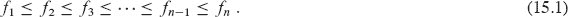
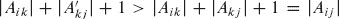

**15** 贪婪算法

优化问题的算法通常经历一系列步骤，在每一步都有一组选择。对于许多优化问题，使用动态规划确定最佳选择是不切实际的，更简单、更高效的算法会更好。**`贪婪算法`**总是在当前看起来最好的选择。也就是说，它在希望这个选择会导致全局最优解的情况下做出局部最优选择。本章探讨了贪婪算法为其提供最优解的优化问题。在阅读本章之前，你应该阅读第十四章中关于动态规划的内容，特别是第 14.3 节。

贪婪算法并不总是产生最优解，但对于许多问题来说确实如此。我们首先在第 `15.1` 节中研究一个简单但非平凡的问题，即活动选择问题，对于这个问题，贪婪算法可以高效地计算出最优解。我们将通过首先考虑动态规划方法，然后展示总是做出贪婪选择可以得到最优解的方式来得到贪婪算法。第 `15.2` 节回顾了贪婪方法的基本要素，提供了证明贪婪算法正确性的直接方法。第 `15.3` 节介绍了贪婪技术的一个重要应用：设计数据压缩（哈夫曼）编码。最后，第 `15.4` 节表明，为了在缓存发生缺失时决定替换哪些块，如果块访问序列事先已知，“未来最远”策略是最优的。

贪婪方法非常强大，在广泛的问题范围内表现良好。后续章节将介绍许多算法，你可以将其视为贪婪方法的应用，包括最小生成树算法（第二十一章）、Dijkstra 算法用于单源最短路径（第 22.3 节）以及贪婪集覆盖启发式算法（第 35.3 节）。最小生成树算法提供了贪婪方法的一个经典示例。虽然你可以独立阅读本章和第二十一章，但一起阅读可能更有帮助。

**15.1    活动选择问题**  

我们的第一个例子是安排几个竞争活动，这些活动需要独占使用一个共同资源，目标是选择一个最大规模的相互兼容活动集合的问题。想象一下，你负责安排一个会议室。你被提供了一个集合`S` = {`a₁`, `a₂`, … , `a[n]`}，这些活动希望预订会议室，而且房间一次只能服务一个活动。每个活动`a[i]`都有一个***开始时间*** `s[i]` 和一个***结束时间*** `f[i]`，其中 0 ≤ `s[i]` < `f[i]` < ∞。如果选择，活动`a[i]`发生在半开时间区间[`s[i]`, `f[i]`)内。如果活动`a[i]`和`a[j]`是***兼容的***，则区间[`s[i]`, `f[i]`)和[`s[j]`, `f[j]`)不重叠。也就是说，如果`s[i]` ≥ `f[j]`或`s[j]` ≥ `f[i]`，则`a[i]`和`a[j]`是兼容的。（假设如果你的工作人员需要时间来从一个活动转换到下一个活动，转换时间已经包含在时间区间内。）在***活动选择问题***中，你的目标是选择一个最大规模的相互兼容活动子集。假设活动按照结束时间的单调递增顺序排序：

（稍后我们将看到这种假设提供的优势。）例如，考虑图 15.1 中的活动集合。子集{`a[3]`，`a[9]`，`a[11]`}由相互兼容的活动组成。然而，它不是最大的子集，因为子集{`a₁`，`a[4]`，`a[8]`，`a[11]`}更大。事实上，{`a₁`，`a[4]`，`a[8]`，`a[11]`}是最大的相互兼容活动子集，另一个最大的子集是{`a₂`，`a[4]`，`a[9]`，`a[11]`}。

我们将看到如何解决这个问题，分几个步骤进行。首先，我们将探讨动态规划解决方案，在确定最优解中使用哪些子问题时，你需要考虑几种选择。然后我们将观察到，你只需要考虑一个选择——贪心选择——当你做出贪心选择时，只剩下一个子问题。基于这些观察，我们将开发一个递归贪心算法来解决活动选择问题。最后，我们将通过将递归算法转换为迭代算法来完成开发贪心解决方案的过程。尽管我们在这一部分的步骤比典型的贪心算法开发稍微复杂一些，但它们展示了贪心算法和动态规划之间的关系。

**图 15.1** 一组活动{`a``[1]`，`a``[2]`，…，`a``[11]`}。活动*a[i]*具有开始时间*s[i]*和结束时间*f[i]*。

**活动选择问题的最优子结构**  

让 让我们验证活动选择问题展示出最优子结构。用`S[ij]`表示在活动`a[i]`结束后开始并在活动`a[j]`开始前结束的活动集合。假设你想在`S[ij]`中找到一组最大的相互兼容活动，并进一步假设这样一个最大集合是`A[ij]`，其中包括一些活动`a[k]`。通过在最优解中包含`a[k]`，你留下了两个子问题：在集合`S[ik]`中找到相互兼容的活动（在活动`a[i]`结束后开始并在活动`a[k]`开始前结束的活动）和在集合`S[kj]`中找到相互兼容的活动（在活动`a[k]`结束后开始并在活动`a[j]`开始前结束的活动）。让`A[ik]` = `A[ij]` ∩ `S[ik]` 和 `A[kj]` = `A[ij]` ∩ `S[kj]`，这样`A[ik]`包含在`a[k]`开始前结束的`A[ij]`中的活动，`A[kj]`包含在`a[k]`结束后开始的`A[ij]`中的活动。因此，我们有`A[ij]` = `A[ik]` ∪ {`a[k]`} ∪ `A[kj]`，因此最大大小的相互兼容活动集合`A[ij]`在`S[ij]`中包含|`A[ij]` | = |`A[ik]`| + |`A[kj]` | + 1 个活动。

通常的剪切和粘贴论证表明，最优解`A[ij]`也必须包括`S[ik]`和`S[kj]`的两个子问题的最优解。如果你能找到`S[kj]`中的一组相互兼容的活动，其中，那么你可以使用，而不是`A[kj]`，在解决`S[ij]`的子问题时。你将构建一个包含相互兼容活动的集合，这与`A[ij]`是最优解的假设相矛盾。对`S[ik]`中的活动也适用对称论证。

这种表征最优子结构的方式表明，你可以通过动态规划来解决活动选择问题。让我们用`c[i, j]`表示集合`S[ij]`的最优解的大小。然后，动态规划方法给出了递归关系

`c[i, j] = c[i, k] + c[k, j] + 1`。

当然，如果你不知道集合`S[ij]`的最优解包括活动`a[k]`，你必须检查`S[ij]`中的所有活动，找出要选择哪一个，以便

然后你可以开发一个递归算法并进行记忆化，或者你可以自底向上工作，并在进行时填写表格条目。但你可能会忽视活动选择问题的另一个重要特征，你可以利用它获得很大优势。

**做出贪心选择**

如果你可以选择一个活动添加到最优解中，而不必首先解决所有子问题，那么你就可以避免考虑递归中固有的所有选择。实际上，对于活动选择问题，你只需要考虑一个选择：贪心选择。

对于活动选择问题，贪心选择是什么？直觉告诉我们，你应该选择一项活动，使得资源尽可能多地留给其他活动使用。在你最终选择的活动中，其中一个必须是第一个完成的活动。因此，直觉告诉我们，选择`S`中最早结束时间的活动，因为这样可以为其后的尽可能多的活动留下资源。（如果`S`中有多个活动具有最早的结束时间，则选择其中任何一个。）换句话说，由于活动按照结束时间的单调递增顺序排序，贪心选择是活动`a₁`。选择第一个完成的活动并不是解决这个问题的唯一贪心选择的方式。练习 15.1-3 要求你探索其他可能性。

一旦你做出贪心选择，你只剩下一个子问题要解决：找到在`a₁`完成后开始的活动。为什么你不必考虑在`a₁`开始之前结束的活动？因为`s₁ < f₁`，而`f₁`是任何活动的最早结束时间，没有活动的结束时间可以小于或等于`s₁`。因此，所有与活动`a₁`兼容的活动必须在`a₁`完成后开始。

此外，我们已经确定活动选择问题具有最优子结构。让`S[k]` = {`a[i]` ∈ `S` : `s[i]` ≥ `f[k]`}是在活动`a[k]`完成后开始的活动集合。如果你选择活动`a₁`的贪心选择，那么`S₁`仍然是唯一要解决的子问题。最优子结构表明，如果`a₁`属于最优解，那么原问题的最优解由活动`a₁`和子问题`S₁`的最优解中的所有活动组成。  

还有一个重要问题：这种直觉是否正确？贪心选择——选择第一个完成的活动——总是最优解的一部分吗？下面的定理表明是这样的。

***`定理 15.1`***

考虑任何非���子问题`S[k]`，让`a[m]`是`S[k]`中最早结束时间的活动。那么`a[m]`包含在`S[k]`的某个相互兼容活动的最大子集中。  

***证明*** 让`A[k]`是`S[k]`中相互兼容的活动的最大子集，让`a[j]`是`A[k]`中最早结束时间的活动。如果`a[j]` = `a[m]`，我们就完成了，因为我们已经证明了`a[m]`属于`S[k]`的某个相互兼容活动的最大子集。如果`a[j]` ≠ `a[m]`，让集合为`A[k]`，但用`a[m]`替换`a[j]`。中的活动是相互兼容的，这是因为`A[k]`中的活动是相互兼容的，`a[j]`是`A[k]`中第一个完成的活动，且`f[m]` ≤ `f[j]`。由于，我们得出结论，是`S[k]`中相互兼容活动的最大子集，并且包括`a[m]`。  

▪ 输出：

尽管你可能能够用动态规划解决活动选择问题，定理 15.1 表明你不需要这样做。相反，你可以重复选择最先结束的活动，仅保留与该活动兼容的活动，并重复直到没有活动剩余。此外，因为你总是选择最早结束时间的活动，所以你选择的活动的结束时间必须严格增加。你可以考虑每个活动仅一次，按照结束时间的单调递增顺序。

解决活动选择问题的算法不需要像基于表的动态规划算法那样自底向上工作。相反，它可以自顶向下工作，选择一个要放入其构建的最优解中的活动，然后解决选择与已选择的活动兼容的活动的子问题。贪心算法通常具有这种自顶向下的设计：做出选择，然后解决一个子问题，而不是解决子问题然后再做出选择的自底向上技术。

**一个递归贪心算法**

现在你知道可以绕过动态规划方法，而是使用自顶向下的贪心算法，让我们看一个简单的递归过程来解决活动选择问题。下一页的过程 `RECURSIVE-ACTIVITY-SELECTOR` 接受活动的开始和结束时间，表示为数组`s`和`f`，²定义要解决的子问题`S[k]`的索引`k`，以及原始问题的大小`n`。它返回`S[k]`中最大尺寸的一组相互兼容的活动。该过程假定`n`个输入活动已按照单调递增的结束时间排序，根据方程（15.1）。如果没有，可以在`O(n lg n)`时间内首先按此顺序对它们进行排序，任意打破平局。为了开始，添加虚构活动`a₀`，使得`f₀ = 0`，这样子问题`S₀`就是整个活动集`S`。初始调用，解决整个问题的是 `RECURSIVE-ACTIVITY-SELECTOR (s, f, 0, n)`。

RECURSIVE-ACTIVITY-SELECTOR (`s`, `f`, `k`, `n`)

| 1 | `m = k + 1` |
| --- | --- |
|   | `2` | **当** `m` ≤ `n` 且 `s`[`m`] < `f` [`k`] | 找到`S[k]`中第一个结束的活动 |   |
| 3 | m = m + 1 |
| 4 | **如果** `m` ≤ `n` |
| \| 5 \| **返回** {*`a[m]`*} ∪ RECURSIVE-ACTIVITY-SELECTOR (*`s`*, *`f`*, *`m`*, *`n`*) |   |
| `6` | **否则返回** ∅ |

图 15.2 展示了算法在图 15.1 中的活动上的操作。在给定的递归调用 `RECURSIVE-ACTIVITY-SELECTOR (s, f, k, n)` 中，第 2-3 行的**当**环寻找`S[k]`中第一个结束的活动。循环检查`a[k+1]`，`a[k+2]`，…，`a[n]`，直到找到与`a[k]`兼容的第一个活动`a[m]`。如果循环终止是因为找到这样的活动，第 5 行返回`{a[m]}`和递归调用 `RECURSIVE-ACTIVITY-SELECTOR (s, f, m, n)` 返回的`S[m]`的最大尺寸子集的并集。或者，循环可能终止是因为`m > n`，在这种情况下，过程已检查了`S[k]`中的所有活动，但没有找到与`a[k]`兼容的活动。在这种情况下，`S[k]` = ∅，因此第 6 行返回∅。

假设活动已按结束时间排序，调用 `RECURSIVE-ACTIVITY-SELECTOR (s, f, 0, n)` 的运行时间为Θ(n)。为了看清楚原因，观察到在所有递归调用中，每个活动在第 2 行的**当**循环测试中仅被检查一次。特别地，活动`a[i]`在最后一次调用中被检查，其中 k < i。

**一个迭代贪心算法**

递归过程可以转换为迭代过程，因为过程 `RECURSIVE-ACTIVITY-SELECTOR` 几乎是“尾递归”的（参见问题 7-5）：它以对自身的递归调用结束，然后是一个联合操作。将尾递归过程转换为迭代形式通常是一项简单的任务。事实上，某些编程语言的某些编译器会自动执行此任务。

``  

**图 15.2** RECURSIVE-ACTIVITY-SELECTOR 在来自 图 15.1 的 11 个活动上的操作。每个递归调用中考虑的活动出现在水平线之间。虚构的活动 `a₀` 在时间 0 结束，初始调用 RECURSIVE-ACTIVITY-SELECTOR (`s`, `f`, 0, 11)，选择活动 `a₁`。在每个递归调用中，已选择的活动为蓝色，而棕色的活动正在考虑中。如果一个活动的开始时间早于最近添加的活动的结束时间（它们之间的箭头指向左），则被拒绝。否则（箭头直接指向上或向右），则被选择。最后一个递归调用，RECURSIVE-ACTIVITY-SELECTOR (`s`, `f`, 11, 11)，返回 ∅。所选活动的结果集是 {`a₁`, `a[4]`, `a[8]`, `a[11]`}。  

过程 `GREEDY-ACTIVITY-SELECTOR` 是过程 `RECURSIVE-ACTIVITY-SELECTOR` 的迭代版本。它也假设输入活动按照递增结束时间排序。它将选定的活动收集到集合 `A` 中，并在完成时返回此集合。

`GREEDY-ACTIVITY-SELECTOR (s, f, n)`  

| 1 | `A = {a₁}` |   |
| --- | --- |
| 2 | k = 1 |
| `3` | **对于** `m = 2` **到** `n` |
| `4` | **如果** `s[m] ≥ f[k]` | **//** `a[m]` 在 `S[k]` 中吗？ |   |
| 5 | `A = A ∪ {a[m]}` | **//** 是的，所以选择它 |   |
| \| 6 \| `k = m` \| **//** 然后继续 \| |
| `7` | **返回** `A` |

该过程的工作方式如下。变量 `k` 索引最近添加到 `A` 中的活动，对应于递归版本中的活动 `a[k]`。由于该过程按照递增结束时间的顺序考虑活动，`f[k]` 始终是 `A` 中任何活动的最大结束时间。也就是说，

``  

第 1-2 行选择活动 `a₁`，将 `A` 初始化为仅包含此活动，并将 `k` 初始化为索引此活动。第 3-6 行的 `for` 循环找到 `S[k]` 中最早结束的活动。循环依次考虑每个活动 `a[m]`，如果它与所有先前选择的活动兼容，则将 `a[m]` 添加到 `A` 中。这样的活动是 `S[k]` 中最早结束的活动。要查看活动 `a[m]` 是否与当前 `A` 中的每个活动兼容，根据方程（15.3），只需检查（在第 4 行）其开始时间 `s[m]` 是否不早于最近添加到 `A` 中的活动的结束时间 `f[k]`。如果活动 `a[m]` 兼容，则第 5-6 行将活动 `a[m]` 添加到 `A` 中，并将 `k` 设置为 `m`。调用 GREEDY-ACTIVITY-SELECTOR (`s`, `f`) 返回的集合 `A` 正是初始调用 RECURSIVE-ACTIVITY-SELECTOR (`s`, `f`, 0, `n`) 返回的集合。  

与递归版本一样，`GREEDY-ACTIVITY-SELECTOR` 在 `Θ(n)` 时间内安排一组 `n` 个活动，假设活动已经按照它们的结束时间初始排序。

**练习**

`15.1-1`

根据递归（15.2）为活动选择问题提供一个动态规划算法。让你的算法计算上面定义的大小 `c[i, j]`，并且产生最大大小的相互兼容活动子集。假设输入已按照方程（15.1）进行了排序。将你的解决方案的运行时间与 GREEDY-ACTIVITY-SELECTOR 的运行时间进行比较。

`15.1-2`

假设您不总是选择第一个完成的活动，而是选择最后一个与先前选择的所有活动兼容的活动开始。描述这种方法如何是一种贪婪算法，并证明它产生最优解。

***15.1-3***

不是任何贪婪方法都能产生最大规模的相互兼容活动集。举例说明，从与先前选择的活动兼容的活动中选择持续时间最短的活动的方法不起作用。对于总是选择与剩余活动重叠最少的兼容活动和总是选择剩余活动中开始时间最早的兼容活动的方法也是如此。

`15.1-4`

给定一组要在大量讲堂中安排的活动，其中任何活动都可以在任何讲堂中进行。您希望尽可能少地使用讲堂安排所有活动。给出一个有效的贪婪算法，确定哪个活动应该使用哪个讲堂。

（这个问题也被称为`区间图着色问题`。它由一个顶点是给定活动的区间图建模，其边连接不兼容的活动。为了着色每个顶点，使得相邻的两个顶点不具有相同颜色所需的最少颜色数对应于找到安排所有给定活动所需的最少讲堂数。）  

`15.1-5`

考虑对活动选择问题进行修改，其中每个活动`a[i]`除了有开始和结束时间外，还有一个价值`v[i]`。目标不再是最大化安排的活动数量，而是最大化安排的活动的总价值。也就是说，目标是选择一组兼容的活动`A`，使得`∑(v[i])`最大化。给出这个问题的多项式时间算法。

**15.2    贪婪策略的要素**

贪婪算法通过一系列选择获得问题的最优解。在每个决策点，算法都会做出当时看起来最好的选择。这种启发式策略并不总是产生最优解，但就像在活动选择问题中一样，有时候确实会。本节讨论了贪婪方法的一些一般特性。

我们在第 15.1 节中遵循的开发贪婪算法的过程比通常更复杂一些。它包括以下步骤：

1.  确定问题的最优子结构。  输出：

1.  开发一个递归解决方案。（对于活动选择问题，我们制定了递归式`(15.2)`，但是绕过了仅基于此递归式开发递归算法的步骤。）

1.  显示如果做出贪婪选择，那么只剩下一个子问题。

1.  证明做出贪婪选择总是安全的。（步骤 `3` 和 `4` 可以以任意顺序发生。）  

1.  制定实施贪婪策略的递归算法。

1.  将递归算法转换为迭代算法。

这些步骤详细介绍了贪婪算法的动态规划基础。例如，对活动选择问题的第一次尝试定义了子问题`S[ij]`，其中`i`和`j`都变化。然后我们发现，如果总是做出贪婪选择，可以将子问题限制为`S[k]`形式。

另一种方法是考虑贪心选择，以便构建具有最优子结构的问题，这样选择只留下一个子问题需要解决。在活动选择问题中，首先去掉第二个下标，并定义形式为`S[k]`的子问题。然后证明贪心选择（在`S[k]`中完成的第一个活动`a[m]`），结合对剩余兼容活动集合`S[m]`的最优解，得到`S[k]`的最优解。更一般地，你可以按照以下步骤设计贪心算法：

1.  将优化问题构造为做出选择后只剩下一个子问题需要解决。

1.  证明总是存在一个原问题的最优解，使得贪心选择是安全的。

1.  通过展示做出贪心选择后剩下的是具有性质的子问题，来证明最优子结构，如果你将子问题的最优解与你做出的贪心选择相结合，就会得到原问题的最优解。

本章后面的部分将使用这种更直接的过程。然而，在每个贪婪算法的背后，几乎总是有一个更繁琐的动态规划解决方案。

如何判断贪心算法是否能解决特定的优化问题？没有一种方法始终有效，但`贪心选择性质`和`最优子结构`是两个关键要素。如果你能证明问题具有这些性质，那么你就已经在为其开发贪心算法铺平道路。  

**贪心选择性质**

第一个关键要素是**`贪心选择性质`**：通过做出局部最优（贪心）选择，你可以组合出一个全局最优解。换句话说，在考虑要做出哪种选择时，你只考虑当前问题中看起来最好的选择，而不考虑子问题的结果。

这就是贪心算法与动态规划的区别所在。在动态规划中，你每一步都要做出选择，但选择通常取决于子问题的解决方案。因此，你通常以自底向上的方式解决动态规划问题，从较小的子问题逐渐推进到较大的子问题。（或者，你可以自顶向下解决，但要进行记忆化。当然，即使代码是自顶向下的，你仍然必须在做出选择之前解决子问题。）在贪心算法中，你在当前时刻做出看起来最好的选择，然后解决剩下的子问题。贪心算法所做的选择可能取决于到目前为止的选择，但不能取决于任何未来的选择或子问题的解决方案。因此，与动态规划不同，动态规划在做出第一个选择之前解决子问题，而贪心算法则在解决任何子问题之前做出第一个选择。动态规划算法自底向上进行，而贪心策略通常自顶向下进行，一次又一次地做出贪心选择，将每个给定的问题实例减小为一个更小的问题。

当然，你需要证明每一步的贪心选择都会产生一个全局最优解。通常情况下，就像定理 `15.1` 的情况一样，证明会检查某个子问题的全局最优解。然后展示如何修改解决方案，用贪心选择替换其他选择，从而得到一个类似但更小的子问题。

通常情况下，你可以比考虑更广泛的选择更有效地做出贪心选择。例如，在活动选择问题中，假设活动已按完成时间单调递增的顺序排序，每个活动只需要检查一次。通过预处理输入或使用适当的数据结构（通常是优先队列），你通常可以快速做出贪心选择，从而得到一个高效的算法。

**最优子结构**

正如我们在第十四章中所看到的，如果问题表现出`最优子结构`，则问题的最优解中包含子问题的最优解。这个特性是评估动态规划是否适用的关键因素，也对贪心算法至关重要。举一个最优子结构的例子，回想一下第 15.1 节是如何演示的，如果子问题`S[ij]`的最优解包括活动`a[k]`，那么它也必须包含子问题`S[ik]`和`S[kj]`的最优解。基于这种最优子结构，我们认为如果你知道要使用哪个活动作为`a[k]`，你可以通过选择`a[k]`以及所有子问题`S[ik]`和`S[kj]`的最优解中的所有活动来构建`S[ij]`的最优解。这种最优子结构的观察导致了描述最优解值的递归式(15.2)的产生。

当将最优子结构应用于贪心算法时，通常会采用更直接的方法。如上所述，你可以假设通过在原始问题中做出贪心选择而到达子问题。你真正需要做的就是证明子问题的最优解，结合已经做出的贪心选择，可以产生原始问题的最优解。这种方案隐含地使用了对子问题的归纳，以证明在每一步都做出贪心选择会产生最优解。

**`贪心与动态规划`**  

由于贪心和动态规划策略都利用了最优子结构，当贪心解足够时，你可能会倾向于生成一个动态规划解决方案，或者相反，你可能会错误地认为贪心解决方案有效，而实际上需要动态规划解决方案。为了说明这两种技术之间的微妙差异，让我们研究一个经典优化问题的两个变体。

***0-1 背包问题***如下。一个抢劫商店的小偷想要拿走最有价值的战利品，可以装在一个最多能装`W`磅战利品的背包中。小偷可以选择拿走商店中的`n`个物品中的任意子集。第`i`个物品价值`v[i]`美元，重`w[i]`磅，其中`v[i]`和`w[i]`都是整数。小偷应该拿走哪些物品？（我们称之为 0-1 背包问题，因为对于每个物品，小偷必须要么拿走它，要么留下它。小偷不能拿走物品的部分数量，也不能多次拿走同一物品。）

在***分数背包问题***中，设置是一样的，但小偷可以拿走物品的部分数量，而不是对每个物品做出二进制（`0-1`）选择。你可以将 `0-1` 背包问题中的物品看作是金锭，而将分数背包问题中的物品更像是金粉。  

两个背包问题都表现出最优子结构性质。对于 0-1 问题，如果最有价值的战利品重量不超过`W`磅包括物品`j`，那么剩下的战利品必须是小偷可以从`n−1`个原始物品中除去物品`j`后重量不超过`W−w[j]`磅的最有价值的战利品。对于可比较的分数问题，如果最有价值的战利品重量不超过`W`磅包括物品`j`的重量`w`，那么剩下的战利品必须是小偷可以从`n−1`个原始物品中拿走不超过`W−w`磅的最有价值的战利品，再加上物品`j`的`w[j]−w`磅。

尽管这两个问题很相似，贪婪策略可以解决分数背包问题，但不能解决 0-1 问题。为了解决分数问题，首先计算每个物品的每磅价值`v[i]/w[i]`。遵循贪婪策略，小偷首先尽可能多地拿取每磅价值最高的物品。如果该物品的供应用尽，小偷仍然可以携带更多，那么小偷将尽可能多地拿取每磅价值次高的物品，依此类推，直到达到重量限制`W`。因此，通过按每磅价值对物品进行排序，贪婪算法的运行时间为`O(n lg n)`。你被要求在练习 15.2-1 中证明分数背包问题具有贪婪选择性质。

为了看到这种贪婪策略无法解决 0-1 背包问题，考虑在图 15.3(a)中所示的问题实例。这个例子有三个物品和一个可以容纳 50 磅的背包。物品 1 重 10 磅，价值 60 美元。物品 2 重 20 磅，价值 100 美元。物品 3 重 30 磅，价值 120 美元。因此，物品 1 的每磅价值为 6 美元，高于物品 2（每磅 5 美元）或物品 3（每磅 4 美元）的每磅价值。因此，贪婪策略会首先选择物品 1。然而，如图 15.3(b)中的案例分析所示，最优解是选择物品 2 和 3，留下物品 1。包含物品 1 的两种可能解决方案都是次优的。  

然而，对于可比较的分数问题，贪婪策略，即首先选择物品 1，确实会得到最优解，如图 15.3(c)所示。在 0-1 问题中，选择物品 1 不起作用，因为小偷无法将背包填满，而空余空间降低了负载的有效每磅价值。在 0-1 问题中，当考虑是否将物品包含在背包中时，必须在做出选择之前比较包含该物品的子问题的解决方案与不包含该物品的子问题的解决方案。这样构造的问题会产生许多重叠的子问题——动态规划的一个特征，正如练习 15.2-2 要求你展示的那样，你可以使用动态规划来解决 0-1 问题。

**`图 15.3`** 一个示例，展示贪婪策略无法解决 0-1 背包问题。**`(a)`** 小偷必须选择所示三个物品的子集，其重量不能超过 50 磅。**`(b)`** 最佳子集包括物品 2 和 3。任何包含物品 1 的解决方案都是次优的，即使物品 1 的每磅价值最高。**`(c)`** 对于分数背包问题，按每磅价值最高的顺序取物品可以得到最佳解决方案。

**练习**

***`15.2-1`*** 

证明分数背包问题具有贪婪选择性质。

***`15.2-2`***

给出一个动态规划解决方案，解决 0-1 背包问题，其运行时间为`O(n W)`，其中`n`是物品数量，`W`是小偷可以放入背包的最大重量。

`15.2-3`

假设在 0-1 背包问题中，按重量递增排序的物品顺序与按价值递减排序的物品顺序相同。给出一个有效的算法来找到这种变体背包问题的最优解，并证明你的算法是正确的。

`15.2-4`

Gekko 教授一直梦想着在北达科他州内滑旱冰。教授计划沿着美国 2 号公路从东部边界的大福克斯到靠近西部边界的威利斯顿滑行。教授可以携带两升水，在滑行`m`英里后会用尽水。 (由于北达科他州相对平坦，教授不必担心在上坡段比在平坦或下坡段饮水速度更快。) 教授将在大福克斯开始时携带两升水。 教授有一张官方的北达科他州地图，显示了沿着美国 2 号公路补充水源的所有地点以及这些地点之间的距离。

教授的目标是尽量减少沿着穿越州的路线的补水站数量。 给出教授可以确定哪些补水站的有效方法。 证明你的策略产生最佳解，并给出其运行时间。

***`15.2-5`***

描述一个高效的算法，给定一组{`x₁, x₂, … , x[n]`}在实数线上的点，确定包含所有给定点的最小单位长度闭区间集合。证明你的算法是正确的。

★ ***`15.2-6`***

展示如何在`O(n)`时间内解决分数背包问题。

`15.2-7`  

给定两个包含`n`个正整数的集合`A`和`B`。 你可以随意重新排列每个集合。 重新排列后，让`a[i]`为集合`A`的第`i`个元素，让`b[i]`为集合`B`的第`i`个元素。 然后你将获得一笔报酬为``。 给出最大化你的报酬的算法。 证明你的算法最大化了报酬，并说明其运行时间，省略重新排列集合的时间。

**15.3    Huffman 编码**

Huffman 编码可以很好地压缩数据：根据被压缩数据的特性，节省 20%至 90%是典型的。 数据以字符序列的形式到达。 Huffman 的贪婪算法使用一个表格，给出每个字符出现的频率，以构建表示每个字符的最佳二进制字符串的方法。

假设你有一个包含 100,000 个字符的数据文件，希望紧凑地存储，并且你知道文件中的 6 个不同字符出现的频率如图 15.4 所示。 字符 `a` 出现 45,000 次，字符 `b` 出现 13,000 次，依此类推。

你有许多选项来表示这样一个信息文件。 在这里，我们考虑设计一个***二进制字符编码***（或简称为***编码***），其中每个字符由一个唯一的二进制字符串表示，我们称之为***编码字***。 如果使用***固定长度编码***，则需要⌈lg `n`⌉位来表示`n`≥2 个字符。 因此，对于 6 个字符，你需要 3 位：a = 000，b = 001，c = 010，d = 011，e = 100 和 f = 101。 这种方法需要 300,000 位来编码整个文件。 你能做得更好吗？

**图 15.4** 字符编码问题。 一个包含 100,000 个字符的数据文件仅包含字符 a-f，并显示了频率。 每个字符由一个 3 位编码字表示，编码文件需要 300,000 位。 使用所示的可变长度编码，编码仅需要 224,000 位。

一个`可变长度编码`可以比固定长度编码好得多。思路很简单：给予频繁出现的字符短的编码字和不频繁出现的字符长的编码字。图 15.4 展示了这样一个编码。这里，1 位字符串 0 代表 a，4 位字符串 1100 代表 f。这个编码需要

`(45 · 1 + 13 · 3 + 12 · 3 + 16 · 3 + 9 · 4 + 5 · 4) · 1,000 = 224,000` 位

用大约 `25%`的节省来表示文件。 实际上，这是这个文件的最佳字符编码，我们将看到。

**前缀自由编码**

我们这里只考虑没有任何码字也是其他码字的前缀的编码。这些编码称为**前缀自由编码**。尽管我们在这里不会证明，但前缀自由编码总是可以在任何字符编码中实现最佳数据压缩，因此通过将注意力限制在前缀自由编码上，我们不会损失广泛性。

对于任何二进制字符编码，编码总是简单的：只需连接表示文件每个字符的码字。例如，在图 15.4 中的可变长度前缀自由编码中，4 个字符文件 face 的编码为 `1100 · 0 · 100 · 1101 = 110001001101`，其中“·”表示连接。

前缀自由编码是理想的，因为它们简化了解码。由于没有任何一个码字是另一个码字的前缀，因此开始编码文件的码字是明确的。您只需简单地识别初始码字，将其翻译回原始字符，然后对编码文件的其余部分重复解码过程。在我们的示例中，字符串 `100011001101` 唯一解析为 `100 · 0 · 1100 · 1101`，解码为 cafe。

**图 15.5** 对应于图 15.4 中编码方案的树。每个叶子都标有一个字符及其出现频率。每个内部节点都标有其子树中叶子频率的总和。所有频率都是以千为单位。**(a)** 对应于固定长度编码 `a = 000`，`b = 001`，`c = 010`，`d = 011`，`e = 100`，`f = 101` 的树。**(b)** 对应于最佳前缀自由编码 `a = 0`，`b = 101`，`c = 100`，`d = 111`，`e = 1101`，`f = 1100` 的树。

解码过程需要一个方便的表示形式，以便您可以轻松地选择初始码字。一个二叉树，其叶子是给定的字符，提供了这样的表示形式。将字符的二进制码字解释为从根到该字符的简单路径，其中 0 表示“转到左子节点”，1 表示“转到右子节点”。图 `15.5` 显示了我们示例中两个编码的树。请注意，这些不是二叉搜索树，因为叶子不需要按排序顺序出现，内部节点不包含字符键。

对于文件的最佳编码总是由一个`完全`二叉树表示，其中每个非叶节点都有两个子节点（参见练习 15.3-2）。我们示例中的固定长度编码不是最佳的，因为其树，如图 15.5(a)所示，不是完全二叉树：它包含以 10 开头的码字，但没有以 11 开头的码字。由于我们现在可以将注意力限制在完全二叉树上，因此我们可以说，如果`C`是从中提取字符的字母表，并且所有字符频率为正，则最佳前缀自由编码的树���好有|`C`|个叶子，每个字母表中的字母一个，并且恰好有|`C`| − 1 个内部节点（参见第 1175 页的练习 B.5-3）。

给定与前缀自由编码对应的树`T`，我们可以计算编码文件所需的位数。对于字母表`C`中的每个字符`c`，让属性`c.freq`表示文件中`c`的频率，让`d[T]`(`c`)表示树中`c`叶子的深度。注意`d[T]`(`c`)也是字符`c`的码字长度。因此，编码文件所需的位数为

我们将其定义为树`T`的***成本***。

**构建哈夫曼编码**

Huffman 发明了一种贪婪算法，构建了一种最优前缀编码，以他的名字命名为***`Huffman 编码`***。根据我们在第 15.2 节中的观察，其正确性证明依赖于贪婪选择属性和最优子结构。与其证明这些属性成立然后开发伪代码，我们首先呈现伪代码。这样做将有助于澄清算法如何进行贪婪选择。

HUFFMAN 过程假设`C`是一个包含`n`个字符的集合，并且每个字符`c`∈`C`是一个具有给出其频率的属性`c.freq`的对象。该算法以自底向上的方式构建与最优编码对应的树`T`。它从一组|`C`|叶子开始，执行一系列|`C`|-1 次“合并”操作以创建最终的树。该算法使用以`freq`属性为键的最小优先队列`Q`，以识别要合并的两个最不频繁的对象。合并两个对象的结果是一个新对象，其频率是合并的两个对象的频率之和。

HUFFMAN(`C`)

|   1 | `n` = ` | C | ` &#124;`C` &#124; |   |
| --- | --- | --- | --- | --- |
| --- | --- | --- |   |
|   2 | `Q = C` |   |
|   `3` | `for` `i` = `1` **to** `n` − `1` |   |   |
| `4` | 分配一个新节点`z` |   |   |
| `5` | `x` = EXTRACT-MIN(`Q`) |   |   |
|   6 | `y = EXTRACT-MIN(Q)` |   |   |
| `7   z.left = x` |
|   8 | `z.right = y` |   |   |
|   9 | `z.freq = x.freq + y.freq` |   |   |
| \| 10 \| INSERT(`Q`, `z`) \|   \| |
| `11` | **return** EXTRACT-MIN(`Q`) | **//** 树的根是唯一剩下的节点 |

对于我们的示例，Huffman 算法的执行如图 `15.6` 所示。由于字母表包含 `6` 个字母，初始队列大小为`n=6`，经过 `5` 次合并构建了树。最终的树代表了最优前缀编码。字母的编码是从根到该字母的简单路径上的边标签序列。

``  

**图 15.6** Huffman 算法在图 15.4 中给出的频率下的步骤。每个部分显示按频率递增排序的队列内容。每个步骤合并具有最低频率的两棵树。叶子节点显示为包含字符及其频率的矩形。内部节点显示为包含其子节点频率总和的圆圈。将内部节点与其子节点连接的边，如果是指向左子节点的边，则标记为 0，如果是指向右子节点的边，则标记为 1。字母的编码是连接根和该字母叶子的边标签序列。**(a)** 初始的`n`=6 个节点，每个节点代表一个字母。**(b)–(e)** 中间阶段。**(f)** 最终的树。  

HUFFMAN 过程的工作方式如下。第 2 行使用字符`C`初始化最小优先队列`Q`。第 3-10 行的`for`循环重复地从队列中提取两个频率最低的节点`x`和`y`，并用代表它们合并的新节点`z`替换它们。在第 9 行计算`z`的频率为`x`和`y`的频率之和。节点`z`的左子节点为`x`，右子节点为`y`。（这个顺序是任意的。交换任何节点的左右子节点会产生相同成本的不同编码。）经过`n-1` 次合并后，第 11 行返回队列中剩下的一个节点，即编码树的根。

该算法在不使用变量`x`和`y`的情况下产生相同的结果，在第 7 和 8 行直接将 EXTRACT-MIN 调用返回的值分配给`z`.`left`和`z`.`right`，并将第 9 行更改为`z`.`freq` = `z`.`left`.`freq`+`z`.`right`.`freq`。然而，在正确性证明中我们将使用节点名称`x`和`y`，因此我们保留它们。  

Huffman 算法的运行时间取决于最小优先队列`Q`的实现方式。假设它被实现为二进制最小堆（参见第六章）。对于一个包含`n`个字符的集合`C`，在第 2 行中讨论的 BUILD-MIN-HEAP 过程可以在`O(n)`时间内初始化`Q`。第 3-10 行的`for`循环执行`n - 1`次，由于每个堆操作运行时间为`O(lg n)`，循环对运行时间的贡献为`O(n lg n)`。因此，HUFFMAN 在一个包含`n`个字符的集合上的总运行时间为`O(n lg n)`。

**Huffman 算法的正确性**

为了证明贪心算法 `HUFFMAN` 的正确性，我们将展示确定最优前缀自由码的问题展现出贪心选择和最优子结构性质。下一个引理显示贪心选择性质成立。

**`引理 15.2（最优前缀自由码具有贪心选择性质）`**

设`C`是一个字母表，其中每个字符`c` ∈ `C`具有频率`c.freq`。设`x`和`y`是`C`中具有最低频率的两个字符。那么存在一个`C`的最优前缀自由码，其中`x`和`y`的编码长度相同，只在最后一位上有所不同。

***证明*** 证明的思路是取代表示任意最优前缀自由码的树`T`，并修改它以使表示另一个最优前缀自由码的树，使得字符`x`和`y`在新树中作为最大深度的兄弟叶子节点出现。在这样的树中，`x`和`y`的编码长度相同，只在最后一位上有所不同。

假设`a`和`b`是`T`中最大深度的兄弟叶子节点上的任意两个字符。不失一般性，假设`a.freq` ≤ `b.freq`和`x.freq` ≤ `y.freq`。由于`x.freq`和`y.freq`是两个最低的叶子频率，按顺序，而`a.freq`和`b.freq`是两个任意的频率，按顺序，我们有`x.freq` ≤ `a.freq`和`y.freq` ≤ `b.freq`。

在证明的其余部分中，可能会出现`x.freq` = `a.freq`或`y.freq` = `b.freq`的情况，但`x.freq` = `b.freq`意味着`a.freq` = `b.freq` = `x.freq` = `y.freq`（参见练习 15.3-1），引理将显而易见地成立。因此，假设`x.freq` ≠ `b.freq`，这意味着`x` ≠ `b`。  

`**图 15.7**` 证明引理 15.2 的关键步骤的示例。在最优树`T`中，叶子节点`a`和`b`是最大深度的两个兄弟。叶子节点`x`和`y`是频率最低的两个字符。它们在`T`中以任意位置出现。假设`x ≠ b`，交换叶子节点`a`和`x`产生树`T′`，然后交换叶子节点`b`和`y`产生树`T′′`。由于每次交换不会增加成本，结果树`T′′`也是一个最优树。

如图 15.7 所示，想象交换`T`中`a`和`x`的位置以生成树`T′`，然后交换`T′`中`b`和`y`的位置以生成树`T″`，其中`x`和`y`是最大深度的兄弟叶子节点。（请注意，如果`x` = `b`但`y` ≠ `a`，则树`T″`不会将`x`和`y`作为最大深度的兄弟叶子节点。因为我们假设`x` ≠ `b`，这种情况不会发生。）根据方程（15.4），`T`和`T′`之间的成本差异为

因为`a.freq - x.freq`和`dT - dT`都是非负的。更具体地说，`a.freq - x.freq`是非负的，因为`x`是最小频率叶子，`dT - dT`是非负的，因为`a`是`T`中最大深度的叶子。同样，交换`y`和`b`不会增加成本，因此`B(T') - B(T")`是非负的。因此，`B(T") ≤ B(T') ≤ B(T)`，由于`T`是最佳的，我们有`B(T) ≤ B(T")`，这意味着`B(T") = B(T)`。因此，`T"`是一个最佳树，其中`x`和`y`出现为最大深度的兄弟叶子，引理随之而来。

▪  输出：

引理 15.2 表明，通过合并构建最佳树的过程可以从贪婪选择开始，而不会失去一般性，合并两个最低频率字符的贪婪选择是如何？我们可以将单个合并的成本视为合并的两个项目频率的总和。练习 15.3-4 表明，构建的树的总成本等于其合并的成本之和。在每一步的所有可能合并中，`HUFFMAN` 选择产生最小成本的合并。

下一个引理显示构建最佳前缀无码的问题具有最佳子结构性质。

***引理 15.3(最佳前缀无码具有最佳子结构性质)***

设`C`是一个给定的具有每个字符`c` ∈ `C`的频率`c.freq`的字母表。让`x`和`y`是`C`中频率最低的两个字符。让`C'`是字母表`C`，其中移除了字符`x`和`y`并添加了一个新字符`z`，以便`C' = (C - {x, y}) ∪ {z}`。为`C'`中的所有字符定义`freq`，其值与`C`中的值相同，以及`z.freq = x.freq + y.freq`。让`T'`是代表字母表`C'`的最佳前缀无码的任何树。那么从`T'`通过用`x`和`y`作为子节点替换`z`的叶节点得到的树`T`代表字母表`C`的最佳前缀无码。

***证明***   我们首先展示如何用方程式`(15.4)`中的组件成本来表示树`T`的成本`B(T)`，考虑每个字符`c` ∈ `C` − `{x, y}`，我们有`dT = dT′`，因此`c.freq · dT = c.freq · dT′`。由于`dT = dT = dT′ + 1`，我们有 

| `x.freq` · `d[T]`(x) + `y.freq` · `d[T]`(y) | = | (`x.freq` + `y.freq`)(`d[T′]`(z) + 1) |   |
| --- | --- | --- |
|  | = | `z.freq` · `dT′` + (`x.freq` + `y.freq`), |

由此我们得出

`B(T) = B(T′) + x*freq + y*freq`  

或者，等价地，

`B(T′) = B(T) - x*freq - y*freq`

我们现在通过反证法证明引理。假设`T`不代表`C`的最佳前缀无码。那么存在一个最佳树`T″`，使得`B(T″) < B(T)`。不失一般性（根据引理 15.2），`T″`有`x`和`y`作为兄弟。让`T^(″′)`是树`T″`，其中`x`和`y`的共同父节点被频率为`z.freq = x.freq + y.freq`的叶`z`替换。那么

| `B(T‴)` | = | `B(T″) - x*freq - y*freq` |
| --- | --- | --- |
|  | < | B(T) - x.freq - y.freq |
|  | = | B(T′), |

假设`T′`代表`C′`的最佳前缀无码，那么会导致矛盾。因此，`T`必须代表字母`C`的最佳前缀无码。

▪  

***定理 15.4***

`HUFFMAN` 过程产生最佳前缀无码。

***证明***   根据引理 `15.2` 和 `15.3` 立即得出。

**练习**

***15.3-1***

解释为什么在引理 15.2 的证明中，如果`x.freq = b.freq`，那么我们必须有`a.freq = b.freq = x.freq = y.freq`。

***`15.3-2`***  

证明非满二叉树不能对应于最佳前缀无码。

***15.3-3***

对于以下频率集合，基于前 8 个斐波那契数，最佳的哈夫曼编码是什么？

`a:1 b:1 c:2 d:3 e:5 f:8 g:13 h:21`

你能否推广你的答案，找到频率为前`n`个斐波那契数时的最佳编码？

***15.3-4***

证明一个完全二叉树`T`的总成本`B(T)`等于所有内部节点的两个子节点的组合频率之和。

`15.3-5`

给定一个集合`C`中`n`个字符的最佳前缀无码，你希望尽可能少地使用位来传输代码本身。展示如何仅使用 `2`n` − 1 + n ⌈lg n⌉` 位来表示`C`上的任何最佳前缀无码。(*提示*：使用 `2`n` − 1` 位来指定树的结构，通过树的遍历来发现。)

***15.3-6***

将 Huffman 算法推广到三进制码字（即使用符号 `0`、`1` 和 `2` 的码字），并证明它产生最佳的三进制码。

***`15.3-7`***  

一个数据文件包含一个 8 位字符序列，以至于所有 256 个字符大致相同频率：最大字符频率不超过最小字符频率的两倍。证明在这种情况下，哈夫曼编码不比使用普通的 8 位固定长度代码更有效。

***`15.3-8`***  

展示没有无损（可逆）压缩方案可以保证对于每个输入文件，相应的输出文件都更短。(`*提示*：比较可能的文件数量与可能的编码文件数量。`)

**15.4 离线缓存**

计算机系统可以通过将主存的子集存储在`缓存`中来减少访问数据的时间：一个小但更快的存储器。缓存将数据组织成通常包含 32、64 或 128 字节的`缓存块`。你也可以将主存视为虚拟内存系统中磁盘驻留数据的缓存。在这里，块被称为`页`，4096 字节是典型大小。

当计算机程序执行时，它会产生一系列内存请求。假设有`n`个内存请求，对应于块`b₁`、`b₂`、…、`b[n]`的数据，按照顺序。访问序列中的块可能不是不同的，实际上，任何给定块通常会被多次访问。例如，一个访问四个不同块`p`、`q`、`r`、`s`的程序可能会对块`s`、`q`、`s`、`q`、`q`、`s`、`p`、`p`、`r`、`s`、`s`、`q`、`p`、`r`、`q`进行请求。缓存最多可以容纳一定数量`k`的缓存块。在第一个请求之前，缓存是空的。对于块`b[i]`的请求，可能发生三种情况之一：

1.  块`b[i]`已经在缓存中，由于之前请求相同块。缓存保持不变。这种情况被称为***缓存命中***。

1.  在那个时候，块`b[i]`不在缓存中，但缓存包含少于`k`个块。在这种情况下，块`b[i]`被放入缓存，以便缓存比请求之前多一个块。

1.  在那个时候，块`b[i]`不在缓存中且缓存已满：它包含`k`个块。块`b[i]`被放入缓存，但在此之前，必须从缓存中驱逐另一个块以腾出空间。

后两种情况，即请求的块不在缓存中时，被称为`缓存未命中`。目标是最小化缓存未命中的次数，或者等效地，最大化整个`n`个请求序列中的缓存命中次数。当缓存中的块少于`k`个时发生的缓存未命中，即当缓存首次填满时，被称为`强制未命中`，因为之前的决策无法保留请求的块在缓存中。当发生缓存未命中且缓存已满时，理想情况下，选择要驱逐的块应该允许在未来请求序列的整个过程中产生尽可能少的缓存未命中。  

通常，缓存是一个在线问题。也就是说，计算机必须在不知道未来请求的情况下决定保留哪些块在缓存中。然而，在这里，让我们考虑这个问题的离线版本，计算机事先知道整个`n`个请求序列和缓存大小`k`，目标是最小化缓存未命中的总数。  

要解决这个离线问题，您可以使用一种称为`未来最远`的贪婪策略，该策略选择驱逐缓存中下一个访问在请求序列中最远的块。直观地说，这种策略是有道理的：如果您一段时间内不需要某物，为什么还要保留它呢？我们将展示未来最远策略确实是最优的，方法是展示离线缓存问题具有最优子结构，并且未来最远具有贪婪选择性质。

现在，您可能会认为，由于计算机通常不知道请求序列，所以研究离线问题没有意义。实际上是有意义的。在某些情况下，您确实事先知道请求序列。例如，如果您将主存储器视为缓存，将完整的数据集视为存储在磁盘（或固态硬盘）上，那么有算法可以提前规划整个读写集。此外，我们可以使用最优算法产生的缓存未命中次数作为比较在线算法表现优异程度的基准。我们将在第 `27.3` 节中进行这样的比较。

离线缓存甚至可以模拟现实世界的问题。例如，考虑这样一个场景：您事先知道在已知位置上有`n`个事件的固定时间表。事件可能在同一位置多次发生，不一定是连续的。您管理着一组`k`个代理，您需要确保每个位置在事件发生时都有一个代理，并且希望最小化代理移动的次数。在这里，代理就像是块，事件就像是请求，移动代理就像是缓存未命中。  

**离线缓存的最优子结构**

为了展示离线问题具有最优子结构，让我们将子问题(`C`, `i`)定义为在请求块`b[i]`、`b[i+1]`，…，`b[n]`时处理请求的块的缓存配置`C`，即在请求块`b[i]`发生时的时间，即`C`是块的集合的子集，使得|`C`| ≤ `k`。子问题(`C`, `i`)的解是指在每次请求块`b[i]`、`b[i+1]`，…，`b[n]`时指定要驱逐的块（如果有的话）的决策序列。子问题(`C`, `i`)的最优解最小化缓存未命中的次数。

考虑一个最优解`S`，解决子问题(`C`, `i`)，让`C'`是在解决方案`S`中处理对块`b[i]`的请求后缓存的内容。让`S'`是结果子问题(`C'`, `i` + 1)的子解。如果对`b[i]`的请求导致缓存命中，则缓存保持不变，即`C' = C`。如果对块`b[i]`的请求导致缓存未命中，则缓存内容发生变化，即`C' ≠ C`。我们声称在任一情况下，`S'`是子问题(`C'`, `i` + 1)的最优解。为什么？如果`S'`不是子问题(`C'`, `i` + 1)的最优解，则存在另一个解`S''`，使得在`b[i]`的请求中比`S'`少发生缓存未命中。将`S''`与`S`在对块`b[i]`的请求的决策相结合，得到另一个比`S`少发生缓存未命中的解，这与`S`是子问题(`C`, `i`)的最优解的假设相矛盾。

为了量化递归解，我们需要更多的符号。让`R[C,i]`是在处理对块`b[i]`的请求后可以立即跟随配置`C`的所有缓存配置的集合。如果请求导致缓存命中，则缓存保持不变，即`R[C,i] = {C}`。如果对`b[i]`的请求导致缓存未命中，则有两种可能性。如果缓存未满（|C| < k），则缓存正在填充，唯一选择是将`b[i]`插入缓存，即`R[C,i]= {C ∪ {b[i]}}`。如果缓存已满（|C| = k）在缓存未命中时，则`R[C,i]`包含`k`个潜在配置：每个候选块在`C`中都可以被驱逐并替换为块`b[i]`。在这种情况下，`R[C,i] = {(C − {x}) ∪ {b[i]}} : x ∈ C`。例如，如果`C = {p, q, r}`，`k = 3`，请求块`s`，则`R[C,i] = {{p, q, s},{p, r, s},{q, r, s}}`。

让`miss(C, i)`表示子问题`C, i`的解中缓存未命中的最小次数。以下是`miss(C, i)`的递归公式：

`贪心选择性质`

为了证明最远未来策略产生最优解，我们需要展示最优离线缓存表现出贪心选择性`��`。结合最优子结构性质，贪心选择性质将证明最远未来产生最小可能的缓存未命中次数。

***定理 15.5（最优离线缓存具有贪心选择性质）***

考虑一个子问题(`C`, `i`)，当缓存`C`包含`k`个块时，即缓存已满，并且发生缓存未命中。当请求块`b[i]`时，让`z` = `b[m]`是在`C`中下一次访问最远的块（如果缓存中的某个块永远不会再被引用，则将任何这样的块视为块`z`，并添加一个块`z` = `b[m]` = `b[n+1]`的虚拟请求）。然后，在子问题(`C`, `i`)的某个最优解中，对请求块`b[i]`驱逐块`z`是包括在内的。

***证明***   设`S`是子问题(`C`, `i`)的最优解。如果`S`在对块`b[i]`的请求时驱逐块`z`，那么我们完成了，因为我们已经证明了某些最优解包括驱逐`z`。  

现在假设最优解`S`在请求块`b[i]`时驱逐了另一个块`x`。我们将构建另一个解`S'`，解决子问题(`C`, `i`)，在对`b[i]`的请求时，驱逐块`z`而不是`x`，并且不会比`S`引起更多的缓存未命中，因此`S'`也是最优的。因为不同的解可能产生不同的缓存配置，所以用`C[S,j]`表示解`S`在请求某个块`b[j]`之前的缓存配置，解`S'`和`C[S',j]`同理。我们将展示如何构建`S'`，具有以下特性：

1.  对于`j = i + 1, … , m`，令`D[j] = C[S,j] ∩ C[S′,j]`。那么，|`D[j]`| ≥ k − 1，因此缓存配置`C[S,j]`和`C[S′,j]`最多相差一个块。如果它们不同，则`C[S,j] = D[j] ∪ {z}`，`C[S′,j] = D[j] ∪ {y}`，其中 y ≠ z。  

1.  对于每个块`b[i]`的请求，… , `b[m−1]`，如果解决方案`S`有一个缓存命中，则解决方案`S′`也有一个缓存命中。

1.  对于所有`j` > `m`，缓存配置`C`[ `S`, `j`]和`C`[ `S′`, `j`]是相同的。

1.  在对块`b[i]`的请求序列，… , `b[m]`，解决方案`S`′产生的缓存未命中次数最多不超过解决方案`S`产生的缓存未命中次数。

我们将逐步证明这些属性对每个请求都成立。

1.  我们对`j`进行归纳，对`j = i +1, … , m`。对于基本情况，初始缓存`C[S,i]`和`C[S′,i]`是相同的。在请求块`b[i]`时，解决方案`S`驱逐`x`，解决方案`S′`驱逐`z`。因此，缓存配置`C[S,i+1]`和`C[S′,i+1]`仅相差一个块，`C[S,i+1] = D[i+1] ∪ {z}`，`C[S′,i+1] = D[i+1] ∪ {x}`，且`x ≠ z`。

    归纳步骤定义了解决方案`S'`在请求`i + 1 ≤ j ≤ m - 1`时对块`b[j]`的行为。归纳假设是当请求`b[j]`时属性 1 成立。因为`z = b[m]`是`C[S,i]`中下一次引用最远的块，我们知道`b[j] ≠ z`。我们考虑几种情况：  

    +   如果`C[S,j] = C[S′,j]`（使得|D[j]| = k），那么解决方案`S′`在请求`b[j]`时做出与`S`相同的决定，因此`C[S,j+1] = C[S′,j+1]`。

    +   如果`|D[j]| = k - 1` 且`b[j] ∈ D[j]`，那么两个缓存已经包含块`b[j]`，并且两个解决方案`S`和`S′`都有缓存命中。因此，`C[S,j+1] = C[S,j]`，`C[S′,j+1] = C[S′,j]`。

    +   如果|`D[j]`| = `k` − 1 且`b[j]` ∉ `D[j]`，那么因为`C[S,j]` = `D[j] ∪ {z}`且`b[j]` ≠ `z`，解决方案`S`有一个缓存未命中。它会驱逐块`z`或一些块`w` ∈ `D[j]`。  

        +   如果解决方案`S`驱逐块`z`，那么`C[S,j+1] = D[j] ∪ {b[j]}`。根据`b[j] = y`有两种情况：

            +   如果`b[j] = y`，那么解决方案`S′`有一个缓存命中，因此`C[S′,j+1] = C[S′,j] = D[j] ∪ {b[j]}`。因此，`C[S,j+1] = C[S′,j+1]`。

            +   如果`b[j]` ≠ `y`，那么解决方案`S`′有一个缓存未命中。它会驱逐块`y`，因此`C[S′,j+1] = D[j] ∪ {b[j]}`，再次`C[S,j+1] = C[S′,j+1]`。

        +   如果解决方案`S`驱逐一些块`w` ∈ `D[j]`，那么`C[S,j+1] = (D[j] - {w}) ∪ {b[j], z}`。再次，根据`b[j] = y`有两种情况：

            +   如果`b[j]` = `y`，那么解决方案`S`′有一个缓存命中，因此`C[S′,j+1] = C[S′,j] = D[j] ∪ {b[j]}`。由于`w` ∈ `D[j]`且`w`没有被解决方案`S`′驱逐，我们有`w` ∈ `C[S′,j+1]`。因此，`w` ∉ `D[j+1]`且`b[j]` ∈ `D[j+1]`，所以`D[j+1] = (D[j] − {w}) ∪ {b[j]}`。因此，`C[S,j+1] = D[j+1] ∪ {z}`，`C[S′,j+1] = D[j+1] ∪ {w}`，因为`w` ≠ `z`，当请求块`b[j+1]`时，属性 1 成立。（换句话说，块`w`替换了属性 1 中的块`y`。）  

            +   如果`b[j]` ≠ `y`，那么解决方案`S`′有一个缓存未命中。它会驱逐块`w`，因此`C[S′,j+1] = (D[j] − {w}) ∪ {b[j], y}`。因此，我们有`D[j+1] = (D[j] − {w}) ∪ {b[j]}`，因此`C[S,j+1] = D[j+1] ∪ {z}`，`C[S′,j+1] = D[j+1] ∪ {y}`。

1.  在关于维持属性 1 的讨论中，解决方案`S`可能仅在前两种情况下有一个缓存命中，而解决方案`S′`在这些情况下有一个缓存命中当且仅当`S`有一个缓存命中。

1.  如果`C[S,m] = C[S′,m]`，那么解`S′` 在请求块`z = b[m]` 时做出与`S` 相同的决定，因此`C[S,m+1] = C[S′,m+1]`。如果`C[S,m] ≠ C[S′,m]`，那么根据性质 1，`C[S,m] = D[m]∪{z}`，`C[S′,m] = D[m]∪{y}`，其中`y ≠ z`。在这种情况下，解`S` 有缓存命中，因此`C[S,m+1] = C[S,m] = D[m] ∪ {z}`。解`S′` 驱逐块`y` 并引入块`z`，因此`C[S′,m+1] = D[m] ∪ {z} = C[S,m+1]`。因此，无论`C[S,m] = C[S′,m]` 还是不是，我们都有`C[S,m+1] = C[S′,m+1]`，并且从请求块`b[m+1]` 开始，解`S′` 简单地做出与`S` 相同的决定。  

1.  根据性质 2，在请求块`b[i]`, … , `b[m-1]` 时，只要解`S` 有缓存命中，解`S`′ 也有缓存命中。只剩下请求块`b[m]` = `z` 的情况需要考虑。如果`S` 在请求`b[m]` 时有缓存未命中，那么无论`S`′ 在请求时有缓存命中还是缓存未命中，我们都完成了：`S`′ 的缓存未命中数量最多与`S` 相同。

    现在假设`S` 在请求`b[m]` 时有缓存命中，`S′` 在请求时有缓存未命中。我们将展示，在至少一个块`b[i+1]`, … , `b[m−1]` 的请求中，请求导致`S` 缓存未命中且`S′` 缓存命中，从而弥补了在请求块`b[m]` 时发生的情况。证明是通过反证法。假设对于块`b[i+1]`, … , `b[m−1]` 的请求，没有一个导致`S` 缓存未命中且`S′` 缓存命中。

    我们首先观察到一旦缓存`C[S,j]` 和`C[S′j]` 对于某个`j` > `i` 相等，它们之后保持相等。还要注意，如果`b[m]` ∈ `C[S,m]` 且`b[m]` ∉ `C[S′,m]`，那么`C[S,m]` ≠ `C[S′,m]`。因此，解`S` 不能在请求块`b[i]`, … , `b[m−1]` 时驱逐块`z`，因为如果是这样，这两个缓存配置将相等。剩下的可能性是，在每个这些请求时，我们有`C[S,j]` = `D[j]` ∪ {`z`}`，C[S′,j]` = `D[j]` ∪ {`y`}，其中`y` ≠ `z`，解`S` 驱逐了某个块`w` ∈ `D[j]`。此外，由于这些请求中没有一个导致`S` 缓存未命中且`S′` 缓存命中，因此`b[j]` = `y` 的情况从未发生。也就是说，对于每个请求的块`b[i+1]`, … , `b[m−1]`，请求的块`b[j]` 从未是块`y` ∈ `C[S′,j]` − `C[S,j]`。在这些情况下，在处理请求后，我们有`C[S′,j+1]` = `D[j+1]` ∪ {`y`}：两个缓存之间的差异没有改变。现在，让我们回到请求块`b[i]`，在此之后，我们有`C[S′,i+1]` = `D[i+1]` ∪ {`x`}。因为直到请求块`b[m]` 之前的每个后续请求都没有改变缓存之间的差异，我们有`C[S′,j]` = `D[j]` ∪ {`x`}，对于`j` = `i+1`, … , `m`。

    根据定义，块`z = b[m]` 在块`x` 之后被请求。这意味着至少有一个块`b[i+1], … , b[m-1]` 是块`x`。但对于`j = i + 1, … , m`，我们有`x ∈ C[S',j]` 且 `x ∉ C[S,j]`，因此至少有一个这些请求对`S'` 有缓存命中，对`S` 有缓存未命中，这与前提矛盾。我们得出结论，如果解`S` 在请求块`b[m]` 时有缓存命中，解`S'` 在请求时有缓存未命中，那么之前的某个请求结果相反，因此解`S'` 产生的缓存未命中不会比解`S` 更多。由于`S` 被假定为最优解，`S'` 也是最优解。

▪

除了最优子结构性质，定理 `15.5` 告诉我们，最远未来策略产生最少的缓存未命中次数。

**练习**

***15.4-1***

编写一个使用最远未来策略的缓存管理器的伪代码。它应该接受缓存中的块集合`C`，缓存可以容纳的块数`k`，请求的块序列`b₁`，`b₂`，…，`b[n]`以及请求块`b[i]`的索引`i`作为输入。对于每个请求，它应该打印出缓存命中或缓存未命中的情况，并对于每个缓存未命中，它还应该打印出哪个块（如果有的话）被替换。

***`15.4-2`***

真实的缓存管理器不知道未来的请求，因此它们通常使用过去来决定要替换哪个块。`最近最少使用`，或`LRU`，策略替换了当前缓存中最近请求的所有块中最久未请求的块。 （你可以将 LRU 视为“最远过去”。）通过展示在相同请求序列上 LRU 策略比最远未来策略产生更多缓存未命中的示例，证明 LRU 策略不是最佳的。

`15.4-3`

克罗伊斯教授建议在定理 15.5 的证明中，属性 1 的最后一条款可以更改为`C[S′, j] = D[j] ∪ {x}`，或者等效地要求属性 1 中给出的块`y`始终是由解决方案`S`在请求块*b[i]*时替换的块`x`。展示这一要求会导致证明失败的地方。

***15.4-4***

本节假设每次请求块时最多只能将一个块放入缓存。然而，你可以想象一种策略，即多个块可能在单个请求时进入缓存。证明对于允许每次请求时多个块进入缓存的每个解决方案，都存在另一个只带入一个块的解决方案且至少同样好。

输出：

找零问题涉及给定一组硬币和一个要找零的金额。我们的目标是确定如何用最少数量的硬币来达到这个金额。假设我们有一组硬币{`c`₁, `c`₂, ..., `c``n`}和一个要找零的金额`M`。为了简化问题，我们假设硬币的面额是按非递增顺序排列的，即`c`₁ ≥ `c`₂ ≥ ... ≥ `c``n`。因此，我们的任务是找到一个硬币集合{`d`₁, `d`₂, ..., `d``m`}，其中每个`d`ᵢ是`c`ᵢ的倍数，使得*Σd*ᵢ = `M`且*Σd*ᵢ最小。  -   对于这个问题，我们可以使用贪心算法来找到最优解。贪心算法的基本思想是每次都选择当前面额最大的硬币，直到我们找到了所有的找零金额。在我们的情况下，我们可以从最大面额的硬币开始，然后逐步减小面额，直到我们找到了所需的找零金额。  -   例如，假设我们有一组硬币{*25*, *10*, `5`, `1`}，要找零*30*美分。我们首先选择*25*美分硬币，然后再选择一个`5`美分硬币，最后再选择一个`1`美分硬币，总共使用了三个硬币。因此，最优解是{*25*, `5`, `1`}，总共使用了三个硬币。  -   贪心算法的复杂度取决于硬币的数量和找零金额。在最坏的情况下，如果硬币的面额不是整数倍关系，并且找零金额不是硬币面额的倍数，则贪心算法可能无法找到最优解。但是，对于常见的硬币面额，贪心算法通常会给出最优解。

考虑使用最少数量的硬币为`n`美分找零的问题。假设每个硬币的价值是整数。

***a.*** 描述一个贪婪算法，由 `25` 美分、`10` 美分、`5` 美分和 `1` 美分组成。证明你的算法产生最优解。

***b.*** 假设可用的硬币面额是`c`的幂次方：面额为`c⁰`、`c¹`、…、`c^k`，其中`c > 1` 且`k ≥ 1`。证明贪婪算法总是产生最优解。

***c.*** 给出一个硬币面额集合，贪婪算法不能产生最优解。你的集合应该包括一分钱，以便对每个`n`值都有解。

***d.*** 给出一个`O(nk)`时间复杂度的算法，使用最少数量的硬币为任意一组`k`个不同的硬币面额找零，假设其中一个硬币是一分钱。

***15-2 调度以最小化平均完成时间***

给定一组任务`S` = {`a`[1]，`a`[2]，…，*a[n]*}，其中任务*a[i]*需要*p[i]*个处理时间单位才能完成。让*C[i]*是任务*a[i]*的***完成时间***，即任务*a[i]*完成处理的时间。你的目标是最小化平均完成时间，即最小化`Σ(C[i])/n`。例如，假设有两个任务`a`[1]和`a`[2]，其中`p`[1] = 3*，`p`[2] = 5*，并考虑`a`[2]*先运行，然后是`a`[1]*的调度。那么我们有`C`[2] = 5*，`C`[1] = 8*，平均完成时间为(5 + 8)/2 = 6.5。然而，如果任务`a`[1]*先运行，则有`C`[1] = 3*，`C`[2] = 8*，平均完成时间为(3 + 8)/2 = 5.5。

***a.*** 给出一种调度任务的算法，以使平均完成时间最小化。每个任务必须以非抢占方式运行，也就是说，一旦任务`a[i]`开始，它必须连续运行`p[i]`个时间单位直到完成。证明你的算法最小化了平均完成时间，并分析你的算法的运行时间。  

***b.*** 现在假设任务不是一次性全部可用的。 也就是说，每个任务直到其***发布时间*** `b[i]` 之前都不能开始。 还假设任务可以***抢占***，因此任务可以被暂停并在以后重新启动。 例如，具有处理时间 `p[i]` = 6 和发布时间 `b[i]` = 1 的任务 `a[i]` 可能在时间 1 开始运行，然后在时间 4 被抢占。 它可能在时间 10 恢复，但在时间 11 被抢占，最后可能在时间 13 恢复并在时间 15 完成。 任务 `a[i]` 总共运行了 6 个时间单位，但其运行时间被分成了三部分。 给出一个调度任务的算法，以便在这种新情况下最小化平均完成时间。 证明您的算法最小化了平均完成时间，并分析您的算法的运行时间。

**章节笔记**

更多关于贪婪算法的材料可以在劳勒`[276]`和帕帕迪米特里乌和斯泰格利茨`[353]`中找到。 贪婪算法最早出现在组合优化文献中，是在 1971 年爱德蒙兹的文章中`[131]`。

活动选择问题中贪婪算法的正确性证明基于加夫里尔的证明[179]。  

哈夫曼编码是在 1952 年发明的[233]。 利勒韦尔和赫希伯格[294]调查了截至 1987 年已知的数据压缩技术。

最远未来策略是由贝拉迪提出的`[41]`，他建议在虚拟内存系统中使用这种策略。 李等人`[284]`和范·罗伊`[443]`的文章中提供了最远未来是最优的备选证明。

¹ 我们有时将 `S[k]` 称为子问题，而不仅仅是活动集合。 上下文将清楚地表明我们是将 `S[k]` 视为活动集合还是作为其输入的子问题。

² 因为伪代码将 `s` 和 `f` 视为数组，所以它使用方括号而不是下标进行索引。
