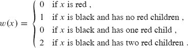

**`16`摊销分析**

想象一下您加入了巴夫健身房。巴夫每月收取`60`美元的会员费，每次使用健身房收取`3`美元。因为您很有纪律，您在`11`月份的每一天都去了巴夫健身房。除了`11`月份的`60`美元月费外，您当月还支付了另外`3 × 30 = 90`美元。尽管您可以将费用看作是`60`美元的固定费用和每天`90`美元的额外费用，但您也可以另一种方式来考虑。总共，您在`30`天内支付了`150`美元，平均每天`5`美元。当您以这种方式查看费用时，您正在**摊销**每月费用至该月的`30`天内，以每天`2`美元的速度分摊。

当您分析运行时间时，您可以做同样的事情。在`**摊销分析**`中，您将执行数据结构操作序列所需的时间平均化。通过摊销分析，您可以表明，如果对一系列操作进行平均化，那么每次操作的平均成本是很小的，即使序列中的单个操作可能很昂贵。摊销分析与平均情况分析不同之处在于不涉及概率。摊销分析保证了`*最坏情况下每次操作的平均性能*`。

本章的前三节涵盖了摊销分析中最常用的三种技术。第 16.1 节从聚合分析开始，其中您确定了一系列`n`个操作的总成本上限`T(n)`。然后每次操作的平均成本为`T(n)/n`。您将平均成本视为每次操作的摊销成本，以便所有操作具有相同的摊销成本。

第 16.2 节涵盖了会计方法，其中您确定每次操作的摊销成本。当存在多种类型的操作时，每种操作可能具有不同的摊销成本。会计方法在序列中的早期对某些操作进行过度收费，将过度收费存储为数据结构中特定对象上的“预付信用”。序列后期，信用用于支付实际成本低于收费的操作。

第 16.3 节讨论了潜在方法，类似于会计方法，您确定每次操作的摊销成本，并可能在早期对某些操作进行过度收费以补偿后期的低收费。潜在方法将信用保持为数据结构作为整体的“势能”，而不是将信用与数据结构中的个别对象相关联。

本章将使用两个示例来检验这三种方法。一个是具有额外操作`MULTIPOP`的堆栈，该操作一次弹出多个对象。另一个是通过单个操作`INCREMENT`从 0 开始计数的二进制计数器。

在阅读本章时，请记住，摊销分析中分配的费用仅用于分析目的。它们不需要——也不应该——出现在代码中。例如，如果您在使用会计方法时为对象`x`分配信用，那么您无需在代码中为`x.credit`等属性分配适当的金额。

当您进行摊销分析时，通常可以深入了解特定数据结构，这种了解可以帮助您优化设计。例如，第 16.4 节将使用潜在方法来分析一个动态扩展和收缩的表。  

**16.1 聚合分析**

在**聚合分析**中，你展示了对于所有`n`，一个包含`n`个操作的序列在总体上花费了`T(n)`的*最坏情况*时间。在最坏情况下，每次操作的平均成本，或者**摊销成本**，因此是`T(n)/n`。这个摊销成本适用于每个操作，即使序列中有多种类型的操作。我们将在本章中研究的另外两种方法，会计方法和潜在方法，可能会为不同类型的操作分配不同的摊销成本。

**栈操作**

作为聚合分析的第一个例子，让我们分析已经增加了一个新操作的栈。第 10.1.3 节介绍了两个基本的栈操作，每个操作都需要`O(1)`的时间：

PUSH(`S`, `x`)将对象`x`推入栈`S`。

POP(`S`)弹出栈`S`的顶部并返回弹出的对象。在空栈上调用 POP 会生成错误。

**图 16.1** MULTIPOP 在栈`S`上的操作，最初显示在**(a)**中。前 4 个对象被 MULTIPOP(`S`, 4)弹出，其结果显示在**(b)**中。下一个操作是 MULTIPOP(`S`, 7)，它清空了栈—显示在**(c)**中—因为剩余的对象少于 7 个。  

由于这些操作每个都在`O(1)`时间内运行，让我们考虑每个操作的成本为 1。因此，`n`个 PUSH 和 POP 操作的总成本为`n`，因此`n`个操作的实际运行时间为`Θ(n)`。

现在让我们添加栈操作 `MULTIPOP(S, k)`，它移除栈`S`的前`k`个对象，如果栈包含的对象少于`k`个，则弹出整个栈。当然，该过程假设`k`是正数，否则 MULTIPOP 操作不会改变栈。在 MULTIPOP 的伪代码中��操作 `STACK-EMPTY` 如果栈当前没有对象则返回 `TRUE`，否则返回 `FALSE`。图 16.1 展示了 MULTIPOP 的一个示例。

`MULTIPOP(S, k)`

| 1 | **当** 栈非空(`S`) 且 `k` > 0 **时** |
| --- | --- |
| --- | --- |
| 2 | POP(S) | `   |
| 3 | `k = k - 1` |

在包含`s`个对象的栈上，MULTIPOP(`S`, `k`)的运行时间是多少？实际运行时间与实际执行的 POP 操作数量成正比，因此我们可以根据每个 PUSH 和 POP 的抽象成本为 1 来分析 MULTIPOP。`while`循环的迭代次数是弹出栈的对象数 min{`s`, `k`}。循环的每次迭代在第 2 行调用一次 POP。因此，MULTIPOP 的总成本是 min{`s`, `k`}，实际运行时间是这个成本的线性函数。

现在让我们分析一个最初为空栈上的`n`个 PUSH、POP 和 MULTIPOP 操作序列。序列中 MULTIPOP 操作的最坏情况成本是`O(n)`，因为栈的大小最多为`n`。因此，任何栈操作的最坏情况时间是`O(n)`，因此`n`个操作的序列成本为`O(n²)`，因为序列中最多包含`n`个成本为`O(n)`的 MULTIPOP 操作。尽管这个分析是正确的，但是来自于考虑每个操作的最坏情况成本的`O(n²)`结果并不紧密。

是的，单个 MULTIPOP 可能很昂贵，但聚合分析表明，对初始为空栈的`n`个 PUSH、POP 和 MULTIPOP 操作序列的成本有一个`O(n)`的上界。为什么？除非首先推送对象，否则无法从堆栈中弹出对象。因此，在非空栈上调用 POP 的次数，包括 MULTIPOP 内的调用，最多为 PUSH 操作的次数，最多为`n`。对于任何值的`n`，`n`个 PUSH、POP 和 MULTIPOP 操作序列的总时间为`O(n)`。对`n`次操作进行平均，得到每次操作的平均成本为`O(n)/n = O(1)`。聚合分析将每个操作的摊销成本分配为平均成本。因此，在这个例子中，所有三个堆栈操作的摊销成本均为`O(1)`。

总结一下：尽管堆栈操作的平均成本和运行时间为`O(1)`，但分析并不依赖于概率推理。相反，分析得出了对`n`次操作序列的*最坏情况*界限为`O(n)`。将总成本除以`n`得到每次操作的平均成本，即摊销成本为`O(1)`。

**递增二进制计数器**

作为聚合分析的另一个例子，考虑实现一个从 0 开始向上计数的`k`位二进制计数器的问题。数组`A[0 : k − 1]`表示计数器。存储在计数器中的二进制数`x`的最低位在`A₀`中，最高位在`A[k − 1]`中，因此。最初，`x` = 0，因此对于`i` = 0, 1, … , `k` − 1，`A[i]` = 0。要将计数器中的值加 1（模 2*^k*），请调用 INCREMENT 过程。

`INCREMENT(A, k)`

| 1 | `i = 0` |   |
| --- | --- |
| `2` | **当** `i < k` **且** `A[i] == 1` **时** |   |
| 3 | `A[i] = 0` |
| `4` | `i = i + 1` |
| 5 | **如果** `i < k` |
| 6 | `A[i] = 1` |

图 16.2 展示了当 INCREMENT 被调用 16 次时，二进制计数器会发生什么变化，从初始值 `0` 到值 `16` 结束。在第 `2-4` 行的`while`循环的每次迭代中，将 `1` 添加到位置`i`。如果`A[i] = 1`，则添加 `1` 会将位置`i`的位翻转为 `0`，并产生一个进位 `1`，在下一次循环迭代中添加到位置`i + 1`。否则，循环结束，然后，如果`i < k`，则`A[i]`必须为 `0`，因此第 `6` 行将 `1` 添加到位置`i`，将 `0` 翻转为 `1`。如果循环以`i = k`结束，则 INCREMENT 的调用将所有`k`位从 `1` 翻转为 `0`。每次 INCREMENT 操作的成本与翻转位的数量成正比。

**图 16.2** 一个 8 位二进制计数器，通过 16 次 `INCREMENT` 操作从 0 到 16 的值。为实现下一个值而翻转的位以蓝色阴影显示。翻转位的运行成本显示在右侧。总成本始终小于 `INCREMENT` 操作总数的两倍。

与堆栈示例一样，粗略分析得出的界限是正确的，但不够紧凑。在最坏情况下，单次执行 INCREMENT 操作需要Θ(`k`)时间，其中数组`A`中的所有位都为 1。因此，在最坏情况下，对初始为零的计数器进行`n`次 INCREMENT 操作需要`O(nk)`时间。  

尽管单次调用 INCREMENT 可能会翻转所有`k`位，但并非每次调用都会翻转所有位。 （请注意与 MULTIPOP 的相似之处，其中单次调用可能弹出许多对象，但并非每次调用都会弹出许多对象。）正如图 16.2 所示，`A₀`在每次调用 INCREMENT 时都会翻转。上一个位，`A₁`只有每隔一次才会翻转：在初始为零的计数器上进行一系列`n`个 INCREMENT 操作会导致`A₁`翻转⌊`n/2`⌋次。类似地，位`A₂`只有每四次才会翻转，或者在一系列`n`个 INCREMENT 操作中翻转⌊`n`/4⌋次。一般来说，对于`i` = 0, 1, … , `k` − 1，位`A[i]`在初始为零的计数器上进行一系列`n`个 INCREMENT 操作时会翻转⌊`n/2`^(`i`)⌋次。对于`i ≥ k`，位`A[i]`不存在，因此不能翻转。因此，序列中的总翻转次数为  

根据第 1142 页上的方程（`A.7`），因此，对于初始为零的计数器上的一系列`n`个 `INCREMENT` 操作，在最坏情况下需要`O(n)`的时间。每个操作的平均成本，因此每个操作的摊销成本是`O(n)/n = O(1)`。

**练习**

**16.1-1**

如果栈操作集包括 `MULTIPUSH` 操作，该操作将`k`个项目推入栈中，那么栈操作的摊销成本的`O(1)`上界是否仍然成立？

**16.1-2**

证明如果在`k`位计数器示例中包含 DECREMENT 操作，则`n`个操作的成本最多可能为Θ(`nk`)时间。  

**`16.1-3`**  

使用聚合分析来确定在数据结构上执行一系列`n`个操作的摊销成本。其中，如果`i`是 2 的确切幂，则第`i`个操作的成本为`i`，否则为 1。

**16.2    会计法**

在摊销分析的`会计法`中，你为不同的操作分配不同的费用，有些操作的费用高于或低于它们实际的成本。你为一个操作分配的费用称为其`摊销成本`。当一个操作的摊销成本超过其实际成本时，你将差额分配给数据结构中的特定对象作为`信用`。信用可以帮助支付后续操作，后续操作的摊销成本低于其实际成本。因此，你可以将一个操作的摊销成本视为其实际成本和存款或使用的信用之间的分割。不同的操作可能具有不同的摊销成本。这种方法与聚合分析不同，聚合分析中所有操作具有相同的摊销成本。

你必须仔细选择操作的摊销成本。如果你想使用摊销成本来表明在最坏情况下每个操作的平均成本很小，你必须确保一系列操作的总摊销成本对该序列的总实际成本提供了上界。此外，正如在聚合分析中一样，上界必须适用于所有操作序列。让我们用`c[i]`表示第`i`个操作的实际成本，`ĉ[i]`表示第`i`个操作的摊销成本。那么你需要满足

对于所有的`n`个操作序列。数据结构中存储的总信用是总摊销成本和总实际成本之间的差异，即。根据不等式（16.1），与数据结构相关联的总信用必须始终为非负。如果你允许总信用变为负数（这是因为在早期操作中收费不足，承诺稍后偿还），那么此时产生的总摊销成本将低于实际产生的总成本。在这种情况下，对于到那个时候的操作序列，总摊销成本将不是总实际成本的上界。因此，你必须小心确保数据结构中的总信用永远不会变为负数。

**栈操作**

为了说明摊销分析的会计方法，我们回到栈的例子。回想一下操作的实际成本是多少

| `PUSH` | `1,` |  输出： |
| --- | --- |
| `POP` | `1,` |
| MULTIPOP | min {`s`, `k`}, |

其中`k`是提供给 MULTIPOP 的参数，`s`是调用时的栈大小。让我们分配以下摊销成本：

| PUSH | 2, |
| --- | --- |
| --- | --- |
| `POP` | `0,` |  输出： |
| MULTIPOP | `0.` |

MULTIPOP 的摊销成本是一个常数（`0`），而实际成本是可变的，因此所有三个摊销成本都是常数。一般来说，所考虑的操作的摊销成本可能彼此不同，甚至在渐近上也可能不同。

现在让我们看看如何通过收取摊销成本来支付任何一系列栈操作。让`$1`代表每个成本单位。一开始，栈是空的。回想一下第 10.1.3 节中栈数据结构与自助餐厅中的盘子堆叠之间的类比。将一个盘子推入栈时，使用`$1`支付推入的实际成本，留下`$1`的信用（从收取的`$2`中）。将该`$1`的信用放在盘子顶部。在任何时候，栈上的每个盘子都有`$1`的信用。

存储在盘子上的`$1` 用于预付从栈中弹出盘子的成本。POP 操作不产生费用：通过从盘子上取下`$1` 的信用来支付弹出盘子的实际成本。因此，通过稍微增加 PUSH 操作的费用，我们可以将 POP 操作视为免费。

此外，MULTIPOP 操作也不产生费用，因为它只是重复的 POP 操作，每个操作都是免费的。如果 MULTIPOP 操作弹出`k`个盘子，则实际成本由存储在`k`个盘子上的`k`美元支付。因为栈上的每个盘子都有$1 的信用，而且栈上始终有非负数的盘子，所以信用金额始终为非负数。因此，对于*任何*一系列* `n` *个 PUSH、POP 和 MULTIPOP 操作，总摊销成本是总实际成本的上限。由于总摊销成本为`O`(`n`)，因此总实际成本也是`O`(`n`)。  

**增加二进制计数器**

作为会计方法的另一个例子，让我们分析从 0 开始的二进制计数器上的 INCREMENT 操作。回想一下，此操作的运行时间与翻转的位数成正比，这作为此示例的成本。同样，我们将使用`1`来表示每个成本单位（在此示例中翻转位的成本）。

对于摊销分 对于摊销分析，将 0 位设置为 1 的摊销成本为`$2`。当一个位被设置为 1 时，`$2` 中的`$1`用于实际设置该位。第二个`$1`作为信用留在位上，以便在将来如果该位被重置为 0 时使用。在任何时候，计数器中的每个 1 位都有`$1`的信用，因此将位重置为 0 可以视为不花费任何成本，而位上的`$1`预付了重置的成本。

下面是如何确定 INCREMENT 的摊销成本。在`while`循环中重置位为 0 的成本由重置位上的美元支付。INCREMENT 过程在第 6 行最多将一个位设置为 1，因此 INCREMENT 操作的摊销成本最多为$2。计数器中的 1 位数永远不会变为负数，因此信用金额始终为非负数。因此，对于`n`个 INCREMENT 操作，总摊销成本为`O(n)`，这限制了总实际成本。  

**练习**

**`16.2-1`**

在一个栈上执行一系列 `PUSH` 和 `POP` 操作，其大小永远不超过`k`。每经过`k`次操作，整个栈都会自动复制一次，以备份目的。通过为各种栈操作分配合适的摊销成本，证明`n`个栈操作的成本，包括复制栈，是`O(n)`。

`16.2-2`

使用会计方法重新执行练习 `16.1-3`。

**`16.2-3`**

你不仅希望增加一个计数器，还希望将其重置为 0（即，使其所有位都为 0）。将检查或修改一个位的时间计为`Θ(1)`，展示如何将计数器实现为一个位数组，以便在初始为零的计数器上进行任意序列的`n`次增量和重置操作的时间为`O(n)`。（*提示*：保持指向高阶 1 的指针。)

**16.3    潜力法**

摊销分析的`**潜力法**`不是将预付的工作表示为存储在数据结构中特定对象的信用，而是将预付的工作表示为“潜在能量”或简称“潜力”，可以用来支付未来的操作。潜力适用于整个数据结构，而不是数据结构中的特定对象。  

潜力法的工作方式如下。从初始数据结构`D₀`开始，发生一系列`n`次操作。对于每个`i = 1, 2, … , n`，让`c[i]`表示第`i`次操作的实际成本，`D[i]`表示将第`i`次操作应用于数据结构`D[i-1]`后得到的数据结构。一个**潜力函数**Φ将每个数据结构`D[i]`映射到一个实数Φ(`D[i]`)，这是与`D[i]`相关联的**潜力**。第`i`次操作相对于潜力函数Φ的**摊销成本** `ĉ[i]`由以下定义

因此，每个操作的摊销成本是其实际成本加上由于操作而产生的潜力变化。根据方程`(16.2)`，`n`次操作的总摊销成本为

第二个方程来自第 1143 页的方程(`A.12`)，因为Φ(`D[i]`)项是级数。

如果您可以定义一个潜力函数`Φ`，使得`Φ(D[n]) ≥ Φ(D₀)`，那么总摊销成本给出了总实际成本的上界。在实践中，您并不总是知道可能执行多少次操作。因此，如果��求对所有`i`，`Φ(D[i]) ≥ Φ(D₀)`，那么您就像在会计方法中一样，提前支付了费用。通常，最简单的方法是将`Φ(D₀)`定义为 0，然后证明对所有`i`，`Φ(D[i]) ≥ 0`。 (参见练习 16.3-1，了解处理`Φ(D₀) ≠ 0`情况的简单方法。)

直观地说，如果第`i`次操作的潜力差`Φ(D[i])` − `Φ(D[i-1])`为正，则摊销成本`ĉ[i]`表示对第`i`次操作的过度收费，数据结构的潜力增加。如果潜力差为负，则摊销成本表示对第`i`次操作的不足收费，潜力的减少用于支付操作的实际成本。

方程`(16.2)`和`(16.3)`定义的摊销成本取决于潜力函数Φ的选择。不同的潜力函数可能产生不同的摊销成本，但仍然是实际成本的上界。在选择潜力函数时，您通常会发现可以进行权衡。选择使用的最佳潜力函数取决于所需的时间界限。  

**栈操作**

为了说明潜力法，我们再次回到栈操作 `PUSH`、`POP` 和 `MULTIPOP` 的示例。我们定义栈上的潜力函数Φ为栈中对象的数量。空初始栈`D₀`的潜力为Φ(`D₀`) = 0。由于栈中对象的数量永远不会为负，因此第`i`次操作后得到的栈`D[i]`具有非负潜力，因此

| `Φ(D[i])` | ≥ | `0` |
| --- | --- | --- |
| --- | --- | --- |
|  | = | Φ(D₀)。 |

因此，关于`Φ`的`n`次操作的总摊销成本代表了实际成本的上界。

现在让我们计算各种栈操作的摊销成本。如果对包含`s`个对象的栈进行的第`i`次操作是一个 PUSH 操作，则潜力差为

| Φ(`D[i]`) − Φ(`D[i-1]`) | = | (`s` + 1) − `s` |
| --- | --- | --- |
| --- | --- | --- |
|  | = | 1. |

根据方程(`16.2`)，这个 PUSH 操作的摊销成本为

| `ĉ[i]` | = | `c[i]` + Φ(`D[i]`) − Φ(`D[i−1]`) |
| --- | --- | --- |
| --- | --- | --- |
|  | = | 1 + 1 |
|  | = 2.` |

假设栈中第 `s` 个对象的第 `i` 次操作是 MULTIPOP(`S`, `k`)，导致弹出 `k' = min {s, k}` 个对象。操作的实际成本为 `k'`，潜在差异为

`Φ(D[i]) - Φ(D[i-1]) = -k'`.  

因此，`MULTIPOP` 操作的摊销成本为

| c[i] | = | c[i] + Φ(D[i]) − Φ(D[i−1]) |
| --- | --- | --- | --- | --- |
| --- | --- | --- |
| | = | k' - k' | `   |
|  | = | 0. |

类似地，普通`POP`操作的摊销成本为 0。

三种操作的摊销成本均为 `O(1)`，因此 `n` 次操作的总摊销成本为 `O(n)`。由于 Φ(`D[i]`) ≥ Φ(`D₀`)，`n` 次操作的总摊销成本是总实际成本的上界。因此，`n` 次操作的最坏情况成本为 `O(n)`。

**增加二进制计数器**

作为潜在方法的另一个例子，我们重新审视增加 `k` 位二进制计数器。这次，第 `i` 次 INCREMENT 操作后计数器的潜力定义为操作后计数器中的 1 位数，我们将其表示为 `b[i]`。

这是如何计算 INCREMENT 操作的摊销成本。假设第 `i` 次 INCREMENT 操作将 `t[i]` 位重置为 0。因此，操作的实际成本 `c[i]` 最多为 `t[i] + 1`，因为除了重置 `t[i]` 位外，它还将最多一个位设置为 1。如果 `b[i] = 0`，则第 `i` 次操作将所有 `k` 位重置为 0，因此 `b[i−1] = t[i] = k`。如果 `b[i] > 0`，则 `b[i] = b[i−1] − t[i] +1`。无论哪种情况，`b[i] ≤ b[i−1] − t[i] + 1`，潜在差异为

| `Φ(D[i])` - `Φ(D[i-1])` | ≤ | (`b[i-1] - t[i] + 1`) - `b[i-1]` |
| --- | --- | --- |
|  | = | 1 − t[i]. |

因此，摊销成本为 

| ĉ[i] | = | c[i] + Φ(D[i]) − Φ(D[i−1]) | `   |
| --- | --- | --- |
| | ≤ | (t[i] + 1) + (1 − t[i]) |
|  | = | 2. |

如果计数器从 0 开始，则 `Φ(D₀) = 0`。由于对于所有 `i`，`Φ(D[i]) ≥ 0`，`n` 次 INCREMENT 操作的总摊销成本是总实际成本的上界，因此 `n` 次 INCREMENT 操作的最坏情况成本为 *O(n)*。

即使计数器不从 0 开始，潜在方法也提供了一种简单而巧妙的分析计数器的方法。计数器从 `b₀` 1 位开始，经过 `n` 次 INCREMENT 操作后，它有 `b[n]` 1 位，其中 0 ≤ `b₀`，`b[n]` ≤ `k`。将方程（16.3）重写为

由于 `Φ(D₀) = b₀`，`Φ(D[n]) = b[n]`，且对于所有 1 ≤ `i` ≤ `n`，`ĉ[i] ≤ 2`，因此 `n` 次 INCREMENT 操作的总实际成本为

  

特别地，`b₀ ≤ k` 意味着只要 `k = O(n)`，总实际成本为 `O(n)`。换句话说，只要至少发生 `n = Ω(k)` 次 INCREMENT 操作，总实际成本为 `O(n)`，无论计数器包含什么初始值。  

**练习**

**16.3-1**

假设你有一个潜在函数 `Φ`，使得对于所有 `i`，Φ(`D[i]`) ≥ Φ(`D₀`)，但 Φ(`D₀`) ≠ 0。证明存在一个潜在函数 `Φ′`，使得 Φ′(`D₀`) = 0，对于所有 `i` ≥ 1，Φ′(`D[i]`) ≥ 0，并且使用 Φ′ 的摊销成本与使用 Φ 的摊销成本相同。

`16.3-2`  

使用潜在方法重新做练习 `16.1-3`。

**`16.3-3`**

考虑一个支持指令`INSERT`和`EXTRACT-MIN`的普通二进制最小堆数据结构，当堆中有 `n` 个项目时，每个操作的最坏情况时间复杂度为 `O(lg n)`。给出一个潜在函数 `Φ`，使得 `INSERT` 的摊销成本为 `O(lg n)`，`EXTRACT-MIN` 的摊销成本为 `O(1)`，并展示你的潜在函数如何产生这些摊销时间界。请注意，在分析中，`n` 是堆中当前项目的数量，你不知道堆中可以存储的最大项目数量的界限。

`16.3-4`

执行`n`个栈操作 PUSH、POP 和 MULTIPOP 的总成本是多少，假设栈以`s₀`个对象开始，以`s[n]`个对象结束？

`16.3-5`

展示如何使用两个普通栈实现一个队列（练习 10.1-7），使得每个 ENQUEUE 和 DEQUEUE 操作的摊销成本为`O(1)`。

**16.3-6**

设计一个数据结构，支持动态多重集合`S`中整数的以下两个操作，允许重复值：

INSERT(`S, x`)将`x`插入`S`中。

DELETE-LARGER-HALF(`S`)从`S`中删除最大的⌈|`S`|/2⌉个元素。

解释如何实现这种数据结构，使得任何`m`个 `INSERT` 和 `DELETE-LARGER-HALF` 操作序列在`O(m)`时间内运行。你的实现还应包括一种在`O(|S|)`时间内输出`S`元素的方法。

**16.4    动态表**

当设计使用表的应用程序时，你并不总是提前知道表将容纳多少项目。你可能为表分配空间，只能在后来发现不够用时。程序必须重新分配一个更大尺寸的表，并将存储在原始表中的所有项目复制到新的、更大的表中。同样，如果从表中删除了许多项目，可能值得重新分配一个尺寸较小的表。本节研究了动态扩展和收缩表的问题。摊销分析将表明，插入和删除的摊销成本仅为`O(1)`，即使实际操作的成本很大，当触发扩展或收缩时。此外，你将看到如何保证动态表中未使用的空间永远不会超过总空间的一个常数分数。

假设动态表支持`TABLE-INSERT`和`TABLE-DELETE`操作。`TABLE-INSERT`将一个占用单个**槽位**的项目插入表中，即一个项目的空间。同样，`TABLE-DELETE`从表中移除一个项目，从而释放一个槽位。表组织方法的细节并不重要：它可以是一个栈（第 10.1.3 节）、一个堆（第六章）、一个哈希表（第十一章）或其他什么。

在第 11.2 节中介绍的概念很方便，我们在那里分析了哈希。非空表`T`的**负载因子** `α(T)`定义为存储在表中的项目数除以表的大小（槽位数）。一个空表（没有槽位的表）的大小为 0，其负载因子定义为 1。如果动态表的负载因子被下界常数限制，表中未使用的空间永远不会超过总空间的一个常数分数。

我们首先分析一个只允许插入的动态表，然后转向支持插入和删除的更一般情况。

**16.4.1 表扩展**

假设表的存储是作为槽位数组分配的。当所有槽位都被使用时，表填满了，或者等效地说，当其负载因子为 1 时。在某些软件环境中，尝试将项目插入满表时，唯一的选择是中止并显示错误。然而，本节的情景假设软件环境，像许多现代软件环境一样，提供了一个可以根据请求分配和释放存储块的内存管理系统。因此，在将项目插入满表时，系统可以通过分配一个比旧表槽位更多的新表来`扩展`表。因为表必须始终驻留在连续内存中，系统必须为更大的表分配一个新数组，然后将项目从旧表复制到新表。  

一种常见的启发式方法是将新表的槽数设置为旧表的两倍。如果唯一的表操作是插入，则表的负载因子始终至少为 `1/2`，因此浪费空间的量永远不会超过表中总空间的一半。  

下一页的 TABLE-INSERT 过程假定`T`是代表表的对象。属性`T.table`包含指向表示表的存储块的指针，`T.num`包含表中项目的数量，`T.size`给出表中总槽的数量。最初，表是空的：`T.num = T.size = 0`。

这里有两种插入类型：TABLE-INSERT 过程本身和行 6 和 10 中表中的`基本插入`。我们可以通过为每个基本插入分配成本 1 来分析 TABLE-INSERT 的运行时间。在大多数计算环境中，行 2 中分配初始表的开销是恒定的，行 5 和 7 中分配和释放存储的开销被行 6 中传输项目的成本所主导。因此，TABLE-INSERT 的实际运行时间与基本插入的数量成正比。当执行行 5–9 时会发生`扩展`。

TABLE-INSERT(`T`, `x`)

|   1 | **如果** `T.size == 0` |
| --- | --- |
| `2` | 用 1 个槽分配`T`.`table` |   |
|   3 | `T.size = 1` |
|   `4` | **如果** `T.num == T.size` |   |
|   5 | 用 `2 * T.size` 槽分配 `new-table` |   |
| `6` | 将`T.table`中的所有项目插入`new-table` |   |
|   7 | 空闲`T.table` |   |
|   `8` | `T.table = new-table` |   |
|   9 | `T.size = 2 · T.size` |
| 10 | 将`x`插入`T.table` |
| 11 | `T.num = T.num + 1` |   |

现在，我们将使用所有三种摊销分析技术来分析最初为空表上的`n` TABLE-INSERT 操作序列。首先，我们需要确定第`i`个操作的实际成本`c[i]`。如果当前表有空间容纳新项目（或者这是第一个操作），那么`c[i] = 1`，因为唯一执行的基本插入是第 10 行中的插入。然而，如果当前表已满并发生扩展，则`c[i] = i`：成本为第 10 行中的基本插入加上从旧表复制到新表的项目的`i - 1`。对于`n`个操作，操作的最坏情况成本是`O(n)`，这导致`n`个操作的总运行时间的上限为`O(n²)`。

这个界限并不严格，因为表在`n` TABLE-INSERT 操作过程中很少扩展。具体来说，第`i`个操作仅在`i` − 1 是 2 的精确幂时才会导致扩展。事实上，操作的摊销成本是`O(1)`，如聚合分析所示。第`i`个操作的成本是

因   因此，`n`个 TABLE-INSERT 操作的总成本是

因为最多`n`个操作每个成本为 1，而其余操作的成本形成一个等比数列。由于`n`个 TABLE-INSERT 操作的总成本受到 3`n`的限制，单个操作的摊销成本最多为 3。

**图 16.3** 通过会计方法分析表扩展。每次调用 TABLE-INSERT 都会收取`$3`，具体如下：`$1` 用于支付基本插入，`$1` 用于插入的项目作为以后重新插入的预付款，`$1` 用于已经在表中的项目，也作为重新插入的预付款。 **(a)** 扩展后的表，有 8 个插槽，4 个项目（棕色插槽），没有存储的信用。 **(b)–(e)** 每次调用 TABLE-INSERT 后，表中有一个额外的项目，新项目上存有`$1`，之前扩展后表中的 4 个项目之一上也存有`$1`。带有这些新项目的插槽是蓝色的。 **(f)** 下一次调用 TABLE-INSERT 时，表已满，因此再次扩展。每个项目都有`$1` 用于重新插入。现在表看起来像(a)部分一样，没有存储的信用，但有 16 个插槽和 8 个项目。

会计方法可以为为什么`TABLE-INSERT`操作的摊销成本应为 3 提供一些直觉。您可以将每个项目视为支付三次基本插入：将自身插入当前表中，下次表扩展时移动自身，下次表扩展时移动已经在表中的某个其他项目。例如，假设表在扩展后的大小为`m`，如`m` = 8 所示。然后表中有`m`/2 个项目，且不包含信用。每次`TABLE-INSERT`调用收取$3。立即发生的基本插入成本为$1。另外$1 存储在作为信用插入的项目上。第三个$1 存储在表中已有的`m`/2 个项目之一上。直到再插入`m`/2 − 1 个项目后，表才会再次填满，因此，当表包含`m`个项目且已满时，每个项目都有$1 用于在扩展期间重新插入。

现在，让我们看看如何使用潜力方法。我们将在第 16.4.2 节中再次使用它，设计一个具有`O(1)`摊销成本的 TABLE-DELETE 操作。就像会计方法在扩展后没有存储信用一样，即`T.num = T.size/2`时，让我们定义潜力为 0 当`T.num = T.size/2`。随着基本插入的发生，潜力需要增加足够的量来支付下次表扩展时将发生的所有重新插入。在另外`T.size/2`次调用 TABLE-INSERT 后，表填满，当`T.num = T.size`时。这`T.size/2`次调用 TABLE-INSERT 后的下一次调用触发了一个成本为`T.size`的扩展，以重新插入所有项目。因此，在`T.size/2`次调用 TABLE-INSERT 的过程中，潜力必须从 0 增加到`T.size`。为了实现这种增加，让我们设计潜力，使得每次 TABLE-INSERT 调用都增加

  

直到表扩展。您可以看到潜力函数

在表扩展后立即为 0，当`T.num = T.size/2`时，每次插入后增加 2，直到表填满。一旦表填满，即`T.num = T.size`时，潜力Φ(`T`)等于`T.size`。潜力的初始值为 0，由于表始终至少半满，`T.num ≥ T.size/2`，这意味着Φ(`T`)始终为非负。因此，`n`次 TABLE-INSERT 操作的摊销成本之和给出了实际成本之和的上界。

要分析表操作的摊销成本，方便的方法是考虑每个操作引起的潜力变化。让`Φ[i]`表示第`i`次操作后的潜力，我们可以将方程`Φ[i]`重写为  

| `c[i]` | = | `c[i]` + Φ`[i]` − Φ`[i−1]` |
| --- | --- | --- |
|  | = `c[i] + ΔΦ[i]`, |

其中`ΔΦ[i]`是第`i`次操作导致的电位变化。首先，考虑第`i`次插入不会导致表扩展的情况。在这种情况下，`ΔΦ[i]`为 2. 由于实际成本`c[i]`为 1，摊销成本为

| `ĉ[i]` | = | `c[i] + ΔΦ[i]` |
| --- | --- | --- |
| |  =  | 1 + 2 | `   |
|  | = | 3. |

现在，考虑当表在第`i`次插入时扩展时的电位变化，因为在插入之前它是满的。让`num[i]`表示第`i`次操作后表中存储的项目数，`size[i]`表示第`i`次操作后表的总大小，以便`size[i−1] = num[i−1] = i−1`，因此Φ[i−1] = 2(`size[i−1] − size[i−1]/2) = size[i−1] = i−1。扩展后，电位下降到 0，然后插入新项目，导致电位增加到Φ[i] = 2。因此，当第`i`次插入触发扩展时，ΔΦ[i] = 2 − (i − 1) = 3 − i。当表在第`i`次 TABLE-INSERT 操作中扩展时，实际成本`c[i]`等于`i`（重新插入`i − 1`个项目并插入第`i`个项目），给出摊销成本为

| `ĉ[i]` | = | `c[i]` + ΔΦ`[i]` |   |
| --- | --- | --- |
|  | = | i + (3 - i) | `   |
|  | = | 3. |

图 16.4 绘制了`num[i]`、`size[i]`和Φ`[i]`随`i`的值的变化。注意电位如何积累以支付扩展表的成本。

**图 16.4** 一系列`n`个 TABLE-INSERT 操作对表中项目数`num[i]`（棕色线）、表中插槽数`size[i]`（蓝色线）和电位Φ`[i]` = 2(`num[i]` − `size[i]`/2)（红色线）的影响，每次操作后进行测量。在扩展之前，电位已经积累到表中的项目数，因此可以支付将所有项目移动到新表的成本。之后，电位降至 0，但在导致扩展的项目插入后立即增加 2。

**16.4.2    表扩展和收缩**

要实现 TABLE-DELETE 操作，只需从表中删除指定项目即可。然而，为了限制浪费空间的量，当负载因子变得太小时，您可能希望在缩小表时`收缩`表。表的收缩类似于表的扩展：当表中的项目数量下降得太低时，分配一个新的、更小的表，然后将项目从旧表复制到新表中。然后可以通过将旧表的存储返回给内存管理系统来释放旧表的存储空间。为了不浪费空间，同时保持摊销成本低，插入和删除过程应该保持两个属性：

+   动态表的负载因子下界为正常数，上界为 1，以及  

+   表操作的摊销成本被一个常数上界限制。

每个操作的实际成本等于基本插入或删除的数量。

你可能会认为，如果在向满表插入项目时将表大小加倍，那么当删除导致表变得不到一半满时，应该将大小减半。这种策略确实保证了表的负载因子永远不会低于 `1/2`. 不幸的是，这也可能导致操作的摊销成本非常高。考虑以下情况。在大小为`n/2` 的表`T`上执行`n`次操作，其中`n`是 2 的幂。前`n/2` 次操作是插入，根据我们之前的分析，总成本为Θ(`n`)。在这些插入操作序列结束时，`T`.*num* = `T`.*size* = `n/2`\. 对于后续的`n/2` 次操作，执行以下序列：

插入，删除，删除，插入，插入，删除，删除，插入，插入，…。

第一次插入导致表扩展到大小`n`。随后的两次删除导致表收缩回大小`n/2`。再进行两次插入会导致另一次扩展，依此类推。每次扩展和收缩的成本为 `Θ(n)`，共有 `Θ(n)`次。因此，`n`次操作的总成本为`Θ(n²)`，使得操作的摊销成本为 `Θ(n)`。

这种策略的问题在于，表扩展后，没有足够的删除操作来支付收缩。同样，在表收缩后，没有足够的插入操作来支付扩展。  

我们如何解决这个问题？允许表的负载因子降至 `1/2` 以下。具体来说，继续在将项目插入满表时将表大小加倍，但是当删除项目导致表变得不到 `1/4` 满时，将表大小减半，而不是之前的 `1/2` 满。因此，表的负载因子在常数 `1/4` 以下，且在收缩后立即为 `1/2`。  

扩展或收缩应该耗尽所有已积累的潜在函数，因此在扩展或收缩后立即，当负载因子为 1/2 时，表的潜在函数为 0。图 `16.5` 展示了这个想法。当负载因子偏离 1/2 时，潜在函数增加，以便在扩展或收缩发生时，表已经积累了足够的潜在函数来支付将所有项目复制到新分配的表中的成本。因此，潜在函数应该在负载因子增加到 1 或降至 1/4 时增长到 `T.num`。在扩展或收缩表后，负载因子立即恢复为 1/2，表的潜在函数也立即减少为 0。

**图 16.5** 如何思考关于表插入和删除的潜在函数`Φ`。当负载因子`α`为 1/2 时，潜在函数为 0。为了在表填满时积累足够的潜在函数来支付重新插入所有`T.size`项的成本，当`α ≥ 1/2`时，每次插入时潜在函数需要增加 2。相应地，当`α ≥ 1/2`时，每次删除使潜在函数减少 2。为了积累足够的潜在函数来支付表收缩时重新插入所有`T.size/4`项的成本，当`α < 1/2`时，每次删除时潜在函数需要增加 1，相应地，当`α < 1/2`时，每次插入使潜在函数减少 1。红色区域代表负载因子小于 1/4，这是不允许的。

我们省略了 TABLE-DELETE 的代码，因为它类似于 TABLE-INSERT。我们假设如果在 TABLE-DELETE 期间发生收缩，那么它发生在从表中删除项目之后。分析假设，每当表中的项目数量降至 0 时，表不占用存储空间。也就是说，如果`T.num = 0`，则`T.size = 0`。

我们如何设计一个潜在函数，使得插入和删除的摊销时间都是常数？当负载因子至少为 1/2 时，与插入时使用的相同潜在函数`Φ(T) = 2(T.num - T.size/2)`仍然有效。当表至少半满时，如果表不扩展，每次插入都会使潜在函数增加 2，如果不导致负载因子降至 1/2 以下，每次删除都会使潜在函数减少 2。  

当负载因子小于 `1/2` 时，即当 `1/4 ≤ α(T) < 1/2` 时，情况如何？与之前一样，当`α(T) = 1/2` 时，即`T.num = T.size/2`，潜在函数Φ(T)应为 `0`。要将负载因子从 `1/2` 降至 `1/4`，需要进行`T.size/4` 次删除，此时`T.num = T.size/4`。为了支付所有重新插入的成本，潜在函数必须在这`T.size/4` 次删除中从 `0` 增加到`T.size/4`。因此，对于每次 `TABLE-DELETE` 的调用，直到表收缩，潜在函数应该增加。

同样，当`α < 1/2`时，每次 TABLE-INSERT 调用应该将电位减少 1。当 `1/4 ≤ α(T) < 1/2` 时，电位函数

`Φ(T) = T.size/2 − T.num`  

产生了这种期望的行为。

将这两种情况结合起来，我们得到电位函数

一个空表的电位为 0，且电位永远不会为负。因此，关于`Φ`的一系列操作的总摊销成本提供了该序列的实际成本的上限。图 16.6 展示了电位函数在一系列插入和删除操作中的行为。

现在，让我们确定每个操作的摊销成本。与之前一样，让`num[i]`表示第`i`个操作后表中存储的项目数，`size[i]`表示第`i`个操作后表的总大小，`α[i] = num[i]/size[i]`表示第`i`个操作后的负载因子，Φ*[i]*表示第`i`个操作后的电位，ΔΦ*[i]*表示第`i`个操作引起的电位变化。最初，`num₀ = 0`，`size₀ = 0`，Φ[0] = 0。

表不扩展或收缩且负载因子不越过`α = 1/2` 的情况很简单。正如我们所见，如果`α[i-1] ≥ 1/2` 且第`i`个操作是不导致表扩展的插入，则ΔΦ`[i]` = 2。同样，如果第`i`个操作是删除且`α[i] ≥ 1/2`，则ΔΦ`[i]` = −2。此外，如果`α[i-1] < 1/2` 且第`i`个操作是不触发收缩的删除，则ΔΦ`[i]` = 1，如果第`i`个操作是插入且`α[i] < 1/2`，则ΔΦ`[i]` = −1。换句话说，如果没有扩展或收缩发生且负载因子不越过`α = 1/2`，则

+   如果负载因子保持在或高于 `1/2`，那么插入时电位增加 `2`，删除时减少 `2`，且

+   如果负载因子低于 `1/2`，则删除时电位增加 1，插入时减少 1。

在这些情况下，第`i`个操作的实际成本`c[i]`只是 1，因此  

**图 16.6** 一系列`n`个 TABLE-INSERT 和 TABLE-DELETE 操作对表中项目数`num[i]`（棕色线）、表中槽位数`size[i]`（蓝色线）和电位（红色线）的影响

其中`α[i] = num[i]`/`size[i]`，每次在第`i`个操作后测量。在扩展或收缩之前，电位已经积累到表中的项目数，因此可以支付将所有项目移动到新表的费用。  

+   如果第`i`个操作是插入，其摊销成本`ĉ[i]`为`c[i]` + ΔΦ`[i]`，如果负载因子保持在或高于 1/2，则为 1 + 2 = 3，如果负载因子低于 1/2，则为 1 + (−1) = 0，且  

+   如果第`i`个操作是删除，其摊销成本`c[i] + ΔΦ[i]`，如果负载因子保持在或高于 1/2，则为 1 + (−2) = −1，如果负载因子低于 1/2，则为 1 + 1 = 2。

还剩下四种情况：将负载因子从低于 `1/2` 提升到 `1/2` 的插入，将负载因子从 `1/2` 降低到低于 `1/2` 的删除，导致表收缩的删除，导致表扩展的插入。我们在第 `16.4.1` 节末尾分析了最后一种情况，以展示其摊销成本为 `3`。  

当第`i`个操作是导致表收缩的删除时，我们有在收缩之前`num[i-1] = size[i-1]/4`，然后删除项目，最后`num[i] = size[i]/2 - 1`。因此，根据方程(16.5)，我们有  

| `Φ[i-1]` | = | `size[i-1]/2 - num[i-1]` |
| --- | --- | --- |
| --- | --- | --- |
| | = | size[i-1]/2 - size[i-1]/4 |
|  | = | size[i-1]/4, |  |

这也等于删除一个项目和将`size[i]−1/4` 个项目复制到新的、更小的表的实际成本`c[i]`。由于操作完成后`num[i] = size[i]/2−1`，`α[i] < 1/2`，所以

| Φ[i] | = | size[i]/2 - num[i] |
| --- | --- | --- | --- | --- |
| --- | --- | --- |
| \| \| = \| 1, \| |

得到`ΔΦ[i] = 1 − size[i−1]/4`。因此，当第`i`个操作是触发收缩的删除操作时，其摊销成本为

| `ĉ[i]` | = | `c[i]` + ΔΦ[i] |   |
| --- | --- | --- |
| | = `size[i-1]/4 + (1 - size[i-1]/4)` |
|  | = | 1. |

最后，我们处理负载因子在操作前符合方程(`16.5`)的一个情况，操作后符合另一个情况的情况。我们从删除开始，其中我们有`num[i-1] = size[i-1]/2`，因此`α[i-1] = 1/2`，在操作之前，以及`num[i] = size[i]/2-1`，在操作之后，因此`α[i] < 1/2`。因为`α[i-1] = 1/2`，我们有Φ[i-1] = 0，因为`α[i] < 1/2`，我们有Φ*[i]* = `size[i]/2 - num[i] = 1`。因此，我们得到ΔΦ*[i]* = 1 - 0 = 1。由于第`i`个操作是一个不会导致收缩的删除操作，实际成本`c[i]`等于 1，摊销成本`ĉ[i]`为`c[i] + ΔΦ*[i]* = 1 + 1 = 2`。

相反，如果第`i`个操作是一个插入操作，将负载因子从低于 1/2 提高到等于 1/2，潜能的变化`ΔΦ[i]`等于−1。同样，实际成本`c[i]`为 1，现在摊销成本`ĉ[i]`为`c[i] + ΔΦ[i] = 1 + (-1) = 0`。

总之，由于每个操作的摊销成本都被一个常数上界限制，对于动态表上的任何`n`个操作序列，实际时间为`O(n)`。

**`练习`**

*16.4-1*

使用潜能方法，分析第一个表插入的摊销成本。

**`16.4-2`**  

你希望实现一个动态的开地址哈希表。为什么当负载因子达到严格小于 1 的某个值`α`时，你会认为表已满？简要描述如何使得动态的开地址哈希表的插入以`O(1)`的摊销成本运行。为什么实际插入的摊销成本并不一定对于所有插入都是`O(1)`？

**16.4-3**

讨论如何使用会计方法分析插入和删除操作，假设当负载因子超过 `1` 时表的大小加倍，当负载因子低于 `1/4` 时表的大小减半。

`16.4-4`  

假设当负载因子低于 `1/4` 时，你不是通过将表的大小减半来收缩表，而是在负载因子低于 `1/3` 时通过将表的大小乘以 `2/3` 来收缩表。使用潜能函数

`Φ(T) = |2(T.num - T.size/2)|`,  

表明使用这种策略的`TABLE-DELETE`的摊销成本被一个常数上界限制。

**问题**

**16-1     二进制反射格雷码**

一个`**二进制格雷码**`表示了一个非负整数序列，其中每次从一个整数到下一个整数，都会有一位二进制位翻转。`**二进制反射格雷码**`根据以下递归方法表示了一些正整数 0 到 2``k` − 1`，其中``k``是某个正整数：  

+   对于`k = 1`，二进制反射格雷码是<0, 1>。  

+   对于`k` ≥ 2，首先形成`k` − 1 的二进制反射格雷码，给出 0 到 `2^(k−1) − 1` 的整数。然后形成这个序列的反射，即反转序列。（也就是说，序列中的第`j`个整数变为反射中的`(2^(k−1) − j − 1)`个整数）。接下来，将反射序列中的每个 `2^(k−1)` 个整数加上 `2^(k−1)`。最后，连接这两个序列。

例如，对于`k = 2`，首先形成`k = 1` 的二进制反射格雷码<0, 1>。它的反射是序列<1, 0>。将 `2^(k−1) = 2` 添加到反射中的每个整数，得到序列<3, 2>。连接这两个序列得到<0, 1, 3, 2>或者用二进制表示为<00, 01, 11, 10>，因此每个整数与其前一个整数只有一位不同。对于`k = 3`，`k = 2` 的二进制反射格雷码的反射是<2, 3, 1, 0>，添加 `2^(k−1) = 4` 得到<6, 7, 5, 4>。连接产生序列<0, 1, 3, 2, 6, 7, 5, 4>，用二进制表示为<000, 001, 011, 010, 110, 111, 101,100>。在二进制反射格雷码中，即使从最后一个整数到第一个整数时，只有一位翻转。

**a.** 从 0 到 `2^(k) − 1` 的二进制反射格雷码中索引整数，并考虑二进制反射格雷码中的第`i`个整数。要从第(`i` −1)个整数转到二进制反射格雷码中的第`i`个整数，恰好有一个位翻转。展示如何确定哪个位翻转，给定索引`i`。

**b.** 假设给定位号`j`，您可以在常数时间内翻转整数的第`j`位，展示如何在Θ(2^(k))时间内计算 2^(k) 个数字的整个二进制反射格雷码序列。

**16-2     使二分搜索动态化**

对排序数组进行二分搜索需要对数搜索时间，但插入新元素的时间与数组大小成线性关系。您可以通过保持多个排序数组来改进插入时间。

具体来说，假设您希望在一组`n`个元素上支持 SEARCH 和 INSERT。让`k` = ⌈lg(`n` + 1)⌉，并且让`n`的二进制表示为<`n`[`k`−1], `n`[`k`−2], … , `n₀`>。维护`k`个排序数组`A`[0]，`A`[1]，…，`A`[`k`−1]，其中对于`i` = 0, 1, …，`k` − 1，数组`A[i]`的长度为 2^(`i`)。每个数组都是满的或空的，具体取决于`n[i]` = 1 或`n[i]` = 0。所有`k`个数组中保存的元素的总数因此为`Σ(2^i * n[i])`。尽管每个单独的数组都是排序的，但不同数组中的元素之间没有特定的关系。

**a.** 描述如何为这种数据结构执行 `SEARCH` 操作。分析其最坏情况运行时间。

**b.** 描述如何执行 INSERT 操作。分析其最坏情况和摊销运行时间，假设唯一的操作是`INSERT`和`SEARCH`。

**c.** 描述如何实现 `DELETE`。分析其最坏情况和摊销运行时间，假设可以进行 `DELETE`、`INSERT` 和 `SEARCH` 操作。

**`16-3` 摊销权重平衡树**

考虑一个普通的二叉搜索树，通过为每个节点`x`添加属性`x.size`来增强，该属性给出以`x`为根的子树中存储的键的数量。让`α`是一个常数，范围为 1/2 ≤ α < 1。我们说给定节点`x`是**α-平衡**的，如果`x.left.size ≤ α · x.size`和`x.right.size ≤ α · x.size`。整棵树如果每个节点都是α-平衡，则为**α-平衡**。G. Varghese 建议的维护权重平衡树的摊销方法如下。

**a.** 1/2-平衡树在某种意义上是尽可能平衡的。给定任意二叉搜索树中的节点`x`，展示如何重建以`x`为根的子树，使其变为 1/2-平衡。您的算法应在Θ(`x`.`size`)时间内运行，并且可以使用`O`(`x`.`size`)辅助存储。

**b.** 显示在一个`n`节点的`α`-平衡二叉搜索树中执行搜索需要`O`(`lg n`)最坏情况时间。

在本问题的其余部分中，假设常数`α`严格大于 1/2。假设您按照通常的方式为一个`n`节点的二叉搜索树实现 INSERT 和 DELETE，只是在每次操作之后，如果树中的任何节点不再是`α`-平衡，则“重建”树中以最高节点为根的子树，使其变为 1/2-平衡。

我们将使用潜力方法分析这个重建方案。对于二叉搜索树`T`中的节点`x`，定义

`Δ(x) = |x.left.size - x.right.size|`.

将`T`的潜力定义为

其中`c`是一个足够大的常数，取决于α。  

**c.** 论证任何二叉搜索树都具有非负潜力，并且 `1/2` 平衡树的潜力为 `0`。

**d.** 假设`m`单位的潜力可以支付重建一个`m`节点子树。为了使重建一个不是`α`-平衡的子树摊销时间为`O(1)`，`c`必须多大，以`α`为单位？

**e.** 证明将节点插入或从`n`个节点的`α`-平衡树中删除节点的摊销时间为`O`(`lg n`)。

**16-4     重构红黑树的成本**

红黑树上有四种基本操作执行`**结构修改**`：节点插入、节点删除、旋转和颜色变化。我们已经看到 RB-INSERT 和 RB-DELETE 仅使用``O`(1)`次旋转、节点插入和节点删除来维护红黑属性，但它们可能会进行更多的颜色变化。

**a.** 描述一个具有`n`个节点的合法红黑树，调用 RB-INSERT 添加第`(n + 1)`个节点会导致Ω(`lg n`)次颜色变化。然后描述一个具有`n`个节点的合法红黑树，对特定节点调用 RB-DELETE 会导致Ω(`lg n`)次颜色变化。

尽管每次操作的最坏情况下颜色变化次数可以是对数级的，但你将证明在最坏情况下，对于一个最初为空的红黑树，任何`m`个 RB-INSERT 和 RB-DELETE 操作序列会导致`O(m)`次结构修改。

**b.** 代码主循环处理的 `RB-INSERT-FIXUP` 和 `RB-DELETE-FIXUP` 的一些情况是**终止**的：一旦遇到，它们会导致循环在经过常数次额外操作后终止。对于 `RB-INSERT-FIXUP` 和 `RB-DELETE-FIXUP` 的每种情况，指明哪些是终止的，哪些不是。（*提示*：查看第 13.3 节和第 13.4 节中的图 13.5、13.6 和 13.7。）  

首先，当只执行插入时，你将分析结构修改。设`T`为红黑树，并定义Φ(`T`)为`T`中红色节点的数量。假设一单位的潜力可以支付 RB-INSERT-FIXUP 的三种情况中执行的结构修改。  

**c.** 让`T'`是将 RB-INSERT-FIXUP 的 Case 1 应用于`T`后的结果。论证Φ(`T'`) = Φ(`T`) − 1。

**d.** 我们可以将`RB-INSERT`过程的操作分为三部分。列出`RB-INSERT`的第 1-16 行、`RB-INSERT-FIXUP`的非终止情况和终止情况导致的结构修改和潜力变化。

**e.** 使用`(d)`部分，论证 RB-INSERT 的每次调用执行的结构修改的摊销数量是`O(1)`。

接下来，你将证明当插入和删除同时发生时，结构修改次数为`O(m)`。对于每个节点`x`，

现在重新定义红黑树`T`的潜力为

让`T′`是应用 RB-INSERT-FIXUP 或 RB-DELETE-FIXUP 的任何非终止情况后得到的树。

**f.** 证明对于 RB-INSERT-FIXUP 的所有非终止情况，Φ(`T′`) ≤ Φ(`T`) − 1。论证 RB-INSERT-FIXUP 的每次调用执行的结构修改的摊销数量是`O(1)`。

**g.** 证明对于 RB-DELETE-FIXUP 的所有非终止情况，Φ(`T'`) ≤ Φ(`T`) − 1。论证 RB-DELETE-FIXUP 的每次调用执行的结构修改的摊销数量是`O(1)`。

**h.** 完成最坏情况下，任何`m`个 RB-INSERT 和 RB-DELETE 操作序列执行`O(m)`次结构修改的证明。

**章节注释**

Aho、Hopcroft 和 Ullman [5] 使用聚合分析来确定不相交集合森林上操作的运行时间。我们将在第十九章中使用势能方法来分析这种数据结构。Tarjan [430] 对摊销分析的会计和势能方法进行了调查，并提出了几个应用。他将会计方法归因于几位作者，包括 M. R. Brown、R. E. Tarjan、S. Huddleston 和 K. Mehlhorn。他将势能方法归因于 D. D. Sleator。术语“摊销”归因于 D. D. Sleator 和 R. E. Tarjan。

势能函数对于证明某些类型问题的下界也很有用。对于问题的每个配置，定义一个将配置映射到实数的势能函数。然后确定初始配置的势能`Φ[init]`，最终配置的势能`Φ[final]`，以及由于任何步骤导致的势能变化的最大值`ΔΦ[max]`。因此，步数至少必须是 |`Φ[final] − Φ[init]`| / | `ΔΦ[max]`|。用于证明 I/O 复杂度下界的势能函数示例出现在 Cormen、Sundquist 和 Wisniewski 的作品中[105]，Floyd[146]，以及 Aggarwal 和 Vitter[3]。Krumme、Cybenko 和 Venkataraman[271]应用势能函数来证明**传话**的下界：从图中每个顶点向每个其他顶点传递一个唯一项。

¹ 在某些情况下，比如开放地址哈希表，如果负载因子等于严格小于 1 的某个常数，就更好地将表视为已满。（参见练习 `16.4-2`。）
