**18** B-树

B-树是设计用于磁盘驱动器或其他直接访问辅助存储设备的平衡搜索树。B-树类似于红黑树（第十三章），但它们更擅长最小化访问磁盘的操作次数。许多数据库系统使用 B-树或 B-树的变体来存储信息。

B-树与红黑树的不同之处在于 B-树节点可以有许多子节点，从几个到数千个不等。也就是说，B-树的“分支因子”可以相当大，尽管通常取决于所使用的磁盘驱动器的特性。B-树与红黑树类似，每个`n`节点的 B-树的高度为`O(lg n)`，因此 B-树可以在`O(lg n)`时间内实现许多动态集合操作。但是，B-树的分支因子比红黑树大，因此表达其高度的对数的底数更大，因此其高度可以明显较低。  

B-树以自然的方式推广了二叉搜索树。图 18.1 展示了一个简单的 B-树。如果内部 B-树节点`x`包含`x.n`个键，则`x`有`x.n + 1`个子节点。节点`x`中的键作为分隔点，将`x`处理的键范围分成`x.n + 1`个子范围，每个子范围由`x`的一个子节点处理。在 B-树中搜索键时，根据与存储在节点`x`中的`x.n`个键的比较，做出一个(`x.n + 1`)路决策。内部节点包含指向其子节点的指针，但叶子节点不包含。

第 18.1 节给出了 B-树的精确定义，并证明了 B-树的高度仅随其包含的节点数对数增长。第 18.2 节描述了如何搜索键和插入键到 B-树中，第 18.3 节讨论了删除。然而，在继续之前，我们需要问为什么我们要将设计用于磁盘驱动器的数据结构与设计用于主随机访问内存中的数据结构进行不同的评估。

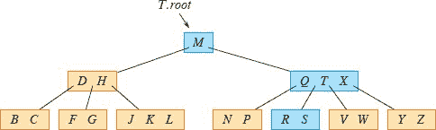

**图 18.1** 一个以英语辅音为键的 B-树。包含`x.n`个键的内部节点`x`有`x.n + 1`个子节点。所有叶子节点在树中具有相同的深度。在搜索字母`R`时，蓝色节点被检查。

**辅助存储上的数据结构**

计算机系统利用各种提供内存容量的技术。计算机系统的**主内存**通常由硅内存芯片组成。这种技术通常比磁性存储技术（如磁带或磁盘驱动器）每存储比特的成本高出一个数量级以上。大多数计算机系统还具有基于固态驱动器（SSD）或磁盘驱动器的**辅助存储**。这种辅助存储的数量通常比主内存的数量高出一个数量级或两个数量级。SSD 的访问时间比磁盘驱动器快，后者是机械设备。近年来，SSD 的容量增加而价格下降。磁盘驱动器通常比 SSD 具有更高的容量，并且它们仍然是存储大量信息的更具成本效益的手段。存储数 TB 的磁盘驱动器可以在 100 美元以下找到。

图 18.2 显示了一个典型的磁盘驱动器。驱动器由一个或多个`**盘片**`组成，它们围绕一个共同的`**主轴**`以恒定速度旋转。每个盘片的表面覆盖着一种可磁化材料。驱动器通过位于`**臂**`末端的`**磁头**`读取和写入每个盘片。臂可以将它们的磁头向主轴靠近或远离。当给定磁头静止时经过其下方的表面称为`**磁道**`。

尽管磁盘驱动器比主存储器便宜且容量更大，但它们要慢得多，因为它们有移动的机械部件。机械运动有两个组成部分：盘片旋转和臂运动。截至目前，商品磁盘驱动器的旋转速度为 `5400-15,000` 转每分钟（RPM）。服务器级驱动器的典型速度为 `15,000` RPM，台式机驱动器的速度为 `7200` RPM，笔记本电脑驱动器的速度为 `5400` RPM。尽管 `7200` RPM 可能看起来很快，但一次旋转需要 `8.33` 毫秒，这比主存储器通常的 `50` 纳秒访问时间（多或少）长了 `5` 个数量级以上。换句话说，如果计算机等待一个完整的旋转来使特定项目位于读/写头下，它在这段时间内可以访问主存储器超过 `100,000` 次。平均等待时间只有半个旋转，但是，与磁盘驱动器相比，主存储器的访问时间差异巨大。移动臂也需要一些时间。截至目前，商品磁盘驱动器的平均访问时间约为 `4` 毫秒。

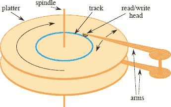  

**图 18.2** 典型的磁盘驱动器。它由一个或多个覆盖有可磁化��料的盘片组成（这里显示了两个盘片），这些盘片围绕一个主轴旋转。每个盘片都有一个在臂末端的头（红色显示）。臂围绕一个共同的枢轴轴旋转。蓝色绘制的磁道是当读/写头静止时通过的表面。

为了分摊等待机械运动（也称为**延迟**）所花费的时间，磁盘驱动器不仅访问一个项目，而是同时访问多个项目。信息被分成一些等大小的**块**位，这些块连续出现在磁道内，并且每次磁盘读取或写入都是一个或多个完整的块。典型磁盘驱动器的块大小从 512 到 4096 字节不等。一旦读/写头正确定位并且盘片已旋转到所需块的开头，读取或写入磁盘驱动器完全是电子的（除了盘片的旋转），磁盘驱动器可以快速读取或写入大量数据。

通常，访问一块信息并从磁盘驱动器中读取它所需的时间比处理所有读取的信息所需的时间更长。因此，在本章中，我们将分别看一下运行时间的两个主要组成部分：

+   磁盘访问次数，以及

+   CPU（计算）时间。

我们以需要从磁盘驱动器中读取或写入的信息块的数量来衡量磁盘访问次数。尽管磁盘访问时间不是恒定的——它取决于当前磁道和所需磁道之间的距离，也取决于盘片的初始旋转位置——但读取或写入的块数提供了对访问磁盘驱动器所需的总时间的一个很好的一阶近似。

在典型的 B 树应用中，处理的数据量非常大，所有数据一次无法全部放入主存储器中。B 树算法根据需要将选定的块从磁盘复制到主存储器，并将已更改的块写回磁盘。B 树算法在任何时候只在主存储器中保留恒定数量的块，因此主存储器的大小不限制可以处理的 B 树的大小。

B 树的过程需要能够将信息从磁盘读入主存储器，并将信息从主存储器写入磁盘。考虑某个对象 `x`。如果 `x` 当前在计算机的主存储器中，那么代码可以像往常一样引用 `x` 的属性：例如 `x.key`。然而，如果 `x` 存储在磁盘上，那么该过程必须执行操作 DISK-READ(`x`)，将包含对象 `x` 的块读入主存储器，然后才能引用 `x` 的属性。（假设如果 `x` 已经在主存储器中，则 DISK-READ(`x`) 不需要磁盘访问：它是一个“无操作”）。类似地，过程调用 DISK-WRITE(`x`) 来保存对对象 `x` 的属性所做的任何更改，通过将包含 `x` 的块写入磁盘。因此，处理对象的典型模式如下：

| `x` = 指向某个对象的指针 |
| --- |
| \| DISK-READ(`x`) \| |
| 访问和/或修改 `x` 的属性的操作 |  输出： |
| `DISK-WRITE(x)` | **//** 如果 `x` 的属性没有更改，则省略 |
| 其他访问但不修改 `x` 的属性的操作 |

系统一次只能在主存储器中保留有限数量的块。我们的`B`树算法假定系统会自动从主存储器中刷新不再使用的块。

由于在大多数系统中，B 树算法的运行时间主要取决于其执行的 `DISK-READ` 和 `DISK-WRITE` 操作的次数，我们通常希望每个操作读取或写入尽可能多的信息。因此，B 树节点通常与整个磁盘块一样大，这个大小限制了 B 树节点可以拥有的子节点数量。

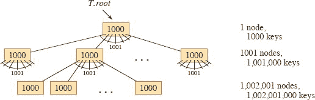

**图 18.3** 高度为 2 的 B 树，包含超过十亿个关键字。每个节点 `x` 中显示 `x.n`，即 `x` 中的关键字数量。每个内部节点和叶子节点包含 1000 个关键字。这棵 B 树在深度 1 有 1001 个节点，在深度 2 有超过一百万个叶子节点。

存储在磁盘驱动器上的大型`B`树通常具有`50`到`2000`之间的分支因子，这取决于关键字的大小相对于块的大小。较大的分支因子显著减少了树的高度和查找任何关键字所需的磁盘访问次数。图`18.3`展示了一个分支因子为`1001`，高度为`2`的`B`树，可以存储超过十亿个关键字。然而，如果根节点永久保留在主存储器中，最多只需要两次磁盘访问就可以在这棵树中找到任何关键字。

**`18.1    B 树的定义`**  

为了简化问题，让我们假设，就像对于二叉搜索树和红黑树一样，与关键字关联的任何卫星信息都存储在与关键字相同的节点中。实际上，您可能实际上只存储与每个关键字关联的另一个磁盘块的指针。本章中的伪代码默认假设与关键字关联的卫星信息，或指向这种卫星信息的指针，随着关键字从一个节点移动到另一个节点而一起移动。`B 树`的一种常见变体，称为**`B`^+-*tree**，将所有卫星信息存储在叶子节点中，只在内部节点中存储关键字和子指针，从而最大化内部节点的分支因子。

一个`B 树 T` 是一棵根为 `T.root` 的树，具有以下属性：

1.  每个节点 `x` 具有以下属性：

    a. `x.n`，当前存储在节点 `x` 中的关键字数量，

    b. 关键字本身，`x.key₁`、`x.key₂`、…、`x.key[x.n]`，按单调递增的顺序存储，使得 `x.key₁ ≤ x.key₂ ≤ ⋯ ≤ x.key[x.n]`，

    c. `x.leaf`，一个布尔值，如果 `x` 是叶子节点则为 TRUE，如果 `x` 是内部节点则为 FALSE。

1.  每个内部节点 `x` 还包含 `x.n + 1` 个指向其子节点的指针 `x.c₁`、`x.c₂`、…、`x.c[x.n+1]`。叶子节点没有子节点，因此它们的 `c[i]` 属性未定义。  

1.  键 `x.key[i]` 分隔存储在每个子树中的键范围：如果 `k[i]` 是存储在以 `x.c[i]` 为根的子树中的任何键，则

    `k₁` ≤ `x.key₁` ≤ `k₂` ≤ `x.key₂` ≤ ⋯ ≤ `x.key[x.n]` ≤ `k[x.n+1]`。

1.  所有叶子节点的深度相同，即树的高度 `h`。

1.  节点对于它们可以包含的键的数量有下限和上限，以一个称为 B 树的**最小度数**的固定整数 `t ≥ 2` 来表示：

    a. 除根节点外的每个节点必须至少有 `t - 1` 个键。因此，除根节点外的每个内部节点至少有 `t` 个子节点。如果树非空，则根必须至少有一个键。

    b. 每个节点最多可以包含 2``t` - 1` 个键。因此，内部节点最多可以有 2``t`` 个子节点。如果一个节点包含恰好 2``t` - 1` 个键，则称其为**满节点**。³  

当 `t = 2` 时，最简单的 B 树出现。每个内部节点都有 2、3 或 4 个子节点，这是一个**2-3-4 树**。然而，在实践中，更大的 `t` 值会产生高度较小的 B 树。

**`B 树的高度`**

大多数 B 树上的操作所需的磁盘访问次数与 B 树的高度成正比。以下定理限制了 B 树的最坏情况高度。

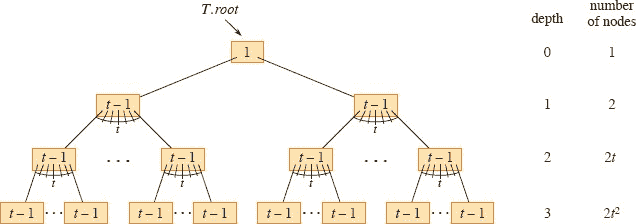

**图 18.4** 高度为 3 的 B 树，包含最少数量的键。每个节点 `x` 中显示了 `x.n`。

`**定理 18.1**`

如果 `n` ≥ 1，则对于高度为 `h` 且最小度数为 `t` ≥ 2 的任何 `n` 个键的 B 树 `T`，

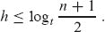

**证明**  

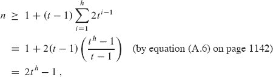

使得 `t^h` ≤ (`n` + 1)/2。对两边取以 `t` 为底的对数证明了定理。  

▪

您可以看到 B 树与红黑树相比的强大之处。尽管在两种情况下树的高度都以 `O(log n)` 增长（回想一下 `t` 是一个常数），但对于 B 树，对数的底数可以是许多倍。因此，B 树在大多数树操作中比红黑树节省了约 lg `t` 的因子。因为检查树中的任意节点通常需要访问磁盘，所以 B 树避免了大量的磁盘访问。

**练习**

**18.1-1**

为什么不允许最小度数为 `t = 1`？

**`18.1-2`** 

对于 图 `18.1` 中的树，`t` 的哪些值是合法的 B 树？

`ρ(n)`

显示存储键 `1`、`2`、`3`、`4`、`5` 的最小度数为 `2` 的所有合法 B 树。

`18.1-4`

作为最小度数 `t` 的函数，高度为 `h` 的 B 树中可以存储的键的最大数量是多少？

** **`18.1-5`5`**  

描述红黑树中每个黑色节点吸收其红色子节点并将其子节点合并到自己的数据结构中的结果。

**18.2    B 树的基本操作**

本节介绍了操作`B-TREE-SEARCH`、`B-TREE-CREATE` 和 `B-TREE-INSERT` 的详细信息。这些过程遵守两个约定：

+   B 树的根始终在主存储器中，因此任何过程都不需要对根执行 `DISK-READ`。但是，如果对根节点进行任何更改，则必须在根上调用 `DISK-WRITE`。

+   作为参数传递的任何节点必须已经执行了 `DISK-READ` 操作。

这些过程都是“一遍过”的算法，从树的根向下进行，无需后退。

**搜索`B`树**

搜索 B 树很像搜索二叉搜索树，只是在每个节点不是做二进制或“两路”分支决策，而是根据节点的子节点数量做多路分支决策。更准确地说，在每个内部节点`x`处，搜索会做一个(`x`.`n` + 1)路分支决策。

B-树-搜索过程将二叉搜索树在第 `316` 页定义的 TREE-SEARCH 过程推广到了 B 树。它以一个指向子树的根节点`x`和要在该子树中搜索的关键字`k`作为输入。因此，顶层调用的形式为 B-树-搜索(`T.root`, `k`)。如果`k`在 B 树中，则 B-树-搜索返回有序对(`y`, `i`)，其中`y`和索引`i`满足`y.key[i] = k`。否则，该过程返回 NIL。

B-树-搜索(`x`, `k`)

| `1` | `i = 1` |   |
| --- | --- |
| `2` | **当** `i` ≤ `x`.`n` 且 *k > x`.`key[i]` 时 |  |
| `3` | `i = i + 1` |   |
| 4 | **如果** `i ≤ x.n` 且 `k == x.key[i]` 时 |
| `5` | **返回** (`x`, `i`) |  |
| 6 | **否则** `x.leaf` |   |
| `7` | **返回**NIL |
| `8` | **否则** DISK-READ(`x.c[i]`) |
| 9 | **返回** B-树-搜索(`x.c[i]`, `k`) |

使用线性搜索过程，`B-树-搜索`的 1-3 行找到最小的索引`i`，使得`k` ≤ `x.key[i]`，否则将`i`设置为`x.n + 1`。4-5 行检查搜索是否发现了关键字，如果发现则返回。否则，如果`x`是叶子，则第 7 行以失败结束搜索，如果`x`是内部节点，则 8-9 行递归搜索`x`的适当子树，在对该子节点进行必要的 `DISK-READ` 后。图 18.1 说明了 `B-树-搜索` 的操作。蓝色节点是在搜索关键字`R`时检查的节点。

与二叉搜索树的 TREE-SEARCH 过程一样，递归期间遇到的节点形成了从树根向下的简单路径。因此，B-树-搜索过程访问`O(h) = O`(log`[t] n`)磁盘块，其中`h`是 B 树的高度，`n`是 B 树中的关键字数。由于`x.n < 2*t`，因此 2-3 行的`while`循环在每个节点内部需要`O(t)`时间，总 CPU 时间为`O(th) = O`(t log`[t]n`)。

**创建空 B 树**

要构建 B 树`T`，首先使用下一页上的 B-树-创建过程创建一个空根节点，然后调用第 508 页上的 B-树-插入过程添加新关键字。这两个过程都使用一个辅助过程分配-节点，我们省略其伪代码，它在`O(1)`时间内分配一个磁盘块用作新节点。由分配-节点创建的节点不需要 DISK-READ，因为磁盘上尚未存储有关该节点的有用信息。B-树-创建需要`O(1)`磁盘操作和`O(1)` CPU 时间。  

创建 B-树(`T`)

| 1 | `x = 分配-节点()` |   |
| --- | --- |
| `2` | `x.leaf = TRUE` |   |
| `3` | `x.n = 0` |   |
| 4 | `DISK-WRITE(x)` |   |
| 5 | T.root = x |

**将关键字插入`B`树**

将关键字插入 B 树比将关键字插入二叉搜索树要复杂得多。与二叉搜索树一样，您需要搜索要插入新关键字的叶子位置。然而，在 B 树中，您不能简单地创建一个新的叶子节点并插入，因为结果树将无法成为有效的 B 树。相反，您将新关键字插入到现有的叶子节点中。由于您不能将关键字插入到已满的叶子节点中，您需要一个操作来将一个拥有 `2`t` − 1` 个关键字的满节点`y`（在其**中位关键字** `y`.*key[t]*周围）分割成每个仅具有``t` − 1` 个关键字的两个节点。中位关键字上移至`y`的父节点，以标识两个新树之间的分隔点。但如果`y`的父节点也已满，则您必须在插入新关键字之前对其进行拆分，因此您可能会一直将满节点拆分到整个树的顶部。

为了避免需要返回树的上层，只需在下行树时分裂遇到的每个满节点。通过这种方式，每当需要分裂一个满节点时，可以确保其父节点不是满的。将键插入 B 树只需要从根到叶子的单次遍历。

**在 B 树中分裂节点**

B-TREE-SPLIT-CHILD 程序在下一页上以一个`非满`内部节点`x`（假定驻留在主存储器中）和一个索引`i`作为输入，其中`x.c[i]`（也假定驻留在主存储器中）是`x`的一个`满`子节点。该程序将这个子节点分成两部分，并调整`x`，使其具有一个额外的子节点。要分裂一个满根节点，首先需要将根节点作为一个新的空根节点的子节点，以便可以使用 B-TREE-SPLIT-CHILD。因此，树的高度增加了 1：分裂是树增高的唯一手段。

B-TREE-SPLIT-CHILD(`x`, `i`)

|   1 | `y = x*c[i]` | **//** 需要分裂的满节点 |   |
| --- | --- | --- |
|   2 | `z = ALLOCATE-NODE()` | **//** `z`将获得`y`的一半 |   |
|   3 | `z.leaf = y.leaf` |  |
| `4` | `z```n = t` − 1` |  |   |
|   `5` | `for` `j = 1` **to** `t` − `1` | **//** `z`获得`y`的最大键 ... |
|   6 | `z.key[j] = y.key[j+t]` |  |
|   `7` | `if` not `y`.`leaf` |  |   |
|   8 | `for j = 1` **to** `t` | **//** … 及其相应的子节点 |
|   9 | `z.c[j] = y.c[j+t]` |  |   |
| `10` | `y.n = t - 1` | **//** `y`保留`t - 1` 个键 |
| 11 | `for j = x.n + 1 downto i + 1` | **//** 移动`x`的子节点到右侧 … |   |
| `12` | `x.c[j+1] = x.c[j]` |  |   |
| 13 | `x`.`c`[`i`+1] = `z` | **//** … 为`z`腾出空间作为子节点 |
| 14 | `for j = x.n`**downto** `i` | **//** 移动`x`中相应的键 |  |
| `15` | `x.key[j+1] = x.key[j]` |  |   |
| 16 | x.key[i] = y.key[t] | **//** 插入 y 的中位键 |
| 17 | `x.n = x.n + 1` | **//** x 增加了一个子节点 |   |
| `   | 18 | `DISK-WRITE(y)` |  |   |
| 19 | `DISK-WRITE(z)` |  |
| `20` | `DISK-WRITE(x)` |  |   |

图 18.5 展示了一个节点如何分裂。`B-TREE-SPLIT-CHILD` 将满节点`y = x.c[i]`围绕其中位键（图中的`S`）分裂，该键上移至`y`的父节点`x`。`y`中大于中位键的键移至一个新节点`z`，成为`x`的新子节点。

B-TREE-SPLIT-CHILD 通过简单的剪切和粘贴工作。节点`x`是正在分裂的节点`y`的父节点，该节点是`x`的第`i`个子节点（在第 1 行设置）。节点`y`最初有 2`t`个子节点和 2`t` − 1 个键，但分裂将`y`减少为`t`个子节点和`t` − 1 个键。节点`y`的`t`个最大子节点和`t` − 1 个键移至节点`z`，成为`x`的新子节点，位于`x`的子节点表中的`y`之后。节点`y`的中位键上移成为节点`x`中分隔指向节点`y`和`z`的指针的键。

行 2-9 创建节点`z`并赋予它最大的`t` − 1 个键，如果`y`和`z`是内部节点，则`y`的相应`t`个子节点。第 10 行调整`y`的键计数。然后，行 11-17 将`x`中的键和子指针向右移动，以便为`x`的新子节点腾出空间，将`z`插入为`x`的新子节点，将`y`的中位键上移至`x`以将`y`与`z`分开，并调整`x`的键计数。行 18-20 写出所有修改后的磁盘块。B-TREE-SPLIT-CHILD 使用的 CPU 时间为`Θ(t)`，这是由于第 5-6 行和第 8-9 行中的`for`循环。（第 11-12 行和第 14-15 行中的`for`循环也运行`O(t)`次。）该过程执行`O(1)`次磁盘操作。

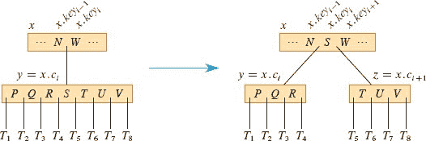

**图 18.5** 分裂一个`t = 4`的节点。节点`y = x.c[i]`分裂为两个节点`y`和`z`，并且`y`的中位键`S`上移至`y`的父节点。

**在树中单次遍历插入键**

将键 `k` 插入高度为 `h` 的 B 树 `T` 只需要沿着树向下进行一次遍历和 `O(h)` 次磁盘访问。所需的 CPU 时间为 `O(th) = O(t log[t] n)`。B-TREE-INSERT 过程使用 B-TREE-SPLIT-CHILD 来确保递归永远不会降到一个满节点。如果根节点满了，B-TREE-INSERT 通过调用下一页上的 B-TREE-SPLIT-ROOT 过程来分裂它。  

B-TREE-INSERT(`T`, `k`)

| 1 | `r = T.root` |   |
| --- | --- |
| `2` | `if r.n` == `2*t` - `1` |   |
| 3 | s = B-TREE-SPLIT-ROOT(T) |
| `B-TREE-INSERT-NONFULL(s, k)` |
| 5 | **else** `B-TREE-INSERT-NONFULL(r, k)` |

B-TREE-INSERT 的工作方式如下。如果根节点满了，那么第 3 行调用第 3 行的 `B-TREE-SPLIT-ROOT` 来分裂它。一个新节点`s`（带有两个子节点）成为根节点，并被 `B-TREE-SPLIT-ROOT` 返回。如图 18.6 所示，分裂根节点是增加 B 树高度的唯一方法。与二叉搜索树不同，B 树在顶部增加高度而不是在底部。无论根节点是否分裂，`B-TREE-INSERT` 都通过调用 `B-TREE-INSERT-NONFULL` 来完成，将键`k`插入到非满根节点为根的树中，这个根节点可以是新根（第 4 行的调用）或原始根（第 5 行的调用）。

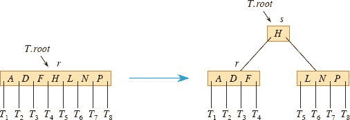

**图 18.6** 用 `t = 4` 分割根节点。根节点 `r` 分裂成两个，新的根节点 `s` 被创建。新的根包含 `r` 的中位键，并将 `r` 的两半作为子节点。当根节点分裂时，B 树的高度增加了一层。只有当根节点分裂时，B 树的高度才会增加。

`B-TREE-SPLIT-ROOT(T)`

| 1 | ` | `s` = ALLOCATE-NODE() |   |
| --- | --- | --- | --- | --- |
| --- | --- |
| 2 | s.leaf = FALSE |
| `3` | `s.n = 0` |   |
| 4 | s.c₁ = T.root | `   |
| `5` | `T.root = s` |   |
| 6 | `B-TREE-SPLIT-CHILD(s, 1)` |
| `7` | **return** `s` |   |

辅助过程 `B-TREE-INSERT-NONFULL` 在页面 511 上将键`k`插入到假设调用该过程时节点`x`中，该节点被假定为非满。`B-TREE-INSERT-NONFULL` 在树中必要时递归下降，始终通过必要时调用 `B-TREE-SPLIT-CHILD` 来保证递归到的节点不是满的。`B-TREE-INSERT` 的操作和 `B-TREE-INSERT-NONFULL` 的递归操作保证了这一假设的正确性。  

图 18.7 展示了 `B-TREE-INSERT-NONFULL` 将键插入 B 树的各种情况。第 3-8 行处理`x`是叶节点的情况，通过将键`k`插入`x`，将`x`中大于`k`的所有键向右移动。如果`x`不是叶节点，则`k`应该插入到以内部节点`x`为根的子树中的适当叶节点。第 9-11 行确定递归下降到的子节点`x.c[i]`。第 13 行检测递归是否会降到一个满子节点，如果是，则第 14 行调用 `B-TREE-SPLIT-CHILD` 将该子节点分裂为两个非满子节点，第 15-16 行确定下降到哪个子节点是正确的。（请注意，在第 16 行增加`i`后，不需要 `DISK-READ(x.c[i])`，因为在这种情况下递归下降到了刚刚由 `B-TREE-SPLIT-CHILD` 创建的子节点。）第 13-16 行的净效果是确保该过程永远不会递归到一个满节点。第 17 行然后递归将`k`插入到适当的子树中。

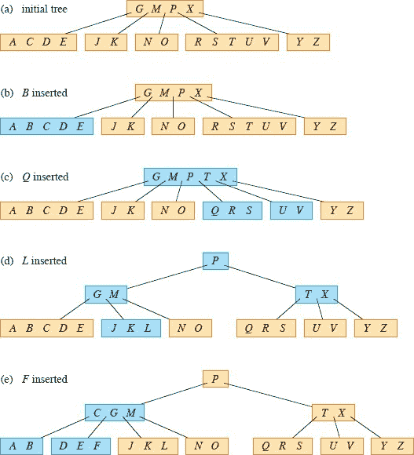

**图 18.7** 将关键字插入 B 树。此 B 树的最小度数``t``为 3，因此一个节点最多可以容纳 5 个关键字。蓝色节点由插入过程修改。**(a)** 此示例的初始树。**(b)** 将``B``插入初始树的结果。这种情况是简单地插入到叶节点中。**(c)** 将``Q``插入到先前树的结果。节点`*RST U V*`分裂为包含`*RS*`和`*U V*`的两个节点，关键字``T``上移至根，``Q``插入到两个半部分中的最左边（`*RS*`节点）。**(d)** 将``L``插入到先前树的结果。根节点立即分裂，因为它已满，并且 B 树的高度增加了一层。然后将``L``插入到包含`*JK*`的叶节点中。**(e)** 将``F``插入到先前树的结果。在将``F``插入到两个半部分中的最右边（`*DE*`节点）之前，节点`*ABCDE*`在``F``之前分裂。

`B-TREE-INSERT-NONFULL(x, k)`

|   1 | `i = x.n` |  |
| --- | --- | --- |
| \| --- \| --- \| --- \| |
| `2` | `if x.leaf` | **//** 插入到叶节点？ |
| `3` | `while` `i` ≥ 1 and `k < x`.key[i] | **//** 移动 `x` 中的关键字以为 `k` 腾出空间 |   |
| `4` | `x.key[i+1] = x.key[i]` |  |   |
|   `5` | `i = i` - 1 |  |   |
|   6 | `x.key[i+1] = k` | **//** 在 `x` 中插入关键字 `k` |
|   7 | `x.n = x.n + 1` | **//** 现在 `x` 有 1 个更多的关键字 |   |
| `8` | `DISK-WRITE(x)` |  |
|   9 | **else while** `i` ≥ 1 and `k < x.key[i]` | **//** 找到 `k` 应该插入的子节点 |
| `10` | `i = i - 1` |
| 11 | i = i + 1 |
| 12 | `DISK-READ(x.c[i])` |   |
| 13 | `if x.c[i].n` == 2*t - 1 | **//** 如果子节点已满，则分裂该子节点 |
| 14 | `B-TREE-SPLIT-CHILD(x, i)` |   |
| `15` | `if` *k > x*.*key[i]* | **//** `k` 是否进入 `x`.*c[i]* 或 `x`.`c`[`i`+1]？ |
| `16` | `i = i` + 1 |  |   |
| 17 | B-TREE-INSERT-NONFULL(x.c[i], k) |

对于高度为`h`的 B 树，B-TREE-INSERT 执行`O(h)`次磁盘访问，因为每个树级别只发生`O(1)`次 DISK-READ 和 DISK-WRITE 操作。总 CPU 时间为每个树级别的`O(t)`, 或者总体为`O(th) = O(t log[t] n)`。由于 B-TREE-INSERT-NONFULL 是尾递归的，您可以使用`while`循环来实现它，从而证明任何时候需要在主内存中的块数量为`O(1)`。

**`练习`**  

**`18.2-1`**

展示插入关键字的结果

`F`, `S`, `Q`, `K`, `C`, `L`, `H`, `T`, `V`, `W`, `M`, `R`, `N`, `P`, `A`, `B`, `X`, `Y`, `D`, `Z`, `E`

有序地将关键字插入到最小度数为 2 的空`B`树中。仅在某个节点必须分裂之前绘制树的配置，并绘制最终配置。

**18.2-2**

解释在执行 `B-TREE-INSERT` 调用过程中，是否会发生多余的 `DISK-READ` 或 `DISK-WRITE` 操作。 （多余的 `DISK-READ` 是指对已经在内存中的块进行 `DISK-READ`。多余的 `DISK-WRITE` 是指将与已存储在磁盘上的信息相同的块写入磁盘。）

`18.2-3`

布尼恩教授断言，`B-TREE-INSERT` 过程总是会导致具有最小可能高度的 B 树。通过证明当``t` = 2` 和关键字集合`{1, 2, … , 15}`时，不存在导致 B 树具有最小可能高度的插入序列来证明教授是错误的。

★ `18.2-4`

如果您将关键字`{1, 2, … , n}`插入到最小度数为 2 的空 B 树中，最终 B 树有多少个节点？

**`18.2-5`**

由于叶节点不需要指向子节点的指针，它们可以使用与相同磁盘块大小的内部节点不同（更大）的`t`值。展示如何修改创建和插入 B 树的过程以处理这种变化。

**`18.2-6`**  

假设您实现了使用二分查找而不是线性查找的 B-TREE-SEARCH。证明这种改变使得所需的 CPU 时间为`O`(`lg n`), 与如何选择`t`作为`n`的函数无关。

`18.2-7`

假设磁盘硬件允许您任意选择磁盘块的大小，但读取磁盘块所需的时间为`a+bt`，其中`a`和`b`是指定的常数，`t`是使用选定大小的块的 B 树的最小度。描述如何选择`t`以最小化（近似）B 树搜索时间。建议在`a` = 5 毫秒和`b` = 10 微秒的情况下选择`t`的最佳值。

**18.3    从 B 树中删除键**

从 B 树中删除类似于插入，但稍微复杂一些，因为您可以从任何节点删除键——不仅仅是叶子节点——当您从内部节点删除键时，必须重新排列节点的子节点。与插入一样，您必须防止删除产生违反 B 树属性的树结构。就像插入时节点不应该因为过大而需要回退一样，删除的简单算法可能需要在路径上的节点（除了根节点）中有最小数量的键时回退。

过程 `B-TREE-DELETE` 从以`x`为根的子树中删除键`k`。与第 325 页的 `TREE-DELETE` 和第 348 页的 `RB-DELETE` 过程不同，这两个过程给出了要删除的节点——可能是先前搜索的结果——`B-TREE-DELETE` 将搜索键`k`与删除过程结合在一起。为什么我们在 `B-TREE-DELETE` 中将搜索和删除结合在一起？就像 `B-TREE-INSERT` 在树中向下进行单次遍历时防止任何节点过满（拥有超过 2`t` − 1 个键）一样，`B-TREE-DELETE` 在树中向下进行单次遍历时防止任何节点过少（拥有少于`t` − 1 个键），同时搜索并最终删除键。

为防止任何节点过少，`B-TREE-DELETE` 的设计保证每当在节点`x`上递归调用自身时，`x`中的键数至少是调用时的最小度`t`。（尽管根可能少于`t`个键，并且可能从根节点进行递归调用，但不会在根节点上进行递归调用。）这个条件要求比通常的 B 树条件所需的最小键多一个，因此在对子节点进行递归调用之前，可能需要将一个键从`x`移动到其中一个子节点中（仍然保留`x`至少有最小`t - 1`个键），从而允许删除在一次向下传递中发生，而无需遍历树上。

我们描述了过程 `B-TREE-DELETE(T, k)` 如何从 B 树 `T` 中删除键 `k`，而不是提供详细的伪代码。我们研究了三种情况，如图 18.8 所示。这些情况是当搜索到达叶子节点时，到达包含键 `k` 的内部节点时，以及到达不包含键 `k` 的内部节点时。如上所述，在这三种情况下，节点 `x` 至少有 `t` 个键（可能的例外是 `x` 是根节点时）。情况 2 和 3——当 `x` 是内部节点时——通过递归沿着 B 树下降来保证这个属性。

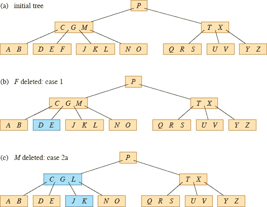  


**图 18.8** 从 B 树中删除键。此 B 树的最小度数为`t` = 3，因此除了根节点外，每个节点必须至少有 2 个键。蓝色节点是删除过程中修改的节点。**(a)** 图 18.7(e)中的 B 树。**(b)** 删除`F`，这是情况 1：在搜索过程中访问的所有节点（除了根节点）至少有`t` = 3 个键时，从叶节点简单删除。**(c)** 删除`M`，这是情况 2a：`M`的前驱`L`上移以占据`M`的位置。**(d)** 删除`G`，这是情况 2c：将`G`下移以形成节点`DEGJK`，然后从该叶节点中删除`G`（情况 1）。**(e)** 删除`D`，这是情况 3b：由于递归无法下降到节点`CL`，因为它只有 2 个键，所以将`P`下移并与`CL`和`TX`合并形成`CLP TX`。然后从叶节点中删除`D`（情况 1）。**(e**⁰**)** 在(e)之后，删除空根。树的高度减少 1。**(f)** 删除`B`，这是情况 3a：`C`移动以填充`B`的位置，`E`移动以填充`C`的位置。

**情况 1:** 搜索到达叶节点`x`。如果`x`包含键`k`，则从`x`中删除`k`。如果`x`不包含键`k`，则`k`不在 B 树中，无需执行其他操作。

**情况 2:** 搜索到包含键`k`的内部节点`x`。设`k = x.key[i]`。根据`x.c[i]`（紧随`k`的`x`的子节点）和`x.c[i+1]`（跟随`k`的`x`的子节点）中的键数，应用以下三种情况之一。

**情况 2a:** `x.c[i]`至少有`t`个键。在以`x.c[i]`为根的子树中找到`k`的前驱`k′`。递归地从`x.c[i]`中删除`k′`，并在`x`中用`k′`替换`k`。（键`k′`可以在单次向下遍历中找到并删除。）

**情况 2b:** `x.c[i]`有`t` − 1 个键，而`x.c[i+1]`至少有`t`个键。这种情况对称于情况 2a。在以`x.c[i+1]`为根的子树中找到`k`的后继`k'`。递归地从`x.c[i+1]`中删除`k'`，并在`x`中用`k'`替换`k`。（同样，找到并删除`k'`可以在单次向下遍历中完成。）

**情况 2c*:** `x.c[i]`和`x.c[i+1]`都有`t` − 1 个键。将`k`和`x.c[i+1]`中的所有内容合并到`x.c[i]`中，这样`x`既失去了`k`，也失去了指向`x.c[i+1]`的指针，而`x.c[i]`现在包含了 2`t` − 1 个键。然后释放`x.c[i+1]`，并递归地从`x.c[i]`中删除`k`。

**情况 3:** 搜索到不包含键`k`的内部节点`x`。在继续向树下搜索的同时，确保每个访问的节点至少有`t`个键。为此，确定适当子树的根`x.c[i]`，该子树必须包含`k`，如果`k`在树中的话。如果`x.c[i]`只有`t` − 1 个键，则根据需要执行情况 3a 或 3b，以确保下降到包含至少`t`个键的节点。然后在`x`的适当子节点上递归完成。

**`情况 3a`:** `x.c[i]`只有`t − 1`个键，但有一个至少有`t`个键的直接兄弟。通过将一个键从`x`移动到`x.c[i]`，将`x.c[i]`的直接左侧或右侧兄弟中的一个键移动到`x`中，以及将兄弟中的适当子指针移动到`x.c[i]`中，为`x.c[i]`增加一个额外的键。

**情况 3b*:** `x.c[i]` 和 `x.c[i]` 的每个直接兄弟都有 `t - 1` 个键。（`x.c[i]` 可能有一个或两个兄弟。）将 `x.c[i]` 与一个兄弟合并，这涉及将一个键从 `x` 移动到新合并的节点中，成为该节点的中位键。

在情况 2c 和 3b 中，如果节点`x`是根节点，则可能最终没有键。当出现这种情况时，删除`x`，并且`x`的唯一子节点`x.c₁`成为树的新根。此操作将树的高度减少 1，并保持树的根至少包含一个键（除非树为空）。  

由于 B 树中大多数键位于叶子中，删除操作通常会删除叶子中的键。然后，`B-TREE-DELETE` 过程在树中进行一次向下遍历，而无需备份。但是，在删除内部节点`x`中的键时，该过程可能会通过树进行向下遍历，以找到键的前任或后继者，然后返回到节点`x`以用其前任或后继者替换键（情况 2a 和 2b）。然而，返回到节点`x`不需要通过`x`和包含前任或后继者的节点之间的所有级别进行遍历，因为该过程可以只保留指向`x`和`x`内的键位置的指针，并直接将前任或后继者键放在那里。

尽管这个过程看起来复杂，但对于高度为`h`的 B 树，只涉及`O(h)`个磁盘操作，因为在过程的递归调用之间只进行`O(1)`次 DISK-READ 和 DISK-WRITE 调用。所需的 CPU 时间为`O(th) = O(t log[t]n)`。

**练习** 

**18.3-1**

展示从图 18.8(f)的树中按顺序删除`C`、`P`和`V`的结果。

`18.3-2`

为 `B-TREE-DELETE` 编写伪代码。

**问题**

**18-1     辅助存储器上的堆栈**  

考虑在具有相对较小的快速主存储器和相对较大的较慢磁盘存储器的计算机中实现堆栈。`PUSH` 和 `POP` 操作适用于单字值。堆栈可以增长到远远大于内存容量的大小，因此大部分必须存储在磁盘上。

一个简单但低效的堆栈实现将整个堆栈保留在磁盘上。在内存中维护一个堆栈指针，它是堆栈顶部元素的磁盘地址。从 0 开始索引块号和块内单词偏移，如果指针的值为`p`，则顶部元素是磁盘块⌊`p`/`m`⌋上的第(`p mod m`)个单词，其中`m`是每个块的单词数。

要实现 PUSH 操作，增加堆栈指针，从磁盘读取适当的块到内存中，将要推送的元素复制到块上的适当单词，并将块写回磁盘。POP 操作类似。从磁盘读取适当的块，保存堆栈顶部，减少堆栈指针，并返回保存的值。不需要写回块，因为它没有被修改，而包含弹出值的块中的单词被忽略。  

与 B 树操作的分析类似，有两个成本要考虑：总磁盘访问次数和总 CPU 时间。磁盘访问还会产生 CPU 时间成本。特别是，对`m`个单词的块的任何磁盘访问都会产生一个磁盘访问和Θ(`m`)的 CPU 时间开销。

**a.** 从渐近意义上讲，使用这种简单实现进行`n`个堆栈操作所需的最坏情况磁盘访问次数是多少？`n`个堆栈操作的 CPU 时间是多少？用`m`和`n`来表达你的答案，适用于这个和后续部分。

现在考虑一种堆栈实现，其中将堆栈的一个块保留在内存中。（还要保留少量内存来记录当前在内存中的块。）只有在相关磁盘块驻留在内存中时，才能执行堆栈操作。必要时，可以将当前在内存中的块写入磁盘，并从磁盘读取新块到内存中。如果相关磁盘块已经在内存中，则不需要进行磁盘访问。

**b.** `n`个 PUSH 操作所需的最坏情况磁盘访问次数是多少？CPU 时间是多少？

**c.** `n`个堆栈操作所需的最坏情况磁盘访问次数是多少？CPU 时间是多少？

假设现在通过在内存中保留两个块（以及少量用于簿记的单词）来实现堆栈。

**d.** 描述如何管理堆栈块，以便对于任何堆栈操作的摊销磁盘访问次数为`O`(1/`m`)，摊销 CPU 时间为`O`(1)。

**`18-2`** 连接和分割 `2-3-4` 树

**join**操作接受两个动态集合`S′`和`S″`以及一个元素`x`，使得对于任何`x′ ∈ S′`和`x″ ∈ S″`，都有`x′.key < x.key < x″.key`。它返回一个集合`S = S′ ∪ {x} ∪ S″`。**split**操作类似于“逆”连接：给定一个动态集合`S`和一个元素`x ∈ S`，它创建一个集合`S′`，其中包含`S − {x}`中所有关键字小于`x.key`的元素，以及另一个集合`S″`，其中包含`S − {x}`中所有关键字大于`x.key`的元素。本问题研究如何在 2-3-4 树（`t = 2` 的 B 树）上实现这些操作。为方便起见，假设元素仅由关键字组成，并且所有关键字值都是不同的。

**a.** 展示如何为 2-3-4 树的每个节点`x`维护以`x`为根的子树的高度作为属性`x.height`。确保您的实现不会影响搜索、插入和删除的渐近运行时间。

**b.** 展示如何实现连接操作。给定两个 2-3-4 树`T′`和`T″`以及一个关键字`k`，连接操作应在`O`(1 + |`h′` − `h″`|)时间内运行，其中`h′`和`h″`分别是`T′`和`T″`的高度。

**c.** 考虑从 2-3-4 树`T`的根到给定关键字`k`的简单路径`p`，在`T`中小于`k`的关键字集合`S′`，以及在`T`中大于`k`的关键字集合`S″`。展示`p`如何将`S′`分解为一组树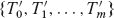和一组关键字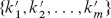，使得对于`i = 1, 2, … , m`和任何关键字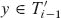和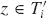都成立。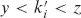的高度之间有什么关系？描述`p`如何将`S″`分解为树和关键字集合。

**d.** 展示如何在`T`上实现分割操作。使用连接操作将`S′`中的关键字组装成单个 2-3-4 树`T′`，将`S″`中的关键字组装成单个 2-3-4 树`T″`。分割操作的运行时间应为`O(lg n)`，其中`n`是`T`中的关键字数。(*提示*：连接的成本应该是可伸缩的。)  

**章节注释**

Knuth、Aho、Hopcroft 和 Ullman 以及 Sedgewick 和 Wayne 进一步讨论了平衡树方案和 B 树。Comer 提供了 B 树的全面调查。Guibas 和 Sedgewick 讨论了各种平衡树方案之间的关系，包括红黑树和 2-3-4 树。

1970 年，J. E. Hopcroft 发明了 2-3 树，这是`B 树`和`2-3-4 树`的前身，其中每个内部节点只有两个或三个子节点。`Bayer 和 McCreight`于 1972 年引入了`B 树`，但没有解释他们选择这个名称的原因。

Bender、Demaine 和 Farach-Colton 研究了如何使 B 树在存在内存层次效应时表现良好。他们的**cache-oblivious**算法在不明确知道内存层次中数据传输大小的情况下有效地工作。

¹ 在指定磁盘容量时，一兆字节是一万亿字节，而不是 2[40]字节。

² 固态硬盘的延迟也比主存大，并以块的形式访问数据。

³ B 树的另一个常见变体称为**`B*^*-`tree**，要求每个内部节点至少填充 2/3，而不是 B 树所需的至少一半。  
