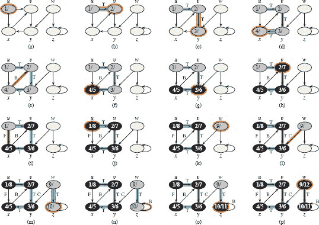
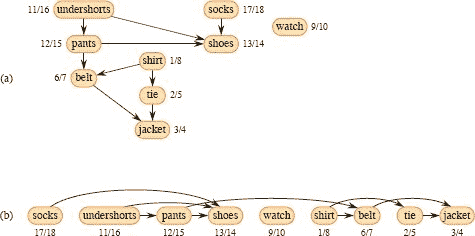
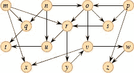

**`20        基本图算法`**

本章介绍了表示图和搜索图的方法。搜索图意味着系统地沿着图的边访问图的顶点。图搜索算法可以发现关于图结构的许多信息。许多算法从搜索它们的输入图开始，以获取这些结构信息。几个其他图算法详细介绍了基本的图搜索。搜索图的技术是图算法领域的核心。

第 20.1 节讨论了图的两种最常见的计算表示形式：邻接表和邻接矩阵。第 20.2 节介绍了一种简单的图搜索算法，称为广度优先搜索，并展示了如何创建广度优先树。第 20.3 节介绍了深度优先搜索，并证明了深度优先搜索访问顶点的顺序的一些标准结果。第 20.4 节提供了深度优先搜索的第一个真实应用：对有向无环图进行拓扑排序。深度优先搜索的第二个应用是找到有向图的强连通分量，这是第 20.5 节的主题。  

**20.1    图的表示**

你可以选择两种标准方法来表示图`G = (V, E)`：作为邻接表的集合或作为邻接矩阵。这两种方法都适用于有向图和无向图。由于邻接表表示提供了一种紧凑表示**稀疏**图的方法——即|`E`|远小于|`V`|²——通常是首选的方法。本书中介绍的大多数图算法假定输入图以邻接表形式表示。然而，当图是**稠密**的——|`E`|接近|`V`|²——或者当你需要快速判断是否存在连接两个给定顶点的边时，你可能更喜欢邻接矩阵表示。例如，本书中介绍的两种全对最短路径算法假定它们的输入图由邻接矩阵表示。

**图 20.1** 无向图的两种表示。**(a)** 一个有 5 个顶点和 7 条边的无向图`G`。**(b)** `G`的邻接表表示。**(c)** `G`的邻接矩阵表示。

**图 20.2** 有向图的两种表示。**(a)** 一个有 6 个顶点和 8 条边的有向图`G`。**(b)** `G`的邻接表表示。**(c)** `G`的邻接矩阵表示。

图`G = (V, E)`的**邻接表表示**包括一个数组`Adj`，其中包含|`V`|个列表，每个列表对应`V`中的一个顶点。对于每个`u ∈ V`，邻接表`Adj[u]`包含所有顶点`v`，使得存在边(`u`, `v`) ∈ `E`。也就是说，`Adj[u]`包含`G`中与`u`相邻的所有顶点。（或者，它可以包含指向这些顶点的指针。）由于邻接表表示图的边，我们的伪代码将数组`Adj`视为图的属性，就像边集`E`一样。因此，在伪代码中，你会看到类似`G`. `Adj[u]`的表示。图 20.1(b)是无向图图 20.1(a)的邻接表表示。同样，图 20.2(b)是有向图图 20.2(a)的邻接表表示。

如果`G`是有向图，则所有邻接表长度之和为|`E`|，因为形式为(`u`, `v`)的边由`v`出现在`Adj[u]`中表示。如果`G`是无向图，则所有邻接表长度之和为 2 |`E`|，因为如果(`u`, `v`)是无向边，则`u`出现在`v`的邻接表中，反之亦然。对于有向和无向图，邻接表表示法具有所需内存量为Θ(`V + E`)的优点。查找图中的每条边也需要Θ(`V + E`)的时间，而不仅仅是Θ(`E`)，因为必须检查每个|`V`|邻接表。当然，如果|`E`| = Ω(`V`)，例如在连通的无向图或强连通的有向图中，我们可以说查找每条边需要Θ(`E`)的时间。

邻接表还可以表示`加权图`，即每条边都有由`权重函数 w : E → ℝ`给出的`权重`的图。例如，让`G = (V, E)`是具有权重函数`w`的加权图。然后，您可以简单地将边`(u, v) ∈ E`的权重`w(u, v)`与顶点`v`在`u`的邻接表中存储。邻接表表示法非常健壮，因为您可以修改它以支持许多其他图变体。

邻接表表示法的一个潜在缺点是它没有更快的方法来确定给定边(`u`, `v`)是否存在于图中，而不是在邻接表`Adj[u]`中搜索`v`。邻接矩阵表示法弥补了这一缺点，但以使用渐近更多的内存为代价。（参见练习 20.1-8，了解允许更快查找边的邻接表变体建议。）  

图`G = (V, E)`的**邻接矩阵表示**假定顶点以某种任意方式编号为 1, 2, … , |`V`|。然后，图`G`的邻接矩阵表示由一个|`V`| × |`V`|矩阵`A = (a[ij])`组成，使得  

图 20.1(c)和 20.2(c)是图 20.1(a)和 20.2(a)中无向和有向图的邻接矩阵。图的邻接矩阵需要`Θ(V²)`的内存，与图中的边数无关。因为查找图中的每条边需要检查整个邻接矩阵，所以这需要`Θ(V²)`的时间。  

观察邻接矩阵在图 20.1(c)中沿主对角线的对称性。由于在无向图中，(`u`, `v`)和(`v`, `u`)代表相同的边，无向图的邻接矩阵`A`是其自身的转置：`A = A`^T。在某些应用中，仅存储邻接矩阵对角线上方的条目可能更有利，从而将存储图所需的内存几乎减少了一半。  

像图的邻接表表示法一样，邻接矩阵也可以表示加权图。例如，如果`G = (V, E)`是具有边权函数`w`的加权图，则可以将边`(u, v) ∈ E`的权重`w(u, v)`存储为邻接矩阵中第`u`行和第`v`列的条目。如果边不存在，则可以将 NIL 值存储为相应的矩阵条目，尽管对于许多问题来说，使用值如 0 或∞更方便。

虽然邻接表表示法在空间效率上至少与邻接矩阵表示法一样好，但邻接矩阵更简单，因此在图形相对较小的情况下，您可能更喜欢它们。此外，对于无权图，邻接矩阵具有进一步的优势：每个条目仅需要一个比特。

**表示属性**

大多数操作图的算法需要维护顶点和/或边的属性。我们使用通常的符号表示这些属性，例如`v.d`表示顶点`v`的属性`d`。当我们将边表示为顶点对时，我们使用相同的符号表示法。例如，如果边有一个属性`f`，那么我们用(`u`, `v`).`f`表示边(`u`, `v`)的属性。为了呈现和理解算法，我们的属性表示法足够了。

在实际程序中实现顶点和边属性可能是另一回事。没有一种最佳的方法来存储和访问顶点和边属性。对于给定的情况，你的决定可能取决于你使用的编程语言、你正在实现的算法以及程序的其余部分如何使用图。如果你使用邻接表表示图，一种设计选择是在额外的数组中表示顶点属性，例如一个与`Adj`数组平行的数组`d[1 : |V|]`。如果与`u`相邻的顶点属于`Adj[u]`，那么属性`u.d`实际上可以存储在数组条目`d[u]`中。还有许多其他实现属性的方法。例如，在面向对象的编程语言中，顶点属性可以表示为 Vertex 类的子类中的实例变量。

**练习**

`20.1-1`

给定一个有向图的邻接表表示，计算每个顶点的出度需要多长时间？计算入度需要多长时间？  输出：

`20.1-2`

给出一个有 7 个顶点的完全二叉树的邻接表表示。给出一个等效的邻接矩阵表示。假设边是无向的，顶点从 1 到 7 编号，如二叉堆中一样。

**20.1-3**

有向图`G` = (`V`, `E`)的**转置**是图`G^T` = (`V`, `E^T`)，其中`E^T` = {(`v`, `u`) ∈ `V × V` : (`u`, `v`) ∈ `E`}。也就是说，`G^T` 是`G`的所有边都被反转的图。描述从`G`计算`G^T` 的高效算法，对于`G`的邻接表和邻接矩阵表示，分析你的算法的运行时间。

**`20.1-4`**  

给定一个多重图`G = (V, E)`的邻接表表示，描述一个`O(V + E)`时间复杂度的算法，计算“等效”无向图`G' = (V, E')`的邻接表表示，其中`E'`由`E`中的边组成，两个顶点之间的所有多重边被替换为一条边，并且所有自环被移除。  

**20.1-5**

有向图`G = (V, E)`的**平方**是图`G² = (V, E²)`，其中当且仅当`G`包含`u`和`v`之间至多两条边的路径时，`(u, v) ∈ E²`。描述从`G`的邻接表和邻接矩阵表示中计算`G²`的高效算法。分析你的算法的运行时间。

**`20.1-6`**

大多数以邻接矩阵表示为输入的图算法需要Ω(`V²`)的时间，但也有一些例外。展示如何在`O(V)`时间内确定有向图`G`是否包含一个**全局汇点**—一个入度为|`V`| – 1 且出度为 0 的顶点，给定`G`的邻接矩阵。  

**`20.1-7`**  

无自环的有向图`G = (V, E)`的**关联矩阵**是一个|`V`| × |`E`|矩阵`B = (b[ij])`，使得

描述矩阵乘积`BB^T` 的条目代表什么，其中`B^T` 是`B`的转置。

若要确定 3 个元素的排列，有 3! = 3 × 2 × 1 = 6 种可能的顺序。更一般地，对于整数`n` ≥ 1，有`n` × (`n` - 1) × (`n` - 2) × ... × 2 × 1 = `n`!种可能的排列。

假设每个数组条目`Adj[u]`不是链表，而是包含`(u, v) ∈ E`的顶点`v`的哈希表，冲突通过链接解决。在均匀独立哈希的假设下，如果所有边查找都是等概率的，确定边是否在图中的预期时间是多少？这种方案有什么缺点？为每个边列表提出一种解决这些问题的替代数据结构。您的替代方案与哈希表相比有什么缺点？

**20.2    广度优先搜索**

**广度优先搜索**是搜索图的最简单算法之一，也是许多重要图算法的原型。Prim 的最小生成树算法（第 21.2 节）和 Dijkstra 的单源最短路径算法（第 22.3 节）使用与广度优先搜索类似的思想。

给定一个图`G = (V, E)`和一个特殊的**源**顶点`s`，广度优先搜索系统地探索`G`的边，以“发现”从`s`可达的每个顶点。它计算从`s`到每个可达顶点的距离，其中到达顶点`v`的距离等于从`s`到`v`所需的最小边数。广度优先搜索还生成一个以`s`为根的“广度优先树”，其中包含所有可达顶点。对于从`s`可达的任何顶点`v`，广度优先树中从`s`到`v`的简单路径对应于`G`中从`s`到`v`的最短路径，即包含最小边数的路径。该算法适用于有向图和无向图。

广度优先搜索之所以被命名为广度优先搜索，是因为它在已发现和未发现顶点之间的前沿上均匀地扩展。您可以将其视为从源顶点发出的波浪中发现顶点。也就是说，从`s`开始，算法首先发现所有距离为 1 的`s`的邻居。然后它发现所有距离为 2 的顶点，然后是所有距离为 3 的顶点，依此类推，直到它发现了从`s`可达的每个顶点。

为了跟踪顶点的波浪，广度优先搜索可以维护源顶点距离的各个顶点的单独数组或列表。相反，它使用一个先进先出队列（参见第 10.1.3 节），其中包含距离`k`的一些顶点，可能后面跟着距离`k + 1`的一些顶点。因此，队列在任何时候包含两个连续波浪的部分。  

为了跟踪进度，广度优先搜索将每个顶点着色为白色、灰色或黑色。所有顶点都开始为白色，而从源顶点`s`不可达的顶点在整个搜索过程中保持为白色。从`s`可达的顶点在搜索期间首次遇到时被**发现**，此时它变为灰色，表示它现在在搜索的前沿：已发现和未发现顶点之间的边界。队列包含所有灰色顶点。最终，灰色顶点的所有边将被探索，以便发现所有邻居。一旦顶点的所有边都被探索，该顶点就在搜索的前沿之后，从灰色变为黑色。

广度优先搜索构建一个广度优先树，最初只包含其根，即源顶点 `s`。每当搜索在扫描灰色顶点 `u` 的邻接表时发现一个白色顶点 `v`，则将顶点 `v` 和边 (`u`, `v`) 添加到树中。我们说 `u` 是 `v` 在广度优先树中的**前驱**或**父节点**。由于从 `s` 可达的每个顶点最多被发现一次，因此从 `s` 可达的每个顶点都有一个父节点。（有一个例外：因为 `s` 是广度优先树的根，它没有父节点。）广度优先树中的祖先和后代关系相对于根 `s` 定义如下：如果 `u` 在树中从根 `s` 到顶点 `v` 的简单路径上，则 `u` 是 `v` 的祖先，`v` 是 `u` 的后代。

广度优先搜索过程 BFS 假设图 `G = (V, E)` 使用邻接表表示。它用 `Q` 表示队列，并为图中的每个顶点 `v` 附加三个额外属性：

+   `v.color` 是 `v` 的颜色：WHITE、GRAY 或 BLACK。

+   `v.d` 保存从源顶点 `s` 到 `v` 的距离，由算法计算得出。

+   `v.π` 是 `v` 在广度优先树中的前驱。如果 `v` 没有前驱，因为它是源顶点或者未被发现，则 `v.π` 为 NIL。

图 20.3 展示了在无向图上进行 BFS 的进展。

BFS 过程的工作方式如下。除了源顶点 `s` 外，第 1-4 行将每个顶点涂成白色，对每个顶点 `u` 设置 `u.d` = ∞，并将每个顶点的父节点设置为 NIL。由于源顶点 `s` 总是第一个被发现的顶点，第 5-7 行将 `s` 涂成灰色，将 `s.d` 设置为 0，并将 `s` 的前驱设置为 NIL。第 8-9 行创建队列 `Q`，最初只包含源顶点。  

第 10-18 行的 `while` 循环在仍有灰色顶点存在时进行迭代：这些顶点位于前沿，即已被发现但尚未完全检查其邻接表的顶点。这个 `while` 循环维持以下不变性：

在第 10 行的测试中，队列 `Q` 包含一组灰色顶点。

尽管我们不会使用这个循环不变性来证明正确性，但很容易看出在第一次迭代之前它是成立的，并且每次循环迭代都会维持这个不变性。在第一次迭代之前，唯一的灰色顶点，也是唯一在 `Q` 中的顶点，是源顶点 `s`。第 11 行确定队列 `Q` 头部的灰色顶点 `u` 并将其从 `Q` 中移除。第 12-17 行的 `for` 循环考虑 `u` 的邻接表中的每个顶点 `v`。如果 `v` 是白色的，则表示它尚未被发现，过程通过执行第 14-17 行来发现它。这些行将顶点 `v` 涂成灰色，将 `v` 的距离 `v.d` 设置为 `u.d + 1`，记录 `u` 为 `v` 的父节点 `v.π`，并将 `v` 放在队列 `Q` 的尾部。一旦过程检查完 `u` 的邻接表中的所有顶点，它会在第 18 行将 `u` 涂黑，表示 `u` 现在在前沿之后。循环不变性得以维持，因为每当一个顶点被涂成灰色（第 14 行）时，它也被入队（第 17 行），每当一个顶点被出队（第 11 行）时，它也被涂黑（第 18 行）。

`BFS(G, s)`  

|   1 | **对于** 每个顶点 `u ∈ G.V – {s}` **执行** |  |  |
| --- | --- | --- | --- |
| --- | --- | --- |
|   2 | u.color = WHITE |  |
|   3 | `u.d = ∞` |  |   |
|   `4` | `u.π` NIL |  |
|   5 | s.color = GRAY |  |
|   6 | `s.d` = 0 |  |
|   7 | `s.π` NIL |  |   |
| `8` | `Q` = Ø |  |   |
|   9 | 入队(`Q, s`) |  |  输出： |
| 10 | **当** `Q` ≠ Ø **时** |  |
| 11 | u = 出队(Q) |  |
| 12 | **对于** `u` 的邻接表中的每个顶点 v | // 搜索 `u` 的邻居 | `   |
| `13` | **如果** `v.color == WHITE` **则** | // `v` 现在被发现了吗？ |
| `14` | `v.color = GRAY` |  |   |
| 15 | `v.d = u.d + 1` |  |
| 16 | `v.π = u` |  |   |
| `17` | 入队(`Q`, `v`) | // `v` 现在位于前沿 |
| `18` | `u.color` = BLACK | // `u`现在在前沿之后 |   |

广度优先搜索的结果可能取决于在第 12 行访问给定顶点的邻居的顺序：广度优先树可能会有所不同，但算法计算的距离`d`不会变化。（参见练习 20.2-5。）

通过简单的改变，BFS 过程可以在队列`Q`变空之前的许多情况下终止。由于每个顶点最多被发现一次，并且只有在被发现时才接收到有限的`d`值，所以一旦每个顶点都有一个有限的`d`值，算法就可以终止。如果 BFS 记录了已发现的顶点数量，那么它可以在队列`Q`为空或所有|`V`|个顶点都被发现时终止。  

**图 20.3** BFS 在无向图上的操作。每个部分显示了图和每次迭代的`while`循环（第 10-18 行）开始时的队列`Q`。顶点距离显示在每个顶点内部和队列下方。棕色区域围绕搜索的前沿，包括队列中的顶点。浅蓝色区域围绕前沿后面的顶点，这些顶点已经出队。每个部分都突出显示了上一次迭代中出队的顶点和添加的广度优先树边（如果有）。蓝色边属于迄今为止构建的广度优先树。

**分析**

在证明广度优先搜索的各种属性之前，让我们先来分析其在输入图`G = (V, E)`上的运行时间。我们使用聚合分析，就像我们在第 16.1 节中看到的那样。初始化后，广度优先搜索永远不会将顶点变白，因此第 13 行的测试确保每个顶点最多入队一次，因此最多出队一次。入队和出队操作都需要`O(1)`的时间，因此用于队列操作的总时间是`O(V)`。因为该过程只在顶点出队时扫描其邻接表，所以每个邻接表最多被扫描一次。由于所有`|V|`个邻接表长度之和为Θ(`E`)，所以扫描邻接表的总时间是`O(V + E)`。初始化的开销为`O(V)`，因此 BFS 过程的总运行时间为`O(V + E)`。因此，广度优先搜索的运行时间与`G`的邻接表表示的大小成线性关系。

**最短路径**

现在，让我们看看为什么广度优先搜索可以找到从给定源顶点`s`到图中每个顶点的最短距离。将从顶点`s`到顶点`v`的**最短路径距离** δ(`s`, `v`)定义为任何路径中边数最少的路径。如果从`s`到`v`没有路径，则δ(`s`, `v`) = ∞。我们将从`s`到`v`长度为δ(`s`, `v`)的路径称为**最短路径**²从`s`到`v`。在展示广度优先搜索正确计算最短路径距离之前，我们研究最短路径距离的一个重要属性。  

**引理 20.1**

设`G = (V, E)`为有向或无向图，`s ∈ V`为任意顶点。那么，对于任意边`(u, v) ∈ E`，

`δ(s, v) ≤ δ(s, u) + 1`。

**证明**   如果`u`可从`s`到达，则`v`也可到达。在这种情况下，从`s`到`v`的最短路径不可能比从`s`到`u`再经过边`(u, v)`的最短路径更长，因此不等式成立。如果`u`无法从`s`到达，则δ(`s`, `u`) = ∞，同样，不等式成立。

▪  输出：

我们的目标是展示 BFS 过程正确计算了每个顶点`v ∈ V`的`v.d = δ(s, v)`。我们首先展示`v.d`从上方界定了δ(`s`, `v`)。

**引理 20.2**  

设`G = (V, E)`为有向或无向图，并假设从给定源顶点`s ∈ V`在`G`上运行 BFS。那么，对于每个顶点`v ∈ V`，BFS 计算的`v.d`值始终满足`v.d ≥ δ(s, v)`，包括终止时。

**证明**   引理在直观上是正确的，因为分配给`v.d`的任何有限值等于从`s`到`v`的某条路径上的边数。正式的证明通过对 ENQUEUE 操作的次数进行归纳。归纳假设是对于所有`v ∈ V`，`v.d` ≥ δ(`s`, `v`)。

归纳的基础情况是在 BFS 的第 9 行将`s`入队后的情况。归纳假设在这里成立，因为`s.d` = 0 = δ(s, s)，对于所有 v ∈ V – {s}，v.d = 1 ∞ δ(s, v)。

对于归纳步骤，考虑在从顶点`u`开始搜索时发现的白色顶点`v`。归纳假设意味着`u.d ≥ δ(s, u)`。第 15 行的赋值和引理 20.1 给出

| v.d | = | u.d + 1 | `   |
| --- | --- | --- |
|  | ≥ | δ(s, u) + 1 | `   |
| | ≥ | δ(s, v). | `   |

然后顶点`v`被入队，并且它再也不会被入队，因为它也被标记为灰色，而第 14-17 行仅对白色顶点执行。因此，`v.d`的值再也不会改变，归纳假设得以保持。

▪  输出：

为了证明`v.d = δ(s, v)`，我们首先更详细地展示*BFS*过程中队列`Q`的操作。下一个引理表明，在任何时候，队列中顶点的`d`值要么都相同，要么形成一个序列<`k`，`k`，…，`k`，`k` + 1，`k` + 1，…，`k` + 1>，其中`k` ≥ 0 为整数。

**`引理 20.3`**  

假设在图`G = (V, E)`上执行`BFS`时，队列`Q`包含顶点<`v₁，v₂，…，v[r]`>，其中`v₁`是`Q`的头部，`v[r]`是尾部。那么，`v[r].d ≤ v₁.d + 1`，且对于`i = 1`, 2, …，`r` – 1，`v[i].d ≤ v[i+1].d`。  

**证明**   证明通过对队列操作次数进行归纳。最初，当队列只包含`s`时，引理显然成立。

对于归纳步骤，我们必须证明引理在出队和入队顶点后仍然成立。首先，我们来看看出队操作。当队列的头部`v₁`被出队时，`v₂`成为新的头部。（如果队列变为空，则引理成立。）根据归纳假设，`v₁.d ≤ v₂.d`。然后我们有`v[r].d ≤ v₁.d`+1 ≤ `v₂.d` + 1，其余不等式不受影响。因此，当`v₂`成为新头部时引理成立。

现在，我们来看看入队操作。当 BFS 的第 17 行将顶点`v`入队到包含顶点<`v₁`，`v₂`，…，`v[r]`>的队列时，入队的顶点变为`v[r+1]`。如果在`v`入队之前队列是空的，那么入队`v`后，我们有`r = 1`，引理显然成立。现在假设在`v`入队时队列不为空。此时，程序最近从队列`Q`中移除了顶点`u`，其邻接表当前正在被扫描。在`u`被移除之前，我们有`u = v₁`，归纳假设成立，因此`u.d ≤ v₂.d`和`v[r].d ≤ u.d + 1`。在`u`从队列中移除后，原先的`v₂`成为新的头部`v₁`，因此现在`u.d ≤ v₁.d`。因此，`v[r+1].d = v.d = u.d + 1 ≤ v₁.d + 1`。由于`v[r].d ≤ u.d + 1`，我们有`v[r].d ≤ u.d + 1 = v.d = v[r+1].d`，其余不等式不受影响。因此，当`v`入队时引理成立。

▪  

以下推论表明，顶点入队时的`d`值随时间单调递增。

**`推论 20.4`**

假设在 BFS 执行过程中，顶点`v[i]`和`v[j]`被入队，并且`v[i]`在`v[j]`之前被入队。那么在`v[j]`被入队时，`v[i].d ≤ v[j].d`。

**证明**   根据引理 `20.3` 和每个顶点在*BFS*过程中最多只接收一次有限`d`值的属性，立即得出。

▪

现在我们可以证明广度优先搜索正确地找到最短路径距离。

**定理 20.5（广度优先搜索的正确性）**

设`G = (V, E)`为有向或无向图，并假设从给定源顶点`s ∈ V`在`G`上运行 BFS。在执行过程中，BFS 发现了从源`s`可达的每个顶点`v ∈ V`，并在终止时，对于所有`v ∈ V`，`v.d = δ(s, v)`。此外，对于从`s`可达的任何`v ≠ s`的顶点，从`s`到`v`的最短路径之一是从`s`到`v.π`，后跟边`(v.π, v)`。

**证明**   为了推导矛盾，假设某个顶点接收到与其最短路径距离不相等的`d`值。在所有这样的顶点中，让`v`是具有最小δ(`s`, `v`)的顶点。根据引理 20.2，我们有`v.d` ≥ δ(`s`, `v`)，因此`v.d` > δ(`s`, `v`)。我们不能有`v = s`，因为`s.d` = 0 且δ(`s`, `s`) = 0。顶点`v`必须从`s`可达，否则我们将有δ(`s`, `v`) = ∞ ≥ `v.d`。让`u`是在从`s`到`v`的某条最短路径上紧接着`v`的顶点（因为`v ≠ s`，所以顶点`u`必须存在），使得δ(`s`, `v`) = δ(`s`, `u`)+1。因为δ(`s`, `u`) < δ(`s`, `v`)，并且���于我们选择了`v`的方式，我们有`u.d` = δ(`s`, `u`)。将这些属性放在一起得到

  

现在考虑 BFS 在第 11 行选择从`Q`中出列顶点`u`的时间。此时，顶点`v`要么是白色、灰色或黑色。我们将展示这些情况中的每一种都导致不等式`(20.1)`的矛盾。如果`v`是白色，则第 15 行设置`v.d = u.d + 1`，与不等式`(20.1)`矛盾。如果`v`是黑色，则它已从队列中移除，并且根据推论 20.4，我们有`v.d ≤ u.d`，再次与不等式`(20.1)`矛盾。如果`v`是灰色，则在出列某个顶点`w`时将其涂成灰色，该顶点`w`比`u`更早地从`Q`中移除，并且`v.d = w.d + 1`。然而，根据推论 20.4，`w.d ≤ u.d`，因此`v.d = w.d + 1 ≤ u.d + 1`，再次与不等式`(20.1)`矛盾。

因此我们得出结论，对于所有`v ∈ V`，`v.d` = δ(`s`, `v`)。所有从`s`可达的顶点必须被发现，否则它们将有∞ = `v.d` > δ(`s`, `v`)。为了完成定理的证明，从第 15-16 行观察到，如果`v`.`π = u`，那么`v.d = u.d` + 1。因此，要形成从`s`到`v`的最短路径，从`s`到`v`.`π`取一条最短路径，然后遍历边(`v`.`π v`)。

▪  输出：

**广度优先树**  

图 20.3 中的蓝色边显示了 BFS 过程构建的广度优先树，该树对应于`π`属性。更正式地说，对于具有源`s`的图`G = (V, E)`，我们将`G`的**前驱子图**定义为`G[π] = (V[π], E[π])`，其中  

和

如果`V[π]`由从`s`可达的顶点组成，并且对于所有`v ∈ V[π]`，子图`G[π]`包含从`s`到`v`的唯一简单路径，该路径也是`G`中从`s`到`v`的最短路径。广度优先树实际上是一棵树，因为它是连通的且`|E[π]| = |V[π]| − 1`（参见第 1169 页的定理 B.2）。我们称`E[π]`中的边为**树边**。

下面的引理表明，BFS 过程产生的前驱子图是一棵广度优先树。

**引理 20.6**

当应用于有向或无向图`G = (V, E)`时，BFS 过程构造`π`，使得前驱子图`G[π] = (V[π], E[π])`是一棵广度优先树。

**证明**   BFS 的第 16 行设置 `v.π = u` 当且仅当 `(u, v) = E` 且 `δ(s, v)` < ∞——也就是说，`v` 是从 `s` 可达的——因此 `V[π]` 包含从 `s` 可达的顶点。由于前任子图 `G[π]` 形成一棵树，根据定理 B.2，它包含从 `s` 到 `V[π]` 中每个顶点的唯一简单路径。通过定理 20.5 的归纳应用，得出每条路径都是 `G` 中的最短路径。  

PRINT-PATH 过程打印出从 `s` 到 `v` 的最短路径上的顶点，假设 BFS 已经计算出了广度优先树。该过程的运行时间与打印路径中顶点数量成线性关系，因为每个递归调用都是为了一个顶点更少的路径。  

打印路径(`G`, `s`, `v`)

|   1 | `if v` == `s` |   |
| --- | --- |
|   2 | 打印 `s` |
|   3 | **`elseif`** `v`.`π` == NIL |
|   4 | 打印“从” `s` “到” `v` “不存在路径” |
|   `5` | **else** PRINT-PATH(`G`, `s`, `v`.`π`) |   |
|   6 | 打印 `v` |

**练习**

**`20.2-1`**

展   展示在有向图图 20.2(a)上以顶点 `3` 为源运行广度优先搜索后得到的 `d` 和 `π``π` 值。

`20.2-2`

展示在无向图图 20.3 上以顶点 `u` 为源运行广度优先搜索后得到的 `d` 和 `π` 值。假设顶点的邻居按字母顺序访问。

`20.2-3`

通过论证，使用单个位来存储每个顶点的颜色就足够了，因为如果删除第 18 行，BFS 过程产生的结果是相同的。然后展示如何完全避免顶点颜色的需要。

**`20.2-4`**

如果我们用邻接矩阵表示 BFS 的输入图，并修改算法以处理这种形式的输入，BFS 的运行时间是多少？

**`20.2-5`**  

论证在广度优先搜索中，对顶点 `u` 赋予的值 `u.d` 与顶点在每个邻接表中出现的顺序无关。以图 20.3 为例，展示广度优先搜索计算的广度优先树可能取决于邻接表内的顺序。

`20.2-6`

给出一个有向图 `G = (V, E)`、源顶点 `s ∈ V` 和一组树边 `E[π] ⊆ E` 的示例，使得对于每个顶点 `v ∈ V`，图中从 `s` 到 `v` 的唯一简单路径是 `G` 中的最短路径，但无论如何排列每个邻接表中的顶点，边集 `E[π]` 都无法通过在 `G` 上运行 BFS 来产生。

`20.2-7`  

有两种职业摔跤手：“面孔”（简称“babyfaces”，即“好人”）和“脚跟”（“坏人”）。在任何一对职业摔跤手之间，可能存在对抗，也可能不存在。给定 `n` 名职业摔跤手的姓名和 `r` 对存在对抗的摔跤手，给出一个 `O(n + r)` 时间复杂度的算法，确定是否可以将一些摔跤手指定为“面孔”，其余的指定为“脚跟”，使得每场对抗都是面孔和脚跟之间的。如果可以进行这样的指定，你的算法应该给出结果。

★ **`20.2-8`**

树 `T = (V, E)` 的**直径**定义为 max {δ(`u`, `v`) : `u`, `v ∈ V`}，即树中所有最短路径距离的最大值。给出一个计算树直径的高效算法，并分析算法的运行时间。

**20.3    深度优先搜索**

正如其名称所示，深度优先搜索在可能的情况下在图中进行“更深入”的搜索。深度优先搜索探索最近发现的仍有未探索边的顶点 `v` 的边。一旦 `v` 的所有边都被探索完，搜索就“回溯”以探索从发现 `v` 的顶点离开的边。这个过程一直持续，直到从原始源顶点可达的所有顶点都被发现。如果还有未发现的顶点，则深度优先搜索选择其中一个作为新源，从该源重复搜索。该算法重复整个过程，直到发现每个顶点为止。³

与广度优先搜索一样，每当深度优先搜索在已发现顶点 `u` 的邻接表扫描期间发现顶点 `v` 时，它通过将 `v` 的前任属性 `v.π` 设置为 `u` 来记录此事件。与广度优先搜索不同，其前驱子图形成一棵树，深度优先搜索生成的前驱子图可能包含多棵树，因为搜索可能从多个源重复。因此，我们对深度优先搜索的前驱子图的定义与广度优先搜索略有不同：它始终包括所有顶点，并考虑多个源。具体来说，对于深度优先搜索，前驱子图是 `G[π] = (V, E[π])`，其中 

`E[π] = {(v.π, v) : v ∈ V 且 v.π ≠ NIL}`。

深度优先搜索的前驱子图形成一个由多个`深度优先树`组成的`深度优先森林`。`E[π]`中的边是`树边`。

与广度优先搜索类似，深度优先搜索在搜索过程中为顶点着色以指示其状态。每个顶点最��是白色的，在搜索中发现时变为灰色，在搜索完成时变为黑色，也就是当其邻接表被完全检查时。这种技术确保每个顶点最终都在恰好一个深度优先树中，因此这些树是不相交的。

除了创建深度优先森林外，深度优先搜索还为每个顶点`标记时间戳`。每个顶点 `v` 有两个时间戳：第一个时间戳 *v.d* 记录了 `v` 首次被发现（并变为灰色），第二个时间戳 *v.f* 记录了搜索完成检查 `v` 的邻接表时的时间（并将 `v` 变为黑色）。这些时间戳提供了关于图的结构的重要信息，并且通常有助于推理深度优先搜索的行为。

本页上的 DFS 过程记录了它何时发现顶点 `u`（在属性 `u.d` 中）以及何时完成顶点 `u`（在属性 `u.f` 中）。这些时间戳是介于 1 和 2 `|V|` 之间的整数，因为每个顶点都有一个发现事件和一个完成事件。对于每个顶点 `u`，

顶点 `u` 在时间 `u.d` 之前是白色的，在时间 `u.d` 和时间 `u.f` 之间是灰色的，在时间 `u.f` 之后是黑色的。在 DFS 过程中，输入图 `G` 可能是无向的或有向的。变量 `time` 是用于时间戳的全局变量。图 20.4 展示了在图 20.2 中显示的图上进行 DFS 的进展（但顶点用字母标记而不是数字）。

`DFS(G)`

|   1 | **对于** 每个顶点 `u ∈ G.V` |   |
| --- | --- |
|   `2` | `u.color = WHITE` |
|   3 | `u.π = NIL` |   |
|   `4` | `time` = 0 |   |
|   5 | **对于** 每个顶点 `u ∈ G.V` |
|   6 | **如果** `u.color` == WHITE |
|   7 | DFS-VISIT(`G`, `u`) |
| `DFS-VISIT(G, u)` |   |
|   1 | `time = time` + 1 | // 白色顶点 `u` 刚刚被发现 |
|   2 | u.d = time |  |
| `3` | *u.color* = GRAY |  |
|   4 | `**对于**` 图 `G.Adj[u]` 中的每个顶点 `v` | // 探索每条边 `u, v` |   |
|   5 | **如果** `v.color` == WHITE |  |
| `6` | `v.π = u` |  |   |
|   7 | DFS-VISIT(`G`, `v`) |  |   |
|   `8` | `time = time + 1` |   |
|   9 | `u.f = time` |
| 10 | `u.color` = BLACK | // 将`u`标记为黑色；搜索完成 |

DFS 过程的工作方式如下。第 1-3 行将所有顶点涂为白色，并将它们的`π`属性初始化为 NIL。第 4 行重置全局时间计数器。第 5-7 行依次检查`V`中的每个顶点，当找到一个白色顶点时，通过调用 DFS-VISIT 来访问它。在第 7 行的每次调用 DFS-VISIT(`G`, `u`)时，顶点`u`成为深度优先森林中新树的根。当 DFS 返回时，每个顶点`u`都被分配了一个**发现时间** `u.d`和一个**完成时间** `u.f`。

在每次调用 DFS-VISIT(`G`, `u`)时，顶点`u`最初是白色的。第 1-3 行增加全局变量`time`，将新值`time`记录为发现时间`u.d`，并将`u`标记为灰色。第 4-7 行检查与`u`相邻的每个顶点`v`，如果`v`是白色，则递归访问`v`。由于第 4 行考虑每个`v ∈ Adj[u]`，深度优先搜索**探索**边(`u`, `v`)。最后，在离开`u`的每条边都被探索后，第 8-10 行增加`time`，在`u.f`中记录完成时间，并将`u`标记为黑色。

深度优先搜索的结果可能取决于 DFS 的第 `5` 行检查顶点的顺序，以及 DFS-VISIT 的第 `4` 行访问顶点的顺序。这些不同的访问顺序在实践中往往不会引起问题，因为深度优先搜索的许多应用可以使用任何深度优先搜索的结果。

**图 20.4** 在有向图上进行深度优先搜索算法 DFS 的进展。边在被探索时被分类：树边标记为 T，回边标记为 B，前向边标记为 F，交叉边标记为`C`。顶点内的时间戳表示发现时间/完成时间。树边用蓝色突出显示。橙色突出显示指示发现或完成时间发生变化的顶点和在每一步中被探索的边。

DFS 的运行时间是多少？DFS 的第 1-3 行和第 5-7 行上的循环需要`Θ(V)`时间，不包括执行 DFS-VISIT 的调用所需的时间。与广度优先搜索一样，我们使用聚合分析。由于必须对每个顶点`v ∈ V`调用一次 DFS-VISIT 过程，因为调用 DFS-VISIT 的顶点`u`必须是白色的，而 DFS-VISIT 要做的第一件事就是将顶点`u`标记为灰色。在执行 DFS-VISIT(`G`, `v`)期间，第 4-7 行的循环执行`|Adj[v]|`次。由于Σ[v∈V] |Adj[v]| = `Θ(E)`，并且每个顶点调用一次 DFS-VISIT，因此执行 DFS-VISIT 的第 4-7 行的总成本为`Θ(V + E)`。因此，DFS 的运行时间为`Θ(V + E)`。  

**深度优先搜索的属性**

深度优先搜索为图的结构提供了有价值的信息。也许深度优先搜索最基本的特性是，前驱子图`G[π]`确实形成了树的森林，因为深度优先树的结构确切地反映了 DFS-VISIT 的递归调用结构。也就是说，当且仅当在搜索`u`的邻接表时调用 DFS-VISIT(`G`, `v`)时，`u = v.π`。此外，如果`v`是在`u`为灰色时被发现，则顶点`v`是深度优先森林中顶点`u`的后代。

深度优先搜索的另一个重要特性是发现和完成时间具有`括号结构`。如果 DFS-VISIT 过程在发现顶点`u`时打印左括号“(u”，在完成`u`时打印右括号“u)”，那么打印的表达式将是良好形式的，因为括号是正确嵌套的。例如，图 20.5(a)的深度优先搜索对应于图 20.5(b)中显示的括号化。以下定理提供了另一种表征括号结构的方法。

**定理 20.7(`括号定理`)**  

在（有向或无向）图`G = (V, E)`的任何深度优先搜索中，对于任意两个顶点`u`和`v`，以下三个条件中恰好一个成立：  

+   区间`[u.d, u.f]`和`[v.d, v.f]`完全不相交，`u`和`v`都不是深度优先森林中的另一个后代，

+   区间[`u.d`, `u.f`]完全包含在区间[`v.d`, `v.f`]内，u 是深度优先树中 v 的后代，或

+   区间[`v.d`, `v.f`]完全包含在区间[`u.d`, `u.f`]内，`v`是深度优先树中`u`的后代。

**证明**   我们从`u.d < v.d`的情况开始。我们根据`v.d < u.f`是否成立考虑两种子情况。第一种子情况是`v.d < u.f`，这意味着`v`在`u`仍然是灰色时被发现，这意味着`v`是`u`的后代。此外，由于`v`是在`u`之后被发现的，它的所有出边都被探索，`v`在返回并完成`u`之前就已完成。因此，在这种情况下，区间[`v.d`, `v.f`]完全包含在区间[`u.d`, `u.f`]内。在另一种子情况中，`u.f < v.d`，根据不等式（20.4），`u.d < u.f < v.d < v.f`，因此区间[`u.d`, `u.f`]和[`v.d`, `v.f`]是不相交的。由于区间不相交，没有一个顶点是在另一个顶点仍然是灰色时被发现的，因此没有一个顶点是另一个的后代。

  

**图 20.5** 深度优先搜索的性质。 **(a)** 有向图的深度优先搜索结果。顶点被标记时间戳，边的类型如图 20.4 中所示。 **(b)** 每个顶点的发现时间和完成时间的区间对应于所示的括号化。每个矩形跨越由相应顶点的发现时间和完成时间给出的区间。只显示树边。如果两个区间重叠，则一个区间嵌套在另一个区间内，对应于较小区间的顶点是较大区间的后代。 **(c)** 部分（a）的图重新绘制，其中所有树边和前向边在深度优先树内向下，所有反向边从后代向祖先向上。  

当`v.d < u.d`时，情况类似，只是在上述论证中`u`和`v`的角色互换。

▪  输出：

**推论 20.8（后代间隔的嵌套）**

对于（有向或无向）图`G`的深度优先森林中，顶点`v`是顶点`u`的真后代，当且仅当`u.d < v.d < v.f < u.f`。

**证明**   根据定理 `20.7`，立即得出。

▪

下一个定理给出了另一个重要的特征，即何时一个顶点是深度优先森林中另一个顶点的后代。

**定理 20.9（白色路径定理）**

在图`G = (V, E)`的深度优先森林中，顶点`v`是顶点`u`的后代，当且仅当搜索发现`u`时，从`u`到`v`存在一条完全由白色顶点组成的路径。

**证明** ⇒：如果`v = u`，那么从`u`到`v`的路径只包含顶点`u`，当`u.d`接收一个值时，`u`仍然是白色的。现在，假设`v`是深度优先森林中`u`的真后代。根据推论 20.8，`u.d < v.d`，因此`v`在时间`u.d`时是白色的。由于`v`可以是`u`的任何后代，深度优先森林中从`u`到`v`的唯一简单路径上的所有顶点在时间`u.d`时都是白色的。

⇐：假设在时间`u.d`从`u`到`v`存在一条白色顶点路径，但`v`在深度优先树中不成为`u`的后代。不失一般性，假设沿着路径除了`v`之外的每个顶点都成为`u`的后代。（否则，让`v`是沿着路径到`u`最近的不成为`u`后代的顶点。）让`w`是路径中`v`的前任，因此`w`是`u`的后代（`w`和`u`实际上可能是同一个顶点）。根据推论 20.8，`w.f ≤ u.f`。因为`v`必须在`u`被发现后但在`w`完成之前被发现，但`u.d < v.d < w.f ≤ u.f`。然后定理 20.7 意味着区间[`v.d`, `v.f`]完全包含在区间[`u.d`, `u.f`]中。根据推论 20.8，`v`最终必须成为`u`的后代。

▪  输出：

**边的分类**

您可以通过在深度优先搜索期间对图的边进行分类来获得关于图的重要信息。例如，20.4 节将展示，如果深度优先搜索不产生“后向”边（引理 20.11），则有向图是无环的。

由深度优先搜索图`G`上的深度优先森林`G[π]`可以包含四种类型的边：

1.  **树边** 是深度优先森林`G[π]`中的边。如果边`(u, v)`是树边，则`v`是通过探索边`(u, v)`首次发现的。

1.  **后向边** 是指连接深度优先树中顶点`u`到其祖先`v`的边`(u, v)`。我们认为可能出现在有向图中的自环是后向边。

1.  **前向边** 是指连接深度优先树中顶点`u`到其适当后代`v`的非树边(`u`, `v`)。

1.  **交叉边** 是指除了其他所有边。它们可以在同一深度优先树中的顶点之间移动，只要一个顶点不是另一个的祖先，或者它们可以在不同深度优先树中的顶点之间移动。

在图 20.4 和 20.5 中，边标签表示边的类型。图 20.5(c)还展示了如何重新绘制图 20.5(a)的图形，以便所有树和前向边向下指向深度优先树，而所有后向边向上。您可以以这种方式重新绘制任何图形。

DFS 算法在遇到某些边时具有足够的信息对其进行分类。关键思想是当边(`u`, `v`)首次被探索时，顶点`v`的颜色对边有所说明：

1.  白色表示树边，

1.  灰色表示后向边，而  

1.  黑色表示前向或交叉边。

第一种情况立即从算法的规范中得出。对于第二种情况，请注意灰色顶点始终形成与活动 `DFS-VISIT` 调用堆栈对应的后代线性链。灰色顶点的数量比最近发现的顶点在深度优先森林中的深度多 1。深度优先搜索总是从最深的灰色顶点开始探索，因此到达另一个灰色顶点的边已经到达了祖先。第三种情况处理了剩余的可能性。练习 `20.3-5` 要求您展示这样的边（u, v）如果 u.d < v.d 则为前向边，如果 u.d > v.d 则为交叉边。

根据以下定理，在无向图的深度优先搜索中永远不会出现前向和交叉边。

**定理 20.10**  

在无向图`G`的深 在无向图`G`的深度优先搜索中，`G`G`的每条边都是树边或后向边。

**证明** 让(`u`, `v`)是`G`的任意边，假设不失一般性地`u.d < v.d`。那么，当`u`是灰色时，搜索必须在完成`u`之前发现并完成`v`，因为`v`在`u`的邻接表中。如果搜索第一次探索边(`u`, `v`)是从`u`到`v`的方向，那么`v`是未发现的（白色）直到那时，否则搜索将在`v`到`u`的方向上已经探索了这条边。因此，(`u`, `v`)成为树边。如果搜索首先以从`v`到`u`的方向探索(`u`, `v`)，那么(`u`, `v`)是后向边，因为必须存在一条从`u`到`v`的树边路径。

▪

由于(`u`, `v`)和(`v`, `u`)在无向图中实际上是同一条边，定理 20.10 的证明说明了如何对边进行分类。当从一个顶点搜索时，该顶点必须是灰色的，如果相邻顶点是白色的，则该边是树边。否则，该边是后向边。  

接下来的两节应用了关于深度优先搜索的上述定理。

**图 `20.6`** 用于练习 `20.3-2` 和 `20.5-2` 的有向图。

**练习**

`20.3-1`

制作一个带有行和列标签 `WHITE`、`GRAY` 和 `BLACK` 的 3x3 表格。在每个单元格`(i, j)`中，指出在有向图的深度优先搜索过程中，是否可能存在从颜色为`i`的顶点到颜色为`j`的顶点的边。对于每种可能的边，指出它可以是什么类型的边。再制作一个类似的表格，用于无向图的深度优先搜索。

**`20.3-2`**

展示深度优先搜索在图 `20.6` 的图上的工作原理。假设 DFS 过程的第 `5-7` 行的`for`循环按字母顺序考虑顶点，并假设每个邻接表按字母顺序排序。展示每个顶点的发现和完成时间，并展示每条边的分类。

**`20.3-3`**  

展示图 `20.4` 的深度优先搜索的括号结构。

**`20.3-4`**

通过论证 DFS 过程如果移除 DFS-VISIT 的第 `10` 行将产生相同结果，证明使用单个位来存储每个顶点颜色足够。

**`20.3-5`**

证明在有向图中，边`(`u`, `v`)`是

**a.** 当且仅当`u.d < v.d < v.f < u.f`时，为树边或前向边，

**b.** 当且仅当`v.d ≤ u.d < u.f ≤ v.f`时，为后向边，以及

**c.** 当且仅当`v.d < v.f < u.d < u.f`时，为交叉边。

**`20.3-6`**

重写 DFS 过程，使用栈来消除递归。

**`20.3-7`**

给出一个反例来反驳这样的猜想：如果有向图`G`包含从`u`到`v`的路径，并且在`G`的深度优先搜索中`u.d < v.d`，那么`v`是生成的深度优先森林中`u`的后代。

**`20.3-8`**

给出一个反例来反驳这样的猜想：如果有向图`G`包含从`u`到`v`的路径，则任何深度优先搜索必须导致`v.d ≤ u.f`。

`20.3-9`

修改深度优先搜索的伪代码，以便打印出有向图`G`中的每条边及其类型。展示如果`G`是无向的，你需要做出哪些修改（如果有的话）。

**`20.3-10`**

解释一个有向图的顶点`u`如何最终成为一个只包含`u`的深度优先树，尽管`u`在`G`中有入边和出边。

**`20.3-11`**

设`G = (V, E)`是一个连通的无向图。给出一个`O(V + E)`时间复杂度的算法，用于计算在`G`中沿着每条边正反方向穿越一次的路径。描述如果给你大量的便士，你如何找到迷宫的出口。

**20.3-12**

展示如何使用无向图`G`的深度优先搜索来识别`G`的连通分量，使得深度优先森林包含与`G`的连通分量数量相同的树。更确切地说，展示如何修改深度优先搜索，使得对于每个顶点`v`，都分配一个介于 1 和`k`之间的整数标签`v.cc`，其中`k`是`G`的连通分量数量，这样当且仅当`u`和`v`属于同一个连通分量时`u.cc = v.cc`。

★ `20.3-13`

一个有向图`G = (V, E)`是**单连通**的，如果`u ⇝ v` 意味着`G`对于所有顶点`u, v ∈ V`最多包含一条从`u`到`v`的简单路径。给出一个有效的算法来确定一个有向图是否是单连通的。

**20.4    拓扑排序**

本节展示如何使用深度优先搜索对有向无环图进行拓扑排序，有时也称为“dag”。有向无环图`G = (V, E)`的**拓扑排序**是对其所有顶点的线性排序，使得如果`G`包含一条边`(u, v)`，那么在排序中`u`出现在`v`之前。拓扑排序仅定义在无环的有向图上；当一个有向图包含循环时，不可能有线性排序。将图的拓扑排序视为沿着水平线排列其顶点的顺序，使得所有的有向边都从左到右。因此，拓扑排序与第二部分中研究的通常“排序”方式不同。

许多应用使用有向无环图来表示事件之间的先后关系。图 20.7 给出了一个例子，即当 Bumstead 教授早上穿衣服时会出现的情况。教授必须在其他衣物之前穿上某些衣物（例如，先穿袜子再穿鞋）。其他物品可以以任何顺序穿上（例如，袜子和裤子）。在图 20.7(a)的 dag 中，有向边(`u`, `v`)表示衣物`u`必须在衣物`v`之前穿上。因此，这个 dag 的拓扑排序给出了穿衣服的可能顺序。图 20.7(b)展示了拓扑排序的 dag，顶点按照完成时间逆序排列，所有的有向边都从左到右。  

过程 `TOPOLOGICAL-SORT` 对 `dag` 进行拓扑排序。图 20.7(b)展示了拓扑排序后的顶点按照完成时间逆序排列的样子。

拓扑排序(`G`)

| 1 | 调用 DFS(`G`)计算每个顶点`v`的完成时间`v.f` |  |
| --- | --- | --- |
| --- | --- |
| 2 | ` 每个顶点完成时，将其插入链表的前端 |   |
| `3` | **返回** 顶点的链表 |

拓扑排序过程的运行时间为`Θ(V + E)`，因为深度优先搜索需要`Θ(V + E)`的时间，而将每个|`V`|个顶点插入链表的前端只需要`O(1)`的时间。

为了证明这个非常简单和高效算法的正确性，我们从以下关键引理开始，描述有向无环图的特性。

**`引理 20.11`**

一个有向图`G`是无环的当且仅当对`G`进行深度优先搜索不产生反向边。

**图 20.7 (a)** 当 Bumstead 教授穿衣服时，他会对衣物进行拓扑排序。每条有向边(`u, v`)表示衣物`u`必须在衣物`v`之前穿上。深度优先搜索的发现和完成时间显示在每个顶点旁边。**(b)** 同一图以拓扑排序显示，其顶点按完成时间递减的顺序从左到右排列。所有的有向边都从左到右。

**证明** ⇒: 假设深度优先搜索产生了一条反向边(`u, v`)。那么顶点`v`是深度优先森林中顶点`u`的祖先。因此，`G`包含一条从`v`到`u`的路径，而反向边(`u, v`)形成了一个循环。

⇐：假设`G`包含一个循环`c`。我们展示了对`G`进行深度优先搜索会产生一条回边。设`v`是在`c`中被发现的第一个顶点，(`u`, `v`)是在`c`中的前一条边。在时间`v.d`，`c` 的顶点形成了一条从`v`到`u`的白色顶点路径。根据白色路径定理，顶点`u`在深度优先树中成为了`v`的后代。因此，(`u`, `v`)是一条回边。

▪

**定理 `20.12`**  

`TOPOLOGICAL-SORT` 会对其输入的有向无环图进行拓扑排序。

**证明**   假设在给定的有向无环图`G = (V, E)`上运行 DFS 以确定其顶点的完成时间。我们只需证明对于任意不同的顶点`u`、`v ∈ V`，如果`G`包含从`u`到`v`的边，则`v.f < u.f`。考虑 DFS(`G`)探索的任意边(`u`, `v`)。当探索这条边时，`v`不能是灰色的，因为那样的话`v`将是`u`的祖先，(`u`, `v`)将是一条回边，与引理 20.11 相矛盾。因此，`v`必须是白色或黑色。如果`v`是白色的，它将成为`u`的后代，因此`v.f < u.f`。如果`v`是黑色的，它已经完成，所以`v.f`已经被设置。因为搜索仍在从`u`探索，它尚未为`u.f`分配时间戳，所以最终分配给`u.f`的时间戳大于`v.f`。因此，对于有向无环图中的任意边(`u`, `v`)，有`v.f < u.f`，证明了定理。

▪  输出：

**图 20.8** 用于拓扑排序的有向无环图。

**习题**  

**`20.4-1`**  

展示当在图 `20.8` 的有向无环图上运行 `TOPOLOGICAL-SORT` 时，顶点的排序。假设 `DFS` 过程的 `5-7` 行的`for`循环按字母顺序考虑顶点，并假设每个邻接表按字母顺序排序。

`20.4-2`

给出一个线性时间算法，对于给定的有向无环图`G = (V, E)`和两个顶点`a`、`b ∈ V`，返回`G`中从`a`到`b`的简单路径数量。例如，图 20.8 的有向无环图中，从顶点`p`到顶点`v`恰好有四条简单路径：<`p`, `o`, `v`>、<`p`, `o`, `r`, `y`, `v`>、<`p`, `o`, `s`, `r`, `y`, `v`>和<`p`, `s`, `r`, `y`, `v`>。你的算法只需要计算简单路径的数量，而不需要列出它们。

**`20.4-3`**

给出一个算法，确定无向图`G = (V, E)`是否包含简单循环。你的算法应该在`O(V)`时间内运行，与|`E`|无关。

**`20.4-4`**

证明或反驳：如果一个有向图`G`包含循环，那么拓扑排序(`G`)产生的顶点排序会最小化与产生的排序不一致的“坏”边的数量。

**`20.4-5`**  

另一种对有向无环图`G = (V, E)`进行拓扑排序的方法是重复找到入度为 0 的顶点，输出它，并从图中删除它及其所有出边。解释如何实现这个想法，使其在`O(V + E)`的时间内运行。如果`G`有循环，这个算法会发生什么？  

**20.5    强连通分量**

现在我们考虑深度优先搜索的一个经典应用：将有向图分解为其强连通分量。本节展示了如何使用两次深度优先搜索来实现这一点。许多处理有向图的算法都从这样的分解开始。在将图分解为强连通分量之后，这些算法分别在每个分量上运行，然后根据分量之间的连接结构组合解决方案。

从附录 B 回顾，有向图`G = (V, E)`的强连通分量是指一个最大的顶点集合`C ⊆ V`，使得对于`C`中的每一对顶点`u`、`v ∈ C`，都有`u ⇝ v`和`v ⇝ u`，也就是说，顶点`u`和`v`是互相可达的。图 20.9 展示了一个例子。  

用于找到有向图`G = (V, E)`的强连通分量的算法使用了`G`的转置，我们在练习 20.1-3 中定义了转置`G^T = (V, E^T)`的图，其中`E^T = {(u, v):(v, u) ∈ E}`。也就是说，`E^T` 由`G`的边以相反方向组成。给定`G`的邻接表表示，创建`G^T` 的时间为Θ(`V + E`)。图`G`和`G^T` 具有完全相同的强连通分量：在`G`中，`u`和`v`互相可达，当且仅当它们在`G^T` 中互相可达。[图 20.9(b)]展示了[图 20.9(a)]中的图的转置，其中强连通分量在两部分中都被着蓝色。

下一页的线性时间（即Θ(`V + E`)时间）过程 `STRONGLY-CONNECTED-COMPONENTS` 计算了有向图`G = (V, E)`的强连通分量，使用了两次深度优先搜索，一次在`G`上，一次在`G^T`上。

这 这个算法的思想来自于**组件图** `G^(SCC) = (V^(SCC), E^(SCC))` 的一个关键属性，定义如下。假设 `G` 有强连通分量 `C₁`，`C₂`，…，`C[k]`。顶点集 `V^(SCC)` 为 `{v₁，v₂，…，v[k]}`，它包含 `G` 的每个强连通分量 `C[i]` 的一个顶点 `v[i]`。如果 `G` 包含一个有向边 `(x, y)`，其中 `x ∈ C[i]` 且 `y ∈ C[j]`，则存在一条边 `(v[i], v[j]) ∈ E^(SCC)`。从另一个角度看，如果我们收缩所有边，使得边上的顶点在同一个强连通分量内，只剩下一个单一顶点，那么得到的图就是 `G^(SCC)`。[图 20.9(c)] 展示了 [图 20.9(a)] 中的图件图。

**图 20.9 (a)** 一个有向图`G`。每个浅蓝色阴影区域是`G`的一个强连通分量。每个顶点都标有它在深度优先搜索中的发现和完成时间，树边为深蓝色。**(b)** 图`G^T`，`G`的转置，其中第 3 行计算的深度优先森林和树边为深蓝色。每个强连通分量对应一个深度优先树。橙色顶点`b`，`c`，`g`和`h`是由对`G^T` 进行深度优先搜索产生的深度优先树的根。**(c)** 通过收缩`G`中每个强连通分量内的所有边，使得每个分量中只剩下一个单一顶点，得到的无环组件图`G^(SCC)`。  

强连通分量(`G`)

| 1 | 调用 `DFS(G)` 计算每个顶点 `u` 的完成时间 `u.f` |
| --- | --- |
| `2` | 创建`G`^T |   |
| 3 | 调用 DFS(`G^T`)，但在 DFS 的主循环中，按照递减的`u.f`顺序考虑顶点 |   |
| 4 | 输出第 3 行形成的深度优先森林中每棵树的顶点作为一个单独的强连通分量 |  输出： |

下面的引理给出了组件图是无环的关键属性。我们将看到算法如何利用这一属性按照拓扑排序顺序访问组件图的顶点，通过考虑第二次深度优先搜索中按照第一次深度优先搜索计算的完成时间递减顺序考虑顶点。

**引理 20.13**

设`C`和`C`′是有向图`G = (V, E)`中不同的强连通分量，设`u`，`v ∈ C`，设`u`′，`v`′ ∈ `C`′，并假设`G`包含路径`u ⇝ u`′。那么`G`不能同时包含路径`v`′ ⇝ `v`。

**证明** 如果`G`包含路径`v′ ⇝ v`，那么它包含路径`u ⇝ u′ ⇝ v′`和`v′ ⇝ v ⇝ u`。因此，`u`和`v′`是互相可达的，从而与`C`和`C`′是不同的强连通分量的假设相矛盾。

▪  输出：

因为 `STRONGLY-CONNECTED-COMPONENTS` 过程执行两次深度优先搜索，存在两组不同的发现时间和完成时间。在本节中，发现时间和完成时间始终指的是由 DFS 的*第一次*调用计算到的时间，在第 1 行。

发现时间和完成时间的符号扩展到顶点集合。对于顶点集合`U`，`U`的最早发现时间和最晚完成时间分别为`U`中任何顶点的最早发现时间和最晚完成时间：`d(U) = min {u.d : u ∈ U}`，`f(U) = max {u.f : u ∈ U}`。

下面的引理及其推论给出了第一次深度优先搜索中强连通分量和完成时间之间的关键属性。

**引理 20.14**

设`C`和`C'`是有向图`G = (V, E)`中不同的强连通分量。假设存在一条边`(u, v) ∈ E`，其中`u ∈ C'`且`v ∈ C`。那么`f(C') > f(C)`。

**证明**   我们考虑两种情况，取决于第一次深度优先搜索中哪个强连通分量，`C`或`C'`，有第一个被发现的顶点。  

如果 `d(C′) < d(C)`, 让`x`是`C′`中第一个被发现的顶点。在时间`x.d`，`C`和`C′`中的所有顶点都是白色的。此时，`G`包含从`x`到`C′`中每个顶点的路径，路径仅由白色顶点组成。因为`(u, v) ∈ E`，对于`C`中的任何顶点`w`，在时间`x.d`，`G`中也存在一条从`x`到`w`的路径，路径仅由白色顶点组成：`x` ⇝ `u` → `v` ⇝ `w`。根据白色路径定理，`C`和`C′`中的所有顶点都成为深度优先树中`x`的后代。根据推论 20.8，`x`是其后代中最晚完成的，因此`x.f = f(C′) > f(C)`。

否则，`d(C′) > d(C)`。设`y`是`C`中第一个被发现的顶点，使得*y.d* = `d`(C*)。在时间*y.d*，`C`中的所有顶点都是白色的，`G`包含从`y`到`C`中每个顶点的路径，路径仅由白色顶点组成。根据白色路径定理，`C`中的所有顶点都成为深度优先树中`y`的后代，根据推论 20.8，*y.f* = `f`(C*)。因为`d`(C*′) > `d`(C*) = *y.d*，在时间*y.d*，`C`′中的所有顶点都是白色的。由于存在一条从`C`′到`C`的边(`u`, `v`)，引理 20.13 暗示从`C`到`C`′不可能存在路径。因此，没有顶点在`C`′中可以从`y`到达。因此，在时间*y.f*，`C`′中的所有顶点仍然是白色的。因此，对于`C`′中的任何顶点`w`，我们有*w.f* > *y.f*，这意味着`f`(C*′) > `f`(C*)。

▪  输出：

**推论 20.15** 

设`C`和`C′`是有向图`G = (V, E)`中不同的强连通分量，并假设`f(C) > f(C′)`。那么`E^T`不包含任何`(v, u) ∈ E`的边，其中`u = C′`且`v ∈ C`。

**证明**   引理 `20.14` 的逆否命题表明，如果`f(C′) < f(C)`，那么不存在(u, v) ∈ E 的边，其中`u ∈ C′`且`v ∈ C`。因为`G`和`G^T` 的强连通分量是相同的，如果不存在这样的边(u, v) ∈ E，那么也不存在(v, u) ∈ `E^T` 的边，其中`u ∈ C′`且`v ∈ C`。

▪

推论 20.15 提供了理解强连通分量算法为何有效的关键。让我们来看看第二次深度优先搜索（在 `G^T` 上）的过程。搜索从第一次深度优先搜索中完成时间最长的顶点 `x` 开始。这个顶点属于某个强连通分量 `C`，并且由于 `x.f` 是最大的，`f(C)` 在所有强连通分量中是最大的。当搜索从 `x` 开始时，它访问 `C` 中的所有顶点。根据推论 20.15，`G^T` 不包含从 `C` 到其他强连通分量的边，因此从 `x` 开始的搜索永远不会访问其他分量中的顶点。因此，以 `x` 为根的树恰好包含 `C` 的所有顶点。访问完 `C` 中的所有顶点后，第二次深度优先搜索选择一个新的根，这个根来自某个其他强连通分量 `C'`，其完成时间 `f(C')` 在除 `C` 外的所有分量中是最大的。同样，搜索访问 `C'` 中的所有顶点。但根据推论 20.15，如果 `G^T` 中有任何边从 `C'` 出发到其他分量，它们必须指向 `C`，而第二次深度优先搜索已经访问过 `C`。一般来说，当第 3 行中的 `G^T` 的深度优先搜索访问任何强连通分量时，该分量外的任何边必须指向搜索已经访问过的分量。因此，每棵深度优先树对应于一个强连通分量。以下定理将这一论点形式化。

**定理 `20.16`**

`STRONGLY-CONNECTED-COMPONENTS` 程序正确计算提供给它作为输入的有向图 `G` 的强连通分量。

**证明** 我们通过对在第 3 行中深度优先搜索 `G^T` 找到的深度优先树数量进行归纳，证明每棵树的顶点形成一个强连通分量。归纳假设是第 `k` 棵树在第 3 行产生时是强连通分量。归纳的基础是当 `k` = 0 时，是显而易见的。

在归纳步骤中，我们假设在第 3 行中产生的前 `k` 棵深度优先树是强连通分量，并考虑产生的第 (`k` + 1) 棵树。让这棵树的根为顶点   在归纳步骤中，我们假设在第 3 行中产生的前 `k` 棵深度优先树是强连通分量，并考虑产生的第 (`k` + 1) 棵树。让这棵树的根为顶点 `u`，并且 `u` 属于强连通分量 `C`。由于深度优先搜索在第 3 行中如何选择根，`u.f = f(C) > f(C′)` 对于任何尚未访问的强连通分量 `C′` 而言。根据归纳假设，在搜索访问 `u` 时，`C` 的所有其他顶点都是白色���。因此，根据白色路径定理，`C` 的所有其他顶点都是其深度优先树中 `u` 的后代。此外，根据归纳假设和推论 20.15，`G`^T 中离开 `C` 的任何边必须指向已经访问过的强连通分量。因此，在 `G`^T 的深度优先搜索中，除了 `C` 外的任何强连通分量中的顶点都不是 `u` 的后代。在 `G`^T 中以 `u` 为根的深度优先树的顶点恰好形成一个强连通分量，这完成了归纳步骤和证明。  

▪

这里是另一种看待第二次深度优先搜索操作的方式。考虑 `G^T` 的分量图 (`G^T`)^(SCC)。如果你将第二次深度优先搜索中访问的每个强连通分量映射到 (`G^T`)^(SCC) 的一个顶点，那么第二次深度优先搜索以拓扑排序的相反顺序访问 (`G^T`)^(SCC) 的顶点。如果你反转 (`G^T`)^(SCC) 的边，你会得到图 (((`G^T`)^(SCC))^T)。因为 (((`G^T`)^(SCC))^T) = `G^(SCC)`（见练习 20.5-4），第二次深度优先搜索以拓扑排序的顺序访问 `G^(SCC)` 的顶点。

**练习**

`20.5-1`

如果添加一条新边，图的强连通分量数量会发生什么变化？

`20.5-2`  

展示过程 `STRONGLY-CONNECTED-COMPONENTS` 在 图 20.6 的图上是如何工作的。具体地，展示第 1 行计算的完成时间和第 3 行生成的森林。假设 `DFS` 的第 5-7 行循环按字母顺序考虑顶点，邻接表按字母顺序排列。

**`20.5-3`**

布莱肯教授将强连通分量的算法改写为在第二次深度优先搜索中使用原始图（而不是转置图），并按照 `递增` 完成时间的顺序扫描顶点。这种修改后的算法是否总是产生正确的结果？

`20.5-4`

证明对于任何有向图 `G`，`G` 的连通分量图的转置与 `G` 的连通分量图相同。也就是说，((`G`^T)^(SCC))^T = `G`^(SCC)。

**`20.5-5`**

给出一个 `O(V + E)` 时间复杂度的算法，计算有向图 `G = (V, E)` 的连通分量图。确保你的算法产生的连通分量图中两个顶点之间最多只有一条边。

**`20.5-6`**

给出一个 `O(V + E)` 时间复杂度的算法，给定一个有向图 `G = (V, E)`，构造另一个图 `G′ = (V, E′)`，使得 `G` 和 `G′` 有相同的强连通分量，`G′` 与 `G` 有相同的连通分量图，并且 |`E′`| 尽可能小。  

`20.5-7`

如果对于所有顶点对 `u`, `v ∈ V`，都有 `u` ⇝ `v` 或 `v` ⇝ `u`，则有向图 `G` = (`V`, `E`) 是 **半连通** 的。给出一个有效的算法来确定 `G` 是否是半连通的。证明你的算法是正确的，并分析其运行时间。

`20.5-8`

设 `G = (V, E)` 是一个无向图，`l : V → ℝ` 是一个将每个顶点赋予实数标签 `l` 的函数。对于顶点 `s`, `t ∈ V`，定义  

  

给出一个 `O(V + E)` 时间复杂度的算法，找到顶点 `s` 和 `t`，使得所有顶点对的 Δl(s, t) 最大。（*提示:* 使用练习 20.5-5。)

**问题**

**`20-1`     通过广度优先搜索对边进行分类**

深度优先森林将图的边分类为树边、回边、前向边和横跨边。广度优先树也可以用来将从搜索源可达的边分类为相同的四类。

**图 20.10** 连通无向图的关节点、桥和双连通分量，用于问题 20-2。关节点为橙色顶点，桥为深蓝色边，双连通分量为浅蓝色区域中的边，显示了 `bcc` 编号。

**`a.`** 证明在无向图的广度优先搜索中，以下属性成立：

1\. 没有回边和前向边。

2\. 如果 (`u`, `v`) 是树边，则 `v.d = u.d` + 1。

3\. 如果 (`u`, `v`) 是横跨边，则 `v.d = u.d` 或 `v.d = u.d` + 1。

**b.** 证明在有向图的广度优先搜索中，以下属性成立：

1\. 没有前向边。

如果 `(`u`, `v`)` 是树边，则 `v.d = u.d + 1`。

3\. 如果 (`u, v`) 是横跨边，则 `v.d ≤ u.d + 1`。

4\. 如果 (`u`, `v`) 是回边，则 `0 ≤ v.d ≤ u.d`。

**20-2     关节点、桥和双连通分量**

设 `G = (V, E)` 是一个连通的无向图。`G` 的一个 **关节点** 是一个移除它会使 `G` 断开的顶点。`G` 的一个 **桥** 是一个移除它会使 `G` 断开的边。`G` 的一个 **双连通分量** 是一个最大的边集合，使得集合中的任意两条边都在一个简单环上。图 20.10 说明了这些定义。你可以使用深度优先搜索来确定关节点、桥和双连通分量。设 `G[π] = (V, E[π])` 是 `G` 的深度优先树。  

**`a.`** 证明如果 `G[π]` 的根是 `G` 的关节点，当且仅当它在 `G[π]` 中至少有两个子节点时。

**b.** 设`v`是`G[π]`的非根顶点。证明如果`v`有一个子节点`s`，使得`s`或`s`的任何后代到`v`的任何祖先都没有反向边，则`v`是`G`的关节点。  

**c.** 让  

  

展示如何在`O(E)`时间内计算所有顶点`v ∈ V`的`v.low`。

**d.** 展示如何在`O(E)`时间内计算所有关节点。

**e.** 证明`G`的一条边是桥当且仅当它不位于`G`的任何简单循环上。

**`f.`** 展示如何在`O(E)`时间内计算`G`的所有桥。

**g.** 证明`G`的双连通分量将`G`的非桥边划分。

**h.** 给出一个`O(E)`时间复杂度的算法，用正整数`e.bcc`标记`G`的每条边`e`，使得当且仅当`e`和`e`′属于同一个双连通分量时`e.bcc = e′.bcc`。

**`20-3`     欧拉回路**  

强连通有向图`G = (V, E)`的一个**欧拉回路**是一个遍历`G`的每条边恰好一次的循环，尽管它可能多次访问一个顶点。

**a.** 证明当且仅当对于每个顶点`v ∈ V`，入度(`v`) = 出度(`v`)时，`G`具有欧拉回路。

**b.** 描述一个`O(E)`时间复杂度的算法，如果存在欧拉回路，则找到`G`的一个欧拉回路。（*提示：*合并边不相交的循环。）  

**20-4     可达性**

设`G = (V, E)`是一个有向图，其中每个顶点`u ∈ V`都标有来自集合{1, 2, … , |V|}的唯一整数`L(u)`。对于每个顶点`u ∈ V`，令`R(u) = {v ∈ V : u ⇝ v}`是从`u`可达的顶点集。定义 min(u)为`R(u)`中标签最小的顶点，即，min(u)是标签为 min {`L(w)` : `w ∈ R(u)`}的顶点`v`。给出一个`O(V + E)`时间复杂度的算法，计算所有顶点`u ∈ V`的 min(u)。

**20-5 在平面图中插入和查询顶点**

一个**平面图**是一个无向图，可以在平面上绘制而不交叉。欧拉证明每个平面图都有|`E`| < 3 |`V`|。

考虑平面图`G`上的以下两个操作：

+   INSERT(`G`, `v`, `neighbors`)将一个新顶点`v`插入`G`，其中`neighbors`是已经插入到`G`中的顶点数组（可能为空），当`v`插入时，它们将成为`v`在`G`中的所有邻居。  

+   NEWEST-NEIGHBOR(`G`, `v`)返回最近插入到`G`中的顶点`v`的邻居，如果`v`没有邻居则返回 NIL。

设计一个数据结构，支持这两个操作，使得 NEWEST-NEIGHBOR 的最坏情况时间复杂度为`O(1)`，INSERT 的摊还时间复杂度为`O(1)`。注意，给 INSERT 的数组`neighbors`的长度可能会变化。（*提示：*使用摊还分析的潜在函数。）

**章节注释**

Even [137] 和 Tarjan [429] 是图算法的优秀参考资料。

广度优先搜索是由 Moore `334` 在寻找迷宫路径的背景下发现的。Lee `280` 在电路板上布线的背景下独立发现了相同的算法。

Hopcroft 和 Tarjan [226] 倡导在稀疏图中使用邻接表表示而不是邻接矩阵表示，并且是第一个认识到深度优先搜索的算法重要性的人。自 20 世纪 50 年代末以来，深度优先搜索已被广泛应用，特别是在人工智能程序中。

Tarjan `[426]` 提出了一种线性时间算法来寻找强连通分量。在第 20.5 节中关于强连通分量的算法是从 Aho，Hopcroft 和 Ullman `[6]`那里改编而来，他们将其归功于 S. R. Kosaraju（未发表）和 Sharir `[408]`。Dijkstra `[117, 第二十五章]` 也开发了一种基于收缩循环的强连通分量算法。随后，Gabow `[163]` 重新发现了这个算法。Knuth `[259]` 是第一个提出强连通分量线性时间算法的人。  

¹ 我们区分灰色和黑色顶点以帮助我们理解广度优先搜索的运行方式。事实上，正如练习 20.2-3 所示，即使我们不区分灰色和黑色顶点，我们也会得到相同的结果。

² 第二十二章 和 第二十三章 将最短路径推广到加权图，其中每条边都有一个实数权重，路径的权重是其组成边的权重之和。本章考虑的图是无权重的，或者说所有边的权重都是单位权重。

³ 广度优先搜索仅限于一个源可能看起来是任意的，而深度优先搜索可以从多个源搜索。尽管在概念上，广度优先搜索可以从多个源进行，深度优先搜索可以限制为一个源，但我们的方法反映了这些搜索结果通常如何使用。广度优先搜索通常用于找到从给定源到达的最短路径距离和相关的前驱子图。深度优先搜索通常是另一个算法中的一个子程序，正如我们将在本章后面看到的。
