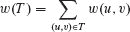
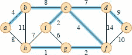
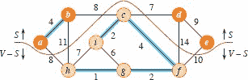
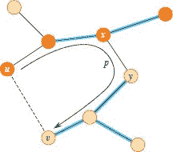
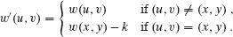
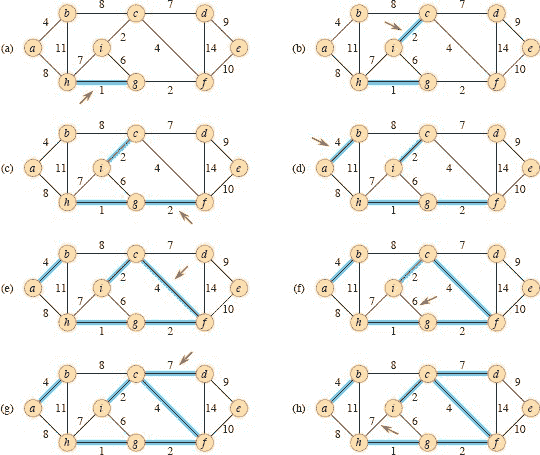
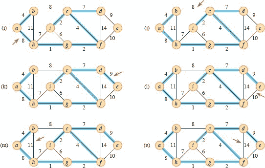
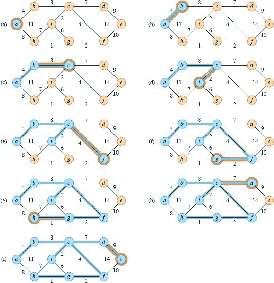

**21 最小生成树**

电子电路设计通常需要通过将几个元件的引脚电气等效地连接在一起。为了连接一组`n`个引脚，设计者可以使用`n - 1`根导线的布置，每根导线连接两个引脚。在所有这样的布置中，使用最少导线的布置通常是最理想的。

为了模拟这个布线问题，使用一个连通的无向图`G = (V, E)`，其中`V`是引脚的集合，`E`是可能的引脚对之间的互连集合，对于每条边`(u, v)` ∈ `E`，权重`w(u, v)`指定连接`u`和`v`所需的成本（所需的导线长度）。目标是找到一个无环子集`T` ⊆ `E`，连接所有顶点且总权重最小。

被最小化。由于`T`是无环的且连接所有顶点，它必须形成一棵树，我们称之为***生成树***，因为它“跨越”了图`G`。我们称确定树`T`的问题为***最小生成树问题***。¹ 图 21.1 显示了一个连通图和一棵最小生成树的示例。

本章研究了解决最小生成树问题的两种方法。Kruskal 算法和 Prim 算法都在`O(E lg V)`时间内运行。Prim 算法通过使用二叉堆作为优先队列来实现这一界限。通过使用斐波那契堆（见第 478 页），Prim 算法在`O(E + V lg V)`时间内运行。当|`E`|增长得比|`V`|快时，这个界限比`O(E lg V)`更好。

**图 21.1** 一个连通图的最小生成树。显示了边上的权重，蓝色的边形成了一棵最小生成树。所示树的总权重为 `37`。这个最小生成树不是唯一的：删除边`(b, c)`并用边`(a, h)`替换它会得到另一棵权重为 `37` 的生成树。

这两种算法都是贪婪算法，如第十五章所述。贪婪算法的每一步必须做出几种可能的选择之一。贪婪策略主张在当前选择最佳的选择。这种策略通常不能保证它总是找到问题的全局最优解。然而，对于最小生成树问题，我们可以证明某些贪婪策略确实会产生具有最小权重的生成树。尽管您可以独立阅读本章而不阅读第十五章，但这里介绍的贪婪方法是引入的理论概念的经典应用。

第 21.1 节介绍了一种“通用”最小生成树方法，通过逐步添加一条边来生成一棵生成树。第 21.2 节提供了两种实现通用方法的算法。第一个算法由 Kruskal 提出，类似于第 19.1 节中的连通分量算法。第二个算法由 Prim 提出，类似于 Dijkstra 的最短路径算法(第 22.3 节)。

因为树是图的一种类型，为了准确起见，我们必须根据不仅是边，还有顶点来定义树。因为本章侧重于树的边，我们将默认理解树`T`的顶点是某些`T`的边相接的顶点。

**21.1    生成最小生成树**  

最小生成树问题的输入是一个带有权重函数`w：E → ℝ`的连通无向图`G = (V, E)`。目标是为`G`找到一棵最小生成树。本章考虑的两种算法都采用贪婪方法解决问题，尽管它们在如何应用这种方法上有所不同。  

这种贪婪策略由面对页面上的 `GENERIC-MST` 过程捕捉，该过程一次增加一条边来扩展最小生成树。通用方法管理一组边`A`，保持以下循环不变量：

在每次迭代之前，`A`是某个最小生成树的子集。

`GENERIC-MST(G, w)`  

| 1 | `A` = Ø |   |
| --- | --- |
| `2` | **当** A 不形成一棵生成树时**执行** |
| `3` | 找到一条对`A`安全的边(`u`, `v`) |
| `4` | `A = A ∪ {(u, v)}` |
| 5 | **返回** `A` |

每一步确定一条边(`u`, `v`)，该过程可以将其添加到`A`而不违反这个不变量，即`A` ∪ {(`u`, `v`)}也是最小生成树的子集。我们称这样的边为`A`的***安全边***，因为它可以安全地添加到`A`中而保持不变。

这个通用算法使用循环不变量如下：

**初始化：** 在第 1 行之后，集合`A`显然满足循环不变量。

**维护：** 第 2-4 行的循环通过仅添加安全边来维护不变量。

**终止条件：** 所有添加到`A`的边都属于最小生成树，循环必须在考虑所有边之前终止。因此，第 5 行返回的集合`A`必须是最小生成树。

困难的部分当然是在第 3 行找到一个安全边。必须存在一个，因为当执行第 3 行时，不变量规定存在一棵生成树`T`，使得`A ⊆ T`。在`while`循环体内，`A`必须是`T`的真子集，因此必须存在一条边`(u, v) ∈ T`，使得`(u, v) ∉ A`且`(u, v)`对于`A`是安全的。

本节的其余部分提供了一个规则（定理 `21.1`）来识别安全边。下一节描述了两个使用此规则高效找到安全边的算法。

首先我们需要一些定义。无向图`G = (V, E)`的一个切割`(S, V – S)`是`V`的一个分区。图 21.2 说明了这个概念。我们说一条边`(u, v)` ∈ `E`穿过切割`(S, V – S)`，如果它的一个端点属于`S`，另一个端点属于`V` – `S`。如果没有边在切割上穿过，则切割***尊重***边集`A`。一条边是穿过切割的***轻边***，如果它的权重是穿过切割的任何边中的最小值。在平局的情况下，可能有多条轻边穿过切割。更一般地，我们说一条边是满足给定属性的***轻边***，如果它的权重是满足该属性的任何边中的最小值。

以下定理给出了识别安全边的规则。

***`定理 21.1`***

设`G = (V, E)`是一个连通的无向图，其边上定义了一个实值权重函数`w`。设`A`是`G`的某个最小生成树的子集，设`(S, V – S)`是`G`的任意一个尊重`A`的切割，设`(u, v)`是穿过`(S, V – S)`的一条轻边。那么，边`(u, v)`对于`A`是安全的。

**图 21.2** 图 21.1 中的图的一个切割(`S`, `V` – `S`)。橙色顶点属于集合`S`，深黄色顶点属于`V` – `S`。穿过切割的边是连接深黄色顶点和橙色顶点的边。边(`d`, `c`)是穿过切割的唯一轻边。蓝色边构成边的一个子集`A`。切割(`S`, `V` – `S`)尊重`A`，因为没有边穿过切割。

***证明***   设`T`是包含`A`的最小生成树，并假设`T`不包含轻边(u, v)，因为如果包含，我们就完成了。我们将通过使用切割和粘贴技术构造另一个包含`A` ∪ {(u, v)}的最小生成树`T'`，从而证明(u, v)对于`A`是安全的。

边(`u`, `v`)与树`T`中从`u`到`v`的简单路径`p`上的边形成一个循环，如图 21.3 所示。由于`u`和`v`在切割(`S`, `V` - `S`)的两侧，至少有一条边在简单路径`p`上并且跨越了切割。设(`x`, `y`)是这样的一条边。边(`x`, `y`)不在`A`中，因为切割尊重`A`。由于(`x`, `y`)在`T`中从`u`到`v`的唯一简单路径上，移除(`x`, `y`)将`T`分成两个部分。添加(`u`, `v`)重新连接它们形成一个新的生成树`T'` = (`T` - {(`x`, `y`)}) ∪ {(`u`, `v`)}。

接下来我们将证明`T'`是一个最小生成树。由于`(u, v)`是穿过`(S, V - S)`的轻边，而`(x, y)`也穿过了这个切割，所以`w(u, v) ≤ w(x, y)`。因此，

| `w(T')` | = | `w(T)` - `w(x, y)` + `w(u, v)` |
| --- | --- | --- |
|  | ≤ | `w(T)`. |   |

但`T`是一个最小生成树，所以`w(T)` ≤ `w(T')`，因此，`T'`必须也是一个最小生成树。

还需要证明(`u`, `v`)实际上对`A`是一个安全边。由于`A` ⊆ `T`'，因为`A` ⊆ `T`且(`x`, `y`) ∉ `A`，因此，`A` ∪ {(`u`, `v`)} ⊆ `T`'。因此，由于`T`'是一个最小生成树，(`u`, `v`)对`A`是安全的。

▪

定理 21.1 揭示了 GENERIC-MST 方法在连通图`G = (V, E)`上的工作原理。随着方法的进行，集合`A`始终是无环的，因为它是最小生成树的子集，而树不可能包含循环。在执行的任何时刻，图`G[A] = (V, A)`是一个森林，`G[A]`的每个连通分量都是一棵树。（一些树可能只包含一个顶点，例如当方法开始时：`A`为空且森林包含|`V`|棵树，每个顶点一棵树。）此外，任何对`A`是安全的边`(u, v)`连接`G[A]`的不同分量，因为`A` ∪ `{(u, v)}`必须是无环的。

**图 21.3** 定理 21.1 的证明。橙色顶点属于`S`，黄褐色顶点属于`V` - `S`。只显示了最小生成树`T`中的边，以及不在`T`中的边(`u`, `v`)。`A`中的边是蓝色的，(`u`, `v`)是穿过切割(`S`, `V` - `S`)的轻边。边(`x`, `y`)是在`T`中从`u`到`v`的唯一简单路径`p`上的边。为了形成包含(`u`, `v`)的最小生成树`T'`，从`T`中移除边(`x`, `y`)并添加边(`u`, `v`)。

GENERIC-MST 中第 2-4 行的`while`循环执行`|V|` - 1 次，因为它在每次迭代中找到一个最小生成树的`|V|` - 1 条边。最初，当`A` = Ø时，在`G[A]`中有`|V|`棵树，每次迭代将该数字减少 1。当森林只包含一棵树时，方法终止。

第 21.2 节中的两个算法使用了定理 21.1 的以下推论。

***推论 21.2***

设`G = (V, E)`是一个连通的无向图，其边上有一个实值权重函数`w`定义在`E`上。设`A`是包含在`G`的某个最小生成树中的边的子集，`C = (V[C], E[C])`是`G[A] = (V, A)`中的一个连通分量（树）。如果`(u, v)`是连接`C`到`G[A]`中的另一个分量的轻边，则`(u, v)`对`A`是安全的。  

***证明*** 切割(`V[C]`, `V` - `V[C]`)尊重`A`，而(`u`, `v`)是这个切割的轻边。因此，(`u`, `v`)对`A`是安全的。

▪  输出：

**练习**

***`21.1-1`***  

设(`u`, `v`)是一个连通图`G`中的最小权重边。证明(`u`, `v`)属于`G`的某个最小生成树。

**`21.1-2`**

Sabatier 教授猜想 21.1 定理的以下逆否命题。设`G = (V, E)`是一个具有实值权重函数`w`的连通无向图。设`A`是包含在`G`的某个最小生成树中的`E`的子集，(`S`, `V` – `S`)是尊重`A`的图的任何切割，(`u`, `v`)是穿过(`S`, `V` – `S`)的安全边。然后，(`u`, `v`)是切割的轻边。通��给出一个反例证明教授的猜想是不正确的。  

***21.1-3***

证明如果边(`u, v`)包含在某个最小生成树中，则它是穿过图的某个切割的轻边。  

***21.1-4***  

给出一个简单的例子，其中连接图的边集{(`u`, `v`)：存在一个切割(`S`, `V` – `S`)，使得(`u`, `v`)是穿过(`S`, `V` – `S`)的轻边}不形成最小生成树。

**`21.1-5`**

设`e`为连接图`G = (V, E)`的某个循环上的最大权重边。证明存在一个`G' = (V, E - {e})`的最小生成树，也是`G`的最小生成树。也就是说，存在一个不包括`e`的`G`的最小生成树。

***21.1-6***

证明如果对于图的每个切割，都存在唯一的轻边穿过切割，则图具有唯一的最小生成树。通过给出一个反例证明逆否命题不成立。

**`21.1-7`**

论证如果图的所有边权重都是正的，则连接所有顶点并具有最小总权重的边子集必须是一棵树。给出一个例子，表明如果允许一些权重为非正数，则不会得出相同的结论。

`21.1-8`

设`T`为图`G`的最小生成树，`L`为`T`的边权重的排序列表。证明对于图`G`的任何其他最小生成树`T'`，列表`L`也是`T'`的边权重的排序列表。

***`21.1-9`***

设`T`为图`G = (V, E)`的最小生成树，`V′`为`V`的子集。设`T′`为由`V′`诱导的`T`的子图，`G′`为由`V′`诱导的`G`的子图。证明如果`T′`是连通的，则`T′`是`G′`的最小生成树。  

***`21.1-10`***  

给定图`G`和最小生成树`T`，假设`T`中的一条边的权重减小。证明`T`仍然是`G`的最小生成树。更正式地，设`T`是由权重函数`w`给出的`G`的最小生成树。选择一条边`(x, y)` ∈ `T`和一个正数`k`，并定义权重函数`w'`为

  

证明`T`是由`w'`给出的`G`的最小生成树。

★ `21.1-11`

给定图`G`和最小生成树`T`，假设`T`中的一条边的权重*不在`T`中*减小。给出在修改后的图中找到最小生成树的算法。

**21.2    Kruskal 和 Prim 算法**

本节描述的两种最小生成树算法详细说明了通用方法。它们各自使用特定规则来确定 `GENERIC-MST` 中的安全边。在 Kruskal 算法中，集合 `A` 是一个森林，其顶点是给定图的所有顶点。添加到 `A` 的安全边始终是连接两个不同分量的图中的最低权重边。在 Prim 算法中，集合 `A` 形成一棵单树。添加到 `A` 的安全边始终是连接树与不在树中的顶点的最低权重边。这两种算法都假定输入图是连通的，并由邻接表表示。

**图 21.4** 展示了 Kruskal 算法在图 `21.1` 中的图上的执行过程。蓝色边属于正在增长的森林`A`。该算法按权重排序考虑每条边。红色箭头指向算法每一步考虑的边。如果边连接森林中的两棵不同树，则将其添加到森林中，从而合并这两棵树。

**`Kruskal 算法`**

Kruskal 算法通过找到连接森林中任意两棵树的所有边中权重最低的边`(u, v)`来找到一个安全的边添加到不断增长的森林中。设`C₁`和`C₂`表示由`(u, v)`连接的两棵树。由于`(u, v)`必须是连接`C₁`到其他某棵树的轻边，推论 21.2 暗示`(u, v)`对于`C₁`是一条安全边。Kruskal 算法被归类为贪婪算法，因为在每一步中，它都会添加具有最低可能权重的边到森林中。

**图 21.4，续** Kruskal 算法执行的进一步步骤。

类似于从第 19.1 节计算连通分量的算法，下一页上的 MST-KRUSKAL 过程使用不相交集数据结构来维护几个不相交元素集。每个集合包含当前森林中一棵树中的顶点。操作 `FIND-SET(u)`返回包含`u`的集合中的代表元素。因此，要确定两个顶点`u`和`v`是否属于同一棵树，只需测试 `FIND-SET(u)`是否等于 `FIND-SET(v)`。为了合并树，Kruskal 算法调用 `UNION` 过程。

图 21.4 展示了 Kruskal 算法的工作原理。第 1-3 行初始化集合`A`为空集，并创建|`V`|棵树，每棵树包含一个顶点。第 6-9 行的`for`循环按权重从低到高检查边。循环对于每条边(`u`, `v`)，检查端点`u`和`v`是否属于同一棵树。如果是，则边(`u`, `v`)不能被添加到森林中而不产生循环，并且该边被忽略。否则，两个顶点属于不同的树。在这种情况下，第 8 行将边(`u`, `v`)添加到`A`，第 9 行合并两棵树中的顶点。

MST-KRUSKAL(`G`, `w`)

|   1 | `A = Ø` |
| --- | --- |
| --- | --- |
| `2` | **对于**每个顶点`v` ∈ `G.V` |   |
|   3 | MAKE-SET(`v`) |
|   `4` | 创建`G.E`中边的单一列表 |   |
|   5 | 将边的列表按权重`w`单调递增排序 |
|   6 | **对于**按顺序从排序列表中取出的每条边(`u, v`) |
|   7 | **如果** FIND-SET(`u`) ≠ FIND-SET(`v`) |   |
|   `8` | `A = A ∪ {(u, v)}` |   |
|   `9` | `UNION(u, v)` |   |
| `10` | **返回** `A` |   输出：   |

Kruskal 算法对于图`G = (V, E)`的运行时间取决于不相交集合数据结构的具体实现。假设它使用了第 19.3 节中的不相交集合森林实现，其中包含按秩合并和路径压缩启发式方法，因为这是已知的渐进最快实现。在第 1 行中初始化集合`A`需要`O(1)`时间，在第 4 行中创建边的单个列表需要`O(V + E)`时间（因为`G`是连通的，所以是`O(E)`），在第 5 行中对边进行排序需要`O(E lg E)`时间。（我们将在稍后考虑第 2-3 行的`for`循环中的|`V`| MAKE-SET 操作的成本。）第 6-9 行的`for`循环在不相交集合森林上执行`O(E)` FIND-SET 和 UNION 操作。加上|`V`| MAKE-SET 操作，这些不相交集合操作总共需要`O((V + E) α(V))`时间，其中α是第 19.4 节中定义的增长非常缓慢的函数。因为我们假设`G`是连通的，所以有|`E`| ≥ |`V`| – 1，因此不相交集合操作需要`O(E α(V))`时间。此外，由于α(|`V`|) = `O(lg V)` = `O(lg E)`，Kruskal 算法的总运行时间为`O(E lg E)`。观察到|`E`| < |`V`|²，我们有 lg |`E`| = `O(lg V)`，因此我们可以将 Kruskal 算法的运行时间重新表述为`O(E lg V)`。

**`Prim 算法`**

和 Kruskal 算法一样，Prim 算法是来自第 21.1 节的通用最小生成树方法的特例。Prim 算法的操作方式类似于 Dijkstra 算法在图中寻找最短路径的方式，我们将在第 22.3 节中看到。Prim 算法的特点是集合`A`中的边始终形成一棵树。正如图 21.5 所示，树从任意根顶点`r`开始生长，直到覆盖所有顶点`V`。每一步都向树`A`添加一个连接`A`到孤立顶点（即`A`上没有边与之关联的顶点）的轻边。根据推论 21.2，这个规则只会添加对`A`安全的边。因此，当算法终止时，`A`中的边形成了一棵最小生成树。这种策略被称为贪婪，因为每一步都向树中添加对树权重贡献最小的边。

**图 21.5** Prim 算法在图 21.1 中的图上的执行过程。根顶点为`a`。蓝色顶点和边属于正在生成的树，棕色顶点尚未添加到树中。算法的每一步中，树中的顶点确定了图的一个切割，然后将穿过切割的轻边添加到树中。添加到树中的边和顶点用橙色突出显示。例如，在第二步（部分(c)）中，算法可以选择添加边`(b, c)`或边`(a, h)`到树中，因为两者都是穿过切割的轻边。

在下面的 MST-PRIM 过程中，输入算法的是连通图`G`和最小生成树的根`r`。为了高效地选择要添加到树`A`中的新边，算法维护一个基于`key`属性的所有不在树中的顶点的最小优先队列`Q`。对于每个顶点`v`，属性`v.key`是连接`v`到树中顶点的任何边的最小权重，按照惯例，如果没有这样的边，则`v.key` = ∞。属性`v.π`指定了树中`v`的父节点。算法隐式地维护了 GENERIC-MST 中的集合`A`，如下所示：

`A = {(v, v.π) : v ∈ V – {r} – Q},`

我们将顶点在`Q`中解释为一个集合。当算法终止时，最小优先队列`Q`为空，因此图`G`的最小生成树`A`为

`A = {(v, v.π) : v ∈ V – {r}}`

`MST-PRIM(G, w, r)`

|   1 | **对于** 每个顶点 `u` ∈ `G.V` |
| --- | --- |
| --- | --- |
|   2 | `u.key` = ∞ |   |
|   3 | `u`.π = NIL |   |
|   4 | `r.key = 0` |
|   5 | `Q = Ø` |
|   `6` | **对于** 每个顶点 `u ∈ G.V` |
|   7 | 插入(Q, u) | `   |
|   `8` | **当** `Q` ≠ Ø 时 |
|   9 | `u` = 取出最小(`Q`) | // 将 `u` 添加到树中 |   |
| 10 | **对于** 每个顶点 `v` 在 `G.Adj[u]` 中 | // 更新 `u` 的非树邻居的键 |   |
| 11 | **如果** v ∈ Q 并且 w(u, v) < v.key |
| `12` | `v`.π = `u` |
| `13` | `v.key = w(u, v)` |   |
| `14` | `DECREASE-KEY(Q, v, w(u, v))` |   |

图 21.5 展示了 Prim 算法的工作原理。第 1-7 行将每个顶点的键设置为 `∞`（除了根 `r`，其键设置为 0 以使其成为第一个处理的顶点），将每个顶点的父节点设置为 NIL，并将每个顶点插入最小优先队列 `Q`。该算法维护以下三部分循环不变式：

在第 8-14 行的 `while` 循环的每次迭代之前，

1.  `A = {(v, v.π) : v ∈ V – {r} – Q}`.

1.  已放入最小生成树中的顶点是 `V - Q` 中的顶点。

1.  对于所有 `v` ∈ `Q` 的顶点，如果 `v.π` ≠ NIL，则 `v.key` < ∞，且 `v.key` 是连接 `v` 到已放入最小生成树中某个顶点的轻边 (`v`, `v.π`) 的权重。

第 9 行确定了一个顶点 `u` ∈ `Q`，它与穿过切割 (`V` – `Q`, `Q`) 的轻边相交（除了第一次迭代外，由于第 4-7 行，`u` = `r`）。从集合 `Q` 中移除 `u` 将其添加到树中的顶点集合 `V` – `Q` 中，从而将边 (`u`, `u`.π) 添加到 `A` 中。第 10-14 行的 `for` 循环更新了与 `u` 相邻但不在树中的每个顶点 `v` 的 `key` 和属性，从而保持了循环不变式的第三部分。每当第 13 行更新 `v.key` 时，第 14 行调用 DECREASE-KEY 来通知最小优先队列 `v` 的键已更改。  

Prim 算法的运行时间取决于最小优先队列 `Q` 的具体实现。您可以使用二叉最小堆实现 `Q`（参见 第六章），包括一种在顶点和它们对应的堆元素之间进行映射的方法。BUILD-MIN-HEAP 过程可以在 `O(V)` 时间内执行第 5-7 行。实际上，没有必要调用 BUILD-MIN-HEAP。您只需将 `r` 的键放在最小堆的根部，因为所有其他键都是 ∞，它们可以放在最小堆的任何其他位置。`while` 循环的主体执行 |`V`| 次，由于每次 EXTRACT-MIN 操作都需要 `O(lg V)` 时间，所有对 EXTRACT-MIN 的调用总时间为 `O(V lg V)`。第 10-14 行的 `for` 循环总共执行 `O(E)` 次，因为所有邻接表的长度之和为 2 |`E`|。在 `for` 循环中，第 11 行对 `Q` 中的成员资格进行测试，如果保留每个顶点的一个位来指示它是否属于 `Q` 并在顶点从 `Q` 中移除时更新该位，则测试可以在常数时间内完成。第 14 行中的每次 DECREASE-KEY 调用需要 `O(lg V)` 时间。因此，Prim 算法的总时间为 `O(V lg V + E lg V)` = `O(E lg V)`，这与我们对 Kruskal 算法的实现的渐近时间相同。

您可以通过使用 Fibonacci 堆（参见第 478 页）来实现最小优先队列，进一步改进 Prim 算法的渐近运行时间。如果 Fibonacci 堆包含 `|V|` 个元素，则 EXTRACT-MIN 操作的摊还时间为 `O(lg V)`，每个 INSERT 和 DECREASE-KEY 操作仅需要 `O(1)` 的摊还时间。因此，通过使用 Fibonacci 堆来实现最小优先队列 `Q`，Prim 算法的运行时间将改进为 `O(E+V lg V)`。  

**练习**

`21.2-1`

Kruskal 算法可以针对相同输入图 `G` 返回不同的生成树，具体取决于在对边进行排序时如何处理并列情况。证明对于图 `G` 的每个最小生成树 `T`，都有一种方法可以对图 `G` 的边进行排序，使得 Kruskal 算法返回 `T`。

`21.2-2`

给出一个简单的 Prim 算法实现，当图 `G = (V, E)` 以邻接矩阵表示时，运行时间为 `O(V²)`。

**`21.2-3`**  

对于稀疏图 `G = (V, E)`，其中 |E| = Θ(V)，使用 Fibonacci 堆实现的 Prim 算法在渐近意义上是否比使用二叉堆实现的算法更快？对于稠密图，其中 |E| = Θ(V²)，情况如何？Fibonacci 堆实现比二叉堆实现更快的渐��条件是什么？

***21.2-4***

假设图中所有边的权重都是介于 1 到 |`V`| 之间的整数。你能让 Kruskal 算法运行多快？如果边的权重是介于 1 到某个常数 `W` 之间的整数呢？

`21.2-5`

假设图中所有边的权重都是介于 1 到 |`V`| 之间的整数。你能让 Prim 算法运行多快？如果边的权重是介于 1 到某个常数 `W` 之间的整数呢？

`21.2-6`  

博士 Borden 提出了一种新的分治算法来计算最小生成树，步骤如下。给定一个图 `G = (V, E)`，将顶点集 `V` 分成两个集合 `V₁` 和 `V₂`，使得 |`V₁`| 和 |`V₂`| 之间的差异最多为 1。让 `E₁` 为仅与 `V₁` 中的顶点关联的边的集合，让 `E₂` 为仅与 `V₂` 中的顶点关联的边的集合。在两个子图 `G₁` = (`V₁`, `E₁`) 和 `G₂` = (`V₂`, `E₂`) 上递归解决最小生成树问题。最后，选择跨越切分 `V₁, V₂` 的最小权重边 `E`，并使用此边将生成的两棵最小生成树合并为一棵生成树。  

要么证明该算法正确计算了 `G` 的最小生成树，要么提供一个算法失败的例子。

★ ***21.2-7***

假设图中的边权重在半开区间 `[0, 1)` 上均匀分布。哪种算法，Kruskal 还是 Prim，你能让其运行得更快？

★ ***`21.2-8`*** 

假设图 `G` 已经计算出最小生成树。在向 `G` 添加新顶点和关联边后，如何快速更新最小生成树？

输出：

**`21-1`     第二优最小生成树**

让 `G = (V, E)` 是一个无向连通图，其权重函数为 `w : E → ℝ`，并假设 |`E`| ≥ |`V`| 且所有边的权重都不同。

我们将第二优最小生成树定义如下。设 `T` 为 `G` 的所有生成树的集合，`T*` 为 `G` 的最小生成树。那么一个***第二优最小生成树***是一个生成树 `T'`，使得 `w(T') = min {w(T") : T" ∈ T - {T*}}`。

***a.*** 证明最小生成树是唯一的，但第二优最小生成树不一定是唯一的。

***b.*** 设 `T` 是 `G` 的最小生成树。证明 `G` 包含一条边 `(u, v)` ∈ `T` 和一条边 `(x, y)` ∉ `T`，使得 (`T` – `{(u, v)}`) ∪ `{(x, y)}` 是 `G` 的第二优最小生成树。

***c.*** 现在让 `T` 是 `G` 的任意生成树，并且对于任意两个顶点 `u`, `v` ∈ `V`，让 `max[u, v]` 表示 `T` 中连接 `u` 和 `v` 之间唯一简单路径上权重最大的边。描述一个 *O(V²)* 时间复杂度的算法，给定 `T`，计算所有 *u, v* ∈ `V` 的 `max[u, v]`。

***d.*** 给出一个有效的算法来计算 `G` 的次优最小生成树。

***21-2     稀疏图中的最小生成树***

对于一个非常稀疏的连通图`G = (V, E)`，可以通过预处理`G`以减少运行 Prim 算法之前的顶点数量来进一步改进 Prim 算法的`O(E + V lg V)`运行时间。特别地，对于每个顶点`u`，选择与`u`关联的最小权重边`(u, v)`，并将`(u, v)`放入正在构建的最小生成树中。然后，缩约所有选择的边（参见第 B.4 节）。与逐个缩约这些边不同，首先识别统一到同一新顶点的顶点集。然后创建将会由逐个缩约这些边而产生的图，但是通过“重命名”边来做到，根据它们的端点被放置到的集合。原始图中的几条边可能被重命名为相同的。在这种情况下，只有一条边产生，其权重是相应原始边的最小权重。

最初，将正在构建的最小生成树`T`设置为空，并对于每条边`(u, v)` ∈ `E`，初始化两个属性`(u, v)`.`orig` = `(u, v)`和`(u, v)`.`c` = `w(u, v)`。使用`orig`属性引用与缩约图中的边相关联的初始图中的边。`c`属性保存边的权重，随着边的缩约，根据上述选择边权重的方案进行更新。面向页面的 MST-REDUCE 过程接受输入`G`和`T`，并返回具有更新属性`orig'`和`c'`的缩约图`G'`。该过程还将`G`的边累积到最小生成树`T`中。

***a.*** 令`T`为 MST-REDUCE 返回的边集，`A`为由调用 MST-PRIM(`G'`, `c'`, `r`)形成的图`G'`的最小生成树，其中`c'`是`G'`上边的权重属性，`r`是`G'`.`V`中的任意顶点。证明`T` ∪ {(`x`, `y`).orig`′` : (`x`, `y`) ∈ `A`}是`G`的最小生成树。

***b.*** 论证|`G′.V`| ≤ |`V`| /2。  

***c.*** 展示如何实现 MST-REDUCE 以使其在`O(E)`时间内运行。(*提示:* 使用简单的数据结构。)

***d.*** 假设你运行 MST-REDUCE 的`k`个阶段，使用一个阶段产生的输出`G′`作为下一个阶段的输入`G`，并在`T`中累积边。论证`k`个阶段的总运行时间为`O(kE)`。

***e.*** 假设在 MST-REDUCE 的`k`个阶段之后，如(d)部分所述，通过调用 MST-PRIM(`G′, c′, r`)运行 Prim 算法，其中`G′`，带有权重属性`c′`，是最后一个阶段返回的，`r`是`G′:V`中的任意顶点。展示如何选择`k`以使总运行时间为`O(E lg lg V)`。论证你选择的`k`最小化了总体渐近运行时间。

***f.*** 对于|`E`|的哪些值（关于|`V`|），带有预处理的 Prim 算法在渐近意义上击败没有预处理的 Prim 算法？

MST-REDUCE(`G`, `T`)

|   1 | **对于**每个顶点`v` ∈ `G.V` |
| --- | --- |
|   2 | `v.mark = FALSE` |   |
| `3` | MAKE-SET(`v`) |   |
|   4 | **对于**每个顶点`u` ∈ `G.V` |
|   5 | **如果** u.mark == FALSE |
|   6 | 选择`G.Adj[u]`中使(`u`, `v`).`c`最小的`v` |
|   7 | UNION(`u`, `v`) |   |
|   8 | `T = T ∪ {(u, v).orig}` |
|   9 | `u.mark` = TRUE |   |
| 10 | *v.mark* = TRUE |   |
| `11` | `G′.V = {FIND-SET(v) : v ∈ G.V}` |   |
| `12` | `G′.E = Ø` |
| 13 | **对于**每条边(`x`, `y`) ∈ `G.E` |
| `14` | `u` = FIND-SET(`x`) |
| `15` | `v = FIND-SET(y)` |
| `16` | **如果** `u` ≠ `v` |
| `17` | **如果** `(u, v)` ∉ `G′.E` |
| 18 | `G'`.E = `G'`.E ∪ {(u, v)} |
| 19 | (u, v).*orig*′ = (x, y).*orig* |
| `20` | (`u`, `v`).`c′` = (`x`, `y`).`c` |
| 21 | **否则** (`x`, `y`).`c` < (`u`, `v`).`c′` |
| `22` | (`u`, `v`).`orig`′ = (`x`, `y`).`orig` |   |
| `23` | (`u`, `v`).`c′` = (`x`, `y`).`c` |   |
| `24` | 为`G′`构建邻接表`G′.Adj` |  |
| 25 | **返回** G′ 和 T |

***21-3     替代最小生成树算法***

考虑下一页上的三个算法 `MAYBE-MST-A`、`MAYBE-MST-B` 和 `MAYBE-MST-C`。每个算法都接受一个连通图和一个权重函数作为输入，并返回一组边 `T`。对于每个算法，要么证明 `T` 是最小生成树，要么证明 `T` 不一定是最小生成树。还要描述每个算法的最有效实现，无论它是否计算最小生成树。

***21-4     瓶颈生成树***

一个***瓶颈生成树*** `T` 是一个无向图 `G` 的生成树，其最大边权重在所有 `G` 的生成树中是最小的。瓶颈生成树的值是 `T` 中最大权重边的权重。

`MAYBE-MST-A(G, w)`

| 1 | 按边权重 `w` 单调递减的顺序对边进行排序 |
| --- | --- |
| --- | --- |  |
| `2` | `T = E` |   |
| `3` | **对于** 每条边 `e`，按权重单调递减的顺序 |
| 4 | **如果** `T - {e}` 是一个连通图 |
| 5 | `T` = `T` – `{e}` |
| \| 6 \| **返回** `T` \|  |
| `MAYBE-MST-B(G, w)` |
| 1 | `T` = Ø |
| 2 | **对于** 每条边 `e`，按任意顺序 |
| `3` | **如果** `T` ∪ {`e`} 没有循环 |
| \| 4 \| `T = T ∪ {e}` \| |
| 5 | **返回** T |  输出： |
| `MAYBE-MST-C(G, w)` |   |
| 1 | `T = Ø` |
| `2` | **对于** 每条边 `e`，按任意顺序 |
| 3 | `T = T ∪ {e}` |
| 4 | **如果** `T` 有一个循环 `c` |
| `5` | 让 `e'` 是 `c` 上的最大权重边 |
| 6 | `T = T - {e'}` |
| 7 | **返回** `T` |   |

***`a.`*** 论证最小生成树是瓶颈生成树。

第（a）部分表明找到瓶颈生成树并不比找到最小生成树更困难。在剩下的部分中，您将展示如何在线性时间内找到瓶颈生成树。

***b.*** 给出一个线性时间算法，给定一个图 `G` 和一个整数 `b`，确定瓶颈生成树的值是否至多为 `b`。  

***c.*** 使用第(`b`)部分的算法作为瓶颈生成树问题的线性时间算法的子程序。(*提示:* 您可能想使用一个缩减边集的子程序，就像问题 21-2 中描述的 MST-REDUCE 过程一样。)

**章节注释**

Tarjan `429` 对最小生成树问题进行了调查，并提供了优秀的高级材料。Graham 和 Hell `198` 编写了最小生成树问题的历史。

Tarjan 将第一个最小生成树算法归因于 O. Borůvka 在 1926 年的一篇论文。Borůvka 的算法包括运行问题 21-2 中描述的 MST-REDUCE 过程的 `O(lg V)` 次迭代。Kruskal 的算法由 Kruskal [272] 在 1956 年报告。普遍称为 Prim 算法的算法确实是由 Prim [367] 发明的，但它也在 1930 年由 V. Jarník 发明。

当 |`E`| = Ω(`V` lg `V`) 时，使用斐波那契堆实现的 Prim 算法的运行时间为 `O(E)`。对于稀疏图，使用 Prim 算法、Kruskal 算法和 Borůvka 算法的思想结合先进的数据结构，Fredman 和 Tarjan [156] 给出了一个在 `O(E lg V)` 时间内运行的算法。Gabow、Galil、Spencer 和 Tarjan [165] 将这个算法改进为在 `O(E lg lg V)` 时间内运行。Chazelle [83] 给出了一个在 `O(E * α(E, V))` 时间内运行的算法，其中 `α(E, V)` 是 Ackermann 函数的函数反。 （有关 Ackermann 函数及其反函数的简要讨论，请参阅第十九章的章节注释。）与以往的最小生成树算法不同，Chazelle 的算法不遵循贪婪方法。Pettie 和 Ramachandran [356] 给出了一种基于预计算的“MST 决策树”的算法，也在 `O(E * α(E, V))` 时间内运行。  

一个相关问题是`生成树验证`：给定图 `G` = (`V`, `E`) 和树 `T` ⊆ `E`，确定 `T` 是否是 `G` 的最小生成树。King [254] 给出了一个线性时间算法来验证生成树，借鉴了 Komlós [269] 和 Dixon、Rauch 和 Tarjan [120] 的早期工作。  

上述算法都是确定性的，并属于第八章描述的基于比较的模型。Karger、Klein 和 Tarjan [243] 给出了一个随机化最小生成树算法，预期运行时间为 `O(V + E)`。该算法类似于第 9.3 节中的线性时间选择算法，使用递归的方式：对辅助问题进行递归调用，识别一组边 `E′`，这些边不能在任何最小生成树中。然后对 `E - E′` 进行另一个递归调用，找到最小生成树。该算法还使用了 Borůvka 算法和 King 的生成树验证算法的思想。

Fredman 和 Willard [158] 展示了如何使用非比较的确定性算法在 `O(V + E)` 时间内找到最小生成树。他们的算法假设数据是 `b` 位整数，计算机内存由可寻址的 `b` 位字组成。

¹ 短语“最小生成树”是“最小权重生成树”的缩写形式。最小生成树 `T` 中边的数量最小化没有意义，因为根据第 1169 页的定理 B.2，所有生成树的边数都恰好为 |`V`| − 1。
