**22        单源最短路径**

假设您需要从纽约州奥申赛德尽可能短的路线驾驶到加利福尼亚州奥申赛德。您的 GPS 包含有关美国整个道路网络的信息，包括相邻交叉口之间的道路距离。您的 GPS 如何确定这条最短路径？

一种可能的方法是列举从纽约州奥申赛德到加利福尼亚州奥申赛德的所有路线，计算每条路线上的距离总和，并选择最短路径。但即使不允许包含循环的路线，您的 GPS 也需要检查大量可能性，其中大多数根本不值得考虑。例如，经过佛罗里达州迈阿密的路线是一个糟糕的选择，因为迈阿密偏离了几百英里的路程。  

本章和第二十三章展示了如何高效解决这类问题。`最短路径问题`的输入是一个加权有向图`G = (V, E)`，其中权重函数`w`：`E` → ℝ将边映射到实值权重。路径`p` = <`v₀`，`v₁`，…，`v[k]`>的`权重 w(p)`是其组成边的权重之和：  

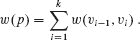

我们通过以下方式定义从`u`到`v`的**最短路径权重**δ(`u`, `v`)：

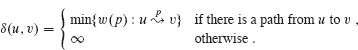

从顶点`u`到顶点`v`的**最短路径**定义为权重为`w(p) = δ(u, v)`的任何路径`p`。

在从纽约州奥申赛德到加利福尼亚州奥申赛德的例子中，您的 GPS 将道路网络建模为图：顶点表示交叉口，边表示交叉口之间的道路段，边的权重表示道路距离。目标是从纽约州奥申赛德的给定交叉口（比如，布劳尔大道和斯基尔曼大道）到加利福尼亚州奥申赛德的给定交叉口（比如，托皮卡街和南霍恩街）找到最短路径。

边的权重可以表示除距离之外的其他度量，例如时间、成本、惩罚、损失或沿路径线性累积且希望最小化的任何其他数量。

来自第 20.2 节的广度优先搜索算法是一种适用于无权图的最短路径算法，即每条边的权重均为单位权重的图。由于广度优先搜索中的许多概念出现在加权图中最短路径的研究中，您可能需要在继续之前复习第 `20.2` 节。

**变体**

本章重点讨论`单源最短路径问题`：给定图`G = (V, E)`，找到从给定`源顶点` `s ∈ V` 到每个顶点 `v ∈ V` 的最短路径。单源问题的算法可以解决许多其他问题，包括以下变体。

**单目的地最短路径问题：**找到从每个顶点`v`到给定的**目的地顶点** `t`的最短路径。通过颠倒图中每条边的方向，您可以将此问题简化为单源问题。

**单对最短路径问题：**为给定顶点`u`和`v`找到从`u`到`v`的最短路径。如果您解决了以源顶点`u`解决单源问题，那么您也解决了这个问题。此外，所有已知的解决此问题的算法的最坏情况渐近运行时间与最佳单源算法相同。  

**全对最短路径问题：**为每对顶点`u`和`v`找到从`u`到`v`的最短路径。虽然您可以通过从每个顶点运行单源算法一次来解决此问题，但通常可以更快地解决它。此外，它的结构本身也很有趣。第二十三章详细讨论了全对问题。

**最短路径的最优子结构**  

最短路径算法通常依赖于这样一个性质：两个顶点之间的最短路径中包含其他最短路径。（第二十四章中的 Edmonds-Karp 最大流算法也依赖于这一性质。）回想一下，最优子结构是动态规划（第十四章）和贪婪方法（第十五章）可能适用的关键指标之一。我们将在第 `22.3` 节中看到的 Dijkstra 算法是一种贪婪算法，而 Floyd-Warshall 算法，用于找到每对顶点之间的最短路径（参见第 `23.2` 节），是一种动态规划算法。以下引理更准确地陈述了最短路径的最优子结构性质。  

**引理 22.1(`最短路径`的子路径也是`最短路径`)** 

给定带权重的有向图`G = (V, E)`，权重函数为`w：E → ℝ`，设`p = <v₀, v₁, … , v[k]>`是从顶点`v₀`到顶点`v[k]`的最短路径，对于任意`i`和`j`，使得 `0 ≤ i ≤ j ≤ k`，设`p[ij] = <v[i], v[i+1], … , v[j]>`是`p`的从顶点`v[i]`到`v[j]`的子路径。那么，`p[ij]`是从`v[i]`到`v[j]`的最短路径。

**证明** 将路径`p`分解为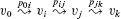，使得`w(p) = w(p[0*i]) + w(p[ij]) + w(p[jk])`。现在，假设存在一条从`v[i]`到`v[j]`的路径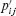，其权重为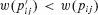。那么，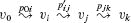是一条从`v₀`到`v[k]`的路径，其权重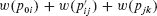小于`p`的权重，这与`p`是从`v₀`到`v[k]`的最短路径的假设相矛盾。

▪  输出：

**负权边**

在单源最短路径问题的一些情况中，可能存在权重为负的边。如果图`G = (V, E)`中不存在从源点`s`可达的负权重环路，则对于所有`v ∈ V`，最短路径权重δ(`s`, `v`)仍然是明确定义的，即使它是负值。然而，如果图中存在从`s`可达的负权重环路，则最短路径权重就不再明确定义。从`s`到环路上某个顶点的路径都不可能是最短路径——你总是可以通过跟随提议的“最短”路径然后遍历负权重环路找到更低权重的路径。如果从`s`到`v`的某条路径上存在负权重环路，我们定义δ(`s`, `v`) = −∞。

图 22.1 展示了负权重和负权重环对最短路径权重的影响。因为从`s`到`a`只有一条路径（路径<`s`, `a`>），所以我们有δ(`s`, `a`) = `w`(`s`, `a`) = 3。类似地，从`s`到`b`也只有一条路径，因此δ(`s`, `b`) = `w`(`s`, `a`) + `w`(`a`, `b`) = 3 + (−4) = −1。从`s`到`c`有无限多条路径：<`s`, `c`>，<`s`, `c`, `d`, `c`>，<`s`, `c`, `d`, `c`, `d`, `c`>等等。因为循环<`c`, `d`, `c`>的权重为 6 + (−3) = 3 > 0，所以从`s`到`c`的最短路径是<`s`, `c`>，权重为δ(`s`, `c`) = `w`(`s`, `c`) = 5，从`s`到`d`的最短路径是<`s`, `c`, `d`>，权重为δ(`s`, `d`) = `w`(`s`, `c`) + `w`(`c`, `d`) = 11。类似地，从`s`到`e`有无限多条路径：<`s`, `e`>，<`s`, `e`, `f`, `e`>，<`s`, `e`, `f`, `e`, `f`, `e`>等等。然而，因为循环<`e`, `f`, `e`>的权重为 3 + (−6) = −3 < 0，所以从`s`到`e`没有最短路径。通过任意多次遍历负权重循环<`e`, `f`, `e`>，你可以找到从`s`到`e`权重任意大的路径，因此δ(`s`, `e`) = −∞。类似地，δ(`s`, `f`) = −∞。因为`g`可以从`f`到达，你也可以找到从`s`到`g`权重任意大的路径，因此δ(`s`, `g`) = −∞。顶点`h`、`i`和`j`也形成一个负权重循环。然而，它们无法从`s`到达，因此δ(`s`, `h`) = δ(`s`, `i`) = δ(`s`, `j`) = ∞。  

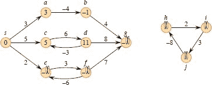  

**图 22.1** 有向图中的负边权重。源点`s`的最短路径权重显示在每个顶点内。因为顶点`e`和`f`形成了从`s`可达的负权重循环，它们的最短路径权重为−∞。因为顶点`g`可以从最短路径权重为−∞的顶点到达，所以它的最短路径权重也为−∞。像`h`、`i`和`j`这样的顶点无法从`s`到达，因此它们的最短路径权重为∞，尽管它们位于负权重循环上。  

一些最短路径算法，如迪杰斯特拉算法，假设输入图中的所有边权重都是非负的，就像在道路网络中一样。其他算法，如贝尔曼-福特算法，允许输入图中存在负权重边，并在源点不可达负权重环的情况下产生正确答案。通常，如果存在这样的负权重环，算法可以检测并报告其存在。

**`循环`**

最短路径可以包含循环吗？正如我们刚刚看到的，它不能包含负权重循环。它也不能包含正权重循环，因为从路径中移除循环会产生具有相同源点和目标点顶点以及更低路径权重的路径。也就是说，如果`p = <v₀, v₁, … , v[k]>`是一条路径，`c = <v[i], v[i+1], … , v[j]>`是该路径上的正权重循环（使得`v[i] = v[j]`且`w(c) > 0`），那么路径`p' = <v₀, v₁, … , v[i], v[j+1], v[j+2], … , v[k]>`的权重为`w(p') = w(p) - w(c) < w(p)`，因此`p`不能是从`v₀`到`v[k]`的最短路径。

这只留下了 0 权重循环。你可以从任何路径中移除 0 权重循环，得到另一条权重相同的路径。因此，如果从源顶点`s`到目标顶点`v`有一条包含 0 权重循环的最短路径，那么从`s`到`v`的另一条最短路径就没有这个循环。只要最短路径包含 0 权重循环，你可以反复从路径中移除这些循环，直到得到一个无循环的最短路径。因此，不失一般性地假设最短路径没有循环，也就是说，它们是简单路径。由于图`G = (V, E)`中的任何无环路径最多包含|`V`|个不同顶点，因此它也最多包含|`V`| − 1 条边。因此，可以假设任何最短路径最多包含|`V`| − 1 条边。

**表示最短路径**

仅计算最短路径权重通常是不够的。大多数最短路径的应用需要知道最短路径上的顶点。例如，如果您的 GPS 告诉您到目的地的距离，但没有告诉您如何到达那里，那将没有太大用处。我们表示最短路径的方式类似于我们在第 20.2 节中表示广度优先树的方式。给定一个图 `G = (V, E)`，对于每个顶点 `v ∈ V`，维护一个**前驱** `v.π`它可以是另一个顶点或 NIL。本章中的最短路径算法设置 π 属性，使得从顶点 `v` 开始的前驱链沿着从 `s` 到 `v` 的最短路径反向运行。因此，对于一个顶点 `v`，如果 `v.π` ≠ NIL，则来自第 20.2 节的 `PRINT-PATH(G, s, v)` 程序打印从 `s` 到 `v` 的最短路径。

然而，在执行最短路径算法时，π 值可能不表示最短路径。由π 值引起的**前驱子图** `G[π] = (V[π], E[π])`，对于单源最短路径与第 561 页上广度优先搜索中的方程式`(20.2)`和`(20.3)`定义相同：  

`V[π] = {v ∈ V : v.π ≠ NIL} ∪ {s}`,  

`E[π] = {(v.π, v) ∈ E : v ∈ V[π] − {s}}.`

我们将证明本章中算法产生的 `π` 值具有以下性质：在终止时，`G[π]` 是一个“最短路径树”——非正式地说，是一个根节点包含从源点 `s` 到每个可达顶点的最短路径的树。*最短路径树*类似于第 20.2 节中的广度优先树，但它包含以边权重而不是边数定义的源点到目标点的最短路径。具体来说，设 `G = (V, E)` 是一个带权重的有向图，权重函数为 `w : E → ℝ`，并假设 `G` 不包含从源顶点 `s ∈ V` 可达的负权重环，因此最短路径是明确定义的。以 `s` 为根的**最短路径树**是一个有向子图 `G' = (V', E')`，其中 `V' ⊆ V`，`E' ⊆ E`，满足以下条件：

1.  `V′` 是在 `G` 中从 `s` 可达的顶点集合，

1.  `G'` 形成以 `s` 为根的树，

1.  对于所有 `v ∈ V'`，在 `G'` 中从 `s` 到 `v` 的唯一简单路径是 `G` 中从 `s` 到 `v` 的最短路径。

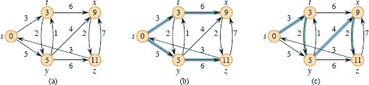

**图 22.2 (a)** `一个` 带权重的有向图，从源点 `s` 开始的最短路径权重。 **(b)** 蓝色边构成以源点 `s` 为根的最短路径树。 **(c)** 另一个以相同根节点的最短路径树。

最短路径不一定是唯一的，最短路径树也不是唯一的。例如，图 22.2 展示了一个带权重的有向图和两个以相同根节点的最短路径树。

**松弛**

本章中的算法使用`松弛`技术。对于每个顶点 `v ∈ V`，单源最短路径算法维护一个属性 `v.d`，它是从源点 `s` 到 `v` 的最短路径权重的上界。我们称 `v.d` 为**最短路径估计**。为了初始化最短路径估计和前驱节点，请调用Θ(`V`)时间复杂度的 INITIALIZE-SINGLE-SOURCE 程序。初始化后，对于所有 `v ∈ V`，有 `v.π = NIL`，`s.d = 0`，对于 `v ∈ V` − `{s}`，有 `v.d = ∞`。

`INITIALIZE-SINGLE-SOURCE(G, s)`

| 1 | **对于** 每个顶点 `v ∈ G.V` |
| --- | --- |
| 2 | `v.d` = ∞ |
| 3 | `v.π = NIL` |
| `4` | `s.d = 0` |   |

**松弛** 边 (`u`, `v`) 的过程包括测试通过顶点 `u` 是否改进到目前为止找到的到顶点 `v` 的最短路径，并且如果是，则更新 `v.d` 和 `v.π`。松弛步骤可能会减小最短路径估计值 `v.d` 并更新 `v` 的前驱属性 `v.π`。下一页的 RELAX 程序在 `O(1)` 时间内执行边 (`u`, `v`) 的松弛步骤。图 22.3 展示了两个边进行松弛的示例，一个是最短路径估计值减小的情况，另一个是没有估计值改变的情况。

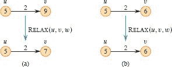

**图 22.3** 对权重为 `w(u, v) = 2` 的边 `(u, v)` 进行松弛。每个顶点的最短路径估计显示在顶点内部。**(a)** 在松弛之前，因为 `v.d > u.d + w(u, v)`，所以 `v.d` 的值会减小。**(b)** 在边进行松弛之前，由于我们有 `v.d ≤ u.d + w(u, v)`，所以松弛步骤不会改变 `v.d` 的值。

`RELAX(u, v, w)`  

| 1 | **如果** `v.d > u.d + w(u, v)` |
| --- | --- |
| `2` | `v.d = u.d + w(u, v)` |   |
| 3 | v.π = u | `   |

本章中的每个算法都调用 `INITIALIZE-SINGLE-SOURCE`，然后重复地对边进行松弛。此外，松弛是最短路径估计和前驱更改的唯一方式。本章中的算法在对每条边进行松弛的次数和对边进行松弛的顺序上有所不同。Dijkstra 算法和有向无环图的最短路径算法对每条边进行一次松弛。Bellman-Ford 算法对每条边进行松弛 `|V| − 1` 次。

**最短路径和松弛的性质**

为了证明本章中的算法正确性，我们将依赖于最短路径和松弛的几个性质。我们在这里陈述这些性质，并且第 22.5 节对其进行正式证明。供参考，这里陈述的每个性质都包括来自第 22.5 节的适当引理或推论编号。这些性质中的后五个，涉及最短路径估计或前驱子图，隐含地假定图是通过调用 INITIALIZE-SINGLE-SOURCE(``G`, `s``) 进行初始化的，并且最短路径估计和前驱子图的改变只能通过一系列松弛步骤来实现。  

**三角不等式** (引理 `22.10`)

对于任意边 `(`u`, `v`) ∈ `E``，我们有 `δ(s, v) ≤ δ(s, u) + w(u, v)`。

**`上界性质`** (引理 22.11)  

对于所有顶点 `v ∈ V`，我们始终有 `v.d` ≥ δ(`s`, `v`)，一旦 `v.d` 达到值 δ(`s`, `v`)，它就不会再改变。

**无路径性质** (`推论 22.12`)  

如果从 `s` 到 `v` 不存在路径，则我们始终有 `v.d = δ(s, v) = ∞`。

**收敛性质** (引理 `22.14`)

如果 `s ⇝ u → v` 是 `G` 中某些 `u`, `v ∈ V` 的最短路径，并且在松弛边 `(u, v)` 之前的任何时间点 `u.d = δ(s, u)`，那么在之后的任何时间点 `v.d = δ(s, v)`。  

**路径松弛性质** (引理 22.15)

如果 `p` = <`v₀`, `v₁`, … , `v[k]`> 是从 `s = v₀` 到 `v[k]` 的最短路径，并且路径 `p` 中的边按顺序 (`v₀`, `v₁`), (`v₁`, `v₂`), … , (`v[k-1]`, `v[k]`) 进行松弛，那么 `v[k].d` = δ(`s`, `v[k]`)。无论发生任何其他松弛步骤，即使它们与路径 `p` 的边的松弛交错进行，这个性质仍然成立。

**`前驱子图性质`** (引理 22.17)

一旦对于所有 `v ∈ V` 都有 `v.d = δ(s, v)`，前驱子图就是以 `s` 为根的最短路径树。

**章节大纲**

第 22.1 节介绍了贝尔曼-福特算法，它解决了边权重可能为负的一般情况下的单源最短路径问题。贝尔曼-福特算法非常简单，并且还具有检测是否从源可达负权重环的额外好处。第 22.2 节给出了在有向无环图中从单个源计算最短路径的线性时间算法。第 22.3 节介绍了迪杰斯特拉算法，其运行时间低于贝尔曼-福特算法，但要求边权重为非负。第 22.4 节展示了如何使用贝尔曼-福特算法解决线性规划的特殊情况。最后，第 22.5 节证明了上述最短路径和松弛性质。  

本章进行了无穷大的算术运算，因此我们需要一些约定，以处理算术表达式中出现`∞`或`−∞`的情况。我们假设对于任何实数`a ≠ −∞`，我们有`a + ∞ = ∞ + a = ∞`。此外，为了使我们的证明在存在负权重环的情况下成立，我们假设对于任何实数`a ≠ ∞`，我们有`a + (−∞) = (−∞) + a = −∞`。

本章中的所有算法都假定有向图`G`以邻接表表示存储。此外，对于每条边，存储其权重，因此当每个算法遍历邻接表时，它可以在每条边上以`O(1)`的时间找到边权重。

**22.1    贝尔曼-福特算法**

`**贝尔曼-福特算法**`解决了一般情况下边权值可能为负的单源最短路径问题。给定带有源顶点`s`和权重函数`w`：`E → ℝ`的加权有向图`G = (V, E)`，贝尔曼-福特算法返回一个布尔值，指示是否存在从源可达的负权重环。如果存在这样的环，算法指示不存在解决方案。如果没有这样的环，算法会产生最短路径及其权重。

BELLMAN-FORD 过程逐渐减小对源`s`到每个顶点`v ∈ V`的最短路径权重δ(`s`, `v`)的估计`v.d`。如果图中不包含可从源到达的负权重环，则算法返回 TRUE。

`BELLMAN-FORD(G, w, s)`  

| `1` | `INITIALIZE-SINGLE-SOURCE(G, s)` |   |
| --- | --- |
| `2` | **for i** = `1 to | G.V | - 1` |
| `3` | `for` each edge (`u`, `v`) ∈ `G.E` |   |
| `4` | `RELAX(u, v, w)` |
| `5` | `for` each edge (`u`, `v`) = `G.E` |
| 6 | if v.d > u.d + w(u, v) | `   |
| 7 | **return** FALSE |
| `8` | **return** TRUE |   |

图 22.4 展示了在具有 5 个顶点的图上执行贝尔曼-福特算法的过程。在第 1 行初始化所有顶点的`d`和π值之后，算法对图的边进行|`V`| − 1 次遍历。每次遍历都是行 2-4 的`for`循环的一次迭代，包括对图的每条边进行一次松弛操作。图 22.4(b)–(e)展示了每次对边进行四次遍历后算法的状态。经过|`V`| − 1 次遍历后，行 5-8 检查是否存在负权重环，并返回相应的布尔值。（稍后我们会看到为什么这个检查有效。）

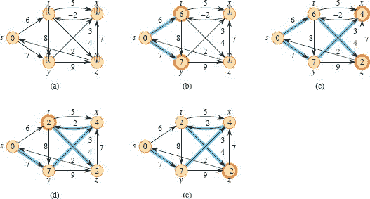

**图 22.4** Bellman-Ford 算法的执行。源是顶点`s`。`d`值出现在顶点内部，蓝色边表示前任值：如果边`(u, v)`是蓝色的，则`v.π = u`。在这个特定的例子中，每次通过以顺序`(t, x)`，`(t, y)`，`(t, z)`，`(x, t)`，`(y, x)`，`(y, z)`，`(z, x)`，`(z, s)`，`(s, t)`，`(s, y)` 松弛边。**(a)** 在第一次通过边之前的情况。**(b)**–**(e)** 每次通过边后的情况。由于通过一次后，最短路径估计和前任发生了变化的顶点被突出显示为橙色。部分**(e)**中的`d`和π值是最终值。在这个例子中，Bellman-Ford 算法返回 TRUE。

当图由邻接表表示时，Bellman-Ford 算法的运行时间为`O(V² + VE)`，因为第 1 行的初始化需要Θ(V)时间，第 2-4 行中对边的|V| − 1 次迭代需要Θ(V + E)时间（检查|V|个邻接表以找到|E|条边），而第 5-7 行的`for`循环需要`O(V + E)`时间。有时少于|V| − 1 次对边的迭代就足够了（参见练习 22.1-3），这就是为什么我们说`O(V²+VE)`时间，而不是Θ(V²+VE)时间。在|E| = Ω(V)的常见情况下，我们可以将这个运行时间表示为`O(VE)`。练习 22.1-5 要求您使 Bellman-Ford 算法在|E| = o(V)时以`O(VE)`时间运行。

为了证明 Bellman-Ford 算法的正确性，我们首先展示如果没有负权重环路，算法会计算出所有从源可达的顶点的正确最短路径权重。

**引理 22.2**

让`G = (V, E)`是一个带有源顶点`s`和权重函数`w: E → ℝ`的加权有向图，并假设`G`不包含从`s`可达的负权重环路。那么，在 BELLMAN-FORD 的第 2-4 行的`for`循环的`|V| − 1`次迭代之后，对于所有从`s`可达的顶点`v`，`v.d = δ(s, v)`。

**证明**   我们通过引用路径松弛性质来证明引理。考虑任意可从`s`到达的顶点`v`，并且让`p` = <`v₀`, `v₁`, … , `v[k]`>，其中`v₀ = s`且`v[k] = v`，是从`s`到`v`的任意最短路径。因为最短路径是简单的，`p`最多有|`V`| − 1 条边，因此`k` ≤ |`V`| − 1。每次第`i`次迭代的`for`循环的|`E`|条边都会被松弛。在第`i`次迭代中被松弛的边，对于`i = 1, 2, … , k`，是(`v[i−1]`, `v[i]`)。因此，根据路径松弛性质，`v.d = v[k].d` = δ(`s`, `v[k]`) = δ(`s`, `v`)。

▪ 输出：

**推论 22.3**

让`G = (V, E)`是一个带有源顶点`s`和权重函数`w: E → ℝ`的加权有向图。那么，对于每个顶点`v ∈ V`，当在`G`上运行时，如果 BELLMAN-FORD 以`v.d < ∞`终止，则从`s`到`v`存在一条路径。

**证明**   证明留作练习 `22.1-2`。

▪

**定理 22.4 (Bellman-Ford 算法的正确性)**

让 BELLMAN-FORD 在带有源顶点`s`和权重函数`w`：`E → ℝ`的加权有向图`G = (V, E)`上运行。如果`G`不包含从`s`可达的负权重环路，则算法返回 TRUE，对于所有顶点`v ∈ V`，`v.d` = δ(`s`, v)，并且前任子图`G[π]`是以`s`为根的最短路径树。如果`G`确实包含从`s`可达的负权重环路，则算法返回 FALSE。  

**证明**   假设图 `G` 不包含从源点 s 可达的负权重环。我们首先证明在终止时，对于所有顶点 `v ∈ V`，`v.d` = δ(`s`, `v`)。如果顶点 `v` 是从 `s` 可达的，则引理 22.2 证明了这一点。如果 `v` 从 `s` 不可达，则该声明来自无路径性质。因此，该声明得到证明。前驱子图性质以及该声明意味着 `G[π]` 是一棵最短路径树。现在我们使用该声明来展示 BELLMAN-FORD 返回 TRUE。在终止时，对于所有边 (`u`, `v`) ∈ `E`，我们有

| v.d | = | δ(s, v) |
| --- | --- | --- | --- | --- |
| `-   | --- | --- | --- |
| | ≤ | δ(s, u) + w(u, v)`（根据三角不等式） |
|  | = u.d + w(u, v)` |

因此，第 6 行中的所有测试都不会导致 `BELLMAN-FORD` 返回 `FALSE`。因此，它返回 `TRUE`。

现在，假设图 `G` 包含从源点 `s` 可达的负权重环。让这个环为 `c` = <`v₀`, `v₁`, … , `v[k]`>，其中 `v₀ = v[k]`，在这种情况下我们有  

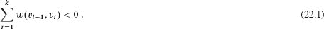

假设为了推导，Bellman-Ford 算法返回 `TRUE`。因此，对于 `i = 1, 2, … , k`，有 `v[i].d ≤ v[i-1].d + w(v[i-1], v[i])`。对环 `c` 周围的不等式求和得到

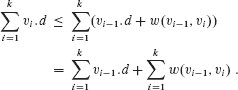

由于 `v₀ = v[k]`，所以 `c` 中的每个顶点在求和 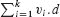 和 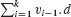 中都恰好出现一次，因此

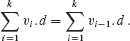

此外，根据推论 22.3，对于 `i = 1, 2, … , k`，`v[i].d` 都是有限的。因此，

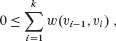

这与不等式 `(22.1)` 矛盾。我们得出结论，如果图 `G` 中不包含从源点可达的负权重环，则 BELLMAN-FORD 算法返回 TRUE，否则返回 FALSE。

▪  输出：

**`练习`**

`22.1-1`

在有向图 图 22.4 上使用顶点 `z` 作为源点运行 BELLMAN-FORD 算法。在每次迭代中，按照图中的顺序放松边，并展示每次迭代后的 `d` 和 π 值。现在，将边 `(z, x)` 的权重更改为 4，再次使用 `s` 作为源点运行算法。

`22.1-2`

证明推论 `22.3`。

**`22.1-3`**  

给定一个没有负权重环的带权重的有向图 `G = (V, E)`，让 `m` 是所有顶点 `v ∈ V` 中从源点 `s` 到 `v` 的最短路径中边的最小数量的最大值。建议对 BELLMAN-FORD 算法进行简单更改，使其在 `m` + 1 次迭代中终止，即使 `m` 事先未知。

**`22.1-4`**

修改 Bellman-Ford 算法，使其对于所有存在从源点到 `v` 的路径上存在负权重环的顶点 `v` 将 `v.d` 设置为 −∞。

**22.1-5**  

假设输入给 BELLMAN-FORD 算法的图是由 |`E`| 条边的列表表示的，其中每条边指示它离开和进入的顶点，以及它的权重。证明 BELLMAN-FORD 算法在不受 |`E`| = Ω(`V`) 约束的情况下以 `O(VE)` 时间运行。修改 BELLMAN-FORD 算法，使其在输入图用邻接表表示时在所有情况下以 `O(VE)` 时间运行。

`22.1-6`

设 `G = (V, E)` 是一个带权重的有向图，权重函数为 `w : E → ℝ`。给出一个 `O(VE)` 时间复杂度的算法，用于找到所有顶点 `v ∈ V` 的值 δ(v) = min {δ(u, v) : u ∈ V}。

**`22.1-7`**

假设带权重的有向图 `G = (V, E)` 包含一个负权重环。给出一个有效的算法来列出这样一个环的顶点。证明你的算法是正确的。

**`22.2`有向无环图中的单源最短路径**

在本节中，我们对加权有向图引入了进一步的限制：它们是无环的。也就是说，我们关注的是加权有向无环图。在无环图中，最短路径总是明确定义的，因为即使存在负权边，也不会存在负权环。我们将看到，如果加权有向无环图 `G = (V, E)` 的边根据其顶点的拓扑排序进行松弛，从单个源点计算最短路径只需要 Θ(`V + E`) 的时间。

该算法首先对有向无环图进行拓扑排序（参见第 20.4 节），为顶点施加线性顺序。如果有从顶点 `u` 到顶点 `v` 的路径，则在拓扑排序中 `u` 在 `v` 之前。DAG-SHORTEST-PATHS 过程只需按照拓扑排序顺序对顶点进行一次遍历。在处理每个顶点时，它会松弛离开该顶点的每条边。图 22.5 展示了该算法的执行过程。

`DAG-SHORTEST-PATHS(G, w, s)`

| 1 | 对 `G` 的顶点进行拓扑排序 |
| --- | --- |
| --- | --- |
| 2 | ` INITIALIZE-SINGLE-SOURCE(`G`, `s`) |
| `3` | **对于** *G.V* **中的每个顶点** `u`，**按拓扑排序顺序取出** |   |
| 4 | **对于** `G.Adj[u]` **中的每个顶点** `v` |
| `5` | RELAX(`u`, `v`, `w`) |   |

让我们分析这个算法的运行时间。如第 20.4 节所示，第 1 行的拓扑排序需要 `Θ(V + E)` 的时间。第 2 行调用 INITIALIZE-SINGLE-SOURCE 需要 `Θ(V)` 的时间。第 3-5 行的 `for` 循环每个顶点进行一次迭代。总体来说，第 4-5 行的 `for` 循环对每条边进行一次松弛。（这里我们使用了聚合分析。）由于内部 `for` 循环的每次迭代需要 `Θ(1)` 的时间，总运行时间为 `Θ(V + E)`，这在图的邻接表表示中是线性的。

下面的定理表明`DAG-SHORTEST-PATHS`过程正确计算了最短路径。

**定理 22.5**

如果加权有向图 `G = (V, E)` 有源顶点 `s` 且没有环路，那么在 DAG-SHORTEST-PATHS 过程终止时，对于所有顶点 `v ∈ V`，`v.d = δ(s, v)`，并且前驱子图 `G[π]` 是一棵最短路径树。

**证明** 我们首先证明在终止时对于所有顶点 `v ∈ V`，`v.d` = δ(`s`, `v`)。如果 `v` 从 `s` 不可达，则根据无路径性质，`v.d` = δ(`s`, `v`) = 1。现在，假设 `v` 从 `s` 可达，因此存在最短路径 `p` = <`v₀`, `v₁`, … , `v[k]`>，其中 `v₀ = s` 且 `v[k] = v`。由于 DAG-SHORTEST-PATHS 按拓扑排序顺序处理顶点，它按顺序松弛 `p` 上的边，即 (`v₀`, `v₁`)，(`v₁`, `v₂`)，…，(`v[k-1]`, `v[k]`)。路径松弛性质意味着对于 `i = 0`, 1, … , `k`，在终止时 `v[i].d` = δ(`s`, `v[i]`)。最后，根据前驱子图性质，`G[π]` 是一棵最短路径树。

▪  输出：

该算法的一个有用应用是在 PERT 图分析中确定关键路径。一个工作由多个任务组成。每个任务需要一定的时间完成，有些任务必须在其他任务开始之前完成。例如，如果工作是建造一座房子，那么在开始构建外墙框架之前必须完成地基，而在开始屋顶之前必须完成外墙框架。有些任务需要完成多于一个其他任务才能开始：在干墙安装在墙框架上之前，电气系统和管道必须安装。dag 模拟了任务和依赖关系。边代表任务，边的权重表示执行任务所需的时间。顶点代表“里程碑”，当进入顶点的所有边代表的任务都完成时达到。如果边(`u`, `v`)进入顶点`v`，边(`v`, `x`)离开`v`，则任务(`u`, `v`)必须在任务(`v`, `x`)开始之前完成。通过 dag 的路径表示必须按特定顺序执行的任务序列。一个**关键路径**是 dag 中的*最长*路径，对应于执行任何任务序列所需的最长时间。因此，关键路径的权重提供了执行所有任务所需的总时间的下界，即使尽可能多的任务同时执行。你可以通过以下方式找到关键路径

+   反转边权重并运行 `DAG-SHORTEST-PATHS`，或

+   运行 `DAG-SHORTEST-PATHS`，但在 `INITIALIZE-SINGLE-SOURCE` 的第 2 行将“∞”替换为“-∞”，在 `RELAX` 过程中将“>`替换为“<”。

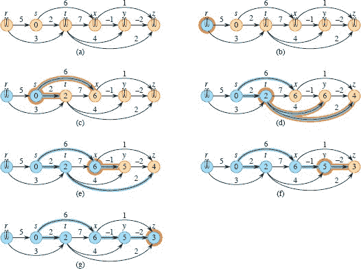

**图 22.5** 在有向无环图中最短路径算法的执行过程。顶点从左到右进行拓扑排序。源顶点为`s`。`d`值出现在顶点内部，蓝色边表示π值。**(a)** 在第 3-5 行的`for`循环的第一次迭代之前的情况。**(b)-(g)** 在第 3-5 行的`for`循环的每次迭代之后的情况。蓝色顶点已经放松了其出边。橙色突出显示的顶点在该迭代中被用作`u`。每条橙色突出显示的边在被该迭代中放松时导致`d`值发生变化。在(g)部分显示的值是最终值。

**练习**

**22.2-1**

展示在有向无环图图 22.5 上以顶点`r`为源运行 DAG-SHORTEST-PATHS 的结果。

**`22.2-2`**

假设你将`DAG-SHORTEST-PATHS`的第 3 行改为

| 3 | **对于**第` | V | − 1`个顶点，按拓扑排序顺序选择 |
| --- | --- | --- | --- |
| --- | --- |

证明该过程仍然是正确的。

`22.2-3`  

代表 PERT 图的另一种方式更像是图 20.7 在第 574 页的 dag。顶点代表任务，边代表顺序约束，也就是说，边(`u, v`)表示任务`u`必须在任务`v`之前执行。顶点而非边具有权重。修改 DAG-SHORTEST-PATHS 过程，使其能在线性时间内找到有权重顶点的有向无环图中的最长路径。  

★ **`22.2-4`**  

给出一个高效的算法来计算有向无环图中路径的总数。计数应包括所有顶点对之间的所有路径和具有 0 条边的所有路径。分析你的算法。

**`22.3`    Dijkstra 算法**  

Dijkstra 算法解决了加权有向图`G = (V, E)`上的单源最短路径问题，但它要求所有边上的权重为非负：对于每条边`(u, v) ∈ E`，`w(u, v) ≥ 0`。正如我们将看到的，通过良好的实现，Dijkstra 算法的运行时间低于 Bellman-Ford 算法。

你可以将 Dijkstra 算法视为将广度优先搜索推广到加权图的过程。一波波从源点传播，当一波波到达一个顶点时，从该顶点再传播出一波波。而广度优先搜索则是假设每一波波在穿过一条边时花费单位时间，在加权图中，一波波穿过一条边所需时间由边的权重给出。因为在加权图中最短路径可能不是边数最少的路径，简单的先进先出队列无法选择下一个顶点来传播波波。

相反，Dijkstra 算法维护一个顶点集合`S`，其中已经确定了从源点`s`到达的最短路径权重。该算法重复选择顶点`u ∈ V – S`，其具有最小的最短路径估计值，将`u`添加到`S`中，并放松所有从`u`出发的边。DIJKSTRA 过程用最小优先队列`Q`替换了广度优先搜索的先进先出队列，其键值为它们的`d`值。

DIJKSTRA(`G`, `w`, `s`)  

|   1 | 初始化单源(`G`, `s`) |   |
| --- | --- |
|   2 | `S = Ø` |
|   3 | `Q = Ø` |   |
|   4 | `**对于** 每个顶点 u ∈ G.V **执行**` |
|   5 | 插入(`Q, u`) |
|   `6` | **当** `Q` ≠ Ø **时** |
|   7 | `u = 取出最小(Q)` |   |
|   8 | `S = S ∪ {u}` |   |
|   9 | **对于** 每个顶点`v`在`G.Adj[u] **中**` |
| 10 | 放松(u, v, w) | `   |
| 11 | **如果** 调用 `RELAX` 减小了 `v.d` **则** |
| `12` | 减小键值(`Q`, `v`, `v.d`) |   |

Dijkstra 算法如图 22.6 所示放松边。第 1 行通常方式初始化`d`和`π`值，第 2 行将集合`S`初始化为空集。算法保持不变式，即在每次循环的开始，`Q = V` − `S`。第 3–5 行将最小优先队列`Q`初始化为包含`V`中所有顶点。因为此时`S` = Ø，因此在第一次到达第 6 行时不变式成立。每次通过第 6–12 行的**当**循环时，第 7 行从`Q = V` − `S`中取出一个顶点`u`，第 8 行将其添加到集合`S`中，从而保持不变式。（第一次循环时，`u = s`。）因此，顶点`u`具有`V` − `S`中任何顶点中最小的最短路径估计值。然后，第 9–12 行放松每条离开`u`的边(`u`, `v`)，从而更新估计值`v.d`和前驱`v.π`，如果到目前为止通过`u`找到的到`v`的最短路径得到改进。每当放松步骤改变`d`和`π`值时，第 12 行的 DECREASE-KEY 调用更新最小优先队列。算法在第 4–5 行的**对于**循环后不再向`Q`中插入顶点，每个顶点仅从`Q`中提取并添加到`S`中一次，因此第 6–12 行的**当**循环正好迭代了|`V`|次。

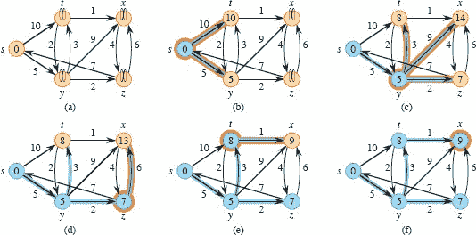

**图 22.6** Dijkstra 算法的执行过程。源点`s`是最左侧的顶点。最短路径估计值显示在顶点内部，蓝色边表示前驱值。蓝色顶点属于集合`S`，棕色顶点在最小优先队列`Q = V - S`中。**(a)** 在第 6–12 行的第一次循环之前的情况。**(b)**–**(f)** 每次循环后的情况。在每个部分中，橙色高亮显示的顶点被选择为第 7 行的顶点`u`，每条橙色高亮显示的边在放松时导致`d`值和前驱值的改变。在**(f)**部分中显示的`d`值和前驱值是最终值。

因为 Dijkstra 算法总是选择`V - S`中“最轻”或“最近”的顶点添加到集合`S`中，你可以将其视为使用贪婪策略。第十五章详细解释了贪婪策略，但你不需要阅读该章节就能理解 Dijkstra 算法。一般情况下，贪婪策略并不总是产生最优结果，但正如以下定理及其推论所示，Dijkstra 算法确实计算出最短路径。关键在于展示每次将顶点`u`添加到集合`S`时，`u.d = δ(s, u)`。

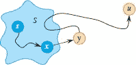

**图 22.7** 定理 22.6 的证明。顶点`u`被选择添加到集合`S`中的 DIJKSTRA 第 7 行。顶点`y`是从源`s`到顶点`u`的最短路径上第一个不在集合`S`中的顶点，`x ∈ S`是该最短路径上`y`的前驱。从`y`到`u`的子路径可能会或可能不会重新进入集合`S`。  

**定理 22.6（Dijkstra 算法的正确性）**  

在加权有向图`G = (V, E)`上运行的 Dijkstra 算法，其中权重函数`w`为非负，源顶点为`s`，对于所有顶点`u ∈ V`，终止时`u.d = δ(s, u)`。

**证明**   我们将展示在第 6-12 行的`while`循环的每次迭代开始时，对于所有`v ∈ S`，`v.d = δ(s, v)`。算法在`S = V`时终止，因此对于所有`v ∈ V`，`v.d = δ(s, v)`。

   证明通过对`while`循环迭代次数进行归纳，该次数等于每次迭代开始时的|`S`|。有两个基础情况：对于|`S`| = 0，使得`S` = Ø，命题显然成立；对于|`S`| = 1，使得`S` = {`s`}，`s.d* = δ(`s`, `s`) = 0。

对于归纳步骤，归纳假设是对于所有`v ∈ S`，`v.d = δ(s, v)`。算法从`V - S`中提取顶点`u`。因为算法将`u`添加到`S`中，我们需要展示在那时`u.d = δ(s, u)`。如果从`s`到`u`没有路径，那么我们已经完成，根据无路径性质。如果从`s`到`u`有路径，那么，正如图 22.7 所示，让`y`是从`s`到`u`的最短路径上第一个不在`S`中的顶点，让`x ∈ S`是该最短路径上`y`的前驱。（我们可能有`y = u`或`x = s`。）因为`y`在最短路径上不晚于`u`出现，且所有边权重为非负，我们有δ(s, y) ≤ δ(s, u)。因为第 7 行中 EXTRACT-MIN 的调用返回`u`作为在`V - S`中具有最小`d`值的顶点，我们也有`u.d ≤ y.d`，并且上界性质给出δ(s, u) ≤ `u.d`。  

由于`x ∈ S`，归纳假设意味着`x.d` = δ(`s`, `x`)。在将`x`添加到`S`的`while`循环迭代期间，边(`x`, `y`)被放松。根据收敛性质，`y.d`在那时接收到了δ(`s`, `y`)的值。因此，我们有

`δ(s, y) ≤ δ(s, u) ≤ u.d ≤ y.d`且`y.d = δ(s, y)`，

因此

`δ(s, y) = δ(s, u) = u.d = y.d`

因此，`u.d = δ(s, u)`，根据上界性质，这个值再也不会改变。

▪

**推论 22.7**

在加权有向图`G = (V, E)`上运行 Dijkstra 算法，其中权重函数`w`为非负，源顶点为`s`，前驱子图`G[π]`是以`s`为根的最短路径树。

**证明**   根据定理 `22.6` 和前驱子图性质立即得出。

▪

**分析**

Dijkstra 算法有多快？它通过调用三个优先队列操作来维护最小优先队列`Q`：INSERT（第 5 行）、EXTRACT-MIN（第 7 行）和 DECREASE-KEY（第 12 行）。算法每个顶点都会调用一次 INSERT 和 EXTRACT-MIN。因为每个顶点`u ∈ V`只会被添加到集合`S`一次，所以算法在执行过程中会在`Adj[u]`的邻接表中的每条边都会被`for`循环（第 9-12 行）检查一次。由于所有邻接表中的边的总数为|`E`|，所以这个`for`循环总共迭代了|`E`|次，因此算法总共最多调用 DECREASE-KEY 次数为|`E`|。（再次注意，我们使用的是聚合分析。）

就像 Prim 算法一样，Dijkstra 算法的运行时间取决于最小优先队列`Q`的具体实现。一个简单的实现利用了顶点编号为 1 到|`V`|的特点：只需将`v.d`存储在数组的第`v`个条目中。每个 INSERT 和 DECREASE-KEY 操作都需要`O(1)`的时间，而每个 EXTRACT-MIN 操作需要`O(V)`的时间（因为它必须搜索整个数组），因此总时间为`O(V² + E) = O(V²)。

如果图足够稀疏，特别是`E = o(V²/lg V)`，您可以通过使用包含顶点和它们对应堆元素之间映射的二叉最小堆来实现最小优先队列，从而提高运行时间。然后，每个 EXTRACT-MIN 操作都需`O`(lg V)的时间。与以前一样，有|V|此类操作。构建二叉最小堆的时间为`O`(V)。（如第 21.2 节中所述，甚至不需要调用 BUILD-MIN-HEAP。）每个 DECREASE-KEY 操作都需要`O`(lg V)的时间，而且最多有|E|此类操作。因此，总运行时间为`O`((V + E) lg V)，在|E| = Ω(V)的典型情况下为`O`(E lg V)。如果 E = o(V²/lg V)，则此运行时间优于直接`O`(V²)时间的实现。

通过使用斐波那契堆实现最小优先队列（见第 478 页），您可以将运行时间提高到`O(V lg V + E)`。每个|`V`| EXTRACT-MIN 操作的摊销成本为`O(lg V)`，而每个 DECREASE-KEY 调用（最多为|`E`|）仅需要`O(1)`的摊销时间。历史上，斐波那契堆的发展受到的启发是观察到 Dijkstra 算法通常会进行比 EXTRACT-MIN 调用更多的 DECREASE-KEY 调用，因此任何一种将每个 DECREASE-KEY 操作的摊销时间降低到`o(lg V)`而不增加 EXTRACT-MIN 操作的摊销时间的方法都会比使用二叉堆实现更快。

Dijkstra 算法类似于广度优先搜索（见第 20.2 节）和 Prim 算法计算最小生成树（见第 21.2 节）。它类似于广度优先搜索，因为集合`S`对应于广度优先搜索中的黑色顶点集合。就像`S`中的顶点具有最终的最短路径权重一样，广度优先搜索中的黑色顶点具有正确的广度优先距离。Dijkstra 算法类似于 Prim 算法，因为这两种算法都使用最小优先队列来找到给定集合之外的“最轻”顶点（Dijkstra 算法中的集合`S`和 Prim 算法中正在生成的树），将该顶点添加到集合中，并相应地调整集合之外的剩余顶点的权重。

**`练习`**

**`22.3-1`**

在图 22.2 的有向图上运行 Dijkstra 算法，首先使用顶点`s`作为源，然后使用顶点`z`作为源。按照图 22.6 的风格，展示每次`while`循环迭代后的`d`和π值以及集合`S`中的顶点。

**`22.3-2`**  

给出一个带有负权边的有向图的简单示例，对于这个示例，`Dijkstra` 算法会产生错误的答案。为什么当允许负权边时，定理 `22.6` 的证明不成立？

**`22.3-3`**  

假设你将 Dijkstra 算法的第 6 行改为  输出：

| 6    | **当** ` | Q | > 1` |
| --- | --- | --- | --- |
| --- | --- |

这个改变导致 `while` 循环执行 `|V| − 1` 次而不是 `|V|` 次。这个提议的算法正确吗？

**22.3-4**

修改 `DIJKSTRA` 程序，使得优先队列 `Q` 更像 `BFS` 程序中的队列，其中只包含到目前为止从源 `s` 到达的顶点：`Q ⊆ V - S` 且 `v ∈ Q` 意味着 `v.d ≠ ∞`。

**`22.3-5`**

Gaedel 教授编写了一个程序，他声称实现了 Dijkstra 算法。该程序为每个顶点 `v ∈ V` 生成 `v.d` 和 `v.π`。给出一个 `O(V + E)` 时间的算法来检查教授程序的输出。它应该确定 `d` 和 π 属性是否与某些最短路径树的匹配。你可以假设所有边的权重都是非负的。  

`22.3-6`

Newman 教授认为他已经找到了一个更简单的 Dijkstra 算法正确性证明。他声称 Dijkstra 算法按照路径上出现的顺序放松图中每条最短路径的边，因此路径放松属性适用于从源可达的每个顶点。通过构造一个有向图，展示教授是错误的，因为 Dijkstra 算法按顺序放松了最短路径的边。

`22.3-7`  

考虑一个有向图 `G = (V, E)`，其中每条边 `(u, v) ∈ E` 都有一个关联值 `r(u, v)`，它是一个范围在 0 ≤ `r(u, v)` ≤ 1 的实数，表示从顶点 `u` 到顶点 `v` 的通信信道的可靠性。将 `r(u, v)` 解释为通道从 `u` 到 `v` 不会失败的概率，并假设这些概率是独立的。给出一个有效的算法来找到两个给定顶点之间的最可靠路径。  

**22.3-8**

令 `G = (V, E)` 为一个带有正权重函数 `w : E → {1, 2, … , W}` 的加权有向图，假设没有两个顶点从源顶点 `s` 具有相同的最短路径权重。现在定义一个无权重的有向图 `G' = (V ∪ V', E')`，通过用串联的 `w(u, v)` 单位权重边替换每条边 `(u, v) ∈ E`。`G'` 有多少个顶点？现在假设你在 `G'` 上运行广度优先搜索。展示当广度优先搜索 `G'` 时，将 `V` 中的顶点标记为黑色的顺序与 Dijkstra 算法在 `G` 上运行时从优先队列中提取顶点的顺序相同。

`22.3-9`

令 `G = (V, E)` 为一个带有非负权重函数 `w : E → {0, 1, … , W}` 的加权有向图。修改 Dijkstra 算法以在 `O(W V + E)` 时间内计算从给定源顶点 `s` 到其他顶点的最短路径。

`22.3-10`

修改你在练习 22.3-9 中的算法，使其在 `O((V + E) lg W)` 时间内运行。(*提示:* 在任何时间点，`V - S` 可能包含多少个不同的最短路径估计？)

**22.3-11**

假设你有一个加权有向图 `G = (V, E)`，其中离开源顶点 `s` 的边可能具有负权重，所有其他边的权重都是非负的，并且没有负权重环。论证 Dijkstra 算法在这个图中正确地找到从 `s` 开始的最短路径。

**22.3-12**

假设你有一个加权有向图 `G = (V, E)`，其中所有边的权重都是在 [`C`, 2`C`] 范围内的正实数，其中 `C` 是一个正常数。修改 Dijkstra 算法以在 `O(V + E)` 时间内运行。

**`22.4`    差分约束和最短路径**

第二十九章研究了一般的线性规划问题，展示了如何在一组线性不等式下优化线性函数。本节研究了线性规划的一个特殊情况，将其简化为从单个源点找到最短路径。然后，贝尔曼-福特算法解决了由此产生的单源最短路径问题，从而解决了线性规划问题。  

**线性规划**

在一般的**线性规划问题**中，输入是一个 `m × n` 矩阵 `A`，一个 `m` 维向量 `b`，和一个 `n` 维向量 `c`。目标是找到一个 `n` 元素的向量 `x`，使得在满足 *Ax* ≤ `b` 的 `m` 个约束条件下，最大化**目标函数** `max c^Tx`。  

解线性规划问题最流行的方法是`单纯形算法`，第 29.1 节进行了讨论。虽然单纯形算法并不总是在其输入规模的多项式时间内运行，但还有其他线性规划算法可以在多项式时间内运行。我们在这里提供两个理由来理解线性规划问题的设置。首先，如果你知道可以将给定问题转化为多项式规模的线性规划问题，那么你立即就有了一个多项式时间算法来解决这个问题。其次，对于许多线性规划的特殊情况存在更快的算法。例如，单对最短路径问题（练习 22.4-4）和最大流问题（练习 24.1-5）是线性规划的特殊情况。  

有时目标函数并不重要：只需找到任何一个`可行解`就足够了，即任何满足 `Ax ≤ b` 的向量 `x`，或者确定不存在可行解。本节重点讨论这样一个`可行性问题`。

**差分约束系统**

在一个`**差分约束系统**`中，线性规划矩阵 `A` 的每一行包含一个 1 和一个−1，其余所有元素为 0。因此，由 `Ax ≤ b` 给出的约束是涉及 `n` 个未知数的 `m` 个`**差分约束**`集合，其中每个约束是形如

`x[j] - x[i] ≤ b[k]`,  

其中 `1 ≤ i, j ≤ n`, `i ≠ j`, 且 `1 ≤ k ≤ m`。  

举例来说，考虑找到一个 5 维向量 `x = (x[i])`，满足以下条件

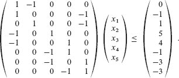

这个问题等同于找到未知数 `x₁`, `x₂`, `x[3]`, `x[4]`, `x[5]` 的值，满足以下 8 个差分约束条件：

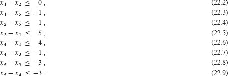

这个问题的一个解是 `x = (-5, -3, 0, -1, -4)`，你可以通过直接检查每个不等式来验证。事实上，这个问题有不止一个解。另一个解是 `x′ = (0, 2, 5, 4, 1)`。这两个解是相关的：`x′` 的每个分量比 `x` 对应的分量大 5。这个事实并非偶然。

**`引理 22.8`**

设 `x = (x₁, x₂, … , x[n])` 是差分约束系统 A`x ≤ b` 的一个解，`d` 是任意常数。那么 `x + d = (x₁ + d, x₂ + d, … , x[n] + d)` 也是满足 *Ax* ≤ `b` 的解。

**证明**   对于每个 `x[i]` 和 `x[j]`，我们有 (`x[j] + d`) − (`x[i] + d`) = `x[j]` − `x[i]`。因此，如果 `x` 满足 `Ax ≤ b`，那么 `x + d` 也满足。

▪  输出：

差分约束系统出现在各种应用中。例如，未知数`x[i]`可能是事件发生的时间。每个约束说明两个事件之间必须至少经过一定的时间，或者最多经过一定的时间。也许这些事件是在产品组装过程中要执行的工作。如果制造商在时间`x₁`施加需要 2 小时凝固的胶水，并且必须等到胶水凝固后才能在时间`x₂`安装零件，那么有一个约束`x₂ ≥ x₁ + 2` 或者等价地，`x₁ − x₂ ≤ −2`。或者，制造商可能要求在胶水施加后立即安装零件，但不能晚于胶水凝固一半的时间。在这种情况下，有一对约束`x₂ ≥ x₁`和`x₂ ≤ x₁ + 1` 或者等价地，`x₁ − x₂ ≤ 0` 和 `x₂ − x₁ ≤ 1`。

如果所有约束的右侧都是非负数，即如果对于`i = 1, 2, … , m`，都有`b[i] ≥ 0`，则找到一个可行解是微不足道的：只需将所有未知数`x[i]`设为相等。然后所有差异都为 0，每个约束都得到满足。只有至少一个约束的`b[i] < 0`时，解决差分约束系统的问题才是有趣的。

`约束图`

我们可以从图论的角度解释差分约束系统。对于一个差分约束系统`Ax ≤ b`，让我们将`m × n`线性规划矩阵`A`视为一个具有`n`个顶点和`m`条边的图的关联矩阵的转置（参见练习 20.1-7）。图中的每个顶点`v[i]`，对于`i = 1, 2, … , n`，对应于`n`个未知变量`x[i]`中的一个。图中的每条有向边对应于涉及两个未知数中的`m`个不等式中的一个。

更正式地说，给定一个差分约束系统`Ax ≤ b`，对应的**约束图**是一个加权有向图`G = (V, E)`，其中

`V = {v₀, v₁, … , v[n]}`

和

| `E = { (v[i], v[j]) : x[j] - x[i] ≤ b[k] 是一个约束 }` |
| --- |
| --- | --- |  |
|  |    ∪ {(`v₀`, `v₁`), (`v₀`, `v₂`), (`v₀`, `v[3]`), … , (`v₀`, `v[n]`)} |

约束图包括额外的顶点`v₀`，我们很快就会看到，以确保图中有一个顶点可以到达所有其他顶点。因此，顶点集`V`包含每个未知数`x[i]`的顶点`v[i]`，以及额外的顶点`v₀`。边集`E`包含每个差分约束的边，以及每个未知数`x[i]`的边(`v₀`, `v[i]`)。如果`x[j]` − `x[i] ≤ b[k]`是一个差分约束，则边(`v[i]`, `v[j]`)的权重为`w(v[i], v[j]) = b[k]`。离开`v₀`的每条边的权重为 0。图 22.8 展示了差分约束系统（22.2）-（22.9）的约束图。

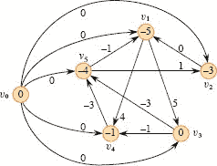

**图 22.8** 对应于差分约束系统（22.2）-（22.9）的约束图。每个顶点`v[i]`中都包含δ(`v₀`, `v[i]`)的值。系统的一个可行解是`x = (-5, -3, 0, -1, -4)`。

下面的定理展示了如何通过在对应的约束图中找到最短路径权重来解决差分约束系统。

**定理 22.9**

给定一个差分约束系统`Ax ≤ b`，让`G = (V, E)`为对应的约束图。如果`G`不包含负权重循环，则

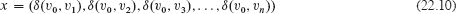

是系统的一个可行解。如果`G`包含负权重循环，则系统没有可行解。

**证明**   我们首先证明，如果约束图中不包含负权重环路，则方程`（22.10）`给出一个可行解。考虑任意边（`v[i]`, `v[j]`） ∈ `E`。三角不等式意味着δ(`v₀`, `v[j]`) ≤ δ(`v₀`, `v[i]`) + `w(v[i], v[j])`，这等价于δ(`v₀`, `v[j]`)−δ(`v₀`, `v[i]`) ≤ `w(v[i], v[j])`。因此，令`x[i]` = δ(`v₀`, `v[i]`)和`x[j]` = δ(`v₀`, `v[j]`)满足对应于边（`v[i]`, `v[j]`）的差分约束`x[j] - x[i] ≤ w(v[i], v[j])`。  

现在我们证明，如果约束图中包含负权重环路，则差分约束系统没有可行解。不失一般性，设负权重环路为`c = <v₁, v₂, … , v[k]>`，其中`v₁ = v[k]`。（顶点`v₀`不能在环路`c`上，因为它没有入边。）环路`c`对应以下差分约束：

| `x₂ − x₁` | ≤ | `w(v₁, v₂)`, |
| --- | --- | --- |
| x[3] − x₂ | ≤ | w(v₂, v[3]), |
|  | ⋮ |  |
| `x[k-1] - x[k-2]` | ≤ | `w(v[k-2], v[k-1]), |   |
| `x[k] - x[k-1]` | ≤ | `w(v[k-1], v[k])`. |   |

我们假设`x`有一个满足每个这些`k`个不等式的解，然后推导出矛盾。解还必须满足从这`k`个不等式求和得到的不等式。在求和左侧时，每个未知数`x[i]`被加入一次并减去一次（记住`v₁ = v[k]`意味着`x₁ = x[k]`），因此左侧求和为 0。右侧求和为环路的权重`w(c)`，得到 0 ≤ `w(c)`。但由于`c`是一个负权重环路，`w(c)` < 0，我们得到矛盾，即 0 ≤ `w(c)` < 0。

▪  输出：

**解决差分约束系统**

定理 22.9 建议如何使用 Bellman-Ford 算法解决差分约束��统。因为约束图包含从源顶点`v₀`到所有其他顶点的边，约束图中的任何负权重环路都可以从`v₀`到达。如果 Bellman-Ford 算法返回 TRUE，则最短路径权重给出系统的可行解。例如，在图 22.8 中，最短路径权重提供了可行解`x = (-5, -3, 0, -1, -4)`，并且根据引理 22.8，`x = (d - 5, d - 3, d, d - 1, d - 4)`也是任何常数`d`的可行解。如果 Bellman-Ford 算法返回 FALSE，则差分约束系统没有可行解。

一个包含`n`个未知数的`m`个约束的差分约束系统产生一个具有`n` + 1 个顶点和`n + m`条边的图。因此，Bellman-Ford 算法提供了一种在`O((n + 1)(n + m)) = O(n² + nm)`时间内解决系统的方法。练习 22.4-5 要求您修改算法，使其在`O(nm)`时间内运行，即使`m`远小于`n`。

**习题**

**`22.4-1`**

对以下差分约束系统找到一个可行解或确定不存在可行解：  输出：

| `x₁ − x₂` | ≤ | 1, |
| --- | --- | --- |
| `x₁ − x[4]` | ≤ | −4, |   |
| `   | ``x`[2] - `x`[3]` | ≤ | | `   |
| `x₂ − x[5]` | ≤ | 7, |
| `x₂ − x[6]` | ≤ | `5,` |   |
| `x[3] - x[6]` | ≤ | 10, |   |
| `x[4] - x₂` | ≤ | 2, |
| `x[5] - x₁` | ≤ | `-1, |   |
| `x[5] - x[4]` | ≤ | 3, |
| `x[6] - x[3]` | ≤ | `-8` |

**`22.4-2`**

对以下差分约束系统找到一个可行解或确定不存在可行解：  输出：

| `x₁ − x₂` | ≤ | `4, |
| --- | --- | --- |
| `x₁ − x[5]` | ≤ | `5, |  |
| x₂ - x[4] | ≤ | -6, | `   |
| `x[3] - x₂` | ≤ | `1, |
| `x[4] − x₁` | ≤ | `3,` |
| `x[4] − x[3]` | ≤ | 5, |
| `x[4] − x[5]` | ≤ | `10, |   |
| x[5] − x[3] |  ≤  | -4 |
| `x[5] − x[4]` | ≤ | `-8`. |

`22.4-3`

在约束图中，新顶点`v₀`的任何最短路径权重都可能是正的吗？请解释。

**`22.4-4`**

将单对最短路径问题表达为线性规划。

**`22.4-5`**  

展示如何略微修改贝尔曼-福特算法，以便在解决具有`n`个未知数上的`m`个不等式的差分约束系统时，运行时间为`O(nm)`。

**`22.4-6`**  

考虑将形式为`x[i] = x[j] + b[k]`的**等式约束**添加到差分约束系统中。展示如何解决这种类型的约束系统。

`22.4-7`

展示如何通过类似贝尔曼-福特算法的算法来解决一个差分约束系统，该算法在没有额外顶点`v₀`的约束图上运行。

★ `22.4-8`

让`Ax ≤ b`成为`n`个未知数中的`m`个差分约束的系统。展示当在相应的约束图上运行贝尔曼-福特算法时，最大化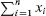受限于`Ax ≤ b`和所有`x[i] ≤ 0`。

★ `22.4-9`

展示当在差分约束系统的约束图上运行贝尔曼-福特算法时，最小化(`max {x[i]}-min {x[i]}`)受限于`Ax ≤ b`。解释如果算法用于调度施工作业，这个事实可能会有所帮助。

**`22.4-10`**

假设线性规划`Ax ≤ b`的矩阵`A`中的每一行对应于一个差分约束，一个形式为`x[i] ≤ b[k]`的单变量约束，或一个形式为−`x[i] ≤ b[k]`的单变量约束。展示如何调整贝尔曼-福特算法来解决这种类型的约束系统。

**`22.4-11`**

给出一个有效的算法来解决一个差分约束系统`Ax ≤ b`，其中`b`的所有元素都是实数，所有未知数`x[i]`必须是整数。

★ `22.4-12`

给出一个有效的算法来解决一个差分约束系统`Ax ≤ b`，其中`b`的所有元素都是实数，而一些但不一定是所���未知数`x[i]`必须是整数的指定子集。

**`22.5`    最短路径性质的证明**

在本章中，我们的正确性论证依赖于`三角不等式`、`上界性质`、`无路径性质`、`收敛性质`、`路径松弛性质`和`前驱子图性质`。我们在第 611 页陈述了这些性质，但没有给出证明。在本节中，我们将证明它们。

**三角不等式**

在研究广度优先搜索（`Section 20.2`）时，我们在引理 `20.1` 中证明了无权图中最短距离的一个简单性质。三角不等式将这个性质推广到加权图中。

**引理 22.10（三角不等式）**

设`G = (V, E)`是一个带有权重函数`w：E → ℝ`和源顶点`s`的加权有向图。那么，对于所有的边`(u, v) ∈ E`，

`δ(s, v) ≤ δ(s, u) + w(u, v)`.

**证明**   假设`p`是从源`s`到顶点`v`的最短路径。那么`p`的权重不会比从源`s`到顶点`u`的最短路径，然后经过边`(u, v)`的任何其他路径更大。具体来说，路径`p`的权重不会比从源`s`到顶点`u`的最短路径，然后经过边`(u, v)`的路径更大。

练习 22.5-3 要求你处理从`s`到`v`没有最短路径的情况。

▪  输出：

**松弛对最短路径估计的影响**  

下一组引理描述了在加权有向图上执行一系列松弛步骤时，最短路径估计如何受到影响，该图已由 `INITIALIZE-SINGLE-SOURCE` 初始化。

**引理 22.11（上界性质）**

设`G = (V, E)`是一个带有权重函数`w : E → ℝ`的加权有向图。让`s ∈ V`是源顶点，并且图由 INITIALIZE-SINGLE-SOURCE(G, s) 初始化。那么，对于所有的`v ∈ V`，`v.d ≥ δ(s, v)`，并且这个不变量在 G 的边上的任何一系列松弛步骤中都得以保持。此外，一旦`v.d`达到其下界δ(s, v)，它就不会再改变。

**证明** 我们通过对松弛步骤的数量进行归纳证明了对于所有顶点`v ∈ V`，不变量`v.d` ≥ δ(`s`, `v`)成立。

对于基本情况，在初始化后，`v.d` ≥ δ(`s`, `v`)保持成立，因为如果`v.d` = ∞，那么对于所有`v ∈ V` − {`s`}，`v.d` ≥ δ(`s`, `v`)，并且因为`s.d = 0` ≥ δ(`s`, `s`)。 (请注意，如果`s`在负权重循环上，则δ(`s`, `s`) = −∞，否则δ(`s`, `s`) = 0。)

对于归纳步骤，考虑边(`u`, `v`)的松弛。根据归纳假设，对于所有`x ∈ V`，在松弛之前`x.d` ≥ δ(`s`, `x`)。唯一可能改变的`d`值是`v.d`。如果它改变了，我们有  

| `v.d` | = | `u.d + w(u, v)` |  |   |
| --- | --- | --- | --- |
|  | ≥ | δ(s, u) + w(u, v) | ` (根据归纳假设) |
| | ≥ δ(s, v)`（根据三角不等式） |

因此，不变量得以保持。  

一旦`v.d = δ(s, v)`，`v.d`的值就不会再改变，因为已经达到了下界，`v.d`不能减少，因为我们刚刚证明了`v.d ≥ δ(s, v)`，也不能增加，因为松弛步骤不会增加`d`值。

▪

**推论 22.12 (无路径性质)**

假设在带权重的有向图`G = (V, E)`中，没有路径连接源顶点`s ∈ V`和给定顶点`v ∈ V`。那么，在通过 INITIALIZE-SINGLE-SOURCE(`G`, `s`)对图进行初始化后，我们有`v.d = δ(s, v) = ∞`，并且这个等式在对`G`的边进行任何一系列松弛步骤时都保持不变。

**证明** 根据上界性质，我们始终有`∞ = δ(s, v) ≤ v.d`，因此`v.d = ∞ = δ(s, v)`。

▪  输出：

**引理 22.13**

设`G = (V, E)`为带权重的有向图，权重函数为`w : E → ℝ`，`(u, v) ∈ E`。那么，在边`(u, v)`被 RELAX(`u`, `v`, `w`)调用松弛后，我们有`v.d ≤ u.d + w(u, v)`。

**证明** 如果在松弛边(`u, v`)之前，我们有`v.d > u.d + w(u, v)`，那么之后`v.d = u.d + w(u, v)`。如果相反，在松弛之前`v.d ≤ u.d + w(u, v)`，那么在松弛之后，`u.d` 和 `v.d` 都不会改变，因此之后`v.d ≤ u.d + w(u, v)`。

▪  输出：

**引理 22.14 (收敛性质)**

设`G = (V, E)`为带权重的有向图，权重函数为`w: E → ℝ`，`s ∈ V`为源顶点，`s ⇝ u → v`为`G`中一条从顶点`s`到顶点`v`的最短路径。假设`G`通过 `INITIALIZE-SINGLE-SOURCE(G, s)` 进行初始化，然后在`G`的边上执行包括调用 `RELAX(u, v, w)` 的一系列松弛步骤。如果在调用之前的任何时间点`u.d = δ(s, u)`，那么在调用之后`v.d = δ(s, v)`。

**证明** 根据上界性质，如果在松弛边(`u, v`)之前`u.d = δ(s, u)`，那么之后这个等式仍然成立。特别地，在边(`u, v`)被松弛后，我们有

| `v.d` | ≤ | `u.d + w(u, v)` | (根据引理 22.13) |
| --- | --- | --- | --- |
|  | = | δ(s, u) + w(u, v) |  |
|  | = | δ(`s`, `u`) | (根据第 606 页的引理 22.1) |

上界性质给出`v.d ≥ δ(s, v)`，由此我们得出`v.d = δ(s, v)`，并且这个等式在之后保持不变。

▪  输出：

**引理 22.15 (路径松弛性质)**

设`G = (V, E)`为带权重的有向图，权重函数为`w: E → ℝ`，`s ∈ V`为源顶点。考虑任意从`s = v₀`到`v[k]`的最短路径`p = <v₀, v₁, … , v[k]>`。如果`G`通过 INITIALIZE-SINGLE-SOURCE(`G`, `s`)进行初始化，然后发生一系列松弛步骤，包括按顺序松弛边`(v₀, v₁)`，`(v₁, v₂)`，…，`(v[k-1], v[k])`，那么在这些松弛之后以及之后的任何时间点，`v[k].d = δ(s, v[k])`。无论发生什么其他边的松弛，包括与`p`的边的松弛交错的松弛，这个性质都成立。

**证明** 我们通过归纳证明，在路径`p`的第`i`条边被松弛后，我们有`v[i].d = δ(s, v[i])`。对于基本情况，`i = 0`，在任何边被松弛之前，我们从初始化中得知`v₀.d = s.d = 0 = δ(s, s)`。根据上界性质，`s.d`的值在初始化后永远不会改变。

对于归纳步骤，假设`v[i-1].d = δ(s, v[i-1]`。当边(`v[i-1], v[i]`)被松弛时会发生什么？根据收敛性质，经过这次松弛后，我们有`v[i].d = δ(s, v[i])`，并且此方程在此后的所有时间内都保持不变。

这里是一段包含公式的文本，需要进行排版。

我们现在展示，一旦一系列松弛导致最短路径估计收敛到最短路径权重，由结果π值引起的前驱子图`G[π]`是`G`的最短路径树。我们从以下引理开始，它表明前驱子图始终形成一个以源为根的树。

**引理 22.16**

设`G = (V, E)`是一个带有权重函数`w : E → ℝ`的加权有向图，让`s ∈ V`是源顶点，并假设`G`不包含可从`s`到达的负权重环。那么，在通过 `INITIALIZE-SINGLE-SOURCE(G, s)` 初始化图之后，前驱子图`G[π]`形成一个以`s`为根的树，并且对`G`的边进行的任何一系列松弛步骤都保持这个性质作为不变量。

**证明** 最初，`G[π]`中唯一的顶点是源顶点���引理显然成立。考虑在一系列松弛步骤之后产生的前驱子图`G[π]`。我们首先证明`G[π]`是无环的。假设为了推导出图`G[π]`中的某个松弛步骤创建了一个循环。让循环为`c = <v₀, v₁, … , v[k]>`，其中`v[k] = v₀`。然后，`v[i]`.π = `v[i-1]`对于`i = 1, 2, … , k`，并且，不失一般性地，假设松弛边`(v[k-1], v[k])`在`G[π]`中创建了循环。  

我们声称环`c`上的所有顶点都可以从源顶点`s`到达。为什么？因为`c`上的每个顶点都有一个非 NIL 的前驱，所以当它被分配非 NIL 的π值时，每个`c`上的顶点都被分配了有限的最短路径估计。根据上界性质，环`c`上的每个顶点都有一个有限的最短路径权重，这意味着它是可达的。  

我们将在调用 RELAX(`v[k-1]`, `v[k]`, `w`)之前立即检查环`c`上的最短路径估计，并展示`c`是一个负权重环，从而与`G`不包含可从源到达的负权重环的假设相矛盾。在调用之前，我们有`v[i].π = v[i-1]`对于`i = 1, 2, … , k - 1`。因此，对于`i = 1, 2, … , k - 1`，`v[i].d`的最后更新是通过赋值`v[i].d = v[i-1].d + w(v[i-1], v[i])`。如果`v[i-1].d`自那时起发生了变化，那么它会减少。因此，在调用 RELAX(`v[k-1]`, `v[k]`, `w`)之前，我们有

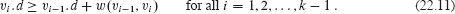

因为`v[k]`.π是通过调用 RELAX(`v[k-1]`, `v[k]`, `w`)改变的，因此我们也有严格不等式  

`v[k].d > v[k-1].d + wv[k-1], v[k]`:

将这个严格不等式与`k - 1`个不等式（22.11）相加，我们得到环`c`周围最短路径估计的总和：

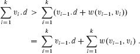

但是 

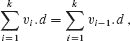

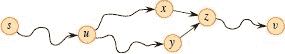

**图 22.9** 显示了从源顶点`s`到顶点`v`的`G[π]`中的简单路径是唯一的。如果`G[π]`包含两条路径`p₁`（`s ⇝ u ⇝ x → z ⇝ v`）和`p₂`（`s ⇝ u ⇝ y → z ⇝ v`），其中`x ≠ y`，那么`z.π = x`和`z.π = y`，这是一个矛盾。

因为每个环`c`中的顶点在每个求和中只出现一次。这个方程意味着

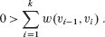

因此，环`c`周围的权重总和为负，这提供了所需的矛盾。

我们现在已经证明`G[π]`是一个有向无环图。为了证明它形成以`s`为根的有根树，只需（参见第 1175 页的练习 B.5-2）证明对于每个顶点`v ∈ V[π]`，在`G[π]`中从`s`到`v`存在唯一简单路径即可。

`V[π]`中的顶点是那些具有非 NIL 值的顶点，再加上`s`。练习 22.5-6 要求您证明从`s`到`V[π]`中的每个顶点存在一条路径。

为了完成引理的证明，我们现在展示对于任意顶点`v ∈ V`[π]，图`G`[π]中从`s`到`v`的简单路径最多只有一条。假设相反情况。也就是说，假设，正如图 22.9 所示，`G`[π]包含从`s`到某个顶点`v`的两条简单路径：`p`[1]，我们将其分解为`s` ⇝ `u` ⇝ `x` → `z` ⇝ `v`，和`p`[2]，我们将其分解为`s` ⇝ `u` ⇝ `y` → `z` ⇝ `v`，其中`x ≠ y`（尽管`u`可能是`s`，`z`可能是`v`）。但是，那么，`z`.π = `x`和`z`.π = `y`，这意味着矛盾，即`x = y`。我们得出结论，`G`[π]包含从`s`到`v`的唯一简单路径，因此`G`[π]形成以`s`为根的有根树。

▪  输出：

现在我们可以展示，如果在一系列松弛步骤之后，所有顶点都被分配了它们真实的最短路径权重，那么前驱子图`G[π]`就是最短路径树。

**引理 22.17（前驱子图属性）**

设`G = (V, E)`是一个带有权重函数`w: E → ℝ`的加权有向图，`s ∈ V`是源顶点，并假设`G`不包含从`s`可达的负权重环。那么，在对`G`进行 `INITIALIZE-SINGLE-SOURCE(G, s)` 调用后，接着对`G`的边进行任意一系列松弛步骤，使得对所有`V`中的`v`，都有`v.d = δ(s, v)`，则前驱子图`G[π]`是以`s`为根的最短路径树。

**证明** 我们必须证明给出在第 608 页的最短路径树的三个属性对`G[π]`成立。为了展示第一个属性，我们必须展示`V[π]`是从`s`可达的顶点集。根据定义，从`s`到`v`的最短路径权重δ(`s`, `v`)是有限的当且仅当`v`是从`s`可达的，因此从`s`可达的顶点正是那些具有有限`d`值的顶点。但是，当且仅当`v`.π ≠ NIL 时，顶点`v ∈ V` − `{s}`才被分配了`v.d`的有限值，因为这两个分配都发生在 RELAX 中。因此，`V[π]`中的顶点正是从`s`可达的顶点。

第二个属性，即`G[π]`形成以`s`为根的有根树，直接由引理 22.16 得出。

因此，我们需要证明最短路径树的最后一个属性：对于每个顶点`v ∈ V`[π]，`G`[π]中的唯一简单路径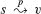是从`s`到`v`在`G`中的最短路径。设`p` = <`v`[0], `v`[1], … , `v[k]`>，其中`v`[0] = `s`且`v[k] = v`。考虑路径`p`中的边(`v`[i−1], `v[i]`)。因为这条边属于`G`[π]，改变`v[i].d`的最后一次松弛必须是这条边。在那次松弛之后，我们有`v[i].d = v`[i−1].`d` + (`v`[i−1], `v[i]`)。随后，进入`v`[i−1]的边可能已经被松弛，导致`v`[i−1].`d`进一步减小，但不会改变`v[i].d`。因此，我们有`v[i].d ≥ v`[i−1].`d + w`(`v`[i−1], `v[i]`)。因此，对于`i = 1, 2, … , k`，我们有`v[i].d` = δ(`s`, `v[i]`)和`v[i].d ≥ v`[i−1].`d + w`(`v`[i−1], `v[i]`)，这两者共同暗示`w`(`v`[i−1], `v[i]`) ≤ δ(`s`, `v[i]`) − δ(`s`, `v`[i−1])。沿着路径`p`求和权重得到

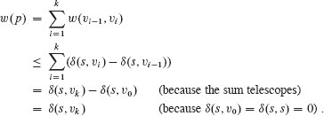

因此，我们有`w(p) ≤ δ(s, v[k])`。由于δ(s, v[k])是从`s`到*v[k]*的任何路径的权重的下界，我们得出`w(p) = δ(s, v[k])`，而`p`是从`s`到`v` = *v[k]*的最短路径。

▪  输出：

**练习**

**`22.5-1`**

给出除了所示之外的图 `22.2` 上的有向图的两个最短路径树。

`22.5-2`  

给出一个带有权重、有向图`G = (V, E)`和权重函数`w : E → ℝ`以及源顶点`s`的示例，使得`G`满足以下属性：对于每条边`(u, v) ∈ E`，存在以`s`为根的包含`(u, v)`的最短路径树，以及另一个以`s`为根的不包含`(u, v)`的最短路径树。

**22.5-3**

修改引理 `22.10` 的证明，以处理最短路径权重为∞或−∞的情况。

**22.5-4**

设`G = (V, E)`为带有源顶点`s`的带权重、有向图，并且让`G`通过 INITIALIZE-SINGLE-SOURCE(`G`, `s`)进行初始化。证明如果一系列松弛操作将`s.π`设置为非 NIL 值，则`G`包含负权重环。

**`22.5-5`**

设`G = (V, E)`为不含负权重边的带权重、有向图。设`s ∈ V`为源顶点，并且假设如果`v ∈ V` − `{s}`可从源`s`到达，则`v.π`可以是`v`在从源`s`到`v`的*任意*最短路径上的前驱，否则为 NIL。给出这样一个图`G`和`π`值的分配的示例，使得在`G[π]`中产生一个环。（根据引理 22.16，这样的分配不能通过一系列松弛操作产生。）

`22.5-6`

设`G = (V, E)`为带有权重、有向图，权重函数`w : E → ℝ`且没有负权重环。设`s ∈ V`为源顶点，并且让`G`通过 INITIALIZE-SINGLE-SOURCE(G, s) 进行初始化。使用归纳法证明对于每个顶点`v ∈ V[π]`，在`G[π]`中存在一条从`s`到`v`的路径，并且这个属性在任何一系列松弛操作中都保持不变。

`22.5-7`

设`G = (V, E)`为不含负权重环的带权重、有向图。设`s ∈ V`为源顶点，并且让`G`通过 INITIALIZE-SINGLE-SOURCE(`G`, `s`)进行初始化证明存在一系列|`V`| − 1 次松弛操作，使得对于所有`v ∈ V`，都有`v.d = δ(s, v)`。

**22.5-8**

设`G`为带有从源顶点`s`可达的负权重环的任意带权重、有向图。展示如何构造`G`的边的无限序列的松弛，使得每次松弛都会导致最短路径估计值的变化。  

**问题**

**22-1     Yen 对 Bellman-Ford 的改进**

Bellman-Ford 算法没有规定每次遍历中松弛边的顺序。考虑以下决定顺序的方法。在第一次遍历之前，为输入图`G = (V, E)`的顶点分配任意线性顺序`v₁`，`v₂`，…，`v[|V|]`。然后将边集`E`划分为`E[f]` ∪ `E[b]`，其中`E[f]` = {(`v[i]`, `v[j]`) ∈ `E` : `i < j`}，`E[b]` = {(`v[i]`, `v[j]`) ∈ `E` : `i > j`}。（假设`G`不包含自环，因此每条边都属于`E[f]`或`E[b]`。）定义`G[f]` = (`V`, `E[f]`)和`G[b]` = (`V`, `E[b]`)。

**a.** 证明`G[f]`是无环的，具有拓扑排序<`v₁，v₂，…，v[|V|]`>，并且`G[b]`是无环的，具有拓扑排序<`v[|V|]，v[|V|-1]，…，v₁`>。

假设 Bellman-Ford 算法的每次遍历都以以下方式松弛边。首先，按顺序访问每个顶点`v₁`，`v₂`，…，`v[|V|]`，松弛离开该顶点的边。然后按顺序访问每个顶点`v[|V|]`，`v[|V|-1]`，…，`v₁`，松弛离开该顶点的边。  

**b.** 证明使用这种方案，如果`G`不包含从源顶点`s`可达的负权重环，则在仅经过⌈|`V`| / 2⌉次边的遍历后，对于所有顶点`v ∈ V`，都有`v.d` = δ(`s`, `v`)。

**c.** 这种方案是否改进了 Bellman-Ford 算法的渐进运行时间？

**`22-2`     嵌套盒子**

一个 `d` 维箱子，其尺寸为 (`x₁`, `x₂`, … , `x[d]`)，**嵌套** 在另一个尺寸为 (`y₁`, `y₂`, … , `y[d]`) 的箱子中，如果存在一个置换 π 在 {1, 2, … , `d`} 上，使得 `x[π(1)] < y₁`, `x[π(2)] < y₂`, … , `x[π(d)] < y[d]`。

**a.** 论证嵌套关系是传递的。

**b.** 描述一种高效的方法来确定一个 `d` 维箱子是否嵌套在另一个箱子中。

**c.** 给定一组 `n` 个 `d` 维箱子 `{B₁, B₂, … , B[n]}`。给出一个高效的算法，找到最长的箱子序列 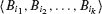，使得 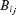 嵌套在 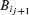 中，对于 `j = 1, 2, … , k` − 1\. 用 `n` 和 `d` 表示算法的运行时间。  

**22-3     套汇**

**套汇** 是利用货币汇率的差异将一单位货币转换为多于一单位相同货币的行为。例如，假设一美元可以购买 64 印度卢比，一印度卢比可以购买 1:8 日元，一日元可以购买 0:009 美元。通过转换货币，交易员可以以 1 美元开始，购买 64 × 1.8 × 0.009 = 1.0368 美元，从而获利 3.68%。

假设您有 `n` 种货币 `c₁`, `c₂`, … , `c[n]` 和一个 `n × n` 的汇率表 `R`，其中 1 单位货币 `c[i]` 可以购买 `R[i, j]` 单位货币 `c[j]`。

**a.** 给出一个高效的算法，以确定是否存在一系列货币 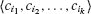，使得

`R[i₁, i₂] · R[i₂, i[3]] … R[i[k-1], i[k]] · R[i[k], i₁] > 1`.

分析算法的运行时间。

**b.** 给出一个高效的算法，如果存在这样的序列，则打印出来。分析算法的运行时间。

**22-4     Gabow's scaling algorithm for single-source shortest paths**

一个`缩放`算法通过最初仅考虑每个相关输入值的最高位，例如边权重，来解决问题，假设这些值是非负整数。然后，算法通过查看两个最高位来完善初始解决方案。它逐渐查看更多高位，每次完善解决方案，直到检查所有位并计算出正确的解决方案。

这个问题考察了通过缩放边权重计算从单个源到最短路径的算法。输入是一个有向图 `G = (V, E)`，具有非负整数边权重 `w`。设 `W = max {w(u, v) : (u, v) ∈ E}` 是任何边的最大权重。在这个问题中，您将开发一个在 `O(E lg W)` 时间内运行的算法。假设所有顶点都可以从源点到达。

缩放算法逐个揭示边权重的二进制表示中的位，从最高有效位到最低有效位。具体来说，让`k` = ⌈lg(`W` + 1)⌉是`W`的二进制表示中的位数，对于`i = 1, 2, … , k`，让`w[i]`(`u`,`v`) = ⌊`w`(`u`,`v`)/2^(`k`–`i`)⌋。也就是说，`w[i]` (`u`, `v`)是`w`(`u`, `v`)的`i`个最高有效位的“缩小”版本。（因此，对于所有(`u`, `v`) ∈ `E`，`w[k]`(`u`, `v`) = `w`(`u`, `v`)。）例如，如果`k = 5` 且`w`(`u`, `v`) = 25，其二进制表示为<11001>，那么`w`3 = <110> = 6。同样，如果`k = 5` 且`w`(`u`, `v`) = <00100> = 4，则`w`4 = <0010> = 2。将δ`i`定义为使用权重函数`w[i]`从顶点`u`到顶点`v`的最短路径权重，以便对于所有`u`, `v ∈ V`，δ`k` = δ(`u`, `v`)。对于给定的源顶点`s`，缩放算法首先计算所有`v ∈ V`的最短路径权重δ1，然后计算所有`v ∈ V`的δ2，依此类推，直到计算所有`v ∈ V`的δ`k`。始终假设|`E`| ≥ |`V`| − 1。你将展示如何在`O`(`E`)时间内从δ[`i`−1]计算δ[`i`]，使得整个算法花费`O`(`kE`) = `O`(`E` lg `W`)时间。

**a.** 假设对于所有顶点`v ∈ V`，我们有δ(`s`, `v`) ≤ |`E`|。展示如何在`O(E)`时间内计算所有`v ∈ V`的δ(`s`, `v`)。

**b.** 展示如何在`O(E)`时间内计算所有`v ∈ V`的δ1。

现在专注于从`δ[i-1]`计算`δ[i]`。

**c.** 证明对于`i = 2`, 3, … , `k`，要么`wi = 2``w[i-1]`，要么`wi = 2``w[i-1]` + 1。然后证明

`2δ`i`−1 ≤ δ`i` ≤ 2δ`i`−1 + |`V`| − 1`  

对于所有`v ∈ V`。

**d.** 定义，对于`i = 2, 3, … , k`和所有`(u, v) ∈ E`，

`ŵi = wi + 2δi−1 - 2δi−1。`

证明对于`i = 2, 3, … , k`和所有`u, v ∈ V`，边`(u, v)`的“重新加权”值`ŵi`是非负整数。

**e.** 现在将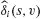定义为使用权重函数`ŵ[i]`从`s`到`v`的最短路径权重。证明对于`i = 2, 3, … , k`和所有`v ∈ V`，  

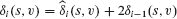

并且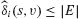。

**f.** 展示如何在`O(E)`时间内从δ`i`−1 计算所有`v ∈ V`的δ`i`。得出结论，你可以在`O(E lg W)`时间内计算所有`v ∈ V`的δ(`s`, `v`)。

**22-5     卡普的最小平均权重循环算法**

让`G = (V, E)`是具有权重函数`w: E → ℝ`的有向图，让`n = |V|`。我们将边集`E`中的边循环`c = <e₁, e₂, … , e[k]>`的**平均权重**定义为

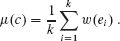

让`μ* = min {μ(c)：c 是 G 中的有向循环}`。我们称满足μ(c) = μ*的循环 c 为**最小平均权重循环**。这个问题探讨了一个计算μ*的高效算法。

不失一般性地假设每个顶点`v ∈ V`都可以从源顶点`s ∈ V`到达。让δ(`s`, `v`)是从`s`到`v`的最短路径的权重，让δ`k`是由*恰好 k*条边组成的从`s`到`v`的最短路径的权重。如果从`s`到`v`没有恰好`k`条边的路径，则δ`k` = ∞。  

**a.** 展示如果`μ* = 0`，则`G`不包含负权重循环且对于所有`v ∈ V`，有`δ(s, v) = min {δ`k`：0 ≤ `k` ≤ n − 1}`。

**b.** 展示如果μ`* = 0`，则

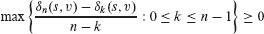

对于所有顶点`v ∈ V`。（提示：使用(a)部分的两个属性。）

**c.** 让 `c` 是一个 0 权重循环，让 `u` 和 `v` 是循环上的任意两个顶点。假设 μ = 0 并且沿着循环从 `u` 到 `v` 的简单路径的权重为 `x`。证明 δ(`s`, `v`) = δ(`s`, `u`) + `x`。(*提示:* 沿着循环从 `v` 到 `u` 的简单路径的权重为 −`x`)。

**d.** 证明如果 `μ* = 0`，则在每个最小平均权重循环中都存在一个顶点 `v`，使得

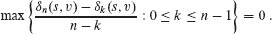

(*提示:* 展示如何将最短路径延伸到沿着循环到达最小平均权重循环上的任意顶点，以便形成到达循环上下一个顶点的最短路径。)

**e.** 证明如果 `μ* = 0`，则 

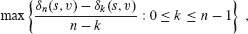

对所有顶点 `v ∈ V`，等于 0。

**f.** 证明如果您将 `G` 的每条边的权重增加一个常数 `t`，则 μ* 会增加 `t`。利用这个事实证明 μ* 等于

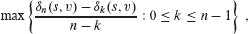

对所有顶点 `v ∈ V`。

**g.** 给出一个 `O(VE)` 时间的算法来计算 μ*。

**22-6     双调最短路径**

如果一个序列单调递增然后单调递减，或者通过循环移位单调递增然后单调递减，则称为`**双调**`。例如序列 <1, 4, 6, 8, 3, −2>，<9, 2, −4, −10, −5> 和 <1, 2, 3, 4> 是双调的，但序列 <1, 3, 12, 4, 2, 10> 不是双调的。（有关双调欧几里德旅行推销员问题，请参见第 407 页的问题 14-3。）

假设给定一个带有权重函数 `w : E → ℝ` 的有向图 `G = (V, E)`, 其中所有边的权重都是唯一的，并且您希望从源顶点 `s` 找到单源最短路径。您还获得了额外的信息：对于每个顶点 `v ∈ V`，从 `s` 到 `v` 的任何最短路径上的边的权重形成一个双调序列。

给出您能够解决此问题的最有效算法，并分析其运行时间。

**章节注释**

最短路径问题有一个悠久的历史，Schrijver 的一篇文章中很好地描述了这一点[400]。他将反复执行边松弛的一般思想归功于 Ford[148]。Dijkstra 算法[116]于 1959 年出现，但没有提及优先队列。Bellman-Ford 算法基于 Bellman[45] 和 Ford[149] 的单独算法。相同的算法也归因于 Moore[334]。Bellman 描述了最短路径与差分约束的关系。Lawler[276]描述了有向无环图中最短路径的线性时间算法，他认为这是传统知识的一部分。  

当边的权重相对较小且为非负整数时，使用需要整数键的最小优先队列会导致更有效的算法，并依赖于 Dijkstra 算法中 `EXTRACT-MIN` 调用返回的值序列随时间单调递增。Ahuja, Mehlhorn, Orlin 和 Tarjan [8] 给出了一种算法，该算法在具有非负边权重的图上运行时间为 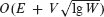，其中 `W` 是图中任意边的最大权重。最佳界限由 Thorup [436] 给出，他提供了一种在 `O`(`E` lg lg `V`) 时间内运行的算法，以及由 Raman [375] 给出的一种在 `O`(`E + V` min {(lg `V`)^(1/3+ε), (lg `W`)^(1/4+ε)}) 时间内运行的算法。这两种算法使用取决于底层机器的字大小的空间量。尽管使用的空间量可能随输入大小而无限增长，但可以通过随机哈希减少到与输入大小线性相关。  

对于具有整数权重的无向图，Thorup[435]提供了一种在`O(V + E)`时间内运行的单源最短路径算法。与前一段提到的算法不同，EXTRACT-MIN 调用返回的值序列随时间不是单调递增的，因此这个算法不是 Dijkstra 算法的实现。Pettie 和 Ramachandran[357]消除了对无向图上整数权重的限制。他们的算法包括一个预处理阶段，然后是对特定源顶点的查询。预处理需要`O(MST(V, E) + min {V lg V, V lg lg r})`时间，其中`MST(V, E)`是计算最小生成树的时间，`r`是最大边权重与最小边权重的比率。预处理后，每个查询需要`Θ(1)`时间，其中`Θ`是 Ackermann 函数的倒数。 （有关 Ackermann 函数及其倒数的简要讨论，请参阅第十九章的章节注释。）  

对于具有负边权重的图，由 Gabow 和 Tarjan 提出的算法[167]在`O(art)`时间内运行，Goldberg 提出的算法[186]在`O(art)`时间内运行，其中`W` = max {|`w`(`u`, `v`)| : (`u`, `v`) ∈ `E`}。也有一些基于连续优化和电流的方法取得了一些进展。Cohen 等人[98]提供了这样一种随机算法，其预期运行时间为`O(Õ(E^(10/7) lg W))`（有关Õ符号的定义，请参见第 73 页的问题 3-6）。还有一种基于快速矩阵乘法的伪多项式时间算法。Sankowski[394]和 Yuster 以及 Zwick[465]设计了一种最短路径算法，其运行时间为`O(Õ(W V^ω))`，其中两个`n`×`n`矩阵可以在`O(n^ω)`时间内相乘，对于稠密图上小值的`W`，这比先前提到的算法更快。  

Cherkassky，Goldberg 和 Radzik[89]进行了大量实验，比较了各种最短路径算法。最短路径算法广泛应用于实时导航和路径规划应用程序。这些算法通常基于 Dijkstra 算法，利用许多巧妙的想法，能够在几秒钟内计算出具有数百万个顶点和边的网络的最短路径。Bast 等人[36]对这些发展进行了调查。

¹ 也许奇怪的是，“松弛”这个术语用于指紧束上限的操作。这个术语的使用是历史性的。松弛步骤的结果可以被视为对约束`v.d ≤ u.d + w(u, v)`的松弛，根据三角不等式（第 633 页的引理 22.10），如果`u.d = δ(s, u)`和`v.d = δ(s, v)`必须满足。也就是说，如果`v.d ≤ u.d + w(u, v)`，那么没有“压力”来满足这个约束，所以约束被“松弛”了。  

² “PERT”是“程序评估和审查技术”的缩写。
