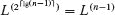
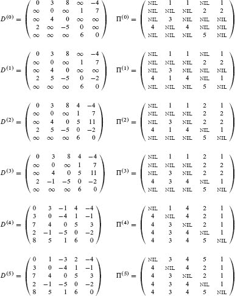

**`23`        全对最短路径**

在本章中，我们转向在图中查找所有顶点对之间的最短路径的问题。这个问题的一个经典应用是计算道路地图上所有城市对之间的距离表。也许经典，但并不是查找`所有`顶点对之间最短路径的真正应用。毕竟，将道路地图建模为图形式，每个道路交叉口有一个顶点，道路连接交叉口的地方有一条边。地图上的城市间距离表可能包括 100 个城市的距离，但美国大约有 300,000 个信号控制的交叉口¹，还有更多无控制的交叉口。  

全对最短路径的一个合法应用是确定网络的***直径***：所有最短路径中的最长路径。如果一个有向图模拟通信网络，边的权重表示消息在通信链路上传输所需的时间，那么直径给出了网络中消息可能的最长传输时间。

如同第二十二章中一样，输入是一个带权重的有向图`G = (V, E)`，具有将边映射到实值权重的权重函数`w : E → ℝ`。现在的目标是找到对于每对顶点`u, v ∈ V`，从`u`到`v`的最短（最小权重）路径，其中路径的权重是其组成边的权重之和。对于全对问题，输出通常采用表格形式，其中`u`行和`v`列中的条目是从`u`到`v`的最短路径的权重。

你可以通过运行单源最短路径算法|`V`|次来解决全对最短路径问题，每次以一个顶点作为源。如果所有边的权重都是非负的，你可以使用 Dijkstra 算法。如果你用线性数组实现最小优先队列，运行时间为`O(V³ + VE)`，即`O(V³)`。二进制最小堆实现的最小优先队列的运行时间为`O(V(V + E) lg V)`。如果|`E`| = Ω(`V`)，运行时间变为`O(VE lg V)`，在图稀疏时比`O(V³)`更快。另外，你可以用斐波那契堆实现最小优先队列，运行时间为`O(V² lg V + VE)`。

如果图中包含负权边，Dijkstra 算法无法工作，但你可以从每个顶点运行较慢的 Bellman-Ford 算法一次。结果的运行时间为`O(V²*E)`，在稠密图中为`O(V⁴)`。本章展示了如何保证更好的渐近运行时间。它还探讨了全对最短路径问题与矩阵乘法的关系。

与单源算法不同，假设图的邻接列表表示，本章大部分算法使用邻接矩阵表示图。（Johnson 算法用于稀疏图，在第 23.3 节中使用邻接列表。）为方便起见，我们假设顶点编号为 1, 2, … , |`V`|，因此输入是一个`n` × `n`矩阵`W` = (`w[ij]`)，表示`n`顶点有向图`G` = (`V`, `E`)的边权重，其中

图中可能包含负权边，但我们暂时假设输入图中不包含负权环。

本章介绍的全对最短路径算法的表格输出是一个`n × n`矩阵。输出矩阵的`(i, j)`条目包含δ(`i, j`)，即从顶点`i`到顶点`j`的最短路径权重，如第二十二章中所示。

解决全对最短路径问题的完整解决方案不仅包括最短路径权重，还包括一个`前任矩阵` Π = (π[ij])，其中如果 `i` = `j` 或者从 `i` 到 `j` 没有路径，则 π[ij] 为 NIL，否则 π[ij] 是从 `i` 到 `j` 的某条最短路径上 `j` 的前任。正如来自第二十二章的前任子图 `G[π]` 是给定源顶点的最短路径树一样，Π 矩阵的第 `i` 行诱导的子图应该是以 `i` 为根的最短路径树。对于每个顶点 `i` ∈ `V`，`i` 的`前任子图` `G` 是 `i` 的前任子图 `G[π,i]` = (`V`[π,`i`], `E`[π,`i`])，其中 

| `V[π,i]` | = | {`j ∈ V : π[ij] ≠ NIL`} ∪ {`i`}, |   |
| --- | --- | --- |
| `E[π,i]` | = | {(π[ij], j) : j ∈ V[π,i] − {i}}. |

如果 `G[π,i]` 是最短路径树，则下一页的 PRINT-ALL-PAIRS-SHORTEST-PATH，这是来自第二十章的 PRINT-PATH 程序的修改版本，打印从顶点 `i` 到顶点 `j` 的最短路径。

为了突出本章中全对算法的基本特征，我们不会像在第二十二章中处理前任子图那样广泛地涵盖如何计算前任矩阵及其属性。一些练习涵盖了基础知识。

`PRINT-ALL-PAIRS-SHORTEST-PATH(Π, i, j)`  输出：

| 1 | **如果** `i` == `j` |
| --- | --- |
| `---` | `---` |
| 2 | 输出 `i` |  输出： |
| `3` | **否则** 如果 `π[ij]` == NIL |
| `4` | 输出“从” `i` “到” `j` “不存在路径” |  |
| `5` | **否则** `PRINT-ALL-PAIRS-SHORTEST-PATH(Π, i, π[ij])` |
| `6` | 输出 `j` |  输出： |

**章节大纲**

第 23.1 节介绍了一个基于矩阵乘法的动态规划算法，用于解决全对最短路径问题。 “重复平方”技术使得运行时间为 `Θ(V³ lg V)`。第 23.2 节提供了另一个动态规划算法，弗洛伊德-沃舍尔算法，其运行时间为 `Θ(V³)`。第 23.2 节还涵盖了查找有向图的传递闭包问题，这与全对最短路径问题有关。最后，第 23.3 节介绍了约翰逊算法，它以 `O(V² lg V + VE)` 的时间解决了全对最短路径问题，并且对于大型稀疏图是一个不错的选择。

在继续之前，我们需要为邻接矩阵表示建立一些约定。首先，我们通常假设输入图 `G = (V, E)` 有 `n` 个顶点，即 `n = |V|`。其次，我们使用大写字母表示矩阵，如 `W`、`L` 或 `D`，并用带下标的小写字母表示它们的各个元素，如 `w[ij]`、`l[ij]` 或 `d[ij]`。最后，一些矩阵具有带括号上标的形式，如  或 ，表示迭代。

**23.1    最短路径和矩阵乘法**

本节介绍了一个动态规划算法，用于解决有向图 `G = (V, E)` 上的全对最短路径问题。动态规划的每个主要循环调用类似于矩阵乘法的操作，使得算法看起来像是重复的矩阵乘法。我们将首先为全对最短路径问题开发一个 Θ(`V⁴`) 时间复杂度的算法，然后将其运行时间改进为 Θ(`V³ lg V`)。

在继续之前，让我们简要回顾一下第十四章中为开发动态规划算法给出的步骤：

1.  描述最优解的结构。

1.  递归地定义最优解的值。

1.  以自底向上的方式计算最优解的值。

我们将第四步——从计算信息构造最优解——留给练习。

**最短路径的结构**

让我们从描述最优解的结构开始。引理 22.1 告诉我们，最短路径的所有子路径都是最短路径。考虑从顶点`i`到顶点`j`的最短路径`p`，假设`p`包含最多`r`条边。假设没有负权重环路，则`r`是有限的。如果`i`= `j`，那么`p`的权重为 0 且没有边。如果顶点`i`和`j`不同，则将路径`p`分解为`p′`，其中路径`p′`现在包含最多`r`−1 条边。引理 22.1 表示`p′`是从`i`到`k`的最短路径，因此δ(`i`, `j`) = δ(`i`, `k`) + `w[kj]`。

**所有对最短路径问题的递归解**

现在，设``为从顶点`i`到顶点`j`的任何包含最多`r`条边的路径的最小权重。当`r`=0 时，如果`i`=`j`，则从`i`到`j`的最短路径没有边，得到

对于`r`≥1，实现从`i`到`j`的最多包含`r`条边的最小权重路径的一种方法是采用包含最多`r`−1 条边的路径，因此``。另一种方法是从`i`到某个顶点`k`的最多`r`−1 条边的路径，然后再取边(`k`, `j`)，因此``。因此，要检查从`i`到`j`的最多包含`r`条边的路径，尝试所有可能的`j`的前驱`k`，给出递归定义

最后一个等式来自于观察`w[jj] = 0`对所有`j`成立。

实际的最短路径权重δ(`i`, `j`)是多少？如果图中不包含负权重环路，则每当δ(`i`, `j`) < ∞时，从顶点`i`到顶点`j`的最短路径就是简单的。（从`i`到`j`的路径`p`如果不简单，则包含一个环路。由于每个环路的权重是非负的，将路径中的所有环路移除后，留下的简单路径的权重不会超过`p`的权重。）因为任何简单路径最多包含`n`−1 条边，从顶点`i`到顶点`j`的路径如果超过`n`−1 条边，则不可能比最短路径的权重更低。因此，实际的最短路径权重由以下给出

**`自底向上计算最短路径权重`**

以矩阵`W = (w[ij])`为输入，让我们看看如何计算一系列矩阵`L⁰, L¹, … , L^((n-1))`，其中对于`r`=0, 1, … , `n`-1。初始矩阵是由方程(23.2)给出的`L⁰`。最终矩阵`L^((n-1))`包含实际的最短路径权重。

该算法的核心是实现方程(`23.3`)的过程 EXTEND-SHORTEST-PATHS，用于所有`i`和`j`。四个输入是迄今为止计算的矩阵`L^(r-1)`；边权重矩阵`W`；将保存计算结果的输出矩阵`L^(r)`，在调用该过程之前，其所有元素都初始化为∞；以及顶点数`n`。上标`r`和`r`-1 有助于使伪代码与方程(`23.3`)的对应关系明显，但它们在伪代码中并不起实际作用。该过程通过再增加一条边扩展迄今为止计算的最短路径，生成迄今为止计算的矩阵`L^(r)`的最短路径权重。由于存在三个嵌套的`for`循环，其运行时间为Θ(`n`³)。

扩展最短路径(`L^(r-1)`, `W`, `L^(r)`, `n`)

| 1 | // 假设`L^(r)`的元素初始化为∞。 |
| --- | --- |
| `2` | **对于** `i` = `1` **到** `n` |
| 3 | **对于** j = 1 **到** n |
| 4 | **对于** k = 1 **到** n |
| `5` |  |

现在让我们了解这个计算与矩阵乘法的关系。考虑如何计算两个 `n × n` 矩阵 `A` 和 `B` 的矩阵积 `C = A · B`。MATRIX-MULTIPLY 在第 81 页使用的直接方法使用三重嵌套循环来实现方程式 (4.1)，我们在此为方便起见重复一次：

对于 `i`, `j` = 1, 2, … , `n`。现在进行替换  

| `l^(r-1)` |  →  | `a`, |
| --- | --- | --- |
| `w` |  →  | `b`, |  |
| `l^(r)` |  →  | `c`, |
| `min` |  →  | `+,` |   |
| + |  →  | . |

在方程式 `(23.3)` 中。您得到方程式 `(23.5)`！对 `EXTEND-SHORTEST-PATHS` 进行这些更改，并将 ∞（min 的单位元）替换为 0（+ 的单位元），得到了过程 `MATRIX-MULTIPLY`。我们可以看到过程 `EXTEND-SHORTEST-PATHS(L^(r−1), W, L^(r), n)` 使用这种不寻常的矩阵乘法定义计算矩阵“乘积” `L^(r) = L^(r−1)。W。²`  

因此，我们可以通过反复相乘矩阵来解决全对最短路径问题。每一步都使用 `EXTEND-SHORTEST-PATHS(L^(r-1), W, L^(r), n)` 来执行矩阵乘法，将迄今为止计算的最短路径权重延伸一个边。从矩阵 `L⁰` 开始，我们产生以下序列的 `n - 1` 个矩阵，对应于 `W` 的幂：  

| `L¹` | = | `L⁰` · `W` | = | `W¹`, |
| --- | --- | --- | --- | --- |
| `L²` | = | `L¹` · `W` | = | `W²`, |
| `L³` | = | `L²` · `W` | = | `W³`, |   |
|  |  | ⋮ |  |  |
| `L^((n-1))` | = | `L^((n-2)) · W` | = | `W^(n-1).` |

最后，矩阵 `L^(n-1) = W^(n-1)` 包含最短路径权重。  

下一页的 SLOW-APSP 过程在 Θ(`n⁴`) 时间内计算这个序列。该过程将 `n` × `n` 矩阵 `W` 和 `L`^((0)) 作为输入，以及 `n`。图 23.1 说明了其操作。伪代码使用两个 `n` × `n` 矩阵 `L` 和 `M` 来存储 `W` 的幂，每次迭代计算 `M` = `L` · `W`。第 2 行初始化 `L` = `L`^((0))。对于每次迭代 `r`，第 4 行初始化 `M` = ∞，其中在这种情况下，∞ 是一个标量 ∞ 值的矩阵。第 `r` 次迭代从不变式 `L` = `L`^((`r`−1)) = `W`^(`r`−1) 开始。第 6 行计算 `M` = `L` · `W` = `L`^((`r`−1)) · `W` = `W`^(`r`−1) · `W` = `W`^(`r`) = `L`^((`r`))，以便通过第 7 行恢复不变式，设置 `L` = `M`，以便下一次迭代。最后，返回最短路径权重的矩阵 `L` = `L`^((`n`−1)) = `W`^(`n`−1)。第 2、4 和 7 行对 `n` × `n` 矩阵的赋值隐含地运行双重嵌套循环，每次赋值需要 Θ(`n`²) 的时间。`n` − 1 次 EXTEND-SHORTEST-PATHS 的调用，每次需要 Θ(`n³`) 的时间，主导了计算，产生了总运行时间为 Θ(`n⁴`)。

**图 23.1** 一个有向图和由 SLOW-APSP 计算的矩阵序列 `L^(r)`。您可能想要验证 `L⁵`，定义为 `L⁴ · W`，是否等于 `L⁴`，因此对于所有 `r ≥ 4`，`L^(r)` = `L⁴`。

`SLOW-APSP(W, L⁰, n)`

| 1 | 让 `L = (l[ij])` 和 `M = (m[ij])` 成为新的 `n` × `n` 矩阵 |
| --- | --- |
| `2` | `L` = `L`^((0)) |  |
| `3` | **对于** `r` = `1` **到** `n` − `1` |
| \| 4 \| `M = ∞`       // 初始化 `M` |
| `5` | // 计算矩阵“乘积” `M = L · W`。 |   |
| 6 | EXTEND-SHORTEST-PATHS(L, W, M, n) |
| 7 | `L = M` |
| \| `8` \| **返回** `L` \|  |

**`改进运行时间`**

请记住，目标不是计算`所有`的`L^r`矩阵：只有矩阵`L^(n-1)`才重要。回想在没有负权重环路的情况下，方程(23.4)意味着对于所有整数 r ≥ n − 1，`L^r` = `L^(n-1)`。正如传统矩阵乘法是可结合的，通过 EXTEND-SHORTEST-PATHS 过程定义的矩阵乘法也是可结合的（参见练习 23.1-4）。实际上，我们可以通过***重复平方法***只用⌈lg(n – 1)⌉次矩阵乘法计算`L^(n-1)`：

由于 `2^(⌈lg(n - 1)⌉) ≥ n - 1`，最终的乘积为。  

FASTER-APSP 过程实现了这一思想。它只需要`n` × `n`矩阵`W`和大小`n`作为输入。行 4-8 的`while`循环的每次迭代都以不变量`L` = `W^r`开始，使用 EXTEND-SHORTEST-PATHS 对其进行平方，得到矩阵`M` = `L²` = (`W^r`)² = `W^(2r)`。在每次迭代结束时，`r`的值加倍，下一次迭代的`L`变为`M`，恢复不变量。当`r` ≥ `n` − 1 时退出循环，过程通过方程(23.4)返回`L` = `W^r` = `L^r` = `L^(n−1)`。与 SLOW-APSP 一样，行 2、5 和 8 中对`n` × `n`矩阵的赋值隐含地运行双重嵌套循环，每次赋值需要Θ(`n²`)时间。  

`FASTER-APSP(W, n)`

| 1 | 令`L`和`M`为新的`n` × `n`矩阵 |
| --- | --- |
| `2` | `L` = `W` |  |
| 3 | `r = 1` |
| \| 4 \| **当** `r < n - 1` **时** \| |
| 5 | `M` = ∞ | // 初始化 M |
| 6 | EXTEND-SHORTEST-PATHS(`L`, `L`, `M`, `n`) | // 计算`M` = `L`² |   |
| 7 | `r` = 2`r` |
| `8` | `L` = `M` | // 准备下一次迭代 |
| \| 9 \| **返回** `L` \| |

因为每个`⌈lg(n - 1)⌉`次矩阵乘法需要Θ(n³)时间，所以 FASTER-APSP 的运行时间为Θ(n³ lg n)。代码紧凑，不包含复杂的数据结构，因此Θ-符号中隐藏的常数很小。

**练习**

`23.1-1`

在加权有向图`图 23.2`上运行 `SLOW-APSP` 算法，展示循环的每次迭代所得的矩阵。然后对 `FASTER-APSP` 做同样的操作。

**图 23.2** 用于练习 `23.1-1`、`23.2-1` 和 `23.3-1` 的加权有向图。

***`23.1-2`***

为什么对于 SLOW-APSP 和 FASTER-APSP 来说，`w[ii]` = 0 对于`i` = 1, 2, …, `n`很方便？

***23.1-3***  

矩阵

最短路径算法中使用的矩阵乘法与常规矩阵乘法中的哪些部分对应？

***23.1-4***

展示由 `EXTEND-SHORTEST-PATHS` 定义的矩阵乘法是可结合的。

`23.1-5`  

展示如何将单源最短路径问题表示为矩阵和向量的乘积。描述评估此乘积对应于类似 Bellman-Ford 算法的过程（参见第 `22.1` 节）。

***23.1-6***

论证在 SLOW-APSP 中我们不需要矩阵`M`，因为通过用`L`替换`M`并省略初始化`M`，代码仍然可以正确运行。（*提示*：将 EXTEND-SHORTEST-PATHS 的第 5 行与第 610 页上的 RELAX 联系起来。）在 FASTER-APSP 中我们需要矩阵`M`吗？

`23.1-7`

假设您还想在本节算法中计算最短路径上的顶点。展示如何在`O(n³)`时间内从完成的最短路径权重矩阵`L`中计算前驱矩阵`Π`。

***`23.1-8`***

除了计算最短路径权重的矩阵外，还可以计算最短路径上的顶点。将``定义为从顶点`i`到顶点`j`的最小权重路径上顶点`j`的前驱，其中最多包含`r`条边。修改 EXTEND-SHORTEST-PATHS 和 SLOW-APSP 过程，以在计算矩阵`Π¹`、`Π²`、…、`Π^((n-1))`的同时计算矩阵`L¹`、`L²`、…、`L^((n-1))`。  

***`23.1-9`***

修改 `FASTER-APSP`，使其能够确定图中是否包含负权重环路。

`23.1-10`

给出一种有效的算法，用于在图中找到最短负权重循环的长度（边数）。

**`23.2    Floyd-Warshall 算法`**

在本节中，我们已经看到了解决所有对最短路径问题的一个动态规划解决方案，现在我们将看到另一个：`Floyd-Warshall 算法`，其运行时间为Θ(V³)。与之前一样，可能存在负权重边，但不存在负权重循环。与第 23.1 节一样，我们通过遵循动态规划过程来开发算法。在研究结果算法后，我们提出了一种类似的方法，用于找到有向图的传递闭包。

**最短路径的结构**

在 Floyd-Warshall 算法中，我们对最短路径的结构进行了不同的刻画，与我们在第 23.1 节中的刻画方式不同。Floyd-Warshall 算法考虑最短路径的中间顶点，其中简单路径`p` = <`v[1]`, `v[2]`, … , `v[l]`>的***中间***顶点是除了`v[1]`或`v[l]`之外的路径`p`的任何顶点，即集合{`v[2]`, `v[3]`, … , `v[l−1]`}中的任何顶点。

Floyd-Warshall 算法依赖于以下观察。将`G`的顶点编号为`V` = {1, 2, … , `n`}，为某个 1 ≤ `k` ≤ `n`取一个顶点子集{1, 2, … , `k`}。对于`V`中的任意一对顶点`i`、`j`，考虑所有从`i`到`j`的路径，其中所有中间顶点都来自{1, 2, … , `k`}，并让`p`是其中的最小权重路径。（路径`p`是简单的。）Floyd-Warshall 算法利用了路径`p`与从`i`到`j`的最短路径之间的关系，其中所有中间顶点都在集合{1, 2, … , `k` − 1}中。这种关系的细节取决于`k`是否是路径`p`的中间顶点。

**图 23.3** Floyd-Warshall 算法使用的最优子结构。路径`p`是从顶点`i`到顶点`j`的最短路径，`k`是`p`的最高编号中间顶点。路径`p[1]`是从顶点`i`到顶点`k`的部分路径，其中所有中间顶点都在集合{1, 2, … , `k` − 1}中。对于从顶点`k`到顶点`j`的路径`p[2]`也是如此。

+   如果`k`不是路径`p`的中间顶点，则路径`p`的所有中间顶点都属于集合{1, 2, … , `k` − 1}。因此，从顶点`i`到顶点`j`的最短路径，其中所有中间顶点都在集合{1, 2, … , `k` − 1}中，也是从`i`到`j`的最短路径，其中所有中间顶点都在集合{1, 2, … , `k`}中。  

+   如果`k`是路径`p`的中间顶点，则将`p`分解为，如图 23.3 所示。根据引理 22.1，`p[1]`是从`i`到`k`的最短路径，其中所有中间顶点都在集合{1, 2, … , `k`}中。事实上，我们可以做出稍微更强的陈述。因为顶点`k`不是路径`p[1]`的*中间*顶点，所以`p[1]`的所有中间顶点都属于集合{1, 2, … , `k` − 1}。因此`p[1]`是从`i`到`k`的最短路径，其中所有中间顶点都在集合{1, 2, … , `k` − 1}中。同样，`p[2]`是从顶点`k`到顶点`j`的最短路径，其中所有中间顶点都在集合{1, 2, … , `k` − 1}中。

**所有对最短路径问题的递归解决方案**

上述观察结果提出了一个与第 23.1 节中不同的最短路径估计的递归公式。设 `art` 为从顶点 `i` 到顶点 `j` 的最短路径的权重，其中所有中间顶点属于集合 {1, 2, … , `k`}。当 `k` = 0 时，从顶点 `i` 到顶点 `j` 的路径没有任何高于 0 的中间顶点。这样的路径最多有一条边，因此 `art`。根据上述讨论，通过以下递归定义 `art`，  

因为对于任何路径，所有中间顶点都属于集合 {1, 2, … , `n`}，矩阵 `` 给出最终答案：对于所有 `i`, `j` ∈ `V`，``。

**自底向上计算最短路径权重**

根据递推式 (`23.6`)，自底向上过程 FLOYD-WARSHALL 按照 `k` 值递增的顺序计算值 。其输入是一个如方程 (`23.1`) 中定义的 `n` × `n` 矩阵 `W`。该过程返回最短路径权重矩阵 `D`^((`n`))。图 23.4 展示了 Floyd-Warshall 算法计算的图中的矩阵 `D`^((`k`))。

`FLOYD-WARSHALL(W, n)`

| 1 | `D^((0)) = W` |
| --- | --- |
| `---` | `---` |
| `2` | **对于** `k` = `1` **到** `n` |   |
| `3` | 令  为一个新的 `n × n` 矩阵 |   |
| 4 | **对于** `i` = 1 **到** `n` |   |
| 5 | **对于** `j` = 1 **到** `n` |
| `6` |  |   |
| `7` | **返回** `D^(n)` |

Floyd-Warshall 算法的运行时间由第 2–6 行的三重嵌套 `for` 循环决定。因为每次执行第 6 行都需要 `O(1)` 的时间，所以该算法的运行时间为 Θ(`n³`)。就像第 23.1 节中的最终算法一样，代码很紧凑，没有复杂的数据结构，因此 Θ-符号中的常数很小。因此，即使对于中等规模的输入图，Floyd-Warshall 算法也非常实用。

`构建最短路径`

Floyd-Warshall 算法有多种不同的构建最短路径的方法。一种方法是计算最短路径权重矩阵 `D`，然后从 `D` 矩阵构建前驱矩阵 Π。练习 23.1-7 要求您实现此方法，使其在 `O(n³)` 时间内运行。给定前驱矩阵 Π，PRINT-ALL-PAIRS-SHORTEST-PATH 程序打印给定最短路径上的顶点。

或者，可以在算法计算矩阵 `D⁰`, `D¹`, … , `D^((n))` 的同时计算前驱矩阵…。具体来说，计算一个矩阵序列 `Π⁰`, `Π¹`, … , `Π^((n))`，其中 `Π = Π^((n))`， 是顶点 `i` 到顶点 `j` 的最短路径上顶点 `k` 的前驱，其中所有中间顶点都在集合 {1, 2, … , `k`} 中。

**图 23.4** Floyd-Warshall 算法计算的矩阵序列 `D^(k)` 和 `Π^(k)`，对应于图 23.1 中的图。

这里是  的递归公式。当 `k` = 0 时，从 `i` 到 `j` 的最短路径没有任何中间顶点，因此

对于 `k` ≥ 1，如果路径以 `k` 作为中间顶点，即路径为 `i` ⇝ `k` ⇝ `j`，其中 `k` ≠ `j`，则选择此路径上 `j` 的前驱与从 `k` 到 `j` 的最短路径上所有中间顶点在集合 {1, 2, … , `k` − 1} 中选择的相同顶点。否则，当从 `i` 到 `j` 的路径不以 `k` 作为中间顶点时，选择 `j` 的前驱与从 `i` 到 `j` 的最短路径上所有中间顶点在集合 {1, 2, … , `k` − 1} 中选择的相同前驱。形式上，对于 `k` ≥ 1，

练习 23.2-3 要求您展示如何将`Π^(k)`矩阵计算整合到 FLOYD-WARSHALL 过程中。图 23.4 展示了生成算法为图 23.1 的图计算的Π^(k)矩阵序列。该练习还要求更困难的任务，即证明前驱子图`G[π,i]`是以`i`为根的最短路径树。练习 23.2-7 要求另一种重建最短路径的方法。

**`有向图的传递闭包`**  

给定一个顶点集`V = {1, 2, … , n}`的有向图`G = (V, E)`，您可能希望简单地确定对于所有顶点对`i, j ∈ V`，`G`是否包含从顶点`i`到顶点`j`的路径，而不考虑边的权重。我们将`G`的***传递闭包***定义为图`G* = (V, E*)`，其中  

`E` = {(`i`, `j`) : 图`G`中存在从顶点`i`到顶点`j`的路径}。

一种计算图的传递闭包在Θ(`n³`)时间内的方法是给每条边赋予权重 1，并运行 Floyd-Warshall 算法。如果从顶点`i`到顶点`j`有一条路径，则得到`d[ij]` < `n`。否则，得到`d[ij]` = ∞。  

还有另一种类似的方法可以在Θ(`n³`)时间内计算`G`的传递闭包，这在实践中可以节省时间和空间。该方法用逻辑操作∨（逻辑或）和∧（逻辑与）替换 Floyd-Warshall 算法中的最小值和加法运算。对于`i`, `j`, `k` = 1, 2, … , `n`，定义`艺术`为 1，如果图`G`中存在一条从顶点`i`到顶点`j`的路径，其中所有中间顶点在集合{1, 2, … , `k`}中，否则为 0。为了构建传递闭包`G' = (V, E')`，当且仅当`艺术`时，将边(`i`, `j`)放入`E'`。`艺术`的递归定义，类似于递归（23.6），是

``  

**`图 23.5`** 一个有向图和传递闭包算法计算的矩阵`T^(k)`。

对于`k` ≥ 1，  

就像 Floyd-Warshall 算法一样，TRANSITIVE-CLOSURE 过程按照递增的`k`计算矩阵。

`TRANSITIVE-CLOSURE(G, n)`

|   1 | 让`艺术`成为一个新的`n` × `n`矩阵 |
| --- | --- |
| `2` | **对于** `i` = `1` **到** `n` |   |
|   3 | `**对于** `j` = 1 **到** `n`` |
|   4 | **如果** `i == j` 或 `(i, j)` ∈ `G.E` |
|   `5` |  |
|   6 | **否则**  |  |
|   7 | `**对于** `k` = 1 **到** `n`` |
|   8 | 让成为一个新的`n × n`矩阵 |
|   9 | **对于** `i` = 1 **到** `n` |
| 10 | ` **对于** `j = 1` **到** `n` |
| 11 |  |
| `12` | **返回** `T^(n)` |

图 23.5 展示了 `TRANSITIVE-CLOSURE` 过程在一个示例图上计算的矩阵 `T^(k)`。`TRANSITIVE-CLOSURE` 过程，就像 `Floyd-Warshall` 算法一样，运行时间为 Θ(n³)。然而，在某些计算机上，逻辑操作单比特值的执行速度比整数数据的算术操作更快。此外，因为直接传递闭包算法仅使用布尔值而不是整数值，所以其空间需求比 `Floyd-Warshall` 算法少一个与计算机存储字长大小对应的因子。

**练习**

***`23.2-1`***  

在图 23.2 的加权有向图上运行 Floyd-Warshall 算法。展示外部循环的每次迭代产生的矩阵`D^(k)`。

`23.2-2`

展示如何使用第 `23.1` 节的技术计算传递闭包。

***23.2-3***

修改 FLOYD-WARSHALL 过程以根据方程`(23.7)`和`(23.8)`计算`Π^((k))`矩阵。严格证明对于所有`i ∈ V`，前驱子图`G[π,i]`是以`i`为根的最短路径树。(*提示:* 要证明`G[π,i]`是无环的，首先证明意味着，根据的定义。然后调整引理 `22.16` 的证明。)

***`23.2-4`***

正如在第 657 页所示，Floyd-Warshall 算法需要Θ(`n³`)的空间，因为它为`i`, `j`, `k` = 1, 2, … , `n`创建了。证明简单删除所有上标的过程 FLOYD-WARSHALL′是正确的，因此只需要Θ(`n²`)的空间。

`FLOYD-WARSHALL′(W, n)`

| 1 | `D = W` |   |
| --- | --- |
| 2 | **对于** k = 1 **到** n |
| `3` | **对于** `i` = `1` **到** `n` |   |
| `4` | **对于** `j` = `1` **到** `n` |
| 5 | `d[ij]` = min {`d[ij]`, `d[ik]` + `d[kj]`} |
| 6 | **返回** D |

***`23.2-5`***

考虑对方程`(23.8)`处理相等性的以下更改：

这个前驱矩阵`Π`的另一种定义正确吗？

***`23.2-6`***

展示如何使用 Floyd-Warshall 算法的输出来检测负权重环的存在。

***`23.2-7`***

Floyd-Warshall 算法中另一种重建最短路径的方法使用值`i`,`j`,`k` = 1, 2, … , `n`，其中`k`是从`i`到`j`的最短路径中所有中间顶点都在集合{1, 2, … , `k`}中的最高编号的中间顶点。给出`k`的递归公式，修改 FLOYD-WARSHALL 过程以计算`k`值，并重写 PRINT-ALL-PAIRS-SHORTEST-PATH 过程以将矩阵`Φ`作为输入。矩阵Φ与第 14.2 节中的矩阵链乘法问题中的`s`表有何相似之处？

***`23.- ***23.2-8*** 

给出一个计算有向图`G = (V, E)`的传递闭包的`O(VE)`时间算法。假设|V| = O(E)，并且图用邻接表表示。

`23.2-9`  

假设计算有向无环图的传递闭包需要`f(|V|, |E|)`的时间，其中`f`是`|V|`和`|E|`的单调递增函数。证明计算一般有向图`G = (V, E)`的传递闭包`G' = (V, E')`的时间为`f(|V|, |E|) + O(V + E)`.

Johnson 算法用于解决稀疏图的最短路径问题。给定一个加权有向图 G = (V, E)，其中每个边都有一个权重函数 w : E → ℝ，Johnson 算法找到从给定顶点 s 到图中的每个其他顶点 v 的最短路径长度 d(s, v)。如果图中没有负权回路，则算法还会找到每对顶点之间的最短路径长度。

Johnson 算法在`O(V² lg V + VE)`时间内找到所有顶点对之间的最短路径。对于稀疏图，它在渐近意义上比矩阵重复平方或 Floyd-Warshall 算法更快。该算法要么返回所有顶点对的最短路径权重矩阵，要么报告输入图包含负权重环。Johnson 算法使用 Dijkstra 算法和 Bellman-Ford 算法作为子程序，第二十二章对此进行了描述。

Johnson 算法使用`重新加权`技术，工作原理如下。如果图`G = (V, E)`中所有边的权重`w`都是非负的，那么 Dijkstra 算法可以通过从每个顶点运行一次来找到所有顶点对之间的最短路径。使用斐波那契堆最小优先队列，这种全对算法的运行时间为`O(V² lg V + VE)`。如果`G`有负权边但没有负权环，首先计算一组新的非负边权，以便 Dijkstra 算法适用。新的边权集`ŵ`必须满足两个重要属性：

1.  对于所有顶点对`u, v` ∈ `V`，如果路径`p`是使用权重函数`w`从`u`到`v`的最短路径，则当且仅当路径`p`也是使用权重函数`ŵ`从`u`到`v`的最短路径时。

1.  对于所有边(`u`, `v`)，新的权重`w(u, v)`是非负的。

正如我们将在下一刻看到的，预处理`G`以确定新的权重函数`ŵ`需要`O(VE)`的时间。

**通过重新加权保留最短路径**

以下引理显示如何重新加权边以满足上述第一个性质。我们使用δ表示从权重函数`w`派生的最短路径权重，表示从权重函数`ŵ`派生的最短路径权重。

***引理 23.1（重新加权不改变最短路径）***

给定带有权重函数`w`：`E` → ℝ的加权有向图`G = (V, E)`，让`h`：`V` → ℝ是将顶点映射到实数的任意函数。对于每条边(`u`, `v`) ∈ `E`，定义

让`p` = <`v[0]`, `v[1]`, … , `v[k]`>是从顶点`v[0]`到顶点`v[k]`的任意路径。那么如果`p`是使用权重函数`w`从`v[0]`到`v[k]`的最短路径，那么它也是使用权重函数`ŵ`的最短路径。也就是说，`w(p)` = δ(`v[0]`, `v[k]`)当且仅当`w(p) = δ(v[0], v[k])`。此外，如果`G`使用权重函数`w`具有负权重环，那么当且仅当`G`使用权重函数`ŵ`具有负权重环。

***证明***   我们首先展示

我们有

因此，任何从`v[0]`到`v[k]`的路径`p`都有`ŵ(p) = w(p) + h(v[0]) − h(v[k])`。因为`h(v[0])`和`h(v[k])`不依赖于路径，如果一条从`v[0]`到`v[k]`的路径比另一条使用权重函数`w`更短，那么使用`ŵ`也更短。因此，`w(p) = δ(v[0], v[k])`当且仅当。

最后，我们展示如果`G`使用权重函数`w`具有负权重环，则当且仅当`G`使用权重函数`ŵ`具有负权重环。考虑任意循环`c` = <`v[0]`, `v[1]`, … , `v[k]`>，其中`v[0] = v[k]`。根据方程（23.11），  

| `ŵ(c)` | = | `w(c)` + `h(v[0])` + `h(v[k])` |   |
| --- | --- | --- |
| | = | `w`(c), |

因此，如果使用`w`时`c`具有负权重，则只有当使用`ŵ`时它具有负权重。

▪

**通过重新加权产生非负权重**

我们的下一个目标是确保第二个性质成立：对于所有边(`u`, `v`) = `E`，`ŵ(u, v)`必须是非负的。给定带有权重函数`w`：`E` → ℝ的加权有向图`G` = (`V`, `E`)，我们将看到如何构建一个新图`G'` = (`V'`, `E'`)，其中`V'` = `V` ∪ {`s`}，对于一些新顶点`s` ∉ `V`和`E'` = `E` ∪ {(`s`, `v`)：`v` = `V`}。为了引入新顶点`s`，扩展权重函数`w`，使得对于所有`v` ∈ `V`，`w(s, v)` = 0。由于没有边进入`s`，在`G'`中除了源为`s`的最短路径外，没有最短路径包含`s`。此外，`G'`没有负权重环当且仅当`G`没有负权重环。图 23.6(a)展示了与图 23.1 的图`G`对应的图`G'`。

现在假设`G`和`G'`没有负权重环。定义函数`h(v) = δ(s, v)`对于所有`v ∈ V'`。根据三角不等式（第 22.10 页引理），我们有`h(v) ≤ h(u) + w(u, v)`对于所有边`(u, v) ∈ E'`。因此，通过根据方程（23.10）定义重新加权的边权重`w(u, v)`，我们有`w(u, v) = w(u, v) + h(u) − h(v) ≥ 0`，从而满足第二个性质。图 23.6(b)展示了从图 23.6(a)重新加权边的图`G'`。

**计算所有对最短路径**

用于计算所有顶点对最短路径的 Johnson 算法使用贝尔曼-福特算法(第 22.1 节)和 Dijkstra 算法(第 22.3 节)作为子程序。伪代码出现在第 666 页的 JOHNSON 过程中。它隐含地假设边存储在邻接表中。该算法返回通常的|`V`| × |`V`|矩阵`D` = (`d[ij]`)，其中`d[ij]` = δ(`i`, `j`)，或者报告输入图包含负权重环。作为所有对最短路径算法的典型特征，它假设顶点从 1 到|`V`|编号。  

**图 23.6** Johnson 的所有对最短路径算法在图 23.1 的图上运行。顶点编号出现在顶点外部。**(a)** 具有原始权重函数`w`的图`G`′。新顶点`s`为蓝色。在每个顶点`v`内部是`h(v) = δ(s, v)`。**(b)** 通过重置每条边`(u, v)`的权重函数为`ŵ(u, v) = w(u, v) + h(u) - h(v)`后的结果。**(c)–(g)** 在每个顶点上使用权重函数`ŵ`运行 Dijkstra 算法的结果。在每个部分中，源顶点`u`为蓝色，蓝色边属于算法计算的最短路径树。在每个顶点`v`内部是值``和`δ(u, v)`，用斜杠分隔。值`d[uv] = δ(u, v)`等于``。

`JOHNSON(G, w)`

|   1 | 计算`G′`，其中`G′.V = G.V ∪ {s}`， |
| --- | --- |
| `---` | `---` |
|  | `G'`.`E` = `G.E` ∪ {(`s`, `v`) : `v` ∈ `G.V`}，并且 |   |
| `w(s, v) = 对于所有 v ∈ G.V` 的 0 |
| `2` | **如果** BELLMAN-FORD(`G'`, `w`, `s`) == FALSE |   |
| `3` | 打印“输入图包含负权重环” |
|   4 | **否则对于** 每个顶点`v` ∈ `G′.V` |
| `5` | 将`h(v)`设置为δ(s, v)的值 |   |
|  | 由贝尔曼-福特算法计算 |
|   6 | **对于** 每条边(`u, v`) ∈ `G'`.`E` |   |
|   7 | `ŵ(u, v) = w(u, v) + h(u) − h(v)` |   |
|   8 | 让`D = (d[uv])`成为一个新的`n` × `n`矩阵 |
|   9 | **对于** 每个顶点`u` ∈ `G.V` |
| 10 | 运行 `DIJKSTRA(G, ŵ, u)`来计算所有`G.V`中的`v`的 |
| `11` | 对于每个顶点`v` ∈ `G.V` |
| `12` |  |   |
| `13` | **返回** `D` |  |

JOHNSON 过程只是执行先前指定的操作。第 1 行生成`G'`。第 2 行使用权重函数`w`和源顶点`s`在`G'`上运行贝尔曼-福特算法。如果`G'`，因此`G`，包含负权重环，第 3 行报告问题。第 4–12 行假设`G'`不包含负权重环。第 4–5 行将`h(v)`设置为由贝尔曼-福特算法计算的所有`v ∈ V'`的最短路径权重δ(`s`, `v`)。第 6–7 行计算新权重`ŵ`。对于每对顶点`u`，`v ∈ V`，第 9–12 行的`for`循环通过从`V`中的每个顶点一次调用 Dijkstra 算法来计算最短路径权重。第 12 行使用方程(23.11)计算正确的最短路径权重δ(`u`, `v`)并将其存储在矩阵条目`d[uv]`中。最后，第 13 行返回完成的`D`矩阵。图 23.6 描述了 Johnson 算法的执行。

如果 Dijkstra 算法中的最小优先队列由斐波那契堆实现，Johnson 算法的运行时间为`O(V² lg V + VE)`。更简单的二进制最小堆实现产生的运行时间为`O(VE lg V)`，如果图是稀疏的，仍然在渐近意义上比 Floyd-Warshall 算法更快。  

**练习**

***`23.3-1`***

使用 Johnson 算法在图 23.2 的图中找到所有顶点对之间的最短路径。展示算法计算出的`h`和`ŵ`的值。  

`23.3-2`

将新顶点`s`添加到`V`，得到`V′`的目的是什么？

***`23.3-3`***

假设对于所有边(`u, v`) ∈ `E`，`w(u, v) ≥ 0`。权重函数`w`和`ŵ`之间有什么关系？

***`23.3-4`***  

格林斯威特教授声称重新赋权边的方法比约翰逊算法中使用的方法更简单。让`w = min {w(u, v) : (u, v) ∈ E}`，只需定义对于所有边`(u, v)` ∈ `E`，`ŵ(u, v) = w(u, v) - w`。教授的重新赋权方法有什么问题？

`23.3-5`  

展示如果`G`包含一个 0 权重循环`c`，那么对于循环中的每条边`(u, v)`，`ŵ(u, v)` = 0。  

***23.3-6***

米歇纳教授声称在 JOHNSON 的第 1 行中没有必要创建新的源顶点。他建议使用`G′ = G`，并让`s`成为任何顶点。给出一个加权有向图`G`的例子，其中将教授的想法纳入 JOHNSON 会导致错误答案。假设∞ − ∞未定义，特别地，不是 0。然后证明如果`G`是强连通的（每个顶点都可以从任何其他顶点到达），则 JOHNSON 在教授的修改下返回的结果是正确的。  

**问题**

***23-1     动态图的传递闭包***

您希望在向图`G = (V, E)`中插入边时保持传递闭包。也就是说，在插入边后，更新到目前为止插入的边的传递闭包。从一开始，`G`最初没有边，并通过布尔矩阵表示传递闭包。

***a.*** 展示如何在向图`G = (V, E)`添加新边时，在`O(V²)`时间内更新图的传递闭包`G' = (V, E')`。

***b.*** 给出一个图`G`和一条边`e`的例子，无论使用什么算法，插入`e`到`G`后更新传递闭包需要Ω(`V²`)时间。

***c.*** 给出一个算法，随着边被插入图中，更新传递闭包。对于任何一系列`r`次插入，您的算法应在时间`O(r * t[i])`内运行，其中`t[i]`是插入第`i`条边时更新传递闭包的时间。证明您的算法达到了这个时间界限。

***23-2     `ϵ`-密集图中的最短路径***

如果|`E`| = Θ(`V`^(1+`ϵ`))，对于范围在 0 < `ϵ` ≤ 1 的常数，那么图`G` = (`V`, `E`)是***ϵ-密集***的。`d`叉最小堆（参见第 179 页的问题 6-2）提供了一种在`ϵ`-密集图上匹配斐波那契堆最短路径算法的运行时间而不使用复杂数据结构的方法。

***a.*** 对于操作 `INSERT`、`EXTRACT-MIN` 和 `DECREASE-KEY`，作为`d`和`d`叉最小堆中元素数`n`的函数，渐近运行时间是多少？如果选择`d` = Θ(`n^π`)，其中常数 `0 < α ≤ 1`，这些运行时间又是多少？将这些运行时间与斐波那契堆的摊还成本进行比较。

***b.*** 展示如何在没有负权边的`ϵ`-密集有向图`G = (V, E)`上以`O(E)`时间计算从单个源点到最短路径。（*提示:* 选择`d`作为`ϵ`的函数。）

***c.*** 展示如何在没有负权边的`ϵ`-密集有向图`G = (V, E)`上以`O(VE)`时间解决全对最短路径问题。

***d.*** 展示如何在可能具有负权边但没有负权环的`ϵ`-密集有向图`G = (V, E)`上以`O(VE)`时间解决全对最短路径问题。

**章节注释**

劳勒[276]对全对最短路径问题进行了深入讨论。他将矩阵乘法算法归功于传说。弗洛伊德-沃舍尔算法归功于弗洛伊德[144]，他基于沃舍尔[450]的一个定理描述了如何计算布尔矩阵的传递闭包。约翰逊的算法取自[238]。

几位研究人员提出了通过矩阵乘法计算最短路径的改进算法。Fredman[153]展示了如何使用`O(V^(5/2))`比较边权重之和来解决全对最短路径问题，并获得了一个运行时间为`O(V³lg lg V/lg V^(1/3))`的算法，略优于 Floyd-Warshall 算法的运行时间。这个界限已经被多次改进，现在最快的算法是由 Williams[457]提出的，运行时间为。

另一项研究表明如何将快速矩阵乘法算法（参见第四章的章节注释）应用于全对最短路径问题。设`O(n^ω)`为两个`n × n`矩阵相乘的最快算法的运行时间。Galil 和 Margalit[170, 171]以及 Seidel[403]设计了算法，以`(V^ω * p(V))`时间解决了无向、无权图中的全对最短路径问题，其中`p(n)`表示一个在`n`中具有对数界限的特定函数。在稠密图中，这些算法比执行|`V`|个广度优先搜索所需的`O(VE)`时间更快。一些研究人员已将这些结果扩展到解决无向图中边权值为{1, 2, … , `W`}的整数的全对最短路径问题的算法。Shoshan 和 Zwick[410]提出的渐近最快算法在`O(W V^ω * p(V W))`时间内运行。在有向图中，迄今为止最好的算法归功于 Zwick[467]，运行时间为`Õ(W^(1/(4−ω)) * V^(2+1/(4−ω)))`。  

Karger、Koller 和 Phillips[244]以及独立的 McGeoch[320]给出了一个取决于`E`的时间界限，`E`是参与某些最短路径的边集。给定具有非负边权重的图，他们的算法在`O(VE + V² lg V)`时间内运行，并改进了当|`E`| = `o(E)`时运行 Dijkstra 算法|`V`|次的情况。Pettie[355]使用基于组件层次结构的方法，实现了`O(VE + V² lg lg V)`的运行时间，Hagerup[205]也实现了相同的运行时间。  

Baswana、Hariharan 和 Sen[37]研究了递减算法，允许一系列交错的边删除和查询，用于维护全对最短路径和传递闭包信息。当存在路径时，他们的随机传递闭包算法可能以概率 `1/n^c`（其中`c`>0）未报告路径。查询时间为`O(1)`，概率很高。对于传递闭包，每次更新的摊销时间为`O(V^(4/3) lg^(1/3)V)`。相比之下，插入边的问题 23-1 要求增量算法。对于全对最短路径，更新时间取决于查询。对于仅给出最短路径权重的查询，每次更新的摊销时间为`O(V³/E lg²V)`。要报告实际最短路径，摊销更新时间为 min 。Demetrescu 和 Italiano[111]展示了如何处理插入和删除边时的更新和查询操作，只要边权值范围有界。

Aho、Hopcroft 和 Ullman [5] 定义了一种称为“闭半环”的代数结构，它作为解决有向图中路径问题的一般框架。Floyd-Warshall 算法和来自 第 `23.2` 节 的传递闭包算法都是基于闭半环的全对算法的实例。Maggs 和 Plotkin [309] 展示了如何使用闭半环找到最小生成树。

¹ 根据美国交通部联邦公路管理局引用的一份报告，“一个合理的‘经验法则’是每 1,000 人口一个信号化交叉口。”

² 代数`半环`包含操作 ⊕，其与单位元 `I`[⊕] 交换律，以及 ⊕，其与单位元 `I`[⊕]，其中 ⊕ 在左右两侧都分配给 ⊕，并且 `I`[⊕]⊕`x` = `x`⊕`I`[⊕] = `I`[⊕] 对于所有 `x` 成立。标准矩阵乘法，如在 MATRIX-MULTIPLY 中，使用带有 + 的半环 ⊕，带有 ⊕ 的 ⊕，带有 0 的 `I`[⊕]，以及带有 1 的 `I`[⊕]。EXTEND-SHORTEST-PATHS 程序使用另一个半环，称为`热带半环`，其中 min 用于 ⊕，+ 用于 ⊕，∞ 用于 `I`[⊕]，0 用于 `I`[⊕]。 
