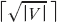
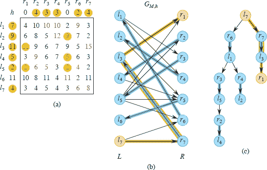

**25` 二部图中的匹配**

许多现实世界问题可以建模为在无向图中找到匹配。对于无向图`G = (V, E)`，**匹配**是边的子集`M ⊆ E`，使得`V`中的每个顶点最多有一条`M`中的关联边。

例如，考虑以下情景。你有一个或多个职位需要填补，以及几个候选人需要面试。根据你的时间表，你可以在特定时间段面试候选人。你要求候选人指出他们可以面试的时间段子集。你如何安排面试，以便每个时间段最多安排一个候选人，同时最大化你可以面试的候选人数量？你可以将这种情况建模为一个二部图上的匹配问题，其中每个顶点代表候选人或时间段，如果候选人可用，则候选人和时间段之间有一条边。如果匹配中包含一条边，那意味着你正在为特定时间段安排特定候选人的面试。你的目标是找到**最大匹配**：最大基数的匹配。本书的一位作者在为一门大课程招聘助教时正好面临这种情况。他使用了第 25.1 节中的 Hopcroft-Karp 算法来安排面试。

另一个匹配的应用是美国国家住院医师匹配计划，医学生将被分配到医院作为住院医师。每个学生按偏好对医院进行排名，每个医院对学生进行排名。目标是将学生分配到医院，以便永远不会有学生和医院都感到遗憾，因为学生没有被分配到医院，但每个人都将对方排名更高。这种情况可能是“稳定婚姻问题”的最著名的现实世界例子，第 25.2 节进行了探讨。

当工人必须被分配到任务以最大化任务的整体效果时，匹配也会发挥作用。对于每个工人和每个任务，工人对该任务有一定的量化效果。假设工人和任务的数量相等，目标是找到总效果最大的匹配。这种情况是一个分配问题的例子，第 `25.3` 节展示了如何解决。

本章中的算法在**二部图**中找到匹配。与第 24.3 节一样，输入是一个无向图`G = (V, E)`，其中`V = L ∪ R`，顶点集`L`和`R`是不相交的，并且`E`中的每条边都与`L`中的一个顶点和`R`中的一个顶点相邻。因此，匹配将`L`中的顶点与`R`中的顶点匹配。在一些应用中，集合`L`和`R`具有相等的基数，而在其他应用中，它们的大小可能不相同。

无向图不一定要是二部图才能应用匹配的概念。一般无向图中的匹配在调度和计算化学等领域有应用。它模拟了想要将由顶点表示的实体配对的问题。如果两个顶点表示兼容实体，则它们是相邻的，您需要找到一组大的兼容对。在一般图上的最大匹配和最大权匹配问题可以通过多项式时间算法解决，其运行时间与二部图匹配的运行时间类似，但算法要复杂得多。练习 25.2-5 讨论了稳定婚姻问题的一般版本，称为“稳定室友问题”。尽管匹配适用于一般无向图，但本章仅涉及二部图。

**25.1` 最大二分匹配（再探）**  

24.3 节展示了在二分图中找到最大匹配的一种方法，即通过找到最大流。本节提供了一种更高效的方法，霍普克罗夫特-卡普算法，其运行时间为。[图 25.1(a)]展示了一个无向二分图中的匹配。一个在匹配`M`下有关联边的顶点被称为**匹配的**，否则被称为**未匹配的**。一个**极大匹配**是一个不能再添加其他边的匹配`M`，也就是说，对于每条边`e ∈ E` − `M`，边集`M` ∪ `{e}`都不构成一个匹配。一个最大匹配总是极大的，但反之则不一定成立。

许多用于寻找最大匹配的算法，包括霍普克罗夫特-卡普算法在内，都是通过逐步增加匹配的大小来工作的。给定无向图`G = (V, E)`中的一个匹配`M`，一个**M-交替路径**是一条简单路径，其边交替在`M`和`E` − `M`之间。[图 25.1(b)]展示了一个**M-增广路径**（有时称为相对于`M`的增广路径）：一个`M`-交替路径，其第一条和最后一条边属于`E` − `M`。由于`M`-增广路径在`E` − `M`中包含一条比`M`多的边，所以它必须由奇数条边组成。

**图 25.1** 一个二分图，其中`V = L` ∪ `R`，`L` = {`l`[1], `l`[2], … , `l`[7]}，`R` = {`r`[1], `r`[2], … , `r`[8]}。**(a)** 一个基数为 4 的匹配`M`，用蓝色标出。匹配的顶点为蓝色，未匹配的顶点为棕色。**(b)** 五条橙色标出的边形成一个`M`-增广路径`P`，连接顶点`l`[6]和`r`[8]。**(c)** 边集`M' = M` ⊕ `P`用蓝色标出，是一个比`M`多一条边的匹配，并将`l`[6]和`r`[8]添加到匹配的顶点中。这个匹配不是最大匹配（见练习 25.1-1）。

图 25.1(c)展示了以下引理，它表明通过从匹配`M`中移除属于`M`的`M`-增广路径中的边，并将不属于`M`的`M`-增广路径中的边添加到`M`中，结果是一个比`M`多一条边的新匹配。由于匹配是一组边的集合，该引理依赖于两个集合的**对称差**的概念：`X ⊕ Y = (X - Y) ∪ (Y - X)`，即属于`X`或`Y`但不同时属于`X`和`Y`的元素。或者，你可以将`X ⊕ Y`看作`(X ∪ Y) - (X ∩ Y)`。运算符⊕是可交换和可结合的。此外，`X ⊕ X = Ø`，`X ⊕ Ø = Ø ⊕ X = X`对于任何集合`X`都成立，因此空集是⊕的单位元。

**引理 25.1**

设`M`是任意无向图`G = (V, E)`中的一个匹配，`P`是一个`M`-增广路径。那么边集`M' = M ⊕ P`也是`G`中的一个匹配，且|`M'| = |`M`| + 1。

**证明**   假设 `P` 包含 `q` 条边，使得 ⌈q/2⌉ 条边属于 `E` − `M`，⌊q/2⌋ 条边属于 `M`，并且让这些 `q` 条边为 (`v₁`, `v₂`)，(`v₂`, `v₃`)，…，(`v[q]`, `v[q+1]`)。因为 `P` 是一个 `M`-增广路径，顶点 `v₁` 和 `v[q+1]` 在 `M` 下没有匹配，而 `P` 中的其他顶点都有匹配。边 (`v₁`, `v₂`)，(`v₃`, `v[4]`)，…，(`v[q]`, `v[q+1]`) 属于 `E` − `M`，边 (`v₂`, `v₃`)，(`v[4]`, `v[5]`)，…，(`v[q-1]`, `v[q]`) 属于 `M`。对称差 `M' = M ⊕ P` 颠倒了这些角色，使得边 (`v₁`, `v₂`)，(`v₃`, `v[4]`)，…，(`v[q]`, `v[q+1]`) 属于 `M'`，而 (`v₂`, `v₃`)，(`v[4]`, `v[5]`)，…，(`v[q-1]`, `v[q]`) 属于 `E` − `M'`。每个顶点 `v₁`，`v₂`，…，`v[q]`，`v[q+1]` 在 `M'` 下都有匹配，相对于 `M` 多了一条边，而 `G` 中的其他顶点或边并不受从 `M` 到 `M'` 的变化影响。因此，`M'` 是 `G` 中的一个匹配，且 |`M'|` = |`M`| + 1。

▪  输出：

由于将匹配 `M` 与一个 `M`-增广路径的对称差会使匹配的大小增加 1，下面的推论表明将 `M` 与 `k` 个顶点不相交的 `M`-增广路径的对称差会使匹配的大小增加 `k`。

**推论 25.2**

假设 `M` 是任意无向图 `G = (V, E)` 中的一个匹配，`P₁`、`P₂`、…、`P[k]` 是顶点不相交的 `M`-增广路径。那么边集 `M' = M ⊕ (P₁ ∪ P₂ ∪ … ∪ P[k])` 是图 `G` 中的一个匹配，且 |`M'|` = |`M`| + `k`。

**证明**   由于 `M`-增广路径 `P₁`、`P₂`、…、`P[k]` 是顶点不相交的，我们有 `P₁ ∪ P₂ ∪⋯∪ P[k] = P₁⊕ P₂ ⊕⋯⊕ P[k]`。由于运算符 ⊕ 是结合的，我们有 

| M ⊕ (P₁ ∪ P₂ ∪ ⋯ ∪ P[k]) | = | M ⊕ (P₁ ⊕ P₂ ⊕ ⋯ ⊕ P[k]) |
| --- | --- | --- | --- | --- |
| --- | --- | --- |
|  | = | ((M ⊕ P₁) ⊕ P₂) ⊕ ⋯ ∪ P[k-1]) ⊕ P[k]. |

利用引理 25.1 进行简单归纳可知，`M ⊕ (P₁ ∪ P₂ ∪ ⋯ ∪ P[i−1])` 是图 `G` 中的一个匹配，包含 |M| + `i` − 1 条边，并且路径 `P[i]` 相对于 `M ⊕ (P₁ ∪ P₂ ∪ ⋯ ∪ P[i−1])` 是一个增广路径。这些增广路径中的每一个都使匹配的大小增加 1，因此 |`M′`| = |M| + `k`。

▪

当霍普克罗夫特-卡普算法从一个匹配到另一个匹配时，考虑两个匹配之间的`对称差`是很有用的。

**引理 25.3**

假设 `M` 和 `M'` 是图 `G = (V, E)` 中的匹配，并考虑图 `G' = (V, E')`，其中 `E' = M ⊕ M'`。那么，`G'` 是简单路径、简单环和/或孤立顶点的不相交并集。每个简单路径或简单环中的边在 `M` 和 `M'` 之间交替。如果 |M'| > |M|，那么 `G'` 包含至少 |M'|-|M| 个顶点不相交的 `M`-增广路径。

**证明**   `G′` 中的每个顶点的度数为 0、1 或 2，因为 `E′` 中最多可以有两条边与一个顶点关联：最多一条来自 `M`，最多一条来自 `M*`。因此，`G′` 的每个连通分量要么是一个单独的顶点，要么是边交替在 `M` 和 `M*` 中的偶数长度简单环，要么是边交替在 `M` 和 `M*` 中的简单路径。由于

| E′ | = | M ⊕ M* |
| --- | --- | --- | --- | --- |
| --- | --- | --- |
| | = | (M ∪ M*) - (M ∩ M*) | `   |

且 |`M*`| > |`M`|，边集 `E′` 必须包含比 `M` 多 |`M*`| − |`M`| 条边。因为 `G′` 中的每个循环都有偶数条边，交替地来自 `M` 和 `M*`，每个循环中来自 `M` 和 `M*` 的边数相等。因此， `G′` 中的简单路径说明了 `M*` 比 `M` 多 |`M*`| − |`M`| 条边。每条路径包含不同数量的来自 `M` 和 `M*` 的边，要么以来自 `M` 的边开始和结束，比来自 `M*` 的边多一条，要么以来自 `M*` 的边开始和结束，比来自 `M` 的边多一条。因为 `E′` 包含比 `M` 多 |`M*`| − |`M`| 条边，至少有 |`M*`| − |`M`| 条属于后一种类型的路径，每一条都是 `M`-增广路径。因为每个顶点最多有两条来自 `E′` 的关联边，这些路径必须是顶点不相交的。

▪

如果一个算法通过逐步增加匹配的大小找到最大匹配，那么它如何确定何时停止？以下推论给出了答案：当没有增广路径时。

**推论 25.4**

图 `G = (V, E)` 中的匹配 `M` 是最大匹配当且仅当 `G` 不包含 `M`-增广路径。

**证明**   我们证明引理陈述的两个方向的逆否命题。正向方向的逆否命题很明显。如果 `G` 中存在 `M`-增广路径 `P`，那么根据引理 25.1，匹配 `M` ⊕ `P` 比 `M` 多一条边，意味着 `M` 不能是最大匹配。

要证明反向方向的逆否命题——如果 `M` 不是最大匹配，那么 `G` 包含一个 `M`-增广路径——让 `M` 是引理 25.3 中的最大匹配，使得 |`M`| > |`M`|。那么 `G` 至少包含 |`M`| − |`M`| > 0 条顶点不相交的 `M`-增广路径。  

▪

我们已经学到足够的知识来创建一个运行时间为 `O(VE)` 的最大匹配算法。从匹配 `M` 为空开始。然后从一个未匹配的顶点开始反复运行广度优先搜索或深度优先搜索的变体，直到找到另一个未匹配的顶点。利用得到的 `M`-增广路径将 `M` 的大小增加 1。

**霍普克罗夫特-卡普算法**

霍普克罗夫特-卡普算法将运行时间优化到 。算法 HOPCROFT-KARP 给定一个无向二分图，并使用推论 25.2 反复增加找到的匹配 `M` 的大小。推论 25.4 证明了算法的正确性，因为一旦没有 `M`-增广路径，算法就会终止。现在要证明算法确实在  时间内运行。我们将看到行 2–5 的 **重复** 循环迭代  次，以及如何实现行 3，使其在每次迭代中以 `O`(`E`) 时间运行。  

霍普克罗夫特-卡普 (`G`)

| 1 | `M = Ø` |
| --- | --- |
| `---` | `---` |
| `2` | **重复** |
| 3 | 令 P = {`P``[1]`, `P``[2]`, … , `P``[k]`} 为一组最大的顶点不相交的最短 `M`-增广路径 |
| 4 | `M = M ⊕ (P₁ ∪ P₂ ∪ ⋯ ∪ P[k])` |   |
| 5 | 直到 P == Ø |
| 6 | **返回** M | `   |

首先看看如何在 `O(E)` 时间内找到一组最大的顶点不相交的最短 `M`-增广路径。有三个阶段。第一阶段形成无向二分图 `G` 的有向版本 `G[M]`。第二阶段通过广度优先搜索的变体从 `G[M]` 创建一个有向无环图 `H`。第三阶段通过在 `H` 的转置 `H^T` 上运行深度优先搜索的变体，找到一组最大的顶点不相交的最短 `M`-增广路径。（回想一下，有向图的转置会颠倒每条边的方向。由于 `H` 是无环的，所以 `H^T` 也是无环的。）

给定匹配`M`，你可以将`M`增广路径`P`视为从`L`中的未匹配顶点开始，穿过奇数条边，然后结束在`R`中的未匹配顶点。从`L`到`R`穿过的`P`中的边必须属于`E` − `M`，而从`R`到`L`穿过的`P`中的边必须属于`M`。因此，第一阶段通过相应地指向边来创建有向图`G[M]`：`G[M] = (V, E[M])`，其中

**图 25.2 (a)** 第一阶段为无向二分图`G`和匹配`M`创建的有向图`G[M]`。从任何未匹配顶点在`L`中的广度优先距离出现在每个顶点旁边。**(b)** 第二阶段从`G[M]`创建的有向无环图`H`。因为到未匹配顶点在`R`中的最小距离为 3，距离大于 3 的顶点`l[7]`和`r[8]`不在`H`中。

| `E[M]` | = | {(`l`, `r`) : `l ∈ L`, `r ∈ R`, and (`l`, `r`) ∈ `E` - `M` } | (从`L`到`R`的边) |
| --- | --- | --- | --- |
|  |  | ∪ {(`r`, `l`) : `r ∈ R`, `l ∈ L`, and (`l`, `r`) ∈ `M` } | (从`R`到`L`的边)。 |   |

图 25.2(a)展示了图`G[M]`，对应于图 25.1(a)中的图`G`和匹配`M`。

第二阶段创建的有向无环图`H = (V[H], E[H])`具有顶点层。图 25.2(b)展示了与图中部分(a)中的有向图`G[M]`对应的有向无环图`H`。每一层只包含来自`L`或来自`R`的顶点，从一层到另一层交替。顶点所在的层由该顶点在`G[M]`中距离任何未匹配顶点在`L`的最小广度优先距离确定。`L`中的顶点出现在偶数层，`R`中的顶点出现在奇数层。让`q`表示`R`中任何未匹配顶点在`G[M]`中的最小距离。因此，`H`中的最后一层包含距离`q`的`R`中的顶点。距离超过`q`的顶点不出现在`V[H]`中。(图 25.2(b)中的图`H`省略了顶点`l[7]`和`r[8]`，因为它们距离任何未匹配顶点在`L`的距离超过`q = 3`。) `E[H]`中的边形成`E[M]`的子集：

`E[H] = {(l, r) ∈ E[M] : r.d ≤ q and r.d = l.d + 1} ∪ {(r, l) ∈ E[M] : l.d ≤ q}`,  

属性`d`表示顶点在`G[M]`中距离任何未匹配顶点在`L`中的广度优先距离。不在两个连续层之间的边将从`E[H]`中省略。

要确定顶点的广度优先距离，对`G[M]`运行广度优先搜索，但是从所有未匹配顶点在`L`开始。（在第 556 页的 BFS 过程中，将根顶点`s`替换为未匹配顶点在`L`的集合。）由 BFS 过程计算的前驱属性`π`在这里不需要，因为`H`是有向无环图，不一定是树。

*`H`*中从层 0 的顶点到层*`q`*的未匹配顶点的每条路径对应于原始二分图*`G`*中的最短*`M`*增广路径。只需使用*`H`*中有向边的无向版本。此外，*`G`*中的每条最短*`M`*增广路径都存在于*`H`*中。

第三阶段确定了一组顶点不相交的最短 `M` 增广路径的最大集合。正如图 25.3 所示，它首先创建 `H` 的转置 `H^T`。然后，对于每个第 `q` 层中的未匹配顶点 `r`，它从 `r` 开始执行深度优先搜索，直到要么到达第 0 层的顶点，要么耗尽所有可能的路径而没有到达第 0 层的顶点。深度优先搜索不需要维护发现和完成时间，只需要跟踪每次搜索的深度优先树中的前任属性 `π`。到达第 0 ���的顶点后，沿着前任回溯可以确定一个 `M` 增广路径。每个顶点只有在任何搜索中首次发现时才进行搜索。如果从第 `q` 层中的顶点 `r` 开始的搜索无法找到一条到未发现的第 0 层顶点的路径，则不包括 `r` 的 `M` 增广路径进入最大集合。  

图 25.3 展示了第三阶段的结果。第一次深度优先搜索从顶点 `r₁` 开始。它识别出橙色突出显示的 `M` 增广路径 <(`r₁`, `l₃`), (`l₃`, `r₃`), (`r₃`, `l₁`)>，并发现顶点 `r₁`, `l₃`, `r₃` 和 `l₁`。接下来的深度优先搜索从顶点 `r[4]` 开始。这次搜索首先检查边 (`r[4]`, `l₃`)，但由于 `l₃` 已经被发现，它回溯并检查边 (`r[4]`, `l[5]`)。然后，它继续并识别出黄色突出显示的 `M` 增广路径 <(`r[4]`, `l[5]`), (`l[5]`, `r[7]`), (`r[7]`, `l[6]`)>，并发现顶点 `r[4]`, `l[5]`, `r[7]` 和 `l[6]`。从顶点 `r[6]` 开始的深度优先搜索卡在已经被发现的顶点 `l₃` 和 `l[5]` 上，因此这次搜索无法找到一条到达第 0 层未发现顶点的路径。从顶点 `r[5]` 开始的深度优先搜索不存在，因为它已经匹配，深度优先搜索从未匹配的顶点开始。因此，找到的顶点不相交的最短 `M` 增广路径集合只包含两条 `M` 增广路径（<`r₁`, `l₃`), (`l₃`, `r₃`), (`r₃`, `l₁`)> 和 <(`r[4]`, `l[5]`), (`l[5]`, `r[7]`), (`r[7]`, `l[6]`)>。  

你可能已经注意到，在这个例子中，这个最大的两个顶点不相交的最短 `M` 增广路径集合并不是最大的。图中包含三个顶点不相交的最短 `M` 增广路径：<(`r₁`, `l₂`), (`l₂`, `r₂`), (`r₂`, `l₁`)>，<(`r[4]`, `l₃`), (`l₃`, `r₃`), (`r₃`, `l[4]`)>，和 <(`r[6]`, `l[5]`), (`l[5]`, `r[7]`), (`r[7]`, `l[6]`)>。不过，算法要求在 HOPCROFT-KARP 的第 3 行中找到的顶点不相交的最短 `M` 增广路径集合只需是最大的，不一定是最大的。

**图 25.3** 第三阶段创建的转置 `H^T` 的 `H` 的转置。第一次深度优先搜索，从顶点 `r₁` 开始，识别出橙色突出显示的 `M` 增广路径 <(`r₁`, `l₃`), (`l₃`, `r₃`), (`r₃`, `l₁`)>，并发现顶点 `r₁`, `l₃`, `r₃`, `l₁`。第二次深度优先搜索，从顶点 `r[4]` 开始，识别出黄色突出显示的 `M` 增广路径 <(`r[4]`, `l[5]`), (`l[5]`, `r[7]`), (`r[7]`, `l[6]`)>，发现顶点 `r[4]`, `l[5]`, `r[7]`, `l[6]`。

仍需证明第 3 行的所有三个阶段都需要 `O(E)` 的时间。我们假设在原始的二分图 `G` 中，每个顶点至少有一条关联边，因此 |`V`| = `O(E)`，这进而意味着 |`V`| + |`E`| = `O(E)`。第一阶段通过简单地将 `G` 的每条边定向来创建有向图 `G[M]`，因此 |`V`[M]| = |`V`|，|`E`[M]| = |`E`|。第二阶段在 `G[M]` 上执行广度优先搜索，需要 `O(V[M] + E[M]) = O(E[M]) = O(E)` 的时间。实际上，一旦队列中的第一个距离超过到未匹配顶点 `R` 的最短距离 `q`，它就可以停止。有向无环图 `H` 有 |`V`[H]| ≤ |`V`[M]| 和 |`E`[H]| ≤ |`E`[M]|，因此构建它需要 `O(V[H] + E[H]) = O(E)` 的时间。最后，第三阶段从第 `q` 层的未匹配顶点开始执行深度优先搜索。一旦发现一个顶点，就不再从中搜索，因此深度优先搜索的分析与 第 20.3 节 中的相同：`O(V[H] + E[H]) = O(E)`。因此，所有三个阶段都只需要 `O(E)` 的时间。

一旦在第 3 行找到了顶点不相交的最短 `M`-增广路径的最大集合，在第 4 行更新匹配需要 `O(E)` 的时间，因为只需遍历 `M`-增广路径的边，向匹配 `M` 添加边或从中删除边。因此，第 2-5 行的 **repeat** 循环的每次迭代都可以在 `O(E)` 的时间内运行。

仍需证明 `repeat` 循环迭代  次。我们从以下引理开始，该引理表明在 `repeat` 循环的每次迭代后，增广路径的长度会增加。

**引理 25.5**

设 `G = (V, E)` 为一个无向二分图，其匹配为 `M`，`q` 为最短 `M`-增广路径的长度。设 P = {`P₁`, `P₂`, … , `P[k]`} 为长度为 `q` 的顶点不相交的 `M`-增广路径的最大集合。令 `M' = M ⊕ (P₁ ∪ P₂ ∪ ⋯ ∪ P[k])`，假设 `P` 是最短的 `M'`-增广路径。那么 `P` 的边数大于 `q`。

**证明**   我们分别考虑 `P` 与 `P` 中的增广路径是顶点不相交的情况和它们不是顶点不相交的情况。

首先，假设 `P` 与 `P` 中的增广路径是顶点不相交的。那么，`P` 包��在 `M` 中但不包含在任何 `P₁`、`P₂`、…、`P[k]` 中的边，因此 `P` 也是一个 `M`-增广路径。由于 `P` 与 `P₁`、`P₂`、…、`P[k]` 不相交，但又是一个 `M`-增广路径，并且 `P` 是最短的 `M`-增广路径的最大集合，`P` 必须比 `P` 中的任何增广路径都要长，而每个增广路径的长度为 `q`。因此，`P` 的边数大于 `q`。  

现在，假设 `P` 至少访问了 P 中的一个增广路径的一个顶点。根据推论 25.2，`M′` 是 `G` 中的一个匹配，|`M′`| = |`M`| + `k`。由于 `P` 是一个 `M′`-增广路径，根据引理 25.1，`M′ ⊕ P` 是一个匹配，|`M′ ⊕ P`| = |`M′`| + 1 = |`M`| + `k` + 1。现在令 `A = M ⊕ M′ ⊕ P`。我们声称 `A` = (`P₁ ∪ P₂ ∪ ⋯ ∪ P[k]`) ⊕ `P`：

| A | = | M ⊕ M′ ⊕ P |
| --- | --- | --- | --- | --- |
| --- | --- | --- | --- |  |
|  | = | `M` ⊕ (`P₁ ∪ P₂ ∪ ⋯ ∪ P[k]`) ⊕ `P` |  |   |
|  | = | (M ⊕ M) ⊕ (P₁ ∪ P₂ ∪ ⋯ ∪ P[k]) ⊕ P | ` (结合律) |
|  | = | Ø ⊕ (P₁ ∪ P₂ ∪ ⋯ ∪ P[k]) ⊕ P | (X ⊕ X = Ø 对于所有 X) |
|  | = | (P₁ ∪ P₂ ∪ ⋯ ∪ P[k]) ⊕ P | (Ø ⊕ X = X 对于所有 X)`。 |

引理 25.3 中 `M = M' ⊕ P` 表明 `A` 至少包含 `|M' ⊕ P| − |M| = k + 1` 个顶点不相交的 `M`-增广路径。由于每个这样的 `M`-增广路径至少有 `q` 条边，我们有 `|A| ≥ (k + 1)q = kq + q`。

现在我们声称`P`至少与 P 中的某个`M`增广路径共享一条边。在匹配`M`′下，`P` 中每个`M`增广路径中的每个顶点都已匹配。（只有 P 中每个`M`增广路径`P[i]`的第一个和最后一个顶点在`M`下未匹配，在`M ⊕ P[i]`下，`P[i]`中的所有顶点都已匹配。由于 P 中的`M`增广路径是顶点不相交的，因此 P 中的其他路径不会影响`P[i]`中的顶点是否匹配。也就是说，当且仅当在`M ⊕ P[i]`下匹配了`P[i]`中的顶点时，`P[i]`中的顶点在(`M ⊕ P[i]`) ⊕ `P[j]`下是否匹配，其中`P[j] ∈ P`。）假设`P`与 P 中的某个路径`P[i]`共享一个顶点`v`。顶点`v`不能是`P`的端点，因为`P`的端点在`M`′下未匹配。因此，`v`在 P 中有一条属于`M`′的关联边。由于任何顶点在匹配中最多有一条关联边，这条边也必须属于`P[i]`，从而证明了这一点。

因为`A = (P₁ ∪ P₂ ∪ ⋯ ∪ P[k]) ⊕ P`，而`P`至少与某个`P[i] ∈ P`共享一条边，我们有|`A`| < |`P₁ ∪ P₂ ∪ ⋯ ∪ P[k]`| + |`P`|。因此，我们有  

| `kq + q` | ≤ | &#124;`A`&#124; |
| --- | --- | --- |
|  | < | &#124;P₁ ∪ P₂ ∪ ⋯ ∪ P[k]&#124; + &#124;P&#124; |
|  | = | kq + | P | |

所以`q` < |`P`|。我们得出结论，`P`包含的边数多于`q`。

▪

下一个引理根据最短增广路径的长度限制了最大匹配的大小。

**引理 25.6**

设`M`是图`G = (V, E)`中的匹配，并且`G`中的最短`M`增广路径包含`q`条边。那么`G`中最大匹配的大小最多为|`M`| + |`V`| / (`q` + 1)。

**证明**   设`M`是图`G`中的最大匹配。根据引理 25.3，`G`至少包含|`M`|−|`M`|个顶点不相交的`M`增广路径。这些路径中每个至少包含`q`条边，因此至少包含`q+1` 个顶点。由于这些路径是顶点不相交的，我们有(|`M`|−|`M`|)(`q+1`) ≤ |`V`|，因此|`M`| ≤ |`M`| + |`V`|/(`q+1`)。  

▪

最终的引理限制了第 2-5 行的**重复**循环的迭代次数。

**引理 25.7**

当 HOPCROFT-KARP 过程在无向二分图`G = (V, E)`上运行时，第 2-5 行的**重复**循环迭代次。

**证明**   根据引理 25.5，第 3 行找到的最短`M`增广路径的长度`q`从迭代到迭代增加。因此，经过次迭代后，我们必须有。考虑在第一次执行第 4 行时，具有至少长度的`M`增广路径的情况。由于匹配的大小每次迭代至少增加一条边，引理 25.6 暗示在达到最大匹配之前的额外迭代次数最多为 

因此，循环迭代的总次数小于`art`。

▪  输出：

因此，我们对 `HOPCROFT-KARP` 过程的运行时间有以下限制。

**定理 25.8**

HOPCROFT-KARP 过程在无向二分图`G = (V, E)`上运行时间为。

**证明**   根据引理 25.7，**重复**循环迭代`art`次，我们已经看到如何在`O`(`E`)时间内实现每次迭代。

▪ 输出：

**练习**

**25.1-1**

使用 Hopcroft-Karp 算法在图 `25.1` 中找到图的最大匹配。

**25.1-2**

`M`增广路径和流网络中的增广路径有何相似之处？它们有何不同？

**25.1-3**

从未匹配的顶点在层`q`（包含`R`中未匹配顶点的第一层）中从转置`H`^T 中搜索的优势是什么，相对于在 dag `H` 中从层 0 搜索到层`q`？

**25.1-4**

展示如何通过  来限制 HOPCROFT-KARP 的第 2-5 行的 **repeat** 循环的迭代次数。

★ **25.1-5** 

一个`完美匹配`是一种每个顶点都被匹配的匹配。设 `G = (V, E)` 是一个无向二分图，顶点分区为 `V = L ∪ R`，其中 |`L`| = |`R`|。对于任意 `X` ⊆ `V`，定义 `X` 的`邻域`为

`N(X) = {y ∈ V : (x, y) ∈ E, 对于某个 x ∈ X}`,

也就是说，与 `X` 的某个成员相邻的顶点集。证明**霍尔定理**：如果对于每个子集 `A` ⊆ `L`，都有 |`A`| ≤ |`N`(A)`|，那么 `G` 中存在一个完美匹配。

**25.1-6**  

在一个`d-正则`图中，每个顶点的度为 `d`。如果 `G` = (`V`, `E`) 是一个二分图，顶点分区为 `V = L` ∪ `R`，同时也是 `d-正则`，那么 |`L`| = |`R`|。使用霍尔定理（见练习 25.1-5）证明每个 `d-正则` 二分图都包含一个完美匹配。然后利用该结果证明每个 `d-正则` 二分图都包含 `d` 个不相交的完美匹配。

**25.2    稳定婚姻问题**

在第 25.1 节中，目标是在无向二分图中找到一个最大匹配。如果知道图 `G = (V, E)`，顶点分区为 `V = L ∪ R` 是一个**完全二分图**—包含从 `L` 中的每个顶点到 `R` 中的每个顶点的边—那么可以通过一个简单的贪心算法找到一个最大匹配。

当一个图可以有多个匹配时，您可能想决定哪些匹配是最理想的。在第 25.3 节中，我们将为边添加权重并找到最大权重的匹配。在本节中，我们将为完全二分图中的每个顶点添加一些信息：对另一侧顶点的排名。也就是说，`L` 中的每个顶点都有另一侧所有顶点的有序列表，反之亦然。为了简化问题，让我们假设 `L` 和 `R` 每个包含 `n` 个顶点。这里的目标是以“稳定”的方式将 `L` 中的每个顶点与 `R` 中的一个顶点配对。

这个问题的名字，`稳定婚姻问题`，源自异性婚姻的概念，将 `L` 视为女性集合，`R` 视为男性集合。每个女性按吸引力对所有男性进行排名，每个男性也对所有女性进行相同操作。目标是配对女性和男性（一种匹配），以便如果一个女性和一个男性没有配对，那么至少有一个人喜欢他们的分配对象。

如果一个女人和一个男人互相喜欢对方而不喜欢自己的配对对象，他们就会形成一个**阻塞对**。阻塞对有动机退出分配的配对，自行组成一对。如果发生这种情况，那么这对将阻止匹配变得“稳定”。因此，**稳定匹配**是指没有阻塞对的匹配。如果存在阻塞对，那么匹配是**不稳定**的。

让我们看一个有四名女性—`Wanda`、`Emma`、`Lacey` 和 `Karen`—和四名男性—`Oscar`、`Davis`、`Brent` 和 `Hank`—具有以下偏好的例子：

| Wanda: | `Brent, Hank, Oscar, Davis` |
| --- | --- |
| Emma: | `Davis`, `Hank`, `Oscar`, `Brent` |
| Lacey: | `Brent`, `Davis`, `Hank`, `Oscar` |   |
| Karen: | `Brent`, `Hank`, `Davis`, `Oscar` |   |
| Oscar: | `Wanda`, `Karen`, `Lacey`, `Emma` |
| Davis: | `Wanda, Lacey, Karen, Emma` |
| `Brent:` | `Lacey, Karen, Wanda, Emma` |   |
| `Hank:` | `Lacey, Wanda, Emma, Karen` |

一个稳定匹配包括以下配对：

| Lacey 和 BrentWanda 和 HankKaren 和 DavisEmma 和 Oscar |
| --- |
| | --- |

您可以验证这个匹配没有阻塞对。例如，即使 Karen 更喜欢 Brent 和 Hank 而不是她的伴侣 Davis，Brent 更喜欢他的伴侣 Lacey 而不是 Karen，Hank 更喜欢他的伴侣 Wanda 而不是 Karen，所以既不是 Karen 和 Brent 也不是 Karen 和 Hank 形成阻塞对。事实上，这个稳定匹配是唯一的。假设最后两对是

| 艾玛和戴维斯卡伦和奥斯卡 |
| --- |

那么卡伦和戴维斯将成为一个阻塞对，因为他们没有配对在一起，卡伦更喜欢戴维斯而不是奥斯卡，而戴维斯更喜欢卡伦而不是艾玛。因此，这种匹配不稳定。

稳定的匹配不一定是唯一的。例如，假设有三个女性——莫妮卡、菲比和瑞秋——和三个男性——钱德勒、乔伊和罗斯——他们的偏好如下：

| 莫妮卡： | 钱德勒，乔伊，罗斯 |
| --- | --- |
| --- | --- |
| 菲比： | `乔伊`，`罗斯`，`钱德勒` |
| 瑞秋： | 罗斯，钱德勒，乔伊 |
| 钱德勒： | `菲比`，`瑞秋`，`莫妮卡` |
| 乔伊： | `瑞秋`，`莫妮卡`，`菲比` |
| 罗斯： | 莫妮卡，菲比，瑞秋 |

在这种情况下，有三种稳定的匹配：

| 匹配 1

`* * *`

| 匹配 `2`  输出：

`* * *`

| 匹配 3  输出：

`* * *`

| 莫妮卡和钱德勒 | 菲比和钱德勒 | 瑞秋和钱德勒 |
| --- | --- | --- |
| 菲比和乔伊 | 瑞秋和乔伊 | 莫妮卡和乔伊 |
| `瑞秋和罗斯` | `莫妮卡和罗斯` | `菲比和罗斯` |

在匹配 1 中，所有女性都得到了她们的第一选择，而所有男性都得到了他们的最后选择。匹配 2 则相反，所有男性得到了他们的第一选择，而所有女性得到了她们的最后选择。当所有女性或所有男性都得到了他们的第一选择时，显然不可能存在阻塞对。在匹配 3 中，每个人都得到了他们的第二选择。你可以验证没有阻塞对。

你可能会想知道，无论每个参与者提供的排名如何，是否总是可能得出一个稳定的匹配。答案是肯定的。（练习 25.2-3 要求你展示，即使在国家住院医师配对计划的情况下，每家医院接受多名学生，也总是可以设计出一个稳定的分配。）一个简单的算法，即盖尔-沙普利算法总是能找到一个稳定的匹配。该算法有两个变体，互为镜像：“以女性为导向”和“以男性为导向”。让我们来看看以女性为导向的版本。每个参与者要么是“自由”的，要么是“订婚”的。每个人最初都是自由的。当一个自由的女性向男性求婚时，就会发生订婚。当一个男性第一次被求婚时，他从自由变为订婚，并且他总是保持订婚状态，尽管不一定是与同一个女性。如果一个订婚的男性收到一个他更喜欢的女性的求婚，那么这段订婚关系就会被打破，他原来订婚的女性变为自由，而他和他更喜欢的女性订婚。每个女性按照她的偏好列表依次向男性求婚，直到最后一次她订婚。当一个女性订婚时，她暂时停止求婚，但如果她再次变为自由，她会继续按照列表顺序进行。一旦每个人都订婚了，算法就终止。下一页的盖尔-沙普利过程使这个过程更加具体化。该过程允许一些选择：第 2 行可以选择任何自由女性。我们将看到，无论第 2 行选择自由女性的顺序如何，该过程都会产生一个稳定的匹配。对于以男性为导向的版本，只需在过程中颠倒男性和女性的角色。

让我们看看`弗洛伊德-沙普利`过程在`达、艾玛、莱西、卡伦、奥斯卡、戴维斯、布伦特`和`汉克`的例子中是如何执行的。在每个人初始化为自由后，以下是循环的每一次迭代中可能发生的一个版本。

1.  旺达向布伦特求婚。布伦特是自由的，于是旺达和布伦特订婚，不再自由。

1.  艾玛向戴维斯求婚。戴维斯是自由的，于是艾玛和戴维斯订婚，不再自由。

1.  莱西向布伦特求婚。布伦特与旺达订婚，但他更喜欢莱西。布伦特终止与旺达的订婚，旺达变为自由。莱西和布伦特订婚，莱西不再自由。

1.  卡伦向布伦特求婚。布伦特与莱西订婚，他更喜欢莱西而不是卡伦。布伦特拒绝了卡伦，卡伦仍然自由。

1.  卡伦向汉克求婚。汉克是自由的，于是卡伦和汉克订婚，不再自由。

1.  Wanda 向 Hank 求婚。Hank 与 Karen 订婚，但他更喜欢 Wanda。Hank 取消与 Karen 的订婚，Karen 变得自由。Wanda 和 Hank 订婚，Wanda 不再自由。

1.  Karen 向 Davis 求婚。Davis 与 Emma 订婚，但他更喜欢 Karen。Davis 取消与 Emma 的订婚，Emma 变得自由。Karen 和 Davis 订婚，Karen 不再自由。

1.  Emma 向 Hank 求婚。Hank 与 Wanda 订婚，他更喜欢 Wanda 而不是 Emma。Hank 拒绝 Emma，Emma 保持自由。

1.  Emma 向 Oscar 求婚。Oscar 是自由的，因此 Emma 和 Oscar 订婚，不再自由。

盖尔-沙普利算法（`男性`，`女性`，`排名`）

|   1 | 将每个女性和男性分配为自由的 |
| --- | --- |
| --- | --- |
|   `2` | **当** 有女性 `w` 是自由的 **时** |
|   `3` | 让 `m` 是 `w` 的排名列表上第一个她还没有向其求婚的男性 |
| `4` | **如果** `m` 是自由的 |
|   5 | w 和 m 订婚（并非自由） |
|   6 | **否则如果** `m` 将 `w` 排在他当前订婚的女性 `w′` 之上 |
|   7 | `m` 取消与 `w'` 的订婚，`w'` 变得自由 |   |
|   8 | `w` 和 `m` 订婚（并非自由） |   |
|   9 | **否则** `m` 拒绝 `w`，`w` 保持自由 |
| `10` | **返回** 由订婚对组成的稳定匹配 |

此时，每个人都已订婚，没有人是自由的，因此`while`循环终止。该过程返回我们之前看到的稳定匹配。

以下定理表明，盖尔-沙普利算法不仅终止，而且总是返回一个稳定匹配，从而证明稳定匹配总是存在。

**定理 25.9**

盖尔-沙普利算法总是终止并返回一个稳定匹配。

**证明**   让我们首先证明行 2-9 的`while`循环总是终止，以便该过程终止。证明是通过反证法的。如果循环未能终止，那是因为某个女性仍然自由。为了让一个女性保持自由，她必须向所有男性求婚并被每个男性拒绝。为了让一个男性拒绝一个女性，他必须已经订婚。因此，所有男性都已订婚。一旦订婚，男性就会保持订婚（尽管不一定是同一个女性）。然而，女性和男性的数量相等，这意味着每个女性都已订婚，导致矛盾，即没有女性是自由的。我们还必须证明`while`循环执行有限次数。由于每个女性按顺序遍历她对男性的排名列表，可能不会到达列表的末尾，因此总迭代次数最多为 `n²`。因此，`while`循环总是终止，该过程返回一个匹配。

我们需要证明没有阻塞对。我们首先观察到一旦男性 `m` 与女性 `w` 订婚，`m` 的所有后续行动发生在行 6-8 中。因此，一旦男性订婚，他就会保持订婚，任何时候他取消与女性 `w` 的订婚，都是因为他更喜欢另一位女性。假设女性 `w` 与男性 `m` 匹配，但她更喜欢男性 `m`′。我们将证明 `w` 和 `m`′ 不是阻塞对，因为 `m`′ 不喜欢 `w` 胜过他的伴侣。因为 `w` 将 `m`′ 排在 `m` 之上，她必须先向 `m`′ 求婚，然后才向 `m` 求婚，而 `m`′ 要么拒绝她的求婚，要么接受了并后来取消了订婚。如果 `m`′ 拒绝了 `w` 的求婚，那是因为他已经与他更喜欢的某位女性订婚。如果 `m`′ 接受并后来取消了订婚，那是因为他曾经与 `w` 订婚，但后来接受了他更喜欢的女性的求婚。无论哪种情况，他最终都会与他更喜欢的伴侣在一起。我们得出结论，即使 `w` 可能更喜欢 `m`′ 而不是她的伴侣 `m`，但 `m`′ 也不一定更喜欢 `w` 而不是他的伴侣。因此，该过程返回一个不包含阻塞对的匹配。

▪

练习 25.2-1 要求您提供以下推论的证明。

**推论 25.10**

给定`n`名女性和`n`名男性的偏好排名，Gale-Shapley 算法可以在`O(n²)`的时间内实现。

▪  输出：

因为第 2 行可以选择任何空闲女性，你可能会想知道不同的选择是否会产生不同的稳定匹配。答案是否定的：正如下面的定理所示，`GALE-SHAPLEY` 的每次执行都会产生完全相同的结果。此外，返回的稳定匹配对于女性是最优的。

**定理 25.11**

无论在 GALE-SHAPLEY 的第 2 行中如何选择女性，该过程总是返回相同的稳定匹配，在这个稳定匹配中，每个女性在任何稳定匹配中都有最佳伴侣。

**证明**  证明每个女性在任何稳定匹配中都有最佳伴侣是通过反证法。假设 GALE-SHAPLEY 过程返回一个稳定匹配`M`，但存在另一个稳定匹配`M`′，其中某个女性`w`更喜欢她在`M`中的伴侣`m`′而不是`m`。因为`w`将`m`′排在`m`之前，她必须先向`m`′求婚再向`m`求婚。然后有一个女性`w`′，`m`′更喜欢`w`′而不是`w`，当`w`求婚或`m`′接受`w`的求婚后，`m`′已经与`w`′订婚，后来为了`w`′而取消了与`w`的订婚。无论如何，`m`′都曾拒绝`w`，这是某个男性拒绝某个稳定匹配中的伴侣的第一次。  

我们声称`w′`在稳定匹配中不可能有一个她更喜欢的伴侣`m″`。如果有这样一个男性`m″`，那么为了向`m′`求婚，`w′`必须先向`m″`求婚并在向`m′`求婚之前的某个时刻被拒绝。如果`m′`接受了`w`的求婚并后来取消了以接受`w′`，那么由于这是稳定匹配中的第一次拒绝，我们得到了`m″`不可能在之前拒绝`w′`的矛盾。如果`m″`在`w`求婚时已经与`w′`订婚，那么同样，`m″`在之前不可能拒绝`w′`，从而证明了这一点。

由于`w′`在稳定匹配中不偏好`m′`，且`w′`在`M′`中未与`m′`匹配（因为`m′`在`M′`中与`w`匹配），`w′`更喜欢`m′`而不是`M′`中的伴侣。由于`w′`更喜欢`m′`而不是`M′`中的伴侣，且`m′`更喜欢`w′`而不是`M′`中的伴侣`w`，所以`w′`和`m′`是`M′`中的一个阻塞对。因为`M′`有一个阻塞对，所以它不能是一个稳定匹配，从而与 GALE-SHAPLEY 返回的匹配`M`中每个女性都有最佳伴侣的假设相矛盾。

我们对程序的执行没有任何条件，这意味着第 2 行选择女性的所有可能顺序都会返回相同的稳定匹配。

▪

**推论 25.12**

存在稳定匹配，但`GALE-SHAPLEY`过程未返回。

**证明**  定理 25.11 表明，对于给定的排名集合，GALE-SHAPLEY 只返回一个匹配，无论它如何在第 2 行选择女性。三名女性和三名男性有三种不同的稳定匹配的早期示例表明，对于给定的排名集合可能存在多个稳定匹配。GALE-SHAPLEY 的调用只能返回其中一个稳定匹配。

▪  输出：

尽管 `GALE-SHAPLEY` 过程为女性提供了最佳结果，但以下推论表明它也为男性提供了最差结果。

**推论 25.13**

在 GALE-SHAPLEY 过程返回的稳定匹配中，每个男性在任何稳定匹配中都有最差的伴侣。

**证明** 让`M`是 GALE-SHAPLEY 调用返回的匹配。假设存在另一个稳定匹配`M`′和一个男人`m`，他更喜欢他在`M`中的伴侣`w`，而不是在`M`′中的伴侣`w`′。让`M`′中`w`的伴侣是`m`′。根据定理 25.11，`m`是`w`在任何稳定匹配中可以拥有的最佳伴侣，这意味着`w`更喜欢`m`而不是`m`′。由于`m`更喜欢`w`而不是`w`′，对`w`和`m`是`M`′中的一个阻塞对，与`M`′是稳定匹配的假设相矛盾。  

▪  输出：

**练习**

**25.2-1** 

描述如何实现 Gale-Shapley 算法，使其在`O(n²)`时间内运行。

**25.2-2**

仅有两名女性和两名男性的情况下可能存在不稳定匹配吗？如果是，提供并证明一个例子。如果不是，说明为什么不可能。

`25.2-3`

国家住院医师匹配计划与本节中稳定婚姻问题的情景有两点不同。首先，一个医院可能与多名学生匹配，因此医院`h`接受`r[h] ≥ 1`名学生。其次，学生人数可能不等于医院人数。描述如何修改 Gale-Shapley 算法以适应国家住院医师匹配计划的要求。

**25.2-4**

证明以下性质，即**弱帕累托最优性**： 

让`M`是 GALE-SHAPLEY 过程生成的稳定匹配，女性向男性求婚。那么，对于给定的稳定婚姻问题实例，不存在匹配——稳定或不稳定——使得每个女性都更喜欢她在稳定匹配`M`中的伴侣。  

`25.2-5`

**稳定室友问题**类似于稳定婚姻问题，不同之处在于图是完全图，而不是二部图，顶点数为偶数。每个顶点代表一个人，每个人对所有其他人进行排名。阻塞对和稳定匹配的定义自然地延伸：阻塞对包括两个人，他们都更喜欢对方而不是当前的伴侣，如果没有阻塞对，则匹配是稳定的。例如，考虑四个人——温迪、赛尼亚、约兰达和泽尔达，他们的偏好列表如下：

| 温迪: | `赛尼亚，约兰达，泽尔达` |
| --- | --- |
| \| --- \| --- \| |
| 赛尼亚: | 温迪，泽尔达，约兰达 |
| 约兰达: | 温迪，泽尔达，赛尼亚 |
| 泽尔达: | 赛尼亚，约兰达，温迪 |

您可以验证以下匹配是稳定的：

| 温迪和赛尼亚 |  输出： |
| --- | --- |
| --- |
| 约兰达和泽尔达 |  |

与稳定婚姻问题不同，稳定室友问题可能存在无稳定匹配的输入。找到这样的输入，并解释为什么不存在稳定匹配。

**25.3    匈牙利算法解决分配问题**

让我们再次向完全二部图`G = (V, E)`添加一些信息，其中`V = L ∪ R`。这一次，与让每一侧的顶点对另一侧的顶点进行排名不同，我们为每条边分配一个权重。再次，假设顶点集合`L`和`R`各自包含`n`个顶点，因此图包含`n²`条边。对于`L`中的`l`和`R`中的`r`，将边`(l, r)`的权重表示为`w(l, r)`，它代表匹配顶点`l`和顶点`r`所获得的效用。  

目标是找到一个完美匹配`M`（参见练习 25.1-5 和 25.1-6），其边的总权重在所有完美匹配中最大。也就是说，让`w(M) = ∑[(l,r)∈M] w(l, r)`表示匹配`M`中边的总权重，我们希望找到一个完美匹配`M*`，使得

`w(M) = max {w(M) : M 是完美匹配}`.

我们称找到这样一个最大权重的完美匹配为**分配问题**。解决分配问题的方案是最大化总效用的完美匹配。与稳定婚姻问题类似，分配问题找到一个“好”的匹配，但“好”的定义不同：最大化总价值而不是实现稳定性。

尽管您可以枚举所有 `n!` 个完美匹配来解决分配问题，但一种称为**匈牙利算法**的算法解决得更快。本节将证明一个`O(n⁴)`的时间界限，问题 25-2 要求您优化算法以将运行时间降低到`O(n³)`。匈牙利算法不使用完全二分图 `G`，而是使用 `G` 的一个子图称为“等权子图”。等权子图，如下所定义，随时间变化，并具有这样的有益特性，即等权子图中的任何完美匹配也是分配问题的最优解。

等权子图取决于为每个顶点分配属性`h`。我们称`h`为顶点的**标记**，如果`h`是`G`的**可行顶点标记**，则称`h`是`G`的可行顶点标记。

`l*h + r*h ≥ w(l, r)` 对于所有`l ∈ L`和`r ∈ R`成立。

总是存在一个可行的顶点标记，比如由以下给出的`默认顶点标记`。

给定可行的顶点标记`h`，`G`的**等权子图** `G[h] = (V, E[h])`由与`G`相同的顶点和边的子集组成

`E[h] = {(l, r) ∈ E : l.h + r.h = w(l, r)}`.

下面的定理将完美匹配与等权子图联系在一起，并与分配问题的最优解相关联。

**定理 25.14**

设`G = (V, E)`, 其中`V = L ∪ R`，是一个完全二分图，其中每条边`(l, r) ∈ E`的权重为`w(l, r)`。设`h`是`G`的可行顶点标记，`G[h]`是`G`的等权子图。如果`G[h]`包含一个完美匹配`M`，那么`M`是`G`上分配问题的最优解。  

**证明**   如果`G[h]`包含一个完美匹配`M`，那么因为`G[h]`和`G`具有相同的顶点集，`M`也是`G`中的完美匹配。因为`M`的每条边属于`G[h]`，每个顶点都恰好有一条来自任何完美匹配的关联边，我们有

让`M`是`G`中的���意完美匹配，我们有

因此，我们有  

以至于`M`是`G`中的最大权重完美匹配。

▪  输出：

现在的目标是在一个等权子图中找到一个完美匹配。哪个等权子图？无所谓！我们可以自由选择一个等权子图，甚至在进行过程中改变选择的等权子图。我们只需要在`某个`等权子图中找到`某个`完美匹配。

为了更好地理解等权子图，再次考虑定理 25.14 的证明，在后半部分，让`M`是任意匹配。证明仍然有效，特别是不等式(25.3)：任意匹配的权重始终不超过顶点标记的总和。如果我们选择任何定义等权子图的顶点标记集合，那么这个等权子图中的最大基数匹配的总值最多等于顶点标记的总和。如果顶点标记集合是“正确”的，那么它的总值将等于`w(M)`，而等权子图中的最大基数匹配也是最大权重完美匹配。匈牙利算法反复修改匹配和顶点标记，以实现这个目标。  

匈牙利算法从等权子图`G[h]`中的任意可行顶点标记`h`和任意匹配`M`开始。它反复在`G[h]`中找到一个`M`-增广路径`P`，并使用引理 25.1 更新匹配为`M ⊕ P`，从而增加匹配的大小。只要存在包含`M`-增广路径的等权子图，匹配的大小就可以增加，直到达到完美匹配。

四个问题出现：

1.  算法应该从哪个初始可行顶点标记开始？答案：由方程`(25.1)`和`(25.2)`给出的默认顶点标记。  

1.  算法应该从`G[h]`中的哪个初始匹配开始？简短答案：任何匹配，甚至是空匹配，但贪婪最大匹配效果很好。

1.  如果在`G[h]`中存在`M`增广路径，如何找到它？简短答案：使用类似于 Hopcroft-Karp 算法中用于找到一组最短`M`增广路径的过程的第二阶段的变体的广度优先搜索。

1.  如果在有向相等子图`G[M.h]`中搜索`M`增广路径失败怎么办？简短答案：更新可行顶点标记以引入至少一条新边。

我们将使用从图 25.4 开始的示例详细说明简短答案。这里，`L` = {`l`[1], `l`[2], … , `l`[7]}，`R` = {`r`[1], `r`[2], … , `r`[7]}。边权重显示在部分(a)中的矩阵中，其中权重`w(l[i], r[j])`显示在第`i`行和第`j`列。通过默认顶点标记给出的可行顶点标签显示在矩阵的左侧和上方。红色矩阵条目表示边(`l[i], r[j])`，其中`l[i].h + r[j].h = w(l[i], r[j])`，即在图中的相等子图`G[h]`中出现在图的部分(b)中的边。

**贪婪最大二分匹配**

有几种实现贪婪方法以找到最大二分匹配的方法。GREEDY-BIPARTITE-MATCHING 过程展示了其中一种。在图 25.4(b)中用蓝色标出的边表示`G[h]`中初始贪婪最大匹配。练习 25.3-2 要求你证明 GREEDY-BIPARTITE-MATCHING 过程返回的匹配至少是最大匹配大小的一半。

GREEDY-BIPARTITE-MATCHING (`G`)

| 1 | `M = Ø` |   |
| --- | --- | --- |
| --- | --- |
| `2` | **对于** 每个顶点 `l ∈ L` |
| 3 | **如果** `l` 在`R`中有一个未匹配的邻居 |
| 4 | 选择任何这样的未匹配邻居 `r ∈ R` |
| 5 | `M = M ∪ {(l, r)}` |
| `6` | **返回** `M` |   |

**图 25.4** 匈牙利算法的开始。`(a)` 二分图的边权重矩阵，其中`L = {l₁, l₂, … , l[7]}`。第`i`行和第`j`列中的值表示`w(l[i], r[j])`。可行顶点标签出现在矩阵的上方和旁边。红色条目对应于相等子图中的边。`(b)` 相等子图`G[h]`。蓝色突出显示的边属于初始贪婪最大匹配`M`。蓝色顶点已匹配，棕色顶点未匹配。`(c)` 从图的部分(b)中的匹配`M`创建的有向相等子图`G[M,h]`。

**在`G[h]`中找到`M`增广路径**

要在具有匹配`M`的相等子图`G[h]`中找到`M`增���路径，匈牙利算法首先从`G[h]`创建**有向相等子图** `G[M,h]`，就像 Hopcroft-Karp 算法从`G`创建`G[M]`一样。与 Hopcroft-Karp 算法类似，你可以将`M`增广路径视为从未匹配的顶点开始，以未匹配的顶点结束，从`L`到`R`取未匹配的边，从`R`到`L`取匹配的边。因此，`G[M,h]` = (`V`, `E[M,h]`)，其中

| `E[M,h]` | = | { (l, r) : l ∈ L, r ∈ R, 且(l, r) ∈ E[h] − M } | (从 L 到 R 的边) |
| --- | --- | --- | --- |
|  |  | ∪ {(`r`, `l`) : `r ∈ R`, `l ∈ L`, 且(`l`, `r`) ∈ `M` } | (从`R`到`L`的边) |  |

因为在有向相等子图`G[M.h]`中的`M`增广路径也是在相等子图`G[h]`中的`M`增广路径，所以只需在`G[M.h]`中找到`M`增广路径即可。图 25.4(c)展示了对应于图中部分(b)的相等子图`G[h]`和匹配`M`的有向相等子图`G[M,h]`。

有了有向相等子图`G[M,h]`，匈牙利算法从`L`中的任何未匹配顶点到`R`中的任何未匹配顶点搜索`M`增广路径。任何穷举图搜索方法都可以。这里，我们将使用广度优先搜索，从所有未匹配的`L`中的顶点开始（就像 Hopcroft-Karp 算法在创建 dag `H`时所做的那样），但在首次发现`R`中的某个未匹配顶点时停止。图 25.5 展示了这个想法。为了从所有未匹配的`L`中的顶点开始，初始化先进先出队列，其中包含所有未匹配的`L`中的顶点，而不仅仅是一个源顶点。与 Hopcroft-Karp 算法中的 dag `H`不同，这里每个顶点只需要一个前驱，因此广度优先搜索创建一个**广度优先森林** `F` = (`V[F]`, `E[F]`)。每个未匹配的`L`中的顶点都是`F`中的根。

在图 25.5(g)中，广度优先搜索找到了`M`增广路径 <(`l[4]`, `r₂`), (`r₂`, `l₁`), (`l₁`, `r₃`), (`r₃`, `l[6]`), (`l[6]`, `r[5]`)>。图 25.6(a)展示了通过将匹配`M`与这个`M`增广路径在图 25.5(a)中的对称差创建的新匹配。

**当寻找`M`增广路径失败时**

在从`M`增广路径更新匹配`M`后，匈牙利算法根据新匹配更新有向相等子图`G[M,h]`，然后从所有未匹配的`L`中的顶点开始新的广度优先搜索。图 25.6 展示了这个过程的开始，从图 25.5 接续。

在图 25.6(d)中，队列包含顶点`l[4]`和`l₃`。然而，这些顶点都没有边离开它们，因此一旦这些顶点从队列中移除，队列就变为空。搜索在此时终止，未能发现`R`中的未匹配顶点以产生`M`增广路径。每当出现这种情况时，最近发现的顶点必定属于`L`。为什么？每当发现`R`中的未匹配顶点时，搜索已经找到了`M`增广路径，而当发现`R`中的匹配顶点时，它有一个未访问的邻居在`L`中，搜索随后可以发现。

请记住，我们有自由选择任何相等子图的权利。我们可以“即兴”更改有向相等子图，只要我们不抵消已经完成的工作。匈牙利算法更新可行的顶点标记`h`以满足以下标准：

1.  广度优先森林`F`中没有边离开有向相等子图。

1.  匹配`M`中没有边离开有向相等子图。

1.  至少有一条边(`l, r`)，其中`l ∈ L ∩ V[F]`且`r ∈ R - V[F]`进入`E[h]`，因此进入`E[M,h]`。因此，至少有一个`R`中的顶点将被新发现。

因此，至少有一条新边进入有向相等子图，任何离开有向相等子图的边都不属于匹配`M`或广度优先森林`F`。在`R`中新发现的顶点被入队，但它们的距离不一定比`L`中最近发现的顶点的距离大 1。

**图 25.5** 通过广度优先搜索在`G[M,h]`中找到一个`M`增广路径。**(a)** 来自图 25.4(c)的有向相等子图`G[M,h]`。**(b)–(g)** 广度优先森林`F`的连续版本，显示了每个距离根节点的顶点——`L`中的未匹配顶点。在(b)–(f)部分，最靠近图底部的顶点层是先进先出队列中的顶点。例如，在(b)部分，队列包含根节点<`l[4]`, `l[5]`, `l[7]`>，在(e)部分，队列包含距离根节点 3 的顶点<`r₃`, `r[4]`>。在(g)部分，发现了未匹配顶点`r[5]`，因此广度优先搜索终止。路径<(`l[4]`, `r₂`), (`r₂`, `l₁`), (`l₁`, `r₃`), (`r₃`, `l[6]`), (`l[6]`, `r[5]`)>，在(a)和(g)部分以橙色突出显示，是一个`M`增广路径。将其与匹配`M`的对称差集产生一个比`M`多一条边的新匹配。

**图 25.6 (a)** 在使用 M 图中的`M`增广路径更新匹配后，新匹配`M`和新的有向相等子图`G[M.h]`。**(b)–(d)** 在以根`l[5]`和`l[7]`进行新的广度优先搜索时，广度优先森林`F`的连续版本。在(d)部分中，当顶点`l[4]`和`l₃`从队列中移除后，在搜索发现`R`中的未匹配顶点之前，队列变为空。

为了更新可行顶点标记，匈牙利算法首先计算值

其中`F[L] = L ∩ V[F]`和`F[R] = R ∩ V[F]`分别表示属于`F`中的`L`和`R`的广度优先森林中的顶点。也就是说，`δ`是边缘在当前相等子图`G[h]`中未包含的顶点上的最小差值。然后，匈牙利算法通过为所有属于`F[L]`的顶点`l`减去`δ`，并为所有属于`F[R]`的顶点`r`添加`δ`，创建一个新的可行顶点标记，称为`h'`：

以下引理显示了这些更改实现了上述三个标准。

**引理 25.15**

让`h`是完全二部图`G`的可行顶点标记，具有相等子图`G[h]`，`M`是`G[h]`的匹配，`F`是为有向相等子图`G[M,h]`构建的广度优先森林。那么，方程(25.5)中的标记`h′`是`G`的可行顶点标记，具有以下属性：

1.  如果(`u`, `v`)是用于`G`[M,h]的广度优先森林`F`中的边，则(`u`, `v`) ∈ `E`[M,h′]。

1.  如果`l, r`属于`G[h]`的匹配`M`，则`r, l ∈ E[M, h′]`。

1.  存在顶点`l ∈ F[L]`和`r ∈ R - F[R]`，使得`(l, r)` ∉ `E[M,h]`但`(l, r) ∈ E[M,h′]`。

**证明** 我们首先证明`h'`是`G`的可行顶点标记。因为`h`是一个可行顶点标记，对于所有`l ∈ L`和`r ∈ R`，我们有`l.h + r.h ≥ w(l, r)`。为了使`h'`不是一个可行顶点标记，我们需要找到一些`l ∈ L`和`r ∈ R`，使得`l.h' + r.h' < l.h + r.h`。这种情况只会发生在一些`l ∈ F[L]`和`r ∈ R - F[R]`。在这种情况下，减少的量等于`δ`，因此`l.h' + r.h' = l.h - δ + r.h`。根据方程(25.4)，我们有`l.h - δ + r.h ≥ w(l, r)`，对于任何`l ∈ F[L]`和`r ∈ R - F[R]`，所以`l.h' + r.h' ≥ w(l, r)`。对于所有其他边，我们有`l.h' + r.h' ≥ l.h + r.h ≥ w(l, r)`。因此，`h'`是一个可行顶点标记。

现在我们证明三个期望属性都成立：

1.  如果`l ∈ F[L]`且`r ∈ F[R]`，那么我们有`l.h′+r.h′ = l.h+r.h`，因为`δ`被加到`l`的标记上并从`r`的标记中减去。因此，如果一条边属于有��图`G[M,h]`的`F`，那么它也属于`G[M,h]′`。

1.  我们声称在匈牙利算法计算新的可行顶点标记`h'`时，对于每条边(`l`, `r`) ∈ `M`，当且仅当`l ∈ F[L]`时，`r ∈ F[R]`。为了理解原因，考虑一个匹配的顶点`r`，并且让(`l`, `r`) ∈ `M`。首先假设`r ∈ F[R]`，这样搜索就会发现`r`并将其入队。当`r`从队列中移除时，`l`被发现，因此`l ∈ F[L]`。现在假设`r ∉ F[R]`，因此`r`未被发现。我们将展示`l ∉ F[L]`。进入`l`的唯一边是(`r`, `l`)，由于`r`未被发现，搜索尚未经过此边；如果`l ∈ F[L]`，那不是因为边(`r`, `l`)。`L`中的顶点能够在`F[L]`中的唯一其他方式是它是搜索的根，但只有未匹配的顶点在`L`中是根，而`l`是匹配的。因此，`l ∉ F[L]`，声称得证。

    我们已经看到`l ∈ F[L]`且`r ∈ F[R]`意味着`l.h' + r.h' = l.h + r.h`。对于相反的情况，当`l ∈ L - F[L]`且`r ∈ R - F[R]`时，我们有`l.h' = l.h`和`r.h' = r.h`，因此再次`l.h' + r.h' = l.h + r.h`。因此，如果边`(l, r)`在相等图`G[h]`的匹配`M`中，那么`(r, l) ∈ E[M,h']`。

1.  设`（l, r）`是一条不在`E[h]`中的边，使得`l ∈ F[L]`，`r ∈ R − F[R]`，且`δ = l.h + r.h - w(l, r)`。根据`δ`的定义，至少有一条这样的边。那么，我们有  

    | `l*h′ + r*h′` | = | `l*h - δ + r*h` |   |
    | --- | --- | --- | --- |
    | \| --- \| --- \| --- \| |
    | ` |  | = | l*h - (l*h + r*h - w(l, r)) + r*h |
    | \|  | = | `w`(l, r), |

    因此，(`l`, `r`) ∈ `E[h′]`。由于(`l`, `r`)不在`E[h]`中，所以它不在匹配`M`中，因此在`E[M,h′]`中必须从`L`指向`R`。因此，(`l`, `r`) ∈ `E[M,h′]`。

    ▪  输出：

一个边可能属于`E[M,h]`但不属于`E[M,h′]`。根据引理 25.15，任何这样的边在计算新的可行顶点标记`h′`时既不属于匹配`M`也不属于广度优先森林`F`。（参见练习 25.3-3。）  

回到图 25.6(d)，在找到`M`增广路径之前，队列变为空。图 25.7 展示了算法接下来的步骤。边(`l[5], r₃`)的值为`δ = 1`，因为在图 25.4(a)中，`l[5].h + r₃.h - w(l[5], r₃) = 6 + 0 - 5 = 1`。在图 25.7(a)中，`l₃.h`、`l[4].h`、`l[5].h`和`l[7].h`的值减少了 1，`r₂.h`和`r[7].h`的值增加了 1，因为这些顶点在`F`中。因此，边(`l₁, r₂`)和(`l[6], r[7]`)离开`G[M,h]`，边(`l[5], r₃`)进入。图 25.7(b)展示了新的有向相等子图`G[M,h]`。现在，边(`l[5], r₃`)在`G[M,h]`中，图 25.7(c)展示了这条边被添加到广度优先森林`F`中，`r₃`被添加到队列中。部分(c)–(f)展示了广度优先森林继续构建，直到在部分(f)中，队列再次在移除没有离开的边的顶点`l₂`后变为空。再次，算法必须更新可行顶点标记和有向相等子图。现在，三条边(`l₁, r[6]`)、(`l[5], r[6]`)和(`l[7], r[6]`)实现了`δ = 1`的值。

如图 25.8 在部分(a)和(b)中展示的那样，这些边进入`G[M,h]`，边`(l[6], r₃)`离开。部分(c)展示了边`(l₁, r[6])`添加到广度优先森林中。（也可以选择添加边`(l[5], r[6])`或`(l[7], r[6))`中的任意一条。）由于`r[6]`是未匹配的，搜索找到`M`增广路径<`(l[5], r₃)`，`(r₃, l₁)`，`(l₁, r[6])`>，用橙色标出。

图 25.9(a)展示了在匹配`M`通过取其与`M`增广路径的对称差更新后的`G[M,h]`。匈牙利算法以顶点`l[7]`作为唯一根开始其最后的广度优先搜索。搜索进行如图中的(b)–(h)部分所示，直到在移除`l[4]`后队列变为空。这次，我们发现`δ = 2`，通过五条边(`l₂`, `r[5]`)、(`l₃`, `r₁`)、(`l[4]`, `r[5]`)、(`l[5]`, `r₁`)和(`l[5]`, `r[5]`)实现，每条边进入`G[M,h]`。图 25.10(a)展示了将`F[L]`中每个顶点的可行顶点标记减少 2，将`F[R]`中每个顶点的可行顶点标记增加 2 的结果，图 25.10(b)展示了得到的有向等式子图`G[M,h]`。部分(c)展示了边(`l₃`, `r₁`)添加到广度优先森林中。由于`r₁`是未匹配的顶点，搜索终止，找到`M`增广路径<(`l[7]`, `r[7]`)，(`r[7]`, `l₃`)，(`l₃`, `r₁`)>，用橙色标出。如果`r₁`已匹配，顶点`r[5]`也将被添加到广度优先森林中，其父节点可以是`l₂`、`l[4]`或`l[5]`中的任意一个。

**图 25.7** 在队列在找到`M`增广路径之前变为空时更新可行顶点标记和有向等式子图`G[M,h]`。**(a)** 当`δ = 1` 时，`l₃.h`、`l[4].h`、`l[5].h`和`l[7].h`的值减少 1，`r₂.h`和`r[7].h`增加 1。边(`l₁`, `r₂`)和(`l[6]`, `r[7]`)离开`G[M,h]`，边(`l[5]`, `r₃`)进入。这些变化用黄色标出。**(b)** 结果得到的有向等式子图`G[M,h]`。**(c)–(f)** 边(`l[5]`, `r₃`)添加到广度优先森林中，`r₃`添加到队列中，广度优先搜索继续直到队列再次在部分(f)变为空。

在更新匹配`M`后，算法得到了在图 25.11 中展示的等式子图`G[h]`的完美匹配。根据定理 25.14，`M`中的边形成了给定矩阵中原始分配问题的最优解。这里，边(`l₁, r[6])`、(`l₂, r[4])`、(`l₃, r₁)`、(`l[4], r₂)`、(`l[5], r₃)`、(`l[6], r[5])`和(`l[7], r[7])`的权重总和为 65，这是任何匹配的最大权重。

最大权重匹配的权重等于所有可行顶点标记的总和。这些问题——最大化匹配的权重和最小化可行顶点标记的总和——彼此是“对偶”的，类似于最大流的值等于最小割的容量。第 `29.3` 节更深入地探讨了对偶性。

**图 25.8** 可行顶点标记和有向相等子图`G[M,h]`的另一个更新，因为在找到`M`增广路径之前队列变为空了。**(a)** 当`δ = 1` 时，`l₁.h`、`l₂.h`、`l₃.h`、`l[4].h`、`l[5].h`和`l[7].h`的值减少 1，`r₂.h`、`r₃.h`、`r[4].h`和`r[7].h`增加 1。边(`l[6]`, `r₃`)离开`G[M,h]`，边(`l₁`, `r[6])`、(`l[5]`, `r[6])`和(`l[7]`, `r[6]`)进入。**(b)** 结果得到的有向相等子图`G[M,h]`。**(c)** 添加边(`l₁`, `r[6]`)到广度优先树中，`r[6]`未匹配，搜索终止，找到`M`增广路径<(`l[5]`, `r₃`), (`r₃`, `l₁`), (`l₁`, `r[6]`)>，在(b)和(c)部分用橙色突出显示。

**匈牙利算法**

在第 737 页的 HUNGARIAN 过程及其第 738 页的 FIND-AUGMENTING-PATH 子程序遵循我们刚刚看到的步骤。引理 25.15 中的第三个属性确保在 FIND-AUGMENTING-PATH 的第 23 行中队列`Q`非空。伪代码使用属性`π`指示广度优先树中的前驱顶点。与第 556 页的 BFS 过程中着色顶点不同，搜索将发现的顶点放入集合`F[L]`和`F[R]`中。由于匈牙利算法不需要广度优先距离，伪代码省略了 BFS 过程计算的`d`属性。

**图 25.9 (a)** 新匹配`M`和新的有向相等子图`G[M,h]`在使用图 25.8 中的`M`增广路径更新匹配后的情况。**(b)-(h)** 以根为`l[7]`进行新的广度优先搜索的连续版本的广度优先树`F`。在`(h)`部分中移除了顶点`l[4]`后，队列在搜索发现`R`中未匹配顶点之前变为空。

现在，让我们看看匈牙利算法为什么在`O(n⁴)`时间内运行，其中|`V`| = `n/2`，|`E`| = `n²`在原始图`G`中。（下面我们概述如何将运行时间减少到`O(n³)`。）您可以查看 HUNGARIAN 的伪代码，以验证第 1-6 行和第 11 行需要`O(n²)`时间。第 7-10 行的`while`循环最多迭代`n`次，因为每次迭代都会将匹配`M`的大小增加 1。第 7 行的每个测试只需检查|`M`| < `n`，每次在第 9 行更新`M`需要`O(n)`时间，第 10 行的更新需要`O(n²)`时间。  

要实现`O(n⁴)`时间界限，仍需展示每次调用 FIND-AUGMENTING-PATH 在`O(n³)`时间内运行。让我们将第 10-22 行的每次执行称为**增长步骤**。忽略增长步骤，您可以验证 FIND-AUGMENTING-PATH 是一种广度优先搜索。通过适当表示`F[L]`和`F[R]`集合，广度优先搜索需要`O(V + E) = O(n²)`时间。在 FIND-AUGMENTING-PATH 的每次调用中，最多可以发生`n`个增长步骤，因为每个增长步骤都保证至少发现一个`R`中的顶点。由于`G[M,h]`中最多有`n²`条边，第 16-22 行的`for`循环在每次调用 FIND-AUGMENTING-PATH 时最多迭代`n²`次。瓶颈在于第 10 行和第 15 行，需要`O(n²)`时间，因此 FIND-AUGMENTING-PATH 需要`O(n³)`时间。

**图 25.10** 更新可行顶点标记和有向相等子图 `G[M,h]`。 **(a)** 这里，`δ = 2`，因此 `l₁.h`、`l₂.h`、`l₃.h`、`l[4].h`、`l[5].h` 和 `l[7].h` 的值减少了 2，`r₂.h`、`r₃.h`、`r[4].h`、`r[6].h` 和 `r[7].h` 的值增加了 2。 边 (`l₂`, `r[5]`)、(`l₃`, `r₁`)、(`l[4]`, `r[5]`)、(`l[5]`, `r₁`) 和 (`l[5]`, `r[5]`) 进入 `G[M,h]`。 **(b)** 结果得到的有向图 `G[M,h]`。 **(c)** 将边 (`l₃`, `r₁`) 添加到广度优先树中，且 `r₁` 未匹配，搜索终止，找到了 `M` 增广路径 <(`l[7]`, `r[7]`), (`r[7]`, `l₃`), (`l₃`, `r₁`)>，在部分 (b) 和 (c) 中用橙色突出显示。

练习 25.3-5 要求你展示，在第 15 行重建有向相等子图 `G[M,h]` 实际上是不必要的，因此其成本可以被消除。将第 10 行中计算 `δ` 的成本降低到 `O(n)` 需要更多的努力，这是问题 25-2 的主题。通过这些改变，每次调用 FIND-AUGMENTING-PATH 需要 `O(n²)` 的时间，因此匈牙利算法的运行时间为 `O(n³)`。

  

**图 25.11** 最终匹配，显示了具有蓝色边和矩阵中蓝色条目的相等子图 `G[h]`。 匹配中边的权重总和为 65，这是原始完全二部图 `G` 中任何匹配的最大值，也是所有最终可行顶点标签的总和。  

匈牙利算法 (`G`)

|   1 | ` **对于** 每个顶点 `l ∈ L` |
| --- | --- |
| `2` | `l`.`h` = max {`w`(`l`, `r`) : `r ∈ R`} | **//** 来自方程式（25.1） |
|   3 | ` **对于** 每个顶点 `r ∈ R` |
| `  4 ` | `r`.`h = 0` | **//** 来自方程式（25.2） |
|   5 | 让 `M` 成为 `G[h]` 中的任意匹配（例如由图 25.11 返回的匹配） |  |
|  | 贪婪二部图匹配） |  输出： |
|   6 | 从 `G`、`M` 和 `h` 中，形成相等子图 `G[h]` |   |
| \|  \| 以及有向相等子图 `G[M,h]`  \| |
|   7 | **当** `M` 不是 `G[h]` 中的完美匹配时 |
|   8 | `P = FIND-AUGMENTING-PATH (G[M,h])` |
|   9 | `M = M ⊕ P`  |   |
| 10 | 更新相等子图 `G[h]` |   |
| \|  \| 以及有向相等子图 `G[M,h]` \| |
| `11` | **返回** `M` |  输出：   |

FIND-AUGMENTING-PATH (`G[M,h]`)

|   1 | `Q = Ø`  |
| --- | --- |
| --- | --- |
|   2 | `F[L] = Ø`  |
| `3` | `F`[`R`] = Ø  |
|   4 | **对于** 每个未匹配的顶点 `l ∈ L` |
|   5 | `l.π = NIL`  |   |
|   6 | 入队 (`Q`, `l`)  |  输出： |
|   7 | `F[L] = F[L] ∪ {l}` | **//** 森林 `F` 从 `L` 中未匹配的顶点开始 |
| `8` | **重复** |
|   `9` | **如果** `Q` 为空 | **//** 已经没有顶点可以搜索了？ |
| \| `10` \| `δ = min {l.h + r.h - w(l, r) : l ∈ F[L] and r ∈ R - F[R]}` \| |
| 11 | **对于** 每个顶点 `l ∈ F[L]` |
| `12` | `l.h = l.h - δ` | **//** 根据方程式(25.5)重新标记 |   |
| \| 13 \| **对于** 每个顶点 `r ∈ F[R]` \| |
| `14` | `r*h = r*h + δ` | **//** 根据方程式（25.5）重新标记 |   |
| 15 | 从 `G`、`M` 和 `h` 中，形成一个新的有向相等图 `G[M,h]` |   |
| \| 16 \| **对于** 每条新边 (`l`, `r`) 在 `G[M,h]` 中 \| **//** 继续搜索新边 \| |
| `17` | **如果** `r ∉ F[R]` |
| 18 | `r*π = l` | **//** 发现 `r`，将其加入到 F 中  |   |
| 19 | **如果** `r` 未匹配 |  |
| 20 | 找到了一条 `M` 增广路径  |
| `20` | （退出 **repeat** 循环） |   |
| \| 21 \| `否则` 入队 (`Q`, `r`) \| **//** 以后可以从 `r` 开始搜索  |   |
| 22 | *F[R]* = `F`[R] ∪ {r} |
| 23 | `u` = 出队 (`Q`) | **//** 从 `u` 开始搜索 |   |
| 24 | **对于** `u` 在 `G`[M,h] 中的每个邻居 `v` |
| 25 | **如果** `v ∈ L` |  |
| 26 | v.π = u |
| 27 | `F[L] = F[L] ∪ {v}` | **//** 发现 `v`，将其加入到 `F` 中 |   |
| 28 | 入队 (`Q`, `v`) | **//** 以后可以从 `v` 开始搜索 |   |
| 29 | **否则如果** `v` ∉ `F[R]` | **//** `v ∈ R`，执行与第 18–22 行相同的操作 |   |
| `30` | `v.π = u` |
| `31` | **如果** `v` 未匹配  |   |
| 32 | 找到了一条 `M` 增广路径  |   |
|  | （退出 `repeat` 循环） |  输出： |
| 33 | **否则** 入队 (`Q`, `v`) |   |
| 34 | `F[R] = F[R]` ∪ {v} |
| `35` | **直到** 找到一个 `M`-增广路径为止 |   |
| 36 | 使用前驱属性 `π`，从 `R` 中未匹配的顶点开始回溯构建一个 `M`-增广路径 `P` |
| 37 | **返回** `P` |   |

**练习**

`25.3-1`

FIND-AUGMENTING-PATH 过程在两个地方（第 19 行和第 31 行）检查它在 `R` 中发现的顶点是否未匹配。展示如何重写伪代码，以便只在一个地方检查 `R` 中的未匹配顶点。这样做的缺点是什么？

`25.3-2`

证明对于任何二分图，第 `726` 页的 `GREEDY-BIPARTITE-MATCHING` 过程返回的匹配至少是最大匹配大小的一半。

`25.3-3`

证明如果一条边 (`l`, `r`) 属于有向等权子图 `G[M,h]` 但不是 `G[M,h'`] 的成员，其中 `h'` 由方程(25.5)给出，则在计算 `h'` 时，`l ∈ L` − `F[L]` 且 `r ∈ F[R]`。

`25.3-4`

在 FIND-AUGMENTING-PATH 过程的第 29 行，已经确定 `v ∈ R`。这一行检查 `v` 是否已被发现，通过测试 `v` 是否 ∈ `F[R]`。为什么该过程在 `v ∈ L` 的情况下不需要检查 `v` 是否已被发现，即在第 26-28 行？

`25.3-5`

Hrabosky 教授断言匈牙利算法必须构建和维护有向等权子图 `G[M,h]`，因此 HUNGARIAN 的第 6 行和 FIND-AUGMENTING-PATH 的第 15 行是必需的。通过展示如何确定一条边是否属于 `E[M,h]` 而无需显式构建 `G[M,h]`，来证明教授是错误的。

`25.3-6`

如何修改匈牙利算法以找到将 `L` 中的顶点与 `R` 中的顶点匹配的匹配，使得匹配中边权重的总和最小，而不是最大？

**25.3-7**

如何修改一个具有 |`L`| ≠ |`R`| 的分配问题，以便匈牙利算法解决它？

**问题**

`25-1`     正则二分图中的完美匹配

**a.** 问题 20-3 询问了有向图中的欧拉路径。证明一个连通的、`无向`图 `G = (V, E)` 有一个欧拉路径——一个遍历每条边恰好一次的循环，尽管它可能多次访问一个顶点——当且仅当 `V` 中每个顶点的度数都是偶数。  

**b.** 假设 `G` 是连通的、无向的，并且 `V` 中的每个顶点度数都是偶数，给出一个在 `O(E)` 时间内找到 `G` 的欧拉路径的算法，如问题 20-3(b)中所述。  

**c.** 练习 25.1-6 指出，如果 `G = (V, E)` 是一个 `d`-正则二分图，则它包含 `d` 个不相交的完美匹配。假设 `d` 是 2 的幂。给出一个算法，在Θ(`E lg d`)时间内找到 `d` 个不相交的完美匹配。

**25-2     将匈牙利算法的运行时间降至 `O(n³)**

在这个问题中，您将展示如何通过将`FIND-AUGMENTING-PATH`过程的运行时间从 `O(n³)` 减少到 `O(n²)` 来将匈牙利算法的运行时间从 `O(n⁴)` 减少到 `O(n³)`。练习 25.3-5 证明了 HUNGARIAN 的第 6 行和 FIND-AUGMENTING-PATH 的第 15 行是不必要的。现在您将展示如何将 FIND-AUGMENTING-PATH 的第 10 行的每次执行的运行时间减少到 `O(n)`。

对于每个 `r ∈ R` − `F[R]`，定义一个新属性 `r.σ`，其中  

`r.σ` = min {`l.h + r.h - w(l, r)` : l ∈ F[L]}.  

���句话说，`r.σ` 表示 `r` 距离有向等权子图 `G[m,h]` 中的某个顶点 `l ∈ F[L]` 有多近。最初，在将任何顶点放入 `F[L]` 之前，对所有 `r ∈ R` 将 `r.σ` 设置为 ∞。

**   **a.** 展示如何基于 `σ` 属性在第 10 行中在 `O(n)` 时间内计算 `δ`。

**b.** 展示如何在计算完 `δ` 后，在 `O(n)` 时间内更新所有 `σ` 属性。

**c.** 显示当 `F[L]` 改变时更新所有 `σ` 属性每次调用 FIND-AUGMENTING-PATH 需要 `O(n²)` 的时间。

**d.** 得出结论，匈牙利程序可以实现在 `O(n³)` 的时间内运行。

**25-3`其他匹配问题**

匈牙利算法在完全二分图中找到最大权重完美匹配。可以通过修改输入图形，运行匈牙利算法，然后可能修改输出来解决其他图形中的问题。展示如何以这种方式解决以下匹配问题。

**a.** 给出一个算法，在不一定完全且所有边权重为正的加权二分图中找到最大权重匹配。

**b.** 重新进行（a）部分，但允许边权重也可以为 0 或负数。

**c.** 在有向图中定义一个`循环覆盖`，不一定是二分的，是一组边不相交的有向循环，使得每个顶点最多位于一个循环上。给定非负边权重 `w(u, v)`，让 `C` 是循环覆盖中的边的集合，并定义 `w(C) = ∑[ (u,v)∈C ] w(u, v)` 为循环覆盖的权重。给出一个找到最大权重循环覆盖的算法。

**25-4     分数匹配**

可以定义一个**分数匹配**。给定一个图 `G = (V, E)`，我们将分数匹配 `x` 定义为一个函数 `x : E → [0, 1]`（0 到 1 之间的实数，包括 0 和 1），使得对于一个顶点 `u ∈ V`，我们有 ∑[(`u,v`)∈`E`] `x(u, v)` ≤ 1。分数匹配的值是 ∑[(`u, v`)∈`E`] `x(u, v)`。分数匹配的定义与匹配的定义相同，只是匹配有额外的约束条件，即对于所有边 (`u`, `v`) ∈ `E`，`x(u, v)` ∈ {0, 1}。给定一个图形，让 `M` 表示最大匹配，`x*` 表示具有最大值的分数匹配。

**a.** 论证对于任意二分图，我们必须有 ∑[(`u, v`)∈`E`] `x`(`u, v`) ≥ |`M`|.*  

**b.** 证明对于任意二分图，我们必须有 ∑`[ (u, v) ∈ E ] x(e)` ≤ |`M`|.*（提示：给出一个算法，将具有整数值的分数匹配转换为匹配。）得出结论：二分图中分数匹配的最大值与最大基数匹配的大小相同。

**c.** 我们可以以相同方式在加权图中定义分数匹配：匹配的值现在是 `∑[(u, v)∈E] w(u, v) * x(u, v)`。扩展先前部分的结果，以显示在加权二分图中，加权分数匹配的最大值等于最大加权匹配的值。  

**d.** 在一般图中，类似的结果不一定成立。给出一个不是二分的小图的例子，其中最大值的分数匹配不是最大匹配。

**25-5`     计算顶点标签**

给定一个完全二分图 `G = (V, E)`，对于所有 `(l, r) ∈ E`，边权重为 `w(l, r)`。还给定了 `G` 的最大权重完美匹配 `M`。您希望计算一个可行的顶点标记 `h`，使得 `M` 是等式子图 `G[h]` 中的完美匹配。也就是说，您想要计算一个顶点的标记 `h`，使得  输出：

（对于所有边，要求 `(25.6)` 成立，并且对于 `M` 中的所有边，更强的要求 `(25.7)` 成立。）给出一个计算可行顶点标记 `h` 的算法，并证明其正确性。（提示：使用条件 `(25.6)` 与 `(25.7)` 之间的相似性以及第二十二章中证明的最短路径的一些性质，特别是三角不等式（引理 22.10）和收敛性质（引理 22.14）。）

**章节注释**

匹配算法有着悠久的历史，并且在算法设计和分析的许多突破中起着核心作用。Lovász 和 Plummer 的书籍`[306]`是匹配问题的优秀参考资料，而 Ahuja、Magnanti 和 Orlin 的书中关于匹配的章节`[10]`也有大量参考资料。  

Hopcroft-Karp 算法由 Hopcroft 和 Karp[224]提出。Madry[308]提出了一个`Õ(E^(10/7))`-时间算法，对于稀疏图而言，在渐近意义上比 Hopcroft-Karp 更快。

推论 25.4 归功于 Berge[53]，并且在非二分图中也成立。在一般图中进行匹配需要更复杂的算法。第一个多项式时间算法，运行时间为`O(V⁴)`，归功于 Edmonds[130]（在一篇也引入了多项式时间算法概念的论文中）。与二分图情况类似，该算法也使用增广路径，尽管在一般图中寻找增广路径的算法比二分图的更为复杂。随后出现了几个时间的算法，包括 Gabow 和 Tarjan[168]作为加权匹配算法的一部分以及 Gabow[164]提供的更简单的算法。

匈牙利算法在 Bondy 和 Murty 的书中有描述[67]，并且基于 Kuhn[273]和 Munkres[337]的工作。Kuhn 采用“匈牙利算法”这个名称，因为该算法源自匈牙利数学家 D. Kőnig 和 J. Egervéry 的工作。该算法是原始对偶算法的早期示例。Gabow 和 Tarjan 提供了一个更快的算法，运行时间为，其中边权重为 0 到`W`的整数[167]，以及一个在一般图中具有相同时间界限的最大权重匹配算法，由 Duan、Pettie 和 Su 提供[127]。  

稳定婚姻问题首次由 Gale 和 Shapley`[169]`定义和分析。稳定婚姻问题有许多变体。Gusfield 和 Irving`[203]`、Knuth`[266]`和 Manlove`[313]`的书籍是归类和解决这些问题的优秀来源。

¹ 完全二分图的定义与第 1167 页给出的完全图的定义不同，因为在二分图中，`L`中的顶点之间没有边，`R`中的顶点之间也没有边。

² 尽管婚姻规范正在改变，但传统上通过异性婚姻的视角来看待稳定婚姻问题。
