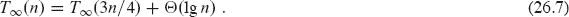

**26        并行算法**

本书中绝大多数算法都是适用于在一次只执行一条指令的单处理器计算机上运行的***串行算法***。本章将我们的算法模型扩展到包括***并行算法***，其中多条指令可以同时执行。具体来说，我们将探讨任务并行算法的优雅模型，这种算法适合于算法设计和分析。我们的研究重点是分叉-合并并行算法，这是最基本且最易理解的任务并行算法。分叉-合并并行算法可以使用简单的语言扩展来清晰地表达，而且在实践中可以高效实现。

并行计算机——具有多个处理单元的计算机——是无处不在的。手持设备、笔记本电脑、台式机和云计算机都是***多核计算机***，或简单地说，***多核***，包含多个处理“核心”。每个处理核心都是一个完整的处理器，可以直接访问共享内存中的任何位置。多核可以通过网络相互���接，聚合成更大的系统，如集群。这些多核集群通常具有***分布式内存***，其中一个多核的内存不能直接被另一个多核的处理器访问。相反，处理器必须通过集群网络向远程多核的处理器发送消息，以请求所需的任何数据。最强大的集群是超级计算机，包含许多成千上万的多核。但由于共享内存编程往往在概念上比分布式内存编程更容易，而且多核计算机广泛可用，本章重点介绍了多核计算机的并行算法。

编程多核的一种方法是***线程并行***。这种以处理器为中心的并行编程模型采用了“虚拟处理器”或***线程***的软件抽象，这些线程共享一个公共内存。每个线程都保持自己的程序计数器，并且可以独立于其他线程执行代码。操作系统将一个线程加载到处理核心上进行执行，并在需要运行另一个线程时将其切换出去。

不幸的是，使用线程编程共享内存的并行计算机往往是困难且容易出错的。其中一个原因是动态地将工作分配给线程，使得每个线程接收大致相同的负载可能会很复杂。对于除了最简单的应用程序之外，程序员必须使用复杂的通信协议来实现一个负载平衡的调度器。

**任务并行编程**

线程编程的困难导致了***任务并行平台***的创建，这些平台在线程之上提供了一层软件来协调、调度和管理多核处理器。一些任务并行平台是作为运行时库构建的，但其他提供了具有编译器和运行时支持的完整并行语言。

***任务并行编程***允许以“处理器无关”的方式指定并行性，程序员可以确定哪些计算任务可以并行运行，但不指示哪个线程或处理器执行任务。因此，程序员不必担心通信协议、负载平衡和线程编程的其他问题。任务并行平台包含一个调度器，它会自动将任务在处理器之间进行负载平衡，从而极大地简化了程序员的工作。***任务并行算法***提供了普通串行算法的自然扩展，允许通过“工作/跨度分析”进行数学推理性能。

**分叉-合并并行性**

尽管任务并行环境的功能仍在不断发展和增强，几乎所有支持 ***分支-合并并行性***，这通常体现在两种语言特性中：***生成*** 和 ***并行循环***。生成允许子例程被“分叉”：像子例程调用一样执行，只是调用者可以继续执行，而生成的子例程计算其结果。并行循环类似于普通的 **for** 循环，只是循环的多个迭代可以同时执行。

***分支-合并*** 并行算法采用生成和并行循环来描述并行性。这种并行模型的一个关键方面，继承自任务并行模型但与线程模型不同的地方在于，程序员不指定计算中必须并行运行的任务，只指定哪些任务 *可以* 并行运行。底层运行时系统使用线程来在处理器之间平衡任务。本章研究了在分支-合并模型中描述的并行算法，以及底层运行时系统如何高效地调度任务并行计算（包括分支-合并计算）。

分支-合并并行性提供了几个重要优势：

+   分支-合并编程模型是本书大部分内容中使用的熟悉串行编程模型的简单扩展。要描述一个分支-合并并行算法，本书中的伪代码只需要增加三个关键字：**parallel**、**spawn** 和 **sync**。从并行伪代码中删除这些并行关键字会导致相同问题的普通串行伪代码，我们称之为并行算法的“串行投影”。

+   底层任务并行模型提供了一种基于“工作”和“跨度”概念来量化并行性的理论上干净的方法。

+   生成允许许多分治算法自然地并行化。此外，正如串行分治算法适合使用递归进行分析一样，分支-合并模型中的并行算法也适合。

+   分支-合并编程模型忠实于多核编程在实践中的演变。越来越多的多核环境支持分支-合并并行编程的一个或另一个变体，包括 Cilk [290, 291, 383, 396], Habanero-Java [466], Java Fork-Join Framework [279], OpenMP [81], Task Parallel Library [289], Threading Building Blocks [376], 和 X10 [82]。

第 26.1 节介绍了并行伪代码，展示了如何将任务并行计算的执行建模为有向无环图，并呈现了工作、跨度和并行性的度量，您可以使用这些度量来分析并行算法。第 26.2 节研究了如何并行相乘矩阵，第 26.3 节解决了设计高效并行归并排序的更困难的问题。

**26.1    分支-合并并行性的基础**

我们对并行编程的探索始于在并行计算斐波那契数的问题上进行递归计算。我们将看一下一个直接的串行斐波那契计算，虽然效率低下，但作为如何在伪代码中表达并行性的良好示例。

请回想一下，斐波那契数由第 69 页的方程式（3.31）定义：

要递归计算第 *n* 个斐波那契数，您可以使用对面页面上的 FIB 过程中的普通串行算法。您实际上不想以这种方式计算大的斐波那契数，因为这种计算会做不必要的重复工作，但并行化可以很有启发性。

FIB (*n*)

| 1 | **if** *n* ≤ 1 |
| --- | --- |
| 2 | **return** *n* |
| 3 | **else** *x* = FIB (*n* − 1) |
| 4 | *y* = FIB (*n* − 2) |
| 5 | **return** *x* + *y* |

要分析这个算法，让 *T* (*n*) 表示 FIB (*n*)的运行时间。由于 FIB (*n*) 包含两个递归调用以及一定量的额外工作，我们得到递归关系

*T* (*n*) = *T* (*n* − 1) + *T* (*n* − 2) + Θ(1).

这个递归的解法 *T* (*n*) = Θ(*F*[*n*])，我们可以通过使用替换法（见第 4.3 节）来建立。为了证明 *T* (*n*) = *O*(*F*[*n*]), 我们采用归纳假设 *T* (*n*) ≤ *aF*[*n*] − *b*，其中 *a* > 1 且 *b* > 0 是常数。代入后，我们得到

| *T* (*n*) | ≤ | (*aF*[*n*−*1*] − *b*) + (*aF*[*n*−*2*] − *b*) + Θ(1) |
| --- | --- | --- |
|  | = | *a*(*F*[*n*−1] + *F*[*n*−2]) − 2*b* + Θ(1) |
|  | ≤ | *aF*[*n*] − *b*, |

如果我们选择足够大的 *b* 来支配Θ(1)项中的上界常数。然后我们可以选择足够大的 *a* 来上界Θ(1)基本情况对于小 *n*。为了证明 *T* (*n*) = Ω(*F[n]*)，我们使用归纳假设 *T* (*n*) ≥ *aF*[*n*] − *b*。代入并按照类似于渐近上界论证的推理，我们通过选择比Θ(1)项中的下界常数更小的 *b* 和足够小的 *a* 来下界Θ(1)基本情况对于小 *n*。然后第 56 页的定理 3.1 建立了 *T* (*n*) = Θ(*F*[*n*])，如所需。由于 *F*[*n*] = Θ(*ϕ*^(*n*))，其中  是黄金比率，根据第 69 页的方程式(3.34)，我们得到

因此，这个过程是计算斐波那契数的一种特别慢的方式，因为它运行时间呈指数增长。（参见第 954 页的问题 31-3 以获取更快的方法。）

让我们看看为什么这个算法是低效的。图 26.1 展示了使用 FIB 过程计算*F*[6]时创建的递归过程实例树。对 FIB(6)的调用递归地调用 FIB(5)，然后调用 FIB(4)。但是，对 FIB(5)的调用也会导致对 FIB(4)的调用。FIB(4)的两个实例都返回相同的结果（*F*[4] = 3）。由于 FIB 过程不进行记忆化（回顾第 368 页对“记忆化”的定义），对 FIB(4)的第二次调用复制了第一次执行的工作，这是一种浪费。

**图 26.1** FIB(6)的调用树。树中的每个节点代表一个过程实例，其子节点是在执行过程中调用的过程实例。由于具有相同参数的每个 FIB 实例执行相同的工作以产生相同的结果，因此通过计算相同内容的大量重复调用，可以看出该算法计算斐波那契数的低效性。树的蓝色阴影部分出现在图 26.2 中的任务并行形式中。

尽管 FIB 过程是计算斐波那契数的一种低效方式，但它可以帮助我们熟悉并行概念。也许最基本的概念是要理解，如果两个并行任务操作完全不同的数据，那么在没有其他干扰的情况下，它们在同时执行时产生的结果与它们依次串行运行时产生的结果相同。例如，在 FIB (*n*)中，第 3 行对 FIB (*n* − 1)的两个递归调用和第 4 行对 FIB (*n* − 2)的递归调用可以安全地并行执行，因为其中一个执行的计算方式不会影响另一个。

**并行关键字**

接下来一页的 P-FIB 过程计算斐波那契数，但使用***并行关键字* spawn**和**sync**来指示伪代码中的并行性。

如果从 P-FIB 中删除关键字**spawn**和**sync**，则得到的伪代码文本与 FIB 相同（除了在标题和两个递归调用中重命名过程）。我们将并行算法的***串行投影***¹定义为忽略并行指令而产生的串行算法，这在这种情况下可以通过省略关键字**spawn**和**sync**来完成。对于**parallel for**循环，我们稍后会看到，我们省略关键字**parallel**。事实上，我们的并行伪代码具有优雅的特性，即其串行投影始终是解决相同问题的普通串行伪代码。

P-FIB(*n*)

| 1 | **if** *n* ≤ 1 |
| --- | --- |
| 2 | **return** *n* |
| 3 | **else** *x* = **spawn** P-FIB(*n*−1) | **//** 不等待子例程返回 |
| 4 | *y* = P-FIB(*n*−2) | **//** 与生成的子例程并行执行 |
| 5 | **sync** | **//** 等待生成的子例程完成 |
| 6 | **return** *x* + *y* |

**并行关键字的语义**

***生成***发生在关键字**spawn**在过程调用之前，如 P-FIB 的第 3 行。生成的语义与普通过程调用不同，执行生成的过程实例——***父进程***—可以继续与生成的子例程——***子进程***—并行执行，而不是等待子进程完成，这在串行执行中会发生。在这种情况下，当生成的子进程计算 P-FIB(*n*−1)时，父进程可以继续在第 4 行并行计算 P-FIB(*n*−2)。由于 P-FIB 过程是递归的，这两个子例程调用本身会创建嵌套并行性，就像它们的子进程一样，从而创建一个潜在的庞大的子计算树，所有这些子计算都在并行执行。

然而，关键字**spawn**并不表示一个过程*必须*与其生成的子进程并行执行，只是表示它*可以*。并行关键字表达了计算的***逻辑并���性***，指示计算的哪些部分可以并行进行。在运行时，由一个***调度器***决定哪些子计算实际上并行运行，通过将它们分配给可用处理器来随着计算的展开。我们将很快讨论任务并行调度器背后的理论（在第 759 页）。

程序在执行**sync**语句之后（如第 5 行）不能安全地使用其生成的子进程返回的值。关键字**sync**表示程序必须等待其所有生成的子进程完成后才能继续执行**sync**之后的语句——这是分支-合并并行计算的“合并”。在第 6 行的**return**语句之前，P-FIB 过程需要一个**sync**，以避免在 P-FIB(*n*−1)完成并将其返回值分配给*x*之前对*x*和*y*求和会发生的异常。除了**sync**语句提供的显式加入同步外，方便的假设是每个过程在返回之前都会隐式执行一个**sync**，从而确保所有子进程在其父进程完成之前完成。

**用于并行执行的图模型**

将并行计算的执行视为动态运行时指令流，由处理器在并行程序的指导下执行的有向无环图*G* = (*V*, *E*)，称为***(并行)跟踪)***。²概念上，*V*中的顶点是执行的指令，*E*中的边表示指令之间的依赖关系，其中(*u*, *v*) ∈ *E*表示并行程序要求指令*u*在指令*v*之前执行。

有时候，如果我们想要关注计算的并行结构，让跟踪的一个顶点仅代表一个执行的指令可能会有些不方便。因此，如果一系列指令不包含任何并行或过程控制（没有**spawn**、**sync**、过程调用或**return**—无论是通过显式的**return**语句还是隐式地在到达过程末尾时发生的返回），我们将整个链组合成一个单独的***链***。例如，图 26.2 展示了在图 26.1 中蓝色阴影部分计算 P-FIB(4)得到的跟踪。链不包括涉及并行或过程控制的指令。这些控制依赖必须在跟踪中表示为边。

当父过程调用子过程时，跟踪中包含一条边（*u*, *v*），从父过程中执行调用的链 *u* 到生成的子过程中的第一个链 *v*，如图 26.2 所示，从 P-FIB(4)中的橙色链到 P-FIB(2)中的蓝色链。当子过程中的最后一个链 *v*′ 返回时，跟踪中包含一条边（*v*′, *u*′）指向链 *u*′，其中 *u*′ 是父过程中 *u* 的后继链，就像从 P-FIB(2)中的白色链到 P-FIB(4)中的白色链的边一样。

**图 26.2** P-FIB(4)的跟踪对应于图 26.1 中阴影部分。每个圆代表一个链，蓝色圆代表在过程（实例）中执行到第 3 行生成 P-FIB(*n* − 1)之前的任何指令；橙色圆代表在第 4 行调用 P-FIB(*n* − 2)直到第 5 行**sync**之前执行的��何指令，然后在**sync**之后暂停，直到 P-FIB(*n* − 1)返回；白色圆代表在**sync**之后执行的任何指令，计算*x*和*y*，直到返回结果的点。属于同一过程的链被分组到一个圆角矩形中，蓝色表示生成的过程，棕色表示调用的过程。假设每个链需要单位时间，工作时间为 17 个时间单位，因为有 17 个链，关键路径的时间为 8 个时间单位，因为关键路径—用蓝色边表示—包含 8 个链。

然而，当父过程生成子过程时，跟踪会有些不同。边（*u*, *v*）从父过程到子过程，就像调用一样，例如从 P-FIB(4)中的蓝色链到 P-FIB(3)中的蓝色链的边，但跟踪还包含另一条边（*u*, *u*′），表示 *u* 的后继链 *u*′ 可以在 *v* 执行时继续执行。从 P-FIB(4)中的蓝色链到 P-FIB(4)中的橙色链的边说明了这样的一条边。与调用一样，子过程中的最后一个链 *v*′ 也有一条边，但是对于生成，它不再指向 *u* 的后继。相反，边是（*v*′, *x*），其中 *x* 是父过程中确保子过程已完成的**sync**后紧随的链，就像从 P-FIB(3)中的白色链到 P-FIB(4)中的白色链的边一样。

您可以确定哪个并行控制创建了特定的跟踪。如果一个链有两个后继，其中一个必定是生成的，如果一个链有多个前驱，前驱是因为**sync**语句而加入。因此，在一般情况下，集合 *V* 形成链的集合，有向边的集合 *E* 表示由并行和过程控制引起的链之间的依赖关系。如果 *G* 包含从链 *u* 到链 *v* 的有向路径，我们说这两个链是***(逻辑上)串行***的。如果在 *G* 中从 *u* 到 *v* 或从 *v* 到 *u* 都没有路径，那么这些链是***(逻辑上)并行***的。

一个 fork-join 并行迹线可以被描绘为嵌入在过程实例的***调用树***中的一组线程的有向无环图。例如，图 26.1 展示了 FIB(6) 的调用树，这也是 P-FIB(6) 的调用树，现在过程实例之间的边代表调用或生成。图 26.2 放大了被蓝色阴影覆盖的子树，展示了构成 P-FIB(4) 中每个过程实例的线程。连接线程的所有有向边要么在一���过程内运行，要么沿着图 26.1 中的调用树的无向边运行。（不是 fork-join 迹线的更一般的任务并行迹线可能包含一些不沿着无向树边运行的有向边。）

我们的分析通常假设并行算法在一个***理想的并行计算机***上执行，该计算机由一组处理器和一个***顺序一致***的共享内存组成。要理解顺序一致性，首先需要知道内存是通过***加载指令***访问的，这些指令将数据从内存中的一个位置复制到处理器内的寄存器，并通过***存储指令***访问，这些指令将数据从处理器寄存器复制到内存中的位置。一行伪代码可能包含几个这样的指令。例如，行 *x* = *y* + *z* 可能导致从内存中获取 *y* 和 *z* 的加载指令到处理器中，一个在处理器内将它们相加的指令，以及一个将结果 *x* 放回内存的存储指令。在并行计算机中，多个处理器可能需要同时加载或存储。顺序一致性意味着即使多个处理器尝试同时访问内存，共享内存的行为就好像来自其中一个处理器的一条指令一次执行一次，即使实际的数据传输可能同时发生。就好像指令按照保持每个处理器执行自己指令的顺序的全局线性顺序依次执行一样。

对于任务并行计算，这些计算会自动由运行时系统调度到处理器上，顺序一致的共享内存的行为就好像并行计算的执行指令按照其迹线的拓扑排序顺序（参见第 20.4 节）一次执行一条一样。也就是说，你可以通过想象单个指令（通常不是线程，可能会聚合许多指令）以保持迹线的偏序的某种线性顺序交错来推理执行。根据调度，线性顺序可能会在程序的每次运行中有所变化，但任何执行的行为总是好像指令按照迹线内的依赖关系在一致的线性顺序中串行执行。

除了对语义做出假设外，理想的并行计算机模型还假设了一些性能假设。具体来说，它假设机器中的每个处理器具有相同的计算能力，并且忽略了调度的成本。尽管这最后一个假设听起来很乐观，但事实证明，对于具有足够“并行性”（稍后我们将精确定义的一个术语）的算法来说，调度的开销在实践中通常是最小的。

**性能指标**

通过***工作/跨度分析***，我们可以衡量任务并行算法的理论效率，这基于两个指标：“工作”和“跨度”。任务并行计算的***工作***是在一个处理器上执行整个计算所需的总时间。换句话说，工作是每个线程所花费的时间之和。如果每个线程都花费单位时间，那么工作就是追踪中的顶点数。***跨度***是在无限数量处理器上执行计算的最快时间，对应于追踪中沿最长路径所花费的线程时间之和，其中“最长”意味着每个线程按其执行时间加权。这样的最长路径称为追踪的***关键路径***，因此跨度是追踪中最长（加权）路径的权重。(第 22.2 节，页面 617-619 展示了如何在Θ(*V* + *E*)时间内找到 dag *G* = (*V*, *E*)中的关键路径。)对于每个线程都花费单位时间的追踪，跨度等于关键路径上的线程数。例如，图 26.2 的追踪总共有 17 个顶点，关键路径上有 8 个顶点，因此如果每个线程花费单位时间，其工作是 17 个时间单位，跨度是 8 个时间单位。

任务并行计算的实际运行时间不仅取决于其工作和跨度，还取决于有多少处理器可用以及调度程序如何将线程分配给处理器。为了表示在*P*个处理器上的任务并行计算的运行时间，我们用*P*作为下标。例如，我们可以用*T*[*P*]表示算法在*P*个处理器上的运行时间。工作是在单个处理器上的运行时间，或者*T*[1]。跨度是如果我们可以让每个线程在自己的处理器上运行的运行时间，换句话说，如果我们有无限数量的处理器，因此我们用*T*[∞]表示跨度。

工作和跨度为任务并行计算在*P*个处理器上的运行时间*T*[*P*]提供了下界：

+   在一步中，具有*P*个处理器的理想并行计算机最多可以执行*P*单位的工作，因此在*T*[*P*]时间内，它最多可以执行*P T[P]*的工作。由于要完成的总工作量为*T*[1]，我们有*P T[P]* ≥ *T*[1]。除以*P*得到***工作定律***：

    

+   一个*P*处理器的理想并行计算机不能比具有无限数量处理器的机器运行得更快。从另一个角度看，具有无限数量处理器的机器可以通过仅使用其中的*P*个处理器来模拟*P*处理器的机器。因此，***跨度定律***成立：

    

我们通过计算在*P*个处理器上的运行时间*T*[1]/*T*[*P*]的比率来定义计算的***加速比***，这表示计算在*P*个处理器上比在一个处理器上运行快多少倍。根据工作定律，我们有*T*[*P*] ≥ *T*[1]/*P*，这意味着*T*[1]/*T*[*P*] ≤ *P*。因此，在*P*处理器的理想并行计算机上的加速比最多为*P*。当加速比与处理器数量呈线性关系时，即*T*[1]/*T*[*P*] = Θ(*P*)时，计算表现出***线性加速***。***完美的线性加速***发生在*T*[1]/*T*[*P*] = *P*。

工作量与跨度的比值*T*[1]/*T*[∞]给出了并行计算的***并行性***。我们可以从三个角度看待并行性。作为比值，并行性表示沿关键路径每一步可以并行执行的平均工作量。作为一个上限，并行性给出了在任意数量的处理器上可以实现的最大可能加速比。也许最重要的是，并行性为实现完美线性加速提供了一个限制。具体来说，一旦处理器数量超过并行性，计算就不可能实现完美线性加速。为了看到这一点，假设*P* > *T*[1]/*T*[∞]，在这种情况下，跨度定律意味着加速比满足*T*[1]/*T*[*P*] ≤ *T*[1]/*T*[∞] < *P*。此外，如果理想并行计算机中的处理器数量*P*远远超过并行性，即如果*P* ≫ *T*[1]/*T*[∞]，那么*T*[1]/*T*[*P*] ≪ *P*，因此加速比远远小于处理器数量。换句话说，如果处理器数量超过并行性，即使再增加更多处理器，加速比也会变得不那么完美。

举个例子，考虑在图 26.2 中计算 P-FIB(4)，假设每个线程花费单位时间。由于工作量为*T*[1] = 17，跨度为*T*[∞] = 8，因此并行性为*T*[1]/*T*[∞] = 17/8 = 2.125。因此，无论有多少处理器执行计算，都不可能实现远远超过两倍的性能。然而，对于更大的输入大小，我们将看到 P-FIB(*n*)表现出相当大的并行性。

我们定义在具有*P*个处理器的理想并行计算机上执行的任务并行计算的***(并行)松弛度***为比值(*T*[1]/*T*[∞])/*P* = *T*[1]/(*P T*[∞])，这是计算的并行性超过机器处理器数量的因子。重新陈述关于加速比的界限，如果松弛度小于 1，完美线性加速是不可能的，因为*T*[1]/(*P T*[∞]) < 1，跨度定律意味着*T*[1]/*T*[*P*] ≤ *T*[1]/*T*[∞] < *P*。实际上，随着松弛度从 1 减小并接近 0，计算的加速比与完美线性加速之间的差距进一步扩大。如果松弛度小于 1，算法中的额外并行性可以对其执行效率产生巨大影响。然而，如果松弛度大于 1，工作量每处理器是限制性约束。我们将看到，随着松弛���从 1 增加，一个好的调度程序可以实现接近完美线性加速。但是一旦松弛度远远大于 1，额外并行性的优势将呈现递减回报。

**调度**

优秀的性能不仅仅取决于最小化工作量和跨度。这些线程还必须有效地安排到并行计算机的处理器上。我们的 fork-join 并行编程模型不提供程序员指定哪些线程在哪些处理器上执行的方法。相反，我们依赖于运行时系统的调度程序将动态展开的计算映射到各个处理器上。在实践中，调度程序将线程映射到静态线程，操作系统将线程调度到处理器上。但是这种额外的间接层对我们理解调度是不必要的。我们可以想象调度程序直接将线程映射到处理器。

任务并行调度器必须在不知道何时生成过程或何时完成它们的情况下调度计算 - 也就是说，它必须在***在线***操作。此外，一个好的调度器以分布式方式运行，在其中实现调度器的线程合作以平衡负载计算。可以证明，良好的在线、分布式调度器存在，但分析它们很复杂。为了保持我们的分析简单，我们将考虑一个在线***集中***调度器，它在任何时刻都知道计算的全局状态。

特别地，我们将分析***贪婪调度器***，它在每个时间步骤中将尽可能多的线索分配给处理器，如果有工作可以完成，则永远不会让处理器空闲。我们将对贪婪调度器的每个步骤进行分类：

+   ***完整步骤***：至少*P*条线索准备好执行，这意味着它们所依赖的所有线索都已执行完毕。贪婪调度器将准备好的任何*P*条线索分配给处理器，完全利用所有处理器资源。

+   ***不完整步骤***：少于*P*条线索准备执行。贪婪调度器将每个准备好的线索分配给各自的处理器，导致一些处理器在该步骤中空闲，但执行所有准备好的线索。

工作定律告诉我们，在*P*处理器上我们可以希望的最快运行时间*T*[*P*]必须至少为*T*[1]/*P*。跨度定律告诉我们，最快可能的运行时间必须至少为*T*[∞]。以下定理表明，贪婪调度在达到这两个下界的总和作为上界方面是可以证明的好的。

***定理 26.1***

在具有*P*处理器的理想并行计算机上，贪婪调度器在时间内执行任务并行计算的工作*T*[1]和跨度*T*[∞]

***证明*** 无损失地假设每个线索花费单位时间。（如有必要，将每个较长的线索替换为一系列单位时间线索。）我们将分别考虑完整和不完整步骤。

在每个完整步骤中，*P*个处理器共同执行*P*个工作。因此，如果完整步骤的数量为*k*，则执行所有完整步骤的总工作量为*kP*。由于贪婪调度器不会执行任何线索超过一次，且只需执行*T*[1]的工作，因此得出*kP*≤*T*[1]，从中我们可以得出完整步骤的数量*k*最多为*T*[1]/*P*。

现在，让我们考虑一个不完整的步骤。让*G*是整个计算的跟踪，让*G*′是在不完整步骤开始时尚未执行的子跟踪，让*G*″是在不完整步骤后剩余要执行的子跟踪。考虑在不完整步骤开始时准备好的线索集合*R*，其中|*R*|<*P*。根据定义，如果一个线索准备好，那么它的所有前导线索都已执行。因此，*R*中线索的前导线索不属于*G*′。*G*′中的最长路径必须从*R*中的一条线索开始，因为*G*′中的每条其他线索都有一个前导线索，因此不能开始最长路径。由于贪婪调度器在不完整步骤中执行所有准备好的线索，*G*″中的线索正好是*G*′中减去*R*中的线索。因此，*G*″中最长路径的长度必须比*G*′中最长路径的长度少 1。换句话说，每个不完整步骤将要执行的跟踪的跨度减少 1。因此，不完整步骤的数量最多为*T*[∞]。

由于每个步骤要么完成，要么不完整，所以定理成立。

▪

以下推论表明贪婪调度器始终表现良好。

***推论 26.2***

任何在*P*处理器理想并行计算机上由贪婪调度器调度的任务并行计算的运行时间*T*[*P*]在最优解的范围内。

***证明*** 让*T**[*P*]表示在具有*P*个处理器的机器上由最佳调度器产生的运行时间，*T*[1]和*T*[∞]分别表示计算的工作量和跨度。由于工作和跨度定律——不等式（26.2）和（26.3）给出了，定理 26.1 暗示着

▪

下一个推论表明，实际上，随着松弛度的增加，贪婪调度器在任何任务并行计算上实现了接近完美的线性加速。

***推论 26.3***

让*T*[*P*]表示贪婪调度器在理想并行计算机上使用*P*个处理器产生的任务并行计算的运行时间，*T*[1]和*T*[∞]分别表示计算的工作量和跨度。那么，如果*P* ≪ *T*[1]/*T*[∞]，或者等价地，并行松弛度远大于 1，我们有*T*[*P*] ≈ *T*[1]/*P*，近似为*P*的加速。

***证明*** 如果我们假设*P* ≪ *T*[1]/*T*[∞]，那么可以得出*T*[∞] ≪ *T*[1]/*P*，因此根据定理 26.1，有*T*[*P*] ≤ *T*[1]/*P* + *T*[∞] ≈ *T*[1]/*P*。由于工作定律（26.2）规定*T*[*P*] ≥ *T*[1]/*P*，我们得出*T*[*P*] ≈ *T*[1]/*P*，这是*T*[1]/*T*[*P*] ≈ *P*的加速。

▪

≪符号表示“远小于”���但“远小于”是多少呢？一般来说，至少有 10 倍于处理器数量的并行度，通常足以实现良好的加速。然后，贪婪界限中的跨度项，不等式（26.4），小于每处理器工作量项的 10%，对于大多数工程情况来说已经足够好。例如，如果一个计算仅在 10 或 100 个处理器上运行，那么将并行度从 1,000,000 降低到 10,000 是没有意义的，即使有 100 倍的差异。正如问题 26-2 所示，有时减少极端并行度会产生在其他方面更好的算法，并且在合理数量的处理器上仍然能够良好扩展。

**分析并行算法**

现在我们拥有分析并行算法所需的所有工具，使用工作/跨度分析，我们可以限制算法在任意数量的处理器上的运行时间。分析工作相对简单，因为它实际上就是分析普通串行算法的运行时间，即并行算法的串行投影。你应该已经熟悉分析工作，因为这本教材的大部分内容都是关于这个的！分析跨度是并行性带来的新事物，但一旦掌握了，通常并不难。让我们使用 P-FIB 程序探讨基本思想。

分析 P-FIB(*n*)的工作量*T*1 并不困难，因为我们已经做过了。P-FIB 的串行投影实际上就是原始的 FIB 过程，因此根据方程（26.1），我们有*T*1 = *T*(*n*) = Θ(*ϕ*^(*n*))。

图 26.3 说明了如何分析跨度。如果两个轨迹串联，它们的跨度相加形成组合的跨度，而如果它们并联，组合的跨度是两个轨迹跨度的最大值。事实证明，任何分叉-合并并行计算的轨迹都可以通过串并联组合从单根线构建起来。

**图 26.3** 并行轨迹的串并联组合。**(a)** 当两个轨迹串联时，组合的工作量是它们工作量的总和，组合的跨度是它们跨度的总和。**(b)** 当两个轨迹并联时，组合的工作量仍然是它们工作量的总和，但组合的跨度只是它们跨度的最大值。

有了对串行-并行组合的理解，我们可以分析 P-FIB (*n*) 的跨度。第 3 行中对 P-FIB (*n* − 1) 的生成调用与第 4 行中对 P-FIB (*n* − 2) 的调用并行运行。因此，我们可以将 P-FIB (*n*) 的跨度表示为递归关系

| *T*∞ | = | max {*T*∞, *T*∞} + Θ(1) |
| --- | --- | --- |
|  | = | *T*∞ + Θ(1), |

其中解为 *T*∞ = Θ(*n*)。（上述第二个等式来自于第一个，因为 P-FIB (*n* − 1) 在计算中使用了 P-FIB (*n* − 2)，所以 P-FIB (*n* − 1) 的跨度至少与 P-FIB (*n* − 2) 的跨度一样大。）

P-FIB (*n*) 的并行性为 *T*1/*T*∞ = Θ(*ϕ*^(*n*)/*n*)，随着 *n* 的增大而急剧增长。因此，推论 26.3 告诉我们，即使在最大的并行计算机上，对于 P-FIB (*n*)，一个适度的 *n* 值就足以实现接近完美的线性加速，因为该过程表现出相当大的并行松弛度。

**并行循环**

许多算法包含循环，其中所有迭代都可以并行操作。虽然 **spawn** 和 **sync** 关键字可以用于并行化这样的循环，但更方便的是直接指定这样的循环的迭代可以并行运行。我们的伪代码通过 **parallel** 关键字提供了这种功能，该关键字在 **for** 循环语句的 **for** 关键字之前。

举例来说，考虑将一个 *n* × *n* 方阵 *A* = (*a[ij]*) 乘以一个 *n* 向量 *x* = (*x*[*j*]) 的问题。得到的 *n* 向量 *y* = (*y*[*i*]) 由方程给出

对于 *i* = 1, 2, … , *n*。P-MAT-VEC 过程通过并行计算 *y* 的所有条目来执行矩阵-向量乘法（实际上，*y* = *y* + *Ax*）。P-MAT-VEC 中第 1 行的 **parallel for** 关键字表示循环体的 *n* 次迭代（包括一个串行 **for** 循环）可以并行运行。如果需要，初始化 *y* = 0 应该在调用该过程之前执行（可以使用 **parallel for** 循环完成）。

P-MAT-VEC (*A*, *x*, *y*, *n*)

| 1 | **parallel for** *i* = 1 **to** *n* | **//** 并行循环 |
| --- | --- | --- |
| 2 | **for** *j* = 1 **to** *n* | **//** 串行循环 |
| 3 | *y*[*i*] = *y*[*i*] + *a*[*ij*] *x*[*j*] |

用于 fork-join 并行程序的编译器可以通过使用递归生成来实现 **parallel for** 循环，例如，对于第 1–3 行中的 **parallel for** 循环，编译器可以生成辅助子程序 P-MAT-VEC-RECURSIVE 并在编译后的代码中的循环位置调用 P-MAT-VEC-RECURSIVE (*A*, *x*, *y*, *n*, 1, *n*)。正如 图 26.4 所示，该过程递归地生成循环的前一���迭代以并行执行（第 5 行），与后一半迭代（第 6 行）并行执行，然后执行 **sync**（第 7 行），从而创建一个并行执行的二叉树。每个叶子代表一个基本情况，即第 2–3 行的串行 **for** 循环。 

P-MAT-VEC-RECURSIVE (*A*, *x*, *y*, *n*, *i*, *i′*)

| 1 | **if** *i* == *i*′ | **//** 只有一个迭代要执行？ |
| --- | --- | --- |
| 2 | **for** *j* = 1 **to** *n* | **//** 模拟 P-MAT-VEC 串行循环 |
| 3 | *y*[*i*] = *y*[*i*] + *a*[*ij*] *x*[*j*] |
| 4 | **else** *mid* = ⌊(*i* + *i*′)/2⌋ | **//** 并行分治 |
| 5 | **spawn** P-MAT-VEC-RECURSIVE (*A*, *x*, *y*, *n*, *i*, *mid*) |
| 6 | P-MAT-VEC-RECURSIVE (*A*, *x*, *y*, *n*, *mid* + 1, *i′*) |
| 7 | **sync** |

要计算 *n*×*n* 矩阵上 P-MAT-VEC 的工作量 *T*1，只需计算其串行投影的运行时间，这是通过将第 1 行中的 **parallel for** 循环替换为普通 **for** 循环得到的。结果串行伪代码的运行时间是 Θ(*n*²)，这意味着 *T*1 = Θ(*n*²)。然而，这种分析似乎忽略了在实现并行循环中递归生成的开销。实际上，与串行投影相比，递归生成的开销会增加并行循环的工作量，但不是渐近的。要了解原因，观察到由于递归过程实例的树是完全二叉树，内部节点的数量比叶子节点的数量少一个（参见第 1175 页的练习 B.5-3）。每个内部节点执行常数工作来划分迭代范围，每个叶子对应于一个基本情况，这至少需要常数时间（在这种情况下是 Θ(*n*) 时间）。因此，通过将递归生成的开销摊销到叶子中的迭代工作上，我们看到总体工作量最多增加一个常数因子。

**图 26.4** 计算 P-MAT-VEC-RECURSIVE (*A*, *x*, *y*, 8, 1, 8) 的跟踪。每个圆角矩形内的两个数字给出了调用过程（蓝色的生成或棕色的调用）中最后两个参数（过程头部中的 *i* 和 *i*′）的值。蓝色圆圈代表过程到第 5 行中 P-MAT-VEC-RECURSIVE 生成的部分。橙色圆圈代表过程调用第 6 行中 P-MAT-VEC-RECURSIVE 到第 7 行中 **sync** 的部分，直到生成的子例程在第 5 行返回。白色圆圈代表过程中 **sync** 后的（可忽略的）部分，直到返回点。

为了减少递归生成的开销，任务并行平台有时会通过在单个叶子节点中执行多个迭代来***粗化***递归的叶子，这可能是自动的，也可能由程序员控制。这种优化是以减少并行性为代价的。然而，如果计算具有足够的并行松弛度，几乎完美的线性加速不会被牺牲。

尽管递归生成在渐近情况下不会影响���行循环的工作量，但在分析跨度时必须考虑它。考虑一个具有 *n* 次迭代的并行循环，其中第 *i* 次迭代的跨度为 *iter*∞。由于递归深度对迭代次数的对数是对数级的，因此并行循环的跨度是

*T*∞ = Θ(lg *n*) + max {*iter*∞ : 1 ≤ *i* ≤ *n*}.

例如，让我们计算 P-MAT-VEC 的第 1-3 行中双重嵌套循环的跨度。**parallel for** 循环控制的跨度是 Θ(lg *n*)。对于外部并行循环的每次迭代，内部串行 **for** 循环包含第 3 行的 *n* 次迭代。由于每次迭代都需要常数时间，无论它在外部 **parallel for** 循环的哪次迭代中，内部串行 **for** 循环的总跨度都是 Θ(*n*)。因此，取外部循环的所有迭代中的最大值，并加上循环控制的 Θ(lg *n*)，得到过程的总跨度为 *T*[∞]*n* = Θ(*n*) + Θ(lg *n*) = Θ(*n*)。由于工作量是 Θ(*n*²)，并行性是 Θ(*n*²)/Θ(*n*) = Θ(*n*)。（练习 26.1-7 要求您提供更多并行性的实现。）

**竞争条件**

如果并行算法在多核计算机上调度指令时，无论如何都会在相同的输入上执行相同的操作，则该算法是***确定性***的。如果在相同输入时其行为可能会因运行而异，则该算法是***非确定性***的。即使旨在是确定性的并行算法也可能表现为非确定性，如果其中包含一个难以诊断的错误，称为“确定性竞争”。

著名的竞争错误包括 Therac-25 放射治疗机，导致三人死亡和多人受伤，以及 2003 年的东北大停电，导致美国超过 5000 万人断电。这些有害的错误极其难以发现。您可以在实验室中运行测试数天而不出现故障，只能发现您的软件在现场偶尔崩溃，有时后果严重。

当两个逻辑上并行的指令访问相同的内存位置，并且其中至少一个指令修改了该位置存储的值时，就会发生***确定性竞争***。下一页上的玩具过程 RACE-EXAMPLE 说明了确定性竞争。在第 1 行将*x*初始化为 0 后，RACE-EXAMPLE 创建了两个并行线程，每个线程在第 3 行中递增*x*。尽管调用 RACE-EXAMPLE 似乎应始终打印值 2（其串行投影肯定会这样做），但它可能会打印值 1。让我们看看这种异常可能发生的情况。

当处理器递增*x*时，该操作并非不可分割，而是由一系列指令组成：

**图 26.5** RACE-EXAMPLE 中确定性竞争的示例。**(a)** 显示各个指令之间依赖关系的跟踪。处理器寄存器为*r*[1]和*r*[2]。省略了与竞争无关的指令，如循环控制的实现。**(b)** 引发错误的执行序列，显示了执行序列中每个步骤中*x*在内存和寄存器*r*[1]和*r*[2]中的值。

RACE-EXAMPLE ( )

| 1 | *x* = 0 |
| --- | --- |
| 2 | **并行循环** *i* = 1 **到** 2 |
| 3 | *x* = *x* + 1 | **//** 确定性竞争 |
| 4 | 打印*x* |

+   从内存中加载*x*到处理器的一个寄存器中。

+   递增寄存器中的值。

+   将寄存器中的值存回内存中的*x*。

图 26.5(a)展示了代表 RACE-EXAMPLE 执行的跟踪，将各个指令分解为单独的指令。请记住，由于理想的并行计算机支持顺序一致性，您可以将并行算法的并行执行视为在跟踪中尊重依赖关系的指令交错执行。图中的(b)部分显示了引发异常计算的执行中的值。值*x*保留在内存中，*r*[1]和*r*[2]是处理器寄存器。在第 1 步中，其中一个处理器将*x*设置为 0。在第 2 和第 3 步中，处理器 1 将*x*从内存加载到其寄存器*r*[1]中，并对其进行递增，将值 1 存储在*r*[1]中。此时，处理器 2 开始执行指令 4-6。处理器 2 将*x*从内存加载到寄存器*r*[2]中；递增它，将值 1 存储在*r*[2]中；然后将此值存储到*x*中，将*x*设置为 1。现在，处理器 1 在第 7 步中恢复，将*r*[1]中的值 1 存储到*x*中，这使*x*的值保持不变。因此，第 8 步打印值 1，而不是串行投影将打印的值 2。

让我们回顾一下发生了什么。根据顺序一致性，并行执行的效果就好像两个处理器的执行指令交错。如果处理器 1 在处理器 2 之前执行所有指令，一个微不足道的交错，值为 2 被打印出来。相反，如果处理器 2 在处理器 1 之前执行所有指令，值 2 仍然被打印出来。然而，当两个处理器的指令交错得更复杂时，就像这个例子中的执行一样，*x*的更新之一可能会丢失，导致值 1 被打印出来。

当然，许多执行不会引发错误。这就是确定性竞争的问题所在。通常，大多数指令排序会产生正确的结果，比如左分支上的指令在右分支上的指令之前执行，反之亦然。但是，当指令交错时，有些排序会生成不正确的结果。因此，竞争可能非常难以测试。你的程序可能会失败，但你可能无法在后续测试中可靠地重现失败，使你难以定位代码中的错误并修复它。任务并行编程环境通常提供竞争检测工具，帮助你隔离竞争错误。

现实世界中许多并行程序是有意的非确定性的。它们包含确定性竞争，但通过使用互斥锁和其他同步方法来减轻非确定性的危险。然而，对于我们的目的，我们将坚持在我们开发的算法中没有确定性竞争。非确定性程序确实很有趣，但非确定性编程是一个更高级的主题，对于许多有趣的并行算法来说是不必要的。

为了确保算法是确定性的，任何并行操作的两个线程应该是***相互不干扰的***：它们只读取，而不修改，它们都访问的任何内存位置。因此，在**并行循环**结构中，比如 P-MAT-VEC 的外部循环，我们希望循环体的��有迭代，包括迭代在子程序中执行的任何代码，都是相互不干扰的。在**spawn**和其对应的**sync**之间，我们希望由生成的子进程执行的代码和父进程执行的代码是相互不干扰的，再次包括调用的子程序。

作为一个写有意外竞争的代码的例子，下一页的 P-MAT-VEC-WRONG 过程是一个错误的矩阵-向量乘法的并行实现，通过并行化内部**for**循环实现Θ(lg *n*)的跨度。不幸的是，这个过程是不正确的，因为在第 3 行更新*y*[*i*]时存在确定性竞争，它并行执行所有*j*值的*n*。

**并行循环**循环的索引变量，比如第 1 行的*i*和第 2 行的*j*，不会导致迭代之间的竞争。从概念上讲，循环的每次迭代都会创建一个独立的变量来保存该迭代的索引，而在该迭代执行循环体时。即使两个并行迭代都访问相同的索引变量，它们实际上是在访问不同的变量实例——因此是不同的内存位置——并且不会发生竞争。

P-MAT-VEC-WRONG (*A*, *x*, *y*, *n*)

| 1 | **并行循环** *i* = 1 **到** *n* |
| --- | --- |
| 2 | **并行循环** *j* = 1 **到** *n* |
| 3 | *y*[*i*] = *y*[*i*] + *a*[*ij*]*x*[*j*] | **//** 确定性竞争 |

具有竞争的并行算法有时可能是确定性的。例如，两个并行线程可能将相同的值存储到共享变量中，而无论哪个线程先存储值都无关紧要。然而，为简单起见，我们通常更喜欢没有确定性竞争的代码，即使竞争是良性的。而且，良好的并行程序员会对导致非确定性行为的确定性竞争代码不满意，如果有可比较的确定性代码的话。

但是，非确定性代码确实有其存在的理由��例如，你无法实现并行哈希表，这是一种非常实用的数据结构，而不编写包含确定性竞争的代码。许多研究集中在如何扩展分叉-合并模型以包含有限的“结构化”非确定性，同时避免当非确定性完全无限制时出现的各种复杂性。

**国际象棋课**

为了说明工作/跨度分析的力量，本节将以许多年前开发的第一个世界级并行国际象棋程序之一[106]发生的一个真实故事作为结尾。下面的时间已经被简化以便阐述。

国际象棋程序是在一个 32 处理器计算机上开发和测试的，但它被设计为在一个拥有 512 个处理器的超级计算机上运行。由于超级计算机的可用性有限且昂贵，开发人员在小型计算机上运行基准测试，并将性能推广到大型计算机。

有一次，开发人员将一个优化引入程序，将其在小型机器上的重要基准测试的运行时间从*T*[32] = 65 秒减少到秒。然而，开发人员使用工作和跨度性能指标得出结论，即在 32 个处理器上更快的优化版本实际上会比大型机器上的 512 个处理器上的原始版本更慢。因此，他们放弃了这个“优化”。

这是他们的工作/跨度分析。程序的原始版本的工作量为*T*[1] = 2048 秒，跨度为*T*[∞]= 1 秒。让我们将第 760 页上的不等式(26.4)视为方程*T*[*P*] = *T*[1]/*P* + *T*[∞]，我们可以将其用作在*P*处理器上的运行时间的近似值。然后，我们确实有*T*[32] = 2048/32 + 1 = 65。通过优化，工作量变为*T*′[1] = 1024 秒，跨度变为*T*′[∞] = 8 秒。我们的近似值为*T*′[32] = 1024/32 + 8 = 40。

然而，当我们在 512 个处理器上估算它们的运行时间时，这两个版本的相对速度会发生变化。第一个版本的运行时间为*T*[512] = 2048/512+1 = 5 秒，而第二个版本在秒内运行。在 32 个处理器上加速程序的优化使程序在 512 个处理器上运行时间加倍！优化版本的跨度为 8，在 32 个处理器上的运行时间中不是主导项，但在 512 个处理器上成为主导项，抵消了使用更多处理器的优势。优化不能扩展。

故事的寓意是，工作/跨度分析和工作和跨度的测量，可以比单纯测量运行时间更好地推断算法的可扩展性。

**练习**

***26.1-1***

串行算法的执行跟踪是什么样的？

***26.1-2***

假设 P-FIB 的第 4 行生成 P-FIB(*n* − 2)，而不是像伪代码中所做的那样调用它。P-FIB(4)在图 26.2 中的跟踪会如何改变？对渐近工作量、跨度和并行性有什么影响？

***26.1-3***

绘制执行 P-FIB(5)所产生的跟踪。假设计算中的每个线程都需要单位时间，计算的工作量、跨度和并行性是多少？展示如何使用贪婪调度在 3 个处理器上安排跟踪，通过为每个线程标记执行的时间步骤。

***26.1-4***

证明贪婪调度器实现了以下时间界，这比定理 26.1 中证明的界稍微更强：

***26.1-5***

构建一个跟踪，其中一个贪婪调度器的执行时间几乎是另一个贪婪调度器在相同数量的处理器上的执行时间的两倍。描述这两个执行将如何进行。

***26.1-6***

Karan 教授在理想的并行计算机上使用贪婪调度器在 4、10 和 64 个处理器上测量她的确定性任务并行算法。她声称三次运行分别为 *T*[4] = 80 秒，*T*[10] = 42 秒和 *T*[64] = 10 秒。证明教授要么在撒谎，要么不称职。(*提示:* 使用工作定律（26.2）、跨度定律（26.3）和 Exercise 26.1-4 中的不等式（26.5）)

***26.1-7***

给出一个并行算法，将一个 *n* × *n* 矩阵乘以一个 *n*-向量，实现 Θ(*n*²/lg *n*) 的并行性，同时保持 Θ(*n*²) 的工作量。

***26.1-8***

分析过程 P-TRANSPOSE 的工作量、跨度和并行性，该过程在原地转置一个 *n* × *n* 矩阵 *A*。

P-TRANSPOSE (*A*, *n*)

| 1 | **并行 for** *j* = 2 **到** *n* |
| --- | --- |
| 2 | **并行 for** *i* = 1 **到** *j* − 1 |
| 3 | 交换 *a*[*ij*] 和 *a*[*ji*] |

***26.1-9***

假设在第 2 行的 **并行 for** 循环中，Exercise 26.1-8 中的 P-TRANSPOSE 程序有一个普通的 **for** 循环。分析得到的算法的工作量、跨度和并行性。

***26.1-10***

对于多少个处理器，两个版本的国际象棋程序运行速度相同，假设 *T*[*P*] = *T*[1]/*P* + *T*[∞]？

**26.2    并行矩阵乘法**

在本节中，我们将探讨如何并行化第 4.1 节和第 4.2 节中的三个矩阵乘法算法。我们将看到每个算法都可以使用并行循环或递归生成直接进行简单并行化。我们将使用工作/跨度分析对它们进行分析，并且我们将看到每个并行算法在一个处理器上达到与其对应的串行算法相同的性能，同时可以扩展到大量处理器。

**使用并行循环进行矩阵乘法的并行算法**

我们将研究的第一个算法是 P-MATRIX-MULTIPLY，它简单地将页面 81 上的 MATRIX-MULTIPLY 过程中的两个外部循环并行化。

P-MATRIX-MULTIPLY (*A*, *B*, *C*, *n*)

| 1 | **并行 for** *i* = 1 **到** *n* | **//** 计算每个 *n* 行中的条目 |
| --- | --- | --- |
| 2 | **并行 for** *j* = 1 **到** *n* | **//** 计算第 *i* 行的 *n* 个条目 |
| 3 | **for** *k* = 1 **到** *n* |  |
| 4 | *c*[*ij*] = *c*[*ij*] + *a*[*ik*] · *b*[*kj*] | **//** 添加方程式（4.1）的另一个项 |

让我们分析 P-MATRIX-MULTIPLY。由于算法的串行投影只是 MATRIX-MULTIPLY，因此工作量与 MATRIX-MULTIPLY 的运行时间相同：*T*1 = Θ(*n*³)。跨度为 *T*∞ = Θ(*n*)，因为它遵循从第 1 行开始的 **并行 for** 循环的递归树路径，然后遵循从第 2 行开始的 **并行 for** 循环的递归树路径，然后执行从第 3 行开始的普通 **for** 循环的所有 *n* 次迭代，导致总跨度为 Θ(lg *n*) + Θ(lg *n*) + Θ(*n*) = Θ(*n*)。因此，并行性为 Θ(*n*³)/Θ(*n*) = Θ(*n*²)。（Exercise 26.2-3 要求您并行化内部循环，以获得 Θ(*n*³/lg *n*) 的并行性，但您不能直接使用 **并行 for** 进行，因为这样会产生竞争。）

**用于矩阵乘法的并行分治算法**

第 4.1 节 展示了如何使用分治策略在 Θ(*n*³) 时间内串行相乘 *n* × *n* 矩阵。让我们看看如何使用递归生成来并行化该算法，而不是调用。

在第 83 页的串行 MATRIX-MULTIPLY-RECURSIVE 过程以三个*n*×*n*矩阵*A*、*B*和*C*作为输入，并通过递归执行矩阵计算*C* = *C* + *A* · *B*，通过递归执行*A*和*B*的*n*/2×*n*/2 子矩阵的八次乘法。以下一页的 P-MATRIX-MULTIPLY-RECURSIVE 过程实现了相同的分治策略，但使用生成并行执行八次乘法。为了避免在更新*C*的元素时出现确定性竞争，它创建一个临时矩阵*D*来存储四个子矩阵乘积。最���，它将*C*和*D*相加以产生最终结果。（问题 26-2 要求您消除临时矩阵*D*，以牺牲一些并行性。）

第 2-3 行的 P-MATRIX-MULTIPLY-RECURSIVE 处理了将 1×1 矩阵相乘的基本情况。该过程的其余部分处理递归情况。第 4 行分配了一个临时矩阵*D*，第 5-7 行将其清零。第 8 行将四个矩阵*A*、*B*、*C*和*D*分成*n*/2×*n*/2 的子矩阵。（与第 83 页的 MATRIX-MULTIPLY-RECURSIVE 一样，我们忽略了如何使用索引计算来表示矩阵的子矩阵部分的微妙问题。）第 9 行中的生成递归调用设置*C*[11] = *C*[11] + *A*[11] · *B*[11]，使得*C*[11]累积了第一个方程(4.5)第 82 页中的两项中的第一项。类似地，第 10-12 行并行地使*C*[12]、*C*[21]和*C*[22]分别累积方程(4.6)-(4.8)中的第一项。第 13 行将子矩阵*D*[11]设置为子矩阵乘积*A*[12] · *B*[21]，使得*D*[11]等于方程(4.5)中的第二项。第 14-16 行并行地将*D*[12]、*D*[21]和*D*[22]分别设置为方程(4.6)-(4.8)中的第二项。第 17 行中的**sync**语句确保在第 9-16 行生成的所有子矩阵乘积计算完毕后，第 18-20 行的嵌套**parallel for**循环将*D*的元素加到相应的*C*元素上。

P-MATRIX-MULTIPLY-RECURSIVE (*A*, *B*, *C*, *n*)

|   1 | **if** *n* == 1 | **//** 每个矩阵只有一个元素？ |
| --- | --- | --- |
|   2 | *c*[11] = *c*[11] + *a*[11] · *b*[11] |
|   3 | **return** |
|   4 | let *D* be a new *n* × *n* matrix | **//** 临时矩阵 |
|   5 | **parallel for** *i* = 1 **to** *n* | **//** 设置*D* = 0 |
|   6 | **parallel for** *j* = 1 **to** *n* |
|   7 | *d*[*ij*] = 0 |
|   8 | 将*A*、*B*、*C*和*D*分成*n*/2×*n*/2 的子矩阵*A*[11]、*A*[12]、*A*[21]、*A*[22]；*B*[11]、*B*[12]、*B*[21]、*B*[22]；*C*[11]、*C*[12]、*C*[21]、*C*[22]；以及*D*[11]、*D*[12]、*D*[21]、*D*[22]；分别 |
|   9 | **spawn** P-MATRIX-MULTIPLY-RECURSIVE (*A*[11], *B*[11], *C*[11], *n*/2) |
| 10 | **spawn** P-MATRIX-MULTIPLY-RECURSIVE (*A*[11], *B*[12], *C*[12], *n*/2) |
| 11 | **spawn** P-MATRIX-MULTIPLY-RECURSIVE (*A*[21], *B*[11], *C*[21], *n*/2) |
| 12 | **spawn** P-MATRIX-MULTIPLY-RECURSIVE (*A*[21], *B*[12], *C*[22], *n*/2) |
| 13 | **spawn** P-MATRIX-MULTIPLY-RECURSIVE (*A*[12], *B*[21], *D*[11], *n*/2) |
| 14 | **spawn** P-MATRIX-MULTIPLY-RECURSIVE (*A*[12], *B*[22], *D*[12], *n*/2) |
| 15 | **spawn** P-MATRIX-MULTIPLY-RECURSIVE (*A*[22], *B*[21], *D*[21], *n*/2) |
| 16 | **spawn** P-MATRIX-MULTIPLY-RECURSIVE (*A*[22], *B*[22], *D*[22], *n*/2) |
| 17 | **sync** | **//** 等待生成的子矩阵乘积 |
| 18 | **parallel for** *i* = 1 **to** *n* | **//** 更新*C* = *C* + D |
| 19 | **parallel for** *j* = 1 **to** *n* |
| 20 | *c*[*ij*] = *c*[*ij*] + *d*[*ij*] |

让我们分析 P-MATRIX-MULTIPLY-RECURSIVE 过程。我们首先分析工作*M*1，回声其前身 MATRIX-MULTIPLY-RECURSIVE 的串行运行时间分析。递归情况下，在Θ(*n*²)的时间内分配并将临时矩阵*D*清零，以Θ(1)的时间分区，执行*n*/2 × *n*/2 矩阵的八次递归乘法，最后从添加两个*n*×*n*矩阵中得到Θ(*n*²)的工作。因此，在生成的递归调用之外的工作是Θ(*n*²)，工作*M*1 的递归变为

| *M*1 | = | 8*M*1 + Θ(*n*²) |
| --- | --- | --- |
|  | = | Θ(*n*³) |

通过主定理（定理 4.1）的情况 1。毫不奇怪，这个并行算法的工作量与第 81 页的 MATRIX-MULTIPLY 过程及其三重嵌套循环的运行时间渐进相同。

让我们确定 P-MATRIX-MULTIPLY-RECURSIVE 的跨度*M*∞。因为八个并行递归生成都在相同大小的矩阵上执行，任何递归生成的最大跨度只是单个递归生成的跨度，或*M*∞。在第 5-7 行的双重嵌套**并行 for**循环的跨度为Θ(lg *n*)，因为每个循环控制将Θ(lg *n*)添加到第 7 行的常数跨度中。类似地��第 18-20 行的双重嵌套**并行 for**循环添加了另外一个Θ(lg *n*)。通过索引计算的矩阵分区具有Θ(1)的跨度，被嵌套循环的Θ(lg *n*)跨度所主导。我们得到递归关系

由于这个递归属于主定理的情况 2，其中*k* = 1，解决方案为*M*∞ = Θ(lg² *n*)。

P-MATRIX-MULTIPLY-RECURSIVE 的并行性为*M*1/*M*∞ = Θ(*n*³/lg²*n*)，这是巨大的。（问题 26-2 要求您简化这个并行算法，以换取稍微少一点的并行性。）

**并行化 Strassen 方法**

要并行化 Strassen 算法，我们可以按照第 86-87 页的相同一般概述，但使用生成。您可能会发现将下面的每个步骤与那里的相应步骤进行比较是有帮助的。我们将在进行分析时开发整体工作量和跨度的递归*T*1 和*T*∞。

1.  如果*n* = 1，则每个矩阵都包含一个元素。执行单个标量乘法和单个标量加法，然后返回。否则，将输入矩阵*A*和*B*以及输出矩阵*C*分区为*n*/2 × *n*/2 子矩阵，如第 82 页的方程(4.2)所示。通过索引计算，此步骤需要Θ(1)的工作量和Θ(1)的跨度。

1.  创建*n*/2 × *n*/2 矩阵*S*[1]、*S*[2]、…、*S*[10]，每个矩阵是步骤 1 中两个子矩阵的和或差。创建并清零七个*n*/2×*n*/2 矩阵*P*[1]、*P*[2]、…、*P*[7]以容纳七个*n*/2×*n*/2 矩阵乘积。所有 17 个矩阵都可以使用双重嵌套**并行 for**循环创建，并初始化*P*[*i*]，工作量为Θ(*n*²)，跨度为Θ(lg *n*)。

1.  使用步骤 1 中的子矩阵和步骤 2 中创建的矩阵*S*[1]、*S*[2]、…、*S*[10]，递归生成每个七个*n*/2 × *n*/2 矩阵乘积*P*[1]、*P*[2]、…、*P*[7]的计算，需要 7*T*1 的工作量和*T*∞的跨度。

1.  通过添加或减去各种*P*[*i*]矩阵，更新结果矩阵*C*的四个子矩阵*C*[11]、*C*[12]、*C*[21]、*C*[22]。使用双重嵌套**并行 for**循环，计算所有四个子矩阵需要Θ(*n*²)的工作量和Θ(lg *n*)的跨度。

让我们分析这个算法。由于串行投影与原始串行算法相同，工作量只是串行投影的运行时间，即 Θ(*n*^(lg 7))。就像我们对 P-MATRIX-MULTIPLY-RECURSIVE 所做的那样，我们可以为跨度设计一个递归。在这种情况下，七个递归调用并行执行，但由于它们都在相同大小的矩阵上操作，我们得到了与 P-MATRIX-MULTIPLY-RECURSIVE 相同的递归（26.6），其解为 Θ(lg² *n*)。因此，Strassen 方法的并行版本具有并行性 Θ(*n*^(lg 7)/lg² *n*)，这是很大的。尽管并行性略低于 P-MATRIX-MULTIPLY-RECURSIVE，但这只是因为工作量也较低。

**练习**

***26.2-1***

绘制计算 P-MATRIX-MULTIPLY 在 2 × 2 矩阵上的跟踪，标记你的图中的顶点如何对应算法执行中的线程。假设每个线程在单位时间内执行，分析这个计算的工作量、跨度和并行性。

***26.2-2***

重复练习 26.2-1 对于 P-MATRIX-MULTIPLY-RECURSIVE。

***26.2-3***

给出一个并行算法的伪代码，用 Θ(*n*³) 的工作量乘以两个 *n* × *n* 矩阵，但跨度仅为 Θ(lg *n*)。分析你的算法。

***26.2-4***

给出一个高效的并行算法的伪代码，将一个 *p* × *q* 矩阵乘以一个 *q* × *r* 矩阵。即使 *p*、*q* 和 *r* 中的任何一个等于 1，你的算法也应该是高度并行的。分析你的算法。

***26.2-5***

给出 Floyd-Warshall 算法的高效并行版本的伪代码（参见第 23.2 节），该算法计算加权图中所有顶点对之间的最短路径。分析你的算法。

**26.3    并行归并排序**

我们首次在第 2.3.1 节中看到了串行归并排序，在第 2.3.2 节中分析了其运行时间，并表明其为 Θ(*n* lg *n*)。因为归并排序已经使用了分治方法，似乎是一个很好的候选者来使用 fork-join 并行性来实现。

P-MERGE-SORT 程序修改了归并排序以生成第一个递归调用。与其在第 39 页上的串行对应物 MERGE-SORT 一样，P-MERGE-SORT 程序对子数组 *A*[*p* : *r*] 进行排序。在第 8 行的 **sync** 语句确保第 5 行和第 7 行的两个递归生成已经完成后，P-MERGE-SORT 调用 P-MERGE 程序，一个并行合并算法，位于第 779 页，但你现在不需要去看它。

P-MERGE-SORT (*A*, *p*, *r*)

|   1 | **if** *p* ≥ *r* | **//** 零个或一个元素？ |
| --- | --- | --- |
|   2 | **return** |
|   3 | *q* = ⌊(*p* + *r*)/2⌋ | **//** *A*[*p* : *r*] 的中点 |
|   4 | **//** 并行递归排序 *A*[*p* : *q*]。 |
|   5 | **spawn** P-MERGE-SORT (*A*, *p*, *q*) |
|   6 | **//** 并行递归排序 *A*[*q* + 1 : *r*]。 |
|   7 | **spawn** P-MERGE-SORT (*A*, *q* + 1, *r*) |
|   8 | **sync** | **//** 等待生成完成 |
|   9 | **//** 合并 *A*[*p* : *q*] 和 *A*[*q* + 1 : *r*] 到 *A*[*p* : *r*]。 |
| 10 | P-MERGE (*A*, *p*, *q*, *r*) |

首先，让我们使用工作/跨度分析来直观地理解为什么我们需要一个并行合并过程。毕竟，通过并行化 MERGE-SORT 而不担心并行化合并，可能会觉得应该有足够的并行性。但是，如果在 P-MERGE-SORT 的第 10 行中调用 P-MERGE 的调用被替换为第 36 页上的串行 MERGE 过程会发生什么？让我们称修改后的伪代码为 P-NAIVE-MERGE-SORT。

让*T*1 表示 P-NAIVE-MERGE-SORT 在一个*n*元素子数组上的（最坏情况）工作量，其中*n* = *r* −*p* + 1 是*A*[*p* : *r*]中元素的数量，并且让*T*∞表示跨度。因为 MERGE 是串行的，运行时间为Θ(*n*)，它的工作量和跨度都是Θ(*n*)。由于 P-NAIVE-MERGE-SORT 的串行投影恰好是 MERGE-SORT，其工作量为*T*1 = Θ(*n* lg *n*)。第 5 行和第 7 行中的两个递归调用并行运行，因此其跨度由递归给出

| *T*∞ | = | *T*∞ + Θ(*n*) |
| --- | --- | --- |
|  | = | Θ(*n*), |

主定理的第 1 种情况。因此，P-NAIVE-MERGE-SORT 的并行性为*T*1/*T*∞ = Θ(lg *n*)，这是一种令人印象深刻的并行性。例如，要对一百万个元素进行排序，因为 lg 10⁶ ≈ 20，它可能在少数处理器上实现线性加速，但不会扩展到几十个处理器。

P-NAIVE-MERGE-SORT 中的并行瓶颈显然是 MERGE 过程。如果我们在渐近意义上减少合并的跨度，主定理规定并行归并排序的跨度也会变小。当你看 MERGE 的伪代码时，可能会觉得合并本质上是串行的，但事实并非如此。我们可以设计一个并行合并算法。目标是在渐近意义上减少并行合并的跨度，但如果我们想要一个高效的并行算法，就必须确保工作量的Θ(*n*)上限不增加。

图 26.6 描绘了我们在 P-MERGE 中将使用的分治策略。算法的核心是一个递归辅助过程 P-MERGE-AUX，它并行地将数组*A*的两个排序子数组合并到另一个数组*B*的子数组中。具体来说，P-MERGE-AUX 将*A*[*p*[1] : *r*[1]]和*A*[*p*[2] : *r*[2]]合并到子数组*B*[*p*[3] : *r*[3]]中，其中*r*[3] = *p*[3] + (*r*[1] − *p*[1] + 1) + (*r*[2] − *p*[2] + 1) − 1 = *p*[3] + (*r*[1] − *p*[1]) + (*r*[2] − *p*[2]) + 1。

P-MERGE-AUX 中递归合并算法的关键思想是围绕一个枢轴*x*分割*A*的两个排序子数组，使得每个子数组的较低部分的所有元素最多为*x*，而较高部分的所有元素至少为*x*。然后该过程可以并行递归处理两个子任务：合并两个较低部分和合并两个较高部分。关键是找到一个枢轴*x*，使得递归不会过于倾斜。我们不希望出现类似于第 183 页 QUICKSORT 中的情况，其中糟糕的分区元素导致渐近效率的显著损失。我们可以选择围绕一个随机元素进行分区，就像第 192 页的 RANDOMIZED-QUICKSORT 那样，但由于输入子数组已经排序，P-MERGE-AUX 可以快速确定一个始终有效的枢轴。

具体来说，递归合并算法选择枢轴 *x* 作为两个输入子数组中较大的中间元素，我们可以假设这个子数组是 *A*[*p*[1] : *r*[1]]，否则，这两个子数组可以交换角色。也就是说，*x* = *A*[*q*[1]]，其中 *q*[1] = ⌊(*p*[1] + *r*[1])/2⌋。因为 *A*[*p*[1] : *r*[1]] 是有序的，*x* 是子数组元素的中位数：*A*[*p*[1] : *q*[1] − 1] 中的每个元素都不超过 *x*，而 *A*[*q*[1] + 1 : *r*[1]] 中的每个元素都不少于 *x*。然后算法在较小的子数组 *A*[*p*[2] : *r*[2]] 中找到“分割点” *q*[2]，使得 *A*[*p*[2] : *q*[2]−1]（如果有的话）中的所有元素至多为 *x*，而 *A*[*q*[2] : *r*[2]]（如果有的话）中的所有元素至少为 *x*。直观地说，如果在 *A*[*q*[2]−1] 和 *A*[*q*[2]] 之间插入 *x*，子数组 *A*[*p*[2] : *r*[2]] 仍然是有序的（尽管算法并没有这样做）。由于 *A*[*p*[2] : *r*[2]] 是有序的，带有 *x* 作为搜索关键字的二分搜索的一个小变种（参见练习 2.3-6）可以在最坏情况下在 Θ(lg *n*) 时间内找到分割点 *q*[2]。当我们进行分析时，即使 *x* 将 *A*[*p*[2] : *r*[2]] 分割得很糟糕——*x* 要么比所有子数组元素都小，要么比所有子数组元素都大——我们仍然至少有两个递归合并中每个的 1/4 元素。因此，较大的递归合并在最多 3/4 元素上操作，并且递归保证在 Θ(lg *n*) 递归调用后结束。

**图 26.6** P-MERGE-AUX 背后的思想，将两个有序子数组 *A*[*p*[1] : *r*[1]] 和 *A*[*p*[2] : *r*[2]] 并行合并为子数组 *B*[*p*[3] : *r*[3]]。令 *x* = *A*[*q*[1]]（显示为黄色）为 *A*[*p*[1] : *r*[1]] 的中位数，*q*[2] 是 *A*[*p*[2] : *r*[2]] 中的一个位置，使得 *x* 会落在 *A*[*q*[2] − 1] 和 *A*[*q*[2]] 之间，子数组 *A*[*p*[1] : *q*[1] − 1] 和 *A*[*p*[2] : *q*[2] − 1]（显示为橙色）中的每个元素至多为 *x*，而子数组 *A*[*q*[1] + 1 : *r*[1]] 和 *A*[*q*[2] + 1 : *r*[2]]（显示为蓝色）中的每个元素至少为 *x*。为了合并，计算 *x* 在 *B*[*p*[3] : *r*[3]] 中的位置 *q*[3]，将 *x* 复制到 *B*[*q*[3]]，然后递归地将 *A*[*p*[1] : *q*[1] − 1] 和 *A*[*p*[2] : *q*[2] − 1] 合并到 *B*[*p*[3] : *q*[3] − 1]，将 *A*[*q*[1] + 1 : *r*[1]] 和 *A*[*q*[2] : *r*[2]] 合并到 *B*[*q*[3] + 1 : *r*[3]]。

现在让我们将这些想法转化为伪代码。我们从下一页开始，使用串行过程 FIND-SPLIT-POINT (*A*, *p*, *r*, *x*)，该过程接受一个有序子数组 *A*[*p* : *r*] 和一个关键字 *x* 作为输入。该过程返回 *A*[*p* : *r*] 的一个分割点：一个索引 *q*，满足 *p* ≤ *q* ≤ *r* + 1，使得 *A*[*p* : *q* − 1]（如果有的话）中的所有元素至多为 *x*，而 *A*[*q* : *r*]（如果有的话）中的所有元素至少为 *x*。

FIND-SPLIT-POINT 过程使用二分搜索找到分割点。第 1 和第 2 行确定了搜索的索引范围。每次通过**while**循环，第 5 行将范围的中间元素与搜索关键字 *x* 进行比较，第 6 和第 7 行根据测试结果将搜索范围缩小到子数组的下半部分或上半部分。最终，在范围被缩小到单个索引后，第 8 行将该索引作为分割点返回。

FIND-SPLIT-POINT (*A*, *p*, *r*, *x*)

| 1 | *low* = *p* | **//** 搜索范围的低端 |
| --- | --- | --- |
| 2 | *high* = *r* + 1 | **//** 搜索范围的高端 |
| 3 | **当** *low* < *high* **时** | **//** 多于一个元素？ |
| 4 | *mid* = ⌊(*low* + *high*)/2⌋ | **//** 范围的中点 |
| 5 | **如果** *x* ≤ *A*[*mid*] | **//** 答案 *q* ≤ *mid* 吗？ |
| 6 | *high* = *mid* | **//** 缩小搜索范围至 *A*[*low* : *mid*] |
| 7 | **否则** *low* = *mid* + 1 | **//** 缩小搜索范围至 *A*[*mid* + 1 : *high*] |
| 8 | **返回** *low* |

由于 FIND-SPLIT-POINT 不包含并行性，其跨度仅为其串行运行时间，这也是其工作量。在大小为*n* = *r* − *p* + 1 的子数组*A*[*p* : *r*]上，**while**循环的每次迭代将搜索范围减半，这意味着循环在Θ(lg *n*)次迭代后终止。由于每次迭代都需要恒定时间，该算法的运行时间为Θ(lg *n*)（最坏情况）。因此，该过程的工作量和跨度为Θ(lg *n*)。

现在让我们看一下下一页上并行合并过程 P-MERGE 的伪代码。大部分伪代码都专注于递归过程 P-MERGE-AUX。过程 P-MERGE 本身只是一个“包装器”，用于设置 P-MERGE-AUX。它在第 1 行为 P-MERGE-AUX 分配一个新数组*B*[*p* : *r*]来保存合并结果的输出。然后在第 2 行调用 P-MERGE-AUX，传递要合并的两个子数组的索引，并将*B*作为合并结果的输出目标，从索引*p*开始。在 P-MERGE-AUX 返回后，第 3-4 行执行将输出*B*[*p* : *r*]并行复制到子数组*A*[*p* : *r*]中，这是 P-MERGE-SORT 期望的位置。

算法中有趣的部分是 P-MERGE-AUX 过程。让我们从理解这个递归并行过程的参数开始。输入数组*A*和四个索引*p*[1]、*r*[1]、*p*[2]、*r*[2]指定要合并的子数组*A*[*p*[1] : *r*[1]]和*A*[*p*[2] : *r*[2]]。数组*B*和索引*p*[3]指示合并结果应存储在*B*[*p*[3] : *r*[3]]中，其中*r*[3] = *p*[3] + (*r*[1] − *p*[1])+ (*r*[2] − *p*[2])+ 1，正如我们之前看到的。输出子数组的结束索引*r*[3]在伪代码中不需要，但在第 13 行的注释中有助于概念上命名结束索引。

过程从递归的基本情况开始检查，并进行一些簿记以简化伪代码的其余部分。第 1 和第 2 行测试两个子数组是否都为空，如果是，则���程返回。第 3 行检查第一个子数组是否包含的元素少于第二个子数组。由于第一个子数组中的元素数量为*r*[1] − *p*[1] + 1，第二个子数组中的元素数量为*r*[2] − *p*[2] + 1，测试省略了两个“+1”。如果第一个子数组是两者中较小的，则第 4 和第 5 行交换子数组的角色，以便在过程的余下部分中*A*[*p*[1], *r*[1]]指的是较大的子数组。

P-MERGE (*A*, *p*, *q*, *r*)

|   1 | 让*B*[*p* : *r*]成为一个新数组 | **//** 分配临时数组 |
| --- | --- | --- |
|   2 | P-MERGE-AUX (*A*, *p*, *q*, *q* + 1, *r*, *B*, *p*) | **//** 从*A*合并到*B* |
|   3 | **parallel for** *i* = *p* **to** *r* | **//** 并行将*B*复制回*A* |
|   4 | *A*[*i*] = *B*[*i*] |
| P-MERGE-AUX (*A*, *p*[1], *r*[1], *p*[2], *r*[2], *B*, *p*[3]) |
|   1 | **if** *p*[1] > *r*[1] and *p*[2] > *r*[2] | **//** 两个子数组都为空吗？ |
|   2 | **return** |
|   3 | **if** *r*[1] − *p*[1] < *r*[2] − *p*[2] | **//** 第二个子数组更大？ |
|   4 | 交换*p*[1]和*p*[2] | **//** 交换子数组角色 |
|   5 | 交换*r*[1]和*r*[2] |
|   6 | *q*[1] = ⌊(*p*[1] + *r*[1])/2⌋ | **//** *A*[*p*[1] : *r*[1]]的中点 |
|   7 | *x* = *A*[*q*[1]] | **//** *A*[*p*[1] : *r*[1]]的中位数是枢轴*x* |
|   8 | *q*[2] = FIND-SPLIT-POINT (*A*, *p*[2], *r*[2], *x*) | **//** 围绕*x*分割*A*[*p*[2] : *r*[2]] |
|   9 | *q*[3] = *p*[3] + (*q*[1] − *p*[1]) + (*q*[2] − *p*[2]) | **//** *x*在*B*中的位置… |
| 10 | *B*[*q*[3]] = *x* | **//** …将其放在那里 |
| 11 | **//** 递归地将*A*[*p*[1] : *q*[1] − 1]和*A*[*p*[2] : *q*[2] − 1]合并到*B*[*p*[3] : *q*[3] − 1]中。 |
| 12 | **spawn** P-MERGE-AUX (*A*, *p*[1], *q*[1] − 1, *p*[2], *q*[2] − 1, *B*, *p*[3]) |
| 13 | **//** 递归地将*A*[*q*[1] + 1 : *r*[1]]和*A*[*q*[2] : *r*[2]]合并到*B*[*q*[3] + 1 : *r*[3]]中。 |
| 14 | **spawn** P-MERGE-AUX (*A*, *q*[1] + 1, *r*[1], *q*[2], *r*[2], *B*, *q*[3] + 1) |
| 15 | **同步** | **//** 等待生成 |

现在我们来到 P-MERGE-AUX 的关键点：实现并行分治策略。当我们继续我们的伪代码漫步时，您可能会发现再次参考图 26.6 会很有帮助。

首先是分割步骤。第 6 行计算了*A*[*p*[1] : *r*[1]]的中点*q*[1]，它索引了这个子数组的中位数*x* = *A*[*q*[1]]作为枢轴，并且第 7 行确定了*x*本身。接下来，第 8 行使用 FIND-SPLIT-POINT 过程在*A*[*p*[2] : *r*[2]]中找到索引*q*[2]，使得*A*[*p*[2] : *q*[2] − 1]中的所有元素至多为*x*，而*A*[*q*[2] : *r*[2]]中的所有元素至少为*x*。第 9 行计算了将输出子数组*B*[*p*[3] : *r*[3]]分成*B*[*p*[3] : *q*[3] − 1]和*B*[*q*[3] + 1 : *r*[3]]的元素的索引*q*[3]，然后第 10 行将*x*直接放入*B*[*q*[3]]中，这是它在输出中应该放置的位置。

接下来是征服步骤，这是并行递归发生的地方。第 12 行和第 14 行各自生成 P-MERGE-AUX，将从*A*合并到*B*，第一个合并较小的元素，第二个合并较大的元素。第 15 行的**同步**语句确保在过程返回之前子问题完成。

没有合并步骤，因为*B*[*p* : *r*]已经包含了正确的排序输出。

**并行合并的工作/跨度分析**

让我们首先分析 P-MERGE-AUX 在包含总共*n*个元素的输入子数组上的最坏情况跨度*T*∞。第 8 行中对 FIND-SPLIT-POINT 的调用在最坏情况下对跨度贡献Θ(lg *n*)，并且该过程在两个递归生成的行 12 和 14 之外执行最多一个常量数量的额外串行工作。

因为两个递归生成在逻辑上并行操作，只有其中一个对整体最坏情况跨度有贡献。我们之前声称，任何递归调用都不会操作超过 3*n*/4 个元素。让我们看看为什么。设*n*[1] = *r*[1] − *p*[1] + 1 和*n*[2] = *r*[2] − *p*[2] + 1，其中*n* = *n*[1] + *n*[2]，是当第 6 行开始执行时两个子数组的大小，也就是在我们交换两个子数组的角色后，如果有必要的话，我们已经确定了*n*[2] ≤ *n*[1]。由于枢轴*x*是*A*[*p*[1] : *r*[1]]的中位数，在最坏情况下，递归合并最多涉及*A*[*p*[1] : *r*[1]]的*n*[1]/2 个元素，但可能涉及*A*[*p*[2] : *r*[2]]的所有*n*[2]个元素。因此，我们可以通过以下方式限制递归调用 P-MERGE-AUX 中涉及的元素数量

| *n*[1]/2 + *n*[2] | = | (2*n*[1] + 4*n*[2])/4 |
| --- | --- | --- |
|  | ≤ | (3*n*[1] + 3*n*[2])/4（因为*n*[2] ≤ *n*[1]） |
|  | = | 3*n*/4, |

证明了这个声明。

因此，P-MERGE-AUX 的最坏情况跨度可以通过以下递归描述：

因为这个递归符合主定理的第 2 种情况，其解为*T*∞ = Θ(lg ² *n*)。

现在让我们验证 P-MERGE-AUX 在*n*个元素上的工作*T*1 是线性的。Ω(*n*)的下界很明显，因为这*n*个元素中的每一个都从数组*A*复制到数组*B*。我们将展示*T*1 = *O*(*n*)，通过为最坏情况工作推导出一个递归。在最坏情况下，第 8 行中的二分搜索在成本上占据Θ(lg *n*)，这在递归生成之外支配了其他工作。对于递归生成，注意虽然第 12 行和第 14 行可能合并不同数量的元素，但两个递归生成一起合并最多*n* − 1 个元素（因为*x* = *A*[*q*]没有合并）。此外，正如我们在分析跨度时看到的，递归生成在最多 3*n*/4 个元素上操作。因此，我们得到递归关系

其中*α*位于范围 1/4 ≤ *α* ≤ 3/4。*α*的值可能会从一个递归调用变化到另一个。

我们将使用替换法（参见 第 4.3 节）证明上述递归式（26.8）的解为 *T*1 = *O*(*n*)。（您也可以使用 第 4.7 节 的 Akra-Bazzi 方法。）假设对于一些正常数 *c*[1] 和 *c*[2]，*T*1 ≤ *c*[1]*n* − *c*[2] lg *n*。使用页面 66-67 上对数的性质，特别是推导出 lg *α* + lg(1 − *α*) = −Θ(1) 的性质，替换得到

| *T*1 | ≤ | (*c*[1]*αn* − *c*[2] lg(*αn*)) + (*c*1*n* − *c*[2] lg((1 − *α*)*n*)) + Θ(lg *n*) |
| --- | --- | --- |
|  | = | *c*1)*n* − *c*2 + lg((1 − *α*)*n*)) + Θ(lg *n*) |
|  | = | *c*[1]*n* − *c*2 + lg *n*) + Θ(lg *n*) |
|  | = | *c*[1]*n* − *c*[2] lg *n* − *c*2) + Θ(lg *n*) |
|  | = | *c*[1]*n* − *c*[2] lg *n* − *c*2) + Θ(lg *n*) |
|  | ≤ | *c*[1]*n* − *c*[2] lg *n*, |

如果我们选择足够大的 *c*[2]，使得 *c*2) 项在足够大的 *n* 下占主导地位于 Θ(lg *n*) 项。此外，我们可以选择足够大的 *c*[1] 来满足递归的暗含 Θ(1) 基本情况，完成归纳。Ω(*n*) 和 *O*(*n*) 的下限和上限给出 *T*1 = Θ(*n*)，与串行合并的工作量渐近相同。

P-MERGE 过程中伪代码的执行本身对 P-MERGE-AUX 的工作和跨度没有渐近影响。第 3-4 行中的 **parallel for** 循环由于循环控制具有 Θ(lg *n*) 的跨度，每次迭代在常数时间内运行。因此，P-MERGE-AUX 的 Θ(lg²*n*) 跨度占主导地位，从而为 P-MERGE 总体提供 Θ(lg²*n*) 的跨度。**parallel for** 循环包含 Θ(*n*) 的工作量，与 P-MERGE-AUX 的渐近工作匹配，从而为 P-MERGE 总体提供 Θ(*n*) 的工作量。

**并行归并排序的分析**

“重活”完成了。现在我们已经确定了 P-MERGE 的工作和跨度，我们可以分析 P-MERGE-SORT。设 *T*1 和 *T*∞ 分别为 *n* 个元素数组上 P-MERGE-SORT 的工作和跨度。P-MERGE-SORT 的第 10 行中对 P-MERGE 的调用主导了第 1-3 行的成本，无论是工作还是跨度。因此，我们得到递归

*T*1 = 2*T*1 + Θ(*n*)

对于 P-MERGE-SORT 的工作，我们得到递归

*T*∞ = *T*∞ + Θ(lg² *n*)

对于其跨度。通过主定理的情况 2，工作递归的解为 *T*1 = Θ(*n* lg *n*）。跨度递归的解为 *T*[∞] (*n*) = Θ(lg³ *n*)，同样是通过主定理的情况 2，但是 *k* = 2。

并行合并使得 P-MERGE-SORT 在 P-NAIVE-MERGE-SORT 上具有并行优势。调用串行 MERGE 过程的 P-NAIVE-MERGE-SORT 的并行性仅为 Θ(lg *n*)。对于 P-MERGE-SORT，其并行性为

| *T*1/*T*∞ | = | Θ(*n* lg *n*)/Θ(lg³ *n*) |
| --- | --- | --- |
|  | = | Θ(*n*/lg² *n*), |

无论是在理论上还是在实践中，这都要好得多。在实践中，一个良好的实现会通过增加基本情况的粗糙度来牺牲一些并行性，以减少渐近符号隐藏的常数。例如，当需要排序的元素数量足够小时，可以切换到高效的串行排序，例如快速排序。

**练习**

***26.3-1***

解释如何粗化 P-MERGE 的基本情况。

***26.3-2***

不同于 P-MERGE 中找到较大子数组中的中位数，假设合并过程使用练习 9.3-10 的结果找到两个排序子数组中所有元素的中位数。给出一个使用这种中位数查找过程的高效并行合并过程的伪代码。分析你的算法。

***26.3-3***

给出一个围绕枢轴对数组进行分区的高效并行算法，就像第 184 页的 PARTITION 过程所做的那样。你不需要原地分区数组。尽可能使你的算法并行化。分析你的算法。（*提示：* 你可能需要一个辅助数组，并且可能需要对输入元素进行多次遍历。）

***26.3-4***

给出 FFT 的并行版本，位于第 890 页。使你的实现尽可能并行化。分析你的算法。

★ ***26.3-5***

展示如何并行化 第 9.3 节 中的 SELECT。使你的实现尽可能并行化。分析你的算法。

**问题**

***26-1     使用递归生成并行循环***

考虑用于对 *n* 元素数组 *A*[1 : *n*] 和 *B*[1 : *n*] 执行成对加法的并行过程 SUM-ARRAYS，将和存储在 *C* [1 : *n*] 中。

SUM-ARRAYS (*A*, *B*, *C*, *n*)

| 1 | **parallel for** *i* = 1 **to** *n* |
| --- | --- |
| 2 | *C* [*i*] = *A*[*i*] + *B*[*i*] |

***a.*** 重写使用递归生成的方式在 SUM-ARRAYS 中的并行循环，类似于 P-MAT-VEC-RECURSIVE。分析并行性。

考虑在 SUM-ARRAYS 中执行成对数组加法的并行过程，给出 SUM-ARRAYS′ 过程，其中必须指定值 *grain*-*size*。

SUM-ARRAYS′(*A*, *B*, *C*, *n*)

| 1 | *grain*-*size* = ? | **//** 待确定 |
| --- | --- | --- |
| 2 | *r* = ⌈*n*/*grain*-*size*⌉ |
| 3 | **for** *k* = 0 **to** *r* − 1 |
| 4 | **spawn** ADD-SUBARRAY (*A*, *B*, *C*, *k* · *grain*-*size* + 1, |
|  | min {(*k* + 1) · *grain*-*size*, *n*}) |
| 5 | **sync** |
| ADD-SUBARRAY (*A*, *B*, *C*, *i*, *j*) |
| 1 | **for** *k* = *i* **to** *j* |
| 2 | *C* [*k*] = *A*[*k*] + *B*[*k*] |

***b.*** 假设你设置 *grain*-*size* = 1\. 那么得到的并行性是多少？

***c.*** 给出 SUM-ARRAYS′ 的跨度公式，其中包含 *n* 和 *grain*-*size*。推导出最大化并行性的最佳 *grain*-*size* 值。

***26-2     在递归矩阵乘法中避免临时矩阵***

第 772 页的 P-MATRIX-MULTIPLY-RECURSIVE 过程必须分配一个大小为 *n* × *n* 的临时矩阵 *D*，这可能会影响Θ-符号隐藏的常数。然而，该过程具有很高的并行性：Θ(*n*³/log² *n*)。例如，忽略Θ-符号中的常数，对于乘法 1000 × 1000 矩阵的并行性大约为 1000³/10² = 10⁷，因为 lg 1000 ≈ 10\. 大多数并行计算机的处理器远少于 1000 万个。

***a.*** 并行化 MATRIX-MULTIPLY-RECURSIVE，不使用临时矩阵，以保持其 Θ(*n*³) 的工作。(*提示：* 生成递归调用，但在适当的位置插入 **sync** 以避免竞争。)

***b.*** 给出并解决你的实现的工作和跨度的递归关系。

***c.*** 分析你的实现的并行性。忽略Θ-符号中的常数，估计在 1000 × 1000 矩阵上的并行性。与 P-MATRIX-MULTIPLY-RECURSIVE 的并行性进行比较，并讨论这种权衡是否值得。

***26-3     并行矩阵算法***

在尝试这个问题之前，阅读 第二十八章 可能会有所帮助。

***a.*** 通过给出 LU-DECOMPOSITION 过��的伪代码，通过给出该算法的并行版本，使你的实现尽可能并行化，并分析其工作、跨度和并行性。

***b.*** 对第 830 页的 LUP-DECOMPOSITION 做同样的事情。

***c.*** 对第 824 页的 LUP-SOLVE 做同样的事情。

***d.*** 使用第 835 页的方程（28.14），编写一个用于求逆对称正定矩阵的并行算法的伪代码。使你的实现尽可能并行化，并分析其工作、跨度和并行性。

***26-4     并行约简和扫描（前缀）计算***

数组 *x*[1 : *n*] 的 **⊗-*reduction***，其中 ⊗ 是一个可结合的运算符，其值为 *y* = *x*[1] ⊗ *x*[2] ⊗ ⋯ ⊗ *x*[*n*]。REDUCE 过程以串行方式计算子数组 *x*[*i* : *j*] 的 ⊗-reduction。

REDUCE (*x*, *i*, *j*)

| 1 | *y* = *x*[*i*] |
| --- | --- |
| 2 | **for** *k* = *i* + 1 **to** *j* |
| 3 | *y* = *y* ⊗ *x*[*k*] |
| 4 | **return** *y* |

***a.*** 设计并分析一个并行算法 P-REDUCE，使用递归生成来执行相同的功能，具有 Θ(*n*) 的工作量和 Θ(lg *n*) 的跨度。

一个相关问题是在数组 *x*[1 : *n*] 上计算 **⊗*-scan***，有时称为 **⊗*-prefix computation***，其中 ⊗ 再次是一个可结合的运算符。 ⊗-scan 由串行过程 SCAN 实现，产生数组 *y*[1 : *n*]，其定义为

| *y*[1] | = | *x*[1], |
| --- | --- | --- |
| *y*[2] | = | *x*[1] ⊗ *x*[2], |
| *y*[3] | = | *x*[1] ⊗ *x*[2] ⊗ *x*[3], |
|  | ⋮ |  |
| *y*[*n*] | = | *x*[1] ⊗ *x*[2] ⊗ *x*[3] ⊗ ⋯ ⊗ *x*[*n*], |

即，使用 ⊗ 运算符“求和”数组 *x* 的所有前缀。

SCAN (*x*, *n*)

| 1 | 令 *y*[1 : *n*] 为一个新数组 |
| --- | --- |
| 2 | *y*[1] = *x*[1] |
| 3 | **for** *i* = 2 **to** *n* |
| 4 | *y*[*i*] = *y*[*i* − 1] ⊗ 1 ⊗ *x*[*i*] |
| 5 | **return** *y* |

并行化 SCAN 并不直接。例如，仅仅将 **for** 循环更改为 **parallel for** 循环会导致竞争，因为每次循环体的迭代都依赖于前一次迭代。尽管效率低下，但过程 P-SCAN-1 和 P-SCAN-1-AUX 以并行方式执行 ⊗-scan。

P-SCAN-1(*x*, *n*)

| 1 | 令 *y*[1] : *n* 为一个新数组 |
| --- | --- |
| 2 | P-SCAN-1-AUX (*x*, *y*, 1, *n*) |
| 3 | **return** *y* |
| P-SCAN-1-AUX (*x*, *y*, *i*, *j*) |
| 1 | **parallel for** *l* = *i* **to** *j* |
| 2 | *y*[*l*] = P-REDUCE (*x*, 1, *l*) |

***b.*** 分析 P-SCAN-1 的工作量、跨度和并行性。

P-SCAN-2 和 P-SCAN-2-AUX 过程使用递归生成来执行更有效的 ⊗-scan。

P-SCAN-2(*x*, *n*)

| 1 | 令 *y*[1] : *n* 为一个新数组 |
| --- | --- |
| 2 | P-SCAN-2-AUX (*x*, *y*, 1, *n*) |
| 3 | **return** *y* |
| P-SCAN-2-AUX (*x*, *y*, *i*, *j*) |
| 1 | **if** *i* == *j* |
| 2 | *y*[*i*] = *x*[*i*] |
| 3 | **else** *k* = ⌊(*i* + *j*)/2⌋ |
| 4 | **spawn** P-SCAN-2-AUX (*x*, *y*, *i*, *k*) |
| 5 | P-SCAN-2-AUX (*x*, *y*, *k* + 1, *j*) |
| 6 | **sync** |
| 7 | **parallel for** *l* = *k* + 1 **to** *j* |
| 8 | *y*[*l*] = *y*[*k*] ⊗ *y*[*l*] |

***c.*** 论证 P-SCAN-2 的正确性，并分析其工作量、跨度和并行性。

为了改进 P-SCAN-1 和 P-SCAN-2，对数据进行两次不同的 ⊗-scan。第一次收集 *x* 的各个连续子数组的项到临时数组 *t* 中，第二次使用 *t* 中的项计算最终结果 *y*。在面向页面的 P-SCAN-3、P-SCAN-UP 和 P-SCAN-DOWN 过程中实现了这种策略，但某些表达式被省略了。

***d.*** 填写 P-SCAN-UP 的第 8 行和 P-SCAN-DOWN 的第 5 和第 6 行中的三个缺失表达式。证明你提供的表达式使得 P-SCAN-3 正确。(*提示:* 证明传递给 P-SCAN-DOWN (*v*, *x*, *t*, *y*, *i*, *j*) 的值 *v* 满足 *v* = *x*[1] ⊗ *x*[2] ⊗ ⋯ ⊗ *x*[*i* − 1]。)

***e.*** 分析 P-SCAN-3 的工作量、跨度和并行性。

***f.*** 描述如何重写 P-SCAN-3，使其不需要使用临时数组 *t*。

**★ *g.*** 给出一个算法 P-SCAN-4(*x*, *n*)，用于在原地进行扫描。它应该将输出放在 *x* 中，并且只需要常数辅助存���。

***h.*** 描述一个有效的并行算法，使用 +-scan 来确定括号字符串是否格式正确。例如，字符串 ( ( ) ( ) ) ( ) 是格式正确的，但字符串 ( ( ) ) ) ( ( ) 不是。(*提示:* 将 ( 解释为 1，) 解释为 −1，然后执行一个 +-scan。)

P-SCAN-3(*x*, *n*)

| 1 | 令 *y*[1] : *n* 和 *t*[1 : *n*] 为新数组 |  |
| --- | --- | --- |
| 2 | *y*[1] = *x*[1] |  |
| 3 | **if** *n* > 1 |  |
| 4 | P-SCAN-UP（* x *，* t *，2，* n *） |  |
| 5 | P-SCAN-DOWN（* x * [1]，* x *，* t *，* y *，2，* n *） |  |
| 6 | **return** * y * |  |
| P-SCAN-UP（* x *，* t *，* i *，* j *） |
| 1 | **if** * i * == * j * |  |
| 2 | **return** * x * [* i *] |  |
| 3 | **else** |  |
| 4 | * k * = ⌊（* i * + * j *）/2⌋ |  |
| 5 | * t * [* k *] = **spawn** P-SCAN-UP（* x *，* t *，* i *，* k *） |  |
| 6 | * right * = P-SCAN-UP（* x *，* t *，* k * + 1，* j *） |  |
| 7 | **sync** |  |
| 8 | **return** ____ | **//** 填空 |  |
| P-SCAN-DOWN（* v *，* x *，* t *，* y *，* i *，* j *） |
| 1 | **if** * i * == * j * |  |
| 2 | * y * [* i *] = * v * ⊗ * x * [* i *] |  |
| 3 | **else** |  |
| 4 | * k * = ⌊（* i * + * j *）/2⌋ |  |
| 5 | **spawn** P-SCAN-DOWN（____，* x *，* t *，* y *，* i *，* k *） | **//** 填空 |
| 6 | P-SCAN-DOWN（____，* x *，* t *，* y *，* k * + 1，* j *） | **//** 填空 |
| 7 | **sync** |  |

***26-5     并行化简单的模板计算***

计算科学中充斥着需要将数组的条目填充为依赖于某些已计算的相邻条目的值以及在计算过程中不会改变的其他信息的算法。相邻条目的模式在计算过程中不会改变，并称为***模板***。例如，第 14.4 节介绍了一种模板算法，用于计算最长公共子序列，其中条目* c * [* i *，* j *] 中的值仅取决于输入作为元素的两个序列中的元素* x * [* i *] 和* y * [* j *] 的值，以及* c * [* i * - 1，* j *]，* c * [* i *，* j * - 1] 和* c * [* i * - 1，* j * - 1] 中的值。输入序列是固定的，但算法填充二维数组* c *，以便在计算所有三个条目* c * [* i * - 1，* j *]，* c * [* i *，* j * - 1] 和* c * [* i * - 1，* j * - 1] 之后计算条目* c * [* i *，* j *]。

这个问题考察了如何使用递归生成来并行化一个简单的* n *× * n *数组* A *上的一个简单的模板计算，其中放入条目* A * [* i *，* j *] 的值仅取决于* A * [* i *′，* j *′] 中的值，其中* i *′ ≤ * i *和* j *′ ≤ * j *（当然，* i *′ ≠ * i *或* j *′ ≠ * j *）。换句话说，一个条目中的值仅取决于在其上方和/或左侧的条目中的值，以及数组外的静态信息。此外，在整个问题中，我们假设一旦填入了* A * [* i *，* j *] 依赖的条目，条目* A * [* i *，* j *] 可以在Θ（1）时间内计算出来（就像第 14.4 节中的 LCS-LENGTH 过程一样）。

将* n *× * n *数组* A *分成四个* n */2 × * n */2 子数组，如下所示：

你可以立即递归填充子数组* A * [11]，因为它不依赖于其他三个子数组中的条目。一旦计算* A * [11] 完成，你可以并行递归填充* A * [12] 和* A * [21]，因为虽然它们都依赖于* A * [11]，但它们彼此之间不依赖。最后，你可以递归填充* A * [22]。

***a.*** 给���使用基于分解（26.9）和上述讨论的分治算法 SIMPLE-STENCIL 执行这个简单模板计算的并行伪代码。（不用担心基本情况的细节，这取决于特定的模板。）根据* n *的工作量和跨度给出并解决这个算法的递归。并行度是多少？

***b.*** 修改你在第（a）部分的解决方案，将一个* n *× * n *数组分成九个* n */3 × * n */3 子数组，再次尽可能并行地进行递归。分析这个算法。与第（a）部分的算法相比，这个算法有多少更多或更少的并行性？

***c.*** 将你在(a)和(b)部分的解决方案推广如下。选择一个整数 *b* ≥ 2。将一个 *n* × *n* 数组分成 *b*² 个子数组，每个大小为 *n*/*b* × *n*/*b*，尽可能递归地实现并行性。根据 *n* 和 *b*，你的算法的工作量、跨度和并行性是多少？论证，使用这种方法，对于任何选择的 *b* ≥ 2，并行性必须是 *o*(*n*)。(*提示:* 对于这个论证，证明并行性中 *n* 的指数对于任何选择的 *b* ≥ 2 都严格小于 1。)

***d.*** 给出一个简单的模板计算的并行算法的伪代码，实现 Θ(*n*/lg *n*) 的并行性。使用工作和跨度的概念来论证问题具有 Θ(*n*) 的固有并行性。不幸的是，简单的分叉-加入并行性无法实现这种最大并行性。

***26-6     随机并行算法***

像串行算法一样，并行算法可以使用随机数生成器。这个问题探讨了如何调整工作、跨度和并行性的度量，以处理随机任务并行算法的预期行为。它还要求你设计和分析一个随机快速排序的并行算法。

***a.*** 解释如何修改工作定律（26.2）、跨度定律（26.3）和贪婪调度器界限（26.4），以处理当 *T*[*P*]、*T*[1] 和 *T*[∞] 都是随机变量时的期望。

***b.*** 考虑一个随机并行算法，其中 1% 的时间，*T*[1] = 10⁴，*T*[10,000] = 1，但在剩下的 99% 的时间里，*T*[1] = *T*[10,000] = 10⁹。论证随机并行算法的***加速比***应该定义为 *E*[*T*[1]]/*E*[*T*[*P*]]，而不是 *E*[*T*[1]/*T*[*P*]]。

***c.*** 论证随机任务并行算法的***并行性***应该定义为比率 *E*[*T*[1]]/*E*[*T*[∞]]。

***d.*** 使用递归生成来并行化第 192 页上的 RANDOMIZED-QUICKSORT 算法，得到 P-RANDOMIZED-QUICKSORT。（不要并行化 RANDOMIZED-PARTITION。）

***e.*** 分析你的随机快速排序的并行算法。（*提示:* 回顾第 230 页上 RANDOMIZED-SELECT 的分析。）

***f.*** 并行化第 230 页上的 RANDOMIZED-SELECT。尽可能使你的实现并行化。分析你的算法。（*提示:* 使用练习 26.3-3 中的分区算法。）

**章节注释**

并行计算机和并行编程的算法模型已经以各种形式存在多年。本书的先前版本包括关于排序网络和 PRAM（并行随机访问机器）模型的材料。数据并行模型[58, 217]是另一个流行的算法编程模型，其特点是向量和矩阵上的操作作为原语。顺序一致性的概念归功于 Lamport[275]。

Graham[197]和 Brent[71]表明存在可以实现定理 26.1 界限的调度程序。Eager、Zahorjan 和 Lazowska[129]表明，任何贪婪调度程序都可以实现这个界限，并提出了使用工作量和跨度（尽管不是这些名称）来分析并行算法的方法。Blelloch[57]基于工作量和跨度（他称之为“深度”）开发了一种数据并行编程的算法编程模型。Blumofe 和 Leiserson[63]提供了一种基于随机“工作窃取”的分布式调度算法，用于基于任务的并��计算，并表明它实现了界限*E*[*T*[*P*]] ≤ *T*[1]/*P* + *O*(*T*[∞])。Arora、Blumofe 和 Plaxton[20]和 Blelloch、Gibbons 和 Matias[61]还为调度任务并行计算提供了可证明良好的算法。最近的文献包含许多调度并行程序的算法和策略。

并行伪代码和编程模型受到 Cilk 的影响[290, 291, 383, 396]。开源项目 OpenCilk ([www.opencilk.org](http://www.opencilk.org))将 Cilk 编程作为 C 和 C++编程语言的扩展提供。本章中的所有并行算法都可以直接在 Cilk 中编码。

Lee[281]和 Bocchino、Adve、Adve 和 Snir[64]对于非确定性并行程序的担忧。算法文献中包含许多算法策略（参见，例如，[60, 85, 118, 140, 160, 282, 283, 412, 461])用于检测竞争和扩展叉分模型以避免或安全地接受各种类型的非确定性。Blelloch、Fineman、Gibbons 和 Shun[59]表明，确定性并行算法通常可以与其非确定性对应物一样快，甚至更快。

本章中的几个并行算法出现在 C. E. Leiserson 和 H. Prokop 的未发表讲义中，并最初在 Cilk 中实现。并行归并排序算法受到 Akl 的算法的启发[12]。

¹ 在数学中，投影是一个幂等函数，即一个函数*f*，使得*f* ○ *f* = *f*。在这种情况下，函数*f*将叉分程序集 P 映射到串行程序集 P[*S*] ⊂ P，这些串行程序本身是没有并行性的叉分程序。对于叉分程序*x* ∈ P，由于我们有*f* (*f* (*x*)) = *f* (*x*)，因此，正如我们所定义的，串行投影确实是一个数学投影。

² 文献中也称为***计算 dag***。
