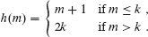
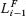
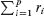
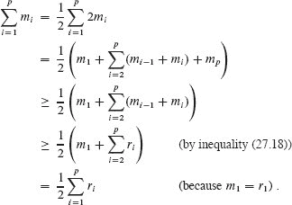
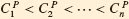

**27        在线算法**

本书中描述的大多数问题都假设算法执行之前整个输入都是可用的。然而，在许多情况下，输入并不是提前可用的，而是随着算法的执行而逐步可用。这个想法在第三部分关于数据结构的讨论中是隐含的。例如，你想设计一个数据结构，可以在每次操作中处理`n`个 INSERT、DELETE 和 SEARCH 操作，每次操作的时间复杂度为`O(lg n)`，很可能是因为你将会接收`n`个这样的操作请求，而事先不知道会出现什么操作。这个想法也在摊销分析中是隐含的，在第十六章中，我们看到如何维护一个表，可以根据插入和删除操作序列而增长或缩小，但每次操作的摊销成本是恒定的。

一个`在线算法`随着时间的推移逐渐接收其输入，而不是像`离线算法`那样在开始时就有整个输入可用。在线算法适用于许多情况，其中信息逐渐到达。股票交易员必须在不知道明天价格将如何的情况下做出决策，但希望获得良好的回报。计算机系统必须安排到达的作业，而不知道未来需要做什么工作。商店必须决定何时订购更多的库存，而不知道未来的需求会是什么。一家网约车服务的司机必须决定是否接客，而不知道未来会有谁请求乘车。在这些情况下，以及许多其他情况下，必须在不了解未来的情况下做出算法决策。

处理未知未来输入的方法有几种。一种方法是建立未来输入的概率模型，并设计一个算法，假设未来输入符合该模型。例如，在排队论领域，这种技术很常见，它也与机器学习相关。当然，你可能无法开发出可行的概率模型，或者即使你能够，有些输入可能不符合它。本章采取了一种不同的方法。我们不假设未来输入的任何情况，而是采用一种保守的策略，限制任何输入可能导致的解决方案有多糟糕。

因此，本章采用最坏情况方法，设计在线算法，保证解决方案的质量适用于所有可能的未来输入。我们将通过比较在线算法产生的解决方案与知道未来输入的最优算法产生的解决方案，并在所有可能的实例上取最坏情况比率来分析在线算法。我们称这种方法为***竞争分析***。当我们研究近似算法时，我们将采用类似的方法，在第三十五章中，我们将比较由可能是次优的算法返回的解决方案与最优解的价值，并确定在所有可能的实例上的最坏情况比率。

我们从一个“玩具”问题开始：决定是乘坐电梯还是楼梯。这个问题将介绍关于在线算法的基本方法论以及如何通过竞争分析来分析它们。然后我们将看两个使用竞争分析的问题。第一个是如何维护一个搜索列表，使得访问时间不会太长，第二个是关于决定从缓存或其他类型的快速计算机内存中驱逐哪些缓存块的策略。

**27.1    等待电梯**  

我们的第一个在线算法示例模拟了一个你可能自己遇到的问题：是否等待电梯到达或只是走楼梯。假设你进入一栋建筑物，想要去一个离地面`k`层的办公室。你有两个选择：走楼梯或乘电梯。为了方便起见，假设你可以以每分钟一层的速度爬楼梯。电梯的速度比你爬楼梯快得多：它只需一分钟就能上升所有`k`层。你的困境在于你不知道电梯要多久才能到达底层并接你。你应该乘电梯还是走楼梯？你如何决定？

让我们分析这个问题。无论如何，走楼梯都需要`k`分钟。假设你知道电梯最多需要`B` − 1 分钟到达某个值为`k`的地方。 （当你叫电梯时，电梯可能正在上升，然后在下降途中停在几层楼。）为了简单起见，让我们还假设电梯到达所需的分钟数是整数。因此，等待电梯并乘坐它上`k`层需要的时间从一分钟（如果电梯已经在底层）到(`B` − 1) + 1 = `B`分钟（最坏情况）。虽然你知道`B`和`k`，但你不知道这次电梯要多久才能到达。你可以使用竞争分析来决定是走楼梯还是乘电梯。在竞争分析的精神中，你希望确保无论未来带来什么（即电梯需要多长时间到达），你都不会比知道电梯何时到达的先知等待时间长。

让我们首先考虑先知会做什么。如果先知知道电梯最多在`k - 1`分钟内到达，那么先知会等待电梯，否则会走楼梯。让`m`表示电梯到达底层需要的分钟数，我们可以将先知花费的时间表示为函数

我们通常通过他们的`竞争比率`来评估在线算法。让`U`表示所有可能输入的集合（宇宙），考虑某个输入`I` ∈ `U`。对于一个最小化问题，比如楼梯与电梯问题，如果在线算法`A`在输入`I`上产生值为`A`(I)的解，而知道未来的算法`F`在相同输入上的解为`F`(I)，那么算法`A`的竞争比率为

max {`A(I)/F(I)` : `I` ∈ `U`}.

如果一个在线算法的竞争比率为`c`，我们说它是***c-competitive***。竞争比率始终至少为 1，因此我们希望在线算法的竞争比率尽可能接近 1。

在楼梯与电梯问题中，唯一的输入是电梯到达的时间。算法`F`知道这个信息，但在线算法必须在不知道电梯何时到达的情况下做出决定。考虑算法“总是走楼梯”，它总是需要`k`分钟。使用方程（27.1），竞争比率为

枚举方程（`27.2`）中的项得到竞争比率为

竞争比率为`k`。当电梯立即到达时，最大值被实现。在这种情况下，走楼梯需要`k`分钟，但最优解只需 1 分钟。

现在让我们考虑相反的方法：“总是乘电梯”。如果电梯到达底层需要`m`分钟，那么这个算法总是需要`m` + 1 分钟。因此，竞争比率变为

max {(`m + 1`)/`t(m)` : 0 ≤ m ≤ B - 1},

我们可以再次枚举为

现在最大值是当电梯需要`B - 1`分钟到达时，与需要`k`分钟的最佳方法——走楼梯相比。

因此，“总是走楼梯”的算法具有竞争比`k`，而“总是乘电梯”的算法具有竞争比`B/k`。因为我们更喜欢竞争比较小的算法，如果`k = 10` 且`B = 300`，我们更喜欢“总是走楼梯”，竞争比为 10，而不是“总是乘电梯”，竞争比为 30。走楼梯并不总是更好，也不一定更常更好。只是走楼梯更好地防范了最坏情况。

然而，总是走楼梯和总是乘电梯这两种方法都是极端的解决方案。相反，你可以“押注”并更好地防范最坏情况。特别是，你可以等待电梯一段时间，然后如果电梯没有到达，就走楼梯。多久是“一段时间”？假设“一段时间”是`k`分钟。那么这种押注策略所需的时间`h(m)`，作为电梯到达前分钟数`m`的函数，是

在第二种情况下，`h(m) = 2k`，因为你等待`k`分钟，然后爬楼梯`k`分钟。竞争比现在是

max {`h(m)/t(m)` : 0 ≤ `m` ≤ `B` − 1}。

枚举这个比率得到 

竞争比现在与`k`和`B`无关。

这个例子展示了在线算法中的一种常见哲学：我们希望有一种算法来防范任何可能的最坏情况。最初，等待电梯是为了防范电梯很快到达的情况，但最终切换到楼梯是为了防范电梯到达时间很长的情况。

**练习**

***`27.1-1`***

假设在押注时，你等待`p`分钟，而不是`k`分钟，然后再走楼梯。竞争比作为`p`和`k`的函数是多少？你应该如何选择`p`以最小化竞争比？

`27.1-2`

想象一下你决定开始滑雪。假设一双滑雪板租用一天需要`r`美元，购买需要`b`美元，其中`b` > `r`。如果你事先知道你会滑雪多少天，那么你是租还是买的决定就很容易了。如果你至少会滑雪⌈`b/r`⌉天，那么你应该买滑雪板，否则你应该租。这种策略最小化了你总共花费的金额。实际上，你事先不知道你最终会滑雪多少天。即使你已经滑雪了几次，你仍然不知道你还会滑雪多少次。但你不想浪费钱。给出并分析一个竞争比为 2 的算法，即保证无论你滑雪多少次，你花费的金额永远不会超过如果你从一开始就知道你会滑雪多少次时的两倍。

***27.1-3***

在“集中纸牌”中，一个人玩的游戏中，你有`n`对相同的卡片。卡片的背面都一样，但正面有动物的图片。一对有土豚的图片，一对有熊的图片，一对有骆驼的图片，依此类推。游戏开始时，所有卡片都是面朝下放置的。在每一轮中，你可以翻开两张卡片，揭示它们的图片。如果图片匹配，那么你将这对卡片从游戏中移除。如果它们不匹配，那么你再次翻转它们，再次隐藏它们的图片。游戏在你移除所有`n`对卡片时结束，你的得分是你需要做到这一点的轮数。假设你能记住你看过的每张卡片上的图片。给出一个竞争比为 2 的玩“集中纸牌”的算法。

**27.2    维护搜索列表**  

下一个在线算法示例涉及维护链表中元素的顺序，就像第 10.2 节中所述。在实践中，当哈希表中的冲突通过链接解决时（参见第 11.2 节），这个问题经常出现，因为每个槽包含一个链表。重新排列哈希表中每个槽中元素的链表可以显著提高搜索性能。

列维护问题可以如下设置。给定`n`个元素{`x`[1], `x`[2], … , *x[n]*}的列表`L`。我们将假设列表是双向链接的，尽管算法和分析同样适用于单向链接列表。将列表`L`中元素`x[i]`的位置表示为`rL`，其中 `1 ≤ rL ≤ n`。在第 260 页上调用 `LIST-SEARCH(L, x[i])`因此需要Θ(`rL`)的时间。

如果您事先了解搜索请求的分布情况，那么提前安排列表，将更频繁搜索的元素靠近前面是有意义的，这样可以最小化总成本（参见练习 27.2-1）。如果您不知道搜索顺序，那么无论如何安排列表，都有可能每次搜索都是为列表末尾的元素。那么总搜索时间将为`Θ(nm)`，其中`m`是搜索次数。

如果您注意到访问序列中的模式，或者观察到元素访问频率的差异，那么您可能希望在执行搜索时重新排列列表。例如，如果您发现每次搜索都是为特定元素，您可以将该元素移动到列表的前面。一般来说，您可以在每次`LIST-SEARCH`调用后重新排列列表。但是，如果不知道未来会怎样，您该如何做呢？毕竟，无论您如何移动元素，每次搜索都可能是为最后一个元素。

但事实证明，有些搜索序列比其他序列“更容易”。与其仅仅评估最坏情况下的性能，不如将重新组织方案与如果提前知道搜索序列的最佳离线算法所做的进行比较。这样，如果序列基本上很难，最佳离线算法也会发现它很难，但如果序列很容易，我们可以希望表现得相当不错。

为了简化分析，我们将放弃渐近符号，并说成本仅为`i`，用于搜索列表中第`i`个元素。让我们还假设重新排列列表元素的唯一方法是通过交换列表中的两个相邻元素。由于列表是双向链接的，每次交换的成本为 1。因此，例如，搜索第六个元素，然后将其向前移动两个位置（涉及两次交换）的总成本为 8。目标是最小化 LIST-SEARCH 调用的总成本以及执行的交换总数。

我们将探讨的在线算法是 `MOVE-TO-FRONT(L, x)`。该过程首先在双向链表`L`中搜索`x`，然后将`x`移动到列表的前面。¹ 如果在调用之前`x`位于位置`r = rL`，MOVE-TO-FRONT 将`x`与位置`r - 1` 的元素交换，然后与位置`r - 2` 的元素交换，依此类推，直到最终将`x`与位置 1 的元素交换。因此，如果在列表`L = <5, 3, 12, 4, 8, 9, 22>`上执行调用 MOVE-TO-FRONT(`L`, 8)，列表将变为`<8, 5, 3, 12, 4, 9, 22>`。调用 `MOVE-TO-FRONT(L, k)` 的成本为 `2rL - 1`：搜索`k`的成本为`rL`，每次将`k`移动到列表前面的`rL - 1` 次交换成本为 1。

**图 27.1** 当搜索元素 `5, 3, 4` 和 `4` 时，FORESEE 和 MOVE-TO-FRONT 过程产生的成本，从列表`L = <1, 2, 3, 4, 5>`开始。如果 FORESEE 在搜索 `5` 后将 `3` 移至前端，累积成本不会改变，如果在搜索 `5` 后将 `4` 移至第二位置，累积成本也不会改变。

我们将看到 MOVE-TO-FRONT 的竞争比为 4。让我们思考一下这意味着什么。MOVE-TO-FRONT 在双向链表上执行一系列操作，累积成本。为了比较，假设有一个名为 FORESEE 的算法可以预知未来。像 MOVE-TO-FRONT 一样，它也搜索列表并移动元素，但在每次调用之后，它会为未来最佳地重新排列列表。（可能有多个最佳顺序。）因此，FORESEE 和 MOVE-TO-FRONT 维护相同元素的不同列表。

考虑图 27.1 中显示的示例。从列表`<1, 2, 3, 4, 5>`开始，进行四次搜索，分别搜索元素 5, 3, 4 和 4。假设的 FORESEE 过程，在搜索 3 后，将 4 移至列表前端，因为知道即将搜索 4。因此，在第二次调用时，它会产生 3 的交换成本，之后不会再产生进一步的交换成本。MOVE-TO-FRONT 在每一步中都会产生交换成本，将找到的元素移至前端。在这个示例中，MOVE-TO-FRONT 在每一步中的成本更高，但这并不一定总是如此。

证明竞争界限的关键是表明在任何时刻，`MOVE-TO-FRONT` 的总成本并不比 `FORESEE` 的总成本高得多。令人惊讶的是，我们可以确定 `MOVE-TO-FRONT` 相对于 `FORESEE` 所产生的成本的界限，即使 `MOVE-TO-FRONT` 无法看到未来。

如果我们比较任何特定步骤，MOVE-TO-FRONT 和 FORESEE 可能在非常不同的列表上操作并执行非常不同的操作。如果我们关注上面的搜索 4，我们会发现 FORESEE 实际上会在列表的早期将其移至列表的前端，支付将元素移至前端的成本，然后再访问。为了捕捉这个概念，我们使用`倒置`的概念：一对元素，比如`a`和`b`，其中`a`在一个列表中出现在`b`之前，但在另一个列表中`b`出现在`a`之前。对于两个列表`L`和`L`′，称为`倒置计数`的`I`(`L`, `L`′)，表示两个列表之间的倒置数量，即两个列表中顺序不同的元素对的数量。例如，对于列表`L` = <5,3,1,4,2>和`L`′ = <3,1,2,4,5>，则在`art`对中，恰好有五对元素—(1, 5), (2, 4), (2, 5), (3, 5), (4, 5)—是倒置，因为这些对在两个列表中以不同的顺序出现，而且只有这些对在两个列表中以不同的顺序出现。因此，倒置计数为`I`(`L`, `L`′) = 5。

为了分析算法，我们定义以下符号。让``是 MOVE-TO-FRONT 在第`i`次搜索后立即维护的列表，类似地，让``是 FORESEE 在第`i`次搜索后的列表。让``和``分别是 MOVE-TO-FRONT 和 FORESEE 在第`i`次调用时产生的成本。我们不知道 FORESEE 在其第`i`次调用中执行了多少次交换，但我们将该数字表示为*t[i]*。因此，如果第`i`次操作是搜索元素`x`，那么

``  

为了更仔细地比较这些成本，让我们将元素分解成子集，具体取决于在第`i`次搜索中，相对于正在搜索的元素`x`在两个列表中的位置。我们定义三个集合：

`BB = {x 在和中都在 x 之前的元素}`

*BA* = {`x`之前在`art`中但在`LF.jpg`中`x`之后的元素}

*AB* = {`x`之后在中但在中`x`之前的元素}。  

现在我们可以将元素`x`在和中的位置与这些集合的大小联系起来：  

当列表中发生交换时，它会改变涉及的两个元素的相对位置，从而改变倒置计数。假设在某个列表中交换了元素`x`和`y`。那么这个列表与*任何*其他列表之间倒置计数的唯一可能差异取决于(`x`, `y`)是否是倒置。实际上，(`x`, `y`)相对于任何其他列表的倒置计数 *必须* 改变。如果在交换之前(`x`, `y`)是倒置的，那么交换后就不再是，反之亦然。因此，如果列表`L`中的两个连续元素`x`和`y`交换位置，则对于任何其他列表`L`′，倒置计数`I(L, L′)`的值要么增加 1，要么减少 1。

当我们比较 MOVE-TO-FRONT 和 FORESEE 搜索和修改它们的列表时，我们将考虑 MOVE-TO-FRONT 第`i`次在其列表上执行，��后 FORESEE 第`i`次在其列表上执行。在 MOVE-TO-FRONT 第`i`次执行后，但在 FORESEE 第`i`次执行前，我们将比较``（MOVE-TO-FRONT 第`i`次调用之前的倒置计数）和``（MOVE-TO-FRONT 第`i`次调用后但 FORESEE 第`i`次调用前的倒置计数）。我们稍后会关注 FORESEE 的操作。  

让我们分析在执行 MOVE-TO-FRONT 的第`i`次调用后，倒置计数会发生什么变化，并假设它搜索元素`x`。更确切地说，我们将计算，即倒置计数的变化，这给出了 MOVE-TO-FRONT 的列表变得更像 FORESEE 的列表的大致想法。在搜索之后，MOVE-TO-FRONT 对位于`x`之前的列表中的每个元素执行一系列交换。使用上面的符号，这种交换的次数是|`BB`| + |`BA`|。请记住，列表在 MOVE-TO-FRONT 的第`i`次调用之前尚未被 FORESEE 更改，让我们看看倒置计数如何变化。

考虑与`BB`中的元素`y`进行交换。在交换之前，`y`在和中都在`x`之前。交换后，`x`在中在`y`之前，而不会改变。因此，对于`BB`中的每个元素，倒置计数增加 1。现在考虑与`BA`中的元素`z`进行交换。在交换之前，`z`在中在`x`之前，但在中`x`在`z`之前。交换后，`x`在两个列表中都在`z`之前。因此，对于`BA`中的每个元素，倒置计数减少 1。因此，总体而言，倒置计数增加了

我们已经奠定了分析`MOVE-TO-FRONT`所需的基础。

**`定理 27.1`**

MOVE-TO-FRONT 算法的竞争比为 4。

***证明*** 该证明使用了一个潜在函数，如第十六章中对摊销分析的描述。潜在函数`Φ[i]`在 `MOVE-TO-FRONT` 和 `FORESEE` 的第`i`次调用之后取决于倒置计数：

（直观地，因子 2 体现了每个倒置代表 MOVE-TO-FRONT 相对于 FORESEE 的成本为 2 的概念：1 用于搜索，1 用于交换。）根据方程`(27.7)`，在 MOVE-TO-FRONT 的第`i`次调用之后，但在 FORESEE 的第`i`次调用之前，潜在函数增加了 `2(|BB| − |BA|)`。由于两个列表的倒置计数是非负的，对于所有`i` ≥ 0，我们有Φ[i] ≥ 0。假设 MOVE-TO-FRONT 和 FORESEE 从相同的列表开始，初始潜在函数Φ[0]为 0，因此对于所有`i`，Φ[i] ≥ Φ[0]。

借鉴第 456 页上方程(16.2)，第`i`次 MOVE-TO-FRONT 操作的摊销成本为

其中，第`i`次 MOVE-TO-FRONT 操作的实际成本由方程式(27.3)给出：

现在，让我们考虑潜在变化`Φ*[i]* − Φ[`i`−1]`。由于`L^M`和`L^F`都会发生变化，让我们一次考虑一个列表的变化。回想一下，当 MOVE-TO-FRONT 将元素`x`移动到最前面时，它会将潜在函数增加 `2(|*BB*| − |*BA*|)`。我们现在考虑最优算法 FORESEE 如何改变其列表`L^F`：它执行`τ[i]`次交换。FORESEE 执行的每次交换都会使潜在函数增加或减少 `2`，因此 FORESEE 在第`i`次调用中的潜在函数增加最多为 `2*τ[i]*`。因此我们有

现在我们像第十六章中那样完成证明，通过展示总摊销成本提供了总实际成本的上界，因为初始潜在函数为 0 且潜在函数始终为非负。根据第 456 页的方程式`(16.3)`，对于任何`m`次 MOVE-TO-FRONT 操作的序列，我们有

因此，我们有

因此，`m`次 MOVE-TO-FRONT 操作的总成本最多是`m`次 FORESEE 操作的总成本的 4 倍，因此 MOVE-TO-FRONT 是 4-竞争的。

▪  输出：

当我们对`FORESEE`进行交换时没有任何关于`FORESEE`进行的交换的想法时，我们能够比较`MOVE-TO-FRONT`和最优算法`FORESEE`，这不是很神奇吗？我们能够通过捕捉特定属性（在这种情况下是交换）相对于最优算法的演变方式来将`MOVE-TO-FRONT`的性能与最优算法联系起来，而不需要实际知道最优算法。

在任何输入序列上，在线算法`MOVE-TO-FRONT`的竞争比为 4：它产生的成本最多是任何其他算法的 4 倍。在特定输入序列上，它的成本可能远低于最优算法的 4 倍，甚至可能与最优算法相匹配。

**练习**

***27.2-1***

给定一个集合`S` = {`x[1]`, `x[2]`, … , `x[n]`}，您希望创建一个静态列表`L`（一旦列表创建后就不再重新排列），其中包含`S`的元素，以便进行搜索。假设您有一个概率分布，其中`p(x[i])`是搜索给定元素`x[i]`的概率。论证`m`次搜索的预期成本是 

证明当`L`的元素按照`p(x[i])`的递减顺序排序时，这个和是最小化的。

`27.2-2`

卡纳克教授声称，由于 FORESEE 是一个知道未来的最优算法，所以在每一步中它必须承担的成本不会比 MOVE-TO-FRONT 多。要么证明卡纳克教授是正确的，要么提供一个反例。

***27.2-3***

为了维护一个用于高效搜索的链表的另一种方法是让每个元素维护一个`频率计数`：即该元素被搜索的次数。这个想法是在搜索后重新排列列表元素，使得列表始终按照频率计数递减的顺序排序，从最大到最小。要么证明这个算法是`O(1)`-竞争的，要么证明它不是。

`27.2-4`

本节中的模型为每次交换收取 1 的成本。我们可以考虑另一种成本模型，在这种模型中，访问`x`后，您可以将`x`移动到列表中的任何位置，这样做不会产生成本。唯一的成本是实际访问的成本。展示在这种成本模型中，MOVE-TO-FRONT 是 2-竞争的，假设请求的数量足够大。（*提示：*使用潜在函数。）

**27.3    在线缓存**

在第 15.4 节中，我们研究了缓存问题，其中计算机主存中的数据块被存储在缓存中：一个小但更快的内存。在那一节中，我们研究了问题的离线版本，在这个版本中，我们假设事先知道了内存请求的顺序，并设计了一个算法来最小化缓存未命中的次数。在几乎所有的计算机系统中，缓存实际上是一个在线问题。我们通常不会事先知道缓存请求的序列；它们只会在实际请求块时作为算法的输入。为了更好地理解这种更现实的情况，我们分析了用于缓存的在线算法。我们首先会看到，所有确定性的在线缓存算法都有一个竞争比率的Ω(`k`)的下界，其中`k`是缓存的大小。然后我们将介绍一个具有 `Θ(n)`竞争比率的算法，其中输入大小为`n`，以及一个具有`O(k)`竞争比率的算法，与下界相匹配。最后，我们将展示如何使用随机化设计一个竞争比率为Θ(lg `k`)的算法。我们还将讨论随机化在线算法的假设，通过对手的概念，就像我们在第十一章和将在第三十一章中看到的那样。

您可以在第 `15.4` 节中找到描述缓存问题的术语，您可能希望在继续之前进行复习。

**`27.3.1    确定性缓存算法`**

在缓存问题中，输入包括一个`n`个内存请求的序列，对应着块`b[1]`、`b[2]`、…、`b[n]`，按照这个顺序。请求的块不一定是不同的：每个块可能在请求序列中出现多次。在请求块`b[i]`之后，它会存储在一个可以容纳最多`k`个块的缓存中，其中`k`是固定的缓存大小。我们假设`n` > `k`，否则我们可以确保缓存可以一次性容纳所有请求的块。当请求块`b[i]`时，如果它已经在缓存中，则会发生***缓存命中***，缓存保持不变。如果`b[i]`不在缓存中，则会发生***缓存未命中***。如果在缓存未命中时缓存中的块少于`k`个，则块`b[i]`会被放入缓存中，这时缓存中的块比之前多一个。然而，如果在缓存已满时发生缓存未命中，必须在`b[i]`进入之前从缓存中淘汰一些块。因此，缓存算法必须在缓存已满时决定在缓存未命中时淘汰哪个块。目标是在整个请求序列中最小化缓存未命中的次数。本章中考虑的缓存算法只在决定在缓存未命中时淘汰哪个块上有所不同。我们不考虑预取能力，即在未来的请求之前将一个块带入缓存以避免未来的缓存未命中。

有许多在线缓存策略来确定要淘汰哪个块，包括以下：

+   先进先出（FIFO）：淘汰在缓存中停留时间最长的块。

+   先进先出（LIFO）：淘汰在缓存中停留时间最短的块。

+   最近最少使用（LRU）：淘汰最久未被使用的块。

+   最不经常使用（LFU）：淘汰被访问次数最少的块，通过选择在缓存中停留时间最长的块来打破平局。

要分析这些算法，我们假设缓存开始为空，因此在前`k`个请求期间不会发生任何驱逐。我们希望比较在线算法与知道未来请求的最佳离线算法的性能。正如我们很快会看到的，所有这些确定性在线算法的竞争比都有Ω(`k`)的下界。一些确定性算法的竞争比也具有`O(k)`的上界，但其他一些确定性算法要糟糕得多，竞争比为Θ(`n/k`)。

我们现在继续分析 LIFO 和 LRU 策略。除了假设`n > k`，我们还假设至少请求了`k`个不同的块。否则，缓存永远不会填满，也不会驱逐任何块，因此所有算法表现相同。我们首先展示 LIFO 具有较大的竞争比。

***定理 `27.2`***

LIFO 对于具有`k`大小缓存和`n`个请求的在线缓存问题具有Θ(`n/k`)的竞争比。

***证明***   我们首先展示`Ω(n/k)`的下界。假设输入由`k + 1`个块组成，编号为 1, 2, … , `k + 1`，请求序列为 

`1, 2, 3, 4, … , k, k + 1, k, k + 1, k, k + 1, … ,`

在初始的 1, 2, … , `k`, `k` + 1 之后，序列的其余部分在`k`和`k` + 1 之间交替，共有`n`个请求。如果`n`和`k`都是偶数或都是奇数，序列以块`k`结束，否则以块`k`+1 结束。也就是说，对于`i` = 1, 2, … `k`−1，`b[i]` = `i`，对于`i` = `k`+1, `k`+3, …，`b[i]` = `k`+1，对于`i` = `k`, `k` + 2, …，`b[i]` = `k`。LIFO 会驱逐多少块？在前`k`个请求之后（被视为缓存未命中），缓存中填充了块 1, 2, … , `k`。第(`k` + 1)个请求是为了块`k` + 1，导致块`k`被驱逐。第(`k` + 2)个请求是为了块`k`，强制驱逐块`k` + 1，因为该块刚刚放入缓存。这种行为继续，交替驱逐块`k`和`k`+1 直到剩余请求结束。因此，LIFO 在每一个`n`个请求中都会发生缓存未命中。  

最佳离线算法事先知道整个请求序列。在第一个块`k` + 1 的请求时，它只是驱逐除块`k`之外的任何块，然后就再也不会驱逐其他块了。因此，最佳离线算法只会驱逐一次。由于前`k`个请求被视为缓存未命中，因此总的缓存未命中次数为`k` + 1。因此，竞争比为`n`/(`k` + 1)，或Ω(`n`/`k`)。

对于上界，观察到在任何大小为`n`的输入上，���何缓存算法最多产生`n`次缓存未命中。因为输入至少包含`k`个不同的块，任何缓存算法，包括最佳离线算法，必须至少产生`k`次缓存未命中。因此，LIFO 具有`O(n/k)`的竞争比。  

▪

我们称这种竞争比为`无界`，因为它随着输入大小增长。练习 27.3-2 要求您展示 LFU 也具有无界的竞争比。

先进先出（FIFO）和最近最少使用（LRU）的竞争比要好得多，为`Θ(k)`。`Θ(n/k)`和`Θ(k)`的竞争比之间存在很大差异。缓存大小`k`与输入序列无关，并且随着时间推移到达更多请求时不会增长。另一方面，依赖于`n`的竞争比会随着输入序列的大小增长而增加，因此可能会变得非常大。因此，尽可能使用不随输入序列大小增长的竞争比的算法是更可取的。

我们现在展示 LRU 的竞争比为`Θ(k)`，首先展示上界。

***定理 27.3***

LRU 对于具有`k`大小缓存和`n`个请求的在线缓存问题具有`O(k)`的竞争比。

***证明*** 分析 LRU，我们将请求序列分成`时期`。时期 1 从第一个请求开始。对于`i` > 1 的`i`时期，从`i` − 1 时期开始，遇到第(`k` + 1)个不同的请求时开始。考虑以下带有`k` = 3 的请求示例：

前`k` = 3 个不同的请求是为了块 1, 2 和 5，因此第 2 个时期从第一个请求块 4 开始。在第 2 个时期，前 3 个不同的请求是为了块 4, 1 和 2。对这些块的请求会重复，直到请求块 3，随着这个请求，第 3 个时期开始。因此，这个示例有四个时期：

现在我们考虑 LRU 的行为。在每个时期中，第一次请求特定块可能导致缓存未命中，但时期内对该块的后续请求不会导致缓存未命中，因为该块现在是最近使用的`k`个块之一。例如，在第 2 个时期，对块 4 的第一个请求导致缓存未命中，但对块 4 的后续请求不会。 （练习 27.3-1 要求您展示每个请求后缓存的内容。）在第 3 个时期，块 3 和 5 的请求导致缓存未命中，但对块 4 的请求不会，因为它在第 2 个时期中最近访问过。由于时期内只有对块的第一个请求可能导致缓存未命中，并且缓存容纳`k`个块，每个时期最多产生`k`个缓存未命中。

现在考虑最佳算法的行为。每个时期的第一个请求即使对于最佳算法也必须导致缓存`��`命中。未命中是因为根据时期的定义，`*必须*`有其他`k`个块在上次访问该块之后被访问。

由于对于每个时期，最佳算法至少产生一个未命中，而 LRU 至多产生`k`个未命中，因此竞争比至多为`k/1 = O(k)`。

▪  输出：

练习 27.3-3 要求您展示 FIFO 也具有`O(k)`的竞争比。

我们可以展示 LRU 和 FIFO 的`Ω(k)`下界，但实际上，我们可以做出一个更强有力的陈述：*任何*确定性在线缓存算法的竞争比必须为`Ω(k)`。证明依赖于一个知道正在使用的在线算法的对手，并且可以调整未来的请求，使得在线算法比最佳离线算法产生更多的缓存未命中。

考虑这样一个场景，缓存大小为`k`，可能请求的块集合为{1, 2, … , `k` + 1}。前`k`个请求是为了块 1, 2, … , `k`，这样对手和确定性在线算法都将这些块放入缓存。下一个请求是块`k` + 1。为了为块`k` + 1 腾出缓存空间，在线算法将某个块`b`[1]从缓存中驱逐。对手知道在线算法刚刚驱逐了块`b`[1]，于是下一个请求是为了`b`[1]，这样在线算法必须驱逐其他块`b`[2]以为`b`[1]腾出缓存空间。你可能已经猜到，对手让下一个请求是为了块`b`[2]，这样在线算法将驱逐其他块`b`[3]以为`b`[2]腾出缓存空间。在线算法和对手继续这样进行。在线算法每次请求都会导致缓存未命中，因此在`n`个请求中会导致`n`次缓存未命中。  

现在让我们考虑一个知道未来的最佳离线算法。正如第 15.4 节中讨论的那样，这个算法被称为最远未来，它总是驱逐下一个请求未来最远的块。由于只有`k + 1`个唯一的块，当最远未来驱逐一个块时，我们知道在接下来的至少`k`个请求中不会访问该块。因此，在前`k`次缓存未命中之后，最佳算法每`k`个请求最多产生一次缓存未命中。因此，在`n`个请求中的缓存未命中次数最多为`k + n/k`。

由于确定性在线算法产生`n`次缓存未命中，而最佳离线算法最多产生`k + n/k`次缓存未命中，因此竞争比率至少为

对于`n ≥ k²`，上述表达式至少为

  

因此，对于足够长的请求序列，我们已经证明了以下内容：

`***定理 27.4***`

任何具有缓存大小`k`的确定性在线算法的竞争比率为Ω(`k`)。  

▪  输出：

尽管我们可以从竞争分析的角度分析常见的缓存策略，但结果有些令人不满意。是的，我们可以区分竞争比率为`Θ(k)`和竞争比率无界的算法。然而，最终，所有这些竞争比率都相当高。到目前为止，我们看到的在线算法是确定性的，而正是这一特性使得对手能够利用。

**27.3.2 随机化缓存算法**

如果我们不局限于确定性在线算法，我们可以利用随机化开发一个具有显著较小竞争比率的在线缓存算法。在描述算法之前，让我们先讨论一般在线算法中的随机化。回想一下，我们分析在线算法是针对一个对手的，这个对手知道在线算法并可以设计请求，了解在线算法的决策。对于随机化，我们必须问对手是否也知道在线算法所做的随机选择。不知道随机选择的对手是`遗忘的`，而知道随机选择的对手是`非遗忘的`。理想情况下，我们更倾向于设计针对非遗忘对手的算法，因为这种对手比遗忘对手更强大。不幸的是，一个非遗忘对手会削弱很多随机性的力量，因为通常知道随机选择结果的对手可以表现得好像在线算法是确定性的。另一方面，遗忘对手不知道在线算法的随机选择，这通常是我们使用的对手。  

作为遗忘对手和非遗忘对手之间差异的简单说明，想象一下你抛一枚公平硬币`n`次，对手想知道你抛了多少次正面。一个非遗忘对手在每次抛硬币后都知道硬币是正面还是反面，因此知道你抛了多少次正面。另一方面，遗忘对手只知道你抛了一枚公平硬币`n`次。因此，遗忘对手可以推断出正面次数遵循二项分布，因此正面次数的期望值为`n/2`（通过第 1199 页的方程（C.41））而方差为`n/4`（通过第 1200 页的方程（C.44））。但遗忘对手无法准确知道你实际抛了多少次正面。

让我们回到缓存问题。我们将从确定性算法开始，然后将其随机化。我们将使用的算法是一个近似 LRU 的算法，称为 MARKING。不要将 MARKING 视为“最近未使用”，而是简单地将其视为“最近使用”。MARKING 为缓存中的每个块维护一个 1 位属性`mark`。最初，缓存中的所有块都未标记。当请求一个块时，如果它已经在缓存中，则将其标记。如果请求是缓存未命中，则 MARKING 会检查缓存中是否有任何未标记的块。如果所有块都已标记，则它们都会被更改为未标记状态。现在，无论请求发生时缓存中的所有块是否都已标记，缓存中至少有一个未标记的块，因此将会驱逐一个任意未标记的块，并将请求的块放入缓存并标记。

在从未标记的块中选择要驱逐的块应该如何选择？下一页的 RANDOMIZED-MARKING 过程展示了当随机选择块时的过程。该过程以请求的块 `b` 作为输入。

`RANDOMIZED-MARKING(b)`

| `1` | **如果** 块 `b` 存在于缓存中， |
| --- | --- |
| `---` | `---` |
| 2 | b.mark = 1 |
| `3` | **否则** |  |
| `4` | **如果** 缓存中所有块 `b'` 都有 `b'.mark = 1` |
| `5` | 取消缓存中所有未标记的块 `b′`，设置 `b′.mark = 0` |  |
| 6 | 以均匀随机方式选择一个未标记的块 `u`，使 `u.mark = 0` |
| 7 | 驱逐块 `u` |
| 8 | 将块 `b` 放入缓存 |
| `9` | `b.mark = 1` |

为了分析的目的，我们说每次执行时间线 `5` 后立即开始一个新的时代。一个时代从缓存中没有标记的块开始。在一个时代中，第一次请求一个块时，标记块的数量增加 `1`，对该块的任何后续请求都不会改变标记块的数量。因此，在一个时代内，标记块的数量单调增加。根据这个观点，时代与定理 `27.3` 的证明中的时代相同：对于一个容纳 `k` 个块的缓存，一个时代包括对 `k` 个不同块的请求（最后一个时代可能少于 `k` 个），下一个时代从请求一个不在这 `k` 个块中的块开始。

因为我们将要分析一个随机算法，我们将计算期望的竞争比率。回想一下，对于一个输入 `I`，我们用 `A`(`I`) 表示在线算法 `A` 的解值，用 `F`(`I`) 表示最优算法 `F` 的解值。在线算法 `A` 有一个***期望的竞争比率*** `c`，如果对于所有输入 `I`，我们有  输出：

期望是针对 `A` 的随机选择所做的。

尽管确定性的 MARKING 算法具有 `Θ(k)` 的竞争比率（定理 27.4 提供了下界，参见练习 27.3-4 提供的上界），但 RANDOMIZED-MARKING 有一个更小的期望竞争比率，即 `O(lg k)`。改进竞争比率的关键在于对手不能总是请求不在缓存中的块，因为无意识的对手不知道哪些块在缓存中。  

`定理 27.5`

对于具有 `n` 个请求和大小为 `k` 的缓存的在线缓存问题，RANDOMIZED-MARKING 有一个期望的竞争比率为 `O(lg k)`，对抗一个无意识的对手。

在证明定理 `27.5` 之前，我们先证明一个基本的概率事实。

***引理 27.6***

假设一个袋子里有 `x + y` 个球：`x - 1` 个蓝球，`y` 个白球和 `1` 个红球。你反复随机选择一个球并将其从袋子中取出，直到你总共选择了 `m` 个蓝色或红色的球，其中 `m ≤ x`。你会将每个选择的白球放在一边。然后，选择的球中有一个是红球的概率为 `m/x`。

***证明*** 选择白球不会以任何方式影响选择多少个蓝球或红球。因此，我们可以继续分析，就好像没有白球，袋子只包含 `x - 1` 个蓝球和 1 个红球。

让 `A` 表示红球未被选择的事件，让 `A[i]` 表示第 `i` 次抽取不选择红球的事件。根据第 1190 页的方程式 (C.22)，我们有  

第   第一个球是蓝色的概率 `Pr{A[1]}` 等于 (`x` − 1)/`x`，因为最初有 `x` − 1 个蓝球和 1 个红球。更一般地们有

因为第 `i` 次抽取是从 `x - i` 个蓝球和 1 个红球中进行的。方程 (27.13) 和 (27.14) 给出

方程(`27.15`)的右侧是一个类似于第 `1143` 页上方程(`A.12`)中的展开乘积。一个项的分子等于下一个项的分母，因此除了第一个分母和最后一个分子外，其他所有内容都会被取消，我们得到 Pr{`A`} = (`x` − `m`)/`x`。由于我们实际上想计算 Pr{`Ā`} = 1 − Pr{`A`}，也就是说，红球被选择的概率，我们得到 Pr{`Ā`} = 1 − (`x` − `m`)/`x` = `m`/`x`。

▪  输出：

现在我们可以证明定理 `27.5`。

***证明***   我们将逐个分析随机标记的每个时期。在第`i`个时期内，对于不是第`i`个时期内块`b`的第一个请求的任何请求，必须导致缓存命中，因为在第`i`个时期的第一个请求之后，块`b`驻留在缓存中并被标记，因此在该时期内无法被驱逐。因此，由于我们正在计算缓存未命中，我们将仅考虑每个时期内每个块的第一个请求，忽略所有其他请求。

我们可以将一个时期内的请求分类为旧请求或新请求。如果块`b`在第`i`个时期开始时驻留在缓存中，则第`i`个时期内对块`b`的每个请求都是***旧请求***。第`i`个时期内的旧请求是在第`i`个时期−1 中请求的块。如果第`i`个时期中的请求不是旧请求，则是***新请求***，并且是在第`i`个时期−1 中未请求的块。第 1 个时期内的所有请求都是新请求。例如，让我们再次看一下例子（27.11）中的请求序列：

| `1, 2, 1, 5` | `4, 4, 1, 2, 4, 2` | `3, 4, 5` | `2, 2, 1, 2, 2.` |
| --- | --- | --- | --- |

由于我们可以忽略除每个时期内第一个请求以外的所有块的所有请求，为了分析缓存行为，我们可以将这个请求序列视为只是

| `1, 2, 5` | `4, 1, 2` | `3, 4, 5` | `2, 1.` |
| --- | --- | --- | --- |

第 1 个时期内的所有三个请求都是新请求。在第 2 个时期，对块 1 和块 2 的请求是旧请求，但对块 4 的请求是新请求。在第 3 个时期，对块 4 的请求是旧请求，对块 3 和块 5 的请求是新请求。第 4 个时期内的两个请求都是新请求。

在一个时期内，每个新请求必须导致缓存未命中，因为根据定义，该块尚未在缓存中。另一方面，旧请求可能会导致缓存未命中，也可能不会。旧块在时期开始时在缓存中，但其他请求可能会导致其被驱逐。回到我们的例子，在第 2 个时期，对块 4 的请求必须导致缓存未命中，因为这个请求是新的。对于块 1 的请求，这是旧的，可能会导致缓存未命中，也可能不会。如果在请求块 4 时块 1 被驱逐，那么会发生缓存未命中，块 1 必须重新放入缓存中。如果在请求块 4 时块 1 没有被驱逐，那么对块 1 的请求会导致缓存命中。对块 2 的请求可能会在两种情况下导致缓存未命中。一种情况是在请求块 4 时块 2 被驱逐。另一种情况是在请求块 1 时块 1 被驱逐，然后在请求块 1 时块 2 被驱逐。我们看到，在一个时期内，每个后续的旧请求都有越来越大的可能性导致缓存未命中。  

因为我们只考虑每个时期内每个块的第一个请求，我们假设每个时期包含恰好`k`个请求，并且每个时期内的每个请求都是针对唯一块的。（最后一个时期可能包含少于`k`个请求。如果是这样，只需添加虚拟请求以使其达到`k`个请求。）在第`i`个时期，将新请求的数量表示为`r[i]` ≥ 1（一个时期必须至少包含一个新请求），因此旧请求的数量为`k - r[i]`。如上所述，新请求总是导致缓存未命中。

现在让我们专注于任意时期`i`，以获得该时期内预期的缓存未命中次数的上限。特别是，让我们考虑时期`i`内的第`j`个旧请求，其中 1 ≤ `j` < `k`。用`b[ij]`表示时期`i`中第`j`个旧请求所请求的块，用`n[ij]`和`o[ij]`表示在第`j`个旧请求之前但在时期`i`内发生的新请求和旧请求的数量。因为第`j`个旧请求之前发生了`j - 1` 个旧请求，我们有`o[ij]` = `j - 1`。我们将展示在第`j`个旧请求时发生缓存未命中的概率为`n[ij] / (k - o[ij])`，或者`n[ij] / (k - j + 1)`。

首先考虑第一个旧请求，对于块`b[i,1]`。这个请求导致缓存未命中的概率是多少？只有当之前的`n[i,1]`个请求中的一个导致`b[i,1]`被驱逐时才会导致缓存未命中。我们可以通过引用引理 27.6 来确定`b[i,1]`被选择驱逐的概率：将缓存中的`k`个块视为`k`个球，其中块`b[i,1]`是红球，其他`k - 1`个块是`k - 1`个蓝球，没有白球。每个`n[i,1]`个请求以相等概率选择一个块进行驱逐，对应于抽取球`n[i,1]`次。因此，我们可以将引理 27.6 应用于`x = k`，`y = 0`，`m = n[i,1]`，推导出第一个旧请求导致缓存未命中的概率为`n[i,1]/k`，这等于`n[ij]/(k - j + 1)`，因为`j = 1`。

为了确定后续旧请求导致缓存未命中的概率，我们需要额外的观察。让我们考虑第二个旧请求，即块`b[i,2]`。这个请求导致缓存未命中的概率是多少？只有当之前的请求中有一个导致`b[i,2]`被驱逐时才会导致缓存未命中。让我们根据对`b[i,1]`的请求来考虑两种情况。在第一种情况下，假设对`b[i,1]`的请求没有导致驱逐，因为`b[i,1]`已经在缓存中。那么`b[i,2]`被驱逐的唯一方式是之前的`n[i,2]`个新请求之一。这种驱逐发生的概率是多少？`b[i,2]`有`n[i,2]`次被驱逐的机会，但我们也知道缓存中有一个块，即`b[i,1]`，没有被驱逐。因此，我们可以再次应用引理 27.6，但是将`b[i,1]`作为白球，`b[i,2]`作为红球，其余块作为蓝球，并抽取球`n[i,2]`次。应用引理 27.6，其中`x` = `k` − 1，`y` = 1，`m` = `n[i,2]`，我们发现缓存未命中的概率为`n[i,2]/(k - 1)`。在第二种情况下，对`b[i,1]`的请求确实导致了驱逐，只有在之前的请求中有一个新请求导致`b[i,1]`被驱逐时才会发生。然后，对`b[i,1]`的请求将`b[i,1]`重新带入缓存并驱逐其他块。在这种情况下，我们知道新请求中有一个请求没有导致`b[i,2]`被驱逐，因为`b[i,1]`被驱逐。因此，`n[i,2] - 1`个新请求可能会驱逐`b[i,2]`，对`b[i,1]`的请求也可能会驱逐`b[i,2]`，因此可能会驱逐`b[i,2]`的请求数量为`n[i,2]`。每个这样的请求从`k - 1`个块中选择一个块进行驱逐，因为导致`b[i,1]`被驱逐的请求并没有导致`b[i,2]`被驱逐。因此，我们可以应用引理 27.6，其中`x` = `k` − 1，`y` = 1，`m` = `n[i,2]`，得出未命中的概率为`n[i,2]/(k - 1)`。在两种情况下，概率是相同的，并且它等于`n[ij]/(k - j + 1)`，因为`j` = 2。

更一般地，`o[ij]` 个旧请求在第 `j` 个旧请求之前发生。这些先前的旧请求要么导致了驱逐，要么没有。对于那些导致了驱逐的先前旧请求，是因为它们被先前的请求驱逐了，而对于那些没有导致驱逐的旧请求，是因为它们没有被任何先前的请求驱逐。无论哪种情况，我们可以减少随机过程选择的块数，每个旧请求减少 1 个块，因此 `o[ij]` 个请求不会导致 `b[ij]` 被驱逐。因此，我们可以使用引理 27.6 来确定 `b[ij]` 被先前请求驱逐的概率，其中 `x` = `k` − `o[ij]`，`y` = `o[ij]` 和 `m` = `n[ij]`。因此，我们已经证明了我们的断言，即旧块的第 `j` 个请求发生缓存未命中的概率为 `n[ij]`/(`k` − `o[ij]`)，或者 `n[ij]`/(`k` − `j` + 1)。由于 `n[ij]` ≤ `r[i]`（回想一下 `r[i]` 是第 `i` 个时期中新请求的数量），我们对第 `j` 个旧请求发生缓存未命中的概率有一个上界为 `r[i]`/(`k` − `j` + 1)。

现在我们可以使用指示随机变量来计算第 `i` 个时期的预期未命中次数，如 Section 5.2 中介绍的。我们定义指示随机变量

`Y[ij] = I{第 i 个时期中第 j 个旧请求导致缓存未命中}，`  

`Z[ij] = I{第 i 个时期中第 j 个新请求导致缓存未命中}`。

对于 `j` = 1, 2, … , `r[i]`，我们有 `Z[ij]` = 1，因为每个新请求都导致缓存未命中。令 `X[i]` 表示随机变量，表示第 `i` 个时期中缓存未命中的次数，因此

因此

其中 `H[k]` 是第 `k` 个调和数。

要计算预期的总缓存未命中次数，我们对所有时期求和。令 `p` 表示时期的数量， `X` 是表示缓存未命中次数的随机变量。然后，我们有 `E(X) = Σ(E(X_i))`，因此

要完成分析，我们需要了解最佳离线算法的行为。它可能做出与 RANDOMIZED-MARKING 不同的决策，并且在任何时刻，其缓存可能看起来与随机算法的缓存完全不同。然而，我们希望将最佳离线算法的缓存未命中次数与不依赖于  的不等式（27.17）中的值联系起来，以获得一个竞争比率。仅关注单个时期是不够的。在任何时期的开始，离线算法可能已经将缓存加载了在该时期将被请求的块。因此，我们不能孤立地考虑任何一个时期，并声称离线算法在该时期必须遭受任何缓存未命中。  

然而，如果考虑两个连续的时期，我们可以更好地分析最佳离线算法。考虑两个连续的时期，`i` −1 和 `i`。每个时期包含 `k` 个请求，请求的是 `k` 个不同的块。（回想我们的假设，所有请求都是时期中的第一个请求。）时期 `i` 包含 `r[i]` 个新块的请求，即在时期 `i` − 1 中没有请求的块。因此，时期 `i`−1 和 `i` 中不同请求的数量正好是 `k`+`r[i]`。无论时期 `i` − 1 开始时缓存内容是什么，在 `k`+`r[i]` 个不同请求之后，至少会有 `r[i]` 次缓存未命中。可能会有更多，但不可能更少。令 `m[i]` 表示离线算法在第 `i` 个时期中的缓存未命中次数，我们刚刚证明了  

离线算法的总缓存未命中次数为 `total_cache_misses`

最后一个等式的理由 `m[1] = r[1]` 是因为，根据我们的假设，缓存开始为空，每个请求在第一个时期都会导致缓存未命中，即使对于最佳离线对手也是如此。  

总结分析，因为我们对于随机标记算法的预期缓存未命中次数有一个上界``，以及对于最优离线算法的缓存未命中次数有一个下界``，所以期望的竞争比率最多为

▪

**练习**

***27.3-1***

对于缓存序列（`27.10`），展示每个请求后缓存的内容并计算缓存未命中次数。每个时期产生多少次未命中？

***`27.3-2`***

证明 LFU 对于具有`n`个请求和大小为`k`的缓存的在线缓存问题具有Θ(`n/k`)的竞争比率。

`27.3-3`

证明 FIFO 对于具有`n`个请求和大小为`k`的缓存的在线缓存问题具有`O(k)`的竞争比率。

`27.3-4`

证明确定性`MARKING`算法对于具有`n`个请求和大小为`k`的缓存的在线缓存问题具有`O(k)`的竞争比率。

`27.3-5`

定理 27.4 表明，任何用于缓存的确定性在线算法的竞争比率为`Ω(k)`，其中`k`是缓存大小。算法可能表现更好的一种方式是具有一定能力知道接下来的几个请求是什么。如果一个算法有能力预测接下来的`l`个请求，我们称其为***`l`-前瞻***算法。证明对于每个常数`l ≥ 0` 和每个缓存大小`k ≥1`，每个确定性的`l`-前瞻算法的竞争比率为`Ω(k)`。

输出：

***27-1     牛路径问题***

阿巴拉契亚小径（AT）是美国东部的一条标志性徒步旅行路线，从乔治亚州的斯普林格山一直延伸到缅因州的卡塔丁山。这条小径长约 2,190 英里。你决定从乔治亚到缅因再返回徒步走完整条小径。你计划在路上学习更多关于算法的知识，所以你把《算法导论》的副本放在背包里。² 在出发前你已经阅读了这一章节。由于小径的美景让你分心，你忘记了阅读这本书，直到你到达缅因并徒步走了一半回到乔治亚时才想起。在那时，你决定已经看过小径了，想继续阅读这本书的剩余部分，从第二十八章开始。不幸的是，你发现书不在背包里了。你一定是把它遗落在小径某处了，但你不知道具体在哪。可能是在乔治亚和缅因之间的任何地方。你想找到这本书，但现在你已经学到了一些关于在线算法的知识，你希望找到它的算法具有良好的竞争比率。也就是说，无论书在哪里，如果它距离你`x`英里远，你希望确保你不会走超过`cx`英里来找到它，其中`c`是一个常数。尽管你不知道`x`，但你可以假设`x ≥ 1`。³  

你应该使用什么算法，以`你能证明的常数`c``限制了你需要走的总距离*cx*？你的算法应适用于任何长度的小径，而不仅仅是长达 2,190 英里的 AT。

***27-2     在线调度以最小化平均完成时间***

问题 15-2 讨论了在一台机器上最小化平均完成时间的调度，不考虑释放时间和抢占，以及考虑释放时间和抢占。现在你将开发一个在线算法来非抢占地调度一组具有释放时间的任务。假设你有一组`S` = {`a`[1], `a`[2], … , *a[n]*}的任务，其中任务*a[i]*具有***释放时间*** *r[i]*，在此之前不能开始，并且需要*p[i]*单位的处理时间才能完成一旦开始。你有一台计算机来运行这些任务。任务不能被***抢占***，也就是说，一旦开始，任务必须连续运行直到完成而不能中断。（有关此问题的更详细描述，请参见第 446 页的问题 15-2。）给定一个调度，让*C[i]*是任务*a[i]*的***完成时间***，即任务*a[i]*完成处理的时间。你的目标是找到一个最小化平均完成时间的调度，也就是最小化``。

在这个问题的在线版本中，只有当任务`i`到达其释放时间`r[i]`时，你才了解有关任务`i`的信息，并且在那时，你知道它的处理时间`p[i]`。这个问题的离线版本是 NP 难的（参见第三十四章），但你将开发一个 2-competitive 的在线算法。

***a.*** 显示，如果存在释放时间，按照最短处理时间调度（当机器空闲时，开始已释放的具有尚未运行的最小处理时间的任务）对于任何常数\`d\`都不是\`d\`-competitive 的。

为了开发一个在线算法，考虑这个问题的抢占版本，该版本在问题 15-2(b)中讨论。一种调度方式是根据剩余处理时间最短（SRPT）顺序运行任务。也就是说，在任何时刻，机器正在运行剩余处理时间最短的可用任务。

***b.*** 解释如何将`SRPT`作为在线算法运行。

***c.*** 假设你运行 SRPT 并获得完成时间``。展示

���中是最佳非抢占调度中的完成时间。

考虑（离线）算法 `COMPLETION-TIME-SCHEDULE`。

`COMPLETION-TIME-SCHEDULE(S)`  

| `1` | 为问题的抢占版本计算一个最优调度 |
| --- | --- |
| --- | --- |   |
| `2` | 重新编号任务，使得最佳抢占调度中的完成时间按照 SRPT 顺序的完成时间排序 |
| 3 | 在重新编号的顺序`a[1]`, … , `a[n]`中贪婪地调度任务，不抢占地 |
| 4 | 让`C[1]`, … , `C[n]`是这个非抢占调度中重新编号的任务`a[1]`, … , `a[n]`的完成时间 |
| `5` | **返回** `C[1]`, … , `C[n]` |  |

***d.*** 证明对于`i` = 1, … , `n`，成立。

***e.*** 证明对于`i` = 1, … , `n`，成立。

***f.*** 算法 `COMPLETION-TIME-SCHEDULE` 是一个离线算法。解释如何修改它以生成一个在线算法。

***g.*** 结合部分`（c）-（f）`来展示 COMPLETION-TIME-SCHEDULE 的在线版本是 2-competitive 的。

**章节注释**

在许多领域广泛使用在线算法。一些很好的概述包括 Borodin 和 El-Yaniv 的教科书`[68]`，Fiat 和 Woeginger 编辑的调查集`[142]`，以及 Albers 的调查`[14]`。

来自第 27.2 节的`move-to-front`启发式方法被 Sleator 和 Tarjan[416, 417]分析为他们早期关于摊销分析的工作的一部分。这个规则在实践中表现得相当不错。

对在线缓存的竞争性分析也起源于 Sleator 和 Tarjan `417`。随机标记算法是由 Fiat 等人提出和分析的 `141`。Young `464` 对在线缓存和分页算法进行了调查，而 Buchbinder 和 Naor `76` 对原始-对偶在线算法进行了调查。

具体类型的在线算法使用其他名称描述。`动态图算法`是图上的在线算法，在每一步中，一个顶点或边都会发生修改。通常情况下，一个顶点或边要么被插入或删除，或者某些相关属性，如边的权重，发生变化。一些图问题需要在每次图的更改后重新解决，一个好的动态图算法不需要从头开始解决。例如，边被插入和删除，每次图的更改后，最小生成树被重新计算。练习 21.2-8 提出了这样一个问题。类似的问题也可以针对其他图算法提出，比如最短路径、连通性或匹配。这个领域的第一篇论文归功于 Even 和 Shiloach [138]，他们研究了如何在从图中删除边的过程中维护最短路径树。从那时起，已经发表了数百篇论文。Demetrescu 等人 [110] 对动态图算法的早期发展进行了调查。

对于大规模数据集，输入数据可能太大而无法存储。`流算法`通过要求算法使用的内存显著小于输入大小来模拟这种情况。例如，你可能有一个具有`n`个顶点和`m`条边的图，其中`m` ≫ `n`，但允许的内存可能只有*O(n)*。或者你可能有`n`个数字，但允许的内存只能是*O(lg n)*或。流算法的衡量标准是对数据进行的遍历次数，以及算法的运行时间。McGregor [322] 对图的流算法进行了调查，而 Muthukrishnan [341] 对一般的流算法进行了调查。

¹ 第 19.3 节中的路径压缩启发类似于 MOVE-TO-FRONT，尽管更准确地表达为“move-to-next-to-front”。与双向链表中的 MOVE-TO-FRONT 不同，路径压缩可以将多个元素重新定位为“next-to-front”。

² 这本书很重。我们不建议你在长途徒步旅行时携带它。

³ 如果你想知道这个问题与牛有什么关系，一些论文将这个问题描述为一头牛在寻找一个草地来吃草。
