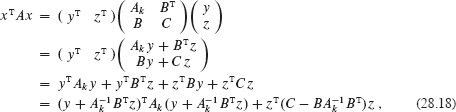
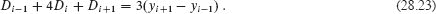

**`28`        矩阵运算**

因为矩阵操作是科学计算的核心，对于处理矩阵的高效算法有许多实际应用。本章重点讨论如何乘法矩阵和解决一组同时线性方程。附录 `D` 回顾了矩阵的基础知识。

第 28.1 节 展示了如何使用 LUP 分解解决一组线性方程。然后，第 28.2 节 探讨了矩阵乘法和求逆之间的密切关系。最后，第 28.3 节 讨论了对称正定矩阵的重要类，并展示了如何使用它们找到过定线性方程组的最小二乘解。

在实践中出现的一个重要问题是***数值稳定性***。因为实际计算机对浮点数的表示精度有限，数值计算中的舍入误差可能在计算过程中被放大，导致错误的结果。这样的计算被称为***数值不稳定***。虽然我们偶尔会简要讨论数值稳定性，但本章不会重点讨论它。我们建议您参考 Higham 的优秀著作[216]，对稳定性问题进行深入讨论。

**28.1 解线性方程组**

许多应用需要解决一组同时线性方程。线性系统可以被转化为一个矩阵方程，其中每个矩阵或向量元素属于一个域，通常是实数 `ℝ`。本节讨论如何使用一种称为 LUP 分解的方法解决线性方程组。

这个过程从一个包含 `n` 个未知数 `x[1]`、`x[2]`、…，`x[n]` 的线性方程组开始：

方程（`28.1`）的一个***解***是一组值 `x[1]`、`x[2]`、…，`x[n]`，满足所有方程。在本节中，我们只处理恰好有 `n` 个方程和 `n` 个未知数的情况。

接下来，将方程`（28.1）`重写为矩阵-向量方程

或者，等价地，让 `A = (a[ij])`，`x = (x[i])`，`b = (b[i])`，如下所示

如果 `A` 是非奇异的，它具有逆 `A^(−1)`，并且

是解向量。我们可以证明 `x` 是方程（28.2）的唯一解如下。如果有两个解，`x` 和 `x'`，那么 `Ax = Ax' = b`，并且，让 `I` 表示单位矩阵，

| `x` | = | `Ix` |
| --- | --- | --- |
| \|  \| = \| \((`A`\^(-1)`A`\)\`x` \| |
|  | = `A^(-1)(Ax)` |
| | = | A^(−1)(Ax′) |
|  | = | (A^(-1)A)x' |
|  | = | Ix′ | `   |
| | = `x'`. |

当 `A` 是非奇异的时候，或者等价地（根据第 1220 页的定理 D.1），`A` 的秩等于未知数的个数 `n` 时，本节重点讨论这种情况。然而，还有其他可能性，值得简要讨论。如果方程的数量少于未知数的个数 `n`，或者更一般地说，如果 `A` 的秩小于 `n`，那么这个系统是***欠定***的。一个欠定系统通常有无穷多个解，尽管如果方程不一致的话可能根本没有解。如果方程的数量超过未知数的个数 `n`，那么这个系统是***过定***的，可能根本没有解。第 28.3 节 解决了如何找到过定线性方程组的良好近似解的重要问题。

让我们回到解决`n`个未知数的`n`个方程组`Ax = b`的问题。一种选择是计算`A^(−1)`，然后使用方程（28.3），将`b`乘以`A^(−1)`，得到`x = A^(−1)b`。这种方法在实践中存在数值不稳定性。幸运的是，另一种方法——LUP 分解——在实践中是数值稳定的，并且在实践中更快。

**LUP 分解概述**

LUP 分解的思想是找到三个`n × n`矩阵`L`、`U`和`P`，使得

其中

+   `L`是一个单位下三角矩阵，

+   `U`是一个上三角矩阵，而

+   `P`是一个置换矩阵。

我们称满足方程(`28.4`)的矩阵`L`、`U`和`P`为矩阵`A`的***LUP 分解***。我们将展示每个非奇异矩阵`A`都具有这样的分解。

为矩阵`A`计算 LUP 分解的优势在于，当矩阵`L`和`U`都是三角形时，线性系统可以高效地解决。如果你有矩阵`A`的 LUP 分解，你可以通过仅解决三角形线性系统来解决方程（28.2），`Ax = b`。将`Ax = b`两边乘以`P`，得到等价方程`PAx = Pb`。根据第 1219 页的练习 D.1-4，将方程乘以置换矩阵相当于重新排列方程（28.1）。通过分解（28.4），用`LU`代替`PA`得到

`LUx = Pb`。

现在你可以通过解两个三角线性系统来解决这个方程。定义`y = Ux`，其中`x`是所需的解向量。首先解决下三角系统

通过一种称为“向前替换”的方法解出未知向量`y`。解出`y`后，解上三角系统

``  

通过一种称为“向后替换”的方法解出未知的`x`。为什么这个过程能解决`Ax` = `b`？因为置换矩阵`P`是可逆的（参见第 1223 页的练习 D.2-3），将方程（28.4）两边乘以`P^(-1)`得到`P^(-1)PA` = `P^(-1)LU`，因此

因此，满足`Ux = y`的向量`x`就是满足`Ax = b`的解：

| `Ax` | = | `P^(-1)LUx` | （根据方程`28.7`） |   |
| --- | --- | --- | --- |
| \|  | = \| `P^(-1)Ly` \| （根据方程（28.6）） \| |
|  | = | `P^(-1)Pb` | （根据方程`28.5`） |   |
|  | = | b | 。` |

下一步是展示向前替换和向后替换的工作原理，然后解决计算 LUP 分解本身的问题。

**向前替换和向后替换**

`***向前替换***`可以在`Θ(n²)`的时间内解决下三角系统（28.5），给定`L`、`P`和`b`。数组`π[1 : n]`提供了一种更紧凑的格式来表示置换`P`，而不是一个大部分为 0 的`n × n`矩阵。对于`i = 1, 2, …, n`，条目`π[i]`表示`P[i,π[i]] = 1`和`P[ij] = 0`（`j ≠ π[i]`）。因此，`PA`在第`i`行第`j`列有`a[π[i],j]`，`Pb`的第`i`个元素为`b[π[i]]`。由于`L`是单位下三角矩阵，矩阵方程`Ly = Pb`等价于`n`个方程

| ``y`[1]` | = | ``b`[*π*[1]]` |
| --- | --- | --- |
| `l[21]y[1] + y[2]` | = | `b[π[2]]，` |
| `l[31]y[1] + l[32]y[2] + y[3]` | = | `b[π[3]]，` |
|  | ⋮ |  |   |
| `l[n1]*y[1] + l[n2]*y[2] + l[n3]*y[3] + ⋯ + y[n]` | = | `b[π[n]]`。 |   |

第一个方程直接给出`y[1] = b[π[1]]`。知道`y[1]`的值后，你可以将其代入第二个方程，得到

`y[2] = b[π[2]] − l[21]y[1]`

接下来，你可以将`y[1]`和`y[2]`都代入第三个方程，得到

`y[3] = b[π[3]] − (l[31]y[1] + l[32]y[2])`

一般来说，你将`y[1]`、`y[2]`、…、`y[i-1]`“向前”代入第`i`个方程中，解出`y[i]`：

  

一旦你解出了`y`，你可以使用***回代法***在方程（28.6）中解出`x`，这类似于前代法。这一次，你首先解出第`n`个方程，然后向前解决第一个方程。与前代法类似，这个过程的时间复杂度为Θ(`n`²)。由于`U`是上三角矩阵，矩阵方程`Ux = y`等价于`n`个方程

| `u[11]*x[1] + u[12]*x[2] + ⋯ + | u[1,n−2]*x[n−2] + | u[1,n−1]*x[n−1] + | u[1*n]*x[n]` | = | `y[1], |
| --- | --- | --- | --- | --- | --- |
| `u[22]x[2]` + ⋯ + | `u[2,n−2]x[n−2]` + | `u[2,n−1]x[n−1]` + | `u[2n]x[n]` | = | `y[2]`, |
|  |  |  |  | ⋮ |  |
|  | `u[n−2,n−2]*x[n−2]` + | `u[n−2,n−1]*x[n−1]` + | `u[n−2,n]*x[n]` | = | `y[n−2],` |
|  |  | u[n-1,n-1]x[n-1] + | u[n-1,n]x[n] | = | y[n-1], |
|  |  |  | u[n,n]x[n] | = | y[n]. |

因此，你可以依次解出`x[n]`，`x[n−1]`，…，`x[1]`如下：  

| `x[n]` | = | `y[n]`/`u[n,n]`, |   |
| --- | --- | --- | --- |
| --- | --- | --- |
| `x[n-1]` | = | (`y[n-1] - u[n-1,n]*x[n]`)/`u[n-1,n-1]`, |
| `x[n-2]` | = | (`y[n-2] - (u[n-2,n-1]*x[n-1] + u[n-2,n]*x[n]))/u[n-2,n-2] |
|  | ⋮ |  |

或者，一般地说，

给定`P`，`L`，`U`和`b`，下一页的 LUP-SOLVE 过程通过结合前代和回代来解出`x`。置换矩阵`P`由数组`π`表示。该过程首先在第 2-3 行使用前代解出`y`，然后在第 4-5 行使用回代解出`x`。由于`for`循环内的求和包含一个隐式循环，运行时间为Θ(`n`²)。

作为这些方法的一个示例，考虑由`Ax = b`定义的线性方程组，其中  

`LUP-SOLVE(L, U, π, b, n)`  

| 1 | 让`x`和`y`成为长度为`n`的新向量 |  |
| --- | --- |
| 2 | **对于** `i` = 1 **到** `n` |
| `3` |  |
| 4 | **对于** `i = n` **向下**到 1 |
| `5` |  |
| 6 | **返回** `x` |   |

我们想要解出未知的`x`。LUP 分解为

  

（你可能想要验证`PA = LU`。）使用前代法，解出`Ly = Pb`的`y`：

获得  输出：

首先计算`y[1]`，然后计算`y[2]`，最后计算`y[3]`。然后，使用回代法解出`Ux = y`的`x`：

从而获得所需的答案

首先计算`x[3]`，然后计算`x[2]`，最后计算`x[1]`。

**计算 LU 分解**

给定一个非奇异矩阵`A`的 LUP 分解，你可以使用前代和回代来解决线性方程组`Ax = b`。现在让我们看看如何高效地计算矩阵`A`的 LUP 分解。我们从更简单的情况开始，即`A`是一个`n` × `n`的非奇异矩阵，`P`不存在（或者等价地，`P` = `I[n]`，`n` × `n`单位矩阵），这样`A` = `LU`。我们称这两个矩阵`L`和`U`为矩阵`A`的***LU 分解***。

要创建 LU 分解，我们将使用一种称为`高斯消元法`的过程。首先，从其他方程中减去第一个方程的倍数，以消除这些方程中的第一个变量。然后，从第二个方程中减去第三个及后续方程的倍数，以便现在从中删除第一个和第二个变量。继续这个过程，直到剩下的系统具有上三角形式—这就是矩阵`U`。矩阵`L`包括导致变量被消除的行乘数。

要实现这一策略，让我们从一个递归公式开始。输入是一个`n × n`的非奇异矩阵`A`。如果`n = 1`，则无需做任何操作：只需选择`L = I`[1]和`U = A`。对于`n` > 1，将`A`分成四部分：

其中`v = (a[21], a[31], … , a[n1])`是一个列(n−1)向量，`w^T = (a[12], a[13], … , a[1n])^T`是一个行(n − 1)向量，`A'`是一个(n − 1) × (n − 1)矩阵。然后，使用矩阵代数（通过简单相乘验证方程），将`A`因子化为

方程`(28.9)`中的第一个和第二个矩阵中的 `0` 是行和列(`n − 1`)向量，`vw^T/a[11]` 是一个(`n − 1`) × (`n − 1`)矩阵，通过取`v`和`w`的外积并将结果的每个元素除以`a[11]`形成。因此，它的大小与从中减去的矩阵`A'`相符。得到的(`n − 1`) × (`n − 1`)矩阵

  

称为`舒尔补`，相对于`a[11]`的`A`。

我们声称，如果`A`是非奇异的，则舒尔补也是非奇异的。为什么？假设舒尔补（(`n` − 1) × (`n` − 1)）是奇异的。然后根据定理 D.1，它的行秩严格小于`n` − 1。因为矩阵的第一列中的底部`n` − 1 个条目

如果矩阵的所有行都是 0，则该矩阵的底部`n` − 1 行的行秩必须严格小于`n` − 1。因此，整个矩阵的行秩严格小于`n`。将第 1223 页上方程`(28.9)`应用于练习 D.2-8，`A`的秩严格小于`n`，根据定理 D.1，我们得出结论，`A`是奇异的。

因为舒尔补是非奇异的，它也有一个 LU 分解，我们可以递归地找到。假设

`A' - vw^T/a[11] = L'U'`,  

其中`L′`是单位下三角矩阵，`U′`是上三角矩阵。然后`A`的 LU 分解为`A = LU`，其中

如下所示

``  

因为`L′`是单位下三角矩阵，所以`L`也是，因为`U′`是上三角矩阵，所以`U`也是。  

当然，如果`a[11]` = 0，则此方法不起作用，因为它会除以 0。如果舒尔补`A′ − vw^T/a[11]`的左上角条目为 0，那么递归的下一步将除以它。LU 分解每一步中的分母称为***枢轴***，它们占据矩阵`U`的对角线元素。包含在 LUP 分解中的排列矩阵`P`提供了一种避免除以 0 的方法，我们将在下面看到。使用排列来避免除以 0（或由于小数值而导致数值不稳定）称为***枢轴调整***。

对于 LU 分解始终正确的重要矩阵类是对称正定矩阵类。这些矩阵在上述递归策略中不需要进行任何枢轴调整以避免除以 0。我们将在第 `28.3` 节中证明这一结果，以及其他几个结果。

程序 `LU-DECOMPOSITION` 中的伪代码遵循递归策略，只是用迭代循环替代了递归。（这种转换是对“尾递归”程序的标准优化，即其最后一个操作是对自身的递归调用。参见第 202 页的问题 7-5。）该程序将矩阵`U`初始化为对角线以下的 0，将矩阵`L`初始化为对角线上的 1 和对角线以上的 0。每次迭代都处理一个方阵子矩阵，使用其左上角元素作为枢轴来计算`v`和`w`向量以及舒尔补，舒尔补成为下一次迭代处理的方阵子矩阵。

`LU-DECOMPOSITION(A, n)`

|   1 | 让`L`和`U`成为新的`n` × `n`矩阵 |
| --- | --- |
| --- | --- |
|   2 | 用 0 初始化`U`的对角线以下 |  |
| `3` | 用 1 初始化`L`的对角线和 0 初始化对角线以上 |
|   4 | `对于` `k` = 1 `到` `n` |
|   5 | `u[kk] = a[kk]` |   |
|   6 | **对于** `i = k + 1 **到** n` |
|   7 | `l[ik]` = `a[ik]`/`a[kk]` | **//** `a[ik]`保存`v[i]` |   |
|   8 | `u[ki]` = `a[ki]` | **//** `a[ki]`保存`w[i]` |
|   9 | **对于** `i = k + 1` **到** `n` | **//** 计算舒尔补 … |
| 10 | **对于** j = k + 1 **到** n |
| 11 | `a[ij]` = `a[ij]` − `l[ik]u[kj]` | **//** … 并将其存回`A`中 |
| `12` | **返回** `L` 和 `U` |   |

上述描述中的每个递归步骤都在行 4-11 的外部`for`循环的一次迭代中发生。在这个循环中，行 5 确定主元为`u[kk]` = `a[kk]`。行 6-8 中的`for`循环（当`k` = `n`时不执行）使用`v`和`w`向量更新`L`和`U`。行 7 确定`L`的下对角线元素，将`v[i]`/`a[kk]`存储在`l[ik]`中，行 8 计算`U`的上对角线元素，将`w[i]`存储在`u[ki]`中。最后，行 9-11 计算舒尔补的元素，并将它们存回矩阵`A`中。（在行 11 中不需要除以`a[kk]`，因为当行 7 计算`l[ik]`时已经发生过。）由于行 11 是三重嵌套的，LU-分解的运行时间为Θ(`n`³)。

图 28.1 说明了 LU-分解的操作。它展示了该过程的标准优化，将``L``和``U``的重要元素就地存储在矩阵``A``中。每个元素`a[ij]`对应于`l[ij]`（如果`i` > `j`）或`u[ij]`（如果`i` ≤ `j`），因此当过程终止时，矩阵`A`同时保存`L`和`U`。要从 LU-分解过程的伪代码中获得此优化的伪代码，只需将对`l`或`u`的每个引用替换为`a`。您可以验证此转换保持正确性。

**图 28.1** LU-分解的操作。**(a)** 矩阵`A`。**(b)** 第一次外部`for`循环的结果，行 4-11。蓝色突出显示的元素`a[11] = 2` 是主元，棕色列是`v/a[11]`，棕色行是`w^T`。到目前为止计算出的`U`元素在水平线上方，`L`元素在垂直线左侧。舒尔补矩阵`A′ - vw^T/a[11]`占据右下角。**(c)** 对来自(b)部分的舒尔补矩阵的下一次外部`for`循环的结果。蓝色突出显示的元素`a[22] = 4` 是主元，棕色列和行分别是`v/a[22]`和`w^T`（在舒尔补分区中）。线将矩阵分为到目前为止计算出的`U`元素（上方），到目前为止计算出的`L`元素（左侧）和新的舒尔补（右下角）。**(d)** 经过下一次迭代后，矩阵`A`被分解。当递归终止时，新舒尔补中的元素 3 成为`U`的一部分。**(e)** 分解`A = LU`。

**计算 LUP 分解**

如果提供给`LU-分解`的矩阵的对角线包含任何 0，那么该过程将尝试除以 0，这将导致灾难。即使对角线不包含 0，但包含绝对值较小的数字，除以这样的数字可能导致数值不稳定。因此，`LUP 分解`会在能找到的具有最大绝对值的条目上进行主元选取。  

在 LUP 分解中，输入是一个`n` × `n`非奇异矩阵`A`，目标是找到一个置换矩阵`P`，一个单位下三角矩阵`L`，和一个上三角矩阵`U`，使得`PA` = `LU`。在将矩阵`A`分割之前，与 LU 分解不同，LUP 分解将一个非零元素，比如`a[k1]`，从第一列的某处移动到矩阵的(1, 1)位置。为了获得最大的数值稳定性，LUP 分解选择第一列中绝对值最大的元素作为`a[k1]`。（第一列不能只包含 0，否则`A`将是奇异的，因为根据第 1221 页的定理 D.4 和 D.5，它的行列式为 0。）为了保持方程组，LUP 分解交换第 1 行和第`k`行，这等效于在左边将`A`乘以置换矩阵`Q`（第 1219 页的练习 D.1-4）。因此，类似于方程(28.8)，`QA`表示为

其中`v = (a[21], a[31], … , a[n1])`，除了`a[11]`替换为`a[k1]`；`w^T = (a[k2], a[k3], … , a[kn])^T`；`A'`是一个`(n - 1) × (n - 1)`矩阵。由于`a[k1] ≠ 0`，类似于方程(28.9)，不会出现除以 0 的情况：  

就像 LU 分解一样，如果`A`是非奇异的，那么舒尔补`A′ − vw^T/a[k1]`也是非奇异的。因此，你可以递归地为其找到一个 LUP 分解，其中包括单位下三角矩阵`L′`，上三角矩阵`U′`，和置换矩阵`P′`，使得

`P′(A′ − vw^T/a[k1]) = L′U′`

定义

这是一个置换矩阵，因为它是两个置换矩阵的乘积（第 1219 页的练习 D.1-4）。这个`P`的定义为

这导致了 LUP 分解。因为`L′`是单位下三角形的，所以`L`也是；因为`U′`是上三角形的，所以`U`也是。

注意，在这个推导中，与 LU 分解不同，列向量`v/a[k1]`和舒尔补`A′ - vw^T/a[k1]`都乘以置换矩阵`P′`。LUP-DECOMPOSITION 过程给出了 LUP 分解的伪代码。

`LUP-DECOMPOSITION(A, n)`  

|   1 | 让 `π[1 : n]` 成为一个新数组 |
| --- | --- |
| 2 | ` **对于** `i = 1` **到** `n` |   |
|   3 | `π[i] = i` | **//** 将`π`初始化为单位置换 |
|   4 | **对于** `k` = 1 **到** `n` |
|   `5` | `p` = `0` |   |
|   6 | `**对于** i = k **到** n` | **//** 找到第`k`列中绝对值最大的值 |
|   7 | **如果** | *a[ik]* | > `p` |
|   8 | p = | a[ik] |
|   9 | `k′ = i` | **//** 到目前为止找到的最大值所在的行号 |
| `10` | **如果** `p` == 0 |  |
| `11` | **错误** “奇异矩阵” |
| 12 | 用`π[k]`交换`π[k′]` |   |
| 13 | **对于** `i = 1` **到** `n` |  |
| `14` | 用`a[ki]`交换`a[ki']` | **//** 交换行`k`和`k'` |
| 15 | ` **对于** `i = k + 1` **到** `n` |
| 16 | `a[ik] = a[ik]/a[kk]` |
| 17 | **对于** `j = k + 1` **到** `n` |
| `18` | `a[ij]` = `a[ij]` − `a[ik]a[kj]` | **//** 在`A`中就地计算`L`和`U` |   |

类似于 LU-DECOMPOSITION，LUP-DECOMPOSITION 过程用迭代循环替换了递归。作为对递归的直接实现的改进，该过程动态地将置换矩阵`P`维护为一个数组`π`，其中`π[i] = j`表示`P`的第`i`行在第`j`列包含一个 1。LUP-DECOMPOSITION 过程还实现了前面提到的改进，就地在矩阵`A`中计算`L`和`U`。因此，当过程终止时，

图 28.2 说明了 LUP-分解如何分解矩阵。第 2–3 行初始化数组`π`以表示身份置换。第 4–18 行的外部`for`循环实现了递归，找到一个(`n` − `k` + 1) × (`n` − `k` + 1)子矩阵的 LUP 分解，其左上角在第`k`行和第`k`列。每次通过外部循环时，第 5–9 行确定当前第一列（第`k`列）中绝对值最大的元素`a[k′k]`，该元素位于当前工作的(`n` − `k` + 1) × (`n` − `k` + 1)子矩阵中���如果当前第一列中的所有元素都为 0，则第 10–11 行报告矩阵是奇异的。为了进行枢轴，第 12 行交换`π[k′]`和`π[k]`，第 13–14 行交换`A`的第`k`行和第`k′`行，从而使枢轴元素为`a[kk]`。（整行交换是因为在上面的方法推导中，不仅`A′ − vw^T/a[k1]`被`P′`乘以，`v/a[k1]`也是如此。）最后，通过第 15–18 行计算舒尔补，方式与 LU-分解的第 6–11 行计算方式基本相同，只是这里的操作被写成就地工作。  

``  

**图 28.2** LUP-分解的操作。**(a)** 输入矩阵`A`，左侧为黄色的行的身份置换。算法的第一步确定了第一列的主元为第三行中突出显示的蓝色元素 5。**(b)** 交换第 1 行和第 3 行，并更新置换。棕色的列和行代表`v`和`w^T`。**(c)** 向量`v`被`v/5` 替换，并且右下角的矩阵使用舒尔补更新。线将矩阵分为三个区域：`U`的元素（上方）、`L`的元素（左侧）和舒尔补的元素（右下角）。**(d)–(f)** 第二步。**(g)–(i)** 第三步。在第四（最后）步中不会发生进一步的更改。**(j)** LUP 分解`PA = LU`。

由于其三重嵌套循环结构，LUP-分解的运行时间为`Θ(n³)`，与 LU-分解相同。因此，枢轴成本最多只是一个常数因子的时间。

`练习`

***28.1-1***

解方程

通过使用前向替换。

`28.1-2`

找到矩阵的`LU`分解。

***28.1-3***

解方程

通过使用 LUP 分解。

***`28.1-4`***

描述对角矩阵的 LUP 分解。

***28.1-5***

描述置换矩阵的`LUP`分解，并证明其唯一性。

***28.1-6***

证明对于所有`n` ≥ 1，存在一个奇异的`n × n`矩阵，它有一个 LU 分解。

`28.1-7`  

在 LU-分解中，当`k` = `n`时，是否需要执行最外层的`for`循环迭代？LUP-分解呢？

**28.2 求逆矩阵**

尽管你可以使用方程`（28.3）`通过计算矩阵的逆矩阵来解线性方程组，在实践中，最好使用更稳定的技术，如 LUP 分解。然而，有时你确实需要计算矩阵的逆。本节展示了如何使用 LUP 分解来计算矩阵的逆。它还证明了矩阵乘法和计算矩阵的逆是等价困难的问题，即（在技术条件下）一个算法可以在相同的渐近运行时间内解决另一个问题。因此，你可以使用 Strassen 算法（参见第 `4.2` 节）来求逆矩阵。事实上，Strassen 的原始论文是受到这样一个想法的启发，即一组线性方程可以比通常的方法更快地解决。

**从 LUP 分解计算矩阵的逆矩阵**。

假设你有一个矩阵`A`的 LUP 分解，形式为三个矩阵`L`、`U`和`P`，使得`PA = LU`。使用 LUP-SOLVE，你可以在Θ(`n`²)的时间内解决形式为`Ax = b`的方程。由于 LUP 分解取决于`A`而不是`b`，你可以在额外的Θ(`n`²)时间内对形式为`Ax = b'`的第二组方程运行 LUP-SOLVE。一般来说，一旦你有了矩阵`A`的 LUP 分解，你可以在Θ(`kn`²)的时间内解决`k`个仅在向量`b`中有所不同的方程`Ax = b`。

让我们考虑方程

  

定义矩阵`X`，即`A`的逆，为一组形式为`Ax = b`的`n`个不同方程。具体来说，让`X[i]`表示`X`的第`i`列，并回忆单位向量`e[i]`是`I[n]`的第`i`列。然后，通过使用`A`的 LUP 分解来解决每个方程，可以解决`X`的方程(28.11)

`AX[i]` = `e[i]`

分别对`X[i]`进行计算。一旦你有了 LUP 分解，你可以在Θ(`n`²)的时间内计算每个`X[i]`的`n`列，因此你可以在Θ(`n`³)的时间内从`A`的 LUP 分解计算`X`。由于你在Θ(`n`³)的时间内找到了`A`的 LUP 分解，你可以在Θ(`n`³)的时间内计算矩阵`A`的逆`A^(−1)`。

**矩阵乘法和矩阵求逆**

现在让我们看看为矩阵乘法获得的理论加速如何转化为矩阵求逆的加速。事实上，我们将证明更强的结论：矩阵求逆等价于矩阵乘法。如果`M(n)`表示两个`n × n`矩阵相乘的时间，则非奇异的`n × n`矩阵可以在`O(M(n))`的时间内求逆。此外，如果`I(n)`表示求逆一个非奇异的`n × n`矩阵的时间，��两个`n × n`矩阵可以在`O(I(n))`的时间内相乘。我们将这些结果作为两个单独的定理证明。  

***定理 28.1（乘法不比求逆更难）***

如果一个`n` × `n`矩阵可以在`I(n)`的时间内求逆，其中`I(n)` = Ω(`n`²)，且`I(n)`满足`I(3n)` = `O(I(n))`的正则条件，则两个`n` × `n`矩阵可以在`O(I(n))`的时间内相乘。  

***证明*** 让`A`和`B`为`n` × `n`矩阵。为了计算它们的乘积`C` = `AB`，定义 3`n` × 3`n`矩阵`D`为

`D`的逆是 `D`

因此，要计算乘积`AB`，只需取`D^(-1)`的右上`n` × `n`子矩阵。

构造矩阵`D`需要Θ(n²)的时间，根据假设*I(n)* = Ω(n²)，求逆`D`需要`O`(I(3`n`)) = `O`(I(n))的时间，根据*I(n)*的正则条件。因此，我们有*M(n)* = `O`(I(n))。  

▪ 输出：

注意当`I(n) = Θ(n^c lg^(d)n)`时，`I(n)`满足正则条件，其中*任意常数 c > 0*，*d ≥ 0*。

矩阵求逆不比矩阵乘法更难的证明依赖于对对称正定矩阵的一些性质的证明，详见第 `28.3` 节。

***定理 28.2（求逆不比乘法更难）***

假设两个`n` × `n`实矩阵可以在`M(n)`的时间内相乘，其中`M(n)` = Ω(`n`²)，且`M(n)`满足以下两个正则条件：

1.  `M(n + k) = O(M(n))`，其中`0 ≤ k < n`。

1.  `M(n/2) ≤ cM(n)`，其中*某个常数 c < 1/2*。

那么任何实非奇异`n`×`n`矩阵的逆都可以在`O(M(n))`的时间内计算。

***证明*** 让`A`为具有实值条目的非奇异`n` × `n`矩阵。假设`n`是 2 的整数幂（即`n` = 2^l^，其中`l`是整数）；我们将在证明的最后看到如果`n`不是 2 的整数幂该怎么办。  

暂时假设`n` × `n`矩阵`A`是对称的且正定的。将`A`及其逆`A^(−1)`分成四个`n/2` × `n/2` 子矩阵：

然后，如果我们让 

  

是 `A` 相对于 `B` 的舒尔补（我们将在 第 28.3 节 中更多地了解这种形式的舒尔补），我们有

``  

由于 `AA^(-1) = I[n]`，您可以通过执行矩阵乘法来验证。因为 `A` 是对称且正定的，所以 第 28.3 节 中的引理 28.4 和 28.5 意味着 `B` 和 `S` 都是对称且正定的。因此，根据 第 28.3 节 中的引理 28.3，逆 `B^(-1)` 和 `S^(-1)` 存在，并且根据第 1223 页的练习 D.2-6，`B^(-1)` 和 `S^(-1)` 都是对称的，因此 `(B^(-1))^T = B^(-1)` 和 `(S^(-1))^T = S^(-1)`。因此，要计算子矩阵

| `R` | = | `B^(-1) + B^(-1)C^T*S^(-1)*CB^(-1)` |
| --- | --- | --- |
| --- | --- | --- |
| `T` | = | −`B`^(−1)`C`^T`S`^(−1), |   |
| `U` | = | −`S^(-1)CB^(-1)`, and |
| `V` | = | `S^(-1)` |

对于 `A^(-1)`，执行以下操作，其中提到的所有矩阵都是 `n/2 × n/2`：

1.  构造矩阵 `A` 的子矩阵 `B`、`C`、`C`^T 和 `D`。  

1.  递归计算 `B^(-1)` 的逆 `B`。

1.  计算矩阵乘积 `W = CB^(-1)`，然后计算其转置 `W^T`，等于 `B^(-1)C^T`（根据第 1219 页的练习 D.1-2 和 (`B^(-1))^T = B^(-1)`）。

1.  计算矩阵乘积 `X = WC^T`，等于 `CB^(-1)C^T`，然后计算矩阵 `S = D - X = D - CB^(-1)C^T`。

1.  递归计算 `S^(-1)` 的逆 `S`。

1.  计算矩阵乘积 `Y = S^(-1)W`，等于 `S^(-1)CB^(-1)`，然后计算其转置 `Y^T`，等于 `B^(-1)C^TS^(-1)`（根据练习 D.1-2，`(B^(-1))^T = B^(-1)`，以及 `(S^(-1))^T = S^(-1)`）。

1.  计算矩阵乘积 `Z = W^T*Y`，等于 `B^(-1)*C^T*S^(-1)*CB^(-1)`。  

1.  设 `R = B^(-1) + Z`。

1.  设 `T = -Y^T`。

1.  设 `U = -Y`。

1.  设 `V = S^(-1)`。

因此，要求一个 `n`×`n` 对称正定矩阵的逆，需要在步骤 2 和 5 中求解两个 `n/2`×`n/2` 矩阵的逆；在步骤 3、4、6 和 7 中进行四次 `n/2` × `n/2` 矩阵的乘法；并额外花费 `O(n²)` 的成本从 `A` 中提取子矩阵，将子矩阵插入 `A⁻¹`，以及在 `n/2`×`n/2` 矩阵上执行常数次加法、减法和转置。运行时间由递归式给出

第二行是基于 `M(n) = Ω(n²)` 和定理陈述中的第二个正则条件，这意味着 `4*M(n/2) < 2*M(n)`。由于 `M(n) = Ω(n²)`，所以主定理（定理 4.1）的第三种情况适用于递归式（28.15），得到 `O(M(n))` 的结果。  

仍需证明当 `A` 可逆但不对称且正定时，如何获得与矩阵求逆相同的渐近运行时间。基本思想是对于任何非奇异矩阵 `A`，矩阵 `A^T*A` 是对称的（根据练习 D.1-2）且正定的（根据第 1222 页的定理 D.6）。因此，关键在于将求逆 `A` 的问题简化为求逆 `A^T*A` 的问题。

这种简化基于以下观察：当 `A` 是一个 `n` × `n` 非奇异矩阵时，我们有

`A^(-1) = (A^T*A)^(-1)A^T`,  

因为 ((`A`^T`A`)^(-1)`A`^T)`A` = ((`A`^T`A`)^(-1)(`A`^T))`A` = *I[n]*，且矩阵求逆是唯一的。因此，要计算 `A`^(-1)，首先将 `A`^T 乘以 `A` 得到 `A`^T`A`，然后使用上述分治算法求逆对称正定矩阵 `A`^T`A`，最后将结果乘以 `A`^T。这三个步骤每个都需要 `O`(`M`(`n`)) 的时间，因此任何具有实数元素的非奇异矩阵都可以在 `O`(`M`(`n`)) 的时间内求逆。  

上述证明假设 `A` 是一个 `n` × `n` 矩阵，其中 `n` 是 2 的幂。如果 `n` 不是 2 的幂，则令 `k` < `n` 使得 `n` + `k` 是 2 的幂，并定义 (`n` + `k`) × (`n` + `k`) 矩阵 `A`′ 为  

那么`A′`的逆矩阵是

将证明的方法应用于`A′`来计算`A′`的逆，并将结果的前`n`行和前`n`列作为所需答案`A⁻¹`。关于`M(n)`的第一个规则条件确保以这种方式扩大矩阵最多只会增加一个常数因子的运行时间。

▪

定理 28.2 的证明建议如何使用不进行主元置换的 LU 分解来解方程`Ax = b`，只要`A`是非奇异的。令`y = A^Tb`。将方程`Ax = b`的两边都乘以`A^T`，得到`(A^TA)x = A^Tb = y`。这种转换不会影响解`x`，因为`A^T` 是可逆的。因为`A^TA`是对称正定的，可以通过计算 LU 分解来因式分解。然后，使用前向和后向替换来解方程`(A^TA)x = y`中的`x`。尽管这种方法在理论上是正确的，但在实践中，LUP-DECOMPOSITION 过程效果要好得多。LUP 分解需要的算术运算次数少了一个常数因子，并且具有更好的数值特性。

**习题**

***28.2-1***  

让`M(n)`表示两个`n × n`矩阵相乘的时间，让`S(n)`表示求解一个`n × n`矩阵的平方所需的时间。证明矩阵相乘和矩阵平方具有基本相同的难度：一个`M(n)`时间的矩阵乘法算法意味着一个`O(M(n))`时间的矩阵平方算法，一个`S(n)`时间的矩阵平方算法意味着一个`O(S(n))`时间的矩阵乘法算法。

***28.2-2***

让`M(n)`表示两个`n × n`矩阵相乘的时间。证明一个`M(n)`时间的矩阵乘法算法意味着一个`O(M(n))`时间的 LUP 分解算法。（你的方法产生的 LUP 分解不一定与 LUP-DECOMPOSITION 过程产生的结果相同。）

***28.2-3***

让`M(n)`表示两个`n × n`布尔矩阵相乘的时间，让`T(n)`表示找到一个`n × n`布尔矩阵的传递闭包所需的时间。（参见第 23.2 节。）证明一个`M(n)`时间的布尔矩阵乘法算法意味着一个`O(M(n) lg n)`时间的传递闭包算法，一个`T(n)`时间的传递闭包算法意味着一个`O(T(n))`时间的布尔矩阵乘法算法。

`28.2-4`

基于定理 `28.2` 的矩阵求逆算法在矩阵元素来自模 `2` 整数域时是否有效？解释。

*`28.2-5`*

将定理 28.2 的矩阵求逆算法推广到处理复数矩阵，并证明你的推广是正确的。（*提示：*不要使用`A`的转置，而是使用***共轭转置*** `A*`，通过用每个条目的复共轭替换`A`的转置来获得。不要考虑对称矩阵，考虑***Hermite***矩阵，即满足`A = A*`的矩阵。）

**28.3**    对称正定矩阵和最小二乘逼近  

对称正定矩阵具有许多有趣和理想的性质。一个`n` × `n`矩阵`A`是***对称正定***的，如果`A` = `A`^T（`A`是对称的），且对于所有`n`维向量`x` ≠ 0，有`x`^T`Ax` > 0（`A`是正定的）。对称正定矩阵是非奇异的，对它们进行 LU 分解不会除以 0。本节证明了对称正定矩阵的这些以及其他几个重要性质。我们还将看到一个有趣的应用，即通过最小二乘逼近进行曲线拟合。

我们证明的第一个性质可能是最基本的。

***引理 28.3***

任何正定矩阵都是非奇异的。

***证明*** 假设矩阵`A`是奇异的。那么根据第 1221 页的推论 D.3，存在一个非零向量`x`使得`A`x` = 0`。因此，`x^TAx = 0`，`A`不可能是正定的。  

▪  输出：

证明对称正定矩阵`A`的 LU 分解不会除以 0 更加复杂。我们首先证明关于`A`的某些子矩阵的性质。定义`A`的第`k`个***主子矩阵***为由`A`的前`k`行和前`k`列的交集组成的矩阵`A[k]`。  

**`引理 28.4`**

如果`A`是对称正定矩阵，则`A`的每个主子矩阵都是对称的且正定的。

***证明***   由于`A`是对称的，每个主子矩阵`A[k]`也是对称的。我们将通过反证法证明`A[k]`是正定的。如果`A[k]`不是正定的，那么存在一个`k`向量`x[k]` ≠ 0，使得`x[k]' A[k] x[k] ≤ 0`。令`A`为`n × n`，并且  

对于子矩阵`B`（大小为(`n`−`k`)×`k`）和`C`（大小为(`n`−`k`)×(`n`−`k`)）。定义`n`向量，其中有`n`−`k`个 0 跟在`x[k]`后面。然后我们有

这与`A`是正定的相矛盾。

▪  输出：

现在我们转向 Schur 补的一些基本性质。让`A`是一个对称正定矩阵，让`A[k]`是`A`的一个主要的`k` × `k`子矩阵。根据方程（28.16）再次对`A`进行分区。方程（28.10）推广定义了相对于`A[k]`的***Schur 补*** `S`为  

（根据引理 28.4，`A[k]`是对称的且正定的，因此，根据引理 28.3，存在，`S`是良定义的。）通过让`k`=1，方程（28.17）与 Schur 补的早期定义（28.10）是一致的。

下一个引理表明对称正定矩阵的 Schur 补矩阵本身也是对称的且正定的。我们在定理 `28.2` 中使用了这个结果，其推论将有助于证明 LU 分解适用于对称正定矩阵。

***引理 28.5(Schur 补引理)***

如果`A`是对称正定矩阵，而`A[k]`是`A`的一个主要的`k × k`子矩阵，则相对于`A[k]`的 Schur 补`S`是对称的且正定的。

***证明***   因为`A`是对称的，所以子矩阵`C`也是对称的。根据第 1223 页的练习 D.2-6，乘积``是对称的。由于`C`和``是对称的，根据第 1219 页的练习 D.1-1，`S`也是对称的。

仍需证明`S`是正定的。考虑方程（28.16）中给出的`A`的分区。对于任何非零向量`x`，根据`A`是正定的假设，我们有`x^TAx > 0`。让子向量`y`和`z`包含`x`中的前`k`个元素和后`n-k`个元素，因此它们与`A[k]`和`C`兼容。因为``存在，我们有

这最后一个等式，你可以通过乘法验证，相当于对二次形式进行“完全平方”（见练习 `28.3-2`）。

由于对于任何非零向量`x`，`x^TAx > 0` 成立，选择任意非零`z`，然后选择，这导致方程（28.18）中的第一项消失，留下

作为表达式的值。对于任意`z ≠ 0`，我们因此有`z^T*Sz = x^T*Ax > 0`，因此`S`是正定的。

▪  输出：

***推论 28.6***

对称正定矩阵的 LU 分解永远不会导致除以 0。

***证明*** 让`A`是一个`n` × `n`对称正定矩阵。实际上，我们将证明一个比推论陈述更强的结果：每个主元都是严格正的。第一个主元是`a[11]`。让`e[1]`是长度为`n`的单位向量( 1 0 0 ⋯ 0 )^T，所以 `e[1]^T A e[1]`，这是正的，因为`e[1]`是非零的，`A`是正定的。由于 LU 分解的第一步产生了关于`A[1]` = (`a[11]`)的舒尔补引理 28.5 暗示通过归纳所有主元都是正的。  

▪ 输出：

**最小二乘逼近**

对称正定矩阵的一个重要应用是将曲线拟合给定的数据点集。给定一组`m`个数据点

`(`x`[1], `y`[1]), (`x`[2], `y`[2]), … , (*x[m]*, `y`[m]*)`,

你知道`y[i]`受测量误差影响。你希望确定一个函数`F(x)`，使得逼近误差

  

对于`i` = 1, 2, … , `m`。函数`F`的形式取决于手头的问题。让我们假设它具有线性加权和的形式

其中求和的数量`n`和特定的***基函数*** `f[j]`是基于问题的知识选择的。一个常见的选择是`fj = x^(j−1)`，这意味着

`F(x) = c[1] + c[2]*x + c[3]*x² + ⋯ + c[n]*x^(n−1)`

是`x`的`n - 1`次多项式。因此，如果给定`m`个数据点`(x[1], y[1])`, `(x[2], y[2])`, … , `(x[m], y[m])`，你需要计算`n`个系数`c[1]`, `c[2]`, … , `c[n]`，使逼近误差`η[1]`, `η[2]`, … , `η[m]`最小化。

通过选择`n` = `m`，你可以在方程(28.19)中*精确*计算每个`y[i]`。这样一个高次多项式`F`“适应噪音”以及数据，但通常在用于预测先前未见的`x`值的`y`时效果不佳。通常最好选择明显小于`m`的`n`，希望通过选择系数`c[j]`得当，你可以获得一个函数`F`，它在不过分关注噪音的情况下找到数据点中的显著模式。有一些选择`n`的理论原则，但它们超出了本文的范围。无论如何，一旦选择了小于`m`的`n`值，你就会得到一个过度确定的方程组，你希望近似其解。让我们看看如何做到这一点。

让

表示给定点处基函数值的矩阵，即`a[ij]` = `f[j]`(x[i])。让`c` = (c[k])表示所需的`n`个系数向量。然后，

是`y`的“预测值”的`m`向量。因此，

`η = Ac - y`  

是**逼近误差**的`m`向量。

为了最小化逼近误差，让我们最小化误差向量`η`的范数，这给出了一个***最小二乘解***，因为

因为

为了最小化`∥η∥`，对`∥η∥²`关于每个`c[k]`求导，然后将结果设为 0：

对于`k` = 1, 2, … , `n`的`n`个方程(28.20)等价于单个矩阵方程

`(*Ac* - y)^T `A` = 0`

或者等价地(使用第 `1219` 页的练习 `D.1-2`)，为了

`A^T(Ac - y) = 0`, 

这意味着

在统计学中，方程`(28.21)`被称为***正规方程***。矩阵`A^T*A`通过练习 D.1-2 是对称的，如果`A`具有完整的列秩，那么根据第 1222 页的定理 D.6，`A^T*A`也是正定的。因此，`(A^T*A)^(-1)`存在，方程`(28.21)`的解是

  

其中矩阵`A^+ = ((A^T*A)^(-1)*A^T)`是矩阵`A`的***伪逆***。伪逆自然地将矩阵逆的概念推广到`A`不是方阵的情况。(将方程(28.22)作为`Ac = y`的近似解与将解`A^(-1)b`作为`Ax = b`的精确解进行比较。)

作为产生最小二乘拟合的一个例子，假设您有五个数据点

| `(`x`[1], `y`[1])` | = | `(−1, 2),` |
| --- | --- | --- |
| `x[2]`, `y[2]` | = | `(1, 1),` |
| (`x[3]`, `y[3]`) | = | (2, 1), |
| (`x[4]`, `y[4]`) | = | (3, 0), |
| `x[5], y[5]` | = | `(5, 3),` |   |

在图 28.3 中显示为橙色点，您希望用二次多项式拟合这些点

`F(x) = c[1] + c[2]x + c[3]x²`。

从基函数值矩阵开始

其伪逆是 

**图 28.3** 二次多项式对五个数据点集合{(−1, 2), (1, 1), (2, 1), (3, 0), (5, 3)}的最小二乘拟合。橙色点是数据点，蓝色点是由多项式`F(x) = 1.2 - 0.757x + 0.214x²`预测的它们的估计值，最小化平方误差的二次多项式，用蓝色绘制。每个橙色线显示了一个数据点的误差。

将`y`乘以`A`^+得到系数向量

对应于二次多项式

`F(x) = 1.200 - 0.757x + 0.214x²`

作为对给定数据的最接近的二次拟合，从最小二乘意义上讲。

作为一个实际问题，您通常会通过将`y`乘以`A`^T 来解决正规方程(28.21)，然后找到`A`^T`A`的 LU 分解。如果`A`具有满秩，那么矩阵`A`^T`A`是非奇异的，因为它是对称的且正定的。(参见练习 D.1-2 和定理 D.6。)

**图 28.4** 一个形式为的最小二乘拟合

`c[1]` + `c[2]*x` + `c[3]*x²` + `c[4] sin(2*πx)` + `c[5] cos(2*πx)`

对于从 1990¹到 2019 年在夏威夷马瓦诺亚测得的二氧化碳浓度，其中`x`是自 1990 年以来经过的年数。这条曲线是著名的“基林曲线”，展示了对非多项式公式的曲线拟合。正弦和余弦项允许对 CO[2] 浓度的季节性变化进行建模。红色曲线显示了测得的 CO[2] 浓度。最佳拟合曲线，显示为黑色，具有形式

`352.83 + 1.39`x` + 0.02`x`² + 2.83 sin(2*πx*) − 0.94 cos(2*πx*)`。

我们在图 28.4 中以一个示例结束本节，说明曲线也可以拟合非多项式函数。该曲线证实了气候变化的一个方面：二氧化碳（`CO[2]`）浓度在 29 年的时间内稳步增加。线性和二次项模拟了年度增长，正弦和余弦项模拟了季节性变化。

**`练习`**

***28.3-1***

证明对称正定矩阵的每个对角元素都是正的。

`28.3-2`

让``是一个 2×2 对称正定矩阵。通过“完成平方”证明其行列式`ac - b²`是正的，类似于引理 28.5 的证明中使用的方法。

***28.3-3***

证明对称正定矩阵中的最大元素位于对角线上。

`28.3-4`

证明对称正定矩阵的每个主导子矩阵的行列式都是正的。

`28.3-5`

让`A[k]`表示对称正定矩阵`A`的第`k`个主导子矩阵。证明 `det(A[k])/det(A[k−1])` 是 LU 分解过程中的第`k`个主元，按照惯例，`det(A[0]) = 1`。

***28.3-6***

找到形式为

`F(x) = c[1] + c[2]`x` lg x + c[3]*e^x`

这是对数据点的最佳最小二乘拟合

`(1, 1), (2, 1), (3, 3), (4, 8)`。

`28.3-7`

展示伪逆 `A^+` 满足以下四个方程：

| `AA`^+`A` | = | `A`, |   |
| --- | --- | --- |
| A^+AA^+ | = | A^+, |
| `(*AA*^+)^T` | = | *AA*^+, |   |
| `(`A`^+`A`)^T` | = | ``A`^+`A``. |

**问题**

***28-1     三对角线性方程组***  

考虑三对角矩阵

***`a.`*** 找到 `A` 的 LU 分解。

***b.*** 通过使用前向和后向替换解方程 `Ax = ( 1 1 1 1 1 )^T`。

***c.*** 找到 `A` 的逆。

***d.*** 展示如何通过进行 LU 分解在 `O(n)` 时间内解方程 `Ax = b`，其中 `A` 是任意 `n` × `n` 对称正定的三对角矩阵，`b` 是任意 `n` 维向量。论证基于形成 `A^(-1)` 的任何方法在最坏情况下都更昂贵。

***e.*** 展示如何通过进行 LUP 分解在 `O(n)` 时间内解方程 `Ax = b`，其中 `A` 是任意 `n` × `n` 非奇异的三对角矩阵，`b` 是任意 `n` 维向量。

***28-2     样条***

用`***三次样条***`插值一组点的实用方法是使用。给定一组点值对 `{(x[i], y[i]) : i = 0, 1, … , n}`，其中 `x[0] < x[1] < ⋯ < x[n]`。你的目标是拟合一条分段三次曲线（样条）`f(x)`到这些点。也就是说，曲线 `f(x)` 由 `n` 个三次多项式 `fi = a[i] + b[i]x + c[i]x² + d[i]x³` 组成，其中如果 `x` 落在 `x[i] ≤ x ≤ x[i+1]` 的范围内，则曲线的值由 `f(x) = fi` 给出。将三次多项式“粘合”在一起的点 `x[i]` 称为**`结点`**。为简单起见，假设 `x[i] = i` 对于 `i = 0, 1, … , n`。

为了确保 `f(x)` 的连续性，要求

| `f(x[i])` | = | `fi` | = | `fi` 充分平滑，还要求一阶导数在每个结点处连续：

对于 `i = 0, 1, … , n - 2`。

***a.*** 假设对于 `i` = 0, 1, … , `n`，除了点值对 {(`x[i]`, `y[i]`)} 外，还给出了每个结点处的一阶导数 `D[i]` = `f′(x[i])`。用 `y[i]`、`y[i+1]`、`D[i]` 和 `D[i+1]` 的值表示每个系数 `a[i]`、`b[i]`、`c[i]` 和 `d[i]`。你能多快地从点值对和一阶导数计算出 4`n` 个系数？

问题在于如何选择结点处 `f(x)` 的一阶导数。一种方法是要求结点处的二阶导数连续：

对于 `i = 0, 1, … , n−2`. 在第一个和最后一个结点处，假设  和 。这些假设使得 `f(x)` 成为一个***自然***三次样条。

***b.*** 利用二阶导数的连续性约束，证明对于 `i = 1, 2, … , n - 1`，

***c.*** 展示

***d.*** 将方程`（28.23）`–`（28.25）`重写为涉及未知向量 `D = (D[0] D[1] D[2] ⋯ D[n])^T` 的矩阵方程。你的方程中的矩阵具有什么属性？

***e.*** 论证自然三次样条可以在 `O(n)` 时间内插值一组 `n` + 1 点值对（参见问题 28-1）。

***f.*** 展示如何确定一个自然三次样条，插值一组满足 `x[0] < x[1] < ⋯ < x[n]` 的 `n` + 1 点 `(x[i], y[i])`，即使 `x[i]` 不一定等于 `i`。你的方法必须解决什么矩阵方程，你的算法运行多快？  

`章节注释`

许多优秀的文本详细描述了数值和科学计算，比我们在这里有空间描述的要多得多。特别易读的有：George 和 Liu `180`, Golub 和 Van Loan `192`, Press, Teukolsky, Vetterling, 和 Flannery `365, 366`, 以及 Strang `422, 423`。

Golub 和 Van Loan [192] 讨论了数值稳定性。他们解释了为什么 det(`A`) 不一定是矩阵 `A` 稳定性的好指标，而建议使用 ∥`A`∥[∞] ∥`A`^(−1)∥[∞]，其中 。他们还讨论了如何计算这个值而不实际计算 `A`^(−1)。

高斯消元法是 LU 和 LUP 分解的基础，是解线性方程组的第一个系统方法。它也是最早的数值算法之一。尽管它早在此前就已知晓，但其发现通常归功于 C. F. Gauss (1777–1855)。在他著名的论文 [424] 中，Strassen 表明一个 `n`×`n` 矩阵可以在 `O(n^(lg 7))` 的时间内求逆。Winograd [460] 最初证明矩阵乘法不比矩阵求逆更困难，而 Aho, Hopcroft, 和 Ullman [5] 则证明了反之。  

另一个重要的矩阵分解是`奇异值分解`，或`SVD`。SVD 将一个 `m` × `n` 矩阵 `A` 分解为 ``，其中 Σ 是一个只在对角线上有非零值的 `m`×`n` 矩阵，`Q[1]` 是 `m`×`m`，具有相互正交列的矩阵，`Q[2]` 是 `n` × `n`，同样具有相互正交列。如果两个向量的内积为 0，且每个向量的范数为 1，则这两个向量是`正交归一`的。Strang [422, 423] 和 Golub 和 Van Loan [192] 的书中都有关于 SVD 的良好讨论。

Strang [423] 对对称正定矩阵和线性代数有出色的介绍。

¹ *算法导论* 首次出版的年份。
