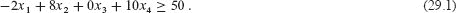
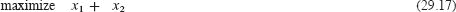
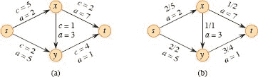
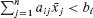

**`29 线性规划`**  

许多问题采取最大化或最小化目标的形式，考虑到有限的资源和竞争性约束。如果您可以将目标指定为某些变量的线性函数，并且可以将资源的约束规定为这些变量的等式或不等式，那么您就有了一个***线性规划问题***。线性规划在各种实际应用中出现。我们首先研究选举政治中的一个应用。

**一个政治问题**

假设您是一名试图赢得选举的政治家。您的选区有三种不同类型的地区——城市、郊区和农村。这些地区分别有`10 万`、`20 万`和 `5 万`名注册选民。尽管并非所有注册选民都会去投票，但您决定为了有效地治理，您希望每个地区至少有一半的注册选民投票支持您。您是光荣的，绝不会考虑支持您不相信的政策。然而，您意识到某些问题可能在某些地方赢得选票时更有效。您的主要问题是为了应对僵尸启示，给鲨鱼装激光器，修建飞车高速公路和允许海豚投票。  

根据您的竞选团队的研究，您可以估计通过在每个问题上花费`$1,000`广告赢得或失去多少选票。这些信息显示在图 29.1 的表中。在这个表中，每个条目表示通过在支持特定问题的广告上花费`$1,000`可以赢得多少城市、郊区或农村选民的数千人。负数条目表示将失去的选票。您的任务是找出您需要花费的最少金额，以赢得 5 万城市选票、10 万郊区选票和 2.5 万农村选票。

您可以通过试错来设计一种赢得所需选票的策略，但您想出的策略可能不是最便宜的。例如，您可以将`$20,000`用于应对僵尸启示的广告，`$0`用于给鲨鱼装激光器，`$4,000`用于修建飞车高速公路，`$9,000`用于允许海豚投票。在这种情况下，您将赢得（20 · -2）+（0 · 8）+（4 · 0）+（9 · 10）= 5 万城市选票，（20 · 5）+（0 · 2）+（4 · 0）+（9 · 0）= 10 万郊区选票，以及（20 · 3）+（0 · -5）+（4 · 10）+（9 · -2）= 8.2 万农村选票。您将在城市和郊区地区赢得所需的选票数量，而在农村地区赢得的选票超过了所需数量。（实际上，根据您的模型，在农村地区您将获得比选民更多的选票。）为了赢得这些选票，您将支付`20 + 0 + 4 + 9 = 3.3 万美元`的广告费。

**图 29.1** 政策对选民的影响。每个条目描述了在特定问题上花费`$1,000`广告支持能赢得多少城市、郊区或农村选民的数千人。负数条目表示将失去的选票。

自然而然地会想知道这种策略是否是最佳的。也就是说，您是否可以在广告上花费更少的情况下实现您的目标？额外的试验和错误可能会帮助您回答这个问题，但更好的方法是通过数学方式来形式化（或`建模`）这个问题。  

第一步是决定您必须做出的决策，并引入捕捉这些决策的变量。由于您有四个决策，您引入了四个`决策变量`：

+   `x₁` 是在为应对僵尸启示的广告上花费的数千美元，

+   `x₂` 是在给鲨鱼装激光器的广告上花费的数千美元，

+   `x[3]` 是用于在建造飞行汽车的高速公路上进行广告投放的数千美元，以及

+   `x[4]` 是用于让海豚投票进行广告投放的数千美元。

然后您考虑`约束`，这是对决策变量可以取值的限制或限制。您可以将至少赢得 5 万城市选票的要求写成

同样，您可以将您至少赢得`10 万`市区选票和`2.5 万`农村选票的要求写成

和  

任何满足不等式`(29.1)`–`(29.3)`的变量 `x`[1], `x`[2], `x`[3], `x`[4] 的设置都会产生赢得足够数量的每种类型选票的策略。  

最后，您考虑您的`***目标***`，这是您希望最小化或最大化的数量。为了尽可能降低成本，您希望最小化广告支出。也就是说，您希望最小化表达式

尽管负面广告经常出现在政治竞选中，但不存在负成本广告这种事情。因此，您要求

`

将不等式`(29.1)`–`(29.3)`和`(29.5)`与最小化`(29.4)`的目标相结合，产生了所谓的“线性规划”。我们可以将这个问题以表格形式格式化为

受限于

这个线性规划的解决方案会给出您的最佳策略。

本章的其余部分涵盖了如何制定线性规划，并介绍了建模的概念。建模是指将问题转化为数学形式，以便通过算法解决。第 29.1 节简要讨论了线性规划的算法方面，尽���没有包括线性规划算法的细节。在本书中，我们已经看到了通过最短路径和图中的连通性等方式对问题进行建模。将问题建模为线性规划时，您需要经历这个政治示例中使用的步骤——确定决策变量，指定约束条件，并制定目标函数。为了将问题建模为线性规划，约束条件和目标必须是线性的。在第 29.2 节中，我们将看到几个其他通过线性规划进行建模的示例。第 29.3 节讨论了对偶性，这是线性规划和其他优化算法中的一个重要概念。

**29.1 线性规划公式和算法**

线性规划采用特定形式，我们将在本节中进行讨论。已经开发了多种算法来解决线性规划问题。有些算法在多项式时间内运行，有些则不是，但它们都太复杂，无法在此展示。相反，我们将给出一个示例，演示单纯形算法背后的一些思想，这是目前最常用的解决方法。

**一般线性规划**

在一般线性规划问题中，我们希望优化一个线性函数，受一组线性不等式的限制。给定一组实数 `a₁`, `a₂`, … , `a[n]` 和一组变量 `x₁`, `x₂`, … , `x[n]`，我们通过以下方式定义这些变量的***线性函数*** `f`  

如果 `b` 是一个实数，`f` 是一个线性函数，那么方程

`f(x₁, x₂, … , x[n]) = b`

是一个`线性等式` 和不等式

`f(x₁, x₂, … , x[n]) ≤ b` 和 `f(x₁, x₂, … , x[n]) ≥ b`  

是`线性不等式`。我们使用通用术语`线性约束`来表示线性等式或线性不等式。线性规划不允许严格不等式。形式上，一个`线性规划问题`是要么最小化要么最大化一个线性函数，受限于一组有限的线性约束。如果是最小化，我们称线性规划为`最小化线性规划`，如果是最大化，我们称线性规划为`最大化线性规划`。

为了讨论线性规划算法和性质，使用标准符号来描述输入将会很有帮助。按照惯例，最大化线性规划的输入是`n`个实数`c₁`，`c₂`，…，`c[n]`；`m`个实数`b₁`，`b₂`，…，`b[m]`；以及`mn`个实数`a[ij]`，其中`i` = 1，2，…，`m`，`j` = 1，2，…，`n`。

目标是找到`n`个实数`x₁`，`x₂`，…，`x[n]`，使得

满足于 

我们将`(29.11)`式称为***目标函数***，将第`(29.12)`和`(29.13)`行中的`n` + `m`个不等式称为***约束条件***。第`(29.13)`行中的`n`个约束条件是***非负约束条件***。有时，以更紧凑的形式表达线性规划可能更方便。如果我们创建一个`m`×`n`矩阵`A` = (*a[ij]*)，一个`m`向量`b` = (*b[i]*)，一个`n`向量`c` = (*c[j]*)，和一个`n`向量`x` = (*x[j]*)，那么我们可以将`(29.11)`–`(29.13)`中定义的线性规划重写为

format the given Markdown content according to the provided requirements, you'll need to carefully follow a set of

  

在第`(29.14)`行，`c^T*x`是两个`n`向量的内积。在不等式`(29.15)`中，`Ax`是一个`m`向量，是一个`m×n`矩阵和一个`n`向量的乘积，在不等式`(29.16)`中，`x ≥ 0`表示向量`x`的每个条目必须是非负的。我们称这种表示为线性规划的***标准形式***，并采用`A`，`b`和`c`始终具有上述维度的约定。  

上述标准形式可能不自然地对应于您试图建模的现实情况。例如，您可能有相等约束或变量可以取负值。练习 `29.1-6` 和 `29.1-7` 要求您展示如何将任何线性规划转换为这个标准形式。

我们现在引入术语来描述线性规划的解。我们通过在变量名上加一条线来表示变量`x`的特定值设置：`x`。如果`x`满足所有约束条件，则它是一个***可行解***，但如果它至少不满足一个约束条件，则它是一个***不可行解***。我们说一个解`x`的***目标值***为`c^T*x`。一个目标值最大的可行解`x`是一个***最优解***，我们称其目标值为`c^T*x`的***最优目标值***。如果一个线性规划没有可行解，我们说这个线性规划是***不可行的***，否则，它是***可行的***。满足所有约束条件的点的集合是***可行区域***。如果一个线性规划有一些可行解但没有有限的最优目标值，那么可行区域是***无界的***，因此线性规划也是无界的。练习 29.1-5 要求你展示，即使可行区域是无界的，线性规划也可以有有限的最优目标值。

线性规划的强大和受欢迎之处之一是线性规划通常可以高效地解决。有两类算法，称为椭球算法和内点算法，可以在多项式时间内解决线性规划。此外，单纯形算法被广泛使用。尽管在最坏情况下它不是多项式时间运行，但在实践中它往往表现良好。

我们不会详细介绍线性规划的算法，但会讨论一些重要的思想。首先，我们将给出一个使用几何程序解决双变量线性规划的示例。尽管这个示例不能立即推广到更大问题的有效算法，但它介绍了线性规划和一般优化的一些重要概念。

**双变量线性规划**  

让我们首先考虑以下双变量线性规划：  

限制条件

图 29.2（a）在(`x₁`,`x₂`)笛卡尔坐标系中绘制了约束条件。二维空间中的可行区域（在图中用蓝色突出显示）是凸的。¹ 从概念上讲，您可以在可行区域中的每个点处评估目标函数`x₁ + x₂`，然后确定具有最大目标值的点作为最优解。然而，对于这个例子（以及大多数线性规划问题），可行区域包含无限多个点，因此要解决这个线性规划问题，您需要一种有效的方法，在不显式评估可行区域中的每个点的情况下找到实现最大目标值的点。  

在二维空间中，您可以通过图形化程序进行优化。对于任何`z`，使`x₁ + x₂ = z`的点集是斜率为-1 的一条直线。绘制`x₁ + x₂ = 0` 会产生通过原点的斜率为-1 的直线，如图 29.2（b）所示。这条直线与可行区域的交点是具有目标值为 0 的可行解集。在这种情况下，该直线与可行区域的交点是单个点（0, 0）。更一般地，对于任何值`z`，直线`x₁ + x₂ = z`与可行区域的交点是具有目标值`z`的可行解集。图 29.2（b）展示了直线`x₁ + x₂ = 0`、`x₁ + x₂ = 4` 和`x₁ + x₂ = 8`。由于图 29.2 中的可行区域是有界的，必须存在某个最大值`z`，使得直线`x₁ + x₂ = z`与可行区域的交集非空。可行区域中最大化`x₁ + x₂`的任何点都是线性规划的最优解，本例中是可行区域的顶点`x₁ = 2` 和`x₂ = 6`，目标值为 8。

**图 29.2（a）** 给定于`（29.18）-（29.21）`中的线性规划。每个约束由一条线和一个方向表示。约束的交集，即可行区域，用蓝色突出显示。**(b)** 红线分别显示了目标值为 0、4 和 8 的点。线性规划的最优解为`x₁ = 2`和`x₂ = 6`，目标值为 8。

线性规划的最优解恰好出现在可行区域的顶点上并非偶然。使直线`x₁ + x₂ = z`与可行区域相交的最大`z`值必须在可行区域的边界上，因此该直线与可行区域边界的交点要么是单个顶点，要么是一条线段。如果交点是单个顶点，则只有一个最优解，即该顶点。如果交点是一条线段，则该线段上的每个点必须具有相同的目标值。特别地，线段的两个端点都是最优解。由于线段的每个端点都是一个顶点，因此在这种情况下，最优解也存在于顶点上。

尽管你不能轻松地绘制具有两个以上变量的线性规划，但相同的直觉仍然成立。如果你有三个变量，那么每个约束对应于三维空间中的一个半空间。这些半空间的交集形成了可行区域。使目标函数获得给定值`z`的点集现在是一个平面（假设没有退化条件）。如果目标函数的所有系数都是非负的，并且原点是线性规划的一个可行解，那么当你将这个平面沿着垂直于目标函数的方向远离原点时，你会找到目标值增加的点。（如果原点不可行或者目标函数中的一些系数为负，直观图像会变得稍微复杂。）与二维情况类似，因为可行区域是凸的，能够实现最优目标值的点集必须包括可行区域的一个顶点。同样，如果你有`n`个变量，每个约束在`n`维空间中定义一个半空间。我们称由这些半空间的交集形成的可行区域为一个***单纯形***。目标函数现在是一个超平面，由于凸性，最优解仍然出现在单纯形的一个顶点。任何线性规划算法还必须识别没有解的线性规划，以及没有有限最优解的线性规划。

***单纯形算法***接受一个线性规划作为输入并返回一个最优解。它从单纯形的某个顶点开始，并执行一系列迭代。在每次迭代中，它沿着单纯形的一条边从当前顶点移动到一个相邻顶点，其目标值不小于当前顶点（通常更大）。单纯形算法在达到局部最大值时终止，这是一个顶点，其所有相邻顶点的目标值都更小。由于可行区域是凸的，目标函数是线性的，这个局部最优实际上是全局最优。在第 29.3 节中，我们将看到一个重要概念叫做“对偶性”，我们将用它来证明单纯形算法返回的解确实是最优的。

当细心实现时，单纯形算法通常能够快速解决一般的线性规划问题。然而，对于一些精心设计的输入，单纯形算法可能需要指数时间。线性规划的第一个多项式时间算法是`椭球算法`，在实践中运行速度较慢。第二类多项式时间算法被称为`内点法`。与单纯形算法相反，内点法沿着可行区域的内部移动。中间解虽然可行，但不一定是单纯形的顶点，但最终解是一个顶点。对于大规模输入，内点算法可以与单纯形算法一样快，有时甚至更快。章节注释会指引你获取更多关于这些算法的信息。

如果你在一个线性规划中增加额外的要求，即所有变量都取整数值，那么你就得到了一个***整数线性规划***。第 1098 页的练习 34.5-3 要求你证明仅仅找到这个问题的一个可行解就是 NP 难题。由于对于任何 NP 难题都没有已知的多项式时间算法，因此也没有已知的整数线性规划的多项式时间算法。相比之下，一般的线性规划问题可以在多项式时间内解决。

**练习**

***29.1-1***

考虑线性规划

最小化 `-2`x`[1] + 3`x`[2]`

限制条件

| `x₁ + x₂` | = | 7 |   |
| --- | --- | --- | --- |
| --- | --- | --- |
| `x₁ - 2*x₂` | ≤ | 4 |
| `x₁` | ≥ | `0`. |   |

给出这个线性规划的三个可行解。每个的目标值是多少？

`29.1-2`

考虑以下具有非正约束的线性规划问题：  

最小化 `2`x`[1] + 7`x`[2] + x*[3]`

以以下为条件

| `x₁` | − `x[3]` | = | 7 |
| --- | --- | --- | --- |
| `3`x`[1] + `x`[2]` |  | ≥ | `24` |
|  | `x₂` | ≥ | 0 |
|  | `x[3]` | ≤ | 0. |

给出这个线性规划的三个可行解。每个的目标值是多少？

`***29.1-3***`

证明以下线性规划问题是不可行的：  输出：

最大化 `3`x`[1] − 2`x`[2]`

以以下为条件

| `x₁ + x₂` | ≤ | 2 |
| --- | --- | --- |
| `-2`x`[1] - 2`x`[2]` | ≤ | `-10` |
| `x₁`, `x₂` | ≥ | `0`. |

`29.1-4`  

证明以下线性规划问题是无界的：

最大化 `x₁ − x₂`

以以下为条件

| `-2`x`[1] + `x`[2]` | ≤ | `-1` |
| --- | --- | --- |
| `---` | `---` | `---` |
| `-x₁ - 2*x₂` | ≤ | `-2` |   |
| `x₁`, `x₂` | ≥ | `0`. |

***`29.1-5`***  

给出一个线性规划的例子，其中可行区域无界，但最优目标值是有限的。

***29.1-6***

有时，在线性规划中，您需要将约束从一种形式转换为另一种形式。

***a.*** 展示如何将等式约束转换为等效的不等式集合。也就是说，给定约束条件``，给出一组不等式，只有当`art`时才满足，

***b.*** 展示如何将不等式约束``转换为等式约束和非负约束。您需要引入一个额外的变量 `s`，并使用约束条件 `s` ≥ 0。

No content provided

解释如何将最小化线性规划转换为等效的最大化线性规划，并论证您的新线性规划与原始线性规划等效。

***29.1-8***

在本章开头的政治问题中，存在对应于赢得更多选民的可行解。例如，您可以将 `x₂` 设为 200，`x[3]` 设为 200，`x₁ = x[4] = 0`。那个解是可行的，但似乎表明您将赢得 40 万郊区选民，即使实际上只有 20 万郊区选民。您可以添加哪些约束条件到线性规划中，以确保您永远不会赢得比实际选民更多的选民？即使您不添加这些约束条件，也要论证这个线性规划的最优解永远不会赢得比实际选民更多的选民。

**29.2 将问题制定为线性规划**

线性规划有许多应用。运筹学的任何教科书都充满了线性规划的例子，线性规划已成为大多数商学院学生学习的标准工具。选举场景是一个典型的例子。以下是另外两个例子：

+   一家航空公司希望安排其飞行机组。联邦航空管理局设定了几个限制条件，例如限制每位机组成员连续工作的小时数，并坚持要求特定机组在每个月只在一种飞机型号上工作。航空公司希望在尽可能少的机组成员的情况下为其所有航班安排机组。

+   一家石油公司想决定在哪里钻探石油。在特定位置设置钻井有相关成本，并且根据地质调查，预期的回报是一定数量的桶石油。公司对于确定新钻井位置的预算有限，并希望在给定预算的情况下最大化预期发现的石油量。

线性规划还可以对图和组合问题进行建模和求解，例如本书中出现的问题。我们已经看到线性规划的特殊情况用于解决第 22.4 节中的差分约束系统。在本节中，我们将学习如何将几个图和网络流问题表述为线性规划。第 35.4 节使用线性规划作为工具来找到另一个图问题的近似解。

线性规划最重要的一点也许是能够识别何时可以将问题表述为线性规划。一旦你将问题转化为多项式大小的线性规划，你就可以通过椭球算法或内点方法在多项式时间内解决它。几个线性规划软件包可以高效地解决问题，因此一旦问题以线性规划的形式出现，这样的软件包就可以解决它。

我们将看几个具体的线性规划问题示例。我们从已经学过的两个问题开始：来自第二十二章的单源最短路径问题和来自第二十四章的最大流问题。然后我们描述最小费用流问题。（尽管最小费用流问题有一个不基于线性规划的多项式时间算法，我们不会描述这个算法。）最后，我们描述多商品流问题，对于这个问题，唯一已知的多项式时间算法是基于线性规划的。

当我们在第六部分解决图问题时，我们使用属性表示法，如`v.d`和`(u, v).f`。然而，线性规划通常使用带下标的变量而不是带附加属性的对象。因此，当我们在线性规划中表示变量时，我们通过下标表示顶点和边。例如，我们用`d[v]`表示顶点`v`的最短路径权重，而不是`v.d`，我们用`f[uv]`表示从顶点`u`到顶点`v`的流量，而不是`(u, v).f`。对于作为问题输入的数量，如边权重或容量，我们继续使用`w(u, v)`和`c(u, v)`等符号。

**最短路径**

我们可将单源最短路径问题表述为线性规划。我们将重点放在如何将单对最短路径问题表述，将更一般的单源最短路径问题的扩展作为练习 29.2-2。

在单对最短路径问题中，输入是一个带权重的有向图`G = (V, E)`，权重函数`w：E → ℝ`将边映射到实值权重，源顶点`s`和目标顶点`t`。目标是计算值`d[t]`，即从`s`到`t`的最短路径的权重。要将这个问题表述为线性规划，你需要确定一组变量和约束条件，定义何时有从`s`到`t`的最短路径。三角不等式（第 22.10 页的引理）给出`d[v] ≤ d[u] + w(u, v)`对于每条边`(u, v)` ∈ `E`。源顶点最初接收值`d[s] = 0`，这个值永远不会改变。因此，以下线性规划表达了从`s`到`t`的最短路径权重：

满足

你可能 ly, let's format the provided text according to the given requirements.

这个线性程序有`|V|`个变量`d[v]`，每个顶点`v` ∈ `V`一个。它还有`|E| + 1`个约束：每条边一个，再加上源顶点的最短路径权重始终为 0 的额外约束。

**最大流**

接下来，让我们将最大流问题表达为一个线性程序。回想一下，输入是一个有向图`G = (V, E)`，其中每条边`(u, v)` ∈ `E`具有非负容量`c(u, v)` ≥ 0，并且有两个特殊的顶点：源`s`和汇`t`。如第 24.1 节中定义的，流是一个满足容量约束和流量守恒的非负实值函数`f`：`V × V → ℝ`。最大流是满足这些约束并最大化流值的流，即源顶点流出的总流量减去源顶点流入的总流量。因此，流满足线性约束，流的值是一个线性函数。还要记住，我们假设如果`(u, v)` ∉ `E`，则`c(u, v)` = 0，并且没有反向边，最大流问题可以表示为一个线性程序：

满足

这个线性程序有`|V|²`个变量，对应于每对顶点之间的流量，并且有 `2|V|² + |V| − 2` 个约束。  

解决一个规模较小的线性程序通常更有效。为了简化表示，线性程序`(29.25)`–`(29.28)`中对于每对顶点`u`, `v`，如果(`u`, `v`) ∉ `E`，则流量和容量均为 0。将线性程序重写为具有`O(V + E)`个约束更为高效。练习 29.2-4 要求你这样做。  

**最小成本流**

在本节中，我们已经使用线性规划来解决我们已经知道有效算法的问题。事实上，专门为问题设计的高效算法，例如单源最短路径问题的 Dijkstra 算法，通常在理论和实践中都比线性规划更有效。

线性规划的真正力量来自于解决新问题的能力。回想一下本章开头政治家面临的问题。在不花费太多钱的情况下获得足够的选票，这个问题并不是我们在本书中研究的任何算法所能解决的，但它可以通过线性规划来解决。书中充斥着线性规划可以解决的这类现实世界问题。线性规划对于解决我们可能尚不知道有效算法的问题的变体也特别有用。

`图 29.3（a）` 最小成本流问题的示例。容量用 c 表示，成本用 a 表示。顶点 s 是源，顶点 t 是汇。目标是从 s 发送 4 个单位的流到 t。**(b)** 最小成本流问题的解决方案，其中从 s 到 t 发送了 4 个单位的流。对于每条边，流量和容量写为流量/容量。

例如，考虑最大流问题的以下推广。假设除了每条边`(`u`, `v`)`的容量`c(`u`, `v`)`之外，还给定了实值成本`a(`u`, `v`)`。与最大流问题一样，假设如果`(`u`, `v`) ∉ `E``，则`c(`u`, `v`) = 0`，并且没有反向边。如果在边`(`u`, `v`)`上发送`f[uv]`单位的流，则会产生成本`a(`u`, `v`) · f[uv]`。还给定了流需求`d`。您希望在从`s`到`t`发送`d`单位的流的同时，最小化流产生的总成本∑[(`u`,`v`)∈`E`] a(`u`, `v`) · f[uv]。这个问题被称为***最小成本流问题***。  

图 29.3（a）展示了最小成本流问题的一个示例，目标是在产生最小总成本的情况下从`s`发送 4 个单位的流到`t`。任何特定的合法流，即满足约束条件(29.26)–(29.28)的函数`f`，产生的总成本为∑[(`u`,`v`)∈`E`] `a(u, v)` · `f[uv]`。什么样的 4 单位流可以使这个成本最小化？图 29.3（b）展示了一个最优解，总成本∑[(`u`,`v`)∈`E`] `a(u, v)` · `f[uv]` = (2 · 2) + (5 · 2) + (3 · 1) + (7 · 1) + (1 · 3) = 27。

有专门设计用于最小成本流问题的多项式时间算法，但这超出了本书的范围。然而，最小成本流问题可以表示为线性规划。线性规划看起来类似于最大流问题的线性规划，但有一个额外的约束条件，即流的值必须恰好为`d`单位，并且具有新的最小化成本的目标函数：

受限于

**多商品流**

最后一个例子，让我们考虑另一个流问题。假设幸运冰球公司从第 `24.1` 节决定多样化其产品线，不仅运送冰球，还要运送冰球棍和冰球头盔。每种设备在自己的工厂制造，有自己的仓库，并且每天必须从工厂运送到仓库。冰球棍在温哥华制造，需要在萨斯卡通使用，头盔在埃德蒙顿制造，必须运送到里贾纳。然而，运输网络的容量不会改变，不同的物品，或**商品**，必须共享同一网络。

这个例子是一个`多商品流问题`的实例。这个问题的输入再次是一个有向图`G = (V, E)`，其中每条边`(u, v)` ∈ `E`具有非负容量`c(u, v)` ≥ 0。与最大流问题一样，隐含地假设对于`(u, v)` ∉ `E`，`c(u, v)` = 0，并且图中没有反向边。此外，有`k`个不同的商品，`K₁`, `K₂`, … , `K[k]`，其中商品`i`由三元组`K[i]` = (`s[i]`, `t[i]`, `d[i]`)指定。这里，顶点`s[i]`是商品`i`的源点，顶点`t[i]`是商品`i`的汇点，`d[i]`是商品`i`的需求，即从`s[i]`到`t[i]`的商品所需的流量值。我们定义商品`i`的流量，记为`f[i]`，(所以`f[iuv]`是从顶点`u`到顶点`v`的商品`i`的流量)，是满足流量守恒和容量约束的实值函数。我们定义`F[uv]`，`总流量`，为各种商品流量的总和，使得`∑(i=1)^k f[iuv] = F[uv]`。边`(u, v)`上的总流量不能超过边`(u, v)`的容量。这个问题没有目标函数：问题是确定是否存在这样的流。因此，这个问题的线性规划有一个“空”目标函数：

这个问题的唯一已知多项式时间算法将其表达为一个线性规划，然后用一个多项式时间的线性规划算法来解决。

**`练习`**

`29.2-1`

明确写出对应于在图 22.2(a)第 609 页上找到从顶点`s`到顶点`x`的最短路径的线性规划。

***29.2-2***

给定一个图`G`，为单源最短路径问题写出一个线性规划。解应该具有这样的性质，即对于每个顶点`v` ∈ `V`，`d[v]`是从源顶点`s`到`v`的最短路径权重。

***29.2-3***

明确写出对应于在图 `24.1(a)` 中找到最大流的线性规划。

`29.2-4`

重写最大流的线性规划`(29.25)`–`(29.28)`，使其只使用`O(V + E)`个约束。

***29.2-5***

写出一个线性规划，给定一个二分图`G = (V, E)`，解决最大二分匹配问题。

***`29.2-6`***

对于一个特定问题，可能有多种建模为线性规划的方式。这个练习为最大流问题提供了另一种表述。设`P = {P₁, P₂, … , P[p]}`为从源点`s`到汇点`t`的*所有*可能的有向简单路径集合。使用决策变量`x₁, … , x[p]`，其中`x[i]`是路径`i`上的流量量，为最大流问题制定一个线性规划。有多少个从`s`到`t`的有向简单路径`p`的上界是多少？

`29.2-7`

在`***最小成本多商品流问题***`中，输入是一个有向图`G = (V, E)`，其中每条边`(u, v)` ∈ `E`具有非负容量`c(u, v)` ≥ 0 和成本`a(u, v)`。与多商品流问题一样，有`k`个不同的商品，`K₁`, `K₂`, … , `K[k]`，其中商品`i`由三元组`K[i]` = `(s[i], t[i], d[i])`指定。我们定义商品`i`的流量`f[i]`和边`(u, v)`上的总流量`f[uv]`与多商品流问题中的定义相同。可行流是每条边`(u, v)`上的总流量不超过边`(u, v)`的容量。流的成本是∑[u,v∈E] *a(u, v)* · `f[uv]`，目标是找到最小成本的可行流。将这个问题表达为一个线性规划。

**29.3    对偶性** 

我们现在将介绍一个强大的概念，称为**线性规划对偶性**。一般来说，给定一个最大化问题，对偶性允许您制定一个相关的最小化问题，其目标值相同。对偶性的概念实际上比线性规划更一般化，但在本节中我们将注意力限制在线性规划上。

对偶性使我们能够证明解决方案确实是最优的。我们在第二十四章中看到了对偶的一个例子，即定理 24.6，最大流最小割定理。假设给定一个最大流问题的实例，您找到一个值为|`f`|的流`f`。您如何知道`f`是否是最大流？通过最大流最小割定理，如果您可以找到一个值也为|`f`|的割，则您已经验证了`f`确实是最大流。这种关系提供了对偶的一个例子：给定一个最大化问题，定义一个相关的最小化问题，使得这两个问题具有相同的最优目标值。

在标准形式的线性规划中，目标是最大化，让我们看看如何制定一个`***对偶***`线性规划，其目标是最小化，其最优值与原始线性规划相同。在提到对偶线性规划时，我们称原始线性规划为`***原始***`。

给定原始线性规划

以及

其对偶是 `V′ ⊇ V`

以及  输出：

机械地，为了形成对偶问题，将最大化改为最小化，交换右侧系数和目标函数中的角色，并将每个≤替换为≥。原始中的`m`个约束条件中的每一个对应于对偶中的变量`y[i]`。同样，对偶中的`n`个约束条件中的每一个对应于原始中的变量`x[j]`。例如，考虑以下原始线性规划：

以及  

其对偶是-   其对偶是

以及  输出：

尽管形成对偶可以被认为是一个机械操作，但有一个直观的解释。考虑原始最大化问题`(29.37)–(29.41)`。每个约束条件都给出了目标函数的上界。此外，如果您取一个或多个约束条件，并将它们的非负倍数相加，您将得到一个有效的约束条件。例如，您可以将约束条件`(29.38)`和`(29.39)`相加，得到约束条件 3*x₁ + 3*x₂ + 8*x[3] ≤ 54。原始问题的任何可行解都必须满足这个新约束条件，但它还有其他有趣的地方。将这个新约束条件与目标函数`(29.37)`进行比较，您会发现对于每个变量，相应的系数至少与目标函数中的系数一样大。因此，由于变量*x₁、x₂和 x[3]*是非负的，我们有 

`3`x`[1] + x*[2] + 4`x`[3] ≤ 3`x`[1] + 3`x`[2] + 8`x`[3] ≤ 54`,

因此，原始问题的解决方案值最多为 `54`。换句话说，将这两个约束条件相加产生了目标值的上界。

一般来说，对于任何非负乘数`y₁`、`y₂`和`y[3]`，您可以生成一个约束条件

`y1+y2+y3 ≤ 30*y₁+24*y₂+36*y[3]`

从原始约束条件或者通过分配和重新分组，

`(`y`[1]+2`y`[2]+4`y`[3])`x`[1]+(`y`[1]+2`y`[2]+`y`[3])`x`[2]+(3`y`[1]+5`y`[2]+2`y`[3])`x`[3] ≤ 30`y`[1]+24`y`[2]+36`y`[3].`

现在，只要这个约束条件的系数`x₁`、`x₂`和`x[3]`至少与它们的目标函数系数一样大，它就是一个有效的上界。也就是说，只要 

| `y₁ + 2*y₂ + 4*y[3]` | ≥ | `3,` |   |
| --- | --- | --- | --- |
| --- | --- | --- |   |
| `y₁ + 2*y₂ + y[3]` | ≥ | `1,` |
| 3`y`[1] + 5`y`[2] + 2`y`[3] | ≥ | 4, |

你有一个有效的上界 `30*y₁+24*y₂+36*y[3]`。乘数`y₁`、`y₂`和`y[3]`必须是非负的，否则你无法组合这些不等式。当然，你希望上界尽可能小，因此你想选择`y`以最小化 `30*y₁ + 24*y₂ + 36*y[3]`。请注意，我们刚刚描述了对偶线性规划，即寻找原始问题��小可能上界的问题。

我们将形式化这个想法，并在定理 29.4 中展示，如果线性规划及其对偶问题都是可行且有界的，那么对偶线性规划的最优值总是等于原始线性规划的最优值。我们首先展示`弱对偶性`，它表明原始线性规划的任何可行解的值都不会超过对偶线性规划的任何可行解的值。

***引理 29.1(弱线性规划对偶性)***

设`x`是定理(29.31)–(29.33)中原始线性规划的任何可行解，`ӯ`是其对偶线性规划(29.34)–(29.36)的任何可行解。那么

***证明***   我们有

▪

***推论 29.2***

设`x`是定理(29.31)–(29.33)中原始线性规划的可行解，`ӯ`是其对偶线性规划(29.34)–(29.36)的可行解。如果

那么`x`和`ӯ`分别是原始线性规划和对偶线性规划的最优解。

***证明***   根据引理 29.1，原始问题的可行解的目���值不会超过对偶问题的可行解的目标值。原始线性规划是一个最大化问题，对偶是一个最小化问题。因此，如果可行解`x`和`ӯ`具有相同的目标值，则两者都无法改进。

▪

我们现在展示，在最优性时，原始和对偶的目标值确实相等。为了证明线性规划对偶性，我们将需要线性代数中的一个引理，即法尔卡斯引理，问题 29-4 要求您提供其证明。法尔卡斯引理可以有几种形式，每种形式都是关于一组线性等式何时有解的。在陈述引理时，我们使用`m + 1` 作为维度，因为它与下面的用法相匹配。  

***引理 29.3（法尔卡斯引理）***

给定`M ∈ ℝ^((m+1)×n)`和`g ∈ ℝ^(m+1)`，以下陈述中只有一个是真的：

1.  存在`v` ∈ ℝ`^n`，使得`Mv ≤ g`，  

1.  存在`w` ∈ ℝ^(`m`+1)，使得`w` ≥ 0，`w`^T`M` = 0（全零`n`向量），且`w`^Tg < 0。

▪

***定理 29.4（线性规划对偶性）***  

给定定理`(29.31)`–`(29.33)`中的原始线性规划及其对应的对偶问题`(29.34)`–`(29.36)`，如果两者都是可行且有界的，那么对于最优解`x`和`y`，我们有`c^T*x = b^T*y`。

***证明***   设`μ = b^T y`是定理(29.34)–(29.36)中对偶线性规划的最优值。考虑一个增广的原始约束集，其中我们添加一个约束到(29.31)–(29.33)，即目标值至少为`μ`。我们将这个***增广原始问题***写为

我们可以通过乘以`-1`将`(29.48)`乘以`-1`，并将`(29.47)`–`(29.48)`重写为

这里，``表示一个(`m`+1)×`n`矩阵，`x`是一个`n`向量，``表示一个(`m` + 1)-向量。

我们声称，如果增广原始问题存在可行解`x`，那么定理就被证明了。为了证明这一点，注意`x`也是原始问题的可行解，并且其目标值至少为*μ*。然后我们可以应用引理 29.1，该引理表明原始问题的目标值最多为*μ*，从而完成了定理的证明。  

因此，剩下的是要证明增广原始问题有一个可行解。假设为了推导出矛盾，增广原始问题是不可行的，这意味着不存在`v ∈ ℝ^n`使得`Ax = b`。我们可以应用 Farkas 引理，第 29.3 引理，将不等式(29.49)与 

因为增广原始问题是不可行的，所以 Farkas 引理的条件 1 不成立。因此，条件 2 必须适用，这意味着必须存在一个`w` ∈ ℝ^(`m`+1)，使得`w` ≥ 0，`w`^T`M` = 0，并且`w`^T`g` < 0。让我们将`w`写为对应的*ӯ* ∈ ℝ*^m*和*λ* ∈ ℝ，其中*ӯ* ≥ 0 且*λ* ≥ 0。将条件 2 中的`w`，`M`和`g`代入得到

展开矩阵表示为

``  

现在我们展示`(29.50)`中的要求与*μ*是对偶线性规划的最优解值的假设相矛盾。我们考虑两种情况。

第一种情况是当`λ = 0`时。在这种情况下，`(29.50)`简化为

``  

现在我们将构造一个对偶可行解`y′`，其目标值小于`b^T*y`。设`y′ = y + ϵ ӯ`，对于任意`ϵ > 0`。由于

| `y'`^T`A` | = | (`y` + *ϵ ӯ*)^T`A` |  |   |
| --- | --- | --- | --- |
|  | = | y^T*A + ϵ ŷ^T*A |  | `   |
|  | = | `y^T*A` | (根据(29.51)) |   |
|  | ≥ | `c^T` | (因为`y`*是可行的), |

*`y`*′是可行的。现在考虑目标值

| `b^T*y'` | = | `b^T(y + ϵ ӯ)` |   |
| --- | --- | --- | --- |
| --- | --- | --- |
|  | = `b^T*y` + `ϵ b^T*ӯ` |
|  | < | `b^T*y`, |

最后一个不等式是因为`ϵ` > 0，并且根据(29.51)，`ӯ^Tb` = `b^Tӯ` < 0（因为`ӯ^Tb`和`b^Tӯ`都是`b`和`ӯ`的内积），所以它们的乘积是负的。因此，我们有一个比`μ`小的可行对偶解，这与`μ`是最优目标值相矛盾。

现在我们考虑第二种情况，即`λ` > 0。在这种情况下，我们可以通过`λ`除以(29.50)得到

现在在`(29.52)`中设`y* = ӯ/λ`，得到

`y′^T*A = c^T` 和 `y′^T*b < μ`。

因此，`y′`是一个可行的对偶解，其目标值严格小于`μ`，这与事实矛盾。我们得出增广原始问题有一个可行解的结论，定理得证。

▪  输出：

**线性规划的基本定理**  

我们通过陈述线性规划的基本定理来结束这一章，该定理将第 29.4 定理扩展到线性规划可能是可行的或无界的情况。练习 `29.3-8` 要求你提供证明。

***定理 29.5（线性规划的基本定理）***  

任何给定标准形式的线性规划，要么  输出：

1.  具有有限目标值的最优解，  

1.  是不可行的，或者

1.  是无界的。

▪

**`练习`**  

***29.3-1***

对第 852 页`(29.6)`–`(29.10)`行给出的线性规划的对偶进行公式化。

`29.3-2`

你有一个不符合标准形式的线性规划。你可以通过先将其转换为标准形式，然后再求对偶来得到对偶问题。然而，直接求对偶会更方便。解释如何直接求解任意线性规划的对偶问题。

***`29.3-3`***

写出最大流线性规划的对偶，如第 862 页的`(29.25)`–`(29.28)`行所示。解释如何将这个公式解释为最小割问题。

`29.3-4`

写出最小成本流线性规划的对偶，如第 864 页的(`29.29`)–(`29.30`)行所示。解释如何从图和流的角度解释这个问题。

***29.3-5***  

展示线性规划的对偶的对偶是原始线性规划。

***29.3-6***

第二十四章的哪个结果可以解释为最大流问题的弱对偶性？

***`29.3-7`***

考虑以下一元原始线性规划：

| 最大化 | `tx` |  |  |
| --- | --- | --- | --- |
| 限制 |  |  |  |
|  | `rx` | ≤ | `s` |   |
|  | `x` | ≥ | 0, |  |

其中`r`、`s`和`t`是任意实数。说明在哪些`r`、`s`和`t`的值上你可以断言

1.  原始线性规划和其对偶都有有限目标值的最优解。

1.  原始是可行的，但对偶是不可行的。

1.  对偶是可行的，但原始是不可行的。

1.  原始和对偶都不可行。

***`29.3-8`***

证明线性规划的基本定理，定理 `29.5`。

**问题** 

***`29-1`     线性不等式可行性***  

给定`n`个变量`x₁`、`x₂`、…，`x[n]`上的`m`个线性不等式集合，***线性不等式可行性问题***询问是否存在一组变量设置，同时满足每个不等式。

***a.*** 给定线性规划问题的算法，展示如何使用它来解决线性不等式可行性问题。在线性规划问题中使用的变量和约束的数量应该是多项式`n`和`m`的。

***b.*** 给定线性不等式可行性问题的算法，展示如何使用它来解决线性规划问题。在线性不等式可行性问题中使用的变量和线性不等式的数量应该是多项式`n`和`m`的。

***29-2 互补松弛***

***互补松弛***描述了原始变量值与对偶约束之间以及对偶变量值与原始约束之间的关系。设`x`是给定在(29.31)–(29.33)中的原始线性规划的可行解，`ӯ`是给定在(29.34)–(29.36)中的对偶线性规划的可行解。互补松弛表明，以下条件对于`x`和`ӯ`是最优的是必要且充分的：

和  输出：

***`a.`*** 验证互补松弛对于在`(29.37)`–`(29.41)`中的线性规划成立。

***b.*** 证明任何原**线性规划**及其对应对偶的**互补松弛**成立。

***c.*** 证明给定在`(29.31)`–`(29.33)`中的原始线性规划的可行解`x`是最优的当且仅当存在值`ӯ` = (`ӯ[1]`、`ӯ[2]`、…，`ӯ[m]`)使得

1.  *ӯ*是给定在`(29.34)`–`(29.36)`中的对偶线性规划的可行解，

1.   对于所有`x[j]` > 0，和

1.  `ӯ[i]` = 0 对于所有`i`使得。

`29-3      整数线性规划`

***整数线性规划问题***是带有额外约束条件的线性规划问题，即变量`x`必须取整数值。第 1098 页的练习 34.5-3 表明，仅确定整数线性规划是否有可行解就是 NP 难的，这意味着目前没有已知的多项式时间算法解决这个问题。

***a.*** 证明整数线性规划的弱对偶性（引理 `29.1`）成立。

***b.*** 证明对偶性（定理 `29.4`）并不总是适用于整数线性规划。

***c.*** 给定标准形式下的原始线性规划，让`P`为原始线性规划的最优目标值，`D`为其对偶的最优目标值，`IP`为原始整数版本的最优目标值（即，带有变量取整值的原始问题），`ID`为对偶整数版本的最优目标值。假设原始整数规划和对偶整数规划都是可行且有界的，证明

`IP` ≤ `P` = `D` ≤ `ID`。  

***29-4     法尔卡斯引理***

证明法尔卡斯引理，引理 29.3。

最小成本流问题是指在网络流问题中，要找到一种从源点到汇点的流量分配方案，使得总成本最小化。假设有一个有向图`G` = (`V`, `E`)，其中`V`表示节点集合，`E`表示边集合。每条边*(i, j)*上有一个流量上限*u(i, j)*和单位流量的成本*c(i, j)*。此外，还有一个源点`s`和一个汇点`t`，要求从源点到汇点的总流量为`D`，且满足流量守恒和容量限制的条件下，使得流量的总成本最小。这个问题可以用线性规划或网络单纯形算法求解。

这个问题考虑了第 29.2 节中的最小成本流问题的一个变体，其中没有需求、源或汇。相反，输入与以前一样包含一个流网络、容量约束`c(u, v)`和边缘成本`a(u, v)`。如果流满足每条边的容量约束和每个顶点的流量守恒，则流是可行的。目标是在所有可行流中找到成本最低的流。我们称这个问题为***最小成本流问题***。

`a.`将最小成本流问题制定为线性规划。

***b.*** 假设对于所有边(`u, v`) ∈ `E`，我们有`a(u, v) > 0`。 那么最小成本流问题的最优解是什么样的？

***c.*** 将最大流问题制定为最小成本流问题的线性规划。也就是说，给定一个最大流问题实例`G = (V, E)`，源`s`，汇`t`和边容量`c`，通过给出一个(可能不同的)网络`G′ = (V′, E′)`、边容量`c′`和边成本`a′`，可以从最小成本流问题的解导出最大流问题的解。

***`d.`*** 将单源最短路径问题制定为最小成本流问题的线性规划。

**章节注释**

本章仅开始研究广泛的线性规划领域。有许多专门致力于线性规划的书籍，包括 Chvátal 的[94]、Gass 的[178]、Karloff 的[246]、Schrijver 的[398]和 Vanderbei 的[444]。许多其他书籍涵盖了线性规划，包括 Papadimitriou 和 Steiglitz 的[353]以及 Ahuja、Magnanti 和 Orlin 的[7]。本章的内容借鉴了 Chvátal 的方法。

线性规划的单纯形算法是由 G. Dantzig 在 1947 年发明的。不久之后，研究人员发现如何将各种领域的一些问题制定为线性规划，并用单纯形算法解决它们。因此，线性规划的应用得到了发展，同时还出现了几种算法。单纯形算法的变体仍然是解决线性规划问题最流行的方法。这段历史出现在许多地方，包括[94]和[246]中的注释。

椭球算法是线性规划的第一个多项式时间算法，由 L. G. Khachian 于 1979 年提出。它基于 N. Z. Shor、D. B. Judin 和 A. S. Nemirovskii 的早期工作。Grötschel、Lovász 和 Schrijver[201]描述了如何使用椭球算法解决组合优化中的各种问题。迄今为止，椭球算法在实践中似乎与单纯形算法不竞争。

Karmarkar 的论文`[247]`包括第一个内点算法的描述。许多后续研究人员设计了内点算法。Goldfarb 和 Todd 的文章`[189]`和 Ye 的书`[463]`中有很好的调查。

单纯形算法的分析仍然是一个活跃的研究领域。V. Klee 和 G. J. Minty 构建了一个示例，单纯形算法在该示例上经过 2*`n`* − 1 次迭代。单纯形算法通常在实践中表现良好，许多研究人员试图为这一经验观察提供理论上的解释。K. H. Borgwardt 开展的一系列研究，以及许多其他人继续进行的研究表明，在输入上满足某些概率假设的情况下，单纯形算法在期望多项式时间内收敛。Spielman 和 Teng[421]在这一领域取得了进展，引入了“算法的平滑分析”并将其应用于单纯形算法。  

单纯形算法在某些特殊情况下被认为运行效率高。特别值得注意的是网络单纯形算法，它是单纯形算法专门针对网络流问题而设计的。对于某些网络问题，包括最短路径、最大流和最小费用流等问题，网络单纯形算法的变体在多项式时间内运行。例如，参见 Orlin 的文章[349]及其中的引用。

¹ 对于凸区域的直观定义是，它满足这样的要求：对于区域内的任意两点，连接它们的线段上的所有点也在该区域内。  
