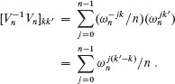

**30        多项式与 FFT**

将两个次数为`n`的多项式相加的直接方法需要 `Θ(n)`的时间，但将它们相乘的直接方法需要`Θ(n²)`的时间。本章将展示快速傅立叶变换（FFT）如何将多项式乘法的时间降低到Θ(`n` `lg n`)。

傅立叶变换，因此 FFT 最常见的用途是信号处理。信号在`时域`中给出：作为将时间映射到幅度的函数。傅立叶分析将信号表示为各种频率的相移正弦波的加权和。与频率相关的权重和相位表征了频域中的信号。FFT 的许多日常应用包括用于编码数字视频和音频信息的压缩技术，包括 MP3 文件。许多优秀的书籍深入探讨了信号处理的丰富领域，章节注释中引用了其中一些。

**多项式**

在代数域`F`上的变量`x`中的一个**多项式**表示为形式求和的函数`A(x)`：

值`a₀`、`a₁`、… , `a[n−1]`是多项式的**系数**。系数和`x`来自一个域`F`，通常是复数集ℂ。如果一个多项式的最高非零系数是`a[k]`，则称多项式的**次数**为`k`。多项式的次数界大于多项式的次数。因此，次数界为`n`的多项式的次数可以是 0 到`n−1`之间的任何整数，包括`n−1`。

多项式有许多操作。对于`多项式加法`，如果`A`(x)和`B`(x)是次数界为`n`的多项式，它们的`和`是一个多项式`C`(x)，同样次数界为`n`，使得对于底层域中的所有`x`，都有`C`(x) = `A`(x)+`B`(x)。也就是说，如果

然后

其中 `c[j] = a[j] + b[j]`，对于`j = 0`, 1, … , `n` − 1。例如，给定多项式 `A(x) = 6``x`³ + 7`x`² − 10`x` + 9 和 `B(x)` = −2`x`³ + 4`x` − 5，它们的和为 `C(x) = 4``x`³ + 7`x`² − 6`x` + 4。  

对于`多项式乘法`，如果`A(x)`和`B(x)`是次数界为`n`的多项式，它们的`乘积 C(x)`是一个次数界为 `2n - 1` 的多项式，使得对于底层域中的所有`x`，都有`C(x) = A(x) * B(x)`。你可能以前曾经乘过多项式，方法是将`A(x)`中的每一项与`B(x)`中的每一项相乘，然后将具有相同幂次的项合并。例如，你可以将`A(x) = 6x³ + 7x² - 10x + 9` 和 `B(x) = -2x³ + 4x - 5` 相乘如下所示：

  

表达乘积`C(x)`的另一种方式是

其中

（根据次数的定义，对于所有`k` > degree(`A`)，`a[k] = 0`，对于所有`k` > degree(`B`)，`b[k] = 0`。）如果`A`是次数界为`n[a]`的多项式，`B`是次数界为`n[b]`的多项式，则`C`必须是次数界为`n[a] + n[b] − 1`的多项式，因为次数(`C`) = 次数(`A`) + 次数(`B`)。因此，次数界为`k`的多项式也是次数界为`k + 1`的多项式，我们通常简单地陈述乘积多项式`C`是次数界为`n[a] + n[b]`的多项式。

**章节大纲**

第 30.1 节介绍了表示多项式的两种方法：系数表示和点值表示。对于次数为`n`的多项式相乘的直接方法——方程`(30.1)`和`(30.2)`——在系数形式中表示多项式需要`Θ(n²)`的时间，但在点值形式中仅需要 `Θ(n)`的时间。然而，转换两种表示之间将时间降低到Θ(`n` `lg n`)以便相乘多项式。要理解为什么这种方法有效，首先必须了解复数单位根，第 30.2 节进行了介绍。第 30.2 节然后使用 FFT 及其逆来执行转换。由于 FFT 在信号处理中经常使用，因此通常作为硬件电路实现，第 30.3 节展示了这些电路的结构。

本章依赖于复数，并在本章中符号`i`专门表示。

**30.1` 多项式表示**  

多项式的系数表示和点值表示在某种意义上是等价的：点值形式的多项式在系数形式中有一个唯一的对应物。本节介绍了这两种表示，并展示了如何将它们结合起来以在`Θ(n lg n)`的时间内相乘两个次数限制为`n`的多项式。  

**系数表示**

多项式的**系数表示**是一个系数向量`a = (a₀, a₁, … , a[n−1])`，其中多项式的次数限制为`n`。本章中的矩阵方程通常将向量视为列向量。

系数表示对于多项式的某些操作很方便。例如，对多项式`A(x)`在给定点`x₀`处进行**求值**的操作包括计算`A(x₀)`的值。要在Θ(n)`的时间内评估一个多项式，使用**霍纳法则**：

类似地，通过系数向量`a = (a₀, a₁, … , a[n−1])`和`b = (b₀, b₁, … , b[n−1])`表示的两个多项式相加需要Θ(n)的时间：只需生成系数向量`c = (c₀, c₁, … , c[n−1])`，其中`j = 0, 1, … , n− 1`，`c[j] = a[j] + b[j]`。  

现在，考虑将以系数形式表示的两个次数限制为`n`的多项式`A(x)`和`B(x)`相乘。根据方程`(30.1)`和`(30.2)`描述的方法，由于它将向量`a`中的每个系数与向量`b`中的每个系数相乘，所以需要`Θ(n²)`的时间。在系数形式中相乘多项式的操作似乎比求多项式值或两个多项式相加要困难得多。由方程`(30.2)`给出的结果系数向量`c`也被称为输入向量`a`和`b`的**卷积**，表示为`c = a ⊗ b`。由于相乘多项式和计算卷积是具有相当实际重要性的基本计算问题，本章重点关注它们的高效算法。

**点值表示**

一个多项式`A(x)`的**点值表示**是一组`n` **点值对**

`{(x₀, y₀), (x₁, y₁), … , (x[n−1], y[n−1])}`  

使得所有`x[k]`都不同且

对于`k = 0`, 1, … , `n` − 1。一个多项式有许多不同的点值表示，因为任何一组不同的点`x₀`, `x₁`, … , `x[n−1]`都可以作为表示的基础。

原则上，给定系数形式的多项式的点值表示是很简单的，因为你只需选择`n`个不同的点`x₀`, `x₁`, … , `x[n−1]`，然后对`k = 0`, 1, … , `n` − 1 评估`A(x[k])`。使用霍纳方法，在`n`个点处评估多项式的时间复杂度为`Θ(n²)`。稍后我们会看到，如果你聪明地选择`x[k]`点，可以加速这个计算，使其在`Θ(n lg n)`时间内运行。

逆求值——从一个点值表示中确定多项式的系数形式——被称为**插值**。下面的定理表明，当所需的插值多项式的次数限制等于给定的点值对数时，插值是明确定义的。

**定理 30.1（插值多项式的唯一性）**  

对于任意一组{(`x₀`, `y₀`), (`x₁`, `y₁`), … , (`x[n−1]`, `y[n−1]`)}，其中所有`x[k]`值都不同，存在一个唯一的次数限制为`n`的多项式`A(x)`，使得`k = 0, 1, … , n − 1` 时`y[k] = A(x[k])`。

**证明**   该证明依赖于某个矩阵的逆的存在。方程`（30.3）`等价于矩阵方程

  

左侧的矩阵记为`V(x₀, x₁, … , x[n−1])`，被称为**范德蒙矩阵**。根据第 1223 页的问题 D-1，该矩阵的行列式为

因此，根据第 1221 页的定理 D.5，如果`x[k]`不同，则该矩阵是可逆的（即非奇异的）。为了唯一地解出给定点值表示的系数`a[j]`，使用范德蒙矩阵的逆：  

`a = V(x₀, x₁, … , x[n−1])^(-1)y`

▪ 输出：

定理 30.1 的证明描述了一个基于解线性方程组（`30.4`）的插值算法。第 `28.1` 节展示了如何在`O(n³)`时间内解这些方程。

一个更快的`n`点插值算法基于**拉格朗日公式**：

你可能想要验证方程`(30.5)`的右侧是否是一个次数限制为`n`的多项式，满足所有`k`时的`A(x[k]) = y[k]`。练习 30.1-5 问你如何使用拉格朗日公式在`Θ(n²)`时间内计算`A`的系数。

因此，`n`点求值和插值是互为逆操作的，可以在多项式的系数表示和点值表示之间转换。上述问题的算法时间复杂度为`Θ(n²)`。

点值表示对于多项式的许多操作非常方便。对于加法，如果`C(x) = A(x) + B(x)`，那么对于任何点`x[k]`，`C(x[k]) = A(x[k]) + B(x[k])`。更准确地说，给定`A`的点值表示，

`{(`x`[0], `y`[0]), (`x`[1], `y`[1]), … , (`x`[`n`−1], `y`[`n`−1])}`

以及`B`，  

其中`A`和`B`在*相同的 n 个*点处求值，那么`C`的一个点值表示为

因此，在点值形式中添加两个次数限制为`n`的多项式的时间复杂度为 `Θ(n)`。

同样，点值表示对于乘法多项式很方便。如果`C(x) = A(x)B(x)`，那么`C(x[k]) = A(x[k])B(x[k])`对于任何点`x[k]`成立，为了获得`C`的点值表示，只需将`A`的点值表示逐点乘以`B`的点值表示。然而，多项式乘法与多项式加法在一个关键方面有所不同：degree(`C`) = degree(`A`) + degree(`B`)，因此如果`A`和`B`的度受限于`n`，那么`C`的度受限于 2`n`。`A`和`B`的标准点值表示各包含每个多项式的`n`个点值对。将它们相乘得到`n`个点值对，但是为了插值一个度受限于 2`n`的唯一多项式`C`，需要 2`n`对。 （参见练习 30.1-4。）相反，从`A`的“扩展”点值表示开始，

`{(x₀, y₀), (x₁, y₁), … , (x[2`n`-1], y[2`n`-1])},`

和相应的扩展点值表示为`B`，

然后`C`的点值表示为

给定两个扩展点值形式的输入多项式，将它们相乘以获得结果的点值形式只需`Θ(n)`的时间，远少于在系数形式下乘多项式所需的`Θ(n²)`的时间。  

最后，让我们考虑如何在新点处评估以点值形式给出的多项式。对于这个问题，已知的最简单方法是首先将多项式转换为系数形式，然后在新点处评估它。

`多项式系数形式的快速乘法`

点值形式中多项式的线性时间乘法方法是否可以加速系数形式中的多项式乘法？答案取决于是否可能快速将多项式从系数形式转换为点值形式（评估）以及反之（插值）。

**图 30.1** 一个高效多项式乘法过程的图形概述。顶部的表示是系数形式，底部的表示是点值形式。从左到右的箭头对应乘法操作。`ω[2*n]`项是复数（2`n`）次单位根。

   任何点都可以作为评估点，但是某些评估点只需`Θ(n lg n)`的时间就可以在不同表示之间转换。正如我们将在第 30.2 节中看到的，如果“复数单位根”是评估点，那么离散傅立叶变换（或 DFT）进行评估，逆 DFT 进行插值。第 30.2 节展示了 FFT 如何在`Θ(n lg n)`的时间内完成 DFT 和逆 DFT 操作。  

图 30.1 以图形方式显示了这种策略。一个小细节涉及度限制。两个度受限于`n`的多项式的乘积是一个度受限于 2`n`的多项式。因此，在评估输入多项式`A`和`B`之前，首先通过添加`n`个高阶系数为 0 来将它们的度限制加倍到 2`n`。因为向量有 2`n`个元素，所以使用“复数（2`n`）次单位根”，在图 30.1 中用`ω[2*n]`项表示。

以下过程利用 FFT 在`Θ(n lg n)`时间内乘两个度限制为`n`的多项式`A(x)`和`B(x)`，其中输入和输出表示均为系数形式。该过程假定`n`是 2 的幂，因此如果不是，则只需添加高阶零系数。

1.  **双度限制：** 通过向每个多项式添加`n`个高阶零系数，将`A(x)`和`B(x)`的系数表示创建为度限制为 2`n`的多项式。

1.  **求值：** 通过在每个多项式上应用阶数为 `2*n` 的 FFT，在长度为 `2*n` 的点值表示中计算 `A(x)` 和 `B(x)` 的值。这些表示包含两个多项式在第`(2*n)`个单位根处的值。

1.  **逐点相乘：** 通过逐点相乘这些值，计算多项式`C(x) = A(x)B(x)`的点值表示。这个表示包含`C(x)`在每个(2n)次单位根处的值。

1.  **插值：** 通过在 `2*n` 个点值对上应用 FFT 来创建多项式`C(x)`的系数表示，以计算逆 DFT。

步骤(1)和(3)需要`Θ(n)`时间，步骤(2)和(4)需要`Θ(n lg n)`时间。因此，一旦我们展示如何使用 FFT，我们将证明以下内容。

**定理 30.2**  

两个输入输出表示均为系数形式的次数界为`n`的多项式可以在`Θ(n lg n)`时间内相乘。

**练习**  

**30.1-1**

使用方程`(30.1)`和`(30.2)`相乘多项式`A(x) = 7x³ − x² + x − 10`和 `B(x) = 8x³ − 6x + 3`。

`30.1-2`

在给定点`x₀`处评估次数界为`n`的多项式`A(x)`的另一种方法是将`A(x)`除以多项式`(x - x₀)`，得到次数界为`n - 1` 的商多项式`q(x)`和余数`r`，使得

`A(x) = q(x)(x - x₀) + r`

然后我们有`A(x₀) = r`。展示如何在Θ(n)时间内从`x₀`和`A`的系数中计算余数`r`和`q(x)`的系数。

`30.1-3`  

给定一个多项式 ，定义 。展示如何从给定的点值表示`A(x)`中导出`A^(rev)(x)`的点值表示，假设没有任何点是 0。

**30.1-4**

证明对于次数界为`n`的多项式，需要`n`个不同的点值对来唯一确定一个多项式，也就是说，如果给出少于`n`个不同的点值对，它们无法唯一确定一个次数界为`n`的多项式。（*提示：*使用定理 30.1，对于一个由`n` − 1 个点值对组成的集合，如果再添加一个任意选择的点值对，你能说些什么？）

**30.1-5**  

展示如何利用方程(`30.5`)在`Θ(n²)`时间内进行插值。（*提示：*首先计算多项式∏`[j]`(`x` − `x[j]`)的系数表示，然后根据需要除以(`x` − `x[k]`)以获得每个项的分子（参见练习 30.1-2）。你可以在`O(n)`时间内计算每个`n`的分母。）

**30.1-6**

解释使用点值表示进行多项式除法的“显而易见”方法有什么问题：将相应的`y`值进行除法。分别讨论除法完全正确和除法不正确的情况。

**30.1-7**  

考虑两个集合`A`和`B`，每个集合中有`n`个整数，范围从 0 到 10`n`。`A`和`B`的**笛卡尔和**定义为

`C = {x + y：x ∈ A 且 y ∈ B}`。

`C`中的整数位于 0 到 20`n`的范围内。展示如何在`O(n lg n)`时间内找到`C`的元素以及`C`中每个元素被表示为`A`和`B`元素之和的次数。（*提示：*将`A`和`B`表示为最多为 10`n`的次数的多项式。)

**30.2    DFT 和 FFT**

在第 30.1 节中，我们声称通过使用 FFT 计算 DFT 及其逆变换，可以在Θ(`n` `lg n`)时间内在复数单位根处评估和插值度为`n`的多项式。本节定义了复数单位根，研究了它们的性质，定义了 DFT，然后展示了 FFT 如何在Θ(`n` `lg n`)时间内计算 DFT 及其逆变换。

**复数单位根**

复数单位根是一个复数`ω`，使得

`ω^n = 1`。

恰好有`n`个复数第`n`个单位根：`e^(2πik/n)`，其中`k = 0, 1, … , n − 1`。要解释这个公式，使用复数指数的定义：

`e^(iu)` = cos(u) + i sin(u)。

图 30.2 显示了`n`个复数第`n`个单位根均匀分布在以复平面原点为中心的单位半径圆周上。数值

**图 30.2** 复平面中的值，其中`ω[8] = e^(2πi/8)`是主要的第 8 个单位根。

是`主要的第 n 个单位根`。² 所有其他复数第`n`个单位根都是`ω[n]`的幂。

`n`个复数第`n`个单位根，

  

形成一个群（参见第 31.3 节）在乘法下。这个群与加法群（ℤ`[n]`, +）模`n`具有相同的结构，因为意味着。同样，。以下引理提供了复数第`n`个单位根的一些基本性质。

**引理 30.3（消去引理）**

对于任何整数`n > 0`，`k ≥ 0` 和`d > 0`，

  

**证明**   引理直接由方程`(30.6)`得出，因为

▪

**推论 30.4**

对于任何偶数`n > 0`，

**证明**   证明留作练习 `30.2-1`。

▪  输出：

**引理 30.5（折半引理）**

如果`n > 0` 是偶数，则`n`个复数第`n`个单位根的平方是`n/2` 个复数（`n/2`）个单位根。

**证明**   通过消去引理，对于任何非负整数`k`，。平方所有复数第`n`个单位根会产生每个(`n/2`)个单位根正好两次，因为

因此和具有相同的平方。我们也可以使用推论 30.4 来证明这个性质，因为意味着，从而。

▪

正如我们将看到的，折半引理对于在多项式的系数和点值表示之间进行分治方法至关重要，因为它保证了递归子问题只有一半那么大。

**引理 30.6（求和引理）**

对于任何整数`n ≥ 1` 和不能被`n`整除的非零整数`k`，  

**证明**   第 1142 页的方程`(A.6)`也适用于复值，给出

要看分母不为 0，注意到只有当`k`可被`n`整除时，，而引理声明禁止这种情况。

▪

**DFT**

回想一下评估多项式的目标

在、、处的度限制为`n`的多项式（即，`n`个复数第`n`个单位根）。³ 多项式`A`以系数形式给出：`a = (a₀, a₁, … , a[n−1])`。我们定义结果`y[k]`，对于`k = 0`, 1, … , `n` − 1，如下

向量`y = (y₀, y₁, … , y[n−1])`是系数向量`a = (a₀, a₁, … , a[n−1])`的**离散傅立叶变换（DFT）**。我们也写成`y = DFTn`。

**FFT**

**快速傅立叶变换（FFT）**利用复单位根的特殊性质来计算`Θ(n lg n)`时间内的 DFT*[n]*(`a`)，而不是直接方法的`Θ(n²)`时间。在整个过程中假设`n`是 2 的幂。尽管已知处理不是 2 的幂大小的策略，但这超出了本书的范围。  

FFT 方法采用分治策略，分别使用`A(x)`的偶数索引和奇数索引系数来定义两个新的次数界限为`n/2`的多项式`A^(even)(x)`和`A^(odd)(x)`：

`A^(even)(x) = a₀ + a₂x + a[4]x² + ⋯ + a[n−2]x^(n/2−1),`

`A^(odd)(x) = a₁ + a₃x + a[5]x² + ⋯ + a[n-1]x^(n/2-1)`.

注意`A^(even)`包含`A`的所有偶数索引系数（索引的二进制表示以 0 结尾），`A^(odd)`包含所有奇数索引系数（索引的二进制表示以 1 结尾）。由此可知

使得在的情况下，评估``A`(`x`)`在、处，简化为

1.  评估次数界限为`n/2`的多项式`A^(even)(x)`和`A^(odd)(x)`在点上

    

    然后

1.  根据方程`(30.9)`组合结果。

根据减半引理，值列表`(30.10)`不是`n`个不同值，而只是`n/2` 个复数（`n/2`）次单位根，每个根恰好出现两次。因此，FFT 递归地在`n/2` 复数（`n/2`）次单位根处评估次数界限为`n/2` 的多项式`A`^(even)和`A`^(odd)。这些子问题与原始问题具有完全相同的形式，但是大小减半，将`n`元素的 DFT[`n`]计算分解为两个`n/2` 元素的 DFT[`n/2`]计算。这种分解是 FFT 程序的基础，该程序在下一页上计算`n`元素向量`a` = (`a`[0], `a`[1], …, `a`[`n`−1])的 DFT，其中`n`是 2 的幂。

FFT 过程的工作方式如下。第 `1-2` 行代表递归的基本情况。`1` 个元素的 DFT 是元素本身，因为在这种情况下 

| `y₀` | = |  |
| --- | --- | --- |
| `---` | `---` | `---` |
|  | = | `a`[0] · 1 |
|  | = | a₀. |

第 5-6 行定义了多项式`A^(even)`和`A^(odd)`的系数向量。第 3、4 和 12 行确保`ω`被正确更新，以便每当执行第 10-11 行时，。（在迭代中保持`ω`的运行值比每次通过`for`循环从头计算节省时间。⁴）第 7-8 行执行递归 DFT[`n/2`]计算，设置`k = 0`, 1, …, `n/2 − 1`。

`FFT(a, n)`

|   1 | `if` `n` == 1 |  |
| --- | --- | --- |
|   2 | **return** `a` | **//** 1 个元素的 DFT 是元素本身 |
|   3 | `ω[n] = e^(2*πi/n)` |  |   |
|   4 | `ω = 1` |  |   |
|   5 | `a^(even) = (a₀, a₂, …, a[n−2])` |  |   |
|   6 | `a^(odd) = (a₁, a₃, …, a[n−1])` |  |   |
|   7 | `y^(even) = FFT(a^(even), n/2)` |  |   |
|   8 | `y^(odd) = FFT(a^(odd), n/2)` |  |   |
|   9 | `for` `k = 0` **to** `n/2 − 1` | **//** 此时， |
| 10 |  |  |  |
| 11 |  |  |
| 12 | ω = ωω[n] |  |
| 13 | **return** y |

  

或者，由于通过消除引理，

第 10-11 行将递归 DFT`[n/2]`计算的结果合并。对于前`n/2`个结果`y₀`、`y₁`、…、`y[n/2−1]`，第 10 行得到

对于`y[n/2]`、`y[n/2+1]`、…、`y[n-1]`，令`k = 0`, 1, …, `n/2 - 1`，第 11 行得到

因此，FFT 返回的向量`y`确实是输入向量`a`的 DFT。

第 10 和 11 行将每个值乘以，对`k = 0`, 1, …, `n/2` − 1。第 10 行将此乘积添加到，第 11 行将其��去。因为每个因子都以其正负形式出现，我们称这些因子为**扭曲因子**。

要确定 FFT 过程的运行时间，请注意，除了递归调用之外，每次调用都需要 `Θ(n)`的时间，其中`n`是输入向量的长度。因此，运行时间的递归关系式为

| `T(n) = 2*T(n/2) + Θ(n)`   |
| --- | --- | --- |
| | = Θ(n lg n)，` |

通过主定理（定理 4.1）的情况 2，因此 FFT 可以在`Θ(n lg n)`时间内评估复数`n`次单位根的多项式的度数限制为`n`。

**在复数单位根处的插值**

多项式乘法方案包括通过在复数单位根处评估多项式，逐点相乘，最后通过插值将系数形式转换回点值形式。我们刚刚看到了如何进行评估，现在我们将看到如何通过多项式插值复数单位根。为了进行插值，我们将将 DFT 写成矩阵方程，然后查看矩阵逆的形式。

从方程`(30.4)`中，我们可以将 DFT 写成矩阵乘积`y = V[n]a`，其中`V[n]`是包含`ω[n]`适当幂的 Vandermonde 矩阵：

`V[n]`的`k`, `j`条目为，对于`j`，`k = 0`, 1, … , `n` − 1。`V[n]`的条目的指数形成了 0 到`n` − 1 的因子的乘法表。

对于逆操作，我们将其写为，将`y`乘以矩阵，即*V[n]*的逆。

**定理 30.7**

对于`j`，`k = 0, 1, … , n - 1`，的(`j`, `k`)条目为。  

**证明** 我们证明，即`n × n`单位矩阵。考虑的(`k`, `k'`)条目：

如果`k' = k`，则这个求和等于 1，否则根据求和引理（引理 30.6）等于 0。请注意，为了应用求和引理，`k' − k` 不能被`n`整除。实际上，它不会，因为−(`n` − 1) ≤ `k' − k ≤ n` − 1。

▪  输出：

通过定义逆矩阵，由以下给出

对于`j = 0, 1, … , n − 1`。通过比较方程`(30.8)`和`(30.11)`，您可以看到，如果修改 FFT 算法以交换`a`和`y`的角色，用替换`ω[n]`，并将结果的每个元素除以`n`，则可以获得逆 DFT（参见练习 30.2-4）。因此，也可以在`Θ(n lg n)`时间内计算。

因此，FFT 和逆 FFT 提供了一种在`Θ(n lg n)`时间内在多项式的系数表示和点值表示之间来回转换的方法。在多项式乘法的背景下，我们已经展示了关于向量`a`和`b`的卷积`a ⊗ b`的以下内容：  

**定理 30.8（卷积定理）**

对于长度为`n`的任意两个向量`a`和`b`，其中`n`是 2 的幂，

其中向量`a`和`b`被填充为长度为 `2*n` 的 0，并且`·`表示两个 `2*n` 元素向量的分量乘积。

▪

**练习**

`30.2-1`

证明推论 `30.4`。

**30.2-2**

计算向量`(0, 1, 2, 3)`的 DFT。

`30.2-3`

通过使用`Θ(n lg n)`时间方案执行练习 30.1-1。

**30.2-4**  

编写伪代码以在`Θ(n lg n)`时间内计算。

**30.2-5**

描述将 FFT 过程推广到`n`是 3 的幂的情况。给出运行时间的递归关系式，并解决递归关系式。

★ `30.2-6`  

不要在复数域上执行`n`元素 FFT（其中`n`是 2 的幂），而是使用模`m`的整数环ℤ`[m]`，其中`m = 2^(tn/2) + 1`，`t`是任意正整数。我们可以使用`ω = 2^t`代替`ω[n]`作为模`m`的主`n`次单位根。证明在这个系统中 DFT 和逆 DFT 是良定义的。

`30.2-7`

给定值列表`z₀, z₁, … , z[n−1]`（可能重复），展示如何找到一个多项式`P(x)`的系数，其次数限制为`n + 1`，只在`z₀, z₁, … , z[n−1]`（可能重复）处有零点。您的过程应在`O(n lg² n)`时间内运行。（*提示：*多项式`P(x)`在`z[j]`处有零点当且仅当`P(x)`是`(x − z[j])`的倍数。）

★ **30.2-8**

向量`a = (a₀, a₁, … , a[n−1])`的**chirp 变换**是向量`y = (y₀, y₁, … , y[n−1])`，其中，`z`是任意复数。因此，DFT 是通过取`z = ω[n]`获得的 chirp 变换的特殊情况。展示如何在`O(n lg n)`时间内评估任意复数`z`的 chirp 变换。（*提示：*使用方程

将 chirp 变换视为卷积。）

**30.3    FFT 电路**

信号处理中 FFT 的许多应用需要最快的速度，因此 FFT 通常作为硬件电路实现。FFT 的分而治之结构使电路具有并行结构，因此电路的深度——任何输出和任何可以到达它的输入之间的最大计算元素数量——为`Θ(lg n)`。此外，FFT 电路的结构具有几个有趣的数学性质，我们在这里不会详细介绍。

**蝴蝶操作**

注意 FFT 过程的第 9-12 行的`for`循环每次迭代计算值两次：在第 10 行和第 11 行各一次。一个优化良好的编译器会生成��码，只评估这个**公共子表达式**一次，并将其值存储到临时变量中，以便第 10-11 行被视为三行

这个操作，将旋转因子`art`乘以`art`，��乘积存储到临时变量`t`中，并从`art`中加减`t`，被称为**蝴蝶操作**。图 30.3 将其显示为一个电路，您可以看到它如何模糊地类似于蝴蝶的形状。（尽管不那么丰富多彩，它也可以被称为“蝴蝶结”操作。）

**图 30.3** 蝴蝶操作的电路。**(a)** 两个输入值从左侧输入，乘以旋转因子`art`，并将和与差输出到右侧。**(b)** 蝴蝶操作的简化图，我们在绘制并行 FFT 电路时将使用。

**图 30.4** `n`输入，`n`输出 FFT 电路 FFT`[n]`的征程和合并步骤的模式，以`n = 8`为例。输入从左侧进入，输出从右侧退出。输入值首先经过两个 FFT`[n/2]`电路，然后`n/2`个蝴蝶电路组合结果。只有进入蝴蝶的顶部和底部导线与之交互：通过蝴蝶中间的导线不影响该蝴蝶，也不会被该蝴蝶改变其值。

**递归电路结构**

FFT 过程遵循我们在第 2.3.1 节中首次看到的分而治之策略：

**分割** `n` 元素输入向量为其`n/2` 偶索引和`n/2` 奇索引元素。

**征服**通过递归计算两个大小为`n/2` 的子问题的 DFT。

**合并**通过执行`n/2`个蝶形操作。这些蝶形操作使用旋转因子、。

图 30.4 中的电路模式遵循 FFT 电路的征服和合并步骤，其中有`n`个输入和`n`个输出，用 FFT`[n]`表示。每条线都是携带值的导线。输入从左侧进入，每根导线一个输入，输出从右侧退出。征服步骤将输入通过两个 FFT`[n/2]`电路，这些电路也是递归构建的。两个 FFT`[n/2]`电路产生的值输入到`n/2`个蝶形电路中，旋转因子为、，以合并结果。递归的基本情况发生在`n=1` 时，此时唯一的输出值等于唯一的输入值。因此，FFT`[1]`电路什么也不做，因此最小的非平凡 FFT 电路是 FFT`[2]`，一个单独的蝶形操作，其旋转因子为。  

**图 30.5** FFT 过程的递归调用的输入向量树。初始调用是`n`=8。

**重新排列输入**

如何将分治步骤融入电路设计？让我们来看看 FFT 过程的各个递归调用的输入向量如何与原始输入向量相关联，以便电路可以在所有递归级别上模拟开始时的分治步骤。图 30.5 将 FFT 的递归调用的输入向量排列在树状结构中，其中初始调用是`n`=8。树中每个过程调用都有一个节点，标记为初始调用的元素，这些元素按照相应输入向量中的顺序出现。每个 FFT 调用都会进行两次递归调用，除非它收到一个 1 元素向量。第一个调用出现在左子节点中，第二个调用出现在右子节点中。

从树中可以看出，如果你将初始向量`a`的元素按照它们在叶子中出现的顺序排列，你可以追踪 FFT 过程的执行，但是从底部向上而不是从顶部向下。首先，将元素成对取出，使用一个蝶形操作计算每对的 DFT，并用其 DFT 替换该对。向量现在包含`n/2` 个两元素 DFT。接下来，将这些`n/2` 个 DFT 成对取出，并通过执行两个蝶形操作计算它们来自的四个向量元素的 DFT，用一个四元素 DFT 替换两个两元素 DFT。向量现在包含`n/4` 个四元素 DFT。以此类推，直到向量包含两个`n/2` 元素 DFT，这些 DFT 通过`n/2` 个蝶形操作组合成最终的`n` 元素 DFT。换句话说，你可以从初始向量`a`的元素开始，但按照图 30.5 中叶子的排列方式重新排列，然后直接将它们输入到遵循图 30.4 中模式的电路中。

让我们考虑重新排列输入向量的排列。在图 30.5 中叶子出现的顺序是**位逆序排列**。也就是说，让`rev(k)`是通过颠倒`k`的二进制表示的位得到的 `lg n`位整数，那么向量元素`a[k]`移动到位置`rev(k)`。例如，在图 30.5 中，叶子的顺序是 0, 4, 2, 6, 1, 5, 3, 7。这个二进制序列是 000, 100, 010, 110, 001, 101, 011, 111，你可以通过颠倒序列 0, 1, 2, 3, 4, 6, 7 中每个数字的位来获得它，或者用二进制表示为 000, 001, 010, 011, 100, 101, 110, 111。为了一般地看到输入向量应该通过位逆序排列重新排列，注意在树的顶层，低位为 0 的索引进入左子树，低位为 1 的索引进入右子树。在每个级别剥离低位，继续这个过程直到树的底部，直到你得到叶子处位逆序排列给出的顺序。  

**完整的 FFT 电路**

图 30.6 描绘了`n = 8`的整个电路。电路以输入的位逆序排列开始，然后是 `lg n` 个阶段，每个阶段包括`n/2`个并行执行的蝴蝶。假设每个蝴蝶电路的深度恒定，整个电路的深度为`Θ(lg n)`。FFT 过程中每个递归级别的蝴蝶操作是独立的，因此电路并行执行它们。图中显示了从左到右传输值的导线，通过 `lg n` 个阶段。对于`s = 1, 2, … , lg n`，第 `s` 阶段由`n/2^s`组蝴蝶组成，每组有 `2^(s−1)` 个蝴蝶。第 `s` 阶段的旋转因子是`e^(−2πim/n)`，`e^(−2πim/n)`，其中 `m = 2^s`。

**练习**

**30.3-1**

给定输入向量`(0, 2, 3, −1, 4, 5, 7, 9)`，在 FFT 电路图 30.6 中展示每个蝴蝶输入和输出导线上的值。  

**30.3-2**

考虑一个 FFT`[n]`电路，例如图 30.6，具有 0, 1, … , `n`−1（导线`j`有输出`y[j]`）和如图中编号的阶段。第`s`阶段，对于`s = 1`, 2 … , `lg n`，包括`n/2^s`组蝴蝶。在第`s`阶段中，第`g`组中的第`j`个蝴蝶电路的输入和输出是哪两根导线？

**30.3-3**

考虑一个范围在 `0 ≤ k < 2^b` 的 `b` 位整数 `k`。将 `k` 视为{0, 1}上的 `b` 元素向量，描述一个 `b × b` 矩阵 `M`，使得矩阵-向量乘积 `Mk` 是 `rev(k)` 的二进制表示。

**   **图 30.6** 一个完整的并行计算 FFT 的电路，这里展示了`n = 8` 个输入的情况。它有 `lg n` 个阶段，每个阶段包括`n/2`个可以并行操作的蝴蝶。就像图 30.4 中一样，只有进入蝴蝶的顶部和底部导线与之交互。例如，第 2 阶段的顶部蝴蝶只在 0 和 2 号导线上有输入和输出（分别是输出`y₀`和`y₂`的导线）。这个电路的深度为`Θ(lg n)`，总共执行`Θ(n lg n)`个蝴蝶操作。

**30.3-4**  

为过程 `BIT-REVERSE-PERMUTATION(a, n)` 编写伪代码，该过程在长度为 `n` 的向量 `a` 上原地执行位逆序排列。假设你可以调用过程 `BIT-REVERSE-OF(k, b)`，它返回一个整数，即非负整数 `k` 的 `b` 位颠倒，其中 `0 ≤ k < 2^b`。

★ `30.3-5`

假设给定 FFT 电路`蝴蝶操作`中的加法器有时会以一种总是产生 0 输出的方式失败，而且假设只有一个加法器失败，但你不知道是哪一个。描述如何通过向整个 FFT 电路提供输入并观察输出来识别失败的加法器。你的方法效率如何？

**问题**

**30-1`     分治乘法**

**a.** 展示如何仅使用三次乘法来乘两个线性多项式`ax + b`和`cx + d`。（*提示:* 其中一次乘法是`(a + b) · (c + d)`。）

**b.** 给出两种在Θ(`n^(lg 3)`)时间内将两个度数限制为`n`的多项式相乘的分治算法。第一种算法应该将输入多项式系数分为高半部分和低半部分，第二种算法应该根据它们的索引是奇数还是偶数来分割它们。

**c.** 展示如何在`O(n^(lg 3))`步内乘两个`n`位整数，其中每一步最多操作常数个 1 位值。

**30-2     多维快速傅里叶变换**

方程`(30.8)`定义的一维离散傅里叶变换推广到`d`维。输入是一个`d`维数组`A = (a[j1,j2,…,jd])`，其维度为`n`[1]，`n`[2]，…，*n[d]*，其中`n`[1]`n`[2] ⋯ *n[d]* = `n`。`d`维离散傅里叶变换由以下方程定义：  

。

对于 `0 ≤ k₁ < n₁`，`0 ≤ k₂ < n₂`，…，`0 ≤ k[d] < n[d]`。

**a.** 展示如何通过依次在每个维度上计算一维 DFT 来生成`d`维 DFT。也就是说，首先沿第一维计算`n/n₁`个单独的一维 DFT。然后，使用第一维 DFT 的结果作为输入，沿第二维计算`n/n₂`个单独的一维 DFT。使用这个结果作为输入，沿第三维计算`n/n₃`个单独的一维 DFT，依此类推，直到第`d`维。

**b.** 表明维度的顺序不重要，因此如果按照`d`个维度的任何顺序计算一维 DFT，则可以计算`d`维 DFT。

**c.** 表明如果通过计算`快速傅里叶变换`来计算每个一维 `DFT`，则计算`d`维 `DFT` 的总时间为`O(n lg n)`，与`d`无关。

**30-3     在一个点评估多项式的所有导数**

给定度数限制为`n`的多项式`A(x)`，我们通过以下方式定义其第`t`次导数：

。

在这个问题中，你将展示如何确定给定多项式`A(x)`的系数表示(`a₀`，`a₁`，…，`a[n-1]`)和一个点`x₀`时，如何计算`t = 0, 1, … , n - 1` 的`A^(t)(x₀)`。  

**a.** 给定系数`b₀`，`b₁`，…，`b[n−1]`，使得

。

展示如何在`O(n)`时间内计算`A^(t)(x₀)`，对于`t = 0, 1, … , n - 1`。

**b.** 解释如何在`O(n lg n)`时间内找到`b₀`，`b₁`，…，`b[n−1]`，给定对于`k = 0, 1, … , n − 1`。

**c.** 证明

。

其中`f(j) = a[j] · j!`。

。

**d.** 解释如何在`O(n lg n)`时间内评估对于`k = 0, 1, … , n − 1`。得出结论，你可以在`O(n lg n)`时间内评估`A(x)`在`x₀`处的所有非平凡导数。

**30-4     多点多项式评估**  

问题 2-3 展示了如何使用霍纳法则在`O(n)`时间内在单点评估度数限制为`n`的多项式。本章描述了如何使用快速傅里叶变换在`O(n lg n)`时间内在所有`n`个复数单位根处评估这样的多项式。现在，你将展示如何在`O(n lg² n)`时间内在`n`个任意点评估度数限制为`n`的多项式。

假设你可以在 `O(n lg n)` 的时间内计算一个多项式被另一个多项式除的余数。例如，当 3`x`³ + `x`² − 3`x` + 1 被 `x`² + `x` + 2 除时的余数是

`(3x³ + x² - 3x + 1) mod (x² + x + 2) = -7x + 5`。

给定多项式的系数表示  和 `n` 个点 `x₀, x₁, … , x[n-1]`，你的目标是计算 `n` 个值 `A(x₀), A(x₁), … , A(x[n-1])`。对于 `0 ≤ i ≤ j ≤ n - 1`，定义多项式  和 `Qij = A(x) mod Pij`。注意 `Qij` 的次数最多为 `j - i`。

**a.** 证明对于任意点 `z`，`A(x) mod (x - z) = A(z)`。  

**b.** 证明 `Qkk = A(x[k])` 且 `Q0,n-1 = A(x)`。

**c.** 证明对于 `i ≤ k ≤ j`，我们有 `Qik = Qij mod Pik` 且 `Qkj = Qij mod Pkj`。

**d.** 给出一个 `O(n lg² n)` 的算法来计算 `A(x₀)`, `A(x₁)`, … , `A(x[n−1])`。

**30-5     使用模算术的 FFT**

如定义，离散傅立叶变换需要使用复数进行计算，这可能会由于舍入误差而导致精度损失。对于某些问题，已知答案仅包含整数，并且基于模算术的 FFT 变体可以保证准确计算答案。这类问题的一个示例是两个具有整数系数的多项式相乘。练习 30.2-6 给出了一种方法，使用长度为 `Ω(n)` 位的模来处理 `n` 个点上的 DFT。这个问题探讨了另一种方法，使用更合理长度 `O(lg n)` 的模，但需要你理解第三十一章的内容。让 `n` 是 2 的幂。

**a.** 你希望寻找最小的 `k`，使得 `p = kn + 1` 是素数。给出一个简单的启发式论证，说明为什么你可能期望 `k` 大约为 `ln n`。（`k` 的值可能大得多或小得多，但你可以合理地期望平均检查 `O(lg n)` 个候选 `k` 值。）期望的 `p` 长度与 `n` 的长度相比如何？

让 `g` 是  的一个生成元，令 `w = g^k mod p`。  

**b.** 论证 DFT 和逆 DFT 在模 `p` 下是互为逆操作的，其中 `w` 被用作主要的 `n` 次单位根。

**c.** 展示如何使 FFT 及其逆运算在模 `p` 下以 `O(n lg n)` 的时间内工作，其中对 `O(lg n)` 位的字进行操作需要单位时间。假设算法给定 `p` 和 `w`。

**d.** 计算向量 `(0, 5, 3, 7, 7, 2, 1, 6)` 的模 `p = 17` 的 DFT。(*提示:* 验证并使用 `g = 3` 是  的一个生成元。)

**章节注释**

Van Loan 的书`[442]`提供了对快速傅立叶变换的出色阐述。Press, Teukolsky, Vetterling 和 Flannery`[365, 366]`提供了对快速傅立叶变换及其应用的良好描述。对于信号处理的出色介绍，一个流行的 FFT 应用领域，请参阅 Oppenheim 和 Schafer 的文本`[347]`以及 Oppenheim 和 Willsky 的文本`[348]`。Oppenheim 和 Schafer 的书还展示了如何处理 `n` 不是 2 的幂的情况。

傅立叶分析不仅限于 1 维数据。它广泛用于图像处理中分析二维或多维数据。Gonzalez 和 Woods 的书[194]以及 Pratt 的书[363]讨论了多维傅立叶变换及其在图像处理中的应用，而 Tolimieri、An 和 Lu 的书[439]以及 Van Loan 的书[442]讨论了多维快速傅立叶变换的数学。

Cooley 和 Tukey [101] 被广泛认为是在 1960 年代设计 FFT 的人。实际上，FFT 事实上在此之前被多次发现，但在现代数字计算机出现之前，其重要性并没有被充分认识到。尽管 Press、Teukolsky、Vetterling 和 Flannery 将该方法的起源归因于 1924 年的 Runge 和 König，但 Heideman、Johnson 和 Burrus 的一篇文章`[211]`将 FFT 的历史追溯到 1805 年的高斯。

Frigo 和 Johnson [161] 开发了一种快速灵活的 FFT 实现，称为 FFTW（“西部最快的傅立叶变换”）。 FFTW 专为需要在相同问题规模上进行多次 DFT 计算的情况而设计。在实际计算 DFT 之前，FFTW 执行一个“规划器”，通过一系列试运行确定如何最佳地分解给定问题规模的 FFT 计算在主机上的执行方式。 FFTW 能够有效地利用硬件缓存，并且一旦子问题足够小，FFTW 就会用优化的直线代码解决它们。此外，FFTW 具有在任何问题规模 `n` 下都花费 Θ(`n` `lg n`) 时间的优势，即使 `n` 是一个大素数时也是如此。  

尽管标准傅立叶变换假定输入表示在时间域中均匀间隔的点，但其他技术可以在“非等间距”数据上近似 FFT。 Ware 的文章`[449]`提供了一个概述。  

插值从数值稳定性的角度来看是一个非常棘手的问题。尽管这里描述的方法在数学上是正确的，但输入的微小差异或计算过程中的舍入误差可能导致结果的巨大差异。

许多其他作者对 `ω[n]` 的定义不同：`ω[n] = e^(��2πi/n)`。这种替代定义往往用于信号处理应用。无论使用哪种定义，底层数学都基本相同。

长度 `n` 实际上是第 30.1 节所称的 2`n`，因为在评估之前给定多项式的次数限制加倍。因此，在多项式乘法的上下文中，我们实际上是在处理复杂的（2`n`）次单位根。

更新 `ω` 的迭代方法的缺点是舍入误差可能会积累，特别是对于更大的输入大小。已经提出了几种限制 FFT 舍入误差幅度的技术，但超出了本书的范围。如果将要在相同大小的输入上运行多个 FFT，则直接预计算所有 `n/2` 个值的表可能是值得的！
