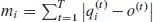
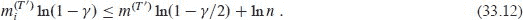
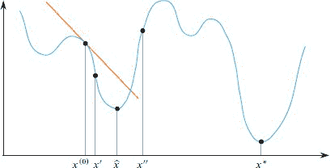
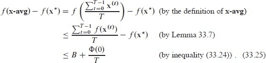
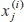

**`33` 机器学习算法**

机器学习可以被视为人工智能的一个子领域。广义上讲，人工智能旨在使计算机能够以类似人类的性能执行复杂的感知和信息处理任务。人工智能领域广泛而使用许多不同的算法方法。

机器学习是丰富而迷人的，与统计学和优化学有着密切的联系。当今技术产生了大量的数据，为机器学习算法提供了无数机会来制定和测试关于数据内部模式的假设。这些假设可以用来对新数据的特征或分类进行预测。由于机器学习在涉及不确定性的挑战性任务中表现特别出色，观察到的数据遵循未知规则，它已经显著改变了医学、广告和语音识别等领域。

本章介绍了三种重要的机器学习算法：`k`-means 聚类、乘法权重和梯度下降。您可以将这些任务中的每一个视为一个学习问题，其中算法用迄今收集的数据来产生描述所学规律和/或对新数据进行预测的假设。机器学习的边界不明确且不断发展——有些人可能会说`k`-means 聚类算法应该被称为“数据科学”，而不是“机器学习”，梯度下降虽然是机器学习中极其重要的算法，但在机器学习之外也有许多应用（尤其是用于优化问题）。  

机器学习通常从`训练阶段`开始，然后是`预测阶段`，在预测阶段对新数据进行预测。对于`在线学习`，训练和预测阶段是交织在一起的。训练阶段以`训练数据`为输入，其中每个输入数据点都有一个相关的输出或`标签`；标签可能是一个类别名称或一些实值属性。然后，它产生一个或多个关于标签如何依赖于输入数据点属性的`假设`。假设可以采用许多形式，通常是某种类型的公式或算法。通常使用的学习算法是梯度下降的一种形式。然后，在预测阶段，使用假设对新数据进行预测，以便对新数据点的标签进行`预测`。

刚刚描述的学习类型被称为***监督学习***，因为它从一组已标记的输入开始。举个例子，考虑一个用于识别垃圾邮件的机器学习算法。训练数据包括一组电子邮件，每封邮件都被标记为“垃圾邮件”或“非垃圾邮件”。机器学习算法构建一个假设，可能是一个规则，比如“如果一封邮件包含一组词中的一个，那么它很可能是垃圾邮件”。或者它可能学习将每个词分配一个垃圾邮件分数的规则，然后通过其组成词的垃圾邮件分数之和来评估文档，以便将总分超过某个阈值的文档分类为垃圾邮件。然后，机器学习算法可以预测新邮件是否是垃圾邮件。

机器学习的第二种形式是`无监督学习`，其中训练数据没有标记，就像第 33.1 节中的聚类问题一样。在这里，机器学习算法产生关于输入数据点组的中心的假设。

机器学习的第三种形式（此处不再详细介绍）是`强化学习`，其中机器学习算法在环境中采取行动，从环境中获得这些行动的反馈，然后根据反馈更新其对环境的模型。学习者处于具有某种状态的环境中，学习者的行动会影响该状态。强化学习在游戏玩法或操作自动驾驶汽车等情况下是一个自然的选择。

有时，在监督式机器学习应用中，目标不是为新示例进行准确的标签预测，而是进行因果`推断`：找到一个解释性模型，描述输入数据点的各个特征如何影响其相关标签。找到一个适合给定训练数据集的模型可能会很棘手。这可能涉及需要在产生适合数据的假设和简单假设之间取得平衡的复杂优化方法。

本章重点关注三个问题领域：找到很好地将输入数据点分组的假设（使用聚类算法）、学习依赖于在线学习问题中的哪些预测器（专家）进行预测（使用乘法权重算法）以及将模型拟合到数据中（使用梯度下降）。

第 33.1 节考虑了聚类问题：如何根据点之间的相似性（或更准确地说，不相似性）的度量，将给定的`n`个训练数据点分成给定数量`k`的组或“簇”。该方法是迭代的，从任意初始聚类开始，并逐步改进，直到不再发生改进。在处理机器学习问题时，聚类通常被用作一个初始步骤，以发现数据中存在的结构。  

第 33.2 节展示了当你有一组预测器（通常称为“专家”）可依赖时，如何进行在线预测。其中许多预测器可能是糟糕的预测器，但有些是好的预测器。起初，你不知道哪些预测器是糟糕的，哪些是好的。目标是在新示例上进行预测，几乎与最佳预测器的预测一样好。我们研究了一种有效的乘法权重预测方法，该方法将每个预测器关联到一个正实数权重，并在预测不佳时乘法减少与预测器关联的权重。本节中的模型是在线的（参见第二十七章）：在每一步中，我们对未来示例一无所知。此外，即使在存在针对我们合作的对手专家的情况下，我们也能够进行预测，这种情况实际上在游戏设置中发生。

最后，第 33.3 节介绍了梯度下降，这是一种强大的优化技术，用于在机器学习模型中找到参数设置。梯度下降在机器学习之外也有许多应用。直观地说，梯度下降通过“下山”来找到产生函数局部最小值的值。在学习应用中，“下山步骤”是调整假设参数的步骤，使得假设在给定的标记示例集上表现更好。

本章广泛使用向量。与本书的其余部分相反，在本章中，向量名称以粗体显示，例如`**x**`，以更清晰地区分哪些量是向量。向量的分量不以粗体显示，因此如果向量`**x**`有`d`个维度，我们可能会写成`**x**=(x[1], x[2], …, x[d])`。

**33.1    聚类**  

假设你有大量的数据点（示例），并希望根据它们彼此的相似性将它们分组到类别中。例如，每个数据点可能代表一个天体星星，给出其温度、大小和光谱特征。或者，每个数据点可能代表一段录音的片段。适当地对这些语音片段进行分组可能会揭示这些片段的口音集合。一旦找到训练数据点的分组，新数据就可以放入适当的组中，促进星型识别或语音识别。

这些情况，以及许多其他情况，都属于聚类的范畴。聚类问题的输入是一组`n`个示例（对象）和一个整数`k`，目标是将示例分成最多`k`个不相交的簇，使得每个簇中的示例彼此相似。聚类问题有几种变体。例如，整数`k`可能不是给定的，而是由聚类过程产生。在本节中，我们假设`k`是给定的。

**特征向量和相似性**

让我们正式定义聚类问题。输入是一组*n*个`示例`。每个示例与所有其他示例共享一组`属性`，尽管属性值可能在示例之间变化。例如，图 33.1 中显示的聚类问题将*n* = 49 个示例（对象）——48 个州首府加上哥伦比亚特区——聚类为*k* = 4 个簇。每个示例有两个属性：首府的纬度和经度。在给定的聚类问题中，每个示例有*d*个属性，示例**x**由*d*维`特征向量`指定

`x` = (`x`[1], `x`[2], …, `x`[*d*]).  

这里，`x[a]`对于`a` = 1, 2, …, `d`是一个给出示例**x**属性`a`的实数。我们称**x**为表示示例的ℝ^(`d`)中的***点***。对于图 33.1 中的示例，每个大写**x**都有其纬度在`x[1]`和经度在`x[2]`。

为了将相似的点聚集在一起，我们需要定义相似性。相反，让我们定义相反的：点`x`和`y`的***不相似度***Δ(x, y)是它们之间的欧氏距离的平方：

当然，为了使`Δ(x, y)`有明确定义，所有属性值必须存在。如果有任何遗漏，那么你可以忽略该示例，或者你可以用该属性的中位数填补缺失的属性值。

属性值在其他方面通常是“混乱的”，因此在运行聚类算法之前需要一些“数据清理”。例如，属性值的规模在属性之间可能有很大的差异。在图 33.1 的示例中，两个属性的规模相差 2 倍，因为纬度范围从-90 到+90 度，而经度范围从-180 到+180 度。你可以想象其他情况，其中规模的差异甚至更大。如果示例包含有关学生的信息，一个属性可能是平均绩点，而另一个属性可能是家庭收入。因此，属性值通常被缩放或标准化，以便在计算不相似度时没有单个属性能够主导其他属性。一种方法是通过线性变换缩放属性值，使最小值变为 `0`，最大值变为 `1`。如果属性值是二进制值，则可能不需要缩放。另一种选择是缩放，使每个属性的值具有均值为 `0` 和单位方差。有时选择为几个相关属性选择相同的缩放规则是有意义的（例如，如果它们是以相同比例测量的长度）。

**图 33.1** Lloyd 过程在将 48 个下属州和哥伦比亚特区的首府聚类成`k=4`个簇时的迭代。每个首府有两个属性：纬度和经度。每次迭代都会减少值`f`，衡量所有首府到其簇中心的距离平方和，直到值`f`不再改变。**(a)** 初始的四个簇，选择阿肯色州、堪萨斯州、路易斯安那州和田纳西州的首府作为中心。**(b)–(k)** Lloyd 过程的迭代。**(l)** 第 11 次迭代的结果与第 10 次迭代的结果相同，因此过程终止。  

此   此外，选择不相似性度量的方式有些是任意的。使用方程`（33.1）`中的平方差之和并不是必需的，但这是一个传统选择且在数学上方便。对于图 `33.1` 的例子，您可以使用首府之间的实际距离而不是方程`（33.1）`。

**聚类**

有了相似性（实际上是`不`相似性）的概念，让我们看看如何定义相似点的簇。让`S`表示实数空间`ℝ^(d)`中给定的`n`个点的集合。在一些应用中，点不一定是不同的，因此`S`是一个多重集而不是一个集合。  

因为目标是创建`k`个簇，我们将`S`的***k-聚类***定义为将`S`分解为一系列〈`S^((1))`, `S^((2))`, …, `S^((k))`〉的`k`个不相交子集，或***簇***，以便

`*S* = *S*^((1)) ⋃ *S*^((2)) ⋃ ⋯ ⋃ *S*^((*k*))`.

一个簇可能为空，例如如果`k>1`但`S`中的所有点具有相同的属性值。

定义`S`的`k`聚类的方式有很多种，评估给定`k`聚类的质量的方式也有很多种。我们这里只考虑由`k`个***中心***序列`C`定义的`S`的`k`聚类

`C = 〈c^((1)), c^((2)), …, c^((k))〉`,  

每个中心都是`ℝ^(d)`中的一个点，***最近中心规则***表示如果没有其他簇的中心比点**x**到簇`S^(ℓ)`的中心`c^(ℓ)`更近，则点**x**可能属于簇`S^(ℓ)`：

`x` ∈ *S*^((ℓ)) 当且仅当 Δ(`x`, **c^((ℓ))**) = min {Δ(`x`, **c^((*j*))**): 1 ≤ *j* ≤ *k*}.

一个中心可以位于任何地方，不一定是*S*中的一个点。

可能会出现并且必须解决平局的情况，以确保每个点只属于一个簇。一般来说，可以任意解决平局，尽管我们需要的是这样一个性质：除非点`x`到新簇中心的距离*严格小于*点`x`到旧簇中心的距离，否则不改变将点`x`分配给的簇。也就是说，如果当前簇的中心是距离点`x`最近的簇中心之一，则不要改变将点`x`分配给的簇。  

***k 均值问题***如下：给定一个`n`个点的集合`S`和一个正整数`k`，找到一系列***C*** = 〈`c¹`, `c²`, …, `c^((k))`〉的`k`个中心点，使得每个点到其最近中心的距离的平方和`f(S, C)`最小，其中  

``

在第二行中，`k`聚类 〈`S`^((1)),`S`^((2)),…,`S`^((k))〉由中心***C***和最近中心规则定义。参见练习 33.1-1，基于点对间距离的另一种表述。  

`k`-均值问题是否存在多项式时间算法？可能不存在，因为它是 NP 难问题[310]。正如我们将在第三十四章中看到的，NP 难问题没有已知的多项式时间算法，但从未有人证明 NP 难问题不存在多项式时间算法。尽管我们不知道有没有多项式时间算法可以找到所有聚类中的全局最小值（根据方程（33.2）），但我们*可以*找到一个局部最小值。  

Lloyd [304] 提出了一个简单的过程，找到一系列`k`个中心点***C***，使得`f(S, C)`的局部最小值。 *k*-means 问题的局部最小值满足两个简单的属性：每个聚类有一个最佳中心（下文定义），每个点被分配到最近中心的聚类（或其中一个聚类）。 Lloyd 的过程找到一个满足这两个属性的良好聚类——可能是最优的。这些属性是必要的，但不足以保证最优性。

**给定聚类的最佳中心**

在`k`-means 问题的最优解中，每个中心点必须是其聚类中点的***质心***或***均值***。 质心是一个`d`维点，其中每个维度的值是该维度中聚类中所有点的值的平均值（即，聚类中相应属性值的平均值）。 也就是说，如果`c^((ℓ))`是聚类`S^((ℓ))`的质心，则对于属性`a` = 1, 2, …, `d`，我们有

在所有属性上，我们写

``

***`定理 33.1`***

给定一个非空聚类 `S^(ℓ)`，其质心（或均值）是使得聚类中心 **c^(ℓ)** ∈ ℝ^d 最小化的唯一选择

***证明***   我们希望通过选择 **`c^((ℓ))`** ∈ ℝ^(*d*) 来最小化和

对于每个属性`a`，求和的项是``的凸二次函数。 为了最小化这个函数，对``求导，并将其设置为 0：

或者，等价地，

由于当  的每个坐标都是`x` ∈ *S*^((ℓ)) 的对应坐标的平均值时，最小值是唯一获得的，因此当 `c^((ℓ))` 是点 `x` 的质心时，整体最小值是在方程`（33.3）`中获得的。  

▪

**给定中心的最佳聚类**

以下定理表明，最近中心规则——将每个点`x`分配给其最近的中心所在的聚类——对`k`-means 问题产生最优解。

***定理 `33.2`***

给定一个包含`n`个点的集合 *S* 和一个序列 〈`c^((1))`, `c^((2))`, …, `c^((*k*))`〉 的`k`个中心，一个聚类 〈*S*^((1)), *S*^((2)), …, *S*^((*k*))〉 最小化 

当且仅当将每个点`x` ∈ *S*分配给最小化Δ(`x`, **c^((ℓ))**)的聚类`S`^((ℓ))时。

***证明***   证明很简单：每个点`x` ∈ *S*恰好对和贡献一次，选择将`x`放入其最近中心的聚类最小化了`x`的贡献。

▪  输出：

**`Lloyd 的过程`**  

Lloyd 的过程只是迭代两个操作——根据最近中心规则将点分配到聚类，然后重新计算聚类的中心为它们的质心——直到结果收敛。以下是 Lloyd 的过程：

**输入:** 一个在 `ℝ^(d)` 中的点集 `S`，以及一个正整数 `k`。  输出：

**输出:** 一个`k`聚类 〈`S¹`, `S²`, …, `S^(k)`〉，带有一系列中心点 〈**c¹**, **c²**, …, **c^(k)**〉。

1.  **初始化中心:** 通过从`S`中随机选择`k`个点（如果点不一定不同，请参见练习 33.1-3）生成一个`k`个中心的初始序列 〈`c^((1))`, `c^((2))`, …, `c^((*k*))`〉。开始时将所有点分配给聚类`S`^((1))。

1.  **将点分配给聚类:** 使用最近中心规则定义聚类 〈`S¹`, `S²`, …, `S^(k)`〉。 也就是说，将每个点**x** ∈ `S`分配给具有最近中心的聚类`S^(ℓ)`（任意打破平局，但不改变点的分配，除非新的聚类中心严格比旧的更接近**x**）。

1.  **如果没有变化则停止：** 如果步骤 2 没有改变任何点分配到簇的情况，则停止并返回聚类〈`S¹`, `S²`, …, `S^(k)`〉和相关中心〈**`c¹`**, **`c²`**, …, **`c^(k)`**〉。否则，转到步骤 4。

1.  **重新计算中心作为质心：** 对于ℓ = 1, 2, …, `k`，将簇`S^((ℓ))`的中心`c^((ℓ))`计算为`S^((ℓ))`中点的质心。（如果`S^((ℓ))`为空，则让`c^((ℓ))`为零向量。）然后转到步骤 2。

返回的一些簇可能为空，特别是如果许多输入点是相同的。

Lloyd 的过程总是终止的。根据定理 33.1，重新计算每个簇的中心作为簇质心不会增加`f(S, C)`。Lloyd 的过程确保只有在这样的操作严格减少`f(S, C)`时才将点重新分配到不同的簇中。因此，Lloyd 的过程的每次迭代，除了最后一次迭代外，必须严格减少`f(S, C)`。由于`S`的可能`k`个聚类（最多`k^n`）只有有限数量，该过程必须终止。此外，一旦 Lloyd 的过程的一个迭代没有减少`f`，进一步的迭代将不会改变任何内容，过程可以在这个局部最优的点分配到簇中停止。

如果 Lloyd 的过程确实需要`k^(n)`次迭代，那将是不切实际的。实际上，有时在最新迭代中`f(S, C)`的百分减少低于预定阈值时终止该过程就足够了。由于 Lloyd 的过程只能找到局部最优的聚类，找到一个好的聚类的一种方法是用不同随机选择的初始中心多次运行 Lloyd 的过程，取最佳结果。

Lloyd 的过程的运行时间与迭代次数`T`成正比。在一次迭代中，根据最近中心规则将点分配到簇需要`O(dkn)`时间，并且为每个簇重新计算新中心需要`O(dn)`时间（因为每个点只在一个簇中）。因此，`k`均值过程的总运行时间为`O(Tdkn)`。

Lloyd 算法说明了许多机器学习算法共有的一种方法：

+   首先，在适当的参数序列`θ`中定义一个假设空间，使得每个`θ`与特定假设`h[θ]`相关联。 （对于*k*均值问题，`θ`是一个`dk`维向量，等同于`C`，包含*k*个簇的每个`d`维中心，`h[θ]`是每个数据点**x**应该与最接近**x**的中心的簇分组的假设。）

+   其次，定义一个度量`f(E, θ)`描述假设`h[θ]`如何拟合给定的训练数据`E`。`f(E, θ)`的值越小越好，而（局部）最优解（局部）最小化`f(E, θ)`。 （对于`k`均值问题，`f(E, θ)`就是`f(S, C)`。）

+   第三，给定一组训练数据`E`，使用适当的优化过程找到最小化`f(E, θ)`的`θ`值，至少在局部上。 （对于`k`均值问题，Lloyd 算法返回的`k`个中心点序列`C`就是这个`θ`值。）

+   将`θ`作为答案返回。

在这个框架中，我们看到优化成为机器学习的强大工具。以这种方式使用优化是灵活的。例如，`正则化`项可以被纳入要最小化的函数中，以惩罚“太复杂”并且“过度拟合”训练数据的假设。（正则化是一个复杂的主题，在这里不再深究。）

**例子**

图 33.1 展示了洛伊德过程在一组`n = 49`个城市上的应用：48 个美国州首府和哥伦比亚特区。每个城市有`d = 2`个维度：纬度和经度。图的(a)部分中的初始聚类将初始聚类中心任意选择为阿肯色州、堪萨斯州、路易斯安那州和田纳西州的首府。随着过程的迭代，函数`f`的值减小，直到第 11 次迭代在(l)部分，其值与第 10 次迭代在(k)部分相同。然后洛伊德过程以(l)部分显示的聚类结束。

如图 33.2 所示，洛伊德的过程也适用于“向量量化”。在这里，目标是减少表示照片所需的不同颜色数量，从而允许照片被大大压缩（尽管以有损的方式）。在图的(a)部分，一个原始照片宽 700 像素，高 500 像素，每个像素使用 24 位（三个字节）来编码红色、绿色和蓝色（RGB）主色强度的三元组。图的(b)–(e)部分显示了使用洛伊德过程将图片从每个像素可能值为 2²⁴压缩到每个像素只有`k = 4`、`k = 16`、`k = 64` 或`k = 256` 个可能值的结果；这些`k`值是聚类中心。然后，照片可以用每个像素只有 2、4、6 或 8 位来表示，而不是初始照片所需的每个像素 24 位。一个辅助表，“调色板”，伴随着压缩图像；它保存`k`个 24 位聚类中心，并在解压照片时用于将每个像素值映射到其 24 位聚类中心。

**`练习`**

***`33.1-1`***

表明方程`(33.2)`的目标函数`f(S, C)`也可以替代地写成

***`33.1-2`***

给出一个在平面上具有`n = 4`个点和`k = 2`个簇的例子，其中洛伊德过程的一次迭代并没有改善`f(S, C)`，但`k`聚类并不是最佳的。

***33.1-3***

当洛伊德过程的输入包含许多重复的点时，可能会使用不同的初始化过程。描述一种以随机方式选择中心点数量的方法，以最大化选择的不同中心点的数量。（*提示：*参见练习 `5.3-5`。）  

`33.1-4`

展示如何在只有一个属性(`d = 1`)时在多项式时间内找到最佳的`k`聚类。

``

**图 33.2** 使用洛伊德过程对照片进行向量量化压缩，使用更少的颜色。**(a)** 原始照片有 35 万像素（700 × 500），每个像素是一个 24 位 RGB（红/蓝/绿）三元组，每个值为 8 位；这些像素（颜色）是要进行聚类的“点”。由于像素重复，因此只有 79,083 种不同的颜色（少于 2²⁴）。压缩后，只使用`k`种不同的颜色，因此每个像素只用⌈1g *k*⌉位来表示，而不是 24 位。一个“调色板”将这些值映射回 24 位 RGB 值（聚类中心）。**(b)–(e)** 具有`k` = 4、16、64 和 256 种颜色的相同照片。（照片来自 standuppaddle, pixabay.com。）

**33.2    乘法权重算法**

本节考虑需要你做一系列决策的问题。每次决策后，你会收到有关你的决策是否正确的反馈。我们将研究一类被称为***乘权算法***的算法。这类算法有各种应用，包括在经济学中进行游戏，近似解决线性规划和多商品流问题，以及在线机器学习中的各种应用。我们在这里强调问题的在线性质：你必须做出一系列决策，但有关做第*i*个决策所需的一些信息只有在你已经做出第(*i* – 1)个决策后才会出现。在本节中，我们将研究一个特定的问题，称为“从专家中学习”，并开发一个乘权算法的示例，称为加权多数算法。

假设一系列事件将会发生，你想对这些事件进行预测。例如，在一系列的日子里，你想预测是否会下雨。或者你想预测股票价格是增加还是减少。解决这个问题的一种方法是组建一个“专家”团队，并利用他们的集体智慧来做出良好的预测。我们用`E[1]`，`E[2]`，…，`E[n]`来表示`n`个专家，假设将发生`T`个事件。每个事件的结果只能是 0 或 1，其中`o^(t)`表示第`t`个事件的结果。在事件`t`之前，每个专家`E^(i)`都会做出预测 。你作为“学习者”，然后获取专家对事件`t`的`n`个预测，并产生自己的单一预测`p^(t)` ∈ {0, 1}。你的预测仅基于专家的预测和你从他们之前预测中学到的任何信息。你不使用有关事件的任何其他信息。只有在做出预测后，你才会确认事件`t`的结果`o^(t)`。如果你的预测`p^(t)`与`o^(t)`匹配，那么你是正确的；否则，你就犯了错误。目标是最小化总错误数`m`，其中 。你还可以跟踪每个专家犯的错误数：专家`E[i]`犯了`m[i]`个错误，其中 。

例如，假设你正在关注一只股票的价格，每天你都要决定是否只在当天投资于它，即在当天开始时购买，然后在当天结束时出售。如果某一天你买入股票并且价格上涨，那么你做出了正确的决定，但如果股票下跌，那么你就犯了错误。同样地，如果某一天你没有购买股票而价格下跌，那么你做出了正确的决定，但如果股票上涨，那么你就犯了错误。由于你希望犯尽可能少的错误，你会使用专家的建议来做出决策。

我们不假设股票的波动情况。我们也不假设专家的情况：专家的预测可能是相关的，他们可能被选择来欺骗你，或者有些人根本不是真正的专家。你会使用什么算法？

在为这个问题设计算法之前，我们需要考虑如何公平地评估我们的算法。合理地期望我们的算法在专家预测更好时表现更好，在专家预测更差时表现更差。算法的目标是将你犯错的次数限制在接近最好专家犯错次数的范围内。起初，这个目标可能看起来不可能实现，因为直到最后你才知道哪位专家是最好的。然而，我们将看到，通过考虑所有专家提供的建议，你可以实现这个目标。更正式地，我们使用“遗憾”这个概念，比较我们的算法与最佳专家（事后）的表现。让 `m = min {m[i] : 1 ≤ i ≤ n}` 表示最佳专家犯错的次数，***遗憾*** 是 `m - m*`。目标是设计一个具有低遗憾的算法。（遗憾可以是负数，尽管通常不会，因为很少有你比最佳专家做得更好的情况。）

作为热身，让我们考虑一位专家每次都做出正确预测的情况。即使不知道是哪位专家，你仍然可以取得良好的结果。

***引理 33.3***

假设在 `n` 位专家中，有一位专家对所有 `T` 个事件都做出正确预测。那么存在一个算法最多会犯 ⌈1g n⌉ 个错误。

**证明** 算法维护一个由尚未犯错的专家组成的集合 `S`。最初， `S` 包含所有 `n` 位专家。算法的预测始终是 `S` 中剩余专家预测的多数意见。在出现平局时，算法会做出任意预测。每次学习到一个结果后，集合 `S` 会更新，移除所有对该结果做出错误预测的专家。

现在我们来分析算法。总是做出正确预测的专家将始终在集合 `S` 中。每次算法犯错时，至少一半仍在 `S` 中的专家也会犯错，并且这些专家会被移出 `S`。如果 `S′` 是移除那些犯错专家后剩余的专家集合，则有 |`S′`| ≤ |`S`|/2。`S` 的大小最多可以被减半 ⌈1g *n*⌉ 次，直到 |`S`| = 1。从这一点开始，我们知道算法永远不会犯错，因为集合 `S` 只包含那位从不犯错的专家。因此，总体上算法最多会犯 ⌈1g *n*⌉ 个错误。

▪  输出：

练习 33.2-1 要求你将这个结果推广到没有专家能够做出完美预测的情况，并证明，对于任意一组专家，存在一个算法最多会犯 `m ⌈1g n⌉` 个错误。推广算法的开始方式相同。然而，集合 `S` 可能在某个时刻变为空。如果发生这种情况，重置 `S` 包含所有专家并继续算法。

通过不仅跟踪哪些专家没有犯错，或者最近没有犯错，而是更细致地评估每位专家的质量，你可以大幅提高你的预测能力。关键思想是利用你收到的反馈来更新你对每位专家值得信任程度的评估。当专家做出预测时，你观察他们是否正确，并减少对那些犯更多错误的专家的信心。通过这种方式，你可以随着时间学习哪些专家更可靠，哪些不太可靠，并相应地权衡他们的预测。权重的变化通过乘法实现，因此有“乘法权重”这个术语。

算法出现在下一页的 WEIGHTED-MAJORITY 过程中，该过程接受一组专家 `E = {E[1], E[2], …, E[n]}`，事件数量 `T`，专家数量 `n`，以及一个控制权重变化的参数 `0 < γ ≤ 1/2`。算法维护了 `i = 1, 2, …, n` 和 `t = 1, 2, …, T` 的权重，其中 。行 1-2 的**对于**循环设置了初始权重  为 1，捕捉了没有知识时对每个专家的平等信任的想法。主要行 3-18 的**对于**循环的每次迭代都针对事件 `t = 1, 2, …, T` 执行以下操作。每个专家 `E[i]` 在第 4 行为事件 `t` 进行预测。行 5-8 计算了 `upweight^(t)`，预测事件 `t` 为 1 的专家权重之和，以及 `downweight^(t)`，预测事件为 0 的专家权重之和。行 9-11 根据哪个加权和更大（在决定为 1 的情况下打破平局）来决定算法对事件 `t` 的预测 `p^(t)`。事件 `t` 的结果在第 12 行揭示。最后，行 14-17 通过将错误预测事件 `t` 的专家的权重乘以 `1 - γ` 来减少专家的权重，保持正确预测事件结果的专家的权重不变。因此，每个专家犯的错误越少，该专家的权重就越高。  

WEIGHTED-MAJORITY 过程的表现不会比任何专家差太多。特别是，它不会比最好的专家差太多。为了量化这一说法，让 `m^(t)` 表示通过事件 `t` 过程中所犯错误的次数，让  表示专家 `E[i]` 通过事件 `t` 所犯错误的次数。以下定理是关键。  

`WEIGHTED-MAJORITY(E, T, n, γ)`  

|   1 | **对于** *i* = 1 **到** *n* |
| --- | --- |
| ` | --- | --- | ` |
|   `2` |  | **//** 平等信任每个专家 |   |
|   3 | **对于** `t = 1` **到** `T` |
|   4 | 每个专家 `E[i]` ∈ `E` 都会进行预测  |
| `5` |  | **//** 预测为 1 的专家 |
|   `6` |  | **//** 预测为 1 的权重之和 |   |
| `7` |  | **//** 预测为 0 的专家 |   |
| `8` |  | **//** 预测为 0 的权重之和 |   |
|   9 | **如果** `upweight^(t)` ≥ `downweight^(t)` |   |
| 10 | `p^(t)` = 1 | **//** 算法预测为 1 |  |
| `11` | **否则** `p^(t) = 0` | **//** 算法预测为 0 |   |
| 12 | 结果 `o^(t)` 被揭示 |
| 13 | **//** 如果 `p^(t)` ≠ `o^(t)`，则算法出错了。 |
| 14 | **对于** `i` = 1 **到** `n` |
| 15 | **如果**  | **//** 如果专家 `E^(i)` 犯了错误… |  |
| `16` |  | **//** … 然后减少该专家的权重。 |
| \| 17 \| **否则**  \| |
| \| 18 \| **返回** `p^(t)` \| |

***定理 33.4***

运行 `WEIGHTED-MAJORITY` 时，对于每个专家 `E[i]` 和每个事件 `T′ ≤ T`，

  

***证明*** 每当专家 `E[i]` 犯错时，其初始权重为 1，会被乘以 1 - `γ`，因此我们有

对于 `t = 1, 2, …, T`.

我们使用一个潜在函数 ``，在行 3-18 的**对于**循环的第 *t* 次迭代后对所有 *n* 个专家的权重求和。最初，我们有 *W*(0) = *n*，因为所有 *n* 个权重的初始值为 1。因为每个专家都属于行 5 和 7 中定义的集合 *U* 或 *D*（WEIGHTED-MAJORITY 中定义），所以在每次执行第 8 行后，我们总是有 *W*(*t*) = *upweight*^((*t*)) + *downweight*^((*t*))。

考虑算法在其预测中犯错误的迭代`t`，这意味着算法预测为 1 且结果为 0，或者算法预测为 0 且结果为 1。不失一般性，假设算法预测为 1 且结果为 0。算法预测为 1 是因为第 9 行中`upweight^(t)` ≥ `downweight^(t)`，这意味着

``  

然后，`U`中的每个专家的权重都乘以 1 - *γ*，`D`中的每个专家的权重保持不变。因此，我们有  

``

因此，对于算法在每次迭代`*t*`中犯错误的情况，我们有

在算法没有犯错的迭代中，一些权重减少，一些保持不变，因此我们有

由于通过迭代`T'`产生了`m^(T')`个错误，且`W(1) = n`，我们可以反复应用算法犯错的迭代中的不等式（33.8）和算法不犯错的迭代中的不等式（33.9），得到  

因为函数`W`是权重的总和，所有权重都是正的，其值超过任何单个权重。因此，使用方程（33.6），对于任何专家`E`[i]和任何迭代`T*' ≤ T`，

结合不等式`（33.10）`和`（33.11）`得到

两边取自然对数得到 `ln(L) = n ln(p) + (N - n) ln(1 - p)`

现在我们使用泰勒级数展开来推导不等式（33.12）中对数因子的上界和下界。`ln(1+x)`的泰勒级数在第 67 页的方程（3.22）中给出。将`-x`代入`x`，我们有对于 0 `< x ≤ 1/2`，

``

由于右侧的每一项都是负的，我们可以舍弃除第一项之外的所有项，并得到 `ln(1 - x) ≤ -x`的上界。由于 0 < *γ* ≤ 1/2，我们有

``

对于下界，练习 33.2-2 要求您证明当 0 < `x` ≤ `1/2` 时，`ln(1 - x)` ≥ - `x` - `x`²，因此

因此，我们有  

以至于

``

从不等式（33.16）两边减去 ln `n`，然后将两边乘以-2/`γ`得到，从而证明了定理。

▪  

定理 33.4 适用于任何专家和任何事件`T*' ≤ T`。特别地，我们可以在所有事件发生后与最佳专家进行比较，得出以下推论。

***推论 33.5***

在 WEIGHTED-MAJORITY 过程结束时，我们有  输出：

``

▪  输出：

让我们探讨这个界限。假设``，我们可以选择``并将其代入不等式（33.17）中得到

因此，错误的数量最多是最佳专家犯的错误数量的两倍加上一个通常增长较慢的项`m`。练习 33.2-4 表明，通过使用随机化，可以将错误数量的上界减少一半，从(1 + 2*γ*)`m` + (2 ln *n*)/*γ*减少到`ϵm` + (ln *n*)/*ϵ*的期望值，其中*γ*和*ϵ*最多为 1/2。从数值上看，如果*γ* = 1/2，则 WEIGHTED-MAJORITY 最多比最佳专家多出 3 倍的错误，再加上 4 ln *n*的错误。另一个例子，假设*n* = 20 个专家进行了*T* = 1000 次预测，最佳专家正确率为 95%，犯了 50 个错误。那么 WEIGHTED-MAJORITY 最多会犯 100(1+*γ*)+2 ln 20/*γ*个错误。通过选择*γ* = 1/4，WEIGHTED-MAJORITY 最多会犯 149 个错误，或者至少 85%的成功率。  

乘法权重方法通常指的是一类更广泛的算法，其中包括 `WEIGHTED-MAJORITY`。结果和预测不一定只能是 0 或 1，而可以是实数，并且特定结果和预测可能会有损失。权重可以根据损失更新乘法因子，算法可以在给定一组权重的情况下将它们视为专家的分布，并用它们在每个事件中选择要跟随的专家。即使在这些更一般的设置中，类似于定理 33.4 的界限仍然成立。

**练习**

`***33.2-1***`

引理 33.3 的证明假设某位专家永远不会犯错。可以将算法和分析推广以消除这一假设。新算法以相同方式开始。然而，集合`S`可能在某个时刻变为空。如果发生这种情况，请将`S`重置为包含所有专家并继续算法。证明此算法所犯错误的数量最多为`m ⌈1g n`。

***`33.2-2`***

证明当 0 < `x` ≤ `1/2` 时，ln(1 – `x`) ≥ −`x` – `x`²。(*提示:* 从方程(33.13)开始，将第一个三个项之后的所有项分组，并在第 1142 页使用方程(A.7)。)

`33.2-3`

考虑引理 33.3 证明中给出的算法的随机化变体，其中某位专家永远不会犯错。在每一步中，从集合`S`中均匀随机选择一个专家`E[i]`，然后做与`E[i]`相同的预测。证明此算法所做的预期错误次数为⌈1g *n*⌉。

***`33.2-4`***  

考虑 WEIGHTED-MAJORITY 的随机化版本。算法相同，只是在预测步骤中，将权重解释为专家之间的概率分布，并根据该分布选择一个专家`E[i]`。然后，选择其预测与专家`E[i]`所做的预测相同。证明，对于任意`0 < ϵ < 1/2`，此算法所做的预期错误次数最多为`(1 + ϵ)m + (ln n)/ϵ`。

**33.3 梯度下降**

假设你有一组{`p[1]`, `p[2]`, …, `p[n]`}点，并且想要找到最适合这些点的直线。对于任意直线ℓ，每个点`p[i]`与直线之间有一个距离`d[i]`。你想要找到最小化某个函数`f(d[1], …, d[n])`的直线。关于距离和函数*f*的定义有许多可能的选择。例如，距离可以是到直线的投影距离，函数可以是距离的平方和。这种问题在数据科学和机器学习中很常见——直线是最好描述数据的假设——其中最佳定义由距离的定义和目标*f*决定。如果距离的定义和函数*f*是线性的，那么我们有一个线性规划问题，如第二十九章中所讨论的。尽管线性规划框架涵盖了几个重要问题，但许多其他问题，包括各种机器学习问题，具有不一定是线性的目标和约束。我们需要框架和算法来解决这些问题。  

在这一部分中，我们考虑优化连续函数的问题，并讨论其中一种最流行的方法：梯度下降。梯度下降是一种寻找函数`f：ℝ^(n) → ℝ`的局部最小值的通用方法，非正式地说，函数`f`的局部最小值是一个点**x**，对于所有“接近”**x**的**x**′，都有`f(x) ≤ f(x′)`。当函数是凸的时，它可以找到一个接近`f`的***全局最小值***的点：一个`n`维向量**x**=(*x*[1], *x*[2], …, *x*[*n*])，使得`f(x)`最小。对于梯度下降背后的直观想法，想象自己处于山丘和山谷的景观中，想尽快到达低点。你调查地形并选择向下坡最快的方向移动。你沿着这个方向移动，但只是短暂地，因为随着你前进，地形会改变，你可能需要选择不同的方向。所以你停下来，重新评估可能的方向，并沿着最陡的下坡方向再移动一小段距离，这可能与你之前移动的方向不同。你继续这个过程，直到达到一个所有方向都指向上坡的点。这样的点是一个局部最小值。  

为了使这个非正式的过程更加正式，我们需要定义函数的梯度，这在上面的类比中是各个方向陡峭程度的度量。给定一个函数`f：ℝ^(n) → ℝ`，它的***梯度***∇`f`是一个函数∇`f`：ℝ^(n) → ℝ^(n)，包括*n*个偏导数：``。类似于单变量函数的导数，梯度可以被视为函数值在局部增加最快的方向，以及增加的速率。这种观点是非正式的；为了使其正式化，我们需要定义局部的含义，并对函数施加某些条件，如连续性或导数的存在。尽管如此，这种观点激发了梯度下降的关键步骤——沿着梯度相反的方向移动，移动距离受梯度大小的影响。

梯度下降的一般过程是分步进行的。你从某个初始点`x^((0))`开始，这是一个*n*维向量。在每一步*t*，你计算在点`x^((*t*))`处的梯度值，即(∇*f*)(`x^((*t*))`)，这也是一个*n*维向量。然后你沿着每个维度在`x^((*t*))`处梯度的相反方向移动，到达下一个点`x^((*t*+1))`，这同样是一个*n*维向量。因为你在每个维度上沿着单调递减的方向移动，所以应该有*f*(`x^((*t*+1))`) ≤ *f*(`x^((*t*))`)。要将这个想法转化为实际算法，需要一些细节。两个主要细节是你需要一个初始点，以及你需要决定在负梯度方向上移动多远。你还需要了解何时停止以及对找到的解的质量可以得出什么结论。我们将在本节进一步探讨这些问题，无论是有额外约束的最小化，还是没有约束的最小化。  

**`无约束梯度下降`**

为了获得直觉，让我们考虑在一维中进行无约束的梯度下降，也就是当`f`是标量`x`的函数时，即`f`：ℝ → ℝ。在这种情况下，`f`的梯度∇`f`就是`f′(x)`，即`f`关于`x`的导数。考虑在图 33.3 中以蓝色显示的函数`f`，具有最小值`x`和起始点`x⁰`。梯度（导数）`f′(x⁰)`，橙色显示，具有负斜率，因此从`x⁰`向增加`x`的方向的小步长导致`f(x′) < f(x⁰)`。然而，太大的步长会导致

**图 33.3** 函数`f: ℝ → ℝ`，蓝色显示。在点`x⁰`处的梯度，橙色显示，具有负斜率，因此从`x⁰`到`x′`的微小增加导致`f(x′) < f(x⁰)`。从`x⁰`开始的小步长朝着前进，这给出了一个局部最小值。然而，从`x⁰`开始只朝着`f`值减小的方向走小步长，无法到达全局最小值`x*`。  

点`x′`，使得`f(x′) > f(x⁰)`，所以这是一个坏主意。限制自己走小步长，每一步都有`f(x′) < f(x)`，最终会接近点，这给出了一个局部最小值。然而，只走小的下坡步长，梯度下降无法到达全局最小值`x*`，鉴于起始点`x⁰`。  

我们从这个简单的例子中得出两个观察结果。首先，梯度下降收敛于局部最小值，而不一定是全局最小值。其次，它收敛的速度以及行为方式与函数的性质、初始点以及算法的步长大小有关。

面向页面的梯度下降过程接受函数`f`、初始点`x^((0))` ∈ ℝ^(*n*)、固定步长乘数`γ` > 0 和要执行的步数`T` > 0 作为输入。行 2-4 的**for**循环的每次迭代都通过计算点`x^((*t*))`处的*n*维梯度，然后在*n*维空间中相反方向移动距离`γ`来执行一步。计算梯度的复杂度取决于函数`f`，有时可能很昂贵。第 3 行对访问的点求和。循环结束后，第 6 行返回`x-avg`，除了最后一个点`x^((*T*))`之外，所有访问的点的平均值。返回`x^((*T*))`可能更自然，实际上，在许多情况下，您可能更喜欢函数返回`x^((*T*))`。但是，对于我们将��分析的版本，我们使用`x-avg`。

梯度下降(`f`, **x^((0))**, `γ`, `T`)

| 1 | `sum = 0` | **//** *n*维向量，初始值为 0 |
| --- | --- | --- |
| `2` | **for** `t` = 0 **to** `T` – 1 |
| 3 | **`sum` = `sum` + `x^((*t*))`** | **//** 将`n`个维度的每个值加入`sum`中 |   |
| 4 | **`x^((*t*+1)) = x^((*t*)) - γ · (∇*f*)(x^((*t*)))`** | **//** (`∇*f*`)(**`x^((*t*))`**), `x^((*t*+1))`** 都是*n*维的 |
| ` | 5 | x-avg = sum/T | // 将*n*个维度的每个值除以*T* | ` |
| ` | 6 | return x-avg | `   |

图 33.4 描述了梯度下降在凸一维函数上理想运行的方式。我们将在下面更正式地定义凸性，但图表明每次迭代都沿着梯度相反的方向移动，移动的距离与梯度的大小成比例。随着迭代的进行，梯度的大小减小，因此沿水平轴移动的距离减小。每次迭代后，到最优点`x*`的距离减小。这种理想行为不保证在一般情况下发生，但本节其余部分的分析将形式化此行为发生的条件并量化所需的迭代次数。然而，梯度下降并不总是有效。我们已经看到，如果函数不是凸的，梯度下降可能会收敛到局部最小值而不是全局最小值。我们还看到，如果步长过大，梯度下降可能会超过最小值并最终偏离更远。（也可能超过最小值并最终更接近最优值。）

**对凸函数的无约束梯度下降的分析**  

我们对梯度下降的分析集中在凸函数上。不等式`（C.29）`在第 `1194` 页定义了一维凸函数，如图 `33.5` 所示。我们可以将该定义扩展到函数`f：ℝ^(n) → ℝ`，并说`f`是***凸的***，如果对于所有**x**，**y** ∈ `ℝ^(n)`和所有 `0 ≤ λ ≤ 1`，我们有

（不等式`（33.18）`和`（C.29）`是相同的，除了*x*和*y*的维度不同。）我们还假设我们的凸函数是闭合的²并且可微的。

** **图 33.4** 在凸函数`f`：ℝ → ℝ上运行梯度下降的示例，显示为蓝色。从点`x⁰`开始，每次迭代都沿着相反于梯度的方向移动，移动的距离与梯度的大小成比例。橙色线代表每个点处的负梯度，按步长`γ`缩放。随着迭代的进行，梯度的大小减小，因此沿水平轴移动的距离相应减小。每次迭代后，到最优点`x*`的距离减小离减小。

**图 33.5** 凸函数`f`：ℝ → ℝ，显示为蓝色，具有局部和全局最小值`x`。由于`f`是凸的，对于任意两个值`x`和`y`以及所有 0 ≤ `λ` ≤ 1，`f(λx + (1 – λ)y) ≤ λf(x) + (1 – λ)f(y)`，对于特定值的`λ`显示。在这里，橙色线段代表所有值`λf(x) + (1 – λ)f(y)`对于 0 ≤ `λ` ≤ 1，并且它在蓝线上方。

凸函数具有这样的性质，即任何局部最小值也是全局最小值。要验证这一性质，考虑不等式(`33.18`)，假设**x**是局部最小值但不是全局最小值，**y** ≠ **x**是全局最小值，因此*f*（**y**）<*f*（**x**）。然后我们有

| `f(λ*x + (1 - λ)*y)` | ≤ | `λf(x) + (1 - λ)f(y)` | （根据不等式（33.18）） |
| --- | --- | --- | --- |
| ` | | < | λf(x) + (1 - λ)f(x) | | ` |
| ` |  | = | f(x)。 |  | `   |

因此，让我们接近方法 1，我们看到附近还有另一个点`x`，称为`x`′，使得`f(x′) < f(x)`，因此`x`不是局部最小值。

凸函数具有几个有用的性质。第一个性质，其证明我们留作练习 `33.3-1`，说凸函数始终位于其切线超平面之上。在梯度下降的上下文中，尖括号表示内积的符号，而不是表示一个序列。

**`引理 33.6`**

对于任意凸可微函数`f`：ℝ^(*n*) → ℝ和所有**x**，**y** ∈ ℝ^(*n*)，我们有≤ `f`（**x**）≤ `f`（**y**）+ 〈（∇`f`）（**x**），**x** – **y**〉。  

▪

第二个性质，练习 33.3-2 要求你证明，是对不等式 `(33.18)` 中凸性定义的重复应用。

***引理 33.7***

对于任意凸函数 `f : ℝ^(n) → ℝ`，对于任意整数 `T ≥ 1`，以及所有 **`x^((0))`**, …, **`x^((T–1))`** ∈ ℝ^(n)，我们有  

  

▪  输出：

不等式 `(33.19)` 的左侧是梯度下降返回的 **`x-avg`** 处的 `f` 值。

现在我们继续分析梯度下降。它可能不会返回确切的全局最小值 `x*`。我们使用一个误差界限 `ϵ`，并希望选择 `T`，使得终止时 `f(x-avg) – f(x*) ≤ ϵ`。误差界限 `ϵ` 的值取决于迭代次数 `T` 和另外两个值。首先，因为你期望从全局最小值开始更接近，`ϵ` 是关于

``

欧几里得范数（或距离，在第 1219 页定义）的 `x^((0))` 和 `x*` 之间的差的函数。误差界限 `ϵ` 也是一个我们称为 `L` 的量的函数，它是梯度 ∥(∇`f`)(`x`)∥ 的上界，使得

`x` 取值于所有通过梯度下降计算的点 `x^((0))`, …, `x^((T–1))`。当然，我们不知道 *L* 和 *R* 的值，但现在让我们假设知道。我们将讨论如何消除这些假设。梯度下降的分析总结在以下定理中。 

***定理 `33.8`***

设 `x*` ∈ ℝ^(*n*) 是凸函数 *f* 的最小化器，并假设梯度下降(*f*, `x⁰`, *γ*, *T*) 的执行返回 `x-avg`，其中 ，*R* 和 *L* 在方程式 (33.20) 和 (33.21) 中定义。设 。那么我们有 *f*(`x-avg`) – *f*(`x*`) ≤ *ϵ*。  

▪  输出：

现在我们证明这个定理。我们不给出每次迭代的进度有多大的绝���界限。相反，我们使用一个势函数，就像 第 16.3 节 中一样。在这里，我们定义在计算 `x^((*t*))` 后的势 Φ(*t*)，使得对于 *t* = 0, …, *T*，Φ(*t*) ≥ 0。我们定义计算 `x^((*t*))` 的迭代中的 ***摊销进度*** 为

除了包括势能变化（`Φ(t + 1) – Φ(t)`）之外，方程式 (33.22) 还减去最小值 *f*(`x*`)，因为最终，你关心的不是 *f*(`x^(t)`) 的值，而是它们与 *f*(`x*`) 有多接近。假设我们可以证明对于某个值 *B* 和 *t* = 0, …, *T* – 1，*p*(`t`) ≤ *B*。那么我们可以使用方程式 (33.22) 替换 *p*(`t`)，得到

``

将不等式 `(33.23)` 在 `t = 0, …, T – 1` 上求和得到

观察右侧的等差级数并重新排列项，我们有

``

除以 `T` 并去掉正项 Φ(T)，得到

``

因此我们有 

换句话说，如果我们可以证明对于某个值 `B`，`p(t)` ≤ `B`，并选择一个势函数，其中 Φ(0) 不是太大，那么不等式 (33.25) 告诉我们在 `T` 次迭代后，函数值 `f(x-avg)` 与函数值 `f(x*)` 有多接近。也就是说，我们可以将误差界限 `ϵ` 设为 `B` + Φ(0)/`T`。

为了限制摊销进度，我们需要提出一个具体的势函数。定义势函数 `Φ(t)` 为

也就是说，势函数与当前点与最小值 `x` 之间距离的平方成比例。有了这个势函数，下一个引理提供了梯度下降的任何迭代中摊销进度的界限。

***引理 33.9***

让`x` ∈ ℝ^(*n*)是凸函数`f`的最小化器，并考虑梯度下降(`f`, **`x^((0))`**, `γ`, `T`)的执行。那么对于过程计算得到的每个点**`x^((*t*))`**，我们有

``

***证明*** 我们首先限制潜在变化`Φ(t + 1) – Φ(t)`。使用方程（33.26）中Φ(*t*)的定义，我们有

``

从梯度下降的第 4 行，我们知道

因此，我们希望重新编写方程（33.27）以包含`x^(t+1)` – `x^(t)` 项。正如练习 33.3-3 要求您证明的那样，对于任意两个向量**a**，**b** ∈ ℝ^(n)，我们有

让`a = x^(t)` – `x`，`b` = `x^(t+1)` – `x^(t)`，我们可以将方程（33.27）的右侧写成。然后我们可以将潜在变化表示为

因此我们有

现在我们可以继续限制`p(t)`。根据不等式（33.31）中潜在变化的限制，并使用`L`的定义（不等式（33.21）），我们有

``  

▪  

导致以下定理

在一个步骤中限制了摊销进展后，我们现在分析整个梯度下降过程，完成了定理 `33.8` 的证明。

***定理 33.8 的证明*** 不等式`(33.25)`告诉我们，如果我们对`p(t)`有一个上界`B`，那么我们也有上界`f(x-avg) – f(x*) ≤ B + Φ(0)/T`。根据方程`(33.20)`和`(33.26)`，我们有`Φ(0) = R²/(2γ)`。引理 `33.9` 给出了`B`的上界为`γL²/2`，因此我们有

我们在定理 33.8 的陈述中选择了来平衡这两项，我们得到

由于我们在定理 33.8 的陈述中选择了，证明完成。  

▪

在假设我们知道`R`（来自方程（33.20））和`L`（来自不等式（33.21））的情况下，我们可以以稍微不同的方式思考分析。我们可以假设我们有一个目标精度`ϵ`，然后计算所需的迭代次数。也就是说，我们可以解方程``得到`T = R²L²/ϵ²`。迭代次数取决于`R`和`L`的平方，最重要的是取决于`1/ϵ²`。（不等式（33.21）中`L`的定义取决于`T`，但我们可能知道一个不依赖于`T`特定值的`L`上界。）因此，如果你想将误差边界减半，你需要运行四倍的迭代次数。

很可能我们实际上并不知道`R`和`L`，因为你需要知道`x`才能知道`R`（因为`R = ∥x^((0)) – x∥`），而且你可能没有梯度的明确上界，这将提供`L`。然而，你可以将梯度下降的分析解释为证明存在某个步长使得该过程朝着最小值取得进展。然后你可以计算一个步长，使得`f(x^((t))) – f(x^((t+1)))`足够大。事实上，没有固定的步长乘数实际上在实践中有所帮助，因为你可以自由选择任何能够实现足够减少`f`值的步长`s`。你可以搜索一个能够实现大幅减少目标函数值的步长，通过类似二分搜索的例程，通常称为***线搜索***。对于给定的函数`f`和步长`s`，定义函数`g(x^((t)), s) = f(x^((t))) – s(∇f)(x^((t)))`. 从一个小的步长`s`开始，使得`g(x^((t)), s) ≤ f(x^((t)))`。然后重复将`s`加倍，直到`g(x^((t)), 2s) ≥ g(x^((t)), s)`，然后在区间`[s, 2s]`上执行二分搜索。这个过程可以产生一个能够显著减少目标函数的步长。然而，在其他情况下，你可能知道`R`和`L`的良好上界，通常来自问题特定信息，这可能足够。

在第 2-4 行的`for`循环的每次迭代中，计算梯度是主要的计算步骤。根据具体应用的不同，计算和评估梯度的复杂性差异很大。我们稍后会讨论几个应用。  

**约束梯度下降**

我们可以将梯度下降调整为约束最小化，以最小化一个闭合凸函数`f(x)`，并且额外要求`x ∈ K`，其中`K`是一个闭合凸体。一个***体*** `K` ⊆ ℝ^(*n*) 是***凸的***，如果对于所有`x`，`y` ∈ `K`，凸组合`λx+(1–λ)y ∈ K`对于所有 `0 ≤ λ ≤ 1`。一个***闭合的***凸体包含其极限点。有点令人惊讶的是，限制到约束问题并没有显著增加梯度下降的迭代次数。思路��你运行相同的算法，但在每次迭代中，检查当前点`x^(t)`是否仍在凸体`K`内。如果不在，只需移动到`K`中最接近的点。移动到最接近点被称为***投影***。我们正式定义了一个点`x`在*n*维空间中到凸体`K`的投影∏`K`为点`y` ∈ `K`，使得∥`x` – `y`∥ = min {∥`x` – `z`∥ : `z` ∈ `K`}。如果我们有`x` ∈ `K`，那么∏`K` = `x`。

这一变化导致了`梯度下降约束`的过程，其中梯度下降的第 4 行被替换为两行。它假设`x^((0))` ∈ *K*。梯度下降约束的第 4 行沿着负梯度方向移动，第 5 行投影回*K*。接下来的引理有助于表明，当`x*` ∈ *K*时，如果第 5 行的投影步骤从*K*外的点移动到*K*内的点，则它不会远离`x*`。

**`梯度下降约束`**(`f`, **`x^((0))`**, `γ`, `T`, `K`)  

| 1 | **`sum`** = 0 | **//** `n`维向量，最初全为 0 |
| --- | --- | --- |
| ` | --- | --- | --- | ` |
| `2` | **对于** `t` = 0 **到** `T` – 1 |
| 3 | `sum = sum + x^((t))` | **//** 将*n*维中的每个维度加入**sum** |   |
| 4 | `x′^(t+1) = x^(t) – γ · (∇f)(x^(t))` | **//** (∇*f*)(**x^((*t*))**), `x′^(t+1)` 是 *n* 维的 |  |
| 5 | **`x^((t+1))`** = ∏*K*)**) | **//** 投影到*K* |
| `6` | **`x-avg`** = **`sum`*/*T*** | **//** 将*n*维中的每个维度除以`T` |   |
| 7 | **返回 `x-avg`** |

***引理 33.10***  

考虑一个凸体`K` ⊆ ℝ^(*n*)，点**a** ∈ `K`和**b**′ ∈ ℝ^(*n*)。设**b** = ∏`K`。那么∥**b** - **a**∥² ≤ ∥**b**′ - **a**∥²。

***证明***   如果`b'` ∈ *K*，那么`b` = `b'`，命题���立。否则，`b'` ≠ `b`，如图 33.6 所示，我们可以将`b`和`b'`之间的线段延伸为一条直线ℓ。设`c`为`a`在ℓ上的投影。点`c`可能在*K*内，也可能不在*K*内，如果`a`在*K*的边界上，则`c`可能与`b`重合。如果`c`与`b`重合（图中的部分(c)），那么`abb'`是一个直角三角形，因此∥`b` – `a`∥² ≤ ∥`b'` – `a`∥²。如果`c`不与`b`重合（图中的部分(a)和(b)），则由���凸性，角∠`abb'`必须是钝角。由于角∠`abb'`是钝角，`b`在ℓ上位于`c`和`b'`之间。此外，因为`c`是`a`在直线ℓ上的投影，`acb`和`acb'`必须是直角三角形。根据毕达哥拉斯定理，我们有∥`b'` – `a`∥² = ∥`a` – `c`∥²+∥`c` – `b'`∥²和∥`b` – `a`∥² = ∥`a` – `c`∥²+∥`c` – `b`∥²。将这两个方程相减得到∥`b'` – `a`∥² – ∥`b` – `a`∥² = ∥`c` – `b'`∥² – ∥`c` – `b`∥²。因为`b`在`c`和`b'`之间，我们必须有∥`c` – `b'`∥² ≥ ∥`c` – `b`∥²，因此∥`b'` – `a`∥² – ∥`b` – `a`∥² ≥ 0。引理得证。

``  

**图 33.6** 将点`b'`投影到凸体`K`外最接近的点`b` = ∏`K`。线ℓ是包含`b`和`b'`的直线，点`c`是`a`在ℓ上的投影。**(a)** 当`c`在`K`内时。**(b)** 当`c`不在`K`内时。**(c)** 当`a`在`K`的边界上且`c`与`b`重合时。

▪  输出：

现在我们可以针对无约束情况重复整个证明，并获得相同的界限。引理 33.10 中，取`a` = `x*`，`b` = `x^((t+1))`，以及`b`′ = `x′^((t+1))`告诉我们∥`x^((t+1))`–`x*`∥² ≤ ∥`x′^((t+1))`–`x*`∥²。因此，我们可以得出一个上界，与不等式(33.31)相匹配。我们继续定义Φ(`t`)如方程(33.26)中所示，但要注意，GRADIENT-DESCENT-CONSTRAINED 中第 5 行计算的`x^((t+1))`在这里与不等式(33.31)中的含义不同：

在潜在函数变化的上界与方程`(33.30)`中相同的情况下，引理 `33.9` 的整个证明可以像以前一样进行。因此，我们可以得出结论，GRADIENT-DESCENT-CONSTRAINED 过程的渐近复杂度与 GRADIENT-DESCENT 相同。我们在以下定理中总结这一结果。

***定理 `33.11`***  

设`K` ⊆ ℝ^(`n`)为一个凸体，**x** ∈ ℝ^(`n`)为凸函数`f`在`K`上的最小化器，且，其中`R`和`L`在方程(33.20)和(33.21)中定义。假设向量**x-avg**是通过执行 GRADIENT-DESCENT-CONSTRAINED(`f`, **x^((0))**, `γ`, `T`, `K`)返回的。设。那么我们有`f`(**x-avg**) – `f`(**x***) ≤ *ϵ*。  

▪

**梯度下降的应用**

梯度下降在最小化函数方面有许多应用，并广泛用于优化和机器学习。在这里，我们概述了如何将其用于解决线性系统。然后我们讨论了一个机器学习的应用：使用线性回归进行预测。

在第二十八章中，我们看到如何使用高斯消元法解决线性方程组`A*x* = *b*`，从而计算**x** = *A*^(−1)**b**。如果*A*是一个*n* × *n*矩阵，**b**是一个长度为*n*的向量，则高斯消元法的运行时间为Θ(*n*³)，对于大矩阵来说可能过于昂贵。然而，如果可以接受近似解，可以使用梯度下降法。

首先，让我们看看如何使用梯度下降作为解决标量方程`ax = b`的迂回方式——诚然是低效的，其中`a`、`x`、`b` ∈ ℝ。这个方程等价于`ax - b = 0`。如果`ax - b`是凸函数`f(x)`的导数，那么`ax - b = 0`对于最小化`f(x)`的`x`值成立。给定`f(x)`，梯度下降可以确定这个最小值。当然，`f(x)`只是`ax - b`的积分，即`∫(ax - b) dx`，如果`a ≥ 0`，那么它是凸的。因此，解决`ax = b`，其中`a ≥ 0`的一种方法是通过梯度下降找到`∫(ax - b) dx`的最小值。

现在我们将这个想法推广到更高维度，使用梯度下降实际上��能会导致更快的算法。一个*n*维的类似函数是``，其中*A*是一个*n* × *n*矩阵。关于**x**的*f*的梯度是函数*A***x** – **b**。为了找到最小化*f*的**x**的值，我们将*f*的梯度设为 0 并解出**x**。解方程*A***x**–**b** = 0 得到**x** = *A*^(−1)**b**，因此，最小化*f*(**x**)等价于解方程*A***x** = **b**。如果*f*(**x**)是凸的，那么梯度下降可以近似计算出这个最小值。  

一维函数的二阶导数为正时是凸的。多维函数的等价定义是当其 Hessian 矩阵为半正定时是凸的（有关定义，请参见第 1222 页），其中函数`f(x)`的***Hessian 矩阵*** (`∇²f(x)`)是矩阵，其中条目(`i`, `j`)是`f`关于`i`和`j`的偏导数：

``

类似于一维情况，`f`的 Hessian 矩阵就是`A`，因此如果`A`是半正定矩阵，那么我们可以使用梯度下降找到一个点**x**，使得`A*x` ≈ **b**。如果`R`和`L`不太大，那么这种方法比使用高斯消元法更快。

**机器学习中的梯度下降**

作为预测的监督学习的一个具体例子，假设您想要预测一个患者是否会患心脏病。对于每个*m*个患者，您有*n*个不同的属性。例如，您可能有*n* = 4，四个数据是年龄、身高、血压和患有心脏病的近亲人数。将患者*i*的数据表示为向量`x^(i)` ∈ ℝ^(*n*)，其中给出向量`x^(i)`中第*j*个条目。患者*i*的***标签***用标量`y^(i)` ∈ ℝ表示，表示患者心脏病的严重程度。假设应该捕捉`x^(i)`值与`y^(i)`之间的关系。对于这个例子，我们做出建模假设，即关系是线性的，因此目标是计算`x^(i)`值和`y^(i)`之间的“最佳”线性关系：一个线性函数`f` : ℝ^(*n*) → ℝ，使得`f`(**x^(i)**) ≈ `y^(i)`对于每个患者*i*成立。当然，可能不存在这样的函数，但您希望找到一个尽可能接近的函数。线性函数`f`可以由权重向量**w** = (*w*[0], *w*[1], …, *w*[*n*])定义，其中  输出：

  

在评估机器学习模型时，您需要衡量每个值`f(x^(i))`与其对应标签`y^(i)`之间的接近程度。在这个例子中，我们将与第`i`个患者相关联的误差`e^(i)` ∈ ℝ定义为`e^(i) = f(x^(i)) - y^(i)`。我们选择的目标函数是最小化误差平方和，即

目标函数通常被称为`损失函数`，方程（33.33）给出的`最小二乘误差`只是许多可能损失函数中的一个例子。因此，目标是，给定`x^(i)`和`y^(i)`值，计算权重 `w[0]`、`w[1]`、…、`w[n]`，以使方程（33.33）中的损失函数最小化。这里的变量是权重 `w[0]`、`w[1]`、…、`w[n]`，而不是`x^(i)`或`y^(i)`值。

这个特定的目标有时被称为`最小二乘拟合`，找到一个线性函数来拟合数据并最小化最小二乘误差的问题被称为`线性回归`。寻找最小二乘拟合也在第 28.3 节中讨论。

当函数`f`是线性的时，方程（33.33）中定义的损失函数是凸的，因为它是线性函数的平方和，而线性函数本身是凸的。因此，我们可以应用梯度下降来计算一组权重，以近似最小化最小二乘误差。学习的具体目标是能够对新数据进行预测。非正式地说，如果特征都以相同单位报告并且来自相同范围（可能是经过归一化处理），那么权重往往具有自然的解释，因为数据的特征更好地预测标签的权重会更大。例如，你会期望，在归一化后，与患有心脏病家庭成员数量相关的权重会大于与身高相关的权重。

计算得到的权重形成了数据的模型。一旦有了模型，就可以进行预测，因此，给定新数据，可以预测其标签。在我们的例子中，给定一个不属于原始训练数据集的新患者`x'`，你仍然希望预测新患者患心脏病的几率。你可以通过计算标签`f(x')`来实现，其中包含了梯度下降计算得到的权重。  

对于这个线性回归问题，目标是最小化方程(`33.33`)中的表达式，其中每个 *n*+1 个权重 *w*[j] 都是二次的。因此，梯度中的第 *j* 项对 *w*[j] 是线性的。练习 33.3-5 要求你明确计算梯度，并看到它可以在`O(nm)`时间内计算，这在输入规模上是线性的。与在第二十八章中解方程(`33.33`)的精确方法需要求逆矩阵相比，梯度下降通常快得多。  

第 33.1 节简要讨论了正则化的概念——复杂的假设应该受到惩罚，以避免过度拟合训练数据。正则化通常涉及向目标函数添加一个项，但也可以通过添加约束来实现。正则化这个例子的一种方法是明确限制权重的范数，添加一个约束 `∥w∥ ≤ B`，其中 `B` > 0。（再次回想一下，向量 **w** 的分量是当前应用中的变量。）添加这个约束控制了模型的复杂性，因为现在可以具有大绝对值的值 *w*[`j`] 的数量受到限制。

为了对任何问题运行 `GRADIENT-DESCENT-CONSTRAINED`，您需要实现投影步骤，以及计算`R`和`L`的边界。我们通过描述带有约束∥**w**∥ ≤ `B`的梯度下降的这些计算来结束本节。首先，考虑第 5 行中的投影步骤。假设第 4 行的更新导致向量**w**′。通过计算∏*k*来实现投影，其中*K*由∥**w**∥ ≤ `B`定义。通过简单地缩放**w**′，可以实现这种特定的投影，因为我们知道*K*中距离**w**′最近的点必须是沿着其范数恰好为`B`的向量的点。我们需要缩放**w**′的量*z*以达到*K*的边界，这个量*z*是方程*z* ∥**w**′∥ = `B`的解，通过*z* = `B`/∥**w**′∥来解决。因此，第 5 行通过计算**w** = **w**′`B`/∥**w**′∥来实现。因为我们始终有∥**w**∥ ≤ `B`，练习 33.3-6 要求您展示梯度的幅度`L`的上界为`O(B)`。我们还得到了`R`的上界，如下所示。通过约束∥**w**∥ ≤ `B`，我们知道∥**w^((0))**∥ ≤ `B`和∥**w***∥ ≤ `B`，因此∥**w^((0))** – **w***∥ ≤ 2`B`。使用方程（33.20）中的`R`的定义，我们有`R` = `O(B)`。在定理 33.11 中，`T`次迭代后解的精度上界为``。

**`练习`**  

`33.3-1`

证明引理 33.6。从方程（33.18）中给出的凸函数的定义开始。（*提示:*您可以先证明`n = 1`时的陈述。对于一般值的`n`，证明类似。)

`33.3-2`

证明引理 `33.7`。

***33.3-3***

证明方程`（33.29）`。(*提示:*对于*n* = 1 维的证明很简单。对于一般值的*n*维，证明沿着类似的线路进行。)  

`33.3-4`

展示方程（`33.32`）中的函数`f`是变量`w[0]`，`w[1]`，…，`w[n]`的凸函数。

***`33.3-5`***

计算表达式（`33.33`）的梯度，并解释如何在`O(nm)`时间内评估梯度。

`33.3-6`

考虑方程`（33.32）`中定义的函数`f`，假设您有一个边界∥**w**∥ ≤ *B*，就像在正则化讨论中考虑的那样。证明在这种情况下`L = O(B)`。

`33.3-7`

方程`（33.2）`在第`1009`页给出了一个函数，当最小化时，可以给出`k`-means 问题的最优解。解释如何使用梯度下降来解决`k`-means 问题。

**问题**

***33-1     牛顿法***

梯度下降迭代地接近函数的期望值（最小值）。这种精神中的另一个算法被称为`牛顿法`，这是一种找到函数根的迭代算法。在这里，我们考虑牛顿法，给定一个函数`f`：ℝ → ℝ，找到一个值`x`，使得`f(x)` = 0。该算法通过一系列点`x⁰`，`x¹`，…移动。如果算法当前位于点`x^(t)`，那么要找到点`x^(t+1)`，它首先取曲线在`x = x^(t)`处的切线方程，

`y = f′(x^(t))(x - x^(t))) + f(x^(t)))`.

然后使用这条线的`x`-截距作为下一个点`x^((t+1))`。

***a.*** 展示上述描述的算法可以总结为更新规则

``  

我们将注意力集中在某个域`I`上，并假设对于所有`x` ∈ `I`，`f′(x)` ≠ 0，并且`f″(x)`连续。我们还假设起始点`x^((0))`足够接近`x*`，这里“足够接近”意味着我们可以仅使用关于`x^((0))`的`f(x*)`的泰勒展开的前两项，即

其中`γ⁰`是介于`x⁰`和`x*`之间的某个值。如果方程（33.34）中对`x⁰`的近似成立，则对于任何更接近`x*`的点也成立。

***b.*** 假设函数`f`恰好有一个点`x*`，使得`f(x*) = 0`。令`ϵ^(t)` = |`x^(t)` – `x*`|。使用方程(33.34)中的泰勒展开，证明

其中`γ^(t)`是在`x^(t)`和`x`之间的某个值。

***c.*** 如果

``

对于某个常数`c`和`ϵ^((0))` < 1，如果函数`f`具有***二次收敛性***，那么我们说错误会二次减少。假设`f`具有二次收敛性，需要多少次迭代才能找到`f(x)`的根，使其精度为`δ`？您的答案应包括`δ`。

***d.*** 假设您希望找到函数`f(x) = (x - 3)²`的根，这也是最小化器，并且您从`x⁰ = 3.5`开始。比较梯度下降和牛顿法找到最小化器和根所需的迭代次数。

***33-2     Hedge***

在乘法权重框架中的另一种变体被称为 HEDGE。它与 WEIGHTED MAJORITY 有两点不同。首先，HEDGE 随机进行预测—在第`t`次迭代中，它为专家`E[i]`分配概率`p_i`，其中`p_i`。然后根据这个概率分布选择一个专家`E[i′]`，并根据`E[i′]`进行预测。其次，更新规则不同。如果一个专家犯了错误，第 16 行根据规则`ϕ`更新该专家的权重，其中 `0 < ϵ < 1`。证明 HEDGE 在运行`T`轮时所犯错误的期望次数最多为`m + (ln n)/ϵ + ϵT`。

***33-3     Lloyd 在一维中的非最优性***

给出一个示例，表明即使在一维中，寻找聚类的 Lloyd 过程并不总是返回最佳结果。也就是说，即使`S`是一条线上的点集，Lloyd 过程可能终止并返回一组不最小化`f(S, C)`的聚类集`C`作为结果。

***`33-4`     随机梯度下降***

考虑在第 33.3 节中描述的问题，通过梯度下降将线`f(x) = ax + b`拟合到给定的点/值对集合`S = {(x[1], y[1]), …, (x[T], y[T])}`中，通过优化参数`a`和`b`的选择来找到最佳的最小二乘拟合。在这里，我们考虑`x`是一个实值变量的情况，而不是一个向量。

假设您不是一次性给出`S`中的点/值对，而是以在线方式逐个给出。此外，这些点是以随机顺序给出的。也就是说，在第`t`次迭代中，您只会得到一个(`x[i]`, `y[i]`)，其中`i`是从{1, …, `T`}中独立随机选择的。

您可以使用梯度下降来计算函数的估计值。当考虑每个点(`x[i]`, `y[i]`)时，您可以通过对依赖于(`x[i]`, `y[i]`)的目标函数的项对`a`和`b`分别求导来更新当前的`a`和`b`的值。这样做会给您一个随机梯度的估计，然后您可以朝着相反的方向迈出一小步。

给出伪代码来实现这种梯度下降的变体。作为`T`、`L`和`R`的函数，误差的期望值会是多少？（*提示：*复制第 33.3 节中 GRADIENT-DESCENT 的分析。）

这个过程及其变体被称为***`随机梯度下降`***。

**章节注释**

对于人工智能的一般介绍，我们推荐 Russell 和 Norvig[391]。对于机器学习的一般介绍，我们推荐 Murphy[340]。

Lloyd 提出的`k`-means 问题的过程首先由 Lloyd 提出[304]，后来由 Forgy 提出[151]。有时被称为“Lloyd 算法”或“Lloyd-Forgy 算法”。尽管 Mahajan 等人[310]表明，即使在平面上，找到最佳聚类也是 NP 难的，但 Kanungo 等人[241]已经证明了存在一个近似比率为 `9 + ϵ`的`k`-means 问题的近似算法，对于任意`ϵ > 0`。

乘法权重方法由 Arora，Hazan 和 Kale 进行了调查`[25]`。基于反馈更新权重的主要思想已经被多次重新发现。早期的一个用途是在博弈论中，Brown 定义了“虚构游戏”`[74]`，并推测其收敛到零和游戏的价值。Robinson 证明了其收敛性质`[382]`。

在机器学习中，第一次使用乘法权重的是 Littlestone 在 Winnow 算法中[300]，后来由 Littlestone 和 Warmuth 扩展为在第 33.2 节中描述的加权多数算法[301]。这项工作与 boosting 算法密切相关，最初由 Freund 和 Shapire 提出[159]。乘法权重的想法也与几种更一般的优化算法密切相关，包括感知器算法`[328]`和用于打包线性规划等优化问题的算法`[177, 359]`。  

本章中对梯度下降的处理在 Bansal 和 Gupta 的未发表手稿中得到了很大的启发`[35]`。他们强调使用潜在函数的想法，并利用摊销分析的思想来解释梯度下降。其他关于梯度下降的演示和分析包括 Bubeck 的作品`[75]`，Boyd 和 Vanderberghe 的作品`[69]`，以及 Nesterov 的作品`[343]`。

当函数遵守比一般凸性更强的性质时，梯度下降收敛更快。例如，如果对于所有**x**, **y** ∈ ℝ^n，函数`f`是**`α-强凸`**的，那么`f(y) ≥ f(x) + 〈(∇f)(x), (y – x)〉 + α∥y – x∥`。在这种情况下，GRADIENT-DESCENT 可以使用可变步长并返回`x^(T)`。在第`t`步的步长变为`γ[t] = 1/(α(t + 1))`，并且该过程返回一个点，使得`f(x-avg) – f(x*) ≤ L²/(α(T + 1))`。这种收敛比定理 33.8 更好，因为所需的迭代次数是线性的，而不是二次的，所需的误差参数ε，并且性能与初始点无关。

梯度下降比第 33.3 节中的分析表明在光滑凸函数中表现更好的另一个案例。我们说一个函数是***β-光滑***的，如果``。这个不等式与*≈*强凸性的不等式方向相反。在这里也可以得到更好的梯度下降界限。

¹尽管图 33.4 中的曲线看起来是凹的，根据我们将在下面看到的凸性定义，图中的函数`f`是凸的。

²一个函数`f`：ℝ^(n) → ℝ如果对于每个`α` ∈ ℝ，集合{**x** ∈ dom(`f`)：`f`(**x**) ≤ `α`}是闭的，其中 dom(`f`)是`f`的定义域，则函数是闭的。
