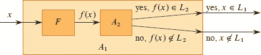
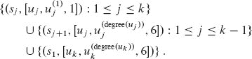

**`34` NP 完全性**

到目前为止，我们研究的几乎所有算法都是`多项式时间算法`：对于大小为`n`的输入，它们的最坏情况运行时间是`O(n^k)`，其中`k`是某个常数。你可能会想知道是否`所有`问题都可以在多项式时间内解决。答案是否定的。例如，有些问题，如图灵著名的“停机问题”，无论你愿意等待多长时间，都无法由任何计算机解决。[¹] 还有一些问题是可以解决的，但不是在任何常数`k`的`O(n^k)`时间内解决的。通常，我们认为可以通过多项式时间算法解决的问题是可处理的，或者“容易”，而需要超多项式时间的问题是不可处理的，或者“困难”。

然而，本章的主题是一类有趣的问题，称为“NP 完全”问题，其状态未知。尚未发现任何 NP 完全问题的多项式时间算法，也尚未有人能够证明任何一个 NP 完全问题不存在多项式时间算法。自 1971 年首次提出以来，这个所谓的 P ≠ NP 问题一直是理论计算机科学中最深刻、最令人困惑的开放研究问题之一。  

一些 NP 完全问题特别令人心动，因为它们表面上似乎与我们知道如何在多项式时间内解决的问题相似。在以下每对问题中，一个可以在多项式时间内解决，另一个是 NP 完全的，但问题之间的差异似乎很小：

**最短与最长简单路径：** 在第二十二章中，我们看到即使有负边权，我们也可以在有向图`G = (V, E)`中以`O(VE)`时间找到从单个源到达��`最短`路径。然而，找到两个顶点之间的`最长`简单路径是困难的。仅仅确定一个图是否包含至少给定数量的边的简单路径是 NP 完全的。

**欧拉回路与哈密顿圈：** 强连通的有向图`G = (V, E)`的一个**欧拉回路**是一个遍历`G`的每条`边`恰好一次的循环，尽管允许多次访问每个顶点。第 583 页的问题 20-3 要求您展示如何确定一个强连通的有向图是否有欧拉回路，如果有的话，在`O(E)`时间内确定欧拉回路中边的顺序。一个有向图是否有哈密顿圈是 NP 完全的。（本章后面，我们将证明确定一个*无向*图是否有哈密顿圈也是 NP 完全的。）

**2-CNF 可满足性与 3-CNF 可满足性：** 布尔公式包含二进制变量，其值为 0 或 1；布尔连接词如∧（AND）、∨（OR）和¬（NOT）；以及括号。如果存在某种变量值的赋值使得布尔公式的值为 1，则该布尔公式是**可满足的**。我们稍后会更正式地定义这些术语，但非正式地，如果布尔公式是`与范式`，或`k`-CNF，那么它是 OR 的子句的 AND，其中每个子句包含正好`k`个变量或它们的否定。例如，布尔公式（`x₁ ∨ x₂`）∧（`¬x₁ ∨ x[3]`）∧（`¬x₂ ∨ ¬x[3]`）是 2-CNF（具有满足赋值 `x₁ = 1`，`x₂ = 0` 和 `x[3] = 1`）。尽管存在一个多项式时间算法来确定 2-CNF 公式是否可满足，但我们将在本章后面看到确定 3-CNF 公式是否可满足是 NP 完全的。

**NP 完全性和 P 和 NP 类**

在本章中，我们提到三类问题：P、NP 和 NPC，后一类是 NP 完全问题。我们在这里非正式地描述它们，正式定义将在稍后出现。

P 类包括那些可以在多项式时间内解决的问题。更具体地说，它们是可以在`O(n^k)`时间内解决的问题，其中`k`是常数，`n`是问题输入的大小。在前几章中研究的大多数问题属于 P。

NP 类包括那些可以在多项式时间内“验证”的问题。什么是可验证的问题？如果你以某种方式得到了一个解的“证书”，那么你可以在问题输入的大小的多项式时间内验证这个证书是否正确。例如，在哈密顿回路问题中，给定一个有向图`G = (V, E)`，一个证书将是一个包含`|V|`个顶点的序列<`v₁, v₂, v[3], …, v[|V|]`>。你可以在多项式时间内检查这个序列是否包含每个顶点恰好一次，对于`i = 1, 2, 3, …, |V| − 1`，(`v[i]`, `v[i+1]`) ∈ `E`，以及(`v[|V|]`, `v₁`) ∈ `E`。另一个例子，对于 3-CNF 可满足性问题，一个证书可以是对变量的值的赋值。你可以在多项式时间内检查这个赋值是否满足布尔公式。

P 中的任何问题也属于 NP，因为如果一个问题属于 `P`，那么它可以在多项式时间内解决，甚至不需要提供证书。我们将在本章后面正式化这个概念，但现在你可以相信 `P` ⊆ `NP`。著名的未解问题是 `P` 是否是 `NP` 的真子集。

非正式地，一个问题属于 NPC 类——我们称之为**NP 完全**——如果它属于 NP 并且和 NP 中的任何问题一样“难”。我们将在本章后面正式定义什么是和 NP 中的任何问题一样难。与此同时，我们在没有证明的情况下陈述，如果`任何`NP 完全问题可以在多项式时间内解决，那么`每个`NP 中的问题都有一个多项式时间算法。大多数理论计算机科学家认为 NP 完全问题是难以解决的，因为鉴于迄今为止研究过的广泛范围的 NP 完全问题——没有人发现其中任何一个问题的多项式时间解决方案——如果所有这些问题都可以在多项式时间内解决，那将是真正令人惊讶的。然而，鉴于迄今为止致力于证明 NP 完全问题是难以解决的努力——没有一个确定的结果——我们不能排除 NP 完全问题最终可能在多项式时间内可解的可能性。

要成为一个优秀的算法设计师，你必须了解`NP`完全性理论的基础知识。如果你能证明一个问题是`NP`完全的，那么你为其难以解决提供了很好的证据。作为一名工程师，你最好花时间开发一个近似算法（参见第三十五章）或解决一个可处理的特殊情况，而不是寻找一个快速精确解决问题的算法。此外，许多在表面上看起来不比排序、图搜索或网络流更难的自然而有趣的问题实际上是`NP`完全的。因此，你应该熟悉这个引人注目的问题类。

**展示问题为 NP 完全的概述**

用于证明特定问题是 NP 完全的技术与本书大部分内容中用于设计和分析算法的技术有根本的区别。如果你能证明一个问题是 NP 完全的，那么你在说这个问题有多难（或者至少我们认为它有多难），而不是有多容易。如果你证明一个问题是 NP 完全的，那么你在说寻找高效算法很可能是徒劳的。从这个角度看，NP 完全性证明与第 8.1 节中对于任何比较排序算法的Ω(`n` `lg n`)时间下界的证明有些相似，尽管用于展示 NP 完全性的具体技术与第 8.1 节中使用的决策树方法不同。

在展示一个问题为 NP 完全时，我们依赖于三个关键概念：

**决策问题与优化问题**

许多感兴趣的问题是`优化问题`，在这些问题中，每个可行（即“合法”）解都有一个相关值，目标是找到一个具有最佳值的可行解。例如，在一个我们称之为 SHORTEST-PATH 的问题中，输入是一个无向图`G`和顶点`u`和`v`，目标是找到从`u`到`v`的路径，使用最少的边。换句话说，SHORTEST-PATH 是无权无向图中的单对最短路径问题。然而，NP 完全性直接适用于`决策问题`，其中答案只是“是”或“否”（或更正式地说，“1”或“0”）。

尽管 NP 完全问题局限于决策问题领域，通常可以通过对要优化的值施加限制，将给定的优化问题转化为相关的决策问题。例如，与 SHORTEST-PATH 相关的一个决策问题是 PATH：给定一个无向图`G`，顶点`u`和`v`，以及一个整数`k`，是否存在一条从`u`到`v`的路径，由最多`k`条边组成？  

当你试图展示一个优化问题“困难”时，优化问题与其相关的决策问题之间的关系对你有利。这是因为决策问题在某种意义上“更容易”，或者至少“不更困难”。举个具体的例子，你可以通过解决`SHORTEST-PATH`来解决`PATH`，然后比较找到的最短路径中的边数与决策问题参数`k`的值。换句话说，如果一个优化问题很容易，那么与之相关的决策问题也很容易。以更与 NP 完全性相关的方式陈述，如果你能提供一个决策问题很困难的证据，那么你也提供了其相关优化问题很困难的证据。因此，即使它将注意力限制在决策问题中，NP 完全性理论通常也对优化问题有影响。

**`归约`**

即使两个问题都是决策问题，展示一个问题不比另一个更难或更容易的上述概念也适用。几乎每个 NP 完全性证明都利用了这个想法，如下所示。考虑一个你想在多项式时间内解决的决策问题`A`。我们称特定问题的输入为该问题的一个**实例**。例如，在 PATH 中，一个实例是一个特定的图`G`，图`G`的特定顶点`u`和`v`，以及一个特定的整数`k`。现在假设你已经知道如何在多项式时间内解决另一个决策问题`B`。最后，假设你有一个过程，可以将问题`A`的任何实例`α`转换为问题`B`的某个实例`β`，具有以下特征：  


**图 34.1** 如何使用多项式时间归约算法在多项式时间内解决决策问题`A`，假设已经有了另一个问题`B`的多项式时间决策算法。在多项式时间内，将问题`A`的实例`α`转换为问题`B`的实例`β`，在多项式时间内解决问题`B`，并将`β`的答案作为`α`的答案。

+   转换需要多项式时间。  

+   答案是相同的。也就是说，如果`β`的答案是“是”，那么`α`的答案也是“是”。

我们称这样的过程为多项式时间**归约算法**，正如图 34.1 所示，它为我们提供了一种在多项式时间内解决问题`A`的方法：

1.  给定问题`A`的一个实例`α`，使用多项式时间归约算法将其转换为问题`B`的一个实例`β`。

1.  运行问题`B`的多项式时间决策算法在实例`β`上。

1.  将`β`的答案作为`α`的答案。

只要这些步骤都需要多项式时间，三者一起也是，因此你有一种方法在多项式时间内决定`α`。换句话说，通过将解决问题`A`简化为解决问题`B`，你利用`B`的“易解性”来证明`A`的“易解性”。

回想一下，NP 完全性是关于展示问题有多难而不是有多容易，你可以使用多项式时间简化来展示一个问题是 NP 完全的。让我们进一步展示如何使用多项式时间简化来证明某个问题`B`不存在多项式时间算法。假设你有一个决策问题`A`，你已经知道没有多项式时间算法可以解决它。（暂时忽略如何找到这样的问题`A`。）进一步假设你有一个多项式时间简化，将问题`A`的实例转换为问题`B`的实例。现在你可以使用简单的反证法来证明问题`B`不存在多项式时间算法。假设相反，也就是说，假设问题`B`有一个多项式时间算法。然后，使用图 34.1 中显示的方法，你将有一种方法在多项式时间内解决问题`A`，这与假设问题`A`没有多项式时间算法的假设相矛盾。  

要证明问题`B`是 NP 完全的，方法类似。虽然你不能假设问题`A`绝对没有多项式时间算法，但你证明问题`B`是 NP 完全的，假设问题`A`也是 NP 完全的。

**第一个 NP 完全问题**

因为简化技术依赖于已知为 NP 完全的问题来证明不同问题为 NP 完全，必须有一些“第一个”NP 完全问题。我们将使用电路可满足性问题，其中输入是由 AND、OR 和 NOT 门组成的布尔组合电路，问题是是否存在一些布尔输入使得其输出为 1。第 34.3 节将证明这个第一个问题是 NP 完全的。

**章节大纲**

本章研究了与算法分析最直接相关的 NP 完全性方面。第 34.1 节将“问题”的概念形式化，并定义了多项式时间可解决决策问题的复杂类 `P`。我们还将看到这些概念如何适用于形式语言理论的框架。第 34.2 节定义了决策问题的复杂类 `NP`，其解可以在多项式时间内验证。它还正式提出了 `P ≠ NP` 问题。

第 34.3 节展示了如何通过多项式时间“简化”来关联问题。它定义了 NP 完全性并勾勒了电路可满足性问题是 NP 完全的证明。通过证明一个问题是 NP 完全，第 34.4 节演示了如何通过简化的方法更简单地证明其他问题是 NP 完全的。为了说明这种方法，该部分展示了两个公式可满足性问题是 NP 完全的。第 34.5 节通过简化证明了其他各种问题是 NP 完全的。你可能会发现其中几个简化方法非常有创意，因为它们将一个领域中的问题转换为完全不同领域中的问题。

**34.1    多项式时间**  

由于 NP 完全性依赖于在多项式时间内解决问题和验证证书的概念，让我们首先看看问题在多项式时间内可解的含义。

回想一下，我们通常认为有多项式时间解的问题是可处理的。

1.  尽管没有一个理智的人认为需要 `Θ(n¹⁰⁰)` 时间的问题是可处理的，但很少有实际问题需要这么高次多项式阶的时间。实践中遇到的多项式时间可计算问题通常需要更少的时间。经验表明，一旦为一个问题发现了第一个多项式时间算法，通常会随之出现更高效的算法。即使当前最佳算法的运行时间为 `Θ(n¹⁰⁰)`，很可能很快就会发现一个运行时间更好的算法。

1.  对于许多合理的计算模型，一个在其中一个模型中可以在多项式时间内解决的问题，在另一个模型中也可以在多项式时间内解决。例如，本书中大部分使用的串行随机访问机器可以在多项式时间内解决的问题类与在抽象图灵机上可以在多项式时间内解决的问题类是相同的。² 当处理器数量随着输入规模多项式增长时，这也与在并行计算机上可以在多项式时间内解决的问题类相同。

1.  可以在多项式时间内解决的问题类具有良好的封闭性质，因为多项式在加法、乘法和复合下是封闭的。例如，如果一个多项式时间算法的输出被馈送到另一个算法的输入中，那么组合算法是多项式的。练习 `34.1-5` 要求你证明，如果一个算法对多项式时间子程序作出恒定次数的调用，并且执行额外的同样需要多项式时间的工作，那么组合算法的运行时间是多项式的。

**抽象问题**

要理解可以在多项式时间内解决的问题类，首先必须对“问题”有一个正式的概念。我们将一个**抽象问题** `Q` 定义为问题**实例**集合 `I` 和问题**解决方案**集合 `S` 上的二元关系。例如，SHORTEST-PATH 的一个实例是由图和两个顶点组成的三元组。解决方案是图中的顶点序列，可能为空序列表示不存在路径。SHORTEST-PATH 问题本身是将图的每个实例和两个顶点与连接这两个顶点的图中最短路径相关联的关系。由于最短路径不一定是唯一的，一个给定的问题实例可能有多个解决方案。  

这种抽象问题的表述比我们的目的更一般。正如我们上面看到的，NP-完全性理论将注意力集中在`**决策问题**`上：那些有是/否解的问题。在这种情况下，我们可以将一个抽象决策问题视为将实例集合 `I` 映射到解集合 {0, 1} 的函数。例如，与 SHORTEST-PATH 相关的一个决策问题是我们之前看到的 PATH 问题。如果 `i` = <*G, u, v, k*> 是 PATH 的一个实例，那么 PATH(`i`) = 1（是）如果 `G` 包含从 `u` 到 `v` 的路径，最多有 `k` 条边，否则为 0（否）。许多抽象问题不是决策问题，而是`**优化问题**`，需要最小化或最大化某个值。然而，正如我们上面看到的，通常可以将一个优化问题重新表述为一个不更难的决策问题。

**编码**

为了使计算机程序解决抽象问题，其问题实例必须以程序理解的方式出现。抽象对象集合`S`的**编码**是从`S`到二进制字符串集合的映射`e`。³ 例如，我们都熟悉将自然数ℕ = {0, 1, 2, 3, 4,…}编码为字符串{0, 1, 10, 11, 100,…}。使用这种编码，`e(17) = 1`0001。如果你看过键盘字符的计算机表示，你可能见过 ASCII 码，例如，A 的编码是 01000001。你可以通过组合其组成部分的表示来将复合对象编码为二进制字符串。多���形、图形、函数、有序对、程序——都可以编码为二进制字符串。  

因此，一个“解决”某个抽象决策问题的计算机算法实际上将问题实例的编码作为输入。实例`i`的**大小**只是其字符串的长度，我们用|`i`|表示。我们称其实例集为二进制字符串集的问题为**具体问题**。如果算法在`O(T(n))`时间内解决了具体问题，那么当它提供长度为`n` = |`i`|的问题实例`i`时，算法可以在`O(T(n))`时间内产生解。⁴ 因此，如果存在一个算法可以在`O(n^k)`时间内解决具体问题，那么该问题是**多项式时间可解**的。

现在我们可以正式定义`P 复杂性类`为多项式时间可解的具体决策问题集合。

编码将抽象问题映射到具体问题。给定一个将实例集`I`映射到{0, 1}的抽象决策问题`Q`，一个编码`e`：`I` → {0, 1}^*可以引出一个相关的具体决策问题，我们将其表示为`e(Q)`。⁵ 如果抽象问题实例`i ∈ I`的解是`Q(i)` ∈ {0, 1}，那么具体问题实例`e(i)` ∈ {0, 1}^*的解也是`Q(i)`。作为一个技术细节，一些二进制字符串可能不代表任何有意义的抽象问题实例。为方便起见，假设任何这样的字符串都随机映射到 0。因此，具体问题在表示抽象问题实例的二进制字符串上产生与抽象问题相同的解。

我们希望通过使用编码作为桥梁，将多项式时间可解性的定义从具体问题扩展到抽象问题，理想情况下，定义不依赖于任何特定编码。也就是说，解决问题的效率不应取决于问题如何编码。不幸的是，它在很大程度上取决于编码。例如，假设算法的唯一输入是一个整数`k`，并且假设算法的运行时间是Θ(`k`)。如果整数`k`以**一元**形式提供——一个`k`个 1 组成的字符串——那么算法在长度为`n`的输入上的运行时间是`O`(`n`)，即多项式时间。然而，如果使用更自然的二进制表示提供输入`k`，那么输入长度为`n` = ⌊lg `k`⌋ + 1，因此一元编码的大小在二进制编码的大小上呈指数增长。使用二进制表示，算法的运行时间是Θ(`k`) = Θ(2^(`n`))，即与输入大小呈指数关系。因此，根据编码的不同，算法运行在多项式或超多项式时间内。

对于我们理解多项式时间的抽象问题，抽象问题的编码方式非常重要。在没有首先指定编码的情况下，我们实际上无法谈论解决抽象问题。然而，在实践中，如果我们排除“昂贵”的编码，比如一元编码，那么问题的实际编码对于问题是否可以在多项式时间内解决几乎没有影响。例如，将整数表示为 3 进制而不是二进制对于问题是否可以在多项式时间内解决没有影响，因为我们可以将以 3 进制表示的整数转换为以 2 进制表示的整数，而这可以在多项式时间内完成。

我们说一个函数`f`：{0, 1}^* → {0, 1}^*是**多项式时间可计算的**，如果存在一个多项式时间算法`A`，对于任何输入`x` ∈ {0, 1}^*，产生`f(x)`作为输出。对于问题实例集合`I`，我们说两个编码`e`[1]和`e`[2]是**多项式相关的**，如果存在两个多项式时间可计算的函数`f`[12]和`f`[21]，对于任何`i ∈ I`，我们有`f`12 = `e`[2] 和`f`21 = `e`[1]。也就是说，多项式时间算法可以从编码`e`1 计算出编码`e`2，反之亦然。如果一个抽象问题的两个编码`e`[1]和`e`[2]是多项式相关的，那么问题是否可以在多项式时间内解决与我们使用哪种编码无关，正如以下引理所示。

**引理 34.1**

设`Q`是一个抽象决策问题，其实例集合为`I`，`e`[1]和`e`[2]是`I`上多项式相关的编码。那么，如果`e`1 ∈ P，则`e`2 ∈ P。

**证明**   我们只需要证明正向方向，因为反向方向是对称的。因此，假设`e1`可以在`O(n^k)`时间内解决某个常数`k`。此外，假设对于任何问题实例`i`，编码`e1`可以在`O(n^c)`时间内从编码`e2`计算出来，其中`n` = |`e2`|。要在`e2`上解决问题`e2`，首先计算`e1`，然后在`e1`上运行`e1`的算法。这个过程需要多长时间？转换编码需要`O(n^c)`时间，因此|`e1`| = `O(n^c)`，因为串行计算机的输出长度不能超过其运行时间。在`e1`上解决问题需要`O(|e1|^(k)) = O(n^(ck))`时间，由于`c`和`k`都是常数，所以这是多项式的。

▪  输出：

因此，一个抽象问题的实例是以二进制还是 3 进制编码并不影响其“复杂性”，即它是否可以在多项式时间内解决。然而，如果实例是以一元编码的方式编码，那么其复杂性可能会发生变化。为了能够以与编码无关的方式进行交流，我们通常假设问题实例以任何合理、简洁的方式进行编码，除非我们明确说明。准确地说，我们假设整数的编码与其二进制表示多项式相关联，并且有限集的编码与其作为元素列表（用大括号括起来，用逗号分隔）的编码多项式相关联。（ASCII 是一种这样的编码方案。）有了这样一个“标准”编码，我们可以推导出其他数学对象的合理编码，比如元组、图和公式。为了表示对象的标准编码，我们用尖括号括起对象。因此，<`G`>表示图`G`的标准编码。

只要所使用的编码与标准编码多项式相关，我们可以直接讨论抽象问题，而不需要参考任何特定编码，知道编码的选择不会影响抽象问题是否可以在多项式时间内解决。从现在开始，我们通常假设所有问题实例都是使用标准编码编码的二进制字符串，除非我们明确指定相反。我们也通常忽略抽象和具体问题之间的区别。然而，你应该注意到在实践中可能出现的问题，其中标准编码不明显，编码确实会产生影响。  

**一个形式语言** `L` 是一个无限的有序字符串集合，`L` 是通过下面的方式定义的： 1. `L` 是一个有穷的非空集合，称为**字母表**。 2. `L` 中的每个字符串都是字母表中符号的有限序列，称为**字符串**。  -   例如，如果字母表是 {0, 1}，那么 {0, 00, 111, 10, 01, ...} 就是该字母表上的一些字符串。 -   字符串 ""（空字符串）是每个字母表上的形式语言的成员。 -   在某些上下文中，空字符串可以表示为 ε 或 λ。 -   我们将 `L` 中的字符串个数称为 `L` 的**大小**。

通过专注于决策问题，我们可以利用形式语言理论的机制。让我们回顾一些来自该理论的定义。一个**字母表** `Σ` 是一组有限的符号。在`Σ`上的一个**语言** `L` 是由`Σ`中的符号组成的字符串集合。例如，如果`Σ = {0, 1}`，那么集合 `L = {10, 11, 101, 111, 1011, 1101, 10001,…}` 是素数的二进制表示的语言。我们用 `ε` 表示**空字符串**，用Ø表示**空语言**，用 `Σ*` 表示`Σ`上的所有字符串的语言。例如，如果`Σ = {0, 1}`，那么`Σ* = {ε, 0, 1, 00, 01, 10, 11, 000,…}` 是所有二进制字符串的集合。`Σ`上的每个语言 `L` 都是`Σ*`的子集。

语言支持各种操作。集合论操作，如`并集`和`交集`，直接遵循集合论的定义。我们通过 `L = Σ - L` 定义语言 `L` 的**补集**。两个语言 `L₁` 和 `L₂` 的**连接** `L₁L₂` 是语言

`L = {x₁*x₂ : x₁ ∈ L₁ and x₂ ∈ L₂}`.

语言 `L` 的**闭包**或**Kleene 星**是语言  

`L = {ε}` ∪ L ∪ L² ∪ L³ ∪ …

其中 `L^k` 是通过将 `L` 与自身连接 `k` 次得到的语言。

从语言理论的角度看，任何决策问题 `Q` 的实例集仅仅是集合 Σ 的集合，其中 Σ = {0, 1}。由于 `Q` 完全由那些产生 1（是）答案的问题实例所描述，我们可以将 `Q` 视为 Σ = {0, 1} 上的语言 `L`，其中

````L` = {`x` ∈ Σ : `Q`(`x`) = 1}.```

例如，决策问题 `PATH` 有对应的语言  

| 路径 = {<`G, u, v, k`>: | `G` = (`V`, `E`) 是一个无向图， |  输出： |
| --- | --- | --- |
| --- | --- |
|  | `u, v ∈ V`, |   |
|  | `k` ≥ 0 是一个整数，且 |   |
| | `G` 包含从 `u` 到 `v` 的路径，最多经过 `k` 条边} |

（在方便的情况下，我们有时会使用相同的名称—在这种情况下是 PATH—来指代一个决策问题及其对应的语言。）

形式语言框架使我们能够简洁地表达决策问题与解决它们的算法之间的关系。我们说一个算法 `A` **接受** 字符串 `x` ∈ {0, 1}，如果给定输入 `x`，算法的输出 `A(x)` 为 1。算法 `A` **接受** 的语言是字符串集合 `L` = {`x` ∈ {0, 1} : `A(x) = 1`}，也就是算法接受的字符串集合。如果 `A(x)` = 0，算法 `A` **拒绝** 字符串 `x`。

即使语言`L`被算法`A`接受，该算法也不一定会拒绝作为输入提供的不属于`L`的字符串`x`。例如，该算法可能会无限循环。如果算法`A`接受`L`中的每个二进制字符串并拒绝不在`L`中的每个二进制字符串，则语言`L`由算法`A`**决定**。如果算法`A`接受`L`中的每个二进制字符串并且对于任何长度为`n`的字符串`x ∈ L`，算法`A`在`O(n^k)`时间内接受`x`，则语言`L`由算法`A`**多项式时间内接受**。如果存在常数`k`，使得对于任何长度为`n`的字符串`x` ∈ {0, 1}*，算法`A`在`O(n^k)`时间内正确决定`x ∈ L`，则语言`L`由算法`A`**多项式时间内决定**。因此，要接受一种语言，算法只需在提供`L`中的字符串时产生答案，但要决定一种语言，它必须正确接受或拒绝{0, 1}*中的每个字符串。

举例来说，语言 `PATH` 可以在多项式时间内被接受。一个多项式时间接受算法验证`G`是否编码了一个无向图，验证`u`和`v`是`G`中的顶点，使用广度优先搜索在`G`中计算从`u`到`v`的边数最少的路径，然后比较所得路径的边数与`k`。如果`G`编码了一个无向图且从`u`到`v`找到的路径最多有`k`条边，则算法输出 1 并停止。否则，算法永远运行。然而，该算法并不决定 `PATH`，因为对于路径边数超过`k`的实例，它并没有明确输出 0。对于像 `PATH` 这样的决策问题，设计这样一个决策算法是直接的：当从`u`到`v`没有最多有`k`条边的路径时，它不会永远运行，而是输出 0 并停止。（如果输入编码有误，则它也会输出 0 并停止。）对于其他问题，如图灵的停机问题，存在一个接受算法，但不存在决策算法。

我们可以非正式地将`**复杂度类**`定义为一组语言，其成员资格由算法的`**复杂度度量**`（例如运行时间）确定，该算法确定给定字符串``x``是否属于语言``L``。复杂度类的实际定义略微更为技术性。⁷

利用这种语言理论框架，我们可以提供复杂度类 P 的另一种定义：

| P = {`L` ⊆ {0, 1}*： | 存在一个算法`A`，它在多项式时间内决定`L`}。 |   |
| --- | --- |

实际上，正如下面的定理所示，`P` 也是可以在多项式时间内被接受的语言类。

**定理 `34.2`**  

P = `{L：L 由多项式时间算法接受}`。  

**证明** 因为由多项式时间算法决定的语言类是由多项式时间算法接受的语言类的子集，我们只需证明如果`L`被多项式时间算法接受，则它被多项式时间算法决定。设`L`是某个多项式时间算法`A`接受的语言。我们使用经典的“模拟”论证构造另一个多项式时间算法`A'`来决定`L`。因为`A`以`O(n^k)`时间接受`L`，所以也存在常数`c`，使得`A`最多在`cn^k`步内接受`L`。对于任何输入字符串`x`，算法`A'`模拟`A`的`cn^k`步。在模拟`cn^k`步后，算法`A'`检查`A`的行为。如果`A`接受`x`，则`A'`通过输出 1 接受`x`。如果`A`没有接受`x`，则`A'`通过输出 0 拒绝`x`。`A'`模拟`A`的开销不会使运行时间增加超过多项式因子，因此`A'`是一个多项式时间算法，决定`L`。

▪  

定理 34.2 的证明是非构造性的。对于属于 P 的语言`L`，我们可能实际上并不知道接受`L`的算法`A`的运行时间上限。尽管如此，我们知道这样的上限存在，因此，存在一个算法`A`′可以检查这个上限，尽管我们可能不容易找到算法`A`′。

`练习`

`34.1-1`

将优化问题 `LONGEST-PATH-LENGTH` 定义为将无向图的每个实例和两个顶点关联到两个顶点之间最长简单路径中的边数的关系。将决策问题 `LONGEST-PATH` 定义为{<*G, u, v, k*> : `G` = (`V`, `E`)是无向图，*u, v* ∈ `V`，`k` ≥ 0 是整数，并且在`G`中存在一个由至少`k`条边组成的从`u`到`v`的简单路径}。证明如果且仅当 `LONGEST-PATH ∈ P` 时，优化问题 `LONGEST-PATH-LENGTH` 可以在多项式时间内解决。

`34.1-2`

给出在无向图中找到最长简单循环的问题的正式定义。给出一个相关的决策问题。给出与决策问题对应的语言。

**`34.1-3`**  

使用邻接矩阵表示法给出有向图的正式编码为二进制字符串。使用邻接表表示法做同样的事情。论证这两种表示是多项式相关的。  

`**34.1-4**`

0-1 背包问题的动态规划算法是一个多项式时间算法吗？解释你的答案。

**`34.1-5`**

证明如果一个算法最多调用常数次多项式时间子程序并执行额外需要多项式时间的工作，那么它将在多项式时间内运行。同时证明多项式次调用多项式时间子程序可能导致指数时间算法。

**`34.1-6`**

证明 P 类作为一组语言，在并集、交集、连接、补集和 Kleene 星下是封闭的。也就是说，如果`L₁`，`L₂` ∈ P，则`L₁ ∪ L₂` ∈ P，`L₁ ∩ L₂` ∈ P，`L₁L₂` ∈ P，`L₁ ∈ P`，以及。  

**34.2    多项式时间验证**

现在，让我们看看验证语言成员资格的算法。例如，假设对于决策问题 `PATH` 的给定实例<`G, u, v, k`>，你还给出了从`u`到`v`的路径`p`。你可以检查`p`是否是`G`中的路径，以及`p`的长度是否最多为`k`，如果是的话，你可以将`p`视为证明该实例确实属于 `PATH` 的“证书”。对于决策问题 `PATH`，这个证书似乎并没有太多用处。毕竟，`PATH` 属于 `P`——事实上，你可以在线性时间内解决 `PATH`——因此，从给定证书验证成员资格所需的时间与从头开始解决问题的时间一样长。相反，让我们研究一个我们不知道多项式时间决策算法的问题，然而，给定证书后，验证却很容易。

**`哈密顿循环`**

寻找无向图中的哈密顿回路问题已经研究了一百多年。形式上，无向图`G = (V, E)`的一个**哈密顿回路**是一个包含`V`中每个顶点的简单回路。包含哈密顿回路的图被称为**哈密顿图**，否则被称为**非哈密顿图**。这个名字是为了纪念 W. R. Hamilton，他在十二面体上描述了一个数学游戏（图 34.2(a)），其中一名玩家在任意五个连续顶点上插入五根针，另一名玩家必须完成路径以形成包含所有顶点的回路。十二面体是哈密顿的，图 34.2(a)展示了一个哈密顿回路。然而，并非所有图都是哈密顿的。例如，图 34.2(b)展示了一个具有奇数顶点的二分图。练习 34.2-2 要求你证明所有这样的图都是非哈密顿的。

这是如何将**哈密顿回路问题**，“图`G`是否有哈密顿回路”定义为一个形式语言：

`HAM-CYCLE = {<G> : G 是哈密顿图}`。

一个算法如何决定语言 HAM-CYCLE？给定一个问题实例 <`G`>，一个可能的决策算法列出`G`的所有顶点的排列，然后检查每个排列以查看它是否是一个哈密顿回路。这个算法的运行时间是多少？这取决于图`G`的编码。假设`G`被编码为其邻接矩阵。如果邻接矩阵包含`n`个条目，使得`G`的编码长度等于`n`，那么图中的顶点数`m`为 `m = sqrt(2n + 1/4) - 1/2`。顶点有`m!` 种可能的排列，因此运行时间是 `m! = (sqrt(2n + 1/4) - 1/2)!`，这不是对于任何常数`k`都是`O(n^k)`。因此，这个朴素算法不在多项式时间内运行。事实上，哈密顿回路问题是 NP 完全的，我们将在第 34.5 节中证明。


**图 34.2 (a)** 代表十二面体的顶点、边和面的图，其中用蓝色突出显示的边表示一个哈密顿回路。**(b)** 具有奇数顶点的二分图。任何这样的图都是非哈密顿的。

**验证算法**  

考虑一个稍微简单的问题。假设一个朋友告诉你一个给定的图`G`是哈密顿的，然后朋友提出通过按照哈密顿回路中的顶点顺序给你来证明。验证这个证明肯定很容易：只需验证提供的回路是否是哈密顿的，方法是检查它是否是`V`的顶点的排列，以及沿着回路的每个连续边是否实际存在于图中。你肯定可以实现这个验证算法以在`O(n²)`时间内运行，其中`n`是`G`的编码长度。因此，证明图中存在哈密顿回路可以在多项式时间内验证。

我们将一个**`验证算法`**定义为一个具有两个参数的算法`A`，其中一个参数是普通输入字符串`x`，另一个是称为**`证书`**的二进制字符串`y`。如果存在一个证书`y`使得`A(x, y) = 1`，则一个具有两个参数的算法`A` **验证** 输入字符串`x`。被验证的语言由验证算法`A`验证。

`L = {x ∈ {0, 1} : 存在 y ∈ {0, 1} 使得 A(x, y) = 1}`。

如果将算法 `A` 视为验证语言 `L` 的工具，那么对于任何 `x ∈ L`，都存在一个证书 `y`，使得 `A` 可以用来证明 `x ∈ L`。此外，对于任何 `x` ∉ `L` 的字符串，都不应该有证书证明 `x ∈ L`。例如，在哈密顿回路问题中，证书是某个哈密顿回路中的顶点列表。如果一个图是哈密顿的，那么哈密顿回路本身提供了足够的信息来验证该图确实是哈密顿的。反之，如果一个图不是哈密顿的，那么就不可能有任何顶点列表愚弄验证算法，使其相信该图是哈密顿的，因为验证算法会仔细检查所谓的回路以确保其正确性。

**复杂性类 NP**

**复杂性类* NP** 是可以通过多项式时间算法验证的语言类别。⁹ 更确切地说，如果存在一个两输入多项式时间算法 `A` 和一个常数 `c`，那么语言 `L` 属于 NP。

| `L` = {`x ∈ {0, 1}`*: | 存在一个证书 `y`，使得 | `y` | = `O( | x | ^(`c`))` |
| --- | --- | --- | --- | --- | --- |
| --- | --- |
|  | 使得 A(x, y) = 1}。 |

我们说算法 `A` **在多项式时间内验证** 语言 `L`。

从我们之前关于哈密顿回路问题的讨论中，您可以看到 `HAM-CYCLE ∈ NP`。 （知道一个重要集合是非空总是好的。）此外，如果 `L ∈ P`，则 `L ∈ NP`，因为如果存在一个多项式时间算法来决定 `L`，则该算法可以转换为一个忽略任何证书并仅接受那些确定属于 `L` 的输入字符串的两参数验证算法。因此，`P ⊆ NP`。  

这就留下了 `P = NP` 的问题。目前尚无明确答案，但大多数研究人员认为 `P` 和 `NP` 不是同一类。将类 `P` 视为可以快速解决的问题，将类 `NP` 视为可以快速验证解决方案的问题。您可能从经验中了解到，从头开始解决问题通常比验证清晰呈现的解决方案更困难，尤其是在时间限制下工作时。理论计算机科学家普遍认为这种类比适用于类 `P` 和 `NP`，并且 `NP` 包括不属于 `P` 的语言。


**图 `34.3`** 复杂性类之间关系的四种可能性。在每个图中，一个包含另一个的区域表示一个真子集关系。 **(a)** `P = NP = co-NP`。大多数研究人员认为这种可能性最不可能。 **(b)** 如果 `NP` 在补集下封闭，则 `NP = co-NP`，但不一定是 `P = NP`。 **(c)** `P = NP ∩ co-NP`，但 `NP` 在补集下不封闭。 **(d)** `NP ≠ co-NP` 且 `P ≠ NP ∩ co-NP`。大多数研究人认为这种可能性最有可能。

还有更有说服力但不是决定性的证据表明 P ≠ NP——存在“NP 完全”语言。第 34.3 节 将研究这一类。

除了 P ≠ NP 问题之外，许多其他基本问题仍未解决。图 34.3 展示了一些可能的情景。尽管许多研究人员做了大量工作，但没有人知道类 NP 是否在补集下封闭。也就是说，`L ∈ NP` 是否意味着 `L ∈ NP`？我们将**复杂性类* co-NP** 定义为语言 `L` 属于 NP 的集合，因此 NP 是否在补集下封闭的问题也就是 NP = co-NP 的问题。由于 P 在补集下封闭（练习 34.1-6），根据练习 34.2-9（P ⊆ co-NP），可得出 P ⊆ NP ∩ co-NP。然而，没有人知道 `P = NP ∩ co-NP` 还是 `(NP ∩ co-NP) − P` 中是否存在某种语言。

因此，我们对 `P` 和 `NP` 之间的确切关系的理解是非常不完整的。然而，即使我们可能无法证明某个问题是难解的，如果我们能证明它是 `NP` 完全的，那么我们就获得了有关它的宝贵信息。

`练习`

**`34.2-1`**

考虑语言 GRAPH-ISOMORPHISM = {<`G₁`, `G₂`>：`G₁`和`G₂`是同构图}。通过描述一个验证该语言的多项式时间算法，证明 GRAPH-ISOMORPHISM ∈ NP。

**`34.2-2`**

证明如果`G`是一个具有奇数个顶点的无向二分图，则`G`是非哈密顿图。

`34.2-3`  

展示如果 `HAM-CYCLE ∈ P`，则按顺序列出哈密顿循环的顶点的问题是多项式时间可解的。

`34.2-4`  

证明 NP 语言类在并集、交集、连接和 Kleene 星下是封闭的。讨论 NP 在补集下的封闭性。

**`34.2-5`**  

展示 NP 中的任何语言都可以通过一个运行时间为的算法来决定。

`34.2-6`

图中的**哈密顿路径**是一个简单路径，它恰好访问每个顶点一次。展示语言 HAM-PATH = {<`G, u, v`>：图`G`中从`u`到`v`存在哈密顿路径}属于 NP。

**`34.2-7`**  

展示了在有向无环图上可以在多项式时间内解决练习 `34.2-6` 中的哈密顿路径问题。给出该问题的高效算法。

**`34.2-8`**

设`ϕ`是由布尔输入变量`x₁`，`x₂`，…，`x[k]`，否定（¬），与（∧），或（∨）和括号构造的布尔公式。如果对输入变量的每个赋值`ϕ`都评估为 1，则该公式是一个**永真式**。将 TAUTOLOGY 定义为布尔公式的语言，这些公式是永真式。证明 TAUTOLOGY ∈ co-NP。  

**`34.2-9`**

证明 `P ⊆ co-NP`。

**34.2-10**

证明如果`NP ≠ co-NP`，则`P ≠ NP`。

**`34.2-11`**

设`G`是一个至少有三个顶点的连通无向图，令`G`³是通过连接`G`中长度最多为 3 的路径连接的所有顶点对而得到的图。证明`G`³是哈密顿图。（*提示：构建`G`的生成树，并使用归纳论证。）

**34.3 NP 完全性和可归约性**  

或许理论计算机科学家相信 P ≠ NP 的最具说服力的原因来自于 NP 完全问题的存在。这个类别具有一个有趣的特性，即如果`任何`NP 完全问题可以在多项式时间内解决，那么 NP 中的`每个`问题都有一个多项式时间的解决方案，也就是说，P = NP。尽管经过几十年的研究，但从未为任何 NP 完全问题发现过多项式时间算法。

语言 `HAM-CYCLE` 是一个 NP 完全问题。如果有一个算法可以在多项式时间内决定 `HAM-CYCLE`，那么 NP 中的每个问题都可以在多项式时间内解决。NP 完全语言在某种意义上是 NP 中“最难”的语言。实际上，如果 NP − P 是非空的，我们将能够确定 `HAM-CYCLE ∈ NP − P`。  

本节首先展示了如何使用称为“多项式时间可归约性”的精确概念来比较语言的相对“难度”。然后正式定义了 NP 完全语言，并最后勾勒了一个证明，证明了其中一种语言，称为 CIRCUIT-SAT，是 NP 完全的。第 34.4 节和第 34.5 节将使用可归约性的概念来展示许多其他问题是 NP 完全的。

**可归约性**

有时解决问题的一种方法是将其重新构造为另一个问题。我们称这种策略为将一个问题减少到另一个问题。如果问题 `Q` 可以减少为另一个问题 `Q′`，则将问题 `Q` 的任何实例重新构造为问题 `Q′` 的实例，并且问题 `Q′` 的实例的解决方案提供了问题 `Q` 的实例的解决方案。例如，解决不定方程 `x` 的问题可以减少为解决二次方程的问题。给定线性方程实例 `ax + b = 0`（解为 `x = −b/a`），您可以将其转换为二次方程 `ax² + bx + 0 = 0`。这个二次方程的解为 `x = (−b + b)/2a = 0` 和 `x = (−b − b)/2a = −b/a`，从而提供了解决 `ax + b = 0` 的解。因此，如果问题 `Q` 减少为另一个问题 `Q′`，那么 `Q` 在某种意义上“不比” `Q′` 更难解决。


**图 34.4** 将语言 `L₁` 减少到语言 `L₂` 的函数 `f`。对于任何输入 `x` ∈ {0, 1}*，问题 `x ∈ L₁` 的答案与问题 `f(x) ∈ L₂` 的答案相同。

回到我们的形式语言框架，对于决策问题，我们说语言 `L₁` **多项式时间可减少** 到语言 `L₂`，写作 `L₁ ≤[P] L₂`，如果存在一个多项式时间可计算的函数 `f` : {0, 1}* → {0, 1}*，使得对于所有 `x` ∈ {0, 1}*，


我们将函数 `f` 称为**减少函数**，计算 `f` 的多项式时间算法 `F` 称为**减少算法**。  

图 34.4 说明了从语言 `L₁` 到另一语言 `L₂` 的减少的概念。每种语言都是 {0, 1}* 的子集。减少函数 `f` 提供了这样一个映射，即如果 `x ∈ L₁`，则 `f` (`x`) ∈ `L₂`。此外，如果 `x` ∉ `L₁`，则 `f` (`x`) ∉ `L₂`。因此，减少函数将由语言 `L₁` 表示的决策问题的任何实例 `x` 映射到由 `L₂` 表示的问题的实例 `f` (`x`)。直接提供 `f` (`x`) ∈ `L₂` 的答案也提供了 `x ∈ L₁` 的答案。此外，如果 `f` 可以在多项式时间内计算，则它是一个多项式时间减少函数。

多项式时间减少为我们提供了一个强大的工具，用于证明各种语言属于`P`。

**引理 34.3**

如果 `L₁`，`L₂` ⊆ {0, 1}* 是语言，使得 `L₁ ≤[P] L₂`，那么 `L₂` ∈ P 意味着 `L₁` ∈ P。



**图 34.5** 引理 34.3 的证明。算法 `F` 是一个减少算法，它在多项式时间内计算从 `L₁` 到 `L₂` 的减少函数 `f`，`A₂` 是一个在多项式时间内决定 `L₂` 的算法。算法 `A₁` 通过使用 `F` 将任何输入 `x` 转换为 `f(x)`，然后使用 `A₂` 来决定 `f(x) ∈ L₂`，来决定 `x ∈ L₁`。

**证明**   设 `A₂` 是一个决定 `L₂` 的多项式时间算法，`F` 是一个计算减少函数 `f` 的多项式时间减少算法。我们展示如何构建一个决定 `L₁` 的多项式时间算法 `A₁`。

图 34.5 说明了我们如何构建 `A₁`。对于给定的输入 `x` ∈ {0, 1}*，算法 `A₁` 使用 `F` 将 `x` 转换为 `f(x)`，然后使用 `A₂` 来测试 `f(x) ∈ L₂`。算法 `A₁` 接受来自算法 `A₂` 的输出，并将该答案作为自己的输出。

`A`[1] 的正确性来自条件`(34.1)`。该算法在多项式时间内运行，因为 `F` 和 `A`[2] 都在多项式时间内运行（参见练习 `34.1-5`）。

▪

**`NP-完全性`**

多项式时间归约允许我们正式显示一个问题至少与另一个问题一样困难，至多相差一个多项式时间因子。也就是说，如果 `L₁ ≤ L₂`，那么 `L₁` 不会比 `L₂` 更困难一个多项式因子，这就是为什么减少的“小于或等于”符号是助记符。现在我们可以定义 NP 完全语言的集合，它们是 NP 中最困难的问题。

一个语言 `L` ⊆ {0, 1}* 是**NP 完全**的，如果 

1.  `L` ∈ NP，并且

1.  `L′ ≤[P] L` 对于每个 `L′ ∈ NP`。  

如果一个语言 `L` 满足属性 2，但不一定满足属性 1，我们称 `L` 为**NP-难**。我们还定义 NPC 为 NP 完全语言的类。

正如下面的定理所示，NP 完全性是决定 P 是否实际上等于 NP 的关键。

**定理 34.4**

如果任何 NP 完全问题是多项式时间可解的，则`P = NP`。换句话说，如果 NP 中的任何问题不是多项式时间可解的，则没有 NP 完全问题是多项式时间可解的。


**图 34.6** 大多数理论计算机科学家如何看待 `P`、`NP` 和 `NPC` 之间的关系。`P` 和 `NPC` 都完全包含在 `NP` 中，且 `P ∩ NPC = Ø`。

**证明**   假设 `L` ∈ P 并且 `L` ∈ NPC。对于任何 `L'` ∈ NP，根据 NP 完全性定义的属性 2，我们有 `L' ≤[P] L`。因此，根据引理 34.3，我们也有 `L'` ∈ P，这证明了定理的第一个陈述。

要证明第二个陈述，考虑第一个陈述的逆否命题：如果 `P ≠ NP`，则不存在一个多项式时间可解的 NP 完全问题。但是 `P ≠ NP` 意味着存在一个 NP 中不可多项式时间可解的问题，因此第二个陈述是第一个陈述的逆否命题。

▪  输出：

正是因为这个原因，对 P ≠ NP 问题的研究集中在 NP 完全问题上。大多数理论计算机科学家相信 P ≠ NP，这导致了 P、NP 和 NPC 之间的关系，如图 34.6 所示。然而，据我们所知，有人可能会为 NP 完全问题提出多项式时间算法，从而证明 P = NP。然而，由于尚未发现任何 NP 完全问题的多项式时间算法，证明一个问题是 NP 完全的提供了它是难以解决的极好证据。

`电路可满足性`

我们已经定义了 NP 完全问题的概念，但到目前为止，我们实际上还没有证明任何问题是 NP 完全的。一旦我们证明至少一个问题是 NP 完全的，多项式时间可减性就成为证明其他问题是 NP 完全的工具。因此，我们现在专注于证明存在一个 NP 完全问题：电路可满足性问题。

不幸的是，证明电路可满足性问题是 NP 完全需要超出本文范围的技术细节。相反，我们将非正式地描述一个依赖于布尔组合电路基本理解的证明。


**图 34.7** 三个基本逻辑门，具有二进制输入和输出。在每个门下面是描述门操作的真值表。**(a)** NOT 门。**(b)** AND 门。**(c)** OR 门。

布尔组合电路是由互相连接的布尔组合元件构建的。**布尔组合元件** 是任何具有固定数量的布尔输入和输出并执行明确定义功能的电路元件。布尔值来自集合 {0, 1}，其中 0 表示 FALSE，1 表示 TRUE。

电路可满足性问题中出现的布尔组合元素计算简单的布尔函数，它们被称为`逻辑门`。图 34.7 展示了电路可满足性问题中使用的三种基本逻辑门：`非门`（或`反相器`）、`与门`和`或门`。非门接收单个二进制`输入` `x`，其值为 0 或 1，并产生一个二进制`输出` `z`，其值与输入值相反。其他两个门分别接收两个二进制输入 `x` 和 `y`，并产生单个二进制输出 `z`。

每个门的操作，或任何布尔组合元素的操作，由一个`**真值表**`定义，在图 34.7 中的每个门下方显示。真值表给出了组合元素在每种可能的输入设置下的输出。例如，或门的真值表表示当输入为 `x` = 0 和 `y = 1` 时，输出值为 `z = 1`。符号 `¬` 表示非函数，`∧` 表示与函数，`∨` 表示或函数。因此，例如，`0 ∨ 1 = 1`。

与门和或门不仅限于两个输入。与门的输出在所有输入为 1 时为 1，否则为 0。或门的输出在任何输入为 1 时为 1，否则为 0。

一个`布尔组合电路`由一个或多个布尔组合元素通过`导线`相互连接而成。一根导线可以连接一个元素的输出到另一个元素的输入，使得第一个元素的输出值成为第二个元素的输入值。图 34.8 展示了两个类似的布尔组合电路，仅在一个门上有所不同。图中的部分（a）还展示了在给定输入 <`x`[1] = 1, `x`[2] = 1, `x`[3] = 0> 的情况下，各个导线上的值。虽然一根导线可能只连接一个组合元素的输出，但它可以连接多个元素的输入。一根导线连接的元素输入的数量称为导线的`出度`。如果一根导线没有连接任何元素的输出，则该导线是一个`电路输入`，接受来自外部源的输入值。如果一根导线没有连接任何元素的输入，则该导线是一个`电路输出`，将电路计算的结果提供给外部世界。（内部导线也可以连接到电路输出。）为了定义电路可满足性问题，我们将电路输出的数量限制为 1，尽管在实际硬件设计中，布尔组合电路可能有多个输出。


**图 34.8** 电路可满足性问题的两个实例。**(a)** 对该电路的输入进行赋值 <`x₁ = 1, x₂ = 1, x[3] = 0`> 会导致电路的输出为 1。因此，电路是可满足的。**(b)** 对该电路的输入进行任何赋值都无法使电路的输出为 1。因此，电路是不可满足的。  

布尔组合电路不包含循环。换句话说，对于给定的组合电路，想象一个有向图 `G = (V, E)`，其中每个组合元素对应一个顶点，每个具有 `k` 个出度的导线对应 `k` 条有向边，如果一条导线连接元素 `u` 的输出到元素 `v` 的输入，则图中包含一条从 `u` 指向 `v` 的有向边。那么 `G` 必须是无环的。

对于布尔组合电路的`**真值赋值**`是一组布尔输入值。我们说一个 1 输出的布尔组合电路是`**可满足的**`，如果它有一个`**满足赋值**`：一个使电路输出为 1 的真值赋值。例如，图 34.8(a)中的电路有满足赋值<`x`[1] = 1, `x`[2] = 1, `x`[3] = 0>，因此它是可满足的。正如练习 34.3-1 要求你展示的那样，对`x`[1]、`x`[2]和`x`[3]的值进行任何赋值都不会使图 34.8(b)中的电路产生 1 输出。因为它总是产生 0，所以它是不可满足的。

**电路可满足性问题**是，“给定由 AND、OR 和 NOT 门组成的布尔组合电路，它是否可满足？”然而，为了正式提出这个问题，我们必须就电路的标准编码达成一致。布尔组合电路的**大小**是电路中布尔组合元素的数量加上电路中的线的数量。我们可以设计一种类似图形的编码，将任何给定的电路`C`映射到一个二进制字符串<`C`>，其长度与电路本身的大小多项式成正比。因此，作为一个形式语言，我们可以定义

`CIRCUIT-SAT = {<C> : C 是一个可满足的布尔组合电路}`。

电路可满足性问题出现在计算机辅助硬件优化领域。如果一个子电路总是产生 0，那么这个子电路是不必要的：设计者可以用一个更简单的子电路替换它，省略所有逻辑门，并提供常数 0 值作为输出。你可以看到拥有一个多项式时间算法解决这个问题的价值。

给定一个电路`C`，你可以通过简单地检查所有可能的输入赋值来确定它是否可满足。不幸的是，如果电路有`k`个输入，那么你将不得不检查多达 2^(k) 个可能的赋值。当`C`的大小与`k`的多项式成正比时，检查所有可能的输入赋值需要Ω(2^(k))时间，这在电路大小方面是超多项式的。事实上，正如我们所声称的，强有力的证据表明不存在解决电路可满足性问题的多项式时间算法，因为电路可满足性是 NP 完全的。我们将这个事实的证明分为两部分，基于 NP 完全性定义的两部分。  

**引理 34.5**

电路可满足性问题属于`NP`类。

**证明**   我们提供一个两输入的多项式时间算法`A`，可以验证 `CIRCUIT-SAT`。`A`的一个输入是（一个标准编码的）布尔组合电路`C`。另一个输入是对`C`中每个线赋予布尔值的证书。 (参见练习 34.3-4 以获得一个更小的证书。)

算法`A`的工作方式如下。对于电路中的每个逻辑门，它检查证书在输出线上提供的值是否正确地作为输入线上值的函数计算。然后，如果整个电路的输出为 1，算法`A`输出 1，因为分配给`C`输入的值提供了一个满足赋值。否则，`A`输出 0。  

每当一个可满足电路`C`输入算法`A`时，存在一个长度与`C`的大小多项式成正比的证书，使得`A`输出 1。当输入一个不可满足电路时，没有证书能够欺骗`A`认为电路是可满足的。算法`A`在多项式时间内运行，通过良好的实现，线性时间就足够了。因此，CIRCUIT-SAT 在多项式时间内是可验证的，且 CIRCUIT-SAT ∈ NP。

▪

证明 `CIRCUIT-SAT` 是 NP 完全的第二部分是展示该语言是 NP 难的：即`每个`NP 中的语言都可以多项式时间归约到 `CIRCUIT-SAT`。这个事实的实际证明充满了技术细节，因此我们将根据对计算机硬件工作原理的一些理解概述证明。  

计算机程序存储在计算机内存中作为一系列指令。典型指令编码了要执行的操作，内存中操作数的地址，以及结果存储的地址。一个特殊的内存位置，称为`程序计数器`，跟踪下一个要执行的指令。当每条指令被获取时，程序计数器会自动递增，从而导致计算机按顺序执行指令。然而，某些指令可以导致值被写入程序计数器，从而改变正常的顺序执行，使计算机循环执行和执行条件分支。

在程序执行时的任何时刻，计算机内存保存了计算的整个状态。（考虑内存包括程序本身、程序计数器、工作存储以及计算机为簿记而维护的各种状态位。）我们将计算机内存的任何特定状态称为**配置**。当一条指令执行时，它会转换配置。将一条指令视为将一个配置映射到另一个配置。实现此映射的计算机硬件可以作为布尔组合电路实现，我们在以下引理的证明中用`M`表示。

**引理 34.6**

电路可满足性问题是 NP 难的。

**证明**   设`L`是 NP 中的任意语言。我们将描述一个多项式时间算法`F`，计算一个将每个二进制字符串`x`映射到电路`C = f(x)`的归约函数`f`，使得`x ∈ L`当且仅当`C ∈ CIRCUIT-SAT`。

由于`L` ∈ NP，必须存在一个在多项式时间内验证`L`的算法`A`。我们构建的算法`F`使用两输入算法`A`来计算归约函数`f`。

让`T(n)`表示算法`A`在长度为`n`的输入字符串上的最坏情况运行时间，让`k ≥ 1` 是一个常数，使得`T(n) = O(n^k)`且证书的长度为`O(n^k)`。（`A`的运行时间实际上是总输入大小的多项式，包括输入字符串和证书，但由于证书的长度是输入字符串长度`n`的多项式，因此运行时间是`n`的多项式。）


**图 34.9** 算法`A`在输入`x`和证书`y`上运行产生的配置序列。每个配置表示计算机在计算的一步中的状态，并且除了`A`、`x`和`y`之外，还包括程序计数器（PC）、辅助机器状态和工作存储。除了证书`y`外，初始配置`c₀`是恒定的。一个布尔组合电路`M`将每个配置映射到下一个配置。输出是工作存储中的一个特定位。

证明的基本思想是将计算`A`的过程表示为一系列配置。如图 34.9 所示，将每个配置视为包含几个部分：`A`的程序、程序计数器和辅助机器状态、输入`x`、证书`y`和工作存储。实现计算机硬件的组合电路`M`将每个配置`c[i]`映射到下一个配置`c[i+1]`，从初始配置`c₀`开始。算法`A`在执行完毕时将其输出（0 或 1）写入到指定位置。`A`停止后，输出值不会再改变。因此，如果算法运行最多`T(n)`步，则输出将出现在`cT`的某一位上。

缩减算法`F`构建一个单一的组合电路，计算给定初始配置产生的所有配置。其思想是将`T(n)`个电路`M`的副本粘贴在一起。第`i`个电路的输出，产生配置`c[i]`，直接输入到第（`i`+1）个电路中。因此，配置不是存储在计算机内存中，而是作为连接`M`副本的电线上的值存在。

回顾多项式时间缩减算法`F`必须做的事情。给定一个输入`x`，它必须计算一个电路`C = f(x)`，当且仅当存在一个证书`y`使得`A(x, y) = 1` 时，该电路是可满足的。当`F`获得一个输入`x`时，首先计算`n` = |`x`|，并构建由`T(n)`个`M`副本组成的组合电路`C'`。`C'`的输入是与`A(x, y)`上的计算对应的初始配置，输出是配置`cT`。

算法`F`稍微修改电路`C′`以构建电路`C = f(x)`。首先，将输入连接到`C′`对应于`A`的程序、初始程序计数器、输入`x`和内存的初始状态的已知值。因此，电路的唯一剩余输入对应于证书`y`。其次，忽略`C′`的所有输出，除了与`A`的输出对应的`cT`的一位。这样构建的电路`C`，计算任何长度为`O(n^k)`的输入`y`的`C(y) = A(x, y)`。当提供输入字符串`x`时，缩减算法`F`计算这样一个电路`C`并输出它。  

我们需要证明两个性质。首先，我们必须证明`F`正确计算一个缩减函数`f`。也就是说，我们必须证明当且仅当存在一个证书`y`使得`A(x, y) = 1` 时，`C`是可满足的。其次，我们必须证明`F`在多项式时间内运行。

要证明`F`正确计算一个缩减函数，假设存在一个长度为`O(n^k)`的证书`y`，使得`A(x, y) = 1`。那么，在将`y`的位应用于`C`的输入后，`C`的输出为`C(y) = A(x, y) = 1`。因此，如果存在一个证书，则`C`是可满足的。对于另一个方向，假设`C`是可满足的。因此，存在一个输入`y`到`C`，使得`C(y) = 1`，由此我们得出`A(x, y) = 1`。因此，`F`正确计算一个缩减函数。

要完成证明概述，我们需要展示`F`在长度为`n` = |`x`|的多项式时间内运行。首先，表示一个配置所需的比特数是`n`的多项式。为什么？算法`A`本身的程序大小是常数，与其输入`x`的长度无关。输入`x`的长度为`n`，证书`y`的长度为`O(n^k)`。由于算法运行的步数最多为`O(n^k)`步，因此`A`所需的工作存储量也是`n`的多项式。（我们隐含地假设这个内存是连续的。练习 34.3-5 要求您将这个论点扩展到`A`访问的位置分散在一个更大的内存区域中，而且每个输入`x`的访问模式可能不同的情况。）

实现计算机硬件的组合电路`M`的大小与配置长度的多项式成正比，即`O(n^k)`，因此，`M`的大小与`n`成多项式关系。（这个电路的大部分部分实现了存储系统的逻辑。）电路`C`由`O(n^k)`个`M`的副本组成，因此它的大小与`n`成多项式关系。归约算法`F`可以在多项式时间内从`x`构造出`C`，因为构造的每一步都需要多项式时间。

▪

因此，`CIRCUIT-SAT`语言至少与`NP`中的任何语言一样困难，而且由于它属于`NP`，它是`NP`完全的。

**`定理 34.7`**

电路可满足性问题是 NP 完全的。

**证明**   直接根据引理 34.5 和 34.6 以及 NP 完全性的定��得出。  

▪  输出：

**练习**

**34.3-1**

验证图 `34.8(b)` 中的电路是否不可满足。

**34.3-2**

证明≤[P]关系是语言上的一个传递关系。也就是说，证明如果`L₁ ≤[P] L₂`和`L₂ ≤[P] L[3]`，那么`L₁ ≤[P] L[3]`。

`34.3-3`

证明`L ≤[P] L`当且仅当`L ≤[P] L`。

`34.3-4`

证明引理 `34.5` 的另一种方法可以使用一个满足的赋值作为证书。哪种证书更容易进行证明？

`34.3-5`

引理 34.6 的证明假设算法`A`的工作存储占据一个多项式大小的连续区域。证明中的哪里利用了这个假设？论证这个假设不涉及任何广义性的损失。

**`34.3-6`**

对于一个语言`L`，如果`L ∈ C`且对于所有`L′ ∈ C`，`L′ ≤[P] L`，则`L`相对于多项式时间归约是**完全**的。证明Ø和{0, 1}*是 P 中唯一不相对于多项式时间归约是完全的语言。

**34.3-7**

证明，关于多项式时间归约（见练习 `34.3-6`），如果`L`对于 NP 是完全的，当且仅当`L`对于 co-NP 是完全的。

**34.3-8**

引理 34.6 证明中的归约算法`F`基于`x`、`A`和`k`的知识构造电路`C = f(x)`。Sartre 教授观察到字符串`x`是`F`的输入，但`F`只知道`A`、`k`和`O(n^k)`运行时间中的常数因子的存在（因为语言`L`属于 NP），而不知道它们的实际值。因此，教授得出结论说`F`不可能构造电路`C`，并且 CIRCUIT-SAT 语言不一定是 NP 困难的。解释教授推理中的错误。  

**34.4    NP 完全性证明**

证明电路可满足性问题是 NP 完全直接表明`L ≤[P] CIRCUIT-SAT` 对于每个 `L ∈ NP`。本节展示了如何证明语言是 NP 完全而不直接将每个 NP 中的语言归约到给定语言。我们将通过证明各种公式可满足性问题是 NP 完全来探讨这种方法。第 34.5 节提供了更多的例子。

下面的引理为证明给定语言是 NP 完全提供了基础。

**引理 34.8**  

如果`L`是一种语言，使得存在`L′ ∈ NPC`，满足`L′ ≤[P] L`，那么`L`是 NP 难的。此外，如果`L ∈ NP`，那么`L ∈ NPC`。

**证明** 由于`L′`是 NP 完全的，对于所有`L″ ∈ NP`，我们有`L″ ≤[P] L′`。根据假设，我们有`L′ ≤[P] L`，因此根据传递性（练习 34.3-2），我们有`L″ ≤[P] L`，这表明`L`是 NP 难的。如果`L ∈ NP`，我们也有`L ∈ NPC`。

▪

换句话说，通过将已知的 NP 完全语言`L′`简化为`L`，我们隐式地将 NP 中的每种语言简化为`L`。因此，引理 34.8 提供了证明语言`L`是 NP 完全的方法：

1.  证明`L` ∈ NP。

1.  证明`L`是 NP 难的：

    a. 选择一个已知的 NP 完全语言`L′`。

    b. 描述一个计算函数`f`的算法，将`L'`中的每个实例`x` ∈ {0, 1}映射到`L`的实例`f(x)`。  

    c. 证明函数`f`满足`x ∈ L′`当且仅当对于所有`x ∈ {0, 1}`，`f(x) ∈ L`。

    d. 证明计算`f`的算法在多项式时间内运行。

从一个已知的 NP 完全语言简化的方法比直接展示如何从 NP 中的每个语言简化要简单得多。证明 `CIRCUIT-SAT ∈ NPC` 提供了一个起点。知道电路可满足性问题是 NP 完全的，使得证明其他问题是 NP 完全的变得更容易。此外，随着已知的 NP 完全问题目录的增长，可以减少简化的语言选择。  

**`公式可满足性`**

为了说明简化方法，让我们看一个确定布尔`公式`是否可满足的 NP 完全性证明，而不是一个`电路`。这个问题有历史荣誉，是第一个被证明为 NP 完全的问题。

我们将**(公式)可满足性**问题表述为语言 SAT 如下。SAT 的一个实例是一个由`...` 输出：

1.  `n` 个布尔变量：`x₁`，`x₂`，…，`x[n]`；

1.  `m` 个布尔连接符：任何具有一个或两个输入和一个输出的布尔函数，例如 ∧（与）、∨（或）、¬（非）、→（蕴含）、↔（当且仅当）；和  

1.  括号。（不失一般性，假设没有多余的括号，即一个公式中每个布尔连接符最多包含一对括号。）

我们可以用多项式长度对布尔公式`ϕ`进行编码，长度为`n + m`。与布尔组合电路一样，布尔公式`ϕ`的**真值赋值**是`ϕ`变量的一组值，**满足赋值**是使其评估为 1 的真值赋值。具有满足赋值的公式是**可满足**的公式。可满足性问题询问给定的布尔公式是否可满足，我们可以用形式语言表达为

SAT = {<`ϕ`>：`ϕ`是一个可满足的布尔公式}。

例如，公式  输出：

`ϕ` = ((`x₁ → x₂`) ∨ ¬((¬`x₁ ↔ x[3]`) ∨ `x[4]`)) ∧ ¬`x₂`

具有满足赋值<`x₁ = 0`，`x₂ = 0`，`x[3] = 1`，`x[4] = 1`>的公式，因为


因此，这个公式`ϕ`属于 SAT。

确定任意布尔公式是否可满足的朴素算法不在多项式时间内运行。具有`n`个变量的公式有 2^(n) 种可能的赋值。如果<ϕ>的长度是`n`的多项式，那么检查每个赋值需要Ω(2^(n))时间，这在<ϕ>的长度中是超多项式的。如下定理所示，不太可能存在多项式时间算法。

**定理 34.9**

布尔公式的可满足性是 NP 完全的。

**证明** 我们首先论证 `SAT ∈ NP`。然后通过展示 `CIRCUIT-SAT ≤[P] SAT` 来证明 `SAT` 是 `NP` 难的，这将证明定理。

为了证明 SAT 属于 NP，我们展示了一个由公式`ϕ`的可满足赋值组成的证书可以在多项式时间内验证。验证算法简单地用其对应值替换公式中的每个变量，然后评估表达式，就像我们在上面的方程(34.2)中所做的那样。这个任务可以在多项式时间内完成。如果表达式评估为 1，则算法已验证公式是可满足的。因此，SAT 属于 NP。

要证明 SAT 是 NP 难题，我们展示了 `CIRCUIT-SAT ≤[P] SAT`。换句话说，我们需要展示如何在多项式时间内将任何电路可满足性实例减少为公式可满足性实例。我们可以使用归纳法将任何布尔组合电路表示为布尔公式。我们只需查看产生电路输出的门，并归纳地将每个门的输入表示为公式。然后，通过编写一个将门的功能应用于其输入公式的表达式来获得电路的公式。


**图 `34.10`** 将电路可满足性减少为公式可满足性。减少算法生成的公式中，每根电路导线都有一个变量，每个逻辑门的操作都有一个子句。

不幸的是，这种直接的方法并不构成多项式时间的减少。正如 `34.4-1` 练习要求您展示的那样，共享子公式——这些子公式来自于输出导线具有 2 个或更多扇出的门——可能导致生成的公式的大小呈指数增长。因此，减少算法必须更加聪明一些。  

图 34.10 展示了如何克服这个问题，以图 34.8(a)中的电路为例。对于电路`C`中的每根导线`x[i]`，公式`ϕ`都有一个变量`x[i]`。为了表达每个门的操作方式，构建一个涉及其输入导线变量的小型公式。这个公式的形式是“当且仅当”(↔)，门的输出变量在左边，右边是封装了门在输入上的功能的逻辑表达式。例如，输出 AND 门的操作（图中最右边的门）是`x[10]` ↔ (`x[7] ∧ x[8] ∧ x[9]`)。我们称这些小型公式为**子句**。  

由减少算法生成的公式`ϕ`是电路输出变量与描述每个门操作的子句的合取。对于图中的电路，公式为  

| `ϕ = x[10]` | ∧ | (`x[4] ↔ ¬x[3]`) |
| --- | --- | --- |
|  | ∧ | (`x[5]` ↔ (`x₁` ∨ `x₂`)) |   |
|  | ∧ | (`x[6] ↔ ¬x[4]`) |
|  | ∧ | (x[7] ↔ (x₁ ∧ x₂ ∧ x[4])) |
|  | ∧ | (x[8] ↔ (x[5] ∨ x[6])) |
|  | ∧ | `(`x`[9] ↔ (`x`[6] ∨ `x`[7]))` |   |
|  | ∧ | (`x[10]` ↔ (`x[7]` ∧ `x[8]` ∧ `x[9]`)). |   |

给定一个电路`C`，很容易在多项式时间内生成这样的公式`ϕ`。

为什么电路`C`仅当公式`ϕ`可满足时才可满足？如果`C`有一个可满足的赋值，那么电路的每根导线都有一个明确定义的值，电路的输出为 1。因此，当将导线值分配给`ϕ`中的变量时，`ϕ`的每个子句都评估为 1，因此所有子句的合取也评估为 1。反之，如果某个赋值导致`ϕ`评估为 1，则电路`C`可通过类似的论证可满足。因此，我们已经证明了 CIRCUIT-SAT ≤[P] SAT，这完成了证明。

▪  输出：

**`3-CNF 可满足性`**

从公式可满足性减少给了我们证明许多问题 NP 完全的途径。然而，减少算法必须处理任何输入公式，这一要求可能导致需要考虑大量情况。相反，通常更简单的是从布尔公式的受限语言减少。当然，受限语言不能在多项式时间内可解。一个方便的语言是 3-CNF 可满足性，或 3-CNF-SAT。

为了定义 3-CNF 可满足性，我们首先需要定义一些术语。布尔公式中的`**文字**`是变量（如`x₁`）或其否定（¬`x₁`）的出现。`**子句**`是一个或多个文字的 OR，如`x₁ ∨ ¬x₂ ∨ ¬x[3]`。如果布尔公式表示为子句的 AND，则它是`**合取范式**`，或`**CNF**`，如果每个子句包含三个不同的文字，则它是`**3-合取范式**`，或`**3-CNF**`。  

例如，布尔公式

`(`x`[1] ∨ ¬`x`[1] ∨ ¬`x`[2]) ∧ (`x`[3] ∨ `x`[2] ∨ `x`[4]) ∧ (¬`x`[1] ∨ ¬`x`[3] ∨ ¬`x`[4])`

是 3-CNF 的。其三个子句中的第一个是(`x₁ ∨ ¬x₁ ∨ ¬x₂`)，其中包含`x₁`、`¬x₁`和`¬x₂`三个文字。

语言 `3-CNF-SAT` 包含了可满足的 `3-CNF` 布尔公式的编码。以下定理表明，即使在这种简单的正常形式中表达，也不太可能存在一个能够确定布尔公式可满足性的多项式时间算法。

**定理 `34.10`**  

3-合取范式中布尔公式的可满足性是 NP 完全的。

**证明**   证明定理 `34.9` 中的 `SAT ∈ NP` 的论证同样适用于证明 `3-CNF-SAT ∈ NP`。因此，根据引理 `34.8`，我们只需要证明 `SAT ≤[P] 3-CNF-SAT`。


**图 34.11** 对应于公式`ϕ = ((x₁ →x₂)∨¬((¬x₁ ↔ x[3])∨x[4]))∧¬x₂`的树。  

我们将缩减算法分为三个基本步骤。每个步骤逐渐将输入公式`ϕ`转换为所需的 3-合取范式。

第一步类似于用于证明定理 34.9 中的 CIRCUIT-SAT ≤[P] SAT 的步骤。首先，为输入公式`ϕ`构造一个二进制“解析”树，其中文字为叶子，连接词为内部节点。图 34.11 展示了公式的这样一个解析树


如果输入公式包含诸如多个文字的 OR 子句，则使用结合律完全括号化表达式，以便结果树中的每个内部节点只有一个或两个子节点。二进制解析树类似于计算函数的电路。

模仿定理 34.9 证明中的缩减，为每个内部节点的输出引入一个变量`y[i]`。然后将原始公式`ϕ`重写为解析树根处的变量与描述每个节点操作的子句的合取的 AND。对于公式`(34.3)`，得到的表达式是

| `ϕ′ = y₁` | ∧ | (`y₁ ↔ (y₂ ∧ ¬x₂)`) |   |
| --- | --- | --- |
|  | ∧ | (`y₂` ↔ (`y[3]` ∨ `y[4])) |   |
|  | ∧ | `y[3] ↔ (x₁ → x₂)` |
|  | ∧ | (`y[4]` ↔ ¬`y[5]`) |   |
|  | ∧ | (`y[5]` ↔ (`y[6] ∨ x[4]`)) |   |
|  | ∧ | (`y[6] ↔ (¬x₁ ↔ x[3])`). |


**图 34.12** 子句(`y₁ ↔ (y₂ ∧ ¬x₂))的真值表。

因此得到的`ϕ'`公式是一个由构成的子句的合取，每个子句最多有三个文字。这些子句还不是三文字的 OR。

缩减的第二步将每个子句`art`转换为合取范式。通过评估其变量的所有可能赋值来为`art`构造真值表。真值表的每一行由子句变量的一个可能赋值以及该赋值下子句的值组成。利用评估为 0 的真值表条目，构建一个等价于¬`art`的**析取范式**（或**DNF**）—一个 AND 的 OR，然后否定这个公式，并使用命题逻辑的**德摩根定律**将其转换为 CNF 公式`art`

| `¬(a ∧ b)` | = | `¬a ∨ ¬b,` |
| --- | --- | --- |
| ¬(`a` ∨ `b`) | = | ¬`a` ∧ ¬`b`,* |

对所有文字取补，将 OR 变为 AND，将 AND 变为 OR。

在我们的例子中，子句转换为 CNF 如下。的真值表出现在图 34.12 中。等价于¬的 DNF 公式是

(`y₁` ∧ `y₂` ∧ `x₂`) ∨ (`y₁` ∧ ¬`y₂` ∧ `x₂`) ∨ (`y₁` ∧ ¬`y₂` ∧ ¬`x₂`) ∨ (¬`y₁` ∧ `y₂` ∧ ¬`x₂`)。

取反并应用德摩根定律得到 CNF 公式

  

等价于原始子句。

到目前为止，公式`ϕ′`的每个子句已转换为 CNF 公式，因此`ϕ′`等价于由构成的 CNF 公式`ϕ″`的合取。此外，`ϕ″`的每个子句最多有三个文字。

归约的第三步也进一步转换了公式，使得每个子句都有`正好`三个不同的文字。从 CNF 公式*ϕ*″的子句构造最终的 3-CNF 公式*ϕ*‴。这个公式还使用了两个辅助变量`p`和`q`。对于*ϕ*″的每个子句`C[i]`，在*ϕ*‴中包含以下子句：

+   如果`C[i]`包含三个不同的文字，则将`C[i]`简单地包含为`ϕ‴`的一个子句。

+   如果`C[i]`包含正好两个不同的文字，即如果`C[i] = (l₁ ∨ l₂)`，其中`l₁`和`l₂`是文字，则将`(l₁ ∨ l₂ ∨ p) ∧ (l₁ ∨ l₂ ∨ ¬p)`包含为`ϕ‴`的子句。文字`p`和`¬p`仅满足`ϕ‴`的每个子句包含正好三个不同文字的语法要求。无论`p = 0`还是`p = 1`，其中一个子句等价于`l₁ ∨ l₂`，另一个求值为 1，这是 AND 的恒等式。  

+   如果`C[i]`只包含一个不同的文字`l`，则将(`l` ∨`p` ∨`q`)∧(`l` ∨ `p` ∨ ¬`q`) ∧ (`l` ∨ ¬`p` ∨ `q`) ∧ (`l` ∨ ¬`p` ∨ ¬`q`)包含为`ϕ`‴的子句。无论`p`和`q`的值如何，其中四个子句中的一个等价于`l`，另外三个求值为 1。

通过检查每个步骤，我们可以看到 3-CNF 公式`ϕ‴`仅当`ϕ`可满足时才可满足。与从 CIRCUIT-SAT 到 SAT 的归约类似，第一步中从`ϕ`到`ϕ′`的构造保持了可满足性。第二步产生了一个与`ϕ′`代数上等价的 CNF 公式`ϕ″`。然后第三步产生了一个与`ϕ″`有效等价的 3-CNF 公式`ϕ‴`，因为对变量`p`和`q`的任何赋值都会产生一个与`ϕ″`代数上等价的公式。

我们还必须展示归约可以在多项式时间内计算。从`ϕ`构造`ϕ′`最多引入一个变量和一个子句，每个`ϕ`中的连接词。从`ϕ′`构造`ϕ″`最多为`ϕ′`的每个子句引入八个子句，因为`ϕ′`的每个子句最多包含三个变量，并且每个子句的真值表最多有 2³ = 8 行。从`ϕ″`构造`ϕ‴`最多为`ϕ″`的每个子句引入四个子句。因此，结果公式`ϕ‴`的大小与原始公式的长度成多项式关系。每个构造都可以在多项式时间内完成。

▪  输出：

**练习**

**34.4-1**

考虑定理 34.9 证明中的直接（非多项式时间）归约。描述一个大小为`n`的电路，通过这种方法转换为公式后，得到一个大小与`n`指数成正比的公式。

**`34.4-2`**

展示在使用定理 `34.10` 的方法在公式`(34.3)`上得到的 `3-CNF` 公式。

**`34.4-3`**  

Jagger 教授提出通过在定理 34.10 的证明中仅使用真值表技术，而不使用其他步骤，来展示 SAT ≤[P] 3-CNF-SAT。也就是说，教授提议取布尔公式`ϕ`，为其变量制作真值表，从真值表中导出一个等价于¬`ϕ`的 3-DNF 公式，然后对其取反并应用德摩根定律，以生成一个等价于`ϕ`的 3-CNF 公式。展示这种策略不能产生多项式时间的减少。

`34.4-4`

展示确定布尔公式是否永真的问题对于 co-NP 是完全的。（*提示：参见练习 `34.3-7`。*）

**`34.4-5`**

展示确定合取范式中布尔公式的可满足性问题是多项式时间可解的。

`34.4-6`  

有人给了你一个决定公式可满足性的多项式时间算法。描述如何利用这个算法在多项式时间内找到满足的赋值。

**`34.4-7`**

令 `2-CNF-SAT` 为 CNF 中每个子句恰好有两个文字的可满足布尔公式的集合。展示 `2-CNF-SAT ∈ P`。使你的算法尽可能高效。（*提示：观察到`x ∨ y`等价于¬x → y。将 `2-CNF-SAT` 减少到有向图上的一个可有效解决的问题。*）

**`34.5`    NP 完全问题**  

NP 完全问题出现在各种领域：布尔逻辑、图形、算术、网络设计、集合和分区、存储和检索、排序和调度、数学规划、代数和数论、游戏和谜题、自动机和语言理论、程序优化、生物学、化学、物理等等。本节使用减少方法为从图论和集合分割中提取的各种问题提供 NP 完全性证明。


**   **图 34.13** 本节和第 34.4 节中 NP 完全性证明的结构。所有证明最终都通过从 `CIRCUIT-SAT` 的 NP 完全性进行减少而得出。

图 34.13 概述了本节和第 34.4 节中 NP 完全性证明的结构。我们通过从指向它的语言进行减少来证明图中的每种语言都是 NP 完全的。根源是 `CIRCUIT-SAT`，我们在定理 34.7 中证明了它是 NP 完全的。本节以减少策略的回顾结束。  

**`34.5.1` 团问题**

无向图`G = (V, E)`中的**团**是顶点的子集`V′ ⊆ V`，其中每对顶点在`E`中由边连接。换句话说，团是`G`的完全子图。**大小**是团包含的顶点数。**团问题**是在图中找到最大大小的团的优化问题。相应的决策问题只是询问图中是否存在给定大小`k`的团。正式定义如下

`CLIQUE = {<G, k> : G 是包含大小为 k 的团的图}`。

一个用内联代码符号确定具有`|V|`个顶点的图`G = (V, E)`是否包含大小为`k`的团的天真算法列出了`V`的所有`k`子集，并检查每个子集是否形成团。该算法的运行时间是，如果`k`是一个常数，则是多项式的。然而，一般情况下，`k`可能接近`|V|/2`，此时算法运行时间为超多项式。事实上，一个高效的团问题算法不太可能存在。  

**`定理 34.11`**

团问题是 NP 完全的。

`**证明**`   首先，我们展示 CLIQUE ∈ NP。对于给定的图`G = (V, E)`，将团中的顶点集`V′ ⊆ V`用作`G`的证书。为了在多项式时间内检查`V′`是否是团，检查对于每对`u, v ∈ V′`，边`(u, v)`是否属于`E`。

接下来我们证明 `3-CNF-SAT ≤[P] CLIQUE`，这表明团问题是 NP 难的。你可能会惊讶于证明将一个 3-CNF-SAT 实例简化为一个团实例，因为表面上逻辑公式似乎与图没有太多关系。  

缩减算法从一个 3-CNF-SAT 实例开始。设`ϕ = C₁ ∧ C₂ ∧ ⋯ ∧ C[k]`是一个包含`k`个子句的 3-CNF 布尔公式。对于`r = 1, 2, … , k`，每个子句`C[r]`包含三个不同的文字：`x_r`, `y_r`, 和 `z_r`。我们将构造一个图`G`，使得`ϕ`可满足当且仅当`G`包含大小为`k`的团。

我们按照以下方式构造无向图`G = (V, E)`。对于`ϕ`中的每个子句，将一个三元组的顶点和放入`V`中。如果以下两个条件都成立，则将边加入`E`：

+   和在不同的三元组中，即`r ≠ s`，且

+   它们对应的文字是`一致`的，即，不是的否定。

我们可以在多项式时间内从`ϕ`构建这个图。作为这个构造的一个例子，如果

`ϕ = (x₁ ∨ ¬x₂ ∨ ¬x[3])∧(¬x₁ ∨ x₂ ∨ x[3])∧(x₁ ∨ x₂ ∨ x[3])`

则`G`是在图 34.14 中显示的图。

我们必须证明`ϕ`到`G`的这种转换是一个简化。首先，假设`ϕ`有一个满足赋值。那么每个子句`C[r]`至少包含一个被赋值为 1 的文字，并且每个这样的文字对应一个顶点。从每个子句中选择一个这样的“真”文字得到一个`k`个顶点的集合`V'`。我们声称`V'`是一个团。对于任意两个顶点，其中`r ≠ s`，通过给定的满足赋值，对应的文字和都映射到 1，因此这些文字不可能是补充。因此，根据`G`的构造，边属于`E`。

反之，假设`G`包含大小为`k`的团`V′`。`G`中没有边连接同一三元组中的顶点，因此`V′`中恰好包含每个三元组中的一个顶点。如果，则将 1 赋给对应的文字。由于`G`中没有连接不一致文字的边，没有文字及其补充都被赋值为 1。每个子句都被满足，因此`ϕ`被满足。（任何不对应团中顶点的变量可以任意设置。）

  

**图 34.14** 图`G`源自 3-CNF 公式`ϕ = C₁ ∧ C₂ ∧ C[3]`，其中`C₁ = (x₁ ∨ ¬x₂ ∨ ¬x[3])`，`C₂ = (¬x₁ ∨ x₂ ∨ x[3])`，`C[3] = (x₁ ∨ x₂ ∨ x[3])`，在将 3-CNF-SAT 简化为团问题时。公式的一个满足赋值为`x₂ = 0，x[3] = 1，x₁`设置为 0 或 1。这个赋值通过使用¬`x₂`满足`C₁`，并且通过`x[3]`满足`C₂`和`C[3]`，对应于具有蓝色顶点的团。  

在图 34.14 的例子中，`ϕ`的一个满足赋值为`x₂ = 0`和`x[3] = 1`。大小为`k = 3`的一个对应团包含了来自第一个子句的¬`x₂`，来自第二个子句的`x[3]`，和来自第三个子句的`x[3]`的顶点。因为该团不包含任何对应`x₁`或¬`x₁`的顶点，这个满足赋值可以将`x₁`设置为 0 或 1。

定理 34.11 的证明将 3-CNF-SAT 的任意实例缩减为具有特定结构的团问题实例。你可能会认为我们只证明了在顶点被限制为出现在三元组中且同一三元组中的顶点之间没有边的图中，团问题是 NP 难的。事实上，我们只证明了在这种受限情况下团问题是 NP 难的，但这个证明足以表明团问题在一般图中也是 NP 难的。为什么？如果存在一个能在一般图上解决团问题的多项式时间算法，那么它也会在受限图上解决团问题。

相反的方法——将具有特殊结构的 3-CNF-SAT 实例缩减为一般的团实例——却不够。为什么？也许我们选择要缩减的 3-CNF-SAT 实例是“简单”的，因此我们并没有将一个 NP 难问题缩减为团问题。

此外，缩减使用了 3-CNF-SAT 的实例，但没有使用解决方案。如果多项式时间缩减依赖于知道公式 `ϕ` 是否可满足，那么我们就会犯错，因为我们不知道如何在多项式时间内判断 `ϕ` 是否可满足。  

  

**图 `34.15`** 将团问题缩减为顶点覆盖问题。**(a)** 一个无向图 `G = (V, E)`，其中团 `V′ = {u, v, x, y}`，用蓝色表示。**(b)** 缩减算法生成的图 `G`，其顶点覆盖为 `V − V′ = {w, z}`，用蓝色表示。

**`34.5.2`    顶点覆盖问题**  

一个无向图 `G = (V, E)` 的**顶点覆盖**是一个子集 `V′ ⊆ V`，使得如果 `(u, v) ∈ E`，则 `u ∈ V′` 或 `v ∈ V′`（或两者都是）。也就是说，每个顶点“覆盖”其关联的边，而图 `G` 的顶点覆盖是一个覆盖所有边的顶点集。顶点覆盖的**大小**是其中顶点的数量。例如，图 34.15(b)中的图有大小为 2 的顶点覆盖 {*w, z*}。  

`**顶点覆盖问题**` 是在给定图中找到最小大小的顶点覆盖。对于这个优化问题，相应的决策问题询问一个图是否有给定大小 `k` 的顶点覆盖。作为一种语言，我们定义

顶点覆盖 = {<`G, k`> : 图 `G` 有大小为 `k` 的顶点覆盖}。

下面的定理表明这个问题是 NP 完全的。

**定理 34.12**

顶点覆盖问题是 NP 完全的。

**证明** 我们首先展示顶点覆盖 ∈ NP。给定一个图 `G = (V, E)` 和一个整数 `k`，证书是顶点覆盖 `V′ ⊆ V` 本身。验证算法确认 |`V′`| = `k`，然后检查每条边 `(u, v) ∈ E`，确保 `u ∈ V′` 或 `v ∈ V′`。在多项式时间内验证证书是很容易的。

为了证明顶点覆盖问题是 NP 难的，我们从团问题进行缩减，展示团 ≤[P] 顶点覆盖。这个缩减依赖于图的补图概念。给定一个无向图 `G = (V, E)`，我们将 `G` 的**补图**定义为一个图 `G = (V, E)`，其中 `E` = {(`u, v`): `u, v ∈ V, u ≠ v`, 且 (`u, v`) ∉ `E`}。换句话说，`G` 是包含所有不在 `G` 中的边的图。图 34.15 展示了一个图及其补图，并说明了从团到顶点覆盖的缩减。

缩减算法以团问题实例 <`G, k`> 作为输入，并在多项式时间内计算出补图 `G`。缩减算法的输出是顶点覆盖问题实例 <`G`, |`V`| − `k`>。为了完成证明，我们展示这个转换确实是一个缩减：图 `G` 包含大小为 `k` 的团当且仅当图 `G` 有大小为 |`V`| − `k` 的顶点覆盖。

假设`G`包含一个团`V′ ⊆ V`，其中|`V′`| = `k`。我们声称`V − V′`是`G`中的一个顶点覆盖。设`(u, v)`是`E`中的任意一条边。那么，`(u, v)` ∉ `E`，这意味着`u`或`v`至少有一个不属于`V′`，因为`V′`中的每对顶点都由`E`中的一条边连接。换句话说，`u`或`v`至少有一个属于`V − V′`，这意味着边`(u, v)`被`V − V′`覆盖。由于`(u, v)`是从`E`中任意选择的，所以`E`中的每条边都被`V − V′`中的一个顶点覆盖。因此，大小为|`V`| − `k`的集合`V − V′`形成了`G`的一个顶点覆盖。

相反，假设`G`有一个顶点覆盖`V′ ⊆ V`，其中|`V′`| = |`V`| − `k`。对于所有`u, v ∈ V`，如果(`u`, `v`) ∈ `E`，那么`u ∈ V′`或`v ∈ V′`或两者都是。这个蕴含的逆否命题是，对于所有`u, v ∈ V`，如果`u ∉ V′`且`v ∉ V′`，那么(`u`, `v`) ∈ `E`。换句话说，`V − V′`是一个团，它的大小为|`V`|−|`V′`| = `k`。

▪

由于 VERTEX-COVER 是 NP 完全的，我们不指望找到一个找到最小大小顶点覆盖的多项式时间算法。然而，第 35.1 节提供了一个多项式时间的“近似算法”，它为顶点覆盖问题产生“近似”解。算法产生的顶点覆盖的大小至多是最小顶点覆盖大小的两倍。  

因此，你不应该因为一个问题是 NP 完全的就放弃希望。你可能能够设计一个多项式时间的近似算法，获得接近最优解，尽管找到一个最优解是 NP 完全的。第三十五章提供了几种 NP 完全问题的近似算法。

**`34.5.3`** 哈密顿回路问题

现在我们回到第 `34.2` 节中定义的哈密顿回路问题。

**定理 `34.13`**  

哈密顿回路问题是 NP 完全的。


**图 34.16** 用于将顶点覆盖问题简化为哈密顿回路问题的小工具。图`G`中的边`(u, v)`对应于简化中创建的图`G'`中的工具Γ[uv]。**(a)** 工具，带有标记的单个顶点。**(b)–(d)** 用蓝色突出显示的路径是通过工具的唯一可能路径，假设从工具到`G'`的其余部分的唯一连接是通过顶点[u, v, 1]，[u, v, 6]，[v, u, 1]和[v, u, 6]。

**证明** 我们首先证明 HAM-CYCLE ∈ NP。给定一个无向图`G = (V, E)`，证书是构成哈密顿回路的|V|个顶点的序列。验证算法检查这个序列是否包含每个顶点恰好一次，并且第一个顶点在末尾重复，形成`G`中的一个循环。也就是说，它检查每对连续顶点之间是否有一条边，以及第一个和最后一个顶点之间是否有一条边。这个证书可以在多项式时间内验证。  

现在我们证明 `VERTEX-COVER ≤[P] HAM-CYCLE`，这表明 HAM-CYCLE 是 NP 完全的。给定一个无向图`G = (V, E)`和一个整数`k`，我们构造一个无向图`G′ = (V′, E′)`，当且仅当`G`有大小为`k`的顶点覆盖时，`G′`有一个哈密顿回路。我们假设无损失地`G`不包含孤立顶点（即`V`中的每个顶点至少有一条关联边）且`k` ≤ `|V|`。（如果一个孤立顶点属于大小为`k`的顶点覆盖，那么也存在一个大小为`k−1`的顶点覆盖，对于任何图，整个集合`V`总是一个顶点覆盖。）

我们的构造使用了一个`小工具`，它是一个强制执行某些属性的图形部分。图 34.16(a)展示了我们使用的小工具。对于每条边(`u`, `v`) ∈ `E`，构造的图`G'`包含一个此小工具的副本，我们用Γ*[uv]*表示。我们用[*u, v, i*]或[*v, u, i*]来表示Γ*[uv]*中的每个顶点，其中 1 ≤ `i` ≤ 6，因此每个小工具Γ*[uv]*包含 12 个顶点。小工具Γ*[uv]*还包含图 34.16(a)中显示的 14 条边。

除了小   除了小工具的内部结构，我们通过限制小工具与我们构造的图`G'`的其余部分之间的连接来强制执行我们想要的属性。特别地，只有顶点[*u, v,* 1]、[*u, v,* 6]、[*v, u,* 1]和[*v, u,* 6]会有从Γ*`[uv]`*外部接入的边。`G'`的任何哈密顿回路必须以图 34.16(b)至(d)中所示的三种方式之一穿越Γ*`[uv]`*的边。如果回路通过顶点[*u, v,* 1]进入，它必须通过顶点[*u, v,* 6]退出，并且它要么访问小工具的所有 12 个顶点(图 34.16(b))，要么访问顶点[*u, v,* 1]至[*u, v,* 6]的六个顶点(图 34.16(c))。在后一种情况下，回路将不得不重新进入小工具以访问顶点[*v, u,* 1]至[*v, u,* 6]。类似地，如果回路通过顶点[*v, u,* 1]进入，它必须通过顶点[*v, u,* 6]退出，并且要么访问小工具的所有 12 个顶点(图 34.16(d))，要么访问顶点[*v, u,* 1]至[*v, u,* 6]的六个顶点，并重新进入以访问[*u, v,* 1]至[*u, v,* 6]的顶点(图 34.16(c))。不可能通过访问所有 12 个顶点的小工具构造两条互不相交的路径，其中一条连接[*u, v,* 1]至[*v, u,* 6]，另一条连接[*v, u,* 1]至[*u, v,* 6]，使

`V′`中除了小工具的顶点之外，还有**选择器顶点** `s₁, s₂, … , s[k]`。我们将使用`G′`中与选择器顶点相邻的边来选择`G`中覆盖的`k`个顶点。

除了小工具中的边之外，`E′`还包含另外两种类型的边，图 34.17 展示了这些边。首先，对于每个顶点`u ∈ V`，边连接一对小工具，以形成包含`G`中与`u`相邻的边对应的所有小工具的路径。我们将每个与顶点`u ∈ V`相邻的顶点任意排序为`u^((1)), u^((2)), … , u^((degree(u)))`，其中 degree(`u`)是与`u`相邻的顶点数。为了在`G′`中创建一条通过所有与`u`相邻的边对应的小工具的路径，`E′`包含边`{([u, u^((i)), 6], [u, u^((i+1)), 1]) : 1 ≤ i ≤ degree(u) − 1}`。例如，在图 34.17 中，我们将与`w`相邻的顶点排序为<`x, y, z`>，因此图中(b)部分的`G′`包括边`([w, x, 6], [w, y, 1])`和`([w, y, 6], [w, z, 1])`。与`x`相邻的顶点排序为<`w, y`>，因此`G′`包括边`([x, w, 6], [x, y, 1])`。对于每个顶点`u ∈ V`，`G′`中的这些边填充了包含`G`中与`u`相邻的边对应的所有小工具的路径。

这些边背后的直觉是，如果顶点`u ∈ V`属于`G`的顶点覆盖，那么`G′`包含了从[`u, u¹, 1`]到[`u, u^(degree(u)), 6`]的路径，这条路径“覆盖”了所有与`u`关联的小工具。也就是说，对于这些小工具中的每一个，比如，路径要么包含所有 12 个顶点（如果`u`属于顶点覆盖但`u^(i)`不属于），要么只包含六个顶点[`u, u^(i), 1`]到[`u, u^(i), 6`]（如果`u`和`u^(i)`都属于顶点覆盖）。  

`E'`中的最终类型的边连接了每个路径的第一个顶点[*u, u*^((1)), 1]和最后一个顶点[*u, u*^((degree(`u`))), 6]到每个选择器顶点。也就是说，`E'`包括了边

| {(s[j], [u, u¹, 1]) : u ∈ V and 1 ≤ j ≤ k} |
| --- |
| ∪ {(`s[j]`, [`u, u^(degree(u)), 6]) : `u ∈ V` and `1 ≤ j ≤ k`}. |   |


**图 34.17** 将顶点覆盖问题的实例规约为哈密顿回路问题的实例。**(a)** 一个具有大小为 2 的顶点覆盖，由蓝色顶点`w`和`y`组成的无向图`G`。**(b)** 通过规约产生的无向图`G′`，其中哈密顿回路对应于蓝色突出显示的顶点覆盖。顶点覆盖{`w, y`}对应于出现在哈密顿回路中的边(`s₁, [w, x, 1]`)和(`s₂, [y, x, 1]`)。

接下来我们展示`G′`的大小是`G`的大小的多项式，并且构建`G′`需要的时间是`G`的大小的多项式。`G′`的顶点是小工具中的顶点，加上选择器顶点。每个小工具有 12 个顶点，再加上`k ≤ |V|` 个选择器顶点，`G′`总共包含 

| &#124;`V′`&#124; | = | 12 &#124;`E`&#124; + `k` |
| --- | --- | --- |
| \| --- \| --- \| --- \| |
| | ≤ 12 | E | + | V |

顶点。`G'`的边包括了小工具中的边，连接小工具之间的边，以及连接选择器顶点到小工具的边。每个小工具包含 14 条边，总共有 14 |`E`| 条边。对于每个顶点`u ∈ V`，图`G'`有度数(`u`) − 1 的边连接小工具之间，所以对所有顶点`u ∈ V`求和，


边连接小工具之间。最后，`G'`对于每对选择器顶点和`V`中的顶点都有两条边，总共有 `2`k` |V|` 这样的边。因此，`G'`的总边数为

| &#124;`E′`&#124; | = | (14 &#124;`E`&#124;) + (2 &#124;`E`&#124; − &#124;`V`&#124;) + (2`k` &#124;`V`&#124;) |   |
| --- | --- | --- |
| \| \| = \| 16 &#124;`E`&#124; + (2`k` - 1) &#124;`V`&#124; \| |
|  | ≤ | 16 &#124;`E`&#124; + (2 &#124;`V`&#124; − 1) &#124;`V`&#124;。 |

现在我们展示从图`G`到`G'`的转换是一个规约。也就是说，我们必须展示如果`G`有大小为`k`的顶点覆盖，那么`G'`有哈密顿回路，反之亦然。  

假设`G = (V, E)`有一个大小为`k`的顶点覆盖`V' ⊆ V`，其中|`V'`| = `k`。让`V' = {u₁, u₂, … , u[k]}`。如图 34.17 所示，我们可以通过为每个顶点`u[j] ∈ V'`包含以下边¹¹来构建`G'`中的哈密顿回路。首先包括连接所有与`u[j]`相关的小工具的边。还包括这些小工具内部的边，如图 34.16(b)–(d)所示，具体取决于边是由一个还是两个顶点在`V'`中覆盖。哈密顿回路还包括以下边



通过检查图 `34.17`，您可以验证这些边形成一个循环，其中`u₁ = w`，`u₂ = y`。该循环从`s₁`开始，访问所有与`u₁`关联的小工具，然后访问`s₂`，访问所有与`u₂`关联的小工具，依此类推，直到返回`s₁`。该循环访问每个小工具一次或两次，取决于`V`中一个还是两个顶点覆盖其对应的边。因为`V`是`G`的一个顶点覆盖，所以`E`中的每条边都与`V`中的某个顶点关联，因此该循环访问`G′`的每个小工具中的每个顶点。因为该循环还访问每个选择器顶点，所以它是汉密尔顿的。

相反，假设`G' = (V', E')`包含汉密尔顿循环`C ⊆ E'`。我们声称集合


是`G`的一个顶点覆盖。

我们首先要证明集合`V`是明确定义的，也就是说，对于每个选择器顶点`s[j]`，汉密尔顿循环`C`中恰好有一个形式为(`s[j]`, `[u, u^((1)), 1]`)的关联边，其中`u ∈ V`。为什么呢？将汉密尔顿循环`C`分成从某个选择器顶点`s[i]`开始，访问一个或多个小工具，然后在不经过其他选择器顶点的情况下结束于某个选择器顶点`s[j]`的最大路径。让我们称这些最大路径为“覆盖路径”。让`P`是这样的一个覆盖路径，并将其从`s[i]`定向到`s[j]`。如果`P`包含形式为(`s[i]`, `[u, u^((1)), 1]`)的边，其中`u ∈ V`，那么我们已经证明了一个与`s[i]`关联的边具有所需的形式。然后假设`P`包含形式为(`s[i]`, `[v, v^((degree(v))), 6]`)的边，其中`v ∈ V`。这条路径从底部进入一个小工具，如图 34.16 和 34.17 所示，然后从顶部离开。它可能经过几个小工具，但它总是从一个小工具的底部进入并从顶部离开。顶部小工具上的唯一边要么通向其他小工具的底部，要么通向选择器顶点。因此，在`P`访问的最后一个小工具之后，所取的边必须通向选择器顶点`s[j]`，这样`P`就包含形式为(`s[j]`, `[u, u^((1)), 1]`)的边，其中`[u, u^((1)), 1]`是某个小工具顶部的顶点。要看到并非`s[j]`上的两条边都具有这种形式，只需将上述论证中`P`的遍历方向反转即可。

确定了集合`V`明确定义后，让我们看看为什么它是`G`的一个顶点覆盖。我们已经确定每个覆盖路径从某个`s[i]`开始，取形式为(`s[i]`, `[u, u^((1)), 1]`)的边，其中`u ∈ V`，经过所有与`u`关联的边对应的所有小工具，然后结束于某个选择器顶点`s[j]`。（这个方向与上面段落中的方向相反。）让这条覆盖路径为`P[u]`，根据方程(34.4)，顶点覆盖`V`包括`u`。`P[u]`访问的每个小工具必须是Γ*[uv]*或Γ*[vu]*，其中`v ∈ V`。对于`P[u]`访问的每个小工具，其顶点被一个或两个覆盖路径访问。如果它们被一个覆盖路径访问，则边(`u`, `v`) ∈ `E`在`G`中由顶点`u`覆盖。如果两个覆盖路径访问该小工具，则另一个覆盖路径必须是`P[v]`，这意味着`v ∈ V`，且边(`u`, `v`) ∈ `E`由`u`和`v`都覆盖。因为每个小工具中的每个顶点都被某个覆盖路径访问，我们看到`E`中的每条边都被`V`中的某个顶点覆盖。

▪

**34.5.4    旅行推销员问题**

在与哈密顿回路问题密切相关的**旅行推销员问题**中，一个推销员必须访问`n`个城市。让我们将问题建模为一个具有`n`个顶点的完全图，以便推销员希望进行一次**旅行**或哈密顿循环，每次访问每个城市一次，并在起始城市结束。推销员需要花费非负整数成本`c(i, j)`从城市`i`到城市`j`旅行。在问题的优化版本中，推销员希望进行总成本最小的旅行，其中总成本是沿着旅行的边的个别成本之和。例如，在图 34.18 中，最小成本旅行是<`u, w, v, x, u`>，成本为 7。相应决策问题的形式语言是  输出：


**图 34.18** 旅行推销员问题的一个实例。蓝色突出显示的边代表成本为 `7` 的最小成本旅行。

| TSP = {<`G, c, k`>: | `G = (V, E)`是一个完全图， |  输出： |
| --- | --- | --- |
| --- | --- |
|  | `c`是从`V × V` → ℕ的函数， |
| \| \| `k` ∈ ℕ，并且 \| |
|  | `G`具有成本最多为`k`的旅行推销员旅行}。 |   |

以下定理表明，旅行推销员问题的快速算法不太可能存在。

`**定理 34.14**`

旅行推销员问题是 NP 完全的。

**证明** 我们首先展示 TSP ∈ NP。给定问题的一个实例，证书是旅行中`n`个顶点的序列。验证算法检查该序列是否包含每个顶点恰好一次，计算边的成本总和，并检查总和是否最多为`k`。这个过程肯定可以在多项式时间内完成。

为了证明 TSP 是 NP 难的，我们展示 HAM-CYCLE ≤[P] TSP。给定 HAM-CYCLE 的实例`G = (V, E)`，通过构建完全图`G′ = (V, E′)`的 TSP 实例，其中`E′ = {(i, j)：i, j ∈ V 且 i ≠ j}`，成本函数`c`定义为


（因为`G`是无向的，它不包含自环，因此对于所有顶点`v ∈ V`，`c(v, v) = 1`。）TSP 的实例是<`G'`，`c`，0>，可以在多项式时间内创建。

我们现在展示图`G`具有哈密顿回路当且仅当图`G′`具有成本最多为 0 的旅行。假设图`G`有一个哈密顿回路`H`。`H`中的每条边属于`E`，因此在`G′`中的成本为 0。因此，`H`是`G′`中成本为 0 的旅行。反之，假设图`G′`有一个成本最多为 0 的旅行`H′`。由于`E′`中边的成本为 0 和 1，`H′`的成本恰好为 0，旅行中的每条边必须成本为 0。因此，`H′`仅包含`E`中的边。我们得出结论，`H′`是图`G`中的一个哈密顿回路。

▪  输出：

**34.5.5** 子集和问题

我们接下来考虑一个算术 NP 完全问题。`**子集和问题**`的输入是一组正整数`S`和一个整数**目标** `t > 0`。它询问是否存在一个子集`S′ ⊆ S`，其元素的和恰好为`t`。例如，如果`S = {1, 2, 7, 14, 49, 98, 343, 686, 2409, 2793, 16808, 17206, 117705, 117993}`，`t = 138457`，那么子集`S′ = {1, 2, 7, 98, 343, 686, 2409, 17206, 117705}`是一个解。

通常情况下，我们将问题表达为一个语言：

`SUBSET-SUM = {<S, t> : 存在一个子集 S′ ⊆ S，使得 t = Σ[s∈S′] s}`。

与任何算术问题一样，重要的是要记住我们的标准编码假设输入整数是用二进制编码的。有了这个假设，我们可以证明子集和问题不太可能有一个快速算法。  

`定理 34.15`

子集和问题是 NP 完全的。

**证明** 为了证明 SUBSET-SUM ∈ NP，对于问题的实例<`S, t`>，让子集`S′`成为证书。验证算法可以在多项式时间内检查`t = Σ[s∈S′] S`。

我们现在证明 3-CNF-SAT ≤[P] SUBSET-SUM。 给定一个关于变量`x₁`、`x₂`、…、`x[n]`和包含恰好三个不同文字的子句`C₁`、`C₂`、…、`C[k]`的 3-CNF 公式`ϕ`，减少算法构造了一个子集和问题的实例<`S, t`>，使得`ϕ`可满足当且仅当存在一个子集`S`的和恰好为`t`。 不失一般性，我们对公式`ϕ`做两个简化假设。 首先，没有子句同时包含一个变量及其否定，因为这样的子句会被任何对变量的值的赋值自动满足。 其次，每个变量至少出现在一个子句中，因为对于不出现在任何子句中的变量赋什么值并不重要。

对于每个变量`x[i]`，减少为集合`S`中的两个数字，并且对于每个子句`C[j]`，也是两个数字。 这些数字将以十进制表示，每个数字包含`n + k`位，每位对应于一个变量或一个子句。 十进制（以及我们将看到的其他进制）具有我们需要的防止低位到高位的进位的属性。

  

**图 34.19** 3-CNF-SAT 到 SUBSET-SUM 的减少。 3-CNF 中的公式为`ϕ = C₁∧C₂∧C[3]∧C[4]`，其中`C₁ = (x₁∨¬x₂∨¬x[3])`，`C₂ = (¬x₁∨¬x₂∨¬x[3])`，`C[3] = (¬x₁∨¬x₂∨x[3])`，`C[4] = (x₁ ∨ x₂ ∨ x[3])`。 `ϕ`的一个满足的赋值是<`x₁ = 0, x₂ = 0, x[3] = 1`>。 减少产生的集合`S`如下所示：从上到下阅读，`S` = {1001001, 1000110, 100001, 101110, 10011, 11100, 1000, 2000, 100, 200, 10, 20, 1, 2}。 目标`t`为 1114444。 子集`S'` ⊆ `S`被标记为蓝色，并且包含和`v[3]`，对应于满足的赋值。 子集`S'`还包含松弛变量`s₁`、、`s[3]`、`s[4]`和，以实现由`C₁`到`C[4]`标记的数字中的目标值 4。

如图 34.19 所示，我们构建集合`S`和目标`t`如下。将每个数字位置标记为变量或子句。最不重要的`k`位由子句标记，最重要的`n`位由变量标记。

+   目标`t`在由变量标记的每个数字中为 `1`，在由子句标记的每个数字中为 `4`。

+   对于每个变量`x[i]`，集合`S`包含两个整数`v[i]`和。 `v[i]`和中由`x[i]`标记的数字为 1，其他变量数字为 0。 如果文字`x[i]`出现在子句`C[j]`中，则`v[i]`中由`C[j]`标记的数字包含 1。 如果文字¬`x[i]`出现在子句`C[j]`中，则中由`C[j]`标记的数字包含 1。 在`v[i]`和中由其他子句标记的数字都为 0。

    集合`S`中的所有`v[i]`和值都是唯一的。为什么？对于`ℓ ≠ i`，没有`v[ℓ]`或值可以等于`v[i]`和中最重要的`n`位。此外，根据我们上面的简化假设，没有`v[i]`和可以在所有`k`最不重要的位上相等。如果`v[i]`和相等，那么`x[i]`和¬`x[i]`必须出现在完全相同的一组子句中。但我们假设没有子句同时包含`x[i]`和¬`x[i]`，并且任何一个`x[i]`或¬`x[i]`都出现在某个子句中，因此必须存在一些子句`C[j]`，其中`v[i]`和不同。

+   对于每个子句`C[j]`，集合`S`包含两个整数`s[j]`和`art`。每个`s[j]`和`art`在除了由`C[j]`标记的位之外的所有位上都是 0。对于`s[j]`，在`C[j]`位有一个 1，而`art`在这个位上有一个 2。这些整数是“松弛变量”，我们使用它们使得每个由子句标记的位加到目标值 4。  

    对图 34.19 的简单检查表明，`S`中的所有`s[j]`和值在集合`S`中是唯一的。

任何一个数字位置上的数字之和的最大值为 6，在由子句标记的数字中发生（来自`v[i]`和值的三个 1，加上来自`s[j]`和值的 1 和 2）。因此，将这些数字解释为十进制，因此从低位到高位不会发生进位。¹²  

这个规约可以在多项式时间内完成。集合`S`由 `2n + 2k` 个值组成，每个值有 `n + k` 位，生成每个位的时间与 `n + k` 的多项式成正比。目标 `t` 有 `n + k` 位，规约产生每个位的时间是常数。

现在让我们证明 3-CNF 公式`ϕ`是可满足的，当且仅当存在一个子集`S′ ⊆ S`，其和为`t`。首先，假设`ϕ`有一个满足的赋值。对于`i = 1, 2, … , n`，如果在这个赋值中`x[i] = 1`，那么将`v[i]`包含在`S′`中。否则，包含`*`。换句话说，`S′`包含与满足赋值中值为 1 的文字对应的`v[i]`和`*`值。对于所有`i`，包含`v[i]`或`*`，但不是两者，同时在所有`s[j]`和`*`标记的数字中放入 0，我们可以看到对于每个标记为变量的数字，`S′`的值之和必须为 1，与目标`t`的数字匹配。因为每个子句都被满足，子句包含一些值为 1 的文字。因此，每个子句标记的数字至少有一个由`S′`中的`v[i]`或`*`值贡献给其和的 1。实际上，每个子句可能有一个、两个或三个文字为 1，因此每个子句标记的数字的和为 1、2 或 3，来自`S′`中的`v[i]`和`*`值。例如，在图 34.19 中，文字¬`x₁`、¬`x₂`和`x[3]`在一个满足的赋值中的值为 1。子句`C₁`和`C[4]`分别包含这些文字中的一个，因此一起`*`和`v[3]`为`C₁`和`C[4]`的数字的和贡献 1。子句`C₂`包含这些文字中的两个，因此`*`和`v[3]`为`C₂`的数字的和贡献 2。子句`C[3]`包含这些文字中的全部三个，因此`*`和`v[3]`为`C[3]`的数字的和贡献 3。为了实现每个由子句`C[j]`标记的数字的目标为 4，在`S′`中包含适当的非空子集的松弛变量{s[j]，*}。在图 34.19 中，`S′`包含`s₁`、`*`、`s[3]`、`s[4]`和`*`。由于`S′`在和的所有数字中匹配目标，并且不会发生进位，`S′`的值之和为`t`。

现在假设某个子集`S′` ⊆ `S`求和为`t`。子集`S′`必须包括每个`i = 1, 2, … , n`的`v[i]`和中的一个，否则由变量标记的数字将不会求和为 1。如果`v[i] ∈ S′`，则设置`x[i] = 1`。否则，，并设置`x[i]` = 0。我们声称这种赋值满足每个子句`C[j]`，对于`j = 1, 2, … , k`。为了证明这一点，请注意，为了在由`C[j]`标记的数字中实现和为 4，子集`S′`必须至少包括一个在`C[j]`标记的数字中具有 1 的`v[i]`或值，因为松弛变量`s[j]`和的贡献总和最多为 3。如果`S′`包括一个在`C[j]`位置有 1 的，那么文字`x[i]`出现在子句`C[j]`中。由于当`v[i] ∈ S′`时`x[i] = 1`，子句`C[j]`被满足。如果`S′`包括一个在该位置有 1 的，那么文字¬`x[i]`出现在`C[j]`中。由于当 ∈ `S′`时`x[i]` = 0，子句`C[j]`再次被满足。因此，`ϕ`的所有子句都被满足，这完成了证明。  

▪  输出：

**`34.5.6    简化策略`**

从本节的简化中，您可以看到没有一种策略适用于所有 NP 完全问题。有些简化是直接的，例如将哈密顿回路问题简化为旅行推销员问题。其他则更加复杂。以下是一些需要牢记的事项以及您经常可以采用的一些策略。

**陷阱**

确保您不要将简化反过来。也就是说，在试图证明问题`Y`是 NP 完全时，您可能会取一个已知的 NP 完全问题`X`，并从`Y`到`X`给出一个多项式时间的简化。这是错误的方向。简化应该是从`X`到`Y`，这样`Y`的解决方案就给出了`X`的解决方案。  

还要记住，将已知的 NP 完全问题`X`简化为问题`Y`本身并不能证明`Y`是 NP 完全的。这证明了`Y`是 NP 难的。为了证明`Y`是 NP 完全的，您还需要证明它在 NP 中，方法是展示如何在多项式时间内验证`Y`的证书。

**从一般到具体**

在将问题`X`简化为问题`Y`时，您始终必须从问题`X`的任意输入开始。但您可以尽可能限制问题`Y`的输入。例如，将 3-CNF 可满足性简化为子集和问题时，简化必须能够处理*任何*3-CNF 公式作为其输入，但它生成的子集和问题的输入具有特定结构：集合中的 2`n` + 2`k` 个整数，并且每个整数以特定方式形成。简化不需要生成子集和问题的*每个*可能输入。关键是解决 3-CNF 可满足性问题的一种方法将输入转换为子集和问题的输入，然后将子集和问题的答案用作 3-CNF 可满足性问题的答案。

**利用要简化的问题中的结构**

当你选择要简化的问题时，可以考虑同一领域中的两个问题，但一个问题比另一个问题更有结构。例如，从 3-CNF 可满足性简化通常比从公式可满足性简化要容易得多。布尔公式可以任意复杂，但在简化时可以利用 3-CNF 公式的结构。

同样，通常从哈密顿回路问题减少比从旅行推销员问题减少更为直接，尽管它们非常相似。这是因为你可以将哈密顿回路问题视为取一个完全图，但边的权重只有 0 或 1，就像它们在邻接矩阵中出现的那样。从这个意义上讲，哈密顿回路问题比旅行推销员问题更有结构，后者的边权是不受限制的。

**寻找特殊情况**  

几个 NP 完全问题只是其他 NP 完全问题的特殊情况。例如，考虑 0-1 背包问题的决策版本：给定一组`n`个带有重量和价值的物品，是否存在一个物品子集，其总重量最多为给定重量`W`，总价值至少为给定价值`V`？你可以将练习 34.5-5 中的集合划分问题视为 0-1 背包问题的特殊情况：让每个物品的价值等于其重量，并将`W`和`V`都设为总重量的一半。如果问题`X`是 NP 难的，并且它是问题`Y`的一个特殊情况，那么问题`Y`也必须是 NP 难的。这是因为问题`Y`的多项式时间解决方案自动给出了问题`X`的多项式时间解决方案。更直观地说，问题`Y`比问题`X`更一般，至少同样困难。

**选择一个适当的问题进行减少**

通常，从与你试图证明 NP 完全的问题的领域相同或至少相关的领域中减少问题是一个很好的策略。例如，我们看到顶点覆盖问题——一个图问题——通过从团问题——也是一个图问题——减少而是 NP 难的。从顶点覆盖问题，我们减少到哈密顿回路问题，从哈密顿回路问题，我们减少到旅行推销员问题。所有这些问题都以无向图作为输入。

有时，然而，你会发现最好从一个领域跨越到另一个领域，比如当我们将 3-CNF 可满足性问题减少到团问题或子集和问题时。当跨越领域时，3-CNF 可满足性问题通常是一个很好的选择。

在图问题中，如果你需要选择图的一部分，而不考虑顺序，那么顶点覆盖问题通常是一个很好的起点。如果顺序很重要，那么考虑从哈密顿回路或哈密顿路径问题开始（参见练习 34.5-6）。

**设定大奖励和大惩罚**

将哈密顿回路问题与图`G`减少到旅行推销员问题的策略鼓励在选择旅行推销员路径的边时使用`G`中存在的边。通过给这些边一个低权重：0 来实现这种减少。换句话说，我们为使用这些边给予了很大的奖励。

或者，减少可以给予`G`中的边一个有限的权重，并给予不在`G`中的边无限的权重，从而对使用不在`G`中的边施加沉重的惩罚。通过这种方法，如果`G`中的每条边的权重为`W`，那么旅行推销员路径的目标权重变为`W` · |`V`|。有时你可以将惩罚看作是强制要求的一种方式。例如，如果旅行推销员路径包括一条权重为无穷大的边，那么它违反了路径应该只包括属于`G`的边的要求。  

`设计小工具`

从顶点覆盖问题到哈密顿回路问题的归约使用了图 34.16 中显示的装置。这个装置是一个子图，连接到构造图的其他部分，以限制循环访问每个顶点的方式。更一般地说，装置是强制执行某些属性的组件。装置可以很复杂，就像归约到哈密顿回路问题一样。或者它们可以很简单：在将 3-CNF 可满足性归约到子集和问题时，你可以将松弛变量`s[j]`和视为装置，使得每个标有子句的数字位置可以达到目标值 4。

**`练习`**  

`34.5-1`

**子图同构问题**接受两个无向图`G₁`和`G₂`，询问`G₁`是否同构于`G₂`的一个子图。展示子图同构问题是 NP 完全的。

**`34.5-2`**  

给定一个整数`m × n`矩阵`A`和一个整数`m`-向量`b`，**0-1 整数规划问题**询问是否存在一个元素在{0, 1}集合中的整数`n`-向量`x`，使得`Ax ≤ b`。证明 0-1 整数规划是 NP 完全的。（*提示：*从 3-CNF-SAT 归约。）

**`34.5-3`**  

**整数线性规划问题**类似于练习 34.5-2 中给出的 0-1 整数规划问题，不同之处在于向量`x`的值可以是任意整数而不仅仅是 0 或 1。假设 0-1 整数规划问题是 NP 难的，证明整数线性规划问题是 NP 完全的。

**34.5-4**

展示如何在目标值`t`以一元表示时在多项式时间内解决子集和问题。

**34.5-5**

**集合划分问题**接受一个数字集合`S`作为输入。问题是这些数字是否可以被划分为两个集合`A`和`A = S - A`，使得Σ[`x`∈`A`] `x` = Σ[`x`∈`A`] `x`。展示集合划分问题是 NP 完全的。

**`34.5-6`**  

展示哈密顿路径问题是 NP 完全的。

`34.5-7`

**最长简单循环问题**是确定图中最大长度的简单循环（无重复顶点）的问题。制定一个相关的决策问题，并展示该决策问题是 NP 完全的。

**`34.5-8`**

在`一半的 3-CNF 可满足性`问题中，输入是一个具有`n`个变量和`m`个子句的 3-CNF 公式`ϕ`，其中`m`是偶数。问题是是否存在对`ϕ`的变量的真值赋值，使得一半的子句评估为 0，另一半的子句评估为 1。证明一半的 3-CNF 可满足性问题是 NP 完全的。

`34.5-9`

假设给定作为顶点覆盖问题输入的图`G`没有孤立顶点，那么证明顶点覆盖≤[P]哈密顿回路的证明是成立的。展示如果`G`有一个孤立顶点，那么证明中的归约会如何失败。

**问题**

**`34-1` 独立集**

图`G = (V, E)`的一个**独立集**是顶点的子集`V′ ⊆ V`，使得`E`中的每条边最多与`V′`中的一个顶点关联。**独立集问题**是在`G`中找到一个最大大小的独立集。

**a.** 为独立集问题制定一个相关的决策问题，并证明它是 NP 完全的。（*提示：*从团问题归约。）

**b.** 给定一个“黑盒”子例程来解决你在(a)部分定义的决策问题。给出一个算法来找到最大大小的独立集。你的算法的运行时间应该是多项式的|`V`|和|`E`|，将对黑盒的查询计为一步。

尽管独立集决策问题是 NP 完全的，但是某些特殊情况是多项式时间可解的。

**c.** 给出一个有效的算法来解决当`G`中每个顶点的度为 2 时的独立集问题。分析运行时间，并证明你的算法正确性。

**d.** 给一个有效的算法来解决当 `G` 是二分图时的独立集问题。分析运行时间，并证明您的算法正确运行。(*提示:* 首先证明在二分图中，最大独立集的大小加上最大匹配的大小等于|`V`|。然后使用最大匹配算法（参见第 25.1 节）作为找到独立集的算法的第一步。)  

**`34-2`     邦妮和克莱德**

邦妮和克莱德刚刚抢劫了一家银行。他们有一袋钱，想要分配它。对于以下每种情况，要么给出一个多项式时间算法来分配钱，要么证明以所描述的方式分配钱的问题是 NP 完全的。每种情况的输入是袋子中的 `n` 个物品的列表，以及每个物品的价值。

**a.** 袋子里有 `n` 枚硬币，但只有两种不同的币值：一些硬币价值为 `x` 美元，一些硬币价值为 `y` 美元。邦妮和克莱德希望将钱均匀分配。

**b.** 袋子里有 `n` 枚硬币，币值各不相同，但每个币值都是非负的 2 的幂，因此可能的币值是 1 美元，2 美元，4 美元等。邦妮和克莱德希望将钱均匀分配。

**c.** 袋子里有 `n` 张支票，令人惊讶的是，这些支票都写给“邦妮或克莱德”。他们希望分配支票，以便他们每个人都获得完全相同的金额。  

**d.** 袋子里有 `n` 张支票，就像第 (c) 部分一样，但这次邦妮和克莱德愿意接受一个分割，其中差额不超过 100 美元。

**34-3     图着色**

制图师在地图上给国家着色时尽量使用尽可能少的颜色，但有一个限制条件，即如果两个国家共享边界，则它们必须有不同的颜色。您可以用一个无向图 `G = (V, E)` 来建模这个问题，其中每个顶点代表一个国家，而邻接的顶点代表各自的国家共享边界。然后，一个**k-着色**是一个函数 `c : V → {1, 2, … , k}`，使得对于每条边 `(u, v) ∈ E`，`c(u) ≠ c(v)`。换句话说，数字 1, 2, … , `k`代表`k`种颜色，相邻的顶点必须有不同的颜色。**图着色问题**是确定给定图着色所需的最少颜色数。

**`a.`** 给出一个有效的算法来确定图的 2-着色，如果存在的话。

**b.** 将图着色问题转化为一个决策问题。证明当且仅当图着色问题可以在多项式时间内解决时，你的决策问题才可以在多项式时间内解决。

**c.** 让语言 `3-着色` 表示可以进行 `3-着色` 的图的集合。证明如果 `3-着色` 是 NP 完全的，那么你在部分 (b) 中的决策问题也是 NP 完全的。

  

**图 34.20** 问题 34-3 中形成的图 `G` 的子图，由文字边构成。特殊顶点 TRUE，FALSE 和 RED 形成一个三角形，对于每个变量 `x[i]`，顶点 `x[i]`，¬`x[i]`和 RED 形成一个三角形。


**图 34.21** 对应于一个子句 (`x ∨ y ∨ z`) 的小工具，用于问题 34-3。

要证明 `3-COLOR` 是 NP 完全的，你可以从 `3-CNF-SAT` 进行归约。给定一个包含`n`个变量`x₁`，`x₂`，…，`x[n]`的`m`个子句的公式`ϕ`，构造一个图`G` = (`V`, `E`)如下。集合`V`包括每个变量的一个顶点，每个变量的否定的一个顶点，每个子句的五个顶点，以及三个特殊顶点：`TRUE`，`FALSE` 和 `RED`。图的边有两种类型：“文字”边与子句无关，“子句”边依赖于子句。如图 34.20 所示，文字边在三个特殊顶点 `TRUE`，`FALSE` 和 `RED` 上形成一个三角形，它们也在`x[i]`，`¬x[i]`和 `RED` 上形成一个三角形，其中`i = 1`, 2, …，`n`。

**d.** 考虑一个包含文字边的图。证明在这样一个图的任何 3 着色`c`中，一个变量及其否定中的恰好一个被着色为`c`(TRUE)，另一个被着色为`c`(FALSE)。然后证明对于`ϕ`的任何真值赋值，存在一个包含文字边的图的 3 着色。

图 34.21 中显示的小装置有助于强制执行与子句对应的条件（`x ∨ y ∨ z`），其中`x`，`y`和`z`是文字。每个子句需要图中五个蓝色顶点的一个唯一副本。它们按照图中所示连接到子句的文字和特殊顶点 TRUE。

**e.** 论证如果`x`，`y`和`z`中的每一个都被着色为`c`(TRUE)或`c`(FALSE)，那么只有当`x`，`y`或`z`中至少有一个被着色为`c`(TRUE)时，这个小装置才是 3 可着色的。

**f.** 完成证明`3-COLOR`是`NP`完全的。

34-4     带利润和截止日期的调度

你有一台计算机和一组`n`个任务{`a`[1]，`a`[2]，…，*a[n]*}需要在计算机上花费时间。每个任务*a[j]*在计算机上需要`t[j]`个时间单位（其处理时间），产生`P[j]`的利润，并且有一个截止日期`d[j]`。计算机一次只能处理一个任务，任务*a[j]*必须在`t[j]`个连续时间单位内不间断运行。如果任务*a[j]*在其截止日期`d[j]`之前完成，你将获得利润`P[j]`。如果任务*a[j]*在截止日期之后完成，你将不获得利润。作为一个优化问题，给定一组`n`个任务的处理时间、利润和截止日期，你希望找到一个完成所有任务并返回最大利润的调度。处理时间、利润和截止日期都是非负数。

**a.** 将这个问题陈述为一个决策问题。

**b.** 证明这个决策问题是`NP`完全的。

**c.** 给出一个多项式时间算法来解决这个决策问题，假设所有处理时间都是从 1 到`n`的整数。（*提示：* 使用动态规划。）

**d.** 给出一个多项式时间算法来解决这个优化问题，假设所有处理时间都是从 1 到`n`的整数。

**章节注释**

Garey 和 Johnson 的书[176]提供了 NP 完全性的精彩指南，详细讨论了这一理论，并提供了一个在 1979 年已知的许多 NP 完全问题的目录。定理 34.13 的证明改编自他们的书，而在第 34.5 节开头的 NP 完全问题领域列表则来自他们的目录。Johnson 在 1981 年至 1992 年间在《算法杂志》上撰写了一系列有关 NP 完全性新发展的 23 篇专栏文章。Fortnow 的书[152]介绍了 NP 完全性的历史，以及社会影响。Hopcroft、Motwani 和 Ullman[225]，Lewis 和 Papadimitriou[299]，Papadimitriou[352]和 Sipser[413]在复杂性理论背景下对 NP 完全性有很好的处理。Aho、Hopcroft 和 Ullman[5]，Dasgupta、Papadimitriou 和 Vazirani[107]，Johnsonbaugh 和 Schaefer[239]，以及 Kleinberg 和 Tardos[257]的书中也出现了 NP 完全性和几种简化。Hromkovič的书[229]研究了解决困难问题的各种方法。

P 类是由 Cobham[96]于 1964 年引入的，同时也是由 Edmonds[130]于 1965 年引入的，他还引入了 NP 类，并猜想 P ≠ NP。NP 完全性的概念是由 Cook[100]于 1971 年提出的，他为公式可满足性和 3-CNF 可满足性给出了第一个 NP 完全性证明。Levin[297]独立发现了这个概念，为一个平铺问题给出了一个 NP 完全性证明。Karp[248]于 1972 年引入了简化的方法，并展示了丰富多样的 NP 完全问题。Karp 的论文包括了团、顶点覆盖和哈密顿回路问题的最初 NP 完全性证明。从那时起，许多研究人员已经证明了成千上万的问题是 NP 完全的。

复杂性理论的研究揭示了计算近似解的复杂性。这项工作使用“概率可检验证明”对 NP 进行了新的定义。这个新定义意味着对于诸如团、顶点覆盖、满足三角不等式的旅行推销员问题等问题，计算良好的近似解（见第三十五章）是 NP 难的，因此不比计算最优解更容易。关于这一领域的介绍可以在 Arora 的论文`[21]`中找到，Hochbaum 中 Arora 和 Lund 的一章`[221]`，Arora 的一篇调查文章`[22]`，Mayr、Prömel 和 Steger 编辑的一本书`[319]`，Johnson 的一篇调查文章`[237]`，以及 Arora 和 Barak 的教科书中的一章`[24]`中找到。

¹ 对于停机问题和其他不可解问题，有证明表明不存在算法，对于每个输入，最终产生正确答案。试图解决不可解问题的过程可能总是产生一个答案，但有时是错误的，或者它产生的所有答案可能都是正确的，但对于某些输入它永远不会产生答案。

² 有关图灵机模型的详细讨论，请参阅 Hopcroft 和 Ullman `228`，Lewis 和 Papadimitriou `299`，或 Sipser `413` 的书籍。

³ `e` 的值域不一定是 *二进制* 字符串：任何由至少两个符号组成的有限字母表的字符串集合都可以。

⁴ 我们假设算法的输出与其输入是分开的。因为每产生一个输出位需要至少一个时间步，并且算法需要 `O(T(n))` 个时间步，所以输出的大小是 `O(T(n))`。  

⁵ 符号 ` {0, 1}*` 表示由集合 ` {0, 1}` 中的符号组成的所有字符串的集合。

⁶ 从技术上讲，我们还需要函数 `f[12]` 和 `f[21]` “将非实例映射到非实例”。对于编码 `e` 的非实例 `x` ∈ {0, 1}，即不存在实例 `i` 使得 `e(i) = x`。我们要求对于编码 `e₁` 的每个非实例 `x`，`f12 = y`，其中 `y` 是 `e₂` 的某个非实例，并且对于 `e₂` 的每个非实例 `x'`，`f21 = y'`，其中 `y'` 是 `e₁` 的某个非实例。

⁷ 有关复杂性类的更多信息，请参阅 Hartmanis 和 Stearns 的开创性论文`[210]`。

⁸ 在 1856 年 10 月 17 日写给他的朋友约翰·T·格雷夫斯的一封信中，汉密尔顿[206, p. 624]写道：“我发现一些年轻人非常喜欢尝试一种新的数学游戏，这是 Icosion 提供的，一个人在任意五个连续点上插入五根针 … 另一位玩家则试图插入，根据这封信中的理论，总是可以做到，另外的十五根针，按循环顺序，以覆盖所有其他点，并最终紧邻他的对手开始的针。”

⁹ “`NP`” 的名称代表“nondeterministic polynomial time”。`NP` 类最初是在非确定性的背景下研究的，但本书使用了稍微简单但等效的验证概念。Hopcroft 和 Ullman [228] 在非确定性计算模型方面对 `NP` 完全性进行了很好的介绍。

¹⁰ 另一方面，如果电路 `C` 的大小为 Θ(2^(k))，那么运行时间为 `O`(2^(k)) 的算法的运行时间与电路大小的多项式成正比。即使 P ≠ NP，这种情况也不会违反问题的 NP 完全性。对于特殊情况存在多项式时间算法并不意味着对所有情况都存在多项式时间算法。

¹¹ 从技术上讲，循环被定义为顶点序列而不是边（参见 Section B.4）。为了清晰起见，在这里我们滥用符号，并通过其边来定义哈密顿循环。

¹² 实际上，任何基数 `b` ≥ 7 都可以。本小节开头的实例是在基数为 7 的情况下解释的 Figure 34.19 中的集合 `S` 和目标 `t`，其中 `S` 按排序顺序列出。
