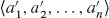
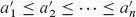

**第二部分    排序和顺序统计**

**介绍**

本部分介绍了解决以下**排序问题**的几种算法：

**输入：** 一个包含`n`个数字的序列 <`a₁`, `a₂`, … , `a[n]`>。

**输出：** 输入序列的一个排列（重新排序），使得。

输入序列通常是一个`n`元素数组，尽管它可以用其他方式表示，比如链表。

**数据的结构**

在实践中，要排序的数字很少是孤立的值。每个数字通常是称为**记录**的数据集的一部分。每个记录包含一个**键**，这是要排序的值。记录的其余部分包含**卫星数据**，通常与键一起携带。在实践中，当排序算法重新排列键时，必须同时重新排列卫星数据。如果每个记录包含大量卫星数据，通常最好重新排列记录的指针数组而不是记录本身，以最小化数据移动。

从某种意义上说，正是这些实现细节区分了一个算法和一个完整的程序。排序算法描述了确定排序顺序的`方法`，无论被排序的是单个数字还是包含许多字节卫星数据的大记录。因此，当专注于排序问题时，我们通常假设输入只包含数字。将用于排序数字的算法转换为用于排序记录的程序在概念上是直接的，尽管在特定的工程情况下，其他微妙之处可能使实际编程任务成为一项挑战。

**为什么排序？**

许多计算机科学家认为排序是算法研究中最基本的问题。有几个原因：

+   有时，应用程序固有地需要对信息进行排序。例如，为了准备客户对账单，银行需要按支票号码对支票进行排序。

+   算法通常将排序作为一个关键子程序。例如，一个`染图形对象并将其层叠在一起的程序可能需要根据“上面”关系对对象进行排序，以便可以从底部向顶部绘制这些对象。我们将在本文中看到许多使用排序作为子程序的算法。

+   我们可以从各种各样的排序算法中选择，并且它们采用丰富的技术。事实上，多年来开发的排序算法中使用了许多在算法设计中使用的重要技术。这样，排序也是一个具有历史兴趣的问题。

+   我们可以证明排序的一个非平凡下界（正如我们将在第八章中所做的那样）。由于最佳上界与下界在渐近意义上匹配，我们可以得出结论，我们某些排序算法在渐近意义上是最优的。此外，我们可以利用排序的下界来证明各种其他问题的下界。

+   在实现排序算法时会出现许多工程问题。对于特定情况的最快排序程序可能取决于许多因素，例如关于键和卫星数据的先前知识，主机计算机的内存���次结构（缓存和虚拟内存）以及软件环境。许多这些问题最好在算法级别上处理，而不是通过“微调”代码来解决。

**排序算法**  

我们在第二章介绍了两种对`n`个实数进行排序的算法。插入排序在最坏情况下需要`Θ(n²)`的时间。然而，由于其内部循环紧凑，它是一种对小输入大小快速排序的算法。此外，与归并排序不同，它是**原地**排序的，这意味着最多只有一个常数数量的输入数组元素存储在数组外部，这对于节省空间是有利的。归并排序具有更好的渐近运行时间，Θ(`n` lg `n`)，但其使用的 MERGE 过程不是原地操作。（我们将在第 26.3 节中看到归并排序的并行化版本。）

这部分介绍了另外两种对任意实数进行排序的算法。堆排序，介绍于第六章，可以在`O(n lg n)`的时间内原地对`n`个数字进行排序。它使用了一个重要的数据结构，称为堆，它还可以实现优先队列。

快速排序，在第七章中，也可以原地对`n`个数字进行排序，但其最坏情况运行时间是Θ(n²)。然而，其期望运行时间是Θ(n lg n)，通常在实践中优于堆排序。与插入排序类似，快速排序具有紧凑的代码，因此其运行时间中的隐藏常数因子很小。它是一种用于排序大型数组的流行算法。

插入排序、归并排序、堆排序和快速排序都是比较排序：它们通过比较元素来确定输入数组的排序顺序。第八章首先介绍决策树模型，以研究比较排序的性能限制。使用这个模型，我们证明了对于`n`个输入的任何比较排序的最坏情况运行时间的Ω(`n lg n`)下界，从而表明堆排序和归并排序是渐近最优的比较排序。

第八章 接着展示了如果一个算法可以通过其他方式获取输入的排序顺序信息而不是比较元素，我们可能能够打破Ω(`n` lg `n`)的下界。例如，计数排序算法假设输入数字属于集合{0, 1, … , `k`}。通过使用数组索引来确定相对顺序，计数排序可以在Θ(`k` + `n`)的时间内对`n`个数字进行排序。因此，当`k = O`(`n`)时，计数排序的运行时间与输入数组的大小成线性关系。一个相关的算法，基数排序，可以用来扩展计数排序的范围。如果有`n`个整数需要排序，每个整数有`d`位数，每个位数可以取`k`个可能的值，那么基数排序可以在Θ(`d`(`n` + `k`))的时间内对数字进行排序。当`d`是一个常数且`k`是`O`(`n`)时，基数排序的运行时间是线性的。第三个算法，桶排序，需要了解输入数组中数字的概率分布。它可以在平均情况下以`O`(`n`)的时间对半开区间 0, 1)中均匀分布的`n`个实数进行排序。

下一页的表格总结了来自[第二章和第六章–第八章的排序算法的运行时间。通常，`n`表示要排序的项目数。对于计数排序，要排序的项目是集合{0, 1, … , `k`}中的整数。对于基数排序，每个项目是一个`d`位数，其中每个位数可以取`k`个可能的值。对于桶排序，我们假设键是均匀分布在半开区间 0, 1)中的实数。最右侧的列给出了平均情况或期望运行时间，指出当与最坏情况运行时间不同时给出的情况。我们省略了堆排序的平均情况运行时间，因为我们在本书中没有对其进行分析。

| `算法` | `最坏情况运行时间` | `平均情况/期望运行时间` |  输出： |
| --- | --- | --- |
| 插入排序 | `Θ(n²)` | `Θ(n²)` |   |
| 归并排序 | Θ(`n` lg `n`) | Θ(`n` lg `n`) |   |
| `堆排序` | `O(n lg n)` | — |
| 快速排序 | `Θ(n²)` | `Θ(n lg n)` (期望) |
| 计数排序 | Θ(`k` + `n`) | Θ(`k` + `n`) |   |
| 基数排序 | `Θ(d(n + k))` | `Θ(d(n + k))` |   |
| `桶排序` | `Θ(n²)` | `Θ(n)` (平均情况) |

**顺序统计量**

一组`n`个数字的第`i`个顺序统计量是该组中第`i`小的数字。当然，你可以通过对输入进行排序并索引输出的第`i`个元素来选择第`i`个顺序统计量。在没有关于输入分布的任何假设的情况下，这种方法的运行时间为Ω(`n` lg `n`)，正如[第八章中证明的下界所示。

第九章展示了如何在`O(n)`时间内找到第`i`小的元素，即使元素是任意实数。我们提出了一个具有紧密伪代码的随机算法，其最坏情况下运行时间为Θ(n²)，但其期望运行时间为`O(n)`。我们还提供了一个更复杂的算法，其最坏情况下运行时间为`O(n)`。  

**背景**

尽管这部分大部分内容不依赖于困难的数学知识，但有些部分确实需要数学的复杂性。特别是，快速排序、桶排序和顺序统计算法的分析使用了概率，这在附录 C 中有所介绍，以及第五章中关于概率分析和随机算法的材料。
